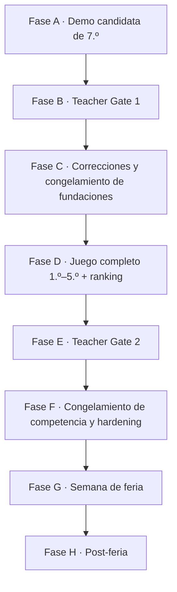

# Ciclo de entrega real

**Estado: LOCKED** para la secuencia de fases y la restricción externa; **TEACHER GATE** para lo que cada gate docente debe aprobar.

Este documento describe cómo se entrega Egresado *de verdad*, no un ciclo de producto genérico. La diferencia importa porque el ciclo real tiene una restricción que ningún proceso de documentación puede compensar: **es probable que no haya playtest con estudiantes antes de la feria**.

El [alcance y roadmap](scope-and-roadmap.md) describe qué se construye en cada capa. Este documento describe quién valida cada capa y cuándo se congela.

## Secuencia

### Fase A — Demo candidata de 7.º

Un slice jugable y pulido de 7.º grado, representativo de la arquitectura y la identidad visual finales. No es un prototipo descartable. Su alcance está en el [vertical slice de 7.º grado](../06-delivery/vertical-slice-grade-7.md).

**Audiencia:** el Departamento de Matemática.

### Fase B — Teacher Gate 1

**Completada el 1 de septiembre de 2026:** `PASSED_WITH_REQUIRED_ADJUSTMENTS`. La evidencia, acta y mapeo están en el [pack](../06-delivery/teacher-gate-1/README.md). La salida aceptó la dirección y convirtió ajustes en requisitos de las fases siguientes.

### Fase C — Congelamiento de fundaciones

**Completada:** las correcciones de autoridad y score están integradas y STAGE-07
cerró: el egreso es un estado terminal alcanzable y la recuperación converge por
construcción. STAGE-08 ya comenzó con Phase 0 de diseño de carrera; reabrir
arquitectura o identidad requiere evidencia de defecto, no preferencia.

### Fase D — Producción del juego completo

`7.º → 1.º → 2.º → 3.º → 4.º → 5.º → Egreso`, más catálogo completo de escenarios, variantes desplegadas, ranking, backend de evento, verificación autoritativa y herramientas de operación.

**Actual:** STAGE-08 sigue IN_PROGRESS; Phase 0 está DONE tras Product Audit y
conformidad técnica reconciliados, y Phase 1 —1.º real como práctica de
desarrollo `7.º → 1.º`— cerró el 11 de septiembre. El STOP se cumplió: el audit de
escalabilidad post-G1 se ejecutó el 14 de septiembre y pasó con hardening
resuelto, así que producir 2.º–5.º queda autorizado. Epílogo, carrera oficial y ranking siguen sin implementar.
Ver [etapa actual](../06-delivery/current-stage.md).

**Validación matemática de Fase D (D-S08-095).** La revisión del Departamento de
Matemática humano sobre 1.º–5.º **no se elimina: se difiere a Final Delivery /
Pre-Release Acceptance**. Hasta entonces, el gate es un Departamento de
Matemática provisional asistido por IA —pre-revisión, adjudicación independiente,
remediación, re-auditoría independiente y sign-off provisional—, que reduce riesgo
de contenido pero **no es aprobación docente** y no se presenta como tal. Cómo se
ubica esa revisión humana respecto de Teacher Gate 2 es una
[pregunta abierta](../07-reference/open-questions.md). Estado en la
[adjudicación](../04-quality/mathematics-department-ai-adjudication.md).

### Fase E — Teacher Gate 2

Revisión de aceptación del candidato completo. No es otra exploración de concepto: se revisan contenido final, progresión, comportamiento del score, duración, reglas de competencia y detalles de presentación.

### Fase F — Congelamiento de competencia y hardening

Se congelan las versiones de contenido, reglas y score. Después corren simulación, carga, red, seguridad, accesibilidad, QA móvil y ensayo operativo. Ver [modo feria y congelamiento](../05-operations/fair-mode-and-competition-freeze.md).

### Fase G — Semana de feria

Estudiantes y visitantes juegan online y compiten. La política de intentos y el criterio de ranking los define la configuración del evento, aprobada previamente por los docentes.

### Fase H — Post-feria

Decidir si el juego queda online, si el ranking del evento se archiva, si se abre un modo libre o si el producto evoluciona.

## La restricción externa

> **No hay playtest con estudiantes del rango objetivo antes de la primera release de feria.**

Esto es una restricción del contexto, no una decisión de proceso, y tiene una consecuencia que la documentación debe decir en voz alta:

**Teacher Gate ≠ validación de experiencia de usuario.** La aprobación docente reduce riesgo de contenido, matemática y tono. No es evidencia de que un chico de 12 años entienda la pantalla en diez segundos, ni de que quiera jugar una segunda run.

Cualquier documento que hable de “validado con jugadores” antes de la Fase G está describiendo una intención, no un hecho.

## Controles compensatorios

Ninguno reemplaza el playtest faltante; en conjunto reducen las clases de riesgo que sí se pueden atacar sin jugadores reales.

| Control | Qué riesgo cubre | Dónde vive |
|---|---|---|
| Revisión heurística de UX | instrucciones, carga de texto, un primario a la vez | [UX e interacción](../01-game-design/ux-interaction-design.md) |
| Prueba proxy con adultos sin asistencia verbal | dónde se pregunta “¿qué hago?” | [los gates docentes](../06-delivery/teacher-gates.md) |
| Simulación determinista masiva | callejones sin salida, scores imposibles, deriva de replay | [estrategia de testing](../04-quality/testing-strategy.md) |
| Validación de variantes e invariantes | variantes ambiguas, imposibles o triviales | [validación y auditoría de variantes](../04-quality/variant-validation-and-audit.md) |
| Auditoría de equidad competitiva | dominancia, sesgo de velocidad, sesgo de volumen | [auditoría de equidad competitiva](../04-quality/competition-fairness-audit.md) |
| Accesibilidad automatizada y manual | barreras de interacción predecibles | [accesibilidad del sistema de diseño](../09-design-system/accessibility.md) |
| QA móvil en 360/390/430 px | layout y legibilidad reales | [NFR](../04-quality/non-functional-requirements.md) |
| Telemetría lista el día uno | la feria es la primera exposición real | [analytics y observabilidad](../03-architecture/analytics-observability.md) |
| Disciplina de congelamiento | reaccionar a una anécdota cambiando reglas en vivo | [modo feria y congelamiento](../05-operations/fair-mode-and-competition-freeze.md) |

## Riesgo residual declarado

El proyecto acepta explícitamente que la diversión, la velocidad de comprensión y la distribución real de dificultad quedan inciertas hasta la feria. Las métricas de la Fase G son la primera evidencia real de uso y **no deben presentarse retroactivamente como validación previa**. Ver [métricas de éxito](success-metrics.md).
