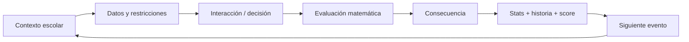
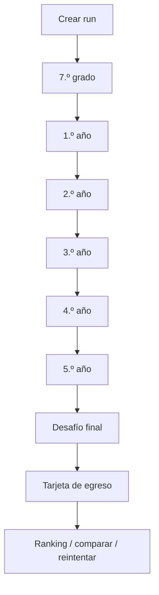

# Game Design Document — Egresado

## 1. Concepto

Egresado es un **run-based narrative math game** para navegador. Cada run comprime seis etapas escolares, desde 7.º grado hasta 5.º año. El jugador resuelve problemas cotidianos mediante interacciones variadas y sus resultados modifican estadísticas, oportunidades narrativas, score y perfil de egreso.

La progresión narrativa aceptada para STAGE-08 es adaptación → consolidación →
pertenencia/identidad → autonomía → responsabilidad → cierre/futuro. Su detalle y
madurez están en la
[envolvente de diseño de carrera](stage-08-product-design-envelope.md).

## 2. Género

- Juego de decisiones.
- Simulación de carrera/vida comprimida.
- Puzzle matemático contextual.
- Narrativa procedural/storylet.
- Score attack asíncrono.

## 3. Fantasía del jugador

“Quiero descubrir cómo sería mi recorrido escolar si cada decisión importante dependiera de cómo interpreto información, administro recursos y razono con números.”

## 4. Core loop

## 5. Meta loop

## 6. Duración objetivo

- Onboarding: <30 s.
- Evento normal: 15–35 s.
- Minijuego especial: 20–60 s.
- Run completa: objetivo UX aproximado de 8–10 min (TG1-12), sin timeout.

## 7. Estructura sugerida por run

- 7.º: 1–2 beats ordinarios.
- 1.º: 1–2 beats ordinarios.
- 2.º: 1–2 beats ordinarios.
- 3.º: 1–2 beats ordinarios.
- 4.º: 1–2 beats ordinarios.
- 5.º: 1–2 beats ordinarios.
- Final: 1 evento combinado.

Con seis etapas, el rango teórico es 6–12 beats ordinarios. STAGE-08 debe medirlo contra el target de 8–10 minutos; no se congela una cantidad final todavía.

## 8. Estadísticas de carrera

Cuatro dimensiones visibles. Nada más es permanente: energía, plata y similares pueden existir como **recursos locales** dentro de un minijuego, nunca como estadística de carrera. Ver [ADR-016](../03-architecture/adr/ADR-016-career-player-model.md).

### Visibles

| | Tipo | Rango | Cambia cuando |
|---|---|---|---|
| **Promedio** | nota | 1,0–10,0 · un decimal | el evento es **genuinamente académico** |
| **Equipo** | colaboración | 0–100 | está en juego la conducta hacia el grupo |
| **Aura** | reputación | con signo, sin techo | el momento es **socialmente memorable** |
| **Estilo** | ternario | Aplicado / Estratega / Improvisador, suman 100 | casi toda decisión lo empuja un poco |

Tres reglas que definen el modelo tanto como los nombres:

- **`null` no es 0.** Una dimensión que la run no tocó todavía no tiene valor, y no se dibuja. Aparecen de a una, la primera vez que algo las mueve.
- **Promedio se deriva de notas reales**, no se acumula como un contador. Una decisión de colectivo ejercita matemática pero no es académica: no lo mueve.
- **Ningún eje de Estilo es el malo.** Un Improvisador tiene que poder egresar.

### Derivadas/ocultas
- Eficiencia.
- Riesgo asumido.
- Precisión.
- Uso de información.
- Dominio por categoría matemática.
- Flags e historia narrativa.

Las visibles generan narrativa; las ocultas alimentan scoring, dificultad adaptativa, perfiles y analítica. **Ninguna oculta se renderiza**, y que exista en el estado no es motivo para mostrarla.

## 9. Filosofía de error

No hay game over por una respuesta incorrecta. El error produce una consecuencia y la run continúa.

### Feedback malo
“Incorrecto. La respuesta era B.”

### Feedback objetivo
“Compraste 1 L. La pared necesita 14,4 m² de cobertura y 1 L cubre 8 m². Faltaron 6,4 m²; el equipo tuvo que volver a comprar.”

## 10. Niveles de resolución

Una decisión puede ser:

- **Inválida:** no cumple una restricción esencial.
- **Funcional:** resuelve el problema.
- **Eficiente:** resuelve con buen uso de recursos.
- **Óptima:** mejor solución según la función de evaluación declarada.

No todos los desafíos necesitan las cuatro categorías.

## 11. Tono

**Realista exagerado + épico-paródico.**

La situación es reconocible, pero se presenta con dramatización gamer:

- “SEMANA DE EXÁMENES — Evento legendario”.
- “La impresora eligió la violencia”.
- “FINAL_FINAL_AHORA_SI_3.pptx”.

El humor nunca debe ridiculizar a un estudiante por fallar.

## 12. Rejugabilidad

- Seeds diferentes.
- Composición diferente desde un catálogo de Templates.
- Variantes aprobadas, no sólo números cambiados.
- Eventos condicionales.
- Eventos raros deterministas con oportunidad competitiva normalizada.
- Callbacks entre años.
- Perfiles de egreso.
- Logros.
- Ranking por evento.
- Seed diaria/feria compartida.

Objetivo aceptado: las primeras tres runs deben sentirse perceptiblemente
diferentes. Ver [matriz de carrera](full-career-content-matrix.md) y
[eventos raros y Prestige](rare-events-and-prestige.md).

## 13. Modos previstos

### Carrera estándar
Seed individual; máxima variedad.

### Desafío de la feria
Mismo ruleset y pool controlado para todos. Puede usar seed común o set precomputado.

### Daily challenge — futuro
Condiciones compartidas por día.

### Práctica — futuro
Sin ranking; selecciona categoría matemática.

## 14. Herramientas permitidas

Según desafío:
- calculadora;
- anotador;
- tabla;
- regla/escala;
- “pedir más datos”.

Usar una herramienta no debe penalizar automáticamente. La competencia deseada es resolución de problemas, no cálculo mental puro.

## 15. Jefes/eventos especiales

Un año puede culminar con un desafío combinado: viaje, feria, proyecto grupal, torneo o examen especial. Estos eventos reutilizan las mecánicas ya aprendidas y aumentan tensión sin introducir reglas completamente nuevas.

## 16. Final de run

STAGE-08 requiere un Career Epilogue v1 narrativo que sintetice trayectoria,
Estilo, previas, flags e Hitos sin reducir al jugador a un único tipo. La tarjeta
final puede contener:
- nickname;
- promoción/año del evento;
- score;
- perfil de egreso;
- stats principales;
- mayor logro;
- decisión más arriesgada o memorable;
- posición en ranking si aplica;
- CTA “Jugar otra vez”.

## 17. Perfiles iniciales

- El Estratega.
- El Improvisador.
- El Científico.
- El Líder.
- El Emprendedor.
- El Competidor.
- El Equilibrado.
- El Superviviente.

La asignación debe ser determinista a partir de métricas, con desempate documentado.

## 18. Anti-patrones

No introducir:
- trivia matemática desconectada de la ficción;
- largos bloques de texto;
- tutorial obligatorio de varios minutos;
- castigo que cierre la run por un error;
- score basado sólo en velocidad;
- estética infantilizada;
- decisiones falsas donde un número visible no afecta nada;
- historias que equiparen desempeño matemático con valor personal.
