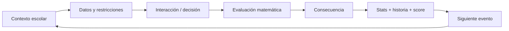
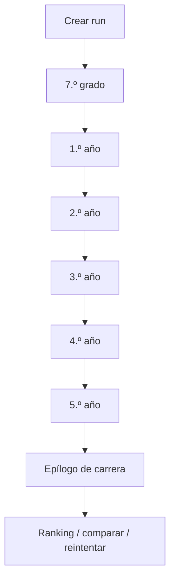

# Game Design Document — Egresado

## 1. Concepto

Egresado es un **run-based narrative math game** para navegador. Cada run comprime seis etapas escolares, desde 7.º grado hasta 5.º año. El jugador resuelve problemas cotidianos mediante interacciones variadas y sus resultados modifican estadísticas, oportunidades narrativas, score y perfil de egreso.

La progresión narrativa aceptada para STAGE-08 es adaptación → consolidación →
pertenencia/identidad → autonomía → responsabilidad → cierre/futuro. Su detalle y
madurez están en la
[envolvente de diseño de carrera](stage-08-product-design-envelope.md).

Los cinco pases de 1.º–5.º están `DESIGN-CANDIDATE-APPROVED` en la
[matriz v0.3](full-career-content-matrix.md). Sus
[políticas de composición](full-career-content-matrix.md#políticas-de-composición)
fijan máximo una Template puntuable por cluster Intercurso/School Event/Egreso,
arcos recurrentes sin desafío obligatorio, target 1–2 del Proyecto con máximo 2
`LOCKED` y diversidad cognitiva soft. Son diseño de producto: 1.º ya corre desde
STAGE-08 / Phase 1 y 2.º–5.º siguen pendientes de implementación. El
[sistema narrativo](narrative-system.md) gobierna callbacks
independientes, externalidad de 4.º, convergencia de 5.º y selección de hechos
significativos del cierre. Product Audit y conformidad técnica están integrados:
[Phase 0 y Phase 1 DONE; audit post-G1 READY](../06-delivery/current-stage.md).
El runtime es la baseline de 7.º más la práctica de desarrollo `7.º → 1.º`, no la
carrera completa.

## 2. Género

- Juego de decisiones.
- Simulación de carrera/vida comprimida.
- Puzzle matemático contextual.
- Narrativa procedural/storylet.
- Score attack asíncrono.

## 3. Fantasía del jugador

“Quiero descubrir cómo sería mi recorrido escolar si cada decisión importante dependiera de cómo interpreto información, administro recursos y razono con números.”

## 4. Core loop

## 5. Meta loop

## 6. Duración objetivo

Onboarding breve y controles enseñados en un paso antes de cada motor nuevo.
La envolvente QUICK/MEDIUM/DEEP y el target p50 8–10 min, p75 ≤12 min viven en
la [matriz](full-career-content-matrix.md). Son objetivos UX por medir sobre
carrera real, sin timeout ni bonus/desempate por velocidad. Ante exceso de tiempo,
reducir primero texto, pasos UI y fricción no matemática.

## 7. Estructura v1 por run

Normal/Fair: exactamente nueve beats ordinarios distribuidos entre seis etapas:
un anchor por etapa y tres secundarios. El cierre de 5.º ocurre dentro de ese
presupuesto; epílogo y Repaso no agregan ordinarios. El motor genérico admite
carreras parciales y el rango estructural 6–12; no es el target de producto v1.
Teacher Demo sigue siendo un recorrido separado orientado a mostrar amplitud.

## 8. Estadísticas de carrera

Cuatro dimensiones visibles. Nada más es permanente: energía, plata y similares pueden existir como **recursos locales** dentro de un minijuego, nunca como estadística de carrera. Ver [ADR-016](../03-architecture/adr/ADR-016-career-player-model.md).

### Visibles

| | Tipo | Rango | Cambia cuando |
|---|---|---|---|
| **Promedio** | nota | 1,0–10,0 · un decimal | el evento es **genuinamente académico** |
| **Equipo** | colaboración | 0–100 | está en juego la conducta hacia el grupo |
| **Aura** | reputación | con signo, sin techo | el momento es **socialmente memorable** |
| **Estilo** | ternario | Aplicado / Estratega / Improvisador, suman 100 | evidencia estratégica significativa, no calidad Math por sí sola |

Tres reglas que definen el modelo tanto como los nombres:

- **`null` no es 0.** Una dimensión que la run no tocó todavía no tiene valor, y no se dibuja. Aparecen de a una, la primera vez que algo las mueve.
- **Promedio se deriva de notas reales**, no se acumula como un contador. Una decisión de colectivo ejercita matemática pero no es académica: no lo mueve.
- **Ningún eje de Estilo es el malo.** Un Improvisador tiene que poder egresar.

### Derivadas/ocultas
- Eficiencia.
- Riesgo asumido.
- Precisión.
- Uso de información.
- Dominio por categoría matemática.
- Flags e historia narrativa.

Las visibles generan narrativa. Cada uso de evidencia oculta requiere contrato:
no modifica el plan/dificultad fija de Fair ni permite puntuar Estilo indirectamente. **Ninguna oculta se renderiza**, y que exista en el estado no es motivo para mostrarla.

## 9. Filosofía de error

No hay game over por una respuesta incorrecta. El error produce una consecuencia y la run continúa.

### Feedback malo
“Incorrecto. La respuesta era B.”

### Feedback objetivo
“Compraste 1 L. La pared necesita 14,4 m² de cobertura y 1 L cubre 8 m². Faltaron 6,4 m²; el equipo tuvo que volver a comprar.”

## 10. Niveles de resolución

Una decisión puede ser:

- **Inválida:** no cumple una restricción esencial.
- **Funcional:** resultado usable que puede sacrificar un objetivo no esencial explícito.
- **Eficiente:** resuelve con buen uso de recursos.
- **Óptima:** mejor solución según la función de evaluación declarada.

No todos los desafíos necesitan las cuatro categorías.

## 11. Tono

**Realista exagerado + épico-paródico.**

La situación es reconocible, pero se presenta con dramatización gamer:

- “SEMANA DE EXÁMENES — Evento legendario”.
- “La impresora eligió la violencia”.
- “FINAL_FINAL_AHORA_SI_3.pptx”.

El humor nunca debe ridiculizar a un estudiante por fallar.

## 12. Rejugabilidad

- Seeds diferentes.
- Composición diferente desde un catálogo de Templates.
- Variantes aprobadas, no sólo números cambiados.
- Eventos condicionales.
- Eventos raros deterministas con oportunidad competitiva normalizada.
- Callbacks entre años.
- Perfiles de egreso.
- Logros.
- Ranking por evento.
- Seed diaria/feria compartida.

Objetivo de Practice: las primeras tres runs deben sentirse perceptiblemente
diferentes. En Fair se repite la misma Competition Seed emitida por servidor,
incluidas variantes y rareza; esa igualdad de oportunidades es intencional. Ver [matriz de carrera](full-career-content-matrix.md) y
[eventos raros y Prestige](rare-events-and-prestige.md).

## 13. Modos previstos

### Carrera estándar / Practice

Seed individual y variedad procedural aprobada; sin envío al ranking oficial.

### Desafío de la feria / Fair v1

Una Competition Seed compartida por edición, emitida por servidor; mismo plan,
variantes, dificultad y oportunidades para todos. Intentos ilimitados y mejor
resultado verificado. [Contrato de producto](../05-operations/fair-mode-and-competition-freeze.md);
servidor/ranking aún no implementados.

### Extensiones diferidas

Daily challenge, packs de seeds y práctica por categoría no son requisitos de v1.

## 14. Herramientas permitidas

Según desafío:
- calculadora;
- anotador;
- tabla;
- regla/escala;
- “pedir más datos”.

Usar una herramienta no debe penalizar automáticamente. La competencia deseada es resolución de problemas, no cálculo mental puro.

## 15. Jefes/eventos especiales

Un año puede culminar con un desafío combinado: viaje, feria, proyecto grupal, torneo o examen especial. Estos eventos reutilizan las mecánicas ya aprendidas y aumentan tensión sin introducir reglas completamente nuevas.

## 16. Final de run

[Career Epilogue v1](narrative-system.md#quinto-año-y-career-epilogue-v1) cierra con EGRESASTE,
perfil narrativo autorado, 3–5 recuerdos, estadísticas, Hitos/Prestige y resultado
según modo. No vuelca history ni depende de un LLM runtime. Style y reconocimientos
display-only no conceden Prestige.

## 17. Perfil narrativo

Síntesis determinista de hechos y decisiones, no diagnóstico ni un tipo único que
reduzca al jugador. La política de saliencia y el copy del epílogo tienen una sola
autoridad en el sistema narrativo; no se infiere personalidad de velocidad o errores.

Como baseline histórica, el slice actual conserva El Estratega, El Improvisador,
El Científico, El Líder, El Emprendedor, El Competidor, El Equilibrado y El
Superviviente. Esta reconciliación no cambia su algoritmo ni la pantalla; el
epílogo de carrera completa debe implementar el contrato narrativo anterior.

## 18. Anti-patrones

No introducir:
- trivia matemática desconectada de la ficción;
- largos bloques de texto;
- tutorial obligatorio de varios minutos;
- castigo que cierre la run por un error;
- score o ranking basado en velocidad;
- estética infantilizada;
- decisiones falsas donde un número visible no afecta nada;
- historias que equiparen desempeño matemático con valor personal.
