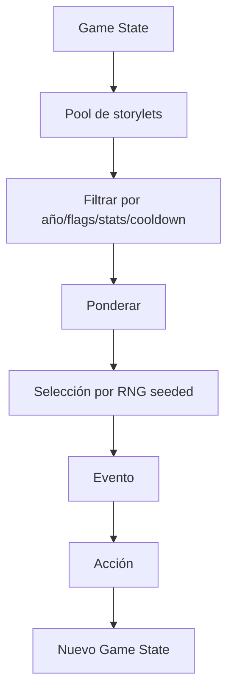

# Sistema narrativo

## Objetivo

Crear la sensación de una carrera escolar coherente sin construir un árbol exponencial de ramas.

## Modelo: storylets condicionados

Cada evento narrativo declara:
- condiciones de elegibilidad;
- peso base;
- cooldown;
- etapa escolar;
- tags temáticos;
- flags requeridos/prohibidos;
- efectos;
- posibles follow-ups.

El motor filtra storylets incompatibles y selecciona entre los restantes mediante pesos deterministas derivados del seed.

## Estado narrativo mínimo

- `school_year`.
- stats visibles.
- tags de afinidad.
- flags de decisiones importantes.
- historial corto de eventos para evitar repetición.
- logros.

## Tipos de storylet

### One-shot
Evento autocontenido.

### Callback
Recupera una decisión previa: un compañero vuelve a aparecer, una actividad abre otra oportunidad, etc.

### Mini-arco
2–4 eventos relacionados distribuidos en años.

### Evento sistémico
Se activa por thresholds sobre una dimensión de carrera: Equipo muy bajo, Promedio bajo, Aura alta. Una dimensión todavía sin establecer **no satisface un umbral en ninguna dirección** — «sin evidencia» no es «poco».

### Evento final
Resume o consume flags acumulados.

## Reglas de coherencia

- Un callback debe tener causa rastreable.
- No presentar como consecuencia algo que el sistema no puede justificar.
- Evitar que eventos aleatorios contradigan flags duros.
- Permitir cierta ambigüedad narrativa, pero no inconsistencia lógica.

## Línea de carrera sugerida

### 7.º grado — Adaptación
Temas: dinero simple, horarios, primeras responsabilidades, colaboración.

### 1.º — Organización
Temas: múltiples materias, estudio, porcentajes, tiempos.

### 2.º — Vida escolar ampliada
Temas: actividades, proyectos, presupuestos, proporciones.

### 3.º — Decisiones colectivas
Temas: viaje, recaudación, asignación, optimización.

### 4.º — Datos e incertidumbre
Temas: encuestas, campañas, funciones, riesgo.

### 5.º — Integración
Temas: proyecto final, feria, orientación, decisiones multivariable.

## Humor

El humor nace de reconocer situaciones escolares:
- nombres de archivos absurdos;
- impresora que falla;
- compañero que desaparece;
- colectivo demorado;
- presentación preparada a último momento.

No usar:
- bullying como punchline;
- humillación por notas;
- estereotipos discriminatorios;
- docentes reales identificables.

## Regla narrativa-matemática

Cada storylet matemático debe responder:

1. ¿Qué quiere lograr el personaje?
2. ¿Qué información cuantitativa necesita?
3. ¿Qué restricción hace que la elección importe?
4. ¿Cómo se ve la consecuencia?
5. ¿Qué cambia en la carrera?
