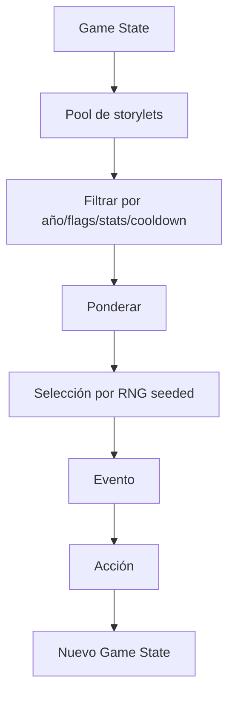

# Sistema narrativo

- **Sistema actual de storylets:** implementado para 7.º
- **Sistema narrativo de carrera STAGE-08:** `ACCEPTED · NOT IMPLEMENTED`

## Objetivo

Crear una carrera escolar coherente donde el razonamiento cuantitativo cambia
decisiones reales, sin construir un árbol exponencial ni presentar 25 ejercicios
unidos por prosa decorativa. La dirección combina vida escolar, relaciones
recurrentes, identidad argentina, consecuencias y memoria.

## Modelo: storylets condicionados

Cada evento narrativo declara:
- condiciones de elegibilidad;
- peso base;
- cooldown;
- etapa escolar;
- tags temáticos;
- flags requeridos/prohibidos;
- efectos;
- posibles follow-ups.

El motor filtra storylets incompatibles y selecciona entre los restantes mediante pesos deterministas derivados del seed.



## Estado narrativo mínimo

- `school_year`.
- stats visibles.
- tags de afinidad.
- flags de decisiones importantes.
- historial corto de eventos para evitar repetición.
- logros.

## Tipos de storylet

### One-shot
Evento autocontenido.

### Callback
Recupera una decisión previa: un compañero vuelve a aparecer, una actividad abre otra oportunidad, etc.

### Mini-arco
2–4 eventos relacionados distribuidos en años.

### Evento sistémico
Se activa por thresholds sobre una dimensión de carrera: Equipo muy bajo, Promedio bajo, Aura alta. Una dimensión todavía sin establecer **no satisface un umbral en ninguna dirección** — «sin evidencia» no es «poco».

### Evento final
Resume o consume flags acumulados.

## Reglas de coherencia

- Un callback debe tener causa rastreable.
- No presentar como consecuencia algo que el sistema no puede justificar.
- Evitar que eventos aleatorios contradigan flags duros.
- Permitir cierta ambigüedad narrativa, pero no inconsistencia lógica.

## Espina de carrera — `LOCKED`

| Etapa | Función narrativa |
|---|---|
| 7.º | **Adaptación:** la institución y sus códigos todavía son nuevos; aparecen las primeras personas y responsabilidades. |
| 1.º | **Consolidación:** en la misma escuela, la rutina y los vínculos se estabilizan y el jugador descubre su Estilo. |
| 2.º | **Pertenencia / identidad:** grupos, cooperación, competencia y reputación pesan más. |
| 3.º | **Autonomía:** planificación independiente de tiempo, recursos, tecnología y movilidad; más trade-offs válidos. |
| 4.º | **Responsabilidad:** coordinación, liderazgo y consecuencias públicas sobre otras personas. |
| 5.º | **Cierre / futuro:** mayor densidad de callbacks, proyecto/eventos finales, egreso y proyección sin test vocacional. |

7.º y 1.º ocurren en la misma escuela. Describir 1.º como una segunda adaptación
a una institución nueva quedó supersedido por esta decisión.

## Elenco relacional — `ACCEPTED`

El elenco persiste por relaciones, sin nombres obligatorios:

- **Tu mejor amigo / amigo de toda la vida:** continuidad personal, consecuencias de Equipo, Día del Amigo y callbacks finales.
- **La persona que organiza todo:** Proyecto del Curso, presión de planificación y memoria de si el jugador ayudó, controló o desapareció.
- **El compañero competitivo:** intercurso, tabla, presión social y oportunidades de Aura; no es villano por defecto.
- **La profe de Matemática:** aparición moderada y natural; nunca dispensadora genérica de ejercicios.
- **El preceptor:** contexto, transiciones, consecuencias, humor e identidad escolar argentina.

Se usa nombre propio sólo para desambiguar o mejorar una escena concreta. Los
incidentales no necesitan entrar al elenco recurrente.

## Identidad del jugador y la escuela

La base es un nickname opcional equivalente a “¿Cómo te dicen?”, sin género
obligatorio ni creador complejo. Un avatar/configuración liviana queda como stretch.

La escuela permanece anónima en core para que el jugador proyecte la propia. Una
marca ficticia con guiños paródicos a la institución anfitriona también es stretch;
la lógica del producto nunca se acopla a una escuela real.

## Voz argentina — `LOCKED DIRECTION`

La identidad escolar argentina puede ser fuerte: previa, preceptor, colectivo,
kiosco, acto, intercurso, viaje de egresados, hacer una vaquita, zafar, llegar
raspando o ponerse las pilas. La jerga lleva tono y humor; comprender la decisión
matemática nunca depende de conocerla.

## Humor

El tono es vida escolar realista, humor frecuente y absurdo ocasional. El humor
nace de reconocer situaciones escolares:

- nombres de archivos absurdos;
- impresora que falla;
- compañero que desaparece;
- colectivo demorado;
- presentación preparada a último momento.

No usar:

- bullying como punchline;
- humillación por notas;
- estereotipos discriminatorios;
- docentes reales identificables.

No toda línea necesita un chiste y la matemática debe seguir siendo creíble.
Romance no es sistema ni pilar; sólo admite referencias sutiles opcionales. Los
conflictos pueden tratar reparto, responsabilidad, puntualidad, liderazgo y
reputación, nunca violencia, sexualización o dilemas adultos.

## Modelo temporal y eventos emblemáticos

Cada año se percibe como inicio → desarrollo → momentos emblemáticos → cierre, sin
simular un calendario completo. Fechas como 25 de Mayo, Día del Estudiante, Día
del Amigo, vacaciones, intercurso y egreso pueden ser anchors o storylets; no todas
consumen un beat.

| Año | Evento emblemático candidato |
|---|---|
| 7.º | 25 de Mayo |
| 1.º | Día del Estudiante |
| 2.º | Intercurso |
| 3.º | Día del Amigo / vacaciones de invierno |
| 4.º | Feria, peña o evento solidario escolar |
| 5.º | Viaje o evento final + egreso |

El detalle puede cambiar en cada Template Design Pass sin borrar la identidad
diferenciada del año.

## Proyecto del Curso — línea recurrente `LOCKED`

Es la única gran línea de proyecto que recorre 1.º–5.º: exposición, encuesta,
proyecto tecnológico, recaudación/evento y proyecto final. Refuerza continuidad y
permite callbacks del elenco.

Su presencia es narrativa; la Template matemática no es obligatoria en toda run.
Cuando el compositor no la selecciona, un storylet breve puede mencionarla. Esto
evita que una línea recurrente se convierta en contenido fijo repetitivo.

## Modelo braided-linear y callbacks

La intensidad aceptada es media:

```text
historia / flags / Carrera
→ contexto y storylets
→ a veces opciones limitadas
```

Puede cambiar texto, quién se acerca, framing, algunas opciones, elegibilidad de
eventos raros y lectura del epílogo. No crea un grafo combinatorio ni bonificaciones
matemáticas invisibles.

Ejemplos: Equipo alto puede generar confianza posterior; Estilo puede cambiar una
opción de contingencia; una previa puede reaparecer en humor o síntesis final. La
historia del colectivo de 7.º puede alterar el copy del ensayo de 1.º sin volver
la cuenta más fácil.

## Quinto año y Career Epilogue v1

5.º concentra callbacks en proyecto final, viaje/evento, anuario y egreso, pero
sin multiplicar ramas. El epílogo v1 es requerido dentro de STAGE-08 y sintetiza
Estilo, Promedio, Equipo, Aura, previas/recuperaciones, flags y Hitos.

No termina sólo en una tabla ni asigna una personalidad total. Debe contar “cómo
atravesaste la escuela”, con resumen narrativo, recorrido y estadísticas.

## Career Milestones

STAGE-08 diseña familias académicas, sociales, de Estilo, comeback/recuperación y
eventos raros. Un Hito puede ser display-only, Prestige-eligible o badge raro. La
elegibilidad competitiva depende de evidencia independiente y del
[modelo de Prestige](rare-events-and-prestige.md); nunca se presume.

## Regla narrativa-matemática

Cada storylet matemático debe responder:

1. ¿Qué quiere lograr el personaje?
2. ¿Qué información cuantitativa necesita?
3. ¿Qué restricción hace que la elección importe?
4. ¿Cómo se ve la consecuencia?
5. ¿Qué cambia en la carrera?

## Condiciones declarativas, no código en el contenido

Las condiciones de un storylet se expresan como datos versionados, no como JavaScript ejecutable dentro del contenido. Eso es lo que permite validarlas, reproducirlas en el servidor durante un replay y autorarlas sin riesgo.

## Callbacks de fail-forward

Un mal resultado puede **crear** contenido, no quitarlo. La infraestructura, el historial de recuperación y el primer contenido real de 7.º ya están implementados: el repaso cierra el año y una resolución baja deja una `previa` como historia oculta, nunca como quinta stat ni bloqueo de egreso.

Los callbacks ricos entre años todavía no existen. La dirección de STAGE-08 ya
acepta que previas y otros rastros reaparezcan en copy, contexto, Hitos y epílogo,
pero cada caso debe justificar su causa con contenido real. No se convierten en
deuda mecánica futura ni en una quinta stat. Ver
[egreso y fail-forward](graduation-and-fail-forward.md), la
[envolvente de Phase 0](stage-08-product-design-envelope.md) y la
[etapa actual](../06-delivery/current-stage.md).

Los branches especiales tienen que ser escasos: si se disparan todo el tiempo, dejan de tener peso narrativo.
