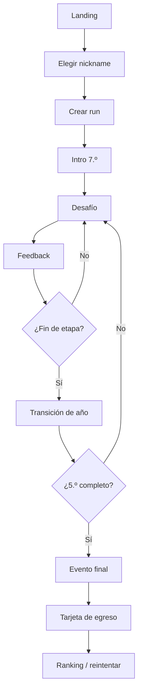

# Flujos de usuario

## UF-01 Primera run

## UF-02 Resolución de desafío

1. Mostrar contexto y datos.
2. Jugador inspecciona herramientas si existen.
3. Jugador realiza interacción.
4. Validar forma del input localmente.
5. Confirmar.
6. Motor evalúa.
7. Mostrar consecuencia.
8. Actualizar stats/score provisional.
9. Registrar acción/checkpoint.
10. Continuar.

## UF-03 Refresh accidental

1. App carga.
2. Detecta checkpoint activo.
3. Verifica compatibilidad de versiones.
4. Ofrece “Continuar partida” o “Empezar de nuevo”.
5. Rehidrata estado y RNG.

## UF-04 Fin de run online

1. Cliente envía acciones al endpoint de finish.
2. Servidor valida run abierta.
3. Reproduce acciones.
4. Calcula score oficial/perfil.
5. Persiste resultado.
6. Devuelve tarjeta oficial y posición aproximada.
7. Cliente borra checkpoint activo.

## UF-05 Error al finalizar

1. Cliente conserva acciones localmente.
2. Marca run como `pending_sync`.
3. Muestra resultado local no oficial.
4. Reintenta con backoff mientras la sesión esté activa.
5. Al reconectar, servidor valida.
6. Actualiza ranking.

## UF-06 Ranking de feria

1. Usuario abre `/event/{slug}/leaderboard`.
2. Obtiene top N y estadísticas agregadas.
3. Polling periódico inicialmente.
4. Si se habilita Realtime, actualiza por broadcast.

## UF-07 Nickname rechazado

1. Usuario escribe nickname.
2. Validación local de formato.
3. Backend aplica política/moderación.
4. Si falla, devolver error neutral y permitir corregir.
