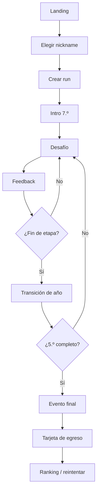

# Flujos de usuario

## UF-01 Primera run

En competencia, la identificación vigente de ADR-026 termina con **Aceptar y
jugar**, sin checkbox. El micro-copy asociado enlaza `/privacidad` en otra pestaña
para revisar el aviso v1 sin perder campos ni enviar datos. El formulario válido
envía la versión y el reconocimiento afirmativo; leer o navegar no los envía
([ADR-030](../03-architecture/adr/ADR-030-privacy-page-and-action-acknowledgement.md)).
`/test` continúa sin identificación competitiva.



## UF-02 Resolución de desafío

1. Mostrar contexto y datos.
2. Jugador inspecciona herramientas si existen.
3. Jugador realiza interacción.
4. Validar forma del input localmente.
5. Confirmar.
6. Motor evalúa.
7. Mostrar consecuencia.
8. Actualizar stats/score provisional.
9. Registrar acción/checkpoint.
10. Continuar.

## UF-03 Refresh accidental

1. App carga.
2. Detecta checkpoint activo.
3. Verifica compatibilidad de versiones.
4. Ofrece “Continuar partida” o “Empezar de nuevo”.
5. Rehidrata estado y RNG.

## UF-04 Fin de run online

1. Cliente envía acciones al endpoint de finish.
2. Servidor valida run abierta.
3. Reproduce acciones.
4. Calcula score oficial/perfil.
5. Persiste resultado.
6. Devuelve tarjeta oficial y posición aproximada.
7. Cliente borra checkpoint activo.

## UF-05 Error al finalizar

1. Cliente conserva acciones localmente.
2. Marca run como `pending_sync`.
3. Muestra resultado local no oficial.
4. Reintenta con backoff mientras la sesión esté activa.
5. Al reconectar, servidor valida.
6. Actualiza ranking.

## UF-06 Ranking de feria

1. Usuario abre `/event/{slug}/leaderboard`.
2. Obtiene top N y estadísticas agregadas.
3. Polling periódico inicialmente.
4. Si se habilita Realtime, actualiza por broadcast.

## UF-07 Nickname rechazado

1. Usuario escribe nickname.
2. Validación local de formato.
3. Backend aplica política/moderación.
4. Si falla, devolver error neutral y permitir corregir.

## Flujo objetivo de feria oficial

**No implementado.** Es la forma que toma el flujo cuando existan evento, ranking y verificación en servidor.

```text
QR / URL
→ landing del evento
→ nickname / token de participante
→ pedir run oficial
→ el servidor emite el descriptor
→ juego local-first
→ egreso
→ resumen final
→ enviar action log
→ estado pendiente de verificación si hace falta
→ score verificado por el servidor
→ personal best y ranking
→ jugar de nuevo
```

Si no se pudo emitir una run autoritativa antes de empezar, la aplicación ofrece juego libre no oficial en vez de convertir en silencio una run no verificable en candidata a premio.

## Interrupción de red durante una run emitida

```text
se pierde la red
→ seguir jugando local si los datos de variante ya están disponibles
→ terminar
→ envío pendiente
→ reintento idempotente
→ verificado cuando vuelve la conectividad
```

Es el local-first de [ADR-006](../03-architecture/adr/ADR-006-local-first-gameplay.md) con la autoridad de [ADR-004](../03-architecture/adr/ADR-004-server-authoritative-scoring.md).

## Flujo de recuperación

```text
resultado académico insuficiente
→ consecuencia
→ flag o evento de recuperación
→ desafío o storylet de recuperación comprimido
→ etapa siguiente
```

Sin bucle que obligue a rejugar el mismo año. Ver [egreso, recuperación y fail-forward](../01-game-design/graduation-and-fail-forward.md).
