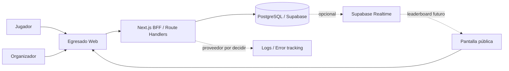
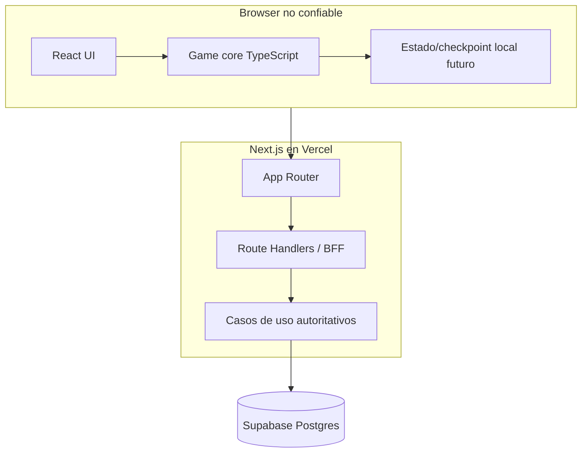
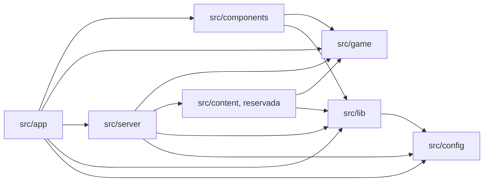

# Arquitectura general

## Estado y estilo

Egresado adopta un **monolito modular web + Backend for Frontend (BFF)** en una única aplicación Next.js ubicada en la raíz del repositorio. El motor de juego es una frontera de TypeScript puro dentro de esa aplicación, no un paquete publicable ni un servicio separado.

La base técnica actual implementa el shell, los límites de módulos, la validación de entorno, los adaptadores iniciales de Supabase y los gates de calidad. Todavía no implementa reglas de juego, autenticación, tablas de producto ni contratos online de runs. Esas capacidades deben respetar las decisiones y preguntas abiertas existentes cuando se incorporen.

## Stack baseline implementado

- Node.js 24 LTS y pnpm como toolchain reproducible según [ADR-010](adr/ADR-010-reproducible-node-pnpm-container-toolchain.md).
- Next.js 16 / App Router, React y TypeScript estricto.
- Tailwind CSS para estilos.
- Zod para validación de configuración y, cuando corresponda, límites de entrada.
- PostgreSQL gestionado por Supabase como persistencia aceptada; la integración es opcional en la base actual.
- Vercel como topología canónica de producción.
- Vitest, Testing Library, fast-check y Playwright para la base automatizada.

Las versiones exactas están fijadas en `package.json` y `pnpm-lock.yaml`. No se incorpora Zustand ni una plataforma de observabilidad hasta que una necesidad implementada lo justifique. El release público permanece bloqueado mientras Next.js sea `16.3.1`: `pnpm release:check` exige `>=16.3.2` antes de publicar.

## Diagrama de contexto objetivo

El diagrama conserva la topología aceptada, pero no implica que observabilidad externa, Realtime, ranking o persistencia de runs estén implementados en la base técnica.

## Contenedores y ejecución objetivo

El juego activo se ejecutará localmente para minimizar latencia y dependencia de red. Para runs oficiales, el servidor deberá crear la configuración, validar la finalización, reproducir acciones con el motor versionado, calcular el resultado oficial y persistirlo. El browser sólo previsualiza; no es autoridad de score ni de estado final.

## Fronteras de módulos

La dirección de dependencias implementada se controla con ESLint y un `tsconfig` separado para el core:

- `src/app`: composición, layouts, páginas y entrada HTTP. Puede invocar casos de uso de servidor, pero no importar persistencia directamente.
- `src/components`: UI. Puede consumir `game` y utilidades de `lib`; no accede a servidor, configuración secreta ni Supabase directamente.
- `src/game`: core TypeScript puro y determinista. En dependencias internas sólo puede importar `game`; no usa React, Next.js, DOM, red, DB, almacenamiento del browser, hora global ni `Math.random()`.
- `src/content`: frontera reservada para contenido como datos sobre interacciones existentes. Se crea cuando exista contenido ejecutable aceptado; no contiene componentes ad hoc.
- `src/server`: casos de uso autoritativos y adaptadores de persistencia. El subárbol `persistence` no es una API para `app`.
- `src/lib`: adaptadores y utilidades transversales sin reglas de producto; el acceso público a Supabase vive aquí detrás de un adaptador aprobado.
- `src/config`: schemas y lectura de configuración pública/server-only; no depende de capas superiores.
- `supabase/`: configuración local, migraciones SQL y seed. La migración inicial es deliberadamente neutra y no decide un schema de juego.

Los imports directos de `@supabase/supabase-js` están permitidos sólo en los adaptadores aprobados. Las dependencias externas no autorizan saltarse las fronteras internas.

## Topología de despliegue

- Vercel sirve la aplicación Next.js y sus Route Handlers/Functions; CDN/edge puede servir assets estáticos.
- Supabase aloja PostgreSQL cuando el entorno tiene persistencia configurada.
- La región de funciones debe quedar cercana a Postgres al configurar producción.
- La imagen Docker standalone es un artefacto portable y un gate de paridad; no reemplaza a Vercel ni selecciona otro proveedor.
- Postgres será la fuente de verdad de runs oficiales. La base actual no crea esas tablas ni vuelve obligatorio a Supabase para levantar el shell.

Los detalles operativos están en [despliegue y ambientes](deployment-and-environments.md).

## Escalabilidad

Para una feria escolar, el monolito modular ofrece margen suficiente. No introducir microservicios, colas, Kubernetes, workspaces o un monorepo sin evidencia y una revisión arquitectónica.

Posibles extracciones futuras —no decisiones actuales— incluyen procesamiento matemático intensivo, analytics, edición de contenido o un leaderboard especializado. Los triggers de [ADR-002](adr/ADR-002-modular-monolith-bff.md) gobiernan cualquier reevaluación.
