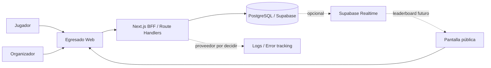
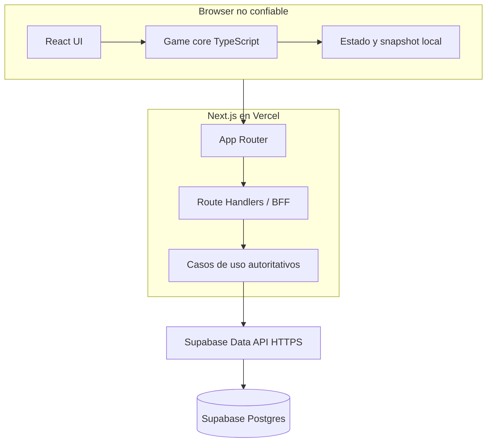
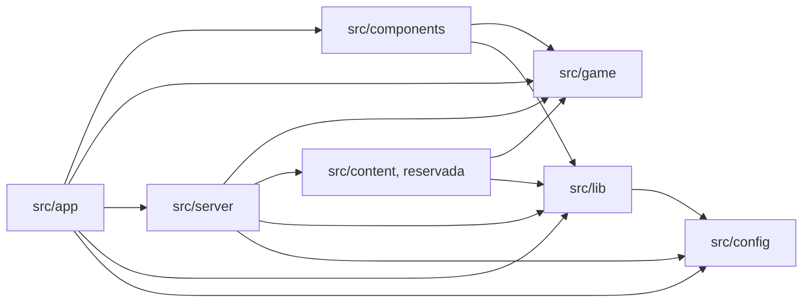

# Arquitectura general

## Estado y estilo

Egresado adopta un **monolito modular web + Backend for Frontend (BFF)** en una única aplicación Next.js ubicada en la raíz del repositorio. El motor de juego es una frontera de TypeScript puro dentro de esa aplicación, no un paquete publicable ni un servicio separado.

El RC implementa la carrera completa local-first, la emisión de intentos, sesiones de participante y organizador, replay autoritativo y ranking por mejor intento. La persistencia competitiva entra exclusivamente por el BFF server-only hacia Supabase Data API HTTPS. El estado de capacidades y evidencia está en [STAGE-09](../06-delivery/stage-09-fair-mode-server-ranking.md) y [el RC](../06-delivery/production-v1-release-candidate.md).

## Stack baseline implementado

- Node.js 24 LTS y pnpm como toolchain reproducible según [ADR-010](adr/ADR-010-reproducible-node-pnpm-container-toolchain.md).
- Next.js 16 / App Router, React y TypeScript estricto.
- Tailwind CSS para estilos.
- Zod para validación de configuración y, cuando corresponda, límites de entrada.
- PostgreSQL gestionado por Supabase como persistencia aceptada; la integración es opcional en la base actual.
- Vercel como topología canónica de producción.
- Vitest, Testing Library, fast-check y Playwright para la base automatizada.

Las versiones exactas están fijadas en `package.json` y `pnpm-lock.yaml`. No se incorpora Zustand ni una plataforma de observabilidad hasta que una necesidad implementada lo justifique. Next.js `16.3.5` supera el piso de seguridad; `pnpm release:check` conserva ese gate.

## Diagrama de contexto objetivo

Ranking y persistencia están implementados. Observabilidad externa y Realtime siguen siendo opcionales no implementados.

## Contenedores y ejecución objetivo

El juego activo se ejecuta localmente para minimizar latencia y dependencia de red. El caso de uso server-only ya valida una finalización no confiable, recompone el `RunPlan` cuando corresponde y reproduce las acciones con el motor versionado; la emisión, los endpoints y la persistencia oficial están implementados desde STAGE-09. El browser sólo previsualiza; no es autoridad de score ni de estado final.

## Fronteras de módulos

La dirección de dependencias implementada se controla con ESLint y un `tsconfig` separado para el core:

- `src/app`: composición, layouts, páginas y entrada HTTP. Puede invocar casos de uso de servidor, pero no importar persistencia directamente.
- `src/components`: UI. Puede consumir `game` y utilidades de `lib`; no accede a servidor, configuración secreta ni Supabase directamente. `components/game/` aporta el adaptador entre React y el motor: un store observable framework-free más un binding con `useSyncExternalStore`. No se incorporó Zustand: el estado de sesión es un único árbol inmutable actualizado por el reducer del motor, y la suscripción por selector ya la da React.
- `src/game`: core TypeScript puro y determinista. En dependencias internas sólo puede importar `game`; no usa React, Next.js, DOM, red, DB, almacenamiento del browser, hora global, `process` ni `Math.random()`. Admite dos dependencias externas puras declaradas en una lista blanca de fronteras: `zod` para parsear fronteras de confianza y `pure-rand` para el generador seeded de [ADR-012](adr/ADR-012-seeded-prng-and-substreams.md). Contiene el núcleo funcional (`core`, `math`, `random`, `challenges`, `narrative`, `progression`, `difficulty`, `scoring`, `profiles`, `plan`, `ruleset`, `runs`, `content`) y, bajo `testing/`, fixtures de desarrollo aisladas de la API pública. Ver [game engine](game-engine.md).
- `src/content`: contenido ejecutable como datos sobre interacciones existentes. Aloja el slice versionado de 7.º y no contiene componentes ad hoc.
- `src/server`: casos de uso autoritativos y adaptadores de persistencia. Incluye validación de runs por replay; el subárbol `persistence` no es una API para `app`.
- `src/lib`: adaptadores y utilidades transversales sin reglas de producto; el acceso público a Supabase vive aquí detrás de un adaptador aprobado.
- `src/config`: schemas y lectura de configuración pública/server-only; no depende de capas superiores.
- `supabase/`: configuración local, migraciones SQL y seed. La migración inicial es deliberadamente neutra y no decide un schema de juego.

Los imports directos de `@supabase/supabase-js` están permitidos sólo en los adaptadores aprobados. Las dependencias externas no autorizan saltarse las fronteras internas.

## Topología de despliegue

- Vercel sirve la aplicación Next.js y sus Route Handlers/Functions; CDN/edge puede servir assets estáticos.
- Supabase aloja PostgreSQL cuando el entorno tiene persistencia configurada.
- La región de funciones debe quedar cercana a Postgres al configurar producción.
- La imagen Docker standalone es un artefacto portable y un gate de paridad; no reemplaza a Vercel ni selecciona otro proveedor.
- Postgres es la fuente de verdad de intentos oficiales. Production exige su configuración; sólo local permite el store en memoria. [ADR-028](adr/ADR-028-zero-cost-fair-deployment.md) fija Hobby `gru1`, Free `sa-east-1`, main-only y ensayo local.

Los detalles operativos están en [despliegue y ambientes](deployment-and-environments.md).

## Escalabilidad

Para una feria escolar, el monolito modular ofrece margen suficiente. No introducir microservicios, colas, Kubernetes, workspaces o un monorepo sin evidencia y una revisión arquitectónica.

Posibles extracciones futuras —no decisiones actuales— incluyen procesamiento matemático intensivo, analytics, edición de contenido o un leaderboard especializado. Los triggers de [ADR-002](adr/ADR-002-modular-monolith-bff.md) gobiernan cualquier reevaluación.

## Superficie de práctica pública — RC3

[ADR-029](adr/ADR-029-public-practice-mode.md) incorpora `/test` y casos de uso
`src/server/practice` separados de `server/competition`. Comparte factories de
carrera completa, core, composer, contenido aprobado, ScorePolicy, replay,
controller y vistas. El runtime sólo recibe el puerto `RateLimitCounter`, cuya
implementación Supabase invoca la RPC atómica existente. ESLint impide importar
CompetitionStore, casos competitivos o clientes de persistencia desde práctica.
La extracción de logging/límites conserva el comportamiento competitivo.

El descriptor, snapshot y action log viven en memoria/browser local; el servidor
no guarda runs ni resultados de práctica. Emisión y verificación no dependen del
estado del evento ni leen su seed. La topología Vercel/Supabase y los contratos
congelados del motor no cambian.
