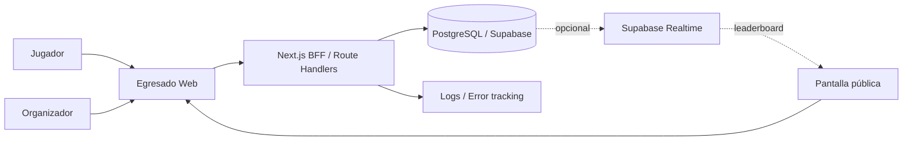
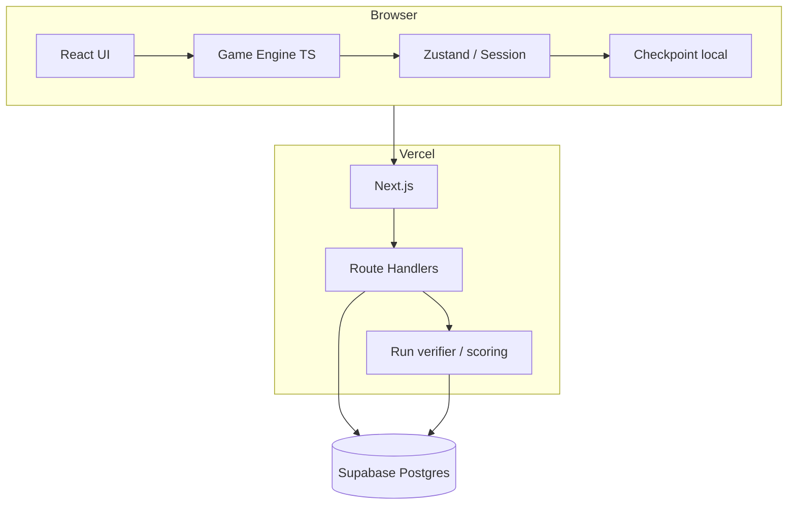

# Arquitectura general

## Estilo

**Modular monolith web + Backend for Frontend**, con motor de juego compartido como paquete TypeScript puro.

## Stack baseline

- Next.js 16.x / App Router.
- React.
- TypeScript estricto.
- Tailwind CSS.
- Zustand para estado interactivo local.
- Zod para schemas/validación en límites.
- PostgreSQL gestionado por Supabase.
- Vercel para web y Route Handlers/Functions.
- Vitest para unidad/property tests.
- Playwright para E2E.
- Sentry u observabilidad equivalente cuando el MVP público lo justifique.

La versión exacta se fija por lockfile. Las actualizaciones de seguridad no requieren ADR salvo que cambien comportamiento/arquitectura.

## Context diagram

## Container view

## Principio de ejecución

El juego activo se ejecuta localmente para minimizar latencia y dependencia de red. El servidor:
- crea runs oficiales;
- proporciona configuración/seed;
- valida finalización;
- reproduce score;
- persiste resultados;
- sirve ranking.

## Fronteras

### `game-core`
Sin React, DOM, fetch ni DB.

### `game-content`
Definiciones de templates, pools y versiones.

### `game-ui`
Componentes y adapters de interacción.

### `server`
Casos de uso autoritativos y persistencia.

## Topología de despliegue

- CDN/edge para assets estáticos.
- Next.js/Vercel Functions para endpoints.
- Región de funciones cercana al Postgres cuando se configure producción.
- Postgres como source of truth de runs oficiales.

## Escalabilidad

Para feria escolar, esta arquitectura tiene margen amplio. No introducir microservicios, colas o Kubernetes sin evidencia de necesidad.

Posibles extracciones futuras:
- servicio de generación/análisis matemático intensivo;
- worker de analytics;
- content service/editor;
- leaderboard especializado si escala masivamente.
