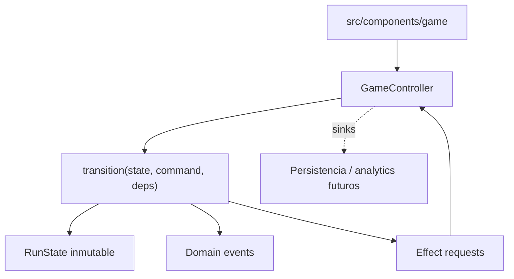
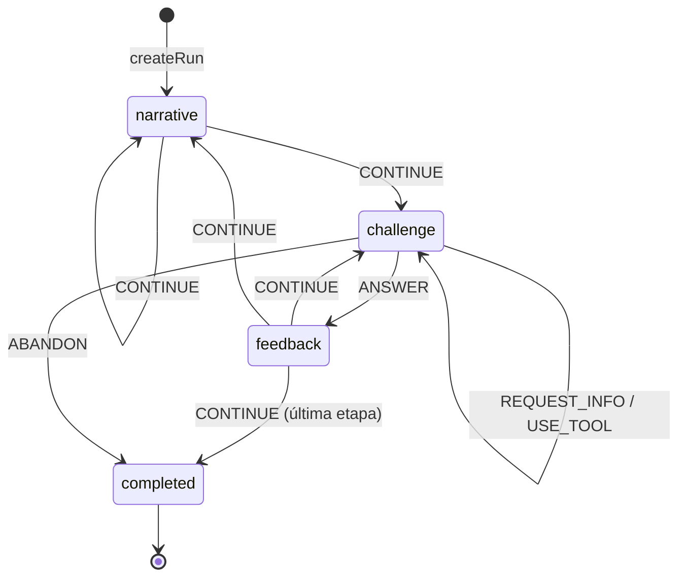

# Game engine

Motor TypeScript determinista, puro y reproducible. Este documento describe el motor **implementado** en `src/game`. Las decisiones durables que lo gobiernan están en [ADR-003](adr/ADR-003-deterministic-seeded-engine.md), [ADR-004](adr/ADR-004-server-authoritative-scoring.md), [ADR-007](adr/ADR-007-content-as-data.md), [ADR-011](adr/ADR-011-functional-core-transition-engine.md), [ADR-012](adr/ADR-012-seeded-prng-and-substreams.md), [ADR-013](adr/ADR-013-exact-rational-arithmetic.md), [ADR-019](adr/ADR-019-scenario-family-template-variant.md), [ADR-020](adr/ADR-020-variant-generation-and-approved-catalog.md), [ADR-021](adr/ADR-021-approved-catalog-in-play-and-teacher-demo.md), [ADR-022](adr/ADR-022-difficulty-model-and-run-composer.md), [ADR-023](adr/ADR-023-competitive-score-policy.md) y [ADR-024](adr/ADR-024-progression-recovery-and-graduation.md).

Para comandos y flujo de trabajo, ver [desarrollo del motor](../08-engineering/game-engine-development.md).

## Restricciones

`src/game` no puede depender de React, Next.js, `window`/DOM, almacenamiento local, DB, red, hora global no inyectada ni `Math.random()`. Las fronteras se aplican con ESLint (`no-restricted-globals`, `no-restricted-imports`, `boundaries/dependencies`) y con un proyecto TypeScript separado, `tsconfig.game.json`, que compila el core sin tipos de DOM ni de Node.

Únicas dependencias externas admitidas dentro del core, declaradas en una lista blanca explícita de fronteras: `zod` (parseo de fronteras de confianza) y `pure-rand` (generador seeded de ADR-012).

## Arquitectura

Functional core / imperative shell.



El motor devuelve estado, eventos y **descripciones** de efecto. Nunca ejecuta un efecto: no hay red, storage ni SDK dentro de `src/game`.

## Módulos

| Módulo | Responsabilidad |
|---|---|
| `core/` | identidades branded, `Result`, taxonomía de errores, exhaustividad, versionado |
| `math/` | racionales exactos, redondeo, cantidades/unidades, tolerancias |
| `random/` | interfaz `Rng`, adaptador `pure-rand`, derivación de seeds por namespace |
| `challenges/` | contratos, modelo familia/plantilla/variante, fuentes, validadores, interacciones y registry |
| `narrative/` | storylets, condiciones, efectos, selección determinista |
| `progression/` | etapas canónicas, el modelo de carrera visible y la progresión —qué queda por cerrar, cómo se cierra y cuándo se egresa— |
| `difficulty/`, `scoring/`, `profiles/` | rasgos cognitivos, costos de scheduling y contratos de política + implementaciones de desarrollo |
| `plan/` | política y compositor de runs, `RunPlan` concreto, serialización, fingerprint, validación independiente y auditoría |
| `ruleset/` | ensamblado y validación del ruleset versionado |
| `runs/` | estado, comandos, eventos, transición, action log, replay, snapshots, selectores |
| `content/` | validación de contenido, pipeline, auditoría y catálogo aprobado de variantes |
| `testing/` | fixtures de desarrollo, agente sintético y simulación masiva |

## Entradas

```typescript
interface RunDescriptor {
  runId: RunId
  seed: RunSeed
  mode: 'standard' | 'fair' | 'practice'
  difficulty: 'adaptive' | 'fixed'
  gameVersion: string
  rulesetVersion: string
  contentVersion: string
  variantCatalogVersion?: string
  planFingerprint?: string
  scoreVersion?: string
}
```

`variantCatalogVersion` es opcional: una run que juega la lista curada de una plantilla no salió de un catálogo aprobado y no debe afirmar lo contrario. `planFingerprint` identifica el plan concreto de una run compuesta. `scoreVersion` también es opcional: identifica la calibración competitiva cuando la run se juega con una `CompetitiveScorePolicy`; una práctica sin esa política lo omite. `EngineDependencies` aporta `ruleset`, catálogo de contenido, `storylets` y, cuando existen, un `ApprovedVariantLookup`, una `CompositionPolicy` y una `CompetitiveScorePolicy`. El ruleset **no** forma parte del estado: contiene funciones y se inyecta; la run sólo guarda sus identidades versionadas.

## Estado

`RunState` es JSON-compatible: no contiene `Date`, `Map`, `Set`, instancias de clase ni funciones. Guarda descriptor, fase, etapa, índices de evento, carrera, flags, dificultad, estado de selección, historial, `scorePreview`, racha, progresión —lo que la run debe, cómo lo cerró y si egresó—, completion y, cuando corresponde, el `RunPlan` concreto compuesto antes de empezar.

El desafío activo se guarda como **dirección**, no como modelo:

```typescript
interface ChallengeInstanceRef {
  instanceId, familyId, templateId, variantId, stageId, eventIndex, difficulty
}
```

La ubicación pertenece a la instancia, pero el contenido matemático pertenece a `familyId/templateId/variantId`: se reconstruye con el seed fijo del espacio de variantes, no con el seed de la run. Bajo el mismo contrato versionado de contenido/generador, el `runSeed` selecciona direcciones pero no cambia el problema detrás de una dirección. Nada no serializable entra al estado, los snapshots quedan chicos y el replay no puede desincronizarse del estado que lo referencia.

## Ciclo de vida



Un storylet sin pool de desafíos es un evento puramente narrativo y se resuelve con `CONTINUE`.

## Comandos

```typescript
type GameCommand =
  | { type: 'ANSWER'; instanceId; answer: InteractionAnswer }
  | { type: 'REQUEST_INFO'; instanceId; key }
  | { type: 'USE_TOOL'; instanceId; tool }
  | { type: 'CONTINUE' }
  | { type: 'ABANDON' }
```

`parseCommand` es la única frontera de confianza; usa schemas Zod. Dentro del motor los comandos ya están tipados.

Las respuestas numéricas viajan como literal decimal en `string`, nunca como `number`, para que ningún valor pase por punto flotante binario antes de ser evaluado.

## Transiciones inválidas

`transition` devuelve `Result`. Se rechazan explícitamente, entre otros: responder fuera de fase, responder dos veces, responder a una instancia obsoleta, enviar una respuesta de otra interacción, pedir un dato inexistente, usar una herramienta no habilitada, continuar sin feedback y operar sobre una run terminada. Cada rechazo es un valor tipado de `EngineRejection`, no una excepción.

Las excepciones (`EngineInvariantError`) quedan reservadas para estados que las reglas del motor deberían haber impedido; nunca las puede provocar el jugador.

## Eventos de dominio y efectos

Son cosas distintas.

- **Evento de dominio**: un hecho ocurrido en el modelo determinista (`challenge.evaluated`, `stage.completed`, `run.completed`). Estable, apto para mapear a analytics más adelante, pero el vocabulario no lo decide analytics.
- **Effect request**: una instrucción para el shell (`persist-snapshot`, `track`). El motor la describe; el `GameController` la ejecuta a través de sinks inyectados.

## RNG

Ver [ADR-012](adr/ADR-012-seeded-prng-and-substreams.md). Cada consumidor deriva su substream por dirección de namespace, de modo que agregar una tirada nueva no desplaza ninguna existente. `RunState` no guarda un cursor de RNG: el determinismo viene de la dirección, no del arrastre de estado.

La codificación de la dirección usa `U+0001` entre seed y ruta y `U+0000` entre segmentos, escritos como escapes y fijados por vectores en `tests/unit/rng-addressing.test.ts`. El charset que hace imposible una colisión se **verifica** en las fronteras de confianza, no se asume.

Capacidades: `nextInt`, `nextFloat`, `chance`, `pick`, `shuffle`, `weightedPick`, `derive`. La selección ponderada usa pesos enteros y comparación entera; nunca puede elegir un peso cero.

## Precisión numérica

Ver [ADR-013](adr/ADR-013-exact-rational-arithmetic.md). Dinero en unidades menores enteras, tiempo en minutos enteros, proporciones y porcentajes como racionales exactos, redondeo explícito por operación y tolerancia de respuesta declarada por desafío (`exact`, `absolute`, `relative-percent`, `range`). `toNumber` es sólo para presentación.

## Desafíos

Una plantilla declara responsabilidades separables sobre parámetros ya resueltos por su `VariantSourceSpec`:

1. fuente `authored` o `generated` — parámetros direccionados, validadores y vista canónica;
2. `generate(context)` — modelo privado desde parámetros resueltos;
3. `verify(model)` — invariantes propias del desafío;
4. `present(model, revealed)` — vista pública, sin la solución;
5. `evaluate(model, answer, revealed)` — resultado estructurado.

`defineChallenge` borra el tipo del modelo sin ningún cast: el modelo queda capturado en el closure y sólo se exponen las operaciones permitidas. La generación reintenta en un substream propio hasta cumplir las invariantes; el índice de intento forma parte de la dirección, así que el reintento también es determinista. Un generador que necesita reintentos sistemáticamente está mal construido y la validación de contenido lo reporta.

El pipeline de STAGE-03 recorre ambas fuentes con el mismo contrato: resolver, materializar, validar, canonizar, calcular huella, deduplicar y aprobar. `AUTHORED` no evita validación y `GENERATED` no significa azar libre en runtime.

### Vista pública

`PublicChallengeView` contiene narrativa, interacción y herramientas —y, en un repaso, las notas de lo que practica y de lo que sólo se explica—. No expone el modelo interno ni la solución. Un juego servido al browser no puede garantizar secreto absoluto, pero la arquitectura no entrega la respuesta a los componentes de presentación.

La narrativa de una plantilla puede leer los flags de la run (`narrate(model, { flags })`) para un callback; es sólo texto. Parámetros, evaluación y score no leen flags, y los tests comprueban que la interacción es idéntica con y sin historia.

## Interacciones

La categoría matemática y la interacción son ejes independientes (ADR-007). Kinds contratados en este build:

`decision-card`, `numeric-input`, `budget-builder`, `timeline`, `chart-interpretation`, `assignment-board`, `information-request`, `number-grid` y, desde STAGE-08 / Phase 1, los tres modos constructivos de 1.º ([ADR-025](adr/ADR-025-full-career-contract-evolution.md)):

- `quantity-builder` — conteos o usos por ítem; con `positions`, la vista de posiciones iguales de una distribución (modo conteos de Grid / Select / Classify);
- `schedule-builder` — un inicio por bloque, en minutos desde medianoche; la presentación trae lugar, duración, preparación, inicios posibles y el eje público de la tarde (Timeline / Schedule);
- `spatial-layout` — objetos en celdas enteras con giro 0/90; la presentación trae celdas bloqueadas, pasos reservados, puertas, huellas y códigos (Spatial / Graph Canvas).

Las tres respuestas se confirman enteras, pasan por schemas Zod estrictos y se evalúan sobre conteos, minutos y celdas, nunca sobre píxeles. Los kinds técnicos no son los cinco motores de producto: ver [sistema de desafíos](../01-game-design/challenge-system.md). Siguen sin contratar `sequence/trend` y los minijuegos especiales. Ver [cómo agregar una interacción](../08-engineering/game-engine-development.md#agregar-un-interaction-type).

## Narrativa

Storylets con condiciones declarativas. Las condiciones y los efectos son **datos**, nunca callbacks: eso permite validarlos antes de ejecutar, serializarlos, editarlos fuera del código y reproducirlos en el servidor sin evaluar código arbitrario.

Selección: filtrar por etapa → descartar cooldown/repetición → evaluar condición → quedarse con el tier de prioridad más alto → sorteo ponderado seeded. Un pool vacío devuelve un resultado tipado, no una excepción.

## Composición y autoridad del plan

Para una run compuesta, la selección ordinaria queda resuelta **antes** de ejecutar el primer evento:

```text
seed + ContentCatalog + ApprovedVariantCatalog + CompositionPolicy
    → RunComposer
    → RunPlan concreto + fingerprint
    → transition ejecuta los beats fijados
```

El compositor enumera todas las combinaciones de uno o dos beats que cumplen las restricciones duras —exactamente un `anchor`, roles permitidos, elegibilidad, host narrativo, variantes aprobadas, no repetición y sobre de dificultad— y aplica después los objetivos blandos en orden lexicográfico. El seed sólo desempata entre planes equivalentes. La cantidad de variantes de una plantilla no multiplica su probabilidad: primero existe un candidato por plantilla y recién dentro de él se elige la variante concreta.

`validateComposedPlan` es un programa separado: recalcula rol, banda y costo desde el catálogo y comprueba política, presupuesto, hosts, repeticiones y catálogo aprobado sin volver a componer. El motor consume el plan; no vuelve a sortear en runtime. Snapshot, action log y validación server-only preservan o recomprueban su identidad. `grade-7-composed` es el content set normal que ejerce este camino; el arco docente `grade-7` sigue separado y explícito.

Cuando la política declara `career` ([ADR-025](adr/ADR-025-full-career-contract-evolution.md)), el compositor combina las etapas con una búsqueda acotada: enumera los planes legales de cada etapa, poda por mínimos y máximos globales restantes, ordena los planes válidos por preferencias de producto y objetivos de la política, y desempata con una huella SHA-256 del seed y de la clave canónica del plan. Si agota su presupuesto de nodos, falla en vez de devolver un plan sin probar. El validador recomprueba etapas exactas, cronología, metadata y cuotas. Hoy lo usa sólo la práctica de desarrollo `grade-7-through-1`, con alcance `partial-development`; una carrera oficial de nueve beats necesita contenido de 2.º–5.º. Sin `career`, el camino por etapa queda idéntico.

## Progresión y ruleset

Las siete etapas canónicas son configuración del ruleset, no `if (year === 3)` repartidos por el motor. El ruleset reúne etapas, política de scoring, de dificultad, de perfil, de composición, de recuperación y pacing narrativo, y se valida al construirse. Un content set sin política de composición conserva su flujo explícito; la demo amplia de 7.º es ese caso.

### Recuperación y egreso

Un beat ordinario que sale mal deja una **obligación**, y el año no puede cerrar debiéndola. Cerrarla es un **repaso**, que se agenda después del presupuesto ordinario y cierra de una vez todo lo que el año debía.

La convergencia es estructural, no configurada: sólo un beat ordinario crea obligaciones —así que un repaso no puede crear otra— y un repaso siempre cierra lo que aborda, salga como salga. El techo es un repaso por año, y `GRADUATED` es el estado terminal que toda run válida completada alcanza. El contenido del repaso se deriva de la identidad semántica de la obligación sobre un substream propio, dentro del catálogo aprobado, así que una reproducción llega al mismo repaso.

El motor no conoce un solo id de contenido de recuperación: el content set declara **qué repasa qué**, por plantilla, y una plantilla ausente de esa declaración no deja nada por cerrar — `none` es una decisión escrita, no un silencio que el motor rellene con lo que el año tenga a mano. La política —`recovery-dev-1@1.0.0-candidate`, `official: false`— calibra qué calidad deja algo por cerrar. El máximo no es calibración: `MAX_RECOVERIES_PER_STAGE` fija estructuralmente uno, `RecoveryPolicy` sólo puede expresarlo como el literal `1` para conservarlo inspeccionable y el validador runtime rechaza cualquier otro valor. Cambiar ese límite exige reconsiderar [ADR-024](adr/ADR-024-progression-recovery-and-graduation.md) y sus pruebas de boundedness y pacing.

Si un año debe más de una cosa, el único repaso practica la obligación seleccionada —la primera en orden canónico— y cualquier otra que su ruta declare; el resto se explica con el debrief autorado del content set. La vista pública trae las dos listas y `recordCoverage` las reconstruye desde el registro del año, sin estado persistido nuevo. Con catálogo aprobado presente no hay fallback a variantes curadas: `createRun` rechaza rutas sin variantes aprobadas, sin marco o sin debrief, y el borde del beat lo vuelve a comprobar antes de mover el año.

Un ruleset **oficial** exige que las tres políticas estén marcadas `production`, y rechaza una política de recuperación que no sea oficial. Como las preguntas abiertas 5 y 24 siguen sin cerrarse, hoy no existe ninguna política de producción y `createRuleset({ official: true })` falla a propósito.

## Scoring y perfil

`score_evento = base × calidad × dificultad + bonus - penalizaciones`, calculado sobre racionales y redondeado una sola vez al final. El resultado incluye un desglose explicable.

La capa competitiva es independiente: cada plantilla declara qué hecho alimenta `MathPerformance`, `TeamPerformance` y `AuraPerformance`; Promedio y Estilo no son componentes. `scoreRun` normaliza la evidencia del `RunPlan`, retira componentes sin oportunidad, redistribuye proporcionalmente sus pesos y calcula un `FairScore` de 0 a 10.000 con racionales exactos, un solo redondeo y un desglose que cierra. El máximo perfecto es el mismo para todo plan válido.

Un beat de **repaso** no aporta evidencia competitiva: el scorer lo descarta por su rol, así que no entra al numerador ni al denominador. Si puntuara, fallar a propósito sería una forma de comprarse una oportunidad extra. Ver [ADR-024](adr/ADR-024-progression-recovery-and-graduation.md).

El registro resuelve exactamente `fair-score-dev-1@1.0.0-candidate` (histórica, 80/15/5) y `fair-score-dev-2@2.0.0-post-tg1-candidate` (actual post-TG1, 85/10/5); ambas tienen `official: false` y una referencia desconocida falla. TG1 aceptó el mapeo de calidad y el principio de recompensa pequeña; los factores exactos siguen candidatos. Ver [ADR-023](adr/ADR-023-competitive-score-policy.md).

El tiempo **no** participa: la pregunta abierta 27 no definió qué señal temporal puede considerar autoritativa el servidor, y las reglas advierten que un score dominado por velocidad perjudica accesibilidad.

El perfil se calcula sobre dimensiones ocultas normalizadas, con desempate documentado y total: puntaje ponderado → dimensión dominante del perfil → orden canónico.

## Replay

```text
createRun(descriptor) -> action[0] -> action[1] -> ... -> finalState
```

El action log versionado es el artefacto de validación más fuerte: se puede volver a ejecutar. Las secuencias deben empezar en cero y avanzar de a uno; un salto se rechaza en vez de repararse. Un comando que las reglas no habrían permitido invalida el log completo.

`ACTION_LOG_VERSION` es `5`: agrega las respuestas `quantity-builder`, `schedule-builder` y `spatial-layout`; un log `4` se rechaza explícitamente. El log lleva el descriptor completo: `variantCatalogVersion` —sin ese campo una run se reproducía contra el contenido equivocado sin decir nada, que es el defecto que [ADR-021](adr/ADR-021-approved-catalog-in-play-and-teacher-demo.md) encontró y cerró— la huella del plan compuesto, que dice contra qué composición hay que reproducirla, y el `scoreVersion`, que dice bajo qué calibración competitiva se jugó.

La comparación usa una forma JSON canónica con claves ordenadas, así que el orden de inserción no puede producir un falso negativo.

## Snapshots

Los snapshots son una **optimización para reanudar** (FR-009/FR-010), no un artefacto autoritativo. El codec valida agresivamente y rechaza lo que no reconoce; una versión incompatible produce un error explícito, nunca una migración silenciosa. Desde [ADR-022](adr/ADR-022-difficulty-model-and-run-composer.md) el snapshot guarda además el **plan concreto** de una run compuesta, en vez de la forma de recalcularlo: reanudar tiene que jugar el año que el jugador empezó, no el que la calibración de hoy compondría. Desde [ADR-024](adr/ADR-024-progression-recovery-and-graduation.md) guarda también la **progresión**, porque reanudar tiene que seguir debiendo lo que la run debía. `SNAPSHOT_SCHEMA_VERSION` es `7`; no existe un registro de migraciones porque las versiones anteriores se rechazan y la aplicación ofrece una partida nueva.

### Invariantes estructurales

Validar cada campo por separado no alcanza: un estado sólo es coherente cuando los campos **concuerdan**. `runStateIssues` verifica esa correlación y `restoreSnapshot` rechaza con `corrupted-snapshot` cuando falla.

- la fase y su payload deben corresponderse (`challenge` exige un desafío activo, `feedback` exige feedback pendiente, `narrative` exige un evento sin desafío, `completed` no admite ninguno de los dos);
- `status` y `phase` deben concordar, y sólo una run completada lleva `completion`;
- el historial es un log contiguo desde cero y no puede exceder el evento alcanzado;
- `scorePreview` debe ser exactamente la suma de los puntos otorgados —un total manipulado se detecta sin reproducir nada—;
- el historial de calidades y la racha deben corresponderse con los eventos resueltos;
- todo storylet jugado debe figurar como visto, o el cooldown se comportaría distinto tras reanudar;
- una run no puede egresar debiendo algo, ni egresar con un beat abierto, ni declarar en su `completion` un egreso que la progresión contradice;
- una obligación no puede venir de un evento que la run no alcanzó, ni estar pendiente y resuelta a la vez, ni resolverse dos veces;
- un repaso abierto tiene que tener algo que cerrar.

Se evaluó convertir `phase` en unión discriminada que lleve su payload, lo que haría irrepresentables esos estados. Se descartó por ahora: cambia el formato persistido y se propaga a transición, selectores y UI, mientras que el defecto sólo entra por esta frontera. Queda como evolución razonable.

## Compatibilidad y versionado

Una run sólo puede reanudarse o revalidarse con un motor que declare el mismo triple `gameVersion` / `rulesetVersion` / `contentVersion`. `variantCatalogVersion` agrega procedencia cuando la run consume un catálogo aprobado; `planFingerprint`, la composición concreta; y `scoreVersion`, la calibración competitiva cuando existe. Cuando esos campos están, `createRun` los **comprueba** contra las dependencias inyectadas; una práctica sin política competitiva omite `scoreVersion`.

| Cambió | Subir |
|---|---|
| transición, orden de consumo de RNG, derivación de seed, formato de action log, codec de snapshot, generación de un desafío existente | `ENGINE_VERSION` |
| política de scoring por evento, dificultad, progresión, perfil **o composición** | versión de ruleset |
| datos de desafíos, storylets o perfil competitivo declarado por una plantilla | versión de contenido |
| pesos, mapeo de calidad, recompensa de dificultad o topes competitivos | versión de la `CompetitiveScorePolicy`, estampada como `scoreVersion` |
| población aprobada o versión de contenido contra la que se publicó | `variantCatalogVersion`; nunca se edita un catálogo anterior |

Los golden tests de `tests/unit/engine-golden.test.ts` fallan ante cualquier cambio accidental de salida determinista. Regenerarlos sin subir la versión correspondiente invalida en silencio los replays guardados.

Para que esa regla no dependa de la disciplina de quien edita, `tests/unit/engine-fingerprint.test.ts` fija un **fingerprint** determinista del motor, del ruleset y del contenido contra la versión declarada. Cambiar una política, la configuración de etapas o el content set sin mover la versión rompe ese test y nombra la decisión que se estaba salteando.

## Frontera con servidor

El motor corre igual en browser y en Node. `src/server/game/validate-run.ts` es el caso de uso `server-only` que materializa ADR-004: recibe una submission no confiable, la parsea, verifica compatibilidad de versiones, la reproduce y devuelve score por evento, perfil y carrera **recalculados**. En una run compuesta recompone desde el seed y las políticas del servidor, compara `planFingerprint` y pasa el resultado por el validador independiente. Si el descriptor declara `scoreVersion` y el servidor tiene esa política, calcula además el `FairScore` canónico desde el historial reproducido. Recalcula por separado la **progresión**: si la run egresó, cuántos repasos jugó y cuántas previas dejó — que son preguntas distintas del score y no se mezclan con él. Una run completada que quede debiendo algo se rechaza. Nada que el cliente afirme sobre el resultado se lee, `graduated` incluido.

Rechaza con tipo una submission malformada, una acción insertada, una secuencia rota, una run truncada, un ruleset incompatible y un seed fuera del charset. Endpoints, sesión, rate limiting y persistencia siguen siendo trabajo aparte.

El determinismo entre runtimes se verifica en `tests/e2e/game-engine-harness.spec.ts`, que exige que el browser reproduzca exactamente los valores que Node calcula para el mismo seed.

## Hash de resultado

Opcional. `canonicalize(state)` produce la forma estable sobre la que se puede calcular un hash para detectar divergencias entre cliente y servidor. Es una señal de diagnóstico, no un mecanismo de seguridad por sí mismo.

## Modelo de contenido

Una instancia de desafío se direcciona por su identidad de contenido completa —familia de escenario, plantilla y variante— más dónde la ubicó la run. Una `ChallengeDefinition` **es** una plantilla; el catálogo de contenido disponible (`ContentCatalog`) está separado del plan de contenido de una run (`RunPlan`), y la elegibilidad por etapa y el rol de colocación son metadata declarativa del contenido, no conocimiento del motor.

Cada plantilla declara una fuente híbrida: registros autorados y, opcionalmente, un espacio generado por restricción. Ambas pasan por validadores genéricos y matemáticos, canonización, fingerprint SHA-256 y deduplicación antes de entrar en un `ApprovedVariantCatalog`. El catálogo vigente es `grade-7-dev-6`; es de desarrollo y la partida real de 7.º lo consume mediante `ApprovedVariantLookup`. Tiene 185 entradas bajo `contentVersion 0.10.0-grade-7`: las de `dev-5` —159 de `dev-4` más 26 de `g7.bus-travel-review`— con el mural rebalanceado por la [remediación matemática](../04-quality/mathematics-remediation-implementation.md); `dev-1` a `dev-5` siguen publicados sin cambios. El content set de desarrollo `grade-7-through-1` usa su propio catálogo, `grade-1-dev-1`: 174 variantes de las siete plantillas de 1.º más las de 7.º re-aprobadas bajo `contentVersion 1.0.0-grade-1`.

`DemoPlan` es otro artefacto: declara qué muestra una demostración docente y su validador exige que no pueda pasar por `StageContentPlan`. No construye una run ni relaja el presupuesto normal de uno a dos beats. La composición normal ya existe como `RunComposer` + `ComposedRunPlan`; son caminos separados.

El motor no conoce ningún id de contenido: agregar una familia, una plantilla, un generador o sus validadores no requiere tocar el pipeline ni el compositor. Ver [ADR-019](adr/ADR-019-scenario-family-template-variant.md), [ADR-020](adr/ADR-020-variant-generation-and-approved-catalog.md), [ADR-021](adr/ADR-021-approved-catalog-in-play-and-teacher-demo.md), [ADR-022](adr/ADR-022-difficulty-model-and-run-composer.md) y [la migración del modelo de contenido](content-model-migration.md).

## Lo que este documento no describe

Este documento describe el motor **implementado**. Las capacidades que todavía no existen —`RunDescriptor` oficial emitido por servidor, vinculación con un catálogo de feria congelado, endpoints, sesión, persistencia, ranking, leaderboard, personal best, política final de intentos y desempate— están en [arquitectura objetivo del motor](target-engine-architecture.md), con el estado real de cada una. La base server-only de verificación por replay, composición y score competitivo ya existe; no es todavía un backend completo de competencia.

La frontera fundamental no cambia en ninguna de esas evoluciones. Si una propuesta futura la toca, es un ADR nuevo.
