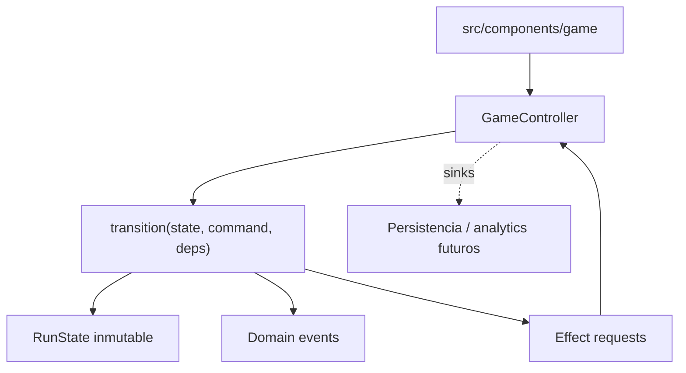
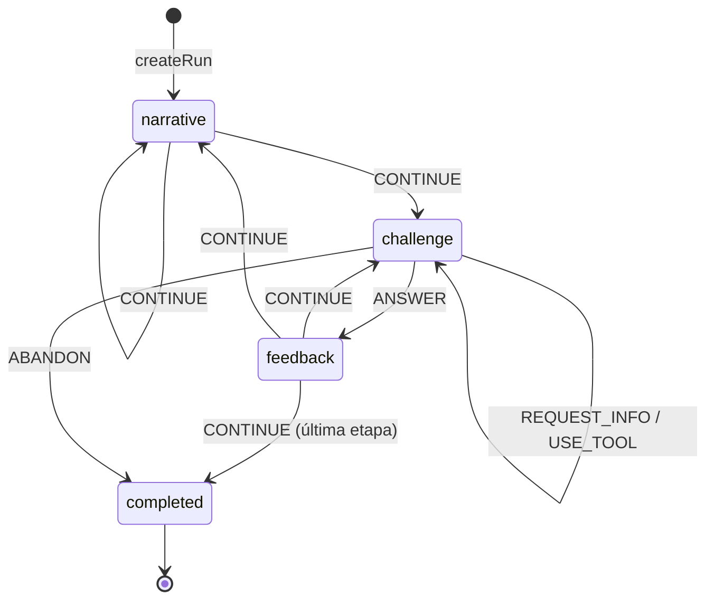

# Game engine

Motor TypeScript determinista, puro y reproducible. Este documento describe el motor **implementado** en `src/game`. Las decisiones durables que lo gobiernan están en [ADR-003](adr/ADR-003-deterministic-seeded-engine.md), [ADR-004](adr/ADR-004-server-authoritative-scoring.md), [ADR-007](adr/ADR-007-content-as-data.md), [ADR-011](adr/ADR-011-functional-core-transition-engine.md), [ADR-012](adr/ADR-012-seeded-prng-and-substreams.md), [ADR-013](adr/ADR-013-exact-rational-arithmetic.md), [ADR-019](adr/ADR-019-scenario-family-template-variant.md) y [ADR-020](adr/ADR-020-variant-generation-and-approved-catalog.md).

Para comandos y flujo de trabajo, ver [desarrollo del motor](../08-engineering/game-engine-development.md).

## Restricciones

`src/game` no puede depender de React, Next.js, `window`/DOM, almacenamiento local, DB, red, hora global no inyectada ni `Math.random()`. Las fronteras se aplican con ESLint (`no-restricted-globals`, `no-restricted-imports`, `boundaries/dependencies`) y con un proyecto TypeScript separado, `tsconfig.game.json`, que compila el core sin tipos de DOM ni de Node.

Únicas dependencias externas admitidas dentro del core, declaradas en una lista blanca explícita de fronteras: `zod` (parseo de fronteras de confianza) y `pure-rand` (generador seeded de ADR-012).

## Arquitectura

Functional core / imperative shell.



El motor devuelve estado, eventos y **descripciones** de efecto. Nunca ejecuta un efecto: no hay red, storage ni SDK dentro de `src/game`.

## Módulos

| Módulo | Responsabilidad |
|---|---|
| `core/` | identidades branded, `Result`, taxonomía de errores, exhaustividad, versionado |
| `math/` | racionales exactos, redondeo, cantidades/unidades, tolerancias |
| `random/` | interfaz `Rng`, adaptador `pure-rand`, derivación de seeds por namespace |
| `challenges/` | contratos, modelo familia/plantilla/variante, fuentes, validadores, interacciones y registry |
| `narrative/` | storylets, condiciones, efectos, selección determinista |
| `progression/` | etapas canónicas y el modelo de carrera visible |
| `difficulty/`, `scoring/`, `profiles/` | contratos de política + implementaciones de desarrollo |
| `ruleset/` | ensamblado y validación del ruleset versionado |
| `runs/` | estado, comandos, eventos, transición, action log, replay, snapshots, selectores |
| `content/` | `RunPlan`, validación de contenido, pipeline, auditoría y catálogo aprobado de variantes |
| `testing/` | fixtures de desarrollo, agente sintético y simulación masiva |

## Entradas

```typescript
interface RunDescriptor {
  runId: RunId
  seed: RunSeed
  mode: 'standard' | 'fair' | 'practice'
  difficulty: 'adaptive' | 'fixed'
  gameVersion: string
  rulesetVersion: string
  contentVersion: string
  variantCatalogVersion?: string
}
```

`variantCatalogVersion` es opcional: una run que juega la lista curada de una plantilla no salió de un catálogo aprobado y no debe afirmar lo contrario. `EngineDependencies` aporta `ruleset`, catálogo de contenido y `storylets`. El ruleset **no** forma parte del estado: contiene funciones y se inyecta; la run sólo guarda su versión.

## Estado

`RunState` es JSON-compatible: no contiene `Date`, `Map`, `Set`, instancias de clase ni funciones. Guarda descriptor, fase, etapa, índices de evento, carrera, flags, dificultad, estado de selección, historial, `scorePreview`, racha y completion.

El desafío activo se guarda como **dirección**, no como modelo:

```typescript
interface ChallengeInstanceRef {
  instanceId, familyId, templateId, variantId, stageId, eventIndex, difficulty
}
```

La ubicación pertenece a la instancia, pero el contenido matemático pertenece a `familyId/templateId/variantId`: se reconstruye con el seed fijo del espacio de variantes, no con el seed de la run. Bajo el mismo contrato versionado de contenido/generador, el `runSeed` selecciona direcciones pero no cambia el problema detrás de una dirección. Nada no serializable entra al estado, los snapshots quedan chicos y el replay no puede desincronizarse del estado que lo referencia.

## Ciclo de vida



Un storylet sin pool de desafíos es un evento puramente narrativo y se resuelve con `CONTINUE`.

## Comandos

```typescript
type GameCommand =
  | { type: 'ANSWER'; instanceId; answer: InteractionAnswer }
  | { type: 'REQUEST_INFO'; instanceId; key }
  | { type: 'USE_TOOL'; instanceId; tool }
  | { type: 'CONTINUE' }
  | { type: 'ABANDON' }
```

`parseCommand` es la única frontera de confianza; usa schemas Zod. Dentro del motor los comandos ya están tipados.

Las respuestas numéricas viajan como literal decimal en `string`, nunca como `number`, para que ningún valor pase por punto flotante binario antes de ser evaluado.

## Transiciones inválidas

`transition` devuelve `Result`. Se rechazan explícitamente, entre otros: responder fuera de fase, responder dos veces, responder a una instancia obsoleta, enviar una respuesta de otra interacción, pedir un dato inexistente, usar una herramienta no habilitada, continuar sin feedback y operar sobre una run terminada. Cada rechazo es un valor tipado de `EngineRejection`, no una excepción.

Las excepciones (`EngineInvariantError`) quedan reservadas para estados que las reglas del motor deberían haber impedido; nunca las puede provocar el jugador.

## Eventos de dominio y efectos

Son cosas distintas.

- **Evento de dominio**: un hecho ocurrido en el modelo determinista (`challenge.evaluated`, `stage.completed`, `run.completed`). Estable, apto para mapear a analytics más adelante, pero el vocabulario no lo decide analytics.
- **Effect request**: una instrucción para el shell (`persist-snapshot`, `track`). El motor la describe; el `GameController` la ejecuta a través de sinks inyectados.

## RNG

Ver [ADR-012](adr/ADR-012-seeded-prng-and-substreams.md). Cada consumidor deriva su substream por dirección de namespace, de modo que agregar una tirada nueva no desplaza ninguna existente. `RunState` no guarda un cursor de RNG: el determinismo viene de la dirección, no del arrastre de estado.

La codificación de la dirección usa `U+0001` entre seed y ruta y `U+0000` entre segmentos, escritos como escapes y fijados por vectores en `tests/unit/rng-addressing.test.ts`. El charset que hace imposible una colisión se **verifica** en las fronteras de confianza, no se asume.

Capacidades: `nextInt`, `nextFloat`, `chance`, `pick`, `shuffle`, `weightedPick`, `derive`. La selección ponderada usa pesos enteros y comparación entera; nunca puede elegir un peso cero.

## Precisión numérica

Ver [ADR-013](adr/ADR-013-exact-rational-arithmetic.md). Dinero en unidades menores enteras, tiempo en minutos enteros, proporciones y porcentajes como racionales exactos, redondeo explícito por operación y tolerancia de respuesta declarada por desafío (`exact`, `absolute`, `relative-percent`, `range`). `toNumber` es sólo para presentación.

## Desafíos

Una plantilla declara responsabilidades separables sobre parámetros ya resueltos por su `VariantSourceSpec`:

1. fuente `authored` o `generated` — parámetros direccionados, validadores y vista canónica;
2. `generate(context)` — modelo privado desde parámetros resueltos;
3. `verify(model)` — invariantes propias del desafío;
4. `present(model, revealed)` — vista pública, sin la solución;
5. `evaluate(model, answer, revealed)` — resultado estructurado.

`defineChallenge` borra el tipo del modelo sin ningún cast: el modelo queda capturado en el closure y sólo se exponen las operaciones permitidas. La generación reintenta en un substream propio hasta cumplir las invariantes; el índice de intento forma parte de la dirección, así que el reintento también es determinista. Un generador que necesita reintentos sistemáticamente está mal construido y la validación de contenido lo reporta.

El pipeline de STAGE-03 recorre ambas fuentes con el mismo contrato: resolver, materializar, validar, canonizar, calcular huella, deduplicar y aprobar. `AUTHORED` no evita validación y `GENERATED` no significa azar libre en runtime.

### Vista pública

`PublicChallengeView` contiene narrativa, interacción y herramientas. No expone el modelo interno ni la solución. Un juego servido al browser no puede garantizar secreto absoluto, pero la arquitectura no entrega la respuesta a los componentes de presentación.

## Interacciones

La categoría matemática y la interacción son ejes independientes (ADR-007). Familias contratadas en este build:

`decision-card`, `numeric-input`, `budget-builder`, `timeline`, `chart-interpretation`, `assignment-board`, `information-request`.

Las familias documentadas todavía **no** contratadas son `spatial-grid`, `sequence/trend` y `special minigame`. Ver [cómo agregar una interacción](../08-engineering/game-engine-development.md#agregar-un-interaction-type).

## Narrativa

Storylets con condiciones declarativas. Las condiciones y los efectos son **datos**, nunca callbacks: eso permite validarlos antes de ejecutar, serializarlos, editarlos fuera del código y reproducirlos en el servidor sin evaluar código arbitrario.

Selección: filtrar por etapa → descartar cooldown/repetición → evaluar condición → quedarse con el tier de prioridad más alto → sorteo ponderado seeded. Un pool vacío devuelve un resultado tipado, no una excepción.

## Progresión y ruleset

Las siete etapas canónicas son configuración del ruleset, no `if (year === 3)` repartidos por el motor. El ruleset reúne etapas, política de scoring, de dificultad, de perfil y pacing narrativo, y se valida al construirse.

Un ruleset **oficial** exige que las tres políticas estén marcadas `production`. Como las preguntas abiertas 5 y 24 siguen sin cerrarse, hoy no existe ninguna política de producción y `createRuleset({ official: true })` falla a propósito.

## Scoring y perfil

`score_evento = base × calidad × dificultad + bonus - penalizaciones`, calculado sobre racionales y redondeado una sola vez al final. El resultado incluye un desglose explicable.

El tiempo **no** participa: la pregunta abierta 27 no definió qué señal temporal puede considerar autoritativa el servidor, y las reglas advierten que un score dominado por velocidad perjudica accesibilidad.

El perfil se calcula sobre dimensiones ocultas normalizadas, con desempate documentado y total: puntaje ponderado → dimensión dominante del perfil → orden canónico.

## Replay

```text
createRun(descriptor) -> action[0] -> action[1] -> ... -> finalState
```

El action log versionado es el artefacto de validación más fuerte: se puede volver a ejecutar. Las secuencias deben empezar en cero y avanzar de a uno; un salto se rechaza en vez de repararse. Un comando que las reglas no habrían permitido invalida el log completo.

`ACTION_LOG_VERSION` es `2`. El log lleva el descriptor completo, `variantCatalogVersion` incluido: sin ese campo una run se reproducía contra el contenido equivocado sin decir nada, que es el defecto que [ADR-021](adr/ADR-021-approved-catalog-in-play-and-teacher-demo.md) encontró y cerró.

La comparación usa una forma JSON canónica con claves ordenadas, así que el orden de inserción no puede producir un falso negativo.

## Snapshots

Los snapshots son una **optimización para reanudar** (FR-009/FR-010), no un artefacto autoritativo. El codec valida agresivamente y rechaza lo que no reconoce; una versión incompatible produce un error explícito, nunca una migración silenciosa. `SNAPSHOT_SCHEMA_VERSION` es `4`; no existe un registro de migraciones porque las versiones anteriores se rechazan y la aplicación ofrece una partida nueva.

### Invariantes estructurales

Validar cada campo por separado no alcanza: un estado sólo es coherente cuando los campos **concuerdan**. `runStateIssues` verifica esa correlación y `restoreSnapshot` rechaza con `corrupted-snapshot` cuando falla.

- la fase y su payload deben corresponderse (`challenge` exige un desafío activo, `feedback` exige feedback pendiente, `narrative` exige un evento sin desafío, `completed` no admite ninguno de los dos);
- `status` y `phase` deben concordar, y sólo una run completada lleva `completion`;
- el historial es un log contiguo desde cero y no puede exceder el evento alcanzado;
- `scorePreview` debe ser exactamente la suma de los puntos otorgados —un total manipulado se detecta sin reproducir nada—;
- el historial de calidades y la racha deben corresponderse con los eventos resueltos;
- todo storylet jugado debe figurar como visto, o el cooldown se comportaría distinto tras reanudar.

Se evaluó convertir `phase` en unión discriminada que lleve su payload, lo que haría irrepresentables esos estados. Se descartó por ahora: cambia el formato persistido y se propaga a transición, selectores y UI, mientras que el defecto sólo entra por esta frontera. Queda como evolución razonable.

## Compatibilidad y versionado

Una run sólo puede reanudarse o revalidarse con un motor que declare el mismo triple `gameVersion` / `rulesetVersion` / `contentVersion`. `variantCatalogVersion` agrega procedencia cuando la run consume un catálogo aprobado; no reemplaza esa compatibilidad ni se inventa para runs curadas —un content set sin catálogo lo omite—. Cuando el campo está, `createRun` lo **comprueba**: una run que declara un catálogo distinto del que se le está dando se rechaza, porque reproducirla produciría otro contenido con el mismo score.

| Cambió | Subir |
|---|---|
| transición, orden de consumo de RNG, derivación de seed, formato de action log, codec de snapshot, generación de un desafío existente | `ENGINE_VERSION` |
| política de scoring, dificultad, progresión o perfil | versión de ruleset |
| datos de desafíos o storylets | versión de contenido |

Los golden tests de `tests/unit/engine-golden.test.ts` fallan ante cualquier cambio accidental de salida determinista. Regenerarlos sin subir la versión correspondiente invalida en silencio los replays guardados.

Para que esa regla no dependa de la disciplina de quien edita, `tests/unit/engine-fingerprint.test.ts` fija un **fingerprint** determinista del motor, del ruleset y del contenido contra la versión declarada. Cambiar una política, la configuración de etapas o el content set sin mover la versión rompe ese test y nombra la decisión que se estaba salteando.

## Frontera con servidor

El motor corre igual en browser y en Node. `src/server/game/validate-run.ts` es el caso de uso `server-only` que materializa ADR-004: recibe una submission no confiable, la parsea, verifica compatibilidad de versiones, la reproduce y devuelve score, perfil y carrera **recalculados**. Nada que el cliente afirme sobre el resultado se lee; un payload que incluya su propio `officialScore` simplemente lo ve ignorado.

Rechaza con tipo una submission malformada, una acción insertada, una secuencia rota, una run truncada, un ruleset incompatible y un seed fuera del charset. Endpoints, sesión, rate limiting y persistencia siguen siendo trabajo aparte.

El determinismo entre runtimes se verifica en `tests/e2e/game-engine-harness.spec.ts`, que exige que el browser reproduzca exactamente los valores que Node calcula para el mismo seed.

## Hash de resultado

Opcional. `canonicalize(state)` produce la forma estable sobre la que se puede calcular un hash para detectar divergencias entre cliente y servidor. Es una señal de diagnóstico, no un mecanismo de seguridad por sí mismo.

## Modelo de contenido

Una instancia de desafío se direcciona por su identidad de contenido completa —familia de escenario, plantilla y variante— más dónde la ubicó la run. Una `ChallengeDefinition` **es** una plantilla; el catálogo de contenido disponible (`ContentCatalog`) está separado del plan de contenido de una run (`RunPlan`), y la elegibilidad por etapa y el rol de colocación son metadata declarativa del contenido, no conocimiento del motor.

Cada plantilla declara una fuente híbrida: registros autorados y, opcionalmente, un espacio generado por restricción. Ambas pasan por validadores genéricos y matemáticos, canonización, fingerprint SHA-256 y deduplicación antes de entrar en un `ApprovedVariantCatalog`. El catálogo comprometido actual es `grade-7-dev-1`; es de desarrollo y todavía no alimenta la selección de una run.

El motor no conoce ningún id de contenido: agregar una familia, una plantilla, un generador o sus validadores no requiere tocar el pipeline. Ver [ADR-019](adr/ADR-019-scenario-family-template-variant.md), [ADR-020](adr/ADR-020-variant-generation-and-approved-catalog.md) y [la migración del modelo de contenido](content-model-migration.md).

## Lo que este documento no describe

Este documento describe el motor **implementado**. Las capacidades que todavía no existen —scheduler por presupuesto de dificultad, score competitivo normalizado, `RunDescriptor` oficial emitido por servidor, `scoreVersion`, vinculación autoritativa con el catálogo de feria y ranking— están en [arquitectura objetivo del motor](target-engine-architecture.md), con el estado real de cada una. La base server-only de verificación por replay ya existe; endpoints, sesión y persistencia siguen futuros.

La frontera fundamental no cambia en ninguna de esas evoluciones. Si una propuesta futura la toca, es un ADR nuevo.
