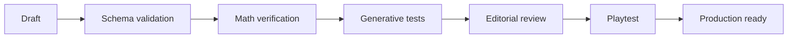

# Validación de contenido

## Pipeline propuesto

## Validación estática

- schema JSON/TS correcto;
- IDs únicos;
- interaction type existente;
- categorías válidas;
- unidad declarada;
- feedback definido;
- tags de año/dificultad.

## Validación matemática

Para cada instancia o rango:
- resolver mediante solver/evaluator interno;
- enumerar soluciones cuando sea viable;
- confirmar función objetivo;
- comprobar tolerancias;
- verificar redondeo;
- comprobar que distractores no son equivalentes.

## Validación procedural

Ejecutar N seeds por template. Valor inicial recomendado: 1.000 para templates simples; mayor si el espacio paramétrico es amplio.

Recolectar:
- min/max parámetros;
- cantidad de soluciones;
- dificultad estimada;
- tamaño de textos generados;
- distribución de opción óptima.

Evitar que la opción correcta caiga sistemáticamente en la misma posición.

## Validación editorial

- contexto entendible sin explicación externa;
- texto breve;
- objetivo concreto;
- unidades visibles;
- ningún dato esencial escondido accidentalmente;
- datos irrelevantes sólo cuando son intencionales;
- tono apropiado.

## Validación en UI

- cabe en 360 px;
- no overflow con números máximos;
- formato de moneda/unidades consistente;
- gráficos legibles;
- estados de error visibles.

## Playtest

Preguntas al observador:
- ¿el jugador supo qué debía hacer?
- ¿qué cálculo/modelo usó?
- ¿entendió el feedback?
- ¿discutió la decisión?
- ¿pareció un ejercicio escolar tradicional?

Un challenge con matemática correcta pero gameplay pobre no está listo.
