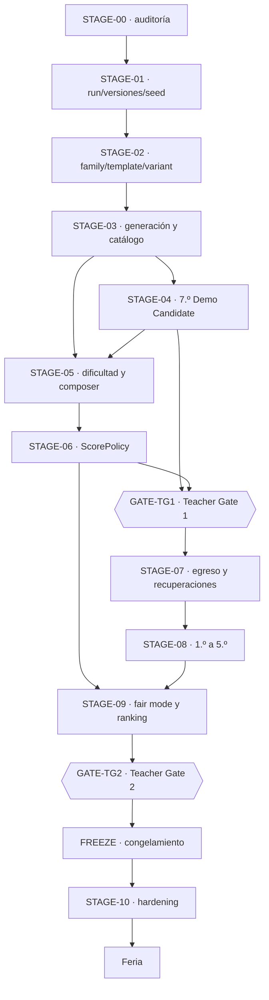

# Roadmap de implementación funcional

Este es el **roadmap canónico** de Egresado y el único documento que declara en qué etapa está el proyecto. No hay un segundo roadmap.

Reparto de responsabilidades, para que este documento no se convierta en un segundo blueprint:

```text
ADRs · Blueprint integrado · GDD · marco matemático     → QUÉ y POR QUÉ
Sistema de diseño v0.2                                  → EXPRESIÓN VISUAL
Código + tests                                          → REALIDAD IMPLEMENTADA
Este roadmap                                            → CUÁNDO, ESTADO, ALCANCE, DEPENDENCIAS, GATES
```

Si el roadmap y el código difieren, **el código gana** y el roadmap se corrige después de auditar.

- Vista corta y siempre en contexto: [etapa actual](current-stage.md).
- Fases de validación externa y congelamiento: [ciclo de entrega real](../00-product/real-delivery-lifecycle.md).
- Qué se construye por capas de alcance: [alcance y roadmap](../00-product/scope-and-roadmap.md) y [backlog](mvp-backlog.md).

**Última reconciliación:** 18 de septiembre de 2026, adjudicación final del techo
de estrategia ciega de `y5.stage-screen` —`K ≤ 78`, el mínimo factible demostrado—
e implementación de WP-SCREEN: la remediación matemática cierra en **catorce de
catorce contratos** (D-S08-116). Antecedente del 17 de septiembre: adjudicación de
los dos conflictos de contrato (D-S08-113 y D-S08-114). Antes, ese mismo día, la implementación de la remediación
matemática con veredicto `BLOCKED` (D-S08-104 a D-S08-106). Antecedente del 16 de
septiembre: adjudicación independiente del Departamento de Matemática provisional
(IA) con remediación requerida y revisión humana de Matemática diferida a la
entrega final (D-S08-095). Antecedente
del 14 de septiembre: Post-Grade-1 Scalability Audit ejecutado con `PASS WITH REQUIRED HARDENING — RESOLVED`; 2.º–5.º
desbloqueados. Antecedente del 11 de septiembre, STAGE-08 / Phase 1 `DONE`:
1.º implementado sobre `grade-1-dev-1`, contratos acotados de ADR-025 en runtime y
audit post-G1 `READY`. Antecedente: Phase 0 cerrada el 10 de septiembre
([trazabilidad](../07-reference/full-career-product-audit-integration.md)).

---

## Vocabulario de estado

| Estado | Significado |
|---|---|
| `NOT_STARTED` | no empezó y no está lista para empezar |
| `READY` | dependencias satisfechas; puede empezar ya |
| `IN_PROGRESS` | alguien la está ejecutando |
| `PARTIAL` | parte del alcance está terminada con evidencia y el resto sigue pendiente o bloqueado |
| `BLOCKED` | no puede avanzar por una dependencia o decisión externa |
| `TEACHER_GATE` | espera aprobación del Departamento de Matemática |
| `PASSED_WITH_REQUIRED_ADJUSTMENTS` | gate aprobado; ajustes integrados o asignados con autoridad y dueño |
| `VALIDATING` | implementada, corriendo su validación requerida |
| `DONE` | criterios de aceptación satisfechos **con evidencia** |
| `DEFERRED` | fuera de alcance a propósito |
| `SUPERSEDED` | reemplazada por otra decisión o etapa |

Sólo una etapa debería estar `IN_PROGRESS` a la vez, salvo paralelismo documentado acá.

**`DONE` exige evidencia**, no intuición: un ADR, un módulo, un test, un reporte de simulación, un E2E o una salida de verificación. Código escrito no es `DONE`.

---

## Resumen de etapas

Tabla de navegación. Los contratos de cada etapa, más abajo, son la autoridad.

| Etapa | Nombre | Estado | Depende de | Gate |
|---|---|---|---|---|
| [STAGE-00](#stage-00-auditoría-funcional-ejecutable) | Auditoría funcional ejecutable | `DONE` | — | — |
| [STAGE-01](#stage-01-contratos-de-run-versiones-y-seeds) | Contratos de run, versiones y seeds | `DONE` | STAGE-00 | — |
| [STAGE-02](#stage-02-scenariofamily-challengetemplate-challengevariant) | ScenarioFamily → Template → Variant | `DONE` | STAGE-01 | — |
| [STAGE-03](#stage-03-generación-validación-y-catálogo-de-variantes) | Generación, validación y catálogo de variantes | `DONE` | STAGE-02 | — |
| [STAGE-04](#stage-04-enriquecimiento-de-7º-y-demo-candidate) | Enriquecimiento de 7.º y Demo Candidate | `DONE` | STAGE-02, STAGE-03 | — |
| [STAGE-05](#stage-05-modelo-de-dificultad-y-run-composer) | Modelo de dificultad y Run Composer | `DONE` | STAGE-03, STAGE-04 | — |
| [STAGE-06](#stage-06-scorepolicy-competitiva) | ScorePolicy competitiva | `DONE` | STAGE-05 | — |
| [GATE-TG1](#gate-tg1-teacher-gate-1) | **Teacher Gate 1** | `PASSED_WITH_REQUIRED_ADJUSTMENTS` | STAGE-04, STAGE-06 | externo |
| [STAGE-07](#stage-07-invariante-de-egreso-fail-forward-y-recuperaciones) | Egreso, fail-forward y recuperaciones | `DONE` | GATE-TG1 | — |
| [STAGE-08](#stage-08-contenido-incremental-de-1º-a-5º) | Contenido incremental 1.º → 5.º | `IN_PROGRESS` · **actual** · implementación e integración DONE · remediación matemática DONE 14/14 · re-auditoría independiente NEXT | STAGE-07 | auditoría tras 1.º · gates matemáticos provisionales |
| [STAGE-09](#stage-09-fair-mode-servidor-autoritativo-y-ranking) | Fair mode, servidor autoritativo y ranking | `NOT_STARTED` | STAGE-06, STAGE-08 | — |
| [GATE-TG2](#gate-tg2-teacher-gate-2) | **Teacher Gate 2** | `TEACHER_GATE` | STAGE-09 | externo |
| [FREEZE](#freeze-congelamiento-de-competencia) | Congelamiento de competencia | `NOT_STARTED` | GATE-TG2 | — |
| [STAGE-10](#stage-10-production-hardening) | Production hardening | `NOT_STARTED` | FREEZE | go-live |
| [RELEASE](#release-y-post-feria) | Feria y post-feria | `NOT_STARTED` | STAGE-10 | — |

### Grafo de dependencias

La dirección no se negocia: **el ranking no se implementa antes de que exista una semántica de score reproducible.**



---

## Matriz de capacidades

Estado real contra el código al 11 de septiembre de 2026, tras cerrar STAGE-08 / Phase 1. Es la base de la que salen los estados de etapa de arriba, y lo que hay que reverificar antes de planificar.

| Capacidad | Estado | Evidencia | Etapa |
|---|---|---|---|
| Sistema de diseño v0.2 | `DONE` | [ADR-017](../03-architecture/adr/ADR-017-paper-visual-identity.md), [docs](../09-design-system/README.md), `pnpm design:check`, `tests/e2e/design-system.spec.ts` | previa |
| Blueprint integrado | `DONE` | [ADR-018](../03-architecture/adr/ADR-018-blueprint-v0-2-decision-authority.md), [integración](../07-reference/blueprint-v0.2-integration.md) | previa |
| Career Model v2 | `DONE` | [ADR-016](../03-architecture/adr/ADR-016-career-player-model.md), `src/game/progression/career.ts`, `ENGINE_VERSION 2.0.0` | previa |
| Ledger de notas y Promedio derivado | `DONE` | `career.ts` → `grades: readonly number[]` | previa |
| `null` ≠ 0 en dimensiones de carrera | `DONE` | `career.ts`, `tests/component/grade-7-ui.test.tsx` | previa |
| Aura con signo, sin techo, introducida en juego | `DONE` | `career.ts`, `src/content/grade-7/challenges/may-25-act.ts`, E2E «el acto del 25 de Mayo introduce Aura» | STAGE-04 |
| Acto del 25 de Mayo | `DONE` | `may-25-act.ts`, `src/game/math/classification.ts`, `tests/unit/number-classification.test.ts`, 6 E2E, contenido `0.5.0-grade-7` | STAGE-04 |
| Mastery y flags ocultos | `DONE` | `career.ts` → `mastery`, `src/game/narrative/` | previa |
| Motor determinista separado de React | `DONE` | [ADR-011](../03-architecture/adr/ADR-011-functional-core-transition-engine.md), `tests/unit/architecture-lint.test.ts`, `tests/unit/engine-modules.test.ts` | previa |
| Tripleta de versiones de run | `DONE` | `src/game/core/versioning.ts`, `assertCompatibleVersions` | STAGE-01 |
| Ownership de seed y substreams | `DONE` | [ADR-012](../03-architecture/adr/ADR-012-seeded-prng-and-substreams.md), `src/game/random/seed.ts`, `tests/unit/rng-addressing.test.ts` | STAGE-01 |
| `RunDescriptor` inmutable, separado del estado mutable | `DONE` | `src/game/runs/state.ts` | STAGE-01 |
| Replay | `DONE` | `src/game/runs/replay.ts`, `tests/unit/engine-golden.test.ts`, `tests/property/engine.property.test.ts` | STAGE-01 |
| Snapshot versionado con rechazo explícito | `DONE` | `src/game/runs/snapshot.ts`, E2E de reanudación y de checkpoint corrupto | STAGE-01 |
| Separación outcome ≠ carrera ≠ score | `DONE` | `challenges/contracts.ts`, `progression/career.ts`, `scoring/policy.ts` | STAGE-01 |
| `scoreVersion` | `DONE` | campo opcional del descriptor, comprobado por `createRun`; viaja en snapshot y action log | STAGE-06 |
| `variantCatalogVersion` | `DONE` | campo opcional del descriptor; viaja en snapshot y en action log, y `createRun` rechaza una run que declare otro catálogo del que se le da | STAGE-04 |
| `ScenarioFamily` | `DONE` | `src/game/challenges/content-model.ts`, [ADR-019](../03-architecture/adr/ADR-019-scenario-family-template-variant.md), `tests/unit/content-model.test.ts` | STAGE-02 |
| `ChallengeTemplate` | `DONE` | una `ChallengeDefinition` declara familia, rol y variantes; `school-data` lo prueba en desarrollo y `bus` en producción | STAGE-02/STAGE-04 |
| `ChallengeVariant` | `DONE` | `ChallengeVariantRef` con dirección `familia/plantilla/variante`, round-trip y substream propio | STAGE-02 |
| `VariantGenerator` reutilizable | `DONE` | contrato de fuente de variantes + generadores por restricción en seis plantillas de producción | STAGE-03/STAGE-04 |
| `VariantValidator` transversal | `DONE` | genéricas + por plantilla con oráculos independientes, diagnósticos tipados | STAGE-03 |
| Catálogo de variantes aprobado y versionado | `DONE` | `ApprovedVariantCatalog`; `grade-7-dev-1` a `dev-5` comprometidos, verificados en `pnpm verify`; las versiones publicadas son inmutables y `dev-5` es el vigente | STAGE-03/STAGE-06 |
| Catálogo aprobado consumido por la partida real | `DONE` | `ApprovedVariantLookup` en `EngineDependencies`, `tests/integration/grade-7-catalog-selection.test.ts` | STAGE-04 |
| Dos plantillas de producción en una familia | `DONE` | familia `bus` con `g7.bus-timing` y `g7.bus-latest-departure`, interacciones y razonamientos distintos | STAGE-04 |
| Plan de demo docente, distinto del plan de una run | `DONE` | `src/game/content/demo-plan.ts`, `src/content/grade-7/demo-plan.ts`, `tests/unit/demo-plan.test.ts` | STAGE-04 |
| Auditoría estadística de variantes | `DONE` | `pnpm game:variants audit`: 36.064 candidatos, 0 rechazos, 7.954 problemas distintos con siete plantillas | STAGE-03 |
| `DifficultyBand` (CORE/STANDARD/STRETCH) | `DONE` | `src/game/difficulty/cognitive.ts`; la banda se **deriva** de seis rasgos declarados por plantilla, no se elige | STAGE-05 |
| `difficultyCost` | `DONE` | `src/game/difficulty/cost-policy.ts`, política versionada en centésimas enteras, separada del multiplicador de score | STAGE-05 |
| `DifficultyBudget` | `DONE` | objetivo y tolerancia por etapa en la `CompositionPolicy`; el compositor sólo produce planes adentro y el validador lo recomprueba | STAGE-05 |
| `RunComposer` equiparado por presupuesto | `DONE` | `src/game/plan/composer.ts`: enumeración exhaustiva, restricciones duras como filtros y objetivos blandos lexicográficos; 20.000 seeds de 7.º dan 1.404 planes distintos con carga idéntica y validación independiente | STAGE-05 |
| Plan concreto ejecutado por el motor, sin recomposición en runtime | `DONE` | `RunState.plan`, `beginEvent` consume el beat pinchado, el snapshot lo persiste y el action log lleva su huella | STAGE-05 |
| Validador de plan independiente del compositor | `DONE` | `src/game/plan/plan-validator.ts`; recalcula rol, banda y costo en vez de creerle al plan | STAGE-05 |
| Verificación de composición en servidor | `DONE` para el alcance actual | `src/server/game/validate-run.ts` recompone, compara la huella y valida el plan | STAGE-05 |
| `ScorePolicy` versionada | `DONE` | `fair-score-dev-1` histórica y `fair-score-dev-2` post-TG1 actual; ambas `official: false` | STAGE-06 + integración TG1 |
| `RecoveryPolicy` versionada | `DONE` | `recovery-dev-1@1.0.0-candidate`, `official: false`, triggers calibrables; techo estructural literal `1`, validado y cubierto por la huella del ruleset | STAGE-07 |
| `MathPerformance` · `TeamPerformance` · `AuraPerformance` | `DONE` | normalizados en puntos básicos enteros; la plantilla declara qué hecho suyo alimenta cada uno | STAGE-06 |
| `FairScore` y desglose competitivo | `DONE` | `src/game/scoring/fair-score.ts`; el desglose cierra exactamente y dice qué calibración lo produjo | STAGE-06 |
| Verificación autoritativa del score en servidor | `DONE` para el alcance actual | el servidor puntúa reproduciendo, y `verifyScoreClaim` contradice un reclamo campo por campo | STAGE-06 |
| Invariante de egreso | `DONE` | `withGraduation` en `src/game/progression/recovery.ts`, `RunCompletion.graduated`, invariantes tipados, servidor autoritativo; **20.000 carreras de seis años, 20.000 egresadas** | STAGE-07 |
| Recuperaciones y fail-forward | `DONE` | [ADR-024](../03-architecture/adr/ADR-024-progression-recovery-and-graduation.md), `recovery-dev-1`, `g7.bus-travel-review`, `tests/unit/progression-reachability.test.ts` (espacio de estados recorrido entero) | STAGE-07 |
| Recuperación fuera del score competitivo | `DONE` | `fair-score.ts` descarta la evidencia por rol; test de anti-farmeo en `tests/integration/recovery-run.test.ts` | STAGE-07 |
| Carrera completa jugable de seis años | `PARTIAL` | la estructura la ejerce el fixture `six-stage-progression`; 1.º existe desde Phase 1 y `7.º → 1.º` corre como práctica; el **contenido** de 2.º–5.º no existe | STAGE-08 |
| Diseño de contenido 1.º · 2.º · 3.º · 4.º · 5.º | `DESIGN-CANDIDATE-APPROVED` | cinco pases completos en matriz v0.3, auditoría cruzada y reconciliación cerradas en Phase 0 | STAGE-08 / Phase 0 |
| Contenido runtime 1.º | `DONE` para desarrollo | `src/content/grade-1/`, catálogo `grade-1-dev-1` (174 variantes de 1.º), `tests/unit/grade-1-*.test.ts`, `tests/integration/grade-1-run.test.ts`, `tests/e2e/grade-1.spec.ts`; estado de contenido `draft` hasta la revisión docente | STAGE-08 / Phase 1 |
| Contenido runtime 2.º · 3.º · 4.º · 5.º | `NOT_STARTED` | desbloqueado por el PASS post-G1 del 14 de septiembre de 2026; es la siguiente tarea | STAGE-08 |
| Composición global de carrera | `DONE` como mecanismo | `src/game/challenges/composition-metadata.ts`, `src/game/plan/career-constraints.ts`, búsqueda acotada en `composer.ts`, validador global; `tests/unit/career-composition.test.ts`. Sólo la práctica parcial la usa: la carrera oficial de nueve beats espera 2.º–5.º | STAGE-08 / Phase 1 |
| Repaso practicado/debriefeado y approved-only fail-closed | `DONE` | `src/game/runs/recovery-content.ts`, `recoveryCoverage`/`recordCoverage`, `tests/unit/recovery-coverage.test.ts`; veredicto pedagógico en el audit post-G1 | STAGE-08 / Phase 1 |
| Modos constructivos: cantidades y posiciones, agenda, plano | `DONE` para 1.º | `quantity-builder`, `schedule-builder`, `spatial-layout`; renderers accesibles sin arrastre | STAGE-08 / Phase 1 |
| Verificación autoritativa por replay | `PARTIAL` | `src/server/game/validate-run.ts`: replaya, valida el plan compuesto y **calcula su propio score competitivo**; nada de lo que el cliente afirme se lee. Faltan endpoints, sesión, rate limit y persistencia | STAGE-09 |
| Ranking con personal best | `NOT_STARTED` | — | STAGE-09 |
| Desempate lexicográfico | `NOT_STARTED` | — | STAGE-09 |
| Fair mode operativo | `PARTIAL` | `GameMode` ya declara `'fair'` como literal; no hay comportamiento asociado | STAGE-09 |
| Configuración de competencia | `NOT_STARTED` | — | FREEZE |
| Simulación determinista masiva | `DONE` para el alcance actual | `src/game/testing/simulation.ts`, `pnpm game:simulate`, 200 runs de 7.º y 200 de `7.º → 1.º` en `pnpm verify`; reporta egresos, repasos y previas, y `not-graduated` es hallazgo | transversal |
| E2E y accesibilidad automatizada | `DONE` para el alcance actual | `tests/e2e/`, `@axe-core/playwright`, 80 tests | transversal |
| Catálogo de contenido separado del plan de la run | `DONE` | `ContentCatalog`, `RunPlan`, `tests/unit/content-model.test.ts` | STAGE-02 |
| Elegibilidad por etapa y roles de colocación | `DONE` | declarativos por plantilla; elegibilidad no contigua probada | STAGE-02 |
| Presupuesto de beats por año | `DONE` como contrato validable | `DEFAULT_STAGE_BEAT_BUDGET`, `validateStagePlan` | STAGE-02 |
| Production hardening | `NOT_STARTED` | — | STAGE-10 |

### Discrepancias registradas

- `STAGE_ORDER` incluye las siete etapas hasta `graduation`, y **el egreso ya existe**: STAGE-07 lo volvió un estado terminal que toda run válida completada alcanza. Lo que sigue faltando es el **contenido** de 2.º a 5.º —1.º existe desde STAGE-08 / Phase 1 como práctica `7.º → 1.º`—; hoy la carrera de seis años se juega entera sólo en el fixture `six-stage-progression`, que existe para probar que el motor la sostiene. Documentación que hable de la carrera completa **jugable** sigue describiendo objetivo, no presente.
- El presupuesto de uno a dos beats por año era un contrato de **plan** que ningún código construía. STAGE-04 lo reconcilió por escrito con el `DemoPlan`; **STAGE-05 lo cerró por código**: existe una partida normal de 7.º de un anchor más un secundario, el motor la ejecuta y un validador independiente la comprueba. El arco de ocho eventos sigue existiendo y es el demo.
- `GameMode` admite `'fair'` y `'practice'`, y `DifficultySetting` admite `'adaptive'`. Son literales que el motor acepta; ninguno tiene todavía la semántica competitiva que el roadmap describe a partir de STAGE-06.
- **7.º tiene dos rulesets y juega de dos formas.** `grade-7` es el arco completo de ocho eventos, que es el demo docente; `grade-7-composed` es la partida normal de tres. La pantalla del juego sigue usando el primero: cuál corresponde a un jugador es una decisión de producto que tiene sentido cuando exista la carrera completa. Ver [ADR-022](../03-architecture/adr/ADR-022-difficulty-model-and-run-composer.md).

---

## Contratos de etapa

### STAGE-00 — Auditoría funcional ejecutable

- **Estado:** `DONE`
- **Depende de:** —
- **Desbloquea:** STAGE-01, STAGE-02

**Propósito.** Convertir el Blueprint integrado en un mapa técnico contra el código real, antes de cualquier cambio grande.

**Scope IN.** Auditar Blueprint, ADRs, motor, contenido, sistema de diseño, 7.º, tests, replay/snapshot y simulación; producir la matriz de capacidades y el grafo de dependencias reales.

**Scope OUT.** Cualquier refactor. Ranking. Motor de variantes. Scoring. Contenido de 1.º–5.º. Cambios de runtime de cualquier tipo.

**Lectura requerida.** [Integración del blueprint](../07-reference/blueprint-v0.2-integration.md), [arquitectura objetivo del motor](../03-architecture/target-engine-architecture.md), [game engine](../03-architecture/game-engine.md).

**Criterios de aceptación.**

- [x] Código inspeccionado, no sólo documentación.
- [x] Cada capacidad tiene estado y evidencia.
- [x] Dependencias identificadas y ordenadas.
- [x] Presente y objetivo separados.
- [x] Teacher Gates identificados.
- [x] No se ejecutó ninguna megamigración.

**Validación requerida.** `node scripts/validate-agent-workspace.mjs`, `node scripts/sync-master-spec.mjs --check`.

**Evidencia.** La matriz de capacidades de este documento; [arquitectura objetivo del motor](../03-architecture/target-engine-architecture.md) con 24 capacidades y su estado; [ADR-018](../03-architecture/adr/ADR-018-blueprint-v0-2-decision-authority.md).

**Exit gate.** ¿Qué contratos del motor faltan realmente y cuáles ya existen? — **Contestado.**

---

### STAGE-01 — Contratos de run, versiones y seeds

- **Estado:** `DONE`
- **Depende de:** STAGE-00
- **Desbloquea:** STAGE-02

**Propósito.** Consolidar los contratos base sobre los que se apoyan variantes, replay, scoring y fair mode.

**Scope IN.** Versionado explícito de la run; ownership y derivación determinista de seeds; `RunDescriptor` inmutable separado del estado mutable; separación de tipos entre resultado de desafío, efectos de carrera y score.

**Scope OUT.** `FairScore`. Catálogo de variantes. Metadata de evento o competencia. Endpoints. Persistencia de runs.

**Lectura requerida.** [ADR-003](../03-architecture/adr/ADR-003-deterministic-seeded-engine.md), [ADR-011](../03-architecture/adr/ADR-011-functional-core-transition-engine.md), [ADR-012](../03-architecture/adr/ADR-012-seeded-prng-and-substreams.md), [game engine](../03-architecture/game-engine.md).

**Criterios de aceptación.**

- [x] La run identifica las versiones relevantes.
- [x] El ownership de seed tiene un contrato único.
- [x] La derivación determinista está probada.
- [x] `RunDescriptor` está separado del estado mutable.
- [x] El replay consume y valida la información necesaria.
- [x] El score competitivo no se mezcló con la carrera.
- [x] Snapshot, replay y tests pasan.

**Validación requerida.** `pnpm test`, `pnpm game:simulate`, `pnpm verify`.

**Evidencia.** `src/game/core/versioning.ts`; `src/game/random/seed.ts` y `rng.ts`; `RunDescriptor` en `src/game/runs/state.ts`; `src/game/runs/replay.ts` y `snapshot.ts`; `tests/unit/engine-golden.test.ts`, `tests/unit/rng-addressing.test.ts`, `tests/property/engine.property.test.ts`, `tests/integration/server-run-validation.test.ts`.

**Lo que no entró, y por qué.** Al cerrar STAGE-01, `scoreVersion` y `variantCatalogVersion` todavía no existían. Eran opcionales por diseño: agregar campos vacíos habría sido especulativo, porque nada podía poblarlos. `variantCatalogVersion` entró con STAGE-03 y `scoreVersion` con [STAGE-06](#stage-06-scorepolicy-competitiva). No era trabajo huérfano.

**Riesgos.** Al agregar los dos ejes de versión faltantes hay que decidir si eso cambia la compatibilidad de replay. La regla vigente es igualdad exacta, no rangos semver.

**Decisiones.** `LOCKED`: determinismo por seed + versiones + comandos. `LOCKED`: el navegador no es autoridad de score.

**Exit gate.** ¿Puedo reconstruir con qué reglas y con qué seed existió esta run? — **Sí**, probado por golden replays y por la validación autoritativa en servidor.

---

### STAGE-02 — ScenarioFamily → ChallengeTemplate → ChallengeVariant

- **Estado:** `DONE`
- **Depende de:** STAGE-01 (`DONE`)
- **Desbloquea:** STAGE-03 y STAGE-04 (ambas `DONE`)

**Punto de partida y propósito.** Al abrir STAGE-02, cada desafío era una definición monolítica con un array interno de parámetros: alcanzaba para que cambiaran los números, no la pregunta. La etapa debía permitir varias estructuras cognitivas por escenario y variantes reproducibles de primera clase.

**Scope IN.**

- Tipos `ScenarioFamily`, `ChallengeTemplate` y `ChallengeVariant`, con identidad estable y serializable.
- Una plantilla representa una **estructura de razonamiento**, no otro juego de números.
- La variante lleva su dirección determinista (familia, plantilla, seed de variante, parámetros) y se puede reconstruir desde ella.
- Extender `ChallengeInstanceRef` para que direccione familia y plantilla además de la definición.
- Estrategia de migración del contenido existente, escrita antes de migrarlo.
- Tests de identidad, versionado y serialización.

**Scope OUT.** **Crítico para no desbordar el alcance.**

- No implementar generadores por restricción reutilizables — es [STAGE-03](#stage-03-generación-validación-y-catálogo-de-variantes).
- No construir el catálogo desplegado ni `variantCatalogVersion`.
- No enriquecer todavía 7.º con nuevas estructuras cognitivas ni decidir la ubicación final de su contenido — es [STAGE-04](#stage-04-enriquecimiento-de-7º-y-demo-candidate). La migración estructural de los seis desafíos sí quedó completada al cerrar esta etapa; ver [la migración](../03-architecture/content-model-migration.md).
- No tocar bandas de dificultad, `difficultyCost` ni presupuesto.
- No tocar scoring, `FairScore` ni ranking.
- No agregar contenido de 1.º–5.º.
- No modificar el sistema de diseño ni introducir estilos nuevos.
- No reescribir la matemática de los desafíos existentes.

**Lectura requerida.** [Familias, plantillas y variantes](../01-game-design/challenge-families-and-variants.md) · [sistema de desafíos](../01-game-design/challenge-system.md) · [game engine](../03-architecture/game-engine.md) · [arquitectura objetivo del motor](../03-architecture/target-engine-architecture.md) · [ADR-007](../03-architecture/adr/ADR-007-content-as-data.md) · [ADR-012](../03-architecture/adr/ADR-012-seeded-prng-and-substreams.md) · [guía de autoría](../01-game-design/content-authoring-guide.md).

**Entregables.** Tipos y contratos en `src/game/challenges/`; adaptación del registro; documento de estrategia de migración; tests unitarios y de propiedad; ADR si la dirección de dependencias del motor cambia.

**Criterios de aceptación.**

- [x] `ScenarioFamily`, `ChallengeTemplate` y `ChallengeVariant` están tipados y el catálogo los expone sin `any` ni casts.
- [x] Dos plantillas de la misma familia coexisten **sin duplicar la lógica completa del desafío** — `school-data` aloja `dev.recycling-chart` y `dev.survey-confidence`.
- [x] Una variante se serializa y se reconstruye idéntica desde su dirección determinista.
- [x] La derivación de seed de variante es estable y está cubierta por property tests.
- [x] El motor sigue sin depender de React, y ahora también se prueba que no puede importar contenido concreto.
- [x] Existe un documento de estrategia de migración del contenido legacy.
- [x] Los seis desafíos de 7.º siguen jugándose igual: las runs golden reproducen el mismo recorrido, score, perfil y cantidad de comandos, con el bump de versión documentado.

Criterios que la etapa sumó sobre el contrato original:

- [x] El catálogo de contenido disponible está separado del plan de la run, y agregar contenido al catálogo no lo agrega a un plan existente.
- [x] La elegibilidad por etapa es declarativa y admite conjuntos no contiguos; una colocación inválida se rechaza.
- [x] Existen los cuatro roles de colocación, con un rol desconocido rechazado.
- [x] El presupuesto por año es de uno a dos beats ordinarios con exactamente un `anchor`; el checkpoint gasta uno, el special también y la recuperación queda afuera.
- [x] Contenido nuevo —familia, plantilla y variante— se registra y se materializa **sin tocar el motor**.
- [x] La identidad de una variante no depende del orden del catálogo.

**Validación requerida.** `pnpm test`, `pnpm typecheck`, `pnpm lint`, `pnpm game:validate-content`, `pnpm game:simulate -- --runs=400 --verify=10`, `pnpm verify`.

**Riesgos.**

- Cambiar la dirección de instancia puede alterar el consumo de RNG y romper golden replays. Si el resultado cambia, es un bump de `ENGINE_VERSION`, no un regenerado silencioso de goldens.
- Confundir la migración estructural ya completada con un inventario definitivo. STAGE-04 puede enriquecer la demo, pero la ubicación y el destino final de los seis escenarios siguen abiertos.

**Decisiones.** `RECOMENDADA` (D-006): la jerarquía family/template/variant es dirección de arquitectura, no contrato cerrado — se implementa de forma que se pueda ajustar. `LOCKED` (D-007): variantes deterministas por seed. `OPEN` ([pregunta 46](../07-reference/open-questions.md)): profundidad del catálogo de contenido disponible por etapa.

**Evidencia de completitud.**

| Qué | Dónde |
|---|---|
| Decisión | [ADR-019](../03-architecture/adr/ADR-019-scenario-family-template-variant.md) |
| Modelo de contenido | `src/game/challenges/content-model.ts` |
| Catálogo de contenido | `src/game/challenges/content-catalog.ts` |
| Contratos de plantilla e instancia | `src/game/challenges/contracts.ts` |
| Plan de run y su validación | `src/game/content/run-plan.ts`, `src/game/content/issues.ts` |
| Direccionamiento en la transición | `src/game/runs/transition.ts` |
| Códec de snapshot v3 | `src/game/runs/snapshot.ts` |
| Contenido migrado | `src/content/grade-7/families.ts` y sus seis desafíos; `src/game/testing/fixtures/families.ts` y sus ocho plantillas |
| Helper de materialización | `src/game/testing/materialize.ts` |
| Tests del modelo | `tests/unit/content-model.test.ts` (34), `tests/property/content-model.property.test.ts` (8) |
| Frontera motor/contenido | `tests/unit/architecture-lint.test.ts` |
| Equivalencia semántica | `tests/unit/engine-golden.test.ts`: mismo recorrido, score, perfil y comandos; sólo cambió el hash |
| Versionado | `ENGINE_VERSION 3.0.0`, `SNAPSHOT_SCHEMA_VERSION 3`, contenido `0.3.0-dev` y `0.4.0-grade-7`; ruleset **sin cambios** |
| Migración documentada | [migración del modelo de contenido](../03-architecture/content-model-migration.md) |
| Validación | `pnpm verify` completo; 543 tests y 68 E2E; contenido de ambos sets con 0 errores y 0 warnings; 5000 runs simuladas con 0 hallazgos |

**Lo que no entró, y por qué.** No se dividió ninguna familia de producción en varias plantillas, no se renombró ningún id de contenido y no se movió contenido de año: son decisiones de ubicación, y el inventario final sigue **OPEN**. La prueba de «dos plantillas en una familia» se hizo con contenido de desarrollo para no crear gameplay de producción fuera de alcance.

**Exit gate.** ¿Pueden existir dos variantes de la misma plantilla sin duplicar toda la lógica del desafío? — **Sí**, y también dos plantillas en una familia, con el catálogo separado del plan y sin que el motor conozca ningún id de contenido.

---

### STAGE-03 — Generación, validación y catálogo de variantes

- **Estado:** `DONE`
- **Depende de:** STAGE-02 (`DONE`)
- **Desbloquea:** STAGE-04 (`DONE`) y STAGE-05 (`READY`)

**Punto de partida.** STAGE-02 dejó el vocabulario: una variante ya tenía dirección estable, substream propio y lugar en un catálogo y en un plan. Al abrir STAGE-03 faltaba producirlas en cantidad, validarlas como población y aprobar las que pudieran entrar a una competencia.

**Propósito.** Diversidad reproducible, controlada y auditable. **Variabilidad no es aleatoriedad libre.**

**Scope IN.** Generación por restricción, incluida generación inversa donde convenga; `VariantValidator` con invariantes genéricos y por plantilla; tooling offline `generador → N seeds candidatas → validación → análisis estadístico → catálogo aprobado`; catálogo versionado y `variantCatalogVersion` en la identidad de la run; selección determinista de variantes aprobadas por id/seed.

**Scope OUT.** Bandas y presupuesto de dificultad. Score competitivo. Ranking. Contenido de años nuevos. Endpoints de servidor.

**Lectura requerida.** [Familias, plantillas y variantes](../01-game-design/challenge-families-and-variants.md) · [validación y auditoría de variantes](../04-quality/variant-validation-and-audit.md) · [validación de contenido](../04-quality/content-validation.md) · [base teórica](../07-reference/research-basis.md).

**Criterios de aceptación.**

- [x] Los generadores son deterministas y no consultan ninguna fuente ambiente; el substream sale de un seed de contenido fijo, no del seed de la run.
- [x] Los validadores rechazan efectivamente casos inválidos, con tests que lo demuestran para cada categoría de diagnóstico.
- [x] Miles de direcciones por plantilla: **10.000 por plantilla generada, 50.013 en total**.
- [x] El tooling reporta fallas de forma legible por máquina, con códigos de diagnóstico estables.
- [x] **Cero variantes inválidas en el catálogo aprobado**, verificado entrada por entrada.
- [x] Cero opciones duplicadas: es una validación genérica y hay test.
- [x] El catálogo es reproducible y versionado; dos builds dan el mismo archivo byte a byte, y reordenar el registro de contenido da el mismo catálogo.
- [x] La auditoría reporta sesgo de posición de la respuesta, problemas distintos, duplicados por huella y tasa de rechazo, con umbrales documentados.
- [x] La resolución del catálogo devuelve sólo variantes aprobadas, y una aprobada se materializa, se juega y se reproduce.

Criterios que la etapa sumó sobre el contrato original:

- [x] Toda plantilla de producción participa del pipeline con una estrategia deliberada: cinco generadas, una autorada con su razón escrita.
- [x] Las variantes autoradas pasan por las mismas validaciones, huella y deduplicación que las generadas.
- [x] La huella es semántica: dos direcciones que producen el mismo problema colisionan y se deduplican.
- [x] Una variante es el mismo problema en toda partida, y una plantilla que dependa de la run se rechaza con `address-not-deterministic`.
- [x] Una plantilla futura suma generador, validadores y metadata **sin tocar el pipeline**.
- [x] El juego actual no cambió: mismo recorrido golden, misma distribución en 5.000 runs simuladas.

**Validación requerida.** `pnpm game:validate-content` con conteo alto de seeds, `pnpm test`, el nuevo comando de auditoría de catálogo, `pnpm verify`.

**Riesgos.** El costo de generación puede volver lento el arranque si el catálogo se construye en runtime; es un job de build, y el artefacto está comprometido. Un fingerprint mal definido esconde variantes equivalentes.

**Decisiones.** `RECOMENDADA` (D-008): catálogo prevalidado para competencia — **implementado**. `LOCKED` (D-007): seeds deterministas.

**Evidencia de completitud.**

| Qué | Dónde |
|---|---|
| Decisión | [ADR-020](../03-architecture/adr/ADR-020-variant-generation-and-approved-catalog.md) |
| Fuente de variantes y generadores | `src/game/challenges/variant-source.ts` |
| Validación y diagnósticos | `src/game/challenges/variant-validation.ts` |
| SHA-256 portable | `src/game/content/hash.ts`, verificado contra FIPS 180-4 y `node:crypto` |
| Catálogo aprobado, canonización e integridad | `src/game/content/variant-catalog.ts` |
| Pipeline | `src/game/content/variant-pipeline.ts` |
| Auditoría estadística y umbrales | `src/game/content/variant-audit.ts` |
| Generadores y oráculos por plantilla | `src/content/grade-7/challenges/*.variants.ts` |
| Artefacto versionado | `grade-7-dev-1`, 133 variantes; hoy en `src/content/grade-7/variant-catalog.grade-7-dev-1.json`, renombrado al publicar la segunda versión y **sin cambios en su contenido** |
| Tooling | `pnpm game:variants build \| check \| audit`; `check` dentro de `pnpm verify` |
| Tests | `tests/unit/variant-pipeline.test.ts` (40), `tests/property/variant-generation.property.test.ts` (16) |
| Barrida profunda | 50.013 candidatos, **0 rechazos**, 30.671 problemas distintos, 0 errores |
| Estabilidad del juego | golden con mismo recorrido, score, perfil y comandos; 5.000 runs simuladas con 0 hallazgos y la misma distribución |
| Versionado | `ENGINE_VERSION 4.0.0`, `SNAPSHOT_SCHEMA_VERSION 4`, contenido `0.4.0-dev` y `0.5.0-grade-7`; **ruleset sin cambios**, huella idéntica |

**Lo que no entró, y por qué.** El catálogo de la feria **no** se congeló: `grade-7-dev-1` es de desarrollo y decir lo contrario sería inventar una decisión de evento. No se creó ninguna plantilla nueva de producción, no se movió contenido de año y el inventario de escenarios sigue `OPEN`. El catálogo aprobado todavía no alimenta la selección de una run: eso es STAGE-04 y STAGE-05.

**Exit gate.** ¿Se puede generar, validar y reproducir un conjunto grande de variantes sin depender de aleatoriedad ambiente? — **Sí**: 50.013 candidatos deterministas, cero rechazos, catálogo versionado reproducible byte a byte y una variante aprobada que se juega y se reproduce.

---

### STAGE-04 — Enriquecimiento de 7.º y Demo Candidate

- **Estado:** `DONE`
- **Depende de:** STAGE-02 (`DONE`), STAGE-03 (`DONE`)
- **Desbloquea:** GATE-TG1 y, en paralelo, STAGE-05 (ahora activa)

**Punto de partida.** STAGE-03 dejó un pipeline completo y un catálogo de 133 variantes verificadas **que nadie jugaba**. La partida seguía sacando contenido de las dos o tres variantes curadas de cada plantilla, y en producción cada familia tenía exactamente una plantilla, así que agrupar por familia todavía no había demostrado nada.

**Propósito.** Enriquecer 7.º con variación estructural real y convertir el slice amplio existente en una Demo Candidate representativa, usando la arquitectura ya migrada y el pipeline de STAGE-03 antes de producir los demás años.

**Scope IN.**

- Conectar el catálogo aprobado con una selección determinista de contenido jugable de 7.º, sin construir el Run Composer de STAGE-05.
- Agregar plantillas sólo donde aporten una estructura de razonamiento genuinamente distinta; cambiar números u orden de opciones no alcanza.
- Usar el pipeline de STAGE-03 en contenido jugable real.
- Comprobar que las plantillas existentes siguen funcionando, preservando su intención matemática salvo cambio deliberado y documentado.
- Definir qué contenido integra la **Teacher Demo Candidate** y documentar esa selección sin convertirla en el plan normal de producción.
- Reconciliar la cobertura amplia del slice histórico con el presupuesto normal de uno a dos beats por etapa fijado por [ADR-019](../03-architecture/adr/ADR-019-scenario-family-template-variant.md).
- Validar pacing, variedad de gameplay e interacciones, y exposición de Promedio, Equipo, Aura y Estilo para Teacher Gate 1.
- Toda UI nueva consume el sistema de diseño v0.2.

La **Teacher Demo Candidate** puede mostrar más mecánicas que un segmento normal para que los docentes evalúen el producto. El **plan normal de una run** mantiene uno o dos beats ordinarios por etapa. Son configuraciones de selección distintas sobre el mismo modelo, no motores distintos.

**Scope OUT.** Repetir la migración estructural ya completada. Decidir el inventario final o mover escenarios de año. Run Composer y balance final de dificultad. Reescribir la matemática existente. Rediseño visual. Contenido de 1.º–5.º. Score competitivo. Ranking. Recuperaciones.

**Lectura requerida.** [ADR-019](../03-architecture/adr/ADR-019-scenario-family-template-variant.md) · [ADR-020](../03-architecture/adr/ADR-020-variant-generation-and-approved-catalog.md) · [ADR-021](../03-architecture/adr/ADR-021-approved-catalog-in-play-and-teacher-demo.md) · [migración del modelo de contenido](../03-architecture/content-model-migration.md) · [Vertical slice de 7.º](vertical-slice-grade-7.md) · [catálogo de desafíos](../01-game-design/challenge-catalog.md) · [familias y variantes](../01-game-design/challenge-families-and-variants.md) · [sistema de diseño](../09-design-system/README.md) · [migración visual de 7.º](../09-design-system/migration-7-grade.md).

**Criterios de aceptación.**

- [x] Los desafíos existentes están migrados estructuralmente a familia/plantilla/variante, con equivalencia semántica documentada.
- [x] La diversidad aprobada llega al gameplay mediante una selección determinista, y la run registra `variantCatalogVersion` cuando realmente consume ese catálogo.
- [x] La demo incorpora variación cognitiva real donde aporta; no se presenta un reordenamiento o cambio numérico como plantilla nueva.
- [x] El pipeline de STAGE-03 se usa en contenido real donde corresponde, sin obligar a que todo contenido curado sea procedural.
- [x] La selección de la Teacher Demo Candidate está documentada y distinguida del plan normal de uno a dos beats por etapa.
- [x] Pacing, variedad de gameplay e interacciones y exposición del Career Model están validados para Teacher Gate 1.
- [x] Matemática previa preservada; ningún desafío existente cambió una cuenta.
- [x] El acto del 25 de Mayo está en el flujo real de la partida.
- [x] Aura pasa de `null` a un valor significativo durante la run.
- [x] Aura no se dibuja antes de ser introducida.
- [x] Clasificación y F1 probados, incluidos los tres casos de denominador cero.
- [x] Jugable con teclado y en 360/390/430 px.
- [x] El motor evalúa la matemática; React no.
- [x] Replay, snapshot y simulación correctos.
- [x] El cierre de año sigue funcionando.

Criterios que la etapa sumó sobre el contrato original:

- [x] El puerto que lleva el catálogo a la selección es angosto: `src/game/challenges` sigue sin poder importar `src/game/content`, y no se debilitó la regla de capas.
- [x] Una versión publicada del catálogo es inmutable: `grade-7-dev-1` no se regeneró. `grade-7-dev-2` conserva las huellas de las plantillas cuyo contrato no cambió, agrega `g7.bus-latest-departure` y materializa de nuevo las direcciones generadas del acto bajo el generador versión `2`.
- [x] El demo docente **no** es un plan de run válido, y hay un test que lo corre por `validateStagePlan` y comprueba que lo rechaza.
- [x] El presupuesto de beats de una run no se aflojó, ni se volvió configurable para el demo.
- [x] El artefacto de catálogo se parsea en la frontera, no se castea.
- [x] Poner el catálogo a jugar encontró un defecto de contenido real —una estrategia degenerada que pasaba por buena en algunas coreografías generadas del acto— y quedó cerrado en el generador, en el validador y en un test.

**Validación requerida.** `pnpm verify` completo, incluidos `pnpm test:e2e:only` y `pnpm design:check`.

**Evidencia de completitud.**

| Qué | Dónde |
|---|---|
| Decisión | [ADR-021](../03-architecture/adr/ADR-021-approved-catalog-in-play-and-teacher-demo.md) |
| Puerto del catálogo hacia la selección | `ApprovedVariantLookup` en `src/game/challenges/variant-source.ts`; adaptador en `src/game/content/variant-catalog.ts` |
| Selección determinista dentro de lo aprobado | `src/game/runs/transition.ts`, substream `variant-pick` |
| Guard de versión de catálogo | `createRun` rechaza un descriptor que declare otro catálogo |
| `variantCatalogVersion` en el action log | `src/game/runs/action-log.ts`, `ACTION_LOG_VERSION 2` — corrige un defecto real de reproducción |
| Segunda plantilla de la familia colectivo | `src/content/grade-7/challenges/bus-latest-departure.ts` y `.variants.ts`, interacción `numeric-input` |
| Catálogos publicados e inmutables | `variant-catalog.grade-7-dev-1.json` (133) y `grade-7-dev-2.json` (159), indexados en `src/content/grade-7/variant-catalogs.ts` |
| Plan de demo docente | `src/game/content/demo-plan.ts` (tipo y validación) y `src/content/grade-7/demo-plan.ts` (las siete plantillas con su propósito) |
| Tests | `tests/integration/grade-7-catalog-selection.test.ts` (9), `tests/unit/demo-plan.test.ts` (14), tres tests de pantalla deterministas para las dos plantillas del colectivo |
| Barrida profunda | 10.000 candidatos por plantilla generada; 36.064 en total, **0 rechazos**, 7.954 problemas distintos |
| Defecto de contenido encontrado y cerrado | el acto admitía coreografías donde marcar la grilla entera zafaba; generador reconstruido desde el techo del acto, validador independiente y test sobre las 27 aprobadas |
| Estabilidad del juego | golden con mismo recorrido, score, perfil y comandos; simulación sin hallazgos |
| Versionado | `ENGINE_VERSION 4.1.0`, `ACTION_LOG_VERSION 2`, contenido `0.6.0-grade-7`; **ruleset sin cambios**, huella idéntica en `d3319440` |

**Matriz de cobertura del demo docente.**

| Plantilla | Familia | Interacción | Dominio | Rol | Carrera | Fuente | Qué demuestra |
|---|---|---|---|---|---|---|---|
| `g7.bus-timing` | `bus` | timeline | tiempo y tasas | `anchor` | Estilo | generada | la situación del año: elegir entre salidas |
| `g7.bus-latest-departure` | `bus` | numeric-input | tiempo y tasas · porcentajes | `anchor` | Estilo | generada | **la misma situación al revés**: producir el número |
| `g7.may-25-act` | `may-25` | number-grid | patrones y relaciones | `special` | Aura, Estilo | generada | matemática en público; el único evento que mueve Aura |
| `g7.mural-paint` | `mural` | decision-card | espacio y forma | `checkpoint` | Promedio, Estilo | generada | la evaluación del trimestre: área y envases enteros |
| `g7.notebook-offer` | `notebook` | decision-card | porcentajes | `anchor` | Estilo | generada | comparar ofertas con la plata contada |
| `g7.group-tasks` | `group-project` | assignment-board | optimización con restricciones | `anchor` | Equipo, Estilo | **autorada** | repartir trabajo; sus parámetros son contenido escrito |
| `g7.stand-supplies` | `school-fair` | budget-builder | optimización con restricciones | `anchor` | Equipo, Estilo | generada | el cierre: packs, mínimo y presupuesto |

Las siete están en el catálogo aprobado vigente y hay un test que lo comprueba. Seis interacciones, seis familias, seis dominios y las cuatro dimensiones de carrera. **Siete beats ordinarios: más de tres veces el máximo de una run, a propósito.**

**Lo que no entró, y por qué.** El catálogo de la feria **no** se congeló: `grade-7-dev-2` es de desarrollo. El inventario de escenarios sigue `OPEN`: que la familia colectivo tenga dos plantillas no dice cuántas tendrá ninguna otra. No se movió contenido de año, no se renombró ningún id y no se tocó una cuenta de los seis desafíos anteriores. El demo docente es un **candidato**: ningún docente lo aprobó, y eso es el Teacher Gate 1.

La segunda plantilla se agregó en la familia colectivo y en ninguna otra. El mural y el cuaderno también admiten una segunda pregunta; agregarlas es trabajo de contenido y el criterio de la etapa era demostrar la capacidad, no poblar el juego.

**Exit gate.** ¿Es 7.º una **Demo Candidate** representativa del producto final? — **Sí para lo que esta etapa podía decidir**: la segunda partida trae otros números y, en la familia colectivo, otra pregunta; el contenido que se juega salió del catálogo aprobado; y lo que un docente vería está definido por escrito y es demostrablemente distinto de una run. Que la demo *convenza* a un docente es el Teacher Gate 1, y es externo.

---

### STAGE-05 — Modelo de dificultad y Run Composer

- **Estado:** `DONE`
- **Depende de:** STAGE-03 (`DONE`), STAGE-04 (`DONE`)
- **Desbloquea:** STAGE-06 (ahora activa)

**Punto de partida.** STAGE-04 dejó el contenido: siete plantillas de 7.º, un catálogo aprobado que la partida consume y un demo docente definido. Lo que no dejó es una forma de **elegir** ese contenido con criterio. Elegía el storylet dentro de su pool y el seed dentro de lo aprobado; nadie miraba dificultad, variedad ni presupuesto. Y el año de 7.º jugaba seis beats ordinarios contra el presupuesto de uno o dos que fija [ADR-019](../03-architecture/adr/ADR-019-scenario-family-template-variant.md).

**Propósito.** Producir runs distintas pero comparables. Sin esto, el sorteo de variantes decide parte del ranking.

**Scope IN.** Bandas `CORE / STANDARD / STRETCH` como metadata de autoría, con su correspondencia declarada contra `DifficultyLevel` 1–5; `difficultyCost` **separado** de `scoreMultiplier`; `DifficultyBudget` por run con tolerancia; Run Composer determinista que elige familia/plantilla/variante por variedad, presupuesto, no repetición, cobertura de dominios y coherencia narrativa; reporte de distribución de dificultad sobre miles de runs simuladas.

**Scope OUT.** Score competitivo y `FairScore`. Ranking. Dificultad adaptativa en modo oficial. Contenido nuevo.

**Lectura requerida.** [Dificultad y jugabilidad universal](../01-game-design/difficulty-and-playability.md) · [marco matemático](../01-game-design/math-design-framework.md) · [auditoría de equidad competitiva](../04-quality/competition-fairness-audit.md).

**Criterios de aceptación.**

- [x] La dificultad de cada plantilla es explícita y justificable por estructura, no por tamaño de los números.
- [x] `difficultyCost` y `scoreMultiplier` son campos distintos y están documentados como tales.
- [x] El composer es determinista para un seed y una configuración dados.
- [x] `abs(Σ difficultyCost − targetBudget) <= tolerance` como invariante testeada.
- [x] Miles de runs simuladas sin diferencias groseras de dificultad total.
- [x] La distribución de dificultad se reporta de forma legible.
- [x] Presupuesto y multiplicadores son configuración, no constantes dispersas, para poder llevarlos a Teacher Gate.

Criterios que la etapa sumó sobre el contrato original:

- [x] El plan se decide **una vez**, antes de que la run empiece, y el motor lo ejecuta: `beginEvent` ya no sortea plantilla ni variante para un beat planificado.
- [x] Reanudar, reproducir y verificar en servidor juegan el mismo plan; el snapshot guarda el plan concreto y el descriptor lleva su huella.
- [x] El validador de planes es **otro programa** que el compositor, y recalcula rol, banda y costo en vez de creerle al plan.
- [x] Una composición imposible falla con un diagnóstico tipado que nombra etapa, restricción y cuántos candidatos había.
- [x] El compositor no conoce ningún id de contenido; lo particular de 7.º vive en su política como dato.
- [x] La demo amplia de 7.º sigue jugándose exactamente igual.

**Validación requerida.** `pnpm test`, `pnpm game:simulate:deep`, `pnpm game:compose`, `pnpm verify`.

**Evidencia de completitud.**

| Qué | Dónde |
|---|---|
| Decisión | [ADR-022](../03-architecture/adr/ADR-022-difficulty-model-and-run-composer.md) |
| Modelo cognitivo y bandas | `src/game/difficulty/cognitive.ts`; seis rasgos por plantilla, banda derivada |
| Costo de scheduling versionado | `src/game/difficulty/cost-policy.ts`; 100 · 150 · 210 centésimas, `official: false` |
| Política de composición | `src/game/plan/composition-policy.ts`; presupuesto, roles, sobre, objetivos y repetición, todo configurable |
| Compositor | `src/game/plan/composer.ts`; enumeración exhaustiva, duras como filtro, blandas lexicográficas |
| Diagnósticos de fallo | `src/game/plan/composition-failure.ts`; siete códigos con etapa y conteo de candidatos |
| Validador independiente | `src/game/plan/plan-validator.ts` |
| Huella y serialización del plan | `src/game/plan/plan-fingerprint.ts`, `plan-codec.ts` |
| Ejecución sin recomposición | `src/game/runs/transition.ts`; `RunState.plan`, `SNAPSHOT_SCHEMA_VERSION` 5, `ACTION_LOG_VERSION` 3 |
| Verificación en servidor | `src/server/game/validate-run.ts` |
| Partida normal de 7.º | `src/content/grade-7/composition.ts`; ruleset `grade-7-composed`, tres eventos, un anchor más un secundario |
| Prueba de genericidad multi-etapa | `src/game/testing/fixtures/six-stage-composition.ts`; 10.000 carreras sintéticas de exactamente 7.º → 1.º → 2.º → 3.º → 4.º → 5.º, targets 250 → 300 → 310 → 360 → 420 → 420, sin contenido de producción nuevo |
| Auditoría de distribución | `pnpm game:compose -- --content=grade-7 --runs=20000`: **20.000 válidos, 1.404 planes distintos, carga 250 y spread 0**; `--content=synthetic-six-stage --runs=10000`: **10.000 válidos, 3.717 planes completos, 12 beats y spread 0**. Ambas salidas se reprodujeron byte a byte |
| Prueba explícita de un beat | `tests/unit/run-composer.test.ts`; una policy de test exige un beat aunque exista un secundario, el compositor produce sólo el `anchor` y pasa `validateStagePlan`, `validateComposedPlan`, serialización y recomposición |
| Simulación de runs compuestas | `pnpm game:simulate --content=grade-7-composed` y `--content=development-composed`: 3.000 runs cada una, **0 hallazgos** |
| Tests | `tests/unit/difficulty-model.test.ts` (14), `tests/unit/run-composer.test.ts` (47), `tests/unit/composition-audit.test.ts` (2), `tests/integration/composed-run.test.ts` (15), `tests/property/run-composition.property.test.ts` (5) |
| Estabilidad del juego | golden con mismo recorrido, score, perfil y comandos; 5.000 runs de la demo simuladas con 0 hallazgos |
| Versionado | `ENGINE_VERSION 5.0.0`, `SNAPSHOT_SCHEMA_VERSION 5`, `ACTION_LOG_VERSION 3`, contenido `0.7.0-grade-7` y `0.5.0-dev`, catálogo `grade-7-dev-3`; **el ruleset ahora incluye la política de composición** y su huella la cubre |

**Auditoría de dificultad del contenido actual.** La clasificación candidata de las siete plantillas de 7.º, con sus rasgos, su banda, su costo y las cuatro divergencias con el nivel autorado, está en [dificultad y jugabilidad](../01-game-design/difficulty-and-playability.md). Es calibración de ingeniería y el Teacher Gate puede moverla sin tocar arquitectura.

**Lo que no entró, y por qué.** La pantalla del juego **no** se migró a partidas compuestas: habría borrado la demo amplia que STAGE-04 acababa de construir, y un año compuesto necesita marco narrativo propio, que es contenido de producción y estaba fuera de alcance. Las dos formas conviven como dos rulesets. No se agregó contenido, no se movió nada de año y el inventario sigue `OPEN`. Ninguna calibración es oficial: bandas, umbrales, costos, objetivos y tolerancias son `RECOMENDADA` y van al Teacher Gate.

**Riesgos.** Multiplicadores de score grandes hacen que el sorteo domine sobre la habilidad; ése es el motivo de mantenerlos chicos y de separarlos del costo de scheduling.

**Decisiones.** `RECOMENDADA` (D-014): presupuesto de dificultad — **implementado**. `RECOMENDADA` (D-015): piso bajo y techo alto — vigente. `TEACHER_GATE` ([pregunta 44](../07-reference/open-questions.md)): calibración de bandas y costos, **sigue abierta**. `OPEN` ([pregunta 5](../07-reference/open-questions.md)): manual, adaptativa o híbrida, **sigue abierta**; esta etapa define el mecanismo, no la elección.

**Exit gate.** ¿Muchas runs distintas tienen dificultad total comparable, con evidencia de simulación? — **Sí.** 20.000 seeds reales de 7.º producen 1.404 planes distintos con carga total idéntica y cero fallos; 10.000 carreras sintéticas prueban las seis etapas con spread cero; el camino de un beat está probado por el compositor real. Comparable **no** es equivalencia psicométrica: es carga estructural pareja bajo una calibración que ningún docente validó todavía, y decirlo es parte del resultado.

---

### STAGE-06 — ScorePolicy competitiva

- **Estado:** `DONE`
- **Depende de:** STAGE-05 (`DONE`)
- **Desbloqueó:** GATE-TG1; también habilita la futura STAGE-09

> **Nota post-TG1:** lo que sigue registra el alcance y la evidencia con que cerró STAGE-06. La autoridad actual publica `fair-score-dev-2` 85/10/5; ver [acta](teacher-gate-1/09-acta.md) y [auditoría post-Gate](../04-quality/post-teacher-gate-1-score-audit.md).

**Punto de partida.** STAGE-05 dejó runs comparables **antes** de puntuar: el contenido de una partida se compone una vez, dentro de un presupuesto de dificultad, y el motor lo ejecuta. Lo que faltaba es qué vale lo que el jugador hizo con ese contenido: el score que existía es el de la capa de carrera, que suma puntos por evento y por lo tanto suma más a quien jugó más beats.

**Propósito.** Un score para ranking que no contamine la identidad de carrera.

**Scope IN.** `ScorePolicy` versionada y configurable con pesos, multiplicadores y topes; `MathPerformance`, `TeamPerformance` y `AuraPerformance` normalizados; `FairScore`; desglose auditable por run; `scoreVersion` en la identidad de la run; golden tests de score; simulación de distribución con perfiles de jugador sintéticos.

**Scope OUT.** Ranking, leaderboard y personal best. Endpoints. Persistencia. Congelamiento de coeficientes. **No cerrar los pesos**: 80/15/5 es candidato.

**Lectura requerida.** [Score competitivo y ranking](../01-game-design/competitive-scoring-and-ranking.md) · [fórmulas y algoritmos](../07-reference/formulas-and-algorithms.md) · [ejemplo de política](../07-reference/score-policy.example.json) · [ejemplo de desglose](../07-reference/score-breakdown.example.json) · [reglas, scoring y progresión](../01-game-design/rules-scoring-and-progression.md).

**Criterios de aceptación.**

- [x] `ScorePolicy` está versionada y ninguna constante de peso vive dispersa en el código.
- [x] **La misma run con la misma policy produce exactamente el mismo desglose y el mismo score.**
- [x] El desglose explica componentes, multiplicadores, topes y versión de policy.
- [x] En la policy candidata, la matemática domina el resultado, verificado por simulación.
- [x] La contribución de Aura está acotada por un tope explícito.
- [x] **Estilo no aporta score directo**, verificado por test.
- [x] Promedio no se suma aparte de `MathPerformance` sin justificación escrita.
- [x] Se pueden cargar y testear varias policies en paralelo.
- [x] Golden tests de score fijan la salida de policies conocidas.
- [x] La simulación reporta la distribución de score por perfil sintético.

Criterios que la etapa sumó sobre el contrato original:

- [x] Cada plantilla declara **qué hecho suyo** lee cada componente competitiva, con su razón escrita; `'none'` es una decisión, no un default.
- [x] Una componente sin oportunidad en una run no le cuesta puntos al jugador: su peso se reparte, y el juego perfecto vale la escala completa en todo plan válido.
- [x] Ni Estilo ni Promedio tienen peso, porque no son componentes: no existe el número que alguien podría subir.
- [x] La recompensa por dificultad es un concepto distinto del costo de scheduling, y la validación rechaza factores que dejarían al sorteo decidir un ranking.
- [x] El servidor **calcula** el score reproduciendo la run; un reclamo adjunto a la submission no cambia nada.
- [x] Aritmética entera con un solo redondeo; el desglose cierra exactamente con el total.
- [x] Puntuar no toca el juego: la huella del ruleset quedó idéntica.

**Validación requerida.** `pnpm test`, `pnpm game:score`, `pnpm game:simulate:deep`, `pnpm verify`.

**Evidencia de completitud.**

| Qué | Dónde |
|---|---|
| Decisión | [ADR-023](../03-architecture/adr/ADR-023-competitive-score-policy.md) |
| Perfil de score por plantilla | `src/game/challenges/scoring-profile.ts`; declarativo, con razón obligatoria |
| Política competitiva versionada | `src/game/scoring/competitive-policy.ts`; `fair-score-dev-1`, `official: false` |
| Validación de política | rechaza pesos que no suman, matemática no dominante, mapeo no monótono y recompensas de dificultad que decidirían un ranking |
| Núcleo de score | `src/game/scoring/fair-score.ts`; racionales exactos, un redondeo, reparto por resto mayor |
| Serialización y verificación | `score-codec.ts`, `score-verification.ts`; parsea en la frontera y contradice un reclamo campo por campo |
| Identidad de la run | `scoreVersion` en el descriptor, comprobado por `createRun`; `SNAPSHOT_SCHEMA_VERSION` 6, `ACTION_LOG_VERSION` 4 |
| Servidor autoritativo | `src/server/game/validate-run.ts` puntúa reproduciendo; hay un test que le adjunta un score falso y comprueba que no cambia nada |
| Auditoría estadística | `pnpm game:score`: **23.000 planes** —20.000 años reales de 7.º más planes de 1, 8 y 12 beats— por cinco perfiles sintéticos |
| Comparación de calibraciones | `pnpm game:score -- --compare`: las mismas runs bajo 80/15/5, 85/10/5, 90/10/0 y sin recompensa por dificultad |
| Tests | `tests/unit/competitive-score.test.ts` (58), `tests/unit/score-golden.test.ts` (6), `tests/property/competitive-score.property.test.ts` (10), `tests/integration/competitive-run.test.ts` (13) |
| Estabilidad del juego | golden con mismo recorrido, mismo score por evento, mismo perfil y misma cantidad de comandos; simulación sin hallazgos |
| Versionado | `ENGINE_VERSION 5.1.0`, `SNAPSHOT_SCHEMA_VERSION 6`, `ACTION_LOG_VERSION 4`, contenido `0.8.0-grade-7` y `0.6.0-dev`, catálogo `grade-7-dev-4`; **huella del ruleset idéntica en `da245c60`** |

**Resultados de la auditoría.**

| Perfil sintético | Score sobre 23.000 planes |
|---|---|
| juego perfecto | 10.000 en **todos**, dispersión 0 |
| matemática fuerte, secundarias mínimas | 7.400 – 9.000 |
| matemática floja, secundarias perfectas | 2.000 – 3.600 |
| peor juego posible | 0 |

Las dos franjas del medio no se cruzan: la dominancia de la matemática está medida, no afirmada. Planes de 1, 2, 8 y 12 beats llegan al mismo techo, y un plan sin contenido de equipo o de aura llega al mismo techo que uno que lo tiene.

**La tabla de doble conteo.** Qué componente lee cada plantilla, y por qué es un hecho distinto del que otra ya leyó, está en [ADR-023](../03-architecture/adr/ADR-023-competitive-score-policy.md) y en [score competitivo](../01-game-design/competitive-scoring-and-ranking.md). Dos resultados incómodos que la etapa decidió registrar en vez de tapar: el stand mueve Equipo en la carrera y **no** aporta equipo competitivo, y **ninguna plantilla de producción aporta aura competitiva** —el acto, único evento que mueve Aura, sólo mide el F1 que la matemática ya usa—. La componente existe, está topeada y la ejercitan los fixtures.

**Lo que no entró, y por qué.** Ningún coeficiente quedó cerrado: 80/15/5, los cuatro escalones de calidad y las recompensas por dificultad son candidatos del Teacher Gate. No hay ranking, ni leaderboard, ni personal best, ni endpoints, ni persistencia. El comparador lexicográfico sigue documentado y sin implementar: sin ranking no tiene a qué ordenar. Tampoco se tocó el score por evento de la capa de carrera, que sigue siendo `development-scoring-v1`.

**Riesgos.** Escribir 80/15/5 como constante final. La policy tiene que poder cambiar por configuración después del Teacher Gate sin tocar el motor; `pnpm game:score -- --compare` existe para que esa discusión tenga números.

**Decisiones.** `RECOMENDADA` (D-010, D-012): score separado de la carrera; Estilo sin puntaje — **implementadas**. `TEACHER_GATE` (D-011, [preguntas 38 y 39](../07-reference/open-questions.md)): pesos exactos y calibración de calidades, **siguen abiertas**. `LOCKED`: el navegador no es autoridad de score.

**Exit gate.** ¿La misma run con la misma policy da siempre el mismo desglose y el mismo score? — **Sí**, y el desglose cierra exactamente con el total. Lo que la etapa **no** puede afirmar es que la calibración sea la correcta: eso es lo que el Teacher Gate 1 tiene que decidir, y ahora tiene con qué.

---

### GATE-TG1 — Teacher Gate 1

- **Estado:** `PASSED_WITH_REQUIRED_ADJUSTMENTS` — ejecutado el 1 de septiembre de 2026.
- **Depende de:** STAGE-04 (`DONE`), STAGE-06 (`DONE`)
- **Desbloquea:** STAGE-07

**Resultado.** La [evidencia original](teacher-gate-1/11-evidencia-docente-2026-09-01.md) y el [acta](teacher-gate-1/09-acta.md) aceptan la base y requieren ajustes: accesibilidad matemática universal, 85/10/5, multi-evaluación con evidencia independiente, 8–10 minutos y egreso garantizado. La [integración post-Gate](teacher-gate-1/12-integracion-post-gate.md) asigna lo que no corresponde implementar ahora.

El pack histórico sigue reproducible con `pnpm teacher-gate --validate` y permanece fijado a `fair-score-dev-1`; no se reescribe lo que el docente vio.

**Se valida:** nivel matemático, terminología, situaciones, dificultad, ponderación de score, política de intentos, política de empate, duración de la run, lenguaje de recuperación.

**Criterios de aceptación.**

- [x] Feedback TG1-01…TG1-14 preservado y clasificado.
- [x] Registro de decisiones y preguntas abiertas reconciliados.
- [x] `fair-score-dev-2` 85/10/5 publicado sin mutar `dev-1`.
- [x] Ajustes restantes asignados a STAGE-07/08/09 y TG2.
- [x] La validación docente no se presenta como playtest con estudiantes.
- [x] Roadmap y etapa actual actualizados.
- [x] El [acta](teacher-gate-1/09-acta.md) distingue contexto reconstruible de datos efectivamente suministrados.

**Exit gate.** ¿Están cerradas o explícitamente diferidas las decisiones docentes que bloquean la producción de contenido? — **Sí, con ajustes requeridos integrados/asignados.**

---

### STAGE-07 — Invariante de egreso, fail-forward y recuperaciones

- **Estado:** `DONE` — cerrada el 2 de septiembre de 2026
- **Depende de:** GATE-TG1 (`PASSED_WITH_REQUIRED_ADJUSTMENTS`)
- **Desbloquea:** STAGE-08

**Propósito.** Formalizar la progresión **antes** de construir 1.º–5.º, para que ningún año tenga que inventar su propio sistema de fracaso y promoción.

**Resultado.** El egreso dejó de ser una promesa del roadmap y pasó a ser una propiedad de la máquina de estados. Un beat ordinario que sale mal deja algo por cerrar; el año no puede terminar debiéndolo; cerrarlo es un **repaso**, no un reintento; y toda run válida completada termina en egreso. La decisión completa —incluidas las alternativas descartadas— está en [ADR-024](../03-architecture/adr/ADR-024-progression-recovery-and-graduation.md).

**Por qué no puede entrar en bucle.** Por construcción, no por configuración: sólo un beat **ordinario** crea una obligación, así que un repaso no puede crear otra; y un repaso **siempre** cierra lo que el año debía, salga como salga. La recursión es irrepresentable, y el techo —un repaso por año— es un hecho estructural que la auditoría exhaustiva confirma en vez de asumir.

**Scope IN.** Estado terminal `GRADUATED` y transición explícita hacia él; separación de desempeño y progresión; eventos de recuperación deterministas y comprimidos; estructura oculta de materias pendientes con callbacks; property tests de convergencia.

**Scope OUT.** Repetir año completo. Contenido de 1.º–5.º. Ranking. Arquetipo final de carrera completa. HUD nuevo: las previas son estado oculto, no una quinta dimensión visible.

**Lectura requerida.** [Egreso, recuperación y fail-forward](../01-game-design/graduation-and-fail-forward.md) · [reglas, scoring y progresión](../01-game-design/rules-scoring-and-progression.md) · [sistema narrativo](../01-game-design/narrative-system.md) · [game engine](../03-architecture/game-engine.md).

**Criterios de aceptación.**

- [x] **Toda run válida completada llega a `GRADUATED`**, probado por property test sobre miles de secuencias de comandos válidas.
- [x] No existe game over global.
- [x] Un desempeño bajo activa recuperación o consecuencia, nunca un estado terminal de fracaso.
- [x] Las recuperaciones son deterministas y reproducibles por seed.
- [x] Ninguna recuperación puede crear un callejón sin salida.
- [x] Los estados imposibles se rechazan de forma tipada.
- [x] El replay atraviesa recuperaciones sin divergencia.
- [x] El estado sigue siendo serializable y reanudable a través de una recuperación.

**Qué se construyó.**

| Qué | Dónde |
|---|---|
| Modelo de progresión | `src/game/progression/recovery.ts`: obligación, repaso, estado de progresión y política, con las razones de convergencia escritas en el módulo |
| Política versionada | `recovery-dev-1@1.0.0-candidate`, `official: false`; calibra triggers y rechaza una política que dispare con `optimal`; el campo de techo conserva el literal estructural `1` y runtime/ruleset rechazan cualquier otro valor |
| Estado de la run | `RunState.progression`, `ActiveEvent.recovery`, `RunCompletion` con `graduated`, `previas` y `recoveries` |
| Invariantes tipados | `src/game/runs/invariants.ts`: egresar debiendo, egresar con un beat abierto, obligación de un evento no alcanzado, doble resolución y un repaso abierto sin nada que cerrar |
| Agenda del repaso | `src/game/runs/transition.ts`: **después** del presupuesto ordinario y antes de que el año cierre, así el jugador no pierde una de las decisiones que el año fue compuesto para darle |
| Contenido determinista | derivado de la identidad semántica de la obligación sobre `['recovery', año, 'obligation', id]`, dentro del catálogo aprobado y prefiriendo una variante no vista |
| Ruteo por plantilla | el content set declara **qué repasa qué**; una plantilla sin repaso declarado no deja nada por cerrar. Así `none` es una decisión escrita e inspeccionable, y nadie recibe el repaso de una situación con la que no se equivocó |
| Contenido de 7.º | `g7.bus-travel-review` aísla el paso intermedio —la duración del viaje con demora— con el primer término nombrado como andamio; `core`, más liviana que lo que remedia |
| Marco narrativo | storylet `g7.review` con la condición nueva `{ kind: 'never' }`: existe para enmarcar un beat que agenda otra cosa, y el selector no puede tomarlo por accidente |
| Frontera con el score | `fair-score.ts` descarta la evidencia de un repaso **por su rol**, no por una bandera del historial, así que ni entra al numerador ni al denominador |
| Servidor autoritativo | `src/server/game/validate-run.ts` recalcula egreso, repasos y previas reproduciendo, y rechaza una run completada que deba algo |
| Carrera sintética de seis años | `src/game/testing/fixtures/six-stage-progression.ts`: `7.º · 1.º · 2.º · 3.º · 4.º · 5.º` jugables con el mismo código y sin un solo caso especial por año |
| Simulación | `pnpm game:simulate -- --content=six-stage`; egresos, repasos y previas reportados, y `not-graduated` es un hallazgo |
| Tests | `tests/unit/progression.test.ts` (37), `tests/unit/progression-reachability.test.ts` (4, exhaustivos), `tests/property/progression.property.test.ts` (10), `tests/integration/recovery-run.test.ts` (19), más rechazo de ruleset inválido en `engine-modules.test.ts` |
| Versionado | `ENGINE_VERSION 6.0.0`, `SNAPSHOT_SCHEMA_VERSION 7`, ruleset `0.4.0-grade-7`, contenido `0.9.0-grade-7`, catálogo `grade-7-dev-5`; **`ACTION_LOG_VERSION` se queda en 4** |

**Evidencia.**

| Qué se midió | Resultado |
|---|---|
| Carreras sintéticas de seis años | **20.000 simuladas, 20.000 egresadas, 0 hallazgos** |
| Peor caso de repasos | **6 en una carrera de seis años** — el techo estructural, uno por año |
| Espacio de estados de la progresión | recorrido **entero**: 64 formas posibles de un año y 64 de una carrera; un único estado terminal alcanzable, sin ciclos ni callejones |
| Convergencia sobre formas de jugar | property tests sobre 300 seeds × mejor juego, peor juego y alternancia |
| 7.º real, extremo a extremo | una situación sin resolver dispara el repaso, el repaso cierra el año, la partida egresa y el E2E lo ve en pantalla |
| Sin farmeo | fallar y recuperarse perfecto siempre puntúa menos que jugar bien de entrada |
| Servidor | recalcula egreso y repasos reproduciendo; un `graduated` adjunto por el cliente no cambia nada |
| Barridos de 7.º y desarrollo | 3.000 runs por content set —demo, compuesto y desarrollo—, 3.000/3.000 egresadas, 0 hallazgos en cada uno |
| Suite completa | 908 tests en 50 archivos y 70 E2E, en verde tras el hardening |

**Auditoría estructural de duración.** Sobre 20.000 carreras del fixture sintético de seis años, los beats ordinarios son **siempre 12** —dos por año en esa prueba— y los totales van de **12 a 18**: el peor caso es exactamente un repaso por año, y no existe una carrera sintética que juegue 19. Esto demuestra capacidad y boundedness; **no decide** que toda run final tenga 12 beats ordinarios. La arquitectura de producto sigue admitiendo uno o dos por etapa —6–12 en seis años— y el objetivo de 8–10 minutos de D-TG1-09 todavía debe medirse en STAGE-08 con contenido real. En un año suelto: 7.º compuesto juega 2 beats ordinarios y 2–3 totales; el demo docente, 6 y 6–7.

**Cobertura de recuperación por plantilla.** El ruteo es por plantilla, no por año: la obligación recuerda qué situación salió mal, y el repaso que aparece es el de esa situación. Una plantilla ausente de la tabla no crea obligación, así que `none` es una decisión escrita y no un silencio que el motor rellene con lo que el año tenga a mano.

| Plantilla | Rol | ¿Qué repasa? |
|---|---|---|
| `g7.bus-timing` | anchor | **`g7.bus-travel-review`** — el paso intermedio que el enunciado esconde: cuánto dura el viaje una vez aplicada la demora |
| `g7.bus-latest-departure` | anchor | **`g7.bus-travel-review`** — la misma cuenta, a la que se llega por el camino inverso |
| `g7.bus-travel-review` | recovery | — es el repaso, y por rol no puede crear otro |
| `g7.mural-paint` | checkpoint | `none`: el error típico es de redondeo de compra —envases enteros—, y aislarlo daría una cuenta trivial que no enseña nada |
| `g7.notebook-offer` | anchor | `none`: comparar dos ofertas no tiene paso intermedio que aislar; el error se corrige leyendo cuál quedó más barata |
| `g7.stand-supplies` | anchor | `none`: optimización con restricciones; su remediación honesta es otra decisión, no media cuenta |
| `g7.group-tasks` | anchor | `none`: mide reparto y equipo, no un paso matemático aislable |
| `g7.may-25-act` | special | `none`: el acto ocurre una vez y en público; repetirlo aparte lo volvería un trámite y le sacaría lo que lo hace memorable |

Que hoy sólo la familia colectivo tenga repaso es una decisión de alcance, no un olvido: el motor no exige que toda plantilla lo tenga, `none` es una respuesta explícita y válida, y una recuperación inventada para completar una tabla sería peor contenido que ninguna. Un año que salga mal en una plantilla sin repaso cierra igual: el mal resultado tiene consecuencia —nota, score, carrera, historia— y no deuda. Sobre el 7.º compuesto, eso significa que fallar el acto no dispara nada y fallar el colectivo sí, y hay un test para cada uno de los dos casos.

**Validación requerida.** `pnpm test`, `tests/property/`, `pnpm game:simulate:deep`, `pnpm verify`.

**Riesgos.** Un invariante de egreso mal formulado puede esconder un bucle infinito de recuperaciones. La property test tiene que acotar la cantidad de eventos, no sólo la convergencia. — **Mitigado por construcción**: el bucle no es representable, y la auditoría exhaustiva de estados alcanzables lo comprueba en lugar de confiar en un muestreo.

**Lo que no entró, y por qué.** No se publicó `fair-score-dev-3` ni se tocó la ScorePolicy: la frontera con el score es una exclusión, no una recalibración. No hay ranking, desempate, intentos, personal best ni persistencia —siguen en STAGE-09—, ni Hitos, ni contenido de 1.º a 5.º. El acto del 25 de Mayo no se reescribió. En aquel cierre el umbral era candidato; el Product Pass posterior lo cerró en INVALID para Templates recovery-capable (FUNCTIONAL no dispara), sin modificar runtime en esta reconciliación.

**Decisiones.** `TG1 ACCEPTED` (D-TG1-10): toda run válida completada llega a
`GRADUATED`; sin game over global — **implementada**. El Product Pass posterior
cerró Repaso, INVALID y el debrief de obligaciones no seleccionadas
([preguntas 53 y 54](../07-reference/open-questions.md)); no se atribuye ese cierre
a TG1. El techo de un Repaso por etapa sigue siendo estructura de ADR-024.

**Exit gate.** ¿Pueden los años futuros apoyarse en este sistema de progresión sin inventar el suyo? — **Sí.** La carrera sintética de seis años se juega entera con el mismo código, sin un solo `if` por etapa, y el content set declara qué se repasa sin que el motor conozca un solo id de contenido.

---

### STAGE-08 — Contenido incremental de 1.º a 5.º

- **Estado:** `IN_PROGRESS` — **etapa actual; Phase 0 DONE / Phase 1 DONE /
  audit post-G1 PASSED / Phase 2 e integración de carrera completa DONE; gates
  matemáticos provisionales en curso: remediación DONE, 14 de 14 contratos**
- **Depende de:** STAGE-07 (`DONE`)
- **Desbloquea:** STAGE-09

**Propósito.** Construir la carrera completa sobre las fundaciones existentes.
El diseño aprobado sólo es runtime donde se implementó: 7.º y, desde Phase 1, 1.º
tienen catálogo aprobado; la carrera sintética demuestra progresión de seis etapas,
no contenido de 2.º–5.º.

#### Phase 0 — diseño de carrera completo

**Estado: `DONE`.** Evidencia en la
[reconciliación del Product Audit](../07-reference/full-career-product-audit-integration.md)
y la [conformidad técnica](../04-quality/full-career-technical-conformance.md):
`PASS WITH MINOR CONTRACT DELTAS`, todos entendidos, sin BLOCKER sin resolver.

- [x] Product Design Envelope y matriz v0.3: 25 diseños, sin sustituciones ni nuevas Templates.
- [x] Template Design Passes de 1.º–5.º y checkpoints #1/#2 integrados.
- [x] Full-Career Cross-Content Audit reconciliada en fuentes canónicas.
- [x] Pases de Rare Events / Milestones / Prestige y Career Epilogue v1 cerrados como diseño.
- [x] Supersesiones y madurez registradas, calibraciones y trabajo futuro separados.
- [x] Deltas técnicos documentados en ADR-025; plan de implementación G1 ordenado.
- [x] Integración canónica, índices/master y limpieza de insumos transitorios.

Las políticas viven en la [matriz](../01-game-design/full-career-content-matrix.md),
[narrativa](../01-game-design/narrative-system.md),
[Prestige](../01-game-design/rare-events-and-prestige.md) y
[score/ranking](../01-game-design/competitive-scoring-and-ranking.md), no en un
segundo checklist de números aquí. Diseño cerrado no equivale a calibración
oficial, validación con estudiantes ni autorización de un freeze.

#### Phase 1 — implementar 1.º real

**Estado: `DONE`** (11 de septiembre de 2026). Evidencia por paso:

1. [x] Metadata y contratos sólo para los modos de 1.º, con tests de evaluador,
   addressing, respuesta, snapshot y replay: `composition-metadata.ts`,
   `interactions.ts`, `commands.ts`; action log `5`, snapshot `7` sin cambios.
2. [x] Recovery fail-closed con catálogo aprobado —`createRun` y borde del beat—;
   selección canónica y debrief autorado del resto derivados, sin otro scheduler:
   `recovery-content.ts`, `recoveryCoverage`, `recordCoverage`.
3. [x] `student-day-challenge-wheel` y `mobile-data` con variantes y oráculos
   independientes; señuelos del Intrinsic Math Gate en el pipeline.
4. [x] `rehearsal-schedule` y `schedule-review` con agenda constructiva accesible
   (`schedule-builder`), viaje, preparación, ventanas, dependencia y límite fijo.
5. [x] `classroom-layout` y `scale-fit-review` sobre celdas enteras, con controles
   teclado/tap y búsqueda acotada de witnesses; ningún píxel en el evaluador.
6. [x] `course-project-expo` con Equipo independiente —participación, ofrecimiento
   y pedido—, Math y Equipo máximos simultáneos probados por variante, y callbacks.
7. [x] Metadata de composición y `CareerConstraints` con alcance
   `partial-development` para `7.º → 1.º`; búsqueda/validador global probados con
   un catálogo sintético de nueve beats, sin fabricar 2.º–5.º.
8. [x] Variantes (`grade-1-dev-1`, 174 de 1.º, witness por entrada), outcomes,
   accesibilidad (axe, teclado, 360/390 px), reanudación, replay, servidor y
   simulación; 62 archivos/1339 tests, 80 E2E, 5000 + 5000 + 2000 runs
   simuladas egresadas con 0 hallazgos. Docs y versiones actualizados.
9. [x] **Gate post-G1 ejecutado el 14 de septiembre de 2026:**
   `PASS WITH REQUIRED HARDENING — RESOLVED`. Con `classroom-layout INVALID` +
   `rehearsal-schedule INVALID` en la misma etapa, un Repaso practica una
   obligación, debriefea la otra y cierra ambas, sin recursión, sin hacks por ID
   y sin tocar FairScore. Tres defectos acotados corregidos dentro del gate;
   ninguna decisión de producto cambió.
   [Resultado](../04-quality/post-grade-1-scalability-audit.md#resultado-de-la-ejecución-2026-09-14).
10. [x] Con el PASS documentado queda autorizada la implementación incremental de
    2.º–5.º. Si aparece un sistema fundamental nuevo, revisar arquitectura antes
    de seguir.

**Scope IN.** Templates/variantes de G1, sus interacciones reutilizables, metadata,
debrief, mappings y storylets necesarios; deltas mínimos previstos por ADR-025,
verificación y documentación de lo realmente implementado.

**Scope OUT.** Producir 2.º–5.º antes del gate. Otro Career Model, motor de FairScore
o gramática de progresión. Rediseño visual o una sexta interacción sin decisión
aparte. Servidor oficial, DB/auth, ranking e intentos (STAGE-09). Recalibración o
freeze de score/rareza por conveniencia de código.

#### Phase 2 — implementar 2.º–5.º

**Estado: `IN_PROGRESS`.** Un año por vez, con auditoría liviana antes de cada
checkpoint y commit sólo si pasa.

1. [x] **2.º — Pertenencia** (15 de septiembre de 2026). Cinco Templates y el
   Repaso del denominador sobre `grade-2-dev-1`, con Equipo independiente en el
   plan del Intercurso, Aura separada de la matemática en la tabla y el cluster
   `intercurso` aportando como máximo una Template puntuable. El motor contrató
   la respuesta `classification` (engine `8.0.0`, action log `6`) y las
   mecánicas de autoría se promovieron a `src/content/authoring.ts`.
   [Implementación](../01-game-design/grade-2-template-design.md#implementación-runtime).
2. [x] **3.º — Autonomía** (15 de septiembre de 2026). Cinco Templates y dos
   Repasos sobre `grade-3-dev-1`, con umbral de usos estructural en el
   colectivo, más de un recurso apretando en la feria de tecnología, Equipo
   independiente en el Día del Amigo y orden de visita que cambia la viabilidad
   en el recorrido. El motor contrató la respuesta `route-builder` y el modo de
   varios días de la agenda (engine `9.0.0`, action log `7`), y la preferencia
   blanda de diversidad cognitiva se implementó como objetivo del compositor.
   [Implementación](../01-game-design/grade-3-template-design.md#implementación-runtime).
3. [x] **4.º — Responsabilidad** (16 de septiembre de 2026). Cinco Templates y
   dos Repasos sobre `grade-4-dev-1`, con la externalidad visible en la
   matemática y no sólo en la copia —un puesto vacío, una cola en la vereda,
   gente parada— sin cobrarla como Equipo; el cluster del evento escolar
   aportando como máximo una Template puntuable; y `y4.represent-class` con la
   acción matemática y la acción pública en campos distintos de la respuesta,
   agendada con el rol `special` para reemplazar una oportunidad y no agregar
   un beat. Prestige y elegibilidad condicional quedan para la integración.
   [Implementación](../01-game-design/grade-4-template-design.md#implementación-runtime).
4. [x] **5.º — Cierre y futuro** (16 de septiembre de 2026). Cinco Templates y
   dos Repasos sobre `grade-5-dev-1`, con convergencia por construcción
   —ninguna Template necesita un callback para entenderse ni para resolverse—,
   el guardrail socioeconómico del viaje implementado como ausencia de datos
   por persona, y `y5.next-step-options` sin prescribir ningún camino: la
   preferencia no alimenta puntaje ni Estilo, sólo queda registrada.
   [Implementación](../01-game-design/grade-5-template-design.md#implementación-runtime).
5. [x] **Integración de carrera completa** (16 de septiembre de 2026). La
   carrera real es una edición propia —ruleset `1.0.0-full-career` sobre
   `grade-5-dev-2`— que compone los **nueve** beats del presupuesto en los seis
   años, con eventos raros contextuales, Prestige, hitos, callbacks y epílogo
   implementados una sola vez acá (D-S08-067 y D-S08-072). D-S08-056 quedó
   cerrada con evidencia: 300 carreras, p50 384 ms, p95 404 ms, peor caso
   434 ms, 0 fallas. El epílogo tiene pantalla y E2E, y la carrera se barre con
   seis políticas de juego. La edición sigue `official: false` y declara un
   techo de Prestige ofrecido de 0 (D-S08-084).
   [Estado](current-stage.md#stage-08-contenido-incremental-de-1º-a-5º).

#### Después de G1 y aceptación de STAGE-08

Implementar 2.º → 3.º → 4.º → 5.º y auditar carrera completa. La respuesta Math/Aura
independiente debe existir cuando G2 la necesite. Prestige y saliencia completos
pueden integrarse en G4/5; sus hechos verificables se originan desde el año fuente.

**Criterios de aceptación de implementación** (revisados el 2026-09-16, al
cerrar la integración de carrera completa):

- [ ] Matemática intrínseca, prerrequisitos accesibles desde aproximadamente 7.º y bandas por estructura, no filtro curricular. — Las bandas salen de `bandOf(cognitive)`, por estructura y no por currículum; la accesibilidad del prerrequisito la decide la revisión del Departamento de Matemática, abajo.
- [ ] Cada Template cumple DoR, revisión matemática y variantes semánticas/materializaciones de la guía; cero variantes inválidas desplegadas. — Cero variantes inválidas desplegadas está probado por el pipeline y la validación de contenido; la revisión matemática sigue siendo externa.
- [x] Evidencia Math/Team/Aura independiente y witness de máximo simultáneo; Estilo sólo Career/Narrative. — Una carrera perfecta alcanza 10 000 exactos, con Equipo y Aura máximos leídos de campos distintos de la respuesta.
- [x] Composición Normal/Fair de nueve beats, cuotas/cluster/arco y validador independiente; Teacher Demo/carrera parcial diferenciadas. — La carrera real compone nueve beats en seis etapas y el validador independiente acepta cada plan; demo y práctica parcial siguen siendo sets distintos.
- [x] Rareza, slots de Prestige y callbacks deterministas, sin ventajas por aparición ni duplicación de evidencia. — Con el techo de Prestige **ofrecido en 0** que la edición declara (D-S08-084).
- [x] Repaso: selección/debrief/cierre, pacing, egreso y exclusión competitiva; PASS post-G1 registrado antes de G2.
- [x] Epílogo de carrera real con saliencia determinista, datos ausentes no dibujados y Hitos display-only distinguibles.
- [x] Accesibilidad teclado/tap, móvil, reduced motion, replay/snapshot/reanudación y E2E por año. — Más el E2E de carrera completa a 320 px.
- [ ] Auditoría de composición completa, cobertura/exploits y playtests de pacing según [validación de contenido](../04-quality/content-validation.md). — La [auditoría de implementación](../04-quality/full-career-implementation-audit.md) está ejecutada y los exploits barridos; **los playtests de pacing con jugadores reales no**.
- [ ] Revisión matemática, documentación por año y cero sistemas fundamentales duplicados. — Documentación por año completa y sin sistemas duplicados. El gate provisional es el **AI Mathematics Department** (D-S08-095): [pre-revisión](../04-quality/mathematics-department-pre-review.md) y [adjudicación independiente](../04-quality/mathematics-department-ai-adjudication.md) ejecutadas, con `REMEDIATION REQUIRED`; la [implementación de la remediación](../04-quality/mathematics-remediation-implementation.md) cerró en `DONE` con los catorce contratos de la [especificación](../04-quality/mathematics-remediation-spec.md), después de dos adjudicaciones de contrato —la [de sus conflictos](../04-quality/mathematics-remediation-contract-conflict-adjudication.md) y la [del techo de la pantalla del acto](../04-quality/rs-mat-008-blind-ceiling-final-adjudication.md)—; faltan la re-auditoría independiente y el sign-off provisional. **La revisión del Departamento de Matemática humano no se reemplaza: se difiere a Final Delivery / Pre-Release Acceptance.**

**Lectura requerida.** [Matriz](../01-game-design/full-career-content-matrix.md) ·
[diseño G1](../01-game-design/grade-1-template-design.md) ·
[guía de autoría](../01-game-design/content-authoring-guide.md) ·
[marco matemático](../01-game-design/math-design-framework.md) ·
[sistema de diseño](../09-design-system/README.md) · ADR-025.

**Validación requerida al implementar.** `pnpm verify`, `pnpm game:validate-content`,
`pnpm game:simulate:deep`, `pnpm test:e2e:only`. Pruebas del audit de diseño no
sustituyen estos gates. Objetivos editoriales y calibraciones versionadas conservan
la madurez del [registro](../07-reference/decision-register.md).

**Siguiente tarea.** `INDEPENDENT MATHEMATICS RE-AUDIT` sobre la remediación
completa: los catorce contratos están implementados y verificados, sin recalibrar
FairScore, y el re-audit tiene que re-derivar esa evidencia de forma independiente,
incluido el hallazgo abierto de `g7.bus-timing` (D-S08-111).
Después, Independent Mathematics Re-Audit y AI Mathematics Department Provisional
Sign-Off. Siguen además los gates humanos de STAGE-08 que no se difirieron:
sign-off manual de la rueda del Día del Estudiante y playtests de pacing con
jugadores reales. La revisión del Departamento de Matemática humano sobre las 42
Templates ocurre en Final Delivery / Pre-Release Acceptance.

**Exit gate.** ¿Una run real, auditada y accesible recorre
`7.º → 1.º → 2.º → 3.º → 4.º → 5.º → EGRESADO`, con pacing medido y sin duplicar
fundaciones? **Parcialmente.** La run existe, se audita y es accesible: la
carrera real compone nueve beats en los seis años, egresa bajo seis políticas de
juego, se recompone en servidor y pasa accesibilidad a 320 px, con la
[auditoría de implementación](../04-quality/full-career-implementation-audit.md)
en `PASS WITH REQUIRED HARDENING — RESOLVED`. **El pacing sigue sin medirse con
jugadores reales**, y la [adjudicación matemática](../04-quality/mathematics-department-ai-adjudication.md)
exige remediación antes del sign-off provisional, así que la etapa no cierra: la
implementación y la remediación matemática están completas; faltan la re-auditoría
independiente, el sign-off provisional y la validación empírica de pacing.

---


### STAGE-09 — Fair mode, servidor autoritativo y ranking

- **Estado:** `NOT_STARTED`
- **Depende de:** STAGE-06, STAGE-08
- **Desbloquea:** GATE-TG2

**Propósito.** Convertir el juego completo en una competencia cuya integridad se pueda defender.

**Frontera de confianza.**

```text
SERVIDOR   emite y registra el RunDescriptor
   ↓
CLIENTE    juega local-first y registra comandos
   ↓
SERVIDOR   valida emisión/versiones → replay → FairScore + Prestige → ranking
```

El navegador **nunca** es autoridad de score. El precursor ya existe: `src/server/game/validate-run.ts` replaya una submission no confiable e ignora cualquier score que el cliente afirme.

**Scope IN.** Emisión de `RunDescriptor` oficial con metadata de evento; endpoints con idempotencia, reintentos, rate limiting y validación de versiones; verificación por replay; ranking por **personal best**; FairScore → Prestige → shared rank, sin tiempo; Competition Seed compartida emitida por servidor y dificultad fija; intentos ilimitados con mejor resultado verificado; moderación de nickname; minimización de datos de menores; E2E de run → submission → ranking.

**Scope OUT.** Congelar la configuración de competencia — es [FREEZE](#freeze-congelamiento-de-competencia). Load testing y hardening — es [STAGE-10](#stage-10-production-hardening). Reabrir las reglas v1 de empate/intentos cerradas por el Product Pass; TG2 valida implementación y premios.

**Lectura requerida.** [Arquitectura objetivo del motor](../03-architecture/target-engine-architecture.md) · [ADR-004](../03-architecture/adr/ADR-004-server-authoritative-scoring.md) · [ADR-006](../03-architecture/adr/ADR-006-local-first-gameplay.md) · [ADR-008](../03-architecture/adr/ADR-008-anonymous-identity.md) · [ADR-009](../03-architecture/adr/ADR-009-event-leaderboards.md) · [modo feria y congelamiento](../05-operations/fair-mode-and-competition-freeze.md) · [leaderboard y moderación](../05-operations/leaderboard-and-moderation.md) · [threat model](../04-quality/threat-model.md) · [contratos API](../03-architecture/api-contracts.md) · [modelo de datos](../03-architecture/data-model.md) · [ejemplo de descriptor](../07-reference/run-descriptor.example.json).

**Criterios de aceptación.**

- [ ] El cliente no puede imponer un score autoritativo; un payload con `score` lo ve ignorado, probado por test.
- [ ] El servidor verifica por replay y rechaza action logs imposibles con un código tipado.
- [ ] Un score local válido coincide exactamente con el autoritativo.
- [ ] El personal best se actualiza transaccionalmente y una run peor no reemplaza a la mejor.
- [ ] La edición vincula cada intento a la misma seed, variantes, dificultad y oportunidades; runId único por intento, sin farming de rareza.
- [ ] Intentos ilimitados y mejor tupla verificada; empate de ambos scores comparte puesto, sin criterio temporal ni clave oculta.
- [ ] Sólo carreras completas y egresadas válidas pueden competir; Practice no envía rank oficial.
- [ ] Top 3 público y puesto propio privado, con nickname moderado y sin tabla pública de últimos.
- [ ] La tupla de versiones queda persistida en cada run oficial.
- [ ] Un doble envío es idempotente y no crea dos entradas.
- [ ] El ranking se comporta correctamente bajo la concurrencia objetivo.
- [ ] Minimización de datos de menores verificada.
- [ ] E2E completo de run → submission → ranking.

**Validación requerida.** `pnpm test`, `tests/integration/`, `pnpm test:e2e:only`, `pnpm db:reset` · `pnpm db:lint` · `pnpm db:types` si hay migración, `pnpm verify`.

**Riesgos.** Implementar leaderboard antes de que el score sea reproducible. Por eso STAGE-06 es dependencia dura.

**Decisiones.** Product Pass v1 cierra shared rank y Competition Seed compartida; conserva intentos ilimitados y mejor resultado verificado de TG1. Tiempo, Estilo y azar de aparición no ordenan puestos. La operación decide premios compartidos o una instancia común separada del ranking v1; no inventa desempate oculto. Emisión, elegibilidad y persistencia pendientes bajo ADR-025.

**Exit gate.** ¿Se puede correr una competencia simulada completa con score autoritativo en servidor?

---

### GATE-TG2 — Teacher Gate 2

- **Estado:** `TEACHER_GATE` — pendiente. **No es una etapa de ingeniería.**
- **Depende de:** STAGE-09
- **Desbloquea:** FREEZE

Aceptación externa del juego completo antes del congelamiento. Detalle en [gates docentes](teacher-gates.md).

**Criterios de aceptación.**

- [ ] Correcciones pedagógicas registradas.
- [ ] Scoring aprobado.
- [ ] Política de intentos aprobada.
- [ ] Política de empate aprobada.
- [ ] Reglas de premio aprobadas.
- [ ] Contenido de todos los años aceptado.
- [ ] Sin P0/P1 funcionales abiertos.
- [ ] Candidato a congelamiento declarado.

**Exit gate.** ¿Está aprobado el juego completo y su competencia para congelar?

---

### FREEZE — Congelamiento de competencia

- **Estado:** `NOT_STARTED`
- **Depende de:** GATE-TG2
- **Desbloquea:** STAGE-10

**Scope IN.** Congelar `rulesetVersion`, `scoreVersion`, `contentVersion`, `variantCatalogVersion`, política de dificultad, reglas de ranking y reglas de empate. Configuración de evento auditable e inmutable. Proceso de emergencia escrito.

**Scope OUT.** Cambios funcionales de cualquier tipo.

**Lectura requerida.** [Modo feria y congelamiento](../05-operations/fair-mode-and-competition-freeze.md) · [deploy y ambientes](../03-architecture/deployment-and-environments.md) · [ejemplo de configuración de evento](../07-reference/event-config.example.json).

**Criterios de aceptación.**

- [ ] Las versiones oficiales están identificadas y el evento habilita **sólo** esa tupla.
- [ ] La configuración del evento es auditable e inmutable.
- [ ] Toda run oficial apunta a esa configuración.
- [ ] El proceso de cambio de emergencia está documentado, con su política de recálculo.
- [ ] Cualquier cambio posterior al congelamiento exige registro explícito.

**Exit gate.** ¿Puede un tercero reconstruir con qué reglas exactas se jugó la competencia?

---

### STAGE-10 — Production hardening

- **Estado:** `NOT_STARTED`
- **Depende de:** FREEZE
- **Desbloquea:** la feria

**Propósito.** Compensar técnicamente que la feria puede ser el primer contacto real y a escala con estudiantes. **Ninguno de estos controles equivale a validación de experiencia con usuarios reales**; ver [ciclo de entrega real](../00-product/real-delivery-lifecycle.md).

**Scope IN.** Simulación masiva de decenas de miles de runs; load testing por encima de la concurrencia esperada; degradación de red; QA móvil priorizando Android modestos en 360/390/430 y Safari/iOS; telemetría mínima sin PII innecesaria; runbook de incidentes; checklist de go-live.

**Scope OUT.** Features nuevas. Cambios de contenido o de score que afecten equidad.

**Lectura requerida.** [Modo feria y congelamiento](../05-operations/fair-mode-and-competition-freeze.md) · [runbook de feria](../05-operations/fair-runbook.md) · [fallback e incidentes](../05-operations/fallback-and-incident-plan.md) · [analytics y observabilidad](../03-architecture/analytics-observability.md) · [NFR](../04-quality/non-functional-requirements.md) · [estrategia de testing](../04-quality/testing-strategy.md).

**Criterios de aceptación.**

- [ ] Load test documentado, sin fallas críticas a la concurrencia objetivo.
- [ ] Retry e idempotencia probados bajo carga.
- [ ] Suite de smoke móvil aprobada.
- [ ] La degradación de red **no pierde resultados en silencio**.
- [ ] Telemetría mínima operativa y sin PII innecesaria.
- [ ] Logs y alertas suficientes para operar la feria.
- [ ] El ranking es recuperable ante incidente.
- [ ] Backup y recuperación probados donde apliquen.
- [ ] Runbook listo y ensayado.
- [ ] Checklist de go-live completo.

**Exit gate.** ¿Se puede abrir la feria sin fallas críticas conocidas y con capacidad de responder a incidentes?

---

### RELEASE y post-feria

- **Estado:** `NOT_STARTED`

**Durante la feria.** No se cambia scoring. No se cambia dificultad ni catálogo de contenido que afecte score. Hotfixes sólo de crash, infraestructura, visual, moderación o seguridad. Si un fix afecta la equidad, se aplica la política explícita y se documenta o recalcula.

**Después.** Congelar resultados; resolver premios sobre runs verificadas y personal best; exportar y auditar el ranking; analizar telemetría; revisar incidentes; documentar aprendizajes; decidir continuidad, modo libre, archivo o evolución. Ver [modo feria y congelamiento](../05-operations/fair-mode-and-competition-freeze.md).

---

## Protocolo de actualización

### Antes de implementar

1. Leer `AGENTS.md` de la raíz y los del subtree que se vaya a tocar.
2. Leer [la etapa actual](current-stage.md).
3. Leer el contrato de esa etapa en este documento.
4. Leer la **lectura requerida** de la etapa. No leer `docs/` entero.
5. Auditar el código real: el roadmap puede estar desactualizado.
6. Confirmar que el estado declarado sigue siendo cierto.
7. Respetar **Scope IN** y **Scope OUT**. Si algo parece faltar, probablemente pertenece a otra etapa.

### Después de implementar

1. Correr la validación requerida de la etapa.
2. Marcar los criterios de aceptación efectivamente satisfechos.
3. Agregar la evidencia: rutas de módulos, tests, reportes, ADRs.
4. Registrar decisiones tomadas en el [registro de decisiones](../07-reference/decision-register.md); las que quedaron abiertas, en [preguntas abiertas](../07-reference/open-questions.md).
5. Registrar riesgos nuevos en el contrato de la etapa.
6. Actualizar el estado de la etapa y la fecha de última reconciliación.
7. Actualizar [la etapa actual](current-stage.md).
8. Pasar la siguiente etapa a `READY` **sólo si el exit gate pasa**.
9. Sincronizar la vista consolidada: `node scripts/sync-master-spec.mjs --write`.

**Nunca marcar `DONE` porque se escribió código.**

## Reglas permanentes para agentes

1. Un Teacher Gate no se cierra desde el código.
2. Una constante `RECOMENDADA` o `TEACHER_GATE` se escribe como política versionada, nunca como número mágico.
3. El sistema de diseño v0.2 es la autoridad visual y **no se reabre**. Una interacción genuinamente nueva puede aportar una primitiva reutilizable compatible con v0.2; no un tema propio ni estilos por feature.
4. La matemática autoritativa no se muda a React.
5. Nada de `Math.random()`, `Date.now()`, `new Date()` ni `performance.now()` en la transición ni en la evaluación.
6. Estilo no puntúa. Aura no se dibuja en cero antes de existir. Promedio no se cuenta dos veces.
7. No se implementa ranking antes de que el score sea reproducible.
8. No se generan variantes al azar sin restricciones ni validación.
9. No se expande el alcance de la etapa activa.
10. Si el roadmap y el código difieren, se corrige el roadmap después de auditar, no al revés.
