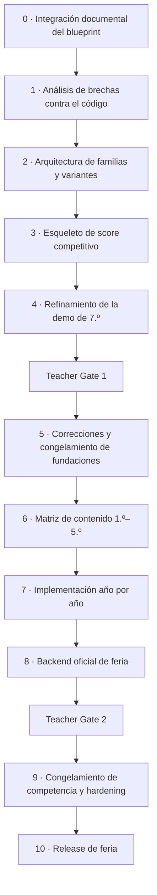

# Secuencia de implementación

**Estado: PRODUCT DIRECTION.** El orden es la dirección acordada; el alcance exacto de cada etapa se acota al aceptar la tarea correspondiente.

Este documento responde una pregunta: **después de integrar el blueprint v0.2, ¿en qué orden se construye lo que falta?** El backlog por features está en [backlog MVP](mvp-backlog.md); las fases de validación y sus gates, en [ciclo de entrega real](../00-product/real-delivery-lifecycle.md).

> La integración documental del blueprint **no implementó ninguna de estas etapas**. Todas siguen pendientes.

## Orden

## 0 · Integración documental — hecho

Este paquete de documentación. Su alcance y sus límites están en [la integración del blueprint](../07-reference/blueprint-v0.2-integration.md).

## 1 · Análisis de brechas contra el código

Antes de tocar nada: recorrer [arquitectura objetivo del motor](../03-architecture/target-engine-architecture.md) capacidad por capacidad y confirmar el estado real contra el código y los tests. La tabla de esa página es una lectura del 28 de agosto de 2026, no una verdad permanente.

Salida esperada: la lista acotada de lo que realmente falta, y qué de eso está bloqueado por una decisión docente.

## 2 · Arquitectura de familias y variantes

Convertir los desafíos autorados en estructura compatible con `ScenarioFamily → Template → Variant`, conservando la matemática existente. Agregar invariantes de variante como contrato transversal y demostrar variación entre runs con tests.

**No** se rehace la matemática de los desafíos de 7.º. Ver [familias, plantillas y variantes](../01-game-design/challenge-families-and-variants.md).

## 3 · Esqueleto de score competitivo

Desempeño normalizado por evento, desglose de score, ponderación configurable, métricas de desempate y visualización local. Sin leaderboard de producción todavía.

Todo coeficiente entra como política versionada con su versión declarada. Ver [score competitivo y ranking](../01-game-design/competitive-scoring-and-ranking.md).

## 4 · Refinamiento de la demo de 7.º

QA visual y funcional, materiales de revisión docente y la lista explícita de decisiones abiertas. Alcance en [vertical slice de 7.º grado](vertical-slice-grade-7.md).

## Teacher Gate 1

[Checklist y forma de la sesión](teacher-gates.md). Cada ítem cerrado se anota en el [registro de decisiones](../07-reference/decision-register.md); cada ítem que queda abierto, en [preguntas abiertas](../07-reference/open-questions.md).

## 5 · Correcciones y congelamiento de fundaciones

## 6 · Matriz de contenido 1.º–5.º

Una fila por plantilla, no por variante: etapa, familia, plantilla, propósito narrativo, dominios matemáticos, interacción, banda de dificultad, qué dimensiones de carrera toca, aporte al score, flags, assets, invariantes y estado de revisión docente.

El Departamento de Matemática revisa **la matriz**, no sólo pantallas terminadas.

## 7 · Implementación año por año

Para cada año: plantillas de contenido, generadores y variantes validadas, property tests, storylets y hito de etapa. Mismo sistema de diseño, mismas abstracciones de motor. Un año nuevo debería ser contenido, no reinvención.

## 8 · Backend oficial de feria

Emisión de runs, verificación por replay, servicio de score, leaderboard con personal best transaccional, moderación y persistencia. Ver [arquitectura objetivo del motor](../03-architecture/target-engine-architecture.md).

## Teacher Gate 2

## 9 · Congelamiento y hardening

Simulación, carga, red, seguridad, accesibilidad, QA móvil y ensayo operativo. Ver [modo feria y congelamiento](../05-operations/fair-mode-and-competition-freeze.md).

## 10 · Release de feria

## Reglas que atraviesan toda la secuencia

- Una constante `RECOMENDADO` o `TEACHER GATE` no se escribe como número mágico: se escribe como política versionada.
- No se cierra una pregunta abierta desde el código.
- No se mueve la evaluación matemática a React.
- No se confía en el score final del navegador.
- No se expone `mastery` como una stat visible.
- Estilo no puntúa directamente.
- No se generan variantes de competencia sin validar.
- Después del congelamiento, una regla de competencia sólo cambia con versión nueva.
- La revisión docente no es evidencia de que los estudiantes se enganchen.
