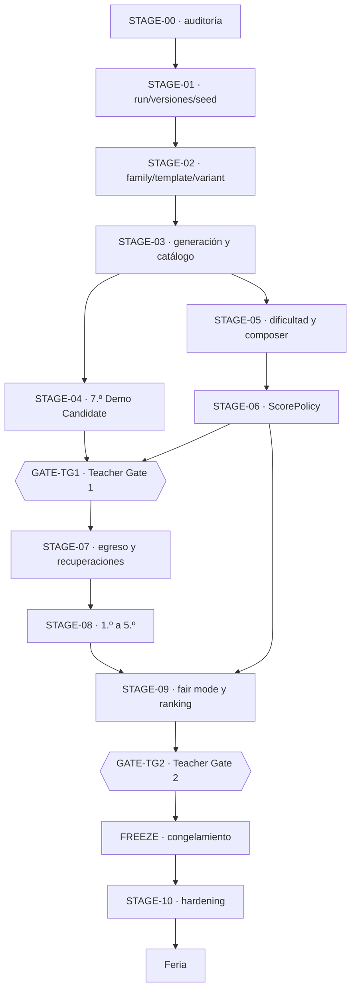

# Roadmap de implementación funcional

Este es el **roadmap canónico** de Egresado y el único documento que declara en qué etapa está el proyecto. No hay un segundo roadmap.

Reparto de responsabilidades, para que este documento no se convierta en un segundo blueprint:

```text
ADRs · Blueprint integrado · GDD · marco matemático     → QUÉ y POR QUÉ
Sistema de diseño v0.2                                  → EXPRESIÓN VISUAL
Código + tests                                          → REALIDAD IMPLEMENTADA
Este roadmap                                            → CUÁNDO, ESTADO, ALCANCE, DEPENDENCIAS, GATES
```

Si el roadmap y el código difieren, **el código gana** y el roadmap se corrige después de auditar.

- Vista corta y siempre en contexto: [etapa actual](current-stage.md).
- Fases de validación externa y congelamiento: [ciclo de entrega real](../00-product/real-delivery-lifecycle.md).
- Qué se construye por capas de alcance: [alcance y roadmap](../00-product/scope-and-roadmap.md) y [backlog](mvp-backlog.md).

**Última reconciliación contra el código:** 28 de agosto de 2026, sobre `eb7fe8f`.

---

## Vocabulario de estado

| Estado | Significado |
|---|---|
| `NOT_STARTED` | no empezó y no está lista para empezar |
| `READY` | dependencias satisfechas; puede empezar ya |
| `IN_PROGRESS` | alguien la está ejecutando |
| `PARTIAL` | parte del alcance está terminada con evidencia y el resto sigue pendiente o bloqueado |
| `BLOCKED` | no puede avanzar por una dependencia o decisión externa |
| `TEACHER_GATE` | espera aprobación del Departamento de Matemática |
| `VALIDATING` | implementada, corriendo su validación requerida |
| `DONE` | criterios de aceptación satisfechos **con evidencia** |
| `DEFERRED` | fuera de alcance a propósito |
| `SUPERSEDED` | reemplazada por otra decisión o etapa |

Sólo una etapa debería estar `IN_PROGRESS` a la vez, salvo paralelismo documentado acá.

**`DONE` exige evidencia**, no intuición: un ADR, un módulo, un test, un reporte de simulación, un E2E o una salida de verificación. Código escrito no es `DONE`.

---

## Resumen de etapas

Tabla de navegación. Los contratos de cada etapa, más abajo, son la autoridad.

| Etapa | Nombre | Estado | Depende de | Gate |
|---|---|---|---|---|
| [STAGE-00](#stage-00-auditoría-funcional-ejecutable) | Auditoría funcional ejecutable | `DONE` | — | — |
| [STAGE-01](#stage-01-contratos-de-run-versiones-y-seeds) | Contratos de run, versiones y seeds | `DONE` | STAGE-00 | — |
| [STAGE-02](#stage-02-scenariofamily-challengetemplate-challengevariant) | ScenarioFamily → Template → Variant | **`READY`** | STAGE-01 | — |
| [STAGE-03](#stage-03-generación-validación-y-catálogo-de-variantes) | Generación, validación y catálogo de variantes | `NOT_STARTED` | STAGE-02 | — |
| [STAGE-04](#stage-04-7º-completo-como-demo-candidate) | 7.º completo como Demo Candidate | `PARTIAL` | STAGE-02, STAGE-03 | — |
| [STAGE-05](#stage-05-modelo-de-dificultad-y-run-composer) | Modelo de dificultad y Run Composer | `NOT_STARTED` | STAGE-03 | — |
| [STAGE-06](#stage-06-scorepolicy-competitiva) | ScorePolicy competitiva | `NOT_STARTED` | STAGE-05 | — |
| [GATE-TG1](#gate-tg1-teacher-gate-1) | **Teacher Gate 1** | `TEACHER_GATE` | STAGE-04, STAGE-06 | externo |
| [STAGE-07](#stage-07-invariante-de-egreso-fail-forward-y-recuperaciones) | Egreso, fail-forward y recuperaciones | `NOT_STARTED` | GATE-TG1 | — |
| [STAGE-08](#stage-08-contenido-incremental-de-1º-a-5º) | Contenido incremental 1.º → 5.º | `NOT_STARTED` | STAGE-07 | auditoría tras 1.º |
| [STAGE-09](#stage-09-fair-mode-servidor-autoritativo-y-ranking) | Fair mode, servidor autoritativo y ranking | `NOT_STARTED` | STAGE-06, STAGE-08 | — |
| [GATE-TG2](#gate-tg2-teacher-gate-2) | **Teacher Gate 2** | `TEACHER_GATE` | STAGE-09 | externo |
| [FREEZE](#freeze-congelamiento-de-competencia) | Congelamiento de competencia | `NOT_STARTED` | GATE-TG2 | — |
| [STAGE-10](#stage-10-production-hardening) | Production hardening | `NOT_STARTED` | FREEZE | go-live |
| [RELEASE](#release-y-post-feria) | Feria y post-feria | `NOT_STARTED` | STAGE-10 | — |

### Grafo de dependencias

La dirección no se negocia: **el ranking no se implementa antes de que exista una semántica de score reproducible.**



---

## Matriz de capacidades

Estado real contra el código al 28 de agosto de 2026. Es la base de la que salen los estados de etapa de arriba, y lo que hay que reverificar antes de planificar.

| Capacidad | Estado | Evidencia | Etapa |
|---|---|---|---|
| Sistema de diseño v0.2 | `DONE` | [ADR-017](../03-architecture/adr/ADR-017-paper-visual-identity.md), [docs](../09-design-system/README.md), `pnpm design:check`, `tests/e2e/design-system.spec.ts` | previa |
| Blueprint integrado | `DONE` | [ADR-018](../03-architecture/adr/ADR-018-blueprint-v0-2-decision-authority.md), [integración](../07-reference/blueprint-v0.2-integration.md) | previa |
| Career Model v2 | `DONE` | [ADR-016](../03-architecture/adr/ADR-016-career-player-model.md), `src/game/progression/career.ts`, `ENGINE_VERSION 2.0.0` | previa |
| Ledger de notas y Promedio derivado | `DONE` | `career.ts` → `grades: readonly number[]` | previa |
| `null` ≠ 0 en dimensiones de carrera | `DONE` | `career.ts`, `tests/component/grade-7-ui.test.tsx` | previa |
| Aura con signo, sin techo, introducida en juego | `DONE` | `career.ts`, `src/content/grade-7/challenges/may-25-act.ts`, E2E «el acto del 25 de Mayo introduce Aura» | STAGE-04 |
| Acto del 25 de Mayo | `DONE` | `may-25-act.ts`, `src/game/math/classification.ts`, `tests/unit/number-classification.test.ts`, 6 E2E, contenido `0.3.0-grade-7` | STAGE-04 |
| Mastery y flags ocultos | `DONE` | `career.ts` → `mastery`, `src/game/narrative/` | previa |
| Motor determinista separado de React | `DONE` | [ADR-011](../03-architecture/adr/ADR-011-functional-core-transition-engine.md), `tests/unit/architecture-lint.test.ts`, `tests/unit/engine-modules.test.ts` | previa |
| Tripleta de versiones de run | `DONE` | `src/game/core/versioning.ts`, `assertCompatibleVersions` | STAGE-01 |
| Ownership de seed y substreams | `DONE` | [ADR-012](../03-architecture/adr/ADR-012-seeded-prng-and-substreams.md), `src/game/random/seed.ts`, `tests/unit/rng-addressing.test.ts` | STAGE-01 |
| `RunDescriptor` inmutable, separado del estado mutable | `DONE` | `src/game/runs/state.ts` | STAGE-01 |
| Replay | `DONE` | `src/game/runs/replay.ts`, `tests/unit/engine-golden.test.ts`, `tests/property/engine.property.test.ts` | STAGE-01 |
| Snapshot versionado con rechazo explícito | `DONE` | `src/game/runs/snapshot.ts`, E2E de reanudación y de checkpoint corrupto | STAGE-01 |
| Separación outcome ≠ carrera ≠ score | `DONE` | `challenges/contracts.ts`, `progression/career.ts`, `scoring/policy.ts` | STAGE-01 |
| `scoreVersion` | `NOT_STARTED` | — | STAGE-06 |
| `variantCatalogVersion` | `NOT_STARTED` | — | STAGE-03 |
| `ScenarioFamily` | `NOT_STARTED` | no existe `familyId` en el código | STAGE-02 |
| `ChallengeTemplate` | `PARTIAL` | `ChallengeSpec` ya separa `generate`/`verify`/`present`/`evaluate`, pero una definición es un escenario entero, no una estructura cognitiva dentro de una familia | STAGE-02 |
| `ChallengeVariant` | `PARTIAL` | arrays `VARIANTS` autorados por desafío y elección por seed; no hay tipo `Variant` serializable de primera clase | STAGE-02 |
| `VariantGenerator` reutilizable | `PARTIAL` | `generate(context)` por desafío; sin abstracción por restricción compartida | STAGE-03 |
| `VariantValidator` transversal | `PARTIAL` | `verify(model)` por desafío + `src/game/content/validation.ts`; sin contrato de invariantes común | STAGE-03 |
| Catálogo de variantes desplegado | `NOT_STARTED` | — | STAGE-03 |
| Auditoría estadística de variantes | `PARTIAL` | `ChallengeGenerationStats` ya reporta seeds, fallos, presentaciones distintas y distribución de opción correcta | STAGE-03 |
| `DifficultyBand` (CORE/STANDARD/STRETCH) | `NOT_STARTED` | hoy sólo `DifficultyLevel` 1–5 en `challenges/taxonomy.ts` | STAGE-05 |
| `difficultyCost` | `NOT_STARTED` | — | STAGE-05 |
| `DifficultyBudget` | `NOT_STARTED` | — | STAGE-05 |
| `RunComposer` equiparado por presupuesto | `PARTIAL` | `src/game/narrative/selection.ts` compone por peso y cooldown; `src/game/difficulty/policy.ts` ajusta nivel; sin equiparación de masa de dificultad | STAGE-05 |
| `ScorePolicy` versionada | `PARTIAL` | `src/game/scoring/policy.ts` y `development-policy.ts`, con `production: false` y `createRuleset` negándose a construir un ruleset oficial | STAGE-06 |
| `MathPerformance` · `TeamPerformance` · `AuraPerformance` | `NOT_STARTED` | — | STAGE-06 |
| `FairScore` y desglose competitivo | `NOT_STARTED` | — | STAGE-06 |
| Invariante de egreso | `NOT_STARTED` | `STAGE_ORDER` llega a `graduation`, pero no hay estado terminal `GRADUATED`; el único `run.graduated` vive en un fixture de test | STAGE-07 |
| Recuperaciones y fail-forward | `NOT_STARTED` | — | STAGE-07 |
| Contenido 1.º · 2.º · 3.º · 4.º · 5.º | `NOT_STARTED` | sólo existe `src/content/grade-7/` | STAGE-08 |
| Verificación autoritativa por replay | `PARTIAL` | `src/server/game/validate-run.ts` + `tests/integration/server-run-validation.test.ts`: replaya y **ignora el score enviado**. Faltan endpoints, sesión, rate limit y persistencia | STAGE-09 |
| Ranking con personal best | `NOT_STARTED` | — | STAGE-09 |
| Desempate lexicográfico | `NOT_STARTED` | — | STAGE-09 |
| Fair mode operativo | `PARTIAL` | `GameMode` ya declara `'fair'` como literal; no hay comportamiento asociado | STAGE-09 |
| Configuración de competencia | `NOT_STARTED` | — | FREEZE |
| Simulación determinista masiva | `DONE` para el alcance actual | `src/game/testing/simulation.ts`, `pnpm game:simulate`, 200 runs en `pnpm verify` | transversal |
| E2E y accesibilidad automatizada | `DONE` para el alcance actual | `tests/e2e/`, `@axe-core/playwright`, 68 tests | transversal |
| Production hardening | `NOT_STARTED` | — | STAGE-10 |

### Discrepancias registradas

- `STAGE_ORDER` incluye las siete etapas hasta `graduation`, pero sólo `grade-7` tiene contenido y ruleset. La estructura de progresión existe; **el egreso, no**. Documentación que hable de la carrera completa describe objetivo, no presente.
- `GameMode` admite `'fair'` y `'practice'`, y `DifficultySetting` admite `'adaptive'`. Son literales que el motor acepta; ninguno tiene todavía la semántica competitiva que el roadmap describe a partir de STAGE-05.

---

## Contratos de etapa

### STAGE-00 — Auditoría funcional ejecutable

- **Estado:** `DONE`
- **Depende de:** —
- **Desbloquea:** STAGE-01, STAGE-02

**Propósito.** Convertir el Blueprint integrado en un mapa técnico contra el código real, antes de cualquier cambio grande.

**Scope IN.** Auditar Blueprint, ADRs, motor, contenido, sistema de diseño, 7.º, tests, replay/snapshot y simulación; producir la matriz de capacidades y el grafo de dependencias reales.

**Scope OUT.** Cualquier refactor. Ranking. Motor de variantes. Scoring. Contenido de 1.º–5.º. Cambios de runtime de cualquier tipo.

**Lectura requerida.** [Integración del blueprint](../07-reference/blueprint-v0.2-integration.md), [arquitectura objetivo del motor](../03-architecture/target-engine-architecture.md), [game engine](../03-architecture/game-engine.md).

**Criterios de aceptación.**

- [x] Código inspeccionado, no sólo documentación.
- [x] Cada capacidad tiene estado y evidencia.
- [x] Dependencias identificadas y ordenadas.
- [x] Presente y objetivo separados.
- [x] Teacher Gates identificados.
- [x] No se ejecutó ninguna megamigración.

**Validación requerida.** `node scripts/validate-agent-workspace.mjs`, `node scripts/sync-master-spec.mjs --check`.

**Evidencia.** La matriz de capacidades de este documento; [arquitectura objetivo del motor](../03-architecture/target-engine-architecture.md) con 24 capacidades y su estado; [ADR-018](../03-architecture/adr/ADR-018-blueprint-v0-2-decision-authority.md).

**Exit gate.** ¿Qué contratos del motor faltan realmente y cuáles ya existen? — **Contestado.**

---

### STAGE-01 — Contratos de run, versiones y seeds

- **Estado:** `DONE`
- **Depende de:** STAGE-00
- **Desbloquea:** STAGE-02

**Propósito.** Consolidar los contratos base sobre los que se apoyan variantes, replay, scoring y fair mode.

**Scope IN.** Versionado explícito de la run; ownership y derivación determinista de seeds; `RunDescriptor` inmutable separado del estado mutable; separación de tipos entre resultado de desafío, efectos de carrera y score.

**Scope OUT.** `FairScore`. Catálogo de variantes. Metadata de evento o competencia. Endpoints. Persistencia de runs.

**Lectura requerida.** [ADR-003](../03-architecture/adr/ADR-003-deterministic-seeded-engine.md), [ADR-011](../03-architecture/adr/ADR-011-functional-core-transition-engine.md), [ADR-012](../03-architecture/adr/ADR-012-seeded-prng-and-substreams.md), [game engine](../03-architecture/game-engine.md).

**Criterios de aceptación.**

- [x] La run identifica las versiones relevantes.
- [x] El ownership de seed tiene un contrato único.
- [x] La derivación determinista está probada.
- [x] `RunDescriptor` está separado del estado mutable.
- [x] El replay consume y valida la información necesaria.
- [x] El score competitivo no se mezcló con la carrera.
- [x] Snapshot, replay y tests pasan.

**Validación requerida.** `pnpm test`, `pnpm game:simulate`, `pnpm verify`.

**Evidencia.** `src/game/core/versioning.ts`; `src/game/random/seed.ts` y `rng.ts`; `RunDescriptor` en `src/game/runs/state.ts`; `src/game/runs/replay.ts` y `snapshot.ts`; `tests/unit/engine-golden.test.ts`, `tests/unit/rng-addressing.test.ts`, `tests/property/engine.property.test.ts`, `tests/integration/server-run-validation.test.ts`.

**Lo que no entró, y por qué.** `scoreVersion` y `variantCatalogVersion` no existen todavía. Son opcionales por diseño: agregar campos vacíos hoy sería especulativo, porque nada los puede poblar. Cada uno entra con la etapa que le da significado — `variantCatalogVersion` en [STAGE-03](#stage-03-generación-validación-y-catálogo-de-variantes) y `scoreVersion` en [STAGE-06](#stage-06-scorepolicy-competitiva) — y ambos figuran en el Scope IN de esas etapas. No es trabajo huérfano.

**Riesgos.** Al agregar los dos ejes de versión faltantes hay que decidir si eso cambia la compatibilidad de replay. La regla vigente es igualdad exacta, no rangos semver.

**Decisiones.** `LOCKED`: determinismo por seed + versiones + comandos. `LOCKED`: el navegador no es autoridad de score.

**Exit gate.** ¿Puedo reconstruir con qué reglas y con qué seed existió esta run? — **Sí**, probado por golden replays y por la validación autoritativa en servidor.

---

### STAGE-02 — ScenarioFamily → ChallengeTemplate → ChallengeVariant

- **Estado:** **`READY`** — es la etapa activa. Ver [etapa actual](current-stage.md).
- **Depende de:** STAGE-01 (`DONE`)
- **Desbloquea:** STAGE-03, y con ella STAGE-04

**Propósito.** Permitir varias estructuras cognitivas por escenario y variantes reproducibles de primera clase. Hoy cada desafío es una definición monolítica con un array interno de parámetros: alcanza para que los números cambien, no para que cambie la pregunta.

**Scope IN.**

- Tipos `ScenarioFamily`, `ChallengeTemplate` y `ChallengeVariant`, con identidad estable y serializable.
- Una plantilla representa una **estructura de razonamiento**, no otro juego de números.
- La variante lleva su dirección determinista (familia, plantilla, seed de variante, parámetros) y se puede reconstruir desde ella.
- Extender `ChallengeInstanceRef` para que direccione familia y plantilla además de la definición.
- Estrategia de migración del contenido existente, escrita antes de migrarlo.
- Tests de identidad, versionado y serialización.

**Scope OUT.** **Crítico para no desbordar el alcance.**

- No implementar generadores por restricción reutilizables — es [STAGE-03](#stage-03-generación-validación-y-catálogo-de-variantes).
- No construir el catálogo desplegado ni `variantCatalogVersion`.
- No migrar todavía los cinco desafíos de 7.º — es [STAGE-04](#stage-04-7º-completo-como-demo-candidate).
- No tocar bandas de dificultad, `difficultyCost` ni presupuesto.
- No tocar scoring, `FairScore` ni ranking.
- No agregar contenido de 1.º–5.º.
- No modificar el sistema de diseño ni introducir estilos nuevos.
- No reescribir la matemática de los desafíos existentes.

**Lectura requerida.** [Familias, plantillas y variantes](../01-game-design/challenge-families-and-variants.md) · [sistema de desafíos](../01-game-design/challenge-system.md) · [game engine](../03-architecture/game-engine.md) · [arquitectura objetivo del motor](../03-architecture/target-engine-architecture.md) · [ADR-007](../03-architecture/adr/ADR-007-content-as-data.md) · [ADR-012](../03-architecture/adr/ADR-012-seeded-prng-and-substreams.md) · [guía de autoría](../01-game-design/content-authoring-guide.md).

**Entregables.** Tipos y contratos en `src/game/challenges/`; adaptación del registro; documento de estrategia de migración; tests unitarios y de propiedad; ADR si la dirección de dependencias del motor cambia.

**Criterios de aceptación.**

- [ ] `ScenarioFamily`, `ChallengeTemplate` y `ChallengeVariant` están tipados y el registro los expone sin `any` ni casts.
- [ ] Dos plantillas de la misma familia coexisten **sin duplicar la lógica completa del desafío**.
- [ ] Una variante se serializa y se reconstruye idéntica desde su dirección determinista.
- [ ] La derivación de seed de variante es estable y está cubierta por property tests.
- [ ] El motor sigue sin depender de React: `tests/unit/architecture-lint.test.ts` y `engine-modules.test.ts` en verde.
- [ ] Existe un documento de estrategia de migración del contenido legacy.
- [ ] Los seis desafíos de 7.º siguen jugándose igual: golden replays sin cambio de resultado, o bump de versión justificado y documentado.

**Validación requerida.** `pnpm test`, `pnpm typecheck`, `pnpm lint`, `pnpm game:validate-content`, `pnpm game:simulate -- --runs=400 --verify=10`, `pnpm verify`.

**Riesgos.**

- Cambiar la dirección de instancia puede alterar el consumo de RNG y romper golden replays. Si el resultado cambia, es un bump de `ENGINE_VERSION`, no un regenerado silencioso de goldens.
- Tentación de migrar el contenido «ya que estamos». No: eso es STAGE-04 y necesita STAGE-03 antes.

**Decisiones.** `RECOMENDADA` (D-006): la jerarquía family/template/variant es dirección de arquitectura, no contrato cerrado — se implementa de forma que se pueda ajustar. `LOCKED` (D-007): variantes deterministas por seed. `OPEN` ([pregunta 46](../07-reference/open-questions.md)): cuántas familias y plantillas por año.

**Evidencia de completitud.** Módulos de tipos y registro; tests de identidad/serialización; salida de `pnpm verify`; documento de migración; actualización de esta etapa y de [etapa actual](current-stage.md).

**Exit gate.** ¿Pueden existir dos variantes de la misma plantilla sin duplicar toda la lógica del desafío?

---

### STAGE-03 — Generación, validación y catálogo de variantes

- **Estado:** `NOT_STARTED`
- **Depende de:** STAGE-02
- **Desbloquea:** STAGE-04, STAGE-05

**Propósito.** Diversidad reproducible, controlada y auditable. **Variabilidad no es aleatoriedad libre.**

**Scope IN.** Generación por restricción, incluida generación inversa donde convenga; `VariantValidator` con invariantes genéricos y por plantilla; tooling offline `generador → N seeds candidatas → validación → análisis estadístico → catálogo aprobado`; catálogo versionado y `variantCatalogVersion` en la identidad de la run; selección determinista de variantes aprobadas por id/seed.

**Scope OUT.** Bandas y presupuesto de dificultad. Score competitivo. Ranking. Contenido de años nuevos. Endpoints de servidor.

**Lectura requerida.** [Familias, plantillas y variantes](../01-game-design/challenge-families-and-variants.md) · [validación y auditoría de variantes](../04-quality/variant-validation-and-audit.md) · [validación de contenido](../04-quality/content-validation.md) · [base teórica](../07-reference/research-basis.md).

**Criterios de aceptación.**

- [ ] Los generadores son deterministas y no consultan ninguna fuente ambiente.
- [ ] Los validadores rechazan efectivamente casos inválidos, con test que lo demuestre.
- [ ] Miles de seeds por plantilla donde el espacio paramétrico lo justifique.
- [ ] El tooling reporta fallas de forma legible por máquina.
- [ ] **Cero variantes inválidas en el catálogo desplegado.**
- [ ] Cero opciones duplicadas en el catálogo desplegado.
- [ ] El catálogo es reproducible y versionado; el mismo insumo produce el mismo catálogo.
- [ ] La auditoría estadística reporta sesgo de posición, distribución de dificultad, duplicados por fingerprint y tasa de invalidez.
- [ ] El runtime competitivo selecciona sólo variantes aprobadas.

**Validación requerida.** `pnpm game:validate-content` con conteo alto de seeds, `pnpm test`, el nuevo comando de auditoría de catálogo, `pnpm verify`.

**Riesgos.** El costo de generación puede volver lento el arranque si el catálogo se construye en runtime; es un job de build. Un fingerprint mal definido esconde variantes equivalentes.

**Decisiones.** `RECOMENDADA` (D-008): catálogo prevalidado para competencia. `LOCKED` (D-007): seeds deterministas.

**Exit gate.** ¿Se puede generar, validar y reproducir un conjunto grande de variantes sin depender de aleatoriedad ambiente?

---

### STAGE-04 — 7.º completo como Demo Candidate

- **Estado:** `PARTIAL` — la mitad de Aura y del acto está `DONE`; la migración está bloqueada por STAGE-02 y STAGE-03.
- **Depende de:** STAGE-02, STAGE-03
- **Desbloquea:** GATE-TG1

**Propósito.** Usar 7.º como banco de prueba real de la arquitectura nueva antes de producir los demás años.

**Scope IN.**

- Migrar los cinco escenarios existentes —colectivo, mural, cuaderno, proyecto grupal, stand— a familia/plantilla/variante.
- Preservar la intención matemática de cada uno, salvo cambio deliberado y documentado.
- Al menos una segunda plantilla en las familias donde la variación estructural aporte.
- Toda UI nueva consume el sistema de diseño v0.2.

**Scope OUT.** Reescribir la matemática existente. Rediseño visual. Contenido de años nuevos. Score competitivo. Ranking. Recuperaciones.

**Lectura requerida.** [Vertical slice de 7.º](vertical-slice-grade-7.md) · [catálogo de desafíos](../01-game-design/challenge-catalog.md) · [familias y variantes](../01-game-design/challenge-families-and-variants.md) · [sistema de diseño](../09-design-system/README.md) · [migración de 7.º](../09-design-system/migration-7-grade.md).

**Criterios de aceptación.**

- [ ] Los cinco desafíos previos migrados, o la transición documentada explícitamente.
- [ ] Matemática previa preservada; cualquier cambio, deliberado y escrito.
- [x] El acto del 25 de Mayo está en el flujo real de la partida.
- [x] Aura pasa de `null` a un valor significativo durante la run.
- [x] Aura no se dibuja antes de ser introducida.
- [x] Clasificación y F1 probados, incluidos los tres casos de denominador cero.
- [x] Jugable con teclado y en 360/390/430 px.
- [x] El motor evalúa la matemática; React no.
- [x] Replay, snapshot y simulación correctos.
- [x] El cierre de año sigue funcionando.

**Validación requerida.** `pnpm verify` completo, incluidos `pnpm test:e2e:only` y `pnpm design:check`.

**Evidencia ya disponible.** `src/content/grade-7/challenges/may-25-act.ts`; `src/game/math/classification.ts`; `tests/unit/number-classification.test.ts`; `tests/unit/grade-7-content.test.ts`; `tests/property/grade-7.property.test.ts`; `tests/integration/grade-7-run.test.ts`; seis pruebas E2E del acto, incluidas teclado, cinco viewports y Aura negativa; contenido y ruleset en `0.3.0-grade-7`.

**Riesgos.** Migrar contenido y cambiar arquitectura en el mismo paso hace que un fallo de golden replay sea ambiguo. Migrar de a una familia.

**Decisiones.** `OPEN` ([pregunta 42](../07-reference/open-questions.md)): si el acto del 25 de Mayo entra a producción — está implementado, falta la aprobación de contenido. `LOCKED` (D-001, D-002): identidad UI-first y sistema de diseño v0.2.

**Exit gate.** ¿Es 7.º una **Demo Candidate** representativa del producto final?

---

### STAGE-05 — Modelo de dificultad y Run Composer

- **Estado:** `NOT_STARTED`
- **Depende de:** STAGE-03
- **Desbloquea:** STAGE-06

**Propósito.** Producir runs distintas pero comparables. Sin esto, el sorteo de variantes decide parte del ranking.

**Scope IN.** Bandas `CORE / STANDARD / STRETCH` como metadata de autoría, con su correspondencia declarada contra `DifficultyLevel` 1–5; `difficultyCost` **separado** de `scoreMultiplier`; `DifficultyBudget` por run con tolerancia; Run Composer determinista que elige familia/plantilla/variante por variedad, presupuesto, no repetición, cobertura de dominios y coherencia narrativa; reporte de distribución de dificultad sobre miles de runs simuladas.

**Scope OUT.** Score competitivo y `FairScore`. Ranking. Dificultad adaptativa en modo oficial. Contenido nuevo.

**Lectura requerida.** [Dificultad y jugabilidad universal](../01-game-design/difficulty-and-playability.md) · [marco matemático](../01-game-design/math-design-framework.md) · [auditoría de equidad competitiva](../04-quality/competition-fairness-audit.md).

**Criterios de aceptación.**

- [ ] La dificultad de cada plantilla es explícita y justificable por estructura, no por tamaño de los números.
- [ ] `difficultyCost` y `scoreMultiplier` son campos distintos y están documentados como tales.
- [ ] El composer es determinista para un seed y una configuración dados.
- [ ] `abs(Σ difficultyCost − targetBudget) <= tolerance` como invariante testeada.
- [ ] Miles de runs simuladas sin diferencias groseras de dificultad total.
- [ ] La distribución de dificultad se reporta de forma legible.
- [ ] Presupuesto y multiplicadores son configuración, no constantes dispersas, para poder llevarlos a Teacher Gate.

**Validación requerida.** `pnpm test`, `pnpm game:simulate:deep`, el reporte de distribución, `pnpm verify`.

**Riesgos.** Multiplicadores de score grandes hacen que el sorteo domine sobre la habilidad; ése es el motivo de mantenerlos chicos y de separarlos del costo de scheduling.

**Decisiones.** `RECOMENDADA` (D-014): presupuesto de dificultad. `RECOMENDADA` (D-015): piso bajo y techo alto. `TEACHER_GATE` ([pregunta 44](../07-reference/open-questions.md)): calibración de bandas y costos. `OPEN` ([pregunta 5](../07-reference/open-questions.md)): manual, adaptativa o híbrida.

**Exit gate.** ¿Muchas runs distintas tienen dificultad total comparable, con evidencia de simulación?

---

### STAGE-06 — ScorePolicy competitiva

- **Estado:** `NOT_STARTED`
- **Depende de:** STAGE-05
- **Desbloquea:** GATE-TG1, STAGE-09

**Propósito.** Un score para ranking que no contamine la identidad de carrera.

**Scope IN.** `ScorePolicy` versionada y configurable con pesos, multiplicadores y topes; `MathPerformance`, `TeamPerformance` y `AuraPerformance` normalizados; `FairScore`; desglose auditable por run; `scoreVersion` en la identidad de la run; golden tests de score; simulación de distribución con perfiles de jugador sintéticos.

**Scope OUT.** Ranking, leaderboard y personal best. Endpoints. Persistencia. Congelamiento de coeficientes. **No cerrar los pesos**: 80/15/5 es candidato.

**Lectura requerida.** [Score competitivo y ranking](../01-game-design/competitive-scoring-and-ranking.md) · [fórmulas y algoritmos](../07-reference/formulas-and-algorithms.md) · [ejemplo de política](../07-reference/score-policy.example.json) · [ejemplo de desglose](../07-reference/score-breakdown.example.json) · [reglas, scoring y progresión](../01-game-design/rules-scoring-and-progression.md).

**Criterios de aceptación.**

- [ ] `ScorePolicy` está versionada y ninguna constante de peso vive dispersa en el código.
- [ ] **La misma run con la misma policy produce exactamente el mismo desglose y el mismo score.**
- [ ] El desglose explica componentes, multiplicadores, topes y versión de policy.
- [ ] En la policy candidata, la matemática domina el resultado, verificado por simulación.
- [ ] La contribución de Aura está acotada por un tope explícito.
- [ ] **Estilo no aporta score directo**, verificado por test.
- [ ] Promedio no se suma aparte de `MathPerformance` sin justificación escrita.
- [ ] Se pueden cargar y testear varias policies en paralelo.
- [ ] Golden tests de score fijan la salida de policies conocidas.
- [ ] La simulación reporta la distribución de score por perfil sintético.

**Validación requerida.** `pnpm test`, golden de score, `pnpm game:simulate:deep`, `pnpm verify`.

**Riesgos.** Escribir 80/15/5 como constante final. La policy tiene que poder cambiar por configuración después del Teacher Gate sin tocar el motor.

**Decisiones.** `RECOMENDADA` (D-010, D-012): score separado de la carrera; Estilo sin puntaje. `TEACHER_GATE` (D-011, [preguntas 38 y 39](../07-reference/open-questions.md)): pesos exactos y calibración de calidades. `LOCKED`: el navegador no es autoridad de score.

**Exit gate.** ¿La misma run con la misma policy da siempre el mismo desglose y el mismo score?

---

### GATE-TG1 — Teacher Gate 1

- **Estado:** `TEACHER_GATE` — pendiente. **No es una etapa de ingeniería.**
- **Depende de:** STAGE-04, STAGE-06
- **Desbloquea:** STAGE-07

Aprobación externa del Departamento de Matemática sobre la Demo Candidate de 7.º. Qué se demuestra, cómo se conduce la sesión y qué se pide decidir está en [gates docentes](teacher-gates.md).

**Se valida:** nivel matemático, terminología, situaciones, dificultad, ponderación de score, política de intentos, política de empate, duración de la run, lenguaje de recuperación.

**Criterios de aceptación.**

- [ ] Feedback registrado ítem por ítem.
- [ ] Cada comentario clasificado como aceptado, rechazado o diferido.
- [ ] Las decisiones cerradas actualizan el [registro de decisiones](../07-reference/decision-register.md).
- [ ] Las que siguen abiertas quedan en [preguntas abiertas](../07-reference/open-questions.md).
- [ ] La ScorePolicy candidata fue revisada por los docentes.
- [ ] **No se presentó la validación docente como playtest con estudiantes.**
- [ ] Este roadmap y la [etapa actual](current-stage.md) actualizados antes de empezar STAGE-07.

**Exit gate.** ¿Están cerradas o explícitamente diferidas las decisiones docentes que bloquean la producción de contenido?

---

### STAGE-07 — Invariante de egreso, fail-forward y recuperaciones

- **Estado:** `NOT_STARTED`
- **Depende de:** GATE-TG1
- **Desbloquea:** STAGE-08

**Propósito.** Formalizar la progresión **antes** de construir 1.º–5.º, para que ningún año tenga que inventar su propio sistema de fracaso y promoción.

**Scope IN.** Estado terminal `GRADUATED` y transición explícita hacia él; separación de desempeño y progresión; eventos de recuperación deterministas y comprimidos; estructura oculta de materias pendientes con callbacks; property tests de convergencia.

**Scope OUT.** Repetir año completo. Contenido de 1.º–5.º. Ranking. Arquetipo final de carrera completa. HUD nuevo: las previas son estado oculto, no una quinta dimensión visible.

**Lectura requerida.** [Egreso, recuperación y fail-forward](../01-game-design/graduation-and-fail-forward.md) · [reglas, scoring y progresión](../01-game-design/rules-scoring-and-progression.md) · [sistema narrativo](../01-game-design/narrative-system.md) · [game engine](../03-architecture/game-engine.md).

**Criterios de aceptación.**

- [ ] **Toda run válida completada llega a `GRADUATED`**, probado por property test sobre miles de secuencias de comandos válidas.
- [ ] No existe game over global.
- [ ] Un desempeño bajo activa recuperación o consecuencia, nunca un estado terminal de fracaso.
- [ ] Las recuperaciones son deterministas y reproducibles por seed.
- [ ] Ninguna recuperación puede crear un callejón sin salida.
- [ ] Los estados imposibles se rechazan de forma tipada.
- [ ] El replay atraviesa recuperaciones sin divergencia.
- [ ] El estado sigue siendo serializable y reanudable a través de una recuperación.

**Validación requerida.** `pnpm test`, `tests/property/`, `pnpm game:simulate:deep`, `pnpm verify`.

**Riesgos.** Un invariante de egreso mal formulado puede esconder un bucle infinito de recuperaciones. La property test tiene que acotar la cantidad de eventos, no sólo la convergencia.

**Decisiones.** `PRODUCT_DIRECTION` (D-005): sin game over global. `TEACHER_GATE`: lenguaje de recuperación y de previas.

**Exit gate.** ¿Pueden los años futuros apoyarse en este sistema de progresión sin inventar el suyo?

---

### STAGE-08 — Contenido incremental de 1.º a 5.º

- **Estado:** `NOT_STARTED`
- **Depende de:** STAGE-07
- **Desbloquea:** STAGE-09

**Propósito.** Construir la carrera completa reutilizando fundaciones, no reinventándolas.

**Orden obligatorio.** No es una tarea paralela.

```text
1.º → auditoría de escalabilidad → 2.º → 3.º → 4.º → 5.º
```

**1.º es la prueba crítica.** Al terminarlo hay que contestar: *¿qué fundaciones nuevas tuvimos que inventar?* Si la respuesta incluye un sistema fundamental —otro modelo de carrera, otro motor de score, otra gramática de progreso, otra paleta—, se revisa antes de seguir.

**Scope IN.** Por año: contenido, plantillas, variantes validadas, storylets, hito de etapa y, si hace falta de verdad, un renderer de interacción genuinamente nuevo. Matriz de contenido previa a la implementación.

**Scope OUT.** Otra paleta o rediseño visual. Otro Career Model. Otro motor de scoring. Otra gramática de progreso. Otro tratamiento de Aura. Ranking. **Un item de roadmap del tipo «rediseñar la UI para 1.º» no es válido** salvo decisión de producto aprobada.

**Lectura requerida.** [Alcance y roadmap](../00-product/scope-and-roadmap.md) · [marco matemático](../01-game-design/math-design-framework.md) · [guía de autoría](../01-game-design/content-authoring-guide.md) · [ficha de autoría](../07-reference/challenge-authoring.example.yaml) · [sistema de diseño](../09-design-system/README.md).

**Criterios de aceptación, por año.**

- [ ] Matemática revisada por el Departamento de Matemática.
- [ ] Variantes validadas, cero inválidas desplegadas.
- [ ] Presupuesto de dificultad consistente con los demás años.
- [ ] Storylets y flags coherentes con la historia previa.
- [ ] Efectos de carrera semánticos: la mayoría de los eventos mueve una o dos dimensiones.
- [ ] Accesibilidad y móvil verificados.
- [ ] Replay, snapshot y reanudación correctos.
- [ ] E2E y simulación del año en verde.
- [ ] **Ningún sistema fundamental duplicado.**
- [ ] Documentación del año actualizada.

**Validación requerida.** `pnpm verify`, `pnpm game:validate-content`, `pnpm game:simulate:deep`, `pnpm test:e2e:only`.

**Decisiones.** `OPEN` ([pregunta 46](../07-reference/open-questions.md)): cantidad de familias y plantillas por año. `DEFERRED` ([pregunta 48](../07-reference/open-questions.md)): acento visual por año — es alcance del sistema de diseño v0.4, no de esta etapa.

**Exit gate.** ¿Una run completa recorre `7.º → 1.º → 2.º → 3.º → 4.º → 5.º → EGRESADO`?

---

### STAGE-09 — Fair mode, servidor autoritativo y ranking

- **Estado:** `NOT_STARTED`
- **Depende de:** STAGE-06, STAGE-08
- **Desbloquea:** GATE-TG2

**Propósito.** Convertir el juego completo en una competencia cuya integridad se pueda defender.

**Frontera de confianza.**

```text
SERVIDOR   emite y registra el RunDescriptor
   ↓
CLIENTE    juega local-first y registra comandos
   ↓
SERVIDOR   valida versiones → replay → resultados → FairScore → ranking
```

El navegador **nunca** es autoridad de score. El precursor ya existe: `src/server/game/validate-run.ts` replaya una submission no confiable e ignora cualquier score que el cliente afirme.

**Scope IN.** Emisión de `RunDescriptor` oficial con metadata de evento; endpoints con idempotencia, reintentos, rate limiting y validación de versiones; verificación por replay; ranking por **personal best**; desempate lexicográfico determinista; política de intentos configurable; moderación de nickname; minimización de datos de menores; E2E de run → submission → ranking.

**Scope OUT.** Congelar la configuración de competencia — es [FREEZE](#freeze-congelamiento-de-competencia). Load testing y hardening — es [STAGE-10](#stage-10-production-hardening). Cerrar la política de empate o de intentos: son Teacher Gate.

**Lectura requerida.** [Arquitectura objetivo del motor](../03-architecture/target-engine-architecture.md) · [ADR-004](../03-architecture/adr/ADR-004-server-authoritative-scoring.md) · [ADR-006](../03-architecture/adr/ADR-006-local-first-gameplay.md) · [ADR-008](../03-architecture/adr/ADR-008-anonymous-identity.md) · [ADR-009](../03-architecture/adr/ADR-009-event-leaderboards.md) · [modo feria y congelamiento](../05-operations/fair-mode-and-competition-freeze.md) · [leaderboard y moderación](../05-operations/leaderboard-and-moderation.md) · [threat model](../04-quality/threat-model.md) · [contratos API](../03-architecture/api-contracts.md) · [modelo de datos](../03-architecture/data-model.md) · [ejemplo de descriptor](../07-reference/run-descriptor.example.json).

**Criterios de aceptación.**

- [ ] El cliente no puede imponer un score autoritativo; un payload con `score` lo ve ignorado, probado por test.
- [ ] El servidor verifica por replay y rechaza action logs imposibles con un código tipado.
- [ ] Un score local válido coincide exactamente con el autoritativo.
- [ ] El personal best se actualiza transaccionalmente y una run peor no reemplaza a la mejor.
- [ ] La política de intentos es configuración del evento.
- [ ] El desempate es determinista y su desglose queda guardado para auditoría.
- [ ] La tupla de versiones queda persistida en cada run oficial.
- [ ] Un doble envío es idempotente y no crea dos entradas.
- [ ] El ranking se comporta correctamente bajo la concurrencia objetivo.
- [ ] Minimización de datos de menores verificada.
- [ ] E2E completo de run → submission → ranking.

**Validación requerida.** `pnpm test`, `tests/integration/`, `pnpm test:e2e:only`, `pnpm db:reset` · `pnpm db:lint` · `pnpm db:types` si hay migración, `pnpm verify`.

**Riesgos.** Implementar leaderboard antes de que el score sea reproducible. Por eso STAGE-06 es dependencia dura.

**Decisiones.** `RECOMENDADA` (D-009, D-013): personal best y desempate profundo. `TEACHER_GATE` ([preguntas 40 y 41](../07-reference/open-questions.md)): intentos y empate exacto. `OPEN` ([preguntas 27 y 51](../07-reference/open-questions.md)): qué señal de tiempo puede verificar el servidor.

**Exit gate.** ¿Se puede correr una competencia simulada completa con score autoritativo en servidor?

---

### GATE-TG2 — Teacher Gate 2

- **Estado:** `TEACHER_GATE` — pendiente. **No es una etapa de ingeniería.**
- **Depende de:** STAGE-09
- **Desbloquea:** FREEZE

Aceptación externa del juego completo antes del congelamiento. Detalle en [gates docentes](teacher-gates.md).

**Criterios de aceptación.**

- [ ] Correcciones pedagógicas registradas.
- [ ] Scoring aprobado.
- [ ] Política de intentos aprobada.
- [ ] Política de empate aprobada.
- [ ] Reglas de premio aprobadas.
- [ ] Contenido de todos los años aceptado.
- [ ] Sin P0/P1 funcionales abiertos.
- [ ] Candidato a congelamiento declarado.

**Exit gate.** ¿Está aprobado el juego completo y su competencia para congelar?

---

### FREEZE — Congelamiento de competencia

- **Estado:** `NOT_STARTED`
- **Depende de:** GATE-TG2
- **Desbloquea:** STAGE-10

**Scope IN.** Congelar `rulesetVersion`, `scoreVersion`, `contentVersion`, `variantCatalogVersion`, política de dificultad, reglas de ranking y reglas de empate. Configuración de evento auditable e inmutable. Proceso de emergencia escrito.

**Scope OUT.** Cambios funcionales de cualquier tipo.

**Lectura requerida.** [Modo feria y congelamiento](../05-operations/fair-mode-and-competition-freeze.md) · [deploy y ambientes](../03-architecture/deployment-and-environments.md) · [ejemplo de configuración de evento](../07-reference/event-config.example.json).

**Criterios de aceptación.**

- [ ] Las versiones oficiales están identificadas y el evento habilita **sólo** esa tupla.
- [ ] La configuración del evento es auditable e inmutable.
- [ ] Toda run oficial apunta a esa configuración.
- [ ] El proceso de cambio de emergencia está documentado, con su política de recálculo.
- [ ] Cualquier cambio posterior al congelamiento exige registro explícito.

**Exit gate.** ¿Puede un tercero reconstruir con qué reglas exactas se jugó la competencia?

---

### STAGE-10 — Production hardening

- **Estado:** `NOT_STARTED`
- **Depende de:** FREEZE
- **Desbloquea:** la feria

**Propósito.** Compensar técnicamente que la feria puede ser el primer contacto real y a escala con estudiantes. **Ninguno de estos controles equivale a validación de experiencia con usuarios reales**; ver [ciclo de entrega real](../00-product/real-delivery-lifecycle.md).

**Scope IN.** Simulación masiva de decenas de miles de runs; load testing por encima de la concurrencia esperada; degradación de red; QA móvil priorizando Android modestos en 360/390/430 y Safari/iOS; telemetría mínima sin PII innecesaria; runbook de incidentes; checklist de go-live.

**Scope OUT.** Features nuevas. Cambios de contenido o de score que afecten equidad.

**Lectura requerida.** [Modo feria y congelamiento](../05-operations/fair-mode-and-competition-freeze.md) · [runbook de feria](../05-operations/fair-runbook.md) · [fallback e incidentes](../05-operations/fallback-and-incident-plan.md) · [analytics y observabilidad](../03-architecture/analytics-observability.md) · [NFR](../04-quality/non-functional-requirements.md) · [estrategia de testing](../04-quality/testing-strategy.md).

**Criterios de aceptación.**

- [ ] Load test documentado, sin fallas críticas a la concurrencia objetivo.
- [ ] Retry e idempotencia probados bajo carga.
- [ ] Suite de smoke móvil aprobada.
- [ ] La degradación de red **no pierde resultados en silencio**.
- [ ] Telemetría mínima operativa y sin PII innecesaria.
- [ ] Logs y alertas suficientes para operar la feria.
- [ ] El ranking es recuperable ante incidente.
- [ ] Backup y recuperación probados donde apliquen.
- [ ] Runbook listo y ensayado.
- [ ] Checklist de go-live completo.

**Exit gate.** ¿Se puede abrir la feria sin fallas críticas conocidas y con capacidad de responder a incidentes?

---

### RELEASE y post-feria

- **Estado:** `NOT_STARTED`

**Durante la feria.** No se cambia scoring. No se cambia dificultad ni catálogo de contenido que afecte score. Hotfixes sólo de crash, infraestructura, visual, moderación o seguridad. Si un fix afecta la equidad, se aplica la política explícita y se documenta o recalcula.

**Después.** Congelar resultados; resolver premios sobre runs verificadas y personal best; exportar y auditar el ranking; analizar telemetría; revisar incidentes; documentar aprendizajes; decidir continuidad, modo libre, archivo o evolución. Ver [modo feria y congelamiento](../05-operations/fair-mode-and-competition-freeze.md).

---

## Protocolo de actualización

### Antes de implementar

1. Leer `AGENTS.md` de la raíz y los del subtree que se vaya a tocar.
2. Leer [la etapa actual](current-stage.md).
3. Leer el contrato de esa etapa en este documento.
4. Leer la **lectura requerida** de la etapa. No leer `docs/` entero.
5. Auditar el código real: el roadmap puede estar desactualizado.
6. Confirmar que el estado declarado sigue siendo cierto.
7. Respetar **Scope IN** y **Scope OUT**. Si algo parece faltar, probablemente pertenece a otra etapa.

### Después de implementar

1. Correr la validación requerida de la etapa.
2. Marcar los criterios de aceptación efectivamente satisfechos.
3. Agregar la evidencia: rutas de módulos, tests, reportes, ADRs.
4. Registrar decisiones tomadas en el [registro de decisiones](../07-reference/decision-register.md); las que quedaron abiertas, en [preguntas abiertas](../07-reference/open-questions.md).
5. Registrar riesgos nuevos en el contrato de la etapa.
6. Actualizar el estado de la etapa y la fecha de última reconciliación.
7. Actualizar [la etapa actual](current-stage.md).
8. Pasar la siguiente etapa a `READY` **sólo si el exit gate pasa**.
9. Sincronizar la vista consolidada: `node scripts/sync-master-spec.mjs --write`.

**Nunca marcar `DONE` porque se escribió código.**

## Reglas permanentes para agentes

1. Un Teacher Gate no se cierra desde el código.
2. Una constante `RECOMENDADA` o `TEACHER_GATE` se escribe como política versionada, nunca como número mágico.
3. El sistema de diseño v0.2 es la autoridad visual y **no se reabre**. Una interacción genuinamente nueva puede aportar una primitiva reutilizable compatible con v0.2; no un tema propio ni estilos por feature.
4. La matemática autoritativa no se muda a React.
5. Nada de `Math.random()`, `Date.now()`, `new Date()` ni `performance.now()` en la transición ni en la evaluación.
6. Estilo no puntúa. Aura no se dibuja en cero antes de existir. Promedio no se cuenta dos veces.
7. No se implementa ranking antes de que el score sea reproducible.
8. No se generan variantes al azar sin restricciones ni validación.
9. No se expande el alcance de la etapa activa.
10. Si el roadmap y el código difieren, se corrige el roadmap después de auditar, no al revés.
