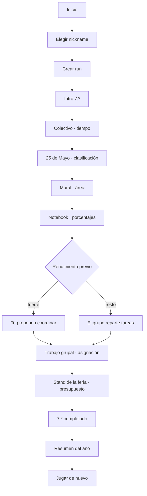

# Vertical slice — 7.º grado

Primera versión jugable de Egresado. Cubre el recorrido completo de un jugador real: entrada, nickname, 7.º grado con seis situaciones matemáticas, una consecuencia narrativa condicionada, cierre de año, resultado y volver a jugar.

Es la primera mitad de [MVP 0](../00-product/scope-and-roadmap.md#mvp-0-prototipo-local). MVP 0 declara 7.º **y** 1.º año; esta entrega cierra 7.º con calidad de producto antes de sumar el segundo año, para validar el loop con un año bien hecho en lugar de dos superficiales. La arquitectura no asume que 7.º sea la única etapa.

## Teacher Demo y partida normal compuesta

| | Teacher Demo Candidate (`grade-7`) | Partida normal compuesta (`grade-7-composed`) |
|---|---|---|
| Propósito | mostrar ampliamente matemática, interacciones y las cuatro dimensiones de carrera | aportar un año corto dentro de una futura carrera |
| Selección | `DemoPlan` explícito; ocho eventos y seis situaciones | `RunComposer`; uno o dos beats ordinarios y un `RunPlan` concreto |
| Dificultad | cobertura demostrativa, no presupuesto normal | `DifficultyBudget` candidato; hoy costo total 2,50 |
| 25 de Mayo / Aura | el acto está intencionalmente presente y demuestra Aura | el acto aparece sólo si lo selecciona el plan; no es una obligación de todo año ni una regla universal de toda run |

La pantalla de `/jugar` usa hoy la Teacher Demo Candidate. El ruleset compuesto existe, se ejecuta y se verifica de punta a punta, pero migrar la pantalla antes de tener contenido real de 1.º–5.º sería una decisión de producto fuera de STAGE-05. El resto de este documento describe la demo salvo que nombre explícitamente `grade-7-composed`.

## Flujo de la Teacher Demo

Ocho eventos: dos narrativos y seis desafíos. Duración objetivo histórica del slice: 3–5 minutos. Esta densidad pertenece al artefacto de demostración y no fija la longitud de un segmento normal de producción; desde STAGE-04 esa distinción está formalizada como un `DemoPlan`, un artefacto con reglas propias que **no** es un plan de run válido. Ver [ADR-021](../03-architecture/adr/ADR-021-approved-catalog-in-play-and-teacher-demo.md).

## Contenido de 7.º grado

Vive en `src/content/grade-7/`, no en fixtures de desarrollo. Es contenido de producto versionado (`contentVersion` `0.7.0-grade-7`).

Son **siete plantillas** y seis situaciones por partida: el slot del colectivo aloja dos plantillas de la misma familia y el seed elige cuál sale.

| Id | Situación | Matemática | Interacción | Razonamiento |
|---|---|---|---|---|
| `g7.bus-timing` | El colectivo llega demorado y hay que elegir en cuál subir | tiempo + porcentaje simple | `timeline` | 28 min + 25 % = 35 min; salida + 35 min contra la hora de entrada |
| `g7.bus-latest-departure` | La misma demora, y el grupo pregunta con cuánto tiempo hay que salir | tiempo + porcentaje simple, recorrido al revés | `numeric-input` | 28 min + 25 % = 35 min; 35 + 10 de margen ⇒ salir 45 min antes |
| `g7.may-25-act` | La coreografía del acto del 25 de Mayo, adelante de toda la escuela | clasificación: pares, múltiplos de 3 y primos | `number-grid` | tres grillas de ocho números; se marcan los que cumplen la regla de cada paso |
| `g7.mural-paint` | Hay que comprar pintura para el mural de la feria | área y cobertura | `decision-card` | 6 × 2,4 = 14,4 m²; 14,4 ÷ 8 = 1,8 L ⇒ 2 L |
| `g7.notebook-offer` | El curso compara dos ofertas para una notebook | porcentaje contra monto fijo | `decision-card` | 20 % de 800.000 = 160.000 ⇒ 640.000, contra 800.000 − 120.000 = 680.000 |
| `g7.group-tasks` | Repartir el trabajo grupal entre cuatro personas | asignación con restricciones | `assignment-board` | horas disponibles contra horas requeridas, más afinidad |
| `g7.stand-supplies` | Comprar la merienda del stand sin pasarse del presupuesto | combinación y costo unitario | `budget-builder` | cubrir las porciones necesarias al menor costo |

Ambos rulesets seleccionan **dentro del catálogo aprobado de desarrollo** vigente `grade-7-dev-3`: 26 o 27 direcciones por plantilla generada, y las dos autoradas de `g7.group-tasks`. Seis plantillas declaran generadores por restricción y `g7.group-tasks` es autorada; las dos estrategias pasan por validación, fingerprint y deduplicación, y ninguna produce azar procedural libre en runtime. El seed de la run elige **cuál** variante sale; qué contiene esa dirección no depende de la run. `dev-3` conserva la misma población semántica de `dev-2` y existe como versión inmutable nueva para `contentVersion 0.7.0-grade-7`. Ver [ADR-021](../03-architecture/adr/ADR-021-approved-catalog-in-play-and-teacher-demo.md) y [ADR-022](../03-architecture/adr/ADR-022-difficulty-model-and-run-composer.md).

### Calidades de resolución

Ninguno es correcto/incorrecto. Todos usan el modelo del motor:

- `invalid` — no resuelve el problema (llega tarde, no alcanza la pintura, no cubre las porciones, deja tareas sin asignar, excede el presupuesto o pierde la coreografía);
- `functional` — resuelve;
- `efficient` — resuelve sin desperdiciar;
- `optimal` — la mejor opción según la función objetivo declarada.

Un error nunca termina la run.

### El acto del 25 de Mayo

En la Teacher Demo es el evento que **introduce Aura**, y el único del arco amplio que ocurre en público. Está documentado en detalle en [el catálogo de desafíos](../01-game-design/challenge-catalog.md#acto-del-25-de-mayo). Lo esencial para el slice:

- son **tres pasos** de la coreografía, cada uno con su regla escrita —«Números pares», «Múltiplos de 3», «Números primos»— y una grilla de ocho números;
- la narrativa, las señales y las reglas son autoradas; las grillas numéricas concretas tienen fuente `generated` y validadores matemáticos independientes;
- se juzga con **precisión y cobertura juntas** (F1 agregado sobre los tres pasos), de modo que ni marcar una sola celda evidente ni marcar la grilla entera pasan por buenos;
- mueve **Aura y Estilo, y nada más**: no pone nota, porque un acto escolar no es una evaluación de matemática, y no toca Equipo, porque bailás vos.

## Narrativa

Nueve storylets en `src/content/grade-7/storylets.ts`. El orden lo fija el motor por prioridad descendente y por condiciones encadenadas (`storylet-seen`), no la UI.

En el arco de la Teacher Demo, el acto del 25 de Mayo entra como tercer evento, entre el colectivo y el mural: el acto cae en mayo, después de las primeras semanas de clase y antes de que arranque el proyecto de la feria, así que se intercala en el calendario escolar sin partir la cadena causal del proyecto.

El evento 6 es una bifurcación real evaluada por el motor narrativo:

- `g7.project-lead` — requiere dos resultados `efficient` o mejores en los últimos tres eventos;
- `g7.project-support` — alternativa cuando esa condición no se cumple.

Cada uno deja un flag distinto, y el resumen final del año lo refleja. Es la prueba de que una decisión temprana cambia el relato posterior.

## Resultado

La pantalla final muestra **el año**, no un perfil de egreso: `TU 7.º GRADO`. El perfil definitivo pertenece a la carrera completa y no se inventa acá.

Cierre de etapa: numeral del año con tilde, renglones de registro (Promedio, Equipo, eventos), Estilo expandido cuando hay evidencia suficiente, lo más memorable del año y el arquetipo con su sello. El bloque de Aura aparece sólo si Aura cambió. La Teacher Demo lo establece porque incluye deliberadamente el acto; una partida compuesta sólo lo hace cuando su `RunPlan` contiene `g7.may-25-act`, y un año futuro puede no mover Aura.

El score no se muestra: el oficial lo calcula el servidor reproduciendo la run, y el ruleset de desarrollo no es oficial (preguntas abiertas 5 y 24).

## Reanudar

El checkpoint se guarda en `localStorage` después de cada evento resuelto, a través del sink de efectos del controller: el motor pide el snapshot, el adaptador lo escribe. Si al abrir existe un checkpoint compatible, la entrada ofrece continuar o empezar de nuevo (UF-03). Un checkpoint corrupto o de otra versión se descarta con un aviso claro; nunca se restaura un estado inválido.

El checkpoint se escribe con la pantalla de resultado a la vista, y el borrador de la respuesta vive en la vista y no en el snapshot. Al reanudar sobre un resultado, entonces, la UI ya no sabe qué eligió el jugador: las opciones se dibujan todas sin marca y **la grilla del acto no se corrige**, en lugar de afirmar que no se marcó nada. El ledger sigue explicando la cuenta, que es lo que no se pierde.

No hay backend en el loop de juego: la partida es enteramente local (ADR-006).

## Cobertura de tests

| Capa | Qué prueba |
|---|---|
| Unit de contenido | La matemática de cada variante: solución válida, óptima, insuficiente y bordes |
| Property | Toda variante ofrece al menos una solución suficiente; las vistas públicas no filtran la solución |
| Integración | La run completa de 7.º sin React, en tres caminos: fuerte, mixto y débil |
| Golden | Una run de referencia con seed y respuestas fijas |
| Replay | El action log reproduce estado final, score, carrera y flags |
| Resume | Snapshot → restaurar → continuar llega al mismo final |
| Componentes | Renderers de interacción y pantallas |
| E2E | Recorrido completo en browser, camino no óptimo, mobile, teclado y accesibilidad |
| Simulación | Miles de runs deterministas sin dead ends ni divergencias |
| Aura en la Teacher Demo | Ausente antes del acto, establecida después, positiva o negativa según cómo salga |

## Revisión manual

Recorrido completo en un browser real a 390 px, además de los gates automáticos. Lo que se corrigió a partir de mirarlo:

- **El trabajo grupal no se podía resolver en un teléfono.** Las horas y las habilidades de cada integrante vivían dentro de las opciones de los desplegables, donde un select nativo las trunca. Ahora la lista de quién puede hacer qué está a la vista, arriba de las tareas.
- **La notebook regalaba la cuenta.** Cada oferta mostraba el total ya calculado, así que el desafío se reducía a comparar dos números. Ahora se muestran el precio de lista y lo que juntaron, y el porcentaje lo saca el jugador. Hay un test que falla si el total vuelve a filtrarse.
- **Los precios no se leían como precios argentinos.** El motor formatea dinero en forma canónica (`24000.00`) porque su salida es determinista; la traducción a `$ 24.000` vive en `src/content/pesos.ts`, escrita a mano y sin `Intl`, para que sea idéntica en cualquier dispositivo.
- **La lista de herramientas mostraba identificadores en inglés.** Decía *"Herramientas disponibles: calculator"*; ahora dice *"Podés usar: calculadora"*.

Limitación conocida que queda abierta: las estrellas de habilidad (`★★`) se leen bien a la vista, pero un lector de pantalla las enuncia una por una. El enunciado explica la escala, así que la información no se pierde, pero conviene reemplazarlas por texto estructurado cuando se revise accesibilidad a fondo.

## Capa visual

Desde el Design System v0.1, ninguna de estas pantallas decide su propio color, tipografía, radio ni foco. Todas componen primitivas de `src/components/ui/` y primitivas de juego de `src/components/game/`. El mapa completo de qué reemplazó a qué está en [la migración](../09-design-system/migration-7-grade.md), y las reglas en [el sistema de diseño](../09-design-system/README.md).

La migración no tocó matemática, evaluación, narrativa, determinismo, scoring ni replay.

## Extender a 1.º año

Evaluado sobre el código que quedó implementado, no sobre la intención.

Lo que hace falta:

1. agregar `year-1` a `stages` en el ruleset del content set (`STAGE_ORDER` ya lo declara, con su banda de dificultad y sus categorías);
2. agregar definiciones de desafío en `src/content/year-1/challenges/`;
3. agregar storylets con sus condiciones y prioridades;
4. sumar un renderer sólo si aparece una interacción que el motor todavía no define;
5. agregar tests de contenido, extender el golden y correr la simulación sobre el content set nuevo.

Lo que **no** hace falta tocar, verificado:

- **El motor.** `src/game` no importa `src/content` en ninguna dirección; la frontera la vigila `eslint-plugin-boundaries` ([ADR-014](../03-architecture/adr/ADR-014-product-content-package.md)).
- **La UI de juego.** `GameShell`, `ChallengeFrame` y los renderers de interacción se dibujan desde la vista pública que devuelve el motor. Ninguno sabe qué etapa está jugando.
- **El nombre de la etapa.** Vive en `src/components/game/stage-label.ts` y cubre las siete etapas; las pantallas lo consultan, no lo escriben. Por eso el botón dice *"Empezar 1.º año"* solo, sin editar el formulario.
- **El ciclo de vida de la run, el controller, el checkpoint y el routing.** Son agnósticos del contenido: el checkpoint valida contra `gameVersion`/`rulesetVersion`/`contentVersion` y descarta lo que no corresponda.

Lo que sí queda como deuda conocida:

- **`GameContainer` elige el content set con un import fijo a `@/content/grade-7`.** Es el único acoplamiento de la UI a una etapa concreta. Con dos años pasa a ser una elección —seguir la carrera o elegir año— y esa decisión de producto todavía no está tomada, así que el import se deja explícito en lugar de inventar un selector.
- **El contenido viaja entero en el bundle.** Con un año es irrelevante; con seis hay que cargar cada etapa por separado. La separación por carpeta ya deja hecho el corte.
- **Las políticas de score, dificultad y perfil siguen siendo las de desarrollo.** Ningún content set puede declararse oficial hasta cerrar las preguntas abiertas 5 y 24; `createRuleset` lo impide por diseño.
- **La copia de la portada nombra 7.º grado a mano.** Es correcta hoy y describe lo que el juego cubre; hay que reescribirla cuando deje de ser cierto.

## Qué tiene que probar la demo candidata

El slice de 7.º no es un prototipo descartable: es la **candidata a demo docente** de la Fase A del [ciclo de entrega real](../00-product/real-delivery-lifecycle.md). Su trabajo es que el Departamento de Matemática pueda decidir si el proyecto se extiende a todos los años.

La **Teacher Demo Candidate** expone deliberadamente más contenido que un segmento normal para mostrar matemática, patrones de interacción y las cuatro dimensiones de carrera. Está implementada como `DemoPlan`, un tipo y una validación separados; **no** es un `RunPlan` con un máximo mayor. El plan normal ya se construye con `RunComposer`, mantiene uno o dos beats ordinarios por etapa y queda fijado antes de ejecutarse. Ver [ADR-019](../03-architecture/adr/ADR-019-scenario-family-template-variant.md), [ADR-021](../03-architecture/adr/ADR-021-approved-catalog-in-play-and-teacher-demo.md) y [ADR-022](../03-architecture/adr/ADR-022-difficulty-model-and-run-composer.md).

Tiene que probar ocho cosas:

1. Egresado tiene identidad visual propia.
2. La matemática cambia decisiones en vez de funcionar como trivia.
3. Distintos patrones de interacción son posibles.
4. Promedio, Equipo, Aura y Estilo alcanzan como identidad de carrera.
5. Una segunda run se siente distinta de la primera.
6. Los resultados explican por qué una decisión funcionó.
7. El motor genera y reproduce variantes deterministas.
8. Las mismas fundaciones de UI y de motor escalan a los años siguientes.

### Variación: qué demostró STAGE-04 y qué sigue abierto

La diversidad **paramétrica** ya llega al gameplay desde el catálogo vigente `grade-7-dev-3`, semánticamente equivalente a `dev-2`. La diversidad **cognitiva** tiene su primera prueba de producción en la familia `bus`: `g7.bus-timing` pide elegir una salida en un timeline y `g7.bus-latest-departure` pide producir una anticipación numérica recorriendo la relación al revés. Seeds distintas pueden elegir cualquiera de las dos dentro del slot del colectivo.

Eso demuestra la capacidad, no completa el inventario. Las otras cinco familias siguen con una plantilla cada una, y cuántas familias y plantillas necesita el juego final permanece **OPEN**. Ver [la migración](../03-architecture/content-model-migration.md), [familias y variantes](../01-game-design/challenge-families-and-variants.md) y [ADR-021](../03-architecture/adr/ADR-021-approved-catalog-in-play-and-teacher-demo.md).

No se puede llamar «dinámico» a un cambio de orden de las opciones.

### El acto del 25 de Mayo

Está implementado y jugable, y demuestra matemática, situación social, Aura y una familia de interacción distinta al mismo tiempo. **Su inclusión en producción sigue siendo una decisión docente** ([pregunta 42](../07-reference/open-questions.md)).

### Score en la demo

No hace falta un ranking online para el Teacher Gate 1, pero conviene exponer un **prototipo de desglose de score** para que los docentes puedan evaluar la filosofía competitiva antes de que se construya. Ver [score competitivo y ranking](../01-game-design/competitive-scoring-and-ranking.md).

### Explícitamente fuera del alcance de la demo

Backend de ranking con premios; contenido de 1.º a 5.º; arcos completos de recuperación; sistema de cuentas; pipeline de arte de personajes; biblioteca grande de assets; y el algoritmo final de arquetipo de carrera completa.
