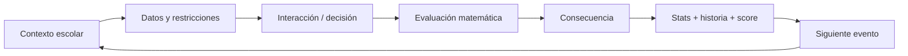
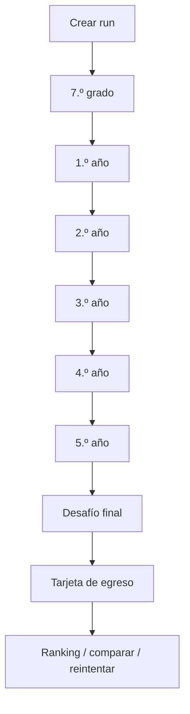
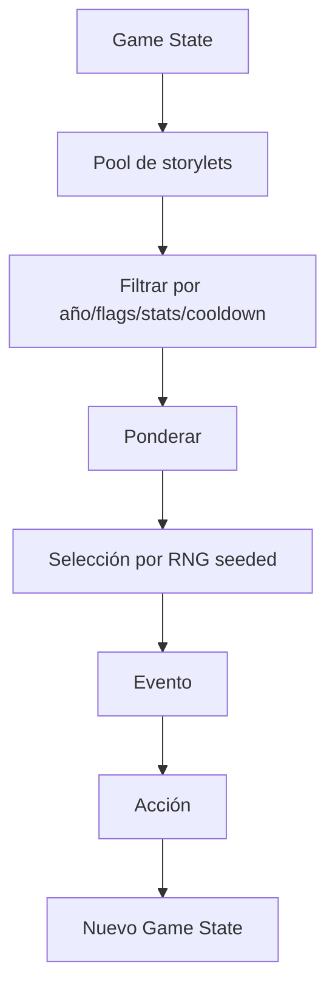
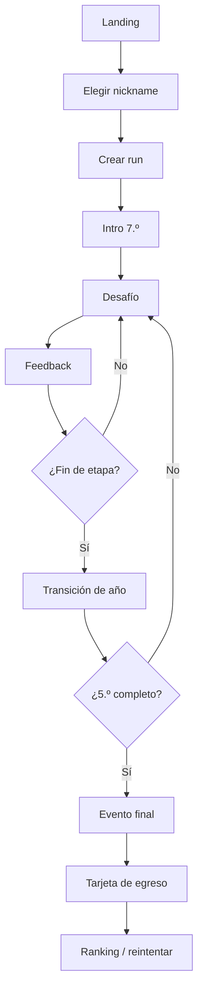
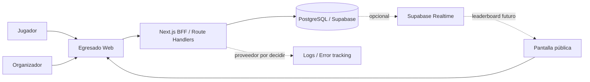
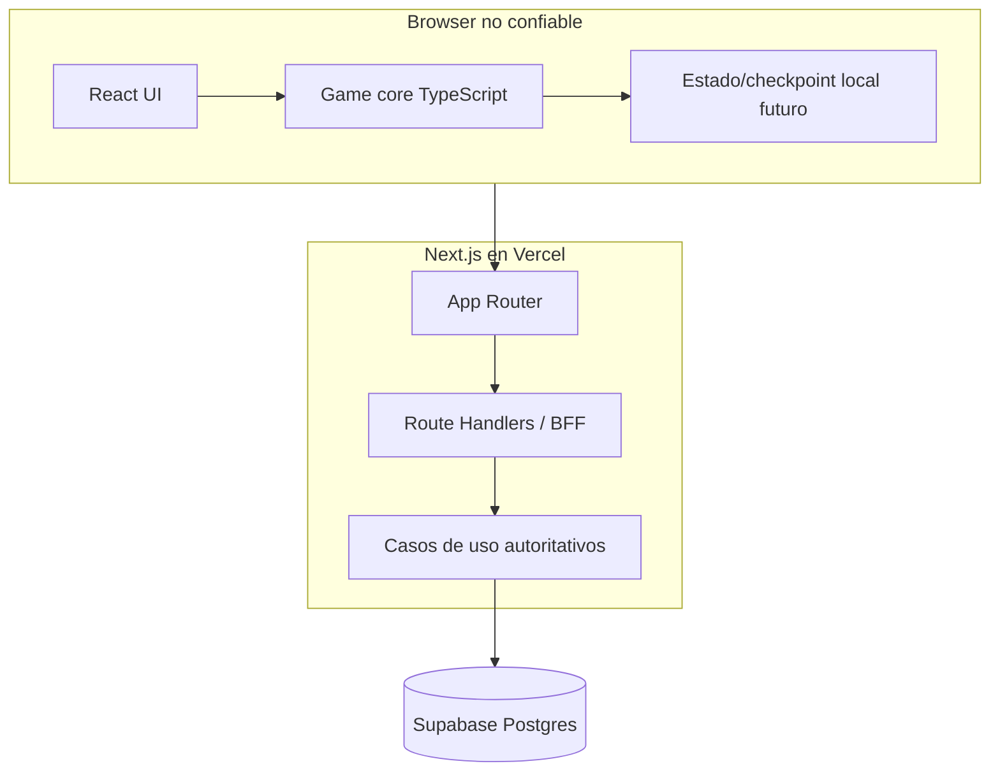
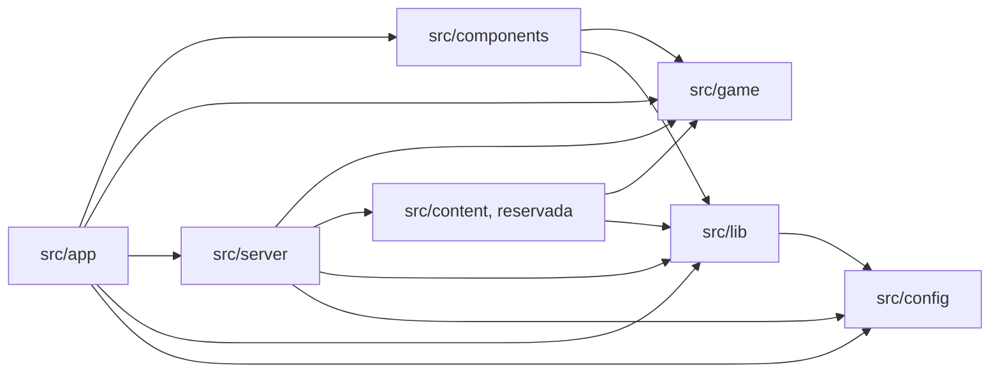
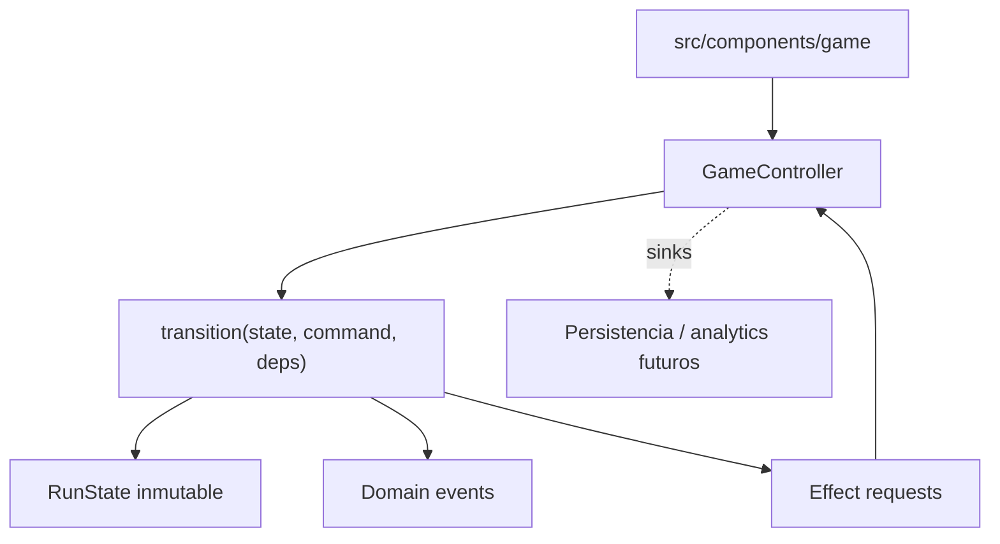
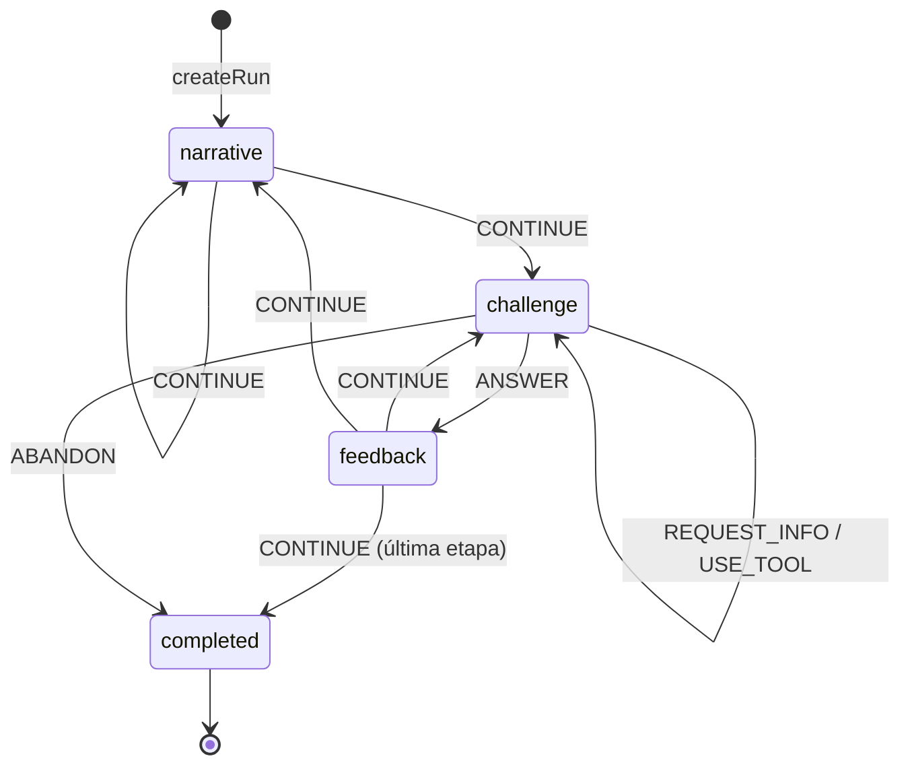
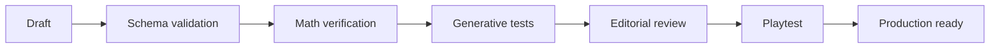

# EGRESADO — Master Specification

> Documento generado como vista consolidada. Los archivos individuales son la fuente mantenible y conservan su autoridad según README.


---

# FILE: 00-product/personas-and-contexts.md

# Personas y contextos de uso

## Persona P1 — Estudiante explorador

**Edad objetivo:** 12–17.

Busca una experiencia rápida, entendible y no infantil. Puede no considerarse “bueno en matemática”. Tiene alta sensibilidad a cualquier interfaz que parezca examen escolar.

### Necesidades
- Entender qué hacer sin leer instrucciones extensas.
- Poder usar calculadora o apoyo cuando la dificultad es de razonamiento y no de cálculo mental.
- Recibir feedback sin humillación.
- Poder terminar incluso si comete errores.
- Obtener un resultado final interesante.

## Persona P2 — Estudiante competitivo

Quiere maximizar score y aparecer en ranking.

### Necesidades
- Reglas de scoring consistentes.
- Condiciones comparables.
- Posibilidad de reintento bajo reglas conocidas.
- Señales claras de qué mejoró o empeoró su run.

## Persona P3 — Docente

Observa o utiliza Egresado como demostración de matemática aplicada.

### Necesidades
- Comprender qué concepto matemático trabaja cada desafío.
- Poder explicar por qué una decisión funciona.
- Evitar contenido ambiguo o matemáticamente incorrecto.
- Ver que los errores producen feedback pedagógico.

## Persona P4 — Organizador de feria

Opera el juego en un contexto con ruido, múltiples dispositivos y conectividad imperfecta.

### Necesidades
- Crear/seleccionar un evento.
- Mostrar ranking.
- Ocultar nicknames inapropiados.
- Detectar si el backend o internet falla.
- Mantener el juego disponible incluso con degradación parcial.

## Persona P5 — Desarrollador/autor de contenido

Agrega desafíos y reglas.

### Necesidades
- Motor desacoplado de UI.
- Schema de contenido estable.
- Tests automáticos de resolubilidad.
- Simulación masiva de seeds.
- Versionado de reglas.

## Contextos de uso

### Feria escolar
- Sesiones de 4–7 min.
- Teléfonos personales y algunas PCs/tablets.
- Posible Wi-Fi saturado.
- Ranking en pantalla grande.
- Alto ingreso de usuarios anónimos.

### Aula
- Grupo con docente.
- Posibilidad de discusión posterior.
- Eventualmente seed compartido.

### Hogar
- Juego individual.
- Rejugabilidad y desafíos diarios.

## Restricciones de diseño por contexto

- Inputs táctiles de tamaño cómodo.
- Ninguna interacción esencial depende de hover.
- Texto legible en pantallas de 360 px de ancho.
- Partida no depende de round-trips constantes al servidor.
- El jugador puede recuperar la run tras refresh accidental cuando sea viable.

---

# FILE: 00-product/product-vision.md

# Visión de producto

## Nombre

**Egresado**

## One-liner

Videojuego web de partidas cortas donde el jugador recorre su secundaria resolviendo desafíos matemáticos contextualizados y construyendo una historia personal hasta el egreso.

## Elevator pitch

Egresado toma la progresión rápida y compartible de los simuladores de carrera basados en decisiones y la aplica a una experiencia escolar. Cada año presenta situaciones cercanas —horarios, compras, trabajos grupales, viajes, encuestas, proyectos, geometría, estadísticas y decisiones bajo incertidumbre— en las que entender los números mejora las decisiones. Las consecuencias alimentan una narrativa de carrera escolar y culminan en un perfil de egreso y un score comparable con otros jugadores.

## Problema de producto

Muchos juegos educativos separan diversión y contenido: el jugador realiza una actividad lúdica y el aprendizaje aparece como pregunta interrumpiendo el juego. Ese enfoque reduce la matemática a un requisito extrínseco.

Egresado busca que la matemática sea una herramienta para actuar dentro del sistema. El desafío no es “resolver una cuenta para continuar”, sino decidir qué comprar, cómo distribuir tiempo, cómo interpretar una encuesta, cómo asignar un equipo o cómo optimizar recursos.

## Propuesta de valor

### Para estudiantes
- Una partida breve y reconocible.
- Problemas vinculados con situaciones cotidianas.
- Resultado final que cuenta “qué clase de estudiante fuiste”.
- Posibilidad de comparar runs sin convertir la experiencia en examen.

### Para docentes
- Matemática aplicada a contextos significativos.
- Evidencia observable de razonamiento, no sólo cálculo mecánico.
- Posibilidad de discutir decisiones y alternativas después de jugar.
- Contenido ajustable por nivel de dificultad.

### Para una feria
- Entrada inmediata desde QR.
- Sin instalación ni registro obligatorio.
- Sesiones cortas con alto throughput.
- Ranking/evento común y estadísticas colectivas.
- Experiencia suficientemente clara para entender mirando a otro jugar.

## Objetivos

1. Conseguir que un alumno comprenda el loop básico en menos de 30 segundos.
2. Mantener una run estándar entre 4 y 7 minutos.
3. Hacer que al menos 70% de los desafíos exijan interpretar datos o relaciones matemáticas relevantes para la decisión.
4. Permitir rejugabilidad mediante seeds, variación procedural, rutas narrativas y perfiles finales.
5. Soportar uso simultáneo desde múltiples dispositivos durante una feria.
6. Mantener una arquitectura que permita pasar de MVP local a juego online con ranking sin reescribir el motor.

## No objetivos iniciales

- Simular exhaustivamente la vida escolar argentina.
- Reemplazar un currículo o evaluación docente.
- Crear una plataforma LMS.
- Mantener perfiles personales persistentes complejos.
- Soportar multiplayer sincrónico en el MVP.
- Incluir chat entre estudiantes.
- Introducir monetización.
- Crear una campaña narrativa de horas de duración.

## Pilares de diseño

### 1. Matemática contextual
Toda cifra visible debe tener una función. Si eliminar los números deja la decisión prácticamente igual, el desafío debe rediseñarse.

### 2. Consecuencia comprensible
Después de una elección, el jugador debe poder relacionar decisión, cálculo y resultado.

### 3. Progresión comprimida
Una partida representa años. Cada evento debe tener peso narrativo mayor que su duración real.

### 4. Diversidad de competencia
El juego no debe sugerir que “ser bueno en matemática” equivale a “ser mejor persona/estudiante”. El perfil final integra estrategia, eficiencia, trabajo en equipo, iniciativa y riesgo.

### 5. Rejugabilidad social
El resultado final debe ser compartible y comparable: score, título de perfil, logros y decisiones memorables.

## Declaración de experiencia objetivo

Al terminar una run queremos escuchar frases como:

- “Me faltaron dos litros; tendría que haber descontado la puerta.”
- “Elegí la opción más barata pero no me alcanzaba el efectivo.”
- “Yo distribuí el equipo distinto y me dio mejor puntaje.”
- “Quiero jugar otra vez para sacar otro perfil.”

No queremos que la reacción dominante sea “era un examen con animaciones”.

---

# FILE: 00-product/risks-and-assumptions.md

# Riesgos y supuestos

## Supuestos de producto

- El público principal tiene 12–17 años.
- La feria prioriza partidas breves y acceso por QR.
- El juego se usa principalmente en español.
- No se necesita identidad real para participar.
- El volumen de una feria escolar entra cómodamente en arquitectura serverless + Postgres gestionado.

## Riesgos principales

| Riesgo | Impacto | Probabilidad | Mitigación |
|---|---:|---:|---|
| Se percibe como examen | Alto | Medio | playtests; variedad de interacciones; consecuencias narrativas |
| Dificultad desigual 12–17 | Alto | Alto | variantes por complejidad; dificultad adaptativa/híbrida |
| Contenido ambiguo | Alto | Medio | math review + invariants + golden seeds |
| Wi-Fi insuficiente | Alto | Alto | gameplay local-first; pending sync; fallback |
| Ranking manipulable | Medio/Alto | Medio | scoring server-side; rate limits; auditoría |
| Nicknames ofensivos | Alto en feria | Medio | filtro + moderación inmediata |
| Scope creep | Alto | Alto | roadmap por gates; no minijuegos especiales antes de validar core |
| Demasiados componentes únicos | Medio | Medio | content-as-data + interaction types |
| RNG genera injusticia | Alto | Medio | separar calidad ex ante de outcome; seeds/event rules |
| Service worker cachea versión vieja | Medio | Medio | diferir PWA offline avanzada; versionar assets/rules |

## Riesgos pedagógicos

- confundir velocidad con capacidad matemática;
- premiar sólo una estrategia cuando existen múltiples válidas;
- usar contextos no cercanos o sesgados;
- convertir errores en señal negativa personal;
- usar estadísticas de estudiantes fuera de contexto.

## Riesgos técnicos

- drift entre engine cliente y servidor;
- cambios de RNG rompen replay;
- migraciones incompatibles durante evento;
- payloads de actions demasiado grandes;
- dependencia innecesaria de realtime.

## Mitigación transversal

La principal defensa es mantener el sistema pequeño, determinista, versionado y testeable. Cada aumento de complejidad debe responder a evidencia de uso.

---

# FILE: 00-product/scope-and-roadmap.md

# Alcance y roadmap

## Estrategia de entrega

La validación debe ocurrir en capas. El proyecto sólo incorpora infraestructura o variedad de contenido cuando la capa anterior demuestra valor.

## MVP 0 — Prototipo local

### Objetivo
Validar que el loop central sea comprensible y divertido.

### Incluye
- Landing mínima.
- Nickname local opcional.
- Carrera parcial: 7.º grado y 1.º año.
- 8–10 desafíos.
- 3–4 patrones de interacción.
- Feedback de consecuencias.
- Score local provisional.
- Perfil final simplificado.
- Juego completamente cliente-side.
- Seed local determinista.

### No incluye
- Base de datos.
- Ranking global.
- Auth.
- Realtime.
- PWA offline completa.
- Admin de contenido.

### Criterio de salida
- 10–20 testers pueden completar una run sin explicación externa.
- Duración media dentro del rango deseado.
- Se detectan al menos 3 desafíos que los jugadores quieren comentar o discutir.

## MVP 1 — Producto web jugable

### Incluye
- Carrera completa: 7.º a 5.º.
- 30–40 desafíos base o combinaciones equivalentes mediante parametrización.
- 6–8 patrones de interacción.
- API de runs.
- PostgreSQL/Supabase.
- Ranking por evento.
- Score autoritativo en servidor.
- Perfiles finales.
- Analytics básico.
- Deploy público.

### Criterio de salida
- Puede soportar una prueba escolar controlada.
- No existen resultados oficiales calculados exclusivamente en cliente.
- Los desafíos procedurales pasan validación automatizada.

## MVP Feria — Operación real

### Incluye
- Evento de feria con seed/ruleset común.
- QR de entrada.
- Leaderboard público.
- Moderación de nicknames.
- Pantalla de proyección.
- Modo degradado para mala conectividad.
- Runbook operacional.
- Métricas de partidas iniciadas/completadas.
- Protección básica contra abuso.

### Criterio de salida
- Ensayo de carga y conectividad realizado.
- Plan de fallback probado.
- El organizador puede resetear/ocultar scores sin despliegue.

## Post-MVP

Posibles líneas:
- Daily challenge.
- Desafíos por curso/nivel.
- Más perfiles narrativos.
- Minijuegos especiales como Reactor 42.
- PWA instalable con soporte offline avanzado.
- Panel de administración de contenido.
- Modo docente para crear eventos.
- Comparación de decisiones por cohorte.
- Partidas privadas por código.
- Temporadas.
- Internacionalización.
- Multiplayer asíncrono.

## Fuera de alcance hasta nueva decisión

- Chat o mensajería entre menores.
- Login social obligatorio.
- Publicación de datos personales.
- Marketplace o compras.
- Publicidad.
- Sistema de amigos.
- Moderación social compleja.
- IA generativa creando problemas en producción sin validación determinista.

---

# FILE: 00-product/success-metrics.md

# Métricas de éxito

## North Star inicial

**Tasa de runs completadas con intención de repetir.**

La métrica combina finalización y atractivo. En pruebas cualitativas, preguntar inmediatamente “¿jugarías otra run ahora?” permite detectar si el producto sólo se entiende o también genera rejugabilidad.

## Métricas de experiencia

- Tiempo hasta primera interacción.
- Tiempo total de run.
- Tasa de finalización.
- Tasa de reintento voluntario.
- Abandono por año/desafío.
- Uso de herramientas/pistas.
- Tiempo por tipo de interacción.

## Métricas de contenido

- % de jugadores que eligen cada opción.
- Distribución de score por desafío.
- Tasa de solución funcional/eficiente/óptima.
- Desafíos con tasa de error extrema.
- Desafíos con tiempo de resolución anómalo.
- Diferencia de desempeño por dificultad elegida, nunca por datos personales sensibles.

## Métricas lúdicas

- Diversidad de perfiles finales.
- Número medio de consecuencias narrativas activadas.
- Distribución de decisiones arriesgadas.
- Número de runs por jugador anónimo/sesión.

## Métricas de feria

- Runs iniciadas por hora.
- Runs completadas por hora.
- Usuarios concurrentes aproximados.
- Error rate API.
- Latencia p95 de start/finish/leaderboard.
- Porcentaje de runs enviadas después de modo offline/degradado.

## Targets iniciales de validación

No son contratos; sirven como hipótesis.

- 80% completa la primera run iniciada en pruebas moderadas.
- Mediana de run entre 4 y 7 minutos.
- 50% o más acepta jugar nuevamente cuando se le ofrece de inmediato.
- Menos de 5% abandona por confusión de UI en un desafío individual.
- 95% de requests críticos de feria bajo 1 s en condiciones normales.

## Métricas que NO deben convertirse en KPI principal

- Nota matemática equivalente.
- Cantidad total de clicks.
- Tiempo de pantalla por sí solo.
- Posición individual de estudiantes identificables.

El producto es lúdico y educativo; optimizar exclusivamente engagement puede llevar a patrones de diseño que contradigan el contexto escolar.

---

# FILE: 01-game-design/challenge-catalog.md

# Catálogo semilla de desafíos

Este catálogo es backlog de contenido, no compromiso de implementar todos en MVP. Cada entrada debe pasar por la guía de autoría y validación antes de producción.

## 7.º grado

| ID | Escenario | Matemática | Interacción | Decisión/objetivo |
|---|---|---|---|---|
| C01 | Kiosco entre amigos | suma, división, presupuesto | Decision Card | elegir compra que alcance para el grupo |
| C02 | Llegar a horario | tiempo, suma de minutos | Timeline | estimar llegada y elegir transporte |
| C03 | Foto del curso | división y resto | Spatial/Decision | formar filas con restricciones |
| C04 | Mural simple | área y cobertura | Decision Card | comprar pintura suficiente |
| C05 | Repartir impresiones | división | Assignment | distribuir páginas equitativamente |
| C06 | Educación física | distancia/fracciones | Numeric Input | calcular vueltas de pista |

## 1.º año

| ID | Escenario | Matemática | Interacción | Decisión/objetivo |
|---|---|---|---|---|
| C07 | Semana de pruebas | tiempo, priorización | Budget/Timeline | repartir horas de estudio |
| C08 | Notebook en oferta | porcentajes | Decision Card | comparar descuento porcentual/fijo |
| C09 | Materiales para maqueta | proporciones | Budget Builder | comprar cantidades suficientes |
| C10 | Plano del aula | escala | Spatial Grid | ubicar elementos respetando escala |
| C11 | Entradas para acto | porcentajes/capacidad | Numeric/Decision | decidir si se pueden vender más |
| C12 | Recreo compartido | proporción/costo unitario | Decision Card | comparar packs |

## 2.º año

| ID | Escenario | Matemática | Interacción | Decisión/objetivo |
|---|---|---|---|---|
| C13 | Trabajo grupal | asignación/restricciones | Assignment Board | asignar personas según habilidad y horas |
| C14 | Plan de datos del viaje | tasas/unidades | Decision Card | elegir plan suficiente y eficiente |
| C15 | Subir video a la nube | velocidad/unidades | Numeric/Decision | determinar si termina antes del plazo |
| C16 | Torneo escolar | combinatoria básica | Graph/Decision | calcular partidos todos-contra-todos |
| C17 | Comprar remeras | descuentos escalonados | Budget Builder | elegir proveedor según cantidad |
| C18 | Campaña de reciclaje | razones | Chart | comparar kg/alumno entre cursos |

## 3.º año

| ID | Escenario | Matemática | Interacción | Decisión/objetivo |
|---|---|---|---|---|
| C19 | Viaje escolar | presupuesto multietapa | Budget Builder | cubrir transporte/alojamiento/actividades |
| C20 | Rifa del curso | ingresos, costo, probabilidad | Decision Card | elegir estrategia de recaudación |
| C21 | Buffet del evento | margen/costo unitario | Budget Builder | fijar combinación rentable |
| C22 | Horario de stands | intervalos/restricciones | Timeline | asignar franjas sin solapamientos |
| C23 | Cableado del stand | distancia/geometría | Spatial Grid | elegir recorrido suficiente/corto |
| C24 | Batería para exposición | consumo/tasa | Decision Card | elegir batería según duración |

## 4.º año

| ID | Escenario | Matemática | Interacción | Decisión/objetivo |
|---|---|---|---|---|
| C25 | Encuesta estudiantil | porcentajes/muestra | Chart + Request Info | juzgar confianza antes de cambiar campaña |
| C26 | Dos publicaciones | proporciones | Chart/Decision | comparar engagement rate |
| C27 | “Mejoramos 200%” | porcentajes/interpretación | Decision Card | evaluar afirmación y contexto |
| C28 | Seguidores por semana | crecimiento/función | Sequence | proyectar tendencia y decidir inversión |
| C29 | Evento con lluvia | probabilidad/riesgo | Decision Card | elegir plan logístico |
| C30 | Promedio engañoso | media/mediana | Chart | elegir medida representativa |
| C31 | Encuestas incompatibles | tamaño de muestra | Request Info | decidir qué evidencia pesa más |

## 5.º año

| ID | Escenario | Matemática | Interacción | Decisión/objetivo |
|---|---|---|---|---|
| C32 | Feria de ciencias | presupuesto + tiempo + riesgo | Multi-step | elegir proyecto viable |
| C33 | Stand final | área/perímetro/optimización | Spatial Grid | maximizar uso de espacio con circulación |
| C34 | Proyecto de software | horas/capacidad | Assignment Board | distribuir backlog entre equipo |
| C35 | Hosting del proyecto | costo fijo/variable | Decision Card | elegir plan según tráfico esperado |
| C36 | Imprimir merchandising | break-even | Numeric/Decision | determinar cantidad mínima rentable |
| C37 | Transporte a competencia | tasas/costos | Decision Card | comparar rutas y medios |
| C38 | Presentación final | scheduling | Timeline | ordenar tareas críticas antes del deadline |
| C39 | Encuesta final | estadística/intervalos | Chart | detectar conclusión excesiva |
| C40 | Fondo de egresados | porcentajes/crecimiento | Decision Card | comparar planes de ahorro simples |

## Eventos especiales / bosses

| ID | Evento | Combinación |
|---|---|---|
| B01 | Organizar el viaje | presupuesto + proporciones + tiempo |
| B02 | Torneo escolar | combinatoria + scheduling + recursos |
| B03 | Semana de exámenes | optimización + tiempo + energía |
| B04 | Centro de estudiantes | estadística + porcentajes + estrategia |
| B05 | Feria final | geometría + presupuesto + asignación + riesgo |
| B06 | Reactor 42 cameo | aritmética/composición de expresiones |

## Plantillas recomendadas para el primer vertical slice

Implementar primero una muestra deliberadamente diversa:
- C02 Timeline.
- C04 Decision Card/geometry.
- C08 porcentajes.
- C13 Assignment Board simplificado.
- C14 tasas/unidades.
- C25 Chart/Request Info.
- C33 Spatial Grid simplificado.
- C35 trade-off de costos.

Esto prueba ocho tipos de razonamiento sin necesitar contenido definitivo para todas las etapas.

---

# FILE: 01-game-design/challenge-system.md

# Sistema de desafíos

## Objetivo

Evitar que Egresado se transforme en una secuencia de multiple-choice. El contenido se construye sobre un conjunto limitado de **patrones de interacción reutilizables**.

## Familias iniciales

### 1. Decision Card
El jugador compara opciones y elige una.

Usos:
- descuentos;
- rutas;
- compras;
- decisiones de riesgo.

### 2. Numeric Estimate / Input
Ingresa o ajusta un valor.

Usos:
- hora de llegada;
- cantidad necesaria;
- presupuesto objetivo.

### 3. Budget Builder
Agrega packs/ítems bajo restricciones.

Usos:
- fiesta;
- viaje;
- materiales.

### 4. Assignment Board
Arrastra personas/recursos a tareas.

Usos:
- trabajo grupal;
- cronograma;
- distribución de puestos.

### 5. Timeline
Ubica eventos, estima duración o selecciona ventanas.

Usos:
- colectivo;
- estudio;
- cronogramas.

### 6. Chart / Data Interpretation
Interpreta gráficos, tablas o encuestas.

Usos:
- centro de estudiantes;
- métricas de redes;
- rendimiento de una campaña.

### 7. Spatial Grid
Ubica objetos en un plano o calcula coberturas.

Usos:
- stand;
- mural;
- distribución de aula.

### 8. Information Request
Permite pedir un dato antes de decidir.

Usos:
- tamaño de muestra;
- costos ocultos;
- restricciones no visibles inicialmente.

### 9. Sequence / Trend
Predice o decide según una serie.

### 10. Special Minigame
Interacción excepcional, por ejemplo Reactor 42. No debe convertirse en dependencia para el MVP.

## Taxonomía matemática

- Cantidad.
- Proporciones y porcentajes.
- Tiempo y tasas.
- Espacio y forma.
- Patrones y relaciones.
- Datos y estadística.
- Probabilidad e incertidumbre.
- Optimización y restricciones.

## Ejemplos canónicos

### Mural
Pared 6 × 2,4 m; cobertura 8 m²/L; elegir pack suficiente/óptimo.

### Notebook
Comparar 20% de descuento vs descuento fijo/cuotas y restricción de efectivo.

### Encuesta
Interpretar 41/38/21 con muestra 90/600 y decidir nivel de confianza.

### Colectivo
28 min con 25% de demora desde 07:10 y entrada 07:45.

### Trabajo grupal
Asignar integrantes con habilidades y horas limitadas.

### Plan de datos
600 MB/día durante 12 días; comparar packs.

### Interacción de redes
Comparar engagement relativo, no likes absolutos.

## Dificultad

La dificultad no depende sólo de números grandes.

Factores:
- cantidad de variables;
- necesidad de múltiples pasos;
- decimales/fracciones;
- información irrelevante;
- información faltante;
- número de restricciones;
- incertidumbre;
- cantidad de soluciones válidas;
- necesidad de optimización y no sólo factibilidad.

## Generación procedural

Patrón recomendado:

1. Generar parámetros desde seed.
2. Resolver el problema internamente.
3. Verificar invariantes.
4. Calcular conjunto de soluciones válidas.
5. Clasificar dificultad.
6. Renderizar narrativa.

Nunca generar opciones al azar y asumir que una es correcta.

## Regla de contenido

Cada desafío debe documentar explícitamente:
- concepto matemático;
- competencia requerida;
- interacción;
- solución/es;
- función de evaluación;
- explicación de feedback;
- parámetros válidos;
- edge cases.

---

# FILE: 01-game-design/content-authoring-guide.md

# Guía de autoría de contenido

## Objetivo

Permitir que nuevos desafíos se incorporen con consistencia lúdica, matemática y técnica.

## Plantilla de diseño

Cada desafío debe responder:

1. **Situación:** ¿qué ocurre?
2. **Objetivo del personaje:** ¿qué quiere lograr?
3. **Datos:** ¿qué números conoce?
4. **Restricciones:** ¿qué limita las opciones?
5. **Acción del jugador:** ¿qué manipula/elige?
6. **Matemática:** ¿qué razonamiento ayuda?
7. **Soluciones:** ¿qué es inválido, funcional, eficiente u óptimo?
8. **Consecuencia:** ¿cómo se explica el resultado?
9. **Efecto narrativo:** ¿qué stats/flags cambian?
10. **Variantes:** ¿qué parámetros pueden generarse proceduralmente?

## Regla “sin números”

Eliminar mentalmente todos los números del evento. Si la decisión sigue siendo obvia o equivalente, la matemática probablemente es decorativa.

## Regla “no examen”

Reformular:
- “¿Cuál es el área?” → “¿Qué pack de pintura alcanza?”
- “¿Cuánto es 20% de 800000?” → “¿Qué oferta realmente cuesta menos?”
- “¿Cuál es la media?” → “¿Qué grupo tuvo mejor rendimiento considerando tamaño?”

## Longitud

- Título: 2–6 palabras.
- Contexto principal: idealmente <60 palabras.
- Opciones: frases cortas.
- Explicación posterior: fragmentada visualmente, no párrafo largo.

## Parámetros

Definir rangos seguros.

Ejemplo:

```text
wall_width: [3.0, 8.0]
wall_height: [2.0, 3.5]
coverage_per_liter: [5, 10]
packages: generated so that >=1 valid and >=1 invalid option exist
```

## Invariantes de generación

Un challenge procedural debe poder afirmar automáticamente:
- tiene al menos una solución funcional;
- si declara solución óptima, ésta existe;
- no hay dos opciones visualmente distintas con mismo resultado si eso confunde;
- las unidades son consistentes;
- el resultado entra en límites de UI;
- no se produce división por cero;
- el valor no excede precisión razonable para la etapa.

## Estados de contenido

- `draft`.
- `math_reviewed`.
- `playtest_ready`.
- `production_ready`.
- `retired`.

## Checklist editorial

- Lenguaje argentino neutral, comprensible fuera de una provincia específica.
- No usar marcas comerciales reales salvo decisión expresa.
- No asumir nivel socioeconómico como norma.
- Evitar presión financiera personal; contextualizar presupuestos como recursos del proyecto/curso.
- No usar salud, religión, política partidaria u otros datos sensibles del jugador como personalización.
- Humor sin humillación.

---

# FILE: 01-game-design/game-design-document.md

# Game Design Document — Egresado

## 1. Concepto

Egresado es un **run-based narrative math game** para navegador. Cada run comprime seis etapas escolares, desde 7.º grado hasta 5.º año. El jugador resuelve problemas cotidianos mediante interacciones variadas y sus resultados modifican estadísticas, oportunidades narrativas, score y perfil de egreso.

## 2. Género

- Juego de decisiones.
- Simulación de carrera/vida comprimida.
- Puzzle matemático contextual.
- Narrativa procedural/storylet.
- Score attack asíncrono.

## 3. Fantasía del jugador

“Quiero descubrir cómo sería mi recorrido escolar si cada decisión importante dependiera de cómo interpreto información, administro recursos y razono con números.”

## 4. Core loop



## 5. Meta loop



## 6. Duración objetivo

- Onboarding: <30 s.
- Evento normal: 15–35 s.
- Minijuego especial: 20–60 s.
- Run completa: 4–7 min.

## 7. Estructura sugerida por run

- 7.º: 2 eventos.
- 1.º: 2–3 eventos.
- 2.º: 2–3 eventos.
- 3.º: 2–3 eventos.
- 4.º: 2–3 eventos.
- 5.º: 2–3 eventos.
- Final: 1 evento combinado.

El número exacto puede variar por modo.

## 8. Estadísticas de carrera

### Visibles
- **Conocimiento**: desempeño académico/analítico.
- **Equipo**: colaboración y decisiones sociales.
- **Iniciativa**: proyectos y oportunidades.
- **Energía**: capacidad temporal y desgaste.

### Derivadas/ocultas
- Eficiencia.
- Riesgo asumido.
- Precisión.
- Uso de información.
- Razonamiento cuantitativo por categoría.

Las stats visibles generan narrativa; las ocultas ayudan a scoring, perfiles y analítica.

## 9. Filosofía de error

No hay game over por una respuesta incorrecta. El error produce una consecuencia y la run continúa.

### Feedback malo
“Incorrecto. La respuesta era B.”

### Feedback objetivo
“Compraste 1 L. La pared necesita 14,4 m² de cobertura y 1 L cubre 8 m². Faltaron 6,4 m²; el equipo tuvo que volver a comprar.”

## 10. Niveles de resolución

Una decisión puede ser:

- **Inválida:** no cumple una restricción esencial.
- **Funcional:** resuelve el problema.
- **Eficiente:** resuelve con buen uso de recursos.
- **Óptima:** mejor solución según la función de evaluación declarada.

No todos los desafíos necesitan las cuatro categorías.

## 11. Tono

**Realista exagerado + épico-paródico.**

La situación es reconocible, pero se presenta con dramatización gamer:

- “SEMANA DE EXÁMENES — Evento legendario”.
- “La impresora eligió la violencia”.
- “FINAL_FINAL_AHORA_SI_3.pptx”.

El humor nunca debe ridiculizar a un estudiante por fallar.

## 12. Rejugabilidad

- Seeds diferentes.
- Variación numérica de problemas.
- Eventos condicionales.
- Perfiles de egreso.
- Logros.
- Ranking por evento.
- Seed diaria/feria compartida.

## 13. Modos previstos

### Carrera estándar
Seed individual; máxima variedad.

### Desafío de la feria
Mismo ruleset y pool controlado para todos. Puede usar seed común o set precomputado.

### Daily challenge — futuro
Condiciones compartidas por día.

### Práctica — futuro
Sin ranking; selecciona categoría matemática.

## 14. Herramientas permitidas

Según desafío:
- calculadora;
- anotador;
- tabla;
- regla/escala;
- “pedir más datos”.

Usar una herramienta no debe penalizar automáticamente. La competencia deseada es resolución de problemas, no cálculo mental puro.

## 15. Jefes/eventos especiales

Un año puede culminar con un desafío combinado: viaje, feria, proyecto grupal, torneo o examen especial. Estos eventos reutilizan las mecánicas ya aprendidas y aumentan tensión sin introducir reglas completamente nuevas.

## 16. Final de run

La tarjeta final contiene:
- nickname;
- promoción/año del evento;
- score;
- perfil de egreso;
- stats principales;
- mayor logro;
- decisión más arriesgada o memorable;
- posición en ranking si aplica;
- CTA “Jugar otra vez”.

## 17. Perfiles iniciales

- El Estratega.
- El Improvisador.
- El Científico.
- El Líder.
- El Emprendedor.
- El Competidor.
- El Equilibrado.
- El Superviviente.

La asignación debe ser determinista a partir de métricas, con desempate documentado.

## 18. Anti-patrones

No introducir:
- trivia matemática desconectada de la ficción;
- largos bloques de texto;
- tutorial obligatorio de varios minutos;
- castigo que cierre la run por un error;
- score basado sólo en velocidad;
- estética infantilizada;
- decisiones falsas donde un número visible no afecta nada;
- historias que equiparen desempeño matemático con valor personal.

---

# FILE: 01-game-design/math-design-framework.md

# Marco de diseño matemático

## Propósito

Definir cómo Egresado usa matemática de forma auténtica, escalable y apropiada para estudiantes de 12–17 años.

## Principio central

La matemática debe ser necesaria para comprender o mejorar una acción en el juego. Se evita el patrón “juego → pausa → ejercicio → juego”.

## Ciclo cognitivo objetivo

1. **Interpretar** una situación.
2. **Identificar** datos relevantes y faltantes.
3. **Formular** una representación matemática.
4. **Operar/razonar** con ella.
5. **Decidir**.
6. **Interpretar** la consecuencia.

## Dominios

Alineación conceptual con categorías amplias de alfabetización matemática:

### Cantidad
Dinero, unidades, escalas, conteos, divisiones.

### Cambio y relaciones
Tasas, crecimiento, secuencias, funciones.

### Espacio y forma
Área, perímetro, escala, disposición espacial.

### Incertidumbre y datos
Probabilidad, muestras, gráficos, porcentajes, evidencia.

## Progresión orientativa

| Etapa | Foco dominante | Ejemplos |
|---|---|---|
| 7.º | operaciones, tiempo, dinero, área simple | compras, horarios, mural |
| 1.º | porcentajes, proporciones, escalas | descuentos, repartos |
| 2.º | tasas y restricciones | consumo, velocidad, presupuesto |
| 3.º | problemas multietapa, optimización | recaudación, asignación |
| 4.º | estadística, probabilidad, funciones | encuestas, tendencias |
| 5.º | integración e incertidumbre | proyecto final, trade-offs |

La progresión real debe adaptarse al currículo de la institución si se usa pedagógicamente de forma formal.

## Niveles de variante de un mismo escenario

### Básico
Números enteros, una restricción, una operación principal.

### Intermedio
Decimales/porcentajes, dos pasos, varias opciones válidas.

### Avanzado
Datos irrelevantes, restricciones múltiples, optimización, incertidumbre.

Ejemplo Mural:
- básico: 6×2, cobertura 6 m²/L;
- intermedio: 6×2,4, cobertura 8;
- avanzado: descontar puerta, dos manos, comparar packs/precio.

## Herramientas

Permitir calculadora cuando el objetivo sea modelar/decidir. Un modo competitivo puede limitar herramientas sólo si esa limitación forma parte explícita de la competencia evaluada.

## Feedback

El feedback debe incluir los números que explican la consecuencia.

### Correcto/óptimo
Mostrar por qué alcanza y por qué es eficiente.

### Incorrecto
Mostrar la restricción violada, no sólo la respuesta esperada.

### Solución alternativa
Reconocerla si cumple las reglas, incluso si no era la respuesta prevista originalmente.

## Ambigüedad

No publicar un desafío si:
- existen interpretaciones razonables no contempladas;
- faltan unidades;
- redondeo cambia la respuesta sin regla declarada;
- varias respuestas son equivalentes y el sistema marca sólo una;
- la narrativa contradice el modelo matemático.

## Redondeo

Cada desafío declara:
- precisión interna;
- regla de redondeo de display;
- tolerancia de input;
- unidad esperada.

No comparar floats de forma exacta.

## Validación pedagógica

Antes de marcar contenido como `production_ready`:
- revisión matemática;
- revisión de lenguaje;
- prueba con al menos un usuario del rango objetivo cuando sea posible;
- test procedural de invariantes.

---

# FILE: 01-game-design/narrative-system.md

# Sistema narrativo

## Objetivo

Crear la sensación de una carrera escolar coherente sin construir un árbol exponencial de ramas.

## Modelo: storylets condicionados

Cada evento narrativo declara:
- condiciones de elegibilidad;
- peso base;
- cooldown;
- etapa escolar;
- tags temáticos;
- flags requeridos/prohibidos;
- efectos;
- posibles follow-ups.

El motor filtra storylets incompatibles y selecciona entre los restantes mediante pesos deterministas derivados del seed.



## Estado narrativo mínimo

- `school_year`.
- stats visibles.
- tags de afinidad.
- flags de decisiones importantes.
- historial corto de eventos para evitar repetición.
- logros.

## Tipos de storylet

### One-shot
Evento autocontenido.

### Callback
Recupera una decisión previa: un compañero vuelve a aparecer, una actividad abre otra oportunidad, etc.

### Mini-arco
2–4 eventos relacionados distribuidos en años.

### Evento sistémico
Se activa por thresholds: alta iniciativa, energía muy baja, etc.

### Evento final
Resume o consume flags acumulados.

## Reglas de coherencia

- Un callback debe tener causa rastreable.
- No presentar como consecuencia algo que el sistema no puede justificar.
- Evitar que eventos aleatorios contradigan flags duros.
- Permitir cierta ambigüedad narrativa, pero no inconsistencia lógica.

## Línea de carrera sugerida

### 7.º grado — Adaptación
Temas: dinero simple, horarios, primeras responsabilidades, colaboración.

### 1.º — Organización
Temas: múltiples materias, estudio, porcentajes, tiempos.

### 2.º — Vida escolar ampliada
Temas: actividades, proyectos, presupuestos, proporciones.

### 3.º — Decisiones colectivas
Temas: viaje, recaudación, asignación, optimización.

### 4.º — Datos e incertidumbre
Temas: encuestas, campañas, funciones, riesgo.

### 5.º — Integración
Temas: proyecto final, feria, orientación, decisiones multivariable.

## Humor

El humor nace de reconocer situaciones escolares:
- nombres de archivos absurdos;
- impresora que falla;
- compañero que desaparece;
- colectivo demorado;
- presentación preparada a último momento.

No usar:
- bullying como punchline;
- humillación por notas;
- estereotipos discriminatorios;
- docentes reales identificables.

## Regla narrativa-matemática

Cada storylet matemático debe responder:

1. ¿Qué quiere lograr el personaje?
2. ¿Qué información cuantitativa necesita?
3. ¿Qué restricción hace que la elección importe?
4. ¿Cómo se ve la consecuencia?
5. ¿Qué cambia en la carrera?

---

# FILE: 01-game-design/rules-scoring-and-progression.md

# Reglas, scoring y progresión

## Reglas globales

1. Una run se identifica por `run_id`, `seed`, `game_version`, `ruleset_version` y `content_version`.
2. Una run oficial se inicia en servidor cuando el modo requiere ranking.
3. El cliente puede previsualizar score, pero el servidor calcula el resultado oficial.
4. Cada desafío debe declarar su función de evaluación.
5. Toda variante procedural debe ser validable de forma determinista.
6. La run continúa después de errores salvo fallo técnico irrecuperable.

## Progresión temporal

Etapas canónicas:

1. 7.º grado.
2. 1.º año.
3. 2.º año.
4. 3.º año.
5. 4.º año.
6. 5.º año.
7. Egreso.

Cada etapa puede modificar:
- dificultad objetivo;
- categorías matemáticas habilitadas;
- storylets disponibles;
- peso de eventos sociales/proyectos;
- recompensas.

## Modelo de score

El score debe premiar calidad de decisión más que rapidez.

### Componentes sugeridos

`score_evento = base × calidad × dificultad + bonus_contextuales - penalizaciones`

Donde:
- `base`: valor estándar del evento.
- `calidad`: factor por inválida/funcional/eficiente/óptima.
- `dificultad`: factor del nivel del problema.
- `bonus_contextuales`: uso eficiente, predicción correcta, solución alternativa válida, etc.
- `penalizaciones`: sólo por decisiones lúdicas declaradas; nunca por usar una herramienta permitida salvo modo especial explícito.

### Factores iniciales de referencia

- inválida: 0.20–0.40.
- funcional: 0.70.
- eficiente: 0.90.
- óptima: 1.00.

Estos valores deben tunearse con playtests.

## Velocidad

La velocidad puede aportar un bonus pequeño con techo. No debe dominar el resultado porque:
- favorece cálculo mental sobre razonamiento;
- aumenta ansiedad;
- perjudica accesibilidad;
- incentiva adivinar.

## Rachas

Una racha puede celebrarse visualmente, pero su multiplicador debe ser controlado para no hacer imposible recuperar una run.

Ejemplo:
- 2 óptimas consecutivas: +3%.
- 3: +5%.
- 4+: cap +8%.

## Estadísticas narrativas

Las decisiones modifican stats mediante deltas pequeños y acotados. Las stats no deben sustituir el score matemático; su función principal es desbloquear/ponderar narrativa.

## Riesgo

Algunos eventos permiten decisiones con incertidumbre. El sistema debe distinguir:
- **calidad ex ante:** qué tan razonable era la decisión con la información disponible;
- **resultado ex post:** qué ocurrió por azar.

El score matemático debe basarse principalmente en calidad ex ante. El jugador no debería perder ranking porque un RNG justo produjo un resultado adverso después de una buena decisión.

## Perfil final

El perfil se calcula sobre features normalizadas:
- eficiencia;
- precisión;
- riesgo;
- colaboración;
- iniciativa;
- uso de datos adicionales;
- estabilidad entre años.

Ejemplo conceptual:

```text
Estratéga = eficiencia alta + precisión alta + riesgo moderado
Improvisador = velocidad alta + riesgo alto + uso bajo de herramientas
Líder = equipo alto + decisiones de asignación eficientes
Científico = precisión alta + preferencia por evidencia + estadística alta
```

No usar diagnósticos psicológicos ni lenguaje clínico.

## Condición de finalización

La run termina al completar el evento final o al abandonar explícitamente.

No hay repetición automática de año por bajo desempeño en el MVP. La fantasía es una carrera comprimida, no un simulador administrativo de promoción escolar.

---

# FILE: 01-game-design/ux-interaction-design.md

# UX e interacción

## Estrategia

Mobile-first, portrait-first, DOM-first. Desktop presenta el mismo flujo dentro de una columna central ampliada.

## Viewport de referencia

Diseñar inicialmente para ~390×844 CSS px y verificar mínimo 360 px de ancho.

## Layout base

```text
┌────────────────────────┐
│ 2.º AÑO        Energía │
├────────────────────────┤
│ Título / situación     │
│ Datos relevantes       │
│                        │
│ Interacción            │
│                        │
├────────────────────────┤
│ Feedback / CTA         │
└────────────────────────┘
```

## Navegación

- No depender de browser back como parte del juego.
- Confirmar abandono de run activa.
- Persistir checkpoint local después de cada desafío.

## Patrones

### Decision cards
Cards grandes, táctiles, sin hover obligatorio.

### Drag & drop
Debe existir alternativa accesible por tap/select. Drag no puede ser la única forma.

### Sliders
Mostrar valor numérico y permitir ajuste fino por botones/teclado.

### Gráficos
Etiquetas visibles; no depender sólo del color.

### Feedback
Secuencia recomendada:
1. bloquear input;
2. animación corta;
3. mostrar consecuencia numérica;
4. actualizar stats;
5. CTA continuar.

## Motion

- Duración habitual 150–350 ms.
- Respetar `prefers-reduced-motion`.
- Evitar animaciones largas que reduzcan throughput de feria.

## Audio

Opcional, nunca requerido para comprender. Estado mute persistente.

## Accesibilidad

- Contraste mínimo WCAG AA como objetivo.
- Targets táctiles ≥44×44 CSS px cuando sea posible.
- Navegación por teclado para interacciones principales.
- Focus visible.
- Texto no incrustado en imágenes.
- Feedback no dependiente exclusivamente de color.

## Herramientas

Calculadora/anotador se abren como paneles no destructivos; cerrar no pierde estado.

## Loading

Gameplay no muestra loaders entre eventos si éstos ya están generados localmente. El servidor participa fuera del loop crítico.

## Errores de red

El jugador no pierde una run porque falle el leaderboard. Se muestra estado “resultado pendiente de sincronización” y se reintenta cuando corresponda.

---

# FILE: 02-functional/functional-specification.md

# Especificación funcional

## FR-001 Inicio
El sistema debe permitir iniciar una experiencia sin crear una cuenta tradicional.

### Comportamiento
- Mostrar nombre del juego y CTA principal.
- Permitir nickname opcional/obligatorio según modo.
- Validar longitud y caracteres.
- Crear identidad anónima local.

## FR-002 Creación de run
En modos online oficiales, el cliente debe solicitar al servidor una run antes de jugar.

El servidor devuelve como mínimo:
- `run_id`;
- `seed`;
- `mode`;
- versiones de reglas/contenido;
- timestamp de inicio;
- configuración de evento.

## FR-003 Generación de carrera
A partir de seed y configuración, el motor debe producir una secuencia reproducible de años, desafíos y storylets.

## FR-004 Presentación de etapa
El jugador debe conocer siempre la etapa escolar actual.

## FR-005 Resolución de desafíos
El sistema debe soportar múltiples interaction types definidos en `challenge-system.md`.

## FR-006 Evaluación
Cada acción debe generar un `ChallengeResult` determinista con:
- calidad;
- score parcial;
- explicación;
- cambios de stats;
- flags;
- datos de telemetría no sensibles.

## FR-007 Feedback
Después de confirmar, el juego debe explicar la consecuencia antes de avanzar.

## FR-008 Herramientas
Los desafíos pueden habilitar herramientas. El schema declara cuáles están disponibles.

## FR-009 Persistencia local
La run activa debe guardar checkpoint tras cada evento completado.

## FR-010 Reanudación
Si existe checkpoint compatible con la versión actual, ofrecer reanudar.

## FR-011 Finalización
Al completar la carrera, generar tarjeta de egreso con score, perfil y resumen.

## FR-012 Ranking
En un evento competitivo, el sistema debe consultar y mostrar leaderboard según reglas del evento.

## FR-013 Reintento
El jugador puede iniciar otra run. El evento define si conserva o cambia seed.

## FR-014 Modo feria
Un evento debe poder definir:
- período de vigencia;
- seed o estrategia de seeds;
- ruleset;
- dificultad;
- límites de intentos si existieran;
- ranking;
- moderación.

## FR-015 Moderación
Operadores autorizados deben poder ocultar una entrada de ranking sin borrar necesariamente la run auditada.

## FR-016 Degradación de red
Una interrupción después del inicio no debe impedir continuar el gameplay local. El resultado puede quedar pendiente de validación/sincronización.

## FR-017 Versionado
Toda run oficial guarda `game_version`, `ruleset_version` y `content_version`.

## FR-018 Replay técnico
El backend debe poder reconstruir una run oficial a partir de seed, versiones y acciones para validar score.

## FR-019 Analytics
Registrar eventos mínimos definidos en `analytics-observability.md` sin requerir PII.

## FR-020 Pantalla pública
Debe existir una vista de leaderboard apta para proyector/TV en el modo feria.

## Requisitos administrativos post-MVP

### FR-A01 Gestión de eventos
Crear, activar, cerrar y archivar eventos.

### FR-A02 Contenido
Gestionar estados de contenido o importar paquetes versionados.

### FR-A03 Moderación
Ocultar/restaurar nicknames y scores.

### FR-A04 Exportación
Exportar estadísticas agregadas del evento.

---

# FILE: 02-functional/traceability-matrix.md

# Matriz de trazabilidad

| Objetivo | Feature | Requisitos | Historias | ADR relacionado |
|---|---|---|---|---|
| Entrada rápida | identidad anónima | FR-001 | US-001 | ADR-008 |
| Run reproducible | seed/versiones | FR-002, FR-003, FR-017, FR-018 | US-022, US-051 | ADR-003 |
| Matemática como gameplay | challenges parametrizados | FR-005, FR-006, FR-007 | US-002, US-003 | ADR-007 |
| Resiliencia | local-first/checkpoints | FR-009, FR-010, FR-016 | US-030, US-031 | ADR-006 |
| Ranking justo | score servidor | FR-011, FR-012, FR-018 | US-020, US-022 | ADR-004, ADR-009 |
| Escalar contenido | content-as-data | FR-003, FR-005 | US-050 | ADR-007 |
| Web universal | responsive/PWA-ready | NFR | US-001 | ADR-001 |
| Operación de feria | eventos + pantalla | FR-014, FR-020 | US-040 | ADR-009 |
| Privacidad | minimización | FR-001 | US-001 | ADR-008 |
| Moderación | ocultar entradas | FR-015 | US-041 | ADR-009 |

## Regla de mantenimiento

Toda feature nueva debe:
1. referenciar un objetivo o justificar uno nuevo;
2. agregar/modificar requisito funcional;
3. tener historia o tarea técnica;
4. crear ADR si cambia una decisión arquitectónica significativa;
5. actualizar tests/NFR si aplica.

---

# FILE: 02-functional/user-flows.md

# Flujos de usuario

## UF-01 Primera run



## UF-02 Resolución de desafío

1. Mostrar contexto y datos.
2. Jugador inspecciona herramientas si existen.
3. Jugador realiza interacción.
4. Validar forma del input localmente.
5. Confirmar.
6. Motor evalúa.
7. Mostrar consecuencia.
8. Actualizar stats/score provisional.
9. Registrar acción/checkpoint.
10. Continuar.

## UF-03 Refresh accidental

1. App carga.
2. Detecta checkpoint activo.
3. Verifica compatibilidad de versiones.
4. Ofrece “Continuar partida” o “Empezar de nuevo”.
5. Rehidrata estado y RNG.

## UF-04 Fin de run online

1. Cliente envía acciones al endpoint de finish.
2. Servidor valida run abierta.
3. Reproduce acciones.
4. Calcula score oficial/perfil.
5. Persiste resultado.
6. Devuelve tarjeta oficial y posición aproximada.
7. Cliente borra checkpoint activo.

## UF-05 Error al finalizar

1. Cliente conserva acciones localmente.
2. Marca run como `pending_sync`.
3. Muestra resultado local no oficial.
4. Reintenta con backoff mientras la sesión esté activa.
5. Al reconectar, servidor valida.
6. Actualiza ranking.

## UF-06 Ranking de feria

1. Usuario abre `/event/{slug}/leaderboard`.
2. Obtiene top N y estadísticas agregadas.
3. Polling periódico inicialmente.
4. Si se habilita Realtime, actualiza por broadcast.

## UF-07 Nickname rechazado

1. Usuario escribe nickname.
2. Validación local de formato.
3. Backend aplica política/moderación.
4. Si falla, devolver error neutral y permitir corregir.

---

# FILE: 02-functional/user-stories.md

# Historias de usuario

## Epic E1 — Jugar una carrera

### US-001 Iniciar rápido
Como estudiante quiero comenzar sin registrarme para no perder tiempo antes de jugar.

**Aceptación**
- No requiere email ni password.
- El flujo principal llega al primer desafío en <3 pantallas.
- El nickname puede validarse antes de crear la run.

### US-002 Entender el contexto
Como jugador quiero entender qué intento resolver para poder decidir sin instrucciones externas.

**Aceptación**
- Cada desafío tiene objetivo explícito.
- Unidades visibles.
- CTA de confirmación inequívoco.

### US-003 Ver consecuencias
Como jugador quiero saber por qué mi elección funcionó o falló.

**Aceptación**
- El feedback incluye al menos una relación cuantitativa relevante.
- No se limita a “correcto/incorrecto”.

### US-004 Continuar tras error
Como jugador quiero seguir mi carrera aunque me equivoque.

**Aceptación**
- Un error matemático normal no finaliza run.
- La consecuencia afecta score/stats según reglas.

### US-005 Usar herramientas
Como jugador quiero usar calculadora cuando está habilitada para concentrarme en resolver el problema.

**Aceptación**
- Abrir/cerrar herramienta no borra respuesta.
- Uso no penalizado salvo regla visible del modo.

## Epic E2 — Progresión narrativa

### US-010 Avanzar por años
Como jugador quiero percibir que mi personaje crece desde 7.º hasta 5.º.

**Aceptación**
- Transición visual de etapa.
- Eventos son compatibles con la etapa.

### US-011 Consecuencias persistentes
Como jugador quiero que algunas decisiones anteriores reaparezcan para sentir que mi historia importa.

**Aceptación**
- Al menos un conjunto de storylets usa flags previos.
- Callback no contradice historia.

### US-012 Perfil final
Como jugador quiero recibir un título final que resuma mi estilo.

**Aceptación**
- Perfil derivado de datos de run.
- Mismo input produce mismo perfil.

## Epic E3 — Competencia

### US-020 Ranking
Como estudiante competitivo quiero comparar mi resultado con otros participantes.

**Aceptación**
- Sólo scores oficiales aparecen.
- Ranking identifica por nickname no PII.

### US-021 Rejugar
Como jugador quiero volver a jugar para mejorar o descubrir otro perfil.

**Aceptación**
- CTA visible en final.
- Nueva run tiene nuevo id.

### US-022 Condiciones justas
Como organizador quiero que el evento competitivo use reglas comparables.

**Aceptación**
- Evento fija ruleset/content version.
- Seed strategy documentada.

## Epic E4 — Resiliencia

### US-030 No perder partida
Como jugador quiero que un refresh accidental no destruya mi progreso.

**Aceptación**
- Checkpoint tras cada evento.
- Reanudación disponible si versión compatible.

### US-031 Jugar con red inestable
Como participante de feria quiero continuar aunque el Wi-Fi falle momentáneamente.

**Aceptación**
- Desafíos de la run activa no requieren request por turno.
- Resultado puede quedar pendiente de sync.

## Epic E5 — Operación

### US-040 Pantalla de feria
Como organizador quiero proyectar el ranking para generar participación.

**Aceptación**
- Vista legible a distancia.
- Auto-refresh.
- No muestra datos personales adicionales.

### US-041 Moderar
Como organizador quiero ocultar un nickname inapropiado rápidamente.

**Aceptación**
- Ocultar no requiere borrar evidencia de run.
- Cambio se refleja en leaderboard.

## Epic E6 — Desarrollo de contenido

### US-050 Agregar escenario sin nueva pantalla
Como autor quiero definir un nuevo problema usando un interaction type existente.

**Aceptación**
- Se registra como datos.
- Valida contra schema.
- Tests de invariantes pasan.

### US-051 Reproducir bug
Como desarrollador quiero reconstruir una run por seed para depurar problemas.

**Aceptación**
- Seed + versiones + actions son suficientes para replay.

---

# FILE: 03-architecture/adr/ADR-001-web-first-nextjs.md

# ADR-001 — Web-first con Next.js y TypeScript

- Estado: Aceptado
- Fecha: 2026-08-20

## Contexto
Egresado debe ejecutarse en teléfonos, tablets y desktop sin instalación y su interacción principal es UI declarativa: cards, formularios, drag/drop, gráficos y transiciones.

## Decisión
Usar Next.js + React + TypeScript como plataforma principal. Evitar motor de videojuegos dedicado para el núcleo.

## Consecuencias
### Positivas
- una sola codebase;
- acceso por URL/QR;
- buen soporte responsive/PWA;
- compartir tipos entre frontend/backend;
- despliegue simple.

### Negativas
- minijuegos canvas intensivos requerirán integración específica;
- disciplina necesaria para no acoplar engine con React.

## Alternativas rechazadas
- Unity WebGL: peso/UX excesivos para este tipo de juego.
- Godot Web: innecesario para UI dominante.
- Phaser como framework principal: canvas no aporta ventaja al loop base.

---

# FILE: 03-architecture/adr/ADR-002-modular-monolith-bff.md

# ADR-002 — Monolito modular + BFF

- Estado: Aceptado
- Fecha: 2026-08-20

## Contexto
El MVP necesita pocas operaciones server-side y un equipo pequeño. Separar frontend y FastAPI agregaría despliegues, contratos y duplicación temprana.

## Decisión
Usar Next.js Route Handlers como BFF y mantener frontend/backend en un repositorio y despliegue lógico.

## Consecuencias
- menor complejidad operativa;
- tipos y schemas compartidos;
- extracción futura posible por módulos;
- requiere mantener fronteras internas claras.

## Trigger para revisar
Carga computacional no apropiada, equipos separados, integración externa compleja o necesidad de lifecycle independiente.

---

# FILE: 03-architecture/adr/ADR-003-deterministic-seeded-engine.md

# ADR-003 — Motor determinista basado en seed

- Estado: Aceptado
- Fecha: 2026-08-20

## Contexto
Se necesitan runs reproducibles, generación procedural, ranking comparable y debugging.

## Decisión
Toda aleatoriedad del gameplay utiliza PRNG seeded controlado. Seed, versiones y acciones deben permitir replay.

## Consecuencias
- bugs reproducibles;
- fair/daily challenge;
- validación server-side;
- cambios de consumo de RNG pueden romper replay y deben versionarse.

---

# FILE: 03-architecture/adr/ADR-004-server-authoritative-scoring.md

# ADR-004 — Scoring oficial autoritativo en servidor

- Estado: Aceptado
- Fecha: 2026-08-20

## Contexto
El navegador puede ser manipulado. Aceptar `{score: 999999}` hace trivial falsificar rankings.

## Decisión
El cliente envía acciones; el servidor reproduce y calcula score/perfil oficial.

## Consecuencias
- integridad razonable del ranking;
- backend necesita versión compatible del engine;
- payload de finish es mayor;
- score local sólo es preview hasta validación.

---

# FILE: 03-architecture/adr/ADR-005-postgres-supabase.md

# ADR-005 — PostgreSQL gestionado por Supabase

- Estado: Aceptado
- Fecha: 2026-08-20

## Contexto
El producto necesita persistencia relacional para events, runs, acciones y ranking, con opción futura de realtime.

## Decisión
Usar PostgreSQL gestionado por Supabase. Mantener lógica crítica detrás del BFF y habilitar RLS en cualquier schema expuesto.

## Consecuencias
- SQL/Postgres estándar;
- realtime disponible si se requiere;
- dependencia operativa de proveedor gestionado;
- diseño mantiene portabilidad razonable por usar Postgres.

---

# FILE: 03-architecture/adr/ADR-006-local-first-gameplay.md

# ADR-006 — Gameplay local-first

- Estado: Aceptado
- Fecha: 2026-08-20

## Contexto
Una feria puede tener Wi-Fi saturado. Un request por desafío degradaría UX y disponibilidad.

## Decisión
Después de iniciar una run, los desafíos y transiciones se ejecutan localmente. Backend se usa principalmente al inicio, al finalizar y para ranking.

## Consecuencias
- baja latencia;
- tolerancia a cortes temporales;
- el cliente necesita checkpoint y queue de sync;
- contenido/reglas de la run deben estar disponibles localmente.

---

# FILE: 03-architecture/adr/ADR-007-content-as-data.md

# ADR-007 — Contenido como datos y patrones de interacción

- Estado: Aceptado
- Fecha: 2026-08-20

## Contexto
Decenas de escenarios no deben producir decenas de componentes ad hoc.

## Decisión
Modelar desafíos con schemas y reutilizar un conjunto limitado de interaction types. Un nuevo componente sólo se justifica cuando aparece una mecánica distinta.

## Consecuencias
- escala editorial;
- validación automatizada;
- separación contenido/UI;
- schemas deben ser cuidadosamente versionados.

---

# FILE: 03-architecture/adr/ADR-008-anonymous-identity.md

# ADR-008 — Identidad anónima/pseudónima en MVP

- Estado: Aceptado
- Fecha: 2026-08-20

## Contexto
El juego se dirige a menores y la feria requiere baja fricción. No existe necesidad funcional de cuentas personales.

## Decisión
Usar player UUID + nickname público moderado + sesión/cookie. No pedir email, password, apellido o fecha de nacimiento.

## Consecuencias
- minimización de datos;
- onboarding rápido;
- menor recuperación cross-device;
- si se agregan cuentas futuras se requiere ADR nuevo de identidad/privacidad.

---

# FILE: 03-architecture/adr/ADR-009-event-leaderboards.md

# ADR-009 — Leaderboards contextualizados por evento

- Estado: Aceptado
- Fecha: 2026-08-20

## Contexto
Comparar scores de rulesets, dificultad o contenido distintos puede ser injusto.

## Decisión
El ranking oficial se particiona por `game_event`/ruleset relevante. Una feria fija configuración comparable.

## Consecuencias
- ranking interpretable;
- permite temporadas/daily;
- requiere preservar versiones en runs;
- cambios de reglas crean nuevo contexto competitivo.

---

# FILE: 03-architecture/adr/ADR-010-reproducible-node-pnpm-container-toolchain.md

# ADR-010 — Toolchain reproducible y artefacto contenedorizado portable

- Estado: Aceptado
- Fecha: 2026-08-20

## Contexto

La aplicacion web vive en el mismo repositorio que la documentacion y necesita un entorno reproducible para desarrollo local, CI y builds de produccion. La eleccion de runtime, package manager, ubicacion de la aplicacion y estrategia de imagen afecta scripts, lockfile, cache, pipelines, onboarding y despliegue.

ADR-001 fija Next.js/TypeScript como plataforma y ADR-002 fija un monolito modular con BFF. La topologia de produccion aceptada sigue siendo Next.js desplegado en Vercel, con PostgreSQL gestionado por Supabase.

## Decision

- Usar Node.js 24 LTS como major de runtime. El repositorio fija una version 24.x soportada y segura mediante sus archivos de toolchain; una actualizacion compatible de patch no requiere modificar este ADR.
- Usar pnpm como unico package manager y declarar su version en `package.json`. `pnpm-lock.yaml` es la fuente reproducible de resolucion de dependencias.
- Mantener una unica aplicacion Next.js en la raiz del repositorio. No introducir workspaces, monorepo, Turborepo ni una aplicacion anidada sin una decision posterior.
- Usar instalaciones con lockfile congelado en CI y en builds contenedorizados.
- Producir una imagen multi-stage basada en la salida standalone de Next.js como artefacto portable y verificable.
- Usar Compose para el workflow local contenedorizado y la paridad de entorno. El desarrollo nativo con pnpm sigue siendo el camino rapido local.
- Mantener Vercel como topologia canonica de despliegue. La imagen Docker no selecciona por si sola un proveedor alternativo ni reemplaza Vercel; cambiar esa topologia requiere una decision arquitectonica posterior.

## Consecuencias

### Positivas

- instalaciones y builds repetibles entre maquinas, CI y contenedores;
- una superficie de comandos unica para humanos y agentes;
- menor complejidad que un workspace o monorepo prematuro;
- artefacto portable para pruebas de paridad y una eventual alternativa de hosting;
- separacion explicita entre empaquetado contenedorizado y proveedor de produccion.

### Negativas

- Node.js y pnpm deben mantenerse coordinados en metadata, CI, Docker y documentacion;
- el workflow contenedorizado agrega tiempo de build y mantenimiento adicional al camino nativo;
- la salida standalone debe verificarse despues de upgrades relevantes de Next.js;
- cambiar package manager, major de runtime o topologia canonica exige una migracion transversal.

## Alternativas descartadas

- Crear una aplicacion o workspace anidado: agrega rutas, tooling y limites de paquete sin necesidad para un unico producto.
- Mantener instalaciones no congeladas: permite drift entre desarrollo, CI e imagen.
- Tratar Docker como reemplazo implicito de Vercel: cambiaría la topologia aceptada sin evaluar operacion, observabilidad ni migracion.

---

# FILE: 03-architecture/adr/ADR-011-functional-core-transition-engine.md

# ADR-011 — Núcleo funcional con función de transición explícita

- Estado: Aceptado
- Fecha: 2026-08-21

## Contexto

ADR-003 exige un motor determinista y ADR-004 exige que el servidor reproduzca una run para calcular el score oficial. Faltaba decidir cómo se organiza la ejecución: un reducer explícito en TypeScript o una librería de máquinas de estado.

Se evaluaron dos opciones.

**A. Reducer explícito.** Uniones discriminadas, `switch` exhaustivos, funciones de transición puras y comandos/eventos explícitos.

**B. XState estable.** Máquina declarativa con actores, guards y servicios.

Criterios: replay determinista, serialización, peso de bundle, independencia de React, testabilidad, estabilidad de versión y capacidad de entender el comportamiento leyendo el repositorio.

## Decisión

Se adopta la opción A: `transition(state, command, dependencies) -> Result<TransitionResult, EngineRejection>` es el único lugar donde cambia el estado de una run.

- El núcleo es una función pura sin I/O, reloj ni RNG ambiente.
- Los comandos son una unión cerrada; `parseCommand` es la única frontera de confianza.
- Las transiciones emiten **eventos de dominio** (hechos) y **effect requests** (instrucciones para el shell imperativo). El motor describe efectos, nunca los ejecuta.
- Los rechazos esperados son valores `Result`; las excepciones quedan para violaciones de invariante.

XState se descarta por ahora: el modelo real tiene cuatro fases (`narrative`, `challenge`, `feedback`, `completed`) y no requiere actores ni comunicación entre máquinas. Una librería agregaría una representación intermedia que habría que serializar y versionar junto con el replay, sin resolver ningún problema que el reducer no resuelva. La decisión se reevalúa si aparecen procesos concurrentes de larga vida dentro de una run.

## Consecuencias

- El comportamiento se lee directamente en el repositorio, sin capa intermedia.
- Agregar un comando o un evento rompe la compilación en cada `switch` que lo ignore.
- No hay dependencia de runtime para orquestación; el núcleo corre igual en browser y en Node.
- La disciplina de pureza queda a cargo de fronteras de lint y de tests, no de una librería.

---

# FILE: 03-architecture/adr/ADR-012-seeded-prng-and-substreams.md

# ADR-012 — PRNG seeded, substreams y contrato de consumo

- Estado: Aceptado
- Fecha: 2026-08-21

## Contexto

ADR-003 fija que toda aleatoriedad usa un PRNG seeded, pero dejaba abierto el algoritmo y el contrato de consumo. Esta es la pregunta abierta 25, cuyo gate era exactamente “implementar RNG seeded y golden replays P0 mediante ADR”.

Un stream lineal único es frágil: agregar una tirada en cualquier punto desplaza todas las posteriores e invalida en silencio los replays guardados.

## Decisión

**Algoritmo.** `pure-rand` 8.4.2, generador `xoroshiro128plus`, fijado a versión exacta. Es MIT, sin dependencias transitivas, escrito en TypeScript y mantenido. Queda envuelto detrás de la interfaz propia `Rng`; el tipo de la librería no sale de `src/game/random/rng.ts`.

**Substreams.** La aleatoriedad no se consume de un stream global. Cada consumidor deriva su propio generador desde una dirección de namespace:

```text
seed
└── stage:year-2
    ├── event:4 storylet
    ├── event:4 challenge-pick
    └── event:4 challenge:dev.trip-budget difficulty:4
```

La derivación es `mix32(fnv1a(seed + path))`, aritmética entera pura, portable entre browser y servidor. No es criptografía y no protege ningún secreto: sólo tiene que ser estable y bien distribuida.

**Garantía de estabilidad.** Agregar un consumidor nuevo bajo una ruta nueva no altera ninguna ruta existente. Los separadores (espacio y `#`) están excluidos del charset de seeds e identificadores, así que dos rutas distintas no pueden colisionar.

**Estado.** El generador de `pure-rand` v8 es mutable, por eso se crea siempre local a partir de una dirección derivada y nunca entra en el estado persistido. El determinismo viene de la dirección del substream, no de arrastrar un cursor.

**Reintentos de generación.** Un challenge puede rechazar parámetros degenerados; el reintento usa `attempt` como segmento de ruta, así que también es determinista.

## Consecuencias

- Cambiar el algoritmo, la derivación o el orden de consumo cambia la semántica de replay y obliga a subir `ENGINE_VERSION`.
- Los golden replays en `tests/unit/engine-golden.test.ts` detectan cualquier cambio accidental.
- Se acepta la dependencia `pure-rand` dentro de `src/game`; la lista blanca de fronteras la declara explícitamente junto a `zod`.

---

# FILE: 03-architecture/adr/ADR-013-exact-rational-arithmetic.md

# ADR-013 — Aritmética racional exacta para evaluación matemática

- Estado: Aceptado
- Fecha: 2026-08-21

## Contexto

Egresado evalúa matemática escolar. El marco matemático prohíbe comparar floats de forma exacta y exige que cada desafío declare precisión interna, regla de redondeo de display, tolerancia de input y unidad esperada.

Un evaluador que calcule con `number` puede marcar incorrecta una respuesta correcta: `0.1 + 0.2 !== 0.3` en punto flotante binario, y los dominios documentados —dinero, porcentajes, proporciones, tasas, áreas— producen exactamente esas fracciones.

Se evaluaron `fraction.js` 5.3.4, `decimal.js` 10.6.0, `big.js` 7.0.1 y una implementación propia.

## Decisión

Se implementa un tipo `Rational` propio sobre `bigint`, en `src/game/math/rational.ts`.

Razones:

- **Exactitud suficiente y total.** Toda la matemática documentada es un cociente de enteros. Un racional exacto cubre dinero, porcentajes, proporciones, tasas y áreas sin error de representación; un decimal de precisión fija no cubre `1/3`.
- **Frontera serializable explícita.** `bigint` no es JSON. El límite debe existir de todos modos, y hacerlo propio permite definir la forma canónica `"n/d"` que el estado persistido usa.
- **Sin objeto de librería en el dominio.** Cualquiera de las librerías habría necesitado igualmente un envoltorio para no filtrar su clase al estado persistido ni al replay, que es la mayor parte del trabajo.
- **Primitiva crítica para replay.** El comportamiento numérico es parte del contrato de replay a varios años. Una implementación propia, congelada y cubierta por property tests elimina el riesgo de que una actualización de dependencia cambie un redondeo.

Política numérica asociada:

- **Dinero**: enteros en unidades menores (centavos). Ningún valor monetario usa decimales.
- **Tiempo**: enteros en minutos.
- **Porcentajes y proporciones**: racionales exactos.
- **Redondeo**: explícito por operación, con modos `half-up`, `half-even`, `ceil`, `floor` y `truncate`. El redondeo de display nunca decide una comparación autoritativa.
- **Compra por unidades**: `roundUpToMultiple` / `unitsRequired` modelan que no se compran 1,8 latas de pintura.
- **Tolerancia de respuesta**: declarada por desafío como `exact`, `absolute`, `relative-percent` o `range`. Nunca una comparación aproximada implícita.
- **`toNumber`**: sólo para presentación y métricas blandas; jamás para una comparación que decida calidad.

## Consecuencias

- Las leyes de campo, el redondeo y la tolerancia están cubiertos por property tests.
- No se agregan `fraction.js` ni `decimal.js`; si aparece un dominio irracional (por ejemplo trigonometría real), esta decisión debe reevaluarse.
- `Rational` es tipo interno de cálculo: el estado persistido guarda la cadena canónica, no el objeto.

---

# FILE: 03-architecture/analytics-observability.md

# Analytics y observabilidad

## Separación

**Product analytics** responde cómo se juega.
**Operational observability** responde si el sistema funciona.

## Eventos de producto mínimos

- `run_started`.
- `stage_started`.
- `challenge_presented`.
- `tool_used`.
- `info_requested`.
- `challenge_completed`.
- `stage_completed`.
- `run_completed`.
- `run_abandoned`.
- `replay_started`.

## Campos permitidos

- run id pseudónimo;
- event id;
- challenge template/id;
- category;
- difficulty;
- interaction type;
- elapsed bucket/ms;
- result quality;
- score delta;
- tool id.

No enviar PII innecesaria.

## Métricas operacionales

- request count/error rate;
- latency p50/p95/p99;
- DB errors;
- finish replay failures;
- result hash divergence;
- sync pending count;
- leaderboard latency.

## Logs estructurados

Campos recomendados:
- `request_id`;
- `run_id` cuando aplique;
- `event_id`;
- `route`;
- `error_code`;
- `duration_ms`.

## Alertas para feria

- error rate >5% durante 5 min;
- p95 finish >2 s;
- DB connectivity failures;
- aumento abrupto de invalid runs;
- no hay completions durante ventana con actividad esperada.

## Dashboards

### Operación
- starts/completions por 5 min;
- API health;
- DB health;
- pending sync.

### Producto
- funnel por año;
- tiempo por challenge;
- distribución de resultados;
- perfiles finales.

---

# FILE: 03-architecture/api-contracts.md

# Contratos API

Base conceptual: `/api/v1`.

## POST `/runs`

Crea run oficial.

### Request

```json
{
  "eventSlug": "feria-2026",
  "publicName": "GAS256",
  "difficulty": "adaptive"
}
```

### Response 201

```json
{
  "runId": "uuid",
  "playerId": "uuid",
  "seed": "opaque-seed",
  "mode": "fair",
  "gameVersion": "1.0.0",
  "rulesetVersion": "1.0.0",
  "contentVersion": "2026.08",
  "startedAt": "2026-08-20T18:00:00Z"
}
```

## POST `/runs/{runId}/finish`

### Request

```json
{
  "actions": [
    {
      "sequence": 0,
      "type": "ANSWER",
      "challengeId": "mural:abc",
      "payload": {"optionId": "pack-2l"},
      "elapsedMs": 18340
    }
  ],
  "clientResultHash": "optional"
}
```

### Server
1. autentica sesión anónima/token de run;
2. valida estado y límites;
3. replay;
4. calcula resultado;
5. persiste en transacción;
6. marca completed.

### Response

```json
{
  "status": "completed",
  "officialScore": 8420,
  "profile": "strategist",
  "summary": {},
  "leaderboard": {"rank": 12}
}
```

## GET `/events/{slug}`

Devuelve metadata pública del evento, no secretos administrativos.

## GET `/events/{slug}/leaderboard?limit=20`

Response:

```json
{
  "event": "feria-2026",
  "updatedAt": "...",
  "entries": [
    {"rank": 1, "publicName": "SOFI", "score": 10240}
  ]
}
```

## Error model

```json
{
  "error": {
    "code": "RUN_ALREADY_COMPLETED",
    "message": "La partida ya fue finalizada."
  }
}
```

## Idempotencia

`finish` debe ser idempotente. Un retry con el mismo payload no crea score duplicado.

## Límites

- tamaño máximo de actions/payload;
- cantidad máxima de acciones por run;
- rate limiting por IP/session/event;
- server timestamps como autoridad.

## Versionado

Cambios incompatibles usan `/v2` o negociación explícita. Cambios de reglas del juego se manejan además con `rulesetVersion`.

---

# FILE: 03-architecture/architecture-overview.md

# Arquitectura general

## Estado y estilo

Egresado adopta un **monolito modular web + Backend for Frontend (BFF)** en una única aplicación Next.js ubicada en la raíz del repositorio. El motor de juego es una frontera de TypeScript puro dentro de esa aplicación, no un paquete publicable ni un servicio separado.

La base técnica actual implementa el shell, los límites de módulos, la validación de entorno, los adaptadores iniciales de Supabase y los gates de calidad. Todavía no implementa reglas de juego, autenticación, tablas de producto ni contratos online de runs. Esas capacidades deben respetar las decisiones y preguntas abiertas existentes cuando se incorporen.

## Stack baseline implementado

- Node.js 24 LTS y pnpm como toolchain reproducible según [ADR-010](03-architecture/adr/ADR-010-reproducible-node-pnpm-container-toolchain.md).
- Next.js 16 / App Router, React y TypeScript estricto.
- Tailwind CSS para estilos.
- Zod para validación de configuración y, cuando corresponda, límites de entrada.
- PostgreSQL gestionado por Supabase como persistencia aceptada; la integración es opcional en la base actual.
- Vercel como topología canónica de producción.
- Vitest, Testing Library, fast-check y Playwright para la base automatizada.

Las versiones exactas están fijadas en `package.json` y `pnpm-lock.yaml`. No se incorpora Zustand ni una plataforma de observabilidad hasta que una necesidad implementada lo justifique. El release público permanece bloqueado mientras Next.js sea `16.3.1`: `pnpm release:check` exige `>=16.3.2` antes de publicar.

## Diagrama de contexto objetivo



El diagrama conserva la topología aceptada, pero no implica que observabilidad externa, Realtime, ranking o persistencia de runs estén implementados en la base técnica.

## Contenedores y ejecución objetivo



El juego activo se ejecutará localmente para minimizar latencia y dependencia de red. Para runs oficiales, el servidor deberá crear la configuración, validar la finalización, reproducir acciones con el motor versionado, calcular el resultado oficial y persistirlo. El browser sólo previsualiza; no es autoridad de score ni de estado final.

## Fronteras de módulos

La dirección de dependencias implementada se controla con ESLint y un `tsconfig` separado para el core:



- `src/app`: composición, layouts, páginas y entrada HTTP. Puede invocar casos de uso de servidor, pero no importar persistencia directamente.
- `src/components`: UI. Puede consumir `game` y utilidades de `lib`; no accede a servidor, configuración secreta ni Supabase directamente. `components/game/` aporta el adaptador entre React y el motor: un store observable framework-free más un binding con `useSyncExternalStore`. No se incorporó Zustand: el estado de sesión es un único árbol inmutable actualizado por el reducer del motor, y la suscripción por selector ya la da React.
- `src/game`: core TypeScript puro y determinista. En dependencias internas sólo puede importar `game`; no usa React, Next.js, DOM, red, DB, almacenamiento del browser, hora global, `process` ni `Math.random()`. Admite dos dependencias externas puras declaradas en una lista blanca de fronteras: `zod` para parsear fronteras de confianza y `pure-rand` para el generador seeded de [ADR-012](03-architecture/adr/ADR-012-seeded-prng-and-substreams.md). Contiene el núcleo funcional (`core`, `math`, `random`, `challenges`, `narrative`, `progression`, `difficulty`, `scoring`, `profiles`, `ruleset`, `runs`, `content`) y, bajo `testing/`, fixtures de desarrollo aisladas de la API pública. Ver [game engine](03-architecture/game-engine.md).
- `src/content`: frontera reservada para contenido como datos sobre interacciones existentes. Se crea cuando exista contenido ejecutable aceptado; no contiene componentes ad hoc.
- `src/server`: casos de uso autoritativos y adaptadores de persistencia. El subárbol `persistence` no es una API para `app`.
- `src/lib`: adaptadores y utilidades transversales sin reglas de producto; el acceso público a Supabase vive aquí detrás de un adaptador aprobado.
- `src/config`: schemas y lectura de configuración pública/server-only; no depende de capas superiores.
- `supabase/`: configuración local, migraciones SQL y seed. La migración inicial es deliberadamente neutra y no decide un schema de juego.

Los imports directos de `@supabase/supabase-js` están permitidos sólo en los adaptadores aprobados. Las dependencias externas no autorizan saltarse las fronteras internas.

## Topología de despliegue

- Vercel sirve la aplicación Next.js y sus Route Handlers/Functions; CDN/edge puede servir assets estáticos.
- Supabase aloja PostgreSQL cuando el entorno tiene persistencia configurada.
- La región de funciones debe quedar cercana a Postgres al configurar producción.
- La imagen Docker standalone es un artefacto portable y un gate de paridad; no reemplaza a Vercel ni selecciona otro proveedor.
- Postgres será la fuente de verdad de runs oficiales. La base actual no crea esas tablas ni vuelve obligatorio a Supabase para levantar el shell.

Los detalles operativos están en [despliegue y ambientes](03-architecture/deployment-and-environments.md).

## Escalabilidad

Para una feria escolar, el monolito modular ofrece margen suficiente. No introducir microservicios, colas, Kubernetes, workspaces o un monorepo sin evidencia y una revisión arquitectónica.

Posibles extracciones futuras —no decisiones actuales— incluyen procesamiento matemático intensivo, analytics, edición de contenido o un leaderboard especializado. Los triggers de [ADR-002](03-architecture/adr/ADR-002-modular-monolith-bff.md) gobiernan cualquier reevaluación.

---

# FILE: 03-architecture/data-model.md

# Modelo de datos

## Entidades MVP

### `players`
Identidad anónima/pseudónima.

| Campo | Tipo | Notas |
|---|---|---|
| id | uuid | PK |
| public_name | varchar | nickname moderado |
| status | enum | active/blocked |
| created_at | timestamptz | server |

No almacenar fecha de nacimiento, apellido, email ni escuela para el MVP.

### `game_events`
Configura feria/daily.

| Campo | Tipo |
|---|---|
| id | uuid |
| slug | varchar unique |
| name | varchar |
| starts_at | timestamptz |
| ends_at | timestamptz |
| mode | varchar |
| seed_strategy | jsonb |
| ruleset_version | varchar |
| content_version | varchar |
| leaderboard_enabled | boolean |
| status | varchar |

### `runs`

| Campo | Tipo | Notas |
|---|---|---|
| id | uuid | PK |
| player_id | uuid nullable | pseudónimo |
| event_id | uuid nullable | feria/daily |
| seed | varchar | reproducibilidad |
| mode | varchar | |
| difficulty | varchar | |
| game_version | varchar | |
| ruleset_version | varchar | |
| content_version | varchar | |
| status | varchar | created/active/completed/invalid/abandoned |
| started_at | timestamptz | |
| completed_at | timestamptz nullable | |
| official_score | integer nullable | servidor |
| profile_code | varchar nullable | |
| result_summary | jsonb nullable | |
| result_hash | varchar nullable | |

### `run_actions`

| Campo | Tipo |
|---|---|
| id | bigint/uuid |
| run_id | uuid |
| sequence_no | int |
| action_type | varchar |
| challenge_id | varchar |
| payload | jsonb |
| client_elapsed_ms | int nullable |
| created_at | timestamptz |

Unique `(run_id, sequence_no)`.

### `leaderboard_entries` — opcional
Inicialmente puede derivarse de runs. Materializar sólo si mediciones demuestran necesidad.

### `moderation_actions`
Audita ocultamientos/restauraciones.

## Índices

- `runs(event_id, status, official_score desc)`.
- `runs(player_id, completed_at desc)`.
- `run_actions(run_id, sequence_no)`.
- `game_events(slug)` unique.

## Retención

Definir antes de feria:
- retención de runs;
- retención de actions;
- exportación agregada;
- eliminación de pseudónimos si ya no son necesarios.

## Datos derivados

No duplicar sin necesidad:
- posición de ranking;
- estadísticas agregadas;
- best score por jugador.

Preferir query/view/materialized view según escala real.

---

# FILE: 03-architecture/deployment-and-environments.md

# Despliegue y ambientes

## Topología aceptada

Vercel es el destino canónico para la aplicación Next.js y sus Route Handlers; Supabase gestiona PostgreSQL cuando la persistencia está habilitada. La imagen Docker standalone definida por [ADR-010](03-architecture/adr/ADR-010-reproducible-node-pnpm-container-toolchain.md) es un artefacto portable para paridad y verificación, no un cambio de proveedor de producción.

La base actual es local y no contiene gameplay, autenticación ni tablas de producto. No debe desplegarse públicamente con Next.js `16.3.1`: el gate `pnpm release:check` exige actualizar a `>=16.3.2`, regenerar el lockfile y volver a ejecutar la verificación completa.

## Ambientes

| Ambiente | Propósito | Datos y persistencia |
|---|---|---|
| Local nativo | Camino rápido con `pnpm dev`; Supabase local es opcional. | `.env.local` ignorado por Git; DB local o proyecto de desarrollo aislado. |
| Local Compose | Paridad del runtime Linux y prueba del desarrollo contenedorizado. | El browser usa la URL pública del host y el proceso server usa la URL interna del contenedor. |
| Preview | Cada PR/despliegue de Vercel cuando se habilite. | Recursos aislados; nunca datos reales de producción. |
| Staging | Configuración cercana a feria para E2E, migraciones, carga y rehearsal. | Proyecto Supabase separado de producción. |
| Production | Evento real y juego público, después de cerrar todos los gates de release. | Secretos gestionados por el proveedor y datos bajo la política legal/retención que aún debe cerrarse. |

La política legal y de retención, los SLO operativos y los requisitos exactos de rehearsal permanecen abiertos en [preguntas 30 y 31](07-reference/open-questions.md#operación-seguridad-y-privacidad).

## Configuración y URLs de Supabase

La configuración se valida al iniciar y puede quedar completamente ausente para ejecutar el shell:

- `NEXT_PUBLIC_APP_URL`: origen público de la aplicación; localmente tiene default `http://localhost:3000`.
- `NEXT_PUBLIC_SUPABASE_URL` y `NEXT_PUBLIC_SUPABASE_PUBLISHABLE_KEY`: par público obligatorio en conjunto. La publishable key no es un secreto y sólo es segura junto con grants/RLS mínimos.
- `SUPABASE_INTERNAL_URL`: URL server-only opcional. En Compose usa por defecto `http://kong:8000`, alias interno del gateway en la red Docker local compartida.
- `SUPABASE_SECRET_KEY`: credencial privilegiada server-only, sin default y nunca prefijada con `NEXT_PUBLIC_`.

En desarrollo nativo, el server puede reutilizar `NEXT_PUBLIC_SUPABASE_URL`. En Compose, el browser conserva `http://127.0.0.1:54321` mientras el proceso server usa la red `egresado-supabase-local` y el alias interno `http://kong:8000`. La red compartida resuelve conectividad contenedor a contenedor, pero no garantiza por sí sola que los puertos publicados queden aislados de la LAN.

### Exposición de puertos en Docker Desktop

El wrapper solicita el binding oficial `com.docker.network.bridge.host_binding_ipv4=127.0.0.1` al crear la red. Esa opción expresa la intención de loopback, pero Docker Desktop puede conservarla en la red y aun publicar un contenedor con `HostIp` real `0.0.0.0` o `::`. Por eso la opción de red no se trata como evidencia suficiente.

Después de iniciar Supabase, el wrapper inspecciona los bindings efectivos de todos sus contenedores y sólo considera loopback a `127.0.0.1` o `::1`. `pnpm db:start` es fail-closed: ante cualquier otro `HostIp` —incluidos `0.0.0.0` y `::`— intenta detener el stack y falla. `pnpm db:reset` y `pnpm docker:up` también rechazan por defecto un stack existente que no sea loopback-only. `pnpm db:status` reporta `loopbackOnly` y emite una advertencia si detecta exposición.

Sólo para uso local en una red de confianza, con firewall del host verificado, los wrappers aceptan el flag explícito `--allow-non-loopback` o `EGRESADO_ALLOW_NON_LOOPBACK_SUPABASE=true` para automatización local. La excepción imprime una advertencia visible y no convierte el stack en apto para una red compartida, CI, staging ni producción. No crear un script alternativo ni persistir este override como default de proyecto.

`pnpm db:env` genera `.env.local` desde Supabase local sin imprimir valores secretos. El archivo no entra en la imagen final ni en Git. Los adaptadores server-only prefieren la URL interna y la configuración pública nunca incluye `SUPABASE_SECRET_KEY`.

## Caminos locales

El camino nativo es el ciclo rápido:

```bash
pnpm install --frozen-lockfile
pnpm dev
```

Supabase se inicia por separado sólo si la tarea necesita persistencia:

```bash
pnpm db:start
pnpm db:env
pnpm db:reset
pnpm db:types
```

Si Docker Desktop no respeta el binding solicitado, `pnpm db:start` falla e intenta dejar el stack detenido. Corregir la configuración de Docker/firewall es la opción preferida; la excepción `pnpm db:start --allow-non-loopback` queda limitada al escenario local de confianza descrito arriba. Como el permiso no persiste, repetir explícitamente `pnpm db:reset --allow-non-loopback` o `pnpm docker:up --allow-non-loopback` si ese workflow necesita continuar con el stack ya inspeccionado; la variable de opt-in ofrece el mismo comportamiento para automatización local.

El camino contenedorizado levanta la etapa `development` con bind mount del repositorio y volúmenes separados para `node_modules` y `.next`:

```bash
pnpm docker:up
pnpm docker:down
```

La guía completa de prerrequisitos, troubleshooting y limpieza está en [entorno de desarrollo](08-engineering/development-environment.md).

## Imagen de producción portable

El `Dockerfile` multi-stage:

1. fija Node.js 24.19.0 por tag y digest e instala pnpm 11.22.0;
2. instala con `pnpm install --frozen-lockfile`;
3. activa `NEXT_STANDALONE=true` sólo en la etapa `builder`;
4. copia la salida standalone y assets al runtime mínimo;
5. ejecuta como usuario no root `node` e incluye un health check sobre `/api/health`.

El build normal de Vercel no activa salida standalone. Esta condición evita cambiar el contrato de despliegue canónico mientras permite verificar el artefacto Docker con `pnpm docker:build`.

Las variables `NEXT_PUBLIC_*` quedan congeladas por Next.js durante el build. El `Dockerfile` acepta sólo esos valores públicos como `--build-arg`; una imagen configurada para otro origen debe reconstruirse. `SUPABASE_SECRET_KEY` y `SUPABASE_INTERNAL_URL` no son build args: se inyectan al runtime server desde el ambiente/secret manager. Nunca reutilizar una imagen con configuración pública de un ambiente distinto sin reconstruirla.

## CI y gates de release

GitHub Actions usa Node desde `.node-version`, pnpm desde `packageManager` y dependencias congeladas. `pnpm toolchain:check` exige que `.node-version`, `.nvmrc`, `engines`, `packageManager` y el `Dockerfile` permanezcan alineados. Las actions están fijadas por SHA y los permisos del workflow son sólo de lectura.

El job `Quality and build` ejecuta coherencia del toolchain, validación documental/agentic, scanner de secretos, auditoría del árbol completo de dependencias, formato, lint/fronteras arquitectónicas, typecheck, cobertura y build. El job `Browser smoke tests` instala Chromium, construye la aplicación, ejecuta Playwright en desktop/mobile y conserva el reporte. El job `Production container smoke` prueba el runner standalone no-root y su health. Dependabot revisa semanalmente dependencias npm, GitHub Actions y Docker.

Antes de un release público también deben pasar:

- `pnpm release:check`; hoy falla de forma deliberada hasta instalar Next.js `>=16.3.2`;
- `pnpm security:audit` y revisión de advisories/transitivas;
- migraciones, RLS/permisos y pruebas de integración cuando exista schema de producto;
- golden replays, validación de contenido, rehearsal y fallback cuando exista gameplay/release de feria.

Un CI verde de la base técnica no reemplaza esos gates contextuales.

## Migraciones

- Los cambios viven como SQL versionado en `supabase/migrations/`.
- `pnpm db:reset` demuestra que el historial reconstruye la DB local; `pnpm db:lint` revisa el schema y `pnpm db:types` regenera los tipos consumidos por TypeScript.
- Toda migración de producto necesita revisión de índices y RLS/permisos, y se aplica a staging antes de producción.
- No editar el schema productivo manualmente sin registrar una migración.
- La migración inicial sólo valida el pipeline; no decide el modelo de runs, eventos o acciones.

## Región, rollback y PWA

- Configurar funciones cerca de la región de la base de datos antes de producción.
- Mantener disponible el deploy anterior y preferir migraciones backward-compatible.
- `game_version`, `ruleset_version` y `content_version` evitan reinterpretar runs incompatibles; el mecanismo de conservación histórica sigue abierto.
- La base incluye manifest responsive. Un service worker avanzado se difiere hasta estabilizar caching y versionado para no servir assets o reglas incompatibles.

Los feature flags futuros deben limitarse a necesidades verificadas; no crear una plataforma propia de flags para el MVP.

---

# FILE: 03-architecture/game-engine.md

# Game engine

Motor TypeScript determinista, puro y reproducible. Este documento describe el motor **implementado** en `src/game`. Las decisiones durables que lo gobiernan están en [ADR-003](03-architecture/adr/ADR-003-deterministic-seeded-engine.md), [ADR-004](03-architecture/adr/ADR-004-server-authoritative-scoring.md), [ADR-007](03-architecture/adr/ADR-007-content-as-data.md), [ADR-011](03-architecture/adr/ADR-011-functional-core-transition-engine.md), [ADR-012](03-architecture/adr/ADR-012-seeded-prng-and-substreams.md) y [ADR-013](03-architecture/adr/ADR-013-exact-rational-arithmetic.md).

Para comandos y flujo de trabajo, ver [desarrollo del motor](08-engineering/game-engine-development.md).

## Restricciones

`src/game` no puede depender de React, Next.js, `window`/DOM, almacenamiento local, DB, red, hora global no inyectada ni `Math.random()`. Las fronteras se aplican con ESLint (`no-restricted-globals`, `no-restricted-imports`, `boundaries/dependencies`) y con un proyecto TypeScript separado, `tsconfig.game.json`, que compila el core sin tipos de DOM ni de Node.

Únicas dependencias externas admitidas dentro del core, declaradas en una lista blanca explícita de fronteras: `zod` (parseo de fronteras de confianza) y `pure-rand` (generador seeded de ADR-012).

## Arquitectura

Functional core / imperative shell.



El motor devuelve estado, eventos y **descripciones** de efecto. Nunca ejecuta un efecto: no hay red, storage ni SDK dentro de `src/game`.

## Módulos

| Módulo | Responsabilidad |
|---|---|
| `core/` | identidades branded, `Result`, taxonomía de errores, exhaustividad, versionado |
| `math/` | racionales exactos, redondeo, cantidades/unidades, tolerancias |
| `random/` | interfaz `Rng`, adaptador `pure-rand`, derivación de seeds por namespace |
| `challenges/` | contratos, taxonomía, interacciones, registry, helpers de evaluación |
| `narrative/` | storylets, condiciones, efectos, selección determinista |
| `progression/` | etapas canónicas y stats visibles |
| `difficulty/`, `scoring/`, `profiles/` | contratos de política + implementaciones de desarrollo |
| `ruleset/` | ensamblado y validación del ruleset versionado |
| `runs/` | estado, comandos, eventos, transición, action log, replay, snapshots, selectores |
| `content/` | pipeline de validación de contenido |
| `testing/` | fixtures de desarrollo, agente sintético y simulación masiva |

## Entradas

```typescript
interface RunDescriptor {
  runId: RunId
  seed: RunSeed
  mode: 'standard' | 'fair' | 'practice'
  difficulty: 'adaptive' | 'fixed'
  gameVersion: string
  rulesetVersion: string
  contentVersion: string
}
```

`EngineDependencies` aporta `ruleset`, `challenges` (registry) y `storylets`. El ruleset **no** forma parte del estado: contiene funciones y se inyecta; la run sólo guarda su versión.

## Estado

`RunState` es JSON-compatible: no contiene `Date`, `Map`, `Set`, instancias de clase ni funciones. Guarda descriptor, fase, etapa, índices de evento, stats, flags, dificultad, estado de selección, historial, `scorePreview`, racha y completion.

El desafío activo se guarda como **dirección**, no como modelo:

```typescript
interface ChallengeInstanceRef {
  instanceId, definitionId, stageId, eventIndex, difficulty
}
```

Como la generación es función pura de esa dirección, el modelo se recalcula cuando hace falta. Nada no serializable entra al estado, los snapshots quedan chicos y el replay no puede desincronizarse del estado que lo referencia.

## Ciclo de vida



Un storylet sin pool de desafíos es un evento puramente narrativo y se resuelve con `CONTINUE`.

## Comandos

```typescript
type GameCommand =
  | { type: 'ANSWER'; instanceId; answer: InteractionAnswer }
  | { type: 'REQUEST_INFO'; instanceId; key }
  | { type: 'USE_TOOL'; instanceId; tool }
  | { type: 'CONTINUE' }
  | { type: 'ABANDON' }
```

`parseCommand` es la única frontera de confianza; usa schemas Zod. Dentro del motor los comandos ya están tipados.

Las respuestas numéricas viajan como literal decimal en `string`, nunca como `number`, para que ningún valor pase por punto flotante binario antes de ser evaluado.

## Transiciones inválidas

`transition` devuelve `Result`. Se rechazan explícitamente, entre otros: responder fuera de fase, responder dos veces, responder a una instancia obsoleta, enviar una respuesta de otra interacción, pedir un dato inexistente, usar una herramienta no habilitada, continuar sin feedback y operar sobre una run terminada. Cada rechazo es un valor tipado de `EngineRejection`, no una excepción.

Las excepciones (`EngineInvariantError`) quedan reservadas para estados que las reglas del motor deberían haber impedido; nunca las puede provocar el jugador.

## Eventos de dominio y efectos

Son cosas distintas.

- **Evento de dominio**: un hecho ocurrido en el modelo determinista (`challenge.evaluated`, `stage.completed`, `run.completed`). Estable, apto para mapear a analytics más adelante, pero el vocabulario no lo decide analytics.
- **Effect request**: una instrucción para el shell (`persist-snapshot`, `track`). El motor la describe; el `GameController` la ejecuta a través de sinks inyectados.

## RNG

Ver [ADR-012](03-architecture/adr/ADR-012-seeded-prng-and-substreams.md). Cada consumidor deriva su substream por dirección de namespace, de modo que agregar una tirada nueva no desplaza ninguna existente. `RunState` no guarda un cursor de RNG: el determinismo viene de la dirección, no del arrastre de estado.

Capacidades: `nextInt`, `nextFloat`, `chance`, `pick`, `shuffle`, `weightedPick`, `derive`. La selección ponderada usa pesos enteros y comparación entera; nunca puede elegir un peso cero.

## Precisión numérica

Ver [ADR-013](03-architecture/adr/ADR-013-exact-rational-arithmetic.md). Dinero en unidades menores enteras, tiempo en minutos enteros, proporciones y porcentajes como racionales exactos, redondeo explícito por operación y tolerancia de respuesta declarada por desafío (`exact`, `absolute`, `relative-percent`, `range`). `toNumber` es sólo para presentación.

## Desafíos

Un desafío declara cuatro responsabilidades separables:

1. `generate(context)` — parámetros desde el RNG seeded;
2. `verify(model)` — invariantes propias del desafío;
3. `present(model, revealed)` — vista pública, sin la solución;
4. `evaluate(model, answer, revealed)` — resultado estructurado.

`defineChallenge` borra el tipo del modelo sin ningún cast: el modelo queda capturado en el closure y sólo se exponen las operaciones permitidas. La generación reintenta en un substream propio hasta cumplir las invariantes; el índice de intento forma parte de la dirección, así que el reintento también es determinista. Un generador que necesita reintentos sistemáticamente está mal construido y la validación de contenido lo reporta.

### Vista pública

`PublicChallengeView` contiene narrativa, interacción y herramientas. No expone el modelo interno ni la solución. Un juego servido al browser no puede garantizar secreto absoluto, pero la arquitectura no entrega la respuesta a los componentes de presentación.

## Interacciones

La categoría matemática y la interacción son ejes independientes (ADR-007). Familias contratadas en este build:

`decision-card`, `numeric-input`, `budget-builder`, `timeline`, `chart-interpretation`, `assignment-board`, `information-request`.

Las familias documentadas todavía **no** contratadas son `spatial-grid`, `sequence/trend` y `special minigame`. Ver [cómo agregar una interacción](08-engineering/game-engine-development.md#agregar-un-interaction-type).

## Narrativa

Storylets con condiciones declarativas. Las condiciones y los efectos son **datos**, nunca callbacks: eso permite validarlos antes de ejecutar, serializarlos, editarlos fuera del código y reproducirlos en el servidor sin evaluar código arbitrario.

Selección: filtrar por etapa → descartar cooldown/repetición → evaluar condición → quedarse con el tier de prioridad más alto → sorteo ponderado seeded. Un pool vacío devuelve un resultado tipado, no una excepción.

## Progresión y ruleset

Las siete etapas canónicas son configuración del ruleset, no `if (year === 3)` repartidos por el motor. El ruleset reúne etapas, política de scoring, de dificultad, de perfil y pacing narrativo, y se valida al construirse.

Un ruleset **oficial** exige que las tres políticas estén marcadas `production`. Como las preguntas abiertas 5 y 24 siguen sin cerrarse, hoy no existe ninguna política de producción y `createRuleset({ official: true })` falla a propósito.

## Scoring y perfil

`score_evento = base × calidad × dificultad + bonus - penalizaciones`, calculado sobre racionales y redondeado una sola vez al final. El resultado incluye un desglose explicable.

El tiempo **no** participa: la pregunta abierta 27 no definió qué señal temporal puede considerar autoritativa el servidor, y las reglas advierten que un score dominado por velocidad perjudica accesibilidad.

El perfil se calcula sobre dimensiones ocultas normalizadas, con desempate documentado y total: puntaje ponderado → dimensión dominante del perfil → orden canónico.

## Replay

```text
createRun(descriptor) -> action[0] -> action[1] -> ... -> finalState
```

El action log versionado es el artefacto de validación más fuerte: se puede volver a ejecutar. Las secuencias deben empezar en cero y avanzar de a uno; un salto se rechaza en vez de repararse. Un comando que las reglas no habrían permitido invalida el log completo.

La comparación usa una forma JSON canónica con claves ordenadas, así que el orden de inserción no puede producir un falso negativo.

## Snapshots

Los snapshots son una **optimización para reanudar** (FR-009/FR-010), no un artefacto autoritativo. El codec valida agresivamente y rechaza lo que no reconoce; una versión incompatible produce un error explícito, nunca una migración silenciosa. No existe un registro de migraciones porque no existe una segunda versión; el campo de versión y el codec son el lugar donde se agregaría.

## Compatibilidad y versionado

Una run sólo puede reanudarse o revalidarse con un motor que declare el mismo triple `gameVersion` / `rulesetVersion` / `contentVersion`.

| Cambió | Subir |
|---|---|
| transición, orden de consumo de RNG, derivación de seed, formato de action log, codec de snapshot, generación de un desafío existente | `ENGINE_VERSION` |
| política de scoring, dificultad, progresión o perfil | versión de ruleset |
| datos de desafíos o storylets | versión de contenido |

Los golden tests de `tests/unit/engine-golden.test.ts` fallan ante cualquier cambio accidental de salida determinista. Regenerarlos sin subir la versión correspondiente invalida en silencio los replays guardados.

## Frontera con servidor

El motor corre igual en browser y en Node. Un caso de uso server-side futuro recibe `RunDescriptor` + action log y obtiene estado final, score y perfil validados sin confiar en nada que haya afirmado el cliente. Esta fase no implementa endpoints de runs ni ranking.

## Hash de resultado

Opcional. `canonicalize(state)` produce la forma estable sobre la que se puede calcular un hash para detectar divergencias entre cliente y servidor. Es una señal de diagnóstico, no un mecanismo de seguridad por sí mismo.

---

# FILE: 03-architecture/security-privacy.md

# Seguridad y privacidad

## Objetivos

- Evitar manipulación trivial de rankings.
- Minimizar datos de menores.
- Reducir superficie de abuso.
- Mantener secretos sólo server-side.
- Detectar configuración inválida y dependencias vulnerables antes de publicar.

## Privacidad por diseño

El MVP no necesita email, contraseña, apellido, edad exacta, escuela, ubicación precisa ni redes sociales. El nickname es un pseudónimo público y debe tratarse como contenido moderable.

La base técnica no implementa Auth ni crea tablas de participantes, runs o ranking. Incorporarlas requiere respetar el [modelo de datos](03-architecture/data-model.md), [ADR-008](03-architecture/adr/ADR-008-anonymous-identity.md), el threat model y las preguntas abiertas de contratos y retención; no se infiere identidad a partir de los defaults de Supabase local.

## Trust boundaries

El browser es no confiable. No confiar en score, elapsed time sin límites/validación, challenge result, flags, stage final ni versión declarada arbitrariamente.

Cuando se implementen runs oficiales, el BFF debe reconstruir el score desde una configuración emitida y una secuencia de acciones válidas. El cliente sólo puede previsualizar. Una run oficial debe asociarse a una sesión/cookie segura o un token firmado de corta vida; `runId` no es un secreto suficiente.

Las rutas de `src/app` invocan casos de uso del server y no importan adaptadores de persistencia. La UI no accede a Supabase directamente. El game core no recibe red, DB, browser globals ni tiempo/aleatoriedad global.

## Configuración y secretos

- Variables `NEXT_PUBLIC_*` se incorporan al bundle y nunca contienen secretos.
- En el build Docker sólo se admiten esas variables públicas como argumentos. Se consideran visibles en el artefacto/cache y cambiar su valor requiere reconstruir; ninguna credencial server-only se pasa al builder.
- `NEXT_PUBLIC_SUPABASE_PUBLISHABLE_KEY` es pública por diseño; su seguridad depende de grants/RLS mínimos, no de ocultarla.
- `SUPABASE_SECRET_KEY` es privilegiada, server-only, sin default y sólo se consume desde el adaptador protegido con `server-only`.
- `SUPABASE_INTERNAL_URL` es server-only para conectividad; no es una credencial y permite separar la ruta de red del server de la URL que usa el browser.
- Los pares de URL/key pública se validan juntos durante build y arranque. Las URLs HTTP(S) rechazan credenciales embebidas y fragmentos; los mensajes de error identifican campos, no valores.
- `.env.local` está ignorado por Git y no se copia al runtime Docker. El generador aplica `0600` en POSIX; en Windows se exige un checkout de usuario no compartido y una ACL del host equivalente cuando corresponda.

No imprimir, registrar, copiar a issues ni versionar el output completo de herramientas que incluyan credenciales locales. Usar `pnpm db:env` para generar el entorno local y comandos sanitizados de estado cuando estén disponibles.

## Supabase y autorización

Si una tabla queda expuesta por Data API, debe habilitar RLS y permisos mínimos antes de almacenar datos reales. Las operaciones autoritativas o privilegiadas quedan detrás del BFF y usan el adaptador server-only.

La migración inicial y el seed son neutrales: validan el pipeline sin abrir tablas de juego. Antes de una migración de producto se requieren revisión de RLS/grants, integración y regeneración de `src/lib/supabase/database.types.ts`.

El stack local conserva Postgres, PostgREST, Kong y el servicio Auth que Supabase CLI `2.115.0` necesita activo para informar las publishable/secret keys modernas. Data API expone sólo `public`; GraphQL queda fuera de la superficie local. Los signups generales y por email permanecen deshabilitados, y la aplicación no implementa sesiones, adapters Auth ni UI de login; este detalle del tooling local no constituye una decisión de identidad. Realtime, Storage, Studio, SMTP, Edge Runtime y analytics siguen deshabilitados.

La red Docker solicita binding en `127.0.0.1`, pero esa opción no garantiza aislamiento efectivo en Docker Desktop. El wrapper inspecciona el `HostIp` publicado por cada contenedor después del arranque y sólo acepta `127.0.0.1` o `::1`. Ante cualquier otro binding —incluidos `0.0.0.0` y `::`— `db:start` intenta detener el stack y falla; `db:reset` y `docker:up` rechazan por defecto operar sobre él. El status sanitizado expone `loopbackOnly` sin revelar keys.

El flag explícito `--allow-non-loopback` o `EGRESADO_ALLOW_NON_LOOPBACK_SUPABASE=true` permiten continuar sólo para desarrollo local en una red de confianza, con firewall del host verificado, y siempre imprimen una advertencia. La variable existe para automatización local, no para persistir la excepción como default ni usarla en CI. Ningún opt-in mitiga una red no confiable: la CLI local carece de TLS y controles de producción. Nunca exponer deliberadamente sus puertos a Internet o a una LAN no confiable.

## Headers HTTP

Next.js aplica globalmente una baseline pequeña y verificable:

- `X-Content-Type-Options: nosniff`;
- `Referrer-Policy: strict-origin-when-cross-origin`;
- `Permissions-Policy: camera=(), geolocation=(), microphone=()`;
- `Content-Security-Policy: frame-ancestors 'none'`;
- `X-Frame-Options: DENY` como defensa anti-framing compatible.

El smoke E2E comprueba estos valores sobre una respuesta real. La CSP completa de orígenes para scripts, estilos, imágenes y conexiones se difiere hasta conocer los assets y requisitos de runtime del producto; no inventar hoy una allowlist que se vuelva insegura o bloquee el framework. Este diferimiento no autoriza relajar `frame-ancestors`, y los headers no reemplazan HTTPS en producción, validación server-side ni encoding seguro de datos.

## Dependencias y supply chain

- `package.json` fija versiones exactas y `pnpm-lock.yaml` gobierna la resolución.
- Desarrollo, CI y Docker instalan con lockfile congelado; `.npmrc` exige engines y peers compatibles.
- `pnpm toolchain:check` detecta drift entre Node/pnpm fijados en metadata, proceso actual y Docker.
- Los scripts de instalación permitidos se reducen a la dependencia nativa declarada en `pnpm-workspace.yaml`; ampliar esa lista exige revisar el paquete y su superficie de ejecución.
- GitHub Actions usa referencias inmutables por SHA y permisos mínimos.
- Dependabot revisa npm, Actions y la imagen base de Docker semanalmente.
- `pnpm secrets:check` detecta formatos de credenciales de alta señal en archivos versionables sin imprimir valores; antes de publicar también se debe habilitar Secret Scanning y push protection en GitHub para cubrir historial y patrones administrados.
- `pnpm security:audit` incluye dependencias de producción, desarrollo y tooling agentivo, y bloquea advisories de severidad alta o crítica; cualquier hallazgo requiere triage, no una excepción silenciosa.
- La imagen portable fija Node por digest, usa un runtime mínimo, ejecuta como usuario no root e incorpora health check.

### Bloqueo vigente de Next.js

La base fija temporalmente Next.js `16.3.1`, pero el release público está bloqueado hasta `>=16.3.2` por el parche anunciado para el 26 de agosto de 2026. `pnpm release:check` expresa este gate y debe pasar, junto con el lockfile actualizado y `pnpm verify`, antes de cualquier despliegue público. No se presume que un build o CI verde mitigue esa condición.

## Rate limits y moderación

Cuando existan los endpoints correspondientes, aplicar rate limits a creación y finalización de runs, validación de nickname y operaciones administrativas.

Los nicknames requieren longitud acotada, normalización Unicode, lista de bloqueo básica, revisión manual rápida y capacidad de ocultar una entrada. El mecanismo mínimo y el reset operativo para la feria siguen abiertos; no implementar un filtro o panel completo por inferencia.

## Logging y health checks

- No registrar payloads innecesarios con información personal, tokens, keys ni variables de entorno.
- Redactar secretos y usar identificadores técnicos mínimos cuando se agregue trazabilidad.
- `/api/health` es una sonda de liveness deliberadamente fija: no revela configuración, keys ni detalles de la DB.
- El proveedor de analytics/error tracking, los datos enviados y su retención permanecen sin decidir.

## Amenazas de ranking

Mitigaciones objetivo:

- score server-side por replay;
- límites de tiempo/plausibilidad;
- secuencia de acciones válida;
- finalización one-time;
- detección de outliers;
- capacidad operativa de invalidar una run.

No prometer anti-cheat absoluto: el objetivo es impedir manipulación trivial y preservar integridad razonable en una feria escolar. La fórmula de score, las señales temporales y el contrato de replay siguen en [preguntas abiertas](07-reference/open-questions.md#engine-y-scoring).

---

# FILE: 04-quality/content-validation.md

# Validación de contenido

## Pipeline propuesto



## Validación estática

- schema JSON/TS correcto;
- IDs únicos;
- interaction type existente;
- categorías válidas;
- unidad declarada;
- feedback definido;
- tags de año/dificultad.

## Validación matemática

Para cada instancia o rango:
- resolver mediante solver/evaluator interno;
- enumerar soluciones cuando sea viable;
- confirmar función objetivo;
- comprobar tolerancias;
- verificar redondeo;
- comprobar que distractores no son equivalentes.

## Validación procedural

Ejecutar N seeds por template. Valor inicial recomendado: 1.000 para templates simples; mayor si el espacio paramétrico es amplio.

Recolectar:
- min/max parámetros;
- cantidad de soluciones;
- dificultad estimada;
- tamaño de textos generados;
- distribución de opción óptima.

Evitar que la opción correcta caiga sistemáticamente en la misma posición.

## Validación editorial

- contexto entendible sin explicación externa;
- texto breve;
- objetivo concreto;
- unidades visibles;
- ningún dato esencial escondido accidentalmente;
- datos irrelevantes sólo cuando son intencionales;
- tono apropiado.

## Validación en UI

- cabe en 360 px;
- no overflow con números máximos;
- formato de moneda/unidades consistente;
- gráficos legibles;
- estados de error visibles.

## Playtest

Preguntas al observador:
- ¿el jugador supo qué debía hacer?
- ¿qué cálculo/modelo usó?
- ¿entendió el feedback?
- ¿discutió la decisión?
- ¿pareció un ejercicio escolar tradicional?

Un challenge con matemática correcta pero gameplay pobre no está listo.

---

# FILE: 04-quality/non-functional-requirements.md

# Requisitos no funcionales

## NFR-01 Compatibilidad
Objetivo: navegadores evergreen actuales en Android, iOS/iPadOS y desktop. Definir matriz exacta antes de feria.

## NFR-02 Responsive
- ancho mínimo objetivo 360 px;
- sin scroll horizontal involuntario;
- interacción no depende de hover.

## NFR-03 Performance
Objetivos iniciales:
- shell inicial usable rápidamente en conexión móvil razonable;
- bundle de gameplay controlado mediante lazy loading de minijuegos especiales;
- transiciones locales sin request.

Medir Core Web Vitals, no imponer números irreales antes de benchmark.

## NFR-04 Disponibilidad de gameplay
Una run iniciada debe continuar ante pérdida temporal de conectividad.

## NFR-05 Consistencia
Mismo seed + versiones + actions => mismo resultado.

## NFR-06 Accesibilidad
Objetivo WCAG 2.2 AA para la interfaz principal cuando sea razonable.

- contraste;
- teclado;
- focus;
- reduced motion;
- targets táctiles;
- labels/semántica;
- no depender sólo de color/audio.

## NFR-07 Seguridad
- HTTPS;
- secretos server-only;
- dependency scanning;
- rate limiting endpoints críticos;
- score server-authoritative.

## NFR-08 Privacidad
Data minimization por defecto.

## NFR-09 Observabilidad
Errores de API y divergencias de replay deben ser rastreables por request/run id sin PII innecesaria.

## NFR-10 Mantenibilidad
Game core con alta cobertura lógica y sin dependencia de framework UI.

## NFR-11 Contenido
Un nuevo desafío sobre interaction existente no debería exigir modificar routing/infraestructura.

---

# FILE: 04-quality/testing-strategy.md

# Estrategia de testing

## Gates ejecutables de la base técnica

La suite actual demuestra la infraestructura, no el comportamiento futuro del juego:

- `tests/unit/`: schemas de entorno y frontera pura inicial de `game`.
- `tests/component/`: render y semántica del shell de la base.
- `tests/integration/`: contrato de liveness de `/api/health` sin depender de una DB.
- `tests/property/`: combinaciones generadas de configuración pública/server-only.
- `tests/e2e/`: smoke del shell y health en Chromium desktop y viewport Pixel 7, incluida ausencia de errores de consola.

Vitest mide los archivos enumerados en `vitest.config.ts`, que incluyen todo `src/game`, con thresholds de 85 % para statements, lines y functions, y 75 % para branches. El porcentaje no es el objetivo: la prioridad de cobertura es transiciones, replay, generadores, evaluadores, matemática, scoring, selección de storylets y serialización.

El motor suma tres capas que no son unit tests convencionales:

- **property tests** (`tests/property/`): determinismo por seed, equivalencia entre run y replay, round-trip de serialización, rangos del RNG, selección ponderada que nunca elige peso cero, stats acotadas, score finito y no negativo, instancias generadas que cumplen sus invariantes, y estabilidad de evaluación;
- **golden replays** (`tests/unit/engine-golden.test.ts`): fijan la salida determinista exacta de seeds conocidas. Detectan un cambio accidental de protocolo; regenerarlos exige el bump de versión correspondiente;
- **simulación masiva** (`pnpm game:simulate`): miles de runs deterministas que buscan callejones sin salida, scores inválidos, divergencia de replay y deriva de snapshot. `pnpm verify` corre 200 runs; la simulación profunda queda local.

## Verificación local

`pnpm verify` es el gate integrado y exige la versión exacta de Node.js fijada en `.node-version` (`24.19.0` en esta baseline). Ejecuta en orden:

1. coherencia de Node/pnpm entre metadata, proceso y Docker;
2. validación del workspace agentic;
3. sincronización del master documental;
4. formato;
5. lint, incluidas fronteras de arquitectura;
6. TypeScript general y core sin DOM/Node;
7. unit, component, integration y property tests con cobertura;
8. validación de contenido (`pnpm game:validate-content`);
9. simulación determinista de 200 runs con verificación de replay y snapshot;
10. build de producción;
11. smoke E2E sobre el build, incluido el harness del motor.

Comandos más estrechos para iteración:

| Alcance | Comando |
|---|---|
| Coherencia del toolchain fijado | `pnpm toolchain:check` |
| Unit/component/integration/property una vez | `pnpm test` |
| Watch de Vitest | `pnpm test:watch` |
| Cobertura y thresholds | `pnpm test:coverage` |
| Build + Playwright | `pnpm test:e2e` |
| Playwright sobre un build preparado | `pnpm test:e2e:only` |
| Validación de contenido | `pnpm game:validate-content` |
| Simulación determinista | `pnpm game:simulate` |
| Simulación profunda de balance | `pnpm game:simulate:deep` |
| Tipos de app + frontera de core | `pnpm typecheck` |
| Lint + imports/límites prohibidos | `pnpm lint` |

`pnpm release:check` es un gate adicional de seguridad: falla deliberadamente con Next.js `16.3.1` y debe pasar con `>=16.3.2` antes de publicar. No forma parte de `pnpm verify` porque hoy representa un bloqueo explícito, no una prueba verde de la base local.

## CI

GitHub Actions separa tres jobs:

- `Quality and build`: instalación congelada, toolchain, documentación/workspace, formato, lint/fronteras, typecheck, cobertura y build.
- `Browser smoke tests`: instalación congelada, Chromium con dependencias, build, E2E desktop/mobile y artefacto del reporte.
- `Production container smoke`: build del target standalone, ejecución no-root y smoke de `/` y `/api/health` con publicación sólo en loopback del runner.

CI no inicia Supabase ni el workflow Compose de desarrollo. Cuando un cambio toque esas superficies, ejecutar y reportar los gates manuales aplicables:

- DB: `pnpm db:start`, `pnpm db:reset`, `pnpm db:lint` y `pnpm db:types`;
- Docker desarrollo: `pnpm docker:up` y health check;
- Docker portable: además del job CI, `pnpm docker:build` y smoke local de `/api/health` cuando cambie el runtime;
- supply chain: `pnpm security:audit` y `pnpm release:check`.

Agregar gates de DB/Compose a CI cuando exista una señal útil y estable que justifique su costo; no declarar cobertura CI si sólo se verificó localmente.

## Pirámide objetivo para producto

### Unit tests

- evaluadores matemáticos;
- scoring y perfiles;
- reducers y transiciones;
- RNG helpers;
- schemas y reglas versionadas.

### Property-based / generative tests

Son críticos para contenido procedural. Deben demostrar que cada challenge generado es válido y solucionable cuando se promete, que las soluciones óptimas lo son, que no hay divisiones por cero, que unidades/rangos visibles son consistentes y que un replay reproduce el mismo estado.

### Integration tests

Cuando existan contratos y schema ejecutables:

- create run → persist;
- finish → replay → score;
- idempotencia;
- leaderboard sólo con runs completed/valid;
- RLS/grants y moderación.

### E2E Playwright

Expandir la suite al implementar producto: primera run, cada interaction type, refresh/reanudación, finish online, ranking, viewport mobile/desktop y accesibilidad básica por teclado.

## Golden seeds y simulaciones

Mantener golden seeds con resultados esperados después de decidir algoritmo PRNG, contrato de consumo y ruleset. Antes de un release de contenido, ejecutar simulaciones suficientes para detectar dificultad extrema, eventos imposibles/repetidos y distribuciones anómalas de perfiles.

No crear goldens que congelen decisiones todavía abiertas. Las preguntas 24–27 definen los gates previos para score, PRNG, compatibilidad histórica y señales temporales.

## Visual regression y playtesting humano

La regresión visual es recomendable cuando existan componentes de challenges, especialmente gráficos y layouts móviles. No se agrega una herramienta antes de tener una superficie visual estable que lo justifique.

La automatización no valida diversión ni claridad. Cada batch relevante debe probarse con usuarios reales del rango objetivo cuando sea posible, registrando dónde preguntan qué hacer, releen, adivinan, comentan consecuencias o quieren repetir.

---

# FILE: 04-quality/threat-model.md

# Threat model

## Activos

- integridad del leaderboard;
- disponibilidad durante feria;
- datos pseudónimos de jugadores;
- secretos de backend;
- integridad de contenido/reglas.

## Amenazas

### T1 Score falsificado
Actor modifica JS/request.

**Mitigación:** replay y scoring server-side.

### T2 Finish repetido
Intenta duplicar entradas.

**Mitigación:** endpoint idempotente; estado completed; constraints DB.

### T3 Creación masiva de runs
Spam/DoS ligero.

**Mitigación:** rate limits, quotas por evento/IP/session.

### T4 Nickname ofensivo
Contenido visible en proyector.

**Mitigación:** validación + filtro + ocultamiento manual inmediato.

### T5 Enumeración/lectura de runs
Acceso a datos no necesarios.

**Mitigación:** IDs no secuenciales, endpoints públicos sólo agregados/ranking, RLS/permisos.

### T6 Secret leakage
Clave Supabase elevada en bundle.

**Mitigación:** secret sólo env server; revisión de build/env.

### T7 Manipulación de elapsed time
Busca bonus velocidad.

**Mitigación:** limitar peso de tiempo; timestamps server; plausibility checks; no confiar exclusivamente en client timer.

### T8 Version skew
Cliente viejo finaliza contra reglas nuevas.

**Mitigación:** versiones en run; replay según versión; rechazar incompatibilidad explícitamente.

### T9 Wi-Fi caído
No es atacante, pero amenaza disponibilidad.

**Mitigación:** gameplay local-first y sync diferido.

## Riesgo aceptado

No se intenta impedir a un actor altamente motivado que automatice respuestas correctas leyendo el cliente. Para una feria escolar, el objetivo es evitar manipulación trivial del score y detectar outliers. Un anti-cheat invasivo sería desproporcionado.

---

# FILE: 05-operations/fair-runbook.md

# Runbook de feria

## T-7 días

- Congelar ruleset/content de feria.
- Crear evento staging equivalente.
- Ejecutar simulation tests.
- Revisar nicknames/moderation controls.
- Probar QR en Android/iOS.
- Probar pantalla pública.
- Exportar/configurar fallback estático si corresponde.

## T-1 día

- Crear/confirmar evento producción.
- Verificar inicio/fin timezone correcto.
- Smoke test desde red externa.
- Confirmar DB/hosting health.
- Validar ranking vacío o baseline deseada.
- Preparar URLs/QR impresos.
- Cargar notebook de operación y proyector.

## Apertura

1. Verificar `/health` o smoke endpoints.
2. Ejecutar run completa real.
3. Confirmar que score aparece.
4. Confirmar moderación.
5. Abrir leaderboard en pantalla.

## Durante

Monitorear:
- starts/completions;
- errores;
- latencia;
- nicknames;
- conectividad local.

No hacer deploy funcional durante horario de máxima afluencia salvo incidente crítico.

## Si ranking falla

Gameplay continúa. Cambiar pantalla pública a estado “ranking temporalmente pausado”. No bloquear runs.

## Si backend falla

Activar procedimiento de `fallback-and-incident-plan.md`.

## Cierre

- cerrar nuevas runs si corresponde;
- congelar ranking;
- exportar resultados agregados;
- tomar backup/snapshot según plan;
- registrar incidentes y observaciones de playtest.

---

# FILE: 05-operations/fallback-and-incident-plan.md

# Plan de fallback e incidentes

## Niveles

### Verde — Normal
Backend y ranking operativos.

### Amarillo — Servicios secundarios degradados
Ranking/analytics falla; gameplay continúa.

### Naranja — Finish indisponible
Runs continúan y quedan `pending_sync` localmente.

### Rojo — Backend/start indisponible
Usar modo local de emergencia si fue prehabilitado para la feria.

## Fallback local

Una build estable puede incluir un `offline-fair-config` preversionado con:
- seed/configuración;
- contenido;
- ruleset;
- score local marcado no oficial.

Cuando vuelve el servicio, sólo sincronizar si el backend puede validar esa configuración y el evento lo permite.

## Regla de integridad

No mezclar silenciosamente scores locales no verificables con ranking oficial. Si no pueden validarse, mostrarlos sólo en dispositivo o en ranking separado/manual.

## Recuperación

- identificar ventana afectada;
- revisar logs;
- validar duplicados/idempotencia;
- reintentar pending sync;
- invalidar sólo runs realmente corruptas.

## Comunicación UI

Mensajes cortos:
- “Podés seguir jugando. El ranking se actualizará cuando vuelva la conexión.”
- “Resultado guardado en este dispositivo.”

Evitar errores técnicos al usuario.

---

# FILE: 05-operations/leaderboard-and-moderation.md

# Leaderboard y moderación

## Principios

- Competencia opcional, no condición para disfrutar el juego.
- Mostrar pseudónimos.
- Evitar exponer curso/edad individual junto al score.
- Sólo runs oficiales válidas.

## Regla de ranking inicial

Ordenar por `official_score DESC`.

Desempate sugerido:
1. mayor cantidad de soluciones óptimas;
2. mayor precisión;
3. menor tiempo sólo como último criterio.

Documentar y mantener estable durante evento.

## Best run

Por defecto mostrar mejor run por player/session para evitar que una misma persona ocupe múltiples posiciones. Configurable por evento.

## Moderación

Acciones:
- ocultar nickname manteniendo score como “Jugador oculto”;
- ocultar entrada completa;
- invalidar run por abuso;
- restaurar.

Toda acción administrativa debe auditar actor, timestamp y motivo.

## Pantalla pública

Mostrar:
- top 5/10;
- cantidad de runs;
- perfil más común opcional;
- actualización reciente.

No mostrar datos que permitan identificar inequívocamente a un menor.

---

# FILE: 06-delivery/definition-of-done.md

# Definition of Done

## Feature de gameplay

- comportamiento documentado;
- responsive mobile/desktop;
- keyboard path si aplica;
- tests del engine;
- analytics event si corresponde;
- feedback de error definido;
- no introduce dependencia de red dentro del loop sin ADR.

## Challenge/content

- schema válido;
- objetivo comprensible;
- solución verificada;
- unidades correctas;
- edge cases revisados;
- feedback explica consecuencia;
- dificultad etiquetada;
- math review;
- procedural invariants pasan;
- no contiene PII/marca/tema sensible no aprobado.

## API

- schema request/response;
- validación server-side;
- error codes;
- auth/session policy;
- rate limit considerado;
- integration test;
- logs sin secretos.

## DB migration

- migration versionada;
- rollback/forward plan;
- índices revisados;
- RLS/permisos revisados si aplica;
- staging ejecutado.

## Release feria

- CI verde;
- golden seeds verdes;
- E2E mobile/desktop;
- replay consistente;
- runbook probado;
- fallback probado;
- content/ruleset version congelados.

---

# FILE: 06-delivery/mvp-backlog.md

# Backlog MVP priorizado

## P0 — Vertical slice local

1. Scaffold Next.js/TypeScript/Tailwind.
2. Definir schemas base.
3. Implementar seeded RNG.
4. Implementar game state/reducer.
5. Crear `DecisionCard`.
6. Crear `NumericInput`.
7. Crear `BudgetBuilder` o `Timeline`.
8. Implementar 8–10 desafíos.
9. Feedback de consecuencias.
10. Progresión 7.º + 1.º.
11. Score provisional.
12. Perfil final simple.
13. Checkpoint local.
14. Tests unit/property.
15. Playtest.

## P1 — Carrera completa

16. Stages hasta 5.º.
17. Storylet selector.
18. Assignment Board.
19. Chart/Data Interaction.
20. Spatial Grid.
21. 30–40 templates/variantes suficientes.
22. Perfil final completo.
23. Accessibility pass.

## P2 — Online

24. Supabase/Postgres schema.
25. POST run.
26. Finish/replay server-side.
27. Leaderboard.
28. Event configuration.
29. Rate limiting.
30. Moderation mínima.
31. Analytics/logging.

## P3 — Feria

32. Pantalla pública.
33. QR/event landing.
34. Pending sync.
35. Fallback test.
36. Load test.
37. Runbook rehearsal.
38. Freeze ruleset/content.

## P4 — Después

- Realtime.
- PWA service worker avanzado.
- Admin UI.
- Reactor 42.
- Daily challenge.
- authoring tools.

---

# FILE: 06-delivery/repository-conventions.md

# Convenciones de repositorio

## Estructura actual

La aplicación Next.js vive en la raíz. `pnpm-workspace.yaml` existe para declarar scripts de instalación permitidos; no convierte el proyecto en monorepo ni define paquetes adicionales.

```text
.
├── .codex/                 # MCPs de proyecto
├── .github/                # CI y Dependabot
├── .vscode/                # recomendaciones reproducibles del editor
├── docs/                   # fuentes autoritativas y master generado
├── Dockerfile              # imagen standalone multi-stage
├── compose.yaml            # desarrollo contenedorizado
├── package.json            # scripts y versiones directas exactas
├── pnpm-lock.yaml          # resolución reproducible
├── public/                 # assets públicos
├── scripts/                # gates, DB env/types y automatización
├── src/
│   ├── app/                # App Router y Route Handlers/BFF
│   ├── components/         # UI sin acceso directo a server/DB
│   ├── config/             # entorno público y server-only validado
│   ├── game/               # core TypeScript puro
│   ├── lib/                # adapters/utilidades transversales
│   ├── server/             # casos de uso y persistencia server-only
│   └── instrumentation.ts  # validación de entorno al iniciar server
├── supabase/
│   ├── migrations/         # SQL versionado
│   └── seed.sql
└── tests/
    ├── component/
    ├── e2e/
    ├── integration/
    ├── property/
    └── unit/
```

`src/content/` se crea cuando exista contenido ejecutable aceptado. Las áreas de juego todavía no implementadas se agregan dentro de estas fronteras —por ejemplo RNG, scoring, profiles o challenges— sin adelantar una jerarquía vacía ni introducir packages/workspaces.

## Reglas de dependencia

- Dentro del repositorio, `src/game` sólo importa `src/game`; no depende de React, Next.js, Supabase, DOM, red, almacenamiento, hora global ni `Math.random()`.
- `src/content` puede consumir tipos puros de `game` y utilidades sin infraestructura; representa data, no UI.
- `src/components` consume modelos del engine mediante adapters y no importa `server`, variables server-only ni Supabase.
- `src/app` compone UI y puede invocar casos de uso de `server`, pero no importa `src/server/persistence` directamente.
- `src/server` puede ejecutar `game`, leer `content` y acceder a persistencia mediante adapters.
- `src/lib` contiene adapters/utilidades, no reglas autoritativas de producto.
- `src/config` es la capa inferior de configuración validada.
- `@supabase/supabase-js` sólo se importa desde adaptadores explícitamente autorizados.

`eslint.config.mjs` hace ejecutables estas direcciones. `tsconfig.game.json` compila el core sin tipos de DOM o Node. Toda excepción requiere una razón arquitectónica; un disable local no reemplaza un ADR cuando se cruza una frontera estructural.

## Toolchain y dependencias

- Usar Node.js 24.19.0 mediante `.node-version`/`.nvmrc` y pnpm 11.22.0 mediante `packageManager`.
- Usar sólo pnpm; no agregar lockfiles de npm, Yarn o Bun.
- Instalar con `pnpm install --frozen-lockfile` en CI, Docker y verificaciones reproducibles.
- Mantener versiones exactas y tratar `pnpm-lock.yaml` como resolución autoritativa.
- No ampliar `allowBuilds` sin revisar el paquete que ejecutará código durante instalación.
- No agregar dependencias especulativas, toolchains duplicados, workspaces ni Turborepo.
- Una actualización compatible de seguridad no requiere ADR, pero sí lockfile, changelog/advisory y gates. Un cambio de runtime, package manager, despliegue o arquitectura sí activa la política de decisiones.

El release público está bloqueado mientras `pnpm release:check` detecte Next.js `<16.3.2`; la versión local actual `16.3.1` es sólo una base transitoria.

## Comandos mantenidos

| Trabajo | Comando |
|---|---|
| Desarrollo nativo | `pnpm dev` |
| Build / runtime local de producción | `pnpm build` / `pnpm start` |
| Gate integrado | `pnpm verify` |
| Coherencia Node/pnpm/Docker | `pnpm toolchain:check` |
| Formato, lint y tipos | `pnpm format:check`, `pnpm lint`, `pnpm typecheck` |
| Tests con cobertura | `pnpm test:coverage` |
| E2E con build | `pnpm test:e2e` |
| Supabase local | `pnpm db:start`, `pnpm db:env`, `pnpm db:reset`, `pnpm db:lint`, `pnpm db:types`, `pnpm db:stop` |
| Docker desarrollo | `pnpm docker:up` / `pnpm docker:down` |
| Imagen standalone | `pnpm docker:build` |
| Supply chain / release | `pnpm security:audit`, `pnpm release:check` |

Los detalles y prerrequisitos están en [entorno de desarrollo](08-engineering/development-environment.md). Un comando ejecutado se reporta con su resultado; no declarar gates omitidos como verdes.

## Variables y persistencia

- `.env.example` documenta sólo nombres/defaults no secretos; `.env.local` nunca se versiona.
- Toda variable pública usa `NEXT_PUBLIC_`; `SUPABASE_SECRET_KEY` permanece server-only.
- En Compose, distinguir la URL pública alcanzable por el browser de `SUPABASE_INTERNAL_URL` alcanzable por el proceso server.
- Las migraciones viven en `supabase/migrations/`, se prueban con reset local y se aplican a staging antes de producción.
- Regenerar `src/lib/supabase/database.types.ts` después de cambios de schema.
- No crear tablas de producto ni políticas por conveniencia mientras sus contratos estén abiertos.

## Tests

- Ubicar suites por nivel en `tests/unit`, `component`, `integration`, `property` o `e2e`.
- Todo comportamiento nuevo incluye el test más estrecho que demuestre su contrato.
- Cambios al core agregan determinismo/property/golden tests según corresponda.
- Cambios de DB revisan migración, RLS/grants, tipos e integración.
- Cambios de UI cubren semántica y los viewports relevantes; Playwright prueba el build de producción.
- Los thresholds actuales cubren sólo la base listada en `vitest.config.ts`, no gameplay inexistente.

## IDs y compatibilidad

Un challenge instance id debe distinguir template de instancia, por ejemplo `mural:v2:7f31...`. Los artefactos de run dependen de `game_version`, `ruleset_version` y `content_version`.

Cambios que alteran resultados deben indicarlo explícitamente y actualizar la versión correspondiente. El algoritmo PRNG, la fórmula final de score y la conservación de artefactos históricos siguen abiertos; no fijarlos dentro de una convención local.

## Commits, PRs y documentación

- Mantener cambios cohesivos y no mezclar formateo o refactors ajenos.
- Revisar `git status`, `git diff --check` y el diff completo antes de finalizar.
- Los ADR nuevos viven en `docs/03-architecture/adr/ADR-NNN-*` y se registran en el decision register.
- Un cambio visible actualiza especificación funcional; gameplay actualiza GDD/reglas; contenido actualiza sus fuentes y validación; todos actualizan trazabilidad cuando corresponde.
- Editar primero las fuentes individuales. Regenerar `docs/EGRESADO-MASTER-SPEC.md` con el script mantenido y conservar mapa, checklist y manifest en sincronía.
- Conservar el bloque administrado por Next.js al final de `AGENTS.md`; las reglas humanas del repositorio quedan fuera de sus marcadores.

---

# FILE: 07-reference/decision-register.md

# Registro de decisiones

| ADR | Decisión | Estado |
|---|---|---|
| ADR-001 | Web-first Next.js/TypeScript | Aceptado |
| ADR-002 | Monolito modular + BFF | Aceptado |
| ADR-003 | Motor determinista seeded | Aceptado |
| ADR-004 | Scoring oficial server-side | Aceptado |
| ADR-005 | PostgreSQL/Supabase | Aceptado |
| ADR-006 | Gameplay local-first | Aceptado |
| ADR-007 | Content-as-data | Aceptado |
| ADR-008 | Identidad anónima/pseudónima | Aceptado |
| ADR-009 | Leaderboards por evento | Aceptado |
| ADR-010 | Toolchain Node.js/pnpm y artefacto Docker portable | Aceptado |
| ADR-011 | Núcleo funcional con función de transición explícita | Aceptado |
| ADR-012 | PRNG seeded, substreams y contrato de consumo | Aceptado |
| ADR-013 | Aritmética racional exacta para evaluación matemática | Aceptado |

## Regla para ADR nuevo

Crear ADR cuando una decisión:
- afecta múltiples módulos;
- es difícil/costosa de revertir;
- cambia una propiedad no funcional significativa;
- cambia proveedor/plataforma principal;
- altera compatibilidad de runs o seguridad.

---

# FILE: 07-reference/glossary.md

# Glosario

**Action:** input lógico registrado durante una run.

**Challenge:** unidad de gameplay matemático.

**Challenge instance:** desafío concreto generado desde template + parámetros.

**Content version:** versión del conjunto de contenido.

**Event / Game Event:** contexto competitivo/temporal como una feria.

**Functional solution:** resuelve las restricciones mínimas.

**Game engine / core:** lógica determinista independiente de UI.

**Game state:** estado actual reproducible de una run.

**Interaction type:** patrón UI reutilizable para responder un challenge.

**Optimal solution:** mejor solución bajo función objetivo declarada.

**Player:** identidad pseudónima usada para asociar runs.

**Profile:** título narrativo final derivado de comportamiento.

**Replay:** reconstrucción de run aplicando acciones sobre seed/versiones.

**Ruleset version:** versión de reglas que afecta generación/evaluación/scoring.

**Run:** una carrera completa o intento.

**Seed:** valor que inicializa aleatoriedad determinista.

**Storylet:** fragmento narrativo elegible según estado/condiciones.

---

# FILE: 07-reference/open-questions.md

# Preguntas abiertas

Estas decisiones requieren evidencia de prototipo, playtest, implementación u operación. No deben resolverse por conveniencia dentro del código. Las preguntas 1–18 son hipótesis de experimentación: no bloquean el primer vertical slice y varias sólo pueden cerrarse mediante ese prototipo. Las preguntas 19–33 registran ambigüedades de alcance o contrato; cada una declara el gate concreto que debe cerrarla, sin bloquear trabajo anterior que no dependa de esa decisión.

## Producto

1. ¿Run objetivo de 4, 5 o 7 minutos?
2. ¿Cuántos eventos por año mantienen ritmo sin sentirse repetitivos?
3. ¿El nickname se pide antes o después de la primera run en modo libre?
4. ¿Qué tan visible debe ser el score durante la carrera?

## Dificultad

5. ¿Selección manual, adaptativa o híbrida?
6. ¿Cómo mapear 12–17 sin preguntar edad exacta?
7. ¿Se permite calculadora en ranking de feria?

## Narrativa

8. ¿Stats visibles exactas o tendencias cualitativas?
9. ¿Cuántos callbacks son necesarios para percibir continuidad?
10. ¿Qué tono humorístico valida mejor el público real?

## Ranking

11. ¿Mejor run por nickname/session o todas? ¿El default de operaciones es sólo una propuesta de playtest?
12. ¿Seed idéntica para todos o pool equivalente?
13. ¿Tiempo debe servir de desempate? ¿La sugerencia de usarlo como último criterio debe aceptarse o descartarse?

## Feria

14. ¿Habrá red escolar confiable o datos móviles?
15. ¿Cuántos participantes simultáneos se esperan?
16. ¿Existe una pantalla/proyector permanente?

## Contenido

17. ¿Qué currículo/institución concreta debe revisar progresión matemática?
18. ¿Qué escenarios cotidianos resultan más cercanos sin sesgo socioeconómico?

## Alcance y contratos

19. Las ocho plantillas transversales recomendadas por el catálogo, que abarcan etapas fuera de 7.º + 1.º, ¿son un banco de validación de mecánicas separado o deben integrar el contenido jugable de MVP 0/P0? *Gate: congelar el set y los criterios de aceptación de contenido P0.*
20. Cuando un documento dice “MVP” sin número, ¿se refiere a MVP 0, MVP 1, MVP Feria o a toda la familia previa a post-MVP? *Gate: aceptar alcance de una tarea o release que use esa etiqueta sin calificar.*
21. Cuando el nickname es opcional y se omite, ¿qué muestra la tarjeta final y puede esa run participar en un ranking oficial? *Gate: implementar la tarjeta final o elegibilidad de ranking para ese modo.*
22. ¿Cuál es el contrato canónico de creación/replay de una run —incluidos dificultad, configuración de evento, sesión/token, mode, seed, versiones y acciones— y cómo se persiste esa configuración? *Gate: implementar creación, persistencia o finish autoritativo de runs online.*
23. ¿Cuál es el schema ejecutable `challenge.v1` y qué campos obligatorios representan unidades, competencias, soluciones, edge cases y objetivos con todos sus inputs (por ejemplo, costos)? *Gate: aceptar contenido ejecutable P0 o su validador; el ejemplo actual sigue siendo ilustrativo.*

## Engine y scoring

24. ¿Cuál es la fórmula y política de redondeo final del score oficial, incluidos calidad, dificultad, velocidad, rachas y penalizaciones? *Gate: congelar el ruleset de score oficial.*
25. ~~¿Qué algoritmo PRNG y contrato de consumo/versionado se adopta para la primera implementación?~~ **Cerrada por [ADR-012](03-architecture/adr/ADR-012-seeded-prng-and-substreams.md)**: `pure-rand` `xoroshiro128plus` fijado, substreams derivados por namespace y golden replays en `tests/unit/engine-golden.test.ts`.
26. ¿Durante cuánto tiempo y mediante qué artefactos se conservan engines, rulesets y contenido compatibles para reanudar o reproducir runs históricas? *Gate: prometer compatibilidad de resume/replay entre releases.*
27. Si el tiempo participa del score o desempate, ¿qué señales y límites autoritativos usa el servidor sin confiar en `client_elapsed_ms`? *Gate: usar velocidad en score o ranking oficial.*

## Operación, seguridad y privacidad

28. ¿Cuánto persisten checkpoints y acciones `pending_sync` después de cerrar la sesión, cuándo expiran y cómo se comunican conflictos o rechazos terminales? *Gate: aceptar persistencia y UX offline de MVP Feria.*
29. ¿Cuál es el mecanismo mínimo de moderación y “reset” requerido para MVP Feria, y qué queda reservado para el Admin UI post-MVP? *Gate: cerrar tooling y runbook operativo de MVP Feria.*
30. ¿Qué health checks, ownership, backup/restore, RPO/RTO y rehearsal son obligatorios antes de una feria? *Gate: aprobar staging y rehearsal de feria.*
31. ¿Qué política legal y de retención/eliminación aplica a runs, actions, pseudónimos y auditoría en la institución anfitriona? *Gate: persistir datos reales de participantes en una feria.*

## Producto y proveedores

32. ¿Cuál es el diseño visual definitivo validado para el público objetivo? *Gate: declarar definitivo el sistema visual de producción; no bloquea prototipos.*
33. ¿Qué proveedor, si alguno, se adopta para product analytics y error tracking, con qué datos y retención? *Gate: agregar un proveedor o enviarle telemetría real.*

---

# FILE: 07-reference/research-basis.md

# Base teórica y referencias

Fecha de revisión: **20 de agosto de 2026**.

Este documento registra las fuentes que informan decisiones de Egresado. No implica copiar contenido, interfaz ni propiedad intelectual de productos existentes.

## 1. Referentes de producto

### Copero

La portada de Copero describe su juego de carrera con la propuesta “tomá decisiones, asumí consecuencias y construí la carrera de un futbolista paso a paso”. La referencia se usa para identificar un patrón de producto: **progresión comprimida + decisiones + consecuencias + carrera compartible**.

Fuente: https://copero.com.ar/

### El Ídolo — Potrero

El sitio oficial describe un juego gratuito de simulación de carrera en navegador, sin descarga, donde decisiones afectan estadísticas, dinero, reputación e idolatría; también incorpora minijuegos para momentos importantes. Egresado toma como inspiración abstracta la separación entre **capa de carrera** y **momentos interactivos de mayor intensidad**.

Fuente: https://www.potrerofutbol.ar/el-idolo

## 2. Narrativa adaptativa — Reigns

François Alliot documentó el diseño de Reigns como un sistema donde decisiones simples modifican dimensiones de estado y las siguientes cartas se eligen desde un pool filtrado/ponderado por ese estado. También describe cómo los jugadores construían historias emergentes conectando eventos.

Implicaciones para Egresado:
- evitar un árbol narrativo completo;
- usar storylets con condiciones/pesos;
- permitir callbacks y mini-arcos;
- hacer que pequeñas decisiones tengan consecuencias observables.

Fuente: https://www.gamedeveloper.com/design/game-design-deep-dive-creating-an-adaptive-narrative-in-i-reigns-i-

## 3. Intrinsic integration en juegos educativos

Habgood y Ainsworth estudiaron la integración intrínseca del contenido de aprendizaje dentro del gameplay. En su trabajo con Zombie Division, la versión intrínsecamente integrada mostró mejores ganancias de aprendizaje bajo tiempo fijo y fue jugada mucho más tiempo voluntariamente que la versión extrínseca.

Implicaciones:
- no separar “juego” y “pregunta matemática” si puede evitarse;
- formular matemática como herramienta para actuar;
- usar narrativa y consecuencias para dar significado al cálculo.

Referencia:
M. P. Jacob Habgood & Shaaron E. Ainsworth (2011), *Motivating Children to Learn Effectively: Exploring the Value of Intrinsic Integration in Educational Games*, Journal of the Learning Sciences, 20(2), 169–206. DOI: 10.1080/10508406.2010.508029

Fuente: https://www.tandfonline.com/doi/full/10.1080/10508406.2010.508029

## 4. Alfabetización matemática — PISA

El marco PISA 2022 conceptualiza la alfabetización matemática alrededor de razonamiento y resolución de problemas en contextos del mundo real, incluyendo formular, usar e interpretar matemática y juzgar información cuantitativa. Sus categorías de contenido incluyen cantidad, incertidumbre/datos, cambio/relaciones y espacio/forma.

Implicaciones:
- estructurar taxonomía de Egresado sobre dominios amplios;
- priorizar interpretación y decisión, no sólo operatoria;
- incluir situaciones con información suficiente/insuficiente y datos estadísticos.

Fuente: https://www.oecd.org/content/dam/oecd/en/publications/reports/2023/08/pisa-2022-assessment-and-analytical-framework_a124aec8/dfe0bf9c-en.pdf

## 5. MDA — Mechanics, Dynamics, Aesthetics

Hunicke, LeBlanc y Zubek proponen analizar juegos separando mecánicas, dinámicas y estética/experiencia. Egresado usa ese marco para evitar diseñar features únicamente desde implementación.

Aplicación:
- Mechanics: elegir, asignar, calcular, solicitar datos, administrar recursos.
- Dynamics: optimización, riesgo, escasez, progresión, callbacks.
- Aesthetics: tensión breve, curiosidad, orgullo, arrepentimiento, descubrimiento y comparación social.

Referencia: Robin Hunicke, Marc LeBlanc, Robert Zubek, *MDA: A Formal Approach to Game Design and Game Research*.

Fuente: https://www.cs.northwestern.edu/~hunicke/MDA.pdf

## 6. Stack web

### Next.js
Next.js se define como framework React para aplicaciones full-stack. Route Handlers permiten endpoints custom dentro del App Router. La documentación oficial también ofrece guía PWA y manifest.

Fuentes:
- https://nextjs.org/docs
- https://nextjs.org/docs/app/getting-started/route-handlers
- https://nextjs.org/docs/app/guides/progressive-web-apps

Al 20/08/2026, Next.js 16.3 es una release actual, pero el proyecto debe fijar una versión estable soportada mediante lockfile y políticas de actualización.

### Vercel
Vercel Functions ejecuta código server-side sin administrar servidores y despliega Route Handlers de Next.js como funciones. Se recomienda ejecutar funciones cerca de su datasource.

Fuentes:
- https://vercel.com/docs/functions
- https://vercel.com/frameworks/nextjs

### Supabase/PostgreSQL
Supabase proporciona un Postgres completo y capacidades de Realtime. Su documentación requiere RLS para tablas expuestas en schemas accesibles al cliente y permite autorización en Realtime. Egresado mantiene datos críticos detrás del BFF en el baseline y reserva Realtime para evolución del leaderboard.

Fuentes:
- https://supabase.com/docs/guides/database/overview
- https://supabase.com/docs/guides/database/postgres/row-level-security
- https://supabase.com/docs/guides/realtime/broadcast
- https://supabase.com/docs/guides/realtime/authorization

## 7. Decisiones derivadas

La investigación no dicta arquitectura automáticamente. Las decisiones formales están en ADRs. En particular:
- ADR-001 deriva de requisitos web/mobile y tipo de interacción.
- ADR-003 deriva de reproducibilidad, fair challenges y debugging.
- ADR-007 deriva de la necesidad de escalar contenido.
- El diseño matemático deriva de intrinsic integration + alfabetización matemática aplicada.

---

# FILE: DOCUMENTATION-CHECKLIST.md

# Checklist de completitud documental

## Producto
- [x] Visión y propuesta de valor.
- [x] Objetivos/no objetivos.
- [x] Personas y contextos.
- [x] Métricas de éxito.
- [x] Alcance y roadmap.
- [x] Riesgos y supuestos.

## Game design
- [x] Core/meta loop.
- [x] Reglas.
- [x] Scoring.
- [x] Progresión.
- [x] Narrativa/storylets.
- [x] Perfiles finales.
- [x] Taxonomía de desafíos.
- [x] Dificultad matemática.
- [x] Feedback y error.
- [x] Guía de autoría.
- [x] UX/interacciones.

## Funcional
- [x] Requisitos funcionales.
- [x] Flujos.
- [x] Historias + aceptación.
- [x] Trazabilidad.

## Arquitectura
- [x] Context/container architecture.
- [x] Game engine.
- [x] RNG/replay/versionado.
- [x] Modelo de datos.
- [x] API.
- [x] Seguridad/privacidad.
- [x] Analytics/observabilidad.
- [x] Ambientes/deploy.
- [x] ADRs.
- [x] Fronteras del monolito modular y dirección de dependencias ejecutable.
- [x] Toolchain reproducible con gate de consistencia e imagen standalone sin cambiar la topología Vercel.

## Calidad
- [x] Unit/integration/E2E.
- [x] Property tests.
- [x] Validación de contenido.
- [x] NFR.
- [x] Threat model.
- [x] Gates reales de la base, cobertura acotada y checks contextuales de DB/Docker.

## Operación
- [x] Runbook de feria.
- [x] Ranking/moderación.
- [x] Fallback/incidentes.

## Delivery
- [x] Backlog priorizado.
- [x] Definition of Done.
- [x] Convenciones de repo.
- [x] CI reproducible, Dependabot y bloqueo de release por dependencia.

## Referencia
- [x] Investigación y fuentes.
- [x] Glosario.
- [x] Decisiones.
- [x] Preguntas abiertas.
- [x] Ejemplo de schema de contenido; schema ejecutable diferido a P0.

## Ingeniería asistida
- [x] Instrucciones raíz y scoped para documentación.
- [x] Mapa de contexto y workflow de desarrollo.
- [x] Política de dependencias/decisiones y estrategia MCP.
- [x] Skills de proyecto acotadas y validables.
- [x] Checks de links, manifest y sincronización del master.
- [x] Entorno de desarrollo nativo/contenedorizado y operación local de Supabase.

## Bloqueo técnico temporal

- [x] Next.js `16.3.1` identificado como base exclusivamente local.
- [ ] Release público habilitado: requiere Next.js `>=16.3.2`, lockfile regenerado, `pnpm release:check` y `pnpm verify` verdes.

## Gaps intencionales que requieren evidencia del proyecto

No son omisiones documentales; son decisiones que no deben fijarse sin playtest o datos:
- duración exacta de run;
- fórmula final de scoring;
- distribución final de eventos por año;
- política final de dificultad/adaptación;
- cantidad esperada de concurrentes;
- política legal/retención aplicable a la institución anfitriona;
- diseño visual definitivo;
- proveedor final de analytics/error tracking.

Estas preguntas están registradas y deben cerrarse en la fuente autoritativa correspondiente cuando exista evidencia, actualizando trazabilidad y ADR cuando aplique.

---

# FILE: README.md

# Egresado — Paquete documental del producto

Este directorio define la referencia funcional, lúdica, pedagógica y técnica de **Egresado**, un videojuego web de decisiones y desafíos matemáticos contextualizados en la vida escolar. La documentación está pensada para vivir junto al código y guiar diseño, desarrollo, QA, contenido, despliegue y operación en feria.

## Principios que gobiernan el proyecto

1. **La matemática es gameplay.** Los números y relaciones deben afectar decisiones; no se agregan ejercicios desconectados como “peaje educativo”.
2. **La secundaria es la narrativa.** El jugador recorre desde 7.º grado hasta 5.º año y construye una historia personal de egreso.
3. **Consecuencias antes que “correcto/incorrecto”.** El feedback explica qué ocurrió y por qué.
4. **Partidas cortas y repetibles.** El objetivo de diseño es una run de aproximadamente 4–7 minutos.
5. **Mobile-first y browser-first.** Debe funcionar sin instalación en teléfono, tablet y desktop.
6. **Motor determinista y desacoplado de UI.** La lógica del juego debe poder reproducirse por `seed` y ejecutarse en cliente, servidor y tests.
7. **Contenido como datos.** Nuevos desafíos no deben requerir nuevos componentes salvo que introduzcan una interacción nueva.
8. **Ranking autoritativo en servidor.** El navegador no define el score oficial.
9. **Privacidad por minimización.** El MVP no requiere email, contraseña, apellido ni fecha de nacimiento.
10. **Escalar por evidencia.** Primero se valida diversión, comprensión y duración; luego se agrega complejidad.

## Mapa documental

### 00-product
- `product-vision.md`: visión, problema, propuesta de valor y objetivos.
- `scope-and-roadmap.md`: alcance MVP, versiones y límites.
- `personas-and-contexts.md`: jugadores, docentes, organizadores y contexto de feria.
- `risks-and-assumptions.md`: supuestos, riesgos y mitigaciones.
- `success-metrics.md`: métricas de producto, aprendizaje y operación.

### 01-game-design
- `game-design-document.md`: GDD principal.
- `rules-scoring-and-progression.md`: reglas, estados, scoring y progresión.
- `narrative-system.md`: carrera escolar, storylets, eventos y perfiles finales.
- `challenge-system.md`: taxonomía de minijuegos y desafíos matemáticos.
- `challenge-catalog.md`: backlog semilla de escenarios, no compromiso de alcance.
- `math-design-framework.md`: marco matemático por edad, dificultad y validación.
- `content-authoring-guide.md`: cómo escribir, parametrizar y revisar contenido.
- `ux-interaction-design.md`: patrones de interacción, feedback y responsive.

### 02-functional
- `functional-specification.md`: requisitos funcionales del producto.
- `user-flows.md`: flujos principales y alternativos.
- `user-stories.md`: historias de usuario con criterios de aceptación.
- `traceability-matrix.md`: trazabilidad entre objetivos, features y requisitos.

### 03-architecture
- `architecture-overview.md`: arquitectura lógica y física.
- `game-engine.md`: diseño del motor determinista.
- `data-model.md`: modelo de datos inicial y evolución.
- `api-contracts.md`: contratos HTTP del MVP online.
- `security-privacy.md`: seguridad, privacidad y anti-cheat.
- `analytics-observability.md`: eventos, métricas y observabilidad.
- `deployment-and-environments.md`: ambientes, CI/CD y despliegue.
- `adr/`: decisiones arquitectónicas formales, incluido el toolchain reproducible y el artefacto Docker portable.

### 04-quality
- `content-validation.md`: pipeline de schema, matemática, generación, UI y playtest.
- `testing-strategy.md`: unit, property-based, integration, E2E y pruebas de contenido.
- `non-functional-requirements.md`: performance, resiliencia, accesibilidad y compatibilidad.
- `threat-model.md`: amenazas y mitigaciones.

### 05-operations
- `fair-runbook.md`: operación durante la feria.
- `leaderboard-and-moderation.md`: rankings, nicknames y moderación.
- `fallback-and-incident-plan.md`: funcionamiento degradado y recuperación.

### 06-delivery
- `mvp-backlog.md`: backlog priorizado.
- `definition-of-done.md`: DoD global y por tipo de cambio.
- `repository-conventions.md`: estructura implementada, fronteras, comandos y reglas de dependencia.

### 07-reference
- `research-basis.md`: teoría, referencias y decisiones derivadas.
- `glossary.md`: vocabulario oficial.
- `open-questions.md`: preguntas abiertas antes de producción.
- `decision-register.md`: índice de decisiones y ADRs.
- `content-schema.example.json`: ejemplo de definición de desafío.

### 08-engineering
- `context-map.md`: qué fuentes leer para cada tipo de tarea.
- `ai-development-workflow.md`: ciclo de trabajo asistido, evidencia y criterio de ADR.
- `dependency-and-decision-policy.md`: selección de dependencias y clasificación de decisiones.
- `mcp-strategy.md`: integraciones justificadas, trust y diferimientos.
- `agent-setup.md`: arquitectura del workspace, discovery, skills y fuentes oficiales.
- `development-environment.md`: quickstart nativo/Docker, Supabase local, gates y troubleshooting.
- `game-engine-development.md`: comandos, harness, invariantes y cómo extender el motor.

`EGRESADO-MASTER-SPEC.md` consolida la baseline de producto (`00-` a `07-`, checklist y este README). La infraestructura de ingeniería de `08-engineering/` se mantiene por separado para no mezclar reglas operativas del agente con la especificación del producto.

## Autoridad documental

En caso de contradicción:

1. ADR aceptado para decisiones técnicas.
2. `functional-specification.md` para comportamiento visible del producto.
3. `game-design-document.md` y documentos de reglas para comportamiento lúdico.
4. `math-design-framework.md` para intención pedagógica y dificultad.
5. Backlog e historias de usuario para orden de implementación.

Los documentos especializados gobiernan su área mientras no contradigan una fuente de mayor autoridad. Si dos documentos del mismo nivel siguen en conflicto o la lista no define precedencia entre ellos, la discrepancia se mantiene explícita en `07-reference/open-questions.md` hasta que exista evidencia o una decisión autorizada.

Los documentos describen la **baseline de producto** al 20 de agosto de 2026. La base técnica implementada incluye el shell Next.js, toolchain reproducible, fronteras de módulos, Supabase opcional, Docker y gates de calidad; todavía no incluye gameplay, Auth, schema de producto ni un despliegue público.

Las versiones exactas están fijadas en `package.json` y `pnpm-lock.yaml` bajo [ADR-010](03-architecture/adr/ADR-010-reproducible-node-pnpm-container-toolchain.md). Next.js `16.3.1` se conserva sólo como base local transitoria: `pnpm release:check` bloquea cualquier release público hasta actualizar a `>=16.3.2`, regenerar el lockfile y verificar el cambio completo.
