# EGRESADO — Master Specification

> Documento generado como vista consolidada. Los archivos individuales son la fuente mantenible y conservan su autoridad según README.


---

# FILE: 00-product/personas-and-contexts.md

# Personas y contextos de uso

## Persona P1 — Estudiante explorador

**Edad objetivo:** 12–17.

Busca una experiencia rápida, entendible y no infantil. Puede no considerarse “bueno en matemática”. Tiene alta sensibilidad a cualquier interfaz que parezca examen escolar.

### Necesidades
- Entender qué hacer sin leer instrucciones extensas.
- Poder usar calculadora o apoyo cuando la dificultad es de razonamiento y no de cálculo mental.
- Recibir feedback sin humillación.
- Poder terminar incluso si comete errores.
- Obtener un resultado final interesante.

## Persona P2 — Estudiante competitivo

Quiere maximizar score y aparecer en ranking.

### Necesidades
- Reglas de scoring consistentes.
- Condiciones comparables.
- Posibilidad de reintento bajo reglas conocidas.
- Señales claras de qué mejoró o empeoró su run.

## Persona P3 — Docente

Observa o utiliza Egresado como demostración de matemática aplicada.

### Necesidades
- Comprender qué concepto matemático trabaja cada desafío.
- Poder explicar por qué una decisión funciona.
- Evitar contenido ambiguo o matemáticamente incorrecto.
- Ver que los errores producen feedback pedagógico.

## Persona P4 — Organizador de feria

Opera el juego en un contexto con ruido, múltiples dispositivos y conectividad imperfecta.

### Necesidades
- Crear/seleccionar un evento.
- Mostrar ranking.
- Ocultar nicknames inapropiados.
- Detectar si el backend o internet falla.
- Mantener el juego disponible incluso con degradación parcial.

## Persona P5 — Desarrollador/autor de contenido

Agrega desafíos y reglas.

### Necesidades
- Motor desacoplado de UI.
- Schema de contenido estable.
- Tests automáticos de resolubilidad.
- Simulación masiva de seeds.
- Versionado de reglas.

## Contextos de uso

### Feria escolar
- Sesiones de 4–7 min.
- Teléfonos personales y algunas PCs/tablets.
- Posible Wi-Fi saturado.
- Ranking en pantalla grande.
- Alto ingreso de usuarios anónimos.

### Aula
- Grupo con docente.
- Posibilidad de discusión posterior.
- Eventualmente seed compartido.

### Hogar
- Juego individual.
- Rejugabilidad y desafíos diarios.

## Restricciones de diseño por contexto

- Inputs táctiles de tamaño cómodo.
- Ninguna interacción esencial depende de hover.
- Texto legible en pantallas de 360 px de ancho.
- Partida no depende de round-trips constantes al servidor.
- El jugador puede recuperar la run tras refresh accidental cuando sea viable.

## Persona P6 — Visitante adulto

Familias, docentes de otras materias y visitantes que juegan una vez en la feria. Puede tener el currículo de 7.º completamente incorporado.

### Necesidades
- Que el razonamiento siga siendo interesante aunque la aritmética sea familiar.
- Que el techo del desafío venga de interpretación y optimización, no de fórmulas avanzadas.
- Entender la situación sin contexto escolar previo del juego.

Es la persona que justifica el diseño de piso bajo y techo alto: la misma pantalla tiene que funcionar para alguien de 12 y para alguien de 45. Ver [dificultad y jugabilidad universal](01-game-design/difficulty-and-playability.md).

## Persona P7 — Agente de IA que trabaja el repositorio

Implementa, documenta o revisa sin haber participado de las decisiones.

### Necesidades
- Distinguir estado actual de arquitectura objetivo sin tener que leer código para saberlo.
- Distinguir una decisión cerrada de una recomendación y de una pregunta abierta.
- Saber qué requiere aprobación docente antes de escribirse como constante.
- Un punto de entrada que enrute, en vez de un documento maestro que haya que leer entero.

Es la persona que gobierna [ADR-018](03-architecture/adr/ADR-018-blueprint-v0-2-decision-authority.md) y el [mapa de contexto](08-engineering/context-map.md).

---

# FILE: 00-product/product-vision.md

# Visión de producto

## Nombre

**Egresado**

## One-liner

Videojuego web de partidas cortas donde el jugador recorre su secundaria resolviendo desafíos matemáticos contextualizados y construyendo una historia personal hasta el egreso.

## Elevator pitch

Egresado toma la progresión rápida y compartible de los simuladores de carrera basados en decisiones y la aplica a una experiencia escolar. Cada año presenta situaciones cercanas —horarios, compras, trabajos grupales, viajes, encuestas, proyectos, geometría, estadísticas y decisiones bajo incertidumbre— en las que entender los números mejora las decisiones. Las consecuencias alimentan una narrativa de carrera escolar y culminan en un perfil de egreso y un score comparable con otros jugadores.

## Problema de producto

Muchos juegos educativos separan diversión y contenido: el jugador realiza una actividad lúdica y el aprendizaje aparece como pregunta interrumpiendo el juego. Ese enfoque reduce la matemática a un requisito extrínseco.

Egresado busca que la matemática sea una herramienta para actuar dentro del sistema. El desafío no es “resolver una cuenta para continuar”, sino decidir qué comprar, cómo distribuir tiempo, cómo interpretar una encuesta, cómo asignar un equipo o cómo optimizar recursos.

## Propuesta de valor

### Para estudiantes
- Una partida breve y reconocible.
- Problemas vinculados con situaciones cotidianas.
- Resultado final que cuenta “qué clase de estudiante fuiste”.
- Posibilidad de comparar runs sin convertir la experiencia en examen.

### Para docentes
- Matemática aplicada a contextos significativos.
- Evidencia observable de razonamiento, no sólo cálculo mecánico.
- Posibilidad de discutir decisiones y alternativas después de jugar.
- Contenido ajustable por nivel de dificultad.

### Para una feria
- Entrada inmediata desde QR.
- Sin instalación ni registro obligatorio.
- Sesiones cortas con alto throughput.
- Ranking/evento común y estadísticas colectivas.
- Experiencia suficientemente clara para entender mirando a otro jugar.

## Objetivos

1. Conseguir que un alumno comprenda el loop básico en menos de 30 segundos.
2. Mantener una run estándar entre 4 y 7 minutos.
3. Hacer que al menos 70% de los desafíos exijan interpretar datos o relaciones matemáticas relevantes para la decisión.
4. Permitir rejugabilidad mediante seeds, variación procedural, rutas narrativas y perfiles finales.
5. Soportar uso simultáneo desde múltiples dispositivos durante una feria.
6. Mantener una arquitectura que permita pasar de MVP local a juego online con ranking sin reescribir el motor.

## No objetivos iniciales

- Simular exhaustivamente la vida escolar argentina.
- Reemplazar un currículo o evaluación docente.
- Crear una plataforma LMS.
- Mantener perfiles personales persistentes complejos.
- Soportar multiplayer sincrónico en el MVP.
- Incluir chat entre estudiantes.
- Introducir monetización.
- Crear una campaña narrativa de horas de duración.

## Pilares de diseño

### 1. Matemática contextual
Toda cifra visible debe tener una función. Si eliminar los números deja la decisión prácticamente igual, el desafío debe rediseñarse.

### 2. Consecuencia comprensible
Después de una elección, el jugador debe poder relacionar decisión, cálculo y resultado.

### 3. Progresión comprimida
Una partida representa años. Cada evento debe tener peso narrativo mayor que su duración real.

### 4. Diversidad de competencia
El juego no debe sugerir que “ser bueno en matemática” equivale a “ser mejor persona/estudiante”. La identidad de carrera visible son Promedio, Equipo, Aura y Estilo —ver [ADR-016](03-architecture/adr/ADR-016-career-player-model.md)—, y el perfil final se deriva de métricas ocultas de eficiencia, precisión, riesgo, colaboración e iniciativa. **Ningún eje de Estilo es el malo**: un Improvisador tiene que poder egresar, y ninguna forma de jugar puede ser la objetivamente correcta.

### 5. Rejugabilidad social
El resultado final debe ser compartible y comparable: score, título de perfil, logros y decisiones memorables.

## Declaración de experiencia objetivo

Al terminar una run queremos escuchar frases como:

- “Me faltaron dos litros; tendría que haber descontado la puerta.”
- “Elegí la opción más barata pero no me alcanzaba el efectivo.”
- “Yo distribuí el equipo distinto y me dio mejor puntaje.”
- “Quiero jugar otra vez para sacar otro perfil.”

No queremos que la reacción dominante sea “era un examen con animaciones”.

## Objetivo de producto para la semana de feria

Durante la feria escolar, Egresado también es una competencia repetible. Un jugador puede mejorar su mejor marca entendiendo y practicando, mientras el ranking se mantiene dominado por la matemática, reproducible y auditable.

Eso agrega dos anti-objetivos a la lista de arriba. Egresado no es:

- un concurso de cálculo mental veloz;
- un sistema donde gana quien tiene más tiempo libre para acumular partidas.

La arquitectura competitiva que sostiene esto es una **dirección propuesta, no una regla cerrada**: ver [score competitivo y ranking](01-game-design/competitive-scoring-and-ranking.md) y [modo feria y congelamiento](05-operations/fair-mode-and-competition-freeze.md).

## Qué está descubriendo el jugador

La pregunta del juego no es «¿puedo aprobar?». Es:

- ¿qué decisiones tomé?
- ¿cómo resolví los problemas?
- ¿qué promedio construí?
- ¿cómo trabajé con otros?
- ¿qué momentos me dieron o me costaron Aura?
- ¿me comporté más como Aplicado, Estratega o Improvisador?
- ¿qué clase de egresado fui?

## Cómo se valida esta visión

Con docentes primero y con jugadores recién en la feria. Ver [ciclo de entrega real](00-product/real-delivery-lifecycle.md): la aprobación docente no es evidencia de que los estudiantes se enganchen, y esta documentación no la presenta como tal.

---

# FILE: 00-product/real-delivery-lifecycle.md

# Ciclo de entrega real

**Estado: LOCKED** para la secuencia de fases y la restricción externa; **TEACHER GATE** para lo que cada gate docente debe aprobar.

Este documento describe cómo se entrega Egresado *de verdad*, no un ciclo de producto genérico. La diferencia importa porque el ciclo real tiene una restricción que ningún proceso de documentación puede compensar: **es probable que no haya playtest con estudiantes antes de la feria**.

El [alcance y roadmap](00-product/scope-and-roadmap.md) describe qué se construye en cada capa. Este documento describe quién valida cada capa y cuándo se congela.

## Secuencia

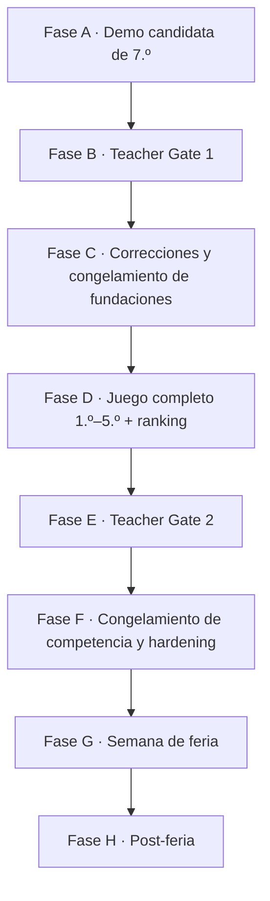

### Fase A — Demo candidata de 7.º

Un slice jugable y pulido de 7.º grado, representativo de la arquitectura y la identidad visual finales. No es un prototipo descartable. Su alcance está en el [vertical slice de 7.º grado](06-delivery/vertical-slice-grade-7.md).

**Audiencia:** el Departamento de Matemática.

### Fase B — Teacher Gate 1

Los docentes aceptan la dirección o piden cambios acotados. La lista de lo que se les pide decidir está en [los gates docentes](06-delivery/teacher-gates.md). Salida esperada: correcciones de contenido, guía de dificultad y una decisión explícita sobre la filosofía de score.

### Fase C — Congelamiento de fundaciones

Con las correcciones aceptadas se congela el comportamiento fundacional y el sistema visual. Después de este punto, reabrir arquitectura o identidad requiere un defecto real, no una preferencia.

### Fase D — Producción del juego completo

`7.º → 1.º → 2.º → 3.º → 4.º → 5.º → Egreso`, más catálogo completo de escenarios, variantes desplegadas, ranking, backend de evento, verificación autoritativa y herramientas de operación.

### Fase E — Teacher Gate 2

Revisión de aceptación del candidato completo. No es otra exploración de concepto: se revisan contenido final, progresión, comportamiento del score, duración, reglas de competencia y detalles de presentación.

### Fase F — Congelamiento de competencia y hardening

Se congelan las versiones de contenido, reglas y score. Después corren simulación, carga, red, seguridad, accesibilidad, QA móvil y ensayo operativo. Ver [modo feria y congelamiento](05-operations/fair-mode-and-competition-freeze.md).

### Fase G — Semana de feria

Estudiantes y visitantes juegan online y compiten. La política de intentos y el criterio de ranking los define la configuración del evento, aprobada previamente por los docentes.

### Fase H — Post-feria

Decidir si el juego queda online, si el ranking del evento se archiva, si se abre un modo libre o si el producto evoluciona.

## La restricción externa

> **No hay playtest con estudiantes del rango objetivo antes de la primera release de feria.**

Esto es una restricción del contexto, no una decisión de proceso, y tiene una consecuencia que la documentación debe decir en voz alta:

**Teacher Gate ≠ validación de experiencia de usuario.** La aprobación docente reduce riesgo de contenido, matemática y tono. No es evidencia de que un chico de 12 años entienda la pantalla en diez segundos, ni de que quiera jugar una segunda run.

Cualquier documento que hable de “validado con jugadores” antes de la Fase G está describiendo una intención, no un hecho.

## Controles compensatorios

Ninguno reemplaza el playtest faltante; en conjunto reducen las clases de riesgo que sí se pueden atacar sin jugadores reales.

| Control | Qué riesgo cubre | Dónde vive |
|---|---|---|
| Revisión heurística de UX | instrucciones, carga de texto, un primario a la vez | [UX e interacción](01-game-design/ux-interaction-design.md) |
| Prueba proxy con adultos sin asistencia verbal | dónde se pregunta “¿qué hago?” | [los gates docentes](06-delivery/teacher-gates.md) |
| Simulación determinista masiva | callejones sin salida, scores imposibles, deriva de replay | [estrategia de testing](04-quality/testing-strategy.md) |
| Validación de variantes e invariantes | variantes ambiguas, imposibles o triviales | [validación y auditoría de variantes](04-quality/variant-validation-and-audit.md) |
| Auditoría de equidad competitiva | dominancia, sesgo de velocidad, sesgo de volumen | [auditoría de equidad competitiva](04-quality/competition-fairness-audit.md) |
| Accesibilidad automatizada y manual | barreras de interacción predecibles | [accesibilidad del sistema de diseño](09-design-system/accessibility.md) |
| QA móvil en 360/390/430 px | layout y legibilidad reales | [NFR](04-quality/non-functional-requirements.md) |
| Telemetría lista el día uno | la feria es la primera exposición real | [analytics y observabilidad](03-architecture/analytics-observability.md) |
| Disciplina de congelamiento | reaccionar a una anécdota cambiando reglas en vivo | [modo feria y congelamiento](05-operations/fair-mode-and-competition-freeze.md) |

## Riesgo residual declarado

El proyecto acepta explícitamente que la diversión, la velocidad de comprensión y la distribución real de dificultad quedan inciertas hasta la feria. Las métricas de la Fase G son la primera evidencia real de uso y **no deben presentarse retroactivamente como validación previa**. Ver [métricas de éxito](00-product/success-metrics.md).

---

# FILE: 00-product/risks-and-assumptions.md

# Riesgos y supuestos

## Supuestos de producto

- El público principal tiene 12–17 años.
- La feria prioriza partidas breves y acceso por QR.
- El juego se usa principalmente en español.
- No se necesita identidad real para participar.
- El volumen de una feria escolar entra cómodamente en arquitectura serverless + Postgres gestionado.

## Riesgos principales

| Riesgo | Impacto | Probabilidad | Mitigación |
|---|---:|---:|---|
| Se percibe como examen | Alto | Medio | playtests; variedad de interacciones; consecuencias narrativas |
| Dificultad desigual 12–17 | Alto | Alto | variantes por complejidad; dificultad adaptativa/híbrida |
| Contenido ambiguo | Alto | Medio | math review + invariants + golden seeds |
| Wi-Fi insuficiente | Alto | Alto | gameplay local-first; pending sync; fallback |
| Ranking manipulable | Medio/Alto | Medio | scoring server-side; rate limits; auditoría |
| Nicknames ofensivos | Alto en feria | Medio | filtro + moderación inmediata |
| Scope creep | Alto | Alto | roadmap por gates; no minijuegos especiales antes de validar core |
| Demasiados componentes únicos | Medio | Medio | content-as-data + interaction types |
| RNG genera injusticia | Alto | Medio | separar calidad ex ante de outcome; seeds/event rules |
| Service worker cachea versión vieja | Medio | Medio | diferir PWA offline avanzada; versionar assets/rules |

## Riesgos pedagógicos

- confundir velocidad con capacidad matemática;
- premiar sólo una estrategia cuando existen múltiples válidas;
- usar contextos no cercanos o sesgados;
- convertir errores en señal negativa personal;
- usar estadísticas de estudiantes fuera de contexto.

## Riesgos técnicos

- drift entre engine cliente y servidor;
- cambios de RNG rompen replay;
- migraciones incompatibles durante evento;
- payloads de actions demasiado grandes;
- dependencia innecesaria de realtime.

## Mitigación transversal

La principal defensa es mantener el sistema pequeño, determinista, versionado y testeable. Cada aumento de complejidad debe responder a evidencia de uso.

## Riesgos incorporados desde el blueprint v0.2

Riesgos que aparecen cuando el juego pasa a ser una competencia con premios y cuando se acepta que la primera exposición real es la feria.

| Riesgo | Impacto | Mitigación |
|---|---:|---|
| La primera prueba con estudiantes ocurre durante la feria | Alto | gate docente como proxy, UX conservadora, simulación, telemetría, hardening; el riesgo residual se **declara**, no se disimula |
| Una variante procedural sale ambigua o imposible | Alto | catálogo de variantes prevalidado y desplegado, invariantes ejecutables |
| Los intentos ilimitados favorecen a quien tiene más tiempo libre | Medio | personal best en vez de suma; política de intentos configurable |
| El jugador reintenta hasta recibir una run fácil | Medio | presupuesto de dificultad, pools emparejados, descriptor emitido por el servidor |
| El score de ranking se puede falsificar | Alto | el servidor reproduce y calcula; nunca se confía el score final del navegador |
| El score premia la velocidad por encima del razonamiento | Alto | la matemática domina; el tiempo sólo como desempate tardío |
| El desempeño académico se cuenta dos veces | Medio | `MathPerformance` separado del Promedio visible |
| Estilo se convierte en un objetivo de optimización | Medio | Estilo no puntúa directamente |
| Matemática trivial para adultos y difícil para 12 años | Alto | piso bajo y techo alto; complejidad por restricciones y optimización |
| El diseño visual vuelve a parecerse a los juegos de referencia | Medio | sistema de diseño v0.2 aprobado y sus gates de tokens y contraste |
| Se cambia una regla en medio de la feria | Alto | congelamiento de versiones, control de cambios y capacidad de replay/regrade |

Los detalles de cada mitigación están en [validación y auditoría de variantes](04-quality/variant-validation-and-audit.md), [auditoría de equidad competitiva](04-quality/competition-fairness-audit.md) y [modo feria y congelamiento](05-operations/fair-mode-and-competition-freeze.md).

## Supuesto que cambió

El supuesto de que habría playtest con estudiantes antes de la primera release pública **ya no se sostiene**. Ver [ciclo de entrega real](00-product/real-delivery-lifecycle.md). Todo criterio de aceptación que dependa de jugadores reales antes de la feria es, hasta nuevo aviso, una intención.

---

# FILE: 00-product/scope-and-roadmap.md

# Alcance y roadmap

## Estrategia de entrega

La validación debe ocurrir en capas. El proyecto sólo incorpora infraestructura o variedad de contenido cuando la capa anterior demuestra valor.

## MVP 0 — Prototipo local

### Objetivo
Validar que el loop central sea comprensible y divertido.

### Incluye
- Landing mínima.
- Nickname local opcional.
- Carrera parcial: 7.º grado y 1.º año.
- 8–10 desafíos de inventario/cobertura para el prototipo (objetivo histórico; no longitud de una run normal).
- 3–4 patrones de interacción.
- Feedback de consecuencias.
- Score local provisional.
- Perfil final simplificado.
- Juego completamente cliente-side.
- Seed local determinista.

**Objetivo histórico de MVP 0.** El conteo de 8–10 se escribió antes de [ADR-019](03-architecture/adr/ADR-019-scenario-family-template-variant.md) como meta de contenido disponible y cobertura de demostración para 7.º + 1.º. Se conserva como antecedente; no define el presupuesto actual de una run normal, que selecciona uno o dos beats por etapa desde un catálogo que puede ser mucho más rico.

### No incluye
- Base de datos.
- Ranking global.
- Auth.
- Realtime.
- PWA offline completa.
- Admin de contenido.

### Criterio de salida

> **Corregido por el ciclo de entrega real.** Este criterio se escribió asumiendo una tanda de testers antes de seguir. Esa tanda no está garantizada: la primera exposición a estudiantes del rango objetivo es la feria. Ver [ciclo de entrega real](00-product/real-delivery-lifecycle.md).

- Un adulto que no participó del desarrollo completa una run sin explicación verbal, y se registra dónde preguntó qué hacer.
- Duración media dentro del rango deseado, medida por simulación y por esa prueba proxy.
- Se detectan al menos 3 desafíos que generan comentario o discusión.
- El Departamento de Matemática acepta la dirección en el Teacher Gate 1.

Los tres primeros son evidencia proxy y se declaran como tal. El cuarto es el gate real.

## MVP 1 — Producto web jugable

### Incluye
- Carrera completa: 7.º a 5.º.
- 30–40 desafíos base o combinaciones equivalentes disponibles mediante parametrización; no todos se juegan en una run.
- 6–8 patrones de interacción.
- API de runs.
- PostgreSQL/Supabase.
- Ranking por evento.
- Score autoritativo en servidor.
- Perfiles finales.
- Analytics básico.
- Deploy público.

### Criterio de salida
- Puede soportar una prueba escolar controlada.
- No existen resultados oficiales calculados exclusivamente en cliente.
- Los desafíos procedurales pasan validación automatizada.

## MVP Feria — Operación real

### Incluye
- Evento de feria con seed/ruleset común.
- QR de entrada.
- Leaderboard público.
- Moderación de nicknames.
- Pantalla de proyección.
- Modo degradado para mala conectividad.
- Runbook operacional.
- Métricas de partidas iniciadas/completadas.
- Protección básica contra abuso.

### Criterio de salida
- Ensayo de carga y conectividad realizado.
- Plan de fallback probado.
- El organizador puede resetear/ocultar scores sin despliegue.

## Post-MVP

Posibles líneas:
- Daily challenge.
- Desafíos por curso/nivel.
- Más perfiles narrativos.
- Minijuegos especiales como Reactor 42.
- PWA instalable con soporte offline avanzado.
- Panel de administración de contenido.
- Modo docente para crear eventos.
- Comparación de decisiones por cohorte.
- Partidas privadas por código.
- Temporadas.
- Internacionalización.
- Multiplayer asíncrono.

## Fuera de alcance hasta nueva decisión

- Chat o mensajería entre menores.
- Login social obligatorio.
- Publicación de datos personales.
- Marketplace o compras.
- Publicidad.
- Sistema de amigos.
- Moderación social compleja.
- IA generativa creando problemas en producción sin validación determinista.

## Cómo se corresponden las capas con el ciclo real

Las capas MVP describen **qué se construye**. Las fases del [ciclo de entrega real](00-product/real-delivery-lifecycle.md) describen **quién valida y cuándo se congela**. Son dos ejes, no dos planes en competencia.

| Capa de alcance | Fase del ciclo real | Quién valida |
|---|---|---|
| MVP 0 — prototipo local | Fase A — demo candidata de 7.º | prueba proxy con adultos; **sin estudiantes** |
| — | Fase B — Teacher Gate 1 | Departamento de Matemática |
| — | Fase C — congelamiento de fundaciones | equipo |
| MVP 1 — producto web jugable | Fase D — producción del juego completo | tests, simulación y auditorías |
| — | Fase E — Teacher Gate 2 | Departamento de Matemática |
| MVP Feria — operación real | Fase F — congelamiento y hardening | ensayo de carga, red y operación |
| — | Fase G — semana de feria | **primera evidencia real de uso** |
| Post-MVP | Fase H — post-feria | decisión de producto |

## Alcance completo del producto

La progresión completa es `7.º → 1.º → 2.º → 3.º → 4.º → 5.º → EGRESO`. Cada etapa usa la misma gramática de diseño y de motor: los años posteriores agregan complejidad de contenido, **no un sistema de UI nuevo**.

El producto completo, más allá del MVP Feria, incluye: catálogo completo de escenarios y variantes deterministas, modelo de carrera Promedio · Equipo · Aura · Estilo, dominio matemático y flags ocultos, recuperación fail-forward donde corresponda, arquetipo final, score oficial de feria, ranking por evento, política de intentos configurable, reglas y contenido versionados, verificación de runs en servidor, moderación de nicknames y operación de feria.

Ver [alcance objetivo del motor](03-architecture/target-engine-architecture.md) para el estado real de cada capacidad.

## Escalamiento temático por año

Dirección de escalada **lúdica**, no currículo oficial: la pertinencia curricular la deciden los docentes, y la progresión matemática vigente está en el [marco matemático](01-game-design/math-design-framework.md).

| Etapa | Qué se agrega como desafío |
|---|---|
| 7.º | aprender la gramática: tiempo, porcentajes, área, presupuesto, asignación simple, divisibilidad |
| 1.º | adaptación y organización: horarios, proporcionalidad, primeras evaluaciones fuertes, dinámica de grupo |
| 2.º | autonomía: trade-offs de recursos, primeras probabilidades, comparación financiera |
| 3.º | interpretación: estadística, muestras, incertidumbre, pedir información, elecciones multivariable |
| 4.º | responsabilidad: proyectos grandes, restricciones, planificación, optimización |
| 5.º | cierre: proyecto final, previas y recuperación, egreso, decisiones de futuro |

### Producción de contenido después del Teacher Gate 1

No se autoran los años en secuencia sin catálogo. Primero se arma la matriz completa de 1.º–5.º —una fila por plantilla, no por variante— y el Departamento de Matemática revisa **la matriz**, no sólo pantallas terminadas. Recién después se implementa año por año. Ver [secuencia de implementación](06-delivery/implementation-sequence.md).

La referencia histórica de seis a ocho situaciones significativas por año describe **profundidad posible del catálogo**, no beats obligatorios en una run. No fija un requisito ni una cantidad final: cada run normal selecciona uno o dos beats por etapa, mientras el catálogo debe ofrecer más opciones para sostener la rejugabilidad. La profundidad definitiva sigue abierta ([pregunta 46](07-reference/open-questions.md)).

---

# FILE: 00-product/success-metrics.md

# Métricas de éxito

## North Star inicial

**Tasa de runs completadas con intención de repetir.**

La métrica combina finalización y atractivo. En pruebas cualitativas, preguntar inmediatamente “¿jugarías otra run ahora?” permite detectar si el producto sólo se entiende o también genera rejugabilidad.

## Métricas de experiencia

- Tiempo hasta primera interacción.
- Tiempo total de run.
- Tasa de finalización.
- Tasa de reintento voluntario.
- Abandono por año/desafío.
- Uso de herramientas/pistas.
- Tiempo por tipo de interacción.

## Métricas de contenido

- % de jugadores que eligen cada opción.
- Distribución de score por desafío.
- Tasa de solución funcional/eficiente/óptima.
- Desafíos con tasa de error extrema.
- Desafíos con tiempo de resolución anómalo.
- Diferencia de desempeño por dificultad elegida, nunca por datos personales sensibles.

## Métricas lúdicas

- Diversidad de perfiles finales.
- Número medio de consecuencias narrativas activadas.
- Distribución de decisiones arriesgadas.
- Número de runs por jugador anónimo/sesión.

## Métricas de feria

- Runs iniciadas por hora.
- Runs completadas por hora.
- Usuarios concurrentes aproximados.
- Error rate API.
- Latencia p95 de start/finish/leaderboard.
- Porcentaje de runs enviadas después de modo offline/degradado.

## Targets iniciales de validación

No son contratos; sirven como hipótesis.

- 80% completa la primera run iniciada en pruebas moderadas.
- Mediana de run entre 4 y 7 minutos.
- 50% o más acepta jugar nuevamente cuando se le ofrece de inmediato.
- Menos de 5% abandona por confusión de UI en un desafío individual.
- 95% de requests críticos de feria bajo 1 s en condiciones normales.

## Métricas que NO deben convertirse en KPI principal

- Nota matemática equivalente.
- Cantidad total de clicks.
- Tiempo de pantalla por sí solo.
- Posición individual de estudiantes identificables.

El producto es lúdico y educativo; optimizar exclusivamente engagement puede llevar a patrones de diseño que contradigan el contexto escolar.

## Antes y después de la feria

Porque no hay playtest con estudiantes antes del lanzamiento, conviene separar dos clases de métrica que no se pueden mezclar: las que se pueden **cerrar antes** y las que sólo existen **después**. Ver [ciclo de entrega real](00-product/real-delivery-lifecycle.md).

### Gates medibles antes de la release

Son verificables sin jugadores reales, y por eso son gates de verdad.

- 100 % de las variantes competitivas pasan la validación de invariantes;
- 100 % de las runs oficiales son reproducibles por seed, versiones y action log;
- 0 defectos P0/P1 conocidos de motor o de ranking;
- 0 variantes con respuesta ambigua en el catálogo desplegado;
- los flujos móviles representativos pasan en 360, 390 y 430 px;
- operación completa por teclado y con movimiento reducido, verificada;
- las simulaciones de distribución de score no muestran una plantilla ni una posición de respuesta dominando de forma inesperada;
- el leaderboard no se puede actualizar con un score enviado por el cliente.

### Indicadores del Teacher Gate 1

- el contenido queda aceptado o con una lista acotada de correcciones;
- los docentes pueden explicar el objetivo matemático de cada familia de la demo;
- los principios de ranking se consideran apropiados para repartir premios;
- no se pide un rediseño fundacional.

### Evidencia recién disponible en la feria

Telemetría agregada y pseudónima: tasa de finalización, duración activa mediana, distribución de resultados por desafío, punto de abandono, tasa de error, éxito de envío al ranking, distribución de score y mejora entre intentos repetidos.

**Esta es la primera evidencia real de uso.** No puede presentarse retroactivamente como validación previa, y ninguna de las métricas de esta sección reemplaza el playtest que no ocurrió.

---

# FILE: 01-game-design/challenge-catalog.md

# Catálogo semilla de desafíos

Este catálogo es backlog de **contenido disponible**, no un `RunPlan` ni un compromiso de implementar todos sus ítems en MVP. Las filas por año son candidatas de planificación, no ubicaciones finales: su auditoría sigue **OPEN** en las [preguntas 46 y 46-bis](07-reference/open-questions.md). Cada entrada debe pasar por la guía de autoría y validación antes de producción.

## 7.º grado

| ID | Escenario | Matemática | Interacción | Decisión/objetivo |
|---|---|---|---|---|
| C01 | Kiosco entre amigos | suma, división, presupuesto | Decision Card | elegir compra que alcance para el grupo |
| C02 | Llegar a horario | tiempo, suma de minutos | Timeline | estimar llegada y elegir transporte |
| C02b | Salir a tiempo | tiempo, porcentaje sobre una duración | Numeric Input | decir con cuánta anticipación hay que salir |
| C03 | Foto del curso | división y resto | Spatial/Decision | formar filas con restricciones |
| C04 | Mural simple | área y cobertura | Decision Card | comprar pintura suficiente |
| C05 | Repartir impresiones | división | Assignment | distribuir páginas equitativamente |
| C06 | Educación física | distancia/fracciones | Numeric Input | calcular vueltas de pista |
| C41 | Acto del 25 de Mayo | clasificación: paridad, múltiplos, primos | Number Grid | seguir la coreografía marcando los números que cumplen cada regla |

## 1.º año

| ID | Escenario | Matemática | Interacción | Decisión/objetivo |
|---|---|---|---|---|
| C07 | Semana de pruebas | tiempo, priorización | Budget/Timeline | repartir horas de estudio |
| C08 | Notebook en oferta | porcentajes | Decision Card | comparar descuento porcentual/fijo |
| C09 | Materiales para maqueta | proporciones | Budget Builder | comprar cantidades suficientes |
| C10 | Plano del aula | escala | Spatial Grid | ubicar elementos respetando escala |
| C11 | Entradas para acto | porcentajes/capacidad | Numeric/Decision | decidir si se pueden vender más |
| C12 | Recreo compartido | proporción/costo unitario | Decision Card | comparar packs |

## 2.º año

| ID | Escenario | Matemática | Interacción | Decisión/objetivo |
|---|---|---|---|---|
| C13 | Trabajo grupal | asignación/restricciones | Assignment Board | asignar personas según habilidad y horas |
| C14 | Plan de datos del viaje | tasas/unidades | Decision Card | elegir plan suficiente y eficiente |
| C15 | Subir video a la nube | velocidad/unidades | Numeric/Decision | determinar si termina antes del plazo |
| C16 | Torneo escolar | combinatoria básica | Graph/Decision | calcular partidos todos-contra-todos |
| C17 | Comprar remeras | descuentos escalonados | Budget Builder | elegir proveedor según cantidad |
| C18 | Campaña de reciclaje | razones | Chart | comparar kg/alumno entre cursos |

## 3.º año

| ID | Escenario | Matemática | Interacción | Decisión/objetivo |
|---|---|---|---|---|
| C19 | Viaje escolar | presupuesto multietapa | Budget Builder | cubrir transporte/alojamiento/actividades |
| C20 | Rifa del curso | ingresos, costo, probabilidad | Decision Card | elegir estrategia de recaudación |
| C21 | Buffet del evento | margen/costo unitario | Budget Builder | fijar combinación rentable |
| C22 | Horario de stands | intervalos/restricciones | Timeline | asignar franjas sin solapamientos |
| C23 | Cableado del stand | distancia/geometría | Spatial Grid | elegir recorrido suficiente/corto |
| C24 | Batería para exposición | consumo/tasa | Decision Card | elegir batería según duración |

## 4.º año

| ID | Escenario | Matemática | Interacción | Decisión/objetivo |
|---|---|---|---|---|
| C25 | Encuesta estudiantil | porcentajes/muestra | Chart + Request Info | juzgar confianza antes de cambiar campaña |
| C26 | Dos publicaciones | proporciones | Chart/Decision | comparar engagement rate |
| C27 | “Mejoramos 200%” | porcentajes/interpretación | Decision Card | evaluar afirmación y contexto |
| C28 | Seguidores por semana | crecimiento/función | Sequence | proyectar tendencia y decidir inversión |
| C29 | Evento con lluvia | probabilidad/riesgo | Decision Card | elegir plan logístico |
| C30 | Promedio engañoso | media/mediana | Chart | elegir medida representativa |
| C31 | Encuestas incompatibles | tamaño de muestra | Request Info | decidir qué evidencia pesa más |

## 5.º año

| ID | Escenario | Matemática | Interacción | Decisión/objetivo |
|---|---|---|---|---|
| C32 | Feria de ciencias | presupuesto + tiempo + riesgo | Multi-step | elegir proyecto viable |
| C33 | Stand final | área/perímetro/optimización | Spatial Grid | maximizar uso de espacio con circulación |
| C34 | Proyecto de software | horas/capacidad | Assignment Board | distribuir backlog entre equipo |
| C35 | Hosting del proyecto | costo fijo/variable | Decision Card | elegir plan según tráfico esperado |
| C36 | Imprimir merchandising | break-even | Numeric/Decision | determinar cantidad mínima rentable |
| C37 | Transporte a competencia | tasas/costos | Decision Card | comparar rutas y medios |
| C38 | Presentación final | scheduling | Timeline | ordenar tareas críticas antes del deadline |
| C39 | Encuesta final | estadística/intervalos | Chart | detectar conclusión excesiva |
| C40 | Fondo de egresados | porcentajes/crecimiento | Decision Card | comparar planes de ahorro simples |

## Eventos especiales / bosses

| ID | Evento | Combinación |
|---|---|---|
| B01 | Organizar el viaje | presupuesto + proporciones + tiempo |
| B02 | Torneo escolar | combinatoria + scheduling + recursos |
| B03 | Semana de exámenes | optimización + tiempo + energía |
| B04 | Centro de estudiantes | estadística + porcentajes + estrategia |
| B05 | Feria final | geometría + presupuesto + asignación + riesgo |
| B06 | Reactor 42 cameo | aritmética/composición de expresiones |

## Plantillas recomendadas para el primer vertical slice

Implementar primero una muestra deliberadamente diversa:
- C02 Timeline.
- C04 Decision Card/geometry.
- C08 porcentajes.
- C13 Assignment Board simplificado.
- C14 tasas/unidades.
- C25 Chart/Request Info.
- C33 Spatial Grid simplificado.
- C35 trade-off de costos.

Esto prueba ocho tipos de razonamiento sin necesitar contenido definitivo para todas las etapas.

## Implementado

Contenido de producto que existe en el repositorio, en `src/content/grade-7/`. **Siete plantillas** y nueve storylets; una partida juega seis situaciones, porque el slot del colectivo aloja dos plantillas y el seed elige cuál sale. El resto del catálogo sigue siendo backlog.

| ID en código | Entrada del catálogo | Interacción | Matemática | Escenario implementado |
|---|---|---|---|---|
| `g7.bus-timing` | C02 | Timeline | porcentaje sobre una duración, suma de minutos | elegir a qué hora salir sabiendo que el viaje se demora |
| `g7.bus-latest-departure` | C02b | Numeric Input | la misma relación recorrida al revés, con un margen pedido | decir con cuántos minutos de anticipación hay que salir |
| `g7.may-25-act` | C41 | Number Grid | paridad, múltiplos de 3 y números primos | seguir la coreografía del acto escolar con una ayudamemoria numérica |
| `g7.mural-paint` | C04 | Decision Card | área y cobertura por litro, compra por envase entero | comprar la pintura del mural |
| `g7.notebook-offer` | C08 | Decision Card | descuento porcentual contra descuento fijo | elegir la oferta que entra en el presupuesto |
| `g7.group-tasks` | C13 | Assignment Board | asignación con horas disponibles y habilidad | repartir el trabajo grupal |
| `g7.stand-supplies` | C09 | Budget Builder | costo unitario por pack, mínimo que alcanza | comprar insumos para el stand de la feria |

### Con cuánto tiempo hay que salir

`g7.bus-latest-departure` · interacción `numeric-input` · dificultad base 3 · categorías `time-and-rates` y `proportions-and-percentages`.

**Estado: contenido de producción con fuente matemática `generated`.** Es la segunda plantilla de la familia `bus` y la razón por la que la familia existe: la situación es la misma —el 60 viene con demora— y la pregunta se da vuelta. Ver [ADR-021](03-architecture/adr/ADR-021-approved-catalog-in-play-and-teacher-demo.md).

**Por qué es otra plantilla y no otra variante.**

| | `g7.bus-timing` | `g7.bus-latest-departure` |
|---|---|---|
| Pregunta | ¿a qué salida me subo? | ¿con cuánto tiempo salgo? |
| Trabajo | evaluar cuatro candidatas y descartar | recorrer la relación al revés |
| Respuesta | está entre las opciones | la produce el jugador |
| Error | elegir mal | quedarse corto o pasarse |

Una pregunta cuya respuesta está en pantalla y otra cuya respuesta hay que construir no son la misma pregunta con otros números. Que la interacción sea distinta es consecuencia del razonamiento, no decoración.

**Matemática.** Viaje con demora porcentual, más el margen que el grupo pide:

```
viaje de hoy  = duración + duración · demora%
anticipación  = viaje de hoy + margen pedido
```

Los pares duración/demora están restringidos a los que dan **minutos enteros**, y la anticipación resultante tiene que caer entre 20 y 90 minutos: ni tres minutos ni dos horas son números que alguien estime.

**Evaluación asimétrica.** Pasarse y quedarse corto no son el mismo error, y el resultado lo dice:

| Diferencia contra lo necesario | Calidad | Lo que pasa |
|---|---|---|
| negativa | `invalid` | llegan tarde o sin el margen que habían pedido |
| hasta 2 min de más | `optimal` | el número justo |
| hasta 15 min de más | `efficient` | llegan bien y esperan un rato |
| más de 15 min | `functional` | llegan con la escuela cerrada |

**Carrera.** Sólo Estilo. El colectivo no es una evaluación: nadie pone una nota por llegar a horario.

**Espacio de variantes.** 360 problemas distintos, que es el producto exacto de sus restricciones: 30 pares duración/demora, 4 horas de entrada y 3 márgenes. La auditoría de 10.000 candidatos los aprueba a todos y descarta el resto por duplicado, con cero rechazos. El aviso de tasa de duplicados es aritmética —agotado el espacio, todo candidato repite— y no un defecto. Que 360 alcancen es una afirmación sobre un catálogo de desarrollo.

### Acto del 25 de Mayo

`g7.may-25-act` · interacción `number-grid` · dificultad base 2 · categorías `patterns-and-relations` y `quantity`.

**Estado: contenido de producción con fuente matemática `generated`.** La escena, la coreografía, las señales, las reglas y el feedback son autorados. Las grillas numéricas concretas pertenecen al generador determinista `may-25.grid.constraint-first` y pasan por el pipeline de [ADR-020](03-architecture/adr/ADR-020-variant-generation-and-approved-catalog.md). Desde [ADR-021](03-architecture/adr/ADR-021-approved-catalog-in-play-and-teacher-demo.md) la partida selecciona dentro del catálogo aprobado —27 grillas, no las tres curadas— sin volver procedural la narrativa. El evento introduce Aura cuando se juega: la Teacher Demo lo incluye deliberadamente; una partida normal compuesta sólo lo juega si lo seleccionó su `RunPlan`.

**Propósito narrativo.** Al jugador le toca la coreografía folklórica del acto escolar, adelante de toda la escuela. Como no se acuerda los pasos, armó una ayudamemoria: cada paso tiene una regla numérica, y de la tira de números que canta la maestra acompaña sólo los que la cumplen. Es el único momento del año que pasa en público, y ésa es exactamente la condición que Aura pide.

**Interacción.** Tres pasos, uno debajo del otro, resueltos en una sola confirmación. Cada paso muestra su señal —«Pañuelo blanco», «Pañuelo celeste», «Zapateo»— y su regla **siempre escrita**, más una grilla de ocho números en cuatro columnas. Se marca celda por celda. Ninguna celda revela si estuvo bien hasta que el motor evalúa: marcado significa «elegí ésta», nunca «acerté».

**Rondas autoradas.** Cada variante conserva tres pasos narrativos, siempre en el mismo orden de dificultad; lo que cambia de forma generada y validada son los números de cada grilla:

| Paso | Señal | Regla | Objetivos por grilla |
|---|---|---|---|
| 1 | Pañuelo blanco | números pares | 4 de 8 |
| 2 | Pañuelo celeste | múltiplos de 3 | 3 de 8 |
| 3 | Zapateo | números primos | 3 de 8 |

Los objetivos por grilla de la tabla son los de las coreografías curadas; las generadas llevan tres o cuatro, y nunca más de doce en total. Todos los números son enteros de 0 a 30, para que la clasificación nunca dependa de una cuenta difícil. La ronda de primos incluye el **1** a propósito: es el error clásico de la edad, y la grilla corregida lo muestra tachado sin retar a nadie.

**Matemática.**

- **Par**: entero divisible por 2. El cero es par.
- **Múltiplo de 3**: entero divisible por 3.
- **Primo**: entero mayor que 1 con exactamente dos divisores positivos. Por lo tanto **0 no es primo**, **1 no es primo** y **2 sí lo es**, el único primo par.

Las tres viven en `src/game/math/classification.ts`, fuera de React y fuera del contenido: es el único lugar del producto donde se decide si un número cumple una regla.

**Evaluación.** Los tres pasos se agregan sumando sus confusiones —`TP` aciertos, `FP` marcas de más, `FN` objetivos sin marcar— y se juzgan con un solo F1. Micro-agregar y no promediar tres F1 hace que cada celda pese lo mismo.

```
precisión = TP / (TP + FP)
cobertura = TP / (TP + FN)
F1        = 2·TP / (2·TP + FP + FN)
```

Se juzga con **las dos juntas** y no sólo con la precisión, porque cada una tiene su forma de mentir: marcar una sola celda evidente da 100 % de precisión sin haber hecho la tarea, y marcar la grilla entera da 100 % de cobertura. Los tres casos de denominador cero están decididos explícitamente: no marcar nada teniendo objetivos da precisión 0 —no marcar no es acertar—; una ronda sin objetivos y sin marcas vale 1 en las tres.

**Umbrales.** Sobre el F1 agregado, comparados como racionales exactos:

| F1 | Calidad | Lo que se lee |
|---|---|---|
| = 1 | `optimal` | Óptimo · «Impecable» |
| ≥ 0,85 | `efficient` | Resuelto · «Salió» |
| ≥ 0,70 | `functional` | Parcial · «Zafaste» |
| < 0,70 | `invalid` | Insuficiente · «Se cortó» |

Están elegidos para que ninguna estrategia degenerada pase por buena: marcar las 24 celdas da `F1 = 0,67` y cae en Insuficiente.

Eso dejó de ser una propiedad de las tres coreografías escritas y pasó a ser una **restricción de generación**. Marcando todo hay `T` aciertos y `24 − T` marcas de más, así que `F1 = 2T/(T + 24)`, y quedar debajo de 0,70 exige `T ≤ 12`. El generador construye los objetivos desde ese techo —tres por ronda de piso, hasta uno más en rondas distintas— y un validador independiente rechaza cualquier coreografía donde marcar todo alcanzaría para zafar. Se descubrió al poner el catálogo aprobado a jugar: con hasta cinco objetivos por ronda existían variantes de quince en las que marcar la grilla entera daba «Salió». Ver [ADR-021](03-architecture/adr/ADR-021-approved-catalog-in-play-and-teacher-demo.md).

Ese cambio llevó el generador a versión `2`. `grade-7-dev-1` conserva las coreografías de la versión `1`; `grade-7-dev-2` usa la versión corregida. Una misma dirección generada del acto puede tener huellas distintas entre ambos catálogos sin que ninguno haya sido mutado.

**Aura.** `+1000` impecable · `+400` salió con un error · `+80` zafó improvisando · `−300` se cortó. Es la dimensión que este evento existe para establecer, y puede quedar en positivo o en negativo.

**Estilo.** Aplicado cuando salió completo y con cuidado; Estratega cuando lo sostuvo leer el patrón rápido pese a un error; Improvisador cuando la coreografía se reconstruyó en vez de seguirse —tanto al zafar como al cortarse—. Ningún eje es mejor que otro.

**Promedio.** No lo toca. Un acto escolar no es una evaluación de matemática, y Promedio sale del legajo de notas reales: que un desafío tenga números no lo vuelve académico.

**Equipo.** No lo toca. Bailás vos; el curso mira.

**Fail-forward.** No hay game over. El peor acto deja Aura negativa, evidencia de Improvisador y una consecuencia narrativa, y el año sigue.

**Determinismo.** El `runSeed` selecciona una dirección de la lista jugable actual, pero no define sus grillas. Una vez elegida `familia/plantilla/variante`, los parámetros salen del seed fijo del espacio de contenido y de esa dirección, independientes de la run, el año y el slot. Bajo la misma versión de contenido/generador, la misma dirección es siempre el mismo problema; ver [ADR-019](03-architecture/adr/ADR-019-scenario-family-template-variant.md) y [ADR-020](03-architecture/adr/ADR-020-variant-generation-and-approved-catalog.md). Desde [ADR-021](03-architecture/adr/ADR-021-approved-catalog-in-play-and-teacher-demo.md) la lista jugable **es el catálogo aprobado**: el seed elige dentro de lo que pasó el pipeline, no dentro de las tres grillas curadas. El contenido subió a `0.3.0-grade-7` al agregar el acto, a `0.4.0-grade-7` con la migración estructural, a `0.5.0-grade-7` con el pipeline y la estrategia de fuente, a `0.6.0-grade-7` con la segunda plantilla del colectivo y a `0.7.0-grade-7` con la metadata cognitiva y la composición normal. El catálogo vigente `grade-7-dev-3` conserva las direcciones y huellas de `dev-2` bajo esa nueva versión de contenido.

**Accesibilidad.** Cada celda es una casilla nativa de 56 px: se recorre con Tab y se marca con Espacio. La regla siempre está en texto y nunca es sólo un color. Los cuatro estados corregidos cambian relleno, trazo de borde y glifo a la vez, y llevan además la palabra para lector de pantalla, así que la grilla se lee entera en escala de grises.

Desvíos deliberados respecto del catálogo semilla:

- **C08 y C13 se adelantaron a 7.º grado.** El catálogo los ubica en 1.º y 2.º año. El slice necesitaba cinco tipos de interacción distintos para probar que el motor y la UI soportan variedad real, y la matemática de ambos (porcentaje simple, asignación con restricciones) es accesible en 7.º. Cuando se implementen 1.º y 2.º año, esos escenarios se reescriben con números y contexto propios de cada etapa; no se reutiliza la instancia de 7.º.
- **C09 cambió de escenario.** El catálogo lo describe como materiales para una maqueta; se implementó como insumos para el stand de la feria, porque cierra el arco narrativo del año. La matemática y la interacción son las declaradas.
- **C01, C03, C05 y C06 no se implementaron.** El resto queda como backlog para variar el año entre partidas.

El detalle de variantes, calidades y consecuencias de cada uno está en [el diseño del slice](06-delivery/vertical-slice-grade-7.md).

---

# FILE: 01-game-design/challenge-families-and-variants.md

# Familias de escenario, plantillas y variantes

**Estado: implementado hasta STAGE-05.** La jerarquía `ScenarioFamily → ChallengeTemplate → ChallengeVariant` está aceptada en [ADR-019](03-architecture/adr/ADR-019-scenario-family-template-variant.md), el pipeline híbrido con catálogo aprobado de desarrollo en [ADR-020](03-architecture/adr/ADR-020-variant-generation-and-approved-catalog.md), su consumo por la partida real en [ADR-021](03-architecture/adr/ADR-021-approved-catalog-in-play-and-teacher-demo.md), y la composición normal por presupuesto en [ADR-022](03-architecture/adr/ADR-022-difficulty-model-and-run-composer.md). La promesa de que una familia aloja varias plantillas está cumplida en contenido de producción: la familia `bus` tiene dos, con razonamientos distintos. El determinismo sigue **LOCKED**. El inventario, la profundidad cognitiva del resto de las familias, la calibración docente y el catálogo oficial de feria permanecen abiertos.

## El problema

Un desafío fijo se memoriza. Cambiar `25 %` por `15 %` compra una partida más: el jugador igual aprende “la segunda opción”. Lo que hace falta es **variación estructural** —que cambie el razonamiento, no sólo los números.

Un docente que juega dos veces la demo tiene que ver una diferencia real. Si sólo se reordenan las opciones, no se puede llamar variación.

En 7.º eso ya pasa: la segunda partida trae otros números en las seis situaciones, y en la del colectivo puede traer **otra pregunta** —de «¿a qué salida me subo?» a «¿con cuánto tiempo salgo?»—, que es el mismo dato recorrido al revés.

## Cuidado con la palabra «familia»

El proyecto usa «familia» en dos sentidos y conviene no confundirlos:

| Término | Qué agrupa | Dónde se define |
|---|---|---|
| **Familia de interacción** | el patrón de UI con el que se responde: Decision Card, Timeline, Number Grid… | [sistema de desafíos](01-game-design/challenge-system.md) |
| **Familia de escenario** (`ScenarioFamily`) | el dominio narrativo reconocible: Colectivo, Mural, Cuaderno, Proyecto grupal, Stand | este documento |

Una familia de escenario puede usar varias familias de interacción, y al revés. Cuando un documento diga «familia» sin calificar, el contexto manda: en `challenge-system.md` es interacción; acá es escenario.

## La jerarquía

```text
ScenarioFamily          contexto narrativo reconocible
  └─ Template           estructura de razonamiento distinta dentro de ese contexto
       └─ Variant       parametrización concreta y determinista de esa estructura
```

### Familia

El contexto que el jugador reconoce: Colectivo, Mural, Cuaderno, Proyecto grupal, Stand de feria.

### Plantilla

Una estructura de razonamiento distinta dentro del mismo contexto. No es «el mismo problema con otros números»: es otra pregunta.

Colectivo, por ejemplo:

- **demora porcentual** — duración normal + porcentaje de demora + hora de entrada;
- **última salida posible** — derivar el último horario seguro;
- **comparación de rutas** — dos alternativas con duración y demora distintas;
- **frecuencia** — próximo servicio + duración + límite de llegada.

Mural: cobertura; cobertura descontando aberturas; cobertura con precios de envase y presupuesto.
Cuaderno: porcentaje contra descuento fijo; cuotas contra efectivo disponible; descuento más costo adicional.
Proyecto grupal: asignación por habilidad; restricción de capacidad y horas; reparto balanceado.
Stand: selección de packs; requisitos mínimos; optimización de presupuesto.

### Variante

Un caso concreto y reproducible de una plantilla, identificado por la dirección estable `familia/plantilla/variante`. Sus parámetros pueden ser autorados o generados, pero su identidad semántica nunca depende de una posición de array o del lugar donde una run lo juegue.

## Dirección y seed de contenido

**LOCKED e implementado.** [ADR-020](03-architecture/adr/ADR-020-variant-generation-and-approved-catalog.md) separa selección de contenido y contenido semántico:

```text
seed fijo del espacio de variantes + dirección familia/plantilla/variante
    → parámetros semánticos reproducibles

runSeed
    → selección de qué dirección recibe una run
```

El código lo implementa con `VARIANT_SPACE_SEED`, `variantRngPath(ref)` y `createVariantRng(ref)`. Bajo el mismo contrato versionado de contenido y generador, el mismo `ChallengeVariantRef` materializa el mismo problema aunque cambien la run, la etapa o el slot. `runSeed` puede elegir otra dirección; no redefine qué significa una dirección aprobada. La lógica de dominio nunca llama a `Math.random()` ambiente y reutiliza los substreams de [ADR-012](03-architecture/adr/ADR-012-seeded-prng-and-substreams.md).

## Generación por restricción, no por sorteo

**Implementado.** Generar desde la propiedad pedagógica deseada, no desde parámetros arbitrarios con la esperanza de que el resultado siga siendo válido.

Ejemplo de mural: se quiere que 1 L no alcance, 2 L sea óptimo y 4 L sea válido pero derrochador. Con cobertura de 8 m²/L, se genera primero el área requerida en `(8, 16]` y recién después se eligen dimensiones legibles que den ese área. El camino inverso —elegir dimensiones y ver qué sale— produce variantes triviales o imposibles.

Esto ya es el patrón vigente del motor: el generador produce parámetros, el verificador comprueba invariantes y la presentación nunca lleva la solución. Ver [game engine](03-architecture/game-engine.md).

## Variación no es azar

```text
fuente autorada o generada → resolver/materializar → validar
    → canonizar → fingerprint → deduplicar → catálogo aprobado versionado
```

Un número al azar en runtime puede producir decimales feos, óptimos ambiguos, opciones duplicadas, estados imposibles, variantes triviales o dificultad desbalanceada. En una partida de práctica eso es un bug; en una competencia con premios es una injusticia que no se puede deshacer.

Una fuente `generated` es un espacio finito direccionado y determinista que pasa por el pipeline offline; no es generación arbitraria en el browser. Una fuente `authored` es una lista curada, pero no evita validación, fingerprint ni deduplicación.

El principio viene de STACK, que recomienda pregenerar, testear y desplegar variantes aleatorias en vez de exponer al estudiante a casos defectuosos generados en vivo. Ver [base teórica](07-reference/research-basis.md).

## Catálogo aprobado de desarrollo

**Implementado.** `ApprovedVariantCatalog` guarda la dirección, el origen `authored`/`generated` y el fingerprint de cada variante aprobada. No guarda parámetros ni posiciones: los parámetros se reconstruyen desde la dirección y la huella comprueba que siguen siendo los mismos.

El artefacto vigente es `grade-7-dev-3`, con 159 entradas para las siete plantillas de producción. `dev-1`, con 133, y `dev-2`, con 159, siguen publicados sin cambios. **Una versión publicada no se edita**: cuando el contenido cambia se construye la siguiente y la anterior queda tal cual, porque una run tiene que poder resolverse contra el conjunto que realmente jugó. Los tres son reproducibles byte a byte y `pnpm game:variants check` verifica la integridad del vigente dentro de `pnpm verify`.

`grade-7-dev-2` no es un superconjunto **semántico exacto** de `dev-1`: las plantillas cuyo contrato de generación no cambió conservan direcciones y huellas, pero el generador del acto del 25 de Mayo pasó a versión `2` y puede materializar otro contenido en una misma dirección bajo el contrato nuevo. `dev-1` conserva la versión anterior; no se reescribe. Ver [ADR-021](03-architecture/adr/ADR-021-approved-catalog-in-play-and-teacher-demo.md).

`grade-7-dev-3` sí conserva la población semántica aprobada de `dev-2`: mismas direcciones y mismas huellas. Es otra versión inmutable porque se construyó para `contentVersion 0.7.0-grade-7`; no representa variantes jugables nuevas. Ver [ADR-022](03-architecture/adr/ADR-022-difficulty-model-and-run-composer.md).

Desde [ADR-021](03-architecture/adr/ADR-021-approved-catalog-in-play-and-teacher-demo.md) **la partida elige dentro del catálogo aprobado**: el motor recibe un `ApprovedVariantLookup` y sortea sobre lo aprobado, con lo declarado por la plantilla como respaldo para un content set que todavía no tiene catálogo. `createRun` rechaza una run cuyo `variantCatalogVersion` no sea el del catálogo contra el que se la juega o reproduce.

Es un **catálogo aprobado de desarrollo**, no el catálogo oficial ni justo de la feria. La partida real de 7.º ya lo consume y STAGE-05 implementó el `RunComposer`: la partida normal queda fijada como un plan concreto dentro de un presupuesto de dificultad antes de ejecutarse. Lo pendiente es poblar el catálogo de contenido real de 1.º–5.º y congelar un catálogo oficial de feria.

La huella es `sha256` de la vista semántica canónica declarada por la plantilla. Dos direcciones que producen el mismo problema colisionan y se deduplican intencionalmente.

## Controles anti-memorización

- barajado de opciones derivado del seed cuando la semántica lo permita;
- verificación de que la posición de la opción correcta esté balanceada;
- evitar repetir plantilla o variante inmediatamente dentro de una run;
- mantener una carga estructural comparable entre runs mediante la `CompositionPolicy` y su presupuesto implementado;
- no exponer el seed como una forma de elegir la run fácil.

Los criterios de aceptación de estos controles están en [validación y auditoría de variantes](04-quality/variant-validation-and-audit.md).

## Estado de implementación

| Capacidad | Estado |
|---|---|
| Generación seeded, verificación de invariantes y vista pública sin solución | **implementado** en `src/game/challenges/` |
| Reproducibilidad por seed + versiones + acciones | **implementado**, con property tests y golden replays |
| Jerarquía explícita `ScenarioFamily → Template → Variant` | **implementada** — [ADR-019](03-architecture/adr/ADR-019-scenario-family-template-variant.md), `src/game/challenges/content-model.ts` |
| Variante con identidad, dirección y substream propios | **implementada**; la dirección es `familia/plantilla/variante` |
| Catálogo de contenido disponible, separado del plan de la run | **implementado** — `ContentCatalog` y `RunPlan` |
| Elegibilidad por etapa declarativa, incluso no contigua | **implementada** |
| Roles de colocación y presupuesto de beats por año | **implementados** como contrato de plan validable |
| Fuentes híbridas `authored` / `generated`, ambas validadas | **implementadas** — seis plantillas generadas y `g7.group-tasks` autorada |
| Generador por restricción como abstracción reutilizable | **implementado** — [ADR-020](03-architecture/adr/ADR-020-variant-generation-and-approved-catalog.md) |
| Validación, fingerprint, deduplicación y auditoría de población | **implementados** para el catálogo de desarrollo |
| Catálogo aprobado y versionado de variantes | **implementado** con `dev-1`, `dev-2` y `dev-3` inmutables; `grade-7-dev-3` es el vigente y el oficial de la feria sigue sin congelar |
| `variantCatalogVersion` en la identidad de la run | **implementado** como campo opcional: una run que juega variantes curadas no salió de ningún catálogo y lo dice omitiéndolo |
| Perfil cognitivo, banda derivada y costo de scheduling | **implementados**; la calibración exacta sigue en Teacher Gate |
| Compositor normal por presupuesto y `RunPlan` concreto | **implementados**; `grade-7-composed` prueba el camino real y la genericidad de seis etapas se prueba sólo con fixtures sintéticos |

Cuidado con la palabra «catálogo»: `ContentCatalog` dice qué familias y plantillas existen; `ApprovedVariantCatalog` dice qué variantes concretas fueron aprobadas bajo una versión; `DemoPlan` dice qué muestra la demo docente; `RunPlan` dice qué juega una run normal. Son contratos distintos. El compositor y la comparabilidad **estructural bajo la política candidata** ya existen; lo que todavía no existe es el catálogo oficial congelado de feria, contenido real de 1.º–5.º ni equivalencia empírica validada por docentes.

La brecha completa y su orden están en [arquitectura objetivo del motor](03-architecture/target-engine-architecture.md) y en [la secuencia de implementación](06-delivery/implementation-sequence.md).

---

# FILE: 01-game-design/challenge-system.md

# Sistema de desafíos

## Objetivo

Evitar que Egresado se transforme en una secuencia de multiple-choice. El contenido se construye sobre un conjunto limitado de **patrones de interacción reutilizables**.

## Familias iniciales

> **Acá «familia» significa patrón de interacción**, no dominio narrativo. La otra acepción —`ScenarioFamily`: Colectivo, Mural, Stand— está en [familias, plantillas y variantes](01-game-design/challenge-families-and-variants.md). Una familia de escenario puede usar varias de estas interacciones, y al revés.


### 1. Decision Card
El jugador compara opciones y elige una.

Usos:
- descuentos;
- rutas;
- compras;
- decisiones de riesgo.

### 2. Numeric Estimate / Input
Ingresa o ajusta un valor.

Usos:
- hora de llegada;
- cantidad necesaria;
- presupuesto objetivo.

### 3. Budget Builder
Agrega packs/ítems bajo restricciones.

Usos:
- fiesta;
- viaje;
- materiales.

### 4. Assignment Board
Arrastra personas/recursos a tareas.

Usos:
- trabajo grupal;
- cronograma;
- distribución de puestos.

### 5. Timeline
Ubica eventos, estima duración o selecciona ventanas.

Usos:
- colectivo;
- estudio;
- cronogramas.

### 6. Chart / Data Interpretation
Interpreta gráficos, tablas o encuestas.

Usos:
- centro de estudiantes;
- métricas de redes;
- rendimiento de una campaña.

### 7. Spatial Grid
Ubica objetos en un plano o calcula coberturas.

Usos:
- stand;
- mural;
- distribución de aula.

### 8. Information Request
Permite pedir un dato antes de decidir.

Usos:
- tamaño de muestra;
- costos ocultos;
- restricciones no visibles inicialmente.

### 9. Sequence / Trend
Predice o decide según una serie.

### 10. Special Minigame
Interacción excepcional, por ejemplo Reactor 42. No debe convertirse en dependencia para el MVP.

## Taxonomía matemática

- Cantidad.
- Proporciones y porcentajes.
- Tiempo y tasas.
- Espacio y forma.
- Patrones y relaciones.
- Datos y estadística.
- Probabilidad e incertidumbre.
- Optimización y restricciones.

## Ejemplos canónicos

### Mural
Pared 6 × 2,4 m; cobertura 8 m²/L; elegir pack suficiente/óptimo.

### Notebook
Comparar 20% de descuento vs descuento fijo/cuotas y restricción de efectivo.

### Encuesta
Interpretar 41/38/21 con muestra 90/600 y decidir nivel de confianza.

### Colectivo
28 min con 25% de demora desde 07:10 y entrada 07:45.

### Trabajo grupal
Asignar integrantes con habilidades y horas limitadas.

### Plan de datos
600 MB/día durante 12 días; comparar packs.

### Interacción de redes
Comparar engagement relativo, no likes absolutos.

## Dificultad

La dificultad no depende sólo de números grandes.

Factores:
- cantidad de variables;
- necesidad de múltiples pasos;
- decimales/fracciones;
- información irrelevante;
- información faltante;
- número de restricciones;
- incertidumbre;
- cantidad de soluciones válidas;
- necesidad de optimización y no sólo factibilidad.

## Generación procedural

Patrón recomendado:

1. Generar parámetros desde seed.
2. Resolver el problema internamente.
3. Verificar invariantes.
4. Calcular conjunto de soluciones válidas.
5. Clasificar dificultad.
6. Renderizar narrativa.

Nunca generar opciones al azar y asumir que una es correcta.

## Regla de contenido

Cada desafío debe documentar explícitamente:
- concepto matemático;
- competencia requerida;
- interacción;
- solución/es;
- función de evaluación;
- explicación de feedback;
- parámetros válidos;
- edge cases.

## Variación estructural, no sólo numérica

El patrón de generación de arriba evita que una variante salga rota. No evita que el jugador memorice la respuesta: si el mismo escenario siempre pregunta lo mismo, cambiar `25 %` por `15 %` compra una partida más y nada más.

La arquitectura vigente agrega un nivel intermedio —**plantillas**: estructuras de razonamiento distintas dentro del mismo escenario— y un catálogo aprobado de variantes prevalidado. Ver [familias, plantillas y variantes](01-game-design/challenge-families-and-variants.md) para la jerarquía, la generación por restricción y los controles anti-memorización, y [validación y auditoría de variantes](04-quality/variant-validation-and-audit.md) para los invariantes que una variante aprobada debe cumplir.

La jerarquía y el pipeline están **implementados** por [ADR-019](03-architecture/adr/ADR-019-scenario-family-template-variant.md) y [ADR-020](03-architecture/adr/ADR-020-variant-generation-and-approved-catalog.md): seis plantillas de producción tienen fuente generada y `g7.group-tasks` conserva deliberadamente una fuente autorada, todas validadas. Desde [ADR-021](03-architecture/adr/ADR-021-approved-catalog-in-play-and-teacher-demo.md), el catálogo aprobado alimenta la partida real; el vigente es `grade-7-dev-3`, semánticamente equivalente a `dev-2`. La familia `bus` demuestra variación cognitiva con `g7.bus-timing` y `g7.bus-latest-departure`, que preguntan y se responden de maneras distintas. Es la primera prueba de producción; ampliar esa profundidad al resto del catálogo sigue siendo trabajo futuro de contenido.

## Bandas de dificultad

Además de `DifficultyLevel` 1–5, la autoría y la competencia usan tres bandas —`CORE`, `STANDARD`, `STRETCH`— que describen estructura de razonamiento en vez de intensidad. La correspondencia entre ambas escalas y el presupuesto de dificultad están en [dificultad y jugabilidad universal](01-game-design/difficulty-and-playability.md).

---

# FILE: 01-game-design/competitive-scoring-and-ranking.md

# Score competitivo y ranking

**Estado: RECOMENDADO / TEACHER GATE.** Nada de este documento es una regla cerrada. La separación entre identidad de carrera y score competitivo es una recomendación fuerte de arquitectura; **todos los coeficientes, topes y calibraciones son candidatos** y requieren aprobación del Departamento de Matemática antes del congelamiento de competencia. Los valores exactos siguen **OPEN** ([pregunta 24](07-reference/open-questions.md)).

El score por evento vigente —`base × calidad × dificultad + bonus − penalizaciones`— está en [reglas, scoring y progresión](01-game-design/rules-scoring-and-progression.md) y es lo que el motor implementa hoy. Este documento describe la capa **competitiva** que todavía no existe.

## Tres capas que no son la misma cosa

| Capa | Qué responde | Dónde vive |
|---|---|---|
| **Resultado de desafío** | ¿qué tan bien se resolvió esta situación? | `SolutionQuality` + métricas de razonamiento |
| **Identidad de carrera** | ¿qué clase de recorrido escolar construí? | Promedio · Equipo · Aura · Estilo |
| **Score competitivo** | ¿qué tan fuerte fue esta run oficial bajo las reglas del evento? | `FairScore`, sólo en modo feria |

Están relacionadas y no son intercambiables. Un documento futuro que las trate como un solo sistema estará equivocado en las tres.

## Por qué no se multiplican las stats visibles

Una fórmula del tipo `Aura × 1 + Matemática × 10 + Equipo × 5` no significa lo que parece: las variables viven en escalas distintas.

- dominio matemático oculto: `0–1`;
- Promedio: `1–10`;
- Equipo: `0–100`;
- Aura: con signo, sin techo.

Un multiplicador no expresa peso relativo hasta que cada componente está normalizado. Antes de normalizar, el «peso» es un accidente de escala.

## Arquitectura de score recomendada

Cada evaluador devuelve, además de sus efectos de carrera, una medida de desempeño competitivo normalizada.

### Calidad matemática por evento

`q_i ∈ [0,1]`

Calibración discreta de partida, **candidata y sujeta a Teacher Gate**:

| Calidad | `q` candidato |
|---|---|
| óptima | 1,00 |
| eficiente / resuelta | 0,75 |
| funcional / parcial | 0,40 |
| inválida / insuficiente | 0,10 |

Las interacciones continuas —por ejemplo la grilla de clasificación del acto del 25 de Mayo, que ya se juzga con F1— usan su propia métrica de calidad en vez de estas cuatro cajas. Ver [catálogo de desafíos](01-game-design/challenge-catalog.md).

> Nota de terminología: el motor nombra las calidades `invalid · functional · efficient · optimal`; el blueprint las nombra `insufficient · partial · resolved · optimal`. Es la misma escala de cuatro escalones con distinta etiqueta. El [glosario](07-reference/glossary.md) fija la correspondencia.

### Desempeño matemático normalizado

```text
MathRaw         = Σ (1000 × q_i × difficultyFactor_i)
MathMax         = Σ (1000 × 1,0 × difficultyFactor_i)
MathPerformance = 10000 × MathRaw / MathMax
```

Normalizar contra el máximo alcanzable de *esa* run es lo que permite comparar runs armadas con plantillas distintas.

### Contribuciones de Equipo y Aura

Si se decide que “toda la carrera cuenta”, la contribución competitiva es **una medida de evento acotada**, no el valor visible de la stat.

- `TeamPerformance ∈ [0, 10000]`;
- `AuraPerformance ∈ [0, 10000]` después de normalización y tope del evento.

Aura cruda sigue siendo con signo y sin techo para uso narrativo. Aura competitiva tiene que estar topeada: un solo momento espectacular no puede ganarle a una run matemáticamente superior.

### FairScore candidato

**RECOMENDADO / TEACHER GATE — no es la fórmula oficial.**

```text
FairScore = round(0,80 × MathPerformance + 0,15 × TeamPerformance + 0,05 × AuraPerformance)
```

La ponderación 80/15/5 es un **candidato defendible**, no una decisión tomada. Una intuición previa de `10:5:1` normaliza a 62,5 % / 31,25 % / 6,25 %, que probablemente le da demasiado peso competitivo a la conducta de equipo en una feria de matemática individual.

Quien implemente esto debe escribirlo como política versionada y configurable, nunca como constantes anónimas. Ver [ejemplo de política de score](07-reference/score-policy.example.json).

## Qué no entra al score

### Promedio

No se suma aparte si ya está determinado por desempeño académico matemático. Sumarlo dos veces cuenta la misma habilidad dos veces.

### Estilo

No puntúa directamente. Darle score a Aplicado, Estratega o Improvisador implicaría que hay una personalidad objetivamente superior, y eso destruye el concepto de perfil: el juego dice explícitamente que ningún eje es el malo.

### Cantidad de intentos

No es desempate en ninguna dirección. Premiar más intentos premia tiempo libre; penalizarlos castiga la práctica. Queda como dato informativo salvo decisión docente explícita.

## Intentos y personal best

**RECOMENDADO / TEACHER GATE.** Política sugerida: intentos ilimitados o configurables, y el leaderboard guarda el **mejor intento**, no la suma.

Sumar intentos convierte el ranking en una medida de tiempo disponible. El mejor intento premia la mejora sin castigar a quien llegó tarde a la feria. La guía de GameKit para desafíos repetibles apunta en la misma dirección; ver [base teórica](07-reference/research-basis.md).

La decisión entre ilimitado y N intentos es del evento y sigue abierta. La operación está en [modo feria y congelamiento](05-operations/fair-mode-and-competition-freeze.md).

## Desempate

Sin ruido aleatorio y sin decimales inventados para forzar unicidad. Tupla lexicográfica **recomendada**:

1. `FairScore` desc;
2. `MathPerformance` / `MathRaw` desc;
3. cantidad de resultados óptimos desc;
4. precisión desc;
5. dificultad resuelta desc;
6. tiempo activo asc.

La matemática decide antes que la velocidad, y la velocidad sólo aparece al final. El desempate vigente y más simple del leaderboard está en [leaderboard y moderación](05-operations/leaderboard-and-moderation.md); esta tupla lo extiende y todavía no lo reemplaza.

### Empate exacto

No se puede prometer que un score con significado nunca empate: garantizar unicidad exige una clave arbitraria. Para premios hace falta una **política de organizador escrita antes de la feria**: puesto compartido, premio compartido o un desempate anunciado. Un `run_id` puede dar orden de visualización estable, pero no puede decidir un premio en secreto.

Esa política es **OPEN**.

### Tiempo

Si el tiempo activo participa del desempate, hay que definirlo con cuidado: el reloj de pared se distorsiona con pestañas en segundo plano y red intermitente. Se prefieren intervalos activos controlados por el motor o marcas verificables por el servidor. La pregunta de qué señal temporal puede confiar el servidor sigue **OPEN** ([pregunta 27](07-reference/open-questions.md)).

## Transparencia

Las reglas publicadas tienen que poder explicarse en tres frases: la matemática es lo que más pesa, las decisiones de juego secundarias suman poco, la velocidad sólo desempata. Si la explicación pública no cabe en un cartel, la fórmula es demasiado complicada para una feria.

## Estado de implementación

| Capacidad | Estado |
|---|---|
| Score por evento determinista, con política nombrada y versionada | **implementado**, marcado `production: false` |
| Separación entre stats visibles y métricas ocultas de razonamiento | **implementado** |
| `MathPerformance` / `TeamPerformance` / `AuraPerformance` normalizados | **no implementado** |
| `FairScore` y desglose competitivo | **no implementado** |
| Comparador lexicográfico versionado | **no implementado** |
| Personal best transaccional en servidor | **no implementado** |
| `scoreVersion` en la identidad de la run | **no implementado** |

Ver [arquitectura objetivo del motor](03-architecture/target-engine-architecture.md).

---

# FILE: 01-game-design/content-authoring-guide.md

# Guía de autoría de contenido

## Objetivo

Permitir que nuevos desafíos se incorporen con consistencia lúdica, matemática y técnica.

## Plantilla de diseño

Cada desafío debe responder:

1. **Situación:** ¿qué ocurre?
2. **Objetivo del personaje:** ¿qué quiere lograr?
3. **Datos:** ¿qué números conoce?
4. **Restricciones:** ¿qué limita las opciones?
5. **Acción del jugador:** ¿qué manipula/elige?
6. **Matemática:** ¿qué razonamiento ayuda?
7. **Soluciones:** ¿qué es inválido, funcional, eficiente u óptimo?
8. **Consecuencia:** ¿cómo se explica el resultado?
9. **Efecto narrativo:** ¿qué stats/flags cambian?
10. **Variantes:** ¿qué parámetros pueden generarse proceduralmente?

## Regla “sin números”

Eliminar mentalmente todos los números del evento. Si la decisión sigue siendo obvia o equivalente, la matemática probablemente es decorativa.

## Regla “no examen”

Reformular:
- “¿Cuál es el área?” → “¿Qué pack de pintura alcanza?”
- “¿Cuánto es 20% de 800000?” → “¿Qué oferta realmente cuesta menos?”
- “¿Cuál es la media?” → “¿Qué grupo tuvo mejor rendimiento considerando tamaño?”

## Longitud

- Título: 2–6 palabras.
- Contexto principal: idealmente <60 palabras.
- Opciones: frases cortas.
- Explicación posterior: fragmentada visualmente, no párrafo largo.

## Parámetros

Definir rangos seguros.

Ejemplo:

```text
wall_width: [3.0, 8.0]
wall_height: [2.0, 3.5]
coverage_per_liter: [5, 10]
packages: generated so that >=1 valid and >=1 invalid option exist
```

## Invariantes de generación

Un challenge procedural debe poder afirmar automáticamente:
- tiene al menos una solución funcional;
- si declara solución óptima, ésta existe;
- no hay dos opciones visualmente distintas con mismo resultado si eso confunde;
- las unidades son consistentes;
- el resultado entra en límites de UI;
- no se produce división por cero;
- el valor no excede precisión razonable para la etapa.

## Estados de contenido

- `draft`.
- `math_reviewed` — revisado por el Departamento de Matemática.
- `playtest_ready` — listo para prueba con jugadores. Antes de la feria eso significa **prueba proxy con adultos**, no con estudiantes del rango objetivo; ver [ciclo de entrega real](00-product/real-delivery-lifecycle.md).
- `production_ready`.
- `retired`.

## Checklist editorial

- Lenguaje argentino neutral, comprensible fuera de una provincia específica.
- No usar marcas comerciales reales salvo decisión expresa.
- No asumir nivel socioeconómico como norma.
- Evitar presión financiera personal; contextualizar presupuestos como recursos del proyecto/curso.
- No usar salud, religión, política partidaria u otros datos sensibles del jugador como personalización.
- Humor sin humillación.

## Tres preguntas que la plantilla original no hacía

### Efectos de carrera: sólo los que se pueden mover

¿El evento toca genuinamente Promedio, Equipo, Aura o Estilo? La mayoría de los eventos deberían tocar **una o dos** dimensiones, no las cuatro. Una clave ausente significa que el evento no puede mover esa dimensión, y por eso `Promedio +0` ni siquiera es representable. Ver [ADR-016](03-architecture/adr/ADR-016-career-player-model.md).

Promedio se mueve sólo si el evento es genuinamente académico. Aura se mueve sólo si el momento es socialmente memorable: un cálculo correcto no produce Aura.

### Efectos de competencia: separados de las stats visibles

Cuando exista modo competitivo, cada evaluador declarará su calidad matemática normalizada y, si corresponde, una contribución acotada de Equipo o de Aura, **aparte** de los efectos de carrera visibles. Ver [score competitivo y ranking](01-game-design/competitive-scoring-and-ranking.md).

### Ocultos: dominio y flags

¿Qué dominios matemáticos ejercita? ¿Qué flag narrativo escribe? Ninguno de los dos se renderiza.

## Invariantes antes que generador

Los invariantes de una variante se escriben **antes** que el código que la genera: al menos una solución válida, sin óptimo ambiguo salvo diseño explícito, aritmética legible, contexto escolar plausible, sin opciones duplicadas y posición de la opción correcta no fija. La dificultad no se declara como etiqueta elegida: la plantilla declara su perfil cognitivo y la banda se deriva.

La lista completa y sus criterios de aceptación están en [validación y auditoría de variantes](04-quality/variant-validation-and-audit.md).

## Elegir la fuente de variantes

Desde [ADR-020](03-architecture/adr/ADR-020-variant-generation-and-approved-catalog.md), cada plantilla declara un `VariantSourceSpec` con parámetros autorados, validadores, una vista canónica y, cuando corresponde, un generador determinista.

Hay dos estrategias de primera clase:

```text
AUTHORED
parámetros curados → validar → canonizar → fingerprint
    → deduplicar → catálogo aprobado de desarrollo

GENERATED
dominio paramétrico + generador constraint-first → materializar
    → validar con oráculo → auditoría profunda → canonizar
    → fingerprint → deduplicar → catálogo aprobado de desarrollo
```

`AUTHORED` no significa «confiable sin validar»: cada registro pasa por los chequeos genéricos y específicos, la huella y la deduplicación. Es la estrategia deliberada para contenido cuyo valor está en nombres, entidades o escritura curada; `g7.group-tasks` es el ejemplo actual.

`GENERATED` no significa producir números arbitrarios durante una partida. Bajo un contrato versionado de contenido y generador, cada candidato es una función pura de su dirección y del seed fijo del espacio de contenido; sólo una variante aprobada puede entrar al catálogo. Los seis generadores actuales se ejecutan y auditan con tooling offline. El browser materializa una dirección conocida, no improvisa contenido sin validar.

Cambiar el contrato de un generador exige una versión nueva de generador, contenido y catálogo. La versión publicada anterior permanece reconstruible: no se la regenera para adoptar la semántica nueva. El acto del 25 de Mayo, versión `1` en `grade-7-dev-1` y versión `2` desde `grade-7-dev-2`, es el caso vigente; el catálogo actual `dev-3` conserva direcciones y huellas de `dev-2` y sólo alinea la metadata con `contentVersion 0.7.0-grade-7`.

La estrategia matemática no obliga a proceduralizar la escena. Una plantilla puede mantener autorados narrativa, personajes, copy y estructura de interacción mientras genera sus parámetros concretos. El acto del 25 de Mayo conserva autoradas la coreografía y sus tres reglas; las grillas numéricas son la parte generada.

## Declarar dónde vive el contenido

Desde [ADR-019](03-architecture/adr/ADR-019-scenario-family-template-variant.md) y [ADR-022](03-architecture/adr/ADR-022-difficulty-model-and-run-composer.md), una plantilla declara, además de su regla de juego:

- **familia de escenario** — la situación reconocible en la que ocurre. Una familia puede alojar varias estructuras de razonamiento y no está atada a un año.
- **rol de colocación** — `anchor` (el beat primario del año), `checkpoint` (una evaluación), `special` (un momento social o excepcional) o `recovery` (contenido condicional). Es semántica de agendado: no dice nada sobre la calidad del resultado ni sobre qué mueve en la carrera.
- **variantes curadas de respaldo** — la lista `variants` de ids que la selección usa cuando el content set no aporta un catálogo aprobado para esa plantilla. Con `ApprovedVariantLookup`, la partida elige sobre las direcciones aprobadas. Reordenar el respaldo cambia qué dirección elige un seed en ese modo y requiere versionado de contenido, pero **el orden no define la identidad semántica**: ésta es la dirección estable `familia/plantilla/variante`.
- **interacción y dominios matemáticos** — metadata que el compositor usa para variedad y cobertura, separada de la familia narrativa.
- **perfil cognitivo** — `steps`, `constraints`, `selection`, `optimization`, `uncertainty` y `construction`. La banda y el costo de scheduling se derivan de estos rasgos y de una policy versionada; el autor no los fuerza con un número mágico.

También declara su **elegibilidad por etapa**, que es permiso y no selección: una plantilla elegible para 7.º no aparece en toda run de 7.º. Si una cadena narrativa corta sólo puede alojar un subconjunto, el content set lo explicita en `hostableTemplates`; esa restricción no se esconde en el compositor.

Un año aporta **uno o dos beats ordinarios**, con exactamente un `anchor`. Un `checkpoint` o un `special` gasta uno de esos dos; no es un beat extra. La recuperación es condicional y queda afuera del presupuesto. Ver [la migración del modelo de contenido](03-architecture/content-model-migration.md) para el procedimiento completo.

No confundir los cuatro artefactos: `ContentCatalog` registra familias y plantillas disponibles; `ApprovedVariantCatalog` contiene direcciones concretas que pasaron el pipeline bajo una versión; `DemoPlan` enumera lo que muestra una demostración; `RunPlan` fija lo que una run normal efectivamente juega. El `RunComposer` construye ese último artefacto una vez, antes de ejecutar. Aprobar una variante no la agenda, elegibilidad no garantiza selección y un demo no es un run plan con más presupuesto.

## Ficha de autoría

Una plantilla nueva se registra antes de que exista código. La forma de esa ficha —narrativa, dominios matemáticos, apoyos, perfil cognitivo y banda derivada, invariantes, interacción, resultados, efectos de carrera, contribución competitiva, ocultos y estado de revisión docente— está en [challenge-authoring.example.yaml](07-reference/challenge-authoring.example.yaml).

Es un ejemplo documental: no se importa desde runtime ni reemplaza al [schema de contenido](07-reference/content-schema.example.json).

---

# FILE: 01-game-design/difficulty-and-playability.md

# Dificultad y jugabilidad universal

**Estado: arquitectura implementada; calibración candidata.** El principio de piso bajo y techo alto es **RECOMENDADO** como principio de diseño y ya gobierna el contenido existente. Los seis rasgos estructurales, las bandas derivadas `CORE / STANDARD / STRETCH`, los costos y el presupuesto por etapa están **implementados** como políticas versionadas y configurables ([ADR-022](03-architecture/adr/ADR-022-difficulty-model-and-run-composer.md)). Los multiplicadores de score siguen siendo documentación y pertenecen a STAGE-06. Los umbrales, costos y targets actuales son candidatos: la calibración final es **TEACHER GATE** y la elección entre dificultad manual, adaptativa o híbrida sigue **OPEN** ([pregunta 5](07-reference/open-questions.md)).

Este documento explica *cómo debe subir* la dificultad. Qué matemática se usa en cada año está en el [marco matemático](01-game-design/math-design-framework.md); qué factores hacen difícil un desafío concreto está en el [sistema de desafíos](01-game-design/challenge-system.md).

## El problema de audiencia

En la feria juegan estudiantes de 7.º, estudiantes de 5.º, docentes, familias y visitantes adultos. Un único “nivel medio de currículo” es demasiado difícil para unos y trivial para otros, y no hay forma de preguntar la edad sin pedir datos que el producto decidió no pedir.

## Piso bajo, techo alto, paredes anchas

- **Piso bajo:** entender la situación no requiere conocimiento previo especial. Nadie queda afuera en la primera pantalla.
- **Techo alto:** el razonamiento profundo aparece por restricciones, comparación y optimización, no por currículo avanzado.
- **Paredes anchas:** más de un camino y más de una representación válida para llegar.

Consecuencia práctica: **un adulto no se distingue por saber matemática universitaria, sino por encontrar la mejor solución**. Un desafío de 7.º bien construido puede seguir teniendo una decisión no obvia para alguien de 45 años.

La base de la literatura de diseño de tareas está en [base teórica](07-reference/research-basis.md).

## De dónde tiene que venir la dificultad

Sube por:

- cantidad de relaciones relevantes;
- restricciones simultáneas;
- necesidad de filtrar información irrelevante;
- planificación en varios pasos;
- optimización, no sólo factibilidad;
- comparación entre alternativas;
- incertidumbre e interpretación estadística.

**No** sube por:

- números grandes;
- decimales feos;
- fórmulas avanzadas;
- presión de velocidad.

Confundir «difícil» con «cuentas incómodas» produce un examen disfrazado y castiga a quien razona bien pero calcula lento.

## Apoyos no son trampa

Si el objetivo de una tarea es elegir la mejor alternativa, mostrar la fórmula o permitir calculadora no baja el techo: saca una barrera que no era el objetivo. Es la distinción de UDL entre barrera de acceso y objetivo real de la tarea.

Qué desafíos deben ofrecer qué apoyo es **TEACHER GATE**; si se permite calculadora en el ranking de feria sigue **OPEN** ([pregunta 7](07-reference/open-questions.md)).

## Bandas de dificultad

**Implementadas** como metadata de autoría y scheduling; su interpretación y calibración exactas siguen **RECOMENDADAS / TEACHER GATE**. No se muestran al jugador.

| Banda | Estructura |
|---|---|
| **CORE** | una relación principal, ramificación cognitiva mínima |
| **STANDARD** | dos relaciones o restricciones, comparación o cadena corta de pasos |
| **STRETCH** | múltiples restricciones, optimización, selección de información u objetivos en conflicto |

### Relación con lo que ya existe

El motor define `DifficultyLevel` de 1 a 5 por plantilla (`src/game/challenges/taxonomy.ts`) y el marco matemático habla de variantes básica, intermedia y avanzada. Las tres escalas describen lo mismo con distinta resolución:

| Banda | Nivel del motor | Variante del marco matemático |
|---|---|---|
| CORE | 1–2 | básica |
| STANDARD | 3 | intermedia |
| STRETCH | 4–5 | avanzada |

**Este mapeo es una lectura documental, no una migración.** Nada en el código cambia por él; existe para que un documento que dice `STRETCH` y un test que dice `difficulty: 5` se puedan leer juntos.

Desde STAGE-05 las dos escalas coexisten con roles distintos y **pueden discrepar**: `DifficultyLevel` es la perilla que la política de dificultad del runtime mueve durante una partida, y la banda es la clasificación estructural con la que el compositor agenda. Donde no coinciden, es un hallazgo de calibración para el Gate y está registrado en la tabla de abajo, no un defecto que el motor tenga que reconciliar.

## De dónde sale la banda, en el código

Una plantilla declara seis rasgos de su estructura, y la banda sale de su suma. No se elige: se deriva.

| Rasgo | Qué mide | Rango |
|---|---|---|
| `steps` | pasos encadenados antes de que exista una respuesta | 1–4 |
| `constraints` | restricciones que tienen que valer **a la vez** | 0–3 |
| `selection` | cuánto del trabajo es decidir qué dato importa | 0–3 |
| `optimization` | si alcanza con una respuesta que funcione o hay que buscar la mejor | 0–2 |
| `uncertainty` | lectura estadística, estimación, información incompleta | 0–2 |
| `construction` | si la respuesta hay que **producirla** en vez de reconocerla | 0–1 |

`CORE` hasta 4, `STANDARD` hasta 7, `STRETCH` de 8 en adelante. Esos dos umbrales son toda la superficie de calibración de la clasificación: moverlos reclasifica contenido sin tocar una línea de composición.

Un autor que quiere que su plantilla se agende como más exigente tiene que nombrar el rasgo que la vuelve así, y eso es justamente lo que impide que «difícil» degenere en «cuentas más incómodas».

## Clasificación del contenido actual

**Calibración candidata de ingeniería, no verdad pedagógica.** El Teacher Gate puede mover cualquier fila sin que cambie nada de la arquitectura. Los rasgos van en el orden de la tabla de arriba.

| Plantilla | Dominio | Rasgos | Carga | Banda | Costo | Nivel autorado | Por qué |
|---|---|---|---|---|---|---|---|
| `g7.may-25-act` | patrones · cantidad | 1·0·2·0·0·1 | 4 | CORE | 1,00 | 2 ✓ | una regla por celda, escrita en pantalla; lo que pesa son tres reglas y veinticuatro celdas |
| `g7.bus-timing` | tiempo · porcentajes | 2·1·1·1·0·0 | 5 | STANDARD | 1,50 | 2 ✗ | demora aplicada a cuatro salidas y comparadas contra la entrada |
| `g7.notebook-offer` | porcentajes | 2·1·1·1·0·0 | 5 | STANDARD | 1,50 | 3 ✓ | dos ofertas que hay que llevar a la misma unidad, con el efectivo como límite |
| `g7.bus-latest-departure` | tiempo · porcentajes | 2·1·1·1·0·1 | 6 | STANDARD | 1,50 | 3 ✓ | la misma relación al revés, y sin opciones: el número lo produce el jugador |
| `g7.mural-paint` | espacio y forma | 3·1·1·1·0·0 | 6 | STANDARD | 1,50 | 2 ✗ | área, litros y envases enteros: cadena de tres donde perder el intermedio pierde el problema |
| `g7.stand-supplies` | optimización | 2·2·1·2·0·1 | 8 | STRETCH | 2,10 | 3 ✗ | porciones mínimas y presupuesto a la vez, sobre una combinación que se arma |
| `g7.group-tasks` | optimización | 2·2·2·2·0·1 | 9 | STRETCH | 2,10 | 3 ✗ | repartir todo sin pasarse de las horas de nadie, leyendo afinidad y disponibilidad |

**Las cuatro divergencias con el nivel autorado son el resultado más útil de la tabla.** `baseDifficulty` se escribió como perilla de runtime y no como clasificación estructural, y donde las dos no coinciden hay una pregunta concreta para el Gate: ¿el mural es realmente más liviano que el colectivo? ¿El stand y el trabajo grupal son `STRETCH` para un chico de 7.º, o el año entero está calibrado alto? Un test fija la clasificación, así que moverla es una decisión visible en un diff.

## Presupuesto de dificultad

**Implementado como mecanismo; calibración RECOMENDADA / TEACHER GATE.** Si las runs oficiales se arman con variantes procedurales, dos jugadores pueden recibir cargas distintas y el ranking deja de comparar habilidad. El presupuesto de dificultad ata la carga estructural esperada de cada run.

Forma discreta: por ejemplo 2 CORE, 3 STANDARD, 1 STRETCH.
Forma numérica: `Σ difficultyCost ≈ constante`, con tolerancia declarada.

**Implementado en la forma numérica.** Cada etapa declara objetivo y tolerancia, el compositor sólo produce planes que caen adentro, y un validador independiente lo vuelve a comprobar sobre el plan ya serializado. Los costos viven en centésimas enteras —100, 150, 210— porque un presupuesto que suma flotantes termina discutiendo consigo mismo si un plan entraba.

La evidencia post-STAGE-05: 20.000 seeds de la partida normal de 7.º producen 1.404 planes concretos, todos con costo 2,50, cero fuera del sobre, cero fallos de validación independiente, round-trip o recomposición. Una prueba aparte compone 10.000 carreras sintéticas de exactamente seis etapas con sus propios targets y cero fallos. Eso dice que el mecanismo produce carga estructural comparable bajo la política candidata; **no** dice que las runs sean igual de difíciles para una persona. Ver [ADR-022](03-architecture/adr/ADR-022-difficulty-model-and-run-composer.md) y `pnpm game:compose`.

Los costos de scheduling son **metadata de armado de run** y están separados del multiplicador de score. El compositor necesita distinguir fuerte entre CORE y STRETCH para balancear; el score necesita multiplicadores chicos para que la suerte del sorteo no domine sobre la habilidad. El estado implementado está en [game engine](03-architecture/game-engine.md) y la brecha restante en [arquitectura objetivo](03-architecture/target-engine-architecture.md).

### Valores candidatos

Provisionales, **no oficiales**, sujetos a Teacher Gate:

| Banda | Costo de scheduling | Multiplicador de score |
|---|---|---|
| CORE | 1,00 | 1,00 |
| STANDARD | 1,50 | 1,08 |
| STRETCH | 2,10 | 1,15 |

Si el multiplicador de score crece mucho, el sorteo de variantes empieza a decidir el ranking. Ese es el motivo de que sean chicos, y es el criterio para discutirlos.

## Dificultad adaptativa en competencia

La adaptación es útil en modo libre o de práctica. En modo feria oficial, bajarle la dificultad en silencio a quien está fallando rompe la comparabilidad del ranking, salvo que el score compense formalmente esa diferencia y los docentes lo aprueben.

Dirección recomendada para la feria: **runs equiparadas por presupuesto de dificultad**, con pools de variantes emparejados. La adaptación queda para un modo posterior.

## Calibración

Antes de datos reales: juicio docente y experto sobre rasgos estructurales de cada plantilla.
Después de la feria: tasas empíricas de éxito y tiempo por plantilla. Esos datos alimentan **versiones futuras**; no redefinen retroactivamente un score oficial salvo que la política del evento lo permita explícitamente.

---

# FILE: 01-game-design/game-design-document.md

# Game Design Document — Egresado

## 1. Concepto

Egresado es un **run-based narrative math game** para navegador. Cada run comprime seis etapas escolares, desde 7.º grado hasta 5.º año. El jugador resuelve problemas cotidianos mediante interacciones variadas y sus resultados modifican estadísticas, oportunidades narrativas, score y perfil de egreso.

## 2. Género

- Juego de decisiones.
- Simulación de carrera/vida comprimida.
- Puzzle matemático contextual.
- Narrativa procedural/storylet.
- Score attack asíncrono.

## 3. Fantasía del jugador

“Quiero descubrir cómo sería mi recorrido escolar si cada decisión importante dependiera de cómo interpreto información, administro recursos y razono con números.”

## 4. Core loop

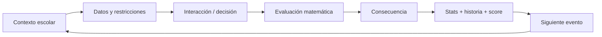

## 5. Meta loop

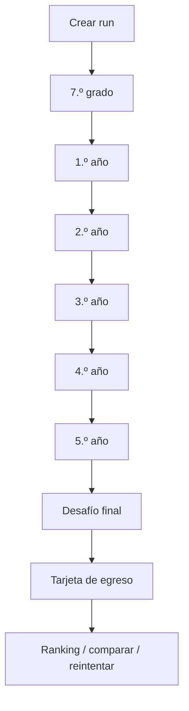

## 6. Duración objetivo

- Onboarding: <30 s.
- Evento normal: 15–35 s.
- Minijuego especial: 20–60 s.
- Run completa: 4–7 min.

## 7. Estructura sugerida por run

- 7.º: 2 eventos.
- 1.º: 2–3 eventos.
- 2.º: 2–3 eventos.
- 3.º: 2–3 eventos.
- 4.º: 2–3 eventos.
- 5.º: 2–3 eventos.
- Final: 1 evento combinado.

El número exacto puede variar por modo.

## 8. Estadísticas de carrera

Cuatro dimensiones visibles. Nada más es permanente: energía, plata y similares pueden existir como **recursos locales** dentro de un minijuego, nunca como estadística de carrera. Ver [ADR-016](03-architecture/adr/ADR-016-career-player-model.md).

### Visibles

| | Tipo | Rango | Cambia cuando |
|---|---|---|---|
| **Promedio** | nota | 1,0–10,0 · un decimal | el evento es **genuinamente académico** |
| **Equipo** | colaboración | 0–100 | está en juego la conducta hacia el grupo |
| **Aura** | reputación | con signo, sin techo | el momento es **socialmente memorable** |
| **Estilo** | ternario | Aplicado / Estratega / Improvisador, suman 100 | casi toda decisión lo empuja un poco |

Tres reglas que definen el modelo tanto como los nombres:

- **`null` no es 0.** Una dimensión que la run no tocó todavía no tiene valor, y no se dibuja. Aparecen de a una, la primera vez que algo las mueve.
- **Promedio se deriva de notas reales**, no se acumula como un contador. Una decisión de colectivo ejercita matemática pero no es académica: no lo mueve.
- **Ningún eje de Estilo es el malo.** Un Improvisador tiene que poder egresar.

### Derivadas/ocultas
- Eficiencia.
- Riesgo asumido.
- Precisión.
- Uso de información.
- Dominio por categoría matemática.
- Flags e historia narrativa.

Las visibles generan narrativa; las ocultas alimentan scoring, dificultad adaptativa, perfiles y analítica. **Ninguna oculta se renderiza**, y que exista en el estado no es motivo para mostrarla.

## 9. Filosofía de error

No hay game over por una respuesta incorrecta. El error produce una consecuencia y la run continúa.

### Feedback malo
“Incorrecto. La respuesta era B.”

### Feedback objetivo
“Compraste 1 L. La pared necesita 14,4 m² de cobertura y 1 L cubre 8 m². Faltaron 6,4 m²; el equipo tuvo que volver a comprar.”

## 10. Niveles de resolución

Una decisión puede ser:

- **Inválida:** no cumple una restricción esencial.
- **Funcional:** resuelve el problema.
- **Eficiente:** resuelve con buen uso de recursos.
- **Óptima:** mejor solución según la función de evaluación declarada.

No todos los desafíos necesitan las cuatro categorías.

## 11. Tono

**Realista exagerado + épico-paródico.**

La situación es reconocible, pero se presenta con dramatización gamer:

- “SEMANA DE EXÁMENES — Evento legendario”.
- “La impresora eligió la violencia”.
- “FINAL_FINAL_AHORA_SI_3.pptx”.

El humor nunca debe ridiculizar a un estudiante por fallar.

## 12. Rejugabilidad

- Seeds diferentes.
- Variación numérica de problemas.
- Eventos condicionales.
- Perfiles de egreso.
- Logros.
- Ranking por evento.
- Seed diaria/feria compartida.

## 13. Modos previstos

### Carrera estándar
Seed individual; máxima variedad.

### Desafío de la feria
Mismo ruleset y pool controlado para todos. Puede usar seed común o set precomputado.

### Daily challenge — futuro
Condiciones compartidas por día.

### Práctica — futuro
Sin ranking; selecciona categoría matemática.

## 14. Herramientas permitidas

Según desafío:
- calculadora;
- anotador;
- tabla;
- regla/escala;
- “pedir más datos”.

Usar una herramienta no debe penalizar automáticamente. La competencia deseada es resolución de problemas, no cálculo mental puro.

## 15. Jefes/eventos especiales

Un año puede culminar con un desafío combinado: viaje, feria, proyecto grupal, torneo o examen especial. Estos eventos reutilizan las mecánicas ya aprendidas y aumentan tensión sin introducir reglas completamente nuevas.

## 16. Final de run

La tarjeta final contiene:
- nickname;
- promoción/año del evento;
- score;
- perfil de egreso;
- stats principales;
- mayor logro;
- decisión más arriesgada o memorable;
- posición en ranking si aplica;
- CTA “Jugar otra vez”.

## 17. Perfiles iniciales

- El Estratega.
- El Improvisador.
- El Científico.
- El Líder.
- El Emprendedor.
- El Competidor.
- El Equilibrado.
- El Superviviente.

La asignación debe ser determinista a partir de métricas, con desempate documentado.

## 18. Anti-patrones

No introducir:
- trivia matemática desconectada de la ficción;
- largos bloques de texto;
- tutorial obligatorio de varios minutos;
- castigo que cierre la run por un error;
- score basado sólo en velocidad;
- estética infantilizada;
- decisiones falsas donde un número visible no afecta nada;
- historias que equiparen desempeño matemático con valor personal.

---

# FILE: 01-game-design/graduation-and-fail-forward.md

# Egreso, recuperación y fail-forward

**Estado: PRODUCT DIRECTION.** La dirección —el error cambia el camino, no termina la partida— está decidida. La forma concreta de la recuperación, el lenguaje de las previas y qué años la ofrecen son **OPEN**, y el tono de esa recuperación es **TEACHER GATE**.

## Invariante buscado

> Toda run completada válida llega a `EGRESADO`.

El jugador compite por calidad y construye un recorrido distinguible, pero no queda afuera del resto del juego por haberse equivocado.

Esto no es indulgencia: es la consecuencia de que el producto trate el error como información. Una feria en la que el juego te expulsa a los noventa segundos no es una feria en la que alguien juegue dos veces.

## Progresión separada de desempeño

El desempeño cambia:

- Promedio;
- score;
- qué contenido de recuperación aparece;
- flags e historia;
- arquetipo final;
- Aura, Equipo y Estilo donde tenga sentido contextual.

El desempeño **no** produce por sí solo un estado terminal de “no podés seguir”.

## Qué dice hoy la documentación vigente

[Reglas, scoring y progresión](01-game-design/rules-scoring-and-progression.md) declara que en el MVP no hay repetición automática de año por bajo desempeño: la fantasía es una carrera comprimida, no un simulador administrativo de promoción escolar. **Eso sigue vigente y no se contradice.**

Lo que agrega esta dirección es el otro lado: no repetir el año tampoco significa que el bajo desempeño no tenga consecuencia. La consecuencia es narrativa y de score, comprimida en eventos, no en volver a jugar doce meses.

## Patrón de cierre de año

Estados comprimidos sugeridos, **no implementados**:

- promoción directa;
- cierre normal;
- recuperación requerida;
- promoción «con lo justo» con materia pendiente que vuelve después.

Una recuperación también puede salir mal. El sistema converge igual, con otra consecuencia comprimida, en vez de encerrar al jugador en un bucle.

## Previas

Una estructura oculta de materias pendientes permite callbacks:

```text
1.º: te quedó una previa → 2.º/3.º: esa previa sigue ahí → 5.º: arco final de recuperación
```

Es estado narrativo oculto, no una quinta stat en el HUD. El modelo visible sigue siendo el de [ADR-016](03-architecture/adr/ADR-016-career-player-model.md): Promedio, Equipo, Aura y Estilo, y nada más es permanente.

## Sin sistema de vidas

Ni corazones, ni intentos limitados, ni tres strikes. El error genera consecuencia y contenido adicional, no menos minutos de juego.

## Requisito de verificación

Cuando esta dirección se implemente, la simulación y los property tests tienen que establecer que:

- toda run completable llega a `EGRESADO`;
- ningún estado de fracaso académico es terminal;
- la recuperación no puede crear un callejón sin salida;
- el estado sigue siendo serializable y reproducible por replay.

La simulación masiva vigente (`pnpm game:simulate`) ya busca callejones sin salida y divergencia de replay; el invariante de egreso se suma a esa capa cuando exista contenido de recuperación. Ver [estrategia de testing](04-quality/testing-strategy.md).

## Estado de implementación

El slice de 7.º termina en un hito de año, no en el egreso. La carrera completa `7.º → 1.º → 2.º → 3.º → 4.º → 5.º → Egreso`, el arco de recuperación y el arquetipo final son **contenido futuro**; ver [la secuencia de implementación](06-delivery/implementation-sequence.md).

---

# FILE: 01-game-design/math-design-framework.md

# Marco de diseño matemático

## Propósito

Definir cómo Egresado usa matemática de forma auténtica, escalable y apropiada para estudiantes de 12–17 años.

## Principio central

La matemática debe ser necesaria para comprender o mejorar una acción en el juego. Se evita el patrón “juego → pausa → ejercicio → juego”.

## Ciclo cognitivo objetivo

1. **Interpretar** una situación.
2. **Identificar** datos relevantes y faltantes.
3. **Formular** una representación matemática.
4. **Operar/razonar** con ella.
5. **Decidir**.
6. **Interpretar** la consecuencia.

## Dominios

Alineación conceptual con categorías amplias de alfabetización matemática:

### Cantidad
Dinero, unidades, escalas, conteos, divisiones.

### Cambio y relaciones
Tasas, crecimiento, secuencias, funciones.

### Espacio y forma
Área, perímetro, escala, disposición espacial.

### Incertidumbre y datos
Probabilidad, muestras, gráficos, porcentajes, evidencia.

## Progresión orientativa

| Etapa | Foco dominante | Ejemplos |
|---|---|---|
| 7.º | operaciones, tiempo, dinero, área simple | compras, horarios, mural |
| 1.º | porcentajes, proporciones, escalas | descuentos, repartos |
| 2.º | tasas y restricciones | consumo, velocidad, presupuesto |
| 3.º | problemas multietapa, optimización | recaudación, asignación |
| 4.º | estadística, probabilidad, funciones | encuestas, tendencias |
| 5.º | integración e incertidumbre | proyecto final, trade-offs |

La progresión real debe adaptarse al currículo de la institución si se usa pedagógicamente de forma formal.

## Niveles de variante de un mismo escenario

### Básico
Números enteros, una restricción, una operación principal.

### Intermedio
Decimales/porcentajes, dos pasos, varias opciones válidas.

### Avanzado
Datos irrelevantes, restricciones múltiples, optimización, incertidumbre.

Ejemplo Mural:
- básico: 6×2, cobertura 6 m²/L;
- intermedio: 6×2,4, cobertura 8;
- avanzado: descontar puerta, dos manos, comparar packs/precio.

## Herramientas

Permitir calculadora cuando el objetivo sea modelar/decidir. Un modo competitivo puede limitar herramientas sólo si esa limitación forma parte explícita de la competencia evaluada.

## Feedback

El feedback debe incluir los números que explican la consecuencia.

### Correcto/óptimo
Mostrar por qué alcanza y por qué es eficiente.

### Incorrecto
Mostrar la restricción violada, no sólo la respuesta esperada.

### Solución alternativa
Reconocerla si cumple las reglas, incluso si no era la respuesta prevista originalmente.

## Ambigüedad

No publicar un desafío si:
- existen interpretaciones razonables no contempladas;
- faltan unidades;
- redondeo cambia la respuesta sin regla declarada;
- varias respuestas son equivalentes y el sistema marca sólo una;
- la narrativa contradice el modelo matemático.

## Redondeo

Cada desafío declara:
- precisión interna;
- regla de redondeo de display;
- tolerancia de input;
- unidad esperada.

No comparar floats de forma exacta.

## Validación pedagógica

Antes de marcar contenido como `production_ready`:
- revisión matemática;
- revisión de lenguaje;
- prueba con al menos un usuario del rango objetivo **cuando sea posible**, sabiendo que antes de la feria probablemente no lo sea: la validación formal previa es la del Departamento de Matemática, ver [gates docentes](06-delivery/teacher-gates.md);
- test procedural de invariantes.

## Piso bajo, techo alto

La dificultad no sube por números más grandes ni por decimales más feos: sube por cantidad de relaciones, restricciones simultáneas, información irrelevante que hay que filtrar, planificación multipaso, optimización y incertidumbre. Un desafío rico puede usar aritmética elemental.

Esto no es sólo pedagogía: es un requisito de producto. En la feria juegan chicos de 7.º y adultos, y una sola «dificultad media de currículo» deja afuera a los dos extremos. El desarrollo completo —bandas `CORE / STANDARD / STRETCH`, presupuesto de dificultad y su correspondencia con `DifficultyLevel` 1–5— está en [dificultad y jugabilidad universal](01-game-design/difficulty-and-playability.md).

### Los tres niveles de variante, en las tres escalas

| Este documento | Banda de autoría | Nivel del motor |
|---|---|---|
| básico | CORE | 1–2 |
| intermedio | STANDARD | 3 |
| avanzado | STRETCH | 4–5 |

Es una lectura documental para poder leer juntos los tres vocabularios. No implica ninguna migración de código.

## Apoyos y barreras de acceso

Si el objetivo de una tarea es modelar y decidir, la fórmula visible o la calculadora no bajan el techo: sacan una barrera que no era el objetivo. Es la distinción de UDL entre barrera de acceso y objetivo real de la tarea; ver [base teórica](07-reference/research-basis.md).

Qué desafíos ofrecen qué apoyo, y si eso cambia en modo competitivo, es una decisión docente pendiente ([preguntas 7 y 45](07-reference/open-questions.md)).

---

# FILE: 01-game-design/narrative-system.md

# Sistema narrativo

## Objetivo

Crear la sensación de una carrera escolar coherente sin construir un árbol exponencial de ramas.

## Modelo: storylets condicionados

Cada evento narrativo declara:
- condiciones de elegibilidad;
- peso base;
- cooldown;
- etapa escolar;
- tags temáticos;
- flags requeridos/prohibidos;
- efectos;
- posibles follow-ups.

El motor filtra storylets incompatibles y selecciona entre los restantes mediante pesos deterministas derivados del seed.

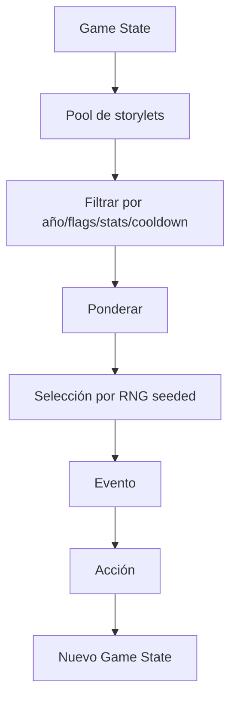

## Estado narrativo mínimo

- `school_year`.
- stats visibles.
- tags de afinidad.
- flags de decisiones importantes.
- historial corto de eventos para evitar repetición.
- logros.

## Tipos de storylet

### One-shot
Evento autocontenido.

### Callback
Recupera una decisión previa: un compañero vuelve a aparecer, una actividad abre otra oportunidad, etc.

### Mini-arco
2–4 eventos relacionados distribuidos en años.

### Evento sistémico
Se activa por thresholds sobre una dimensión de carrera: Equipo muy bajo, Promedio bajo, Aura alta. Una dimensión todavía sin establecer **no satisface un umbral en ninguna dirección** — «sin evidencia» no es «poco».

### Evento final
Resume o consume flags acumulados.

## Reglas de coherencia

- Un callback debe tener causa rastreable.
- No presentar como consecuencia algo que el sistema no puede justificar.
- Evitar que eventos aleatorios contradigan flags duros.
- Permitir cierta ambigüedad narrativa, pero no inconsistencia lógica.

## Línea de carrera sugerida

### 7.º grado — Adaptación
Temas: dinero simple, horarios, primeras responsabilidades, colaboración.

### 1.º — Organización
Temas: múltiples materias, estudio, porcentajes, tiempos.

### 2.º — Vida escolar ampliada
Temas: actividades, proyectos, presupuestos, proporciones.

### 3.º — Decisiones colectivas
Temas: viaje, recaudación, asignación, optimización.

### 4.º — Datos e incertidumbre
Temas: encuestas, campañas, funciones, riesgo.

### 5.º — Integración
Temas: proyecto final, feria, orientación, decisiones multivariable.

## Humor

El humor nace de reconocer situaciones escolares:
- nombres de archivos absurdos;
- impresora que falla;
- compañero que desaparece;
- colectivo demorado;
- presentación preparada a último momento.

No usar:
- bullying como punchline;
- humillación por notas;
- estereotipos discriminatorios;
- docentes reales identificables.

## Regla narrativa-matemática

Cada storylet matemático debe responder:

1. ¿Qué quiere lograr el personaje?
2. ¿Qué información cuantitativa necesita?
3. ¿Qué restricción hace que la elección importe?
4. ¿Cómo se ve la consecuencia?
5. ¿Qué cambia en la carrera?

## Condiciones declarativas, no código en el contenido

Las condiciones de un storylet se expresan como datos versionados, no como JavaScript ejecutable dentro del contenido. Eso es lo que permite validarlas, reproducirlas en el servidor durante un replay y autorarlas sin riesgo.

## Callbacks de fail-forward

Un mal resultado debería **crear** contenido, no quitarlo: recuperación, storylets incómodos y oportunidades alternativas hacen que equivocarse sea interesante. Cuando exista contenido de recuperación, las materias pendientes son estado narrativo oculto que habilita callbacks a lo largo de los años, no una quinta stat en el HUD. Ver [egreso, recuperación y fail-forward](01-game-design/graduation-and-fail-forward.md).

Los branches especiales tienen que ser escasos: si se disparan todo el tiempo, dejan de tener peso narrativo.

---

# FILE: 01-game-design/rules-scoring-and-progression.md

# Reglas, scoring y progresión

## Reglas globales

1. Una run se identifica por `run_id`, `seed`, `game_version`, `ruleset_version` y `content_version`.
2. Una run oficial se inicia en servidor cuando el modo requiere ranking.
3. El cliente puede previsualizar score, pero el servidor calcula el resultado oficial.
4. Cada desafío debe declarar su función de evaluación.
5. Toda variante procedural debe ser validable de forma determinista.
6. La run continúa después de errores salvo fallo técnico irrecuperable.

## Progresión temporal

Etapas canónicas:

1. 7.º grado.
2. 1.º año.
3. 2.º año.
4. 3.º año.
5. 4.º año.
6. 5.º año.
7. Egreso.

Cada etapa puede modificar:
- dificultad objetivo;
- categorías matemáticas habilitadas;
- storylets disponibles;
- peso de eventos sociales/proyectos;
- recompensas.

## Modelo de score

El score debe premiar calidad de decisión más que rapidez.

### Componentes sugeridos

`score_evento = base × calidad × dificultad + bonus_contextuales - penalizaciones`

Donde:
- `base`: valor estándar del evento.
- `calidad`: factor por inválida/funcional/eficiente/óptima.
- `dificultad`: factor del nivel del problema.
- `bonus_contextuales`: uso eficiente, predicción correcta, solución alternativa válida, etc.
- `penalizaciones`: sólo por decisiones lúdicas declaradas; nunca por usar una herramienta permitida salvo modo especial explícito.

### Factores iniciales de referencia

- inválida: 0.20–0.40.
- funcional: 0.70.
- eficiente: 0.90.
- óptima: 1.00.

Estos valores son de **desarrollo** y no oficiales: el motor los expone bajo una política nombrada marcada `production: false`, y el cargador de ruleset se niega a construir un ruleset oficial desde ahí. Su calibración final es una decisión del Departamento de Matemática ([pregunta 24](07-reference/open-questions.md) y [pregunta 39](07-reference/open-questions.md)), no el resultado de un playtest previo que no está garantizado. Ver [ciclo de entrega real](00-product/real-delivery-lifecycle.md).

## Velocidad

La velocidad puede aportar un bonus pequeño con techo. No debe dominar el resultado porque:
- favorece cálculo mental sobre razonamiento;
- aumenta ansiedad;
- perjudica accesibilidad;
- incentiva adivinar.

## Rachas

Una racha puede celebrarse visualmente, pero su multiplicador debe ser controlado para no hacer imposible recuperar una run.

Ejemplo:
- 2 óptimas consecutivas: +3%.
- 3: +5%.
- 4+: cap +8%.

## Estadísticas narrativas

Las decisiones modifican stats mediante deltas pequeños y acotados. Las stats no deben sustituir el score matemático; su función principal es desbloquear/ponderar narrativa.

## Riesgo

Algunos eventos permiten decisiones con incertidumbre. El sistema debe distinguir:
- **calidad ex ante:** qué tan razonable era la decisión con la información disponible;
- **resultado ex post:** qué ocurrió por azar.

El score matemático debe basarse principalmente en calidad ex ante. El jugador no debería perder ranking porque un RNG justo produjo un resultado adverso después de una buena decisión.

## Perfil final

El perfil se calcula sobre features normalizadas:
- eficiencia;
- precisión;
- riesgo;
- colaboración (derivada de Equipo; el punto neutro cuando no hay evidencia, no cero);
- iniciativa (derivada de Estilo, no de una estadística visible);
- uso de datos adicionales;
- estabilidad entre años.

Ejemplo conceptual:

```text
Estratéga = eficiencia alta + precisión alta + riesgo moderado
Improvisador = velocidad alta + riesgo alto + uso bajo de herramientas
Líder = equipo alto + decisiones de asignación eficientes
Científico = precisión alta + preferencia por evidencia + estadística alta
```

No usar diagnósticos psicológicos ni lenguaje clínico.

## Condición de finalización

La run termina al completar el evento final o al abandonar explícitamente.

No hay repetición automática de año por bajo desempeño en el MVP. La fantasía es una carrera comprimida, no un simulador administrativo de promoción escolar.

Eso no significa que el bajo desempeño no tenga consecuencia. La dirección de producto es **fail-forward**: el error cambia el camino, el contenido de recuperación y el perfil final, sin producir un estado terminal ni obligar a volver a jugar un año entero. Esa dirección todavía no tiene contenido implementado; ver [egreso, recuperación y fail-forward](01-game-design/graduation-and-fail-forward.md).

## Este score no es el score de la competencia

Lo anterior describe el **score por evento y por run**: es lo que el motor calcula hoy y lo que ve el jugador. Es una capa distinta del score competitivo de feria, que todavía no existe.

| Capa | Qué responde | Estado |
|---|---|---|
| Resultado de desafío | ¿qué tan bien se resolvió esta situación? | implementado |
| Score de run | ¿cuántos puntos hizo esta partida? | implementado, política de desarrollo |
| Identidad de carrera | ¿qué recorrido escolar construí? | implementado |
| `FairScore` competitivo | ¿qué tan fuerte fue esta run oficial bajo las reglas del evento? | **no implementado**, y sus coeficientes están abiertos |

La dirección propuesta para esa cuarta capa —matemática dominante, contribución acotada de Equipo y Aura, Estilo sin puntaje directo, mejor intento y desempate lexicográfico— está en [score competitivo y ranking](01-game-design/competitive-scoring-and-ranking.md). **Es una recomendación sujeta a Teacher Gate, no una regla cerrada**, y quien la implemente tiene que escribirla como política versionada y no como constantes en el código.

---

# FILE: 01-game-design/ux-interaction-design.md

# UX e interacción

## Estrategia

Mobile-first, portrait-first, DOM-first. Desktop presenta el mismo flujo dentro de una columna central ampliada.

## Viewport de referencia

Diseñar inicialmente para ~390×844 CSS px y verificar mínimo 360 px de ancho.

## Layout base

```text
┌────────────────────────┐
│ 7.º GRADO      ▪▪□□□□□ │  etapa + progreso en celdas
├────────────────────────┤
│ Promedio │ Equipo │ ◣  │  tira de carrera (aparición progresiva)
├────────────────────────┤
│ EYEBROW                │
│ Título de la situación │
│ Prosa                  │
│ ┌────────┐ ┌────────┐  │  grilla de datos sobre papel
│ │ dato   │ │ dato   │  │
│ └────────┘ └────────┘  │
│▓▓▓▓▓▓▓▓▓▓▓▓▓▓▓▓▓▓▓▓▓▓▓▓│  bloque de decisión (oscuro, a sangre)
│▓ consigna             ▓│
│▓ opciones             ▓│
│▓ [ CONFIRMAR ]        ▓│  el primario vive acá mientras se decide
└────────────────────────┘
```

Al resolver, el bloque oscuro suelta el primario, aparece el panel de resultado sobre papel y el primario reaparece al final del shell. **Existe exactamente un primario montado a la vez.**

El ancho de juego es de 412 px máximo, centrado en todos los breakpoints: tablet y desktop centran contra la hoja, no ensanchan. Ver el [sistema de diseño](09-design-system/foundations.md).

## Navegación

- No depender de browser back como parte del juego.
- Confirmar abandono de run activa.
- Persistir checkpoint local después de cada desafío.

## Patrones

### Decision cards
Cards grandes, táctiles, sin hover obligatorio.

### Drag & drop
Debe existir alternativa accesible por tap/select. Drag no puede ser la única forma.

### Sliders
Mostrar valor numérico y permitir ajuste fino por botones/teclado.

### Gráficos
Etiquetas visibles; no depender sólo del color.

### Feedback
Secuencia recomendada:
1. bloquear input;
2. animación corta;
3. mostrar consecuencia numérica;
4. actualizar stats;
5. CTA continuar.

## Motion

- Duración habitual 150–350 ms.
- Respetar `prefers-reduced-motion`.
- Evitar animaciones largas que reduzcan throughput de feria.

## Audio

Opcional, nunca requerido para comprender. Estado mute persistente.

## Accesibilidad

- Contraste mínimo WCAG AA como objetivo.
- Targets táctiles ≥44×44 CSS px cuando sea posible.
- Navegación por teclado para interacciones principales.
- Focus visible.
- Texto no incrustado en imágenes.
- Feedback no dependiente exclusivamente de color.

## Herramientas

Calculadora/anotador se abren como paneles no destructivos; cerrar no pierde estado.

## Loading

Gameplay no muestra loaders entre eventos si éstos ya están generados localmente. El servidor participa fuera del loop crítico.

## Errores de red

El jugador no pierde una run porque falle el leaderboard. Se muestra estado “resultado pendiente de sincronización” y se reintenta cuando corresponda.

---

# FILE: 02-functional/functional-specification.md

# Especificación funcional

## FR-001 Inicio
El sistema debe permitir iniciar una experiencia sin crear una cuenta tradicional.

### Comportamiento
- Mostrar nombre del juego y CTA principal.
- Permitir nickname opcional/obligatorio según modo.
- Validar longitud y caracteres.
- Crear identidad anónima local.

## FR-002 Creación de run
En modos online oficiales, el cliente debe solicitar al servidor una run antes de jugar.

El servidor devuelve como mínimo:
- `run_id`;
- `seed`;
- `mode`;
- versiones de reglas/contenido;
- timestamp de inicio;
- configuración de evento.

## FR-003 Generación de carrera
A partir de seed y configuración, el motor debe producir una secuencia reproducible de años, desafíos y storylets.

## FR-004 Presentación de etapa
El jugador debe conocer siempre la etapa escolar actual.

## FR-005 Resolución de desafíos
El sistema debe soportar múltiples interaction types definidos en `challenge-system.md`.

## FR-006 Evaluación
Cada acción debe generar un `ChallengeResult` determinista con:
- calidad;
- score parcial;
- explicación;
- cambios de stats;
- flags;
- datos de telemetría no sensibles.

## FR-007 Feedback
Después de confirmar, el juego debe explicar la consecuencia antes de avanzar.

## FR-008 Herramientas
Los desafíos pueden habilitar herramientas. El schema declara cuáles están disponibles.

## FR-009 Persistencia local
La run activa debe guardar checkpoint tras cada evento completado.

## FR-010 Reanudación
Si existe checkpoint compatible con la versión actual, ofrecer reanudar.

## FR-011 Finalización
Al completar la carrera, generar tarjeta de egreso con score, perfil y resumen.

## FR-012 Ranking
En un evento competitivo, el sistema debe consultar y mostrar leaderboard según reglas del evento.

## FR-013 Reintento
El jugador puede iniciar otra run. El evento define si conserva o cambia seed.

## FR-014 Modo feria
Un evento debe poder definir:
- período de vigencia;
- seed o estrategia de seeds;
- ruleset;
- dificultad;
- límites de intentos si existieran;
- ranking;
- moderación.

## FR-015 Moderación
Operadores autorizados deben poder ocultar una entrada de ranking sin borrar necesariamente la run auditada.

## FR-016 Degradación de red
Una interrupción después del inicio no debe impedir continuar el gameplay local. El resultado puede quedar pendiente de validación/sincronización.

## FR-017 Versionado
Toda run oficial guarda `game_version`, `ruleset_version` y `content_version`.

## FR-018 Replay técnico
El backend debe poder reconstruir una run oficial a partir de seed, versiones y acciones para validar score.

## FR-019 Analytics
Registrar eventos mínimos definidos en `analytics-observability.md` sin requerir PII.

## FR-020 Pantalla pública
Debe existir una vista de leaderboard apta para proyector/TV en el modo feria.

## Requisitos administrativos post-MVP

### FR-A01 Gestión de eventos
Crear, activar, cerrar y archivar eventos.

### FR-A02 Contenido
Gestionar estados de contenido o importar paquetes versionados.

### FR-A03 Moderación
Ocultar/restaurar nicknames y scores.

### FR-A04 Exportación
Exportar estadísticas agregadas del evento.

## Requisitos objetivo del modo competitivo

**No implementados.** Estos requisitos aparecen cuando exista la feria con ranking y premios. Se numeran aparte para que nadie los confunda con comportamiento actual; su arquitectura está en [arquitectura objetivo del motor](03-architecture/target-engine-architecture.md).

### FR-T01 Descriptor de run oficial
Antes de que una run pueda ser candidata a premio, el servidor emite un descriptor inmutable con la tupla de versiones —incluidas `scoreVersion` y `variantCatalogVersion`—, el seed y la asignación de variantes. El cliente no puede pedir un seed arbitrario ni una dificultad más fácil.

### FR-T02 Vista pública sin solución
El motor expone de una variante sólo lo que el renderer necesita. Ni la respuesta ni el evaluador se filtran por la forma del contenido público.

### FR-T03 Envío sin score
El cliente envía identidad de run y action log canónico, con clave de idempotencia. Un campo `score` provisto por el cliente se ignora o se rechaza.

### FR-T04 Verificación por replay
El servidor recarga las versiones exactas, reconstruye las variantes, reproduce los comandos, rechaza logs imposibles y escribe un resultado oficial inmutable.

### FR-T05 Personal best
El verificador actualiza el mejor resultado del participante según el comparador versionado. Una run peor queda en el historial auditable pero no reemplaza al mejor público.

### FR-T06 Continuar después del fracaso
Un resultado académico insuficiente no crea un estado terminal global. Cuando el contenido lo habilite, la progresión agenda un evento de recuperación comprimido.

### FR-T07 Cierre de carrera completa
El producto completo termina en `EGRESADO`, deriva el arquetipo final y produce el resumen de run. El slice de 7.º termina en el hito de año.

Estos requisitos **no cierran** las decisiones que dependen del Departamento de Matemática: los coeficientes de score, la política de intentos y la política de empate siguen en [preguntas abiertas](07-reference/open-questions.md).

---

# FILE: 02-functional/traceability-matrix.md

# Matriz de trazabilidad

| Objetivo | Feature | Requisitos | Historias | ADR relacionado |
|---|---|---|---|---|
| Entrada rápida | identidad anónima | FR-001 | US-001 | ADR-008 |
| Run reproducible | seed/versiones | FR-002, FR-003, FR-017, FR-018 | US-022, US-051 | ADR-003 |
| Matemática como gameplay | challenges parametrizados | FR-005, FR-006, FR-007 | US-002, US-003 | ADR-007 |
| Resiliencia | local-first/checkpoints | FR-009, FR-010, FR-016 | US-030, US-031 | ADR-006 |
| Ranking justo | score servidor | FR-011, FR-012, FR-018 | US-020, US-022 | ADR-004, ADR-009 |
| Escalar contenido | content-as-data | FR-003, FR-005 | US-050 | ADR-007 |
| Web universal | responsive/PWA-ready | NFR | US-001 | ADR-001 |
| Operación de feria | eventos + pantalla | FR-014, FR-020 | US-040 | ADR-009 |
| Privacidad | minimización | FR-001 | US-001 | ADR-008 |
| Moderación | ocultar entradas | FR-015 | US-041 | ADR-009 |

## Regla de mantenimiento

Toda feature nueva debe:
1. referenciar un objetivo o justificar uno nuevo;
2. agregar/modificar requisito funcional;
3. tener historia o tarea técnica;
4. crear ADR si cambia una decisión arquitectónica significativa;
5. actualizar tests/NFR si aplica.

## Dirección del blueprint v0.2 hasta el código

De requisito de producto a capacidad de motor y a estado real. Esta tabla cubre lo que **todavía no** está cubierto por los FR de arriba, y su columna de estado es una lectura del 29 de agosto de 2026: se verifica contra el código antes de planificar. El mapa completo está en [la integración del blueprint](07-reference/blueprint-v0.2-integration.md).

| Requisito de producto | Regla de game design | Capacidad de motor | Estado | Fase |
|---|---|---|---|---|
| Escenarios que no se memorizan | [familias y variantes](01-game-design/challenge-families-and-variants.md) | `ScenarioFamily`/`Template`/`Variant` + fuentes híbridas | primera variación cognitiva de producción **implementada** en `bus`; profundidad del resto del catálogo abierta | STAGE-04 / STAGE-08 |
| Competencia sin variantes defectuosas | [validación de variantes](04-quality/variant-validation-and-audit.md) | validador transversal + catálogo aprobado | **implementado para desarrollo y consumido por gameplay** en `grade-7-dev-3`; catálogo justo oficial pendiente | FREEZE |
| Runs comparables entre sí | [dificultad](01-game-design/difficulty-and-playability.md) | bandas + scheduler por presupuesto | **implementado estructuralmente** bajo una policy candidata; calibración docente y equivalencia empírica pendientes | STAGE-05 (`DONE`) / Teacher Gate |
| Ranking dominado por matemática | [score competitivo](01-game-design/competitive-scoring-and-ranking.md) | `ScorePolicy` competitiva versionada | score por evento de desarrollo | STAGE-06 |
| Premiar mejora y no volumen de intentos | [modo feria](05-operations/fair-mode-and-competition-freeze.md) | comparador versionado + personal best | no implementado | STAGE-09 |
| El error no expulsa al jugador | [fail-forward](01-game-design/graduation-and-fail-forward.md) | invariante de egreso + recuperación | sin contenido de recuperación | STAGE-07 |
| Identidad de carrera legible | [ADR-016](03-architecture/adr/ADR-016-career-player-model.md) | `CareerState` v0.2 | **implementado** | — |
| Auditoría de una run oficial | [ADR-003](03-architecture/adr/ADR-003-deterministic-seeded-engine.md) | seed + versiones + action log | base implementada y `variantCatalogVersion` opcional; falta `scoreVersion` y emisión oficial | STAGE-06 y STAGE-09 |

Las etapas son las del [roadmap de implementación](06-delivery/implementation-sequence.md); el estado vigente de cada una está en [la etapa actual](06-delivery/current-stage.md).

---

# FILE: 02-functional/user-flows.md

# Flujos de usuario

## UF-01 Primera run

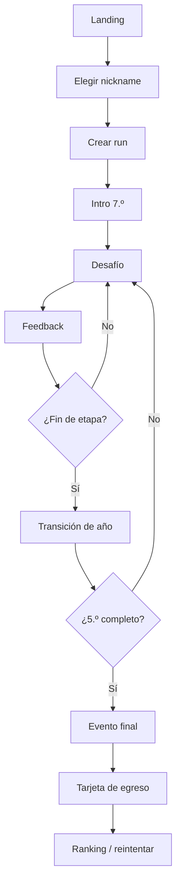

## UF-02 Resolución de desafío

1. Mostrar contexto y datos.
2. Jugador inspecciona herramientas si existen.
3. Jugador realiza interacción.
4. Validar forma del input localmente.
5. Confirmar.
6. Motor evalúa.
7. Mostrar consecuencia.
8. Actualizar stats/score provisional.
9. Registrar acción/checkpoint.
10. Continuar.

## UF-03 Refresh accidental

1. App carga.
2. Detecta checkpoint activo.
3. Verifica compatibilidad de versiones.
4. Ofrece “Continuar partida” o “Empezar de nuevo”.
5. Rehidrata estado y RNG.

## UF-04 Fin de run online

1. Cliente envía acciones al endpoint de finish.
2. Servidor valida run abierta.
3. Reproduce acciones.
4. Calcula score oficial/perfil.
5. Persiste resultado.
6. Devuelve tarjeta oficial y posición aproximada.
7. Cliente borra checkpoint activo.

## UF-05 Error al finalizar

1. Cliente conserva acciones localmente.
2. Marca run como `pending_sync`.
3. Muestra resultado local no oficial.
4. Reintenta con backoff mientras la sesión esté activa.
5. Al reconectar, servidor valida.
6. Actualiza ranking.

## UF-06 Ranking de feria

1. Usuario abre `/event/{slug}/leaderboard`.
2. Obtiene top N y estadísticas agregadas.
3. Polling periódico inicialmente.
4. Si se habilita Realtime, actualiza por broadcast.

## UF-07 Nickname rechazado

1. Usuario escribe nickname.
2. Validación local de formato.
3. Backend aplica política/moderación.
4. Si falla, devolver error neutral y permitir corregir.

## Flujo objetivo de feria oficial

**No implementado.** Es la forma que toma el flujo cuando existan evento, ranking y verificación en servidor.

```text
QR / URL
→ landing del evento
→ nickname / token de participante
→ pedir run oficial
→ el servidor emite el descriptor
→ juego local-first
→ egreso
→ resumen final
→ enviar action log
→ estado pendiente de verificación si hace falta
→ score verificado por el servidor
→ personal best y ranking
→ jugar de nuevo
```

Si no se pudo emitir una run autoritativa antes de empezar, la aplicación ofrece juego libre no oficial en vez de convertir en silencio una run no verificable en candidata a premio.

## Interrupción de red durante una run emitida

```text
se pierde la red
→ seguir jugando local si los datos de variante ya están disponibles
→ terminar
→ envío pendiente
→ reintento idempotente
→ verificado cuando vuelve la conectividad
```

Es el local-first de [ADR-006](03-architecture/adr/ADR-006-local-first-gameplay.md) con la autoridad de [ADR-004](03-architecture/adr/ADR-004-server-authoritative-scoring.md).

## Flujo de recuperación

```text
resultado académico insuficiente
→ consecuencia
→ flag o evento de recuperación
→ desafío o storylet de recuperación comprimido
→ etapa siguiente
```

Sin bucle que obligue a rejugar el mismo año. Ver [egreso, recuperación y fail-forward](01-game-design/graduation-and-fail-forward.md).

---

# FILE: 02-functional/user-stories.md

# Historias de usuario

## Epic E1 — Jugar una carrera

### US-001 Iniciar rápido
Como estudiante quiero comenzar sin registrarme para no perder tiempo antes de jugar.

**Aceptación**
- No requiere email ni password.
- El flujo principal llega al primer desafío en <3 pantallas.
- El nickname puede validarse antes de crear la run.

### US-002 Entender el contexto
Como jugador quiero entender qué intento resolver para poder decidir sin instrucciones externas.

**Aceptación**
- Cada desafío tiene objetivo explícito.
- Unidades visibles.
- CTA de confirmación inequívoco.

### US-003 Ver consecuencias
Como jugador quiero saber por qué mi elección funcionó o falló.

**Aceptación**
- El feedback incluye al menos una relación cuantitativa relevante.
- No se limita a “correcto/incorrecto”.

### US-004 Continuar tras error
Como jugador quiero seguir mi carrera aunque me equivoque.

**Aceptación**
- Un error matemático normal no finaliza run.
- La consecuencia afecta score/stats según reglas.

### US-005 Usar herramientas
Como jugador quiero usar calculadora cuando está habilitada para concentrarme en resolver el problema.

**Aceptación**
- Abrir/cerrar herramienta no borra respuesta.
- Uso no penalizado salvo regla visible del modo.

## Epic E2 — Progresión narrativa

### US-010 Avanzar por años
Como jugador quiero percibir que mi personaje crece desde 7.º hasta 5.º.

**Aceptación**
- Transición visual de etapa.
- Eventos son compatibles con la etapa.

### US-011 Consecuencias persistentes
Como jugador quiero que algunas decisiones anteriores reaparezcan para sentir que mi historia importa.

**Aceptación**
- Al menos un conjunto de storylets usa flags previos.
- Callback no contradice historia.

### US-012 Perfil final
Como jugador quiero recibir un título final que resuma mi estilo.

**Aceptación**
- Perfil derivado de datos de run.
- Mismo input produce mismo perfil.

## Epic E3 — Competencia

### US-020 Ranking
Como estudiante competitivo quiero comparar mi resultado con otros participantes.

**Aceptación**
- Sólo scores oficiales aparecen.
- Ranking identifica por nickname no PII.

### US-021 Rejugar
Como jugador quiero volver a jugar para mejorar o descubrir otro perfil.

**Aceptación**
- CTA visible en final.
- Nueva run tiene nuevo id.

### US-022 Condiciones justas
Como organizador quiero que el evento competitivo use reglas comparables.

**Aceptación**
- Evento fija ruleset/content version.
- Seed strategy documentada.

## Epic E4 — Resiliencia

### US-030 No perder partida
Como jugador quiero que un refresh accidental no destruya mi progreso.

**Aceptación**
- Checkpoint tras cada evento.
- Reanudación disponible si versión compatible.

### US-031 Jugar con red inestable
Como participante de feria quiero continuar aunque el Wi-Fi falle momentáneamente.

**Aceptación**
- Desafíos de la run activa no requieren request por turno.
- Resultado puede quedar pendiente de sync.

## Epic E5 — Operación

### US-040 Pantalla de feria
Como organizador quiero proyectar el ranking para generar participación.

**Aceptación**
- Vista legible a distancia.
- Auto-refresh.
- No muestra datos personales adicionales.

### US-041 Moderar
Como organizador quiero ocultar un nickname inapropiado rápidamente.

**Aceptación**
- Ocultar no requiere borrar evidencia de run.
- Cambio se refleja en leaderboard.

## Epic E6 — Desarrollo de contenido

### US-050 Agregar escenario sin nueva pantalla
Como autor quiero definir un nuevo problema usando un interaction type existente.

**Aceptación**
- Se registra como datos.
- Valida contra schema.
- Tests de invariantes pasan.

### US-051 Reproducir bug
Como desarrollador quiero reconstruir una run por seed para depurar problemas.

**Aceptación**
- Seed + versiones + actions son suficientes para replay.

## Historias de la dirección competitiva

**No implementadas.** Corresponden al modo feria con ranking; ver [score competitivo](01-game-design/competitive-scoring-and-ranking.md) y [modo feria](05-operations/fair-mode-and-competition-freeze.md).

### Jugador

- Como jugador, al volver a jugar recibo situaciones y valores distintos, en vez de poder memorizar una respuesta.
- Como jugador, puedo mejorar mi mejor marca sin que la cantidad de intentos sea el puntaje.
- Como jugador, veo sólo las dimensiones de carrera que ya adquirieron significado.
- Como jugador, entiendo por qué un resultado fue óptimo, eficiente, funcional o inválido.

### Docente

- Como docente, identifico el concepto matemático y el razonamiento buscado de cada plantilla.
- Como docente, inspecciono variantes representativas y de borde con su justificación.
- Como docente, entiendo y decido la filosofía de score antes de la feria.

### Organizador

- Como organizador, veo el ranking oficial y modero nicknames inapropiados sin borrar la evidencia auditada.
- Como organizador, identifico qué run y qué versiones produjeron un score.
- Como organizador, me recupero de fallas transitorias de envío sin otorgar entradas duplicadas.

### Autor de contenido y desarrollo

- Como autor, defino una plantilla una vez y genero muchas variantes válidas y deterministas.
- Como desarrollador, reproduzco un bug reportado a partir de id de run, seed y versiones.
- Como ingeniero, agrego contenido de 1.º sin inventar botones, cards, colores ni una arquitectura de scoring nueva.

---

# FILE: 03-architecture/adr/ADR-001-web-first-nextjs.md

# ADR-001 — Web-first con Next.js y TypeScript

- Estado: Aceptado
- Fecha: 2026-08-20

## Contexto
Egresado debe ejecutarse en teléfonos, tablets y desktop sin instalación y su interacción principal es UI declarativa: cards, formularios, drag/drop, gráficos y transiciones.

## Decisión
Usar Next.js + React + TypeScript como plataforma principal. Evitar motor de videojuegos dedicado para el núcleo.

## Consecuencias
### Positivas
- una sola codebase;
- acceso por URL/QR;
- buen soporte responsive/PWA;
- compartir tipos entre frontend/backend;
- despliegue simple.

### Negativas
- minijuegos canvas intensivos requerirán integración específica;
- disciplina necesaria para no acoplar engine con React.

## Alternativas rechazadas
- Unity WebGL: peso/UX excesivos para este tipo de juego.
- Godot Web: innecesario para UI dominante.
- Phaser como framework principal: canvas no aporta ventaja al loop base.

---

# FILE: 03-architecture/adr/ADR-002-modular-monolith-bff.md

# ADR-002 — Monolito modular + BFF

- Estado: Aceptado
- Fecha: 2026-08-20

## Contexto
El MVP necesita pocas operaciones server-side y un equipo pequeño. Separar frontend y FastAPI agregaría despliegues, contratos y duplicación temprana.

## Decisión
Usar Next.js Route Handlers como BFF y mantener frontend/backend en un repositorio y despliegue lógico.

## Consecuencias
- menor complejidad operativa;
- tipos y schemas compartidos;
- extracción futura posible por módulos;
- requiere mantener fronteras internas claras.

## Trigger para revisar
Carga computacional no apropiada, equipos separados, integración externa compleja o necesidad de lifecycle independiente.

---

# FILE: 03-architecture/adr/ADR-003-deterministic-seeded-engine.md

# ADR-003 — Motor determinista basado en seed

- Estado: Aceptado
- Fecha: 2026-08-20

## Contexto
Se necesitan runs reproducibles, generación procedural, ranking comparable y debugging.

## Decisión
Toda aleatoriedad del gameplay utiliza PRNG seeded controlado. Seed, versiones y acciones deben permitir replay.

## Consecuencias
- bugs reproducibles;
- fair/daily challenge;
- validación server-side;
- cambios de consumo de RNG pueden romper replay y deben versionarse.

---

# FILE: 03-architecture/adr/ADR-004-server-authoritative-scoring.md

# ADR-004 — Scoring oficial autoritativo en servidor

- Estado: Aceptado
- Fecha: 2026-08-20

## Contexto
El navegador puede ser manipulado. Aceptar `{score: 999999}` hace trivial falsificar rankings.

## Decisión
El cliente envía acciones; el servidor reproduce y calcula score/perfil oficial.

## Consecuencias
- integridad razonable del ranking;
- backend necesita versión compatible del engine;
- payload de finish es mayor;
- score local sólo es preview hasta validación.

---

# FILE: 03-architecture/adr/ADR-005-postgres-supabase.md

# ADR-005 — PostgreSQL gestionado por Supabase

- Estado: Aceptado
- Fecha: 2026-08-20

## Contexto
El producto necesita persistencia relacional para events, runs, acciones y ranking, con opción futura de realtime.

## Decisión
Usar PostgreSQL gestionado por Supabase. Mantener lógica crítica detrás del BFF y habilitar RLS en cualquier schema expuesto.

## Consecuencias
- SQL/Postgres estándar;
- realtime disponible si se requiere;
- dependencia operativa de proveedor gestionado;
- diseño mantiene portabilidad razonable por usar Postgres.

---

# FILE: 03-architecture/adr/ADR-006-local-first-gameplay.md

# ADR-006 — Gameplay local-first

- Estado: Aceptado
- Fecha: 2026-08-20

## Contexto
Una feria puede tener Wi-Fi saturado. Un request por desafío degradaría UX y disponibilidad.

## Decisión
Después de iniciar una run, los desafíos y transiciones se ejecutan localmente. Backend se usa principalmente al inicio, al finalizar y para ranking.

## Consecuencias
- baja latencia;
- tolerancia a cortes temporales;
- el cliente necesita checkpoint y queue de sync;
- contenido/reglas de la run deben estar disponibles localmente.

---

# FILE: 03-architecture/adr/ADR-007-content-as-data.md

# ADR-007 — Contenido como datos y patrones de interacción

- Estado: Aceptado
- Fecha: 2026-08-20

## Contexto
Decenas de escenarios no deben producir decenas de componentes ad hoc.

## Decisión
Modelar desafíos con schemas y reutilizar un conjunto limitado de interaction types. Un nuevo componente sólo se justifica cuando aparece una mecánica distinta.

## Consecuencias
- escala editorial;
- validación automatizada;
- separación contenido/UI;
- schemas deben ser cuidadosamente versionados.

---

# FILE: 03-architecture/adr/ADR-008-anonymous-identity.md

# ADR-008 — Identidad anónima/pseudónima en MVP

- Estado: Aceptado
- Fecha: 2026-08-20

## Contexto
El juego se dirige a menores y la feria requiere baja fricción. No existe necesidad funcional de cuentas personales.

## Decisión
Usar player UUID + nickname público moderado + sesión/cookie. No pedir email, password, apellido o fecha de nacimiento.

## Consecuencias
- minimización de datos;
- onboarding rápido;
- menor recuperación cross-device;
- si se agregan cuentas futuras se requiere ADR nuevo de identidad/privacidad.

---

# FILE: 03-architecture/adr/ADR-009-event-leaderboards.md

# ADR-009 — Leaderboards contextualizados por evento

- Estado: Aceptado
- Fecha: 2026-08-20

## Contexto
Comparar scores de rulesets, dificultad o contenido distintos puede ser injusto.

## Decisión
El ranking oficial se particiona por `game_event`/ruleset relevante. Una feria fija configuración comparable.

## Consecuencias
- ranking interpretable;
- permite temporadas/daily;
- requiere preservar versiones en runs;
- cambios de reglas crean nuevo contexto competitivo.

---

# FILE: 03-architecture/adr/ADR-010-reproducible-node-pnpm-container-toolchain.md

# ADR-010 — Toolchain reproducible y artefacto contenedorizado portable

- Estado: Aceptado
- Fecha: 2026-08-20

## Contexto

La aplicacion web vive en el mismo repositorio que la documentacion y necesita un entorno reproducible para desarrollo local, CI y builds de produccion. La eleccion de runtime, package manager, ubicacion de la aplicacion y estrategia de imagen afecta scripts, lockfile, cache, pipelines, onboarding y despliegue.

ADR-001 fija Next.js/TypeScript como plataforma y ADR-002 fija un monolito modular con BFF. La topologia de produccion aceptada sigue siendo Next.js desplegado en Vercel, con PostgreSQL gestionado por Supabase.

## Decision

- Usar Node.js 24 LTS como major de runtime. El repositorio fija una version 24.x soportada y segura mediante sus archivos de toolchain; una actualizacion compatible de patch no requiere modificar este ADR.
- Usar pnpm como unico package manager y declarar su version en `package.json`. `pnpm-lock.yaml` es la fuente reproducible de resolucion de dependencias.
- Mantener una unica aplicacion Next.js en la raiz del repositorio. No introducir workspaces, monorepo, Turborepo ni una aplicacion anidada sin una decision posterior.
- Usar instalaciones con lockfile congelado en CI y en builds contenedorizados.
- Producir una imagen multi-stage basada en la salida standalone de Next.js como artefacto portable y verificable.
- Usar Compose para el workflow local contenedorizado y la paridad de entorno. El desarrollo nativo con pnpm sigue siendo el camino rapido local.
- Mantener Vercel como topologia canonica de despliegue. La imagen Docker no selecciona por si sola un proveedor alternativo ni reemplaza Vercel; cambiar esa topologia requiere una decision arquitectonica posterior.

## Consecuencias

### Positivas

- instalaciones y builds repetibles entre maquinas, CI y contenedores;
- una superficie de comandos unica para humanos y agentes;
- menor complejidad que un workspace o monorepo prematuro;
- artefacto portable para pruebas de paridad y una eventual alternativa de hosting;
- separacion explicita entre empaquetado contenedorizado y proveedor de produccion.

### Negativas

- Node.js y pnpm deben mantenerse coordinados en metadata, CI, Docker y documentacion;
- el workflow contenedorizado agrega tiempo de build y mantenimiento adicional al camino nativo;
- la salida standalone debe verificarse despues de upgrades relevantes de Next.js;
- cambiar package manager, major de runtime o topologia canonica exige una migracion transversal.

## Alternativas descartadas

- Crear una aplicacion o workspace anidado: agrega rutas, tooling y limites de paquete sin necesidad para un unico producto.
- Mantener instalaciones no congeladas: permite drift entre desarrollo, CI e imagen.
- Tratar Docker como reemplazo implicito de Vercel: cambiaría la topologia aceptada sin evaluar operacion, observabilidad ni migracion.

---

# FILE: 03-architecture/adr/ADR-011-functional-core-transition-engine.md

# ADR-011 — Núcleo funcional con función de transición explícita

- Estado: Aceptado
- Fecha: 2026-08-21

## Contexto

ADR-003 exige un motor determinista y ADR-004 exige que el servidor reproduzca una run para calcular el score oficial. Faltaba decidir cómo se organiza la ejecución: un reducer explícito en TypeScript o una librería de máquinas de estado.

Se evaluaron dos opciones.

**A. Reducer explícito.** Uniones discriminadas, `switch` exhaustivos, funciones de transición puras y comandos/eventos explícitos.

**B. XState estable.** Máquina declarativa con actores, guards y servicios.

Criterios: replay determinista, serialización, peso de bundle, independencia de React, testabilidad, estabilidad de versión y capacidad de entender el comportamiento leyendo el repositorio.

## Decisión

Se adopta la opción A: `transition(state, command, dependencies) -> Result<TransitionResult, EngineRejection>` es el único lugar donde cambia el estado de una run.

- El núcleo es una función pura sin I/O, reloj ni RNG ambiente.
- Los comandos son una unión cerrada; `parseCommand` es la única frontera de confianza.
- Las transiciones emiten **eventos de dominio** (hechos) y **effect requests** (instrucciones para el shell imperativo). El motor describe efectos, nunca los ejecuta.
- Los rechazos esperados son valores `Result`; las excepciones quedan para violaciones de invariante.

XState se descarta por ahora: el modelo real tiene cuatro fases (`narrative`, `challenge`, `feedback`, `completed`) y no requiere actores ni comunicación entre máquinas. Una librería agregaría una representación intermedia que habría que serializar y versionar junto con el replay, sin resolver ningún problema que el reducer no resuelva. La decisión se reevalúa si aparecen procesos concurrentes de larga vida dentro de una run.

## Consecuencias

- El comportamiento se lee directamente en el repositorio, sin capa intermedia.
- Agregar un comando o un evento rompe la compilación en cada `switch` que lo ignore.
- No hay dependencia de runtime para orquestación; el núcleo corre igual en browser y en Node.
- La disciplina de pureza queda a cargo de fronteras de lint y de tests, no de una librería.

---

# FILE: 03-architecture/adr/ADR-012-seeded-prng-and-substreams.md

# ADR-012 — PRNG seeded, substreams y contrato de consumo

- Estado: Aceptado
- Fecha: 2026-08-21

## Contexto

ADR-003 fija que toda aleatoriedad usa un PRNG seeded, pero dejaba abierto el algoritmo y el contrato de consumo. Esta es la pregunta abierta 25, cuyo gate era exactamente “implementar RNG seeded y golden replays P0 mediante ADR”.

Un stream lineal único es frágil: agregar una tirada en cualquier punto desplaza todas las posteriores e invalida en silencio los replays guardados.

## Decisión

**Algoritmo.** `pure-rand` 8.4.2, generador `xoroshiro128plus`, fijado a versión exacta. Es MIT, sin dependencias transitivas, escrito en TypeScript y mantenido. Queda envuelto detrás de la interfaz propia `Rng`; el tipo de la librería no sale de `src/game/random/rng.ts`.

**Substreams.** La aleatoriedad no se consume de un stream global. Cada consumidor deriva su propio generador desde una dirección de namespace:

```text
seed
└── stage:year-2
    ├── event:4 storylet
    ├── event:4 challenge-pick
    └── event:4 challenge:dev.trip-budget difficulty:4
```

La derivación es `mix32(fnv1a(seed + path))`, aritmética entera pura, portable entre browser y servidor. No es criptografía y no protege ningún secreto: sólo tiene que ser estable y bien distribuida.

**Garantía de estabilidad.** Agregar un consumidor nuevo bajo una ruta nueva no altera ninguna ruta existente.

La dirección se arma con dos separadores: `U+0001` entre el seed y la ruta, y `U+0000` entre segmentos. Son caracteres de control precisamente porque ningún seed ni identificador puede contenerlos, y ese charset se **verifica** en las fronteras de confianza (`parseActionLog`, `restoreSnapshot`, `parseCommand`), no se asume. Los segmentos numéricos llevan prefijo `#`, de modo que `['a', 1]` nunca coincide con `['a1']`.

Se escriben como secuencias de escape. Codificarlos como bytes crudos —como estuvo hasta la auditoría del 2026-08-21— deja el contrato invisible en cualquier editor y permite que una normalización rutinaria lo borre, cambiando en silencio el contenido generado de todas las runs guardadas. `tests/unit/rng-addressing.test.ts` fija los vectores de la codificación y falla si el fuente vuelve a contener bytes de control.

**Estado.** El generador de `pure-rand` v8 es mutable, por eso se crea siempre local a partir de una dirección derivada y nunca entra en el estado persistido. El determinismo viene de la dirección del substream, no de arrastrar un cursor.

**Reintentos de generación.** Un challenge puede rechazar parámetros degenerados; el reintento usa `attempt` como segmento de ruta, así que también es determinista.

## Consecuencias

- Cambiar el algoritmo, la derivación o el orden de consumo cambia la semántica de replay y obliga a subir `ENGINE_VERSION`.
- Los golden replays en `tests/unit/engine-golden.test.ts` detectan cualquier cambio accidental.
- Se acepta la dependencia `pure-rand` dentro de `src/game`; la lista blanca de fronteras la declara explícitamente junto a `zod`.

---

# FILE: 03-architecture/adr/ADR-013-exact-rational-arithmetic.md

# ADR-013 — Aritmética racional exacta para evaluación matemática

- Estado: Aceptado
- Fecha: 2026-08-21

## Contexto

Egresado evalúa matemática escolar. El marco matemático prohíbe comparar floats de forma exacta y exige que cada desafío declare precisión interna, regla de redondeo de display, tolerancia de input y unidad esperada.

Un evaluador que calcule con `number` puede marcar incorrecta una respuesta correcta: `0.1 + 0.2 !== 0.3` en punto flotante binario, y los dominios documentados —dinero, porcentajes, proporciones, tasas, áreas— producen exactamente esas fracciones.

Se evaluaron `fraction.js` 5.3.4, `decimal.js` 10.6.0, `big.js` 7.0.1 y una implementación propia.

## Decisión

Se implementa un tipo `Rational` propio sobre `bigint`, en `src/game/math/rational.ts`.

Razones:

- **Exactitud suficiente y total.** Toda la matemática documentada es un cociente de enteros. Un racional exacto cubre dinero, porcentajes, proporciones, tasas y áreas sin error de representación; un decimal de precisión fija no cubre `1/3`.
- **Frontera serializable explícita.** `bigint` no es JSON. El límite debe existir de todos modos, y hacerlo propio permite definir la forma canónica `"n/d"` que el estado persistido usa.
- **Sin objeto de librería en el dominio.** Cualquiera de las librerías habría necesitado igualmente un envoltorio para no filtrar su clase al estado persistido ni al replay, que es la mayor parte del trabajo.
- **Primitiva crítica para replay.** El comportamiento numérico es parte del contrato de replay a varios años. Una implementación propia, congelada y cubierta por property tests elimina el riesgo de que una actualización de dependencia cambie un redondeo.

Política numérica asociada:

- **Dinero**: enteros en unidades menores (centavos). Ningún valor monetario usa decimales.
- **Tiempo**: enteros en minutos.
- **Porcentajes y proporciones**: racionales exactos.
- **Redondeo**: explícito por operación, con modos `half-up`, `half-even`, `ceil`, `floor` y `truncate`. El redondeo de display nunca decide una comparación autoritativa.
- **Compra por unidades**: `roundUpToMultiple` / `unitsRequired` modelan que no se compran 1,8 latas de pintura.
- **Tolerancia de respuesta**: declarada por desafío como `exact`, `absolute`, `relative-percent` o `range`. Nunca una comparación aproximada implícita.
- **`toNumber`**: sólo para presentación y métricas blandas; jamás para una comparación que decida calidad.

## Consecuencias

- Las leyes de campo, el redondeo y la tolerancia están cubiertos por property tests.
- No se agregan `fraction.js` ni `decimal.js`; si aparece un dominio irracional (por ejemplo trigonometría real), esta decisión debe reevaluarse.
- `Rational` es tipo interno de cálculo: el estado persistido guarda la cadena canónica, no el objeto.

---

# FILE: 03-architecture/adr/ADR-014-product-content-package.md

# ADR-014 — Contenido de producto como paquete propio importable desde el cliente

- Estado: Aceptado
- Fecha: 2026-08-22

## Contexto

Hasta el primer slice jugable, el único contenido que existía eran los fixtures de desarrollo (`src/game/testing/fixtures`), pensados para ejercitar el motor y no para que los juegue nadie. Al implementar 7.º grado apareció contenido real de producto: cinco desafíos y ocho storylets con texto, números y consecuencias que un estudiante ve.

Ese contenido no podía quedarse donde estaba. Vivir en `testing/fixtures` habría mezclado material de producto con andamiaje de pruebas, y vivir dentro de `src/game` habría convertido al motor —que es portable y agnóstico de contenido— en el dueño de un año escolar concreto.

Al mismo tiempo, el gameplay es local-first ([ADR-006](03-architecture/adr/ADR-006-local-first-gameplay.md)): la partida se resuelve en el dispositivo. El contenido tiene que llegar al browser, y la frontera de arquitectura no permitía que `components` importara nada fuera de `components`, `game` y `lib`.

## Decisión

El contenido de producto vive en `src/content/<etapa>/`, es una capa de arquitectura propia, y `components` puede importarla.

- `src/content/grade-7/` contiene los desafíos (`challenges/`), los storylets, y una función que arma las dependencias del motor para esa etapa.
- El contenido depende de `@/game`; el motor **nunca** depende de `@/content`. La flecha va en un solo sentido y `eslint-plugin-boundaries` la vigila.
- El contenido es datos sobre interacciones que el motor ya define ([ADR-007](03-architecture/adr/ADR-007-content-as-data.md)): declara variantes, condiciones y efectos como estructuras, no como callbacks. No decide UI, ni ruteo, ni persistencia.
- Cada content set declara su propia `contentVersion`, que entra en el descriptor de la run y en la validación de snapshots.
- Los fixtures de desarrollo se quedan en `src/game/testing`: siguen siendo andamiaje, no producto.

## Consecuencias

- La composición del cliente (`GameContainer`) importa `@/content/grade-7` y arma las dependencias del motor ahí. Es el único lugar donde se elige qué contenido se juega.
- El contenido viaja en el bundle. Es aceptable mientras sea un año; cuando sean seis, cada etapa deberá cargarse por separado, y la separación por carpeta ya deja ese corte hecho.
- Agregar 1.º año es agregar `src/content/grade-1/` sin tocar el motor ni la UI: la pantalla no sabe qué etapa está jugando.
- El excepción de frontera está documentada en `eslint.config.mjs` junto a la regla, para que no se lea como un permiso genérico.

---

# FILE: 03-architecture/adr/ADR-015-design-system-tokens.md

# ADR-015 — Sistema de diseño con tokens semánticos y paleta restringida

- Estado: Aceptado — reemplazado parcialmente por [ADR-017](03-architecture/adr/ADR-017-paper-visual-identity.md)
- Fecha: 2026-08-22

> **Qué sigue vigente y qué no.** La gobernanza de esta decisión sigue en pie: la cadena de tokens en una sola dirección, la paleta de Tailwind apagada y el contraste como gate obligatorio. Lo que ADR-017 reemplaza son los *valores* y las dependencias: la paleta pasó de OKLCH a hexadecimal, la escala tipográfica pasó a los roles de v0.2, el radio pasó a 0 en todo el sistema, y `geist` y `lucide-react` salieron.

## Contexto

Después del primer slice jugable, cada pantalla decidía sus propios colores, radios y tamaños de texto. Con una etapa implementada eso funcionaba; con seis años de secundaria por delante y desarrollo asistido por agentes, garantiza deriva: dos pantallas escritas con un mes de diferencia no se van a parecer, y nadie va a notar cuándo dejaron de parecerse.

El estado concreto era peor que desprolijo: el CSS global pintaba un lienzo crema con degradado terracota mientras los componentes usaban `slate-*` de Tailwind. Ninguno de los dos venía de una decisión de marca, y ninguno de los dos ganaba.

La dirección de marca del producto —verde, rojo, blanco y gris— tampoco estaba implementada en ningún lado.

Tailwind 4.3.3 permite definir tokens desde CSS con `@theme`, lo que abre una posibilidad que la configuración en JavaScript no daba: **apagar** la paleta por defecto.

## Decisión

Se implementa el Egresado Design System v0.1 con tres decisiones estructurales.

### 1. Cadena de tokens en una sola dirección

```text
paleta primitiva (OKLCH)  →  token semántico  →  componente
```

Los componentes de producto consumen `bg-primary` y `text-foreground-muted`, nunca `bg-green-600` ni `text-gray-600`. La paleta cruda es asunto de la capa de tema.

La paleta se define en OKLCH porque es perceptualmente uniforme: verde, rojo y gris comparten la misma rampa de luminosidad, y eso es lo que hace que se sientan de la misma familia. El gris lleva una traza mínima del tono verde, porque un gris neutro puro se percibe violáceo al lado del verde de marca.

Los tokens semánticos viven en `:root` como variables CSS y se exponen a Tailwind con `@theme inline`. Un segundo tema es un bloque de redefiniciones, no una reescritura de componentes.

### 2. La paleta por defecto de Tailwind queda apagada

```css
--color-*: initial;
--text-*: initial;
--radius-*: initial;
--shadow-*: initial;
```

`bg-blue-500`, `text-2xl` y `rounded-3xl` dejan de generar CSS. No es una preferencia estética: es lo que convierte al sistema de diseño en una regla en vez de una sugerencia. Un agente que escriba `bg-purple-400` produce un elemento sin fondo, y eso se ve.

Lo que el apagado no cubre —un hexadecimal escrito a mano, la paleta cruda usada en una pantalla— lo cubre `pnpm design:check`, un script corto con cuatro reglas. Deliberadamente no es un plugin de ESLint: el objetivo es atajar las formas conocidas de deriva, no auditar estética.

### 3. El contraste es un gate, no una guía

`pnpm design:check` convierte cada color OKLCH a sRGB y verifica las combinaciones que el producto pinta de verdad contra los mínimos de WCAG 2.2: 4,5:1 para texto y 3:1 para contorno de control y estado.

Existe porque «se ve oscuro» no es una medición. Durante la construcción bloqueó tres combinaciones que a ojo pasaban por buenas, entre ellas el verde de marca en 4,27:1 con texto blanco.

## Dependencias que entran

| Paquete | Problema que resuelve |
|---|---|
| `clsx` + `tailwind-merge` | una sola utilidad `cn()` que compone clases y resuelve conflictos |
| `class-variance-authority` | variantes tipadas donde realmente hay variantes |
| `lucide-react` | un único lenguaje de íconos, con importación por ícono |
| `geist` | tipografía variable servida localmente, sin CDN ni descarga en build |

Quedan fuera a propósito: Radix —ninguna interacción actual supera al HTML nativo—, Storybook —la vitrina en `/dev/design-system` alcanza y cuesta menos— y cualquier CSS-in-JS en runtime.

No hay `ThemeProvider`. Con un solo tema, las variables CSS alcanzan.

## Consecuencias

- Agregar una etapa nueva es componer primitivas y escribir contenido. Elegir un verde, un radio o un estilo de botón deja de ser parte del trabajo.
- Agregar un rol tipográfico o una escala propia obliga a declararla en `cn()`. `tailwind-merge` trae su propio mapa de grupos y ante un nombre desconocido puede clasificarlo mal: eso hizo que `text-heading` borrara `text-primary-foreground` y los botones primarios salieran con tinta oscura sobre verde, sin que fallara ningún test ni ningún tipo. Hay un test que cubre cada escala.
- Agregar una combinación de colores nueva a la interfaz obliga a agregarla a la lista del gate de contraste.
- Un color que el browser lee antes del CSS —el `theme_color` del manifiesto— necesita un literal. La única copia permitida vive en `src/lib/ui/brand.ts` y un test verifica que coincida con su token.
- El tema oscuro queda diferido, pero no bloqueado: ningún componente supone que blanco es fondo ni que el gris oscuro es texto.
- La regla de producto **elegir no es acertar** queda sostenida por el sistema: el estado seleccionado es neutro y nunca verde, y hay un test end-to-end que verifica que dos opciones de distinta calidad se vean idénticas antes de confirmar.

---

# FILE: 03-architecture/adr/ADR-016-career-player-model.md

# ADR-016 — Modelo de jugador de carrera: Promedio, Equipo, Aura y Estilo

- Estado: Aceptado
- Fecha: 2026-08-28

## Contexto

El motor definía cuatro estadísticas visibles en `src/game/progression/stats.ts`: `knowledge`, `team`, `initiative` y `energy`. Las cuatro eran enteros acotados de 0 a 100, todas arrancaban en un punto medio y cada resultado de desafío empujaba dos o tres a la vez.

Ese modelo tenía tres problemas que no se arreglaban con una pantalla mejor.

**Ninguna de las cuatro significaba algo escolar.** `knowledge` subía 4 puntos por comprar bien la pintura del mural. No es una nota, no es un promedio, no es nada que un estudiante de doce años reconozca de su propia vida: es un contador de XP con nombre de materia.

**Todas empezaban en 50.** Un jugador que todavía no había tomado ninguna decisión veía cuatro barras a la mitad. La interfaz afirmaba cuatro cosas sobre alguien de quien no sabía nada.

**Todas se movían siempre.** Un panel de resultado terminaba mostrando cuatro cambios por cada decisión, lo que convierte cualquier consecuencia en ruido: si todo cambia siempre, nada cambió.

El handoff de diseño v0.2 marcó explícitamente el reemplazo como **migración de datos, no re-skin**, y el modelo nuevo era la única parte del paquete que el motor tenía que aceptar antes de que se pudiera dibujar una sola pantalla.

## Decisión

Se reemplaza `PlayerStats` por `CareerState`, con cuatro dimensiones visibles y dos sistemas ocultos.

```ts
interface CareerState {
  grades: readonly number[]                       // oculto: las notas reales
  equipo: number | null                           // 0–100
  aura: number | null                             // con signo, sin techo
  estilo: { aplicado; estratega; improvisador }   // suman exactamente 100
  estiloEvidence: number                          // oculto
  mastery: Partial<Record<MathCategory, number>>  // oculto
}
```

### 1. `null` no es cero

Una dimensión que la run no tocó todavía **no tiene valor**, y la interfaz no dibuja nada en lugar de dibujar un cero. La tira de carrera arranca vacía y cada celda aparece la primera vez que su dimensión se mueve.

No es una sutileza de presentación: mostrar `Promedio 0` antes de la primera nota le dice a alguien de doce años que va mal en una materia que todavía no empezó. El tipo lo hace imposible de escribir por accidente.

### 2. Promedio se deriva de notas reales

El estado guarda la lista de notas y `promedio()` devuelve su media redondeada a un decimal. No es un acumulador que suba con cada acierto.

De ahí sale la regla de contenido más importante del modelo: **un evento mueve Promedio sólo si es genuinamente académico**. Decidir a qué hora tomar el colectivo ejercita porcentaje y tiempo, pero nadie pone una nota, así que no toca Promedio. El mural sí: la profesora lo toma como parte del trabajo del trimestre.

Guardar las notas y no el promedio es lo que hace que esa afirmación sea auditable, y lo que permite que en 3.º año haya varias notas por trimestre sin cambiar nada del motor.

### 3. Cada evento declara sólo lo que puede tocar

```ts
interface CareerEffects {
  grade?: number
  equipo?: number
  aura?: number
  estilo?: { axis; amount }
  mastery?: readonly MasteryGain[]   // lo agrega el motor, no el contenido
}
```

La ausencia de una clave significa que el evento no puede mover esa dimensión. El motor devuelve un `CareerChange` con una entrada por dimensión que efectivamente se movió, y la interfaz dibuja un chip por entrada presente.

`Promedio +0` no es un caso que la UI tenga que recordar evitar: **no es representable**.

### 4. Aura tiene signo y no tiene techo

Aura es capital narrativo —momentos memorables, no cálculos correctos—. Un cálculo correcto nunca produce Aura. Nunca es una barra ni un porcentaje, y el signo va siempre explícito.

### 5. Estilo es ternario y siempre suma 100

Ningún eje es el malo: un Improvisador tiene que poder egresar. La renormalización usa el resto mayor con desempate sobre el orden canónico de los ejes, así que los tres enteros suman exactamente 100 en cualquier motor y en cualquier dispositivo — que es requisito de determinismo, no prolijidad.

### 6. Dominio matemático lo calcula el motor

`mastery` se deriva de las categorías declaradas por el desafío y de la calidad alcanzada, no de lo que escriba cada autor de contenido. Así todas las familias contribuyen en la misma escala y nadie puede hacer que un tema pese cinco veces más por descuido. Es un sistema oculto: alimenta la dificultad adaptativa de v0.3 y **no se renderiza nunca**.

## Compatibilidad de runs

La migración cambia el estado de la run, la función de transición y el códec de snapshots. En los términos de `core/versioning.ts` eso es un cambio de motor:

- `ENGINE_VERSION` pasa a `2.0.0`;
- el ruleset y el contenido de desarrollo pasan a `0.2.0-dev`;
- el contenido de 7.º pasa a `0.2.0-grade-7`;
- `SNAPSHOT_SCHEMA_VERSION` pasa a `2`.

**No hay migración de snapshots de v1 a v2, y es deliberado.** Las dos formas no describen lo mismo: una run jugada bajo v1 no tiene notas ni Aura, y fabricarlas inventaría una carrera que ese jugador nunca tuvo. Un snapshot v1 se rechaza como versión no soportada, la aplicación descarta el checkpoint y ofrece una partida nueva. Reanudar hacia números que nadie se ganó es peor que empezar de cero.

## Qué **no** cambió

Vale la pena decirlo porque es la evidencia de que la migración no se llevó puesto el juego: las dos runs golden reproducen **el mismo recorrido, el mismo score, el mismo perfil y la misma cantidad de comandos** que antes. Lo único que cambió es el hash del estado final, porque el estado ahora lleva `career` en lugar de `stats`.

La matemática de los cinco desafíos autorados, su evaluación y su comportamiento determinista quedaron intactos.

## Consecuencias

- Las condiciones narrativas `stat-at-least` / `stat-at-most` pasan a `career-at-least` / `career-at-most` sobre una dimensión. Una dimensión en `null` **no satisface un umbral en ninguna dirección**: «sin evidencia» no es «poco».
- Las dos dimensiones ocultas del perfil que leían estadísticas visibles ahora leen la carrera: `collaboration` sale de Equipo normalizado —con el punto neutro cuando no hay evidencia, no con cero— e `initiative` sale de la parte de Estilo que no es por-el-libro. La política de perfiles sigue siendo de desarrollo y no oficial.
- El contenido declara efectos más chicos y más específicos. La mayoría de los resultados de 7.º mueven una o dos dimensiones, no cuatro.
- El panel de resultado gana una consecuencia narrativa y un sello autorados por resultado. Sin eso el panel dice qué pasó con los números pero no qué pasó en la historia, que es su trabajo.
- La aparición progresiva de la tira de carrera deja de ser una decisión de la interfaz: es un hecho del dominio que la UI lee.

---

# FILE: 03-architecture/adr/ADR-017-paper-visual-identity.md

# ADR-017 — Identidad papel: la hoja cuadriculada como canvas del juego

- Estado: Aceptado
- Fecha: 2026-08-28
- Reemplaza parcialmente: [ADR-015](03-architecture/adr/ADR-015-design-system-tokens.md)

## Contexto

El sistema de diseño v0.1 (ADR-015) resolvió el problema de gobernanza: una cadena de tokens en una sola dirección, la paleta de Tailwind apagada y el contraste como gate. Esa parte sigue en pie y esta decisión no la toca.

Lo que no resolvió fue la **identidad**. Una auditoría de similitud sobre v0.1 encontró que cuatro decisiones, juntas, producían la huella visual de un juego de carrera deportiva —el género de las referencias del proyecto, no el de Egresado—:

1. canvas oscuro en todas las pantallas;
2. tipografía display condensada en mayúsculas;
3. barra de progreso segmentada arriba;
4. CTA verde abajo.

La conclusión no fue «se parece un poco»: fue que una captura de Egresado y una captura de la referencia se leían como el mismo producto con otro tema. Para un juego cuyo cliente final es un colegio y que se presenta en una feria escolar, eso es un problema de producto, no de gusto.

El handoff de diseño v0.2 explora tres territorios visuales —*Boletín*, *Hoja cuadriculada*, *Legajo*— y cierra en un híbrido. La reconstrucción completa de esa historia vive en [decision-history](09-design-system/decision-history.md).

## Decisión

Se adopta la identidad papel de v0.2. Tres decisiones estructurales, más una que es de gobernanza.

### 1. La hoja cuadriculada es el fondo de toda pantalla

Celda de 16 px, dibujada con dos degradados lineales en la utilidad `.eg-canvas`. El fondo liso queda **reservado** para bloques insertados: caja de dato, ledger, sello, Aura, superficie de decisión.

La cuadrícula no es decoración: es el sistema de alineación con el que los datos se leen como objetos apoyados sobre una hoja en lugar de como párrafos. Y resuelve tres cosas de una: máxima distancia de las referencias con un solo cambio, credibilidad escolar, y la matemática se ve.

### 2. El oscuro sobrevive en dos lugares y en ninguno más

- **La superficie de decisión** (`#1C1E1B`), el bloque donde se elige.
- **El bloque de Aura** (`#0A0C0A`), la única isla negra del sistema.

Ese cambio de superficie **es** la transición de estado: la decisión pasa en oscuro y el resultado vuelve al papel, antes de que el color entre a jugar. Se conserva la mejor propiedad del canvas negro —el foco— acotada a los dos momentos que la necesitan.

### 3. Radio 0, sin sombras, y la marca de corrección como device

La profundidad la da el peso del borde y el contraste de fondo, igual que un impreso. `--radius-*` y `--shadow-*` quedan apagados y el guardarraíl rechaza cualquier `rounded-*` o `shadow-*` en código de producto; la única excepción es el resplandor de Aura, que no es sombra sino luz.

El device de la identidad es el **tilde verde y el subrayado rojo del docente**: la marca cae *sobre* el dato o la opción, nunca en un marco alrededor. Eso es exactamente lo que la separa de un frame deportivo, y por qué el subrayado de una restricción abraza la cifra en vez de cruzar la celda.

Cuatro colores con cuatro trabajos: verde escolar para estado, rojo corrección para tensión y restricción, lima para el CTA —y sólo para botones—, verde Aura sólo dentro del bloque negro. **Verde ≠ correcto y rojo ≠ incorrecto**: la calidad del resultado la llevan glifo, palabra y borde superior; el color sólo refuerza.

### 4. La paleta pasa de OKLCH a hexadecimal

ADR-015 definió la paleta en OKLCH porque era una rampa generada de tres familias que tenían que sentirse hermanas. La paleta v0.2 no es una rampa: es un set corto de pigmentos elegidos y medidos uno por uno, calibrados desde el entorno del colegio —camisa blanca, gris de franela, verde botella, rojo escocés— y validados de a uno contra WCAG.

Escribirlos en un espacio perceptual agregaría dígitos que nadie eligió. El gate de contraste se reescribió para leer hexadecimal; sigue midiendo sRGB y sigue siendo obligatorio.

**El logo, el escudo y el uniforme del colegio no aparecen en ninguna parte de Egresado.** El entorno sembró familias de tono; los colores muestreados no se usan literalmente en ningún lado.

## Dependencias

Entran las dos familias del handoff, servidas desde el repositorio con `next/font/local`:

| Fuente | Rol | Licencia |
|---|---|---|
| Schibsted Grotesk | títulos y datos | SIL OFL 1.1 |
| Libre Franklin | prosa | SIL OFL 1.1 |

El handoff sugiere `next/font/google`. Se eligió versionar los `.woff2` en `src/app/fonts/` porque da lo que la descarga en build no puede: bytes fijados en el repositorio, un build que no depende de que Google responda, y cero pedidos a un CDN en runtime. El resultado visual es idéntico y las dos licencias permiten la redistribución explícitamente; el texto de cada una viaja al lado del archivo.

Salen `geist` —la familia que reemplazan— y `lucide-react`. El pack de pictogramas está diferido a propósito: el prototipo no necesitó ninguno, y dibujar iconos antes de que una pantalla los pida es cómo se podrean las librerías. Los signos que sí hacían falta (más, menos, tilde, tachado) son cuatro formas de CSS y SVG inline con `currentColor`, dibujadas con terminación cuadrada para acompañar la geometría de radio 0.

## Consecuencias

- La escala tipográfica pasa de roles genéricos a diecinueve roles del sistema, cada uno con tamaño, interlínea, tracking y peso. Cada uno tiene que estar declarado en `cn()`, y hay un test que lo cubre.
- El guardarraíl de tokens gana dos reglas: radio y sombra. Las dos son binarias, no graduales.
- Un `<legend>` se renderiza sobre el borde de su `<fieldset>`, fuera del relleno, así que sobre un bloque oscuro a sangre la consigna quedaba flotando medio afuera. El bloque de decisión nombra su grupo con `aria-labelledby`; el nombre accesible es el mismo.
- El único token del handoff que la implementación reabrió es el contorno de control sobre pizarra: `#4A4E48` medía 1,98:1 y WCAG 2.2 SC 1.4.11 pide 3:1 para identificar un componente y su estado. Se movió lo mínimo para pasar. Todo el resto de la paleta entró tal cual.
- La vitrina de `/dev/design-system` se reescribió sobre el sistema nuevo y sigue siendo la referencia viva: mirarla antes de inventar una primitiva es más barato que descubrir la duplicación en revisión.
- El pack raster sigue **briefeado y no generado**, y ninguna pantalla del slice lo monta. `SceneMedia` existe para que la primera imagen que se produzca entre por un solo lugar. La apuesta UI-first se sostiene: todas las pantallas corren con cero imágenes.

---

# FILE: 03-architecture/adr/ADR-018-blueprint-v0-2-decision-authority.md

# ADR-018 — Autoridad y madurez de las decisiones del Project Blueprint v0.2

- Estado: Aceptado
- Fecha: 2026-08-28

## Contexto

El 28 de agosto de 2026 entró al repositorio el paquete **EGRESADO Project Blueprint & Technical Handoff v0.2.0**: 79 archivos que consolidan producto, game design, pedagogía, motor objetivo, calidad, operación de feria y entrega, posteriores al rediseño visual de 7.º y a las discusiones sobre competencia con premios.

El paquete no es un documento más. Trae tres cosas que la documentación existente no tenía y que, integradas mal, harían daño:

**Trae decisiones con distinto grado de madurez.** El propio paquete distingue seis niveles —`LOCKED`, `PRODUCT DIRECTION`, `RECOMMENDED`, `TEACHER GATE`, `OPEN`, `DEFERRED`— y varias de sus propuestas más concretas (la ponderación 80/15/5 del score competitivo, la política de intentos ilimitados, la calibración de calidades) son candidatas que requieren aprobación del Departamento de Matemática. Aplanarlas a «requisitos» convertiría un borrador defendible en un contrato que nadie firmó.

**Describe un ciclo de entrega real distinto del roadmap escrito.** El roadmap del repositorio valida por capas con testers; el ciclo real valida con docentes y **es probable que no haya playtest con estudiantes antes de la feria**. Documentos que asumen playtest previo describen un proceso que no va a ocurrir.

**Describe como pendiente trabajo que ya está hecho.** El capítulo de migración de estado de carrera pide reemplazar `knowledge/team/initiative/energy` por Promedio · Equipo · Aura · Estilo. Esa migración ya ocurrió: es [ADR-016](03-architecture/adr/ADR-016-career-player-model.md) y `ENGINE_VERSION` `2.0.0`. Integrar el paquete tal cual haría que un agente futuro replanifique trabajo terminado.

Al mismo tiempo hay una restricción que no se puede pisar: el sistema de diseño **Claude Design v0.2** se está implementando ahora mismo y es la autoridad visual. El paquete resume decisiones visuales; ese resumen no es permiso para redecidirlas.

## Decisión

### 1. El paquete se congela como fuente, y la documentación canónica lo absorbe

El paquete queda verbatim en [`docs/sources/egresado-project-blueprint-v0.2.0/`](sources/README.md), con su `MANIFEST.json` intacto y verificable. No se edita.

El contenido vigente se integró en la taxonomía existente (`00-product` a `09-design-system`), en castellano rioplatense y con la terminología del proyecto. **La documentación canónica es la de `docs/`; el paquete es procedencia.** El mapa de qué documento absorbió qué, y por qué, está en [la integración del blueprint](07-reference/blueprint-v0.2-integration.md).

Dentro del paquete, `EGRESADO-MASTER-BLUEPRINT.md` es una vista consolidada generada de los modulares, igual que `EGRESADO-MASTER-SPEC.md` en este repositorio. Ninguno de los dos es fuente mantenible fuera de su propio paquete.

### 2. La madurez de una decisión se conserva y se escribe

Toda decisión integrada declara su nivel, y el nivel es parte de la decisión:

| Nivel | Qué significa para quien implementa |
|---|---|
| **LOCKED** | fundación aceptada; se implementa salvo que una autoridad más nueva la supere |
| **PRODUCT DIRECTION** | dirección fuerte; la arquitectura debe poder sostenerla aunque hoy no exista |
| **RECOMMENDED** | propuesta senior; se implementa **configurable**, nunca como constante inmutable |
| **TEACHER GATE** | requiere validación del Departamento de Matemática antes del congelamiento |
| **OPEN** | deliberadamente sin resolver; no se cierra dentro del código |
| **DEFERRED** | fuera de alcance a propósito; no es deuda técnica ni backlog urgente |

Regla operativa: **una constante marcada `RECOMMENDED` o `TEACHER GATE` no se escribe como número mágico.** Se escribe como política versionada con su versión declarada, igual que ya hace `src/game/scoring/` con `production: false`.

El registro único de decisiones es [`07-reference/decision-register.md`](07-reference/decision-register.md), que ahora contiene tanto los ADR como las decisiones del blueprint con su nivel. Las que siguen abiertas viven en [`07-reference/open-questions.md`](07-reference/open-questions.md). No se crea un segundo registro.

### 3. Jerarquía de fuentes de verdad

Ante contradicción, y por dominio:

| Dominio | Autoridad |
|---|---|
| Comportamiento de juego, matemática, transiciones | documentos de `docs/` + motor + tests |
| Identidad visual, tokens, presentación de Game UI | [Claude Design v0.2 y el sistema de diseño implementado](09-design-system/README.md) |
| Decisiones de producto de este refinamiento y su madurez | [registro de decisiones](07-reference/decision-register.md) |
| Estado real actual | el código |
| Configuración oficial de la competencia | configuración de evento versionada, después de la aprobación docente |

Con cuatro reglas de conflicto:

1. una captura de pantalla no cambia una regla matemática;
2. un estilo heredado del frontend no supera el handoff de diseño aprobado;
3. documentación vieja no supera una decisión de producto más nueva sin dejar el conflicto escrito;
4. una regla `TEACHER GATE` u `OPEN` se implementa detrás de política versionada, nunca como supuesto irreversible.

### 4. Presente y objetivo se escriben separados

Un documento no describe en presente una capacidad que no existe. La arquitectura futura vive en [arquitectura objetivo del motor](03-architecture/target-engine-architecture.md), con el estado real de cada capacidad; [game engine](03-architecture/game-engine.md) sigue describiendo lo implementado.

### 5. El blueprint no reabre el sistema de diseño

El paquete aporta contexto durable de producto —economía artística UI-first, arte selectivo, seleccionar no es acertar, ningún estado sólo por color, por qué Egresado se alejó de la gramática visual de Copero y El Ídolo— y **nada más**. Valores de token, tipografía, paleta, geometría, componentes y arte los define el sistema de diseño implementado. Los documentos de producto enlazan; no repiten valores.

## Consecuencias

- Existe un único registro de decisiones y una única lista de preguntas abiertas; el nivel de madurez es una columna, no un documento aparte.
- Los documentos de producto que asumían playtest previo a la feria quedan corregidos hacia el ciclo real, con la limitación declarada en vez de disimulada. Ver [ciclo de entrega real](00-product/real-delivery-lifecycle.md).
- Aparecen documentos nuevos de dirección competitiva —score, ranking, variantes, dificultad, fail-forward— todos marcados como recomendación o dirección, ninguno como regla cerrada.
- Un agente de implementación futuro puede distinguir, sin leer código, qué es actual, qué es objetivo, qué está bloqueado por una decisión docente y qué no debe decidir solo.
- El paquete original queda auditable: si mañana alguien discute qué decía la fuente, hay hash.
- **Esta integración no cambió comportamiento de producto.** Ninguna capacidad nueva se implementó al integrarla; la secuencia de trabajo está en [la secuencia de implementación](06-delivery/implementation-sequence.md).

---

# FILE: 03-architecture/adr/ADR-019-scenario-family-template-variant.md

# ADR-019 — Modelo de contenido: familia de escenario, plantilla y variante

- Estado: Aceptado
- Fecha: 2026-08-28

## Contexto

Hasta ahora un desafío era una `ChallengeDefinition` plana: un id, una interacción, unas categorías, las etapas donde puede aparecer y una función `generate` que adentro elegía al azar de un array privado de parámetros.

Ese modelo alcanzó para el slice de 7.º y no alcanza para el resto. Tiene tres problemas que no se arreglan agregando contenido.

**Una definición confunde el lugar con la pregunta.** «El colectivo» es una situación reconocible que puede albergar varias estructuras de razonamiento —la demora porcentual, la última salida segura, comparar dos recorridos—, pero el modelo sólo podía representar una. Para tener la segunda había que escribir otro desafío entero, con su narrativa, su presentación y su evaluador duplicados.

**La variante no tenía identidad.** `rng.pick(VARIANTS)` elige un elemento de un array por índice. No se puede nombrar, no se puede pedir, no se puede guardar en un plan, no se puede aprobar en un catálogo y no se puede reproducir salvo repitiendo el sorteo completo. Un catálogo prevalidado de competencia necesita decir «la variante `bus/g7.bus-timing/demora-25`», y eso no era expresable.

**No existía la diferencia entre lo que hay y lo que se juega.** El registro de desafíos era a la vez el catálogo disponible y, vía los pools de storylets, lo que la run terminaba jugando. Con seis desafíos en un año eso no molesta. Con seis años y un catálogo grande, confundir las dos cosas significa que agrandar el catálogo alarga la partida, que es exactamente lo contrario de lo que el producto necesita.

## Decisión

### 1. Tres niveles con significados distintos

```text
ScenarioFamily     ¿dónde pasa esto?        contexto reconocible y estable
  └─ ChallengeTemplate   ¿qué hay que razonar?    una estructura cognitiva
       └─ ChallengeVariant  ¿qué caso concreto es?   una parametrización reproducible
```

Una **familia** es temática, no matemática, y no está atada a un año. Una **plantilla** es una estructura de razonamiento: dos plantillas de la misma familia son preguntas distintas, no la misma pregunta con otros números. Una **variante** es una dirección, no un objeto generado.

Una `ChallengeDefinition` **es** una plantilla. No se renombró el tipo ni el `ChallengeId`: direccionan exactamente la misma cosa, y renombrar setenta referencias habría agregado riesgo sin agregar significado. Lo que sí cambió es que el campo del `ChallengeInstanceRef` se llama `templateId`, que es como el modelo lo nombra.

### 2. La variante es una dirección, no un objeto serializado

```ts
interface ChallengeVariantRef {
  familyId: ScenarioFamilyId
  templateId: ChallengeId
  variantId: VariantId
}
```

Tres identificadores semánticos estables y nada más: ni índice de array, ni posición en el catálogo, ni orden de inserción. El modelo detrás de la dirección lo recalcula la plantilla, igual que antes. Eso mantiene el estado de la run chico, los snapshots JSON-puros y el replay exacto.

La dirección tiene forma plana `familia/plantilla/variante`, con round-trip total y parseo que rechaza en vez de adivinar.

### 3. Cada variante tiene su propio substream determinista

`variantRngPath(ref)` direcciona por identidad semántica y **sólo** por identidad semántica: no entra ni la etapa, ni el índice de evento, ni cuántas familias tenga el catálogo. Una variante saca los mismos números la juegue el año que la juegue, que es la propiedad de la que va a depender un catálogo pregenerado.

Se reutiliza la derivación de substreams de [ADR-012](03-architecture/adr/ADR-012-seeded-prng-and-substreams.md). No hay un segundo generador.

### 4. El catálogo disponible no es el plan de la run

`ContentCatalog` responde *qué existe y dónde puede aparecer*. `RunPlan` responde *qué se eligió para esta partida*. Son tipos distintos y el segundo referencia al primero por identidad.

Agregar contenido al catálogo **no** lo agrega a un plan existente, y reordenar el catálogo **no** cambia lo que un plan resuelve. Las dos cosas están probadas.

Esto tampoco es el futuro *catálogo desplegado de variantes competitivas*, que contendrá variantes generadas, validadas y aprobadas. Éste contiene definiciones autoradas.

### 5. La elegibilidad por etapa es declarativa

Una plantilla declara `stages`. Es **permiso, no selección**: una plantilla elegible para 7.º no aparece en toda run de 7.º. La elegibilidad admite una etapa, varias o un conjunto no contiguo —`dev.trip-budget` es elegible en 2.º, 3.º y 5.º, sin 4.º—, y dos plantillas de la misma familia pueden diferir.

Una variante no puede ampliar la elegibilidad de su plantilla: no tiene dónde declararla, porque es una dirección.

El motor no conoce ningún id de contenido. No hay `if (challengeId === 'mural')` en ninguna parte del núcleo, y el lint de fronteras impide que `src/game` importe `src/content`.

### 6. Roles de colocación

`anchor`, `checkpoint`, `special`, `recovery`.

Son semántica de **colocación**: dicen cómo se puede agendar un contenido y nada sobre qué tan bien le fue al jugador ni qué le hace a la carrera. Un `checkpoint` no vale más que un `anchor`.

### 7. Un año aporta uno o dos beats ordinarios

`DEFAULT_STAGE_BEAT_BUDGET = { min: 1, max: 2 }`.

Uno es el piso porque un año por el que se pasa sin decidir nada no es un año. Dos es el techo porque una run completa cruza seis —`7.º → 1.º → 2.º → 3.º → 4.º → 5.º`— y el producto depende de que esa run se pueda volver a jugar. La riqueza viene de *cuáles* dos salen de un catálogo grande, no de jugar más.

**El checkpoint gasta uno de esos dos.** Modelarlo como una evaluación obligatoria *además* del presupuesto es exactamente cómo una run de seis años se convierte en una de veinte minutos. `special` también gasta: un evento social sigue siendo un beat que el jugador juega.

**La recuperación queda afuera del presupuesto**, porque es condicional. Sólo la lógica de progresión —que no existe todavía— puede agendarla.

Además, un plan de etapa válido tiene **exactamente un `anchor`**. Un año sin beat primario no tiene centro, y uno con dos tampoco: el segundo es en realidad un checkpoint o un special.

### 8. Definir un plan válido no es construirlo

STAGE-02 define qué hace válido a un plan; el compositor de runs, que elige por presupuesto de dificultad, variedad y coherencia narrativa, es trabajo posterior. `validateStagePlan` y `validateRunPlan` existen; ningún selector automático existe.

### 9. Los seis desafíos actuales son sondas de arquitectura

Colectivo, mural, cuaderno, proyecto grupal, stand y el acto del 25 de Mayo se inspeccionaron los seis para comprobar que el modelo representa sus dominios matemáticos, evaluadores, interacciones y efectos de carrera sin casos especiales en el motor. Ninguno se movió de año, ninguno se sacó y ninguna matemática se reescribió.

**Su ubicación actual en 7.º es consecuencia del primer slice vertical, no una decisión de producto.**

## Alternativas consideradas

**Dejar el registro plano y agregar desafíos.** Es lo más barato hoy y lo más caro después: cada estructura cognitiva nueva duplica narrativa, presentación y evaluador, y la variante sigue sin poder nombrarse. Es la situación que motivó esta etapa.

**Un desafío fijo por escenario, variando sólo números.** Es lo que hay hoy dentro de cada `generate`. Alcanza para que cambien los valores y no para que cambie la pregunta: el jugador aprende «la segunda opción» y la segunda partida deja de aportar.

**Codificar el año en la identidad del contenido.** Es lo que insinúa el prefijo `g7.`. Habría hecho imposible que una familia abarque varios años, que es justamente lo que un catálogo para seis años necesita.

**Implementar ya el generador procedural completo.** Habría mezclado dos problemas: qué *es* una variante y cómo se producen poblaciones grandes de variantes válidas. Sin lo primero, lo segundo no tiene dónde apoyarse; con lo primero resuelto, lo segundo es contenido y herramientas, no motor.

**Renombrar `ChallengeId` a `ChallengeTemplateId`.** Setenta referencias en veintiséis archivos para expresar la misma identidad. Se documentó la equivalencia en el glosario y en los tipos.

## Consecuencias

- `ENGINE_VERSION` pasa a `3.0.0` y `SNAPSHOT_SCHEMA_VERSION` a `3`: la dirección de una instancia lleva ahora familia, plantilla y variante. Un snapshot v2 se rechaza explícitamente y la aplicación ofrece partida nueva, igual que en [ADR-016](03-architecture/adr/ADR-016-career-player-model.md).
- Las versiones de contenido suben —`0.3.0-dev`, `0.4.0-grade-7`— y **las de ruleset no**. Las políticas de score, dificultad y perfil no se tocaron, y el fingerprint de ruleset quedó idéntico, que es la evidencia de que no se movieron.
- El orden de la lista `variants` de una plantilla es parte del contrato de contenido: la selección saca un índice de ahí. Reordenarla cambia qué caso produce un seed guardado.
- Las runs golden reproducen **el mismo recorrido, el mismo score, el mismo perfil y la misma cantidad de comandos**. Lo único que cambió es el hash del estado final. Las plantillas de desarrollo declaran una sola variante cada una y por eso no gastan ningún sorteo eligiéndola: su generación es idéntica.
- La validación de contenido recorre ahora **todas** las variantes declaradas en vez de esperar que los seeds las visiten, y falla si dos variantes de una plantilla renderizan igual.
- Agregar una familia, una plantilla o una variante ordinarias no requiere tocar el motor. Hay un test que registra contenido sintético que el motor nunca vio y lo materializa.

## No objetivos

Generación por restricción reutilizable, validación estadística de poblaciones, catálogo desplegado y `variantCatalogVersion` son de la etapa siguiente. Bandas de dificultad, presupuesto y compositor de runs, de la posterior. Score competitivo, egreso, recuperaciones y ranking, más adelante todavía. Ver [el roadmap](06-delivery/implementation-sequence.md).

## Decisión que queda abierta

**El inventario final de escenarios sigue sin decidir.** Cuántas familias, cuántas plantillas por familia, cuántas variantes, qué año usa cada cosa y cuáles de los seis actuales se mantienen, se mueven, se rehacen o se reemplazan: nada de eso se cierra acá. Ver [preguntas abiertas](07-reference/open-questions.md).

---

# FILE: 03-architecture/adr/ADR-020-variant-generation-and-approved-catalog.md

# ADR-020 — Pipeline de variantes y catálogo aprobado

- Estado: Aceptado
- Fecha: 2026-08-28

## Contexto

[ADR-019](03-architecture/adr/ADR-019-scenario-family-template-variant.md) dio a una variante identidad, dirección y substream propios. Lo que no dio fue **población**: cada plantilla sigue trayendo dos o tres casos escritos a mano.

Para una feria eso no alcanza, por dos razones distintas.

**La primera es el jugador.** Tres grillas fijas de ocho números en el acto del 25 de Mayo son el contenido más memorizable del juego: la segunda vez que alguien lo juega ya sabe qué celdas marcar. La variación existe para que la segunda partida siga siendo una partida.

**La segunda es el premio.** Si las variantes se generaran en vivo, el jugador que recibiera una ambigua, imposible o trivial ya habría perdido cuando alguien lo notara. Un número al azar en runtime produce decimales impresentables, óptimos empatados, opciones duplicadas y dificultad desbalanceada, y en una competencia eso no se puede deshacer.

La consigna es entonces una sola:

> **Variabilidad no es aleatoriedad libre.**

## Decisión

### 1. Un pipeline, y generar no es aprobar

```text
fuente            registros autorados, o un espacio de candidatos direccionado
  ↓ resolver      parámetros, desde la dirección y nada más
  ↓ materializar  la instancia que el jugador vería
  ↓ validar       genéricas primero, después la matemática de la plantilla
  ↓ canonizar     la vista semántica que la plantilla declara de sus parámetros
  ↓ huella        SHA-256 de esa vista
  ↓ deduplicar    dos direcciones, un problema → una entrada
  ↓ aprobar       a un catálogo versionado
```

Un candidato que un generador produjo es una **propuesta**. Sólo entra al catálogo el que sobrevivió a todo, y el rechazado va al reporte —nunca al artefacto con una marca de «no usar»—.

### 2. Fuentes híbridas: autorada y generada

Una plantilla declara de dónde salen sus variantes, y las dos formas pasan por el mismo pipeline.

| Plantilla | Fuente | Por qué |
|---|---|---|
| `g7.bus-timing` | generada | duración, demora, entrada y salidas son cuatro números sin copy adentro |
| `g7.mural-paint` | generada | ancho, alto y rendimiento cambian la decisión por completo |
| `g7.notebook-offer` | generada | precio, porcentaje y descuento fijo son puro parámetro |
| `g7.stand-supplies` | generada | porciones y presupuesto; el catálogo del kiosco queda fijo porque es copy |
| `g7.may-25-act` | generada | la coreografía es la escena y no se toca; los **números** son lo que se memoriza |
| `g7.group-tasks` | **autorada** | los parámetros *son* el contenido: Lucas, Sofía, Mateo y Vos tienen nombre |

**Autorada no quiere decir confiable.** Una variante escrita a mano pasa por las mismas validaciones, la misma huella y la misma deduplicación, y su oráculo —una búsqueda exhaustiva sobre todos los repartos posibles— es tan independiente como el de cualquier generador.

No se proceduraliza por deporte. Una plantilla cuyo espacio útil es chico y cuyo valor está en la escritura se queda autorada, y eso se documenta.

### 3. Generación por restricción, nunca sorteo y esperanza

Un generador construye parámetros que **ya** cumplen la intención de la plantilla. No sortea campos y después mira qué salió.

El mural es el caso más claro y va al revés de punta a punta: se elige el envase que se quiere que sea la respuesta, de ahí sale el intervalo de litros que lo hace el mínimo suficiente, de ahí el intervalo de área, y recién entonces se buscan ancho y alto legibles cuyo producto caiga adentro. El colectivo elige primero los márgenes de llegada —uno óptimo, uno o dos tarde, todos distintos— y deriva los horarios restando.

La evidencia de que funciona es el número que el pipeline reporta: **50.013 candidatos, cero rechazos**.

### 4. Números que un chico puede calcular

Las restricciones de generación incluyen la legibilidad, no sólo la validez: demoras que dan minutos enteros sobre la duración elegida, precios en centenas de pesos para que cualquier porcentaje dé pesos redondos, paredes con un decimal como mucho, números de grilla entre 1 y 30. Una variante matemáticamente correcta con un `17,48375` adentro es una variante rechazada.

### 5. Oráculos independientes

Un validador que reusa el razonamiento del generador confirma con gusto el error del generador. Donde se puede costear, la validación recalcula por otro camino:

- el colectivo recalcula viaje y márgenes desde los parámetros crudos;
- el mural clasifica los envases con aritmética entera en centésimas, sin pasar por los racionales del desafío;
- el stand resuelve el costo mínimo por **enumeración exhaustiva** de las 13 × 9 × 6 combinaciones, mientras el desafío lo resuelve por programación dinámica;
- el acto reimplementa paridad, divisibilidad y primalidad —esta última por división por tentativa—;
- el trabajo grupal busca el mejor reparto factible recorriendo las permutaciones.

Esto ya encontró errores reales durante esta etapa: un error de unidades en el oráculo del mural y un descuento fijo que podía superar el precio del cuaderno.

### 6. Una variante es la misma para todos

El substream de una variante se deriva de un **seed de contenido fijo** más su dirección semántica, y no del seed de la run. `bus/g7.bus-timing/c00042` es el mismo problema en toda partida, que es lo que hace que un catálogo prevalidado signifique algo y lo que hace que una competencia sea comparable.

El seed de la run sigue decidiendo **qué** variantes ve una partida. No decide qué contienen.

Una validación genérica lo exige: cada candidato se materializa dos veces, en dos runs distintas y en dos posiciones distintas, y si las dos vistas difieren se rechaza con `address-not-deterministic`.

### 7. Huella semántica, distinta de la identidad

```text
fingerprint = sha256(canonical({ familyId, templateId, content }))
```

Deliberadamente **excluidos**: el id de la variante, la versión del generador, la versión del catálogo y cualquier cosa con reloj adentro. Dos direcciones que producen el mismo problema tienen que colisionar —así se detecta un duplicado— y una variante autorada que resulta igual a una generada es genuinamente el mismo problema.

`ChallengeVariantRef` sigue siendo la identidad referencial; la huella es identidad de contenido. Son dos preguntas distintas y se responden por separado.

El SHA-256 está implementado en TypeScript portable dentro del motor, porque el núcleo corre en el navegador y su lista de dependencias tiene dos entradas. Es el algoritmo estándar, no uno inventado, y está verificado contra los vectores publicados de FIPS 180-4 y contra `node:crypto`. Los ocho hex del digest FNV que versiona rulesets no alcanzaban: a diez mil entradas un hash de 32 bits colisiona alrededor de una vez cada cien.

### 8. El catálogo aprobado no es el catálogo de contenido

| | Responde |
|---|---|
| `ContentCatalog` ([ADR-019](03-architecture/adr/ADR-019-scenario-family-template-variant.md)) | qué familias y plantillas existen |
| `ApprovedVariantCatalog` (este ADR) | qué variantes concretas pasaron validación y pueden desplegarse bajo una versión |

Una entrada guarda **dirección y huella**, nunca parámetros: los parámetros son función pura de la dirección, y guardarlos duplicaría un dato derivable creando una segunda cosa que se puede desactualizar. La huella convierte eso en una afirmación verificable: se recalcula desde el código y se compara.

### 9. El catálogo se versiona y el build es reproducible

`grade-7-dev-1`. Nunca `latest`, y explícitamente **no** el catálogo de la feria: congelar el catálogo oficial de una competencia es una decisión de evento que todavía no se tomó.

El artefacto se ordena por dirección, no registra nada volátil —ni fecha, ni ruta, ni máquina— y se escribe con el formato exacto que Prettier produce, así que vive en el repositorio sin pelearse con el formateador. Dos builds del mismo código dan el mismo archivo byte a byte, y hay tests que lo prueban, incluido uno que registra el contenido en orden inverso y obtiene el mismo catálogo.

`pnpm game:variants check` recompila el catálogo en memoria, lo compara con el comprometido y revalida cada entrada. Está dentro de `pnpm verify`. La barrida estadística grande es otro comando, `pnpm game:variants audit`, porque tarda distinto y se corre en otro momento.

### 10. La auditoría tiene que encontrar problemas

Un reporte que siempre dice OK es decoración. La auditoría mide, por plantilla: candidatos, rechazos por código, duplicados, problemas distintos, y —donde la interacción tiene opciones— dónde cae la respuesta correcta y cuántas respuestas distintas existen.

Los umbrales están documentados con su razón. Bloquean los casos en los que desplegar sería indefendible —una plantilla que no aprueba nada, un generador que rechaza nueve de cada diez, una respuesta siempre igual— y avisan sin bloquear cuando la señal es sobre el tamaño del espacio y no sobre la corrección del contenido.

### 11. El juego actual no cambia

Las variantes curadas siguen siendo las que la partida de 7.º juega. El catálogo aprobado existe, se prueba resoluble y jugable, y **todavía no alimenta la selección de una run**: enriquecer el contenido es de la etapa siguiente y componer una run es de la posterior.

La evidencia: las runs golden reproducen el mismo recorrido, el mismo score, el mismo perfil y la misma cantidad de comandos, y la simulación de 5.000 runs da la misma distribución de calidades y perfiles que antes.

## Alternativas consideradas

**Generar en runtime.** Es lo más simple de escribir y lo peor de defender: la primera variante ambigua la descubre un jugador durante la competencia. Es exactamente lo que STACK documenta como el riesgo de la aleatorización sin despliegue previo.

**Proceduralizar las seis plantillas.** Habría exigido generar nombres de personas para el trabajo grupal, que es escribir contenido con un generador en lugar de escribirlo.

**Guardar los parámetros en el catálogo.** Duplicar un dato derivable y crear una segunda fuente que se desactualiza. La huella da la misma garantía y además detecta la desactualización.

**Reusar el digest FNV de 32 bits.** Alcanza para un tripwire de versión sobre una cadena corta; no para deduplicar decenas de miles de variantes.

**Un hash no criptográfico de 128 bits.** Habría servido, pero SHA-256 es el primitivo que cualquiera reconoce y puede verificar contra vectores publicados.

## Consecuencias

- `ENGINE_VERSION` pasa a `4.0.0` y `SNAPSHOT_SCHEMA_VERSION` a `4`: el descriptor de una run puede declarar de qué catálogo salió. El campo es **opcional** —una run que juega variantes curadas no salió de ningún catálogo y lo dice omitiéndolo—, pero la forma serializada se movió y un snapshot `3.x` se rechaza en vez de adivinarse.
- Las versiones de contenido suben a `0.4.0-dev` y `0.5.0-grade-7`: qué genera cada dirección es identidad de contenido. **El ruleset no sube** y su huella quedó idéntica en `d3319440`, que es la evidencia de que ninguna política se tocó.
- El substream de variante dejó de depender del seed de la run. Ninguna plantilla de producción lo usaba todavía, así que el juego no se movió; las plantillas de desarrollo sí dependen de la run, y por eso el pipeline las rechaza —lo cual es el contraejemplo con el que se prueba la validación.
- Agregar una plantilla nueva con su generador, sus validadores y su metadata no toca el pipeline. Hay un test que registra una familia entera que el pipeline nunca vio.
- El catálogo comprometido queda como artefacto verificable en el repositorio, y `pnpm verify` falla si alguien cambia un generador sin reconstruirlo.

## No objetivos

Bandas de dificultad, `difficultyCost`, presupuesto por año y compositor de runs son de la etapa siguiente. Score competitivo, egreso, contenido de 1.º a 5.º, ranking y modo feria, más adelante. **El inventario final de escenarios sigue abierto**, y el tamaño del catálogo es configuración, no política de contenido: aprobar ciento treinta y tres variantes no dice que el juego necesite ciento treinta y tres.

---

# FILE: 03-architecture/adr/ADR-021-approved-catalog-in-play-and-teacher-demo.md

# ADR-021 — El catálogo aprobado dentro del juego, y el demo docente

- Estado: Aceptado
- Fecha: 2026-08-28

## Contexto

[ADR-020](03-architecture/adr/ADR-020-variant-generation-and-approved-catalog.md) dejó un catálogo de 133 variantes verificadas que **nadie jugaba**. La partida de 7.º seguía sacando su contenido de las dos o tres variantes curadas que cada plantilla declara, y el catálogo era un artefacto que `pnpm verify` comprobaba y el juego ignoraba.

Un pipeline que no alimenta una partida no es una capacidad: es una promesa. Y la promesa que faltaba probar era doble.

**La primera es la variación numérica.** Que la segunda partida traiga otros números. Eso el catálogo ya lo tenía y sólo faltaba conectarlo.

**La segunda es más difícil y es la que justifica el modelo.** [ADR-019](03-architecture/adr/ADR-019-scenario-family-template-variant.md) agrupa plantillas en familias porque una situación puede alojar varias preguntas. Hasta ahora eso se había demostrado con contenido de desarrollo, en una familia de fixtures. Si en contenido de producción cada familia sigue teniendo exactamente una plantilla, la familia es una carpeta con un nombre bonito.

Y hay una tercera cosa, ajena a las dos anteriores: alguien va a poner esto en una pantalla delante de un aula. Lo que un docente necesita ver no es lo que un estudiante juega.

## Decisión

### 1. La partida elige dentro de lo aprobado

`EngineDependencies` acepta un `ApprovedVariantLookup`: dado un `templateId`, qué variantes fueron aprobadas.

```text
pool = aprobadas(plantilla)  si hay alguna
     = plantilla.variants    si no
```

El fallback no es cortesía: un content set sin catálogo —los fixtures de desarrollo, una plantilla nueva antes de su primer build— tiene que seguir jugando. Lo que cambia cuando el catálogo existe es el tamaño del universo, no el mecanismo.

El puerto es deliberadamente angosto. `src/game/challenges` no puede importar `src/game/content` —lo prohíbe la regla de capas y hay un test de arquitectura que lo verifica—, así que la selección no conoce catálogos, entradas ni huellas: conoce una lista de ids. El adaptador que convierte un `ApprovedVariantCatalog` en esa lista vive del lado del catálogo. Ensanchar la capa para que el selector viera el artefacto entero habría sido la alternativa fácil y habría acoplado la elección a la forma del archivo.

### 2. El seed elige cuál, nunca qué

La elección usa el substream `stage/N/event/M/variant-pick/<plantilla>`, derivado del seed de la run. El contenido detrás de la dirección elegida sigue derivándose de `VARIANT_SPACE_SEED` como fijó [ADR-020](03-architecture/adr/ADR-020-variant-generation-and-approved-catalog.md).

Las dos mitades juntas son la propiedad que importa: dos jugadores con el mismo seed ven la misma variante, y esa variante es el mismo problema para los dos. Sin la primera mitad no hay reproducibilidad; sin la segunda, un catálogo prevalidado no significa nada.

### 3. Una run declara de qué catálogo salió, y el motor lo comprueba

`createRun` rechaza un descriptor cuyo `variantCatalogVersion` no coincida con el catálogo que se le está dando. Reproducir una run de `grade-7-dev-1` contra `grade-7-dev-2` produciría otro contenido y el mismo score: exactamente el fallo silencioso que un motor determinista no puede permitirse.

Poner ese guard encontró un defecto real: **el codec del action log descartaba `variantCatalogVersion`**. Una run se serializaba, se parseaba y volvía sin catálogo, y desde el guard eso dejó de reproducir. El campo estaba en el descriptor desde ADR-020 y en el snapshot; en el log no. Nadie lo había notado porque hasta ahora nada dependía de él.

### 4. Las versiones publicadas del catálogo son inmutables

`grade-7-dev-1` no se regeneró. Se agregó `grade-7-dev-2` como archivo nuevo, y los dos viven en el content set indexados por versión. Una run que declaró `dev-1` puede resolverse contra el conjunto que realmente jugó.

El artefacto es una frontera y se parsea con zod al cargar el content set, no se castea: un catálogo corrupto tiene que fallar al arrancar y no más tarde, como una dirección que no resuelve en la mitad de una partida.

Agregar una plantilla no mueve ningún problema existente, y hay un test que lo comprueba entrada por entrada. **Cambiar un generador sí**, y esta versión cambió uno: las direcciones generadas del acto valen otra coreografía en `dev-2` que en `dev-1` (ver §6). Todas las demás conservan su huella. Publicar al lado en vez de regenerar es lo que permite afirmar las dos cosas.

### 5. La familia colectivo pasa a tener dos plantillas

`g7.bus-latest-departure` es la primera plantilla de producción que comparte familia con otra, y comparte también la situación: el 60 viene con demora.

| | `g7.bus-timing` | `g7.bus-latest-departure` |
|---|---|---|
| Pregunta | ¿a qué salida me subo? | ¿con cuánto tiempo salgo? |
| Trabajo | evaluar cuatro candidatas y descartar | recorrer la relación al revés |
| Respuesta | está entre las opciones | la produce el jugador |
| Interacción | timeline | numeric-input |
| Error | elegir mal | quedarse corto o pasarse |

Que la interacción sea distinta no es decoración: es la evidencia de que el razonamiento es distinto. Una pregunta cuya respuesta está en pantalla y una cuya respuesta hay que construir no son la misma pregunta con otros números, que es precisamente el estándar que [el scope de esta etapa](06-delivery/implementation-sequence.md) fija para llamar «plantilla nueva» a algo.

La restricción es **asimétrica** y ahí está la enseñanza: pasarse cuesta esperar en la puerta, quedarse corto cuesta entrar tarde. El evaluador lo dice con cuatro bandas, no con un acierto y un error.

**Su espacio semántico está medido: 360 problemas distintos**, y es el producto exacto de sus restricciones —30 pares duración/demora que dan minutos enteros, 4 horas de entrada, 3 márgenes—. La auditoría de 10.000 candidatos aprueba los 360 y descarta el resto por duplicado, con **cero rechazos**. El aviso de tasa de duplicados que emite es aritmética, no un defecto: agotado el espacio, todo candidato nuevo repite. Que 360 alcancen es una afirmación sobre un catálogo de desarrollo, no sobre el juego terminado.

### 6. Poner el catálogo a jugar encontró un defecto de contenido

El acto del 25 de Mayo promete que **marcar la grilla entera no sirve**: cobertura perfecta, precisión de la mitad, y el F1 lo castiga. La documentación incluso afirmaba el número: `F1 = 0,67`, Insuficiente.

Eso era cierto de las tres coreografías escritas a mano. No lo era de todas las que el generador podía producir. Con hasta cinco objetivos por ronda, una variante de quince objetivos deja `F1 = 30/39 = 0,77`, y marcar las veinticuatro celdas pasaba a leerse «Salió».

El defecto existía desde STAGE-03 y nadie podía verlo, porque la partida no jugaba variantes generadas. Apareció el día en que empezó a jugarlas, y lo encontró un E2E que fallaba una vez cada tres.

La propiedad dejó de ser una coincidencia de la autoría y pasó a ser una restricción:

- el generador construye los objetivos **desde el techo del acto** —tres por ronda de piso, y el excedente hasta doce repartido de a uno—, no sorteando cada ronda y mirando después;
- un validador independiente recalcula el F1 de marcar todo con aritmética entera y rechaza la variante si alcanza para zafar;
- un test de contenido lo comprueba sobre las veintisiete coreografías aprobadas, no sobre las tres curadas.

La versión del generador subió a `2`, que es lo que dice en voz alta que la misma dirección produce otra coreografía. Ésa es también la razón por la que `grade-7-dev-2` **no** es un superconjunto de `dev-1`: comparten las direcciones de las plantillas que no se movieron, y difieren en las del acto. Que las dos versiones convivan es lo que permite afirmar ambas cosas y verificarlas.

### 7. El slot elige entre plantillas; eso no es el Run Composer

El storylet del colectivo declara `challengePool: [busTiming, busLatestDeparture]` y el motor sortea dentro del pool, que es el mecanismo que los storylets ya tenían. No hay presupuesto de dificultad, ni equiparación, ni construcción de planes: eso es STAGE-05 y sigue sin empezar.

### 8. El demo docente es otro artefacto, no una run larga

`DemoPlan` es un tipo aparte, con validación aparte, y muestra las siete plantillas del año.

La tentación era obvia: un `RunPlan` con el presupuesto de beats aflojado. Se rechazó porque **una regla que cualquier llamador puede ensanchar con un argumento dejó de ser una regla**. El techo de uno a dos beats ordinarios por año es lo que mantiene jugable una carrera de seis años; si el demo se obtuviera relajándolo, el techo sería una sugerencia.

La separación se enforza desde el lado del demo, y en la dirección contraria a la esperable: un `DemoPlan` está **obligado** a llevar más beats ordinarios que los que un `StageContentPlan` admite. No puede convertirse en una run por accidente, y hay un test que corre el demo por `validateStagePlan` y comprueba que lo rechaza —por presupuesto y por cantidad de anchors, dos razones independientes—.

Un beat de demo además declara `showcases`: qué demuestra, en la frase que diría quien lo está mostrando. En una run, por qué está un beat es asunto del compositor y el jugador nunca lo pregunta; en una demostración es lo único que se pregunta.

La cobertura que el validador exige incluye una condición que no es de cantidad: **alguna familia tiene que aportar dos plantillas**. Un demo de siete situaciones distintas probaría amplitud; lo que hay que mostrar es que una misma situación aloja dos preguntas.

## Alternativas consideradas

**Dejar que la partida siguiera jugando variantes curadas.** Es lo que había. Convierte a STAGE-03 en tooling que se valida a sí mismo.

**Un `RunPlan` con presupuesto configurable para el demo.** Descrito arriba: vuelve negociable la única regla que mantiene corta una run.

**Que el selector de variantes leyera el `ApprovedVariantCatalog` completo.** Habría requerido ensanchar la frontera entre `challenges` y `content` —o debilitar la regla de capas— para que la elección conociera huellas y versiones que no necesita.

**Regenerar `grade-7-dev-1` con la plantilla nueva.** Un archivo menos, y la reproducción de cualquier run anterior reescrita en silencio.

**Una segunda plantilla en otra familia.** El mural o el cuaderno también admiten una segunda pregunta. El colectivo se eligió porque es el primer beat del año: el contraste se ve en los primeros treinta segundos de la segunda partida, que es exactamente cuando hay que verlo.

**Meter más margen y más horarios en el generador para agrandar los 360.** Habría cambiado huellas por una ganancia que ningún consumidor pide todavía. El número está medido y escrito; agrandarlo es trabajo de contenido cuando el inventario se decida.

## Consecuencias

- `ENGINE_VERSION` pasa a `4.1.0` y `ACTION_LOG_VERSION` a `2`. La forma serializada del log cambió —lleva `variantCatalogVersion`— y la semántica de selección también. La huella del motor se movió a `2477ca1f`; **el ruleset quedó idéntico en `d3319440`**, que es la evidencia de que ninguna política de juego se tocó.
- El contenido de 7.º sube a `0.6.0-grade-7` por la plantilla nueva. El contenido de desarrollo no se movió y su huella lo confirma.
- Las runs golden cambian de hash y **no de resultado**: mismo recorrido, mismo score, mismo perfil, misma cantidad de comandos. Lo único que se movió adentro del estado es la versión que el descriptor declara.
- El catálogo vigente es `grade-7-dev-2`: 159 variantes, 161 candidatos, 0 rechazos, 2 duplicados. Sigue siendo de desarrollo. **El catálogo de la feria no se congeló** y congelarlo sigue siendo una decisión de evento.
- El generador del acto pasa a `2` y sus direcciones cambian de contenido entre `dev-1` y `dev-2`. La barrida profunda vuelve a dar **36.064 candidatos y 0 rechazos** con el techo nuevo, así que la restricción no le sacó población.
- 7.º tiene siete plantillas y seis beats por partida. Cuál de las dos del colectivo sale lo decide el seed.
- El inventario de escenarios sigue `OPEN`. Que la familia colectivo tenga dos plantillas no dice cuántas tendrá ninguna otra.

## No objetivos

Run Composer, bandas de dificultad y presupuesto equiparado siguen siendo STAGE-05; score competitivo, ranking y modo feria, más adelante. El demo docente **no** está aprobado por ningún docente: es un candidato, y el Teacher Gate 1 es un gate externo que no pasó nadie todavía.

---

# FILE: 03-architecture/adr/ADR-022-difficulty-model-and-run-composer.md

# ADR-022 — Modelo de dificultad y compositor de runs

- Estado: Aceptado
- Fecha: 2026-08-29

## Contexto

[ADR-021](03-architecture/adr/ADR-021-approved-catalog-in-play-and-teacher-demo.md) puso el catálogo aprobado adentro del juego. Lo que quedó sin resolver es **quién elige**.

Hoy elige el storylet dentro de su pool y el seed dentro de lo aprobado. Nadie mira dificultad, variedad, cobertura ni presupuesto. En una competencia eso significa que parte del resultado lo decide el sorteo, y ése es exactamente el problema que [la auditoría de equidad](04-quality/competition-fairness-audit.md) señala.

Hay además una deuda concreta y vieja. [ADR-019](03-architecture/adr/ADR-019-scenario-family-template-variant.md) fijó que un año aporta **uno o dos beats ordinarios**, porque una carrera cruza seis años y el producto depende de que se pueda volver a jugar. El año de 7.º juega seis. Eso no era una violación —el contrato existía antes que el contenido, y STAGE-04 lo declaró densidad de demostración— pero seguía sin haber una partida normal en ninguna parte.

La pregunta de esta etapa es una sola:

> Tenemos un catálogo rico y confiable. ¿Cómo se elige lo poco que juega una run, de modo que siga siendo corta, determinista, variada, válida y comparable?

## Decisión

### 1. La dificultad se declara como estructura, no como número

Una plantilla declara seis rasgos de su estructura —pasos encadenados, restricciones simultáneas, selección de información, optimización, incertidumbre, y si la respuesta hay que **construirla** o alcanza con reconocerla—. De ahí sale la banda `core / standard / stretch` por una función pura.

Eso convierte en ejecutable lo que [el documento de dificultad](01-game-design/difficulty-and-playability.md) ya decía: la dificultad sube por relaciones, restricciones, planificación y optimización, y **no** por números grandes, decimales feos, fórmulas avanzadas ni presión de tiempo. Un autor que quiere que su plantilla se agende como `stretch` tiene que nombrar el rasgo que la vuelve así.

El caso que mejor lo muestra es la familia colectivo. Sus dos plantillas comparten situación, matemática y hasta los cuatro primeros rasgos; se separan en uno solo:

| | `g7.bus-timing` | `g7.bus-latest-departure` |
|---|---|---|
| construcción | 0 — la respuesta está entre cuatro salidas | 1 — el número lo produce el jugador |

Seis rasgos y no treinta: uno que nadie puede clasificar dos veces igual es peor que ninguno.

### 2. Costo de scheduling ≠ multiplicador de score

El compositor necesita una señal **fuerte** entre `core` y `stretch` para poder equilibrar; el score necesita una **débil** para que la suerte del sorteo no le gane a la habilidad. Son dos números distintos y viven en lugares distintos. Este ADR define el primero. El segundo es STAGE-06 y sigue siendo documentación.

Los costos van en **centésimas enteras** —100, 150, 210— y no en decimales. Un presupuesto que suma flotantes y después compara contra un límite termina discutiendo consigo mismo si un plan entraba; el motor ya rechaza el punto flotante donde el resultado importa ([ADR-013](03-architecture/adr/ADR-013-exact-rational-arithmetic.md)) y un presupuesto es uno de esos lugares.

### 3. La calibración es un dato versionado, no una constante

Bandas, costos, objetivos, presupuestos y tolerancias viven en dos objetos —`DifficultyCostPolicy` y `CompositionPolicy`— con `id`, `version` y `official: false`. Recalibrar es cambiar datos; ningún algoritmo de composición se toca. Es lo que un Teacher Gate necesita poder hacer.

Ninguno de los números es oficial. Son los candidatos que el documento de diseño ya proponía, y siguen siendo `RECOMENDADA` con la calibración final en el Gate ([pregunta 44](07-reference/open-questions.md)).

### 4. El compositor enumera; no sortea hasta acertar

Un año juega un anchor y como mucho un secundario, así que el espacio factible es

```text
anchors × (nada | secundarios)
```

y cabe entero en memoria. El compositor lo construye completo, filtra por las restricciones duras y recién entonces ordena.

Un `while (!válido) volver a sortear` habría sido más corto de escribir y esconde su propia distribución: sesga hacia lo que el RNG alcanza primero y no tiene peor caso acotado. La enumeración tiene una respuesta inspeccionable a «¿por qué este plan?»: le ganó a los otros, en este orden, por estos objetivos.

### 5. Duras son filtros; blandas son un orden lexicográfico

**Duras** —nunca se negocian, nunca se convierten en penalización—: elegibilidad de etapa, variante aprobada, exactamente un anchor, el presupuesto de uno a dos beats, rol secundario permitido, ninguna plantilla dos veces en un año, ninguna plantilla repetida en la carrera, y el sobre de dificultad.

**Blandas** —declaradas en la política, aplicadas en orden—: cercanía al objetivo de dificultad, variedad de familia, variedad de interacción, cobertura de dominios, frescura de plantilla. Lexicográfico y no suma ponderada: una suma esconde por qué ganó un plan y deja que una preferencia menor le gane a la que importaba.

Los empates que sobreviven a todos los objetivos los rompe un sorteo con el seed sobre una lista ordenada canónicamente. Ahí es donde la variedad entre partidas es real: 5.000 seeds de 7.º producen **1.374 planes distintos con carga idéntica**.

### 6. No repetir una plantilla es una restricción dura

Empezó como preferencia y la carrera de desarrollo mostró por qué no alcanza: el storylet que aloja una plantilla suele ser de una sola vez, así que agendarla de nuevo deja al segundo beat **sin dónde ocurrir**, y la run se acortaba en silencio. Es dura, y configurable por si algún día una plantilla debe reaparecer a propósito.

Las **familias** sí pueden repetirse entre años: transferir el mismo razonamiento a otro contexto es un objetivo de diseño, y esto es sobre plantillas.

### 7. El plan se decide una vez y se ejecuta

`createRun` compone. El motor ejecuta. Un beat ordinario ya no se sortea en `beginEvent`: viene del plan.

La capa narrativa no perdió nada — decide **dónde** ocurre un beat, y el plan decide **cuál** es. Un storylet con desafíos sólo es elegible si puede alojar el beat que toca; uno puramente narrativo entra sólo si al año le sobra un evento. Sin esa segunda regla, un content set conversador podía dejar a un año sin sus decisiones.

La duración de una etapa compuesta sale del plan, no de `eventCount`. Ahí está la reconciliación de la deuda: la demo de 7.º sigue declarando ocho eventos y **una partida normal juega tres**.

### 8. Recomponer en runtime está prohibido, y se comprueba

Reanudar juega el mismo plan; reproducir, el mismo; el servidor verifica el mismo. El snapshot guarda el plan **concreto** en vez de la forma de recalcularlo, porque una reanudación tiene que jugar el año que el jugador empezó y no el que la calibración de hoy compondría.

El descriptor lleva una **huella del plan**. `createRun` compone y compara: si la calibración se movió desde que la run se creó, la run se rechaza en lugar de jugar otro año con la misma identidad.

### 9. El validador es otro programa

El compositor construye planes válidos; el validador decide si un plan lo es. Igual que en [ADR-020](03-architecture/adr/ADR-020-variant-generation-and-approved-catalog.md) con generador y validador, y por el mismo motivo: un chequeo que re-ejecuta al constructor y compara sólo puede confirmar la opinión del constructor, y rechazaría un plan distinto pero perfectamente legal. Hay un test que le da exactamente ese plan y comprueba que lo acepta.

Tampoco le cree al plan sus propias afirmaciones. Un beat declara rol, banda y costo; los tres se recalculan desde el catálogo y la política y se comparan. Un plan que dice que una plantilla `stretch` vale un beat `core` parsea perfecto y es el que una competencia tiene que poder rechazar.

### 10. El compositor no conoce ningún id de contenido

Ni familias, ni plantillas, ni materias, ni años. Lee metadata. Lo que 7.º tiene de particular —que su cadena narrativa corta sólo alcanza el colectivo y el acto— vive en la **política** como dato, no en el algoritmo.

La prueba de que eso alcanza es una carrera de desarrollo de cinco etapas que se compone con el mismo código, con objetivos que suben de 250 a 310, sin que nada sepa qué es un año escolar. Agregar 1.º a 5.º de verdad será una entrada de política y contenido.

## Alternativas consideradas

**Dejar que el storylet siguiera eligiendo.** Es lo que había. Hace imposible cualquier afirmación sobre carga comparable y deja el ranking parcialmente al sorteo.

**Un `RunPlan` con presupuesto configurable para poder seguir jugando seis beats en 7.º.** Vuelve negociable la única regla que mantiene corta una carrera. Ya se había rechazado en [ADR-021](03-architecture/adr/ADR-021-approved-catalog-in-play-and-teacher-demo.md) para el demo docente, y vale igual acá.

**Migrar la pantalla de 7.º a partidas compuestas.** Habría borrado la demo amplia que STAGE-04 acababa de construir y documentar, y habría necesitado marco narrativo nuevo para beats compuestos —contenido de producción, fuera del alcance de esta etapa—. Las dos formas conviven: el ruleset `grade-7` juega el arco completo y `grade-7-composed` juega el año normal. Cuál usa la pantalla es una decisión de producto que tiene sentido cuando existan los años 1.º a 5.º.

**Dificultad por variante.** Se evaluó y se descartó: las variantes de una plantilla se mantienen dentro de su envolvente porque los generadores están restringidos, y darle a cada una un número propio habría multiplicado la superficie de calibración sin evidencia de que haga falta. Si aparece una plantilla cuyo espacio cruza bandas, la primera respuesta es apretar el generador.

**Una suma ponderada de objetivos.** Más flexible y menos explicable. Con cinco objetivos y un espacio de dos beats, el orden lexicográfico dice lo mismo y se puede leer.

**Un solver ILP/SAT.** Innecesario para un espacio de dos beats, y habría cambiado una decisión inspeccionable por una caja negra.

## Consecuencias

- `ENGINE_VERSION` pasa a `5.0.0`, `SNAPSHOT_SCHEMA_VERSION` a `5` y `ACTION_LOG_VERSION` a `3`. Componer cambia **qué es una run**, y las dos formas serializadas se movieron para llevar el plan y su huella.
- **El ruleset ahora incluye la política de composición.** Es una regla, no contenido: decide cuántos beats juega un año, qué roles pueden llenarlos y cuánta carga lleva una run, y dos jugadores con políticas distintas no están jugando al mismo juego. Su huella la cubre entera, número por número, para que una recalibración no pueda viajar en silencio bajo la misma versión.
- El contenido sube a `0.7.0-grade-7` y `0.5.0-dev`: el perfil cognitivo es contenido que decide scheduling, así que entra a la huella de contenido.
- El catálogo aprobado vigente pasa a `grade-7-dev-3`. Sus entradas y huellas son las de `grade-7-dev-2`; lo único que cambió es contra qué versión de contenido se construyó. Se publicó al lado igual, porque la regla de inmutabilidad no admite excepciones «chicas».
- Las runs golden cambian de hash y **no de resultado**: mismo recorrido, mismo score, mismo perfil, misma cantidad de comandos.
- `pnpm game:compose` reporta la distribución de una barrida de seeds, y `pnpm game:simulate --content=…-composed` juega miles de runs compuestas verificando replay y snapshot.
- Un content set sin política de composición no cambia en nada. La demo amplia de 7.º sigue jugando sus ocho eventos.

## Lo que esto no prueba

Que dos runs sean **igual de difíciles para una persona**. Lo que hay es comparabilidad estructural bajo una calibración que ningún docente validó todavía. Que 5.000 runs tengan carga idéntica dice que el presupuesto funciona, no que el presupuesto mida lo correcto. Eso lo deciden el Teacher Gate y, después, los datos de la feria.

## No objetivos

Score competitivo, `FairScore`, multiplicadores y `scoreVersion` siguen siendo STAGE-06. Egreso, recuperaciones y contenido de 1.º a 5.º, más adelante. La dificultad adaptativa en modo oficial sigue `OPEN` ([pregunta 5](07-reference/open-questions.md)), y este diseño no la decide: define el mecanismo con el que una política, adaptativa o no, tendría que expresarse.

---

# FILE: 03-architecture/analytics-observability.md

# Analytics y observabilidad

## Separación

**Product analytics** responde cómo se juega.
**Operational observability** responde si el sistema funciona.

## Eventos de producto mínimos

- `run_started`.
- `stage_started`.
- `challenge_presented`.
- `tool_used`.
- `info_requested`.
- `challenge_completed`.
- `stage_completed`.
- `run_completed`.
- `run_abandoned`.
- `replay_started`.

## Campos permitidos

- run id pseudónimo;
- event id;
- challenge template/id;
- category;
- difficulty;
- interaction type;
- elapsed bucket/ms;
- result quality;
- score delta;
- tool id.

No enviar PII innecesaria.

## Métricas operacionales

- request count/error rate;
- latency p50/p95/p99;
- DB errors;
- finish replay failures;
- result hash divergence;
- sync pending count;
- leaderboard latency.

## Logs estructurados

Campos recomendados:
- `request_id`;
- `run_id` cuando aplique;
- `event_id`;
- `route`;
- `error_code`;
- `duration_ms`.

## Alertas para feria

- error rate >5% durante 5 min;
- p95 finish >2 s;
- DB connectivity failures;
- aumento abrupto de invalid runs;
- no hay completions durante ventana con actividad esperada.

## Dashboards

### Operación
- starts/completions por 5 min;
- API health;
- DB health;
- pending sync.

### Producto
- funnel por año;
- tiempo por challenge;
- distribución de resultados;
- perfiles finales.

## Telemetría de feria

Porque la feria es la primera exposición real a jugadores del rango objetivo, la instrumentación tiene que estar lista el día uno y no después. Ver [ciclo de entrega real](00-product/real-delivery-lifecycle.md).

Eventos mínimos útiles: `run_issued`, `run_started`, `challenge_started`, `challenge_completed`, `challenge_outcome`, `run_completed`, `submission_pending`, `submission_verified`, `submission_rejected` con código de motivo, y `technical_error`.

Qué **no** se manda: payloads completos de respuesta cuando no hacen falta, nombres o correos, perfilado sensible, y volumen excesivo de eventos.

Tableros operativos durante el evento: tasa de actividad y de error, éxito y latencia de envíos, salud de base de datos y API, fallas de actualización de ranking y actividad anómala de límite de tasa.

Análisis posterior a la feria: puntos de abandono, tiempo por desafío, distribución de resultados, mejora entre intentos repetidos y variantes con dificultad atípica. Esa evidencia alimenta versiones futuras; **no redefine** un score ya otorgado salvo política de regrade declarada.

---

# FILE: 03-architecture/api-contracts.md

# Contratos API

Base conceptual: `/api/v1`.

## POST `/runs`

Crea run oficial.

### Request

```json
{
  "eventSlug": "feria-2026",
  "publicName": "GAS256",
  "difficulty": "adaptive"
}
```

### Response 201

```json
{
  "runId": "uuid",
  "playerId": "uuid",
  "seed": "opaque-seed",
  "mode": "fair",
  "gameVersion": "1.0.0",
  "rulesetVersion": "1.0.0",
  "contentVersion": "2026.08",
  "startedAt": "2026-08-20T18:00:00Z"
}
```

## POST `/runs/{runId}/finish`

### Request

```json
{
  "actions": [
    {
      "sequence": 0,
      "type": "ANSWER",
      "challengeId": "mural:abc",
      "payload": {"optionId": "pack-2l"},
      "elapsedMs": 18340
    }
  ],
  "clientResultHash": "optional"
}
```

### Server
1. autentica sesión anónima/token de run;
2. valida estado y límites;
3. replay;
4. calcula resultado;
5. persiste en transacción;
6. marca completed.

### Response

```json
{
  "status": "completed",
  "officialScore": 8420,
  "profile": "strategist",
  "summary": {},
  "leaderboard": {"rank": 12}
}
```

## GET `/events/{slug}`

Devuelve metadata pública del evento, no secretos administrativos.

## GET `/events/{slug}/leaderboard?limit=20`

Response:

```json
{
  "event": "feria-2026",
  "updatedAt": "...",
  "entries": [
    {"rank": 1, "publicName": "SOFI", "score": 10240}
  ]
}
```

## Error model

```json
{
  "error": {
    "code": "RUN_ALREADY_COMPLETED",
    "message": "La partida ya fue finalizada."
  }
}
```

## Idempotencia

`finish` debe ser idempotente. Un retry con el mismo payload no crea score duplicado.

## Límites

- tamaño máximo de actions/payload;
- cantidad máxima de acciones por run;
- rate limiting por IP/session/event;
- server timestamps como autoridad.

## Versionado

Cambios incompatibles usan `/v2` o negociación explícita. Cambios de reglas del juego se manejan además con `rulesetVersion`.

## Superficie objetivo del backend de feria

**No implementada.** Cuando exista el modo competitivo, la superficie mínima es: crear o retomar un participante pseudónimo; emitir un `RunDescriptor` oficial; recibir un envío final con action log e idempotencia, **sin aceptar un score del cliente**; devolver leaderboard moderado y paginado; y endpoints de moderación con autorización separada.

Los límites de contrato son parte del contrato: largo máximo de nickname, cantidad de comandos y bytes del action log, tamaño de request, límites de tasa, validación de la tupla de versiones y tope de paginación.

El diseño de esa superficie está en [arquitectura objetivo del motor](03-architecture/target-engine-architecture.md); su contrato concreto sigue abierto ([pregunta 22](07-reference/open-questions.md)).

---

# FILE: 03-architecture/architecture-overview.md

# Arquitectura general

## Estado y estilo

Egresado adopta un **monolito modular web + Backend for Frontend (BFF)** en una única aplicación Next.js ubicada en la raíz del repositorio. El motor de juego es una frontera de TypeScript puro dentro de esa aplicación, no un paquete publicable ni un servicio separado.

La base técnica actual implementa el shell, los límites de módulos, la validación de entorno, los adaptadores iniciales de Supabase, los gates de calidad y un motor de juego determinista con contenido versionado de 7.º. Incluye la Teacher Demo local, la composición normal previa a ejecución y el caso de uso server-only que valida una submission por replay. Todavía no implementa autenticación, tablas de producto, emisión online de runs oficiales ni sus endpoints; esas capacidades deben respetar las decisiones y preguntas abiertas existentes cuando se incorporen.

## Stack baseline implementado

- Node.js 24 LTS y pnpm como toolchain reproducible según [ADR-010](03-architecture/adr/ADR-010-reproducible-node-pnpm-container-toolchain.md).
- Next.js 16 / App Router, React y TypeScript estricto.
- Tailwind CSS para estilos.
- Zod para validación de configuración y, cuando corresponda, límites de entrada.
- PostgreSQL gestionado por Supabase como persistencia aceptada; la integración es opcional en la base actual.
- Vercel como topología canónica de producción.
- Vitest, Testing Library, fast-check y Playwright para la base automatizada.

Las versiones exactas están fijadas en `package.json` y `pnpm-lock.yaml`. No se incorpora Zustand ni una plataforma de observabilidad hasta que una necesidad implementada lo justifique. El release público permanece bloqueado mientras Next.js sea `16.3.1`: `pnpm release:check` exige `>=16.3.2` antes de publicar.

## Diagrama de contexto objetivo

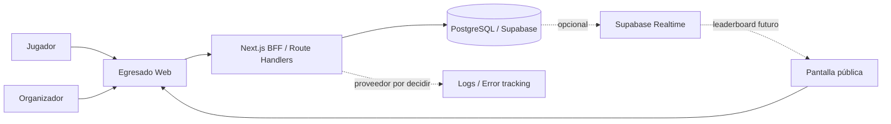

El diagrama conserva la topología aceptada, pero no implica que observabilidad externa, Realtime, ranking o persistencia de runs estén implementados en la base técnica.

## Contenedores y ejecución objetivo

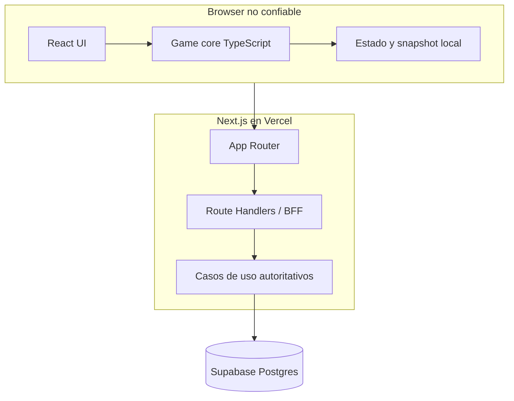

El juego activo se ejecuta localmente para minimizar latencia y dependencia de red. El caso de uso server-only ya valida una finalización no confiable, recompone el `RunPlan` cuando corresponde y reproduce las acciones con el motor versionado; emitir la configuración oficial, exponer endpoints y persistir el resultado siguen pendientes. El browser sólo previsualiza; no es autoridad de score ni de estado final.

## Fronteras de módulos

La dirección de dependencias implementada se controla con ESLint y un `tsconfig` separado para el core:

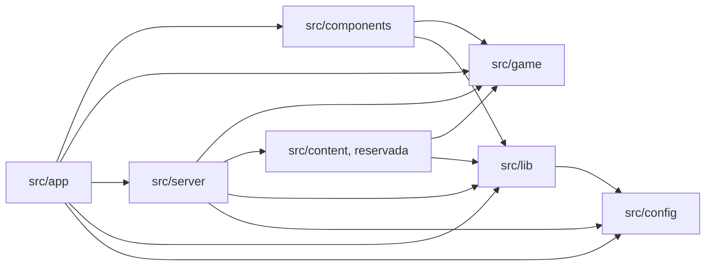

- `src/app`: composición, layouts, páginas y entrada HTTP. Puede invocar casos de uso de servidor, pero no importar persistencia directamente.
- `src/components`: UI. Puede consumir `game` y utilidades de `lib`; no accede a servidor, configuración secreta ni Supabase directamente. `components/game/` aporta el adaptador entre React y el motor: un store observable framework-free más un binding con `useSyncExternalStore`. No se incorporó Zustand: el estado de sesión es un único árbol inmutable actualizado por el reducer del motor, y la suscripción por selector ya la da React.
- `src/game`: core TypeScript puro y determinista. En dependencias internas sólo puede importar `game`; no usa React, Next.js, DOM, red, DB, almacenamiento del browser, hora global, `process` ni `Math.random()`. Admite dos dependencias externas puras declaradas en una lista blanca de fronteras: `zod` para parsear fronteras de confianza y `pure-rand` para el generador seeded de [ADR-012](03-architecture/adr/ADR-012-seeded-prng-and-substreams.md). Contiene el núcleo funcional (`core`, `math`, `random`, `challenges`, `narrative`, `progression`, `difficulty`, `scoring`, `profiles`, `plan`, `ruleset`, `runs`, `content`) y, bajo `testing/`, fixtures de desarrollo aisladas de la API pública. Ver [game engine](03-architecture/game-engine.md).
- `src/content`: contenido ejecutable como datos sobre interacciones existentes. Aloja el slice versionado de 7.º y no contiene componentes ad hoc.
- `src/server`: casos de uso autoritativos y adaptadores de persistencia. Incluye validación de runs por replay; el subárbol `persistence` no es una API para `app`.
- `src/lib`: adaptadores y utilidades transversales sin reglas de producto; el acceso público a Supabase vive aquí detrás de un adaptador aprobado.
- `src/config`: schemas y lectura de configuración pública/server-only; no depende de capas superiores.
- `supabase/`: configuración local, migraciones SQL y seed. La migración inicial es deliberadamente neutra y no decide un schema de juego.

Los imports directos de `@supabase/supabase-js` están permitidos sólo en los adaptadores aprobados. Las dependencias externas no autorizan saltarse las fronteras internas.

## Topología de despliegue

- Vercel sirve la aplicación Next.js y sus Route Handlers/Functions; CDN/edge puede servir assets estáticos.
- Supabase aloja PostgreSQL cuando el entorno tiene persistencia configurada.
- La región de funciones debe quedar cercana a Postgres al configurar producción.
- La imagen Docker standalone es un artefacto portable y un gate de paridad; no reemplaza a Vercel ni selecciona otro proveedor.
- Postgres será la fuente de verdad de runs oficiales. La base actual no crea esas tablas ni vuelve obligatorio a Supabase para levantar el shell.

Los detalles operativos están en [despliegue y ambientes](03-architecture/deployment-and-environments.md).

## Escalabilidad

Para una feria escolar, el monolito modular ofrece margen suficiente. No introducir microservicios, colas, Kubernetes, workspaces o un monorepo sin evidencia y una revisión arquitectónica.

Posibles extracciones futuras —no decisiones actuales— incluyen procesamiento matemático intensivo, analytics, edición de contenido o un leaderboard especializado. Los triggers de [ADR-002](03-architecture/adr/ADR-002-modular-monolith-bff.md) gobiernan cualquier reevaluación.

---

# FILE: 03-architecture/content-model-migration.md

# Migración del contenido al modelo de familia, plantilla y variante

Cómo se mueve el contenido existente al modelo de [ADR-019](03-architecture/adr/ADR-019-scenario-family-template-variant.md), qué se migró ya y qué queda deliberadamente para después.

**Estado: la migración estructural está hecha, STAGE-03 completó el pipeline posterior y STAGE-04 lo puso a jugar.** Las siete plantillas de 7.º y las ocho de desarrollo declaran familia, rol de colocación y variantes con identidad propia. Las plantillas de producción también declaran su `VariantSourceSpec`, validadores y canonización según [ADR-020](03-architecture/adr/ADR-020-variant-generation-and-approved-catalog.md), y la partida elige dentro del catálogo aprobado según [ADR-021](03-architecture/adr/ADR-021-approved-catalog-in-play-and-teacher-demo.md). Lo que **no** hizo la migración, a propósito, es mover contenido de año ni tocar una sola cuenta.

## Principio de la migración

> Direccionar el contenido no es rediseñarlo.

La migración cambia **cómo se nombra y se ubica** una situación. No cambia qué pregunta, con qué números, ni qué le hace a la carrera. La evidencia de que se cumplió está en las runs golden: mismo recorrido, mismo score, mismo perfil, misma cantidad de comandos.

## Los seis desafíos como sondas de arquitectura

Los seis se inspeccionaron para comprobar que el modelo representa lo que necesitan **sin ningún caso especial en el motor**. Cubren seis dominios matemáticos, seis interacciones y cuatro combinaciones distintas de efectos de carrera.

| Desafío | Familia | Estructura cognitiva | Variantes | Rol | Interacción | Efecto de carrera | ¿Sin caso especial en el motor? |
|---|---|---|---|---|---|---|---|
| `g7.bus-timing` | `bus` | tiempo con demora porcentual contra un límite | `demora-25`, `demora-50` | `anchor` | timeline | Estilo | sí |
| `g7.mural-paint` | `mural` | área y cobertura por envase entero | `pared-6x24`, `pared-5x24` | `checkpoint` | decision-card | Promedio, Estilo | sí |
| `g7.notebook-offer` | `notebook` | porcentaje contra descuento fijo con efectivo limitado | `precio-alto`, `precio-bajo` | `anchor` | decision-card | Estilo | sí |
| `g7.group-tasks` | `group-project` | asignación con capacidad y afinidad | `equipo-a`, `equipo-b` | `anchor` | assignment-board | Equipo, Estilo | sí |
| `g7.stand-supplies` | `school-fair` | packs, mínimo requerido y presupuesto | `porciones-24`, `porciones-20` | `anchor` | budget-builder | Equipo, Estilo | sí |
| `g7.may-25-act` | `may-25` | clasificación por regla, juzgada con F1 | `coreografia-a`, `coreografia-b`, `coreografia-c` | `special` | number-grid | Aura, Estilo | sí |

Lo que la tabla prueba:

- **Seis interacciones distintas** entran en el mismo contrato de plantilla.
- **Los roles son semántica de colocación, no de calidad.** El mural es `checkpoint` porque la profesora lo toma como trabajo del trimestre; el acto es `special` porque ocurre en público. Ninguno de los dos «vale más».
- **Los efectos de carrera no se derivan del rol.** El acto es `special` y mueve Aura; el mural es `checkpoint` y pone nota. Son ejes independientes.
- **La cantidad de variantes es propiedad de la plantilla**, no del modelo: el acto declara tres y las demás dos.

> **Esta tabla no es el inventario final de escenarios de Egresado.** Es la matriz de sondas con la que se validó la arquitectura, tal como estaba al migrar. La ubicación de los seis en 7.º es consecuencia del primer slice vertical.

STAGE-04 sumó una séptima, `g7.bus-latest-departure`, en la familia `bus`: misma situación, otra pregunta, interacción `numeric-input`, rol `anchor`, Estilo. Es la primera vez que dos plantillas de producción comparten familia. Ver [ADR-021](03-architecture/adr/ADR-021-approved-catalog-in-play-and-teacher-demo.md).

## Qué cambió en cada desafío

Exactamente dos cosas por archivo:

1. **La declaración.** Se agregaron `family`, `placement` y `variants`; el array `VARIANTS` pasó a llevar un `id` por entrada.
2. **La selección.** `const variante = rng.pick(VARIANTS)` pasó a `const variante = authoredVariant(ID, VARIANTS, variantId)`.

Nada más. Ni la narrativa, ni la presentación, ni el evaluador, ni las invariantes, ni un solo número.

## Dónde se eligen ahora las variantes

Antes la variante se elegía **dentro** del generador, en el substream del intento de generación. Ahora se elige **al construir la dirección de la instancia**, en un substream propio, y la dirección viaja en el `ChallengeInstanceRef`.

Consecuencia declarada: para un mismo seed de run, una plantilla de 7.º puede caer en otra variante autorada que antes. La matemática, el conjunto de variantes alcanzables y las invariantes son las mismas. Eso es un cambio de identidad de contenido y por eso la versión de contenido de 7.º subió a `0.4.0-grade-7`.

Desde ADR-020 hay una separación adicional: el `runSeed` puede seleccionar una dirección, pero sus parámetros semánticos se materializan desde `VARIANT_SPACE_SEED` y la dirección `familia/plantilla/variante`. Bajo el mismo contrato versionado de contenido/generador, cambiar de run o de slot no cambia el problema detrás de esa dirección. Esa semántica y las fuentes híbridas llevaron el contenido a `0.5.0-grade-7` sin cambiar el ruleset.

Las plantillas de desarrollo declaran **una sola variante** cada una, y una lista de un elemento no gasta ningún sorteo: su generación es byte a byte la de antes, que es lo que mantiene las runs golden intactas.

## Lo que la migración NO hizo

La migración no dividió ninguna familia en varias plantillas: la prueba de que dos conviven en una familia se hizo con contenido de desarrollo, en la familia `school-data`, para no crear gameplay de producción fuera de alcance. **STAGE-04 sí dividió una**: `bus` tiene desde entonces la comparación de salidas y la anticipación necesaria, y la migración quedó como lo que era, un cambio de direccionamiento. Que la familia pueda tener cuatro estructuras —comparación de recorridos, frecuencia— sigue siendo capacidad disponible y no trabajo hecho; autorarlas es contenido, no arquitectura.

No se renombró ningún id de contenido. `g7.bus-timing` sigue llamándose así aunque el prefijo `g7.` sugiera una ubicación que el modelo ya no necesita. Renombrarlo es cambiar identidad de contenido y pertenece a la etapa que decida ubicaciones.

No se movió contenido de año, no se sacó nada y no se agregó contenido de producción.

## Cómo migrar una plantilla nueva

Para quien traiga contenido al modelo más adelante:

1. Elegir la **familia**: ¿en qué situación reconocible ocurre? Si la familia no existe, agregarla al módulo de familias del content set.
2. Elegir el **rol**: ¿es el beat primario del año (`anchor`), una evaluación (`checkpoint`), un momento social o excepcional (`special`) o contenido condicional de recuperación (`recovery`)?
3. Declarar la **elegibilidad**: en qué etapas *puede* aparecer. Permiso, no selección.
4. Nombrar las **variantes curadas de respaldo** con ids estables y semánticos. El orden de `variants` afecta qué dirección elige un seed cuando el content set no aporta catálogo aprobado, pero no define identidad: esa identidad es el id dentro de la dirección completa.
5. Declarar un `VariantSourceSpec`: parámetros `authored`, validadores, vista `canonical` y, si el dominio lo justifica, un `VariantGenerator` constraint-first. Tanto authored como generated pasan por el mismo pipeline.
6. Escribir `generate` sobre los parámetros ya resueltos. No leer `runSeed` para decidir su contenido: el `variantRng` deriva del seed fijo del espacio de variantes y de la dirección semántica.
7. Registrar la plantilla en el `ContentCatalog`; construir, auditar y verificar el `ApprovedVariantCatalog` con `pnpm game:variants build`, `audit` y `check`. Aprobarla no la agrega por sí solo a un `RunPlan`. **No hace falta tocar el motor ni el pipeline.**

La ficha de autoría previa al código está en [la guía de autoría](01-game-design/content-authoring-guide.md).

## Trabajo futuro de ubicación de contenido

Cuando el proyecto decida el inventario definitivo, cada escenario existente se clasificará como **KEEP**, **MOVE**, **REWORK**, **MERGE**, **REPLACE** o **REMOVE**. Esa auditoría no se hizo y no corresponde hacerla desde la arquitectura: depende del alcance de contenido, del gate docente y de la duración objetivo de una run. Ver [preguntas abiertas](07-reference/open-questions.md) y [el roadmap](06-delivery/implementation-sequence.md).

---

# FILE: 03-architecture/data-model.md

# Modelo de datos

## Entidades MVP

### `players`
Identidad anónima/pseudónima.

| Campo | Tipo | Notas |
|---|---|---|
| id | uuid | PK |
| public_name | varchar | nickname moderado |
| status | enum | active/blocked |
| created_at | timestamptz | server |

No almacenar fecha de nacimiento, apellido, email ni escuela para el MVP.

### `game_events`
Configura feria/daily.

| Campo | Tipo |
|---|---|
| id | uuid |
| slug | varchar unique |
| name | varchar |
| starts_at | timestamptz |
| ends_at | timestamptz |
| mode | varchar |
| seed_strategy | jsonb |
| ruleset_version | varchar |
| content_version | varchar |
| leaderboard_enabled | boolean |
| status | varchar |

### `runs`

| Campo | Tipo | Notas |
|---|---|---|
| id | uuid | PK |
| player_id | uuid nullable | pseudónimo |
| event_id | uuid nullable | feria/daily |
| seed | varchar | reproducibilidad |
| mode | varchar | |
| difficulty | varchar | |
| game_version | varchar | |
| ruleset_version | varchar | |
| content_version | varchar | |
| status | varchar | created/active/completed/invalid/abandoned |
| started_at | timestamptz | |
| completed_at | timestamptz nullable | |
| official_score | integer nullable | servidor |
| profile_code | varchar nullable | |
| result_summary | jsonb nullable | |
| result_hash | varchar nullable | |

### `run_actions`

| Campo | Tipo |
|---|---|
| id | bigint/uuid |
| run_id | uuid |
| sequence_no | int |
| action_type | varchar |
| challenge_id | varchar |
| payload | jsonb |
| client_elapsed_ms | int nullable |
| created_at | timestamptz |

Unique `(run_id, sequence_no)`.

### `leaderboard_entries` — opcional
Inicialmente puede derivarse de runs. Materializar sólo si mediciones demuestran necesidad.

### `moderation_actions`
Audita ocultamientos/restauraciones.

## Índices

- `runs(event_id, status, official_score desc)`.
- `runs(player_id, completed_at desc)`.
- `run_actions(run_id, sequence_no)`.
- `game_events(slug)` unique.

## Retención

Definir antes de feria:
- retención de runs;
- retención de actions;
- exportación agregada;
- eliminación de pseudónimos si ya no son necesarios.

## Datos derivados

No duplicar sin necesidad:
- posición de ranking;
- estadísticas agregadas;
- best score por jugador.

Preferir query/view/materialized view según escala real.

## Entidades objetivo del modo feria

**No implementadas.** Los nombres se adaptan a las convenciones reales al escribir la migración.

- **Evento:** vigencia, estado (`draft`/`frozen`/`live`/`closed`), tupla de versiones permitida, política de intentos y ajustes de ranking público.
- **Participante:** id pseudónimo, evento, nickname, estado de moderación.
- **Run:** descriptor y tupla de versiones, seed y calendario de variantes, estado (`issued`/`completed`/`pending`/`verified`/`rejected`).
- **Acciones de run:** action log canónico, ordenado e inmutable.
- **Resultado verificado:** desglose de score, resumen de carrera, arquetipo cuando exista, tupla de desempate y metadata de verificación.
- **Mejor del participante:** referencia a la mejor run verificada del evento, actualizada transaccionalmente.
- **Catálogo de variantes:** versión, plantilla, seed, fingerprint, metadata de dificultad y estado de aprobación.
- **Auditoría de moderación:** actor, participante, acción, motivo y timestamp.

Ver [arquitectura objetivo del motor](03-architecture/target-engine-architecture.md) y [modo feria y congelamiento](05-operations/fair-mode-and-competition-freeze.md). La retención de cada una es una decisión abierta ([preguntas 31 y 50](07-reference/open-questions.md)).

---

# FILE: 03-architecture/deployment-and-environments.md

# Despliegue y ambientes

## Topología aceptada

Vercel es el destino canónico para la aplicación Next.js y sus Route Handlers; Supabase gestiona PostgreSQL cuando la persistencia está habilitada. La imagen Docker standalone definida por [ADR-010](03-architecture/adr/ADR-010-reproducible-node-pnpm-container-toolchain.md) es un artefacto portable para paridad y verificación, no un cambio de proveedor de producción.

La base actual es local y no contiene gameplay, autenticación ni tablas de producto. No debe desplegarse públicamente con Next.js `16.3.1`: el gate `pnpm release:check` exige actualizar a `>=16.3.2`, regenerar el lockfile y volver a ejecutar la verificación completa.

## Ambientes

| Ambiente | Propósito | Datos y persistencia |
|---|---|---|
| Local nativo | Camino rápido con `pnpm dev`; Supabase local es opcional. | `.env.local` ignorado por Git; DB local o proyecto de desarrollo aislado. |
| Local Compose | Paridad del runtime Linux y prueba del desarrollo contenedorizado. | El browser usa la URL pública del host y el proceso server usa la URL interna del contenedor. |
| Preview | Cada PR/despliegue de Vercel cuando se habilite. | Recursos aislados; nunca datos reales de producción. |
| Staging | Configuración cercana a feria para E2E, migraciones, carga y rehearsal. | Proyecto Supabase separado de producción. |
| Production | Evento real y juego público, después de cerrar todos los gates de release. | Secretos gestionados por el proveedor y datos bajo la política legal/retención que aún debe cerrarse. |

La política legal y de retención, los SLO operativos y los requisitos exactos de rehearsal permanecen abiertos en [preguntas 30 y 31](07-reference/open-questions.md#operación-seguridad-y-privacidad).

## Configuración y URLs de Supabase

La configuración se valida al iniciar y puede quedar completamente ausente para ejecutar el shell:

- `NEXT_PUBLIC_APP_URL`: origen público de la aplicación; localmente tiene default `http://localhost:3000`.
- `NEXT_PUBLIC_SUPABASE_URL` y `NEXT_PUBLIC_SUPABASE_PUBLISHABLE_KEY`: par público obligatorio en conjunto. La publishable key no es un secreto y sólo es segura junto con grants/RLS mínimos.
- `SUPABASE_INTERNAL_URL`: URL server-only opcional. En Compose usa por defecto `http://kong:8000`, alias interno del gateway en la red Docker local compartida.
- `SUPABASE_SECRET_KEY`: credencial privilegiada server-only, sin default y nunca prefijada con `NEXT_PUBLIC_`.

En desarrollo nativo, el server puede reutilizar `NEXT_PUBLIC_SUPABASE_URL`. En Compose, el browser conserva `http://127.0.0.1:54321` mientras el proceso server usa la red `egresado-supabase-local` y el alias interno `http://kong:8000`. La red compartida resuelve conectividad contenedor a contenedor, pero no garantiza por sí sola que los puertos publicados queden aislados de la LAN.

### Exposición de puertos en Docker Desktop

El wrapper solicita el binding oficial `com.docker.network.bridge.host_binding_ipv4=127.0.0.1` al crear la red. Esa opción expresa la intención de loopback, pero Docker Desktop puede conservarla en la red y aun publicar un contenedor con `HostIp` real `0.0.0.0` o `::`. Por eso la opción de red no se trata como evidencia suficiente.

Después de iniciar Supabase, el wrapper inspecciona los bindings efectivos de todos sus contenedores y sólo considera loopback a `127.0.0.1` o `::1`. `pnpm db:start` es fail-closed: ante cualquier otro `HostIp` —incluidos `0.0.0.0` y `::`— intenta detener el stack y falla. `pnpm db:reset` y `pnpm docker:up` también rechazan por defecto un stack existente que no sea loopback-only. `pnpm db:status` reporta `loopbackOnly` y emite una advertencia si detecta exposición.

Sólo para uso local en una red de confianza, con firewall del host verificado, los wrappers aceptan el flag explícito `--allow-non-loopback` o `EGRESADO_ALLOW_NON_LOOPBACK_SUPABASE=true` para automatización local. La excepción imprime una advertencia visible y no convierte el stack en apto para una red compartida, CI, staging ni producción. No crear un script alternativo ni persistir este override como default de proyecto.

`pnpm db:env` genera `.env.local` desde Supabase local sin imprimir valores secretos. El archivo no entra en la imagen final ni en Git. Los adaptadores server-only prefieren la URL interna y la configuración pública nunca incluye `SUPABASE_SECRET_KEY`.

## Caminos locales

El camino nativo es el ciclo rápido:

```bash
pnpm install --frozen-lockfile
pnpm dev
```

Supabase se inicia por separado sólo si la tarea necesita persistencia:

```bash
pnpm db:start
pnpm db:env
pnpm db:reset
pnpm db:types
```

Si Docker Desktop no respeta el binding solicitado, `pnpm db:start` falla e intenta dejar el stack detenido. Corregir la configuración de Docker/firewall es la opción preferida; la excepción `pnpm db:start --allow-non-loopback` queda limitada al escenario local de confianza descrito arriba. Como el permiso no persiste, repetir explícitamente `pnpm db:reset --allow-non-loopback` o `pnpm docker:up --allow-non-loopback` si ese workflow necesita continuar con el stack ya inspeccionado; la variable de opt-in ofrece el mismo comportamiento para automatización local.

El camino contenedorizado levanta la etapa `development` con bind mount del repositorio y volúmenes separados para `node_modules` y `.next`:

```bash
pnpm docker:up
pnpm docker:down
```

La guía completa de prerrequisitos, troubleshooting y limpieza está en [entorno de desarrollo](08-engineering/development-environment.md).

## Imagen de producción portable

El `Dockerfile` multi-stage:

1. fija Node.js 24.19.0 por tag y digest e instala pnpm 11.22.0;
2. instala con `pnpm install --frozen-lockfile`;
3. activa `NEXT_STANDALONE=true` sólo en la etapa `builder`;
4. copia la salida standalone y assets al runtime mínimo;
5. ejecuta como usuario no root `node` e incluye un health check sobre `/api/health`.

El build normal de Vercel no activa salida standalone. Esta condición evita cambiar el contrato de despliegue canónico mientras permite verificar el artefacto Docker con `pnpm docker:build`.

Las variables `NEXT_PUBLIC_*` quedan congeladas por Next.js durante el build. El `Dockerfile` acepta sólo esos valores públicos como `--build-arg`; una imagen configurada para otro origen debe reconstruirse. `SUPABASE_SECRET_KEY` y `SUPABASE_INTERNAL_URL` no son build args: se inyectan al runtime server desde el ambiente/secret manager. Nunca reutilizar una imagen con configuración pública de un ambiente distinto sin reconstruirla.

## CI y gates de release

GitHub Actions usa Node desde `.node-version`, pnpm desde `packageManager` y dependencias congeladas. `pnpm toolchain:check` exige que `.node-version`, `.nvmrc`, `engines`, `packageManager` y el `Dockerfile` permanezcan alineados. Las actions están fijadas por SHA y los permisos del workflow son sólo de lectura.

El job `Quality and build` ejecuta coherencia del toolchain, validación documental/agentic, scanner de secretos, auditoría del árbol completo de dependencias, formato, lint/fronteras arquitectónicas, typecheck, cobertura y build. El job `Browser smoke tests` instala Chromium, construye la aplicación, ejecuta Playwright en desktop/mobile y conserva el reporte. El job `Production container smoke` prueba el runner standalone no-root y su health. Dependabot revisa semanalmente dependencias npm, GitHub Actions y Docker.

Antes de un release público también deben pasar:

- `pnpm release:check`; hoy falla de forma deliberada hasta instalar Next.js `>=16.3.2`;
- `pnpm security:audit` y revisión de advisories/transitivas;
- migraciones, RLS/permisos y pruebas de integración cuando exista schema de producto;
- golden replays, validación de contenido, rehearsal y fallback cuando exista gameplay/release de feria.

Un CI verde de la base técnica no reemplaza esos gates contextuales.

## Migraciones

- Los cambios viven como SQL versionado en `supabase/migrations/`.
- `pnpm db:reset` demuestra que el historial reconstruye la DB local; `pnpm db:lint` revisa el schema y `pnpm db:types` regenera los tipos consumidos por TypeScript.
- Toda migración de producto necesita revisión de índices y RLS/permisos, y se aplica a staging antes de producción.
- No editar el schema productivo manualmente sin registrar una migración.
- La migración inicial sólo valida el pipeline; no decide el modelo de runs, eventos o acciones.

## Región, rollback y PWA

- Configurar funciones cerca de la región de la base de datos antes de producción.
- Mantener disponible el deploy anterior y preferir migraciones backward-compatible.
- `game_version`, `ruleset_version` y `content_version` evitan reinterpretar runs incompatibles; el mecanismo de conservación histórica sigue abierto.
- La base incluye manifest responsive. Un service worker avanzado se difiere hasta estabilizar caching y versionado para no servir assets o reglas incompatibles.

Los feature flags futuros deben limitarse a necesidades verificadas; no crear una plataforma propia de flags para el MVP.

## Aislamiento de configuración competitiva

Cuando exista el modo feria, cuatro ambientes con propósitos distintos: local con generadores sin restricción y herramientas de debug; demo docente con contenido estable de 7.º y pool determinista; staging o ensayo de feria con la misma forma de infraestructura y configuración que producción, participantes sintéticos y pruebas de carga y ranking; y producción de feria con configuración de evento congelada, catálogo oficial de variantes, verificación autoritativa, monitoreo y moderación.

Regla dura: **una versión de desarrollo de score o de contenido no puede convertirse en versión oficial por accidente.** El registro del evento habilita explícitamente sólo la tupla congelada, y el flag `production` del ruleset ya se niega a construir un ruleset oficial desde una política de desarrollo. Ver [modo feria y congelamiento](05-operations/fair-mode-and-competition-freeze.md).

---

# FILE: 03-architecture/game-engine.md

# Game engine

Motor TypeScript determinista, puro y reproducible. Este documento describe el motor **implementado** en `src/game`. Las decisiones durables que lo gobiernan están en [ADR-003](03-architecture/adr/ADR-003-deterministic-seeded-engine.md), [ADR-004](03-architecture/adr/ADR-004-server-authoritative-scoring.md), [ADR-007](03-architecture/adr/ADR-007-content-as-data.md), [ADR-011](03-architecture/adr/ADR-011-functional-core-transition-engine.md), [ADR-012](03-architecture/adr/ADR-012-seeded-prng-and-substreams.md), [ADR-013](03-architecture/adr/ADR-013-exact-rational-arithmetic.md), [ADR-019](03-architecture/adr/ADR-019-scenario-family-template-variant.md), [ADR-020](03-architecture/adr/ADR-020-variant-generation-and-approved-catalog.md), [ADR-021](03-architecture/adr/ADR-021-approved-catalog-in-play-and-teacher-demo.md) y [ADR-022](03-architecture/adr/ADR-022-difficulty-model-and-run-composer.md).

Para comandos y flujo de trabajo, ver [desarrollo del motor](08-engineering/game-engine-development.md).

## Restricciones

`src/game` no puede depender de React, Next.js, `window`/DOM, almacenamiento local, DB, red, hora global no inyectada ni `Math.random()`. Las fronteras se aplican con ESLint (`no-restricted-globals`, `no-restricted-imports`, `boundaries/dependencies`) y con un proyecto TypeScript separado, `tsconfig.game.json`, que compila el core sin tipos de DOM ni de Node.

Únicas dependencias externas admitidas dentro del core, declaradas en una lista blanca explícita de fronteras: `zod` (parseo de fronteras de confianza) y `pure-rand` (generador seeded de ADR-012).

## Arquitectura

Functional core / imperative shell.

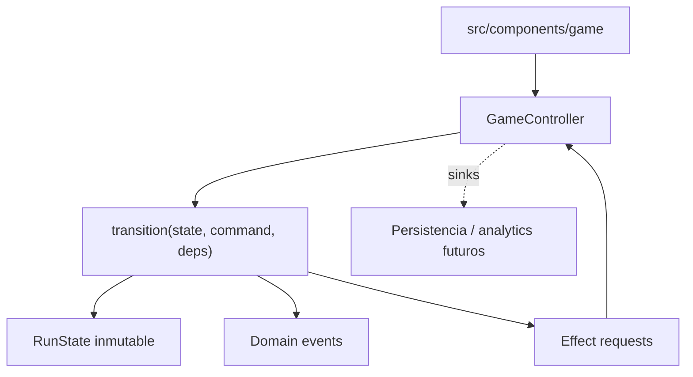

El motor devuelve estado, eventos y **descripciones** de efecto. Nunca ejecuta un efecto: no hay red, storage ni SDK dentro de `src/game`.

## Módulos

| Módulo | Responsabilidad |
|---|---|
| `core/` | identidades branded, `Result`, taxonomía de errores, exhaustividad, versionado |
| `math/` | racionales exactos, redondeo, cantidades/unidades, tolerancias |
| `random/` | interfaz `Rng`, adaptador `pure-rand`, derivación de seeds por namespace |
| `challenges/` | contratos, modelo familia/plantilla/variante, fuentes, validadores, interacciones y registry |
| `narrative/` | storylets, condiciones, efectos, selección determinista |
| `progression/` | etapas canónicas y el modelo de carrera visible |
| `difficulty/`, `scoring/`, `profiles/` | rasgos cognitivos, costos de scheduling y contratos de política + implementaciones de desarrollo |
| `plan/` | política y compositor de runs, `RunPlan` concreto, serialización, fingerprint, validación independiente y auditoría |
| `ruleset/` | ensamblado y validación del ruleset versionado |
| `runs/` | estado, comandos, eventos, transición, action log, replay, snapshots, selectores |
| `content/` | validación de contenido, pipeline, auditoría y catálogo aprobado de variantes |
| `testing/` | fixtures de desarrollo, agente sintético y simulación masiva |

## Entradas

```typescript
interface RunDescriptor {
  runId: RunId
  seed: RunSeed
  mode: 'standard' | 'fair' | 'practice'
  difficulty: 'adaptive' | 'fixed'
  gameVersion: string
  rulesetVersion: string
  contentVersion: string
  variantCatalogVersion?: string
  planFingerprint?: string
}
```

`variantCatalogVersion` es opcional: una run que juega la lista curada de una plantilla no salió de un catálogo aprobado y no debe afirmar lo contrario. `planFingerprint` identifica el plan concreto de una run compuesta. `EngineDependencies` aporta `ruleset`, catálogo de contenido, `storylets` y, cuando existen, un `ApprovedVariantLookup` y una `CompositionPolicy`. Con el primer puerto la selección usa sólo variantes aprobadas; sin él cae en la lista curada de respaldo de la plantilla. El ruleset **no** forma parte del estado: contiene funciones y se inyecta; la run sólo guarda su versión.

## Estado

`RunState` es JSON-compatible: no contiene `Date`, `Map`, `Set`, instancias de clase ni funciones. Guarda descriptor, fase, etapa, índices de evento, carrera, flags, dificultad, estado de selección, historial, `scorePreview`, racha, completion y, cuando corresponde, el `RunPlan` concreto compuesto antes de empezar.

El desafío activo se guarda como **dirección**, no como modelo:

```typescript
interface ChallengeInstanceRef {
  instanceId, familyId, templateId, variantId, stageId, eventIndex, difficulty
}
```

La ubicación pertenece a la instancia, pero el contenido matemático pertenece a `familyId/templateId/variantId`: se reconstruye con el seed fijo del espacio de variantes, no con el seed de la run. Bajo el mismo contrato versionado de contenido/generador, el `runSeed` selecciona direcciones pero no cambia el problema detrás de una dirección. Nada no serializable entra al estado, los snapshots quedan chicos y el replay no puede desincronizarse del estado que lo referencia.

## Ciclo de vida

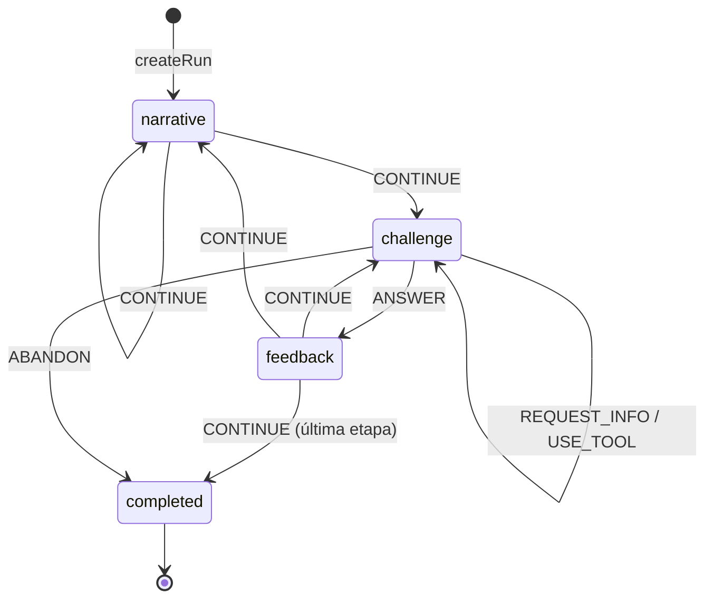

Un storylet sin pool de desafíos es un evento puramente narrativo y se resuelve con `CONTINUE`.

## Comandos

```typescript
type GameCommand =
  | { type: 'ANSWER'; instanceId; answer: InteractionAnswer }
  | { type: 'REQUEST_INFO'; instanceId; key }
  | { type: 'USE_TOOL'; instanceId; tool }
  | { type: 'CONTINUE' }
  | { type: 'ABANDON' }
```

`parseCommand` es la única frontera de confianza; usa schemas Zod. Dentro del motor los comandos ya están tipados.

Las respuestas numéricas viajan como literal decimal en `string`, nunca como `number`, para que ningún valor pase por punto flotante binario antes de ser evaluado.

## Transiciones inválidas

`transition` devuelve `Result`. Se rechazan explícitamente, entre otros: responder fuera de fase, responder dos veces, responder a una instancia obsoleta, enviar una respuesta de otra interacción, pedir un dato inexistente, usar una herramienta no habilitada, continuar sin feedback y operar sobre una run terminada. Cada rechazo es un valor tipado de `EngineRejection`, no una excepción.

Las excepciones (`EngineInvariantError`) quedan reservadas para estados que las reglas del motor deberían haber impedido; nunca las puede provocar el jugador.

## Eventos de dominio y efectos

Son cosas distintas.

- **Evento de dominio**: un hecho ocurrido en el modelo determinista (`challenge.evaluated`, `stage.completed`, `run.completed`). Estable, apto para mapear a analytics más adelante, pero el vocabulario no lo decide analytics.
- **Effect request**: una instrucción para el shell (`persist-snapshot`, `track`). El motor la describe; el `GameController` la ejecuta a través de sinks inyectados.

## RNG

Ver [ADR-012](03-architecture/adr/ADR-012-seeded-prng-and-substreams.md). Cada consumidor deriva su substream por dirección de namespace, de modo que agregar una tirada nueva no desplaza ninguna existente. `RunState` no guarda un cursor de RNG: el determinismo viene de la dirección, no del arrastre de estado.

La codificación de la dirección usa `U+0001` entre seed y ruta y `U+0000` entre segmentos, escritos como escapes y fijados por vectores en `tests/unit/rng-addressing.test.ts`. El charset que hace imposible una colisión se **verifica** en las fronteras de confianza, no se asume.

Capacidades: `nextInt`, `nextFloat`, `chance`, `pick`, `shuffle`, `weightedPick`, `derive`. La selección ponderada usa pesos enteros y comparación entera; nunca puede elegir un peso cero.

## Precisión numérica

Ver [ADR-013](03-architecture/adr/ADR-013-exact-rational-arithmetic.md). Dinero en unidades menores enteras, tiempo en minutos enteros, proporciones y porcentajes como racionales exactos, redondeo explícito por operación y tolerancia de respuesta declarada por desafío (`exact`, `absolute`, `relative-percent`, `range`). `toNumber` es sólo para presentación.

## Desafíos

Una plantilla declara responsabilidades separables sobre parámetros ya resueltos por su `VariantSourceSpec`:

1. fuente `authored` o `generated` — parámetros direccionados, validadores y vista canónica;
2. `generate(context)` — modelo privado desde parámetros resueltos;
3. `verify(model)` — invariantes propias del desafío;
4. `present(model, revealed)` — vista pública, sin la solución;
5. `evaluate(model, answer, revealed)` — resultado estructurado.

`defineChallenge` borra el tipo del modelo sin ningún cast: el modelo queda capturado en el closure y sólo se exponen las operaciones permitidas. La generación reintenta en un substream propio hasta cumplir las invariantes; el índice de intento forma parte de la dirección, así que el reintento también es determinista. Un generador que necesita reintentos sistemáticamente está mal construido y la validación de contenido lo reporta.

El pipeline de STAGE-03 recorre ambas fuentes con el mismo contrato: resolver, materializar, validar, canonizar, calcular huella, deduplicar y aprobar. `AUTHORED` no evita validación y `GENERATED` no significa azar libre en runtime.

### Vista pública

`PublicChallengeView` contiene narrativa, interacción y herramientas. No expone el modelo interno ni la solución. Un juego servido al browser no puede garantizar secreto absoluto, pero la arquitectura no entrega la respuesta a los componentes de presentación.

## Interacciones

La categoría matemática y la interacción son ejes independientes (ADR-007). Familias contratadas en este build:

`decision-card`, `numeric-input`, `budget-builder`, `timeline`, `chart-interpretation`, `assignment-board`, `information-request`.

Las familias documentadas todavía **no** contratadas son `spatial-grid`, `sequence/trend` y `special minigame`. Ver [cómo agregar una interacción](08-engineering/game-engine-development.md#agregar-un-interaction-type).

## Narrativa

Storylets con condiciones declarativas. Las condiciones y los efectos son **datos**, nunca callbacks: eso permite validarlos antes de ejecutar, serializarlos, editarlos fuera del código y reproducirlos en el servidor sin evaluar código arbitrario.

Selección: filtrar por etapa → descartar cooldown/repetición → evaluar condición → quedarse con el tier de prioridad más alto → sorteo ponderado seeded. Un pool vacío devuelve un resultado tipado, no una excepción.

## Composición y autoridad del plan

Para una run compuesta, la selección ordinaria queda resuelta **antes** de ejecutar el primer evento:

```text
seed + ContentCatalog + ApprovedVariantCatalog + CompositionPolicy
    → RunComposer
    → RunPlan concreto + fingerprint
    → transition ejecuta los beats fijados
```

El compositor enumera todas las combinaciones de uno o dos beats que cumplen las restricciones duras —exactamente un `anchor`, roles permitidos, elegibilidad, host narrativo, variantes aprobadas, no repetición y sobre de dificultad— y aplica después los objetivos blandos en orden lexicográfico. El seed sólo desempata entre planes equivalentes. La cantidad de variantes de una plantilla no multiplica su probabilidad: primero existe un candidato por plantilla y recién dentro de él se elige la variante concreta.

`validateComposedPlan` es un programa separado: recalcula rol, banda y costo desde el catálogo y comprueba política, presupuesto, hosts, repeticiones y catálogo aprobado sin volver a componer. El motor consume el plan; no vuelve a sortear en runtime. Snapshot, action log y validación server-only preservan o recomprueban su identidad. `grade-7-composed` es el content set normal que ejerce este camino; el arco docente `grade-7` sigue separado y explícito.

## Progresión y ruleset

Las siete etapas canónicas son configuración del ruleset, no `if (year === 3)` repartidos por el motor. El ruleset reúne etapas, política de scoring, de dificultad, de perfil, de composición y pacing narrativo, y se valida al construirse. Un content set sin política de composición conserva su flujo explícito; la demo amplia de 7.º es ese caso.

Un ruleset **oficial** exige que las tres políticas estén marcadas `production`. Como las preguntas abiertas 5 y 24 siguen sin cerrarse, hoy no existe ninguna política de producción y `createRuleset({ official: true })` falla a propósito.

## Scoring y perfil

`score_evento = base × calidad × dificultad + bonus - penalizaciones`, calculado sobre racionales y redondeado una sola vez al final. El resultado incluye un desglose explicable.

El tiempo **no** participa: la pregunta abierta 27 no definió qué señal temporal puede considerar autoritativa el servidor, y las reglas advierten que un score dominado por velocidad perjudica accesibilidad.

El perfil se calcula sobre dimensiones ocultas normalizadas, con desempate documentado y total: puntaje ponderado → dimensión dominante del perfil → orden canónico.

## Replay

```text
createRun(descriptor) -> action[0] -> action[1] -> ... -> finalState
```

El action log versionado es el artefacto de validación más fuerte: se puede volver a ejecutar. Las secuencias deben empezar en cero y avanzar de a uno; un salto se rechaza en vez de repararse. Un comando que las reglas no habrían permitido invalida el log completo.

`ACTION_LOG_VERSION` es `3`. El log lleva el descriptor completo: `variantCatalogVersion` —sin ese campo una run se reproducía contra el contenido equivocado sin decir nada, que es el defecto que [ADR-021](03-architecture/adr/ADR-021-approved-catalog-in-play-and-teacher-demo.md) encontró y cerró— y la huella del plan compuesto, que dice contra qué composición hay que reproducirla.

La comparación usa una forma JSON canónica con claves ordenadas, así que el orden de inserción no puede producir un falso negativo.

## Snapshots

Los snapshots son una **optimización para reanudar** (FR-009/FR-010), no un artefacto autoritativo. El codec valida agresivamente y rechaza lo que no reconoce; una versión incompatible produce un error explícito, nunca una migración silenciosa. Desde [ADR-022](03-architecture/adr/ADR-022-difficulty-model-and-run-composer.md) el snapshot guarda además el **plan concreto** de una run compuesta, en vez de la forma de recalcularlo: reanudar tiene que jugar el año que el jugador empezó, no el que la calibración de hoy compondría. `SNAPSHOT_SCHEMA_VERSION` es `5`; no existe un registro de migraciones porque las versiones anteriores se rechazan y la aplicación ofrece una partida nueva.

### Invariantes estructurales

Validar cada campo por separado no alcanza: un estado sólo es coherente cuando los campos **concuerdan**. `runStateIssues` verifica esa correlación y `restoreSnapshot` rechaza con `corrupted-snapshot` cuando falla.

- la fase y su payload deben corresponderse (`challenge` exige un desafío activo, `feedback` exige feedback pendiente, `narrative` exige un evento sin desafío, `completed` no admite ninguno de los dos);
- `status` y `phase` deben concordar, y sólo una run completada lleva `completion`;
- el historial es un log contiguo desde cero y no puede exceder el evento alcanzado;
- `scorePreview` debe ser exactamente la suma de los puntos otorgados —un total manipulado se detecta sin reproducir nada—;
- el historial de calidades y la racha deben corresponderse con los eventos resueltos;
- todo storylet jugado debe figurar como visto, o el cooldown se comportaría distinto tras reanudar.

Se evaluó convertir `phase` en unión discriminada que lleve su payload, lo que haría irrepresentables esos estados. Se descartó por ahora: cambia el formato persistido y se propaga a transición, selectores y UI, mientras que el defecto sólo entra por esta frontera. Queda como evolución razonable.

## Compatibilidad y versionado

Una run sólo puede reanudarse o revalidarse con un motor que declare el mismo triple `gameVersion` / `rulesetVersion` / `contentVersion`. `variantCatalogVersion` agrega procedencia cuando la run consume un catálogo aprobado; no reemplaza esa compatibilidad ni se inventa para runs curadas —un content set sin catálogo lo omite—. Cuando el campo está, `createRun` lo **comprueba**: una run que declara un catálogo distinto del que se le está dando se rechaza, porque reproducirla produciría otro contenido con el mismo score.

| Cambió | Subir |
|---|---|
| transición, orden de consumo de RNG, derivación de seed, formato de action log, codec de snapshot, generación de un desafío existente | `ENGINE_VERSION` |
| política de scoring, dificultad, progresión, perfil **o composición** | versión de ruleset |
| datos de desafíos o storylets | versión de contenido |

Los golden tests de `tests/unit/engine-golden.test.ts` fallan ante cualquier cambio accidental de salida determinista. Regenerarlos sin subir la versión correspondiente invalida en silencio los replays guardados.

Para que esa regla no dependa de la disciplina de quien edita, `tests/unit/engine-fingerprint.test.ts` fija un **fingerprint** determinista del motor, del ruleset y del contenido contra la versión declarada. Cambiar una política, la configuración de etapas o el content set sin mover la versión rompe ese test y nombra la decisión que se estaba salteando.

## Frontera con servidor

El motor corre igual en browser y en Node. `src/server/game/validate-run.ts` es el caso de uso `server-only` que materializa ADR-004: recibe una submission no confiable, la parsea, verifica compatibilidad de versiones, la reproduce y devuelve score, perfil y carrera **recalculados**. En una run compuesta recompone desde el seed y las políticas del servidor, compara `planFingerprint` y pasa el resultado por el validador independiente. Nada que el cliente afirme sobre el resultado se lee; un payload que incluya su propio `officialScore` simplemente lo ve ignorado.

Rechaza con tipo una submission malformada, una acción insertada, una secuencia rota, una run truncada, un ruleset incompatible y un seed fuera del charset. Endpoints, sesión, rate limiting y persistencia siguen siendo trabajo aparte.

El determinismo entre runtimes se verifica en `tests/e2e/game-engine-harness.spec.ts`, que exige que el browser reproduzca exactamente los valores que Node calcula para el mismo seed.

## Hash de resultado

Opcional. `canonicalize(state)` produce la forma estable sobre la que se puede calcular un hash para detectar divergencias entre cliente y servidor. Es una señal de diagnóstico, no un mecanismo de seguridad por sí mismo.

## Modelo de contenido

Una instancia de desafío se direcciona por su identidad de contenido completa —familia de escenario, plantilla y variante— más dónde la ubicó la run. Una `ChallengeDefinition` **es** una plantilla; el catálogo de contenido disponible (`ContentCatalog`) está separado del plan de contenido de una run (`RunPlan`), y la elegibilidad por etapa y el rol de colocación son metadata declarativa del contenido, no conocimiento del motor.

Cada plantilla declara una fuente híbrida: registros autorados y, opcionalmente, un espacio generado por restricción. Ambas pasan por validadores genéricos y matemáticos, canonización, fingerprint SHA-256 y deduplicación antes de entrar en un `ApprovedVariantCatalog`. El catálogo vigente es `grade-7-dev-3`; es de desarrollo y la partida real de 7.º lo consume mediante `ApprovedVariantLookup`. `dev-1` y `dev-2` siguen publicados sin cambios. `dev-3` conserva las mismas direcciones y huellas semánticas de `dev-2`: se publicó como versión inmutable nueva para alinearse con `contentVersion 0.7.0-grade-7`, no porque agregara variantes jugables.

`DemoPlan` es otro artefacto: declara qué muestra una demostración docente y su validador exige que no pueda pasar por `StageContentPlan`. No construye una run ni relaja el presupuesto normal de uno a dos beats. La composición normal ya existe como `RunComposer` + `ComposedRunPlan`; son caminos separados.

El motor no conoce ningún id de contenido: agregar una familia, una plantilla, un generador o sus validadores no requiere tocar el pipeline ni el compositor. Ver [ADR-019](03-architecture/adr/ADR-019-scenario-family-template-variant.md), [ADR-020](03-architecture/adr/ADR-020-variant-generation-and-approved-catalog.md), [ADR-021](03-architecture/adr/ADR-021-approved-catalog-in-play-and-teacher-demo.md), [ADR-022](03-architecture/adr/ADR-022-difficulty-model-and-run-composer.md) y [la migración del modelo de contenido](03-architecture/content-model-migration.md).

## Lo que este documento no describe

Este documento describe el motor **implementado**. Las capacidades que todavía no existen —score competitivo normalizado, `RunDescriptor` oficial emitido por servidor, `scoreVersion`, vinculación autoritativa con el catálogo de feria y ranking— están en [arquitectura objetivo del motor](03-architecture/target-engine-architecture.md), con el estado real de cada una. La base server-only de verificación por replay y composición ya existe; endpoints, sesión y persistencia siguen futuros.

La frontera fundamental no cambia en ninguna de esas evoluciones. Si una propuesta futura la toca, es un ADR nuevo.

---

# FILE: 03-architecture/security-privacy.md

# Seguridad y privacidad

## Objetivos

- Evitar manipulación trivial de rankings.
- Minimizar datos de menores.
- Reducir superficie de abuso.
- Mantener secretos sólo server-side.
- Detectar configuración inválida y dependencias vulnerables antes de publicar.

## Privacidad por diseño

El MVP no necesita email, contraseña, apellido, edad exacta, escuela, ubicación precisa ni redes sociales. El nickname es un pseudónimo público y debe tratarse como contenido moderable.

La base técnica no implementa Auth ni crea tablas de participantes, runs o ranking. Incorporarlas requiere respetar el [modelo de datos](03-architecture/data-model.md), [ADR-008](03-architecture/adr/ADR-008-anonymous-identity.md), el threat model y las preguntas abiertas de contratos y retención; no se infiere identidad a partir de los defaults de Supabase local.

## Trust boundaries

El browser es no confiable. No confiar en score, elapsed time sin límites/validación, challenge result, flags, stage final ni versión declarada arbitrariamente.

Cuando se implementen runs oficiales, el BFF debe reconstruir el score desde una configuración emitida y una secuencia de acciones válidas. El cliente sólo puede previsualizar. Una run oficial debe asociarse a una sesión/cookie segura o un token firmado de corta vida; `runId` no es un secreto suficiente.

Las rutas de `src/app` invocan casos de uso del server y no importan adaptadores de persistencia. La UI no accede a Supabase directamente. El game core no recibe red, DB, browser globals ni tiempo/aleatoriedad global.

## Configuración y secretos

- Variables `NEXT_PUBLIC_*` se incorporan al bundle y nunca contienen secretos.
- En el build Docker sólo se admiten esas variables públicas como argumentos. Se consideran visibles en el artefacto/cache y cambiar su valor requiere reconstruir; ninguna credencial server-only se pasa al builder.
- `NEXT_PUBLIC_SUPABASE_PUBLISHABLE_KEY` es pública por diseño; su seguridad depende de grants/RLS mínimos, no de ocultarla.
- `SUPABASE_SECRET_KEY` es privilegiada, server-only, sin default y sólo se consume desde el adaptador protegido con `server-only`.
- `SUPABASE_INTERNAL_URL` es server-only para conectividad; no es una credencial y permite separar la ruta de red del server de la URL que usa el browser.
- Los pares de URL/key pública se validan juntos durante build y arranque. Las URLs HTTP(S) rechazan credenciales embebidas y fragmentos; los mensajes de error identifican campos, no valores.
- `.env.local` está ignorado por Git y no se copia al runtime Docker. El generador aplica `0600` en POSIX; en Windows se exige un checkout de usuario no compartido y una ACL del host equivalente cuando corresponda.

No imprimir, registrar, copiar a issues ni versionar el output completo de herramientas que incluyan credenciales locales. Usar `pnpm db:env` para generar el entorno local y comandos sanitizados de estado cuando estén disponibles.

## Supabase y autorización

Si una tabla queda expuesta por Data API, debe habilitar RLS y permisos mínimos antes de almacenar datos reales. Las operaciones autoritativas o privilegiadas quedan detrás del BFF y usan el adaptador server-only.

La migración inicial y el seed son neutrales: validan el pipeline sin abrir tablas de juego. Antes de una migración de producto se requieren revisión de RLS/grants, integración y regeneración de `src/lib/supabase/database.types.ts`.

El stack local conserva Postgres, PostgREST, Kong y el servicio Auth que Supabase CLI `2.115.0` necesita activo para informar las publishable/secret keys modernas. Data API expone sólo `public`; GraphQL queda fuera de la superficie local. Los signups generales y por email permanecen deshabilitados, y la aplicación no implementa sesiones, adapters Auth ni UI de login; este detalle del tooling local no constituye una decisión de identidad. Realtime, Storage, Studio, SMTP, Edge Runtime y analytics siguen deshabilitados.

La red Docker solicita binding en `127.0.0.1`, pero esa opción no garantiza aislamiento efectivo en Docker Desktop. El wrapper inspecciona el `HostIp` publicado por cada contenedor después del arranque y sólo acepta `127.0.0.1` o `::1`. Ante cualquier otro binding —incluidos `0.0.0.0` y `::`— `db:start` intenta detener el stack y falla; `db:reset` y `docker:up` rechazan por defecto operar sobre él. El status sanitizado expone `loopbackOnly` sin revelar keys.

El flag explícito `--allow-non-loopback` o `EGRESADO_ALLOW_NON_LOOPBACK_SUPABASE=true` permiten continuar sólo para desarrollo local en una red de confianza, con firewall del host verificado, y siempre imprimen una advertencia. La variable existe para automatización local, no para persistir la excepción como default ni usarla en CI. Ningún opt-in mitiga una red no confiable: la CLI local carece de TLS y controles de producción. Nunca exponer deliberadamente sus puertos a Internet o a una LAN no confiable.

## Headers HTTP

Next.js aplica globalmente una baseline pequeña y verificable:

- `X-Content-Type-Options: nosniff`;
- `Referrer-Policy: strict-origin-when-cross-origin`;
- `Permissions-Policy: camera=(), geolocation=(), microphone=()`;
- `Content-Security-Policy: frame-ancestors 'none'`;
- `X-Frame-Options: DENY` como defensa anti-framing compatible.

El smoke E2E comprueba estos valores sobre una respuesta real. La CSP completa de orígenes para scripts, estilos, imágenes y conexiones se difiere hasta conocer los assets y requisitos de runtime del producto; no inventar hoy una allowlist que se vuelva insegura o bloquee el framework. Este diferimiento no autoriza relajar `frame-ancestors`, y los headers no reemplazan HTTPS en producción, validación server-side ni encoding seguro de datos.

## Dependencias y supply chain

- `package.json` fija versiones exactas y `pnpm-lock.yaml` gobierna la resolución.
- Desarrollo, CI y Docker instalan con lockfile congelado; `.npmrc` exige engines y peers compatibles.
- `pnpm toolchain:check` detecta drift entre Node/pnpm fijados en metadata, proceso actual y Docker.
- Los scripts de instalación permitidos se reducen a la dependencia nativa declarada en `pnpm-workspace.yaml`; ampliar esa lista exige revisar el paquete y su superficie de ejecución.
- GitHub Actions usa referencias inmutables por SHA y permisos mínimos.
- Dependabot revisa npm, Actions y la imagen base de Docker semanalmente.
- `pnpm secrets:check` detecta formatos de credenciales de alta señal en archivos versionables sin imprimir valores; antes de publicar también se debe habilitar Secret Scanning y push protection en GitHub para cubrir historial y patrones administrados.
- `pnpm security:audit` incluye dependencias de producción, desarrollo y tooling agentivo, y bloquea advisories de severidad alta o crítica; cualquier hallazgo requiere triage, no una excepción silenciosa.
- La imagen portable fija Node por digest, usa un runtime mínimo, ejecuta como usuario no root e incorpora health check.

### Bloqueo vigente de Next.js

La base fija temporalmente Next.js `16.3.1`, pero el release público está bloqueado hasta `>=16.3.2` por el parche anunciado para el 26 de agosto de 2026. `pnpm release:check` expresa este gate y debe pasar, junto con el lockfile actualizado y `pnpm verify`, antes de cualquier despliegue público. No se presume que un build o CI verde mitigue esa condición.

## Rate limits y moderación

Cuando existan los endpoints correspondientes, aplicar rate limits a creación y finalización de runs, validación de nickname y operaciones administrativas.

Los nicknames requieren longitud acotada, normalización Unicode, lista de bloqueo básica, revisión manual rápida y capacidad de ocultar una entrada. El mecanismo mínimo y el reset operativo para la feria siguen abiertos; no implementar un filtro o panel completo por inferencia.

## Logging y health checks

- No registrar payloads innecesarios con información personal, tokens, keys ni variables de entorno.
- Redactar secretos y usar identificadores técnicos mínimos cuando se agregue trazabilidad.
- `/api/health` es una sonda de liveness deliberadamente fija: no revela configuración, keys ni detalles de la DB.
- El proveedor de analytics/error tracking, los datos enviados y su retención permanecen sin decidir.

## Amenazas de ranking

Mitigaciones objetivo:

- score server-side por replay;
- límites de tiempo/plausibilidad;
- secuencia de acciones válida;
- finalización one-time;
- detección de outliers;
- capacidad operativa de invalidar una run.

No prometer anti-cheat absoluto: el objetivo es impedir manipulación trivial y preservar integridad razonable en una feria escolar. La fórmula de score, las señales temporales y el contrato de replay siguen en [preguntas abiertas](07-reference/open-questions.md#engine-y-scoring).

## Minimización de datos en la competencia

El ranking no necesita una cuenta escolar: alcanza con nickname, identificador pseudónimo de participante, los datos de run necesarios para verificar, el desglose de score y el estado de moderación.

Se evita, salvo que la institución lo requiera y lo gobierne: nombre completo, correo, teléfono, edad o fecha de nacimiento exactas y perfil personal innecesario. Si hace falta identidad real para entregar un premio, se prefiere un mapeo externo controlado por el organizador o un código de evento, en vez de publicar identidad dentro del juego.

La retención —cuánto viven los action logs, cuánto queda público el leaderboard, qué se archiva o se anonimiza después de la feria— se define antes del lanzamiento y sigue abierta ([preguntas 31 y 50](07-reference/open-questions.md)). Esto es guía de producto: la política legal aplicable la define la institución anfitriona.

Las amenazas específicas de la competencia con premios están en el [threat model](04-quality/threat-model.md), y su operación en [modo feria y congelamiento](05-operations/fair-mode-and-competition-freeze.md).

---

# FILE: 03-architecture/target-engine-architecture.md

# Arquitectura objetivo del motor

**Este documento sigue la brecha hasta la arquitectura objetivo.** [Game engine](03-architecture/game-engine.md) describe el motor implementado y sigue siendo la fuente autoritativa del estado actual. La tabla de este documento conserva las capacidades que pide la dirección de producto del [blueprint v0.2](07-reference/blueprint-v0.2-integration.md) y marca cuáles ya llegaron a `implementado`, cuáles son parciales y cuáles continúan como `TARGET`.

Ninguna capacidad marcada TARGET debe describirse en presente en otro documento hasta que exista en el código y en los tests.

## Frontera fundamental — sin cambios

```text
Browser / React
    ↓ comandos
Controlador de aplicación
    ↓
Motor determinista puro
    ↓
Estado + eventos de dominio + descriptores de efecto
    ↓
Adapters · persistencia · verificación en servidor
```

Esto ya es lo que hay: núcleo funcional con función de transición explícita ([ADR-011](03-architecture/adr/ADR-011-functional-core-transition-engine.md)), sin React, DOM, almacenamiento, red ni tiempo ambiente adentro del dominio, y con aritmética racional exacta ([ADR-013](03-architecture/adr/ADR-013-exact-rational-arithmetic.md)). La evolución que sigue **no toca esta frontera**; si una propuesta futura la toca, es un ADR nuevo, no una tarea de contenido.

## Estado por capacidad

| # | Capacidad | Estado | Dónde |
|---|---|---|---|
| 1 | `CareerState` v0.2: Promedio derivado de notas, Equipo, Aura, Estilo | **implementado** | `src/game/progression/career.ts`, [ADR-016](03-architecture/adr/ADR-016-career-player-model.md) |
| 2 | Libro de notas para Promedio en vez de deltas arbitrarios | **implementado** | `grades: readonly number[]` |
| 3 | Estilo como evidencia acumulada con normalización derivada | **implementado** | `estilo` + `estiloEvidence` |
| 4 | Dominio matemático oculto por categoría | **implementado**, nunca renderizado | `mastery` |
| 5 | Flags e historia narrativa ocultos | **implementado** | `src/game/narrative/` |
| 6 | Generación seeded, verificación e vista pública sin solución | **implementado** | `src/game/challenges/contracts.ts` |
| 7 | Derivación de seed estable y substreams versionados | **implementado** | [ADR-012](03-architecture/adr/ADR-012-seeded-prng-and-substreams.md) |
| 8 | Action log canónico y replay | **implementado** | `src/game/runs/` |
| 9 | Codec de snapshot versionado con rechazo explícito de versiones viejas | **implementado** | `src/game/runs/snapshot.ts` |
| 10 | Política de score nombrada, versionada y no oficial por defecto | **implementado** | `src/game/scoring/`, `production: false` |
| 11 | Tripleta de versiones en toda run | **implementado**: `gameVersion`, `rulesetVersion`, `contentVersion` | `src/game/core/versioning.ts` |
| 12 | Jerarquía `ScenarioFamily → Template → Variant` | **implementado** | [ADR-019](03-architecture/adr/ADR-019-scenario-family-template-variant.md), `src/game/challenges/content-model.ts` |
| 13 | `VariantGenerator` por restricción, reutilizable entre plantillas | **implementado** | [ADR-020](03-architecture/adr/ADR-020-variant-generation-and-approved-catalog.md), `src/game/challenges/variant-source.ts` |
| 14 | `VariantValidator` con invariantes de dominio ejecutables | **implementado**: genéricas más las de cada plantilla, con oráculos independientes | `src/game/challenges/variant-validation.ts` |
| 15 | Catálogo de variantes aprobado y versionado | **implementado para desarrollo y consumido por la partida** — `ApprovedVariantCatalog` con `grade-7-dev-1`, `dev-2` y `dev-3` inmutables; `dev-3` es el vigente y conserva la población semántica de `dev-2`; el catálogo oficial de feria no está congelado | `src/game/content/variant-catalog.ts`, [ADR-020](03-architecture/adr/ADR-020-variant-generation-and-approved-catalog.md), [ADR-021](03-architecture/adr/ADR-021-approved-catalog-in-play-and-teacher-demo.md), [ADR-022](03-architecture/adr/ADR-022-difficulty-model-and-run-composer.md) |
| 16 | Bandas `CORE / STANDARD / STRETCH` como metadata de autoría | **implementado**: la banda se deriva de seis rasgos cognitivos declarados por plantilla; `DifficultyLevel` 1–5 sigue siendo la perilla del runtime y las dos pueden discrepar | `src/game/difficulty/cognitive.ts`, [ADR-022](03-architecture/adr/ADR-022-difficulty-model-and-run-composer.md) |
| 17 | Scheduler por presupuesto de dificultad | **implementado**: compositor determinista por enumeración, con presupuesto y tolerancia por etapa, validador independiente y verificación en servidor | `src/game/plan/`, [ADR-022](03-architecture/adr/ADR-022-difficulty-model-and-run-composer.md) |
| 18 | `MathPerformance` / `TeamPerformance` / `AuraPerformance` normalizados | **TARGET** | [score competitivo](01-game-design/competitive-scoring-and-ranking.md) |
| 19 | `ScorePolicy` competitiva con pesos, topes y orden de desempate | **TARGET** | ídem |
| 20 | `RunDescriptor` emitido por servidor | **TARGET**; el descriptor ya lleva la huella del plan que un servidor tendría que emitir y verificar | este documento, [ADR-022](03-architecture/adr/ADR-022-difficulty-model-and-run-composer.md) |
| 21 | `scoreVersion` y `variantCatalogVersion` | **parcial**: `variantCatalogVersion` y la huella del plan viajan en descriptor, snapshot y action log, y `createRun` las comprueba; `scoreVersion` sigue pendiente | `src/game/runs/state.ts`, [ADR-021](03-architecture/adr/ADR-021-approved-catalog-in-play-and-teacher-demo.md), [ADR-022](03-architecture/adr/ADR-022-difficulty-model-and-run-composer.md) |
| 22 | Verificación autoritativa por replay en servidor | **TARGET** para endpoints y sesión; el caso de uso ya reproduce la run, recompone su plan, compara la huella y valida el plan contra las reglas | `src/server/game/validate-run.ts`, [ADR-004](03-architecture/adr/ADR-004-server-authoritative-scoring.md) |
| 23 | Ranking con personal best transaccional | **TARGET** | [modo feria](05-operations/fair-mode-and-competition-freeze.md) |
| 24 | Invariante de egreso y recuperación fail-forward | **TARGET**; el modelo de contenido ya puede declarar un beat `recovery` condicional | [egreso y fail-forward](01-game-design/graduation-and-fail-forward.md) |
| 25 | Catálogo de contenido disponible separado del plan de la run | **implementado** | `ContentCatalog`, `RunPlan`, [ADR-019](03-architecture/adr/ADR-019-scenario-family-template-variant.md) |
| 26 | Elegibilidad por etapa y roles de colocación declarativos | **implementado** | ídem |
| 27 | Presupuesto de beats por año validable | **implementado y ejercido**: el compositor produce años de uno o dos beats ordinarios y el motor los ejecuta; `grade-7-composed` juega tres eventos contra los ocho de la demo | `src/game/plan/composer.ts`, [ADR-022](03-architecture/adr/ADR-022-difficulty-model-and-run-composer.md) |
| 28 | Auditoría estadística de una población de variantes | **implementado** | `src/game/content/variant-audit.ts`, `pnpm game:variants audit` |

## Lo que la migración de carrera ya cerró

El blueprint pide una migración del modelo viejo (`knowledge`, `team`, `initiative`, `energy`) al modelo de carrera. **Esa migración ya ocurrió.** `ENGINE_VERSION` es `2.0.0` exactamente por eso, y un action log `1.x` no reproduce su resultado original bajo este motor —que es lo que la tripleta de versiones existe para decir en voz alta.

Un agente futuro que lea el paquete original y planifique esa migración estaría replanificando trabajo hecho. Lo que sí queda pendiente del capítulo de migración es la serialización de flags como estructura determinista, ya resuelta en el codec actual, y el rastreo de impacto ante cada cambio de estado, que sigue siendo la disciplina vigente.

## `RunDescriptor` — presente y objetivo oficial

El descriptor inmutable del core ya está implementado. Desde STAGE-03 admite `variantCatalogVersion?: string`: se omite en una run que sólo juega variantes curadas y registra la versión cuando la run se respalda en un catálogo aprobado.

La forma siguiente sigue siendo el **objetivo conceptual del descriptor oficial emitido por servidor**. `eventId`, `playerId`, `scoreVersion`, asignaciones y emisión autoritativa todavía no son un contrato implementado:

```ts
interface RunDescriptor {
  runId: string
  eventId: string
  playerId: string // pseudónimo
  runSeed: string | number
  engineVersion: string
  rulesetVersion: string
  contentVersion: string
  scoreVersion: string
  variantCatalogVersion?: string
  slots: VariantAssignment[]
}
```

Ver [ejemplo](07-reference/run-descriptor.example.json). El ejemplo es documentación: no se importa desde runtime ni define configuración de producción.

Reglas asociadas:

- el servidor decide versiones, seed y asignación de variantes;
- el cliente no puede pedir un seed arbitrario ni una dificultad más fácil para modo con premios;
- el descriptor no cambia una vez emitido.
- una run oficial que consume catálogo debe declarar la versión congelada por el evento; una run curada que no consume catálogo puede omitirla.

El contrato HTTP concreto se decide dentro de [contratos API](03-architecture/api-contracts.md) cuando exista; la [pregunta 22](07-reference/open-questions.md) es su gate.

## Verificación autoritativa — objetivo

El navegador no es confiable para un valor que decide un premio. Secuencia objetivo:

1. el servidor emite y registra el `RunDescriptor`;
2. el browser juega localmente con el motor determinista;
3. el browser persiste el action log durante la run;
4. al terminar, el cliente envía **action log e identidad de run, no un score**;
5. el servidor recarga las versiones exactas, reconstruye variantes, reproduce comandos y calcula el score oficial;
6. si no hay red, el envío queda pendiente y reintenta de forma idempotente;
7. el servidor escribe un resultado oficial inmutable y actualiza el personal best transaccionalmente.

Esto no agrega round trips dentro del loop de juego: es exactamente el local-first de [ADR-006](03-architecture/adr/ADR-006-local-first-gameplay.md) con la autoridad de [ADR-004](03-architecture/adr/ADR-004-server-authoritative-scoring.md).

### Controles de abuso

Límite de tasa en emisión y envío de runs; tope de tamaño y de cantidad de comandos del action log; validación de todos los ids y versiones; rechazo de asignaciones de variante desconocidas; autorización fuerte en endpoints de administración; monitoreo de volumen o de tiempos imposibles. Detalle en [threat model](04-quality/threat-model.md) y [seguridad y privacidad](03-architecture/security-privacy.md).

Proporcionalidad: esto es una feria escolar, no una plataforma de esports. Los controles se dimensionan al riesgo, pero el browser no decide el premio.

## Versionado separado

Un arreglo visual no debe cambiar un score. Un cambio de fórmula no debe alterar runs viejas en silencio. Un cambio de generador no debe hacer que un seed viejo reconstruya otra cosa.

Ejes de versión objetivo:

| Eje | Cambia cuando |
|---|---|
| `engineVersion` / `gameVersion` | transición, consumo de RNG, derivación de seed, formato de action log o codec de snapshot |
| `rulesetVersion` | scoring, dificultad, progresión o política de perfil |
| `contentVersion` | datos de desafíos o storylets |
| `scoreVersion` | **TARGET** — coeficientes y topes de la política competitiva |
| `variantCatalogVersion` | **implementado** como procedencia opcional del descriptor; su valor oficial de feria sigue futuro |

Los tres primeros existen. `variantCatalogVersion` también existe como campo opcional, y la integridad del catálogo puede verificarse de forma independiente; vincular ambos en una run oficial pertenece al flujo futuro de feria. `scoreVersion` sigue `TARGET`. El conjunto oficial permitido se congelará por igualdad exacta, no por rangos semver.

## Prohibiciones que siguen vigentes

- nada de `Math.random()`, `Date.now()`, `new Date()` ni `performance.now()` dentro de la transición o la evaluación autoritativas;
- la evaluación matemática no se muda a React;
- el dominio devuelve descripciones y efectos; el shell hace persistencia, analytics y UI;
- una constante de scoring recomendada no se escribe como número mágico: se escribe como política versionada.

---

# FILE: 04-quality/competition-fairness-audit.md

# Auditoría de equidad competitiva

**Estado: RECOMENDADO / TEACHER GATE.** Es un procedimiento de revisión, no un gate ejecutable todavía. Se corre antes del Teacher Gate 1 en su forma reducida y antes del congelamiento de competencia en su forma completa.

Un ranking con premios es una afirmación sobre personas. Esta auditoría existe para poder defender esa afirmación con evidencia, no con intención.

Lo que se audita está definido en [score competitivo y ranking](01-game-design/competitive-scoring-and-ranking.md); acá están las preguntas que hay que poder contestar.

## Comparabilidad

- ¿Las runs tienen presupuesto de dificultad equivalente?
- ¿Alguna plantilla otorga sistemáticamente más puntos que otra para la misma habilidad?
- ¿Se puede reintentar hasta recibir un calendario más fácil?

Si la respuesta a la tercera es sí, el descriptor de run tiene que emitirlo el servidor y el equiparado tiene que ser real, no nominal.

## Dominancia

- ¿`MathPerformance` domina efectivamente el score final?
- ¿Aura o Equipo pueden superar a una run matemáticamente mejor?
- ¿Promedio se está contando dos veces?
- ¿Algún eje de Estilo queda premiado indirectamente por el diseño del score?

La última es la más fácil de romper sin darse cuenta: si el bonus por eficiencia empuja siempre hacia Estratega, Estilo dejó de ser identidad y pasó a ser una build óptima.

## Sesgo de velocidad

- ¿Un jugador más lento y más preciso pierde contra uno mucho más rápido y menos preciso?
- ¿El tiempo activo participa sólo como desempate tardío?

El producto ya declara que el score no debe estar dominado por la velocidad, por accesibilidad y porque premia el cálculo mental sobre el razonamiento. Ver [reglas, scoring y progresión](01-game-design/rules-scoring-and-progression.md).

## Sesgo de volumen de intentos

- ¿El leaderboard usa el mejor intento y no la suma?
- ¿Los intentos ilimitados son una política deliberada de aprendizaje o un descuido?

## Análisis de empates

Simular el comparador y estimar la tasa de empate. **No se agrega ruido aleatorio al score para forzar unicidad**: un score con decimales inventados deja de poder explicarse. Si quedan empates, la política de premio la decide el organizador, por escrito y antes de la feria.

## Transparencia

La regla publicada tiene que poder decirse en tres frases y coincidir con lo que hace el código. Si la explicación pública y la fórmula no coinciden, la que está mal es la fórmula.

## Entregable

La auditoría produce una tabla de respuestas con evidencia —salidas de simulación, distribuciones, tasas— y una lista explícita de lo que quedó sin resolver. Un «se ve bien» no cierra ningún punto.

---

# FILE: 04-quality/content-validation.md

# Validación de contenido

## Pipeline propuesto

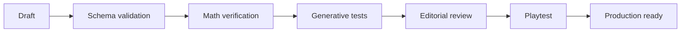

## Validación estática

- schema JSON/TS correcto;
- IDs únicos;
- interaction type existente;
- categorías válidas;
- unidad declarada;
- feedback definido;
- tags de año/dificultad.

## Validación matemática

Para cada instancia o rango:
- resolver mediante solver/evaluator interno;
- enumerar soluciones cuando sea viable;
- confirmar función objetivo;
- comprobar tolerancias;
- verificar redondeo;
- comprobar que distractores no son equivalentes.

## Validación procedural

Ejecutar N seeds por template. Valor inicial recomendado: 1.000 para templates simples; mayor si el espacio paramétrico es amplio.

Recolectar:
- min/max parámetros;
- cantidad de soluciones;
- dificultad estimada;
- tamaño de textos generados;
- distribución de opción óptima.

Evitar que la opción correcta caiga sistemáticamente en la misma posición.

## Validación editorial

- contexto entendible sin explicación externa;
- texto breve;
- objetivo concreto;
- unidades visibles;
- ningún dato esencial escondido accidentalmente;
- datos irrelevantes sólo cuando son intencionales;
- tono apropiado.

## Validación en UI

- cabe en 360 px;
- no overflow con números máximos;
- formato de moneda/unidades consistente;
- gráficos legibles;
- estados de error visibles.

## Playtest

> **Antes de la feria, esta etapa es prueba proxy.** La primera exposición a estudiantes del rango objetivo es la feria misma; la validación formal previa es la del Departamento de Matemática. Ver [ciclo de entrega real](00-product/real-delivery-lifecycle.md) y [gates docentes](06-delivery/teacher-gates.md). Las preguntas siguen sirviendo con un adulto que juegue sin asistencia verbal; lo que no se puede es llamar validado a lo que se observó así.

Preguntas al observador:
- ¿el jugador supo qué debía hacer?
- ¿qué cálculo/modelo usó?
- ¿entendió el feedback?
- ¿discutió la decisión?
- ¿pareció un ejercicio escolar tradicional?

Un challenge con matemática correcta pero gameplay pobre no está listo.

## Del desafío al catálogo

Este pipeline editorial valida **un desafío**. Desde STAGE-03, el pipeline de [ADR-020](03-architecture/adr/ADR-020-variant-generation-and-approved-catalog.md) agrega sobre la población concreta invariantes transversales, chequeos matemáticos por plantilla, fingerprint canónico, deduplicación, integridad del catálogo y auditoría estadística. Eso ya se aplica al catálogo aprobado de desarrollo vigente `grade-7-dev-3`, que además alimenta gameplay; conserva la población semántica de `dev-2` bajo la metadata de contenido actual.

La comparabilidad por bandas y la auditoría determinista del armado de runs ya están implementadas por STAGE-05: el reporte compone, valida, serializa y recompone poblaciones reales y sintéticas. Todavía faltan la calibración docente/empírica, el score competitivo y el congelamiento del catálogo oficial de feria; no se deducen de que una población sea matemáticamente válida ni de que su carga estructural sea pareja. Ver [validación y auditoría de variantes](04-quality/variant-validation-and-audit.md) y [ADR-022](03-architecture/adr/ADR-022-difficulty-model-and-run-composer.md).

---

# FILE: 04-quality/non-functional-requirements.md

# Requisitos no funcionales

## NFR-01 Compatibilidad
Objetivo: navegadores evergreen actuales en Android, iOS/iPadOS y desktop. Definir matriz exacta antes de feria.

## NFR-02 Responsive
- ancho mínimo objetivo 360 px;
- sin scroll horizontal involuntario;
- interacción no depende de hover.

## NFR-03 Performance
Objetivos iniciales:
- shell inicial usable rápidamente en conexión móvil razonable;
- bundle de gameplay controlado mediante lazy loading de minijuegos especiales;
- transiciones locales sin request.

Medir Core Web Vitals, no imponer números irreales antes de benchmark.

## NFR-04 Disponibilidad de gameplay
Una run iniciada debe continuar ante pérdida temporal de conectividad.

## NFR-05 Consistencia
Mismo seed + versiones + actions => mismo resultado.

## NFR-06 Accesibilidad
Objetivo WCAG 2.2 AA para la interfaz principal cuando sea razonable.

- contraste;
- teclado;
- focus;
- reduced motion;
- targets táctiles;
- labels/semántica;
- no depender sólo de color/audio.

## NFR-07 Seguridad
- HTTPS;
- secretos server-only;
- dependency scanning;
- rate limiting endpoints críticos;
- score server-authoritative.

## NFR-08 Privacidad
Data minimization por defecto.

## NFR-09 Observabilidad
Errores de API y divergencias de replay deben ser rastreables por request/run id sin PII innecesaria.

## NFR-10 Mantenibilidad
Game core con alta cobertura lógica y sin dependencia de framework UI.

## NFR-11 Contenido
Un nuevo desafío sobre interaction existente no debería exigir modificar routing/infraestructura.

---

# FILE: 04-quality/testing-strategy.md

# Estrategia de testing

## Gates ejecutables de la base técnica

La suite actual demuestra la infraestructura, no el comportamiento futuro del juego:

- `tests/unit/`: schemas de entorno y frontera pura inicial de `game`.
- `tests/component/`: render y semántica del shell de la base.
- `tests/integration/`: contrato de liveness de `/api/health` sin depender de una DB.
- `tests/property/`: combinaciones generadas de configuración pública/server-only.
- `tests/e2e/`: smoke del shell y health en Chromium desktop y viewport Pixel 7, incluida ausencia de errores de consola.

Vitest mide los archivos enumerados en `vitest.config.ts`, que incluyen todo `src/game`, con thresholds de 85 % para statements, lines y functions, y 75 % para branches. El porcentaje no es el objetivo: la prioridad de cobertura es transiciones, replay, generadores, evaluadores, matemática, scoring, selección de storylets y serialización.

El motor suma tres capas que no son unit tests convencionales:

- **property tests** (`tests/property/`): determinismo por seed, equivalencia entre run y replay, round-trip de serialización, rangos del RNG, selección ponderada que nunca elige peso cero, stats acotadas, score finito y no negativo, instancias generadas que cumplen sus invariantes, y estabilidad de evaluación;
- **golden replays** (`tests/unit/engine-golden.test.ts`): fijan la salida determinista exacta de seeds conocidas. Detectan un cambio accidental de protocolo; regenerarlos exige el bump de versión correspondiente;
- **simulación masiva** (`pnpm game:simulate`): miles de runs deterministas que buscan callejones sin salida, scores inválidos, divergencia de replay y deriva de snapshot. `pnpm verify` corre 200 runs; la simulación profunda queda local.

## Verificación local

`pnpm verify` es el gate integrado y exige la versión exacta de Node.js fijada en `.node-version` (`24.19.0` en esta baseline). Ejecuta en orden:

1. coherencia de Node/pnpm entre metadata, proceso y Docker;
2. validación del workspace agentic;
3. sincronización del master documental;
4. formato;
5. lint, incluidas fronteras de arquitectura;
6. TypeScript general y core sin DOM/Node;
7. unit, component, integration y property tests con cobertura;
8. validación de contenido (`pnpm game:validate-content`);
9. simulación determinista de 200 runs con verificación de replay y snapshot;
10. build de producción;
11. smoke E2E sobre el build, incluido el harness del motor.

Comandos más estrechos para iteración:

| Alcance | Comando |
|---|---|
| Coherencia del toolchain fijado | `pnpm toolchain:check` |
| Unit/component/integration/property una vez | `pnpm test` |
| Watch de Vitest | `pnpm test:watch` |
| Cobertura y thresholds | `pnpm test:coverage` |
| Build + Playwright | `pnpm test:e2e` |
| Playwright sobre un build preparado | `pnpm test:e2e:only` |
| Validación de contenido | `pnpm game:validate-content` |
| Simulación determinista | `pnpm game:simulate` |
| Simulación profunda de balance | `pnpm game:simulate:deep` |
| Tipos de app + frontera de core | `pnpm typecheck` |
| Tokens y contraste del sistema de diseño | `pnpm design:check` |
| Lint + imports/límites prohibidos | `pnpm lint` |

`pnpm release:check` es un gate adicional de seguridad: falla deliberadamente con Next.js `16.3.1` y debe pasar con `>=16.3.2` antes de publicar. No forma parte de `pnpm verify` porque hoy representa un bloqueo explícito, no una prueba verde de la base local.

## CI

GitHub Actions separa tres jobs:

- `Quality and build`: instalación congelada, toolchain, documentación/workspace, formato, lint/fronteras, typecheck, cobertura y build.
- `Browser smoke tests`: instalación congelada, Chromium con dependencias, build, E2E desktop/mobile y artefacto del reporte.
- `Production container smoke`: build del target standalone, ejecución no-root y smoke de `/` y `/api/health` con publicación sólo en loopback del runner.

CI no inicia Supabase ni el workflow Compose de desarrollo. Cuando un cambio toque esas superficies, ejecutar y reportar los gates manuales aplicables:

- DB: `pnpm db:start`, `pnpm db:reset`, `pnpm db:lint` y `pnpm db:types`;
- Docker desarrollo: `pnpm docker:up` y health check;
- Docker portable: además del job CI, `pnpm docker:build` y smoke local de `/api/health` cuando cambie el runtime;
- supply chain: `pnpm security:audit` y `pnpm release:check`.

Agregar gates de DB/Compose a CI cuando exista una señal útil y estable que justifique su costo; no declarar cobertura CI si sólo se verificó localmente.

## Pirámide objetivo para producto

### Unit tests

- evaluadores matemáticos;
- scoring y perfiles;
- reducers y transiciones;
- RNG helpers;
- schemas y reglas versionadas.

### Property-based / generative tests

Son críticos para contenido procedural. Deben demostrar que cada challenge generado es válido y solucionable cuando se promete, que las soluciones óptimas lo son, que no hay divisiones por cero, que unidades/rangos visibles son consistentes y que un replay reproduce el mismo estado.

### Integration tests

Cuando existan contratos y schema ejecutables:

- create run → persist;
- finish → replay → score;
- idempotencia;
- leaderboard sólo con runs completed/valid;
- RLS/grants y moderación.

### E2E Playwright

Expandir la suite al implementar producto: primera run, cada interaction type, refresh/reanudación, finish online, ranking, viewport mobile/desktop y accesibilidad básica por teclado.

Escaneo de accesibilidad con `@axe-core/playwright` sobre las pantallas del juego y sobre la vitrina del sistema de diseño. La aserción incluye el HTML del nodo: una falla de contraste que sólo diga «1 nodo» obliga a reproducirla a mano para saber cuál era.

Hay además dos verificaciones que sólo tienen sentido en un browser real y que no son de accesibilidad:

- **elegir no revela el resultado**: se eligen la primera y la última opción de un desafío real y se comparan los colores computados. Una de las dos resuelve el problema y la otra no, y eso no puede notarse antes de confirmar.
- **la paleta ajena no genera nada**: se inyecta un elemento con `bg-blue-500` y se verifica que quede sin fondo. Si esa protección se cayera, el sistema de diseño pasaría a ser una sugerencia.

Ambas apagan las transiciones antes de medir: con varios workers en paralelo, leer un color mientras todavía interpola devuelve un fotograma intermedio.

## Golden seeds y simulaciones

Mantener golden seeds con resultados esperados después de decidir algoritmo PRNG, contrato de consumo y ruleset. Antes de un release de contenido, ejecutar simulaciones suficientes para detectar dificultad extrema, eventos imposibles/repetidos y distribuciones anómalas de perfiles.

No crear goldens que congelen decisiones todavía abiertas. Las preguntas 24–27 definen los gates previos para score, PRNG, compatibilidad histórica y señales temporales.

## Sistema de diseño

`pnpm design:check` corre dentro de `pnpm verify` e incluye dos gates:

- **guardarraíl de tokens**: ninguna pantalla usa la paleta cruda, un color escrito a mano, un tamaño de texto o un radio fuera del sistema;
- **contraste medido**: cada color OKLCH se convierte a sRGB y se verifican las combinaciones que el producto pinta de verdad contra los mínimos de WCAG 2.2.

Los tests de componentes cubren la semántica de las primitivas —que un botón siga siendo un `<button>`, que un error siga asociado a su campo, que un estado no dependa del color— y nunca cadenas de clases. Un test que se rompe porque cambió un `px-4` estaba mirando el lugar equivocado.

## Visual regression y playtesting humano

La regresión visual es recomendable cuando existan componentes de challenges, especialmente gráficos y layouts móviles. No se agrega una herramienta antes de tener una superficie visual estable que lo justifique.

La automatización no valida diversión ni claridad. Cada batch relevante debe probarse con usuarios reales del rango objetivo cuando sea posible, registrando dónde preguntan qué hacer, releen, adivinan, comentan consecuencias o quieren repetir.

## Simulación de competencia

**No implementada.** Cuando exista score competitivo, la simulación masiva deja de alcanzar con jugadores aleatorios: hace falta generar perfiles sintéticos con estrategia, no clicks al azar.

Perfiles mínimos: alta precisión matemática, precisión media, precisión baja, optimizador, rápido y con errores, lento y preciso, orientado a decisiones de Equipo y orientado a Aura.

La pregunta que la simulación tiene que contestar: **¿el ranking ordena por lo que dijimos que iba a ordenar?** Si un perfil orientado a Aura le gana a uno de alta precisión matemática, la ponderación está mal, no el jugador.

Antes de la feria, el volumen sube de miles a decenas de miles de runs si el tiempo de ejecución lo permite, mirando distribución de score, resultados inalcanzables, estrategias dominantes, empates, repetición de variantes, distribución de dificultad, extremos de estado de carrera y alcanzabilidad del egreso.

La simulación captura lógica y equidad. **No captura diversión**, y un resultado sintético favorable no es validación con usuarios. Ver [ciclo de entrega real](00-product/real-delivery-lifecycle.md).

## Matriz de QA manual

La automatización no reemplaza abrir la aplicación en un teléfono. Antes de una revisión docente o de una feria, se recorre a mano:

**Viewports:** 360, 390 y 430 px; tablet en vertical; desktop centrado contra la hoja.

**Estados de juego:** tira de carrera vacía; primera aparición de Promedio; primera aparición de Equipo; Aura positiva y negativa; Estilo compacto y expandido; los cuatro resultados; opción elegida y todavía sin confirmar; hito de año; y —cuando existan— camino de recuperación, envío pendiente, personal best verificado y run completada que no supera la mejor.

**Condiciones adversas:** refresh en medio de la run; sin red antes y después de terminar; doble click en confirmar; respuesta lenta del leaderboard; nickname inválido o bloqueado; movimiento reducido; sólo teclado; zoom del navegador al 200 %.

## Variantes desplegadas

Los invariantes que una variante competitiva debe cumplir y la auditoría estadística del catálogo están en [validación y auditoría de variantes](04-quality/variant-validation-and-audit.md). Las preguntas de equidad del ranking, en [auditoría de equidad competitiva](04-quality/competition-fairness-audit.md).

---

# FILE: 04-quality/threat-model.md

# Threat model

## Activos

- integridad del leaderboard;
- disponibilidad durante feria;
- datos pseudónimos de jugadores;
- secretos de backend;
- integridad de contenido/reglas.

## Amenazas

### T1 Score falsificado
Actor modifica JS/request.

**Mitigación:** replay y scoring server-side.

### T2 Finish repetido
Intenta duplicar entradas.

**Mitigación:** endpoint idempotente; estado completed; constraints DB.

### T3 Creación masiva de runs
Spam/DoS ligero.

**Mitigación:** rate limits, quotas por evento/IP/session.

### T4 Nickname ofensivo
Contenido visible en proyector.

**Mitigación:** validación + filtro + ocultamiento manual inmediato.

### T5 Enumeración/lectura de runs
Acceso a datos no necesarios.

**Mitigación:** IDs no secuenciales, endpoints públicos sólo agregados/ranking, RLS/permisos.

### T6 Secret leakage
Clave Supabase elevada en bundle.

**Mitigación:** secret sólo env server; revisión de build/env.

### T7 Manipulación de elapsed time
Busca bonus velocidad.

**Mitigación:** limitar peso de tiempo; timestamps server; plausibility checks; no confiar exclusivamente en client timer.

### T8 Version skew
Cliente viejo finaliza contra reglas nuevas.

**Mitigación:** versiones en run; replay según versión; rechazar incompatibilidad explícitamente.

### T9 Wi-Fi caído
No es atacante, pero amenaza disponibilidad.

**Mitigación:** gameplay local-first y sync diferido.

## Riesgo aceptado

No se intenta impedir a un actor altamente motivado que automatice respuestas correctas leyendo el cliente. Para una feria escolar, el objetivo es evitar manipulación trivial del score y detectar outliers. Un anti-cheat invasivo sería desproporcionado.

## Amenazas que agrega la competencia con premios

Se suman a las anteriores cuando el ranking decide premios. Los controles se dimensionan al riesgo: esto es una feria escolar, no una plataforma de esports, pero el browser no puede decidir un premio.

### T10 Action log modificado
El cliente envía una secuencia de comandos que nunca ocurrió.

**Mitigación:** el replay determinista valida legalidad de cada comando contra el estado; una secuencia imposible se rechaza con un código de motivo que no filtra información sensible.

### T11 Descriptor de run manipulado
El cliente altera seed, versiones o asignación de variantes para recibir una run más fácil.

**Mitigación:** el descriptor lo emite y lo guarda el servidor; se valida la ligadura run–participante–evento; se rechaza cualquier asignación de variante desconocida.

### T12 Mezcla de versiones en una competencia
Un envío oficial llega con una tupla de versiones distinta de la congelada del evento.

**Mitigación:** el evento habilita explícitamente una única tupla y rechaza el resto. Es T8 visto desde la integridad del premio, no sólo desde la compatibilidad.

### T13 Reintento hasta recibir una run fácil
No es una intrusión: es un uso del reglamento que rompe la comparabilidad.

**Mitigación:** presupuesto de dificultad equiparado, pools de variantes emparejados y descriptor emitido por el servidor. Ver [auditoría de equidad competitiva](04-quality/competition-fairness-audit.md).

### T14 Consumo de recursos sin restricción
Ráfagas de emisión de runs, envíos gigantes o action logs desmedidos.

**Mitigación:** límites de tasa, tope de cantidad de comandos y de bytes del log, tamaño máximo de request y timeouts. Corresponde a OWASP API4; ver [base teórica](07-reference/research-basis.md).

### T15 Abuso de privilegio administrativo
Las acciones de moderación pueden cambiar lo que el público ve.

**Mitigación:** rol administrativo autenticado, mínimo privilegio y auditoría de actor, motivo y timestamp. **La obscuridad de una URL no es autorización.**

La arquitectura de estas mitigaciones está en [arquitectura objetivo del motor](03-architecture/target-engine-architecture.md); su operación, en [modo feria y congelamiento](05-operations/fair-mode-and-competition-freeze.md).

---

# FILE: 04-quality/variant-validation-and-audit.md

# Validación y auditoría de variantes

**Estado: implementado.** El contrato transversal de validador, el catálogo aprobado y la auditoría estadística existen desde [ADR-020](03-architecture/adr/ADR-020-variant-generation-and-approved-catalog.md). Lo que sigue abierto es el catálogo **oficial de la feria**, que es una decisión de evento y no de arquitectura.

Comandos: `pnpm game:variants check` reconstruye el catálogo comprometido y revalida cada entrada —forma parte de `pnpm verify`—; `pnpm game:variants audit` corre la barrida estadística grande; `pnpm game:variants build` reconstruye el artefacto.

[Validación de contenido](04-quality/content-validation.md) describe la revisión completa de un desafío. Este documento cubre dos niveles distintos: la confianza matemática, estructural y de reproducibilidad **ya implementada** para una población aprobada, y el hardening competitivo que todavía depende de dificultad, composición de runs y congelamiento de feria.

## Por qué

Una variante generada en vivo puede salir ambigua, imposible, trivial o con decimales impresentables. En modo práctica eso es un bug que se arregla mañana. En una competencia con premios, el jugador que la recibió ya perdió.

De ahí la regla: **en modo oficial no se juega una variante que nadie validó.**

## Invariantes genéricos

Toda variante desplegada tiene que satisfacer, de forma ejecutable:

- la generación termina;
- todos los valores son finitos y están en rango;
- existe al menos una respuesta o camino válido;
- no hay opciones duplicadas por accidente;
- el óptimo declarado existe;
- no hay empate no intencional en el óptimo, salvo que el diseño declare múltiples óptimos;
- todas las ramas de resultado son alcanzables como se pretendía;
- el cálculo del feedback coincide con el del evaluador;
- el enunciado público contiene toda la información necesaria;
- moneda, tiempo y unidades tienen formato válido;
- existe metadata de dificultad;
- existe fingerprint canónico.

Las validaciones aplicables ya se ejecutan sobre fuentes `authored` y `generated`: primero las genéricas del pipeline y después los chequeos matemáticos específicos de cada plantilla, con oráculos independientes donde es viable. Una plantilla futura no obtiene un oráculo automáticamente: debe declarar sus validadores junto con su fuente.

## Invariantes de legibilidad

Difíciles de automatizar por completo, imprescindibles igual:

- sin complejidad decimal accidental fuera de la banda buscada;
- sin valores absurdos para un contexto escolar;
- texto de opción dentro del límite práctico de 360 px;
- notación matemática representable de forma accesible.

Un desafío correcto que no entra en la pantalla es un desafío roto. Ver [NFR](04-quality/non-functional-requirements.md).

## Auditoría estadística del catálogo de desarrollo

**Implementada.** `pnpm game:variants audit` reporta por plantilla candidatos intentados, rechazos por código, duplicados por huella, problemas semánticos distintos y —cuando la interacción tiene opciones— distribución de la respuesta correcta. Los umbrales tienen razón documentada y distinguen errores bloqueantes de warnings sobre espacios finitos.

| Control | Estado |
|---|---|
| variantes aprobadas inválidas | **implementado**: exactamente 0; `check` revalida cada entrada |
| opciones duplicadas y parámetros no serializables | **implementado** como diagnósticos genéricos |
| huellas duplicadas | **implementado**: se reportan y deduplican intencionalmente |
| problemas distintos y tasa de rechazo | **implementado** por plantilla |
| posición y diversidad de respuesta correcta | **implementado** donde la interacción permite medirlas |
| distribución por bandas `CORE / STANDARD / STRETCH` | **TARGET** — STAGE-05 |
| comparabilidad de dificultad y score entre runs | **TARGET** — STAGE-05/STAGE-06 |

La barrida profunda de cierre de STAGE-03 recorrió **50.013 direcciones**, aprobó **30.671 problemas semánticos distintos**, rechazó **0** y produjo **0 errores**. La de cierre de STAGE-04, ya con siete plantillas, recorrió **36.064** y aprobó **7.954** con **0 rechazos**. Los warnings de duplicación de Mural, Stand y la salida más tarde describen espacios finitos que el pipeline deduplica; no significan contenido inválido ni exigen que 10.000 direcciones produzcan 10.000 problemas únicos. El caso más nítido es `g7.bus-latest-departure`: su espacio son exactamente 360 problemas —30 pares duración/demora × 4 horas de entrada × 3 márgenes—, los aprueba a los 360 y el 96 % de duplicados es la consecuencia aritmética de agotarlo. La evidencia canónica está en el [roadmap](06-delivery/implementation-sequence.md#stage-03-generación-validación-y-catálogo-de-variantes) y en [ADR-020](03-architecture/adr/ADR-020-variant-generation-and-approved-catalog.md).

Los umbrales son **heurísticas de revisión, no constantes universales**. Su función es levantar la mano; la aprobación sigue requiriendo que cada variante pase sus validaciones y que la integridad del artefacto sea reproducible.

## Auditoría Monte Carlo del armado de runs

**TARGET.** Simular muchos calendarios de run contra perfiles de jugador sintéticos y comparar el score esperado por calendario.

Pregunta que la auditoría tiene que poder responder: **¿cuánta varianza del score explica el sorteo de variantes, y no la habilidad?** Si el calendario explica una porción material, el equiparado por presupuesto de dificultad es débil y hay que corregirlo antes de la feria, no después.

Ver [dificultad y jugabilidad universal](01-game-design/difficulty-and-playability.md) y [auditoría de equidad competitiva](04-quality/competition-fairness-audit.md).

## Calibración posterior a la feria

Con datos reales se pueden estimar tasas de éxito, resultado parcial y tiempo por plantilla. Esos datos alimentan **versiones futuras**. No redefinen un score oficial ya otorgado, salvo que exista una política de regrade declarada por el evento. Ver [modo feria y congelamiento](05-operations/fair-mode-and-competition-freeze.md).

## Reproducibilidad y casos golden

El catálogo ya existe y usa direcciones semánticas, no posiciones ni seeds guardados como contenido. `pnpm game:variants check` lo reconstruye, compara el artefacto byte a byte, recalcula huellas y revalida sus entradas; los tests materializan una misma dirección en runs y slots distintos. Los golden replays siguen protegiendo el protocolo completo del motor.

Los casos por banda de dificultad y el catálogo oficial congelado siguen siendo futuros porque esas bandas todavía no existen.

Regla que ya está escrita y sigue valiendo: no crear goldens que congelen decisiones todavía abiertas.

---

# FILE: 05-operations/fair-mode-and-competition-freeze.md

# Modo feria, congelamiento y control de cambios

**Estado: mixto.** El congelamiento de versiones antes de una feria ya es política vigente ([runbook](05-operations/fair-runbook.md), [Definition of Done](06-delivery/definition-of-done.md)). La política de intentos, el comparador extendido y la política de empate exacto son **RECOMENDADOS / TEACHER GATE / OPEN**. Nada de esto está implementado.

Este documento cubre la operación de la competencia. Las reglas del score están en [score competitivo y ranking](01-game-design/competitive-scoring-and-ranking.md); la presentación y moderación del ranking, en [leaderboard y moderación](05-operations/leaderboard-and-moderation.md).

## Intentos

**Recomendación por defecto: intentos ilimitados, cuenta el mejor.** La configuración del evento tiene que poder cambiarlo a 1 o N intentos si los docentes lo deciden.

Acumular scores entre intentos convierte el ranking en una medida de tiempo disponible en la feria. El personal best premia la mejora y deja una sola run comparable por participante en el tablero.

La decisión final es **TEACHER GATE**.

## Configuración de evento

Un evento oficial declara, antes de abrir:

- período de vigencia y horario de cierre del servidor;
- tupla de versiones permitida;
- política de intentos;
- comparador de ranking y su versión;
- política de empate exacto;
- cantidad de premios;
- reglas de nickname y moderación;
- si se muestran métricas secundarias en público.

El ejemplo documental de esa forma está en [event-config.example.json](07-reference/event-config.example.json). Es un ejemplo: no es configuración de producción ni se importa desde runtime.

## Congelamiento antes del inicio oficial

Se congelan:

- `rulesetVersion`;
- `contentVersion`;
- `variantCatalogVersion` del catálogo oficial cuando el evento lo defina —el campo técnico ya existe, pero ninguno de los catálogos de desarrollo `grade-7-dev-1`, `dev-2` o `dev-3` es un freeze de feria—;
- `scoreVersion` cuando exista;
- el comparador del leaderboard;
- la política de intentos.

El registro del evento debe permitir **sólo** la tupla congelada. Una versión de desarrollo no puede convertirse en versión oficial por accidente; hoy eso ya está sostenido por el flag `production` del ruleset, que se niega a construir un ruleset oficial desde una política de desarrollo.

## Durante la competencia oficial

Permitido sin cambiar la versión de score:

- arreglo visual que no altere información ni forma de responder;
- arreglo de crash que preserve la semántica;
- escalado de infraestructura;
- acción de moderación.

Alto riesgo, **no se toca en vivo**:

- datos de desafíos;
- lógica de evaluación;
- coeficientes de score;
- factores de dificultad;
- opciones de respuesta;
- aleatorización.

Si un defecto de corrección obliga igual, se crea una versión nueva y se decide explícitamente si las runs previas se pueden reproducir y recalcular de forma consistente. **No se mezclan scores de versiones no comparables sin recomputación declarada.**

Corolario de disciplina: no se cambia una regla de score porque en la primera hora alguien dijo que estaba difícil. Eso se anota para la próxima versión. Ver [ciclo de entrega real](00-product/real-delivery-lifecycle.md).

## Cierre y premios

- El cierre es un timestamp del servidor, no del cliente.
- Hay que decidir antes si una run emitida antes del cierre puede enviarse después, y con cuánta tolerancia.
- El premio se resuelve **sólo sobre runs verificadas y sobre el mejor intento**.
- Se exporta una lista auditable de candidatos con: id interno de participante, nickname, id de la mejor run, desglose de score, tupla de versiones, estado de verificación y métricas de desempate.

Esa exportación existe para que el organizador confirme ganadores sin depender de la pantalla pública.

## Empate exacto

**OPEN.** Opciones razonables: puesto y premio compartidos, un desafío de desempate presencial, u otro criterio anunciado de antemano. Lo que no es opción es que un identificador interno decida un premio en silencio.

## Privacidad de menores en competencia

El ranking no necesita una cuenta escolar. Se prefiere nickname más identificador pseudónimo de participante, y sólo los datos de run necesarios para verificar.

Se evita, salvo que la institución lo requiera y lo gobierne: nombre completo, correo, teléfono, edad o fecha de nacimiento exactas y perfil personal innecesario.

Si hace falta identidad real para entregar un premio, se prefiere un mapeo externo controlado por el organizador o un código de evento, no publicar identidad dentro del juego.

Retención —cuánto viven los action logs, cuánto queda público el leaderboard, qué se archiva o anonimiza después de la feria— se define antes del lanzamiento y es **OPEN** ([pregunta 31](07-reference/open-questions.md)). Esto es guía de producto; la política legal aplicable la define la institución. Ver [seguridad y privacidad](03-architecture/security-privacy.md).

## Ensayo de carga y red

Una feria genera llegadas en ráfaga, Wi-Fi compartido y refrescos de ranking simultáneos. Escenarios a ensayar:

- ráfaga de emisión de runs;
- envíos finales concurrentes;
- polling del leaderboard mientras se verifican envíos;
- envíos duplicados o reintentados;
- latencia alta;
- caída transitoria de red durante una run;
- reinicio o degradación de base de datos y API;
- moderación bajo carga.

Propiedades que tienen que sostenerse: ningún resultado oficial duplicado; personal best correcto bajo concurrencia; las lecturas del ranking no bloquean la verificación; el cliente conserva su envío pendiente; el límite de tasa rechaza abuso sin frenar la ráfaga esperada.

Los números de concurrencia salen de la asistencia estimada por un factor de seguridad; no se inventa escala de nube sin una estimación del evento. La [pregunta 15](07-reference/open-questions.md) sigue abierta.

## Refresco del ranking

Tiempo real es opcional. Un polling cada pocos segundos suele ser más simple y más robusto a escala de feria. Se elige por carga real, no por novedad.

---

# FILE: 05-operations/fair-runbook.md

# Runbook de feria

## T-7 días

- Congelar ruleset/content de feria.
- Crear evento staging equivalente.
- Ejecutar simulation tests.
- Revisar nicknames/moderation controls.
- Probar QR en Android/iOS.
- Probar pantalla pública.
- Exportar/configurar fallback estático si corresponde.

## T-1 día

- Crear/confirmar evento producción.
- Verificar inicio/fin timezone correcto.
- Smoke test desde red externa.
- Confirmar DB/hosting health.
- Validar ranking vacío o baseline deseada.
- Preparar URLs/QR impresos.
- Cargar notebook de operación y proyector.

## Apertura

1. Verificar `/health` o smoke endpoints.
2. Ejecutar run completa real.
3. Confirmar que score aparece.
4. Confirmar moderación.
5. Abrir leaderboard en pantalla.

## Durante

Monitorear:
- starts/completions;
- errores;
- latencia;
- nicknames;
- conectividad local.

No hacer deploy funcional durante horario de máxima afluencia salvo incidente crítico.

## Si ranking falla

Gameplay continúa. Cambiar pantalla pública a estado “ranking temporalmente pausado”. No bloquear runs.

## Si backend falla

Activar procedimiento de `fallback-and-incident-plan.md`.

## Cierre

- cerrar nuevas runs si corresponde;
- congelar ranking;
- exportar resultados agregados;
- tomar backup/snapshot según plan;
- registrar incidentes y observaciones de playtest.

## Qué agrega una feria con premios

Cuando el ranking reparta premios, este runbook se ejecuta junto con [modo feria y congelamiento](05-operations/fair-mode-and-competition-freeze.md), que cubre política de intentos, congelamiento de versiones, control de cambios en vivo, cierre, empates, privacidad de menores y ensayo de carga y red.

Dos reglas que conviene tener a mano durante el evento:

- **No se cambia una regla de score en vivo.** Un arreglo visual o de crash que preserve la semántica se puede desplegar; datos de desafío, lógica de evaluación, coeficientes, factores de dificultad, opciones y aleatorización no. Si un defecto de corrección obliga igual, se crea una versión nueva y se decide explícitamente si las runs previas se recalculan.
- **Una anécdota de la primera hora no es evidencia.** Se anota para la próxima versión.

En «Cierre», la exportación agregada incluye además la lista auditable de candidatos a premio descripta en [leaderboard y moderación](05-operations/leaderboard-and-moderation.md).

---

# FILE: 05-operations/fallback-and-incident-plan.md

# Plan de fallback e incidentes

## Niveles

### Verde — Normal
Backend y ranking operativos.

### Amarillo — Servicios secundarios degradados
Ranking/analytics falla; gameplay continúa.

### Naranja — Finish indisponible
Runs continúan y quedan `pending_sync` localmente.

### Rojo — Backend/start indisponible
Usar modo local de emergencia si fue prehabilitado para la feria.

## Fallback local

Una build estable puede incluir un `offline-fair-config` preversionado con:
- seed/configuración;
- contenido;
- ruleset;
- score local marcado no oficial.

Cuando vuelve el servicio, sólo sincronizar si el backend puede validar esa configuración y el evento lo permite.

## Regla de integridad

No mezclar silenciosamente scores locales no verificables con ranking oficial. Si no pueden validarse, mostrarlos sólo en dispositivo o en ranking separado/manual.

## Recuperación

- identificar ventana afectada;
- revisar logs;
- validar duplicados/idempotencia;
- reintentar pending sync;
- invalidar sólo runs realmente corruptas.

## Comunicación UI

Mensajes cortos:
- “Podés seguir jugando. El ranking se actualizará cuando vuelva la conexión.”
- “Resultado guardado en este dispositivo.”

Evitar errores técnicos al usuario.

## Incidentes de integridad del ranking

Cuando el ranking reparta premios, se agrega una severidad por encima de las cuatro anteriores.

### P0 — Integridad del ranking comprometida

Por ejemplo: se aceptó un score arbitrario enviado por un cliente, se usó una versión de score equivocada o apareció un error sistemático de evaluación.

1. detener las escrituras al leaderboard oficial si hace falta;
2. preservar logs, descriptores de run y action logs **antes** de tocar nada;
3. mantener el juego disponible sólo en estado no oficial, y decirlo con claridad;
4. arreglar y versionar;
5. reproducir y recalcular las runs afectadas si es posible;
6. comunicar la decisión del organizador.

### P1 — Los envíos fallan pero el juego funciona

Encolar y reintentar de forma idempotente. **No pedirle al jugador que rejuegue de inmediato**: su run está guardada y el reintento no puede crear una entrada duplicada.

### P2 — Nickname inapropiado

Ocultar de la pantalla pública preservando la referencia interna de participante y de run, que es lo que después permite resolver el premio.

### Regla

No se cambia score ni contenido en medio del evento como arreglo improvisado. Se usa el procedimiento versionado de [modo feria y congelamiento](05-operations/fair-mode-and-competition-freeze.md).

---

# FILE: 05-operations/leaderboard-and-moderation.md

# Leaderboard y moderación

## Principios

- Competencia opcional, no condición para disfrutar el juego.
- Mostrar pseudónimos.
- Evitar exponer curso/edad individual junto al score.
- Sólo runs oficiales válidas.

## Regla de ranking inicial

Ordenar por `official_score DESC`.

Desempate sugerido:
1. mayor cantidad de soluciones óptimas;
2. mayor precisión;
3. menor tiempo sólo como último criterio.

Documentar y mantener estable durante evento.

## Best run

Por defecto mostrar mejor run por player/session para evitar que una misma persona ocupe múltiples posiciones. Configurable por evento.

## Moderación

Acciones:
- ocultar nickname manteniendo score como “Jugador oculto”;
- ocultar entrada completa;
- invalidar run por abuso;
- restaurar.

Toda acción administrativa debe auditar actor, timestamp y motivo.

## Pantalla pública

Mostrar:
- top 5/10;
- cantidad de runs;
- perfil más común opcional;
- actualización reciente.

No mostrar datos que permitan identificar inequívocamente a un menor.

## Dirección propuesta para el ranking de feria

**RECOMENDADA / TEACHER GATE.** Extiende —no reemplaza todavía— la regla de ranking de arriba. Las reglas de score están en [score competitivo y ranking](01-game-design/competitive-scoring-and-ranking.md); la operación y el congelamiento, en [modo feria y congelamiento](05-operations/fair-mode-and-competition-freeze.md).

### Mejor intento, no suma

El leaderboard guarda el **personal best verificado** de cada participante. Acumular intentos convertiría el ranking en una medida de tiempo disponible en la feria. La regla de «mejor run por player/session» de arriba ya apunta en esa dirección; lo que agrega la recomendación es que el mejor intento sea la definición explícita del score del participante, y que la política de intentos sea configuración del evento.

### Comparador extendido

Comparación lexicográfica versionada, guardando el desglose completo para auditoría:

`FairScore` → desempeño matemático → cantidad de óptimos → precisión → dificultad resuelta → tiempo activo.

La matemática decide antes que la velocidad. El desempate vigente —óptimos, precisión, tiempo— es el mismo criterio con menos escalones.

### Empate exacto

**OPEN.** No se agrega ruido aleatorio al score para forzar unicidad. La política —puesto compartido, premio compartido o desempate anunciado— la decide el organizador por escrito antes de la feria. Un identificador interno puede dar orden de visualización estable, pero no puede decidir un premio en silencio.

### Determinación de ganadores

El premio se resuelve **sólo sobre runs verificadas y sobre el mejor intento**. Antes de la feria, el organizador aprueba: cantidad de ganadores, política de intentos, comparador, política de empate, horario de cierre, tratamiento de envíos pendientes tardíos y reglas de nickname.

### Exportación auditable

Al cierre se exporta la lista de candidatos con id interno de participante, nickname, id de la mejor run, desglose de score, tupla de versiones, estado de verificación y métricas de desempate. Existe para que el organizador confirme ganadores sin depender de la pantalla pública.

### Qué no se publica

Ni dominio matemático oculto, ni métricas de razonamiento, ni identificadores personales. Las métricas secundarias en público sólo si los docentes las aprueban.

---

# FILE: 06-delivery/current-stage.md

# Etapa actual

Vista corta del estado de ejecución. El detalle completo, los contratos de todas las etapas y el protocolo de actualización están en el [roadmap de implementación](06-delivery/implementation-sequence.md), que es la autoridad.

---

## STAGE-06 — ScorePolicy competitiva

**Estado:** `READY`. Es la etapa actual; su dependencia está `DONE` y la implementación todavía no empezó.

## Por qué está activa

STAGE-05 está `DONE` con evidencia reforzada: el contenido de una partida se compone una sola vez, dentro de un presupuesto de dificultad, y el motor lo ejecuta sin volver a sortear nada. 20.000 seeds de la partida normal de 7.º producen 1.404 planes distintos con carga total idéntica; todos pasan validación independiente, round-trip y recomposición. Además, 10.000 carreras sintéticas prueban las seis etapas académicas y un test explícito prueba el plan válido de un solo `anchor`. Ver [ADR-022](03-architecture/adr/ADR-022-difficulty-model-and-run-composer.md).

Eso deja las runs comparables **antes** de puntuarlas, que era la condición para que un score competitivo signifique algo. Lo que falta ahora es qué vale lo que el jugador hizo con ese contenido: hoy el score es una política de desarrollo que el motor se niega a declarar oficial, sin componentes normalizados, sin topes y sin orden de desempate.

Hay una separación que esta etapa hereda y no debe romper: el `difficultyCost` con el que el compositor agenda **no es** el multiplicador de score. El primero necesita ser fuerte para poder equilibrar una run; el segundo, chico, para que el sorteo no le gane a la habilidad.

## Objetivo

Que la misma run con la misma policy dé siempre el mismo desglose y el mismo score.

## Scope IN

- `MathPerformance`, `TeamPerformance` y `AuraPerformance` normalizados.
- `ScorePolicy` versionada, con pesos, topes y orden de desempate declarados como configuración.
- `FairScore` y su desglose explicable.
- `scoreVersion` en la identidad de una run.
- Golden de score y reporte de distribución por perfil sintético.

## Scope OUT

**Nada de esto se implementa en esta etapa.**

- Ranking, endpoints, persistencia y fair mode → STAGE-09.
- Egreso, recuperaciones, contenido de 1.º–5.º → STAGE-07 y STAGE-08.
- Recalibrar bandas, costos o presupuestos de dificultad: son de STAGE-05 y su calibración final es del Teacher Gate.
- Contenido nuevo: plantillas, variantes curadas o años.
- Congelar el catálogo oficial de la feria: es una decisión de evento.
- Migrar la pantalla del juego a partidas compuestas: es una decisión de producto que tiene sentido con los años 1.º a 5.º.
- Cualquier cambio al sistema de diseño o a los tokens.

## Criterios de aceptación

- [ ] `ScorePolicy` está versionada y ninguna constante de peso vive dispersa en el código.
- [ ] La misma run con la misma policy produce exactamente el mismo desglose y el mismo score.
- [ ] El desglose explica componentes, multiplicadores, topes y versión de policy.
- [ ] En la policy candidata, la matemática domina el resultado, verificado por simulación.
- [ ] La contribución de Aura está acotada por un tope explícito.
- [ ] **Estilo no aporta score directo**, verificado por test.
- [ ] Promedio no se suma aparte de `MathPerformance` sin justificación escrita.
- [ ] Se pueden cargar y testear varias policies en paralelo.
- [ ] Golden tests de score fijan la salida de policies conocidas.
- [ ] La simulación reporta la distribución de score por perfil sintético.

## Lectura requerida antes de tocar código

1. `AGENTS.md` de la raíz.
2. Este documento y el [contrato de STAGE-06](06-delivery/implementation-sequence.md).
3. [Score competitivo y ranking](01-game-design/competitive-scoring-and-ranking.md) y [reglas, scoring y progresión](01-game-design/rules-scoring-and-progression.md).
4. [Fórmulas y algoritmos](07-reference/formulas-and-algorithms.md), [ejemplo de política](07-reference/score-policy.example.json) y [ejemplo de desglose](07-reference/score-breakdown.example.json).
5. [ADR-022](03-architecture/adr/ADR-022-difficulty-model-and-run-composer.md) — por qué el costo de scheduling y el multiplicador de score son dos números distintos.
6. [ADR-016](03-architecture/adr/ADR-016-career-player-model.md) — Promedio, Equipo, Aura y Estilo, y por qué Estilo no puntúa.
7. El código: `src/game/scoring/`, `src/game/profiles/`, `src/game/runs/state.ts`.

## Validación requerida

`pnpm test` · `pnpm typecheck` · `pnpm lint` · `pnpm game:simulate:deep` · `pnpm verify`.

Con Node `24.19.0`, la versión que `pnpm toolchain:check` exige exacta.

## Bloqueos

Ninguno. La etapa puede empezar.

## Decisiones abiertas o de Teacher Gate relevantes ahora

- `RECOMENDADA` (D-010): `FairScore` separado de las stats de carrera. `RECOMENDADA` (D-012): Estilo no puntúa directamente.
- `TEACHER GATE` (D-011, [preguntas 38 y 39](07-reference/open-questions.md)): pesos exactos y calibración de calidades.
- `TEACHER GATE` ([pregunta 44](07-reference/open-questions.md)): calibración de bandas y costos de dificultad. **No se cierra acá**, pero el multiplicador de score se discute contra ella.
- `LOCKED`: el navegador no es autoridad de score.

## Evidencia ya disponible

- Modelo de dificultad y compositor de runs — [ADR-022](03-architecture/adr/ADR-022-difficulty-model-and-run-composer.md); `difficultyCost` ya existe y está separado del multiplicador de score.
- Runs comparables antes de puntuar — `pnpm game:compose -- --content=grade-7 --runs=20000`: 20.000 planes válidos, 1.404 distintos, carga total idéntica; `--content=synthetic-six-stage --runs=10000`: 10.000 carreras de seis etapas, cero fallos.
- Catálogo aprobado dentro del juego — [ADR-021](03-architecture/adr/ADR-021-approved-catalog-in-play-and-teacher-demo.md); catálogos `grade-7-dev-1`, `dev-2` y `dev-3`, inmutables.
- Pipeline de variantes — [ADR-020](03-architecture/adr/ADR-020-variant-generation-and-approved-catalog.md).
- Modelo de contenido — [ADR-019](03-architecture/adr/ADR-019-scenario-family-template-variant.md).
- Career Model v2 — [ADR-016](03-architecture/adr/ADR-016-career-player-model.md).
- Sistema de diseño v0.2 — [ADR-017](03-architecture/adr/ADR-017-paper-visual-identity.md).
- Verificación autoritativa por replay — `src/server/game/validate-run.ts`, que ya recompone y valida el plan de una run compuesta.
- Estabilidad del juego — golden con mismo recorrido, score, perfil y comandos; runs simuladas sin hallazgos.
- Versionado — `ENGINE_VERSION 5.0.0`, `SNAPSHOT_SCHEMA_VERSION 5`, `ACTION_LOG_VERSION 3`, contenido `0.7.0-grade-7` y `0.5.0-dev`.

## Siguiente etapa

STAGE-04 ya está `DONE`; completar STAGE-06 habilita el **Teacher Gate 1**, el primer gate externo. En paralelo, STAGE-07 depende de ese gate.

## Última reconciliación

29 de agosto de 2026, al cerrar STAGE-05, con `pnpm verify` en verde.

---

# FILE: 06-delivery/definition-of-done.md

# Definition of Done

## Feature de gameplay

- comportamiento documentado;
- responsive mobile/desktop;
- keyboard path si aplica;
- tests del engine;
- analytics event si corresponde;
- feedback de error definido;
- no introduce dependencia de red dentro del loop sin ADR.

## Challenge/content

- schema válido;
- objetivo comprensible;
- solución verificada;
- unidades correctas;
- edge cases revisados;
- feedback explica consecuencia;
- dificultad etiquetada;
- math review;
- procedural invariants pasan;
- no contiene PII/marca/tema sensible no aprobado.

## API

- schema request/response;
- validación server-side;
- error codes;
- auth/session policy;
- rate limit considerado;
- integration test;
- logs sin secretos.

## DB migration

- migration versionada;
- rollback/forward plan;
- índices revisados;
- RLS/permisos revisados si aplica;
- staging ejecutado.

## Release feria

- CI verde;
- golden seeds verdes;
- E2E mobile/desktop;
- replay consistente;
- runbook probado;
- fallback probado;
- content/ruleset version congelados.

## Candidata a demo docente de 7.º

Cierra la Fase A del [ciclo de entrega real](00-product/real-delivery-lifecycle.md), antes del Teacher Gate 1.

- sistema de diseño aprobado aplicado al slice real;
- modelo de carrera migrado, sin rastros de las stats visibles viejas;
- variación determinista suficiente para que una segunda run se note;
- ninguna variante inválida en el pool de la demo;
- el recorrido completo de 7.º termina;
- el resumen de año funciona;
- la propuesta de score se puede demostrar;
- móvil, teclado y accesibilidad en verde;
- material de revisión docente listo, con la lista explícita de decisiones abiertas.

## Candidata a feria

Cierra la Fase F, antes del release público.

- todos los años completos;
- catálogo oficial de variantes versionado y validado;
- score de competencia aprobado y congelado;
- el servidor calcula el resultado oficial;
- leaderboard con personal best transaccionalmente correcto;
- el replay verifica los envíos oficiales;
- límites de tasa y herramientas de moderación existentes;
- hardening de carga, red y móvil aprobado;
- runbook y plan de fallback ensayados;
- versiones de contenido, reglas y score congeladas.

---

# FILE: 06-delivery/implementation-sequence.md

# Roadmap de implementación funcional

Este es el **roadmap canónico** de Egresado y el único documento que declara en qué etapa está el proyecto. No hay un segundo roadmap.

Reparto de responsabilidades, para que este documento no se convierta en un segundo blueprint:

```text
ADRs · Blueprint integrado · GDD · marco matemático     → QUÉ y POR QUÉ
Sistema de diseño v0.2                                  → EXPRESIÓN VISUAL
Código + tests                                          → REALIDAD IMPLEMENTADA
Este roadmap                                            → CUÁNDO, ESTADO, ALCANCE, DEPENDENCIAS, GATES
```

Si el roadmap y el código difieren, **el código gana** y el roadmap se corrige después de auditar.

- Vista corta y siempre en contexto: [etapa actual](06-delivery/current-stage.md).
- Fases de validación externa y congelamiento: [ciclo de entrega real](00-product/real-delivery-lifecycle.md).
- Qué se construye por capas de alcance: [alcance y roadmap](00-product/scope-and-roadmap.md) y [backlog](06-delivery/mvp-backlog.md).

**Última reconciliación contra el código:** 29 de agosto de 2026, al cerrar STAGE-05.

---

## Vocabulario de estado

| Estado | Significado |
|---|---|
| `NOT_STARTED` | no empezó y no está lista para empezar |
| `READY` | dependencias satisfechas; puede empezar ya |
| `IN_PROGRESS` | alguien la está ejecutando |
| `PARTIAL` | parte del alcance está terminada con evidencia y el resto sigue pendiente o bloqueado |
| `BLOCKED` | no puede avanzar por una dependencia o decisión externa |
| `TEACHER_GATE` | espera aprobación del Departamento de Matemática |
| `VALIDATING` | implementada, corriendo su validación requerida |
| `DONE` | criterios de aceptación satisfechos **con evidencia** |
| `DEFERRED` | fuera de alcance a propósito |
| `SUPERSEDED` | reemplazada por otra decisión o etapa |

Sólo una etapa debería estar `IN_PROGRESS` a la vez, salvo paralelismo documentado acá.

**`DONE` exige evidencia**, no intuición: un ADR, un módulo, un test, un reporte de simulación, un E2E o una salida de verificación. Código escrito no es `DONE`.

---

## Resumen de etapas

Tabla de navegación. Los contratos de cada etapa, más abajo, son la autoridad.

| Etapa | Nombre | Estado | Depende de | Gate |
|---|---|---|---|---|
| [STAGE-00](#stage-00-auditoría-funcional-ejecutable) | Auditoría funcional ejecutable | `DONE` | — | — |
| [STAGE-01](#stage-01-contratos-de-run-versiones-y-seeds) | Contratos de run, versiones y seeds | `DONE` | STAGE-00 | — |
| [STAGE-02](#stage-02-scenariofamily-challengetemplate-challengevariant) | ScenarioFamily → Template → Variant | `DONE` | STAGE-01 | — |
| [STAGE-03](#stage-03-generación-validación-y-catálogo-de-variantes) | Generación, validación y catálogo de variantes | `DONE` | STAGE-02 | — |
| [STAGE-04](#stage-04-enriquecimiento-de-7º-y-demo-candidate) | Enriquecimiento de 7.º y Demo Candidate | `DONE` | STAGE-02, STAGE-03 | — |
| [STAGE-05](#stage-05-modelo-de-dificultad-y-run-composer) | Modelo de dificultad y Run Composer | `DONE` | STAGE-03, STAGE-04 | — |
| [STAGE-06](#stage-06-scorepolicy-competitiva) | ScorePolicy competitiva | `READY` · actual | STAGE-05 | — |
| [GATE-TG1](#gate-tg1-teacher-gate-1) | **Teacher Gate 1** | `TEACHER_GATE` | STAGE-04, STAGE-06 | externo |
| [STAGE-07](#stage-07-invariante-de-egreso-fail-forward-y-recuperaciones) | Egreso, fail-forward y recuperaciones | `NOT_STARTED` | GATE-TG1 | — |
| [STAGE-08](#stage-08-contenido-incremental-de-1º-a-5º) | Contenido incremental 1.º → 5.º | `NOT_STARTED` | STAGE-07 | auditoría tras 1.º |
| [STAGE-09](#stage-09-fair-mode-servidor-autoritativo-y-ranking) | Fair mode, servidor autoritativo y ranking | `NOT_STARTED` | STAGE-06, STAGE-08 | — |
| [GATE-TG2](#gate-tg2-teacher-gate-2) | **Teacher Gate 2** | `TEACHER_GATE` | STAGE-09 | externo |
| [FREEZE](#freeze-congelamiento-de-competencia) | Congelamiento de competencia | `NOT_STARTED` | GATE-TG2 | — |
| [STAGE-10](#stage-10-production-hardening) | Production hardening | `NOT_STARTED` | FREEZE | go-live |
| [RELEASE](#release-y-post-feria) | Feria y post-feria | `NOT_STARTED` | STAGE-10 | — |

### Grafo de dependencias

La dirección no se negocia: **el ranking no se implementa antes de que exista una semántica de score reproducible.**

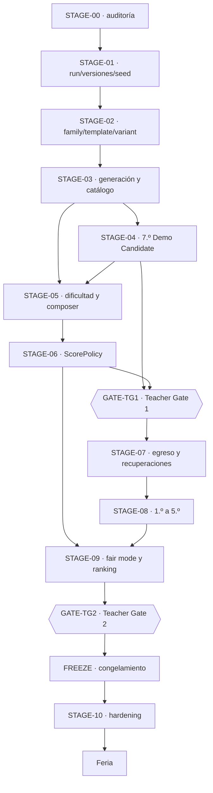

---

## Matriz de capacidades

Estado real contra el código al 29 de agosto de 2026, tras cerrar STAGE-05. Es la base de la que salen los estados de etapa de arriba, y lo que hay que reverificar antes de planificar.

| Capacidad | Estado | Evidencia | Etapa |
|---|---|---|---|
| Sistema de diseño v0.2 | `DONE` | [ADR-017](03-architecture/adr/ADR-017-paper-visual-identity.md), [docs](09-design-system/README.md), `pnpm design:check`, `tests/e2e/design-system.spec.ts` | previa |
| Blueprint integrado | `DONE` | [ADR-018](03-architecture/adr/ADR-018-blueprint-v0-2-decision-authority.md), [integración](07-reference/blueprint-v0.2-integration.md) | previa |
| Career Model v2 | `DONE` | [ADR-016](03-architecture/adr/ADR-016-career-player-model.md), `src/game/progression/career.ts`, `ENGINE_VERSION 2.0.0` | previa |
| Ledger de notas y Promedio derivado | `DONE` | `career.ts` → `grades: readonly number[]` | previa |
| `null` ≠ 0 en dimensiones de carrera | `DONE` | `career.ts`, `tests/component/grade-7-ui.test.tsx` | previa |
| Aura con signo, sin techo, introducida en juego | `DONE` | `career.ts`, `src/content/grade-7/challenges/may-25-act.ts`, E2E «el acto del 25 de Mayo introduce Aura» | STAGE-04 |
| Acto del 25 de Mayo | `DONE` | `may-25-act.ts`, `src/game/math/classification.ts`, `tests/unit/number-classification.test.ts`, 6 E2E, contenido `0.5.0-grade-7` | STAGE-04 |
| Mastery y flags ocultos | `DONE` | `career.ts` → `mastery`, `src/game/narrative/` | previa |
| Motor determinista separado de React | `DONE` | [ADR-011](03-architecture/adr/ADR-011-functional-core-transition-engine.md), `tests/unit/architecture-lint.test.ts`, `tests/unit/engine-modules.test.ts` | previa |
| Tripleta de versiones de run | `DONE` | `src/game/core/versioning.ts`, `assertCompatibleVersions` | STAGE-01 |
| Ownership de seed y substreams | `DONE` | [ADR-012](03-architecture/adr/ADR-012-seeded-prng-and-substreams.md), `src/game/random/seed.ts`, `tests/unit/rng-addressing.test.ts` | STAGE-01 |
| `RunDescriptor` inmutable, separado del estado mutable | `DONE` | `src/game/runs/state.ts` | STAGE-01 |
| Replay | `DONE` | `src/game/runs/replay.ts`, `tests/unit/engine-golden.test.ts`, `tests/property/engine.property.test.ts` | STAGE-01 |
| Snapshot versionado con rechazo explícito | `DONE` | `src/game/runs/snapshot.ts`, E2E de reanudación y de checkpoint corrupto | STAGE-01 |
| Separación outcome ≠ carrera ≠ score | `DONE` | `challenges/contracts.ts`, `progression/career.ts`, `scoring/policy.ts` | STAGE-01 |
| `scoreVersion` | `NOT_STARTED` | — | STAGE-06 |
| `variantCatalogVersion` | `DONE` | campo opcional del descriptor; viaja en snapshot y en action log, y `createRun` rechaza una run que declare otro catálogo del que se le da | STAGE-04 |
| `ScenarioFamily` | `DONE` | `src/game/challenges/content-model.ts`, [ADR-019](03-architecture/adr/ADR-019-scenario-family-template-variant.md), `tests/unit/content-model.test.ts` | STAGE-02 |
| `ChallengeTemplate` | `DONE` | una `ChallengeDefinition` declara familia, rol y variantes; `school-data` lo prueba en desarrollo y `bus` en producción | STAGE-02/STAGE-04 |
| `ChallengeVariant` | `DONE` | `ChallengeVariantRef` con dirección `familia/plantilla/variante`, round-trip y substream propio | STAGE-02 |
| `VariantGenerator` reutilizable | `DONE` | contrato de fuente de variantes + generadores por restricción en seis plantillas de producción | STAGE-03/STAGE-04 |
| `VariantValidator` transversal | `DONE` | genéricas + por plantilla con oráculos independientes, diagnósticos tipados | STAGE-03 |
| Catálogo de variantes aprobado y versionado | `DONE` | `ApprovedVariantCatalog`; `grade-7-dev-1`, `dev-2` y `dev-3` comprometidos, verificados en `pnpm verify`; las versiones publicadas son inmutables y `dev-3` es el vigente | STAGE-03/STAGE-05 |
| Catálogo aprobado consumido por la partida real | `DONE` | `ApprovedVariantLookup` en `EngineDependencies`, `tests/integration/grade-7-catalog-selection.test.ts` | STAGE-04 |
| Dos plantillas de producción en una familia | `DONE` | familia `bus` con `g7.bus-timing` y `g7.bus-latest-departure`, interacciones y razonamientos distintos | STAGE-04 |
| Plan de demo docente, distinto del plan de una run | `DONE` | `src/game/content/demo-plan.ts`, `src/content/grade-7/demo-plan.ts`, `tests/unit/demo-plan.test.ts` | STAGE-04 |
| Auditoría estadística de variantes | `DONE` | `pnpm game:variants audit`: 36.064 candidatos, 0 rechazos, 7.954 problemas distintos con siete plantillas | STAGE-03 |
| `DifficultyBand` (CORE/STANDARD/STRETCH) | `DONE` | `src/game/difficulty/cognitive.ts`; la banda se **deriva** de seis rasgos declarados por plantilla, no se elige | STAGE-05 |
| `difficultyCost` | `DONE` | `src/game/difficulty/cost-policy.ts`, política versionada en centésimas enteras, separada del multiplicador de score | STAGE-05 |
| `DifficultyBudget` | `DONE` | objetivo y tolerancia por etapa en la `CompositionPolicy`; el compositor sólo produce planes adentro y el validador lo recomprueba | STAGE-05 |
| `RunComposer` equiparado por presupuesto | `DONE` | `src/game/plan/composer.ts`: enumeración exhaustiva, restricciones duras como filtros y objetivos blandos lexicográficos; 20.000 seeds de 7.º dan 1.404 planes distintos con carga idéntica y validación independiente | STAGE-05 |
| Plan concreto ejecutado por el motor, sin recomposición en runtime | `DONE` | `RunState.plan`, `beginEvent` consume el beat pinchado, el snapshot lo persiste y el action log lleva su huella | STAGE-05 |
| Validador de plan independiente del compositor | `DONE` | `src/game/plan/plan-validator.ts`; recalcula rol, banda y costo en vez de creerle al plan | STAGE-05 |
| Verificación de composición en servidor | `DONE` para el alcance actual | `src/server/game/validate-run.ts` recompone, compara la huella y valida el plan | STAGE-05 |
| `ScorePolicy` versionada | `PARTIAL` | `src/game/scoring/policy.ts` y `development-policy.ts`, con `production: false` y `createRuleset` negándose a construir un ruleset oficial | STAGE-06 |
| `MathPerformance` · `TeamPerformance` · `AuraPerformance` | `NOT_STARTED` | — | STAGE-06 |
| `FairScore` y desglose competitivo | `NOT_STARTED` | — | STAGE-06 |
| Invariante de egreso | `NOT_STARTED` | `STAGE_ORDER` llega a `graduation`, pero no hay estado terminal `GRADUATED`; el único `run.graduated` vive en un fixture de test | STAGE-07 |
| Recuperaciones y fail-forward | `NOT_STARTED` | — | STAGE-07 |
| Contenido 1.º · 2.º · 3.º · 4.º · 5.º | `NOT_STARTED` | sólo existe `src/content/grade-7/` | STAGE-08 |
| Verificación autoritativa por replay | `PARTIAL` | `src/server/game/validate-run.ts` + `tests/integration/server-run-validation.test.ts`: replaya y **ignora el score enviado**. Faltan endpoints, sesión, rate limit y persistencia | STAGE-09 |
| Ranking con personal best | `NOT_STARTED` | — | STAGE-09 |
| Desempate lexicográfico | `NOT_STARTED` | — | STAGE-09 |
| Fair mode operativo | `PARTIAL` | `GameMode` ya declara `'fair'` como literal; no hay comportamiento asociado | STAGE-09 |
| Configuración de competencia | `NOT_STARTED` | — | FREEZE |
| Simulación determinista masiva | `DONE` para el alcance actual | `src/game/testing/simulation.ts`, `pnpm game:simulate`, 200 runs en `pnpm verify` | transversal |
| E2E y accesibilidad automatizada | `DONE` para el alcance actual | `tests/e2e/`, `@axe-core/playwright`, 68 tests | transversal |
| Catálogo de contenido separado del plan de la run | `DONE` | `ContentCatalog`, `RunPlan`, `tests/unit/content-model.test.ts` | STAGE-02 |
| Elegibilidad por etapa y roles de colocación | `DONE` | declarativos por plantilla; elegibilidad no contigua probada | STAGE-02 |
| Presupuesto de beats por año | `DONE` como contrato validable | `DEFAULT_STAGE_BEAT_BUDGET`, `validateStagePlan` | STAGE-02 |
| Production hardening | `NOT_STARTED` | — | STAGE-10 |

### Discrepancias registradas

- `STAGE_ORDER` incluye las siete etapas hasta `graduation`, pero sólo `grade-7` tiene contenido y ruleset. La estructura de progresión existe; **el egreso, no**. Documentación que hable de la carrera completa describe objetivo, no presente.
- El presupuesto de uno a dos beats por año era un contrato de **plan** que ningún código construía. STAGE-04 lo reconcilió por escrito con el `DemoPlan`; **STAGE-05 lo cerró por código**: existe una partida normal de 7.º de un anchor más un secundario, el motor la ejecuta y un validador independiente la comprueba. El arco de ocho eventos sigue existiendo y es el demo.
- `GameMode` admite `'fair'` y `'practice'`, y `DifficultySetting` admite `'adaptive'`. Son literales que el motor acepta; ninguno tiene todavía la semántica competitiva que el roadmap describe a partir de STAGE-06.
- **7.º tiene dos rulesets y juega de dos formas.** `grade-7` es el arco completo de ocho eventos, que es el demo docente; `grade-7-composed` es la partida normal de tres. La pantalla del juego sigue usando el primero: cuál corresponde a un jugador es una decisión de producto que tiene sentido cuando existan los años 1.º a 5.º. Ver [ADR-022](03-architecture/adr/ADR-022-difficulty-model-and-run-composer.md).

---

## Contratos de etapa

### STAGE-00 — Auditoría funcional ejecutable

- **Estado:** `DONE`
- **Depende de:** —
- **Desbloquea:** STAGE-01, STAGE-02

**Propósito.** Convertir el Blueprint integrado en un mapa técnico contra el código real, antes de cualquier cambio grande.

**Scope IN.** Auditar Blueprint, ADRs, motor, contenido, sistema de diseño, 7.º, tests, replay/snapshot y simulación; producir la matriz de capacidades y el grafo de dependencias reales.

**Scope OUT.** Cualquier refactor. Ranking. Motor de variantes. Scoring. Contenido de 1.º–5.º. Cambios de runtime de cualquier tipo.

**Lectura requerida.** [Integración del blueprint](07-reference/blueprint-v0.2-integration.md), [arquitectura objetivo del motor](03-architecture/target-engine-architecture.md), [game engine](03-architecture/game-engine.md).

**Criterios de aceptación.**

- [x] Código inspeccionado, no sólo documentación.
- [x] Cada capacidad tiene estado y evidencia.
- [x] Dependencias identificadas y ordenadas.
- [x] Presente y objetivo separados.
- [x] Teacher Gates identificados.
- [x] No se ejecutó ninguna megamigración.

**Validación requerida.** `node scripts/validate-agent-workspace.mjs`, `node scripts/sync-master-spec.mjs --check`.

**Evidencia.** La matriz de capacidades de este documento; [arquitectura objetivo del motor](03-architecture/target-engine-architecture.md) con 24 capacidades y su estado; [ADR-018](03-architecture/adr/ADR-018-blueprint-v0-2-decision-authority.md).

**Exit gate.** ¿Qué contratos del motor faltan realmente y cuáles ya existen? — **Contestado.**

---

### STAGE-01 — Contratos de run, versiones y seeds

- **Estado:** `DONE`
- **Depende de:** STAGE-00
- **Desbloquea:** STAGE-02

**Propósito.** Consolidar los contratos base sobre los que se apoyan variantes, replay, scoring y fair mode.

**Scope IN.** Versionado explícito de la run; ownership y derivación determinista de seeds; `RunDescriptor` inmutable separado del estado mutable; separación de tipos entre resultado de desafío, efectos de carrera y score.

**Scope OUT.** `FairScore`. Catálogo de variantes. Metadata de evento o competencia. Endpoints. Persistencia de runs.

**Lectura requerida.** [ADR-003](03-architecture/adr/ADR-003-deterministic-seeded-engine.md), [ADR-011](03-architecture/adr/ADR-011-functional-core-transition-engine.md), [ADR-012](03-architecture/adr/ADR-012-seeded-prng-and-substreams.md), [game engine](03-architecture/game-engine.md).

**Criterios de aceptación.**

- [x] La run identifica las versiones relevantes.
- [x] El ownership de seed tiene un contrato único.
- [x] La derivación determinista está probada.
- [x] `RunDescriptor` está separado del estado mutable.
- [x] El replay consume y valida la información necesaria.
- [x] El score competitivo no se mezcló con la carrera.
- [x] Snapshot, replay y tests pasan.

**Validación requerida.** `pnpm test`, `pnpm game:simulate`, `pnpm verify`.

**Evidencia.** `src/game/core/versioning.ts`; `src/game/random/seed.ts` y `rng.ts`; `RunDescriptor` en `src/game/runs/state.ts`; `src/game/runs/replay.ts` y `snapshot.ts`; `tests/unit/engine-golden.test.ts`, `tests/unit/rng-addressing.test.ts`, `tests/property/engine.property.test.ts`, `tests/integration/server-run-validation.test.ts`.

**Lo que no entró, y por qué.** Al cerrar STAGE-01, `scoreVersion` y `variantCatalogVersion` todavía no existían. Eran opcionales por diseño: agregar campos vacíos habría sido especulativo, porque nada podía poblarlos. `variantCatalogVersion` entró con STAGE-03; `scoreVersion` sigue reservado para [STAGE-06](#stage-06-scorepolicy-competitiva). No es trabajo huérfano.

**Riesgos.** Al agregar los dos ejes de versión faltantes hay que decidir si eso cambia la compatibilidad de replay. La regla vigente es igualdad exacta, no rangos semver.

**Decisiones.** `LOCKED`: determinismo por seed + versiones + comandos. `LOCKED`: el navegador no es autoridad de score.

**Exit gate.** ¿Puedo reconstruir con qué reglas y con qué seed existió esta run? — **Sí**, probado por golden replays y por la validación autoritativa en servidor.

---

### STAGE-02 — ScenarioFamily → ChallengeTemplate → ChallengeVariant

- **Estado:** `DONE`
- **Depende de:** STAGE-01 (`DONE`)
- **Desbloquea:** STAGE-03 y STAGE-04 (ambas `DONE`)

**Punto de partida y propósito.** Al abrir STAGE-02, cada desafío era una definición monolítica con un array interno de parámetros: alcanzaba para que cambiaran los números, no la pregunta. La etapa debía permitir varias estructuras cognitivas por escenario y variantes reproducibles de primera clase.

**Scope IN.**

- Tipos `ScenarioFamily`, `ChallengeTemplate` y `ChallengeVariant`, con identidad estable y serializable.
- Una plantilla representa una **estructura de razonamiento**, no otro juego de números.
- La variante lleva su dirección determinista (familia, plantilla, seed de variante, parámetros) y se puede reconstruir desde ella.
- Extender `ChallengeInstanceRef` para que direccione familia y plantilla además de la definición.
- Estrategia de migración del contenido existente, escrita antes de migrarlo.
- Tests de identidad, versionado y serialización.

**Scope OUT.** **Crítico para no desbordar el alcance.**

- No implementar generadores por restricción reutilizables — es [STAGE-03](#stage-03-generación-validación-y-catálogo-de-variantes).
- No construir el catálogo desplegado ni `variantCatalogVersion`.
- No enriquecer todavía 7.º con nuevas estructuras cognitivas ni decidir la ubicación final de su contenido — es [STAGE-04](#stage-04-enriquecimiento-de-7º-y-demo-candidate). La migración estructural de los seis desafíos sí quedó completada al cerrar esta etapa; ver [la migración](03-architecture/content-model-migration.md).
- No tocar bandas de dificultad, `difficultyCost` ni presupuesto.
- No tocar scoring, `FairScore` ni ranking.
- No agregar contenido de 1.º–5.º.
- No modificar el sistema de diseño ni introducir estilos nuevos.
- No reescribir la matemática de los desafíos existentes.

**Lectura requerida.** [Familias, plantillas y variantes](01-game-design/challenge-families-and-variants.md) · [sistema de desafíos](01-game-design/challenge-system.md) · [game engine](03-architecture/game-engine.md) · [arquitectura objetivo del motor](03-architecture/target-engine-architecture.md) · [ADR-007](03-architecture/adr/ADR-007-content-as-data.md) · [ADR-012](03-architecture/adr/ADR-012-seeded-prng-and-substreams.md) · [guía de autoría](01-game-design/content-authoring-guide.md).

**Entregables.** Tipos y contratos en `src/game/challenges/`; adaptación del registro; documento de estrategia de migración; tests unitarios y de propiedad; ADR si la dirección de dependencias del motor cambia.

**Criterios de aceptación.**

- [x] `ScenarioFamily`, `ChallengeTemplate` y `ChallengeVariant` están tipados y el catálogo los expone sin `any` ni casts.
- [x] Dos plantillas de la misma familia coexisten **sin duplicar la lógica completa del desafío** — `school-data` aloja `dev.recycling-chart` y `dev.survey-confidence`.
- [x] Una variante se serializa y se reconstruye idéntica desde su dirección determinista.
- [x] La derivación de seed de variante es estable y está cubierta por property tests.
- [x] El motor sigue sin depender de React, y ahora también se prueba que no puede importar contenido concreto.
- [x] Existe un documento de estrategia de migración del contenido legacy.
- [x] Los seis desafíos de 7.º siguen jugándose igual: las runs golden reproducen el mismo recorrido, score, perfil y cantidad de comandos, con el bump de versión documentado.

Criterios que la etapa sumó sobre el contrato original:

- [x] El catálogo de contenido disponible está separado del plan de la run, y agregar contenido al catálogo no lo agrega a un plan existente.
- [x] La elegibilidad por etapa es declarativa y admite conjuntos no contiguos; una colocación inválida se rechaza.
- [x] Existen los cuatro roles de colocación, con un rol desconocido rechazado.
- [x] El presupuesto por año es de uno a dos beats ordinarios con exactamente un `anchor`; el checkpoint gasta uno, el special también y la recuperación queda afuera.
- [x] Contenido nuevo —familia, plantilla y variante— se registra y se materializa **sin tocar el motor**.
- [x] La identidad de una variante no depende del orden del catálogo.

**Validación requerida.** `pnpm test`, `pnpm typecheck`, `pnpm lint`, `pnpm game:validate-content`, `pnpm game:simulate -- --runs=400 --verify=10`, `pnpm verify`.

**Riesgos.**

- Cambiar la dirección de instancia puede alterar el consumo de RNG y romper golden replays. Si el resultado cambia, es un bump de `ENGINE_VERSION`, no un regenerado silencioso de goldens.
- Confundir la migración estructural ya completada con un inventario definitivo. STAGE-04 puede enriquecer la demo, pero la ubicación y el destino final de los seis escenarios siguen abiertos.

**Decisiones.** `RECOMENDADA` (D-006): la jerarquía family/template/variant es dirección de arquitectura, no contrato cerrado — se implementa de forma que se pueda ajustar. `LOCKED` (D-007): variantes deterministas por seed. `OPEN` ([pregunta 46](07-reference/open-questions.md)): profundidad del catálogo de contenido disponible por etapa.

**Evidencia de completitud.**

| Qué | Dónde |
|---|---|
| Decisión | [ADR-019](03-architecture/adr/ADR-019-scenario-family-template-variant.md) |
| Modelo de contenido | `src/game/challenges/content-model.ts` |
| Catálogo de contenido | `src/game/challenges/content-catalog.ts` |
| Contratos de plantilla e instancia | `src/game/challenges/contracts.ts` |
| Plan de run y su validación | `src/game/content/run-plan.ts`, `src/game/content/issues.ts` |
| Direccionamiento en la transición | `src/game/runs/transition.ts` |
| Códec de snapshot v3 | `src/game/runs/snapshot.ts` |
| Contenido migrado | `src/content/grade-7/families.ts` y sus seis desafíos; `src/game/testing/fixtures/families.ts` y sus ocho plantillas |
| Helper de materialización | `src/game/testing/materialize.ts` |
| Tests del modelo | `tests/unit/content-model.test.ts` (34), `tests/property/content-model.property.test.ts` (8) |
| Frontera motor/contenido | `tests/unit/architecture-lint.test.ts` |
| Equivalencia semántica | `tests/unit/engine-golden.test.ts`: mismo recorrido, score, perfil y comandos; sólo cambió el hash |
| Versionado | `ENGINE_VERSION 3.0.0`, `SNAPSHOT_SCHEMA_VERSION 3`, contenido `0.3.0-dev` y `0.4.0-grade-7`; ruleset **sin cambios** |
| Migración documentada | [migración del modelo de contenido](03-architecture/content-model-migration.md) |
| Validación | `pnpm verify` completo; 543 tests y 68 E2E; contenido de ambos sets con 0 errores y 0 warnings; 5000 runs simuladas con 0 hallazgos |

**Lo que no entró, y por qué.** No se dividió ninguna familia de producción en varias plantillas, no se renombró ningún id de contenido y no se movió contenido de año: son decisiones de ubicación, y el inventario final sigue **OPEN**. La prueba de «dos plantillas en una familia» se hizo con contenido de desarrollo para no crear gameplay de producción fuera de alcance.

**Exit gate.** ¿Pueden existir dos variantes de la misma plantilla sin duplicar toda la lógica del desafío? — **Sí**, y también dos plantillas en una familia, con el catálogo separado del plan y sin que el motor conozca ningún id de contenido.

---

### STAGE-03 — Generación, validación y catálogo de variantes

- **Estado:** `DONE`
- **Depende de:** STAGE-02 (`DONE`)
- **Desbloquea:** STAGE-04 (`DONE`) y STAGE-05 (`READY`)

**Punto de partida.** STAGE-02 dejó el vocabulario: una variante ya tenía dirección estable, substream propio y lugar en un catálogo y en un plan. Al abrir STAGE-03 faltaba producirlas en cantidad, validarlas como población y aprobar las que pudieran entrar a una competencia.

**Propósito.** Diversidad reproducible, controlada y auditable. **Variabilidad no es aleatoriedad libre.**

**Scope IN.** Generación por restricción, incluida generación inversa donde convenga; `VariantValidator` con invariantes genéricos y por plantilla; tooling offline `generador → N seeds candidatas → validación → análisis estadístico → catálogo aprobado`; catálogo versionado y `variantCatalogVersion` en la identidad de la run; selección determinista de variantes aprobadas por id/seed.

**Scope OUT.** Bandas y presupuesto de dificultad. Score competitivo. Ranking. Contenido de años nuevos. Endpoints de servidor.

**Lectura requerida.** [Familias, plantillas y variantes](01-game-design/challenge-families-and-variants.md) · [validación y auditoría de variantes](04-quality/variant-validation-and-audit.md) · [validación de contenido](04-quality/content-validation.md) · [base teórica](07-reference/research-basis.md).

**Criterios de aceptación.**

- [x] Los generadores son deterministas y no consultan ninguna fuente ambiente; el substream sale de un seed de contenido fijo, no del seed de la run.
- [x] Los validadores rechazan efectivamente casos inválidos, con tests que lo demuestran para cada categoría de diagnóstico.
- [x] Miles de direcciones por plantilla: **10.000 por plantilla generada, 50.013 en total**.
- [x] El tooling reporta fallas de forma legible por máquina, con códigos de diagnóstico estables.
- [x] **Cero variantes inválidas en el catálogo aprobado**, verificado entrada por entrada.
- [x] Cero opciones duplicadas: es una validación genérica y hay test.
- [x] El catálogo es reproducible y versionado; dos builds dan el mismo archivo byte a byte, y reordenar el registro de contenido da el mismo catálogo.
- [x] La auditoría reporta sesgo de posición de la respuesta, problemas distintos, duplicados por huella y tasa de rechazo, con umbrales documentados.
- [x] La resolución del catálogo devuelve sólo variantes aprobadas, y una aprobada se materializa, se juega y se reproduce.

Criterios que la etapa sumó sobre el contrato original:

- [x] Toda plantilla de producción participa del pipeline con una estrategia deliberada: cinco generadas, una autorada con su razón escrita.
- [x] Las variantes autoradas pasan por las mismas validaciones, huella y deduplicación que las generadas.
- [x] La huella es semántica: dos direcciones que producen el mismo problema colisionan y se deduplican.
- [x] Una variante es el mismo problema en toda partida, y una plantilla que dependa de la run se rechaza con `address-not-deterministic`.
- [x] Una plantilla futura suma generador, validadores y metadata **sin tocar el pipeline**.
- [x] El juego actual no cambió: mismo recorrido golden, misma distribución en 5.000 runs simuladas.

**Validación requerida.** `pnpm game:validate-content` con conteo alto de seeds, `pnpm test`, el nuevo comando de auditoría de catálogo, `pnpm verify`.

**Riesgos.** El costo de generación puede volver lento el arranque si el catálogo se construye en runtime; es un job de build, y el artefacto está comprometido. Un fingerprint mal definido esconde variantes equivalentes.

**Decisiones.** `RECOMENDADA` (D-008): catálogo prevalidado para competencia — **implementado**. `LOCKED` (D-007): seeds deterministas.

**Evidencia de completitud.**

| Qué | Dónde |
|---|---|
| Decisión | [ADR-020](03-architecture/adr/ADR-020-variant-generation-and-approved-catalog.md) |
| Fuente de variantes y generadores | `src/game/challenges/variant-source.ts` |
| Validación y diagnósticos | `src/game/challenges/variant-validation.ts` |
| SHA-256 portable | `src/game/content/hash.ts`, verificado contra FIPS 180-4 y `node:crypto` |
| Catálogo aprobado, canonización e integridad | `src/game/content/variant-catalog.ts` |
| Pipeline | `src/game/content/variant-pipeline.ts` |
| Auditoría estadística y umbrales | `src/game/content/variant-audit.ts` |
| Generadores y oráculos por plantilla | `src/content/grade-7/challenges/*.variants.ts` |
| Artefacto versionado | `grade-7-dev-1`, 133 variantes; hoy en `src/content/grade-7/variant-catalog.grade-7-dev-1.json`, renombrado al publicar la segunda versión y **sin cambios en su contenido** |
| Tooling | `pnpm game:variants build \| check \| audit`; `check` dentro de `pnpm verify` |
| Tests | `tests/unit/variant-pipeline.test.ts` (40), `tests/property/variant-generation.property.test.ts` (16) |
| Barrida profunda | 50.013 candidatos, **0 rechazos**, 30.671 problemas distintos, 0 errores |
| Estabilidad del juego | golden con mismo recorrido, score, perfil y comandos; 5.000 runs simuladas con 0 hallazgos y la misma distribución |
| Versionado | `ENGINE_VERSION 4.0.0`, `SNAPSHOT_SCHEMA_VERSION 4`, contenido `0.4.0-dev` y `0.5.0-grade-7`; **ruleset sin cambios**, huella idéntica |

**Lo que no entró, y por qué.** El catálogo de la feria **no** se congeló: `grade-7-dev-1` es de desarrollo y decir lo contrario sería inventar una decisión de evento. No se creó ninguna plantilla nueva de producción, no se movió contenido de año y el inventario de escenarios sigue `OPEN`. El catálogo aprobado todavía no alimenta la selección de una run: eso es STAGE-04 y STAGE-05.

**Exit gate.** ¿Se puede generar, validar y reproducir un conjunto grande de variantes sin depender de aleatoriedad ambiente? — **Sí**: 50.013 candidatos deterministas, cero rechazos, catálogo versionado reproducible byte a byte y una variante aprobada que se juega y se reproduce.

---

### STAGE-04 — Enriquecimiento de 7.º y Demo Candidate

- **Estado:** `DONE`
- **Depende de:** STAGE-02 (`DONE`), STAGE-03 (`DONE`)
- **Desbloquea:** GATE-TG1 y, en paralelo, STAGE-05 (ahora activa)

**Punto de partida.** STAGE-03 dejó un pipeline completo y un catálogo de 133 variantes verificadas **que nadie jugaba**. La partida seguía sacando contenido de las dos o tres variantes curadas de cada plantilla, y en producción cada familia tenía exactamente una plantilla, así que agrupar por familia todavía no había demostrado nada.

**Propósito.** Enriquecer 7.º con variación estructural real y convertir el slice amplio existente en una Demo Candidate representativa, usando la arquitectura ya migrada y el pipeline de STAGE-03 antes de producir los demás años.

**Scope IN.**

- Conectar el catálogo aprobado con una selección determinista de contenido jugable de 7.º, sin construir el Run Composer de STAGE-05.
- Agregar plantillas sólo donde aporten una estructura de razonamiento genuinamente distinta; cambiar números u orden de opciones no alcanza.
- Usar el pipeline de STAGE-03 en contenido jugable real.
- Comprobar que las plantillas existentes siguen funcionando, preservando su intención matemática salvo cambio deliberado y documentado.
- Definir qué contenido integra la **Teacher Demo Candidate** y documentar esa selección sin convertirla en el plan normal de producción.
- Reconciliar la cobertura amplia del slice histórico con el presupuesto normal de uno a dos beats por etapa fijado por [ADR-019](03-architecture/adr/ADR-019-scenario-family-template-variant.md).
- Validar pacing, variedad de gameplay e interacciones, y exposición de Promedio, Equipo, Aura y Estilo para Teacher Gate 1.
- Toda UI nueva consume el sistema de diseño v0.2.

La **Teacher Demo Candidate** puede mostrar más mecánicas que un segmento normal para que los docentes evalúen el producto. El **plan normal de una run** mantiene uno o dos beats ordinarios por etapa. Son configuraciones de selección distintas sobre el mismo modelo, no motores distintos.

**Scope OUT.** Repetir la migración estructural ya completada. Decidir el inventario final o mover escenarios de año. Run Composer y balance final de dificultad. Reescribir la matemática existente. Rediseño visual. Contenido de 1.º–5.º. Score competitivo. Ranking. Recuperaciones.

**Lectura requerida.** [ADR-019](03-architecture/adr/ADR-019-scenario-family-template-variant.md) · [ADR-020](03-architecture/adr/ADR-020-variant-generation-and-approved-catalog.md) · [ADR-021](03-architecture/adr/ADR-021-approved-catalog-in-play-and-teacher-demo.md) · [migración del modelo de contenido](03-architecture/content-model-migration.md) · [Vertical slice de 7.º](06-delivery/vertical-slice-grade-7.md) · [catálogo de desafíos](01-game-design/challenge-catalog.md) · [familias y variantes](01-game-design/challenge-families-and-variants.md) · [sistema de diseño](09-design-system/README.md) · [migración visual de 7.º](09-design-system/migration-7-grade.md).

**Criterios de aceptación.**

- [x] Los desafíos existentes están migrados estructuralmente a familia/plantilla/variante, con equivalencia semántica documentada.
- [x] La diversidad aprobada llega al gameplay mediante una selección determinista, y la run registra `variantCatalogVersion` cuando realmente consume ese catálogo.
- [x] La demo incorpora variación cognitiva real donde aporta; no se presenta un reordenamiento o cambio numérico como plantilla nueva.
- [x] El pipeline de STAGE-03 se usa en contenido real donde corresponde, sin obligar a que todo contenido curado sea procedural.
- [x] La selección de la Teacher Demo Candidate está documentada y distinguida del plan normal de uno a dos beats por etapa.
- [x] Pacing, variedad de gameplay e interacciones y exposición del Career Model están validados para Teacher Gate 1.
- [x] Matemática previa preservada; ningún desafío existente cambió una cuenta.
- [x] El acto del 25 de Mayo está en el flujo real de la partida.
- [x] Aura pasa de `null` a un valor significativo durante la run.
- [x] Aura no se dibuja antes de ser introducida.
- [x] Clasificación y F1 probados, incluidos los tres casos de denominador cero.
- [x] Jugable con teclado y en 360/390/430 px.
- [x] El motor evalúa la matemática; React no.
- [x] Replay, snapshot y simulación correctos.
- [x] El cierre de año sigue funcionando.

Criterios que la etapa sumó sobre el contrato original:

- [x] El puerto que lleva el catálogo a la selección es angosto: `src/game/challenges` sigue sin poder importar `src/game/content`, y no se debilitó la regla de capas.
- [x] Una versión publicada del catálogo es inmutable: `grade-7-dev-1` no se regeneró. `grade-7-dev-2` conserva las huellas de las plantillas cuyo contrato no cambió, agrega `g7.bus-latest-departure` y materializa de nuevo las direcciones generadas del acto bajo el generador versión `2`.
- [x] El demo docente **no** es un plan de run válido, y hay un test que lo corre por `validateStagePlan` y comprueba que lo rechaza.
- [x] El presupuesto de beats de una run no se aflojó, ni se volvió configurable para el demo.
- [x] El artefacto de catálogo se parsea en la frontera, no se castea.
- [x] Poner el catálogo a jugar encontró un defecto de contenido real —una estrategia degenerada que pasaba por buena en algunas coreografías generadas del acto— y quedó cerrado en el generador, en el validador y en un test.

**Validación requerida.** `pnpm verify` completo, incluidos `pnpm test:e2e:only` y `pnpm design:check`.

**Evidencia de completitud.**

| Qué | Dónde |
|---|---|
| Decisión | [ADR-021](03-architecture/adr/ADR-021-approved-catalog-in-play-and-teacher-demo.md) |
| Puerto del catálogo hacia la selección | `ApprovedVariantLookup` en `src/game/challenges/variant-source.ts`; adaptador en `src/game/content/variant-catalog.ts` |
| Selección determinista dentro de lo aprobado | `src/game/runs/transition.ts`, substream `variant-pick` |
| Guard de versión de catálogo | `createRun` rechaza un descriptor que declare otro catálogo |
| `variantCatalogVersion` en el action log | `src/game/runs/action-log.ts`, `ACTION_LOG_VERSION 2` — corrige un defecto real de reproducción |
| Segunda plantilla de la familia colectivo | `src/content/grade-7/challenges/bus-latest-departure.ts` y `.variants.ts`, interacción `numeric-input` |
| Catálogos publicados e inmutables | `variant-catalog.grade-7-dev-1.json` (133) y `grade-7-dev-2.json` (159), indexados en `src/content/grade-7/variant-catalogs.ts` |
| Plan de demo docente | `src/game/content/demo-plan.ts` (tipo y validación) y `src/content/grade-7/demo-plan.ts` (las siete plantillas con su propósito) |
| Tests | `tests/integration/grade-7-catalog-selection.test.ts` (9), `tests/unit/demo-plan.test.ts` (14), tres tests de pantalla deterministas para las dos plantillas del colectivo |
| Barrida profunda | 10.000 candidatos por plantilla generada; 36.064 en total, **0 rechazos**, 7.954 problemas distintos |
| Defecto de contenido encontrado y cerrado | el acto admitía coreografías donde marcar la grilla entera zafaba; generador reconstruido desde el techo del acto, validador independiente y test sobre las 27 aprobadas |
| Estabilidad del juego | golden con mismo recorrido, score, perfil y comandos; simulación sin hallazgos |
| Versionado | `ENGINE_VERSION 4.1.0`, `ACTION_LOG_VERSION 2`, contenido `0.6.0-grade-7`; **ruleset sin cambios**, huella idéntica en `d3319440` |

**Matriz de cobertura del demo docente.**

| Plantilla | Familia | Interacción | Dominio | Rol | Carrera | Fuente | Qué demuestra |
|---|---|---|---|---|---|---|---|
| `g7.bus-timing` | `bus` | timeline | tiempo y tasas | `anchor` | Estilo | generada | la situación del año: elegir entre salidas |
| `g7.bus-latest-departure` | `bus` | numeric-input | tiempo y tasas · porcentajes | `anchor` | Estilo | generada | **la misma situación al revés**: producir el número |
| `g7.may-25-act` | `may-25` | number-grid | patrones y relaciones | `special` | Aura, Estilo | generada | matemática en público; el único evento que mueve Aura |
| `g7.mural-paint` | `mural` | decision-card | espacio y forma | `checkpoint` | Promedio, Estilo | generada | la evaluación del trimestre: área y envases enteros |
| `g7.notebook-offer` | `notebook` | decision-card | porcentajes | `anchor` | Estilo | generada | comparar ofertas con la plata contada |
| `g7.group-tasks` | `group-project` | assignment-board | optimización con restricciones | `anchor` | Equipo, Estilo | **autorada** | repartir trabajo; sus parámetros son contenido escrito |
| `g7.stand-supplies` | `school-fair` | budget-builder | optimización con restricciones | `anchor` | Equipo, Estilo | generada | el cierre: packs, mínimo y presupuesto |

Las siete están en el catálogo aprobado vigente y hay un test que lo comprueba. Seis interacciones, seis familias, seis dominios y las cuatro dimensiones de carrera. **Siete beats ordinarios: más de tres veces el máximo de una run, a propósito.**

**Lo que no entró, y por qué.** El catálogo de la feria **no** se congeló: `grade-7-dev-2` es de desarrollo. El inventario de escenarios sigue `OPEN`: que la familia colectivo tenga dos plantillas no dice cuántas tendrá ninguna otra. No se movió contenido de año, no se renombró ningún id y no se tocó una cuenta de los seis desafíos anteriores. El demo docente es un **candidato**: ningún docente lo aprobó, y eso es el Teacher Gate 1.

La segunda plantilla se agregó en la familia colectivo y en ninguna otra. El mural y el cuaderno también admiten una segunda pregunta; agregarlas es trabajo de contenido y el criterio de la etapa era demostrar la capacidad, no poblar el juego.

**Exit gate.** ¿Es 7.º una **Demo Candidate** representativa del producto final? — **Sí para lo que esta etapa podía decidir**: la segunda partida trae otros números y, en la familia colectivo, otra pregunta; el contenido que se juega salió del catálogo aprobado; y lo que un docente vería está definido por escrito y es demostrablemente distinto de una run. Que la demo *convenza* a un docente es el Teacher Gate 1, y es externo.

---

### STAGE-05 — Modelo de dificultad y Run Composer

- **Estado:** `DONE`
- **Depende de:** STAGE-03 (`DONE`), STAGE-04 (`DONE`)
- **Desbloquea:** STAGE-06 (ahora activa)

**Punto de partida.** STAGE-04 dejó el contenido: siete plantillas de 7.º, un catálogo aprobado que la partida consume y un demo docente definido. Lo que no dejó es una forma de **elegir** ese contenido con criterio. Elegía el storylet dentro de su pool y el seed dentro de lo aprobado; nadie miraba dificultad, variedad ni presupuesto. Y el año de 7.º jugaba seis beats ordinarios contra el presupuesto de uno o dos que fija [ADR-019](03-architecture/adr/ADR-019-scenario-family-template-variant.md).

**Propósito.** Producir runs distintas pero comparables. Sin esto, el sorteo de variantes decide parte del ranking.

**Scope IN.** Bandas `CORE / STANDARD / STRETCH` como metadata de autoría, con su correspondencia declarada contra `DifficultyLevel` 1–5; `difficultyCost` **separado** de `scoreMultiplier`; `DifficultyBudget` por run con tolerancia; Run Composer determinista que elige familia/plantilla/variante por variedad, presupuesto, no repetición, cobertura de dominios y coherencia narrativa; reporte de distribución de dificultad sobre miles de runs simuladas.

**Scope OUT.** Score competitivo y `FairScore`. Ranking. Dificultad adaptativa en modo oficial. Contenido nuevo.

**Lectura requerida.** [Dificultad y jugabilidad universal](01-game-design/difficulty-and-playability.md) · [marco matemático](01-game-design/math-design-framework.md) · [auditoría de equidad competitiva](04-quality/competition-fairness-audit.md).

**Criterios de aceptación.**

- [x] La dificultad de cada plantilla es explícita y justificable por estructura, no por tamaño de los números.
- [x] `difficultyCost` y `scoreMultiplier` son campos distintos y están documentados como tales.
- [x] El composer es determinista para un seed y una configuración dados.
- [x] `abs(Σ difficultyCost − targetBudget) <= tolerance` como invariante testeada.
- [x] Miles de runs simuladas sin diferencias groseras de dificultad total.
- [x] La distribución de dificultad se reporta de forma legible.
- [x] Presupuesto y multiplicadores son configuración, no constantes dispersas, para poder llevarlos a Teacher Gate.

Criterios que la etapa sumó sobre el contrato original:

- [x] El plan se decide **una vez**, antes de que la run empiece, y el motor lo ejecuta: `beginEvent` ya no sortea plantilla ni variante para un beat planificado.
- [x] Reanudar, reproducir y verificar en servidor juegan el mismo plan; el snapshot guarda el plan concreto y el descriptor lleva su huella.
- [x] El validador de planes es **otro programa** que el compositor, y recalcula rol, banda y costo en vez de creerle al plan.
- [x] Una composición imposible falla con un diagnóstico tipado que nombra etapa, restricción y cuántos candidatos había.
- [x] El compositor no conoce ningún id de contenido; lo particular de 7.º vive en su política como dato.
- [x] La demo amplia de 7.º sigue jugándose exactamente igual.

**Validación requerida.** `pnpm test`, `pnpm game:simulate:deep`, `pnpm game:compose`, `pnpm verify`.

**Evidencia de completitud.**

| Qué | Dónde |
|---|---|
| Decisión | [ADR-022](03-architecture/adr/ADR-022-difficulty-model-and-run-composer.md) |
| Modelo cognitivo y bandas | `src/game/difficulty/cognitive.ts`; seis rasgos por plantilla, banda derivada |
| Costo de scheduling versionado | `src/game/difficulty/cost-policy.ts`; 100 · 150 · 210 centésimas, `official: false` |
| Política de composición | `src/game/plan/composition-policy.ts`; presupuesto, roles, sobre, objetivos y repetición, todo configurable |
| Compositor | `src/game/plan/composer.ts`; enumeración exhaustiva, duras como filtro, blandas lexicográficas |
| Diagnósticos de fallo | `src/game/plan/composition-failure.ts`; siete códigos con etapa y conteo de candidatos |
| Validador independiente | `src/game/plan/plan-validator.ts` |
| Huella y serialización del plan | `src/game/plan/plan-fingerprint.ts`, `plan-codec.ts` |
| Ejecución sin recomposición | `src/game/runs/transition.ts`; `RunState.plan`, `SNAPSHOT_SCHEMA_VERSION` 5, `ACTION_LOG_VERSION` 3 |
| Verificación en servidor | `src/server/game/validate-run.ts` |
| Partida normal de 7.º | `src/content/grade-7/composition.ts`; ruleset `grade-7-composed`, tres eventos, un anchor más un secundario |
| Prueba de genericidad multi-etapa | `src/game/testing/fixtures/six-stage-composition.ts`; 10.000 carreras sintéticas de exactamente 7.º → 1.º → 2.º → 3.º → 4.º → 5.º, targets 250 → 300 → 310 → 360 → 420 → 420, sin contenido de producción nuevo |
| Auditoría de distribución | `pnpm game:compose -- --content=grade-7 --runs=20000`: **20.000 válidos, 1.404 planes distintos, carga 250 y spread 0**; `--content=synthetic-six-stage --runs=10000`: **10.000 válidos, 3.717 planes completos, 12 beats y spread 0**. Ambas salidas se reprodujeron byte a byte |
| Prueba explícita de un beat | `tests/unit/run-composer.test.ts`; una policy de test exige un beat aunque exista un secundario, el compositor produce sólo el `anchor` y pasa `validateStagePlan`, `validateComposedPlan`, serialización y recomposición |
| Simulación de runs compuestas | `pnpm game:simulate --content=grade-7-composed` y `--content=development-composed`: 3.000 runs cada una, **0 hallazgos** |
| Tests | `tests/unit/difficulty-model.test.ts` (14), `tests/unit/run-composer.test.ts` (47), `tests/unit/composition-audit.test.ts` (2), `tests/integration/composed-run.test.ts` (15), `tests/property/run-composition.property.test.ts` (5) |
| Estabilidad del juego | golden con mismo recorrido, score, perfil y comandos; 5.000 runs de la demo simuladas con 0 hallazgos |
| Versionado | `ENGINE_VERSION 5.0.0`, `SNAPSHOT_SCHEMA_VERSION 5`, `ACTION_LOG_VERSION 3`, contenido `0.7.0-grade-7` y `0.5.0-dev`, catálogo `grade-7-dev-3`; **el ruleset ahora incluye la política de composición** y su huella la cubre |

**Auditoría de dificultad del contenido actual.** La clasificación candidata de las siete plantillas de 7.º, con sus rasgos, su banda, su costo y las cuatro divergencias con el nivel autorado, está en [dificultad y jugabilidad](01-game-design/difficulty-and-playability.md). Es calibración de ingeniería y el Teacher Gate puede moverla sin tocar arquitectura.

**Lo que no entró, y por qué.** La pantalla del juego **no** se migró a partidas compuestas: habría borrado la demo amplia que STAGE-04 acababa de construir, y un año compuesto necesita marco narrativo propio, que es contenido de producción y estaba fuera de alcance. Las dos formas conviven como dos rulesets. No se agregó contenido, no se movió nada de año y el inventario sigue `OPEN`. Ninguna calibración es oficial: bandas, umbrales, costos, objetivos y tolerancias son `RECOMENDADA` y van al Teacher Gate.

**Riesgos.** Multiplicadores de score grandes hacen que el sorteo domine sobre la habilidad; ése es el motivo de mantenerlos chicos y de separarlos del costo de scheduling.

**Decisiones.** `RECOMENDADA` (D-014): presupuesto de dificultad — **implementado**. `RECOMENDADA` (D-015): piso bajo y techo alto — vigente. `TEACHER_GATE` ([pregunta 44](07-reference/open-questions.md)): calibración de bandas y costos, **sigue abierta**. `OPEN` ([pregunta 5](07-reference/open-questions.md)): manual, adaptativa o híbrida, **sigue abierta**; esta etapa define el mecanismo, no la elección.

**Exit gate.** ¿Muchas runs distintas tienen dificultad total comparable, con evidencia de simulación? — **Sí.** 20.000 seeds reales de 7.º producen 1.404 planes distintos con carga total idéntica y cero fallos; 10.000 carreras sintéticas prueban las seis etapas con spread cero; el camino de un beat está probado por el compositor real. Comparable **no** es equivalencia psicométrica: es carga estructural pareja bajo una calibración que ningún docente validó todavía, y decirlo es parte del resultado.

---

### STAGE-06 — ScorePolicy competitiva

- **Estado:** `READY`, **y es la etapa actual**. Ver [etapa actual](06-delivery/current-stage.md).
- **Depende de:** STAGE-05 (`DONE`)
- **Desbloquea:** GATE-TG1, STAGE-09

**Punto de partida.** STAGE-05 dejó runs comparables **antes** de puntuar: el contenido de una partida se compone una vez, dentro de un presupuesto de dificultad, y el motor lo ejecuta. Lo que falta es qué vale lo que el jugador hizo con ese contenido. El `difficultyCost` que el compositor usa para agendar ya existe y es deliberadamente **otro número** que el multiplicador de score; ese multiplicador —los valores candidatos 1,00 / 1,08 / 1,15 de [dificultad y jugabilidad](01-game-design/difficulty-and-playability.md)— sigue siendo documentación.

**Propósito.** Un score para ranking que no contamine la identidad de carrera.

**Scope IN.** `ScorePolicy` versionada y configurable con pesos, multiplicadores y topes; `MathPerformance`, `TeamPerformance` y `AuraPerformance` normalizados; `FairScore`; desglose auditable por run; `scoreVersion` en la identidad de la run; golden tests de score; simulación de distribución con perfiles de jugador sintéticos.

**Scope OUT.** Ranking, leaderboard y personal best. Endpoints. Persistencia. Congelamiento de coeficientes. **No cerrar los pesos**: 80/15/5 es candidato.

**Lectura requerida.** [Score competitivo y ranking](01-game-design/competitive-scoring-and-ranking.md) · [fórmulas y algoritmos](07-reference/formulas-and-algorithms.md) · [ejemplo de política](07-reference/score-policy.example.json) · [ejemplo de desglose](07-reference/score-breakdown.example.json) · [reglas, scoring y progresión](01-game-design/rules-scoring-and-progression.md).

**Criterios de aceptación.**

- [ ] `ScorePolicy` está versionada y ninguna constante de peso vive dispersa en el código.
- [ ] **La misma run con la misma policy produce exactamente el mismo desglose y el mismo score.**
- [ ] El desglose explica componentes, multiplicadores, topes y versión de policy.
- [ ] En la policy candidata, la matemática domina el resultado, verificado por simulación.
- [ ] La contribución de Aura está acotada por un tope explícito.
- [ ] **Estilo no aporta score directo**, verificado por test.
- [ ] Promedio no se suma aparte de `MathPerformance` sin justificación escrita.
- [ ] Se pueden cargar y testear varias policies en paralelo.
- [ ] Golden tests de score fijan la salida de policies conocidas.
- [ ] La simulación reporta la distribución de score por perfil sintético.

**Validación requerida.** `pnpm test`, golden de score, `pnpm game:simulate:deep`, `pnpm verify`.

**Riesgos.** Escribir 80/15/5 como constante final. La policy tiene que poder cambiar por configuración después del Teacher Gate sin tocar el motor.

**Decisiones.** `RECOMENDADA` (D-010, D-012): score separado de la carrera; Estilo sin puntaje. `TEACHER_GATE` (D-011, [preguntas 38 y 39](07-reference/open-questions.md)): pesos exactos y calibración de calidades. `LOCKED`: el navegador no es autoridad de score.

**Exit gate.** ¿La misma run con la misma policy da siempre el mismo desglose y el mismo score?

---

### GATE-TG1 — Teacher Gate 1

- **Estado:** `TEACHER_GATE` — pendiente. **No es una etapa de ingeniería.**
- **Depende de:** STAGE-04, STAGE-06
- **Desbloquea:** STAGE-07

Aprobación externa del Departamento de Matemática sobre la Demo Candidate de 7.º. Qué se demuestra, cómo se conduce la sesión y qué se pide decidir está en [gates docentes](06-delivery/teacher-gates.md).

**Se valida:** nivel matemático, terminología, situaciones, dificultad, ponderación de score, política de intentos, política de empate, duración de la run, lenguaje de recuperación.

**Criterios de aceptación.**

- [ ] Feedback registrado ítem por ítem.
- [ ] Cada comentario clasificado como aceptado, rechazado o diferido.
- [ ] Las decisiones cerradas actualizan el [registro de decisiones](07-reference/decision-register.md).
- [ ] Las que siguen abiertas quedan en [preguntas abiertas](07-reference/open-questions.md).
- [ ] La ScorePolicy candidata fue revisada por los docentes.
- [ ] **No se presentó la validación docente como playtest con estudiantes.**
- [ ] Este roadmap y la [etapa actual](06-delivery/current-stage.md) actualizados antes de empezar STAGE-07.

**Exit gate.** ¿Están cerradas o explícitamente diferidas las decisiones docentes que bloquean la producción de contenido?

---

### STAGE-07 — Invariante de egreso, fail-forward y recuperaciones

- **Estado:** `NOT_STARTED`
- **Depende de:** GATE-TG1
- **Desbloquea:** STAGE-08

**Propósito.** Formalizar la progresión **antes** de construir 1.º–5.º, para que ningún año tenga que inventar su propio sistema de fracaso y promoción.

**Scope IN.** Estado terminal `GRADUATED` y transición explícita hacia él; separación de desempeño y progresión; eventos de recuperación deterministas y comprimidos; estructura oculta de materias pendientes con callbacks; property tests de convergencia.

**Scope OUT.** Repetir año completo. Contenido de 1.º–5.º. Ranking. Arquetipo final de carrera completa. HUD nuevo: las previas son estado oculto, no una quinta dimensión visible.

**Lectura requerida.** [Egreso, recuperación y fail-forward](01-game-design/graduation-and-fail-forward.md) · [reglas, scoring y progresión](01-game-design/rules-scoring-and-progression.md) · [sistema narrativo](01-game-design/narrative-system.md) · [game engine](03-architecture/game-engine.md).

**Criterios de aceptación.**

- [ ] **Toda run válida completada llega a `GRADUATED`**, probado por property test sobre miles de secuencias de comandos válidas.
- [ ] No existe game over global.
- [ ] Un desempeño bajo activa recuperación o consecuencia, nunca un estado terminal de fracaso.
- [ ] Las recuperaciones son deterministas y reproducibles por seed.
- [ ] Ninguna recuperación puede crear un callejón sin salida.
- [ ] Los estados imposibles se rechazan de forma tipada.
- [ ] El replay atraviesa recuperaciones sin divergencia.
- [ ] El estado sigue siendo serializable y reanudable a través de una recuperación.

**Validación requerida.** `pnpm test`, `tests/property/`, `pnpm game:simulate:deep`, `pnpm verify`.

**Riesgos.** Un invariante de egreso mal formulado puede esconder un bucle infinito de recuperaciones. La property test tiene que acotar la cantidad de eventos, no sólo la convergencia.

**Decisiones.** `PRODUCT_DIRECTION` (D-005): sin game over global. `TEACHER_GATE`: lenguaje de recuperación y de previas.

**Exit gate.** ¿Pueden los años futuros apoyarse en este sistema de progresión sin inventar el suyo?

---

### STAGE-08 — Contenido incremental de 1.º a 5.º

- **Estado:** `NOT_STARTED`
- **Depende de:** STAGE-07
- **Desbloquea:** STAGE-09

**Propósito.** Construir la carrera completa reutilizando fundaciones, no reinventándolas.

**Orden obligatorio.** No es una tarea paralela.

```text
1.º → auditoría de escalabilidad → 2.º → 3.º → 4.º → 5.º
```

**1.º es la prueba crítica.** Al terminarlo hay que contestar: *¿qué fundaciones nuevas tuvimos que inventar?* Si la respuesta incluye un sistema fundamental —otro modelo de carrera, otro motor de score, otra gramática de progreso, otra paleta—, se revisa antes de seguir.

**Scope IN.** Por año: contenido, plantillas, variantes validadas, storylets, hito de etapa y, si hace falta de verdad, un renderer de interacción genuinamente nuevo. Matriz de contenido previa a la implementación.

**Scope OUT.** Otra paleta o rediseño visual. Otro Career Model. Otro motor de scoring. Otra gramática de progreso. Otro tratamiento de Aura. Ranking. **Un item de roadmap del tipo «rediseñar la UI para 1.º» no es válido** salvo decisión de producto aprobada.

**Lectura requerida.** [Alcance y roadmap](00-product/scope-and-roadmap.md) · [marco matemático](01-game-design/math-design-framework.md) · [guía de autoría](01-game-design/content-authoring-guide.md) · [ficha de autoría](07-reference/challenge-authoring.example.yaml) · [sistema de diseño](09-design-system/README.md).

**Criterios de aceptación, por año.**

- [ ] Matemática revisada por el Departamento de Matemática.
- [ ] Variantes validadas, cero inválidas desplegadas.
- [ ] Presupuesto de dificultad consistente con los demás años.
- [ ] Storylets y flags coherentes con la historia previa.
- [ ] Efectos de carrera semánticos: la mayoría de los eventos mueve una o dos dimensiones.
- [ ] Accesibilidad y móvil verificados.
- [ ] Replay, snapshot y reanudación correctos.
- [ ] E2E y simulación del año en verde.
- [ ] **Ningún sistema fundamental duplicado.**
- [ ] Documentación del año actualizada.

**Validación requerida.** `pnpm verify`, `pnpm game:validate-content`, `pnpm game:simulate:deep`, `pnpm test:e2e:only`.

**Decisiones.** `OPEN` ([pregunta 46](07-reference/open-questions.md)): profundidad del catálogo de contenido disponible por etapa, no longitud de la run. `DEFERRED` ([pregunta 48](07-reference/open-questions.md)): acento visual por año — es alcance del sistema de diseño v0.4, no de esta etapa.

**Exit gate.** ¿Una run completa recorre `7.º → 1.º → 2.º → 3.º → 4.º → 5.º → EGRESADO`?

---

### STAGE-09 — Fair mode, servidor autoritativo y ranking

- **Estado:** `NOT_STARTED`
- **Depende de:** STAGE-06, STAGE-08
- **Desbloquea:** GATE-TG2

**Propósito.** Convertir el juego completo en una competencia cuya integridad se pueda defender.

**Frontera de confianza.**

```text
SERVIDOR   emite y registra el RunDescriptor
   ↓
CLIENTE    juega local-first y registra comandos
   ↓
SERVIDOR   valida versiones → replay → resultados → FairScore → ranking
```

El navegador **nunca** es autoridad de score. El precursor ya existe: `src/server/game/validate-run.ts` replaya una submission no confiable e ignora cualquier score que el cliente afirme.

**Scope IN.** Emisión de `RunDescriptor` oficial con metadata de evento; endpoints con idempotencia, reintentos, rate limiting y validación de versiones; verificación por replay; ranking por **personal best**; desempate lexicográfico determinista; política de intentos configurable; moderación de nickname; minimización de datos de menores; E2E de run → submission → ranking.

**Scope OUT.** Congelar la configuración de competencia — es [FREEZE](#freeze-congelamiento-de-competencia). Load testing y hardening — es [STAGE-10](#stage-10-production-hardening). Cerrar la política de empate o de intentos: son Teacher Gate.

**Lectura requerida.** [Arquitectura objetivo del motor](03-architecture/target-engine-architecture.md) · [ADR-004](03-architecture/adr/ADR-004-server-authoritative-scoring.md) · [ADR-006](03-architecture/adr/ADR-006-local-first-gameplay.md) · [ADR-008](03-architecture/adr/ADR-008-anonymous-identity.md) · [ADR-009](03-architecture/adr/ADR-009-event-leaderboards.md) · [modo feria y congelamiento](05-operations/fair-mode-and-competition-freeze.md) · [leaderboard y moderación](05-operations/leaderboard-and-moderation.md) · [threat model](04-quality/threat-model.md) · [contratos API](03-architecture/api-contracts.md) · [modelo de datos](03-architecture/data-model.md) · [ejemplo de descriptor](07-reference/run-descriptor.example.json).

**Criterios de aceptación.**

- [ ] El cliente no puede imponer un score autoritativo; un payload con `score` lo ve ignorado, probado por test.
- [ ] El servidor verifica por replay y rechaza action logs imposibles con un código tipado.
- [ ] Un score local válido coincide exactamente con el autoritativo.
- [ ] El personal best se actualiza transaccionalmente y una run peor no reemplaza a la mejor.
- [ ] La política de intentos es configuración del evento.
- [ ] El desempate es determinista y su desglose queda guardado para auditoría.
- [ ] La tupla de versiones queda persistida en cada run oficial.
- [ ] Un doble envío es idempotente y no crea dos entradas.
- [ ] El ranking se comporta correctamente bajo la concurrencia objetivo.
- [ ] Minimización de datos de menores verificada.
- [ ] E2E completo de run → submission → ranking.

**Validación requerida.** `pnpm test`, `tests/integration/`, `pnpm test:e2e:only`, `pnpm db:reset` · `pnpm db:lint` · `pnpm db:types` si hay migración, `pnpm verify`.

**Riesgos.** Implementar leaderboard antes de que el score sea reproducible. Por eso STAGE-06 es dependencia dura.

**Decisiones.** `RECOMENDADA` (D-009, D-013): personal best y desempate profundo. `TEACHER_GATE` ([preguntas 40 y 41](07-reference/open-questions.md)): intentos y empate exacto. `OPEN` ([preguntas 27 y 51](07-reference/open-questions.md)): qué señal de tiempo puede verificar el servidor.

**Exit gate.** ¿Se puede correr una competencia simulada completa con score autoritativo en servidor?

---

### GATE-TG2 — Teacher Gate 2

- **Estado:** `TEACHER_GATE` — pendiente. **No es una etapa de ingeniería.**
- **Depende de:** STAGE-09
- **Desbloquea:** FREEZE

Aceptación externa del juego completo antes del congelamiento. Detalle en [gates docentes](06-delivery/teacher-gates.md).

**Criterios de aceptación.**

- [ ] Correcciones pedagógicas registradas.
- [ ] Scoring aprobado.
- [ ] Política de intentos aprobada.
- [ ] Política de empate aprobada.
- [ ] Reglas de premio aprobadas.
- [ ] Contenido de todos los años aceptado.
- [ ] Sin P0/P1 funcionales abiertos.
- [ ] Candidato a congelamiento declarado.

**Exit gate.** ¿Está aprobado el juego completo y su competencia para congelar?

---

### FREEZE — Congelamiento de competencia

- **Estado:** `NOT_STARTED`
- **Depende de:** GATE-TG2
- **Desbloquea:** STAGE-10

**Scope IN.** Congelar `rulesetVersion`, `scoreVersion`, `contentVersion`, `variantCatalogVersion`, política de dificultad, reglas de ranking y reglas de empate. Configuración de evento auditable e inmutable. Proceso de emergencia escrito.

**Scope OUT.** Cambios funcionales de cualquier tipo.

**Lectura requerida.** [Modo feria y congelamiento](05-operations/fair-mode-and-competition-freeze.md) · [deploy y ambientes](03-architecture/deployment-and-environments.md) · [ejemplo de configuración de evento](07-reference/event-config.example.json).

**Criterios de aceptación.**

- [ ] Las versiones oficiales están identificadas y el evento habilita **sólo** esa tupla.
- [ ] La configuración del evento es auditable e inmutable.
- [ ] Toda run oficial apunta a esa configuración.
- [ ] El proceso de cambio de emergencia está documentado, con su política de recálculo.
- [ ] Cualquier cambio posterior al congelamiento exige registro explícito.

**Exit gate.** ¿Puede un tercero reconstruir con qué reglas exactas se jugó la competencia?

---

### STAGE-10 — Production hardening

- **Estado:** `NOT_STARTED`
- **Depende de:** FREEZE
- **Desbloquea:** la feria

**Propósito.** Compensar técnicamente que la feria puede ser el primer contacto real y a escala con estudiantes. **Ninguno de estos controles equivale a validación de experiencia con usuarios reales**; ver [ciclo de entrega real](00-product/real-delivery-lifecycle.md).

**Scope IN.** Simulación masiva de decenas de miles de runs; load testing por encima de la concurrencia esperada; degradación de red; QA móvil priorizando Android modestos en 360/390/430 y Safari/iOS; telemetría mínima sin PII innecesaria; runbook de incidentes; checklist de go-live.

**Scope OUT.** Features nuevas. Cambios de contenido o de score que afecten equidad.

**Lectura requerida.** [Modo feria y congelamiento](05-operations/fair-mode-and-competition-freeze.md) · [runbook de feria](05-operations/fair-runbook.md) · [fallback e incidentes](05-operations/fallback-and-incident-plan.md) · [analytics y observabilidad](03-architecture/analytics-observability.md) · [NFR](04-quality/non-functional-requirements.md) · [estrategia de testing](04-quality/testing-strategy.md).

**Criterios de aceptación.**

- [ ] Load test documentado, sin fallas críticas a la concurrencia objetivo.
- [ ] Retry e idempotencia probados bajo carga.
- [ ] Suite de smoke móvil aprobada.
- [ ] La degradación de red **no pierde resultados en silencio**.
- [ ] Telemetría mínima operativa y sin PII innecesaria.
- [ ] Logs y alertas suficientes para operar la feria.
- [ ] El ranking es recuperable ante incidente.
- [ ] Backup y recuperación probados donde apliquen.
- [ ] Runbook listo y ensayado.
- [ ] Checklist de go-live completo.

**Exit gate.** ¿Se puede abrir la feria sin fallas críticas conocidas y con capacidad de responder a incidentes?

---

### RELEASE y post-feria

- **Estado:** `NOT_STARTED`

**Durante la feria.** No se cambia scoring. No se cambia dificultad ni catálogo de contenido que afecte score. Hotfixes sólo de crash, infraestructura, visual, moderación o seguridad. Si un fix afecta la equidad, se aplica la política explícita y se documenta o recalcula.

**Después.** Congelar resultados; resolver premios sobre runs verificadas y personal best; exportar y auditar el ranking; analizar telemetría; revisar incidentes; documentar aprendizajes; decidir continuidad, modo libre, archivo o evolución. Ver [modo feria y congelamiento](05-operations/fair-mode-and-competition-freeze.md).

---

## Protocolo de actualización

### Antes de implementar

1. Leer `AGENTS.md` de la raíz y los del subtree que se vaya a tocar.
2. Leer [la etapa actual](06-delivery/current-stage.md).
3. Leer el contrato de esa etapa en este documento.
4. Leer la **lectura requerida** de la etapa. No leer `docs/` entero.
5. Auditar el código real: el roadmap puede estar desactualizado.
6. Confirmar que el estado declarado sigue siendo cierto.
7. Respetar **Scope IN** y **Scope OUT**. Si algo parece faltar, probablemente pertenece a otra etapa.

### Después de implementar

1. Correr la validación requerida de la etapa.
2. Marcar los criterios de aceptación efectivamente satisfechos.
3. Agregar la evidencia: rutas de módulos, tests, reportes, ADRs.
4. Registrar decisiones tomadas en el [registro de decisiones](07-reference/decision-register.md); las que quedaron abiertas, en [preguntas abiertas](07-reference/open-questions.md).
5. Registrar riesgos nuevos en el contrato de la etapa.
6. Actualizar el estado de la etapa y la fecha de última reconciliación.
7. Actualizar [la etapa actual](06-delivery/current-stage.md).
8. Pasar la siguiente etapa a `READY` **sólo si el exit gate pasa**.
9. Sincronizar la vista consolidada: `node scripts/sync-master-spec.mjs --write`.

**Nunca marcar `DONE` porque se escribió código.**

## Reglas permanentes para agentes

1. Un Teacher Gate no se cierra desde el código.
2. Una constante `RECOMENDADA` o `TEACHER_GATE` se escribe como política versionada, nunca como número mágico.
3. El sistema de diseño v0.2 es la autoridad visual y **no se reabre**. Una interacción genuinamente nueva puede aportar una primitiva reutilizable compatible con v0.2; no un tema propio ni estilos por feature.
4. La matemática autoritativa no se muda a React.
5. Nada de `Math.random()`, `Date.now()`, `new Date()` ni `performance.now()` en la transición ni en la evaluación.
6. Estilo no puntúa. Aura no se dibuja en cero antes de existir. Promedio no se cuenta dos veces.
7. No se implementa ranking antes de que el score sea reproducible.
8. No se generan variantes al azar sin restricciones ni validación.
9. No se expande el alcance de la etapa activa.
10. Si el roadmap y el código difieren, se corrige el roadmap después de auditar, no al revés.

---

# FILE: 06-delivery/mvp-backlog.md

# Backlog MVP priorizado

## P0 — Vertical slice local

1. Scaffold Next.js/TypeScript/Tailwind.
2. Definir schemas base.
3. Implementar seeded RNG.
4. Implementar game state/reducer.
5. Crear `DecisionCard`.
6. Crear `NumericInput`.
7. Crear `BudgetBuilder` o `Timeline`.
8. Objetivo histórico: implementar 8–10 desafíos como inventario/cobertura del prototipo. Desde [ADR-019](03-architecture/adr/ADR-019-scenario-family-template-variant.md), este conteo no define la longitud de una run normal, que selecciona uno o dos beats por etapa.
9. Feedback de consecuencias.
10. Progresión 7.º + 1.º.
11. Score provisional.
12. Perfil final simple.
13. Checkpoint local.
14. Tests unit/property.
15. Prueba proxy con adultos y revisión del Departamento de Matemática. El playtest con estudiantes del rango objetivo **no está garantizado antes de la feria**; ver [ciclo de entrega real](00-product/real-delivery-lifecycle.md).

## P1 — Carrera completa

16. Stages hasta 5.º.
17. Storylet selector.
18. Assignment Board.
19. Chart/Data Interaction.
20. Spatial Grid.
21. 30–40 templates/variantes suficientes en el catálogo disponible; no todos en una run.
22. Perfil final completo.
23. Accessibility pass.

## P2 — Online

24. Supabase/Postgres schema.
25. POST run.
26. Finish/replay server-side.
27. Leaderboard.
28. Event configuration.
29. Rate limiting.
30. Moderation mínima.
31. Analytics/logging.

## P3 — Feria

32. Pantalla pública.
33. QR/event landing.
34. Pending sync.
35. Fallback test.
36. Load test.
37. Runbook rehearsal.
38. Freeze ruleset/content.

## P4 — Después

- Realtime.
- PWA service worker avanzado.
- Admin UI.
- Reactor 42.
- Daily challenge.
- authoring tools.

## Orden de trabajo posterior a la integración del blueprint

Este backlog prioriza por features. El orden de las etapas que quedan después de integrar el blueprint v0.2 —análisis de brechas, arquitectura de variantes, esqueleto de score competitivo, gates docentes, contenido año por año, backend de feria y hardening— está en [la secuencia de implementación](06-delivery/implementation-sequence.md). Los dos ejes son complementarios: acá está el qué, allá el en qué orden y contra qué gate.

---

# FILE: 06-delivery/repository-conventions.md

# Convenciones de repositorio

## Estructura actual

La aplicación Next.js vive en la raíz. `pnpm-workspace.yaml` existe para declarar scripts de instalación permitidos; no convierte el proyecto en monorepo ni define paquetes adicionales.

```text
.
├── .codex/                 # MCPs de proyecto
├── .github/                # CI y Dependabot
├── .vscode/                # recomendaciones reproducibles del editor
├── docs/                   # fuentes autoritativas y master generado
├── Dockerfile              # imagen standalone multi-stage
├── compose.yaml            # desarrollo contenedorizado
├── package.json            # scripts y versiones directas exactas
├── pnpm-lock.yaml          # resolución reproducible
├── public/                 # assets públicos
├── scripts/                # gates, DB env/types y automatización
├── src/
│   ├── app/                # App Router y Route Handlers/BFF
│   ├── components/         # UI sin acceso directo a server/DB
│   ├── config/             # entorno público y server-only validado
│   ├── content/            # contenido de producto por etapa, como data
│   ├── game/               # core TypeScript puro
│   ├── lib/                # adapters/utilidades transversales
│   ├── server/             # casos de uso y persistencia server-only
│   └── instrumentation.ts  # validación de entorno al iniciar server
├── supabase/
│   ├── migrations/         # SQL versionado
│   └── seed.sql
└── tests/
    ├── component/
    ├── e2e/
    ├── integration/
    ├── property/
    └── unit/
```

`src/content/` existe desde el primer slice jugable y se organiza por etapa (`src/content/grade-7/`). Las áreas de juego todavía no implementadas se agregan dentro de estas fronteras —por ejemplo RNG, scoring, profiles o challenges— sin adelantar una jerarquía vacía ni introducir packages/workspaces.

## Reglas de dependencia

- Dentro del repositorio, `src/game` sólo importa `src/game`; no depende de React, Next.js, Supabase, DOM, red, almacenamiento, hora global ni `Math.random()`.
- `src/content` puede consumir tipos puros de `game` y utilidades sin infraestructura; representa data, no UI.
- `src/components` consume modelos del engine mediante adapters y no importa `server`, variables server-only ni Supabase. Puede importar `content`: el gameplay es local-first ([ADR-006](03-architecture/adr/ADR-006-local-first-gameplay.md)), así que el set de contenido tiene que llegar al browser ([ADR-014](03-architecture/adr/ADR-014-product-content-package.md)).
- `src/app` compone UI y puede invocar casos de uso de `server`, pero no importa `src/server/persistence` directamente.
- `src/server` puede ejecutar `game`, leer `content` y acceder a persistencia mediante adapters.
- `src/lib` contiene adapters/utilidades, no reglas autoritativas de producto.
- `src/config` es la capa inferior de configuración validada.
- `@supabase/supabase-js` sólo se importa desde adaptadores explícitamente autorizados.

`eslint.config.mjs` hace ejecutables estas direcciones. `tsconfig.game.json` compila el core sin tipos de DOM o Node. Toda excepción requiere una razón arquitectónica; un disable local no reemplaza un ADR cuando se cruza una frontera estructural.

## Toolchain y dependencias

- Usar Node.js 24.19.0 mediante `.node-version`/`.nvmrc` y pnpm 11.22.0 mediante `packageManager`.
- Usar sólo pnpm; no agregar lockfiles de npm, Yarn o Bun.
- Instalar con `pnpm install --frozen-lockfile` en CI, Docker y verificaciones reproducibles.
- Mantener versiones exactas y tratar `pnpm-lock.yaml` como resolución autoritativa.
- No ampliar `allowBuilds` sin revisar el paquete que ejecutará código durante instalación.
- No agregar dependencias especulativas, toolchains duplicados, workspaces ni Turborepo.
- Una actualización compatible de seguridad no requiere ADR, pero sí lockfile, changelog/advisory y gates. Un cambio de runtime, package manager, despliegue o arquitectura sí activa la política de decisiones.

El release público está bloqueado mientras `pnpm release:check` detecte Next.js `<16.3.2`; la versión local actual `16.3.1` es sólo una base transitoria.

## Comandos mantenidos

| Trabajo | Comando |
|---|---|
| Desarrollo nativo | `pnpm dev` |
| Build / runtime local de producción | `pnpm build` / `pnpm start` |
| Gate integrado | `pnpm verify` |
| Coherencia Node/pnpm/Docker | `pnpm toolchain:check` |
| Formato, lint y tipos | `pnpm format:check`, `pnpm lint`, `pnpm typecheck` |
| Tests con cobertura | `pnpm test:coverage` |
| E2E con build | `pnpm test:e2e` |
| Supabase local | `pnpm db:start`, `pnpm db:env`, `pnpm db:reset`, `pnpm db:lint`, `pnpm db:types`, `pnpm db:stop` |
| Docker desarrollo | `pnpm docker:up` / `pnpm docker:down` |
| Imagen standalone | `pnpm docker:build` |
| Supply chain / release | `pnpm security:audit`, `pnpm release:check` |

Los detalles y prerrequisitos están en [entorno de desarrollo](08-engineering/development-environment.md). Un comando ejecutado se reporta con su resultado; no declarar gates omitidos como verdes.

## Variables y persistencia

- `.env.example` documenta sólo nombres/defaults no secretos; `.env.local` nunca se versiona.
- Toda variable pública usa `NEXT_PUBLIC_`; `SUPABASE_SECRET_KEY` permanece server-only.
- En Compose, distinguir la URL pública alcanzable por el browser de `SUPABASE_INTERNAL_URL` alcanzable por el proceso server.
- Las migraciones viven en `supabase/migrations/`, se prueban con reset local y se aplican a staging antes de producción.
- Regenerar `src/lib/supabase/database.types.ts` después de cambios de schema.
- No crear tablas de producto ni políticas por conveniencia mientras sus contratos estén abiertos.

## Tests

- Ubicar suites por nivel en `tests/unit`, `component`, `integration`, `property` o `e2e`.
- Todo comportamiento nuevo incluye el test más estrecho que demuestre su contrato.
- Cambios al core agregan determinismo/property/golden tests según corresponda.
- Cambios de DB revisan migración, RLS/grants, tipos e integración.
- Cambios de UI cubren semántica y los viewports relevantes; Playwright prueba el build de producción.
- Los thresholds actuales cubren sólo la base listada en `vitest.config.ts`, no gameplay inexistente.

## IDs y compatibilidad

Un challenge instance id debe distinguir template de instancia, por ejemplo `mural:v2:7f31...`. Los artefactos de run dependen de `game_version`, `ruleset_version` y `content_version`.

Cambios que alteran resultados deben indicarlo explícitamente y actualizar la versión correspondiente. El algoritmo PRNG, la fórmula final de score y la conservación de artefactos históricos siguen abiertos; no fijarlos dentro de una convención local.

## Commits, PRs y documentación

- Mantener cambios cohesivos y no mezclar formateo o refactors ajenos.
- Revisar `git status`, `git diff --check` y el diff completo antes de finalizar.
- Los ADR nuevos viven en `docs/03-architecture/adr/ADR-NNN-*` y se registran en el decision register.
- Un cambio visible actualiza especificación funcional; gameplay actualiza GDD/reglas; contenido actualiza sus fuentes y validación; todos actualizan trazabilidad cuando corresponde.
- Editar primero las fuentes individuales. Regenerar `docs/EGRESADO-MASTER-SPEC.md` con el script mantenido y conservar mapa, checklist y manifest en sincronía.
- Conservar el bloque administrado por Next.js al final de `AGENTS.md`; las reglas humanas del repositorio quedan fuera de sus marcadores.

---

# FILE: 06-delivery/teacher-gates.md

# Gates docentes

**Estado: TEACHER GATE.** Este documento define qué se le pide decidir al Departamento de Matemática y cuándo. **No decide nada por ellos.** Cada ítem cerrado en una de estas sesiones se anota en el [registro de decisiones](07-reference/decision-register.md); cada ítem que queda abierto, en [preguntas abiertas](07-reference/open-questions.md).

Ubicación en el ciclo: [ciclo de entrega real](00-product/real-delivery-lifecycle.md).

## Qué valida y qué no valida un gate docente

Valida: nivel matemático, terminología, corrección, ambigüedad, credibilidad del contexto, semántica de los resultados, plausibilidad de la dificultad relativa y aceptabilidad de la filosofía de competencia.

**No valida:** que un estudiante de 12 años entienda la pantalla sin ayuda, ni que quiera jugar de nuevo. Eso sigue sin evidencia hasta la feria, y no se puede presentar de otra manera.

## Marco de revisión por plantilla

Cada familia o plantilla se revisa contra ocho preguntas:

1. **Pertinencia curricular** — ¿la matemática es razonable para la etapa?
2. **Corrección** — ¿todos los caminos de solución y el feedback son válidos?
3. **Ambigüedad** — ¿hay dos interpretaciones razonables que cambien la respuesta?
4. **Contexto** — ¿la situación escolar es creíble y respetuosa?
5. **Objetivo cognitivo** — ¿la dificultad viene del razonamiento buscado o de aritmética accidental?
6. **Apoyos** — ¿debería haber fórmula, calculadora o referencia disponible?
7. **Semántica de resultado** — ¿tienen sentido las cuatro calidades para este desafío?
8. **Equidad competitiva** — ¿la banda de dificultad es plausible frente a las otras plantillas?

Con invariantes robustos, los docentes no necesitan inspeccionar cada variante desplegada, pero sí variantes representativas y de borde por plantilla y banda.

---

## Teacher Gate 1 — revisión de la demo de 7.º

### Qué se demuestra

- el recorrido completo de 7.º;
- al menos dos runs que muestren variación real, no reordenamiento de opciones;
- varios patrones de interacción;
- Promedio, Equipo, Aura y Estilo apareciendo cuando adquieren significado;
- el cierre de año;
- el desglose propuesto de score competitivo;
- cómo funcionan bandas y variantes.

### Forma de la sesión

1. El docente juega una primera run **sin explicación previa**. Se anota dónde pregunta qué hacer.
2. Vuelve a jugar y observa la variación.
3. Recién ahí se explican el modelo de carrera y la arquitectura de variantes.
4. Se muestra la propuesta de score: matemática dominante, mejor intento, velocidad sólo como desempate.
5. Se recorre la lista de decisiones abiertas y se pide decisión explícita.

No se usa la reunión para elegir tipografías, espaciados ni tokens: eso ya está cerrado por el sistema de diseño.

### Decisiones pedidas

**Matemática**
- ¿Los conceptos son apropiados para la etapa?
- ¿La terminología es correcta?
- ¿Los contextos son creíbles?
- ¿Qué desafíos necesitan fórmula, calculadora o referencia?

**Dificultad**
- ¿Las bandas CORE / STANDARD / STRETCH son razonables?
- ¿El mismo contenido elemental sigue ofreciendo desafío a un adulto?

**Competencia**
- ¿Se acepta un score dominado por la matemática?
- ¿Se acepta una contribución secundaria y acotada de Equipo y Aura?
- ¿Intentos ilimitados con mejor intento, o límite?
- ¿Orden de desempate?

**Producto**
- ¿Es aceptable que toda run completada llegue al egreso, con recuperación en vez de game over?
- ¿El tono y el humor son apropiados?
- ¿Cuál es la duración objetivo de una run?
- ¿El acto del 25 de Mayo entra a producción o queda como ejemplar de diseño?

### Preguntas a registrar del docente

- ¿Qué se sintió demasiado fácil o demasiado difícil?
- ¿Qué apoyo matemático debería estar visible?
- ¿Las palabras y los contextos suenan naturales para estudiantes?
- ¿Algún resultado se siente injusto?
- ¿La filosofía de score es apropiada para repartir premios?
- ¿Qué situaciones de 7.º se mantienen, se sacan o se agregan?

### Salida

Una lista acotada de correcciones y una decisión por cada ítem anterior. **No se acepta un «se ve bien» libre como cierre de un ítem.**

---

## Checklist de congelamiento de fundaciones

Después de las correcciones del Gate 1, se congela si todo esto es cierto:

- sistema de diseño aceptado;
- modelo de carrera aceptado;
- gramática de desafío y de resultado aceptada;
- arquitectura de variantes aceptada;
- filosofía de score aceptada, o sus parámetros documentados como pendientes;
- reglas de autoría de contenido aprobadas por los docentes;
- ningún bloqueante arquitectónico abierto para 1.º–5.º;
- tests deterministas y de replay de 7.º en verde.

Después del congelamiento, los años siguientes pueden agregar contenido e incluso interacciones genuinamente nuevas, pero no reabren la arquitectura de card, botón, stat o scoring sin evidencia de defecto.

---

## Teacher Gate 2 — aceptación del juego completo

Ocurre cuando existen 1.º–5.º y el ranking. Es aceptación y último detalle, no otra exploración de concepto.

Se revisa:

- contenido y catálogo de todas las etapas;
- variantes de borde representativas;
- duración de la carrera completa;
- comportamiento de recuperación y egreso;
- arquetipos finales;
- fórmula exacta de score y su explicación pública;
- interfaz del ranking;
- política de intentos;
- política exacta de empate y de premios;
- reglas de nickname;
- instrucciones del evento.

Después de la aprobación se congelan contenido, reglas y score; sólo quedan hardening y arreglos no semánticos antes de la feria. Ver [modo feria y congelamiento](05-operations/fair-mode-and-competition-freeze.md).

---

# FILE: 06-delivery/vertical-slice-grade-7.md

# Vertical slice — 7.º grado

Primera versión jugable de Egresado. Cubre el recorrido completo de un jugador real: entrada, nickname, 7.º grado con seis situaciones matemáticas, una consecuencia narrativa condicionada, cierre de año, resultado y volver a jugar.

Es la primera mitad de [MVP 0](00-product/scope-and-roadmap.md#mvp-0-prototipo-local). MVP 0 declara 7.º **y** 1.º año; esta entrega cierra 7.º con calidad de producto antes de sumar el segundo año, para validar el loop con un año bien hecho en lugar de dos superficiales. La arquitectura no asume que 7.º sea la única etapa.

## Teacher Demo y partida normal compuesta

| | Teacher Demo Candidate (`grade-7`) | Partida normal compuesta (`grade-7-composed`) |
|---|---|---|
| Propósito | mostrar ampliamente matemática, interacciones y las cuatro dimensiones de carrera | aportar un año corto dentro de una futura carrera |
| Selección | `DemoPlan` explícito; ocho eventos y seis situaciones | `RunComposer`; uno o dos beats ordinarios y un `RunPlan` concreto |
| Dificultad | cobertura demostrativa, no presupuesto normal | `DifficultyBudget` candidato; hoy costo total 2,50 |
| 25 de Mayo / Aura | el acto está intencionalmente presente y demuestra Aura | el acto aparece sólo si lo selecciona el plan; no es una obligación de todo año ni una regla universal de toda run |

La pantalla de `/jugar` usa hoy la Teacher Demo Candidate. El ruleset compuesto existe, se ejecuta y se verifica de punta a punta, pero migrar la pantalla antes de tener contenido real de 1.º–5.º sería una decisión de producto fuera de STAGE-05. El resto de este documento describe la demo salvo que nombre explícitamente `grade-7-composed`.

## Flujo de la Teacher Demo

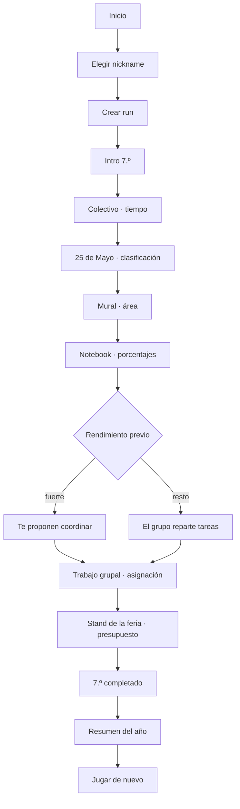

Ocho eventos: dos narrativos y seis desafíos. Duración objetivo histórica del slice: 3–5 minutos. Esta densidad pertenece al artefacto de demostración y no fija la longitud de un segmento normal de producción; desde STAGE-04 esa distinción está formalizada como un `DemoPlan`, un artefacto con reglas propias que **no** es un plan de run válido. Ver [ADR-021](03-architecture/adr/ADR-021-approved-catalog-in-play-and-teacher-demo.md).

## Contenido de 7.º grado

Vive en `src/content/grade-7/`, no en fixtures de desarrollo. Es contenido de producto versionado (`contentVersion` `0.7.0-grade-7`).

Son **siete plantillas** y seis situaciones por partida: el slot del colectivo aloja dos plantillas de la misma familia y el seed elige cuál sale.

| Id | Situación | Matemática | Interacción | Razonamiento |
|---|---|---|---|---|
| `g7.bus-timing` | El colectivo llega demorado y hay que elegir en cuál subir | tiempo + porcentaje simple | `timeline` | 28 min + 25 % = 35 min; salida + 35 min contra la hora de entrada |
| `g7.bus-latest-departure` | La misma demora, y el grupo pregunta con cuánto tiempo hay que salir | tiempo + porcentaje simple, recorrido al revés | `numeric-input` | 28 min + 25 % = 35 min; 35 + 10 de margen ⇒ salir 45 min antes |
| `g7.may-25-act` | La coreografía del acto del 25 de Mayo, adelante de toda la escuela | clasificación: pares, múltiplos de 3 y primos | `number-grid` | tres grillas de ocho números; se marcan los que cumplen la regla de cada paso |
| `g7.mural-paint` | Hay que comprar pintura para el mural de la feria | área y cobertura | `decision-card` | 6 × 2,4 = 14,4 m²; 14,4 ÷ 8 = 1,8 L ⇒ 2 L |
| `g7.notebook-offer` | El curso compara dos ofertas para una notebook | porcentaje contra monto fijo | `decision-card` | 20 % de 800.000 = 160.000 ⇒ 640.000, contra 800.000 − 120.000 = 680.000 |
| `g7.group-tasks` | Repartir el trabajo grupal entre cuatro personas | asignación con restricciones | `assignment-board` | horas disponibles contra horas requeridas, más afinidad |
| `g7.stand-supplies` | Comprar la merienda del stand sin pasarse del presupuesto | combinación y costo unitario | `budget-builder` | cubrir las porciones necesarias al menor costo |

Ambos rulesets seleccionan **dentro del catálogo aprobado de desarrollo** vigente `grade-7-dev-3`: 26 o 27 direcciones por plantilla generada, y las dos autoradas de `g7.group-tasks`. Seis plantillas declaran generadores por restricción y `g7.group-tasks` es autorada; las dos estrategias pasan por validación, fingerprint y deduplicación, y ninguna produce azar procedural libre en runtime. El seed de la run elige **cuál** variante sale; qué contiene esa dirección no depende de la run. `dev-3` conserva la misma población semántica de `dev-2` y existe como versión inmutable nueva para `contentVersion 0.7.0-grade-7`. Ver [ADR-021](03-architecture/adr/ADR-021-approved-catalog-in-play-and-teacher-demo.md) y [ADR-022](03-architecture/adr/ADR-022-difficulty-model-and-run-composer.md).

### Calidades de resolución

Ninguno es correcto/incorrecto. Todos usan el modelo del motor:

- `invalid` — no resuelve el problema (llega tarde, no alcanza la pintura, no cubre las porciones, deja tareas sin asignar, excede el presupuesto o pierde la coreografía);
- `functional` — resuelve;
- `efficient` — resuelve sin desperdiciar;
- `optimal` — la mejor opción según la función objetivo declarada.

Un error nunca termina la run.

### El acto del 25 de Mayo

En la Teacher Demo es el evento que **introduce Aura**, y el único del arco amplio que ocurre en público. Está documentado en detalle en [el catálogo de desafíos](01-game-design/challenge-catalog.md#acto-del-25-de-mayo). Lo esencial para el slice:

- son **tres pasos** de la coreografía, cada uno con su regla escrita —«Números pares», «Múltiplos de 3», «Números primos»— y una grilla de ocho números;
- la narrativa, las señales y las reglas son autoradas; las grillas numéricas concretas tienen fuente `generated` y validadores matemáticos independientes;
- se juzga con **precisión y cobertura juntas** (F1 agregado sobre los tres pasos), de modo que ni marcar una sola celda evidente ni marcar la grilla entera pasan por buenos;
- mueve **Aura y Estilo, y nada más**: no pone nota, porque un acto escolar no es una evaluación de matemática, y no toca Equipo, porque bailás vos.

## Narrativa

Nueve storylets en `src/content/grade-7/storylets.ts`. El orden lo fija el motor por prioridad descendente y por condiciones encadenadas (`storylet-seen`), no la UI.

En el arco de la Teacher Demo, el acto del 25 de Mayo entra como tercer evento, entre el colectivo y el mural: el acto cae en mayo, después de las primeras semanas de clase y antes de que arranque el proyecto de la feria, así que se intercala en el calendario escolar sin partir la cadena causal del proyecto.

El evento 6 es una bifurcación real evaluada por el motor narrativo:

- `g7.project-lead` — requiere dos resultados `efficient` o mejores en los últimos tres eventos;
- `g7.project-support` — alternativa cuando esa condición no se cumple.

Cada uno deja un flag distinto, y el resumen final del año lo refleja. Es la prueba de que una decisión temprana cambia el relato posterior.

## Resultado

La pantalla final muestra **el año**, no un perfil de egreso: `TU 7.º GRADO`. El perfil definitivo pertenece a la carrera completa y no se inventa acá.

Cierre de etapa: numeral del año con tilde, renglones de registro (Promedio, Equipo, eventos), Estilo expandido cuando hay evidencia suficiente, lo más memorable del año y el arquetipo con su sello. El bloque de Aura aparece sólo si Aura cambió. La Teacher Demo lo establece porque incluye deliberadamente el acto; una partida compuesta sólo lo hace cuando su `RunPlan` contiene `g7.may-25-act`, y un año futuro puede no mover Aura.

El score no se muestra: el oficial lo calcula el servidor reproduciendo la run, y el ruleset de desarrollo no es oficial (preguntas abiertas 5 y 24).

## Reanudar

El checkpoint se guarda en `localStorage` después de cada evento resuelto, a través del sink de efectos del controller: el motor pide el snapshot, el adaptador lo escribe. Si al abrir existe un checkpoint compatible, la entrada ofrece continuar o empezar de nuevo (UF-03). Un checkpoint corrupto o de otra versión se descarta con un aviso claro; nunca se restaura un estado inválido.

El checkpoint se escribe con la pantalla de resultado a la vista, y el borrador de la respuesta vive en la vista y no en el snapshot. Al reanudar sobre un resultado, entonces, la UI ya no sabe qué eligió el jugador: las opciones se dibujan todas sin marca y **la grilla del acto no se corrige**, en lugar de afirmar que no se marcó nada. El ledger sigue explicando la cuenta, que es lo que no se pierde.

No hay backend en el loop de juego: la partida es enteramente local (ADR-006).

## Cobertura de tests

| Capa | Qué prueba |
|---|---|
| Unit de contenido | La matemática de cada variante: solución válida, óptima, insuficiente y bordes |
| Property | Toda variante ofrece al menos una solución suficiente; las vistas públicas no filtran la solución |
| Integración | La run completa de 7.º sin React, en tres caminos: fuerte, mixto y débil |
| Golden | Una run de referencia con seed y respuestas fijas |
| Replay | El action log reproduce estado final, score, carrera y flags |
| Resume | Snapshot → restaurar → continuar llega al mismo final |
| Componentes | Renderers de interacción y pantallas |
| E2E | Recorrido completo en browser, camino no óptimo, mobile, teclado y accesibilidad |
| Simulación | Miles de runs deterministas sin dead ends ni divergencias |
| Aura en la Teacher Demo | Ausente antes del acto, establecida después, positiva o negativa según cómo salga |

## Revisión manual

Recorrido completo en un browser real a 390 px, además de los gates automáticos. Lo que se corrigió a partir de mirarlo:

- **El trabajo grupal no se podía resolver en un teléfono.** Las horas y las habilidades de cada integrante vivían dentro de las opciones de los desplegables, donde un select nativo las trunca. Ahora la lista de quién puede hacer qué está a la vista, arriba de las tareas.
- **La notebook regalaba la cuenta.** Cada oferta mostraba el total ya calculado, así que el desafío se reducía a comparar dos números. Ahora se muestran el precio de lista y lo que juntaron, y el porcentaje lo saca el jugador. Hay un test que falla si el total vuelve a filtrarse.
- **Los precios no se leían como precios argentinos.** El motor formatea dinero en forma canónica (`24000.00`) porque su salida es determinista; la traducción a `$ 24.000` vive en `src/content/pesos.ts`, escrita a mano y sin `Intl`, para que sea idéntica en cualquier dispositivo.
- **La lista de herramientas mostraba identificadores en inglés.** Decía *"Herramientas disponibles: calculator"*; ahora dice *"Podés usar: calculadora"*.

Limitación conocida que queda abierta: las estrellas de habilidad (`★★`) se leen bien a la vista, pero un lector de pantalla las enuncia una por una. El enunciado explica la escala, así que la información no se pierde, pero conviene reemplazarlas por texto estructurado cuando se revise accesibilidad a fondo.

## Capa visual

Desde el Design System v0.1, ninguna de estas pantallas decide su propio color, tipografía, radio ni foco. Todas componen primitivas de `src/components/ui/` y primitivas de juego de `src/components/game/`. El mapa completo de qué reemplazó a qué está en [la migración](09-design-system/migration-7-grade.md), y las reglas en [el sistema de diseño](09-design-system/README.md).

La migración no tocó matemática, evaluación, narrativa, determinismo, scoring ni replay.

## Extender a 1.º año

Evaluado sobre el código que quedó implementado, no sobre la intención.

Lo que hace falta:

1. agregar `year-1` a `stages` en el ruleset del content set (`STAGE_ORDER` ya lo declara, con su banda de dificultad y sus categorías);
2. agregar definiciones de desafío en `src/content/year-1/challenges/`;
3. agregar storylets con sus condiciones y prioridades;
4. sumar un renderer sólo si aparece una interacción que el motor todavía no define;
5. agregar tests de contenido, extender el golden y correr la simulación sobre el content set nuevo.

Lo que **no** hace falta tocar, verificado:

- **El motor.** `src/game` no importa `src/content` en ninguna dirección; la frontera la vigila `eslint-plugin-boundaries` ([ADR-014](03-architecture/adr/ADR-014-product-content-package.md)).
- **La UI de juego.** `GameShell`, `ChallengeFrame` y los renderers de interacción se dibujan desde la vista pública que devuelve el motor. Ninguno sabe qué etapa está jugando.
- **El nombre de la etapa.** Vive en `src/components/game/stage-label.ts` y cubre las siete etapas; las pantallas lo consultan, no lo escriben. Por eso el botón dice *"Empezar 1.º año"* solo, sin editar el formulario.
- **El ciclo de vida de la run, el controller, el checkpoint y el routing.** Son agnósticos del contenido: el checkpoint valida contra `gameVersion`/`rulesetVersion`/`contentVersion` y descarta lo que no corresponda.

Lo que sí queda como deuda conocida:

- **`GameContainer` elige el content set con un import fijo a `@/content/grade-7`.** Es el único acoplamiento de la UI a una etapa concreta. Con dos años pasa a ser una elección —seguir la carrera o elegir año— y esa decisión de producto todavía no está tomada, así que el import se deja explícito en lugar de inventar un selector.
- **El contenido viaja entero en el bundle.** Con un año es irrelevante; con seis hay que cargar cada etapa por separado. La separación por carpeta ya deja hecho el corte.
- **Las políticas de score, dificultad y perfil siguen siendo las de desarrollo.** Ningún content set puede declararse oficial hasta cerrar las preguntas abiertas 5 y 24; `createRuleset` lo impide por diseño.
- **La copia de la portada nombra 7.º grado a mano.** Es correcta hoy y describe lo que el juego cubre; hay que reescribirla cuando deje de ser cierto.

## Qué tiene que probar la demo candidata

El slice de 7.º no es un prototipo descartable: es la **candidata a demo docente** de la Fase A del [ciclo de entrega real](00-product/real-delivery-lifecycle.md). Su trabajo es que el Departamento de Matemática pueda decidir si el proyecto se extiende a todos los años.

La **Teacher Demo Candidate** expone deliberadamente más contenido que un segmento normal para mostrar matemática, patrones de interacción y las cuatro dimensiones de carrera. Está implementada como `DemoPlan`, un tipo y una validación separados; **no** es un `RunPlan` con un máximo mayor. El plan normal ya se construye con `RunComposer`, mantiene uno o dos beats ordinarios por etapa y queda fijado antes de ejecutarse. Ver [ADR-019](03-architecture/adr/ADR-019-scenario-family-template-variant.md), [ADR-021](03-architecture/adr/ADR-021-approved-catalog-in-play-and-teacher-demo.md) y [ADR-022](03-architecture/adr/ADR-022-difficulty-model-and-run-composer.md).

Tiene que probar ocho cosas:

1. Egresado tiene identidad visual propia.
2. La matemática cambia decisiones en vez de funcionar como trivia.
3. Distintos patrones de interacción son posibles.
4. Promedio, Equipo, Aura y Estilo alcanzan como identidad de carrera.
5. Una segunda run se siente distinta de la primera.
6. Los resultados explican por qué una decisión funcionó.
7. El motor genera y reproduce variantes deterministas.
8. Las mismas fundaciones de UI y de motor escalan a los años siguientes.

### Variación: qué demostró STAGE-04 y qué sigue abierto

La diversidad **paramétrica** ya llega al gameplay desde el catálogo vigente `grade-7-dev-3`, semánticamente equivalente a `dev-2`. La diversidad **cognitiva** tiene su primera prueba de producción en la familia `bus`: `g7.bus-timing` pide elegir una salida en un timeline y `g7.bus-latest-departure` pide producir una anticipación numérica recorriendo la relación al revés. Seeds distintas pueden elegir cualquiera de las dos dentro del slot del colectivo.

Eso demuestra la capacidad, no completa el inventario. Las otras cinco familias siguen con una plantilla cada una, y cuántas familias y plantillas necesita el juego final permanece **OPEN**. Ver [la migración](03-architecture/content-model-migration.md), [familias y variantes](01-game-design/challenge-families-and-variants.md) y [ADR-021](03-architecture/adr/ADR-021-approved-catalog-in-play-and-teacher-demo.md).

No se puede llamar «dinámico» a un cambio de orden de las opciones.

### El acto del 25 de Mayo

Está implementado y jugable, y demuestra matemática, situación social, Aura y una familia de interacción distinta al mismo tiempo. **Su inclusión en producción sigue siendo una decisión docente** ([pregunta 42](07-reference/open-questions.md)).

### Score en la demo

No hace falta un ranking online para el Teacher Gate 1, pero conviene exponer un **prototipo de desglose de score** para que los docentes puedan evaluar la filosofía competitiva antes de que se construya. Ver [score competitivo y ranking](01-game-design/competitive-scoring-and-ranking.md).

### Explícitamente fuera del alcance de la demo

Backend de ranking con premios; contenido de 1.º a 5.º; arcos completos de recuperación; sistema de cuentas; pipeline de arte de personajes; biblioteca grande de assets; y el algoritmo final de arquetipo de carrera completa.

---

# FILE: 07-reference/blueprint-v0.2-integration.md

# Integración del Project Blueprint v0.2.0

Qué entró, dónde quedó, qué se descartó y qué conflictos hubo. Este documento existe para que dentro de seis meses nadie tenga que adivinar por qué un documento dice lo que dice.

- **Paquete:** EGRESADO Project Blueprint & Technical Handoff v0.2.0 — 79 archivos, verificados contra su `MANIFEST.json`.
- **Fuente congelada:** [`docs/sources/egresado-project-blueprint-v0.2.0/`](sources/README.md).
- **Fecha de integración:** 28 de agosto de 2026.
- **Decisión de gobernanza:** [ADR-018](03-architecture/adr/ADR-018-blueprint-v0-2-decision-authority.md).
- **Alcance de la integración:** documentación únicamente. No se modificó comportamiento de producto, motor, frontend, sistema de diseño, tokens, contenido ejecutable, persistencia ni configuración de runtime.

## Cómo leer las acciones

| Acción | Significado |
|---|---|
| **NUEVO** | no existía documento equivalente; se creó uno canónico |
| **FUSIÓN** | el contenido se incorporó a un documento existente |
| **REFERENCIA** | el repositorio ya lo cubría; se dejó enlace, no copia |
| **SUPERADO POR EL REPO** | el repositorio tiene una versión más nueva o ya implementada; el paquete queda como historia |
| **DEFIERE A DISEÑO** | es material visual; manda el sistema de diseño implementado |

## Mapa por documento del paquete

### 00-governance

| Origen | Acción | Destino |
|---|---|---|
| `decision-register.md` | FUSIÓN | [registro de decisiones](07-reference/decision-register.md) |
| `decision-status.md` | FUSIÓN | [registro de decisiones](07-reference/decision-register.md) y [ADR-018](03-architecture/adr/ADR-018-blueprint-v0-2-decision-authority.md) |
| `glossary.md` | FUSIÓN | [glosario](07-reference/glossary.md) |
| `source-of-truth.md` | FUSIÓN | [ADR-018](03-architecture/adr/ADR-018-blueprint-v0-2-decision-authority.md) y el README de `docs/` |

### 01-product

| Origen | Acción | Destino |
|---|---|---|
| `real-delivery-lifecycle.md` | NUEVO | [ciclo de entrega real](00-product/real-delivery-lifecycle.md) |
| `product-vision.md` | FUSIÓN | [visión de producto](00-product/product-vision.md) |
| `full-project-scope.md` | FUSIÓN | [alcance y roadmap](00-product/scope-and-roadmap.md) |
| `scope-demo-7mo.md` | FUSIÓN | [vertical slice de 7.º](06-delivery/vertical-slice-grade-7.md) |
| `personas-and-contexts.md` | FUSIÓN | [personas y contextos](00-product/personas-and-contexts.md) |
| `risks-and-assumptions.md` | FUSIÓN | [riesgos y supuestos](00-product/risks-and-assumptions.md) |
| `success-metrics.md` | FUSIÓN | [métricas de éxito](00-product/success-metrics.md) |

### 02-functional

| Origen | Acción | Destino |
|---|---|---|
| `functional-specification.md` | REFERENCIA | [especificación funcional](02-functional/functional-specification.md); F-001…F-013 mapean a FR-001…FR-020 |
| `traceability-matrix.md` | FUSIÓN | [matriz de trazabilidad](02-functional/traceability-matrix.md) |
| `user-flows.md` | FUSIÓN | [flujos](02-functional/user-flows.md) |
| `user-stories.md` | FUSIÓN | [historias de usuario](02-functional/user-stories.md) |

### 02-game-design

| Origen | Acción | Destino |
|---|---|---|
| `challenge-families-and-variants.md` | NUEVO | [familias, plantillas y variantes](01-game-design/challenge-families-and-variants.md) |
| `difficulty-and-universal-playability.md` | NUEVO | [dificultad y jugabilidad universal](01-game-design/difficulty-and-playability.md) |
| `competitive-scoring-and-ranking.md` | NUEVO | [score competitivo y ranking](01-game-design/competitive-scoring-and-ranking.md) |
| `graduation-and-fail-forward.md` | NUEVO | [egreso y fail-forward](01-game-design/graduation-and-fail-forward.md) |
| `content-authoring-guide.md` | FUSIÓN | [guía de autoría](01-game-design/content-authoring-guide.md) |
| `narrative-and-storylets.md` | FUSIÓN | [sistema narrativo](01-game-design/narrative-system.md) |
| `full-content-roadmap.md` | FUSIÓN | [alcance y roadmap](00-product/scope-and-roadmap.md) |
| `core-loop-and-progression.md` | REFERENCIA | [GDD](01-game-design/game-design-document.md) |
| `grade7-challenge-catalog.md` | REFERENCIA | [catálogo de desafíos](01-game-design/challenge-catalog.md) |
| `player-career-model.md` | SUPERADO POR EL REPO | [ADR-016](03-architecture/adr/ADR-016-career-player-model.md), ya implementado |
| `grid-classification-scoring.md` | SUPERADO POR EL REPO | [catálogo de desafíos](01-game-design/challenge-catalog.md), ya implementado con F1 |

### 03-pedagogy

| Origen | Acción | Destino |
|---|---|---|
| `math-design-framework.md` | FUSIÓN | [marco matemático](01-game-design/math-design-framework.md) |
| `teacher-review-framework.md` | FUSIÓN | [gates docentes](06-delivery/teacher-gates.md) |
| `theory-basis.md` | FUSIÓN | [base teórica](07-reference/research-basis.md) |

### 04-design

Los tres documentos son **DEFIERE A DISEÑO**. El sistema de diseño implementado y el handoff de Claude Design v0.2 son la autoridad visual; el paquete sólo aportó contexto de producto, y ese contexto se cita sin repetir valores.

| Origen | Dónde manda de verdad |
|---|---|
| `ui-art-foundation.md` | [sistema de diseño](09-design-system/README.md), [colores](09-design-system/colors.md), [tipografía](09-design-system/typography.md), [fundamentos](09-design-system/foundations.md), [ADR-017](03-architecture/adr/ADR-017-paper-visual-identity.md) |
| `accessibility-and-interaction.md` | [accesibilidad del sistema de diseño](09-design-system/accessibility.md), [UX e interacción](01-game-design/ux-interaction-design.md) |
| `assets-motion-audio.md` | [assets](09-design-system/assets.md), [fundamentos](09-design-system/foundations.md) |

### 05-engine

| Origen | Acción | Destino |
|---|---|---|
| `target-engine-architecture.md` | NUEVO | [arquitectura objetivo del motor](03-architecture/target-engine-architecture.md) |
| `variant-generation-engine.md` | FUSIÓN | [familias y variantes](01-game-design/challenge-families-and-variants.md) y arquitectura objetivo |
| `difficulty-budget-scheduler.md` | FUSIÓN | [dificultad](01-game-design/difficulty-and-playability.md) y arquitectura objetivo |
| `scoring-replay-and-ranking.md` | FUSIÓN | [arquitectura objetivo del motor](03-architecture/target-engine-architecture.md) |
| `server-authoritative-fair-mode.md` | FUSIÓN | arquitectura objetivo; [ADR-004](03-architecture/adr/ADR-004-server-authoritative-scoring.md) y [ADR-006](03-architecture/adr/ADR-006-local-first-gameplay.md) ya lo decidían |
| `score-policy-configuration.md` | FUSIÓN | [score competitivo](01-game-design/competitive-scoring-and-ranking.md) y [score-policy.example.json](07-reference/score-policy.example.json) |
| `content-and-rules-versioning.md` | FUSIÓN | arquitectura objetivo, eje por eje |
| `api-contracts.md` | REFERENCIA | [contratos API](03-architecture/api-contracts.md); su contrato concreto sigue abierto |
| `data-model.md` | REFERENCIA | [modelo de datos](03-architecture/data-model.md) |
| `run-state-machine.md` | REFERENCIA | [game engine](03-architecture/game-engine.md) |
| `persistence-and-resume.md` | REFERENCIA | [game engine](03-architecture/game-engine.md) |
| `career-state-migration.md` | SUPERADO POR EL REPO | migración ya hecha: [ADR-016](03-architecture/adr/ADR-016-career-player-model.md), `ENGINE_VERSION 2.0.0` |

### 06-quality

| Origen | Acción | Destino |
|---|---|---|
| `variant-validation-invariants.md` | NUEVO | [validación y auditoría de variantes](04-quality/variant-validation-and-audit.md) |
| `statistical-variant-audit.md` | NUEVO | ídem |
| `scoring-fairness-audit.md` | NUEVO | [auditoría de equidad competitiva](04-quality/competition-fairness-audit.md) |
| `teacherless-preflight-risk-compensation.md` | FUSIÓN | [ciclo de entrega real](00-product/real-delivery-lifecycle.md) |
| `testing-and-simulation.md` | FUSIÓN | [estrategia de testing](04-quality/testing-strategy.md) |
| `manual-qa-matrix.md` | FUSIÓN | [estrategia de testing](04-quality/testing-strategy.md) |
| `security-threat-model.md` | FUSIÓN | [threat model](04-quality/threat-model.md) |
| `non-functional-requirements.md` | REFERENCIA | [NFR](04-quality/non-functional-requirements.md) |

### 07-operations

| Origen | Acción | Destino |
|---|---|---|
| `fair-mode-and-ranking.md` | NUEVO | [modo feria y congelamiento](05-operations/fair-mode-and-competition-freeze.md) |
| `competition-freeze-and-change-control.md` | NUEVO | ídem |
| `load-and-network-test-plan.md` | FUSIÓN | ídem |
| `privacy-and-minors.md` | FUSIÓN | ídem y [seguridad y privacidad](03-architecture/security-privacy.md) |
| `ranking-moderation-and-prizes.md` | FUSIÓN | [leaderboard y moderación](05-operations/leaderboard-and-moderation.md) |
| `incident-runbook.md` | FUSIÓN | [fallback e incidentes](05-operations/fallback-and-incident-plan.md) |
| `telemetry-and-observability.md` | FUSIÓN | [analytics y observabilidad](03-architecture/analytics-observability.md) |
| `deployment-and-environments.md` | FUSIÓN | [deploy y ambientes](03-architecture/deployment-and-environments.md) |

### 08-delivery

| Origen | Acción | Destino |
|---|---|---|
| `implementation-sequence.md` | NUEVO | [secuencia de implementación](06-delivery/implementation-sequence.md) |
| `teacher-gate-1-checklist.md` | NUEVO | [gates docentes](06-delivery/teacher-gates.md) |
| `teacher-gate-2-checklist.md` | NUEVO | ídem |
| `product-freeze-checklist.md` | FUSIÓN | ídem |
| `demo-presentation-guide.md` | FUSIÓN | ídem |
| `content-matrix-template.md` | FUSIÓN | [secuencia de implementación](06-delivery/implementation-sequence.md) |
| `agent-handoff.md` | FUSIÓN | secuencia de implementación y `AGENTS.md` |
| `definition-of-done.md` | FUSIÓN | [Definition of Done](06-delivery/definition-of-done.md) |
| `open-decisions.md` | FUSIÓN | [preguntas abiertas](07-reference/open-questions.md) |

### 09-reference

| Origen | Acción | Destino |
|---|---|---|
| `formulas-and-algorithms.md` | NUEVO | [fórmulas y algoritmos](07-reference/formulas-and-algorithms.md) |
| `research-basis.md` | FUSIÓN | [base teórica](07-reference/research-basis.md) |
| `examples/*` | COPIA | los `*.example.*` de este directorio |

## Conflictos y cómo se resolvieron

Cinco discrepancias reales entre el paquete y el repositorio. Ninguna se resolvió en silencio.

### 1 · Migración del modelo de jugador

- **Paquete:** pide migrar `knowledge/team/initiative/energy` a Promedio · Equipo · Aura · Estilo.
- **Repositorio:** ya migrado en `src/game/progression/career.ts`, `ENGINE_VERSION 2.0.0`.
- **Autoridad:** el código y [ADR-016](03-architecture/adr/ADR-016-career-player-model.md) son más nuevos.
- **Resolución:** el capítulo de migración queda como historia. La arquitectura objetivo lo marca **implementado** para que nadie replanifique trabajo hecho.

### 2 · Scoring de la grilla de clasificación

- **Paquete:** propone `0,6 × precisión + 0,4 × cobertura`, y sugiere F1 como generalización.
- **Repositorio:** el acto del 25 de Mayo ya usa F1 micro-agregado sobre las tres rondas, con los tres casos de denominador cero decididos y umbrales calibrados.
- **Autoridad:** el repositorio, que es más nuevo y está implementado y testeado.
- **Resolución:** superado. El razonamiento del paquete se conservó en [fórmulas y algoritmos](07-reference/formulas-and-algorithms.md) porque explica *por qué* F1 y no un promedio ponderado.

### 3 · Playtest con estudiantes antes de la feria

- **Paquete:** declara que probablemente no habrá playtest con estudiantes antes de la release de feria; es una restricción externa.
- **Repositorio:** varios documentos asumían testers y playtest como criterio de salida.
- **Autoridad:** el paquete, que describe el contexto real y es posterior.
- **Resolución:** los documentos prospectivos se corrigieron hacia el ciclo real y la limitación quedó declarada. Los criterios de playtest que sí se pueden ejecutar —prueba proxy con adultos, revisión heurística— se conservaron como tales, sin llamarlos validación con jugadores. Ver [ciclo de entrega real](00-product/real-delivery-lifecycle.md).

### 4 · La palabra «familia»

- **Paquete:** `ScenarioFamily` es un dominio narrativo: Colectivo, Mural, Stand.
- **Repositorio:** el [sistema de desafíos](01-game-design/challenge-system.md) llama «familias» a los patrones de interacción: Decision Card, Timeline, Number Grid.
- **Resolución:** ambos términos se conservan y se desambiguan explícitamente. Ninguno se renombró: renombrar habría tocado código y contenido, que están fuera del alcance de esta integración. La correspondencia está en [familias, plantillas y variantes](01-game-design/challenge-families-and-variants.md) y en el [glosario](07-reference/glossary.md).

### 5 · Nombres de las calidades de resolución

- **Paquete:** `optimal / resolved / partial / insufficient`.
- **Repositorio:** `optimal / efficient / functional / invalid`, implementado como `SolutionQuality`.
- **Resolución:** manda el repositorio. La correspondencia está en el [glosario](07-reference/glossary.md), y el score competitivo la usa explícitamente para que la calibración candidata `1,00 / 0,75 / 0,40 / 0,10` se lea contra las etiquetas correctas.

### Y una que **no** se resolvió

El paquete resume decisiones visuales —paleta, tipografías, geometría, isla de Aura— que ya están implementadas por el sistema de diseño. Cualquier diferencia entre ese resumen y lo implementado **se resuelve a favor de Claude Design v0.2 y del sistema implementado**, y no se reconcilia editando lo visual. Los documentos de producto enlazan al sistema de diseño; no repiten valores de token.

## Trazabilidad

De requisito de producto a estado de implementación. La columna de estado es una lectura del 29 de agosto de 2026 y se verifica contra el código antes de planificar.

| Requisito de producto | Regla de game design | Capacidad de motor | Estado actual | Fase futura |
|---|---|---|---|---|
| Escenarios que no se memorizan | [familias, plantillas y variantes](01-game-design/challenge-families-and-variants.md) | `ScenarioFamily`/`Template`/`Variant`, fuentes híbridas y generador por restricción | primera variación cognitiva de producción **implementada** en `bus`; profundidad del resto del catálogo abierta | STAGE-04 / STAGE-08 del [roadmap](06-delivery/implementation-sequence.md) |
| Competencia sin variantes defectuosas | [validación y auditoría de variantes](04-quality/variant-validation-and-audit.md) | validador transversal + catálogo aprobado | **implementado para desarrollo y consumido por gameplay** en `grade-7-dev-3`; catálogo oficial pendiente | FREEZE |
| Identidad de carrera legible | [ADR-016](03-architecture/adr/ADR-016-career-player-model.md) | `CareerState` v0.2 | **implementado** | — |
| Runs comparables entre sí | [dificultad](01-game-design/difficulty-and-playability.md) | bandas + scheduler por presupuesto | **implementado estructuralmente** bajo la policy candidata; calibración docente y equivalencia empírica pendientes | STAGE-05 (`DONE`) / Teacher Gate |
| Ranking dominado por matemática | [score competitivo](01-game-design/competitive-scoring-and-ranking.md) | `ScorePolicy` + `ScoringEngine` competitivo | score por evento de desarrollo | STAGE-06 |
| Premiar mejora y no volumen | [modo feria](05-operations/fair-mode-and-competition-freeze.md) | comparador versionado + personal best | no implementado | STAGE-09 |
| El navegador no decide el premio | [ADR-004](03-architecture/adr/ADR-004-server-authoritative-scoring.md) | verificación por replay en servidor | base en `src/server/game/validate-run.ts` | STAGE-09 |
| Reproducibilidad y auditoría de una run | [ADR-003](03-architecture/adr/ADR-003-deterministic-seeded-engine.md) | seed + tripleta de versiones + action log | **implementado**, con `variantCatalogVersion` opcional | `scoreVersion` en STAGE-06 y emisión oficial en STAGE-09 |
| El error no expulsa al jugador | [egreso y fail-forward](01-game-design/graduation-and-fail-forward.md) | invariante de egreso + recuperación comprimida | sin contenido de recuperación | STAGE-07 |
| Datos mínimos de menores | [ADR-008](03-architecture/adr/ADR-008-anonymous-identity.md) | identidad pseudónima | **implementado** en la base | retención abierta, STAGE-10 |

## Qué NO hizo esta integración

- No implementó ninguna capacidad marcada TARGET.
- No cerró ninguna pregunta abierta ni ninguna decisión de Teacher Gate.
- No promovió una recomendación a regla: la ponderación 80/15/5, la política de intentos y la calibración de calidades siguen siendo candidatas.
- No tocó el sistema de diseño, sus tokens, su CSS, sus componentes ni sus capturas.
- No modificó código, contenido ejecutable, esquemas de estado, persistencia, snapshots, replay ni configuración de runtime.
- No agregó ni actualizó dependencias.

---

# FILE: 07-reference/decision-register.md

# Registro de decisiones

| ADR | Decisión | Estado |
|---|---|---|
| ADR-001 | Web-first Next.js/TypeScript | Aceptado |
| ADR-002 | Monolito modular + BFF | Aceptado |
| ADR-003 | Motor determinista seeded | Aceptado |
| ADR-004 | Scoring oficial server-side | Aceptado |
| ADR-005 | PostgreSQL/Supabase | Aceptado |
| ADR-006 | Gameplay local-first | Aceptado |
| ADR-007 | Content-as-data | Aceptado |
| ADR-008 | Identidad anónima/pseudónima | Aceptado |
| ADR-009 | Leaderboards por evento | Aceptado |
| ADR-010 | Toolchain Node.js/pnpm y artefacto Docker portable | Aceptado |
| ADR-011 | Núcleo funcional con función de transición explícita | Aceptado |
| ADR-012 | PRNG seeded, substreams y contrato de consumo | Aceptado |
| ADR-013 | Aritmética racional exacta para evaluación matemática | Aceptado |
| ADR-014 | Contenido de producto como paquete propio importable desde el cliente | Aceptado |
| ADR-015 | Sistema de diseño con tokens semánticos y paleta restringida | Aceptado (reemplazado parcialmente por ADR-017) |
| ADR-016 | Modelo de jugador de carrera: Promedio, Equipo, Aura y Estilo | Aceptado |
| ADR-017 | Identidad papel: la hoja cuadriculada como canvas del juego | Aceptado |
| ADR-018 | Autoridad y madurez de las decisiones del Project Blueprint v0.2 | Aceptado |
| ADR-019 | Modelo de contenido: familia de escenario, plantilla y variante | Aceptado |
| ADR-020 | Pipeline de variantes y catálogo aprobado | Aceptado |
| ADR-021 | [El catálogo aprobado dentro del juego, y el demo docente](03-architecture/adr/ADR-021-approved-catalog-in-play-and-teacher-demo.md) | Aceptado |
| ADR-022 | [Modelo de dificultad y compositor de runs](03-architecture/adr/ADR-022-difficulty-model-and-run-composer.md) | Aceptado |

## Regla para ADR nuevo

Crear ADR cuando una decisión:
- afecta múltiples módulos;
- es difícil/costosa de revertir;
- cambia una propiedad no funcional significativa;
- cambia proveedor/plataforma principal;
- altera compatibilidad de runs o seguridad.

## Decisiones del Project Blueprint v0.2

Estas decisiones vienen del [Project Blueprint v0.2.0](07-reference/blueprint-v0.2-integration.md) y **conservan su nivel de madurez**, que es parte de la decisión. [ADR-018](03-architecture/adr/ADR-018-blueprint-v0-2-decision-authority.md) fija cómo se interpreta cada nivel.

| Nivel | Qué significa para quien implementa |
|---|---|
| **LOCKED** | fundación aceptada; se implementa salvo que una autoridad más nueva la supere |
| **PRODUCT DIRECTION** | dirección fuerte; la arquitectura debe poder sostenerla aunque hoy no exista |
| **RECOMENDADA** | propuesta senior; se implementa configurable, nunca como constante inmutable |
| **TEACHER GATE** | requiere validación del Departamento de Matemática antes del congelamiento |
| **OPEN** | deliberadamente sin resolver; no se cierra dentro del código |
| **DEFERRED** | fuera de alcance a propósito; no es deuda ni backlog urgente |

| ID | Decisión | Nivel | Estado de implementación |
|---|---|---|---|
| D-001 | Identidad visual UI-first: la identidad sale del sistema, no de cientos de assets | LOCKED | implementado ([sistema de diseño](09-design-system/README.md)) |
| D-002 | Identidad papel v0.2 de Claude Design en lugar de la estética de carrera deportiva | LOCKED | implementado ([ADR-017](03-architecture/adr/ADR-017-paper-visual-identity.md)) |
| D-003 | Sólo Promedio, Equipo, Aura y Estilo como dimensiones visibles | LOCKED | implementado ([ADR-016](03-architecture/adr/ADR-016-career-player-model.md)) |
| D-004 | Dominio matemático oculto, nunca una barra de «Conocimiento» | LOCKED | implementado |
| D-005 | Sin game over global: el error cambia el camino, no termina la partida | PRODUCT DIRECTION | parcial; falta contenido de recuperación ([fail-forward](01-game-design/graduation-and-fail-forward.md)) |
| D-006 | Jerarquía `ScenarioFamily → Template → Variant` | RECOMENDADA | **implementada** ([ADR-019](03-architecture/adr/ADR-019-scenario-family-template-variant.md)) y **ejercida en producción**: la familia `bus` aloja dos plantillas con razonamientos distintos ([ADR-021](03-architecture/adr/ADR-021-approved-catalog-in-play-and-teacher-demo.md)); el inventario de contenido sigue abierto |
| D-007 | Variantes deterministas por seed | LOCKED como dirección de arquitectura | implementado ([ADR-003](03-architecture/adr/ADR-003-deterministic-seeded-engine.md), [ADR-012](03-architecture/adr/ADR-012-seeded-prng-and-substreams.md)) |
| D-008 | Catálogo de variantes prevalidado y desplegado para competencia | RECOMENDADA | **implementado y consumido por la partida** ([ADR-020](03-architecture/adr/ADR-020-variant-generation-and-approved-catalog.md), [ADR-021](03-architecture/adr/ADR-021-approved-catalog-in-play-and-teacher-demo.md)); las versiones publicadas son inmutables y el catálogo oficial de la feria sigue sin congelar |
| D-009 | Intentos ilimitados con personal best en el ranking | RECOMENDADA · TEACHER GATE | no implementado ([modo feria](05-operations/fair-mode-and-competition-freeze.md)) |
| D-010 | `FairScore` separado de las stats de carrera | RECOMENDADA | no implementado ([score competitivo](01-game-design/competitive-scoring-and-ranking.md)) |
| D-011 | La matemática domina el `FairScore` | RECOMENDADA · TEACHER GATE | no implementado |
| D-012 | Estilo no puntúa directamente | RECOMENDADA | vigente como regla de diseño |
| D-013 | Desempate lexicográfico determinista y profundo | RECOMENDADA · TEACHER GATE | no implementado |
| D-014 | Presupuesto de dificultad por run competitiva | RECOMENDADA | **implementado** ([ADR-022](03-architecture/adr/ADR-022-difficulty-model-and-run-composer.md)) como política versionada; la calibración sigue en Teacher Gate |
| D-015 | Diseño de tareas de piso bajo y techo alto | RECOMENDADA como principio | vigente en el contenido de 7.º, y ahora **ejecutable**: la banda de una plantilla se deriva de su estructura, no de sus números ([ADR-022](03-architecture/adr/ADR-022-difficulty-model-and-run-composer.md)) |
| D-016 | No hay playtest real con estudiantes antes de la feria | RESTRICCIÓN EXTERNA | declarada ([ciclo de entrega real](00-product/real-delivery-lifecycle.md)) |
| D-017 | Congelamiento de reglas y score durante el evento oficial | RECOMENDADA como regla de operación | política escrita, sin evento oficial todavía |

Los valores exactos de D-009, D-011 y D-013 —coeficientes, topes, política de intentos y de empate— siguen en [preguntas abiertas](07-reference/open-questions.md). Cerrar uno de esos ítems en una sesión docente actualiza **esta tabla**, no un registro nuevo.

---

# FILE: 07-reference/formulas-and-algorithms.md

# Fórmulas y algoritmos

Referencia de las fórmulas que el proyecto usa o propone, **con su estado declarado en cada una**. Una fórmula ilustrativa no es una política.

| Etiqueta | Significado |
|---|---|
| **NORMATIVA** | implementada y verificada por tests; cambiarla es un cambio de versión |
| **CANDIDATA** | propuesta con forma decidida y constantes abiertas; requiere Teacher Gate |
| **ILUSTRATIVA** | ejemplo para explicar una idea; no define comportamiento |

---

## 1 · Promedio — NORMATIVA

Promedio es la media de las notas reales, redondeada a un decimal. El estado guarda el libro de notas, no un acumulador.

```text
Promedio = Σ notas / cantidad de notas
```

Sin notas, Promedio es `null` y no se dibuja. `null` no es 0. Ver [ADR-016](03-architecture/adr/ADR-016-career-player-model.md).

Extensión **CANDIDATA** para años con evaluaciones de distinto peso:

```text
Promedio = Σ (peso_j × nota_j) / Σ peso_j
```

Con pesos iguales colapsa a la forma actual, así que adoptarla no cambiaría ningún resultado existente.

## 2 · Normalización de Estilo — NORMATIVA

Dado un vector de evidencia no negativa `(A, E, I)` con `S = A + E + I`:

- si `S = 0`, Estilo todavía no tiene significado y no se muestra;
- si no, `%A = 100A/S`, `%E = 100E/S`, `%I = 100I/S`.

El redondeo usa **resto mayor** con desempate sobre el orden canónico de los ejes, de modo que los tres enteros suman exactamente 100 en cualquier motor y en cualquier dispositivo. Redondear cada porcentaje por separado rompería esa suma, y eso sería no determinismo, no un detalle de presentación.

## 3 · Clasificación por precisión y cobertura — NORMATIVA

Usada por la grilla del acto del 25 de Mayo.

```text
precisión = TP / (TP + FP)
cobertura = TP / (TP + FN)
F1        = 2·TP / (2·TP + FP + FN)
```

Se juzga con las dos juntas porque cada una miente sola: marcar una celda evidente da 100 % de precisión sin haber hecho la tarea, y marcar la grilla entera da 100 % de cobertura. Los casos de denominador cero están decididos explícitamente, y los umbrales por calidad están en el [catálogo de desafíos](01-game-design/challenge-catalog.md).

Una propuesta previa —`0,6 × precisión + 0,4 × cobertura`— también funciona, pero F1 se anula si cualquiera de las dos colapsa, que es exactamente la propiedad que hacía falta. Si algún día un contenido necesita penalizar más un lado que el otro, se usa `Fβ` con la β documentada, no un peso sin explicar.

## 4 · Score por evento — NORMATIVA en forma, ABIERTA en constantes

```text
score_evento = base × calidad × dificultad + bonus − penalizaciones
```

La forma está fijada por [reglas, scoring y progresión](01-game-design/rules-scoring-and-progression.md) y el motor la implementa con aritmética racional exacta, redondeando una sola vez al final. Las constantes vigentes son de **desarrollo**, marcadas `production: false`, y la [pregunta 24](07-reference/open-questions.md) es su gate.

## 5 · Desempeño matemático competitivo — CANDIDATA

```text
MathRaw         = Σ (1000 × q_i × d_i)
MathMax         = Σ (1000 × d_i)
MathPerformance = 10000 × MathRaw / MathMax
```

Con `q_i ∈ [0,1]` la calidad matemática del evento y `d_i` el multiplicador de su banda de dificultad. Normalizar contra el máximo alcanzable de esa run es lo que permite comparar runs armadas con plantillas distintas.

## 6 · FairScore — CANDIDATA / TEACHER GATE

```text
FairScore = round(wM × M + wT × T + wA × A)      con wM + wT + wA = 1
```

Ponderación candidata: `0,80 / 0,15 / 0,05`. **No es la fórmula oficial.** Ver [score competitivo y ranking](01-game-design/competitive-scoring-and-ranking.md) y el [ejemplo de política](07-reference/score-policy.example.json).

## 7 · Comparador de ranking — CANDIDATA

Comparación lexicográfica, gana la tupla mayor:

```text
(FairScore, MathPerformance, OptimalCount, Accuracy, DifficultySolved, −ActiveTimeMs)
```

El empate exacto requiere política explícita del organizador; no se resuelve con ruido aleatorio.

## 8 · Generación inversa — ILUSTRATIVA

Ejemplo de mural. Cobertura `c = 8 m²/L`, envases de `1`, `2` y `4 L`. Para garantizar que 2 L sea el envase mínimo suficiente, se elige el área requerida `R` tal que:

```text
8 < R ≤ 16
```

y recién después se eligen dimensiones legibles cuyo producto —menos aberturas si las hay— dé `R`. El camino inverso, elegir dimensiones y ver qué sale, produce variantes triviales o imposibles. Ver [familias, plantillas y variantes](01-game-design/challenge-families-and-variants.md).

## Ejemplos de contrato

Los archivos siguientes son **documentación**: muestran la forma de un contrato, no configuran nada. No se importan desde runtime, sus valores no son configuración de producción y una migración no se justifica sólo en ellos.

| Archivo | Qué ilustra |
|---|---|
| [run-descriptor.example.json](07-reference/run-descriptor.example.json) | identidad inmutable de una run oficial |
| [score-policy.example.json](07-reference/score-policy.example.json) | política de score versionada, marcada `teacher-gate` |
| [score-breakdown.example.json](07-reference/score-breakdown.example.json) | desglose de score guardado por run verificada |
| [event-config.example.json](07-reference/event-config.example.json) | configuración de un evento de feria |
| [event-effects.example.json](07-reference/event-effects.example.json) | efectos de un evento: carrera, ocultos y competencia, por separado |
| [challenge-authoring.example.yaml](07-reference/challenge-authoring.example.yaml) | ficha de autoría de una plantilla antes de que exista código |
| [content-schema.example.json](07-reference/content-schema.example.json) | ejemplo de definición de desafío |

---

# FILE: 07-reference/glossary.md

# Glosario

**Action:** input lógico registrado durante una run.

**Challenge:** unidad de gameplay matemático.

**Challenge instance:** desafío concreto generado desde template + parámetros.

**Content version:** versión del conjunto de contenido.

**Event / Game Event:** contexto competitivo/temporal como una feria.

**Functional solution:** resuelve las restricciones mínimas.

**Game engine / core:** lógica determinista independiente de UI.

**Game state:** estado actual reproducible de una run.

**Interaction type:** patrón UI reutilizable para responder un challenge.

**Optimal solution:** mejor solución bajo función objetivo declarada.

**Player:** identidad pseudónima usada para asociar runs.

**Profile:** título narrativo final derivado de comportamiento.

**Replay:** reconstrucción de run aplicando acciones sobre seed/versiones.

**Ruleset version:** versión de reglas que afecta generación/evaluación/scoring.

**Run:** una carrera completa o intento.

**Seed:** valor que inicializa aleatoriedad determinista.

**Storylet:** fragmento narrativo elegible según estado/condiciones.

## Vocabulario de carrera y competencia

**Promedio:** media de las notas reales de la run, `1,0–10,0` con un decimal. `null` mientras no haya nota. No es un acumulador de aciertos.

**Equipo:** conducta hacia el grupo, `0–100`. No es moral ni barra de vida.

**Aura:** capital narrativo con signo y sin techo. La mueve lo memorable, no lo correcto.

**Estilo:** perfil ternario Aplicado · Estratega · Improvisador, que siempre suma 100. Ningún eje es el malo.

**Dominio matemático / mastery:** estado latente por categoría matemática. Sistema oculto: alimenta dificultad y analítica, **nunca se renderiza**.

**Scenario Family:** dominio narrativo reconocible —Colectivo, Mural, Stand—. No confundir con las «familias de interacción» del [sistema de desafíos](01-game-design/challenge-system.md), que son patrones de UI.

**Template / ChallengeTemplate:** estructura de razonamiento distinta dentro de una misma familia de escenario. En el código es una `ChallengeDefinition`, identificada por un `ChallengeId`: son la misma cosa con el nombre que tenía antes del modelo de contenido.

**Variant:** parametrización concreta y determinista de una plantilla.

**Deployed variant / variante aprobada:** variante que pasó validación y entró a un catálogo versionado. **No confundir con el catálogo de contenido**, que dice qué familias y plantillas existen. Ver [ADR-020](03-architecture/adr/ADR-020-variant-generation-and-approved-catalog.md).

**Approved variant catalog:** conjunto versionado de variantes aprobadas, con su dirección y su huella. Implementado como `ApprovedVariantCatalog`; desde [ADR-021](03-architecture/adr/ADR-021-approved-catalog-in-play-and-teacher-demo.md) es de donde la partida saca su contenido. Una versión publicada es **inmutable**: cuando el contenido cambia se construye la siguiente. El catálogo oficial de la feria todavía no se congeló.

**Demo plan / Teacher Demo Candidate:** lo que se muestra a un docente, y **no** una partida. Implementado como `DemoPlan`, con validación propia que exige cobertura, un propósito escrito por beat y —para que no puedan confundirse— **más** beats ordinarios de los que un plan de run admite. Ver [ADR-021](03-architecture/adr/ADR-021-approved-catalog-in-play-and-teacher-demo.md).

**Fuente de variantes:** de dónde salen las variantes de una plantilla — **autorada** (una lista curada) o **generada** (un espacio de candidatos direccionado por índice). Autorada no quiere decir sin validar.

**Candidato:** una dirección del espacio generado, `c00042`. Un candidato es una propuesta: generarlo no lo aprueba.

**Huella de variante / fingerprint:** `sha256` del contenido semántico canónico de una variante. Identidad de **contenido**, para deduplicar; distinta de la dirección, que es identidad **referencial**.

**Generación por restricción:** construir parámetros que ya cumplen la intención de la plantilla, en lugar de sortear campos y comprobar después. Incluye la generación inversa: elegir primero la respuesta buscada y derivar los datos que la producen.

**Oráculo independiente:** método de verificación que no comparte razonamiento con el generador, para que un error no se confirme a sí mismo.

**Content catalog:** todo el contenido autorado y disponible de un content set — familias y plantillas. Responde *qué existe y dónde puede aparecer*. Implementado como `ContentCatalog`.

**Run plan:** el contenido efectivamente elegido para una partida. Responde *qué juega esta run*. Implementado como `RunPlan`, y desde [ADR-022](03-architecture/adr/ADR-022-difficulty-model-and-run-composer.md) **construido por el compositor** antes de que la run empiece.

**Run composer:** lo que elige el contenido de una run. Enumera las combinaciones legales de una etapa, filtra por las restricciones duras y ordena por objetivos blandos declarados en una política. No conoce ningún id de contenido.

**Perfil cognitivo:** los seis rasgos con los que una plantilla declara qué la vuelve exigente — pasos, restricciones, selección, optimización, incertidumbre y si la respuesta hay que construirla. La banda se deriva de su suma.

**Banda de dificultad:** `core`, `standard` o `stretch`. Metadata de autoría; nunca se le muestra al jugador.

**difficultyCost:** cuánto pesa un beat para **agendar** una run, en centésimas enteras. No es el multiplicador de score y no debe fundirse con él: el compositor necesita una señal fuerte, el score una débil.

**DifficultyBudget:** objetivo y tolerancia de carga de una etapa. El compositor sólo produce planes que caen adentro. Pasar el presupuesto es comparabilidad estructural, no equivalencia psicométrica.

**Huella de plan:** `sha256` del plan compuesto, políticas incluidas. Deja que una reanudación, una reproducción o un servidor detecten que la calibración se movió, en vez de jugar otro año con la misma identidad.

**Rol de colocación:** `anchor`, `checkpoint`, `special` o `recovery`. Semántica de agendado, nunca de calidad ni de efecto de carrera. Ver [ADR-019](03-architecture/adr/ADR-019-scenario-family-template-variant.md).

**Beat ordinario:** un beat que gasta presupuesto del año. Son `anchor`, `checkpoint` y `special`; la recuperación es condicional y queda afuera.

**Presupuesto de beats por etapa:** uno o dos beats ordinarios por año, con exactamente un `anchor`. Existe porque una run cruza seis años y tiene que poder volver a jugarse.

**Dirección de variante:** `familia/plantilla/variante`. Tres identificadores semánticos estables; ni índice de array ni posición en el catálogo.

**Difficulty budget:** masa de dificultad esperada asignada a una run para que distintas runs sigan siendo comparables.

**Banda de dificultad:** `CORE`, `STANDARD` o `STRETCH`, metadata de autoría y competencia. Corresponde aproximadamente a `DifficultyLevel` 1–2 / 3 / 4–5 del motor.

**MathPerformance:** medida normalizada de desempeño matemático orientada a competencia. No es una stat visible de carrera.

**FairScore:** score compuesto oficial usado para el ranking. Objetivo, no implementado, y sus coeficientes están abiertos.

**Personal best:** mejor run verificada de un participante en un evento. Es lo que el ranking compara, en vez de la suma de intentos.

**Run descriptor:** identidad y configuración inmutables de una run oficial: versiones, seed, variantes asignadas y metadata del evento.

**Fail forward:** el error cambia las consecuencias y el contenido siguiente en vez de terminar la partida.

**Golden seed:** seed conocida que se conserva para tests deterministas de regresión.

**Teacher Gate:** revisión formal del Departamento de Matemática que cierra decisiones de contenido, dificultad y competencia. Ver [gates docentes](06-delivery/teacher-gates.md).

## Correspondencia de calidades de resolución

El motor y el blueprint nombran distinto la misma escala de cuatro escalones.

| Motor (`SolutionQuality`) | Blueprint | Significado |
|---|---|---|
| `optimal` | optimal / óptimo | mejor solución bajo la función objetivo declarada |
| `efficient` | resolved / resuelto | válida y con buen uso de recursos, sin ser la mejor |
| `functional` | partial / parcial | cumple lo mínimo o avanza sin completar |
| `invalid` | insufficient / insuficiente | rompe una restricción esencial; la run continúa igual |

Manda el vocabulario del motor. La escala del blueprint aparece en documentos de score competitivo y se lee contra esta tabla.

---

# FILE: 07-reference/open-questions.md

# Preguntas abiertas

Estas decisiones requieren evidencia de prototipo, playtest, implementación u operación. No deben resolverse por conveniencia dentro del código. Las preguntas 1–18 son hipótesis de experimentación: no bloquean el primer vertical slice y varias sólo pueden cerrarse mediante ese prototipo. Las preguntas 19–33 registran ambigüedades de alcance o contrato; cada una declara el gate concreto que debe cerrarla, sin bloquear trabajo anterior que no dependa de esa decisión.

## Producto

1. ¿Run objetivo de 4, 5 o 7 minutos?
2. Dentro del presupuesto ya fijado de uno o dos beats normales, ¿qué combinación con storylets y recuperaciones condicionales mantiene el ritmo sin sentirse repetitiva? Esta pregunta de pacing no reabre el presupuesto ni define la profundidad del catálogo.
3. ¿El nickname se pide antes o después de la primera run en modo libre?
4. ¿Qué tan visible debe ser el score durante la carrera?

## Dificultad

5. ¿Selección manual, adaptativa o híbrida? STAGE-05 **no la cierra**: define cómo se expresaría una política de composición, adaptativa o no, y deja el mecanismo listo para cualquiera de las tres.
6. ¿Cómo mapear 12–17 sin preguntar edad exacta?
7. ¿Se permite calculadora en ranking de feria?

## Narrativa

8. ¿Stats visibles exactas o tendencias cualitativas?
9. ¿Cuántos callbacks son necesarios para percibir continuidad?
10. ¿Qué tono humorístico valida mejor el público real?

## Ranking

11. ¿Mejor run por nickname/session o todas? ¿El default de operaciones es sólo una propuesta de playtest?
12. ¿Seed idéntica para todos o pool equivalente?
13. ¿Tiempo debe servir de desempate? ¿La sugerencia de usarlo como último criterio debe aceptarse o descartarse?

## Feria

14. ¿Habrá red escolar confiable o datos móviles?
15. ¿Cuántos participantes simultáneos se esperan?
16. ¿Existe una pantalla/proyector permanente?

## Contenido

17. ¿Qué currículo/institución concreta debe revisar progresión matemática?
18. ¿Qué escenarios cotidianos resultan más cercanos sin sesgo socioeconómico?

## Alcance y contratos

19. Las ocho plantillas transversales recomendadas por el catálogo, que abarcan etapas fuera de 7.º + 1.º, ¿son un banco de validación de mecánicas separado o deben integrar el contenido jugable de MVP 0/P0? *Gate: congelar el set y los criterios de aceptación de contenido P0.*
20. Cuando un documento dice “MVP” sin número, ¿se refiere a MVP 0, MVP 1, MVP Feria o a toda la familia previa a post-MVP? *Gate: aceptar alcance de una tarea o release que use esa etiqueta sin calificar.*
21. Cuando el nickname es opcional y se omite, ¿qué muestra la tarjeta final y puede esa run participar en un ranking oficial? *Gate: implementar la tarjeta final o elegibilidad de ranking para ese modo.*
22. ¿Cuál es el contrato canónico de creación/replay de una run —incluidos dificultad, configuración de evento, sesión/token, mode, seed, versiones y acciones— y cómo se persiste esa configuración? *Gate: implementar creación, persistencia o finish autoritativo de runs online.*
23. ¿Cuál es el schema ejecutable `challenge.v1` y qué campos obligatorios representan unidades, competencias, soluciones, edge cases y objetivos con todos sus inputs (por ejemplo, costos)? *Gate: aceptar contenido ejecutable P0 o su validador; el ejemplo actual sigue siendo ilustrativo.*

## Engine y scoring

24. ¿Cuál es la fórmula y política de redondeo final del score oficial, incluidos calidad, dificultad, velocidad, rachas y penalizaciones? *Gate: congelar el ruleset de score oficial.*
25. ~~¿Qué algoritmo PRNG y contrato de consumo/versionado se adopta para la primera implementación?~~ **Cerrada por [ADR-012](03-architecture/adr/ADR-012-seeded-prng-and-substreams.md)**: `pure-rand` `xoroshiro128plus` fijado, substreams derivados por namespace y golden replays en `tests/unit/engine-golden.test.ts`.
26. ¿Durante cuánto tiempo y mediante qué artefactos se conservan engines, rulesets y contenido compatibles para reanudar o reproducir runs históricas? *Gate: prometer compatibilidad de resume/replay entre releases.*
27. Si el tiempo participa del score o desempate, ¿qué señales y límites autoritativos usa el servidor sin confiar en `client_elapsed_ms`? *Gate: usar velocidad en score o ranking oficial.*

## Operación, seguridad y privacidad

28. ¿Cuánto persisten checkpoints y acciones `pending_sync` después de cerrar la sesión, cuándo expiran y cómo se comunican conflictos o rechazos terminales? *Gate: aceptar persistencia y UX offline de MVP Feria.*
29. ¿Cuál es el mecanismo mínimo de moderación y “reset” requerido para MVP Feria, y qué queda reservado para el Admin UI post-MVP? *Gate: cerrar tooling y runbook operativo de MVP Feria.*
30. ¿Qué health checks, ownership, backup/restore, RPO/RTO y rehearsal son obligatorios antes de una feria? *Gate: aprobar staging y rehearsal de feria.*
31. ¿Qué política legal y de retención/eliminación aplica a runs, actions, pseudónimos y auditoría en la institución anfitriona? *Gate: persistir datos reales de participantes en una feria.*

## Producto y proveedores

32. ¿Cuál es el diseño visual definitivo validado para el público objetivo? *Gate: declarar definitivo el sistema visual de producción; no bloquea prototipos.* **Parcialmente respondida por [ADR-017](03-architecture/adr/ADR-017-paper-visual-identity.md)**: la identidad papel v0.2 está implementada y cerrada del lado del diseño; falta la validación con el público objetivo, que es lo que este ítem sigue pidiendo.
33. ¿Qué proveedor, si alguno, se adopta para product analytics y error tracking, con qué datos y retención? *Gate: agregar un proveedor o enviarle telemetría real.*

## Diseño y modelo de jugador

34. ¿La interacción de presupuesto muestra un total corriente mientras el jugador arma la compra? El handoff de diseño lo especifica; la implementación no lo muestra porque calcular el total *es* el desafío, y mostrarlo lo convertiría en comparar dos números que sacó otro. El handoff marca la interacción como «especificada, no construida» y la difiere a v0.3, así que la diferencia es una decisión de gameplay pendiente y no una deuda de implementación. *Gate: construir BudgetInteraction de verdad.*
35. ¿Qué evento de 7.º introduce Aura? **Respondida para la Teacher Demo Candidate**: el **acto del 25 de Mayo**, autorado como `g7.may-25-act` y tercer evento del arco amplio. Es el único momento de ese arco que ocurre en público, que es la condición que Aura pide: la mueve lo memorable, no lo correcto. El acto entrega entre `+1000` y `−300` según cómo salga la coreografía, así que la demo establece la dimensión en positivo o negativo. Una partida normal compuesta sólo la establece si su `RunPlan` selecciona el acto; Aura no es obligatoria por año. Ver [la especificación del evento](01-game-design/challenge-catalog.md) y el [slice de 7.º](06-delivery/vertical-slice-grade-7.md).
36. ¿Los arquetipos de cierre son los ocho perfiles del GDD o los que nombra el handoff de diseño? La pantalla usa los ocho del GDD —fuente autoritativa de game design—; el handoff nombra al pasar «El Rey del Último Minuto», «El Vago Eficiente» y «La Leyenda del Colegio», que no están en esa lista. Adoptarlos sería un cambio de game design, no de presentación. *Gate: congelar el set de perfiles de egreso.*
37. ¿Cuánto tiempo se sostiene el rechazo de snapshots v1 antes de poder borrar el camino? Hoy un checkpoint del modelo de estadísticas viejo se descarta y se ofrece partida nueva. *Gate: prometer compatibilidad de resume entre releases; se cruza con la pregunta 26.*

## Teacher Gate — decisiones del Departamento de Matemática

Incorporadas desde el [Project Blueprint v0.2](07-reference/blueprint-v0.2-integration.md). **Ninguna se cierra desde el código.** Su gate es una sesión con los docentes; la forma de esa sesión está en [gates docentes](06-delivery/teacher-gates.md), y lo que se cierre se anota en el [registro de decisiones](07-reference/decision-register.md).

38. ¿Cuáles son los coeficientes y topes exactos del score competitivo? La ponderación candidata es `0,80` matemática / `0,15` equipo / `0,05` Aura, y **es un candidato, no una decisión**. *Gate: Teacher Gate 1; se cruza con la pregunta 24, que cubre el score por evento.*
39. ¿Qué valor de calidad matemática corresponde a cada resultado? La calibración candidata es `1,00 / 0,75 / 0,40 / 0,10` sobre `optimal / efficient / functional / invalid`. *Gate: Teacher Gate 1.*
40. ¿Los intentos en la feria son ilimitados o limitados a N? La recomendación es ilimitados con personal best; la decisión es del evento. *Gate: Teacher Gate 1; configuración del evento antes del congelamiento.* Se cruza con la pregunta 11.
41. ¿Qué pasa ante un empate exacto en el ranking: puesto compartido, premio compartido o desempate anunciado? Un identificador interno **no** puede decidir un premio en silencio. *Gate: aprobación del organizador antes de repartir premios.* Se cruza con la pregunta 13.
42. ¿El acto del 25 de Mayo entra a producción como desafío de 7.º o queda como ejemplar de diseño? Está implementado y jugable; lo que falta es la aprobación de contenido. *Gate: Teacher Gate 1.*
43. ¿Cuál es la duración objetivo real de una run completa, y de la demo de 7.º? *Gate: Teacher Gate 1.* Se cruza con la pregunta 1.
44. ¿Cómo se calibran las bandas `CORE / STANDARD / STRETCH` y sus costos de scheduling frente a los multiplicadores de score? *Gate: Teacher Gate 1; auditoría de equidad antes del congelamiento.* STAGE-05 construyó el **mecanismo** y no la respuesta: las bandas se derivan de seis rasgos declarados, los costos y los presupuestos son política versionada con `official: false`, y hay una [clasificación candidata de las siete plantillas de 7.º](01-game-design/difficulty-and-playability.md) con cuatro divergencias respecto del nivel autorado que son preguntas concretas para el Gate. La auditoría post-STAGE-05 de 20.000 composiciones reales y 10.000 carreras sintéticas no encontró violaciones estructurales, pero no aporta evidencia psicométrica ni docente. Mover cualquiera de esos números es un cambio de datos. Ver [ADR-022](03-architecture/adr/ADR-022-difficulty-model-and-run-composer.md).
45. ¿Qué desafíos deben ofrecer fórmula, calculadora o material de referencia, y esa disponibilidad cambia en modo competitivo? *Gate: Teacher Gate 1.* Se cruza con la pregunta 7.

## Contenido y producto, sin gate docente inmediato

46. ¿Qué profundidad de `ScenarioFamily`, `ChallengeTemplate` y `ChallengeVariant` debe ofrecer el **catálogo de contenido disponible** por etapa académica para sostener una rejugabilidad significativa, dado que una run individual normalmente selecciona sólo uno o dos beats de esa etapa? Las opciones disponibles en el catálogo **no son** la cantidad de beats jugados por año. La referencia histórica de seis a ocho situaciones era planificación de inventario, no una respuesta ni el presupuesto de una run, y la cantidad final sigue **OPEN**. *Gate: congelar la matriz de contenido de 1.º–5.º.*

### 46-bis. El inventario final de escenarios sigue ABIERTO

El modelo de contenido de [ADR-019](03-architecture/adr/ADR-019-scenario-family-template-variant.md) construyó el **mecanismo** para tener familias, plantillas y variantes. **No decidió el inventario.** Siguen sin resolver, todos juntos:

- cuántas familias de escenario tiene Egresado y cuáles son;
- cuántas plantillas tiene cada familia;
- cuántas variantes tiene cada plantilla;
- en qué año va cada cosa;
- si cada uno de los escenarios actuales se clasifica como **KEEP**, **MOVE**, **REWORK**, **MERGE**, **REPLACE** o **REMOVE**.

Las siete plantillas actuales son **contenido vigente y sondas de arquitectura**, no el inventario completo del juego, y su ubicación en 7.º es consecuencia del primer slice vertical, no una decisión de producto. Las familias declaradas hoy —`bus`, `mural`, `notebook`, `group-project`, `school-fair`, `may-25`— son **CANDIDATAS**, no un catálogo cerrado.

Que la familia `bus` haya pasado a tener dos plantillas en STAGE-04 ([ADR-021](03-architecture/adr/ADR-021-approved-catalog-in-play-and-teacher-demo.md)) **no responde nada de esto**: demuestra que el modelo aloja varias plantillas por familia, y no dice cuántas debería tener ninguna.

*Gate: la auditoría de ubicación de contenido, posterior al Teacher Gate 1 y a la matriz de 1.º–5.º.* Ver [la migración del modelo de contenido](03-architecture/content-model-migration.md).
47. ¿Cuáles son los pesos exactos con los que cada resultado empuja Estilo? Hoy son valores de desarrollo dentro del presupuesto declarado por el motor. *Gate: congelar el ruleset de perfiles.* Se cruza con la pregunta 24.
48. ¿Qué acento visual mínimo distingue cada año? Es una decisión del sistema de diseño, prevista para v0.4 y **explícitamente diferida**. No la resuelve un documento de producto. *Gate: alcance de la v0.4 del sistema de diseño.*
49. ¿Se produce el pack raster de ocho imágenes o el producto sale confirmando que la UI sola alcanza? Todas las pantallas corren hoy con cero imágenes. *Gate: alcance de la v0.3 del sistema de diseño.*
50. ¿Cuánto tiempo se conservan action logs, ranking público y datos del evento después de la feria, y qué se archiva o anonimiza? *Gate: persistir datos reales de participantes.* Se cruza con la pregunta 31.
51. ¿Qué señal de tiempo activo puede verificar el servidor si el tiempo participa del desempate? *Gate: usar tiempo en el ranking oficial.* Es la pregunta 27 vista desde el ranking competitivo.

## Diferidas a propósito

No son preguntas abiertas: son alcance excluido. Se listan para que nadie las reabra como deuda.

- sistema de avatar y arte de personaje;
- pipeline completo de arte de personajes;
- tema oscuro alternativo completo;
- arquitectura PWA/offline más allá de lo que exija la confiabilidad en la feria;
- grafo social y cuentas complejas;
- chat;
- monetización.

---

# FILE: 07-reference/research-basis.md

# Base teórica y referencias

Fecha de revisión: **20 de agosto de 2026**.

Este documento registra las fuentes que informan decisiones de Egresado. No implica copiar contenido, interfaz ni propiedad intelectual de productos existentes.

## 1. Referentes de producto

### Copero

La portada de Copero describe su juego de carrera con la propuesta “tomá decisiones, asumí consecuencias y construí la carrera de un futbolista paso a paso”. La referencia se usa para identificar un patrón de producto: **progresión comprimida + decisiones + consecuencias + carrera compartible**.

Fuente: https://copero.com.ar/

### El Ídolo — Potrero

El sitio oficial describe un juego gratuito de simulación de carrera en navegador, sin descarga, donde decisiones afectan estadísticas, dinero, reputación e idolatría; también incorpora minijuegos para momentos importantes. Egresado toma como inspiración abstracta la separación entre **capa de carrera** y **momentos interactivos de mayor intensidad**.

Fuente: https://www.potrerofutbol.ar/el-idolo

## 2. Narrativa adaptativa — Reigns

François Alliot documentó el diseño de Reigns como un sistema donde decisiones simples modifican dimensiones de estado y las siguientes cartas se eligen desde un pool filtrado/ponderado por ese estado. También describe cómo los jugadores construían historias emergentes conectando eventos.

Implicaciones para Egresado:
- evitar un árbol narrativo completo;
- usar storylets con condiciones/pesos;
- permitir callbacks y mini-arcos;
- hacer que pequeñas decisiones tengan consecuencias observables.

Fuente: https://www.gamedeveloper.com/design/game-design-deep-dive-creating-an-adaptive-narrative-in-i-reigns-i-

## 3. Intrinsic integration en juegos educativos

Habgood y Ainsworth estudiaron la integración intrínseca del contenido de aprendizaje dentro del gameplay. En su trabajo con Zombie Division, la versión intrínsecamente integrada mostró mejores ganancias de aprendizaje bajo tiempo fijo y fue jugada mucho más tiempo voluntariamente que la versión extrínseca.

Implicaciones:
- no separar “juego” y “pregunta matemática” si puede evitarse;
- formular matemática como herramienta para actuar;
- usar narrativa y consecuencias para dar significado al cálculo.

Referencia:
M. P. Jacob Habgood & Shaaron E. Ainsworth (2011), *Motivating Children to Learn Effectively: Exploring the Value of Intrinsic Integration in Educational Games*, Journal of the Learning Sciences, 20(2), 169–206. DOI: 10.1080/10508406.2010.508029

Fuente: https://www.tandfonline.com/doi/full/10.1080/10508406.2010.508029

## 4. Alfabetización matemática — PISA

El marco PISA 2022 conceptualiza la alfabetización matemática alrededor de razonamiento y resolución de problemas en contextos del mundo real, incluyendo formular, usar e interpretar matemática y juzgar información cuantitativa. Sus categorías de contenido incluyen cantidad, incertidumbre/datos, cambio/relaciones y espacio/forma.

Implicaciones:
- estructurar taxonomía de Egresado sobre dominios amplios;
- priorizar interpretación y decisión, no sólo operatoria;
- incluir situaciones con información suficiente/insuficiente y datos estadísticos.

Fuente: https://www.oecd.org/content/dam/oecd/en/publications/reports/2023/08/pisa-2022-assessment-and-analytical-framework_a124aec8/dfe0bf9c-en.pdf

## 5. MDA — Mechanics, Dynamics, Aesthetics

Hunicke, LeBlanc y Zubek proponen analizar juegos separando mecánicas, dinámicas y estética/experiencia. Egresado usa ese marco para evitar diseñar features únicamente desde implementación.

Aplicación:
- Mechanics: elegir, asignar, calcular, solicitar datos, administrar recursos.
- Dynamics: optimización, riesgo, escasez, progresión, callbacks.
- Aesthetics: tensión breve, curiosidad, orgullo, arrepentimiento, descubrimiento y comparación social.

Referencia: Robin Hunicke, Marc LeBlanc, Robert Zubek, *MDA: A Formal Approach to Game Design and Game Research*.

Fuente: https://www.cs.northwestern.edu/~hunicke/MDA.pdf

## 6. Stack web

### Next.js
Next.js se define como framework React para aplicaciones full-stack. Route Handlers permiten endpoints custom dentro del App Router. La documentación oficial también ofrece guía PWA y manifest.

Fuentes:
- https://nextjs.org/docs
- https://nextjs.org/docs/app/getting-started/route-handlers
- https://nextjs.org/docs/app/guides/progressive-web-apps

Al 20/08/2026, Next.js 16.3 es una release actual, pero el proyecto debe fijar una versión estable soportada mediante lockfile y políticas de actualización.

### Vercel
Vercel Functions ejecuta código server-side sin administrar servidores y despliega Route Handlers de Next.js como funciones. Se recomienda ejecutar funciones cerca de su datasource.

Fuentes:
- https://vercel.com/docs/functions
- https://vercel.com/frameworks/nextjs

### Supabase/PostgreSQL
Supabase proporciona un Postgres completo y capacidades de Realtime. Su documentación requiere RLS para tablas expuestas en schemas accesibles al cliente y permite autorización en Realtime. Egresado mantiene datos críticos detrás del BFF en el baseline y reserva Realtime para evolución del leaderboard.

Fuentes:
- https://supabase.com/docs/guides/database/overview
- https://supabase.com/docs/guides/database/postgres/row-level-security
- https://supabase.com/docs/guides/realtime/broadcast
- https://supabase.com/docs/guides/realtime/authorization

## 7. Decisiones derivadas

La investigación no dicta arquitectura automáticamente. Las decisiones formales están en ADRs. En particular:
- ADR-001 deriva de requisitos web/mobile y tipo de interacción.
- ADR-003 deriva de reproducibilidad, fair challenges y debugging.
- ADR-007 deriva de la necesidad de escalar contenido.
- El diseño matemático deriva de intrinsic integration + alfabetización matemática aplicada.

---

## Fuentes incorporadas desde el Project Blueprint v0.2

Fecha de acceso declarada por el paquete: **agosto de 2026**. Estas fuentes informan las recomendaciones de variantes, dificultad, competencia y seguridad; ninguna prueba causalmente nada sobre Egresado, que sigue necesitando validación con la institución. Ver [la integración del blueprint](07-reference/blueprint-v0.2-integration.md).

### 8. STACK — variantes aleatorias sembradas y desplegadas

- «Deploying»: https://docs.stack-assessment.org/en/STACK_question_admin/Deploying/
- «Random objects»: https://docs.stack-assessment.org/en/CAS/Random/
- «Systematic deployment»: https://docs.stack-assessment.org/en/STACK_question_admin/Deploying_systematically/

Principio: las variantes pseudoaleatorias sembradas son reproducibles, y pregenerarlas, testearlas y desplegarlas reduce el riesgo de exponer casos imposibles o defectuosos.

Implicación: variantes deterministas, catálogo prevalidado para la feria, golden seeds, y nada de RNG sin control durante una competencia con premios. Ver [familias, plantillas y variantes](01-game-design/challenge-families-and-variants.md).

### 9. CAST — Universal Design for Learning 3.0

- https://udlguidelines.cast.org/
- Acción y expresión: https://udlguidelines.cast.org/action-expression/
- Representación: https://udlguidelines.cast.org/representation/
- Compromiso: https://udlguidelines.cast.org/engagement/

Principios relevantes: optimizar desafío y apoyo, clarificar notación y símbolos matemáticos, usar múltiples representaciones, variar los métodos de respuesta y navegación, relevancia auténtica y feedback orientado a la acción.

Implicación: no asumir que una sola representación sirve para todos; conservar alternativas de teclado y sin arrastre; sacar barreras que no son el objetivo de la tarea; feedback que habilite acción en vez de vergüenza. Ver [dificultad y jugabilidad universal](01-game-design/difficulty-and-playability.md).

### 10. Tareas de piso bajo y techo alto

- Revisión de literatura 2025: https://www.tandfonline.com/doi/full/10.1080/0020739X.2025.2457365
- Ejemplo en Educational Designer: https://www.educationaldesigner.org/ed/volume5/issue17/article68/

Principio: entrada accesible con conocimiento previo limitado, y espacio para razonamiento matemático más profundo, con más de un camino posible.

Implicación: los conceptos de 7.º tienen que ser abordables por cualquiera, y el desafío para adultos tiene que venir de restricciones y optimización, no de currículo avanzado.

### 11. Leaderboards repetibles y mejor puntaje

- Apple GameKit, «Choosing a leaderboard for your challenges»: https://developer.apple.com/documentation/gamekit/choosing-a-leaderboard-for-your-challenges

Principio: un desafío repetible conviene rankearlo por mejor puntaje y no por actividad acumulada, que favorece a quien juega más veces.

Implicación: personal best en vez de suma de intentos. Ver [modo feria y congelamiento](05-operations/fair-mode-and-competition-freeze.md).

### 12. Property-based testing

- fast-check, «Why Property-Based Testing?»: https://fast-check.dev/docs/introduction/why-property-based/

Principio: los property tests siguen siendo reproducibles usando seeds y seeds de falla.

Implicación: invariantes de generador sobre miles de seeds, persistir la seed que falla y poder reproducir la variante exacta. Ya es la práctica del repositorio; ver [estrategia de testing](04-quality/testing-strategy.md).

### 13. Accesibilidad — WCAG 2.2

- https://www.w3.org/TR/wcag/

Principios relevantes: nombre, rol y valor programáticos; estado determinable; mensajes de estado; operación por teclado.

Implicación: controles semánticos, feedback anunciado, y ninguna semántica de resultado que dependa sólo del color. Es el objetivo declarado del [sistema de diseño](09-design-system/accessibility.md).

### 14. Seguridad de API y de juegos

- OWASP API Security Top 10 2023: https://owasp.org/API-Security/editions/2023/en/0x11-t10/
- API4 Unrestricted Resource Consumption: https://owasp.org/API-Security/editions/2023/en/0xa4-unrestricted-resource-consumption/
- OWASP Game Security Framework: https://owasp.org/www-project-gamesec-framework/OGSF

Principios relevantes: validar los datos que cruzan una frontera de confianza, mantener autoritativa la lógica sensible y aplicar límites de tasa y de recursos.

Implicación: el cliente no publica un score final; el servidor valida y reproduce; se limitan creación y envío de runs y el tamaño del action log. Ver [arquitectura objetivo del motor](03-architecture/target-engine-architecture.md) y [threat model](04-quality/threat-model.md).

---

# FILE: DOCUMENTATION-CHECKLIST.md

# Checklist de completitud documental

## Producto
- [x] Visión y propuesta de valor.
- [x] Ciclo de entrega real, gates docentes y ausencia de playtest previo a la feria.
- [x] Objetivos/no objetivos.
- [x] Personas y contextos.
- [x] Métricas de éxito.
- [x] Alcance y roadmap.
- [x] Riesgos y supuestos.

## Game design
- [x] Core/meta loop.
- [x] Reglas.
- [x] Scoring.
- [x] Progresión.
- [x] Narrativa/storylets.
- [x] Perfiles finales.
- [x] Taxonomía de desafíos.
- [x] Dificultad matemática.
- [x] Feedback y error.
- [x] Guía de autoría.
- [x] UX/interacciones.
- [x] Familias de escenario, plantillas y variantes deterministas.
- [x] Dificultad de piso bajo y techo alto, bandas y presupuesto.
- [x] Dirección de score competitivo y ranking, marcada como recomendación.
- [x] Egreso, recuperación y fail-forward.

## Funcional
- [x] Requisitos funcionales.
- [x] Flujos.
- [x] Historias + aceptación.
- [x] Trazabilidad.

## Arquitectura
- [x] Context/container architecture.
- [x] Game engine.
- [x] RNG/replay/versionado.
- [x] Modelo de datos.
- [x] API.
- [x] Seguridad/privacidad.
- [x] Analytics/observabilidad.
- [x] Ambientes/deploy.
- [x] ADRs.
- [x] Fronteras del monolito modular y dirección de dependencias ejecutable.
- [x] Toolchain reproducible con gate de consistencia e imagen standalone sin cambiar la topología Vercel.
- [x] Arquitectura objetivo del motor con el estado real de cada capacidad.
- [x] Modelo de contenido: familia de escenario, plantilla y variante, con catálogo separado del plan de la run.
- [x] Pipeline de variantes: generación por restricción, validación con oráculos independientes, huella, deduplicación, auditoría y catálogo aprobado versionado.

## Calidad
- [x] Unit/integration/E2E.
- [x] Property tests.
- [x] Validación de contenido.
- [x] NFR.
- [x] Threat model.
- [x] Gates reales de la base, cobertura acotada y checks contextuales de DB/Docker.
- [x] Invariantes y auditoría estadística de variantes desplegadas.
- [x] Auditoría de equidad competitiva.

## Operación
- [x] Runbook de feria.
- [x] Modo feria, política de intentos, congelamiento y control de cambios.
- [x] Ranking/moderación.
- [x] Fallback/incidentes.

## Delivery
- [x] Backlog priorizado.
- [x] Definition of Done.
- [x] Convenciones de repo.
- [x] CI reproducible, Dependabot y bloqueo de release por dependencia.
- [x] Roadmap canónico con contrato por etapa: estado, alcance IN/OUT, dependencias, criterios de aceptación, validación, evidencia y exit gate.
- [x] Vista corta de la etapa activa, siempre en contexto.
- [x] Protocolo de actualización del roadmap para agentes futuros.
- [x] Checklists de Teacher Gate 1 y 2 y de congelamiento de fundaciones.

## Referencia
- [x] Investigación y fuentes.
- [x] Glosario.
- [x] Decisiones.
- [x] Preguntas abiertas.
- [x] Ejemplo de schema de contenido; schema ejecutable diferido a P0.
- [x] Fórmulas y algoritmos, etiquetados como normativos, candidatos o ilustrativos.
- [x] Ejemplos de contrato de run, score, evento y autoría, marcados como documentación.
- [x] Integración, procedencia y trazabilidad del Project Blueprint v0.2.

## Ingeniería asistida
- [x] Instrucciones raíz y scoped para documentación.
- [x] Mapa de contexto y workflow de desarrollo.
- [x] Política de dependencias/decisiones y estrategia MCP.
- [x] Skills de proyecto acotadas y validables.
- [x] Checks de links, manifest y sincronización del master.
- [x] Entorno de desarrollo nativo/contenedorizado y operación local de Supabase.

## Sistema de diseño
- [x] Tokens primitivos y semánticos.
- [x] Tipografía y tratamiento de datos numéricos.
- [x] Espaciado, layout, radio, elevación, movimiento y foco.
- [x] Primitivas de UI documentadas.
- [x] Primitivas de juego e interacciones documentadas.
- [x] Reglas de accesibilidad y su automatización.
- [x] Reglas de crecimiento del sistema.
- [x] Migración del slice de 7.º grado.
- [ ] Tema oscuro (diferido a una versión posterior).

## Bloqueo técnico temporal

- [x] Next.js `16.3.1` identificado como base exclusivamente local.
- [ ] Release público habilitado: requiere Next.js `>=16.3.2`, lockfile regenerado, `pnpm release:check` y `pnpm verify` verdes.

## Gaps intencionales que requieren evidencia del proyecto

No son omisiones documentales; son decisiones que no deben fijarse sin evidencia, y varias sólo las puede cerrar el Departamento de Matemática. El playtest con estudiantes **no está garantizado antes de la feria**; ver [ciclo de entrega real](00-product/real-delivery-lifecycle.md):
- duración exacta de run;
- fórmula final de scoring;
- distribución final de eventos por año;
- política final de dificultad/adaptación;
- cantidad esperada de concurrentes;
- política legal/retención aplicable a la institución anfitriona;
- diseño visual definitivo;
- proveedor final de analytics/error tracking.

Se agregan, desde la integración del Project Blueprint v0.2:
- coeficientes y topes exactos del score competitivo;
- calibración de calidad matemática por resultado;
- política de intentos en la feria;
- política de empate exacto y de premios;
- inclusión en producción del acto del 25 de Mayo;
- calibración de bandas de dificultad;
- qué desafíos ofrecen fórmula o calculadora;
- cantidad de familias y plantillas por año;
- acento visual por año y producción del pack raster, ambos diferidos al sistema de diseño.

Estas preguntas están registradas en [preguntas abiertas](07-reference/open-questions.md) y deben cerrarse en la fuente autoritativa correspondiente cuando exista evidencia o decisión docente, actualizando el [registro de decisiones](07-reference/decision-register.md), la trazabilidad y el ADR cuando aplique.

---

# FILE: README.md

# Egresado — Paquete documental del producto

Este directorio define la referencia funcional, lúdica, pedagógica y técnica de **Egresado**, un videojuego web de decisiones y desafíos matemáticos contextualizados en la vida escolar. La documentación está pensada para vivir junto al código y guiar diseño, desarrollo, QA, contenido, despliegue y operación en feria.

## Principios que gobiernan el proyecto

1. **La matemática es gameplay.** Los números y relaciones deben afectar decisiones; no se agregan ejercicios desconectados como “peaje educativo”.
2. **La secundaria es la narrativa.** El jugador recorre desde 7.º grado hasta 5.º año y construye una historia personal de egreso.
3. **Consecuencias antes que “correcto/incorrecto”.** El feedback explica qué ocurrió y por qué.
4. **Partidas cortas y repetibles.** El objetivo de diseño es una run de aproximadamente 4–7 minutos.
5. **Mobile-first y browser-first.** Debe funcionar sin instalación en teléfono, tablet y desktop.
6. **Motor determinista y desacoplado de UI.** La lógica del juego debe poder reproducirse por `seed` y ejecutarse en cliente, servidor y tests.
7. **Contenido como datos.** Nuevos desafíos no deben requerir nuevos componentes salvo que introduzcan una interacción nueva.
8. **Ranking autoritativo en servidor.** El navegador no define el score oficial.
9. **Privacidad por minimización.** El MVP no requiere email, contraseña, apellido ni fecha de nacimiento.
10. **Escalar por evidencia.** Primero se valida diversión, comprensión y duración; luego se agrega complejidad.

## Por dónde empezar

Un ingeniero o un agente que llega por primera vez lee en este orden y se detiene cuando ya tiene lo que su tarea necesita.

1. `AGENTS.md` en la raíz — reglas del repositorio e invariantes no negociables.
2. Este README — mapa y autoridad documental.
3. [mapa de contexto](08-engineering/context-map.md) — qué fuentes leer para **esta** tarea.
4. [registro de decisiones](07-reference/decision-register.md) — qué está cerrado, qué es recomendación y qué requiere aprobación docente.
5. [visión de producto](00-product/product-vision.md) y [ciclo de entrega real](00-product/real-delivery-lifecycle.md) — qué es el juego y cómo se entrega de verdad.
6. [vertical slice de 7.º](06-delivery/vertical-slice-grade-7.md) — el alcance de la demo candidata.
7. [GDD](01-game-design/game-design-document.md) — core loop y modelo de carrera.
8. [familias y variantes](01-game-design/challenge-families-and-variants.md) y [dificultad](01-game-design/difficulty-and-playability.md) — por qué el contenido se repite sin memorizarse.
9. [score competitivo y ranking](01-game-design/competitive-scoring-and-ranking.md) — la dirección de la competencia de feria.
10. [game engine](03-architecture/game-engine.md) — el motor que existe.
11. [arquitectura objetivo del motor](03-architecture/target-engine-architecture.md) — lo que falta y en qué estado está.
12. [sistema de diseño](09-design-system/README.md) — la autoridad visual.
13. [testing](04-quality/testing-strategy.md) y [modo feria y congelamiento](05-operations/fair-mode-and-competition-freeze.md) — calidad y operación.
14. [preguntas abiertas](07-reference/open-questions.md) — lo que **no** se decide desde el código.
15. [etapa actual](06-delivery/current-stage.md) — dónde estamos y qué se puede implementar ahora.
16. [roadmap de implementación](06-delivery/implementation-sequence.md) — el contrato completo de cada etapa.

## Mapa documental

### 00-product
- `product-vision.md`: visión, problema, propuesta de valor y objetivos.
- `real-delivery-lifecycle.md`: fases reales de entrega, gates docentes y la ausencia de playtest previo a la feria.
- `scope-and-roadmap.md`: alcance MVP, versiones y límites.
- `personas-and-contexts.md`: jugadores, docentes, organizadores y contexto de feria.
- `risks-and-assumptions.md`: supuestos, riesgos y mitigaciones.
- `success-metrics.md`: métricas de producto, aprendizaje y operación.

### 01-game-design
- `game-design-document.md`: GDD principal.
- `challenge-families-and-variants.md`: familias de escenario, plantillas y variantes deterministas.
- `competitive-scoring-and-ranking.md`: dirección propuesta del score competitivo y del ranking de feria.
- `difficulty-and-playability.md`: piso bajo y techo alto, bandas y presupuesto de dificultad.
- `graduation-and-fail-forward.md`: egreso, recuperación y por qué el error no expulsa al jugador.
- `rules-scoring-and-progression.md`: reglas, estados, scoring y progresión.
- `narrative-system.md`: carrera escolar, storylets, eventos y perfiles finales.
- `challenge-system.md`: taxonomía de minijuegos y desafíos matemáticos.
- `challenge-catalog.md`: backlog semilla de escenarios, no compromiso de alcance.
- `math-design-framework.md`: marco matemático por edad, dificultad y validación.
- `content-authoring-guide.md`: cómo escribir, parametrizar y revisar contenido.
- `ux-interaction-design.md`: patrones de interacción, feedback y responsive.

### 02-functional
- `functional-specification.md`: requisitos funcionales del producto.
- `user-flows.md`: flujos principales y alternativos.
- `user-stories.md`: historias de usuario con criterios de aceptación.
- `traceability-matrix.md`: trazabilidad entre objetivos, features y requisitos.

### 03-architecture
- `architecture-overview.md`: arquitectura lógica y física.
- `game-engine.md`: diseño del motor determinista.
- `content-model-migration.md`: cómo el contenido se mueve al modelo de familia, plantilla y variante, y la matriz de sondas.
- `target-engine-architecture.md`: capacidades objetivo del motor y estado real de cada una.
- `data-model.md`: modelo de datos inicial y evolución.
- `api-contracts.md`: contratos HTTP del MVP online.
- `security-privacy.md`: seguridad, privacidad y anti-cheat.
- `analytics-observability.md`: eventos, métricas y observabilidad.
- `deployment-and-environments.md`: ambientes, CI/CD y despliegue.
- `adr/`: decisiones arquitectónicas formales, incluido el toolchain reproducible y el artefacto Docker portable.

### 04-quality
- `content-validation.md`: pipeline de schema, matemática, generación, UI y playtest.
- `competition-fairness-audit.md`: preguntas de equidad que un ranking con premios debe poder contestar.
- `variant-validation-and-audit.md`: invariantes de variante y auditoría estadística del catálogo.
- `testing-strategy.md`: unit, property-based, integration, E2E y pruebas de contenido.
- `non-functional-requirements.md`: performance, resiliencia, accesibilidad y compatibilidad.
- `threat-model.md`: amenazas y mitigaciones.

### 05-operations
- `fair-runbook.md`: operación durante la feria.
- `fair-mode-and-competition-freeze.md`: intentos, congelamiento de versiones, control de cambios, cierre y privacidad.
- `leaderboard-and-moderation.md`: rankings, nicknames y moderación.
- `fallback-and-incident-plan.md`: funcionamiento degradado y recuperación.

### 06-delivery
- `mvp-backlog.md`: backlog priorizado.
- `implementation-sequence.md`: roadmap canónico — etapas, estado, alcance, dependencias, gates y criterios de aceptación.
- `current-stage.md`: vista corta de la etapa activa, su alcance y qué no implementar todavía.
- `teacher-gates.md`: qué decide el Departamento de Matemática en cada gate.
- `definition-of-done.md`: DoD global y por tipo de cambio.
- `repository-conventions.md`: estructura implementada, fronteras, comandos y reglas de dependencia.
- `vertical-slice-grade-7.md`: alcance, contenido y criterios del primer slice jugable (7.º grado).

### 07-reference
- `research-basis.md`: teoría, referencias y decisiones derivadas.
- `blueprint-v0.2-integration.md`: qué entró del Project Blueprint v0.2, dónde quedó y qué conflictos hubo.
- `formulas-and-algorithms.md`: fórmulas normativas, candidatas e ilustrativas, etiquetadas.
- `glossary.md`: vocabulario oficial.
- `open-questions.md`: preguntas abiertas antes de producción.
- `decision-register.md`: índice de decisiones y ADRs.
- `content-schema.example.json`: ejemplo de definición de desafío.
- `challenge-authoring.example.yaml`: ficha de autoría de una plantilla antes de que exista código.
- `event-config.example.json`: ejemplo de configuración de un evento de feria.
- `event-effects.example.json`: ejemplo de efectos de evento: carrera, ocultos y competencia por separado.
- `run-descriptor.example.json`: ejemplo de identidad inmutable de una run oficial.
- `score-breakdown.example.json`: ejemplo de desglose de score de una run verificada.
- `score-policy.example.json`: ejemplo de política de score versionada, marcada como pendiente de gate docente.

### 08-engineering
- `context-map.md`: qué fuentes leer para cada tipo de tarea.
- `ai-development-workflow.md`: ciclo de trabajo asistido, evidencia y criterio de ADR.
- `dependency-and-decision-policy.md`: selección de dependencias y clasificación de decisiones.
- `mcp-strategy.md`: integraciones justificadas, trust y diferimientos.
- `agent-setup.md`: arquitectura del workspace, discovery, skills y fuentes oficiales.
- `development-environment.md`: quickstart nativo/Docker, Supabase local, gates y troubleshooting.
- `game-engine-development.md`: comandos, harness, invariantes y cómo extender el motor.

### 09-design-system
- `README.md`: qué es el sistema de diseño, su versión y por dónde entrar.
- `decision-history.md`: por qué Egresado se ve así y qué decisiones no se reabren.
- `colors.md`: los cuatro colores con cuatro trabajos y las tres superficies.
- `typography.md`: las dos familias, los roles y cómo se escriben los números en es-AR.
- `foundations.md`: cuadrícula, geometría, la marca de corrección, layout y movimiento.
- `ui-components.md`: primitivas de UI, cuándo usarlas y cuándo no.
- `game-components.md`: primitivas de juego y renderers de interacción.
- `accessibility.md`: cómo el sistema sostiene el objetivo WCAG 2.2 AA.
- `contribution.md`: cuándo promover un patrón y cómo se hace cumplir.
- `migration-7-grade.md`: qué cambió al migrar el slice a v0.2, y qué no.
- `assets.md`: qué arte existe, qué está briefeado sin producir y qué es texto a propósito.
- `apertura.png`: referencia visual del beat narrativo de apertura.
- `colectivo-sin-resolver.png`: referencia visual de una situación con la decisión pendiente.
- `colectivo-resuelto.png`: referencia visual de una situación resuelta como Parcial.
- `mural-resuelto.png`: referencia visual de una situación académica resuelta como Óptimo.
- `grilla-25-de-mayo.png`: referencia visual del patrón de grilla y del bloque de Aura.
- `cierre-de-etapa.png`: referencia visual del cierre de año completo.

### audits

Auditorías de ingeniería ejecutadas sobre el código real. Documentan hallazgos con evidencia, el plan de remediación y su verificación; no reemplazan a la documentación canónica, que describe el estado actual.

- `game-engine-2026-08-21/`: auditoría completa del motor y sus fronteras de integración.

### sources

Paquetes documentales recibidos desde afuera, congelados **tal como llegaron**. No son documentación canónica: son el insumo verificable del que salió la canónica. No se editan. Ver [su README](sources/README.md).

- `egresado-project-blueprint-v0.2.0/`: Project Blueprint & Technical Handoff v0.2.0, integrado el 28 de agosto de 2026. Qué entró y dónde quedó está en [la integración del blueprint](07-reference/blueprint-v0.2-integration.md).

`EGRESADO-MASTER-SPEC.md` consolida la baseline de producto (`00-` a `07-`, checklist y este README). La infraestructura de ingeniería de `08-engineering/` y el sistema de diseño de `09-design-system/` se mantienen por separado: describen cómo se construye el producto, no qué es.

## Autoridad documental

En caso de contradicción:

1. ADR aceptado para decisiones técnicas.
2. `functional-specification.md` para comportamiento visible del producto.
3. `game-design-document.md` y documentos de reglas para comportamiento lúdico.
4. `math-design-framework.md` para intención pedagógica y dificultad.
5. Backlog e historias de usuario para orden de implementación.

Los documentos especializados gobiernan su área mientras no contradigan una fuente de mayor autoridad. Si dos documentos del mismo nivel siguen en conflicto o la lista no define precedencia entre ellos, la discrepancia se mantiene explícita en `07-reference/open-questions.md` hasta que exista evidencia o una decisión autorizada.

### Autoridad por dominio

La lista de arriba resuelve precedencia entre documentos. Esta tabla dice, para cada dominio, **qué artefacto manda**. Está fijada por [ADR-018](03-architecture/adr/ADR-018-blueprint-v0-2-decision-authority.md).

| Dominio | Autoridad |
|---|---|
| Comportamiento de juego, matemática, transiciones | estos documentos + el motor + los tests |
| Identidad visual, tokens, presentación de Game UI | [sistema de diseño](09-design-system/README.md) y el handoff de Claude Design v0.2 |
| Decisiones de producto y su madurez | [registro de decisiones](07-reference/decision-register.md) |
| Estado real actual | el código |
| Configuración oficial de la competencia | configuración de evento versionada, después de la aprobación docente |

Cuatro reglas de conflicto: una captura de pantalla no cambia una regla matemática; un estilo heredado del frontend no supera el handoff de diseño aprobado; documentación vieja no supera una decisión más nueva sin dejar el conflicto escrito; y una regla marcada `TEACHER GATE` u `OPEN` se implementa detrás de política versionada, nunca como supuesto irreversible.

### Madurez de una decisión

Una decisión integrada declara su nivel, y **el nivel es parte de la decisión**: `LOCKED`, `PRODUCT DIRECTION`, `RECOMENDADA`, `TEACHER GATE`, `OPEN` o `DEFERRED`. La tabla que los define está en el [registro de decisiones](07-reference/decision-register.md). Aplanar una recomendación a requisito es un error de documentación, no una simplificación.

### Presente y objetivo

Un documento no describe en presente una capacidad que no existe. Lo implementado vive en los documentos de arquitectura actuales; lo que falta, en [arquitectura objetivo del motor](03-architecture/target-engine-architecture.md), con el estado real de cada capacidad.

Los documentos describen la **baseline de producto** al 28 de agosto de 2026. Lo implementado incluye el shell Next.js, toolchain reproducible, fronteras de módulos, Supabase opcional, Docker, gates de calidad, el motor determinista con replay y snapshots versionados, el modelo de carrera `Promedio · Equipo · Aura · Estilo` y el slice jugable de 7.º grado bajo el sistema de diseño v0.2. Todavía **no** incluye los años 1.º a 5.º, Auth, schema de producto, ranking, verificación de runs en servidor ni un despliegue público.

Las versiones exactas están fijadas en `package.json` y `pnpm-lock.yaml` bajo [ADR-010](03-architecture/adr/ADR-010-reproducible-node-pnpm-container-toolchain.md). Next.js `16.3.1` se conserva sólo como base local transitoria: `pnpm release:check` bloquea cualquier release público hasta actualizar a `>=16.3.2`, regenerar el lockfile y verificar el cambio completo.
