# EGRESADO — Master Specification

> Documento generado como vista consolidada. Los archivos individuales son la fuente mantenible y conservan su autoridad según README.


---

# FILE: 00-product/personas-and-contexts.md

# Personas y contextos de uso

## Persona P1 — Estudiante explorador

**Edad objetivo:** 12–17.

Busca una experiencia rápida, entendible y no infantil. Puede no considerarse “bueno en matemática”. Tiene alta sensibilidad a cualquier interfaz que parezca examen escolar.

### Necesidades
- Entender qué hacer sin leer instrucciones extensas.
- Poder usar calculadora o apoyo cuando la dificultad es de razonamiento y no de cálculo mental.
- Recibir feedback sin humillación.
- Poder terminar incluso si comete errores.
- Obtener un resultado final interesante.

## Persona P2 — Estudiante competitivo

Quiere maximizar score y aparecer en ranking.

### Necesidades
- Reglas de scoring consistentes.
- Condiciones comparables.
- Posibilidad de reintento bajo reglas conocidas.
- Señales claras de qué mejoró o empeoró su run.

## Persona P3 — Docente

Observa o utiliza Egresado como demostración de matemática aplicada.

### Necesidades
- Comprender qué concepto matemático trabaja cada desafío.
- Poder explicar por qué una decisión funciona.
- Evitar contenido ambiguo o matemáticamente incorrecto.
- Ver que los errores producen feedback pedagógico.

## Persona P4 — Organizador de feria

Opera el juego en un contexto con ruido, múltiples dispositivos y conectividad imperfecta.

### Necesidades
- Crear/seleccionar un evento.
- Mostrar ranking.
- Ocultar nicknames inapropiados.
- Detectar si el backend o internet falla.
- Mantener el juego disponible incluso con degradación parcial.

## Persona P5 — Desarrollador/autor de contenido

Agrega desafíos y reglas.

### Necesidades
- Motor desacoplado de UI.
- Schema de contenido estable.
- Tests automáticos de resolubilidad.
- Simulación masiva de seeds.
- Versionado de reglas.

## Contextos de uso

### Feria escolar
- Carreras completas con objetivo UX de 8–10 min (TG1-12).
- Teléfonos personales y algunas PCs/tablets.
- Posible Wi-Fi saturado.
- Ranking en pantalla grande.
- Alto ingreso de usuarios anónimos.

### Aula
- Grupo con docente.
- Posibilidad de discusión posterior.
- Eventualmente seed compartido.

### Hogar
- Juego individual.
- Rejugabilidad y desafíos diarios.

## Restricciones de diseño por contexto

- Inputs táctiles de tamaño cómodo.
- Ninguna interacción esencial depende de hover.
- Texto legible en pantallas de 360 px de ancho.
- Partida no depende de round-trips constantes al servidor.
- El jugador puede recuperar la run tras refresh accidental cuando sea viable.

## Persona P6 — Visitante adulto

Familias, docentes de otras materias y visitantes que juegan una vez en la feria. Puede tener el currículo de 7.º completamente incorporado.

### Necesidades
- Que el razonamiento siga siendo interesante aunque la aritmética sea familiar.
- Que el techo del desafío venga de interpretación y optimización, no de fórmulas avanzadas.
- Entender la situación sin contexto escolar previo del juego.

Es la persona que justifica el diseño de piso bajo y techo alto: la misma pantalla tiene que funcionar para alguien de 12 y para alguien de 45. Ver [dificultad y jugabilidad universal](01-game-design/difficulty-and-playability.md).

## Persona P7 — Agente de IA que trabaja el repositorio

Implementa, documenta o revisa sin haber participado de las decisiones.

### Necesidades
- Distinguir estado actual de arquitectura objetivo sin tener que leer código para saberlo.
- Distinguir una decisión cerrada de una recomendación y de una pregunta abierta.
- Saber qué requiere aprobación docente antes de escribirse como constante.
- Un punto de entrada que enrute, en vez de un documento maestro que haya que leer entero.

Es la persona que gobierna [ADR-018](03-architecture/adr/ADR-018-blueprint-v0-2-decision-authority.md) y el [mapa de contexto](08-engineering/context-map.md).

---

# FILE: 00-product/product-vision.md

# Visión de producto

## Nombre

**Egresado**

## One-liner

Videojuego web de partidas cortas donde el jugador recorre su secundaria resolviendo desafíos matemáticos contextualizados y construyendo una historia personal hasta el egreso.

## Elevator pitch

Egresado toma la progresión rápida y compartible de los simuladores de carrera basados en decisiones y la aplica a una experiencia escolar. Cada año presenta situaciones cercanas —horarios, compras, trabajos grupales, viajes, encuestas, proyectos, geometría, estadísticas y decisiones bajo incertidumbre— en las que entender los números mejora las decisiones. Las consecuencias alimentan una narrativa de carrera escolar y culminan en un perfil de egreso y un score comparable con otros jugadores.

## Problema de producto

Muchos juegos educativos separan diversión y contenido: el jugador realiza una actividad lúdica y el aprendizaje aparece como pregunta interrumpiendo el juego. Ese enfoque reduce la matemática a un requisito extrínseco.

Egresado busca que la matemática sea una herramienta para actuar dentro del sistema. El desafío no es “resolver una cuenta para continuar”, sino decidir qué comprar, cómo distribuir tiempo, cómo interpretar una encuesta, cómo asignar un equipo o cómo optimizar recursos.

## Propuesta de valor

### Para estudiantes
- Una partida breve y reconocible.
- Problemas vinculados con situaciones cotidianas.
- Resultado final que cuenta “qué clase de estudiante fuiste”.
- Posibilidad de comparar runs sin convertir la experiencia en examen.

### Para docentes
- Matemática aplicada a contextos significativos.
- Evidencia observable de razonamiento, no sólo cálculo mecánico.
- Posibilidad de discutir decisiones y alternativas después de jugar.
- Contenido ajustable por nivel de dificultad.

### Para una feria
- Entrada inmediata desde QR.
- Sin instalación ni registro obligatorio.
- Sesiones cortas con alto throughput.
- Ranking/evento común y estadísticas colectivas.
- Experiencia suficientemente clara para entender mirando a otro jugar.

## Objetivos

1. Conseguir que un alumno comprenda el loop básico en menos de 30 segundos.
2. Mantener una run estándar entre 4 y 7 minutos.
3. Hacer que al menos 70% de los desafíos exijan interpretar datos o relaciones matemáticas relevantes para la decisión.
4. Permitir rejugabilidad mediante seeds, variación procedural, rutas narrativas y perfiles finales.
5. Soportar uso simultáneo desde múltiples dispositivos durante una feria.
6. Mantener una arquitectura que permita pasar de MVP local a juego online con ranking sin reescribir el motor.

## No objetivos iniciales

- Simular exhaustivamente la vida escolar argentina.
- Reemplazar un currículo o evaluación docente.
- Crear una plataforma LMS.
- Mantener perfiles personales persistentes complejos.
- Soportar multiplayer sincrónico en el MVP.
- Incluir chat entre estudiantes.
- Introducir monetización.
- Crear una campaña narrativa de horas de duración.

## Pilares de diseño

### 1. Matemática contextual
Toda cifra visible debe tener una función. Si eliminar los números deja la decisión prácticamente igual, el desafío debe rediseñarse.

### 2. Consecuencia comprensible
Después de una elección, el jugador debe poder relacionar decisión, cálculo y resultado.

### 3. Progresión comprimida
Una partida representa años. Cada evento debe tener peso narrativo mayor que su duración real.

### 4. Diversidad de competencia
El juego no debe sugerir que “ser bueno en matemática” equivale a “ser mejor persona/estudiante”. La identidad de carrera visible son Promedio, Equipo, Aura y Estilo —ver [ADR-016](03-architecture/adr/ADR-016-career-player-model.md)—, y el perfil final se deriva de métricas ocultas de eficiencia, precisión, riesgo, colaboración e iniciativa. **Ningún eje de Estilo es el malo**: un Improvisador tiene que poder egresar, y ninguna forma de jugar puede ser la objetivamente correcta.

### 5. Rejugabilidad social
El resultado final debe ser compartible y comparable: score, título de perfil, logros y decisiones memorables.

## Declaración de experiencia objetivo

Al terminar una run queremos escuchar frases como:

- “Me faltaron dos litros; tendría que haber descontado la puerta.”
- “Elegí la opción más barata pero no me alcanzaba el efectivo.”
- “Yo distribuí el equipo distinto y me dio mejor puntaje.”
- “Quiero jugar otra vez para sacar otro perfil.”

No queremos que la reacción dominante sea “era un examen con animaciones”.

## Objetivo de producto para la semana de feria

Durante la feria escolar, Egresado también es una competencia repetible. Un jugador puede mejorar su mejor marca entendiendo y practicando, mientras el ranking se mantiene dominado por la matemática, reproducible y auditable.

Eso agrega dos anti-objetivos a la lista de arriba. Egresado no es:

- un concurso de cálculo mental veloz;
- un sistema donde gana quien tiene más tiempo libre para acumular partidas.

La arquitectura competitiva que sostiene esto es una **dirección propuesta, no una regla cerrada**: ver [score competitivo y ranking](01-game-design/competitive-scoring-and-ranking.md) y [modo feria y congelamiento](05-operations/fair-mode-and-competition-freeze.md).

## Qué está descubriendo el jugador

La pregunta del juego no es «¿puedo aprobar?». Es:

- ¿qué decisiones tomé?
- ¿cómo resolví los problemas?
- ¿qué promedio construí?
- ¿cómo trabajé con otros?
- ¿qué momentos me dieron o me costaron Aura?
- ¿me comporté más como Aplicado, Estratega o Improvisador?
- ¿qué clase de egresado fui?

## Cómo se valida esta visión

Con docentes primero y con jugadores recién en la feria. Ver [ciclo de entrega real](00-product/real-delivery-lifecycle.md): la aprobación docente no es evidencia de que los estudiantes se enganchen, y esta documentación no la presenta como tal.

---

# FILE: 00-product/real-delivery-lifecycle.md

# Ciclo de entrega real

**Estado: LOCKED** para la secuencia de fases y la restricción externa; **TEACHER GATE** para lo que cada gate docente debe aprobar.

Este documento describe cómo se entrega Egresado *de verdad*, no un ciclo de producto genérico. La diferencia importa porque el ciclo real tiene una restricción que ningún proceso de documentación puede compensar: **es probable que no haya playtest con estudiantes antes de la feria**.

El [alcance y roadmap](00-product/scope-and-roadmap.md) describe qué se construye en cada capa. Este documento describe quién valida cada capa y cuándo se congela.

## Secuencia

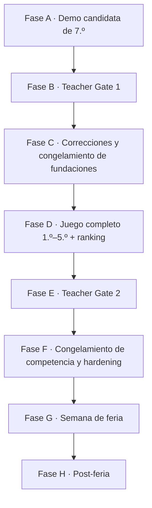

### Fase A — Demo candidata de 7.º

Un slice jugable y pulido de 7.º grado, representativo de la arquitectura y la identidad visual finales. No es un prototipo descartable. Su alcance está en el [vertical slice de 7.º grado](06-delivery/vertical-slice-grade-7.md).

**Audiencia:** el Departamento de Matemática.

### Fase B — Teacher Gate 1

**Completada el 1 de septiembre de 2026:** `PASSED_WITH_REQUIRED_ADJUSTMENTS`. La evidencia, acta y mapeo están en el [pack](06-delivery/teacher-gate-1/README.md). La salida aceptó la dirección y convirtió ajustes en requisitos de las fases siguientes.

### Fase C — Congelamiento de fundaciones

**Completada:** las correcciones de autoridad y score están integradas y STAGE-07
cerró: el egreso es un estado terminal alcanzable y la recuperación converge por
construcción. STAGE-08 ya comenzó con Phase 0 de diseño de carrera; reabrir
arquitectura o identidad requiere evidencia de defecto, no preferencia.

### Fase D — Producción del juego completo

`7.º → 1.º → 2.º → 3.º → 4.º → 5.º → Egreso`, más catálogo completo de escenarios, variantes desplegadas, ranking, backend de evento, verificación autoritativa y herramientas de operación.

**Actual:** STAGE-08 sigue IN_PROGRESS; Phase 0 está DONE tras Product Audit y
conformidad técnica reconciliados, y Phase 1 —1.º real como práctica de
desarrollo `7.º → 1.º`— cerró el 11 de septiembre. El STOP se cumplió: el audit de
escalabilidad post-G1 se ejecutó el 14 de septiembre y pasó con hardening
resuelto, así que producir 2.º–5.º queda autorizado. Epílogo, carrera oficial y ranking siguen sin implementar.
Ver [etapa actual](06-delivery/current-stage.md).

**Validación matemática de Fase D (D-S08-095).** La revisión del Departamento de
Matemática humano sobre 1.º–5.º **no se elimina: se difiere a Final Delivery /
Pre-Release Acceptance**. Hasta entonces, el gate es un Departamento de
Matemática provisional asistido por IA —pre-revisión, adjudicación independiente,
remediación, re-auditoría independiente y sign-off provisional—, que reduce riesgo
de contenido pero **no es aprobación docente** y no se presenta como tal. Cómo se
ubica esa revisión humana respecto de Teacher Gate 2 es una
[pregunta abierta](07-reference/open-questions.md). Estado en la
[adjudicación](04-quality/mathematics-department-ai-adjudication.md).


### Fase E — Teacher Gate 2

Revisión de aceptación del candidato completo. No es otra exploración de concepto: se revisan contenido final, progresión, comportamiento del score, duración, reglas de competencia y detalles de presentación.

### Fase F — Congelamiento de competencia y hardening

Se congelan las versiones de contenido, reglas y score. Después corren simulación, carga, red, seguridad, accesibilidad, QA móvil y ensayo operativo. Ver [modo feria y congelamiento](05-operations/fair-mode-and-competition-freeze.md).

### Fase G — Semana de feria

Estudiantes y visitantes juegan online y compiten. La política de intentos y el criterio de ranking los define la configuración del evento, aprobada previamente por los docentes.

### Fase H — Post-feria

Decidir si el juego queda online, si el ranking del evento se archiva, si se abre un modo libre o si el producto evoluciona.

## La restricción externa

> **No hay playtest con estudiantes del rango objetivo antes de la primera release de feria.**

Esto es una restricción del contexto, no una decisión de proceso, y tiene una consecuencia que la documentación debe decir en voz alta:

**Teacher Gate ≠ validación de experiencia de usuario.** La aprobación docente reduce riesgo de contenido, matemática y tono. No es evidencia de que un chico de 12 años entienda la pantalla en diez segundos, ni de que quiera jugar una segunda run.

Cualquier documento que hable de “validado con jugadores” antes de la Fase G está describiendo una intención, no un hecho.

## Controles compensatorios

Ninguno reemplaza el playtest faltante; en conjunto reducen las clases de riesgo que sí se pueden atacar sin jugadores reales.

| Control | Qué riesgo cubre | Dónde vive |
|---|---|---|
| Revisión heurística de UX | instrucciones, carga de texto, un primario a la vez | [UX e interacción](01-game-design/ux-interaction-design.md) |
| Prueba proxy con adultos sin asistencia verbal | dónde se pregunta “¿qué hago?” | [los gates docentes](06-delivery/teacher-gates.md) |
| Simulación determinista masiva | callejones sin salida, scores imposibles, deriva de replay | [estrategia de testing](04-quality/testing-strategy.md) |
| Validación de variantes e invariantes | variantes ambiguas, imposibles o triviales | [validación y auditoría de variantes](04-quality/variant-validation-and-audit.md) |
| Auditoría de equidad competitiva | dominancia, sesgo de velocidad, sesgo de volumen | [auditoría de equidad competitiva](04-quality/competition-fairness-audit.md) |
| Accesibilidad automatizada y manual | barreras de interacción predecibles | [accesibilidad del sistema de diseño](09-design-system/accessibility.md) |
| QA móvil en 360/390/430 px | layout y legibilidad reales | [NFR](04-quality/non-functional-requirements.md) |
| Telemetría lista el día uno | la feria es la primera exposición real | [analytics y observabilidad](03-architecture/analytics-observability.md) |
| Disciplina de congelamiento | reaccionar a una anécdota cambiando reglas en vivo | [modo feria y congelamiento](05-operations/fair-mode-and-competition-freeze.md) |

## Riesgo residual declarado

El proyecto acepta explícitamente que la diversión, la velocidad de comprensión y la distribución real de dificultad quedan inciertas hasta la feria. Las métricas de la Fase G son la primera evidencia real de uso y **no deben presentarse retroactivamente como validación previa**. Ver [métricas de éxito](00-product/success-metrics.md).

---

# FILE: 00-product/risks-and-assumptions.md

# Riesgos y supuestos

## Supuestos de producto

- El público principal tiene 12–17 años.
- La feria prioriza partidas breves y acceso por QR.
- El juego se usa principalmente en español.
- No se necesita identidad real para participar.
- El volumen de una feria escolar entra cómodamente en arquitectura serverless + Postgres gestionado.

## Riesgos principales

| Riesgo | Impacto | Probabilidad | Mitigación |
|---|---:|---:|---|
| Se percibe como examen | Alto | Medio | walkthroughs/proxy y gate docente; matemática intrínseca; riesgo residual sin playtest previo |
| Dificultad desigual 12–17 | Alto | Alto | piso accesible y dificultad estructural; Fair fija dificultad común |
| Contenido ambiguo | Alto | Medio | math review + invariants + golden seeds |
| Wi-Fi insuficiente | Alto | Alto | gameplay local-first; pending sync; fallback |
| Ranking manipulable | Medio/Alto | Medio | scoring server-side; rate limits; auditoría |
| Nicknames ofensivos | Alto en feria | Medio | filtro + moderación inmediata |
| Scope creep | Alto | Alto | roadmap por gates; no minijuegos especiales antes de validar core |
| Demasiados componentes únicos | Medio | Medio | content-as-data + interaction types |
| RNG genera injusticia | Alto | Medio | separar calidad ex ante de outcome; seeds/event rules |
| Service worker cachea versión vieja | Medio | Medio | diferir PWA offline avanzada; versionar assets/rules |

## Riesgos pedagógicos

- confundir velocidad con capacidad matemática;
- premiar sólo una estrategia cuando existen múltiples válidas;
- usar contextos no cercanos o sesgados;
- convertir errores en señal negativa personal;
- usar estadísticas de estudiantes fuera de contexto.

## Riesgos técnicos

- drift entre engine cliente y servidor;
- cambios de RNG rompen replay;
- migraciones incompatibles durante evento;
- payloads de actions demasiado grandes;
- dependencia innecesaria de realtime.

## Mitigación transversal

La principal defensa es mantener el sistema pequeño, determinista, versionado y testeable. Cada aumento de complejidad debe responder a evidencia de uso.

## Riesgos incorporados desde el blueprint v0.2

Riesgos que aparecen cuando el juego pasa a ser una competencia con premios y cuando se acepta que la primera exposición real es la feria.

| Riesgo | Impacto | Mitigación |
|---|---:|---|
| La primera prueba con estudiantes ocurre durante la feria | Alto | gate docente como proxy, UX conservadora, simulación, telemetría, hardening; el riesgo residual se **declara**, no se disimula |
| Una variante procedural sale ambigua o imposible | Alto | catálogo de variantes prevalidado y desplegado, invariantes ejecutables |
| Los intentos ilimitados favorecen a quien tiene más tiempo libre | Medio | personal best verificado en vez de suma; intentos ilimitados v1 |
| El jugador reintenta hasta recibir una run fácil | Medio | Competition Seed compartida emitida por servidor, variantes/dificultad/rareza fijas por edición |
| El score de ranking se puede falsificar | Alto | el servidor reproduce y calcula; nunca se confía el score final del navegador |
| El score premia la velocidad por encima del razonamiento | Alto | FairScore → Prestige → shared rank; tiempo sólo diagnóstico |
| El desempeño académico se cuenta dos veces | Medio | `MathPerformance` separado del Promedio visible |
| Estilo se convierte en un objetivo de optimización | Medio | Estilo no aporta FairScore, Prestige ni oportunidades competitivas |
| Matemática trivial para adultos y difícil para 12 años | Alto | piso bajo y techo alto; complejidad por restricciones y optimización |
| El diseño visual vuelve a parecerse a los juegos de referencia | Medio | sistema de diseño v0.2 aprobado y sus gates de tokens y contraste |
| Se cambia una regla en medio de la feria | Alto | congelamiento de versiones, control de cambios y capacidad de replay/regrade |

Los detalles de cada mitigación están en [validación y auditoría de variantes](04-quality/variant-validation-and-audit.md), [auditoría de equidad competitiva](04-quality/competition-fairness-audit.md) y [modo feria y congelamiento](05-operations/fair-mode-and-competition-freeze.md).

## Supuesto que cambió

El supuesto de que habría playtest con estudiantes antes de la primera release pública **ya no se sostiene**. Ver [ciclo de entrega real](00-product/real-delivery-lifecycle.md). Todo criterio de aceptación que dependa de jugadores reales antes de la feria es, hasta nuevo aviso, una intención.

---

# FILE: 00-product/scope-and-roadmap.md

# Alcance y roadmap

## Estrategia de entrega

La validación debe ocurrir en capas. El proyecto sólo incorpora infraestructura o variedad de contenido cuando la capa anterior demuestra valor.

## MVP 0 — Prototipo local

### Objetivo
Validar que el loop central sea comprensible y divertido.

### Incluye
- Landing mínima.
- Nickname local opcional.
- Carrera parcial: 7.º grado y 1.º año.
- 8–10 desafíos de inventario/cobertura para el prototipo (objetivo histórico; no longitud de una run normal).
- 3–4 patrones de interacción.
- Feedback de consecuencias.
- Score local provisional.
- Perfil final simplificado.
- Juego completamente cliente-side.
- Seed local determinista.

**Objetivo histórico de MVP 0.** El conteo de 8–10 se escribió antes de [ADR-019](03-architecture/adr/ADR-019-scenario-family-template-variant.md) como meta de contenido disponible y cobertura de demostración para 7.º + 1.º. Se conserva como antecedente; no define el presupuesto actual de una run normal, que selecciona uno o dos beats por etapa desde un catálogo que puede ser mucho más rico.

### No incluye
- Base de datos.
- Ranking global.
- Auth.
- Realtime.
- PWA offline completa.
- Admin de contenido.

### Criterio de salida

> **Corregido por el ciclo de entrega real.** Este criterio se escribió asumiendo una tanda de testers antes de seguir. Esa tanda no está garantizada: la primera exposición a estudiantes del rango objetivo es la feria. Ver [ciclo de entrega real](00-product/real-delivery-lifecycle.md).

- Un adulto que no participó del desarrollo completa una run sin explicación verbal, y se registra dónde preguntó qué hacer.
- Duración media dentro del rango deseado, medida por simulación y por esa prueba proxy.
- Se detectan al menos 3 desafíos que generan comentario o discusión.
- El Departamento de Matemática acepta la dirección en el Teacher Gate 1.

Los tres primeros son evidencia proxy y se declaran como tal. El cuarto es el gate real.

## MVP 1 — Producto web jugable

### Incluye
- Carrera completa: 7.º a 5.º.
- Inventario vigente de 7.º y 25 diseños de 1.º–5.º; el target histórico de 30–40 no impone nuevas Templates ni confunde variantes con contenido.
- Cinco motores de interacción reutilizables, con modos específicos según la taxonomía canónica.
- API de runs.
- PostgreSQL/Supabase.
- Ranking por evento.
- Score autoritativo en servidor.
- Perfiles finales.
- Analytics básico.
- Deploy público.

### Criterio de salida
- Puede soportar una prueba escolar controlada.
- No existen resultados oficiales calculados exclusivamente en cliente.
- Los desafíos procedurales pasan validación automatizada.

## MVP Feria — Operación real

### Incluye
- Evento de feria con seed/ruleset común.
- QR de entrada.
- Leaderboard público.
- Moderación de nicknames.
- Pantalla de proyección.
- Modo degradado para mala conectividad.
- Runbook operacional.
- Métricas de partidas iniciadas/completadas.
- Protección básica contra abuso.

### Criterio de salida
- Ensayo de carga y conectividad realizado.
- Plan de fallback probado.
- El organizador puede resetear/ocultar scores sin despliegue.

## Post-MVP

Posibles líneas:
- Daily challenge.
- Desafíos por curso/nivel.
- Más perfiles narrativos.
- Minijuegos especiales como Reactor 42.
- PWA instalable con soporte offline avanzado.
- Panel de administración de contenido.
- Modo docente para crear eventos.
- Comparación de decisiones por cohorte.
- Partidas privadas por código.
- Temporadas.
- Internacionalización.
- Multiplayer asíncrono.

## Fuera de alcance hasta nueva decisión

- Chat o mensajería entre menores.
- Login social obligatorio.
- Publicación de datos personales.
- Marketplace o compras.
- Publicidad.
- Sistema de amigos.
- Moderación social compleja.
- IA generativa creando problemas en producción sin validación determinista.

## Cómo se corresponden las capas con el ciclo real

Las capas MVP describen **qué se construye**. Las fases del [ciclo de entrega real](00-product/real-delivery-lifecycle.md) describen **quién valida y cuándo se congela**. Son dos ejes, no dos planes en competencia.

| Capa de alcance | Fase del ciclo real | Quién valida |
|---|---|---|
| MVP 0 — prototipo local | Fase A — demo candidata de 7.º | prueba proxy con adultos; **sin estudiantes** |
| — | Fase B — Teacher Gate 1 | Departamento de Matemática |
| — | Fase C — congelamiento de fundaciones | equipo |
| MVP 1 — producto web jugable | Fase D — producción del juego completo | tests, simulación y auditorías |
| — | Fase E — Teacher Gate 2 | Departamento de Matemática |
| MVP Feria — operación real | Fase F — congelamiento y hardening | ensayo de carga, red y operación |
| — | Fase G — semana de feria | **primera evidencia real de uso** |
| Post-MVP | Fase H — post-feria | decisión de producto |

## Alcance completo del producto

La progresión completa es `7.º → 1.º → 2.º → 3.º → 4.º → 5.º → EGRESO`. Cada etapa usa la misma gramática de diseño y de motor: los años posteriores agregan complejidad de contenido, **no un sistema de UI nuevo**.

El producto completo, más allá del MVP Feria, incluye: catálogo completo de escenarios y variantes deterministas, modelo de carrera Promedio · Equipo · Aura · Estilo, dominio matemático y flags ocultos, recuperación fail-forward donde corresponda, arquetipo final, score oficial de feria, ranking por evento, intentos ilimitados y mejor resultado verificado en Fair v1, reglas y contenido versionados, verificación de runs en servidor, moderación de nicknames y operación de feria.

Ver [alcance objetivo del motor](03-architecture/target-engine-architecture.md) para el estado real de cada capacidad.

## Escalamiento temático por año

Dirección de escalada **lúdica y narrativa**, no currículo-gate. TG1-01 exige que todos los años conserven un piso matemático accesible desde aproximadamente 7.º. Los dominios de la tabla son contextos posibles: cualquier concepto debe presentarse con apoyos suficientes y la dificultad viene de la estructura.

| Etapa | Qué se agrega como desafío |
|---|---|
| 7.º | **adaptación / entrada:** aprender la escuela y la gramática del juego con tiempo, porcentajes, área, presupuesto, asignación simple y divisibilidad |
| 1.º | **consolidación:** rutinas y vínculos ya conocidos; asignación, agenda, autogestión, probabilidad y construcción espacial |
| 2.º | **pertenencia / identidad:** grupos, cooperación, competencia, reputación y lugar propio |
| 3.º | **autonomía:** tiempo, recursos, tecnología, movilidad y trade-offs más autodirigidos |
| 4.º | **responsabilidad:** coordinación, liderazgo y consecuencias públicas con restricciones y optimización accesible |
| 5.º | **cierre / futuro:** proyecto y eventos finales, callbacks, egreso y síntesis del recorrido |

Esta progresión narrativa está aceptada en la
[envolvente de diseño de STAGE-08](01-game-design/stage-08-product-design-envelope.md).
7.º y 1.º ocurren en la misma escuela: 1.º no repite la adaptación institucional.

### Producción de contenido después del Teacher Gate 1

La [matriz v0.3](01-game-design/full-career-content-matrix.md) conserva 25
Templates de 1.º–5.º `DESIGN-CANDIDATE-APPROVED`, no contenido runtime.
Product Audit y conformidad técnica reconciliados cierran Phase 0. Sigue
[Phase 1: implementar 1.º](06-delivery/implementation-sequence.md#phase-1-implementar-1º-real),
STOP y gate post-G1; sólo con PASS se escala 2.º–5.º.

La profundidad del catálogo no define longitud de run: Normal/Fair v1 tiene nueve
beats ordinarios. Los targets de formas semánticas y materializaciones están en
[autoría](01-game-design/content-authoring-guide.md), sin agregar Templates
antes de G1 salvo BLOCKER genuino. Teacher Demo sigue separado y orientado a
amplitud. Fair v1 repite una Competition Seed compartida por edición; Practice
ofrece variedad procedural, sin rank oficial.

## Seguimiento del cierre matemático de STAGE-08

La re-auditoría independiente de ronda 2 verificó los cinco contratos escritos y
**falló** igual: las dos Templates que la ronda existía para arreglar admitían una
estrategia reutilizable **más simple** que la eliminada, y la auditoría permanente
no podía verla. El
[sprint de cierre](04-quality/stage-08-mathematics-final-closure-sprint.md)
está **DONE**: cierra la clase entera con una familia finita de ocho políticas de
baja complejidad, corrida sobre las 42 Templates, y cierra además tres atajos que
esa familia hizo visibles —`g7.group-tasks`, `y5.final-trip-or-event` y
`y1.mobile-data`—. Seis catálogos republicados, tres `pnpm verify` consecutivos en
verde, motor y FairScore intactos.

STAGE-08 sigue IN_PROGRESS; después corresponde la **Final Mathematics Closure
Audit**, de sólo lectura. Sign-off provisional pendiente de su PASS, revisión
humana diferida a Final Delivery y pacing real pendiente.

---

# FILE: 00-product/success-metrics.md

# Métricas de éxito

## North Star inicial

**Tasa de runs completadas con intención de repetir.**

La métrica combina finalización y atractivo. En pruebas cualitativas, preguntar inmediatamente “¿jugarías otra run ahora?” permite detectar si el producto sólo se entiende o también genera rejugabilidad.

## Métricas de experiencia

- Tiempo hasta primera interacción.
- Tiempo total de run.
- Tasa de finalización.
- Tasa de reintento voluntario.
- Abandono por año/desafío.
- Uso de herramientas/pistas.
- Tiempo por tipo de interacción.

## Métricas de contenido

- % de jugadores que eligen cada opción.
- Distribución de score por desafío.
- Tasa de solución funcional/eficiente/óptima.
- Desafíos con tasa de error extrema.
- Desafíos con tiempo de resolución anómalo.
- Diferencia de desempeño por dificultad elegida, nunca por datos personales sensibles.

## Métricas lúdicas

- Diversidad de perfiles finales.
- Número medio de consecuencias narrativas activadas.
- Distribución de decisiones arriesgadas.
- Número de runs por jugador anónimo/sesión.

## Métricas de feria

- Runs iniciadas por hora.
- Runs completadas por hora.
- Usuarios concurrentes aproximados.
- Error rate API.
- Latencia p95 de start/finish/leaderboard.
- Porcentaje de runs enviadas después de modo offline/degradado.

## Targets iniciales de validación

No son contratos; sirven como hipótesis.

- 80% completa la primera run iniciada en pruebas moderadas.
- Mediana de run entre 4 y 7 minutos.
- 50% o más acepta jugar nuevamente cuando se le ofrece de inmediato.
- Menos de 5% abandona por confusión de UI en un desafío individual.
- 95% de requests críticos de feria bajo 1 s en condiciones normales.

## Métricas que NO deben convertirse en KPI principal

- Nota matemática equivalente.
- Cantidad total de clicks.
- Tiempo de pantalla por sí solo.
- Posición individual de estudiantes identificables.

El producto es lúdico y educativo; optimizar exclusivamente engagement puede llevar a patrones de diseño que contradigan el contexto escolar.

## Antes y después de la feria

Porque no hay playtest con estudiantes antes del lanzamiento, conviene separar dos clases de métrica que no se pueden mezclar: las que se pueden **cerrar antes** y las que sólo existen **después**. Ver [ciclo de entrega real](00-product/real-delivery-lifecycle.md).

### Gates medibles antes de la release

Son verificables sin jugadores reales, y por eso son gates de verdad.

- 100 % de las variantes competitivas pasan la validación de invariantes;
- 100 % de las runs oficiales son reproducibles por seed, versiones y action log;
- 0 defectos P0/P1 conocidos de motor o de ranking;
- 0 variantes con respuesta ambigua en el catálogo desplegado;
- los flujos móviles representativos pasan en 360, 390 y 430 px;
- operación completa por teclado y con movimiento reducido, verificada;
- las simulaciones de distribución de score no muestran una plantilla ni una posición de respuesta dominando de forma inesperada;
- el leaderboard no se puede actualizar con un score enviado por el cliente.

### Indicadores del Teacher Gate 1

- el contenido queda aceptado o con una lista acotada de correcciones;
- los docentes pueden explicar el objetivo matemático de cada familia de la demo;
- los principios de ranking se consideran apropiados para repartir premios;
- no se pide un rediseño fundacional.

### Evidencia recién disponible en la feria

Telemetría agregada y pseudónima: tasa de finalización, duración activa mediana, distribución de resultados por desafío, punto de abandono, tasa de error, éxito de envío al ranking, distribución de score y mejora entre intentos repetidos.

**Esta es la primera evidencia real de uso.** No puede presentarse retroactivamente como validación previa, y ninguna de las métricas de esta sección reemplaza el playtest que no ocurrió.

---

# FILE: 01-game-design/challenge-catalog.md

# Catálogo semilla de desafíos

Este documento conserva el catálogo semilla que originó el primer slice y el
contenido de 7.º. No es un `RunPlan` ni compromiso de implementar todos sus ítems.
Para 1.º–5.º, las tablas históricas de abajo quedaron **supersedidas** por la
[Matriz de carrera completa v0.3](01-game-design/full-career-content-matrix.md), con los cinco
pases `DESIGN-CANDIDATE-APPROVED`; se preservan para trazabilidad, no para
planificar implementación. La cantidad final de Templates/Variants sigue abierta
en las [preguntas 46 y 46-bis](07-reference/open-questions.md), y cada diseño
vigente debe pasar guía de autoría y validación antes de producción.

## 7.º grado

| ID | Escenario | Matemática | Interacción | Decisión/objetivo |
|---|---|---|---|---|
| C01 | Kiosco entre amigos | suma, división, presupuesto | Decision Card | elegir compra que alcance para el grupo |
| C02 | Llegar a horario | tiempo, suma de minutos | Timeline | estimar llegada y elegir transporte |
| C02b | Salir a tiempo | tiempo, porcentaje sobre una duración | Numeric Input | decir con cuánta anticipación hay que salir |
| C03 | Foto del curso | división y resto | Spatial/Decision | formar filas con restricciones |
| C04 | Mural simple | área y cobertura | Decision Card | comprar pintura suficiente |
| C05 | Repartir impresiones | división | Assignment | distribuir páginas equitativamente |
| C06 | Educación física | distancia/fracciones | Numeric Input | calcular vueltas de pista |
| C41 | Acto del 25 de Mayo | clasificación: paridad, múltiplos, primos | Number Grid | seguir la coreografía marcando los números que cumplen cada regla |

## 1.º año — propuesta semilla histórica supersedida

| ID | Escenario | Matemática | Interacción | Decisión/objetivo |
|---|---|---|---|---|
| C07 | Semana de pruebas | tiempo, priorización | Budget/Timeline | repartir horas de estudio |
| C08 | Notebook en oferta | porcentajes | Decision Card | comparar descuento porcentual/fijo |
| C09 | Materiales para maqueta | proporciones | Budget Builder | comprar cantidades suficientes |
| C10 | Plano del aula | escala | Spatial Grid | ubicar elementos respetando escala |
| C11 | Entradas para acto | porcentajes/capacidad | Numeric/Decision | decidir si se pueden vender más |
| C12 | Recreo compartido | proporción/costo unitario | Decision Card | comparar packs |

## 2.º año — propuesta semilla histórica supersedida

| ID | Escenario | Matemática | Interacción | Decisión/objetivo |
|---|---|---|---|---|
| C13 | Trabajo grupal | asignación/restricciones | Assignment Board | asignar personas según habilidad y horas |
| C14 | Plan de datos del viaje | tasas/unidades | Decision Card | elegir plan suficiente y eficiente |
| C15 | Subir video a la nube | velocidad/unidades | Numeric/Decision | determinar si termina antes del plazo |
| C16 | Torneo escolar | combinatoria básica | Graph/Decision | calcular partidos todos-contra-todos |
| C17 | Comprar remeras | descuentos escalonados | Budget Builder | elegir proveedor según cantidad |
| C18 | Campaña de reciclaje | razones | Chart | comparar kg/alumno entre cursos |

## 3.º año — propuesta semilla histórica supersedida

| ID | Escenario | Matemática | Interacción | Decisión/objetivo |
|---|---|---|---|---|
| C19 | Viaje escolar | presupuesto multietapa | Budget Builder | cubrir transporte/alojamiento/actividades |
| C20 | Rifa del curso | ingresos, costo, probabilidad | Decision Card | elegir estrategia de recaudación |
| C21 | Buffet del evento | margen/costo unitario | Budget Builder | fijar combinación rentable |
| C22 | Horario de stands | intervalos/restricciones | Timeline | asignar franjas sin solapamientos |
| C23 | Cableado del stand | distancia/geometría | Spatial Grid | elegir recorrido suficiente/corto |
| C24 | Batería para exposición | consumo/tasa | Decision Card | elegir batería según duración |

## 4.º año — propuesta semilla histórica supersedida

| ID | Escenario | Matemática | Interacción | Decisión/objetivo |
|---|---|---|---|---|
| C25 | Encuesta estudiantil | porcentajes/muestra | Chart + Request Info | juzgar confianza antes de cambiar campaña |
| C26 | Dos publicaciones | proporciones | Chart/Decision | comparar engagement rate |
| C27 | “Mejoramos 200%” | porcentajes/interpretación | Decision Card | evaluar afirmación y contexto |
| C28 | Seguidores por semana | crecimiento/función | Sequence | proyectar tendencia y decidir inversión |
| C29 | Evento con lluvia | probabilidad/riesgo | Decision Card | elegir plan logístico |
| C30 | Promedio engañoso | media/mediana | Chart | elegir medida representativa |
| C31 | Encuestas incompatibles | tamaño de muestra | Request Info | decidir qué evidencia pesa más |

## 5.º año — propuesta semilla histórica supersedida

| ID | Escenario | Matemática | Interacción | Decisión/objetivo |
|---|---|---|---|---|
| C32 | Feria de ciencias | presupuesto + tiempo + riesgo | Multi-step | elegir proyecto viable |
| C33 | Stand final | área/perímetro/optimización | Spatial Grid | maximizar uso de espacio con circulación |
| C34 | Proyecto de software | horas/capacidad | Assignment Board | distribuir backlog entre equipo |
| C35 | Hosting del proyecto | costo fijo/variable | Decision Card | elegir plan según tráfico esperado |
| C36 | Imprimir merchandising | break-even | Numeric/Decision | determinar cantidad mínima rentable |
| C37 | Transporte a competencia | tasas/costos | Decision Card | comparar rutas y medios |
| C38 | Presentación final | scheduling | Timeline | ordenar tareas críticas antes del deadline |
| C39 | Encuesta final | estadística/intervalos | Chart | detectar conclusión excesiva |
| C40 | Fondo de egresados | porcentajes/crecimiento | Decision Card | comparar planes de ahorro simples |

## Eventos especiales / bosses — propuesta semilla histórica

| ID | Evento | Combinación |
|---|---|---|
| B01 | Organizar el viaje | presupuesto + proporciones + tiempo |
| B02 | Torneo escolar | combinatoria + scheduling + recursos |
| B03 | Semana de exámenes | optimización + tiempo + energía |
| B04 | Centro de estudiantes | estadística + porcentajes + estrategia |
| B05 | Feria final | geometría + presupuesto + asignación + riesgo |
| B06 | Reactor 42 cameo | aritmética/composición de expresiones |

## Plantillas recomendadas para el primer vertical slice — antecedente

Esta fue la recomendación histórica que dio origen al slice; no es trabajo actual:
- C02 Timeline.
- C04 Decision Card/geometry.
- C08 porcentajes.
- C13 Assignment Board simplificado.
- C14 tasas/unidades.
- C25 Chart/Request Info.
- C33 Spatial Grid simplificado.
- C35 trade-off de costos.

Esto prueba ocho tipos de razonamiento sin necesitar contenido definitivo para todas las etapas.

## Implementado

Contenido de producto que existe en el repositorio, en `src/content/grade-7/`. **Ocho plantillas** y diez storylets; una partida juega seis situaciones, porque el slot del colectivo aloja dos plantillas y el seed elige cuál sale. La octava plantilla es de **repaso** y no entra en esa cuenta: no la elige la selección ordinaria, la juega un año que quedó debiendo. El resto del catálogo sigue siendo backlog.

| ID en código | Entrada del catálogo | Interacción | Matemática | Escenario implementado |
|---|---|---|---|---|
| `g7.bus-timing` | C02 | Timeline | porcentaje sobre una duración, suma de minutos | elegir a qué hora salir sabiendo que el viaje se demora |
| `g7.bus-latest-departure` | C02b | Numeric Input | la misma relación recorrida al revés, con un margen pedido | decir con cuántos minutos de anticipación hay que salir |
| `g7.may-25-act` | C41 | Number Grid | paridad, múltiplos de 3 y números primos | seguir la coreografía del acto escolar con una ayudamemoria numérica |
| `g7.mural-paint` | C04 | Decision Card | área y cobertura por litro, compra por envase entero | comprar la pintura del mural |
| `g7.notebook-offer` | C08 | Decision Card | descuento porcentual contra descuento fijo | elegir la oferta que entra en el presupuesto |
| `g7.group-tasks` | C13 | Assignment Board | asignación con horas disponibles y habilidad | repartir el trabajo grupal |
| `g7.stand-supplies` | C09 | Budget Builder | costo unitario por pack, mínimo que alcanza | comprar insumos para el stand de la feria |
| `g7.bus-travel-review` | — | Numeric Input | el paso intermedio solo: la demora aplicada a la duración | **repaso** del colectivo, cuando el año quedó debiéndolo |

### Con cuánto tiempo hay que salir

`g7.bus-latest-departure` · interacción `numeric-input` · dificultad base 3 · categorías `time-and-rates` y `proportions-and-percentages`.

**Estado: contenido de producción con fuente matemática `generated`.** Es la segunda plantilla de la familia `bus` y la razón por la que la familia existe: la situación es la misma —el 60 viene con demora— y la pregunta se da vuelta. Ver [ADR-021](03-architecture/adr/ADR-021-approved-catalog-in-play-and-teacher-demo.md).

**Por qué es otra plantilla y no otra variante.**

| | `g7.bus-timing` | `g7.bus-latest-departure` |
|---|---|---|
| Pregunta | ¿a qué salida me subo? | ¿con cuánto tiempo salgo? |
| Trabajo | evaluar cuatro candidatas y descartar | recorrer la relación al revés |
| Respuesta | está entre las opciones | la produce el jugador |
| Error | elegir mal | quedarse corto o pasarse |

Una pregunta cuya respuesta está en pantalla y otra cuya respuesta hay que construir no son la misma pregunta con otros números. Que la interacción sea distinta es consecuencia del razonamiento, no decoración.

**Matemática.** Viaje con demora porcentual, más el margen que el grupo pide:

```
viaje de hoy  = duración + duración · demora%
anticipación  = viaje de hoy + margen pedido
```

Los pares duración/demora están restringidos a los que dan **minutos enteros**, y la anticipación resultante tiene que caer entre 20 y 90 minutos: ni tres minutos ni dos horas son números que alguien estime.

**Evaluación asimétrica.** Pasarse y quedarse corto no son el mismo error, y el resultado lo dice:

| Diferencia contra lo necesario | Calidad | Lo que pasa |
|---|---|---|
| negativa | `invalid` | llegan tarde o sin el margen que habían pedido |
| hasta 2 min de más | `optimal` | el número justo |
| hasta 15 min de más | `efficient` | llegan bien y esperan un rato |
| más de 15 min | `functional` | llegan con la escuela cerrada |

**Carrera.** Sólo Estilo. El colectivo no es una evaluación: nadie pone una nota por llegar a horario.

**Espacio de variantes.** 360 problemas distintos, que es el producto exacto de sus restricciones: 30 pares duración/demora, 4 horas de entrada y 3 márgenes. La auditoría de 10.000 candidatos los aprueba a todos y descarta el resto por duplicado, con cero rechazos. El aviso de tasa de duplicados es aritmética —agotado el espacio, todo candidato repite— y no un defecto. Que 360 alcancen es una afirmación sobre un catálogo de desarrollo.

### Acto del 25 de Mayo

`g7.may-25-act` · interacción `number-grid` · dificultad base 2 · categorías `patterns-and-relations` y `quantity`.

**Estado: contenido de producción con fuente matemática `generated`.** La escena, la coreografía, las señales, las reglas y el feedback son autorados. Las grillas numéricas concretas pertenecen al generador determinista `may-25.grid.constraint-first` y pasan por el pipeline de [ADR-020](03-architecture/adr/ADR-020-variant-generation-and-approved-catalog.md). Desde [ADR-021](03-architecture/adr/ADR-021-approved-catalog-in-play-and-teacher-demo.md) la partida selecciona dentro del catálogo aprobado —27 grillas, no las tres curadas— sin volver procedural la narrativa. El evento introduce Aura cuando se juega: la Teacher Demo lo incluye deliberadamente; una partida normal compuesta sólo lo juega si lo seleccionó su `RunPlan`.

**Propósito narrativo.** Al jugador le toca la coreografía folklórica del acto escolar, adelante de toda la escuela. Como no se acuerda los pasos, armó una ayudamemoria: cada paso tiene una regla numérica, y de la tira de números que canta la maestra acompaña sólo los que la cumplen. Es el único momento del año que pasa en público, y ésa es exactamente la condición que Aura pide.

**Interacción.** Tres pasos, uno debajo del otro, resueltos en una sola confirmación. Cada paso muestra su señal —«Pañuelo blanco», «Pañuelo celeste», «Zapateo»— y su regla **siempre escrita**, más una grilla de ocho números en cuatro columnas. Se marca celda por celda. Ninguna celda revela si estuvo bien hasta que el motor evalúa: marcado significa «elegí ésta», nunca «acerté».

**Rondas autoradas.** Cada variante conserva tres pasos narrativos, siempre en el mismo orden de dificultad; lo que cambia de forma generada y validada son los números de cada grilla:

| Paso | Señal | Regla | Objetivos por grilla |
|---|---|---|---|
| 1 | Pañuelo blanco | números pares | 4 de 8 |
| 2 | Pañuelo celeste | múltiplos de 3 | 3 de 8 |
| 3 | Zapateo | números primos | 3 de 8 |

Los objetivos por grilla de la tabla son los de las coreografías curadas; las generadas llevan tres o cuatro, y nunca más de doce en total. Todos los números son enteros de 0 a 30, para que la clasificación nunca dependa de una cuenta difícil. La ronda de primos incluye el **1** a propósito: es el error clásico de la edad, y la grilla corregida lo muestra tachado sin retar a nadie.

**Matemática.**

- **Par**: entero divisible por 2. El cero es par.
- **Múltiplo de 3**: entero divisible por 3.
- **Primo**: entero mayor que 1 con exactamente dos divisores positivos. Por lo tanto **0 no es primo**, **1 no es primo** y **2 sí lo es**, el único primo par.

Las tres viven en `src/game/math/classification.ts`, fuera de React y fuera del contenido: es el único lugar del producto donde se decide si un número cumple una regla.

**Evaluación.** Los tres pasos se agregan sumando sus confusiones —`TP` aciertos, `FP` marcas de más, `FN` objetivos sin marcar— y se juzgan con un solo F1. Micro-agregar y no promediar tres F1 hace que cada celda pese lo mismo.

```
precisión = TP / (TP + FP)
cobertura = TP / (TP + FN)
F1        = 2·TP / (2·TP + FP + FN)
```

Se juzga con **las dos juntas** y no sólo con la precisión, porque cada una tiene su forma de mentir: marcar una sola celda evidente da 100 % de precisión sin haber hecho la tarea, y marcar la grilla entera da 100 % de cobertura. Los tres casos de denominador cero están decididos explícitamente: no marcar nada teniendo objetivos da precisión 0 —no marcar no es acertar—; una ronda sin objetivos y sin marcas vale 1 en las tres.

**Umbrales.** Sobre el F1 agregado, comparados como racionales exactos:

| F1 | Calidad | Lo que se lee |
|---|---|---|
| = 1 | `optimal` | Óptimo · «Impecable» |
| ≥ 0,85 | `efficient` | Resuelto · «Salió» |
| ≥ 0,70 | `functional` | Parcial · «Zafaste» |
| < 0,70 | `invalid` | Insuficiente · «Se cortó» |

Están elegidos para que ninguna estrategia degenerada pase por buena: marcar las 24 celdas da `F1 = 0,67` y cae en Insuficiente.

Eso dejó de ser una propiedad de las tres coreografías escritas y pasó a ser una **restricción de generación**. Marcando todo hay `T` aciertos y `24 − T` marcas de más, así que `F1 = 2T/(T + 24)`, y quedar debajo de 0,70 exige `T ≤ 12`. El generador construye los objetivos desde ese techo —tres por ronda de piso, hasta uno más en rondas distintas— y un validador independiente rechaza cualquier coreografía donde marcar todo alcanzaría para zafar. Se descubrió al poner el catálogo aprobado a jugar: con hasta cinco objetivos por ronda existían variantes de quince en las que marcar la grilla entera daba «Salió». Ver [ADR-021](03-architecture/adr/ADR-021-approved-catalog-in-play-and-teacher-demo.md).

Ese cambio llevó el generador a versión `2`. `grade-7-dev-1` conserva las coreografías de la versión `1`; `grade-7-dev-2` usa la versión corregida. Una misma dirección generada del acto puede tener huellas distintas entre ambos catálogos sin que ninguno haya sido mutado.

**Aura.** `+1000` impecable · `+400` salió con un error · `+80` zafó improvisando · `−300` se cortó. Es la dimensión que este evento existe para establecer, y puede quedar en positivo o en negativo.

**Estilo.** Aplicado cuando salió completo y con cuidado; Estratega cuando lo sostuvo leer el patrón rápido pese a un error; Improvisador cuando la coreografía se reconstruyó en vez de seguirse —tanto al zafar como al cortarse—. Ningún eje es mejor que otro.

**Promedio.** No lo toca. Un acto escolar no es una evaluación de matemática, y Promedio sale del legajo de notas reales: que un desafío tenga números no lo vuelve académico.

**Equipo.** No lo toca. Bailás vos; el curso mira.

**Fail-forward.** No hay game over. El peor acto deja Aura negativa, evidencia de Improvisador y una consecuencia narrativa, y el año sigue.

**Determinismo.** El `runSeed` selecciona una dirección de la lista jugable actual, pero no define sus grillas. Una vez elegida `familia/plantilla/variante`, los parámetros salen del seed fijo del espacio de contenido y de esa dirección, independientes de la run, el año y el slot. Bajo la misma versión de contenido/generador, la misma dirección es siempre el mismo problema; ver [ADR-019](03-architecture/adr/ADR-019-scenario-family-template-variant.md) y [ADR-020](03-architecture/adr/ADR-020-variant-generation-and-approved-catalog.md). Desde [ADR-021](03-architecture/adr/ADR-021-approved-catalog-in-play-and-teacher-demo.md) la lista jugable **es el catálogo aprobado**: el seed elige dentro de lo que pasó el pipeline, no dentro de las tres grillas curadas. El contenido llegó a `0.8.0-grade-7` con los perfiles de score y a `0.9.0-grade-7` con `g7.bus-travel-review`. `grade-7-dev-5` conservó intactas las 159 direcciones de `dev-4` y sumó las 26 variantes del repaso; el vigente es `grade-7-dev-6`, que conserva las direcciones de `dev-5` salvo las del mural, rebalanceadas por la [remediación matemática](04-quality/mathematics-remediation-implementation.md) bajo `contentVersion 0.10.0-grade-7`. Las versiones anteriores siguen publicadas. Ver [ADR-023](03-architecture/adr/ADR-023-competitive-score-policy.md) y [ADR-024](03-architecture/adr/ADR-024-progression-recovery-and-graduation.md).

**Accesibilidad.** Cada celda es una casilla nativa de 56 px: se recorre con Tab y se marca con Espacio. La regla siempre está en texto y nunca es sólo un color. Los cuatro estados corregidos cambian relleno, trazo de borde y glifo a la vez, y llevan además la palabra para lector de pantalla, así que la grilla se lee entera en escala de grises.

Desvíos deliberados respecto del catálogo semilla:

- **C08 y C13 se adelantaron a 7.º grado.** El catálogo los ubica en 1.º y 2.º año. El slice necesitaba cinco tipos de interacción distintos para probar que el motor y la UI soportan variedad real, y la matemática de ambos (porcentaje simple, asignación con restricciones) es accesible en 7.º. Cuando se implementen 1.º y 2.º año, esos escenarios se reescriben con números y contexto propios de cada etapa; no se reutiliza la instancia de 7.º.
- **C09 cambió de escenario.** El catálogo lo describe como materiales para una maqueta; se implementó como insumos para el stand de la feria, porque cierra el arco narrativo del año. La matemática y la interacción son las declaradas.
- **C01, C03, C05 y C06 no se implementaron.** El resto queda como backlog para variar el año entre partidas.

El detalle de variantes, calidades y consecuencias de cada uno está en [el diseño del slice](06-delivery/vertical-slice-grade-7.md).

---

# FILE: 01-game-design/challenge-families-and-variants.md

# Familias de escenario, plantillas y variantes

**Estado: implementado hasta STAGE-05.** La jerarquía `ScenarioFamily → ChallengeTemplate → ChallengeVariant` está aceptada en [ADR-019](03-architecture/adr/ADR-019-scenario-family-template-variant.md), el pipeline híbrido con catálogo aprobado de desarrollo en [ADR-020](03-architecture/adr/ADR-020-variant-generation-and-approved-catalog.md), su consumo por la partida real en [ADR-021](03-architecture/adr/ADR-021-approved-catalog-in-play-and-teacher-demo.md), y la composición normal por presupuesto en [ADR-022](03-architecture/adr/ADR-022-difficulty-model-and-run-composer.md). La promesa de que una familia aloja varias plantillas está cumplida en contenido de producción: la familia `bus` tiene dos, con razonamientos distintos. El determinismo sigue **LOCKED**. El inventario, la profundidad cognitiva del resto de las familias, la calibración docente y el catálogo oficial de feria permanecen abiertos.

## El problema

Un desafío fijo se memoriza. Cambiar `25 %` por `15 %` compra una partida más: el jugador igual aprende “la segunda opción”. Lo que hace falta es **variación estructural** —que cambie el razonamiento, no sólo los números.

Un docente que juega dos veces la demo tiene que ver una diferencia real. Si sólo se reordenan las opciones, no se puede llamar variación.

En 7.º eso ya pasa: la segunda partida trae otros números en las seis situaciones, y en la del colectivo puede traer **otra pregunta** —de «¿a qué salida me subo?» a «¿con cuánto tiempo salgo?»—, que es el mismo dato recorrido al revés.

## Cuidado con la palabra «familia»

El proyecto usa «familia» en dos sentidos y conviene no confundirlos:

| Término | Qué agrupa | Dónde se define |
|---|---|---|
| **Familia de interacción** | el patrón de UI con el que se responde: Decision Card, Timeline, Number Grid… | [sistema de desafíos](01-game-design/challenge-system.md) |
| **Familia de escenario** (`ScenarioFamily`) | el dominio narrativo reconocible: Colectivo, Mural, Cuaderno, Proyecto grupal, Stand | este documento |

Una familia de escenario puede usar varias familias de interacción, y al revés. Cuando un documento diga «familia» sin calificar, el contexto manda: en `challenge-system.md` es interacción; acá es escenario.

## La jerarquía

```text
ScenarioFamily          contexto narrativo reconocible
  └─ Template           estructura de razonamiento distinta dentro de ese contexto
       └─ Variant       parametrización concreta y determinista de esa estructura
```

### Familia

El contexto que el jugador reconoce: Colectivo, Mural, Cuaderno, Proyecto grupal, Stand de feria.

### Plantilla

Una estructura de razonamiento distinta dentro del mismo contexto. No es «el mismo problema con otros números»: es otra pregunta.

Colectivo, por ejemplo:

- **demora porcentual** — duración normal + porcentaje de demora + hora de entrada;
- **última salida posible** — derivar el último horario seguro;
- **comparación de rutas** — dos alternativas con duración y demora distintas;
- **frecuencia** — próximo servicio + duración + límite de llegada.

Mural: cobertura; cobertura descontando aberturas; cobertura con precios de envase y presupuesto.
Cuaderno: porcentaje contra descuento fijo; cuotas contra efectivo disponible; descuento más costo adicional.
Proyecto grupal: asignación por habilidad; restricción de capacidad y horas; reparto balanceado.
Stand: selección de packs; requisitos mínimos; optimización de presupuesto.

### Variante

Un caso concreto y reproducible de una plantilla, identificado por la dirección estable `familia/plantilla/variante`. Sus parámetros pueden ser autorados o generados, pero su identidad semántica nunca depende de una posición de array o del lugar donde una run lo juegue.

## Dirección y seed de contenido

**LOCKED e implementado.** [ADR-020](03-architecture/adr/ADR-020-variant-generation-and-approved-catalog.md) separa selección de contenido y contenido semántico:

```text
seed fijo del espacio de variantes + dirección familia/plantilla/variante
    → parámetros semánticos reproducibles

runSeed
    → selección de qué dirección recibe una run
```

El código lo implementa con `VARIANT_SPACE_SEED`, `variantRngPath(ref)` y `createVariantRng(ref)`. Bajo el mismo contrato versionado de contenido y generador, el mismo `ChallengeVariantRef` materializa el mismo problema aunque cambien la run, la etapa o el slot. `runSeed` puede elegir otra dirección; no redefine qué significa una dirección aprobada. La lógica de dominio nunca llama a `Math.random()` ambiente y reutiliza los substreams de [ADR-012](03-architecture/adr/ADR-012-seeded-prng-and-substreams.md).

## Generación por restricción, no por sorteo

**Implementado.** Generar desde la propiedad pedagógica deseada, no desde parámetros arbitrarios con la esperanza de que el resultado siga siendo válido.

Ejemplo de mural: se quiere que 1 L no alcance, 2 L sea óptimo y 4 L sea válido pero derrochador. Con cobertura de 8 m²/L, se genera primero el área requerida en `(8, 16]` y recién después se eligen dimensiones legibles que den ese área. El camino inverso —elegir dimensiones y ver qué sale— produce variantes triviales o imposibles.

Esto ya es el patrón vigente del motor: el generador produce parámetros, el verificador comprueba invariantes y la presentación nunca lleva la solución. Ver [game engine](03-architecture/game-engine.md).

## Variación no es azar

```text
fuente autorada o generada → resolver/materializar → validar
    → canonizar → fingerprint → deduplicar → catálogo aprobado versionado
```

Un número al azar en runtime puede producir decimales feos, óptimos ambiguos, opciones duplicadas, estados imposibles, variantes triviales o dificultad desbalanceada. En una partida de práctica eso es un bug; en una competencia con premios es una injusticia que no se puede deshacer.

Una fuente `generated` es un espacio finito direccionado y determinista que pasa por el pipeline offline; no es generación arbitraria en el browser. Una fuente `authored` es una lista curada, pero no evita validación, fingerprint ni deduplicación.

El principio viene de STACK, que recomienda pregenerar, testear y desplegar variantes aleatorias en vez de exponer al estudiante a casos defectuosos generados en vivo. Ver [base teórica](07-reference/research-basis.md).

## Catálogo aprobado de desarrollo

**Implementado.** `ApprovedVariantCatalog` guarda la dirección, el origen `authored`/`generated` y el fingerprint de cada variante aprobada. No guarda parámetros ni posiciones: los parámetros se reconstruyen desde la dirección y la huella comprueba que siguen siendo los mismos.

El artefacto vigente es `grade-7-dev-6`, con 185 entradas para las ocho plantillas de producción: las de `dev-5` salvo las 26 del mural, cuya población se rebalanceó para que 2 L y 4 L sean la respuesta óptima en partes casi iguales (remediación matemática, MAT-006), bajo `contentVersion 0.10.0-grade-7`. `dev-5` —las 159 de `dev-4` más las 26 de `g7.bus-travel-review`—, `dev-1`, con 133, y `dev-2`/`dev-3`/`dev-4`, con 159, siguen publicados sin cambios. **Una versión publicada no se edita**: cuando el contenido cambia se construye la siguiente y la anterior queda tal cual, porque una run tiene que poder resolverse contra el conjunto que realmente jugó. Los seis catálogos son reproducibles byte a byte y `pnpm game:variants check` verifica la integridad del vigente dentro de `pnpm verify`.

`grade-7-dev-2` no es un superconjunto **semántico exacto** de `dev-1`: las plantillas cuyo contrato de generación no cambió conservan direcciones y huellas, pero el generador del acto del 25 de Mayo pasó a versión `2` y puede materializar otro contenido en una misma dirección bajo el contrato nuevo. `dev-1` conserva la versión anterior; no se reescribe. Ver [ADR-021](03-architecture/adr/ADR-021-approved-catalog-in-play-and-teacher-demo.md).

`grade-7-dev-3` sí conserva la población semántica aprobada de `dev-2`: mismas direcciones y mismas huellas. Es otra versión inmutable porque se construyó para `contentVersion 0.7.0-grade-7`; no representa variantes jugables nuevas. Ver [ADR-022](03-architecture/adr/ADR-022-difficulty-model-and-run-composer.md).

`grade-7-dev-4` conserva a su vez las direcciones y huellas de `dev-3`. Se publicó para `contentVersion 0.8.0-grade-7`, que incorpora los perfiles declarativos de score: no cambió la población matemática aprobada, pero sí la semántica que determina cuánto vale una run. Ver [ADR-023](03-architecture/adr/ADR-023-competitive-score-policy.md).

Desde [ADR-021](03-architecture/adr/ADR-021-approved-catalog-in-play-and-teacher-demo.md) **la partida elige dentro del catálogo aprobado**: el motor recibe un `ApprovedVariantLookup` y sortea sobre lo aprobado, con lo declarado por la plantilla como respaldo para un content set que todavía no tiene catálogo. `createRun` rechaza una run cuyo `variantCatalogVersion` no sea el del catálogo contra el que se la juega o reproduce.

Es un **catálogo aprobado de desarrollo**, no el catálogo oficial ni justo de la feria. La partida real de 7.º ya lo consume y STAGE-05 implementó el `RunComposer`: la partida normal queda fijada como un plan concreto dentro de un presupuesto de dificultad antes de ejecutarse. Lo pendiente es poblar el catálogo de contenido real de 1.º–5.º y congelar un catálogo oficial de feria.

La huella es `sha256` de la vista semántica canónica declarada por la plantilla. Dos direcciones que producen el mismo problema colisionan y se deduplican intencionalmente.

## Controles anti-memorización

- barajado de opciones derivado del seed cuando la semántica lo permita;
- verificación de que la posición de la opción correcta esté balanceada;
- evitar repetir plantilla o variante inmediatamente dentro de una run;
- mantener una carga estructural comparable entre runs mediante la `CompositionPolicy` y su presupuesto implementado;
- no exponer el seed como una forma de elegir la run fácil.

Los criterios de aceptación de estos controles están en [validación y auditoría de variantes](04-quality/variant-validation-and-audit.md).

## Estado de implementación

| Capacidad | Estado |
|---|---|
| Generación seeded, verificación de invariantes y vista pública sin solución | **implementado** en `src/game/challenges/` |
| Reproducibilidad por seed + versiones + acciones | **implementado**, con property tests y golden replays |
| Jerarquía explícita `ScenarioFamily → Template → Variant` | **implementada** — [ADR-019](03-architecture/adr/ADR-019-scenario-family-template-variant.md), `src/game/challenges/content-model.ts` |
| Variante con identidad, dirección y substream propios | **implementada**; la dirección es `familia/plantilla/variante` |
| Catálogo de contenido disponible, separado del plan de la run | **implementado** — `ContentCatalog` y `RunPlan` |
| Elegibilidad por etapa declarativa, incluso no contigua | **implementada** |
| Roles de colocación y presupuesto de beats por año | **implementados** como contrato de plan validable |
| Fuentes híbridas `authored` / `generated`, ambas validadas | **implementadas** — siete plantillas generadas y `g7.group-tasks` autorada |
| Generador por restricción como abstracción reutilizable | **implementado** — [ADR-020](03-architecture/adr/ADR-020-variant-generation-and-approved-catalog.md) |
| Validación, fingerprint, deduplicación y auditoría de población | **implementados** para el catálogo de desarrollo |
| Catálogo aprobado y versionado de variantes | **implementado** con `dev-1` a `dev-6` inmutables; `grade-7-dev-6` es el vigente y el oficial de la feria sigue sin congelar |
| `variantCatalogVersion` en la identidad de la run | **implementado** como campo opcional: una run que juega variantes curadas no salió de ningún catálogo y lo dice omitiéndolo |
| Perfil cognitivo, banda derivada y costo de scheduling | **implementados**; la calibración exacta sigue en Teacher Gate |
| Compositor normal por presupuesto y `RunPlan` concreto | **implementados**; `grade-7-composed` prueba el camino real y la genericidad de seis etapas se prueba sólo con fixtures sintéticos |

Cuidado con la palabra «catálogo»: `ContentCatalog` dice qué familias y plantillas existen; `ApprovedVariantCatalog` dice qué variantes concretas fueron aprobadas bajo una versión; `DemoPlan` dice qué muestra la demo docente; `RunPlan` dice qué juega una run normal. Son contratos distintos. El compositor y la comparabilidad **estructural bajo la política candidata** ya existen; lo que todavía no existe es el catálogo oficial congelado de feria, contenido real de 1.º–5.º ni equivalencia empírica validada por docentes.

La brecha completa y su orden están en [arquitectura objetivo del motor](03-architecture/target-engine-architecture.md) y en [la secuencia de implementación](06-delivery/implementation-sequence.md).

---

# FILE: 01-game-design/challenge-system.md

# Sistema de desafíos

## Objetivo

Evitar que Egresado se transforme en una secuencia de multiple-choice. El contenido se construye sobre un conjunto limitado de **patrones de interacción reutilizables**.

## Cinco motores reutilizables de interacción v1

**LOCKED en producto; soporte runtime parcial.** Esta taxonomía supersede la
lista histórica de diez familias y los nombres de tableros como primitivas
independientes. `ScenarioFamily` sigue siendo escenario; los once
`InteractionKind` actuales son contratos técnicos, no once motores de producto.

| Motor | Modos / componentes, no motores adicionales | Templates de referencia |
|---|---|---|
| Choice / Compare | cards, tabla + claim, escenarios, input numérico acotado | g7.notebook-offer; y2.course-project-survey, standings-claim; y3.transport-pass; y5.final-trip-or-event, next-step-options |
| Allocate / Constrain | Allocation/Constraint Builder, cantidades, recursos, turnos, contingencia, páginas | g7.group-tasks, stand-supplies; y1.course-project-expo, mobile-data; y2.intercurso-plan, team-kit-order; y3.course-project-tech; y4.shift-coverage, course-project-fundraiser; y5.course-project-final, yearbook |
| Timeline / Schedule | deadline, salida inversa, secuencia, disponibilidad, agenda semanal | g7.bus-timing, bus-latest-departure; y1.rehearsal-schedule; y3.friend-day, week-planner |
| Spatial / Graph Canvas | fit/scale, regiones, Route Builder, Flow Board, capacidad, ratio/crop | g7.mural-paint; y1.classroom-layout; y2.court-zones; y3.route-plan; y4.school-event-flow, event-floor-plan; y5.stage-screen |
| Grid / Select / Classify | Number Grid, conteos/distribución, Spinner Builder | g7.may-25-act; y1.student-day-challenge-wheel |

Los modos compuestos conservan un motor principal para contar diversidad.
Intercurso puede combinar Allocate con Timeline; Project Final combina asignación,
tiempo y contingencia; `represent-class` usa comparación/construcción acotada y
comunicación separada, cuya composición concreta se cierra al autorarlo.
Estas correspondencias son de producto. En runtime, 1.º implementa sólo los modos
que necesita: `quantity-builder` (cantidades de un plan y posiciones de una
distribución), `schedule-builder` (agenda constructiva) y `spatial-layout` (plano
por coordenadas), todos operables con teclado y tap, sin arrastre. En 7.º el mural
sigue usando BudgetBuilder y el colectivo compara opciones.

Sin sexto motor en Phase 1 salvo evidencia de que los cinco distorsionan la acción
matemática y revisión explícita de diseño. Sliders, tablas, inputs, pedir información
y animación de rueda son componentes/modos, no frameworks nuevos.

La primera exposición a cada motor ofrece una pista contextual de un paso sobre
la interacción, no sobre la solución matemática; después se reduce. Teacher Demo
futura expone los cinco deliberadamente, separada de la carrera normal. Cada motor
define teclado, tap/touch, foco, errores, labels y reduced motion según [UX](01-game-design/ux-interaction-design.md).
La frontera técnica y las extensiones futuras están en [ADR-025](03-architecture/adr/ADR-025-full-career-contract-evolution.md).

## Taxonomía matemática

- Cantidad.
- Proporciones y porcentajes.
- Tiempo y tasas.
- Espacio y forma.
- Patrones y relaciones.
- Datos y estadística.
- Probabilidad e incertidumbre.
- Optimización y restricciones.

## Ejemplos canónicos

### Mural
Pared 6 × 2,4 m; cobertura 8 m²/L; elegir pack suficiente/óptimo.

### Notebook
Comparar 20% de descuento vs descuento fijo/cuotas y restricción de efectivo.

### Encuesta
Interpretar 41/38/21 con muestra 90/600 y decidir nivel de confianza.

### Colectivo
28 min con 25% de demora desde 07:10 y entrada 07:45.

### Trabajo grupal
Asignar integrantes con habilidades y horas limitadas.

### Plan de datos
600 MB/día durante 12 días; comparar packs.

### Interacción de redes
Comparar engagement relativo, no likes absolutos.

## Dificultad

La dificultad no depende sólo de números grandes.

Factores:
- cantidad de variables;
- necesidad de múltiples pasos;
- decimales/fracciones;
- información irrelevante;
- información faltante;
- número de restricciones;
- incertidumbre;
- cantidad de soluciones válidas;
- necesidad de optimización y no sólo factibilidad.

## Generación procedural

Patrón recomendado:

1. Generar parámetros desde seed.
2. Resolver el problema internamente.
3. Verificar invariantes.
4. Calcular conjunto de soluciones válidas.
5. Clasificar dificultad.
6. Renderizar narrativa.

Nunca generar opciones al azar y asumir que una es correcta.

## Regla de contenido

Cada desafío debe documentar explícitamente:
- concepto matemático;
- competencia requerida;
- interacción;
- solución/es;
- función de evaluación;
- explicación de feedback;
- parámetros válidos;
- edge cases.

## Variación estructural, no sólo numérica

El patrón de generación de arriba evita que una variante salga rota. No evita que el jugador memorice la respuesta: si el mismo escenario siempre pregunta lo mismo, cambiar `25 %` por `15 %` compra una partida más y nada más.

La arquitectura vigente agrega un nivel intermedio —**plantillas**: estructuras de razonamiento distintas dentro del mismo escenario— y un catálogo aprobado de variantes prevalidado. Ver [familias, plantillas y variantes](01-game-design/challenge-families-and-variants.md) para la jerarquía, la generación por restricción y los controles anti-memorización, y [validación y auditoría de variantes](04-quality/variant-validation-and-audit.md) para los invariantes que una variante aprobada debe cumplir.

La jerarquía y el pipeline están **implementados** por [ADR-019](03-architecture/adr/ADR-019-scenario-family-template-variant.md) y [ADR-020](03-architecture/adr/ADR-020-variant-generation-and-approved-catalog.md): siete plantillas de producción tienen fuente generada y `g7.group-tasks` conserva deliberadamente una fuente autorada, todas validadas. Desde [ADR-021](03-architecture/adr/ADR-021-approved-catalog-in-play-and-teacher-demo.md), el catálogo aprobado alimenta la partida real; el vigente es `grade-7-dev-6`, con 185 direcciones: las de `dev-5` —159 de `dev-4` más 26 de `g7.bus-travel-review`— con el mural rebalanceado por la [remediación matemática](04-quality/mathematics-remediation-implementation.md). La familia `bus` demuestra variación cognitiva con `g7.bus-timing` y `g7.bus-latest-departure`, que preguntan y se responden de maneras distintas. Es la primera prueba de producción; ampliar esa profundidad al resto del catálogo sigue siendo trabajo futuro de contenido.

## Bandas de dificultad

Además de `DifficultyLevel` 1–5, la autoría y la competencia usan tres bandas —`CORE`, `STANDARD`, `STRETCH`— que describen estructura de razonamiento en vez de intensidad. La correspondencia entre ambas escalas y el presupuesto de dificultad están en [dificultad y jugabilidad universal](01-game-design/difficulty-and-playability.md).

---

# FILE: 01-game-design/competitive-scoring-and-ranking.md

# Score competitivo y ranking

**Estado post-TG1:** mecanismo implementado; filosofía y ponderación 85/10/5 aceptadas como dirección docente; política todavía candidata y no oficial. Teacher Gate 1 no prueba equidad psicométrica ni reemplaza el congelamiento de competencia. La fórmula oficial final sigue **OPEN** ([pregunta 24](07-reference/open-questions.md)).

El score por evento vigente —`base × calidad × dificultad + bonus − penalizaciones`— está en [reglas, scoring y progresión](01-game-design/rules-scoring-and-progression.md) y sigue siendo la capa de carrera. La capa **competitiva** conserva `fair-score-dev-1@1.0.0-candidate` como calibración histórica pre-Gate 80/15/5; las runs nuevas usan `fair-score-dev-2@2.0.0-post-tg1-candidate`, 85/10/5 y `official: false`. Ver [ADR-023](03-architecture/adr/ADR-023-competitive-score-policy.md). STAGE-08 aceptó además la semántica de producto de [Prestige](01-game-design/rare-events-and-prestige.md) como segundo criterio lexicográfico futuro; no existe todavía en runtime.

## Tres capas que no son la misma cosa

| Capa | Qué responde | Dónde vive |
|---|---|---|
| **Resultado de desafío** | ¿qué tan bien se resolvió esta situación? | `SolutionQuality` + métricas de razonamiento |
| **Identidad de carrera** | ¿qué clase de recorrido escolar construí? | Promedio · Equipo · Aura · Estilo |
| **Score competitivo** | ¿qué tan fuerte fue esta run bajo una calibración concreta? | `FairScore`, cuando el descriptor declara `scoreVersion` |

Están relacionadas y no son intercambiables. Un documento futuro que las trate como un solo sistema estará equivocado en las tres.

## Por qué no se multiplican las stats visibles

Una fórmula del tipo `Aura × 1 + Matemática × 10 + Equipo × 5` no significa lo que parece: las variables viven en escalas distintas.

- dominio matemático oculto: `0–1`;
- Promedio: `1–10`;
- Equipo: `0–100`;
- Aura: con signo, sin techo.

Un multiplicador no expresa peso relativo hasta que cada componente está normalizado. Antes de normalizar, el «peso» es un accidente de escala.

## Arquitectura de score implementada con calibración candidata

Cada evaluador devuelve, además de sus efectos de carrera, una medida de desempeño competitivo normalizada.

### Calidad matemática por evento

`q_i ∈ [0,1]`

Calibración discreta **aceptada en TG1-09 como candidato de desarrollo**:

| Calidad | `q` candidato |
|---|---|
| óptima | 1,00 |
| eficiente / resuelta | 0,75 |
| funcional / parcial | 0,40 |
| inválida / insuficiente | 0,10 |

Las interacciones continuas —por ejemplo la grilla de clasificación del acto del 25 de Mayo, que ya se juzga con F1— usan su propia métrica de calidad en vez de estas cuatro cajas. Ver [catálogo de desafíos](01-game-design/challenge-catalog.md).

> Nota de terminología: el motor nombra las calidades `invalid · functional · efficient · optimal`; el blueprint las nombra `insufficient · partial · resolved · optimal`. Es la misma escala de cuatro escalones con distinta etiqueta. El [glosario](07-reference/glossary.md) fija la correspondencia.

### Desempeño matemático normalizado

```text
MathRaw         = Σ (1000 × q_i × difficultyFactor_i)
MathMax         = Σ (1000 × 1,0 × difficultyFactor_i)
MathPerformance = 10000 × MathRaw / MathMax
```

Normalizar contra el máximo alcanzable de *esa* run es lo que permite comparar runs armadas con plantillas distintas.

### Contribuciones de Equipo y Aura

Si se decide que “toda la carrera cuenta”, la contribución competitiva es **una medida de evento acotada**, no el valor visible de la stat.

- `TeamPerformance ∈ [0, 10000]`;
- `AuraPerformance ∈ [0, 10000]` después de normalización y tope del evento.

Aura cruda sigue siendo con signo y sin techo para uso narrativo. Aura competitiva tiene que estar topeada: un solo momento espectacular no puede ganarle a una run matemáticamente superior.

### FairScore post-TG1 candidato

**TEACHER-INFORMED CANDIDATE — no es la fórmula oficial.**

```text
FairScore = round(0,85 × MathPerformance + 0,10 × TeamPerformance + 0,05 × AuraPerformance)
```

TG1-04 eligió 85/10/5 y reafirmó que matemática debe pesar más que Equipo y Aura juntos. Es una dirección de producto informada por docente, no una afirmación de superioridad empírica.

La implementación lo expresa como políticas inmutables resolubles por identidad o versión exacta, sin fallback `latest`. `dev-1` permanece reproducible; `dev-2` es la candidata actual. El desglose guarda id y versión, y `RunDescriptor.scoreVersion` guarda la versión exacta. Ver [ejemplo de política de score](07-reference/score-policy.example.json).

### Qué pasa cuando una run no tiene la oportunidad

Los planes difieren en qué contienen: una partida compuesta de 7.º son dos beats de pura matemática y no ofrece ni equipo ni aura. Puntuarla sobre 8.000 mientras otra se puntúa sobre 10.000 castigaría a alguien por un sorteo que no hizo.

**Una componente sin oportunidad sale, y su peso se reparte entre las que quedaron.** TG1-07 aceptó esta filosofía. El juego perfecto vale 10.000 en toda run válida, y sacar una secundaria sólo puede aumentar la proporción de la matemática. No se fuerza cobertura de Equipo/Aura desde el compositor.

### Qué componente lee cada plantilla

Cada plantilla declara qué hecho suyo alimenta cada componente, y por qué es un hecho **distinto** del que otra ya leyó. La tabla de cobertura de 7.º está en el ADR; sus dos resultados incómodos vale la pena adelantarlos:

- **el stand mueve Equipo en la carrera y no aporta equipo competitivo**, porque su eficiencia es el costo mínimo que la matemática ya cobró;
- **ninguna plantilla de producción aporta aura competitiva**, porque el acto —el único evento que mueve Aura— sólo mide el F1 que la matemática ya usa. La componente existe, está topeada y la ejercitan los fixtures. Una componente honestamente vacía es mejor que una señal inventada para llenarla.

TG1-05/TG1-06 aceptaron escenas multi-eje con una condición: cada eje debe leer un hecho semánticamente independiente. Es válido separar factibilidad matemática de calidad de colaboración. Es inválido copiar el mismo F1 del acto a Matemática y Aura. La sugerencia sobre May-25 se conserva como intención para STAGE-08; antes de aportar Aura necesita una decisión pública/social distinta.

### Evidencia de la calibración candidata

Sobre 23.000 planes compuestos —20.000 años reales de 7.º más planes de uno, ocho y doce beats de fixtures— `fair-score-dev-2` da:

| Perfil sintético | Score |
|---|---|
| juego perfecto | 10.000 en **todos** los planes, sin dispersión |
| matemática fuerte, secundarias mínimas | 7.800 – 9.000 |
| matemática floja, secundarias perfectas | 2.000 – 3.200 |
| peor juego posible | 0 |

Las dos franjas del medio **no se cruzan**. `pnpm game:score` reproduce la tabla y `--compare` incluye la comparación histórica `dev-1`/`dev-2` con contribuciones por componente.

Nada de esto demuestra que 85/10/5 sea psicométricamente justo. Demuestra que el mecanismo cumple las invariantes que se le pidieron bajo esa candidata.

## Qué no entra al score

### Promedio

No se suma aparte si ya está determinado por desempeño académico matemático. Sumarlo dos veces cuenta la misma habilidad dos veces.

### Estilo

No participa de FairScore **ni de Prestige competitivo**, directa o indirectamente.
El Product Pass supersede expresamente el track STYLE candidato. Darle score a Aplicado, Estratega o Improvisador implicaría que hay una personalidad objetivamente superior, y eso destruye el concepto de perfil: el juego dice explícitamente que ningún eje es el malo.

### Cantidad de intentos

No es desempate en ninguna dirección. Premiar más intentos premia tiempo libre; penalizarlos castiga la práctica. Queda como dato informativo; v1 no lo usa para ordenar.

## Intentos y personal best

**TG1 ACCEPTED PRODUCT DIRECTION.** Los intentos son lógicamente ilimitados y el ranking futuro conserva el **mejor resultado verificado**, no la suma.

Sumar intentos convierte el ranking en una medida de tiempo disponible. El mejor intento premia la mejora sin castigar a quien llegó tarde a la feria. La guía de GameKit para desafíos repetibles apunta en la misma dirección; ver [base teórica](07-reference/research-basis.md).

STAGE-09 implementará emisión autoritativa, identidad y persistencia. Fair v1
usa una Competition Seed compartida por edición: mismos plan, variantes,
dificultad fija y estado raro en cada intento. Practice conserva variedad procedural
aprobada y no envía resultados al ranking oficial. La operación está en [modo feria y congelamiento](05-operations/fair-mode-and-competition-freeze.md).

## Desempate

**LOCKED v1.** El Product Pass supersede cualquier candidato temporal y toda tupla
terciaria basada en Math, óptimos, precisión o dificultad:

1. `FairScore` descendente;
2. `PrestigeScore` descendente;
3. **puesto compartido** si ambos empatan.

No se suma Prestige a FairScore: 9.999/100 nunca supera 10.000/0. La política de
Prestige está en [su fuente](01-game-design/rare-events-and-prestige.md). Ningún timestamp,
runId, orden de llegada, intentos, seed o RNG decide un puesto o premio en silencio.
Un ID puede estabilizar el orden visual entre empatados, sin romper el puesto.

### Empate exacto

La implementación del comparador pertenece a STAGE-09; la regla de producto ya
no está OPEN. Si un organizador necesita un único premio, acuerda un desafío común
separado o reconoce co-ganadores; no cambia el ranking v1 por un criterio oculto.
Los detalles de premios/cierre son de [operaciones](05-operations/fair-mode-and-competition-freeze.md).

### Tiempo

Tiempo de respuesta y duración total son diagnósticos UX/telemetría, nunca inputs
de FairScore, Prestige ni ranking. No hay bonus de velocidad ni desempate temporal.
La ausencia de presión de tiempo protege teclado, lectura pausada y razonamiento.

## Transparencia

La explicación pública distingue: matemática dominante en FairScore; Prestige
secundario por logros independientes; empate compartido y ninguna ventaja por
velocidad. No se presenta una suma ficticia de ambas escalas.

## Gate de score para carrera completa

Se conserva `fair-score-dev-2` 85/10/5. Factores pequeños 1,00/1,08/1,15 y
costos de scheduling siguen siendo políticas distintas; la seed fija iguala sus
entradas competitivas. El mecanismo normaliza perfecto a 10.000 para evidencia
máxima disponible, pero autoría debe probar que esos máximos son conjuntamente
alcanzables en cada Template y en planes oficiales de nueve beats.

Un mismo hecho puede actualizar Equipo/Aura de carrera y su componente FairScore:
la stat no se suma de nuevo al ranking. No puede además pagar Prestige. Promedio
permanece ledger de carrera; el F1 de May-25 no se copia a Aura competitiva.
Recovery queda fuera de numerador y denominador por rol. Ver
[conformidad técnica](04-quality/full-career-technical-conformance.md).

## Estado de implementación

| Capacidad | Estado |
|---|---|
| Score por evento determinista, con política nombrada y versionada | **implementado**, marcado `production: false` |
| Separación entre stats visibles y métricas ocultas de razonamiento | **implementado** |
| `MathPerformance` / `TeamPerformance` / `AuraPerformance` normalizados | **implementado**, en puntos básicos enteros |
| `FairScore` y desglose competitivo | **implementado**; `fair-score-dev-1` histórico y `fair-score-dev-2` actual, ambos `official: false` |
| Recomputación y verificación autoritativa del score en servidor | **implementado**: el servidor puntúa reproduciendo, y `verifyScoreClaim` contradice un reclamo campo por campo |
| Semántica de `PrestigeScore` como segundo criterio lexicográfico | **producto v1 cerrado**, presupuesto definido en Prestige; no implementado |
| Comparador lexicográfico versionado | **no implementado**; STAGE-09 implementa FairScore → Prestige → puesto compartido |
| Personal best transaccional en servidor | **no implementado** |
| `scoreVersion` en la identidad de la run | **implementado**, opcional: una partida de práctica no está compitiendo |

Ver [arquitectura objetivo del motor](03-architecture/target-engine-architecture.md).

---

# FILE: 01-game-design/content-authoring-guide.md

# Guía de autoría de contenido

## Objetivo

Permitir que nuevos desafíos se incorporen con consistencia lúdica, matemática y técnica.

## Plantilla de diseño

Cada desafío debe responder:

1. **Situación:** ¿qué ocurre?
2. **Objetivo del personaje:** ¿qué quiere lograr?
3. **Datos:** ¿qué números conoce?
4. **Restricciones:** ¿qué limita las opciones?
5. **Acción del jugador:** ¿qué manipula/elige?
6. **Matemática:** ¿qué razonamiento ayuda?
7. **Soluciones:** ¿qué es inválido, funcional, eficiente u óptimo?
8. **Consecuencia:** ¿cómo se explica el resultado?
9. **Efecto narrativo:** ¿qué stats/flags cambian?
10. **Variantes:** ¿qué parámetros pueden generarse proceduralmente?

## Intrinsic Math Gate

**LOCKED.** Toda variante aprobada pasa cinco controles:

1. **IM-1 Remove numbers:** quitar cantidades/relaciones debe cambiar materialmente la decisión.
2. **IM-2 Mathematical action:** la relación matemática es necesaria para elegir/construir; no basta preferencia narrativa.
3. **IM-3 Context return:** el resultado produce una consecuencia del mundo, no sólo respuesta numérica con prosa decorativa.
4. **IM-4 No quiz wrapper:** rechazar cálculo que desbloquea una elección no relacionada; la matemática constituye la acción.
5. **IM-5 Strategy legitimacy:** cuando se prometen estrategias distintas, existe más de un plan matemáticamente válido y semánticamente diferente.

Se evalúa el resultado/plan, no un procedimiento escolar obligatorio. Cálculo mental,
estimación, comparación, razonamiento inverso y espacial son métodos legítimos.

## Resultados semánticos

Se conserva 100/75/40/10 para Optimal/Efficient/Functional/Invalid; una métrica
continua honesta, como F1, no se aplana. Functional mantiene viable el objetivo
real y sacrifica algo secundario declarado; no es un nombre amable para un plan
matemáticamente imposible. Invalid viola una restricción esencial. Cada evaluador
especifica los escalones y evita confundir objetivos secundarios con obligaciones.

## Definition of Ready de Template

Antes de implementarla: ID estable, placement/etapas, razonamiento primario,
banda, pacing, motor principal/modo, evidencia Math, Team/Aura o `none`, oportunidad
de Estilo, mapping de recovery o `none`, callbacks de entrada/salida, relación rara,
resultados, restricciones de generación, guardrails y recorrido accesible.
La taxonomía está en [matriz](01-game-design/full-career-content-matrix.md#taxonomía-primaria-y-contexto)
y [sistema de desafíos](01-game-design/challenge-system.md); no se crean enums ejecutables aquí.

## Profundidad de variantes

**Distinción LOCKED; cantidades RECOMENDADAS como targets de producción, no límites de arquitectura.** Distinguir
formas semánticas de una Template —mismas invariantes, distintas configuraciones
significativas— de materializaciones con números distintos. No confundirlas con
nuevas Templates ni romper la banda aprobada para fabricar variedad.

| Contenido | Formas semánticas mínimas objetivo | Materializaciones aprobadas objetivo |
|---|---|---|
| Template normal | 3 | ≥12 |
| Template de alto riesgo | 4 | ≥16 |
| Recovery | según concepto aislado | ≥8 |

Requieren sign-off manual explícito: y1.student-day-challenge-wheel;
y2.course-project-survey, standings-claim; y3.course-project-tech, transport-pass;
y4.school-event-flow, course-project-fundraiser, event-floor-plan, represent-class;
y5.final-trip-or-event, course-project-final, next-step-options. No se declara ese
sign-off realizado por aprobar este documento.

## Accesibilidad matemática universal

TG1-01 convierte el piso bajo/techo alto en requisito para todos los años. Antes de aprobar una plantilla, responder:

1. ¿Un jugador capaz a nivel aproximado de 7.º entiende los conceptos necesarios?
2. ¿La dificultad viene del razonamiento y no de currículo avanzado?
3. ¿Unidades y términos se introducen con claridad?
4. ¿El año académico cambia el contexto y la responsabilidad, no el prerrequisito?
5. ¿La situación se entiende sin fórmulas especializadas de años posteriores?

Accesible no significa trivial: el techo puede subir mediante restricciones, optimización, planificación, información irrelevante y consecuencias.

## Longitud

- Título: 2–6 palabras.
- Contexto principal: idealmente <60 palabras.
- Opciones: frases cortas.
- Explicación posterior: fragmentada visualmente, no párrafo largo.

## Parámetros

Definir rangos seguros.

Ejemplo:

```text
wall_width: [3.0, 8.0]
wall_height: [2.0, 3.5]
coverage_per_liter: [5, 10]
packages: generated so that >=1 valid and >=1 invalid option exist
```

## Invariantes de generación

Un challenge procedural debe poder afirmar automáticamente:
- tiene al menos una solución funcional;
- si declara solución óptima, ésta existe;
- no hay dos opciones visualmente distintas con mismo resultado si eso confunde;
- las unidades son consistentes;
- el resultado entra en límites de UI;
- no se produce división por cero;
- el valor no excede precisión razonable para la etapa.

## Estados de contenido

- `draft`.
- `math_reviewed` — revisado por el Departamento de Matemática.
- `playtest_ready` — listo para prueba con jugadores. Antes de la feria eso significa **prueba proxy con adultos**, no con estudiantes del rango objetivo; ver [ciclo de entrega real](00-product/real-delivery-lifecycle.md).
- `production_ready`.
- `retired`.

## Diseño aprobado en Phase 0

Las fichas de [1.º](01-game-design/grade-1-template-design.md), [2.º](01-game-design/grade-2-template-design.md),
[3.º](01-game-design/grade-3-template-design.md), [4.º](01-game-design/grade-4-template-design.md) y
[5.º](01-game-design/grade-5-template-design.md) tienen estado `DESIGN-CANDIDATE-APPROVED`.
Esto aprueba situación, intención matemática, invariantes, placement, pacing y
evidencia; no equivale a `math_reviewed`, `playtest_ready` ni `production_ready`.
Los cinco pases están completos; los parámetros y evaluadores ejecutables no
están producidos.

Antes de producir cada Template se detallan unidades, precisión/redondeo,
tolerancia, rangos, función objetivo, soluciones alternativas, feedback,
variantes y evidencia independiente. Los invariantes `LOCKED` de su ficha son
condiciones de rechazo de variantes, no sugerencias. Las interacciones nombradas
describen dirección de diseño: se revisan contra los interaction types/adapters
existentes; una mecánica nueva requiere decisión aparte antes de implementarla.

El pipeline conserva revisión matemática/editorial, barrido de seeds, validación
a 360 px y teclado. No se interpreta la aprobación documental como evidencia
de esos checks. La
[auditoría cruzada de Phase 0](04-quality/content-validation.md#full-career-cross-content-audit)
ya fue integrada; el siguiente paso es implementar G1 bajo el roadmap. El cierre
de prediseño no sustituye ninguno de esos checks.

## Checklist editorial

- Lenguaje argentino neutral, comprensible fuera de una provincia específica.
- No usar marcas comerciales reales salvo decisión expresa.
- No asumir nivel socioeconómico como norma; montos relativos/ficticios, sin juicios de poder adquisitivo real ni dependencia de inflación.
- Evitar presión financiera personal; contextualizar presupuestos como recursos del proyecto/curso.
- No usar salud, religión, política partidaria u otros datos sensibles del jugador como personalización.
- Humor sin humillación.

## Tres preguntas que la plantilla original no hacía

### Efectos de carrera: sólo los que se pueden mover

¿El evento toca genuinamente Promedio, Equipo, Aura o Estilo? La mayoría de los eventos deberían tocar **una o dos** dimensiones, no las cuatro. Una clave ausente significa que el evento no puede mover esa dimensión, y por eso `Promedio +0` ni siquiera es representable. Ver [ADR-016](03-architecture/adr/ADR-016-career-player-model.md).

Promedio se mueve sólo si el evento es genuinamente académico. Aura se mueve sólo si el momento es socialmente memorable: un cálculo correcto no produce Aura.

### Efectos de competencia: separados de las stats visibles

Cada evaluador declara su calidad matemática normalizada y, si corresponde, una contribución acotada de Equipo o de Aura, **aparte** de los efectos de carrera visibles. TG1-05/TG1-06 permiten multi-evaluación, con esta regla canónica:

> Una misma escena puede evaluar más de una dimensión, pero no puede otorgar crédito competitivo dos veces por la misma evidencia.

Checklist obligatorio:

1. ¿Qué propiedad matemática se mide?
2. ¿Qué propiedad de Equipo se mide, si existe?
3. ¿Qué propiedad de Aura se mide, si existe?
4. ¿Son hechos genuinamente diferentes?
5. ¿Se puede quitar una componente sin cambiar el significado de otra?
6. ¿Alguna señal se está contando dos veces?

Válido: factibilidad matemática y calidad independiente del reparto de responsabilidades. Inválido: copiar el mismo F1 del acto del 25 de Mayo a Matemática y Aura. Si no existe evidencia independiente, la componente es `none`; no se fuerza Equipo/Aura por plantilla.

La idea docente del colectivo —varios márgenes matemáticamente válidos con consecuencias sociales distintas— es un ejemplo futuro de autoría, no una regla runtime actual. Del mismo modo, May-25 sólo podrá aportar Aura competitiva si incorpora una decisión pública/social distinta de la clasificación numérica.

### Estilo y evidencia de identidad

Estilo sólo se infiere de alternativas estratégicas significativas, preferentemente
planes matemáticamente defendibles. No nace de azar, resultado automático ni
calidad Math sola: una respuesta inválida no etiqueta la identidad del jugador.
Sólo afecta Career/Narrative/display, no FairScore, Prestige ni acceso exclusivo
a oportunidades competitivas. Los pesos exactos siguen siendo calibración futura.

### Ocultos: dominio y flags

¿Qué dominios matemáticos ejercita? ¿Qué flag narrativo escribe? Ninguno de los dos se renderiza.

## Invariantes antes que generador

Los invariantes de una variante se escriben **antes** que el código que la genera: al menos una solución válida, sin óptimo ambiguo salvo diseño explícito, aritmética legible, contexto escolar plausible, sin opciones duplicadas y posición de la opción correcta no fija. La dificultad no se declara como etiqueta elegida: la plantilla declara su perfil cognitivo y la banda se deriva.

La lista completa y sus criterios de aceptación están en [validación y auditoría de variantes](04-quality/variant-validation-and-audit.md).

## Elegir la fuente de variantes

Desde [ADR-020](03-architecture/adr/ADR-020-variant-generation-and-approved-catalog.md), cada plantilla declara un `VariantSourceSpec` con parámetros autorados, validadores, una vista canónica y, cuando corresponde, un generador determinista.

Hay dos estrategias de primera clase:

```text
AUTHORED
parámetros curados → validar → canonizar → fingerprint
    → deduplicar → catálogo aprobado de desarrollo

GENERATED
dominio paramétrico + generador constraint-first → materializar
    → validar con oráculo → auditoría profunda → canonizar
    → fingerprint → deduplicar → catálogo aprobado de desarrollo
```

`AUTHORED` no significa «confiable sin validar»: cada registro pasa por los chequeos genéricos y específicos, la huella y la deduplicación. Es la estrategia deliberada para contenido cuyo valor está en nombres, entidades o escritura curada; `g7.group-tasks` es el ejemplo actual.

`GENERATED` no significa producir números arbitrarios durante una partida. Bajo un contrato versionado de contenido y generador, cada candidato es una función pura de su dirección y del seed fijo del espacio de contenido; sólo una variante aprobada puede entrar al catálogo. Los siete generadores actuales se ejecutan y auditan con tooling offline. El browser materializa una dirección conocida, no improvisa contenido sin validar.

Cambiar el contrato de un generador exige una versión nueva de generador, contenido y catálogo. La versión publicada anterior permanece reconstruible: no se la regenera para adoptar la semántica nueva. El acto del 25 de Mayo, versión `1` en `grade-7-dev-1` y versión `2` desde `grade-7-dev-2`, es el caso vigente; `dev-3` y `dev-4` preservaron las direcciones previas al alinear nuevas identidades de contenido, `dev-5` conservó las 159 entradas de `dev-4` y sumó 26 de `g7.bus-travel-review` bajo `contentVersion 0.9.0-grade-7`, y el actual `dev-6` rebalancea el mural con un gate de catálogo, sin cambiar su generador, bajo `0.10.0-grade-7`.

La estrategia matemática no obliga a proceduralizar la escena. Una plantilla puede mantener autorados narrativa, personajes, copy y estructura de interacción mientras genera sus parámetros concretos. El acto del 25 de Mayo conserva autoradas la coreografía y sus tres reglas; las grillas numéricas son la parte generada.

## Declarar dónde vive el contenido

Desde [ADR-019](03-architecture/adr/ADR-019-scenario-family-template-variant.md) y [ADR-022](03-architecture/adr/ADR-022-difficulty-model-and-run-composer.md), una plantilla declara, además de su regla de juego:

- **familia de escenario** — la situación reconocible en la que ocurre. Una familia puede alojar varias estructuras de razonamiento y no está atada a un año.
- **rol de colocación** — `anchor` (el beat primario del año), `checkpoint` (una evaluación), `special` (un momento social o excepcional) o `recovery` (contenido condicional). Es semántica de agendado: no dice nada sobre la calidad del resultado ni sobre qué mueve en la carrera.
- **variantes curadas de respaldo** — la lista `variants` de ids que la selección usa cuando el content set no aporta un catálogo aprobado para esa plantilla. Con `ApprovedVariantLookup`, la partida elige sobre las direcciones aprobadas. Reordenar el respaldo cambia qué dirección elige un seed en ese modo y requiere versionado de contenido, pero **el orden no define la identidad semántica**: ésta es la dirección estable `familia/plantilla/variante`.
- **interacción y dominios matemáticos** — metadata que el compositor usa para variedad y cobertura, separada de la familia narrativa.
- **perfil cognitivo** — `steps`, `constraints`, `selection`, `optimization`, `uncertainty` y `construction`. La banda y el costo de scheduling se derivan de estos rasgos y de una policy versionada; el autor no los fuerza con un número mágico.

También declara su **elegibilidad por etapa**, que es permiso y no selección: una plantilla elegible para 7.º no aparece en toda run de 7.º. Si una cadena narrativa corta sólo puede alojar un subconjunto, el content set lo explicita en `hostableTemplates`; esa restricción no se esconde en el compositor.

Un año aporta **uno o dos beats ordinarios**, con exactamente un `anchor`. Un `checkpoint` o un `special` gasta uno de esos dos; no es un beat extra. La recuperación es condicional y queda afuera del presupuesto. Ver [la migración del modelo de contenido](03-architecture/content-model-migration.md) para el procedimiento completo.

## Autoría de recuperación

El ruteo se declara por **plantilla ordinaria de origen**, no sólo por año. Para cada plantilla, el content set elige una de dos respuestas explícitas: una o más plantillas con rol `recovery` que aíslen un paso relevante, o `none` con una razón editorial. No toda plantilla necesita repaso y usar el de otra situación sólo para completar cobertura es contenido incoherente.

El techo de un Repaso por etapa es estructural bajo [ADR-024](03-architecture/adr/ADR-024-progression-recovery-and-graduation.md).
Producto v1 dispara sólo por INVALID en fuentes recovery-capable. La semántica
seleccionar uno → debrief del resto → cerrar todo está en [fail-forward](01-game-design/graduation-and-fail-forward.md).
El [gate post-G1](04-quality/post-grade-1-scalability-audit.md) valida esa solución
con las dos rutas de 1.º, no reabre el diseño por defecto.

La [matriz de carrera](01-game-design/full-career-content-matrix.md#cobertura-futura-de-recuperación)
registra las nueve fuentes recovery-capable de 1.º–5.º y sus rutas aprobadas de
diseño. No amplía el máximo de uno ni crea gates de escalabilidad adicionales.

No confundir los cuatro artefactos: `ContentCatalog` registra familias y plantillas disponibles; `ApprovedVariantCatalog` contiene direcciones concretas que pasaron el pipeline bajo una versión; `DemoPlan` enumera lo que muestra una demostración; `RunPlan` fija lo que una run normal efectivamente juega. El `RunComposer` construye ese último artefacto una vez, antes de ejecutar. Aprobar una variante no la agenda, elegibilidad no garantiza selección y un demo no es un run plan con más presupuesto.

## Ficha de autoría

Una plantilla nueva se registra antes de que exista código. La forma de esa ficha —narrativa, dominios matemáticos, apoyos, perfil cognitivo y banda derivada, invariantes, interacción, resultados, efectos de carrera, contribución competitiva, ocultos y estado de revisión docente— está en [challenge-authoring.example.yaml](07-reference/challenge-authoring.example.yaml).

Es un ejemplo documental: no se importa desde runtime ni reemplaza al [schema de contenido](07-reference/content-schema.example.json).

## Sin LLM en runtime competitivo v1

**LOCKED.** IA puede asistir desarrollo/autoría, pero no genera desafíos, evidencia,
score, explicaciones autoritativas ni epílogo canónico durante Fair v1. Contenido y
prosa son autorados/aprobados, deterministas, versionados y verificables por replay.

---

# FILE: 01-game-design/difficulty-and-playability.md

# Dificultad y jugabilidad universal

**Estado: arquitectura implementada; calibración candidata.** El principio de piso bajo y techo alto es **RECOMENDADO** como principio de diseño y ya gobierna el contenido existente. Los seis rasgos estructurales, las bandas derivadas `CORE / STANDARD / STRETCH`, los costos y el presupuesto por etapa están **implementados** como políticas versionadas y configurables ([ADR-022](03-architecture/adr/ADR-022-difficulty-model-and-run-composer.md)). Desde STAGE-06 también está implementada la recompensa competitiva separada por banda ([ADR-023](03-architecture/adr/ADR-023-competitive-score-policy.md)). Umbrales, costos, targets y recompensas actuales son candidatos: la calibración final es **TEACHER GATE** y la elección entre dificultad manual, adaptativa o híbrida sigue **OPEN** ([pregunta 5](07-reference/open-questions.md)).

Este documento explica *cómo debe subir* la dificultad. Qué matemática se usa en cada año está en el [marco matemático](01-game-design/math-design-framework.md); qué factores hacen difícil un desafío concreto está en el [sistema de desafíos](01-game-design/challenge-system.md).

## Decisión post-Teacher-Gate-1

TG1-01 y TG1-03 fijan una regla de producto: toda etapa conserva un piso de prerrequisitos matemáticos ampliamente accesible desde aproximadamente 7.º, mientras `CORE / STANDARD / STRETCH` describen complejidad estructural. **`AcademicStage ≠ DifficultyBand`.** 5.º no significa matemática curricular inaccesible para un jugador de 7.º; puede significar más relaciones, planificación, información y consecuencias dentro de un contexto narrativo posterior.

Accesibilidad universal es **piso bajo, techo alto y paredes anchas**, no contenido trivial. Cada etapa puede y debe contener las tres bandas.

## El problema de audiencia

En la feria juegan estudiantes de 7.º, estudiantes de 5.º, docentes, familias y visitantes adultos. Un único “nivel medio de currículo” es demasiado difícil para unos y trivial para otros, y no hay forma de preguntar la edad sin pedir datos que el producto decidió no pedir.

## Piso bajo, techo alto, paredes anchas

- **Piso bajo:** entender la situación no requiere conocimiento previo especial. Nadie queda afuera en la primera pantalla.
- **Techo alto:** el razonamiento profundo aparece por restricciones, comparación y optimización, no por currículo avanzado.
- **Paredes anchas:** más de un camino y más de una representación válida para llegar.

Consecuencia práctica: **un adulto no se distingue por saber matemática universitaria, sino por encontrar la mejor solución**. Un desafío de 7.º bien construido puede seguir teniendo una decisión no obvia para alguien de 45 años.

La base de la literatura de diseño de tareas está en [base teórica](07-reference/research-basis.md).

## De dónde tiene que venir la dificultad

Sube por:

- cantidad de relaciones relevantes;
- restricciones simultáneas;
- necesidad de filtrar información irrelevante;
- planificación en varios pasos;
- optimización, no sólo factibilidad;
- comparación entre alternativas;
- incertidumbre e interpretación estadística.

**No** sube por:

- números grandes;
- decimales feos;
- fórmulas avanzadas;
- presión de velocidad.

Confundir «difícil» con «cuentas incómodas» produce un examen disfrazado y castiga a quien razona bien pero calcula lento.

## Apoyos no son trampa

Si el objetivo de una tarea es elegir la mejor alternativa, mostrar la fórmula o permitir calculadora no baja el techo: saca una barrera que no era el objetivo. Es la distinción de UDL entre barrera de acceso y objetivo real de la tarea.

Qué desafíos deben ofrecer qué apoyo es **TEACHER GATE**; si se permite calculadora en el ranking de feria sigue **OPEN** ([pregunta 7](07-reference/open-questions.md)).

## Bandas de dificultad

**Implementadas y aceptadas conceptualmente en TG1-03** como metadata de autoría y scheduling. Los umbrales/costos exactos siguen siendo datos versionados calibrables. No se muestran al jugador.

| Banda | Estructura |
|---|---|
| **CORE** | una relación principal, ramificación cognitiva mínima |
| **STANDARD** | dos relaciones o restricciones, comparación o cadena corta de pasos |
| **STRETCH** | múltiples restricciones, optimización, selección de información u objetivos en conflicto |

### Relación con lo que ya existe

El motor define `DifficultyLevel` de 1 a 5 por plantilla (`src/game/challenges/taxonomy.ts`) y el marco matemático habla de variantes básica, intermedia y avanzada. Las tres escalas describen lo mismo con distinta resolución:

| Banda | Nivel del motor | Variante del marco matemático |
|---|---|---|
| CORE | 1–2 | básica |
| STANDARD | 3 | intermedia |
| STRETCH | 4–5 | avanzada |

**Este mapeo es una lectura documental, no una migración.** Nada en el código cambia por él; existe para que un documento que dice `STRETCH` y un test que dice `difficulty: 5` se puedan leer juntos.

Desde STAGE-05 las dos escalas coexisten con roles distintos y **pueden discrepar**: `DifficultyLevel` es la perilla que la política de dificultad del runtime mueve durante una partida, y la banda es la clasificación estructural con la que el compositor agenda. Donde no coinciden, es un hallazgo de calibración para el Gate y está registrado en la tabla de abajo, no un defecto que el motor tenga que reconciliar.

## De dónde sale la banda, en el código

Una plantilla declara seis rasgos de su estructura, y la banda sale de su suma. No se elige: se deriva.

| Rasgo | Qué mide | Rango |
|---|---|---|
| `steps` | pasos encadenados antes de que exista una respuesta | 1–4 |
| `constraints` | restricciones que tienen que valer **a la vez** | 0–3 |
| `selection` | cuánto del trabajo es decidir qué dato importa | 0–3 |
| `optimization` | si alcanza con una respuesta que funcione o hay que buscar la mejor | 0–2 |
| `uncertainty` | lectura estadística, estimación, información incompleta | 0–2 |
| `construction` | si la respuesta hay que **producirla** en vez de reconocerla | 0–1 |

`CORE` hasta 4, `STANDARD` hasta 7, `STRETCH` de 8 en adelante. Esos dos umbrales son toda la superficie de calibración de la clasificación: moverlos reclasifica contenido sin tocar una línea de composición.

Un autor que quiere que su plantilla se agende como más exigente tiene que nombrar el rasgo que la vuelve así, y eso es justamente lo que impide que «difícil» degenere en «cuentas más incómodas».

## Clasificación del contenido actual

**Clasificación revisada y aceptada en TG1-03; no equivale a medición psicométrica.** Los rasgos van en el orden de la tabla de arriba.

| Plantilla | Dominio | Rasgos | Carga | Banda | Costo | Nivel autorado | Por qué |
|---|---|---|---|---|---|---|---|
| `g7.bus-travel-review` | tiempo · porcentajes | 1·0·0·0·0·1 | 2 | CORE | 1,00 | 1 ✓ | **repaso**: el paso intermedio solo, con el primer término nombrado; deliberadamente más liviana que lo que remedia |
| `g7.may-25-act` | patrones · cantidad | 1·0·2·0·0·1 | 4 | CORE | 1,00 | 2 ✓ | una regla por celda, escrita en pantalla; lo que pesa son tres reglas y veinticuatro celdas |
| `g7.bus-timing` | tiempo · porcentajes | 2·1·1·1·0·0 | 5 | STANDARD | 1,50 | 2 ✗ | demora aplicada a cuatro salidas y comparadas contra la entrada |
| `g7.notebook-offer` | porcentajes | 2·1·1·1·0·0 | 5 | STANDARD | 1,50 | 3 ✓ | dos ofertas que hay que llevar a la misma unidad, con el efectivo como límite |
| `g7.bus-latest-departure` | tiempo · porcentajes | 2·1·1·1·0·1 | 6 | STANDARD | 1,50 | 3 ✓ | la misma relación al revés, y sin opciones: el número lo produce el jugador |
| `g7.mural-paint` | espacio y forma | 3·1·1·1·0·0 | 6 | STANDARD | 1,50 | 2 ✗ | área, litros y envases enteros: cadena de tres donde perder el intermedio pierde el problema |
| `g7.stand-supplies` | optimización | 2·2·1·2·0·1 | 8 | STRETCH | 2,10 | 3 ✗ | porciones mínimas y presupuesto a la vez, sobre una combinación que se arma |
| `g7.group-tasks` | optimización | 2·2·2·2·0·1 | 9 | STRETCH | 2,10 | 3 ✗ | repartir todo sin pasarse de las horas de nadie, leyendo afinidad y disponibilidad |

El repaso baja el piso sin bajar el techo del concepto, y esa asimetría es intencional: [ADR-024](03-architecture/adr/ADR-024-progression-recovery-and-graduation.md) explica por qué una recuperación no puede escalar el currículo. Su costo de scheduling figura por completitud; un beat de repaso se agenda **fuera** del presupuesto ordinario y no lo consume.

**Las cuatro divergencias con el nivel autorado fueron una evidencia útil del Gate.** `baseDifficulty` se escribió como perilla de runtime y no como clasificación estructural. TG1-03 aceptó la tabla sin pedir reclasificaciones; esto valida la lectura docente, no equivalencia psicométrica. Un test fija la clasificación, así que una recalibración futura seguirá siendo visible y versionada.

## Presupuesto de dificultad

**Implementado como mecanismo; calibración RECOMENDADA / TEACHER GATE.** Si las runs oficiales se arman con variantes procedurales, dos jugadores pueden recibir cargas distintas y el ranking deja de comparar habilidad. El presupuesto de dificultad ata la carga estructural esperada de cada run.

Forma discreta: por ejemplo 2 CORE, 3 STANDARD, 1 STRETCH.
Forma numérica: `Σ difficultyCost ≈ constante`, con tolerancia declarada.

**Implementado en la forma numérica.** Cada etapa declara objetivo y tolerancia, el compositor sólo produce planes que caen adentro, y un validador independiente lo vuelve a comprobar sobre el plan ya serializado. Los costos viven en centésimas enteras —100, 150, 210— porque un presupuesto que suma flotantes termina discutiendo consigo mismo si un plan entraba.

La evidencia post-STAGE-05: 20.000 seeds de la partida normal de 7.º producen 1.404 planes concretos, todos con costo 2,50, cero fuera del sobre, cero fallos de validación independiente, round-trip o recomposición. Una prueba aparte compone 10.000 carreras sintéticas de exactamente seis etapas con sus propios targets y cero fallos. Eso dice que el mecanismo produce carga estructural comparable bajo la política candidata; **no** dice que las runs sean igual de difíciles para una persona. Ver [ADR-022](03-architecture/adr/ADR-022-difficulty-model-and-run-composer.md) y `pnpm game:compose`.

Los costos de scheduling son **metadata de armado de run** y están separados del multiplicador de score. El compositor necesita distinguir fuerte entre CORE y STRETCH para balancear; el score necesita multiplicadores chicos para que la suerte del sorteo no domine sobre la habilidad. El estado implementado está en [game engine](03-architecture/game-engine.md) y la brecha restante en [arquitectura objetivo](03-architecture/target-engine-architecture.md).

### Valores post-Gate

TG1-08 aceptó el principio de una recompensa pequeña. Los factores exactos siguen **candidatos y no oficiales**:

| Banda | Costo de scheduling | Multiplicador de score |
|---|---|---|
| CORE | 1,00 | 1,00 |
| STANDARD | 1,50 | 1,08 |
| STRETCH | 2,10 | 1,15 |

Si el multiplicador de score crece mucho, el sorteo de variantes empieza a decidir el ranking. Ese es el motivo de que sean chicos, y es el criterio para discutirlos.

## Dificultad adaptativa en competencia

La adaptación es útil en modo libre o de práctica. En modo feria oficial, bajarle la dificultad en silencio a quien está fallando rompe la comparabilidad del ranking, salvo que el score compense formalmente esa diferencia y los docentes lo aprueben.

Dirección recomendada para la feria: **runs equiparadas por presupuesto de dificultad**, con pools de variantes emparejados. La adaptación queda para un modo posterior.

## Calibración

Antes de datos reales: juicio docente y experto sobre rasgos estructurales de cada plantilla.
Después de la feria: tasas empíricas de éxito y tiempo por plantilla. Esos datos alimentan **versiones futuras**; no redefinen retroactivamente un score oficial salvo que la política del evento lo permita explícitamente.

---

# FILE: 01-game-design/full-career-content-matrix.md

# Matriz de contenido de carrera completa v0.3

- **Alcance:** 1.º–5.º
- **Estado de las 25 Templates:** `DESIGN-CANDIDATE-APPROVED`
- **Auditoría inicial de contenido:** completada en v0.2; preserva su trazabilidad
- **Full-Career Cross-Content Audit:** completada; Product Pass integrado el 10 de septiembre de 2026
- **Revisión documental:** inventario v0.3 del checkpoint #2, reconciliado con el Product Pass; sin cambio de versión runtime

Esta es la arquitectura de contenido candidata vigente para los cinco años que
faltan. Contiene 25 Templates —cinco por año— porque hoy dan cobertura y margen
de composición suficientes, no porque 25 sea una cuota contractual. El diseño
detallado de los cinco años está aprobado a nivel candidato. Desde STAGE-08 /
Phase 1 las cinco Templates de 1.º y sus dos Repasos son contenido runtime de
desarrollo (catálogo `grade-1-dev-1`, [implementación](01-game-design/grade-1-template-design.md#implementación-runtime-phase-1));
2.º–5.º siguen siendo diseño. El Product Pass conserva las 25 Templates sin
reemplazos nuevos; la [conformidad técnica](04-quality/full-career-technical-conformance.md)
aprobó viabilidad con deltas entendidos, no autoría ejecutada.

Fuentes de intención matemática, interacción, evidencia e invariantes:
[1.º — Consolidación](01-game-design/grade-1-template-design.md),
[2.º — Pertenencia](01-game-design/grade-2-template-design.md),
[3.º — Autonomía](01-game-design/grade-3-template-design.md),
[4.º — Responsabilidad](01-game-design/grade-4-template-design.md) y
[5.º — Cierre y futuro](01-game-design/grade-5-template-design.md).

## Matriz auditada

Todas las filas tienen estado `DESIGN-CANDIDATE-APPROVED`. Los IDs se completan
con `y1.`…`y5.` según el año; un recovery usa el mismo prefijo de su fuente.
`—` indica que no hay pertenencia declarada al cluster/arco de composición;
compartir un contexto narrativo no crea automáticamente un cluster.

| Año | Template | Colocación | Banda | Pacing | Equipo | Aura | Recovery de diseño | Cluster / arco |
|---|---|---|---|---|---|---|---|---|
| 1.º | `student-day-challenge-wheel` | anchor | CORE | QUICK | no | no | `none` | — |
| 1.º | `course-project-expo` | anchor | STANDARD | MEDIUM | sí | no | `none` | Project Arc |
| 1.º | `mobile-data` | secondary | CORE | QUICK | no | no | `none` | — |
| 1.º | `rehearsal-schedule` | secondary | STANDARD | MEDIUM | no | no | `schedule-review` | — |
| 1.º | `classroom-layout` | anchor | STRETCH | DEEP | no | no | `scale-fit-review` | — |
| 2.º | `intercurso-plan` | anchor | STANDARD | MEDIUM | sí | no | `none` | Intercurso |
| 2.º | `course-project-survey` | anchor | STANDARD | MEDIUM | no | no | `data-claim-review` | Project Arc |
| 2.º | `team-kit-order` | secondary | CORE | QUICK | no | no | `none` | — |
| 2.º | `standings-claim` | secondary | STANDARD | QUICK | no | sí | `none` | Intercurso |
| 2.º | `court-zones` | anchor | STRETCH | DEEP | no | no | `none` | Intercurso |
| 3.º | `friend-day` | anchor | STANDARD | MEDIUM | sí | no | `none` | — |
| 3.º | `course-project-tech` | anchor | STANDARD | MEDIUM | sí | no | `rate-capacity-review` | Project Arc |
| 3.º | `week-planner` | secondary | STANDARD | MEDIUM | no | no | `none` | — |
| 3.º | `transport-pass` | secondary | CORE | QUICK | no | no | `fixed-variable-review` | — |
| 3.º | `route-plan` | anchor | STRETCH | DEEP | no | no | `none` | — |
| 4.º | `school-event-flow` | anchor | STANDARD | MEDIUM | no | no | `none` | School Event |
| 4.º | `course-project-fundraiser` | anchor | STANDARD | MEDIUM | no | no | `margin-review` | Project Arc |
| 4.º | `shift-coverage` | secondary | CORE | QUICK | sí | no | `none` | School Event |
| 4.º | `event-floor-plan` | anchor | STRETCH | DEEP | no | no | `spatial-capacity-review` | School Event |
| 4.º | `represent-class` | rare replacement | STANDARD | MEDIUM | no | sí, si aparece | `none` | — |
| 5.º | `final-trip-or-event` | anchor | STRETCH | MEDIUM | no | no | `multi-option-comparison-review` | Egreso |
| 5.º | `course-project-final` | anchor | STANDARD | DEEP | sí | sí | `none` | Project Arc |
| 5.º | `stage-screen` | anchor | STRETCH | QUICK | no | no | `none` | Egreso |
| 5.º | `yearbook` | secondary | STANDARD | MEDIUM | no | no | `proportion-capacity-review` | Egreso |
| 5.º | `next-step-options` | secondary | CORE | MEDIUM | no | no | `none` | — |

La rareza de `represent-class` es distinta de su banda STANDARD. Cuenta entre
las 25 Templates del inventario y reemplaza una oportunidad equivalente; no es
un beat extra ni una oportunidad presente en toda run.

## Resultado cuantitativo de la auditoría

```text
CORE       6 / 25 = 24 %
STANDARD  13 / 25 = 52 %
STRETCH    6 / 25 = 24 %
```

La presencia de STRETCH en 1.º y CORE en 5.º hace visible que año académico y
dificultad son ejes distintos.

## Cobertura matemática

- **Probabilidad/incertidumbre:** `student-day-challenge-wheel`, `standings-claim`.
- **Datos/estadística:** `course-project-survey`, `standings-claim`.
- **Proporciones/tasas/capacidad:** `mobile-data`, `team-kit-order`, `course-project-tech`, `school-event-flow`, `yearbook`.
- **Tiempo/agenda:** `rehearsal-schedule`, `week-planner` y partes de `intercurso-plan`, `shift-coverage`, `course-project-final`.
- **Asignación/restricciones:** `course-project-expo`, `intercurso-plan`, `friend-day`, `shift-coverage`, `course-project-final`.
- **Geometría/espacio:** `classroom-layout`, `court-zones`, `route-plan`, `event-floor-plan`, `stage-screen`.
- **Economía/costos:** `transport-pass`, `course-project-fundraiser`, `final-trip-or-event`.
- **Decisión multicriterio:** `friend-day`, `course-project-final`, `next-step-options`.

## Diversidad geométrica — requisito

La familia espacial no puede repetir cinco veces “encastrar rectángulos en un
salón”. La progresión semántica vigente es:

```text
1.º classroom-layout → FIT / SCALE / construcción espacial
2.º court-zones      → ZONES / POSITION / distancia
3.º route-plan       → ROUTE / DISTANCE / razonamiento espacial tipo grafo
4.º event-floor-plan → AREA / CAPACITY / densidad / circulación
5.º stage-screen     → RATIO / SCALE / encastre y recorte visual
```

La primitiva de UI puede repetirse; el razonamiento no.

## Cobertura aprobada de Equipo, Aura y Estilo

Las oportunidades de **Equipo** aprobadas son `y1.course-project-expo`,
`y2.intercurso-plan`, `y3.friend-day`, `y3.course-project-tech`,
`y4.shift-coverage` y `y5.course-project-final`: **6/25**. Las demás declaran
ausencia de Equipo en este diseño; un contexto grupal o una externalidad de 4.º
no son evidencia social por sí mismos.

Las oportunidades de **Aura** son `y2.standings-claim`, `y4.represent-class`
cuando aparece y `y5.course-project-final`. `school-event-flow` es Math-only.
1.º y 3.º no tienen Aura ordinaria; no se fuerza cuota por año.

**Estilo** tiene evidencia fuerte/candidata en `mobile-data`, `rehearsal-schedule`
y en planes válidos de `course-project-expo`; diferencias de planes en
`intercurso-plan`; señal fuerte en `friend-day`, `week-planner` y
`course-project-final`; consecuencias de reparto en `shift-coverage`.
`transport-pass` sólo admite Estilo entre elecciones racionales bajo incertidumbre
explícita; `course-project-fundraiser` conserva una posibilidad candidata.
`next-step-options` puede registrar una preferencia opcional para Estilo/epílogo,
sin puntuarla. `course-project-survey` no usa Estilo. El detalle y los límites
de cada señal están en las fichas de año; no son pesos congelados.

## Cobertura futura de recuperación

| Año | Rutas aprobadas a nivel de diseño |
|---|---|
| 1.º | `rehearsal-schedule → schedule-review`; `classroom-layout → scale-fit-review` |
| 2.º | `course-project-survey → data-claim-review` |
| 3.º | `course-project-tech → rate-capacity-review`; `transport-pass → fixed-variable-review` |
| 4.º | `course-project-fundraiser → margin-review`; `event-floor-plan → spatial-capacity-review` |
| 5.º | `final-trip-or-event → multi-option-comparison-review`; `yearbook → proportion-capacity-review` |

Total: `9 / 25 = 36 %`. Son nueve Templates fuente futuras, no nueve beats de
repaso por run. Las restantes declaran `none` y deben conservar su justificación
editorial; no se inventa recuperación para completar una cuota. Las dos rutas de
1.º están implementadas desde Phase 1; las de 2.º–5.º no. ADR-024 mantiene **un recovery máximo por etapa**, fuera
del presupuesto ordinario y del score. El único gate de escalabilidad sigue
siendo el [audit posterior a 1.º](04-quality/post-grade-1-scalability-audit.md),
con ambas obligaciones de ese año; no se agrega un gate por cada año o ruta.

## Pacing

Los cinco pases aprobaron las clases de pacing que muestra la tabla. STRETCH no
equivale a DEEP: `stage-screen` es STRETCH/QUICK y `course-project-final` es
STANDARD/DEEP. Son intenciones de diseño pendientes de validación real.

La envolvente Normal/Fair v1 está en las políticas siguientes. Pacing no equivale
a dificultad ni a un timer. Objetivo UX: mediana 8–10 minutos y p75 ≤12 minutos,
todavía sin validación empírica. Si no se cumple, reducir copy/fricción antes de
recortar sustancia matemática. Teacher Demo conserva densidad de inspección.

## Riesgos de autoría

- `student-day-challenge-wheel`: debe construir/evaluar una distribución; no preguntar un porcentaje aislado.
- `mobile-data`: debe construir un plan sostenible con demandas obligatorias/opcionales; no ser regla de tres.
- `course-project-survey`: selección de información e inferencia defendible, no examen de estadística.
- `transport-pass`: el umbral de usos tiene que cambiar la decisión; no sólo comparar dos precios.
- `course-project-final` — **VERY HIGH**: contingencia real y separación Math/Equipo/Aura, con callbacks que no alteren el techo competitivo.
- `next-step-options` — **VERY HIGH**: FairScore sólo de viabilidad de escenarios; preferencia personal opcional sólo en Estilo/epílogo, nunca orientación vocacional ni juicio sobre una vida correcta.

Los demás invariantes duros —múltiples soluciones, cuellos de botella,
capacidad/flujo, recorrido, márgenes, información geométrica completa— se
conservan en las fichas. La auditoría conjunta los confirmó; la producción debe
aplicar el [Intrinsic Math Gate](01-game-design/content-authoring-guide.md#intrinsic-math-gate).

## Línea del Proyecto del Curso

```text
1.º Exposición       → asignación / restricciones
2.º Encuesta         → estadística / inferencia
3.º Proyecto técnico → tasas / capacidad / recursos
4.º Recaudación      → economía / optimización
5.º Proyecto final   → síntesis / callbacks / contingencia
```

La línea persiste narrativamente en cada año, según el
[sistema narrativo](01-game-design/narrative-system.md).
Su frecuencia puntuable se rige por las políticas siguientes.

## Políticas de composición

Son políticas de **producto/contenido**. Desde Phase 1 el mecanismo existe
—metadata `eventCluster`/`recurringArc`, `CareerConstraints` y validador global—,
pero ninguna carrera oficial se compone todavía con ellas: sólo la práctica
parcial `7.º → 1.º`. No cambian el presupuesto estructural de uno o dos beats
ordinarios y un anchor por etapa. La frontera técnica está en
[ADR-025](03-architecture/adr/ADR-025-full-career-contract-evolution.md).

### Envolvente Normal/Fair v1

**Cantidad: LOCKED v1.** Exactamente **9 beats ordinarios puntuables** entre
7.º y 5.º: seis anchors y tres slots secundarios. Supersede el target candidato
9–10/rango preferido 8–10. Recovery, storylets y epílogo no suman beats ordinarios;
un reemplazo raro ocupa un slot existente compatible. La capacidad genérica de
6–12 y las carreras parciales de desarrollo no son el producto oficial v1.

| Eje | Contrato de diseño para una carrera válida | Madurez |
|---|---|---|
| Bandas | CORE 2–3; STANDARD 4–5; STRETCH 1–2 | PRODUCT DIRECTION v1; restricciones de composición versionadas |
| Pacing | QUICK 2–4; MEDIUM 4–5; DEEP 1–2; máximo 2 DEEP | PRODUCT DIRECTION v1; presupuesto de autoría, no reloj |
| Razonamiento | ≥4 familias primarias; máximo 3 TEMPORAL y 2 ECONOMIC_PROPORTIONAL | PRODUCT DIRECTION v1; restricciones globales |
| Datos/lógica | ≥1 primaria DATA_UNCERTAINTY o LOGIC_CLASSIFICATION | PRODUCT DIRECTION v1; mínimo global |
| Interacción | ≥3 de los cinco motores; preferir 4 entre planes válidos | mínimo de producto; preferencia soft adicional |

Los mínimos/máximos no son penalizaciones que otra preferencia pueda compensar.
Su madurez no los convierte en constantes inmutables del core ni en políticas
oficiales desplegadas. No se fuerza una cuota de Equipo/Aura.

### Taxonomía primaria y contexto

Cada Template declara exactamente una familia primaria y tags secundarios
opcionales. Vocabulario v1: TEMPORAL, ALLOCATION, DATA_UNCERTAINTY,
ECONOMIC_PROPORTIONAL, SPATIAL, LOGIC_CLASSIFICATION, SYSTEMS_OPTIMIZATION.
Se cuenta la primaria, no cada tema mencionado; una familia narrativa no equivale
a una familia de razonamiento. Su asignación por Template se valida en la
Definition of Ready, sin inventar enums runtime en documentación.

Contextos secundarios recomendados: SCHOOL_ROUTINE, SOCIAL_GROUP, EVENT_COMPETITION,
PROJECT, MOBILITY, ECONOMIC_RESOURCE, TECHNOLOGY, SPATIAL_ENVIRONMENT,
GRADUATION_FUTURE. Favorecen variedad sin convertir todos los tags en límites duros.
La taxonomía y los modos de interacción viven en [sistema de desafíos](01-game-design/challenge-system.md).

### Event Cluster Policy

**Madurez: `LOCKED`.**

Un evento narrativo puede ofrecer varias lecturas matemáticas. Una run normal
juega como máximo **una Template puntuable de cada cluster** para conservar
variedad. Las membresías son explícitas:

| Año / cluster | Miembros | Máximo puntuable por run normal |
|---|---|---|
| 2.º / Intercurso | `intercurso-plan`, `standings-claim`, `court-zones` | 1 |
| 4.º / School Event | `school-event-flow`, `shift-coverage`, `event-floor-plan` | 1 |
| 5.º / Egreso | `final-trip-or-event`, `stage-screen`, `yearbook` | 1 |

### Recurring Arc Policy

**Madurez: `LOCKED`.**

Presencia narrativa recurrente no equivale a desafío puntuable obligatorio. El
Proyecto del Curso puede mantenerse mediante storylets aun si no se seleccionó
su Template matemática ese año.

### Frecuencia del Project Arc

**Madurez: máximo `LOCKED v1`; target y separación `PRODUCT DIRECTION / SOFT`.**

- Target de diseño aceptado: **1–2 Templates puntuables por carrera completa**.
- Máximo duro **2**: cerrado para v1; supersede explícitamente el máximo candidato del checkpoint #2. Todavía no está implementado.
- Preferir años no consecutivos cuando las composiciones sean igualmente válidas.

### Callback Independence

**Madurez: `LOCKED`.**

El contexto previo enriquece texto/opciones limitadas sin condicionar comprensión,
posibilidad de resolver la situación ni el máximo de FairScore. Ninguna Template
exige haber jugado un Proyecto puntuable previo. Autoridad narrativa:
[independencia de callbacks](01-game-design/narrative-system.md#callback-independence).

### Diversidad cognitiva

**Madurez: mínimos globales de la envolvente v1; preferencias adicionales `SOFT`.**

Entre planes válidos, preferir el más diverso cognitivamente. En particular,
evitar `y3.week-planner + y3.route-plan` si existe una alternativa igualmente
válida y más diversa. No convertir la preferencia en una exclusión dura.

## Reemplazos de la auditoría — historia preservada

No reintroducir estas propuestas sin nueva evidencia:

| Propuesta anterior | Reemplazo vigente | Motivo |
|---|---|---|
| `student-day-merienda` | `student-day-challenge-wheel` | Duplicaba packs, mínimo y presupuesto de `g7.stand-supplies`; el reemplazo agrega distribución/probabilidad. |
| `poll-post` | `standings-claim` | Duplicaba encuesta/comunicación dentro de 2.º; el reemplazo suma puntos, cotas e incertidumbre. |
| `team-shirts` | `team-kit-order` | Reduce otro problema de precio/descuento/packs y prioriza stock, redondeo y cantidades. |
| `patio-layout` | `court-zones` | Evita otro layout de muebles; pasa a zonas, posición y distancia. |
| `tech-purchase` | `transport-pass` | Duplicaba `g7.notebook-offer`; introduce costo fijo/variable. |
| `school-event` | `school-event-flow` | Evita duplicar recaudación/presupuesto; usa tasas, capacidad y cuellos de botella. |
| `team-allocation` | `shift-coverage` | Evoluciona la asignación de 1.º hacia cobertura horaria, roles, descanso y equidad. |
| `graduation-layout` | `stage-screen` | Evita otra geometría de salón; cambia a razón, escala, encastre y recorte. |
| `future-week` | `next-step-options` | Evita repetir `week-planner`; compara escenarios futuros viables sin aconsejar una vocación. |

El [catálogo semilla](01-game-design/challenge-catalog.md) conserva propuestas aún más tempranas
como antecedente explícitamente supersedido; esta matriz es la candidata vigente.

## Pool raro de diseño

Los contratos de `rare.y1.power-outage`, `rare.y2.missing-player`,
`rare.y3.offline-project`, `y4.represent-class` y
`rare.y5.five-minutes-before-act` están en
[eventos raros y Prestige](01-game-design/rare-events-and-prestige.md#diseños-raros-aprobados-por-año).
Incluyen narrativa, modificadores y reemplazo puntuable neutral; no son todos
narrativos ni agregan beats. Probabilidades por banda y presupuestos ya tienen
calibración v1 documentada. Los logros concretos y la implementación de
normalización siguen como autoría/contratos futuros, no otro pase de prediseño.

---

# FILE: 01-game-design/game-design-document.md

# Game Design Document — Egresado

## 1. Concepto

Egresado es un **run-based narrative math game** para navegador. Cada run comprime seis etapas escolares, desde 7.º grado hasta 5.º año. El jugador resuelve problemas cotidianos mediante interacciones variadas y sus resultados modifican estadísticas, oportunidades narrativas, score y perfil de egreso.

La progresión narrativa aceptada para STAGE-08 es adaptación → consolidación →
pertenencia/identidad → autonomía → responsabilidad → cierre/futuro. Su detalle y
madurez están en la
[envolvente de diseño de carrera](01-game-design/stage-08-product-design-envelope.md).

Los cinco pases de 1.º–5.º están `DESIGN-CANDIDATE-APPROVED` en la
[matriz v0.3](01-game-design/full-career-content-matrix.md). Sus
[políticas de composición](01-game-design/full-career-content-matrix.md#políticas-de-composición)
fijan máximo una Template puntuable por cluster Intercurso/School Event/Egreso,
arcos recurrentes sin desafío obligatorio, target 1–2 del Proyecto con máximo 2
`LOCKED` y diversidad cognitiva soft. Son diseño de producto: 1.º ya corre desde
STAGE-08 / Phase 1 y 2.º–5.º siguen pendientes de implementación. El
[sistema narrativo](01-game-design/narrative-system.md) gobierna callbacks
independientes, externalidad de 4.º, convergencia de 5.º y selección de hechos
significativos del cierre. Product Audit y conformidad técnica están integrados:
[Phase 0, Phase 1 y audit post-G1 cerrados](06-delivery/current-stage.md).
El runtime es la baseline de 7.º más la práctica de desarrollo `7.º → 1.º`, no la
carrera completa.

## 2. Género

- Juego de decisiones.
- Simulación de carrera/vida comprimida.
- Puzzle matemático contextual.
- Narrativa procedural/storylet.
- Score attack asíncrono.

## 3. Fantasía del jugador

“Quiero descubrir cómo sería mi recorrido escolar si cada decisión importante dependiera de cómo interpreto información, administro recursos y razono con números.”

## 4. Core loop

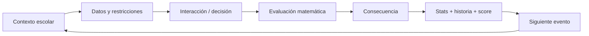

## 5. Meta loop

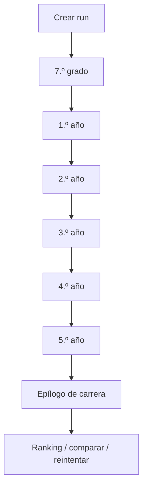

## 6. Duración objetivo

Onboarding breve y controles enseñados en un paso antes de cada motor nuevo.
La envolvente QUICK/MEDIUM/DEEP y el target p50 8–10 min, p75 ≤12 min viven en
la [matriz](01-game-design/full-career-content-matrix.md). Son objetivos UX por medir sobre
carrera real, sin timeout ni bonus/desempate por velocidad. Ante exceso de tiempo,
reducir primero texto, pasos UI y fricción no matemática.

## 7. Estructura v1 por run

Normal/Fair: exactamente nueve beats ordinarios distribuidos entre seis etapas:
un anchor por etapa y tres secundarios. El cierre de 5.º ocurre dentro de ese
presupuesto; epílogo y Repaso no agregan ordinarios. El motor genérico admite
carreras parciales y el rango estructural 6–12; no es el target de producto v1.
Teacher Demo sigue siendo un recorrido separado orientado a mostrar amplitud.


## 8. Estadísticas de carrera

Cuatro dimensiones visibles. Nada más es permanente: energía, plata y similares pueden existir como **recursos locales** dentro de un minijuego, nunca como estadística de carrera. Ver [ADR-016](03-architecture/adr/ADR-016-career-player-model.md).

### Visibles

| | Tipo | Rango | Cambia cuando |
|---|---|---|---|
| **Promedio** | nota | 1,0–10,0 · un decimal | el evento es **genuinamente académico** |
| **Equipo** | colaboración | 0–100 | está en juego la conducta hacia el grupo |
| **Aura** | reputación | con signo, sin techo | el momento es **socialmente memorable** |
| **Estilo** | ternario | Aplicado / Estratega / Improvisador, suman 100 | evidencia estratégica significativa, no calidad Math por sí sola |

Tres reglas que definen el modelo tanto como los nombres:

- **`null` no es 0.** Una dimensión que la run no tocó todavía no tiene valor, y no se dibuja. Aparecen de a una, la primera vez que algo las mueve.
- **Promedio se deriva de notas reales**, no se acumula como un contador. Una decisión de colectivo ejercita matemática pero no es académica: no lo mueve.
- **Ningún eje de Estilo es el malo.** Un Improvisador tiene que poder egresar.

### Derivadas/ocultas
- Eficiencia.
- Riesgo asumido.
- Precisión.
- Uso de información.
- Dominio por categoría matemática.
- Flags e historia narrativa.

Las visibles generan narrativa. Cada uso de evidencia oculta requiere contrato:
no modifica el plan/dificultad fija de Fair ni permite puntuar Estilo indirectamente. **Ninguna oculta se renderiza**, y que exista en el estado no es motivo para mostrarla.

## 9. Filosofía de error

No hay game over por una respuesta incorrecta. El error produce una consecuencia y la run continúa.

### Feedback malo
“Incorrecto. La respuesta era B.”

### Feedback objetivo
“Compraste 1 L. La pared necesita 14,4 m² de cobertura y 1 L cubre 8 m². Faltaron 6,4 m²; el equipo tuvo que volver a comprar.”

## 10. Niveles de resolución

Una decisión puede ser:

- **Inválida:** no cumple una restricción esencial.
- **Funcional:** resultado usable que puede sacrificar un objetivo no esencial explícito.
- **Eficiente:** resuelve con buen uso de recursos.
- **Óptima:** mejor solución según la función de evaluación declarada.

No todos los desafíos necesitan las cuatro categorías.

## 11. Tono

**Realista exagerado + épico-paródico.**

La situación es reconocible, pero se presenta con dramatización gamer:

- “SEMANA DE EXÁMENES — Evento legendario”.
- “La impresora eligió la violencia”.
- “FINAL_FINAL_AHORA_SI_3.pptx”.

El humor nunca debe ridiculizar a un estudiante por fallar.

## 12. Rejugabilidad

- Seeds diferentes.
- Composición diferente desde un catálogo de Templates.
- Variantes aprobadas, no sólo números cambiados.
- Eventos condicionales.
- Eventos raros deterministas con oportunidad competitiva normalizada.
- Callbacks entre años.
- Perfiles de egreso.
- Logros.
- Ranking por evento.
- Seed diaria/feria compartida.

Objetivo de Practice: las primeras tres runs deben sentirse perceptiblemente
diferentes. En Fair se repite la misma Competition Seed emitida por servidor,
incluidas variantes y rareza; esa igualdad de oportunidades es intencional. Ver [matriz de carrera](01-game-design/full-career-content-matrix.md) y
[eventos raros y Prestige](01-game-design/rare-events-and-prestige.md).

## 13. Modos previstos

### Carrera estándar / Practice

Seed individual y variedad procedural aprobada; sin envío al ranking oficial.

### Desafío de la feria / Fair v1

Una Competition Seed compartida por edición, emitida por servidor; mismo plan,
variantes, dificultad y oportunidades para todos. Intentos ilimitados y mejor
resultado verificado. [Contrato de producto](05-operations/fair-mode-and-competition-freeze.md);
servidor/ranking aún no implementados.

### Extensiones diferidas

Daily challenge, packs de seeds y práctica por categoría no son requisitos de v1.


## 14. Herramientas permitidas

Según desafío:
- calculadora;
- anotador;
- tabla;
- regla/escala;
- “pedir más datos”.

Usar una herramienta no debe penalizar automáticamente. La competencia deseada es resolución de problemas, no cálculo mental puro.

## 15. Jefes/eventos especiales

Un año puede culminar con un desafío combinado: viaje, feria, proyecto grupal, torneo o examen especial. Estos eventos reutilizan las mecánicas ya aprendidas y aumentan tensión sin introducir reglas completamente nuevas.

## 16. Final de run

[Career Epilogue v1](01-game-design/narrative-system.md#quinto-año-y-career-epilogue-v1) cierra con EGRESASTE,
perfil narrativo autorado, 3–5 recuerdos, estadísticas, Hitos/Prestige y resultado
según modo. No vuelca history ni depende de un LLM runtime. Style y reconocimientos
display-only no conceden Prestige.

## 17. Perfil narrativo

Síntesis determinista de hechos y decisiones, no diagnóstico ni un tipo único que
reduzca al jugador. La política de saliencia y el copy del epílogo tienen una sola
autoridad en el sistema narrativo; no se infiere personalidad de velocidad o errores.


Como baseline histórica, el slice actual conserva El Estratega, El Improvisador,
El Científico, El Líder, El Emprendedor, El Competidor, El Equilibrado y El
Superviviente. Esta reconciliación no cambia su algoritmo ni la pantalla; el
epílogo de carrera completa debe implementar el contrato narrativo anterior.

## 18. Anti-patrones

No introducir:
- trivia matemática desconectada de la ficción;
- largos bloques de texto;
- tutorial obligatorio de varios minutos;
- castigo que cierre la run por un error;
- score o ranking basado en velocidad;
- estética infantilizada;
- decisiones falsas donde un número visible no afecta nada;
- historias que equiparen desempeño matemático con valor personal.

---

# FILE: 01-game-design/grade-1-template-design.md

# Diseño de Templates de 1.º — Consolidación

- **Etapa académica:** 1.º
- **Función narrativa:** `CONSOLIDATION`
- **Estado de diseño:** `DESIGN-CANDIDATE-APPROVED`
- **Implementación:** `IMPLEMENTED` en STAGE-08 / Phase 1 (2026-09-11) como contenido
  de desarrollo sobre el catálogo aprobado `grade-1-dev-1`; ver
  [implementación runtime](#implementación-runtime-phase-1). Estado de contenido
  `draft`: no es `math_reviewed`, `playtest_ready` ni `production_ready`.

1.º ocurre en la misma escuela que 7.º y no repite la adaptación institucional.
Su pregunta narrativa es: **“Ya sabés cómo funciona este lugar. Ahora empezás a
descubrir cómo funcionás vos adentro.”**

Frente a 7.º incorpora más construcción, asignación, restricciones simultáneas,
evidencia de Estilo, callbacks, continuidad del Proyecto del Curso, una interacción
espacial fuerte y el primer stress case con dos Templates recovery-capable.

## Taxonomía reconciliada

El Product Pass del 9 de septiembre normaliza las interacciones a los
[cinco motores reutilizables](01-game-design/challenge-system.md#cinco-motores-reutilizables-de-interacción-v1).
Los nombres específicos de esta ficha son modos/presentaciones, no frameworks
nuevos ni capacidades runtime ya implementadas. Estilo sólo usa evidencia
estratégica significativa para Career/Narrative; no aporta FairScore, Prestige
ni oportunidades competitivas. Aplican la composición y el DoR canónicos.

## Cronología y colocación

```text
inicio de 1.º
→ rutinas / tecnología / autogestión
→ contexto de Proyecto del Curso I
→ preparación del Día del Estudiante
→ 21 de septiembre / evento emblemático
→ cierre breve del año
→ 2.º
```

El Proyecto del Curso existe como línea narrativa aunque su Template no sea
seleccionada.

**Anchors aprobados:** `student-day-challenge-wheel`, `course-project-expo` y
`classroom-layout`.

**Secundarias aprobadas:** `mobile-data` y `rehearsal-schedule`.

La composición de auditoría debe poder incluir juntas `classroom-layout` y
`rehearsal-schedule` para fallar ambas y observar dos obligaciones conceptuales con
un único repaso estructural.

## Difficulty reconciliation — precisión de Phase 1

**Decisión de producto autorizada:** conservar el modelo de
[dificultad vigente](01-game-design/difficulty-and-playability.md#de-dónde-sale-la-banda-en-el-código),
sus thresholds y la clasificación de 7.º. No se reabre Phase 0. La primera
lectura de implementación había imputado optimización sólo por existir un
objetivo secundario: ese supuesto queda corregido. Un outcome llamado OPTIMAL
no demuestra el trait `optimization`.

En estas dos Templates se busca **un plan factible**, no el mínimo, máximo ni
mejor plan entre los factibles. Los niveles 100/75/40/10 reconocen condiciones
explícitas del resultado; no ordenan estrategias de Estilo ni exigen encontrar
un extremo matemático. La clasificación se calcula con `cognitiveLoad` y `bandOf`
de `src/game/difficulty/cognitive.ts`, nunca con una banda manual alternativa.

### Rueda: envolvente CORE

Cada variante pide completar las posiciones y cumplir **una** regla proporcional
obligatoria sobre una categoría o conjunto explícito de categorías. Los ejemplos
de abajo son alternativas de autoría, no cuatro exigencias acumuladas. No se
agregan cadenas de conversiones, probabilidades de varios giros ni búsqueda de la
distribución más equilibrada. Fracción, porcentaje y conteo expresan la misma
relación conocida; no representan información incierta.

| Trait | Estado / carga | Evidencia obligatoria del gameplay |
|---|---|---|
| `steps` | activo · 1 | Aplicar una relación parte/total a los conteos; no encadenar el resultado a otra tasa o probabilidad. |
| `constraints` | activo · 2 | Completar el total exacto y satisfacer la regla proporcional declarada, simultáneamente. |
| `selection` | inactivo · 0 | Categorías y regla nombradas; sin datos distractores que haya que descartar. |
| `optimization` | inactivo · 0 | Encontrar una distribución admisible; ninguna función que minimizar/maximizar ni búsqueda del mejor reparto. |
| `uncertainty` | inactivo · 0 | Posiciones equiprobables conocidas; no se estima una probabilidad desconocida ni se puntúa un giro aleatorio. |
| `construction` | activo · 1 | El jugador produce los conteos de la distribución. |

**Carga 4 → CORE.** Las preferencias de quality son umbrales explícitos de la
misma distribución, no optimización. Toda variante debe admitir alternativas y
rechazar total incorrecto/incumplimiento esencial. Añadir una restricción
estructural independiente, selección de datos o pasos encadenados exige volver
a evaluar la banda; no se absorbe silenciosamente en estos traits.

### Datos móviles: envolvente CORE

El horizonte son días restantes y la cobertura escolar diaria se presenta como
una actividad explícita que incluye material y comunicación. Sus cantidades
requeridas ya están dadas para ese horizonte. El jugador construye cuántas
sesiones de cada uso financiar con su capacidad; no debe convertir una cuota
mensual, derivar otra tasa ni resolver calendarios distintos por actividad.

| Trait | Estado / carga | Evidencia obligatoria del gameplay |
|---|---|---|
| `steps` | activo · 1 | Una relación lineal consumo = suma de sesiones × consumo por sesión, en una única unidad. |
| `constraints` | activo · 2 | Cubrir la actividad escolar diaria indicada y no exceder la capacidad total. |
| `selection` | inactivo · 0 | Todos los consumos y cantidades son pertinentes y están identificados; no hay planes con letra chica. |
| `optimization` | inactivo · 0 | Construir un plan viable; no maximizar uso/ahorro/utilidad ni minimizar sobrante. |
| `uncertainty` | inactivo · 0 | Tasas y horizonte conocidos; no se estima demanda futura desconocida. |
| `construction` | activo · 1 | El jugador produce las cantidades de uso, no responde una división aislada. |

**Carga 4 → CORE.** Los planes válidos pueden tener margen, uso ajustado o mezcla
flexible y expresar Estilo sin una estrategia competitivamente superior. Los
objetivos secundarios de quality son condiciones de servicio explícitas, no una
función de utilidad. Variantes que agreguen necesidades independientes, cambios
de unidad o tasas encadenadas deben rechazarse en esta envolvente.

## `y1.student-day-challenge-wheel`

### Situación y acción

Para el Día del Estudiante, el curso arma una rueda de juegos, desafíos grupales,
preguntas, premios simbólicos y descanso. Tiene `N` posiciones equiprobables y el
jugador construye una distribución que satisface reglas explícitas, por ejemplo:

```text
al menos 1/4 de desafíos grupales
exactamente 2 descansos
ninguna categoría supera 40 %
juegos + desafíos ocupan al menos la mitad
```

Son ejemplos de parámetros, no valores congelados.

### Matemática e interacción

- Fracciones, porcentajes, proporciones, probabilidad intuitiva y restricciones discretas.
- Modelo interno: `Σ n_i = N` y `P(i) = n_i / N`, sin formalismo visible.
- Interacción: `Grid / Select / Classify` (modo grilla/conteos); la rueda circular es presentación opcional, el modelo puede ser grilla/conteos.

El generador elige totales y restricciones con soluciones enteras legibles. No usa
aritmética incómoda salvo que esa conversión sea el objetivo.

### Evaluación candidata

- `OPTIMAL`: cumple todo y la preferencia secundaria explícita.
- `EFFICIENT`: cumple las restricciones obligatorias.
- `FUNCTIONAL`: configuración usable que sacrifica un objetivo no esencial explícito.
- `INVALID`: viola una restricción esencial o el total.

### Evidencia, pacing y guardrail

```text
Math = yes · Team = none · Aura = none · Recovery = none
Pacing = QUICK · objetivo de diseño 25–40 s, no timer
```

Estilo sólo entra si aparece una estrategia realmente distinta. Nunca se reduce a
“¿cuánto es 25 % de 20?”: el jugador construye o evalúa una distribución cuyo
resultado cambia el juego.

## `y1.course-project-expo`

### Situación y acción

En Proyecto del Curso I hay tareas —investigar, construir, soporte visual,
presentar, montar, logística— y personas con disponibilidad/capacidad finita. El
jugador asigna el trabajo para producir una exposición viable.

### Requisito duro de generación

Debe haber **más de una solución Math-valid** y soluciones válidas diferentes
deben permitir consecuencias distintas de Equipo o Estilo. Una asignación única
correcta invalida el propósito de la Template.

### Matemática e interacción

Math pregunta si el plan funciona: tareas cubiertas, capacidades no excedidas,
dependencias, disponibilidad y roles requeridos. El modelo es un problema pequeño
de asignación; no muestra notación formal.

Interacción: `Allocate / Constrain` (modo asignación), con tarjetas de tareas y personas/roles. Puede
usar una matriz interna, pero no debe verse como una planilla.

### Evidencia independiente

Equipo pregunta cómo se distribuyen carga, tareas indeseadas y oportunidades de
participación entre planes ya factibles. Esa información social no puede ser la
misma capacidad usada para validar Math.

Estilo puede distinguir:

- Aplicado: reserva/margen y pocos puntos únicos de falla;
- Estratega: uso eficiente de fortalezas;
- Improvisador: plan ajustado/flexible con cobertura intercambiable.

Ninguno es mejor en `FairScore`.

### Evaluación candidata

- `OPTIMAL`: requisitos, robustez/contingencia y cobertura deseada.
- `EFFICIENT`: todas las obligaciones cubiertas.
- `FUNCTIONAL`: la exposición ocurre con un elemento no esencial pendiente.
- `INVALID`: falta esencial, sobrecarga, dependencia imposible o incompatibilidad.

### Variantes, callback y estado

Variar personas/roles, capacidades, tareas, costos, disponibilidad, preferencias y
dependencias. El validador debe probar múltiples soluciones factibles y diferencias
semánticas útiles.

`g7.group-tasks` puede cambiar copy/contexto, por ejemplo confianza o una broma
sobre reparto anterior; cualquier cambio de opciones debe evitar ventaja
competitiva oculta.

```text
Math = yes · Team = yes · Aura = none
Recovery = none · Direct Prestige = none
Pacing = MEDIUM · objetivo 40–60 s
```

El evento raro `rare.y1.power-outage` puede rodear la presentación, pero queda
`UNCOMMON / CONDITIONAL / NARRATIVE_ONLY / Prestige 0`: no agrega challenge puntuable.

## `y1.mobile-data`

### Situación y acción

Con capacidad de datos/almacenamiento/uso limitada y un horizonte restante, el
jugador construye un plan sostenible que cubra actividades obligatorias —material
escolar, comunicación— y opcionales —música, video, descargas— sin marcas reales.

### Matemática e interacción

Tasas, capacidad, planificación proporcional, estimación y restricciones mediante
`Constraint Builder`: frecuencia, toggles, bandas aproximadas o comparación de
planes.

No puede ser “6 GB para 20 días: ¿cuánto por día?”. La decisión exige combinar
demandas obligatorias y opcionales.

### Evaluación candidata

- `OPTIMAL`: cubre obligaciones, respeta capacidad y alcanza un objetivo secundario.
- `EFFICIENT`: cubre obligaciones y respeta capacidad.
- `FUNCTIONAL`: viable, pero sacrifica innecesariamente un objetivo no esencial explícito.
- `INVALID`: excede capacidad u omite una necesidad obligatoria.

### Evidencia, variantes y pacing

```text
Math = yes · Team = none · Aura = none · Recovery = none
Estilo = strong candidate
Pacing = QUICK · objetivo 30–40 s
```

Reserva amplia, uso ajustado eficiente o plan flexible pueden sugerir Aplicado,
Estratega o Improvisador, sin umbral universal todavía. Variar capacidad, horizonte,
demandas y consumos con cantidades limpias cuando la conversión de unidades no sea
el objetivo.

## `y1.rehearsal-schedule`

### Situación y diferencia con 7.º

Antes del ensayo o actividad del Día del Estudiante, hay varios compromisos,
traslados/setup, ventanas y al menos un elemento flexible. El jugador reordena la
secuencia completa.

No repite el desafío del colectivo:

```text
7.º: ¿llego antes de un límite / cuál es la salida más tarde?
1.º: compromisos + transiciones + ventanas + elemento flexible
    → construir una agenda factible
```

Cambiar horarios o destino no sería una Template nueva.

### Matemática, interacción y evaluación

Tiempo, duración, secuencia, ventanas fijas/flexibles y planificación hacia atrás.
Interacción `Timeline / Schedule` para ubicar/reordenar bloques, elegir salida o
comparar secuencias, siempre con alternativa no-drag.

- `OPTIMAL`: cumple compromisos con el margen pedido.
- `EFFICIENT`: los cumple con margen menor.
- `FUNCTIONAL`: logra el objetivo principal moviendo/soltando uno secundario flexible.
- `INVALID`: solapamiento imposible o llegada fuera de ventana.

### Evidencia, callback y recovery

```text
Math = yes · Team = none · Aura = none
Estilo = strong candidate
Pacing = MEDIUM · objetivo 40–60 s
```

La historia del colectivo de 7.º puede alterar humor/copy, no la ventaja
matemática. Aura fue retirada del diseño competitivo ordinario durante la auditoría.

Recovery aprobado: `y1.schedule-review`. Es más corto y simple, con un deadline
fijo, dos actividades y un traslado. Aísla planificación hacia atrás, duración y
transición; no repite la agenda completa. Es `QUICK`, objetivo 20–30 s, no puntúa
y cierra la obligación aunque su resultado sea bajo, conforme a ADR-024.

## `y1.classroom-layout`

### Situación y acción

El aula debe prepararse para la exposición: límites, entrada/salida, mesas u
objetos, zona de presentación, circulación y capacidad. El jugador construye una
disposición espacial válida.

No pregunta sólo el área de un salón. Área, escala y medida importan porque los
objetos deben encastrar y el espacio debe seguir siendo utilizable.

### Matemática e interacción

Interacción `Spatial / Graph Canvas` (modo encastre/escala) con escala explícita, ubicación o
rotación acotada, selección de zonas y restricciones legibles, más controles
equivalentes sin drag.

El modelo puede validar límites, footprints, no solapamiento, despeje mínimo,
capacidad, acceso a salida y conectividad del recorrido.

### Banda y evaluación

Es `STRETCH` por restricciones simultáneas, selección de información, construcción
y optimización ligera, no por currículo posterior.

- `OPTIMAL`: cumple todo más capacidad/uso/eficiencia objetivo.
- `EFFICIENT`: cumple restricciones esenciales.
- `FUNCTIONAL`: permite la exposición sacrificando un objetivo secundario explícito.
- `INVALID`: solapamiento, bloqueo, fuera de límites o falla esencial de capacidad/despeje.

### Evidencia, variantes y recovery

```text
Math = yes · Team = none · Aura = none · Style = none
Pacing = DEEP · objetivo 55–75 s
```

Variar dimensiones, escala, objetos, capacidad, despejes, entrada y zonas. El
generador/validador debe probar una solución válida, no trivialidad y ausencia de
exploits de colocación.

Recovery aprobado: `y1.scale-fit-review`. Usa una región simple, dos o tres
objetos, escala explícita y una restricción principal. Aísla
`representación ↔ medida real + encastre`, no repite el aula completa. Debe ser
QUICK/MEDIUM, más corto, no puntuable y no recursivo.

## Resumen aprobado de 1.º

| Template | Colocación | Banda | Equipo | Aura ordinaria | Recovery | Pacing |
|---|---|---|---|---|---|---|
| `student-day-challenge-wheel` | anchor | CORE | no | no | `none` | QUICK |
| `course-project-expo` | anchor | STANDARD | **sí** | no | `none` | MEDIUM |
| `mobile-data` | secondary | CORE | no | no | `none` | QUICK |
| `rehearsal-schedule` | secondary | STANDARD | no | no | `schedule-review` | MEDIUM |
| `classroom-layout` | anchor | STRETCH | no | no | `scale-fit-review` | DEEP |

Cobertura matemática: probabilidad/proporción, asignación/restricciones,
tasas/capacidad, tiempo/agenda y geometría/escala. Equipo competitivo aparece sólo
en `course-project-expo`. Ninguna Template ordinaria ofrece Aura competitiva.

`power-outage` queda `UNCOMMON / CONDITIONAL / NARRATIVE_ONLY / Prestige 0`. Una
oportunidad rara futura de Aura en 1.º es opcional y debe probar evidencia
independiente; no se fabrica para completar cobertura.

## Estado editorial y gates antes de producción

`DESIGN-CANDIDATE-APPROVED` aprueba intención. Phase 1 produjo parámetros,
unidades, evaluadores, soluciones alternativas, invariantes, feedback, variantes
y señales independientes, usando las interacciones del motor extendidas por
[ADR-025](03-architecture/adr/ADR-025-full-career-contract-evolution.md); el
barrido de seeds del pipeline y los recorridos a 360 px y por teclado están
automatizados. Ninguna Template es todavía `math_reviewed`, `playtest_ready` ni
`production_ready`: la revisión del Departamento de Matemática, el sign-off
manual de la rueda —Template de alto riesgo— y el pacing empírico son gates de
producción de STAGE-08, no parte de Phase 1.

Después de implementar 1.º se ejecutó el
[audit obligatorio](04-quality/post-grade-1-scalability-audit.md#resultado-de-la-ejecución-2026-09-14),
que el 14 de septiembre de 2026 dio `PASS WITH REQUIRED HARDENING — RESOLVED` y
autorizó la implementación amplia de 2.º–5.º. La semántica de dos obligaciones
bajo un Repaso máximo está cerrada —seleccionar uno determinísticamente, debrief
del resto y cierre de todas— y el gate la comprobó con contenido real: los
debriefs autorados nombran el concepto que falló y la copia distingue lo
practicado de lo comentado, sin atribuir práctica al cierre conjunto.

## Implementación runtime — Phase 1

Fuente: `src/content/grade-1/`. Cada Template declara un `VariantSourceSpec`
generado por restricción: cada dirección de candidato es una función pura que
recorre sus ejes con un paso biyectivo, y los **gates de autoría** del pipeline
—witnesses de cada nivel, señuelos del Intrinsic Math Gate, Estilo independiente
de la calidad— deciden qué se aprueba. En el navegador sólo se materializan
direcciones aprobadas; el `verify` de runtime es estructural. Cada evaluador tiene
un oráculo independiente —otra implementación, no una llamada al evaluador— que
los tests comparan en todos los planes o en respuestas arbitrarias.

| Template | Formas semánticas | Escalera 100/75/40/10 | Estilo / Equipo |
|---|---|---|---|
| `mobile-data` | `either-or` (una opción del pedido entra y la otra no), `rest-total` (todo en música entra, todo en videos no), `keep-reserve` (un video respeta la reserva, dos no). Días 4–7, material 50/100/150 MB por día, cuatro juegos de tasas. | INVALID excede o deja un día sin material · FUNCTIONAL sin descanso · EFFICIENT descanso sin el pedido · OPTIMAL pedido cumplido | Estilo: reserva ≥ 1/4 → Aplicado; música y video → Improvisador; uso enfocado → Estratega. Sin Equipo. |
| `student-day-challenge-wheel` | Seis familias autoradas de regla: exacta de una categoría, mínima, máxima leída como probabilidad y par sumado; fracciones 1/2–1/10 con total 8–24 divisible; notación fracción, porcentaje entero, «1 de cada k» o probabilidad. | INVALID total o regla · FUNCTIONAL menos de tres tipos · EFFICIENT variedad sin el pedido · OPTIMAL pedido (dos descansos, dos preguntas o los cinco tipos) | Ninguno. La consecuencia explica la probabilidad intuitiva: con n de N, en N giros saldría unas n veces. |
| `course-project-expo` | Roles abiertos, llegada tardía, hueco de roles, horas justas; tres personas, cinco tareas, fases 1–3. Dependencia real: presenta quien investigó o construyó. | INVALID esencial, horas, fase, rol o dependencia · FUNCTIONAL sin apoyo visual · EFFICIENT sin reemplazo para presentar · OPTIMAL apoyo visual y, en la fase 3, alguien libre que podría presentar | Equipo 0–3: participan todos, se respeta el ofrecimiento para montar y el pedido de presentar. Estilo: 1 h libre para todos → Aplicado; investigar y construir en las mismas manos → Estratega; rotación → Improvisador. |
| `rehearsal-schedule` | Agrupar por lugar, salón temprano, cadena de preparaciones, apertura tardía. Tres bloques obligatorios, una merienda flexible, preparación en el lugar, viaje 5–15 min, ventanas, dependencia «cartel después de materiales» y el ensayo como límite fijo. | INVALID choque, viaje, preparación, ventana, dependencia o llegada tarde · FUNCTIONAL merienda afuera · EFFICIENT margen menor · OPTIMAL margen pedido | Estilo por dónde va lo flexible: después de lo obligatorio → Aplicado; entre compromisos → Estratega; primero → Improvisador. Nunca por el margen. |
| `classroom-layout` | Pasillo central, puerta en esquina con pasillo en L, columnas, dos puertas conectadas; aulas 7–8 × 5–6 celdas; escala 50 o 100 cm; tres configuraciones de lugares mínimo/ideal. Medidas reales en cm y una altura que no importa para el piso. | INVALID huella, límite, columna, pasillo, puerta, recorrido o lugares · FUNCTIONAL mínimo sin ideal · EFFICIENT ideal sin caja de materiales · OPTIMAL ideal y caja | Ninguno. |
| `schedule-review` | Dos bloques, un viaje, un límite; la preparación del espacio depende de guardar los materiales; se ofrecen inicios tardíos que ya no entran. | INVALID · FUNCTIONAL llega justo · EFFICIENT margen menor · OPTIMAL margen pedido | Sin Estilo ni score. El feedback escribe la cuenta desde el límite hacia atrás. |
| `scale-fit-review` | Una pared, tres objetos en cm, escala 25/50/100 cm; entran justos o con una celda libre. | INVALID superpone o se sale · FUNCTIONAL sólo la mesa · EFFICIENT mesa y una más · OPTIMAL las tres | Sin Estilo ni score. Señuelo: con separación entre objetos no entran. |

**Banda y metadata.** La banda sale de `bandOf(cognitive)`: rueda y datos 4 →
CORE (D-S08-043); expo 7 y agenda 6 → STANDARD; aula 8 → STRETCH; ambos
Repasos 4 → CORE. La metadata de composición es TEMPORAL/ALLOCATION/
DATA_UNCERTAINTY/ECONOMIC_PROPORTIONAL/SPATIAL según la Template, con motor,
pacing y cronología del año (datos 10, expo 20, aula 30, agenda 40, rueda 50);
la expo declara `recurringArc: 'PROJECT'`. Como la búsqueda global exige metadata
en todo candidato, el content set `7.º → 1.º` aplica a las Templates de 7.º una
capa de metadata candidata —colectivo TEMPORAL/Timeline, acto
LOGIC_CLASSIFICATION/Grid, mural SPATIAL/Spatial, oferta y stand
ECONOMIC_PROPORTIONAL, trabajo grupal ALLOCATION/Allocate— sin tocar sus
definiciones, rasgos, score ni la huella del content set de 7.º.

**Carrera.** Promedio sólo se mueve en la expo —el Proyecto del Curso se evalúa
como trabajo del curso, igual que el mural de 7.º—: 8,8/8,3/7,8/7,0. Equipo de
carrera sale de los mismos acuerdos que mide Equipo competitivo, fuera de
FairScore. Estilo sólo en planes válidos de datos, expo y agenda.

**Catálogo `grade-1-dev-1`.** Construido por `pnpm game:variants build
--content=grade-1` con la política de build de 7.º (hasta 400 candidatos, 24
aprobaciones generadas por Template); el artefacto también re-aprueba las
Templates de 7.º bajo `contentVersion 1.0.0-grade-1`, porque el content set es
`7.º → 1.º`.

| Template | Espacio | Intentadas | Aprobadas | Rechazadas | Duplicadas |
|---|---|---|---|---|---|
| `mobile-data` | 288 | 33 | 25 | 7 | 1 |
| `student-day-challenge-wheel` | 1.728 | 55 | 25 | 29 | 1 |
| `course-project-expo` | 576 | 34 | 25 | 8 | 1 |
| `rehearsal-schedule` | 288 | 43 | 25 | 17 | 1 |
| `classroom-layout` | 192 | 34 | 25 | 8 | 1 |
| `schedule-review` | 216 | 26 | 25 | 0 | 1 |
| `scale-fit-review` | 24 | 25 | 24 | 0 | 1 |

La única duplicada de cada fila es el candidato `c00000`, igual a la referencia
autorada. Los rechazos son gates cumpliendo su función: repartos parejos que ya
eran óptimos, estilos que sólo aparecían con un nivel de resultado, aulas donde
apilar en orden bastaba. Todas las Templates superan los objetivos de la
[guía](01-game-design/content-authoring-guide.md#profundidad-de-variantes) —12, 16 para la rueda
y el aula, 8 para cada Repaso— y cada entrada tiene un witness óptimo probado en
`tests/unit/grade-1-catalog.test.ts`.

**Repaso.** `rehearsal-schedule → schedule-review` y `classroom-layout →
scale-fit-review`, enmarcados por el storylet `y1.review`. El content set autora
un debrief por Template recovery-capable; si ambas fallan en el año, se practica
la primera en orden canónico y la otra se muestra como «Para recordar».

**Hechos de carrera registrados en origen.** Flags `y1.*`, deterministas y
reproducibles por replay; no se guarda cada clic ni una copia del historial:

| Flag | Semántica |
|---|---|
| `y1.project.context-established` | el Proyecto del Curso existe en el año aunque su Template no se juegue |
| `y1.project.outcome` | calidad de la expo |
| `y1.project.everyone-participated`, `volunteer-respected`, `request-respected` | acuerdos del grupo en un plan válido |
| `y1.project.centralized` | alguien quedó con tres o más tareas |
| `y1.project.backup-presenter` | había plan B para presentar |
| `y1.project.strategy`, `y1.mobile.strategy`, `y1.schedule.strategy` | Estilo expresado, sólo en planes válidos |
| `y1.mobile.outcome`, `y1.schedule.outcome`, `y1.layout.outcome`, `y1.student-day.outcome` | calidad por situación |
| `y1.schedule.review-outcome`, `y1.layout.review-outcome` | calidad del Repaso; qué se practicó se deriva con `recordCoverage` |
| `y1.layout.accessible`, `y1.student-day.kinds` | aula con recorrido; tipos de actividad de la rueda |
| `y1.closed` | cierre narrativo del año |

**Callbacks.** La agenda recuerda el colectivo de 7.º y la expo el trabajo
grupal, sólo en el texto: la interacción es idéntica con y sin historia.

**Evento raro.** `rare.y1.power-outage` no corre. La orquestación de rareza con
substreams y presupuesto es trabajo futuro de ADR-025; 1.º deja registrados los
hechos que su condición necesita y un hook declarativo con `implemented: false`
y Prestige de aparición 0.

---

# FILE: 01-game-design/grade-2-template-design.md

# Diseño de Templates de 2.º — Pertenencia e identidad

- **Etapa académica:** 2.º
- **Función narrativa:** pertenencia e identidad
- **Estado:** `DESIGN-CANDIDATE-APPROVED` · checkpoint #2, 9 de septiembre de 2026
- **Implementación:** `IMPLEMENTED` en STAGE-08 (2026-09-15) como contenido de
  desarrollo; ver [implementación runtime](#implementación-runtime)

La pregunta del año es **«¿Qué lugar tengo entre los demás?»**. Grupos,
participación, intercurso y reputación hacen visible la pertenencia. Se conservan
el piso matemático universal y las reglas de la
[envolvente](01-game-design/stage-08-product-design-envelope.md).

## Taxonomía reconciliada

El Product Pass del 9 de septiembre normaliza las interacciones a los
[cinco motores reutilizables](01-game-design/challenge-system.md#cinco-motores-reutilizables-de-interacción-v1).
Los nombres específicos de esta ficha son modos/presentaciones, no frameworks
nuevos ni capacidades runtime ya implementadas. Estilo sólo usa evidencia
estratégica significativa para Career/Narrative; no aporta FairScore, Prestige
ni oportunidades competitivas. Aplican la composición y el DoR canónicos.

## Colocación y continuidad

Anchors: `y2.intercurso-plan`, `y2.course-project-survey` y `y2.court-zones`.
Secundarias: `y2.team-kit-order` y `y2.standings-claim`.

El **cluster Intercurso** reúne `intercurso-plan`, `standings-claim` y
`court-zones`: una run normal admite como máximo **una** Template puntuable de
ese conjunto (`LOCKED`). La encuesta pertenece al arco recurrente Proyecto del
Curso. Los límites y su madurez viven en las
[políticas de composición](01-game-design/full-career-content-matrix.md#políticas-de-composición).

## `y2.intercurso-plan`

**STANDARD · MEDIUM · anchor.** El jugador distribuye personas entre actividades
y franjas horarias, considerando incompatibilidades. La interacción de diseño es
`Allocate / Constrain` (modo asignación, combinado con Timeline / Schedule): el tiempo participa de la asignación.

Math evalúa personas × actividades × franjas × incompatibilidades. Equipo usa
preferencias, exclusiones evitables, concentración de roles no deseados y
oportunidades de participación entre planes matemáticamente válidos.

**Invariante `LOCKED`:** toda variante debe admitir múltiples soluciones
Math-valid con consecuencias distintas de Equipo/Estilo. Se rechaza una variante
que sea la exposición de 1.º con vocabulario deportivo y reparto estático.

```text
Math = yes · Team = yes · Aura = none
Estilo = consecuencias entre planes válidos · Recovery = none
```

## `y2.course-project-survey`

**STANDARD · MEDIUM · anchor.** El curso necesita decidir qué puede afirmar o
publicar a partir de una encuesta. `Choice / Compare` (modo datos/afirmaciones) conecta datos
con afirmaciones defendibles.

Math trabaja porcentajes, encuestados frente a población, elección del
denominador, afirmaciones respaldadas y datos incompletos. El resultado cambia
lo que el curso puede publicar legítimamente; nunca es una hoja de estadística
sin consecuencia.

```text
Math = yes · Team = none · Aura = none · Estilo = none
Recovery = y2.data-claim-review
```

## `y2.team-kit-order`

**CORE · QUICK · secondary.** Construir un pedido/asignación proporcional que
respete el total, la reserva y mínimos por categoría. La dirección de interacción
es `Allocate / Constrain` (modo pedido); cantidades, stock y redondeo deben servir a esas
restricciones.

Es Math-only y declara `Recovery = none`. No centra la escena en cuerpos o peso,
no pregunta un porcentaje aislado y no repite el problema de packs, mínimo y
presupuesto de 7.º.

## `y2.standings-claim`

**STANDARD · QUICK · secondary.** Ante puntos y un espacio pequeño de resultados
pendientes, distinguir qué está garantizado, qué es posible y qué es imposible.
`Choice / Compare` separa la selección matemática de una decisión de comunicación
pública separada.

**Invariante `LOCKED`:** `Math action != Aura action`. Resolver bien la tabla no
otorga Aura automáticamente; ésta evalúa la acción pública independiente.

```text
Math = yes · Team = none · Aura = yes · Recovery = none
```

## `y2.court-zones`

**STRETCH · DEEP · anchor.** Definir regiones y zonas usando límites, distancias,
área y márgenes. `Spatial / Graph Canvas` (modo zonas/distancias) debe hacer necesarias esas relaciones.

Es Math-only y declara `Recovery = none`. La diversidad geométrica exige
**zonas/distancias**, frente al **encastre/escala** de `y1.classroom-layout`;
acomodar objetos en otro salón no cumple la intención.

## Evento raro y callbacks

`rare.y2.missing-player` es un modificador condicional, seeded y neutral en
oportunidades de `intercurso-plan`. No agrega beat, FairScore ni Prestige; su
aparición nunca concede un premio automático. Ver
[eventos raros](01-game-design/rare-events-and-prestige.md#diseños-raros-aprobados-por-año).

**Callback Independence — `LOCKED`:** la historia puede enriquecer texto,
contexto y opciones limitadas, pero nunca es requisito para comprender o resolver
la situación. Tampoco cambia el máximo de FairScore por existir historia previa.

## Estado editorial

Equipo aparece sólo en `intercurso-plan`; Aura sólo en `standings-claim`. La
única ruta de recuperación es `course-project-survey → data-claim-review`.
Todas las demás declaran `none` como diseño aprobado, sin inventar repasos por
cuota. La [matriz](01-game-design/full-career-content-matrix.md) reúne placement y cobertura.

Estas fichas conservan los invariantes aprobados. Los parámetros, evaluadores,
copy de feedback y variantes ya existen —ver abajo— y siguen en estado `draft`:
la revisión del Departamento de Matemática y el pacing empírico son gates de
producción, no de esta implementación. Aplican los
[requisitos editoriales de Phase 0](01-game-design/content-authoring-guide.md#diseño-aprobado-en-phase-0).

## Implementación runtime

Fuente: `src/content/grade-2/`. Cada Template declara su `VariantSourceSpec`
generado por restricción, con los gates de autoría del pipeline decidiendo qué
se aprueba, y cada evaluador tiene un oráculo independiente que los tests
comparan sobre todos los planes. Las mecánicas compartidas se promovieron a
`src/content/authoring.ts` (D-S08-059): 1.º las re-exporta sin cambiar nada.

| Template | Formas semánticas | Escalera 100/75/40/10 | Equipo / Aura / Estilo |
|---|---|---|---|
| `y2.team-kit-order` | `exact-share` (el reparto proporcional da justo), `remainder` (deciden los restos mayores), `stock-capped` (a un equipo se le acaba el color). Tres equipos, tope de unidades y stock por color | INVALID excede stock, tope o deja a alguien sin pechera · FUNCTIONAL reparte parejo · EFFICIENT proporcional con un resto mal puesto · OPTIMAL proporcional por restos mayores | Ninguno |
| `y2.course-project-survey` | Seis afirmaciones sobre la encuesta del nivel —más elegida entre quienes contestaron, más de la mitad de las respuestas, más de la mitad del nivel, «el nivel entero prefiere», le ganó a la segunda según la regla del curso, la menos elegida—. Formas `denominator` (mayoría entre respuestas y no del nivel), `missing-data` (contestó menos de la mitad), `margin` (la diferencia con la segunda no cumple la regla) y `high-response` (contestó al menos el 85 %). **Regla de publicación** en pantalla y como constante única: una opción le ganó a otra sólo si le saca más de 1 de cada 10 respuestas (`diferencia × 10 > respuestas`), sin variantes a una respuesta del borde. **`year-prefers`** por cota de peor caso: cierta sólo si la primera le saca a cada otra más que toda la gente que no contestó, y sólo en `high-response`. Un ciclo de diez papeles reparte forma y vector de verdad: 7 claves en el catálogo, ninguna forma con clave única y el contraste del denominador en el 60 % | INVALID publica algo que los datos no sostienen · FUNCTIONAL retiene dos o más ciertas · EFFICIENT retiene una · OPTIMAL cada afirmación en su lugar. Los cuatro niveles, en toda variante | Ninguno. Ruta de Repaso a `y2.data-claim-review` |
| `y2.standings-claim` | Tabla de cuatro cursos con puntos, partidos pendientes y puntos por victoria; cuatro afirmaciones —dos de «termina primero» y dos de «termina arriba de»— clasificadas como seguro, posible o imposible. Formas `settled`, `open` y `eliminated`. Los pendientes se juegan **entre estos cuatro cursos** y cada partido lo gana uno —la consigna lo dice—: suma par y ningún curso con más pendientes que los otros tres. **Gate de modelo**: la categoría por cotas de cada curso es idéntica a la del torneo conjunto bajo todo fixture y todo resultado. «Arriba» es estricto —empatar no es terminar arriba— y se rechaza toda tabla donde contar el empate como arriba cambiaría una categoría. Ninguna afirmación tiene la misma categoría en más del 70 % del catálogo | INVALID llama seguro a lo que no lo es · FUNCTIONAL dos o más categorías mal · EFFICIENT una · OPTIMAL clasificación exacta | **Aura** por la postura pública, leída de un campo distinto del de las etiquetas: acertar la matemática nunca concede Aura (`LOCKED`) |
| `y2.court-zones` | Zonas, distancias de Chebyshev y bordes de la cancha; formas `separation`, `margin` y `covered` | INVALID postas pisadas o fuera · FUNCTIONAL separación mínima · EFFICIENT una más · OPTIMAL la separación pedida | Ninguno |
| `y2.intercurso-plan` | Tres actividades en dos turnos, cuatro personas con disponibilidad por turno; formas `tight-availability`, `clash` y `spare` | INVALID falta cobertura, choque de turno o alguien que no está · FUNCTIONAL obligaciones cubiertas · EFFICIENT una opcional · OPTIMAL todas | **Equipo** 0–3 por los acuerdos del grupo, leído entre planes que ya cierran (`LOCKED`). Estilo por la forma del reparto |
| `y2.data-claim-review` | Una cifra, quienes contestaron y el nivel, con tres afirmaciones: más de la mitad de quienes contestaron, más de la mitad del nivel y «sabemos qué eligió quien no contestó» (control siempre falso). Vectores de las dos primeras: `TF` en la mitad del catálogo (el contraste del denominador), `TT` y `FF` en un cuarto cada uno; ninguna cifra en la mitad exacta | INVALID publica una falsa · FUNCTIONAL dos ciertas retenidas (sólo en `TT`) · EFFICIENT una · OPTIMAL exacta. `FF` sólo tiene OPTIMAL e INVALID: es un Repaso, no se le exige witness de niveles | Sin Estilo ni score |

**Banda y metadata.** `bandOf(cognitive)` da: pedido de pecheras 4 → CORE;
encuesta, tabla y plan del Intercurso → STANDARD; postas 8 → STRETCH; el Repaso
4 → CORE. El cluster `intercurso` lo declaran las tres Templates del evento, así
que una run normal aporta como máximo una de ellas.

**Catálogo `grade-2-dev-3`.** 508 entradas, construido con
`pnpm game:variants build --content=grade-2`; re-aprueba las de 7.º y 1.º sin
tocar sus artefactos publicados. La práctica parcial `7.º → 2.º` es
`official: false`. Reemplaza a `grade-2-dev-2` por la
[remediación matemática](04-quality/mathematics-remediation-implementation.md):
encuesta, Repaso del denominador y tabla generados por papel —el gate
`addressGates` comprueba que cada dirección juegue el suyo—, contenido
`2.2.0-grade-2`.

**Incertidumbre, sin probabilidad.** La encuesta y la tabla trabajan con datos y
cotas: lo que la gente que no contestó podría haber elegido, lo que los partidos
que faltan podrían dar. No hay probabilidad cuantificada ni vocabulario
inferencial (MAT-012).

**Rareza.** `rare.y2.missing-player` sigue siendo hook: la orquestación de
rareza se implementa una sola vez en la integración de carrera completa
(D-S08-067), no por año.

---

# FILE: 01-game-design/grade-3-template-design.md

# Diseño de Templates de 3.º — Autonomía

- **Etapa académica:** 3.º
- **Función narrativa:** autonomía
- **Estado:** `DESIGN-CANDIDATE-APPROVED` · checkpoint #2, 9 de septiembre de 2026
- **Implementación:** `IMPLEMENTED` en STAGE-08 (2026-09-15) como contenido de
  desarrollo; ver [implementación runtime](#implementación-runtime)

La pregunta del año es **«¿Cómo organizo mis propias decisiones?»**. El jugador
organiza tiempo, recursos, movilidad y compromisos. Es deliberadamente el año más
rico en Estilo hasta este punto del recorrido; ninguna estrategia vital recibe
superioridad moral. Rige la [envolvente](01-game-design/stage-08-product-design-envelope.md).

## Taxonomía reconciliada

El Product Pass del 9 de septiembre normaliza las interacciones a los
[cinco motores reutilizables](01-game-design/challenge-system.md#cinco-motores-reutilizables-de-interacción-v1).
Los nombres específicos de esta ficha son modos/presentaciones, no frameworks
nuevos ni capacidades runtime ya implementadas. Estilo sólo usa evidencia
estratégica significativa para Career/Narrative; no aporta FairScore, Prestige
ni oportunidades competitivas. Aplican la composición y el DoR canónicos.

## Colocación y composición

Anchors: `y3.friend-day`, `y3.course-project-tech` y `y3.route-plan`.
Secundarias: `y3.week-planner` y `y3.transport-pass`.

La preferencia por diversidad cognitiva es **soft**: evitar
`week-planner + route-plan` cuando existe una composición igualmente válida y
más diversa. No es una exclusión dura. `course-project-tech` pertenece al
Proyecto del Curso según las
[políticas de composición](01-game-design/full-career-content-matrix.md#políticas-de-composición).

## `y3.friend-day`

**STANDARD · MEDIUM · anchor.** Organizar una salida del Día del Amigo mediante
disponibilidades, traslados, duraciones, restricciones y una optimización pequeña.
La interacción de diseño es `Timeline / Schedule` (modo disponibilidades).

Math evalúa viabilidad del plan. Equipo evalúa preferencias e inconvenientes
repartidos entre planes Math-valid; Estilo tiene una señal fuerte.

**Invariante `LOCKED`:** deben existir varios planes Math-valid con consecuencias
distintas de Equipo/Estilo. No alcanza encontrar la única franja libre común.

```text
Math = yes · Team = yes · Aura = none · Recovery = none
```

## `y3.course-project-tech`

**STANDARD · MEDIUM · anchor.** Organizar recursos compartidos del proyecto
tecnológico: almacenamiento, tasas, fechas límite y dependencias. La dirección de
interacción es `Allocate / Constrain` (modo recursos/dependencias).

**Invariante `LOCKED`:** cada variante utiliza más de un recurso o dependencia;
no puede resolverse como un único cálculo de tasa. El problema trata recursos
compartidos y dependencias del proyecto, no consumo personal de datos como en 1.º.

```text
Math = yes · Team = yes · Aura = none
Recovery = y3.rate-capacity-review
```

La contribución de Equipo debe declarar evidencia propia, separada de la
factibilidad matemática, bajo las reglas comunes de autoría.

## `y3.week-planner`

**STANDARD · MEDIUM · secondary.** Construir una organización de varios días
con capacidad temporal, deadlines y bloques flexibles, mediante `Timeline / Schedule` (modo varios días).
Tiene Math y Estilo fuerte, sin Equipo, Aura ni recuperación.

La escala de varios días y bloques flexibles la distingue del ensayo de una
tarde de 1.º. No es una app de productividad ni moraliza trabajo o descanso.

## `y3.transport-pass`

**CORE · QUICK · secondary.** Comparar costos fijos y variables según la
cantidad de usos; el umbral entre alternativas debe cambiar la decisión.
La interacción es `Choice / Compare` (modo umbral entre alternativas).

**Invariante `LOCKED`:** el umbral de cantidad de usos es estructuralmente
necesario. Comparar dos descuentos como en 7.º no cumple el diseño.

```text
Math = yes · Team = none · Aura = none
Recovery = y3.fixed-variable-review
```

Estilo sólo puede aparecer si varias elecciones siguen siendo racionales bajo
incertidumbre explícita; elegir la alternativa matemáticamente viable por sí
solo no define Estilo.

## `y3.route-plan`

**STRETCH · DEEP · anchor.** Construir un recorrido sobre mapa/red con **3–4
puntos relevantes**, razonando sobre distancia, tiempo y orden de visita.
Interacción de diseño: `Spatial / Graph Canvas` (modo recorrido en red).

**Invariante `LOCKED`:** cambiar el orden del recorrido modifica materialmente
la viabilidad o eficiencia. Es Math-only y no tiene recuperación.

## Evento raro y continuidad

`rare.y3.offline-project` es un modificador condicional y seeded del proyecto
tecnológico, neutral en oportunidades: no agrega beat, FairScore ni Prestige.
El contexto puede cambiar sin ampliar el techo competitivo. Su contrato está en
[eventos raros](01-game-design/rare-events-and-prestige.md#diseños-raros-aprobados-por-año).

La historia del Proyecto del Curso puede reaparecer aunque no se hayan jugado
sus Templates anteriores. Rige
[Callback Independence](01-game-design/narrative-system.md#callback-independence).

## Estado editorial

Equipo aparece sólo en `friend-day` y `course-project-tech`. No hay oportunidad
ordinaria de Aura en 3.º. Las rutas aprobadas de diseño son
`course-project-tech → rate-capacity-review` y
`transport-pass → fixed-variable-review`; las otras tres Templates declaran
`none`.

La [matriz](01-game-design/full-career-content-matrix.md) reúne la cobertura. Los parámetros,
evaluadores, feedback y variantes ya existen —ver abajo— y siguen en estado
`draft`: la revisión del Departamento de Matemática y el pacing empírico son
gates de producción. Aplican los
[requisitos editoriales de Phase 0](01-game-design/content-authoring-guide.md#diseño-aprobado-en-phase-0).

## Implementación runtime

Fuente: `src/content/grade-3/`. Mismas reglas que 2.º: generación por
restricción, gates de autoría en el pipeline, oráculo independiente por
evaluador y materialización sólo de direcciones aprobadas.

| Template | Formas semánticas | Escalera 100/75/40/10 | Equipo / Estilo |
|---|---|---|---|
| `y3.transport-pass` | Cuatro formas de pagar el mismo colectivo —boleto, tarjeta con costo único, combo con viajes incluidos y abono libre— contra seis formas de mes, de `pocos-viajes` a `mes-cargado`, con los viajes del mes pasado como estimación y un rango de cuánto puede cambiar este mes. Los precios son de la ciudad y del mes: ninguno se calcula con el rango. Cada dirección tiene el papel de una forma de pagar óptima, así que las cuatro son óptimas en el catálogo y ninguna en más del 40 %; en `likely` la más barata le saca a la segunda al menos $100 y el 2 % | INVALID nunca gana y encima es la más cara para los viajes esperados · FUNCTIONAL nunca gana pero tampoco es la peor · EFFICIENT gana en otra cantidad posible del mes, y el feedback dice a partir de cuántos viajes · OPTIMAL gana para los viajes esperados | Ninguno (D-S08-065). Ruta de Repaso a `y3.fixed-variable-review` |
| `y3.course-project-tech` | Tres recursos compartidos —notebook prestada, lugar en el pendrive y rato de laboratorio a una tasa— y tres cosas que producir con consumos distintos; formas `pendrive-corto`, `laboratorio-corto` y `notebook-corta` | INVALID se pasa de un recurso o no llega al mínimo de la feria · FUNCTIONAL mínimos · EFFICIENT dos de lo prometido · OPTIMAL lo prometido entero | **Equipo** 0–3 por los acuerdos del grupo, leído por dueño sobre el mismo plan (`LOCKED`). Ruta de Repaso a `y3.rate-capacity-review` |
| `y3.friend-day` | Cuatro personas con ventanas propias, dos lugares con viaje en el medio, dos bloques obligatorios y dos opcionales; formas `ventana-corta`, `traslado-largo` y `gustos-cruzados` | INVALID se pisa, no da el viaje o falta quien tiene que estar · FUNCTIONAL obligatorios · EFFICIENT un opcional · OPTIMAL los dos | **Equipo** 0–3: que nadie quede afuera, que lo que cada uno quería pase mientras está y que nadie espere de más (`LOCKED`). Estilo por la forma de la tarde |
| `y3.week-planner` | Cuatro días de tarde libre, dos compromisos que ya tienen día y hora, dos pendientes con vencimiento y dos opcionales; formas `semana-cargada`, `vencimiento-temprano` y `tarde-ocupada` | INVALID falta, se pisa, se sale de la tarde o vence · FUNCTIONAL obligatorios · EFFICIENT un opcional · OPTIMAL los dos | Sin Equipo ni Aura. **Estilo fuerte**: pegado al vencimiento → Improvisador; con un día entero libre → Estratega; repartido con margen → Aplicado |
| `y3.route-plan` | Cinco lugares del barrio en una cuadrícula de cuadras, con horario de apertura, rato adentro y hora de vuelta; formas `cierra-temprano`, `abre-tarde` y `lejos` | INVALID falta un mandado, llega cerrado o vuelve tarde · FUNCTIONAL los obligatorios · EFFICIENT uno opcional · OPTIMAL los dos | Ninguno: es Math sola |
| `y3.rate-capacity-review` | Cuánto entra a un consumo dado, en MB o en minutos | OPTIMAL la parte entera · FUNCTIONAL redondear para arriba · EFFICIENT uno menos · INVALID el resto | Sin Estilo ni score |
| `y3.fixed-variable-review` | A partir de cuántos viajes el abono sale más barato que el boleto | OPTIMAL el primer viaje en que ya conviene · FUNCTIONAL quedarse en la parte entera · EFFICIENT uno más · INVALID el resto | Sin Estilo ni score |

**Contratos nuevos.** 3.º necesitó dos, y ninguno es un framework nuevo
(D-S08-062): `route-builder` contrata el **orden** de las paradas como
respuesta semántica —el mapa dibuja esquinas y no suma ninguna distancia— y la
agenda gana un modo de varios días con minutos absolutos desde el primer día,
así que solapar, ordenar y comparar contra un vencimiento siguen siendo
comparaciones de enteros. Engine `9.0.0`, action log `7`, snapshot `7` intacto.

**Banda y metadata.** `bandOf(cognitive)` da: colectivo 4 → CORE; Día del Amigo,
feria y semana 7 → STANDARD; recorrido 8 → STRETCH; los dos Repasos 2 → CORE.
Eso es 1 CORE / 3 STANDARD / 1 STRETCH, la distribución que pide la matriz.

**Preferencia blanda.** La semana y el recorrido tienen casi el mismo vector de
rasgos, y de ahí sale la preferencia de diversidad cognitiva del año. Se
implementó como objetivo blando del compositor: cuenta las parejas de la etapa
cuyos perfiles difieren en un rasgo o menos y prefiere las que tienen menos
(D-S08-064). Contar en vez de maximizar la distancia importa: maximizarla tiene
un ganador único y dejaba a 3.º con la misma pareja en las 200 seeds medidas,
mientras que contando aparecen cuatro parejas distintas y la que el diseño
quiere evitar no aparece ninguna vez. Sigue siendo blanda: ordena planes válidos
y no filtra ninguno, así que cuando esa pareja es la única legal la carrera se
compone igual.

**Catálogo `grade-3-dev-3`.** 681 entradas, construido con
`pnpm game:variants build --content=grade-3`; re-aprueba 7.º, 1.º y 2.º sin
tocar sus artefactos publicados. Reemplaza a `grade-3-dev-2` por la
[remediación matemática](04-quality/mathematics-remediation-implementation.md): colectivo generado por papel y los dos Repasos con feedback de dirección
según el signo del error, contenido `3.2.0-grade-3`. La práctica parcial `7.º → 3.º` es
`official: false`.

**Rareza.** `rare.y3.offline-project` sigue siendo hook, por la misma razón que
el de 2.º (D-S08-067).

## Remediación dirigida de ronda 2 · proyecto tecnológico

RS-RA-002 conserva STANDARD/MEDIUM/PROJECT, máximos 10/10/12, Equipo independiente
y `rate-capacity-review`. El generador 2 amplía a doce objetivos; once aparecen
en las 25 variantes publicadas. Ajusta notebook, pendrive y laboratorio por tasa:
23–53 minutos de notebook, 1050–3200 MB y 5–29 minutos. Las formas publicadas
son pendrive corto (9), laboratorio corto (8) y notebook corta (8).

El supremo publicado `(6,7,8)` necesita 55 minutos de notebook y no cabe en
ninguna variante. Cada variante conserva los tres niveles válidos, un óptimo
con Equipo máximo y dos evidencias de Equipo. Los 1573 vectores completos por
variante dan 116 óptimos distintos, K 35,8 y S 20 %, bajo K≤65/S≤35 %.
Contenido `3.3.0-grade-3`, catálogo `grade-3-dev-4`; ver
[informe de implementación](04-quality/targeted-post-reaudit-mathematics-remediation.md).

---

# FILE: 01-game-design/grade-4-template-design.md

# Diseño de Templates de 4.º — Responsabilidad

- **Etapa académica:** 4.º
- **Función narrativa:** responsabilidad
- **Estado:** `DESIGN-CANDIDATE-APPROVED` · checkpoint #2, 9 de septiembre de 2026
- **Implementación:** `IMPLEMENTED` en STAGE-08 (2026-09-16) como contenido de
  desarrollo; ver [implementación runtime](#implementación-runtime)

La pregunta del año es **«¿Qué pasa cuando otras personas dependen de mis
decisiones?»**. El principio **Responsibility Externality — `LOCKED`** exige
mostrar consecuencias sobre personas o sistemas sin convertir esa externalidad
en evidencia automática de Equipo. Su autoridad narrativa está en el
[sistema narrativo](01-game-design/narrative-system.md#responsibility-externality).

## Taxonomía reconciliada

El Product Pass del 9 de septiembre normaliza las interacciones a los
[cinco motores reutilizables](01-game-design/challenge-system.md#cinco-motores-reutilizables-de-interacción-v1).
Los nombres específicos de esta ficha son modos/presentaciones, no frameworks
nuevos ni capacidades runtime ya implementadas. Estilo sólo usa evidencia
estratégica significativa para Career/Narrative; no aporta FairScore, Prestige
ni oportunidades competitivas. Aplican la composición y el DoR canónicos.

## Colocación y composición

Anchors: `y4.school-event-flow`, `y4.course-project-fundraiser` y
`y4.event-floor-plan`. Secundaria: `y4.shift-coverage`.
Oportunidad rara/especial: `y4.represent-class`, como reemplazo neutral.

El **cluster School Event** agrupa `school-event-flow`, `shift-coverage` y
`event-floor-plan`: máximo **una** Template puntuable por run normal (`LOCKED`).
La recaudación pertenece al arco Proyecto del Curso. Ver
[políticas de composición](01-game-design/full-career-content-matrix.md#políticas-de-composición).

## `y4.school-event-flow`

**STANDARD · MEDIUM · anchor.** Intervenir en el flujo del evento escolar usando
tasas, throughput, capacidad y cuellos de botella. La interacción de diseño es
`Spatial / Graph Canvas` (modo red de flujo/cuellos de botella).

**Invariante `LOCKED`:** toda variante contiene un cuello de botella material
cuya identificación cambia la intervención. Se rechazan cálculos aislados de
tasa. El efecto sobre otras personas es visible, pero la evaluación es
**Math-only**: sin Equipo, Aura ni recuperación.

## `y4.course-project-fundraiser`

**STANDARD · MEDIUM · anchor.** Organizar una recaudación con costos fijos y
variables, ingresos, margen, objetivo y capacidad, mediante `Allocate / Constrain` (modo ingresos/capacidad). Es la evolución económica del Proyecto del Curso.

**Invariante `LOCKED`:** cubrir costos y alcanzar el objetivo deben ser
condiciones distintas. No alcanza calcular un margen unitario. El objetivo
colectivo y la capacidad la distinguen del umbral de consumo de `transport-pass`
de 3.º.

```text
Math = yes · Team = none · Aura = none
Recovery = y4.margin-review
```

Estilo conserva sólo la posibilidad candidata de la matriz anterior, sujeta a
evidencia de estrategias diferentes; no agrega otra contribución competitiva.

## `y4.shift-coverage`

**CORE · QUICK · secondary.** Asignar turnos, roles y personas con varias
franjas, continuidad y descansos. Math evalúa la factibilidad de cobertura;
Equipo usa carga social y preferencias entre cronogramas Math-valid.

**Invariante `LOCKED`:** múltiples soluciones Math-valid con consecuencias
distintas de Equipo/Estilo. Cumplir cobertura no otorga automáticamente el
crédito social. La dirección de interacción es `Allocate / Constrain` (modo turnos/cobertura, con representación temporal).

```text
Math = yes · Team = yes · Aura = none · Recovery = none
```

## `y4.event-floor-plan`

**STRETCH · DEEP · anchor.** Diseñar un espacio donde área, capacidad,
circulación y despejes explícitos se afectan entre sí.

**Invariante `LOCKED`:** capacidad y flujo son estructuralmente necesarios.
Una variante de encastre simple, como cambiar muebles del aula de 1.º, se
rechaza. `Spatial / Graph Canvas` (modo capacidad/circulación) expresa flujo, no sólo área.

```text
Math = yes · Team = none · Aura = none
Recovery = y4.spatial-capacity-review
```

## `y4.represent-class`

**STANDARD · MEDIUM · reemplazo raro condicional.** Representar al curso con una
propuesta viable bajo restricciones explícitas y una acción pública separada.
En Practice la elegibilidad admite varios caminos, no sólo buenos resultados.
En Fair la Competition Seed fija elegibilidad/presencia común antes de jugar; el
historial individual no desbloquea oportunidades competitivas extra. La interacción
es `Choice / Compare`, con respuesta Math/comunicación semánticamente separada.

**Invariante `LOCKED`:** `Math action != Aura action != Prestige evidence`.

- Math: viabilidad de la propuesta.
- Aura: acción de comunicación pública distinta de la solución matemática.
- Prestige raro: sólo un logro independiente del historial de carrera, dentro
  del presupuesto normalizado; aparecer concede **0**.

```text
Team = none · Aura = yes, cuando aparece · Recovery = none
```

El reemplazo no añade beat puntuable ni techo de FairScore/Prestige. No asigna
Prestige a la corrección matemática ni a la misma acción pública que ya paga
Aura. Los slots y la independencia de evidencia están cerrados como producto;
el detalle autorado de cada logro y la implementación bajo
[ADR-025](03-architecture/adr/ADR-025-full-career-contract-evolution.md) siguen pendientes. Ver [eventos raros y Prestige](01-game-design/rare-events-and-prestige.md).

## Estado editorial

Equipo aparece sólo en `shift-coverage`; Aura sólo en `represent-class` cuando
aparece. Las rutas de diseño son `course-project-fundraiser → margin-review` y
`event-floor-plan → spatial-capacity-review`. Las otras Templates declaran
`none`, incluido el reemplazo raro.

La [matriz](01-game-design/full-career-content-matrix.md) conserva placement y cobertura.
Los evaluadores, parámetros, feedback y variantes ya existen —ver abajo— y
siguen en estado `draft`: la revisión del Departamento de Matemática y el
pacing empírico son gates de producción. Aplican los
[requisitos editoriales de Phase 0](01-game-design/content-authoring-guide.md#diseño-aprobado-en-phase-0).

## Implementación runtime

Fuente: `src/content/grade-4/`. Mismas reglas que los años anteriores:
generación por restricción, gates de autoría en el pipeline, oráculo
independiente por evaluador y materialización sólo de direcciones aprobadas.

| Template | Formas semánticas | Escalera 100/75/40/10 | Equipo / Aura / Estilo |
|---|---|---|---|
| `y4.shift-coverage` | Dos puestos en tres bloques seguidos y cuatro personas con disponibilidad por bloque; formas `llega-tarde`, `se-va-temprano` y `todos-parciales` | INVALID puesto vacío, choque de hora o alguien que no está · FUNCTIONAL cierra pero alguien se queda las tres horas · EFFICIENT todos descansan · OPTIMAL además ningún puesto cambia de manos más de una vez | **Equipo** 0–3 por los acuerdos del grupo, leído entre cronogramas que ya cierran (`LOCKED`) |
| `y4.course-project-fundraiser` | Costo fijo, tres cosas para vender con su costo, precio y minutos de cocina, un objetivo y un colchón; formas `rinden-panchos`, `rinden-tortas` y `rinden-bebidas`. La consigna nombra las tres condiciones en orden —no perder plata, llegar al objetivo, llegar con el colchón—, explica el punto de equilibrio en palabras y dice que todo lo que se prepara se vende | INVALID se pasa de cocina o pierde plata · FUNCTIONAL cubre costos · EFFICIENT llega al objetivo · OPTIMAL llega con el colchón | Sin Equipo ni Aura. Estilo por la forma de la producción |
| `y4.school-event-flow` | Tres puestos en fila con su tasa y lo que suma cada ayudante; formas `puerta-lenta`, `acreditacion-lenta` y `buffet-lento` | INVALID la cola crece o reparte ayudantes que no hay · FUNCTIONAL alcanza el ritmo pedido · EFFICIENT llega a la mitad del margen posible · OPTIMAL el mejor ritmo alcanzable | Ninguno: la consecuencia sobre otra gente se ve, pero no se cobra como gesto social |
| `y4.event-floor-plan` | Salón con puerta, pasillo y a veces columnas; escenario, tres mesas y una barra; formas `salon-angosto`, `puerta-al-medio` y `con-columnas` | INVALID se sale, se pisa, tapa el pasillo, no sienta a todos o deja una zona encerrada · FUNCTIONAL entra y se circula · EFFICIENT además sobra lugar para una mesa más **o** entra la barra · OPTIMAL las dos | Ninguno |
| `y4.represent-class` | Tres límites escritos —plata, minutos y lugar— y cinco propuestas; la situación declara a quién afecta lo que se propone. Toda variante tiene al menos dos propuestas viables, así que no llevar ninguna nunca es casi exacto | INVALID lleva al consejo algo que no entra · EFFICIENT deja una viable afuera · FUNCTIONAL deja dos o más —incluido no llevar ninguna, que la consecuencia narra como tal— · OPTIMAL exacta | **Aura** por la postura pública, leída de un campo distinto del de las etiquetas (`LOCKED`). Sin Equipo y sin Prestige |
| `y4.margin-review` | Costo fijo contra lo que deja cada bandeja | OPTIMAL las bandejas justas · FUNCTIONAL dividir por el precio · EFFICIENT una de diferencia · INVALID el resto | Sin Estilo ni score |
| `y4.spatial-capacity-review` | Salón, celdas reservadas y mesas de cuatro celdas | OPTIMAL descuenta lo reservado · FUNCTIONAL cuenta el salón entero · EFFICIENT una mesa de diferencia · INVALID el resto | Sin Estilo ni score |

**Banda y metadata.** `bandOf(cognitive)` da: turnos 4 → CORE; peña, cola y
consejo 7 → STANDARD; salón 8 → STRETCH; los dos Repasos 1 → CORE. Eso es
1 CORE / 3 STANDARD / 1 STRETCH, la distribución que pide la matriz. El cluster
`evento-escolar` lo declaran turnos, cola y salón, así que una run normal aporta
como máximo una de las tres.

**Externalidad, sin moraleja.** Las tres Templates del evento hacen visible que
la cuenta le pasa a otra gente —un puesto vacío, una cola que sale a la vereda,
gente parada— pero ninguna cobra Equipo por eso: repartir bien los ayudantes es
una cuenta, no un gesto. Equipo aparece sólo donde hay preferencias de otras
personas que medir, que es `shift-coverage`.

**`represent-class` y el rol `special`.** La oportunidad se agenda con el rol
`special`, que la composición usa **en lugar de** una secundaria compatible: el
año sigue teniendo dos beats ordinarios y el techo de FairScore no se mueve. La
elegibilidad condicional por varios caminos y la evidencia de Prestige quedan
para la integración de carrera completa, donde la orquestación de rareza se
implementa una sola vez (D-S08-067); hoy la Template no otorga Prestige y
aparecer vale cero, que es lo que el diseño exige.

**Motor de interacción de la cola.** El diseño la dirige a `Spatial / Graph
Canvas`; la implementación usa el motor `Allocate / Constrain`, porque la
respuesta es un reparto de ayudantes entre puestos y forzarla a un lienzo de red
distorsionaría la matemática sin agregar nada. La ficha declara que sus nombres
de interacción son modos, no capacidades runtime. La familia de razonamiento sí
estrena `SYSTEMS_OPTIMIZATION`, que ninguna Template usaba.

**Catálogo `grade-4-dev-3`.** 853 entradas, construido con
`pnpm game:variants build --content=grade-4`; re-aprueba los años anteriores sin
tocar sus artefactos publicados. Reemplaza a `grade-4-dev-2` por la
[remediación matemática](04-quality/mathematics-remediation-implementation.md): gate de dos propuestas viables en el consejo —una variante menos—, consigna
de la peña, dirección del error en los dos Repasos y feedback de la cola,
contenido `4.2.0-grade-4`. La práctica parcial `7.º → 4.º` es
`official: false`.

## Remediación dirigida de ronda 2 · peña

RS-RA-003 conserva STANDARD/MEDIUM/PROJECT, cantidades máximas 8/6/9, punto de
equilibrio, tres niveles válidos, gate de Estilo y recuperación. El generador 2
rota las seis ordenaciones estrictas por margen por minuto; sus frecuencias son
5/5/5/5/2/3, ninguna sobre 20 %. Las formas nombran qué producto rinde por minuto:
panchos (8), tortas (10), bebidas (7). No cambian la interacción ni el schema del motor.

La cocina dispone de 150/180/210/240 minutos. El objetivo se calcula desde los
planes con menos de tres cuartos de cocina usada, dejando 1000–3000 de holgura
más el redondeo hacia abajo a miles; el gate comprueba holgura de 0–3000.
La holgura óptima global sobre objetivo más reserva baja de mediana 18000 a 9000
(rango 6000–13000). El espacio de 630 vectores da K 62,4 y S 28 %, bajo K≤65/S≤35 %.
Hay óptimo Math y diversidad de Estilo en cada variante. La consigna RS-MAT-011
se conserva. El feedback distingue cocina insuficiente de pérdida monetaria.
Contenido `4.3.0-grade-4`, catálogo `grade-4-dev-4`; ver
[informe de implementación](04-quality/targeted-post-reaudit-mathematics-remediation.md).

---

# FILE: 01-game-design/grade-5-template-design.md

# Diseño de Templates de 5.º — Cierre y futuro

- **Etapa académica:** 5.º
- **Función narrativa:** cierre y futuro
- **Estado:** `DESIGN-CANDIDATE-APPROVED` · checkpoint #2, 9 de septiembre de 2026
- **Implementación:** `IMPLEMENTED` en STAGE-08 (2026-09-16) como contenido de
  desarrollo; ver [implementación runtime](#implementación-runtime)

La pregunta del año es **«¿Qué dice de mí todo el recorrido que hice?»**.
**Career Convergence — `LOCKED`** exige reutilizar visiblemente una selección
del historial manteniendo cada situación comprensible y resoluble por sí sola.
**Narrative Salience v1 — `LOCKED`** selecciona **3–5 hechos significativos**
con cobertura temporal y desempate deterministas; la implementación sigue pendiente. Ambas
decisiones viven en el [sistema narrativo](01-game-design/narrative-system.md).

## Taxonomía reconciliada

El Product Pass del 9 de septiembre normaliza las interacciones a los
[cinco motores reutilizables](01-game-design/challenge-system.md#cinco-motores-reutilizables-de-interacción-v1).
Los nombres específicos de esta ficha son modos/presentaciones, no frameworks
nuevos ni capacidades runtime ya implementadas. Estilo sólo usa evidencia
estratégica significativa para Career/Narrative; no aporta FairScore, Prestige
ni oportunidades competitivas. Aplican la composición y el DoR canónicos.

## Colocación y composición

Anchors: `y5.final-trip-or-event`, `y5.course-project-final` y `y5.stage-screen`.
Secundarias: `y5.yearbook` y `y5.next-step-options`.

El **cluster Egreso** agrupa `final-trip-or-event`, `stage-screen` y `yearbook`:
máximo **una** Template puntuable por run normal (`LOCKED`).
El Proyecto del Curso persiste narrativamente cada año; su frecuencia puntuable
tiene target aceptado de **1–2 por carrera**, máximo duro **2 LOCKED** y
preferencia por años no consecutivos entre composiciones igualmente válidas.
Ver [políticas de composición](01-game-design/full-career-content-matrix.md#políticas-de-composición).

## `y5.final-trip-or-event`

**STRETCH · MEDIUM · anchor.** Comparar opciones con costo total, porcentajes,
capacidad y restricciones múltiples. El framing argentino por defecto es el
viaje de egresados, con alternativa semántica de evento final de egreso.

**Guardrail socioeconómico `LOCKED`:** no evaluar si el jugador puede pagar
personalmente ni inferir situación económica. Los presupuestos son ficticios o
colectivos. La interacción es `Choice / Compare` (modo opciones con restricciones).

**Invariante `LOCKED`:** al menos **dos restricciones relevantes además del
precio**. Una oferta de notebook con números mayores no cumple el diseño.

```text
Math = yes · Team = none · Aura = none
Recovery = y5.multi-option-comparison-review
```

## `y5.course-project-final`

**STANDARD · DEEP · anchor.** Resolver una contingencia y sintetizar el proyecto
cuando cambian personas, recursos, tiempos o dependencias. El jugador construye
un plan final viable; no vuelve a hacer una asignación estática.

**Invariante `LOCKED`:** `Math action != Team evidence != Aura action`.

- Math: viabilidad del plan bajo el cambio y sus restricciones.
- Equipo: carga y preferencias independientes entre planes Math-valid.
- Aura: acción pública de comunicación separada.
- Estilo: señal fuerte de carrera, sin contribución a FairScore ni Prestige.

La interacción primaria es `Allocate / Constrain` (modo contingencia), con
representación temporal cuando sea necesaria. Los
callbacks del Proyecto pueden cambiar texto, personajes y opciones limitadas,
pero no el máximo de FairScore ni exigir haber jugado Projects puntuables antes.

No otorga Prestige directo por Math/Equipo/Aura. Puede emitir evidencia para un
futuro Hito de Career Arc sólo si es independiente, según
[Prestige](01-game-design/rare-events-and-prestige.md).

```text
Math = yes · Team = yes · Aura = yes · Recovery = none
Riesgo de autoría = VERY HIGH
```

## `y5.stage-screen`

**STRETCH · QUICK · anchor.** Resolver razón, escala y recorte de una
representación para la pantalla del acto. `Spatial / Graph Canvas` (modo escala/recorte)
usa dimensiones y relaciones proporcionadas en la escena.

**Invariante `LOCKED`:** toda la información geométrica necesaria está dada;
no exige saber de antemano relaciones de aspecto ni jerga audiovisual.
Es Math-only, sin recuperación.

## `y5.yearbook`

**STANDARD · MEDIUM · secondary.** Distribuir páginas entre secciones con
mínimos y capacidades, mediante `Allocate / Constrain` (modo páginas/capacidad).

**Invariante `LOCKED`:** capacidad y restricciones de secciones interactúan.
Se rechazan variantes de reparto igualitario o proporción simple. Los callbacks
pueden cambiar el contenido narrativo del anuario, no la matemática central.

```text
Math = yes · Team = none · Aura = none
Recovery = y5.proportion-capacity-review
```

## `y5.next-step-options`

**CORE · MEDIUM · secondary.** Comparar y clasificar escenarios hipotéticos
predefinidos bajo horarios, traslados y compromisos. No construir una semana:
ésa es la distinción `LOCKED` frente a `y3.week-planner`.

**FairScore de viabilidad solamente — `LOCKED`.** Se evalúa qué escenarios son
viables con los datos, nunca si la preferencia de vida del jugador es correcta.
Una elección opcional de preferencia puede alimentar únicamente Estilo/epílogo.

No es orientación vocacional y nunca sugiere que universidad, trabajo, curso u
otra opción tenga superioridad moral. La interacción es `Choice / Compare`
(modo viabilidad de escenarios), no recomendación personal.

```text
Math = yes · Team = none · Aura = none · Recovery = none
Estilo = preferencia opcional, sólo carrera/epílogo
Riesgo de autoría = VERY HIGH
```

## Evento raro

`rare.y5.five-minutes-before-act` es condicional y seeded, como modificador
neutral en oportunidades o `NARRATIVE_ONLY`. Usa únicamente crisis escolares
de baja gravedad. No añade beat, FairScore ni recovery; su aparición concede
Prestige **0**. Ver [eventos raros](01-game-design/rare-events-and-prestige.md#diseños-raros-aprobados-por-año).

## Contrato de entrada al epílogo

Career Epilogue v1 podrá consumir estadísticas de carrera, distribución de
Estilo, historial de recuperaciones/previas, Project Arc, callbacks significativos,
eventos raros, Hitos de display, Hitos de Prestige y elecciones de cierre.
Debe seleccionar una síntesis narrativa, no volcar el historial o una tabla
cruda de estadísticas. El contrato de seis secciones y el selector están cerrados
en [narrativa](01-game-design/narrative-system.md#quinto-año-y-career-epilogue-v1); falta implementarlos.

## Estado editorial

Equipo y Aura ordinaria aparecen sólo en `course-project-final`. Las rutas son
`final-trip-or-event → multi-option-comparison-review` y
`yearbook → proportion-capacity-review`; las otras Templates declaran `none`.
El conteo y placement se consultan en la [matriz](01-game-design/full-career-content-matrix.md).

La aprobación de los cinco diseños no constituye una validación empírica de
pacing ni de equidad. Los parámetros, evaluadores, feedback y variantes ya
existen —ver abajo— y siguen en estado `draft`: la revisión del Departamento de
Matemática y el pacing empírico son gates de producción. Aplican los
[requisitos editoriales de Phase 0](01-game-design/content-authoring-guide.md#diseño-aprobado-en-phase-0).

## Implementación runtime

Fuente: `src/content/grade-5/`. Mismas reglas que los años anteriores:
generación por restricción, gates de autoría en el pipeline, oráculo
independiente por evaluador y materialización sólo de direcciones aprobadas.

| Template | Formas semánticas | Escalera 100/75/40/10 | Equipo / Aura / Estilo |
|---|---|---|---|
| `y5.final-trip-or-event` | Cuatro paquetes contra el fondo del curso, los días que da el colegio y los lugares que hacen falta; formas `fondo-corto`, `pocos-dias` y `curso-grande` | INVALID no se puede hacer · FUNCTIONAL se puede pero falta lo que el curso pidió · EFFICIENT trae todo y deja el fondo al límite · OPTIMAL trae todo y deja la reserva | Ninguno |
| `y5.course-project-final` | Seis tareas con dueño y horas, alguien que no va a estar, y tres destinos por tarea: mantener, repartir o recortar; formas `se-cae-el-video`, `menos-horas` y `todo-esencial`. Una de las personas que quedan tiene pocas horas, así que repartir parejo sobrecarga a alguien; cada dirección rota forma y dueño de la primera tarea, y ningún plan de «repartir todo» es ya el óptimo | INVALID recorta algo esencial, deja la tarea de quien no está o pasa las horas de alguien · FUNCTIONAL el plan cierra · EFFICIENT sobrevive parte de lo no esencial · OPTIMAL sobrevive todo | **Equipo** por los acuerdos del grupo y **Aura** por lo que el curso dice del cambio, en campos distintos de la respuesta (`LOCKED`). Estilo por la forma de la reconstrucción |
| `y5.stage-screen` | Pantalla e imagen en centímetros y **dos elementos protegidos**: el cartel del curso arriba y la fecha del acto abajo, cada uno con su aire. Seis formas de proyectar —entera con bandas, llenar el ancho y recortar mitad y mitad, sólo de arriba o sólo de abajo, dejarla como está, estirarla—. Los tres recortes usan la misma pantalla: lo que los separa es de qué lado sacan lo que sobra, comparado con el aire de ese lado en enteros. Formas `aire-parejo`, `aire-arriba`, `aire-abajo` y `sin-aire`; en esta última ningún recorte entra y la imagen entera es la mejor | INVALID deforma o se come el cartel o la fecha · FUNCTIONAL válida con menos de tres cuartos de pantalla · EFFICIENT válida con tres cuartos o más · OPTIMAL la que más pantalla usa, única por gate | Ninguno |
| `y5.yearbook` | Páginas exactas de imprenta, mínimos pactados, un tope y material por sección; formas `tope-apretado`, `minimos-altos` y `material-desparejo` | INVALID no suma exacto o rompe lo pactado · FUNCTIONAL cierra sin completar ninguna sección · EFFICIENT completa alguna · OPTIMAL completa todas las que se podían | Ninguno |
| `y5.next-step-options` | Cinco escenarios ya escritos contra las horas libres, el viaje diario y el día tomado; las horas de cada escenario **incluyen** su viaje y la pantalla lo dice. Ocho vectores de viabilidad rotan por dirección: cada escenario entra en el 25 % a 75 % del catálogo, alguna opción de estudio entra en al menos la mitad y lo que las deja afuera se reparte entre horas, viaje y día | INVALID marca como viable algo que no entra · EFFICIENT deja uno viable afuera · FUNCTIONAL deja dos o más · OPTIMAL exacta | Ninguno. La preferencia personal **no se puntúa de ninguna forma** |
| `y5.multi-option-comparison-review` | Un paquete que no incluye el micro, que se cobra por persona | OPTIMAL el total con el micro de cada uno · FUNCTIONAL sumarlo una sola vez · EFFICIENT una persona de diferencia · INVALID el resto | Sin Estilo ni score |
| `y5.proportion-capacity-review` | Material de una sección contra lo que entra por página | OPTIMAL sube al entero · FUNCTIONAL se queda en la parte entera · EFFICIENT una página de diferencia · INVALID el resto | Sin Estilo ni score |

**Banda y metadata.** `bandOf(cognitive)` da: el año que viene 4 → CORE; muestra
final y anuario 7 → STANDARD; viaje y pantalla 8 → STRETCH; los dos Repasos 1 →
CORE. Eso es 1 CORE / 2 STANDARD / 2 STRETCH, la distribución que pide la
matriz. El cluster `egreso` lo declaran viaje, pantalla y anuario.

**Guardrail socioeconómico.** El viaje mira un fondo del curso, nunca un
bolsillo: entre los parámetros no hay ningún dato por persona y el desafío no
pregunta ni infiere qué puede pagar nadie. El Repaso sí usa un precio por
persona, y es del micro —un costo del paquete—, no de la situación de nadie.

**`next-step-options` no opina.** Se evalúa sólo qué escenarios entran con las
horas, el viaje y el día ya tomado. La preferencia personal se pregunta aparte,
con «no se puntúa» escrito en la pantalla, y lo único que hace es quedar
registrada como hecho de carrera para el cierre: no toca FairScore, ni Equipo,
ni Aura, ni Estilo. Ninguna opción de vida vale más que otra, y el evaluador no
tiene forma de expresar que alguna valga.

**Interacción de la pantalla.** El diseño dirige la pantalla del acto a
`Spatial / Graph Canvas`; la implementación usa `Choice / Compare`, porque la
decisión es elegir entre formas de proyectar y toda la geometría está escrita.
La familia de razonamiento declarada sigue siendo `SPATIAL`, que es de lo que
trata la cuenta.

**Catálogo `grade-5-dev-4`.** 1026 entradas, construido con
`pnpm game:variants build --content=grade-5`; re-aprueba los años anteriores sin
tocar sus artefactos publicados. Reemplaza a `grade-5-dev-2` por la
[remediación matemática](04-quality/mathematics-remediation-implementation.md): muestra final y año que viene generados por papel, dirección del error en
los dos Repasos y feedback del viaje. Y a `grade-5-dev-3` por la
[adjudicación final del techo de la pantalla](04-quality/rs-mat-008-blind-ceiling-final-adjudication.md),
que reescribió `y5.stage-screen`: contenido `5.3.0-grade-5`.

**La pantalla del acto y su piso de estrategia ciega.** «Entera» no recorta nada,
así que es válida en toda variante y, donde algún recorte vale, la escalera la
deja en `efficient`: repetirla siempre rinde `75 + 25·w`, con `w` la proporción de
variantes donde ningún recorte entra. Ese piso es de la matemática, no del
catálogo, y por eso el techo de esta Template es **78** —el mínimo factible
demostrado— y no 70 (D-S08-116). El catálogo lo toca exacto: la óptima se reparte
en cuatro formas (10 · 6 · 6 · 3), el atajo de «recortar del lado con más aire»
acierta en 12 de 25, y las tres variantes sin recorte válido son las únicas que
usan la excepción de witness, cada una con un solo nivel intermedio ausente
(D-S08-114). La escalera no cambió. `7.º → 5.º` es el primer set con los seis años
y sigue siendo `official: false`.

**Lo que 5.º todavía no trae.** La convergencia de carrera se cumple hoy por
construcción —ninguna Template necesita un callback para entenderse ni para
resolverse— pero la saliencia narrativa, el epílogo y la rareza son parte de la
integración de carrera completa, donde se implementan una sola vez
(D-S08-067).

---

# FILE: 01-game-design/graduation-and-fail-forward.md

# Egreso, recuperación y fail-forward

**Estado: IMPLEMENTADO en STAGE-07** (2 de septiembre de 2026). La dirección —el error cambia el camino, no termina la partida— y el egreso garantizado fueron aceptados en TG1-14 y hoy son una propiedad de la máquina de estados, no una promesa del roadmap. La decisión completa está en [ADR-024](03-architecture/adr/ADR-024-progression-recovery-and-graduation.md).

**Producto v1 cerrado por el Product Pass:** el label visible es **REPASO**.
La terminología interna recovery/review se conserva. TG1-14 no había fijado copy;
esta decisión posterior supersede esa apertura sin afirmar que la UI ya cambió.

## Invariante

> Toda run completada válida llega a `EGRESADO`.

El jugador compite por calidad y construye un recorrido distinguible, pero no queda afuera del resto del juego por haberse equivocado.

Esto no es indulgencia: es la consecuencia de que el producto trate el error como información. Una feria en la que el juego te expulsa a los noventa segundos no es una feria en la que alguien juegue dos veces.

**No es indulgencia de otra manera tampoco:** equivocarse sigue costando. Baja el Promedio, baja el score, cambia la historia y deja rastro en cómo se egresa. Lo único que no hace es terminar la partida.

## Cómo funciona

Un beat ordinario recovery-capable con resultado **INVALID** deja una obligación.
**FUNCTIONAL no dispara Repaso** en v1; una Template con `none` conserva sólo la
consecuencia ordinaria. No se amplía cobertura para cumplir cuotas. El año no puede terminar debiéndolo, y cerrarlo es un **repaso**: una escena nueva, más chica, que aísla el paso donde estuvo el error.

Un repaso no es un reintento. No devuelve la misma pregunta ni borra lo que pasó: el resultado original sigue en la historia y sigue siendo parte de cómo egresó ese jugador. Permite progresar; no deshace.

### Por qué no se puede quedar dando vueltas

Dos hechos estructurales, y ninguno es configurable:

1. **Sólo un beat ordinario deja algo por cerrar.** Un repaso no es ordinario, así que no puede dejar nada. La recursión no es representable.
2. **Un repaso siempre cierra lo que el año debía**, salga como salga. Qué tan bien salió cambia la carrera y la historia, nunca si el año cierra.

El techo es un repaso por año, y una run nunca necesita un segundo para arreglar el primero. Por eso «toda run válida egresa» es un hecho sobre el sistema y no una esperanza sobre el jugador.

### El repaso no puntúa

Ni en el numerador ni en el denominador del [score competitivo](01-game-design/competitive-scoring-and-ranking.md).
Necesitar o completar Repaso tampoco otorga Prestige competitivo; puede dejar badge o memoria. La evidencia competitiva sigue siendo el beat ordinario que salió mal.

Si puntuara, fallar a propósito sería una forma de comprarse una oportunidad extra de puntuar, y toda la comparabilidad entre runs se caería por esa puerta. **Fallar y recuperarse perfecto siempre puntúa menos que jugar bien de entrada.** Hay un test que lo comprueba.

### El repaso no le come el año al jugador

Se agenda **después** de los beats ordinarios y fuera del presupuesto de uno o dos que fija [ADR-019](03-architecture/adr/ADR-019-scenario-family-template-variant.md). Contarlo adentro le costaría una de las decisiones que el año fue compuesto para darle, que es lo contrario de lo que corresponde cuando algo salió mal.

Todas las obligaciones de un año se cierran en **un solo** repaso. Producto v1:
reunir obligaciones → seleccionar una determinísticamente → mostrar debrief breve
de las no seleccionadas → completar el único Repaso → cerrar todas → continuar.
Cerrar IDs no significa haber practicado interactivamente todos los conceptos.

Desde Phase 1 el motor lo representa: selecciona por orden canónico, deriva qué
obligaciones practica el Repaso —las que su ruta declara— y cuáles sólo se
explican con el debrief autorado, muestra las dos listas antes de la interacción y
cierra todas. La distinción se reconstruye desde el registro del año, sin estado
persistido nuevo ([ADR-025](03-architecture/adr/ADR-025-full-career-contract-evolution.md)).
`reviewPriority` editorial sigue siendo una recomendación, no un campo.

## Progresión separada de desempeño

El desempeño cambia:

- Promedio;
- score;
- qué contenido de recuperación aparece;
- flags e historia;
- arquetipo final;
- Aura, Equipo y Estilo donde tenga sentido contextual.

El desempeño **no** produce por sí solo un estado terminal de «no podés seguir». **No hay umbral de score ni de Promedio para egresar**: el desempeño cambia *cómo* se egresa, nunca *si*.

## Qué dice la documentación vigente

[Reglas, scoring y progresión](01-game-design/rules-scoring-and-progression.md) declara que en el MVP no hay repetición automática de año por bajo desempeño: la fantasía es una carrera comprimida, no un simulador administrativo de promoción escolar. **Eso sigue vigente y no se contradice.**

Lo que agrega esta dirección es el otro lado: no repetir el año tampoco significa que el bajo desempeño no tenga consecuencia. La consecuencia es narrativa y de score, comprimida en eventos, no en volver a jugar doce meses.

## Previas

Un año que cierra con lo justo deja una **previa**: estructura oculta que el contenido futuro puede retomar.

```text
1.º: te quedó una previa → 2.º/3.º: esa previa sigue ahí → 5.º: arco final de recuperación
```

Es estado narrativo oculto, no una quinta stat en el HUD. El modelo visible sigue siendo el de [ADR-016](03-architecture/adr/ADR-016-career-player-model.md): Promedio, Equipo, Aura y Estilo, y nada más es permanente.

Una previa **no bloquea**. Es historia, no deuda: si arrastrar obligaciones entre años pudiera impedir el egreso, el invariante se rompería para el jugador que más lo necesita. Los callbacks que las retoman son contenido de STAGE-08.

## Sin sistema de vidas

Ni corazones, ni intentos limitados, ni tres strikes, ni reintentar hasta acertar. El error genera consecuencia y contenido adicional: **más** juego, no menos minutos.

## Lenguaje

El juego no dice que fracasaste. Dice que quedó algo dando vueltas y te da la oportunidad de cerrarlo antes de que termine el año.

**REPASO** es el label v1. «Quedó algo dando vueltas» puede acompañarlo como
copy contextual; «previa» queda como memoria de carrera, no nombre por defecto de
una deuda. El wording de cada escena se valida editorialmente sin reabrir el label.

## Verificación

Lo que la etapa tenía que establecer, y con qué quedó establecido:

| Requisito | Evidencia |
|---|---|
| Toda run completable llega a `EGRESADO` | 20.000 carreras sintéticas de seis años, **20.000 egresadas, 0 hallazgos** |
| Ningún estado de fracaso académico es terminal | el espacio de estados de la progresión, recorrido entero: un único estado terminal alcanzable |
| La recuperación no crea callejones sin salida | la misma auditoría exhaustiva: sin ciclos y sin estados sin salida |
| El estado sigue siendo serializable y reproducible | snapshot v7 con la progresión adentro; replay y reanudación a través de un repaso |
| El repaso no crea oportunidad competitiva | descartado por rol en el scorer, más un test de anti-farmeo |
| El servidor no le cree al cliente | recalcula egreso, repasos y previas reproduciendo; un `graduated` adjunto no cambia nada |

`pnpm game:simulate` reporta egresos, repasos y previas, y trata como hallazgo toda run que complete sin egresar. Ver [estrategia de testing](04-quality/testing-strategy.md).

## Estado de implementación

La fundación de progresión de STAGE-07 está implementada, y Phase 1 de STAGE-08
sumó el debrief y el contenido real de 1.º con sus dos rutas. El slice de 7.º
termina en un hito de año; la práctica de desarrollo `7.º → 1.º` recorre dos años
reales, y la carrera `7.º → 1.º → 2.º → 3.º → 4.º → 5.º → Egreso` se juega entera
sólo en el fixture sintético que prueba la estructura. 2.º a 5.º siguen en
STAGE-08, después del gate post-G1. Ver [la secuencia de implementación](06-delivery/implementation-sequence.md).

Del contenido de producción, hoy repasa la familia colectivo: `g7.bus-travel-review` aísla la duración del viaje con demora, que es el paso que las dos plantillas del colectivo dan por sabido. Las otras declaran `none`, que es una decisión explícita: el error del mural es de redondeo de compra, el de la oferta es leer cuál quedó más barata, y el acto ocurre una vez y en público. Una recuperación inventada para completar una tabla sería peor contenido que ninguna.

El repaso que aparece es siempre el de la situación que salió mal, nunca el del año: equivocarse con el mural y recibir una cuenta de colectivos sería remediación en la forma y un disparate en el contenido. Cuando la plantilla no tiene repaso, el mal resultado simplemente queda — con su consecuencia en la nota, el score y la historia.

## Cobertura futura aprobada de diseño

Los cinco pases de Phase 0 fijan **9/25 Templates fuente recovery-capable** y sus
rutas, registradas en la
[matriz de carrera](01-game-design/full-career-content-matrix.md#cobertura-futura-de-recuperación).
Son diseños futuros: no agregan contenido runtime, no modifican ADR-024 ni
permiten un segundo repaso. La semántica multiobligación está cerrada; su ejecución
y adecuación pedagógica se validan en el
[audit posterior a implementar 1.º](04-quality/post-grade-1-scalability-audit.md).
No se agregan gates de escalabilidad de recuperación por año.

---

# FILE: 01-game-design/math-design-framework.md

# Marco de diseño matemático

## Propósito

Definir cómo Egresado usa matemática de forma auténtica, escalable y apropiada para estudiantes de 12–17 años.

## Principio central

La matemática debe ser necesaria para comprender o mejorar una acción en el juego. Se evita el patrón “juego → pausa → ejercicio → juego”.

## Ciclo cognitivo objetivo

1. **Interpretar** una situación.
2. **Identificar** datos relevantes y faltantes.
3. **Formular** una representación matemática.
4. **Operar/razonar** con ella.
5. **Decidir**.
6. **Interpretar** la consecuencia.

## Dominios

Alineación conceptual con categorías amplias de alfabetización matemática:

### Cantidad
Dinero, unidades, escalas, conteos, divisiones.

### Cambio y relaciones
Tasas, crecimiento, secuencias, funciones.

### Espacio y forma
Área, perímetro, escala, disposición espacial.

### Incertidumbre y datos
Probabilidad, muestras, gráficos, porcentajes, evidencia.

## Progresión por carrera, no por barrera curricular

Teacher Gate 1 fijó que toda la carrera sea matemáticamente entendible y jugable desde aproximadamente 7.º. `7.º → 1.º → … → 5.º` representa crecimiento escolar, narrativo y de responsabilidad; **no** una secuencia de prerrequisitos curriculares cada vez más excluyentes.

Las etapas se distinguen mediante contextos, responsabilidades, interacción entre restricciones, planificación, selección de información, consecuencias y continuidad de carrera. En cualquiera puede haber `CORE`, `STANDARD` y `STRETCH`. El piso de conocimiento permanece bajo y el techo cognitivo puede crecer.

Si Egresado se usa curricularmente en una institución, puede mapear dominios a su programa sin convertir ese mapeo en barrera del juego general.

## Niveles de variante de un mismo escenario

### Básico
Números enteros, una restricción, una operación principal.

### Intermedio
Decimales/porcentajes, dos pasos, varias opciones válidas.

### Avanzado
Datos irrelevantes, restricciones múltiples, optimización, incertidumbre.

Ejemplo Mural:
- básico: 6×2, cobertura 6 m²/L;
- intermedio: 6×2,4, cobertura 8;
- avanzado: descontar puerta, dos manos, comparar packs/precio.

## Herramientas

Permitir calculadora cuando el objetivo sea modelar/decidir. Un modo competitivo puede limitar herramientas sólo si esa limitación forma parte explícita de la competencia evaluada.

## Feedback

El feedback debe incluir los números que explican la consecuencia.

### Correcto/óptimo
Mostrar por qué alcanza y por qué es eficiente.

### Incorrecto
Mostrar la restricción violada, no sólo la respuesta esperada.

### Solución alternativa
Reconocerla si cumple las reglas, incluso si no era la respuesta prevista originalmente.

## Ambigüedad

No publicar un desafío si:
- existen interpretaciones razonables no contempladas;
- faltan unidades;
- redondeo cambia la respuesta sin regla declarada;
- varias respuestas son equivalentes y el sistema marca sólo una;
- la narrativa contradice el modelo matemático.

## Redondeo

Cada desafío declara:
- precisión interna;
- regla de redondeo de display;
- tolerancia de input;
- unidad esperada.

No comparar floats de forma exacta.

## Validación pedagógica

Antes de marcar contenido como `production_ready`:
- revisión matemática;
- revisión de lenguaje;
- prueba con al menos un usuario del rango objetivo **cuando sea posible**, sabiendo que antes de la feria probablemente no lo sea: la validación formal previa es la del Departamento de Matemática, ver [gates docentes](06-delivery/teacher-gates.md);
- test procedural de invariantes.

## Piso bajo, techo alto

La dificultad no sube por números más grandes ni por decimales más feos: sube por cantidad de relaciones, restricciones simultáneas, información irrelevante que hay que filtrar, planificación multipaso, optimización y incertidumbre. Un desafío rico puede usar aritmética elemental.

Esto no es sólo pedagogía: es un requisito de producto. En la feria juegan chicos de 7.º y adultos, y una sola «dificultad media de currículo» deja afuera a los dos extremos. El desarrollo completo —bandas `CORE / STANDARD / STRETCH`, presupuesto de dificultad y su correspondencia con `DifficultyLevel` 1–5— está en [dificultad y jugabilidad universal](01-game-design/difficulty-and-playability.md).

### Los tres niveles de variante, en las tres escalas

| Este documento | Banda de autoría | Nivel del motor |
|---|---|---|
| básico | CORE | 1–2 |
| intermedio | STANDARD | 3 |
| avanzado | STRETCH | 4–5 |

Es una lectura documental para poder leer juntos los tres vocabularios. No implica ninguna migración de código.

## Apoyos y barreras de acceso

Si el objetivo de una tarea es modelar y decidir, la fórmula visible o la calculadora no bajan el techo: sacan una barrera que no era el objetivo. Es la distinción de UDL entre barrera de acceso y objetivo real de la tarea; ver [base teórica](07-reference/research-basis.md).

Qué desafíos ofrecen qué apoyo, y si eso cambia en modo competitivo, es una decisión docente pendiente ([preguntas 7 y 45](07-reference/open-questions.md)).

## Cierre de cobertura de carrera

El Product Pass confirmó cobertura suficiente de 7.º y las 25 Templates futuras;
no exige nuevas familias para completar currículo antes de G1. Se conservan las
firmas distintas de asignación (capacidad → asignación estática → tiempo e
incompatibilidades → turnos/continuidad → contingencia) y espacio (cobertura →
encastre/escala → regiones → rutas → capacidad/flujo → ratio/recorte).

El [Intrinsic Math Gate](01-game-design/content-authoring-guide.md#intrinsic-math-gate) es el
criterio único de aceptación contra regresión a planilla/quiz. Los límites de
cobertura por run están en [composición](01-game-design/full-career-content-matrix.md#envolvente-normalfair-v1).
La validez matemática documental no reemplaza revisión docente, variantes aprobadas
ni evidencia de comprensión/pacing con personas.

---

# FILE: 01-game-design/narrative-system.md

# Sistema narrativo

- **Sistema actual de storylets:** implementado para 7.º
- **Sistema narrativo de carrera STAGE-08:** `ACCEPTED · NOT IMPLEMENTED`

## Objetivo

Crear una carrera escolar coherente donde el razonamiento cuantitativo cambia
decisiones reales, sin construir un árbol exponencial ni presentar 25 ejercicios
unidos por prosa decorativa. La dirección combina vida escolar, relaciones
recurrentes, identidad argentina, consecuencias y memoria.

## Modelo: storylets condicionados

Cada evento narrativo declara:
- condiciones de elegibilidad;
- peso base;
- cooldown;
- etapa escolar;
- tags temáticos;
- flags requeridos/prohibidos;
- efectos;
- posibles follow-ups.

El motor filtra storylets incompatibles y selecciona entre los restantes mediante pesos deterministas derivados del seed.

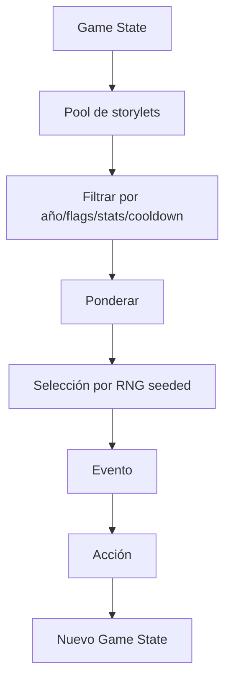

## Estado narrativo mínimo

- `school_year`.
- stats visibles.
- tags de afinidad.
- flags de decisiones importantes.
- historial corto de eventos para evitar repetición.
- logros.

## Tipos de storylet

### One-shot
Evento autocontenido.

### Callback
Recupera una decisión previa: un compañero vuelve a aparecer, una actividad abre otra oportunidad, etc.

### Mini-arco
2–4 eventos relacionados distribuidos en años.

### Evento sistémico
Se activa por thresholds sobre una dimensión de carrera: Equipo muy bajo, Promedio bajo, Aura alta. Una dimensión todavía sin establecer **no satisface un umbral en ninguna dirección** — «sin evidencia» no es «poco».

### Evento final
Resume o consume flags acumulados.

## Reglas de coherencia

- Un callback debe tener causa rastreable.
- No presentar como consecuencia algo que el sistema no puede justificar.
- Evitar que eventos aleatorios contradigan flags duros.
- Permitir cierta ambigüedad narrativa, pero no inconsistencia lógica.

## Espina de carrera — `LOCKED`

| Etapa | Función narrativa |
|---|---|
| 7.º | **Adaptación:** la institución y sus códigos todavía son nuevos; aparecen las primeras personas y responsabilidades. |
| 1.º | **Consolidación:** en la misma escuela, la rutina y los vínculos se estabilizan y el jugador descubre su Estilo. |
| 2.º | **Pertenencia / identidad:** grupos, cooperación, competencia y reputación pesan más. |
| 3.º | **Autonomía:** planificación independiente de tiempo, recursos, tecnología y movilidad; más trade-offs válidos. |
| 4.º | **Responsabilidad:** coordinación, liderazgo y consecuencias públicas sobre otras personas. |
| 5.º | **Cierre / futuro:** mayor densidad de callbacks, proyecto/eventos finales, egreso y proyección sin test vocacional. |

7.º y 1.º ocurren en la misma escuela. Describir 1.º como una segunda adaptación
a una institución nueva quedó supersedido por esta decisión.

Las preguntas de los pases aprobados hacen operativa esa progresión:

| Año | Pregunta narrativa |
|---|---|
| 2.º | ¿Qué lugar tengo entre los demás? |
| 3.º | ¿Cómo organizo mis propias decisiones? |
| 4.º | ¿Qué pasa cuando otras personas dependen de mis decisiones? |
| 5.º | ¿Qué dice de mí todo el recorrido que hice? |

3.º es deliberadamente el año con más riqueza de Estilo hasta ese punto, por las
decisiones de organización propia. La matemática sigue naciendo de la situación;
no aparece porque la profe formule un quiz.

## Responsibility Externality

**Madurez: `LOCKED`.**

4.º hace visible cómo una decisión matemática afecta a personas o sistemas:
flujo, capacidad, turnos, recaudación y circulación. Esa consecuencia externa no
otorga Equipo automáticamente. En el [diseño de 4.º](01-game-design/grade-4-template-design.md),
Equipo se evalúa sólo en `shift-coverage`; `school-event-flow` es Math-only.

## Elenco relacional — `ACCEPTED`

El elenco persiste por relaciones, sin nombres obligatorios:

- **Tu mejor amigo / amigo de toda la vida:** continuidad personal, consecuencias de Equipo, Día del Amigo y callbacks finales.
- **La persona que organiza todo:** Proyecto del Curso, presión de planificación y memoria de si el jugador ayudó, controló o desapareció.
- **El compañero competitivo:** intercurso, tabla, presión social y oportunidades de Aura; no es villano por defecto.
- **La profe de Matemática:** aparición moderada y natural; nunca dispensadora genérica de ejercicios.
- **El preceptor:** contexto, transiciones, consecuencias, humor e identidad escolar argentina.

Se usa nombre propio sólo para desambiguar o mejorar una escena concreta. Los
incidentales no necesitan entrar al elenco recurrente.

## Identidad del jugador y la escuela

La base es un nickname opcional equivalente a “¿Cómo te dicen?”, sin género
obligatorio ni creador complejo. Un avatar/configuración liviana queda como stretch.

La escuela permanece anónima en core para que el jugador proyecte la propia. Una
marca ficticia con guiños paródicos a la institución anfitriona también es stretch;
la lógica del producto nunca se acopla a una escuela real.

## Voz argentina — `LOCKED DIRECTION`

La identidad escolar argentina puede ser fuerte: previa, preceptor, colectivo,
kiosco, acto, intercurso, viaje de egresados, hacer una vaquita, zafar, llegar
raspando o ponerse las pilas. La jerga lleva tono y humor; comprender la decisión
matemática nunca depende de conocerla.

## Humor

El tono es vida escolar realista, humor frecuente y absurdo ocasional. El humor
nace de reconocer situaciones escolares:

- nombres de archivos absurdos;
- impresora que falla;
- compañero que desaparece;
- colectivo demorado;
- presentación preparada a último momento.

No usar:

- bullying como punchline;
- humillación por notas;
- estereotipos discriminatorios;
- docentes reales identificables.

No toda línea necesita un chiste y la matemática debe seguir siendo creíble.
Romance no es sistema ni pilar; sólo admite referencias sutiles opcionales. Los
conflictos pueden tratar reparto, responsabilidad, puntualidad, liderazgo y
reputación, nunca violencia, sexualización o dilemas adultos.

## Modelo temporal y eventos emblemáticos

Cada año se percibe como inicio → desarrollo → momentos emblemáticos → cierre, sin
simular un calendario completo. Fechas como 25 de Mayo, Día del Estudiante, Día
del Amigo, vacaciones, intercurso y egreso pueden ser anchors o storylets; no todas
consumen un beat.

| Año | Evento emblemático candidato |
|---|---|
| 7.º | 25 de Mayo |
| 1.º | Día del Estudiante |
| 2.º | Intercurso |
| 3.º | Día del Amigo / vacaciones de invierno |
| 4.º | Feria, peña o evento solidario escolar |
| 5.º | Viaje o evento final + egreso |

Los cinco Template Design Passes están aprobados. Los detalles editoriales y
variantes deben conservar la identidad diferenciada del año y sus invariantes.

## Proyecto del Curso — línea recurrente `LOCKED`

Es la única gran línea de proyecto que recorre 1.º–5.º: exposición, encuesta,
proyecto tecnológico, recaudación/evento y proyecto final. Refuerza continuidad y
permite callbacks del elenco.

Su presencia es narrativa; la Template matemática no es obligatoria en toda run.
Cuando el compositor no la selecciona, un storylet breve puede mencionarla. Esto
evita que una línea recurrente se convierta en contenido fijo repetitivo.

La **Recurring Arc Policy** extiende ese principio a la composición. El target
aceptado del Proyecto es 1–2 Templates puntuables por carrera; máximo 2 es
`LOCKED v1` y se prefieren años no consecutivos entre planes igualmente válidos.
Membresía, frecuencia y clusters de eventos se mantienen en las
[políticas de la matriz](01-game-design/full-career-content-matrix.md#políticas-de-composición).

## Modelo braided-linear y callbacks

La intensidad aceptada es media:

```text
historia / flags / Carrera
→ contexto y storylets
→ a veces opciones limitadas
```

Puede cambiar texto, quién se acerca, framing, algunas opciones, elegibilidad de
eventos raros y lectura del epílogo. No crea un grafo combinatorio ni bonificaciones
matemáticas invisibles. En Fair, la oportunidad competitiva rara está fijada
por la seed de la edición, no por Estilo o rendimiento previo del participante.

Ejemplos: Equipo alto puede generar confianza posterior; Estilo puede cambiar una
opción de contingencia; una previa puede reaparecer en humor o síntesis final. La
historia del colectivo de 7.º puede alterar el copy del ensayo de 1.º sin volver
la cuenta más fácil.

## Callback Independence

**Madurez: `LOCKED`.**

Un callback puede enriquecer copy, contexto, personajes y opciones limitadas,
pero nunca es un prerrequisito para comprender o resolver la situación. La escena
debe proporcionar la información necesaria y mantener el máximo de FairScore
aunque ese jugador no tenga el historial previo.

La consecuencia narrativa puede recuperarse años después: el elenco recuerda
cómo se repartió una tarea, una previa vuelve en un comentario o el proyecto
final retoma una historia. Ese payoff diferido no exige haber jugado cada
Template del arco ni añade una recompensa matemática por acumular callbacks.
Cada Template puntuable consume 0–2 condiciones ligeras de callback en su copy
normal; es presupuesto de autoría, no límite de schema. La selección de cierre
puede consultar más historia sin multiplicar ramas dentro de cada desafío.

## Career Convergence

**Madurez: `LOCKED`.**

5.º reutiliza visiblemente un subconjunto de la historia para que el cierre
pertenezca a esa carrera, con más densidad de callbacks y sin perder autonomía
de cada Template. `course-project-final` admite contexto previo sin requerir
Projects puntuables anteriores; `yearbook` cambia contenido narrativo, no su
matemática central. Ver [diseño de 5.º](01-game-design/grade-5-template-design.md).

## Narrative Salience

**Madurez: `LOCKED v1` · NOT IMPLEMENTED.** Supersede la orientación aproximada
y el algoritmo diferido del checkpoint #2. Selección determinista de **3–5**
recuerdos distintos:

- exactamente uno temprano, de 7.º–2.º;
- exactamente uno medio, de 3.º–4.º;
- exactamente uno final, de 5.º;
- hasta dos extras de rareza o Hito mayor, sin duplicar recuerdos elegidos.

Dentro de cada segmento: evento raro/único mayor → Hito multianual → payoff
significativo de Repaso/previa → evento icónico → evento ordinario autorado.
Los empates se resuelven por prioridad editorial `salienceRank` y luego ID
semántico estable. Cada segmento debe tener fallback ordinario para garantizar
el mínimo sin exigir rareza ni Projects anteriores. No se usa generación de prosa
no determinista ni LLM runtime. La representación técnica futura está en
[ADR-025](03-architecture/adr/ADR-025-full-career-contract-evolution.md).

## Quinto año y Career Epilogue v1

**Diseño cerrado; implementación requerida en STAGE-08 y todavía pendiente.**

El contrato de entrada futuro usa carrera, Estilo, recuperación/previas, flags,
Project Arc, callbacks, eventos raros, logros y elecciones de cierre verificables.
Una preferencia opcional de `next-step-options` alimenta narrativa, nunca score.

Orden de presentación:

1. **EGRESASTE**, siempre: ningún desempeño lo sustituye por fracaso.
2. Perfil narrativo breve de 2–4 líneas autoradas: Estilo dominante/equilibrado,
   una trayectoria de Equipo/Aura/carrera y tono final, sin jerarquía moral.
3. **TU RECORRIDO**, con los recuerdos de la política de saliencia anterior.
4. Promedio, Equipo, Aura y perfil de Estilo; dimensiones no establecidas conservan
   `null ≠ 0` y no se dibujan como ceros.
5. Hitos desbloqueados, badges display-only y Prestige, distinguidos según
   [su contrato](01-game-design/rare-events-and-prestige.md).
6. En Fair: FairScore, Prestige, posición propia/contexto Top 3 y CTA. En Practice:
   resultado personal y jugar otra vez, sin puesto oficial.

El cierre débil sigue siendo factual/humorístico, nunca humillante ni un diagnóstico
personal. No termina sólo en tabla ni descarga todo el historial. El Product Pass
completó este pase; no hace falta otro pase de epílogo antes de Phase 1.

## Career Milestones

STAGE-08 diseña familias académicas, sociales, de Estilo, comeback/recuperación y
eventos raros. Un Hito puede ser display-only, Prestige-eligible o badge raro. La
identidad de Estilo, corrección Math/Team/Aura, uso/éxito de Repaso, aparición
rara y completar la carrera sólo pueden dar badges de display. La restante
elegibilidad competitiva depende de evidencia independiente y del
[modelo de Prestige](01-game-design/rare-events-and-prestige.md); nunca se presume.

## Regla narrativa-matemática

Cada storylet matemático debe responder:

1. ¿Qué quiere lograr el personaje?
2. ¿Qué información cuantitativa necesita?
3. ¿Qué restricción hace que la elección importe?
4. ¿Cómo se ve la consecuencia?
5. ¿Qué cambia en la carrera?

## Condiciones declarativas, no código en el contenido

Las condiciones de un storylet se expresan como datos versionados, no como JavaScript ejecutable dentro del contenido. Eso es lo que permite validarlas, reproducirlas en el servidor durante un replay y autorarlas sin riesgo.

## Callbacks de fail-forward

Un mal resultado puede **crear** contenido, no quitarlo. La infraestructura, el historial de recuperación y el primer contenido real de 7.º ya están implementados: el repaso cierra el año y una resolución baja deja una `previa` como historia oculta, nunca como quinta stat ni bloqueo de egreso.

Los callbacks ricos entre años todavía no existen. La dirección de STAGE-08 ya
acepta que previas y otros rastros reaparezcan en copy, contexto, Hitos y epílogo,
pero cada caso debe justificar su causa con contenido real. No se convierten en
deuda mecánica futura ni en una quinta stat. Ver
[egreso y fail-forward](01-game-design/graduation-and-fail-forward.md), la
[envolvente de Phase 0](01-game-design/stage-08-product-design-envelope.md) y la
[etapa actual](06-delivery/current-stage.md).

Los branches especiales tienen que ser escasos: si se disparan todo el tiempo, dejan de tener peso narrativo.

---

# FILE: 01-game-design/rare-events-and-prestige.md

# Eventos raros y Prestige

- **Producto v1:** cerrado por el Product Pass del 9 de septiembre de 2026.
- **Arquitectura futura:** aceptada en [ADR-025](03-architecture/adr/ADR-025-full-career-contract-evolution.md); **NOT IMPLEMENTED**.
- **Calibración de rareza:** defaults v1 versionables, no constantes inmutables.
- **Oficialización:** pendiente de contenido validado, STAGE-09/TG2 y freeze.

Los eventos raros deben volver memorables y diferentes las carreras sin convertir
el ranking en una lotería. Prestige puede reconocer trayectorias y acciones
independientes como segundo criterio competitivo; nunca compensa un `FairScore`
menor. Este documento fija semántica de producto, no autoriza ni describe un
runtime existente.

## RNG determinista — regla de producto `LOCKED`

Una selección pseudoaleatoria sólo es válida si es explícita, seeded, reproducible
y verificable por replay/servidor:

```text
misma seed + versiones/políticas + contexto determinista pertinente
= misma selección rara
Fair v1: misma edición → misma presencia rara, también en reintentos
```

No entra `Math.random()`, reloj implícito ni otra entropía ambiente en el core. La
dirección aceptada es un substream semántico propio —junto a composición,
variantes, narrativa y recuperación— para que cambios ajenos no desplacen el
resultado. Su arquitectura concreta deberá seguir las convenciones del motor y
está delimitada por ADR-025. El runId distinto de cada intento no altera la
selección; tampoco los índices desplazados por Repasos.

## Clases y selección

- **COMMON:** contenido ordinario del catálogo/run.
- **CONDITIONAL:** aparece sólo si Carrera, historial y flags satisfacen su elegibilidad.
- **RARE:** requiere elegibilidad y luego selección RNG determinista.

### Defaults de Practice v1

**RECOMENDADA como calibración v1 aceptada**, configurable/versionada; no freeze
competitivo ni propiedad inmutable del motor. Supersede porcentajes/topes abiertos:

| Banda | Probabilidad por draw elegible |
|---|---|
| UNCOMMON | 15 % |
| RARE | 7,5 % |
| VERY_RARE | 2 % |

Presupuesto de carrera: **máximo 2 eventos raros**, **máximo 1 modificador/reemplazo
puntuable** y **máximo 1 VERY_RARE**. Se evalúa elegibilidad antes del draw y se
aplica el presupuesto con orden canónico; los porcentajes no prometen frecuencia
marginal observada después de esos filtros. Overrides requieren justificación y
política versionada, no números dispersos entre Templates.

En Practice puede variar el contexto elegible por historia. En **Fair v1** la
Competition Seed de la edición fija presencia y oportunidades para todos; no se
resortea en reintentos ni se limita acceso por Estilo, Math o posición previa.
El desempeño determina si se logra la acción independiente, no si apareció la
oportunidad competitiva. Ver [modo feria](05-operations/fair-mode-and-competition-freeze.md).

## Tratamientos

### `NARRATIVE_ONLY`

Cambia storylet, callback, badge o display de rareza. Impacto por defecto:
`FairScore = 0`, `Prestige = 0`.

### `PRESTIGE_REPLACEMENT`

Reemplaza una oportunidad ordinaria/condicional de Prestige con el mismo máximo.
El RNG cambia la historia, no el techo competitivo.

### `SPECIAL_MILESTONE`

Puede habilitar Prestige si el jugador realiza una acción especial con evidencia
independiente, dentro del presupuesto global/de track. Debe usarse poco.

### Modificador o reemplazo de gameplay neutral

El diseño de 2.º y 3.º incluye modificadores de una Template existente;
`y4.represent-class` es un reemplazo raro puntuable y 5.º admite modificador o
narrativa. Ninguno agrega un beat puntuable ni techo adicional de FairScore o
Prestige. La frontera futura sigue ADR-025; su implementación falta. Los
nombres de tratamiento son diseño de producto, no enums runtime nuevos.

## Guardrails competitivos — `LOCKED`

El RNG nunca puede:

1. decidir si el jugador egresa;
2. cambiar qué es matemáticamente correcto;
3. crear una oportunidad máxima adicional de `FairScore`;
4. decidir directamente quién gana el ranking;
5. superar el techo estructural de recuperación;
6. otorgar Prestige porque el evento apareció;
7. dar a una run un techo de Prestige mayor que a otra comparable.

## FairScore y Prestige

`FairScore ∈ [0, 10.000]` sigue primario; Prestige es secundario, máximo **100**.
El comparador canónico vive en [score competitivo y ranking](01-game-design/competitive-scoring-and-ranking.md#desempate):
no suma ambos scores ni usa velocidad. Comparador, persistencia y Prestige todavía
no existen en runtime.

## Presupuesto Prestige v1 — `LOCKED`

**Supersesión explícita:** el candidato 25×4, incluido STYLE competitivo, queda
retirado. Estilo sólo pertenece a Career/Narrative y badges de display.

| Track | Máximo | Oportunidades autoradas |
|---|---|---|
| CAREER ARC | 40 | hasta dos logros multianuales de 20 |
| SPECIAL ACHIEVEMENTS | 40 | cuatro slots opcionales de 10 |
| RARE EVENTS | 20 | como máximo un logro independiente de 20 |
| Total | 100 | no es parte de la suma de FairScore |

Career Arc puede reconocer una promesa narrativa no puntuable cumplida después
o un objetivo recurrente independiente; Special usa objetivos opcionales que no
sean puntos Math/Team/Aura disfrazados. Rare exige acción/payoff independiente:
aparición sola = 0. Los nombres y condiciones exactos se autoran con contenido,
no son un bloqueo de prediseño ni permiso para cambiar los tracks.

Toda oportunidad declara fuente de evidencia, identidad, slot y deduplicación.
La configuración de edición fija los mismos slots/techos para todos. Un reemplazo
raro no agrega un slot: conserva una oportunidad equivalente. Si una oportunidad
no existe en esa edición, no se inventan puntos ni una normalización ad hoc para
completar 100; el techo ofrecido debe quedar explícito y ser común a todos.
El máximo estructural es 100, no un premio automático ni promesa de 100 alcanzables
sin autorar sus oportunidades.

## No doble conteo — `LOCKED`

Toda oportunidad debe preguntar si Matemática, Equipo o Aura ya usan la misma
evidencia. Si la respuesta es sí, puede existir como badge display-only pero
`PrestigeEligible = false`.

- “Matemática perfecta” no puede sumar Prestige: ya domina `FairScore`.
- Una identidad o trayectoria de Estilo nunca da Prestige competitivo, ni habilita una oportunidad competitiva exclusiva.
- Math perfecto, Equipo/Aura altos, necesitar/completar Repaso, acumular/cerrar previas, aparición rara y completar el juego sólo pueden dar badges de display.
- Un comeback narrativo sólo es elegible por hechos adicionales independientes; jamás por fallar o recuperar.

La misma regla separa Math, Team, Aura y Prestige en cada Template.

En `y4.represent-class` la separación es triple: propuesta matemática viable,
acción pública de Aura y logro independiente del historial para eventual
Prestige. Ni aparecer ni resolver/comunicar correctamente generan Prestige por
sí mismos. Si una evidencia ya pagó Math, Equipo o Aura, su Prestige competitivo
es **0**. `y5.course-project-final` tampoco paga Prestige directo por esas tres
señales; sólo puede aportar evidencia independiente a un futuro Hito de Career Arc.

## RNG y normalización — `LOCKED DIRECTION`

La forma válida es:

```text
RNG → aparece/reemplaza oportunidad → acción o trayectoria independiente → Prestige
```

Nunca `RNG → Prestige`. Una oportunidad rara reemplaza normalmente otra estándar
con igual techo. Así dos runs pueden contar historias distintas y seguir teniendo
la misma oportunidad competitiva máxima, lo que reduce azar y seed farming bajo
intentos ilimitados.

## Rareza visible

La rareza puede mostrarse por separado del valor competitivo, por ejemplo “MUY
RARO · 3,2 % de carreras”, sólo cuando telemetría real lo respalde. Un evento más
raro no vale automáticamente más Prestige.

## Empates e intentos

El puesto compartido después de FairScore y Prestige es obligatorio en v1; no
queda un tercer criterio oculto. Intentos ilimitados y mejor resultado verificado
se juegan sobre la misma Competition Seed. La política de premios externos y el
freeze se mantienen en [operaciones](05-operations/fair-mode-and-competition-freeze.md).

## Diseños raros aprobados por año

| Año | Evento | Tratamiento aprobado de diseño |
|---|---|---|
| 1.º | `rare.y1.power-outage` | `UNCOMMON / CONDITIONAL / NARRATIVE_ONLY / Prestige 0`; conserva el contrato inicial antes de la expo, sin challenge puntuable adicional. |
| 2.º | `rare.y2.missing-player` | RARE; modificador condicional + seeded de `intercurso-plan`, neutral en oportunidades; sin beat, FairScore ni Prestige extra. |
| 3.º | `rare.y3.offline-project` | RARE; modificador condicional + seeded del proyecto tecnológico, neutral en oportunidades; sin beat, FairScore ni Prestige extra. |
| 4.º | `y4.represent-class` | VERY_RARE; reemplazo condicional + seeded, neutral en oportunidades, STANDARD/MEDIUM; Aura sí, Equipo no, recovery `none`; aparición Prestige 0. |
| 5.º | `rare.y5.five-minutes-before-act` | RARE; condicional + seeded, modificador neutral o `NARRATIVE_ONLY`; sin beat, FairScore ni recovery extra; aparición Prestige 0; sólo crisis escolares de baja gravedad. |

La clasificación por evento es calibración recomendada de v1. En Fair se fija
antes de jugar y no ofrece la oportunidad sólo a quienes ya vienen ganando.
`represent-class` separa propuesta Math, comunicación Aura y logro de Prestige;
ninguna señal se duplica. Modificadores deben materializar una variante aprobada
identificable y preservar corrección, recovery y cantidad de beats.

El pase detallado Rare Events / Milestones / Prestige está completo a nivel de
producto; no hace falta repetirlo. No hay todavía implementación ni catálogo de
logros competitivo aprobado.

**1.º, Phase 1:** `rare.y1.power-outage` **no corre**. Implementarlo exigía la
orquestación de rareza —substreams semánticos propios y arbitraje de
presupuesto— que ADR-025 ubica después. Lo que sí quedó: la expo registra en
origen los hechos que su condición necesita (`y1.project.context-established`,
`y1.project.outcome`) y el content set declara un hook con `implemented: false`,
`NARRATIVE_ONLY` y Prestige de aparición 0. No altera FairScore, egreso ni Repaso.

## Trabajo diferido, no bloqueos de Phase 0

- Autoría de nombres, hechos, condiciones y variantes de logros concretos.
- Implementación de selección, slots, agregación y replay bajo ADR-025.
- Ajustes de calibración por simulación/telemetría, sin convertirlos en constantes.
- Persistencia, emisión, moderación y premios operativos en STAGE-09.

Las aperturas residuales están indexadas en [preguntas abiertas](07-reference/open-questions.md).
El cap/tracks, la exclusión de Style, el puesto compartido y la Competition Seed
no siguen abiertos.

---

# FILE: 01-game-design/rules-scoring-and-progression.md

# Reglas, scoring y progresión

## Reglas globales

1. Una run se identifica por `run_id`, `seed`, `game_version`, `ruleset_version` y `content_version`.
2. Una run oficial se inicia en servidor cuando el modo requiere ranking.
3. El cliente puede previsualizar score, pero el servidor calcula el resultado oficial.
4. Cada desafío debe declarar su función de evaluación.
5. Toda variante procedural debe ser validable de forma determinista.
6. La run continúa después de errores salvo fallo técnico irrecuperable.

## Progresión temporal

Etapas canónicas:

1. 7.º grado.
2. 1.º año.
3. 2.º año.
4. 3.º año.
5. 4.º año.
6. 5.º año.
7. Egreso.

Cada etapa puede modificar:
- dificultad objetivo;
- categorías matemáticas habilitadas;
- storylets disponibles;
- peso de eventos sociales/proyectos;
- recompensas.

## Modelo de score

El resultado premia calidad de decisión; la rapidez no puntúa ni desempata.
Las fórmulas preliminares siguientes son antecedentes de desarrollo, no la
política competitiva v1 ni instrucciones para añadir bonuses.

### Componentes sugeridos

`score_evento = base × calidad × dificultad + bonus_contextuales - penalizaciones`

Donde:
- `base`: valor estándar del evento.
- `calidad`: factor por inválida/funcional/eficiente/óptima.
- `dificultad`: factor del nivel del problema.
- `bonus_contextuales`: uso eficiente, predicción correcta, solución alternativa válida, etc.
- `penalizaciones`: sólo por decisiones lúdicas declaradas; nunca por usar una herramienta permitida salvo modo especial explícito.

### Factores iniciales de referencia

- inválida: 0.20–0.40.
- funcional: 0.70.
- eficiente: 0.90.
- óptima: 1.00.

Estos valores son de **desarrollo** y no oficiales: el motor los expone bajo una política nombrada marcada `production: false`, y el cargador de ruleset se niega a construir un ruleset oficial desde ahí. Su calibración final es una decisión del Departamento de Matemática ([pregunta 24](07-reference/open-questions.md) y [pregunta 39](07-reference/open-questions.md)), no el resultado de un playtest previo que no está garantizado. Ver [ciclo de entrega real](00-product/real-delivery-lifecycle.md).

## Velocidad y rachas — supersesión v1

Los candidatos de bonus por tiempo y multiplicadores de racha quedan
`SUPERSEDED` para la competencia. Tiempo sirve sólo para diagnóstico UX;
rachas pueden celebrarse como narrativa/display. Ninguno agrega FairScore o
Prestige ni desempata el ranking. La autoridad es
[score competitivo y ranking](01-game-design/competitive-scoring-and-ranking.md).


## Estadísticas narrativas

Las decisiones modifican stats mediante deltas pequeños y acotados. Las stats no deben sustituir el score matemático; su función principal es desbloquear/ponderar narrativa.

## Riesgo

Algunos eventos permiten decisiones con incertidumbre. El sistema debe distinguir:
- **calidad ex ante:** qué tan razonable era la decisión con la información disponible;
- **resultado ex post:** qué ocurrió por azar.

El score matemático debe basarse principalmente en calidad ex ante. El jugador no debería perder ranking porque un RNG justo produjo un resultado adverso después de una buena decisión.

## Perfil final

El [epílogo](01-game-design/narrative-system.md#quinto-año-y-career-epilogue-v1) sintetiza hechos y elecciones
significativas con prosa autorada, sin diagnósticos ni etiquetas basadas en errores.
Estilo conserva Aplicado/Estratega/Improvisador como identidad no competitiva;
velocidad y calidad matemática por sí solas no definen una estrategia.


## Condición de finalización

La run termina al completar el evento final o al abandonar explícitamente.

No hay repetición automática de año por bajo desempeño en el MVP. La fantasía es una carrera comprimida, no un simulador administrativo de promoción escolar.

Eso no significa que el bajo desempeño no tenga consecuencia. El **fail-forward está implementado**: un resultado ordinario alcanzado por la política puede dejar una obligación; el año la cierra con un repaso fuera de su presupuesto ordinario, y toda run válida completada alcanza `GRADUATED`. El repaso no aporta evidencia a `FairScore`, no borra el resultado original y nunca se repite en bucle.

El máximo de **un repaso por etapa** es estructura aceptada en [ADR-024](03-architecture/adr/ADR-024-progression-recovery-and-graduation.md), no una calibración ordinaria. `RecoveryPolicy` conserva el campo como literal inspeccionable `1` y expresa la política de disparo; el Product Pass fija INVALID para v1,
sin disparo por FUNCTIONAL; el content set declara el ruteo por plantilla. Una plantilla puede declarar `none` de manera intencional. 7.º ya prueba el recorrido real: las dos plantillas del colectivo rutean a `g7.bus-travel-review`; las otras cinco plantillas ordinarias declaran `none`. Ver [egreso, recuperación y fail-forward](01-game-design/graduation-and-fail-forward.md).

## Este score no es el score de la competencia

Lo anterior describe el **score por evento y por run** que ve el jugador. Es una capa distinta del score competitivo de una run completa, implementado desde STAGE-06 como política candidata de desarrollo.

| Capa | Qué responde | Estado |
|---|---|---|
| Resultado de desafío | ¿qué tan bien se resolvió esta situación? | implementado |
| Score de run | ¿cuántos puntos hizo esta partida? | implementado, política de desarrollo |
| Identidad de carrera | ¿qué recorrido escolar construí? | implementado |
| Desempeño competitivo | ¿qué evidencia matemática, de equipo o de aura produjo cada beat? | implementado; Promedio y Estilo no son componentes |
| `FairScore` competitivo | ¿qué tan fuerte fue esta run bajo una `ScorePolicy` concreta? | **implementado**; `fair-score-dev-1` histórico y `fair-score-dev-2` post-TG1 actual, ambos `official: false` |
| Ranking | ¿cómo se ordenan runs verificadas y cuál es el personal best? | no implementado |

La cadena vigente mantiene límites explícitos: resultado de desafío ≠ efecto de carrera ≠ desempeño competitivo ≠ `FairScore` ≠ ranking. `MathPerformance` domina; `TeamPerformance` y `AuraPerformance` son secundarias y acotadas; Promedio y Estilo no puntúan directamente. Cuando el `RunPlan` no ofrece una componente, ésta sale del cálculo y los pesos activos se renormalizan, de modo que una ejecución perfecta conserva el máximo de 10.000.

La arquitectura y el mecanismo ya existen, incluida la aritmética entera y la recomputación en servidor. TG1 aceptó 85/10/5, los escalones de calidad, la normalización de oportunidades y el principio de recompensa pequeña; `fair-score-dev-2` los publica como candidato no oficial. Los factores exactos de dificultad siguen siendo calibración candidata.
El orden FairScore → Prestige → shared rank y las reglas v1 están cerrados como
producto; ranking, Prestige y persistencia del personal best siguen sin implementar. Ver [score competitivo y ranking](01-game-design/competitive-scoring-and-ranking.md) y [ADR-023](03-architecture/adr/ADR-023-competitive-score-policy.md).

---

# FILE: 01-game-design/stage-08-product-design-envelope.md

# Envolvente de diseño de producto de STAGE-08

- **Etapa:** STAGE-08
- **Fase:** Phase 0 — Full-Career Content Design
- **Estado de la fase:** `DONE` — reconciliación documental del 10 de septiembre de 2026
- **Estado de esta envolvente:** `COMPLETE · ACCEPTED`
- **Implementación masiva:** fuera de alcance

Este documento fija la envolvente de producto para diseñar la carrera desde 1.º
hasta 5.º antes de producirla. La [matriz de carrera](01-game-design/full-career-content-matrix.md)
concreta el inventario candidato; el [sistema narrativo](01-game-design/narrative-system.md),
[eventos raros y Prestige](01-game-design/rare-events-and-prestige.md) y los
[diseños detallados de 1.º–5.º](01-game-design/full-career-content-matrix.md) desarrollan sus áreas sin
convertirlas en comportamiento ya implementado.

## Propósito y frontera

Phase 0 responde qué experiencia vive el jugador desde la entrada ya establecida
en 7.º hasta el egreso y cómo conviven matemática, decisiones, consecuencias,
continuidad, recuperación, pacing, rejugabilidad y competencia.

Produce diseño, no contenido ejecutable. Incluye:

- arco narrativo y mapa matemático de la carrera;
- cobertura de dificultad, interacciones, Equipo, Aura y recuperación;
- presupuesto de pacing y plan de rejugabilidad;
- modelo de eventos raros y Prestige;
- matriz completa candidata y fichas detalladas por año;
- contrato de auditoría posterior a implementar 1.º;
- auditoría final de diseño de carrera.

No incluye producción masiva de variantes o años, ranking/backend, grandes sets
de assets ni una arquitectura nueva de motor. Los cinco pases por año ya están
aprobados. El Product Pass completó la auditoría cruzada y los pases de raros,
Prestige y epílogo. La [conformidad técnica](04-quality/full-career-technical-conformance.md)
y [reconciliación](07-reference/full-career-product-audit-integration.md) cierran
Phase 0 sin producir runtime.

## Arco de carrera — `LOCKED`

7.º y 1.º transcurren en la misma escuela. Por eso 1.º no vuelve a presentar una
llegada a una institución nueva.

| Etapa | Función narrativa |
|---|---|
| 7.º | **Adaptación / entrada:** conocer la escuela, sus códigos, personas y la gramática del juego. |
| 1.º | **Consolidación:** estabilizar vínculos y responsabilidades; descubrir cómo se mueve el jugador dentro de lo ya conocido. |
| 2.º | **Pertenencia / identidad:** grupos, amistad, cooperación, reputación y lugar propio. |
| 3.º | **Autonomía:** tiempo, recursos, proyectos, movilidad, tecnología y organización más autodirigida. |
| 4.º | **Responsabilidad:** liderazgo, coordinación y consecuencias públicas que afectan a más personas. |
| 5.º | **Cierre / futuro:** proyecto y eventos finales, callbacks, egreso y síntesis del recorrido. |

```text
ADAPTACIÓN → CONSOLIDACIÓN → PERTENENCIA / IDENTIDAD
           → AUTONOMÍA → RESPONSABILIDAD → CIERRE / FUTURO
```

## Accesibilidad matemática — `LOCKED`

```text
AcademicStage != DifficultyBand
```

Toda la carrera conserva un piso de prerrequisitos accesible desde
aproximadamente 7.º. Los años posteriores maduran el contexto, la responsabilidad,
la ambigüedad y las consecuencias; no exigen currículo avanzado como puerta de
entrada.

La caja de herramientas principal incluye aritmética, fracciones, porcentajes,
proporcionalidad, tiempo y tasas simples, costos, estimación, medición, área,
perímetro, escala, tablas y gráficos, estadística descriptiva, probabilidad
intuitiva, clasificación, planificación, asignación, optimización, restricciones y
espacios combinatorios pequeños. Incógnitas simples, relaciones lineales,
coordenadas y escala sólo entran cuando pueden descubrirse sin formalismo.

No son prerrequisitos obligatorios el manejo polinómico avanzado, sistemas
complejos, trigonometría, funciones formales avanzadas, logaritmos ni cálculo. Se
evalúa la decisión o construcción, no una técnica escolar única. Sigue vigente la
regla de autoría: si se quitan los números y la decisión no cambia, la matemática
es decorativa.

## Dificultad e inventario — `ACCEPTED TARGET`

Las bandas siguen siendo `CORE / STANDARD / STRETCH`, con objetivo de catálogo
aproximado `25 / 50 / 25`, no una cuota rígida. La matriz auditada actual alcanza
`6 / 13 / 6`, es decir `24 % / 52 % / 24 %`, y distribuye las tres bandas a lo
largo de los años.

La dirección de inventario es `4–6` Templates por año y aproximadamente 25 entre
1.º–5.º. El 25 no es un contrato: calidad, diversidad semántica y cobertura
prevalecen. Una Template cambia el razonamiento; cambiar sólo números produce una
Variant.

## Interacciones — `LOCKED v1`

La fuente única es la [taxonomía de cinco motores](01-game-design/challenge-system.md#cinco-motores-reutilizables-de-interacción-v1).
Allocation Board, Constraint Builder, Flow Board, Spinner Builder y similares
pasan a ser modos/componentes, no motores independientes. La implementación
reutiliza adapters existentes y amplía sólo los contratos necesarios; no declara
ya construidas interacciones espaciales o de planificación.

Arrastrar nunca es la única vía: teclado y tap/selección deben ofrecer una
alternativa equivalente. Una sexta familia requiere revisión explícita.

## Evidencia secundaria — `LOCKED`

**Equipo** mide una decisión explícita de coordinación, reparto, cooperación,
participación o impacto grupal. Que el contexto tenga un grupo no alcanza. Es
válido separar factibilidad matemática de distribución social de la carga si usan
evidencia independiente.

**Aura** mide una consecuencia pública, reputacional o social distinta de la
corrección matemática. No representa moralidad ni corrección genérica y debe ser
menos frecuente que Equipo. Es válido que un año —incluido 1.º— no tenga una
oportunidad competitiva ordinaria de Aura.

**Estilo** conserva `Aplicado / Estratega / Improvisador`: ningún eje es mejor.
Phase 0 aumenta su utilidad narrativa mediante copy, callbacks, storylets,
epílogo y badges de display. Estilo no es parte de `FairScore` ni de Prestige
competitivo, ni habilita oportunidades competitivas ocultas.

Matemática, Equipo, Aura y Prestige nunca cobran dos veces el mismo hecho.

## Decisiones con más de una salida válida — `LOCKED`

Parte del catálogo debe admitir varias soluciones matemáticamente válidas con
consecuencias diferentes: más segura pero costosa, más ajustada, mejor distribuida
o más flexible. La evaluación distingue factibilidad, calidad matemática y
señales independientes sin esconder una respuesta moralmente correcta.

## Narrativa y continuidad — `ACCEPTED`

El modelo es **braided-linear**: todas las runs válidas completadas recorren la
misma secuencia académica y egresan, mientras historia, flags y carrera cambian
storylets, copy, contexto, elegibilidad y, de forma limitada, opciones. No existe
un árbol narrativo exponencial ni ventajas matemáticas ocultas.

Previas y recuperaciones son principalmente memoria de carrera: alimentan
callbacks, Hitos y epílogo, pero no generan una deuda mecánica futura sin límite.
El detalle vive en el [sistema narrativo](01-game-design/narrative-system.md).

## Identidad, cultura y tono

- **Jugador — `ACCEPTED`:** nickname opcional; sin selección obligatoria de género ni creador complejo. Personalización visual mínima queda como stretch.
- **Escuela — `ACCEPTED`:** anónima en core para favorecer proyección. Una marca escolar ficticia/paródica es stretch y no puede acoplar el producto a una institución real.
- **Identidad argentina — `LOCKED DIRECTION`:** jerga y cultura escolar argentinas fuertes, con matemática comprensible sin conocer el localismo.
- **Humor — `LOCKED DIRECTION`:** vida escolar realista, humor frecuente y absurdo ocasional; nunca humillación ni chiste desconectado de la situación.
- **Romance — `ACCEPTED`:** no es sistema ni pilar; sólo referencias sutiles opcionales.
- **Conflicto — `ACCEPTED`:** tensiones de grupo, responsabilidad, liderazgo, puntualidad y reputación; se excluyen bullying severo, violencia, sexualización y dilemas adultos.

El elenco relacional recurrente usa por defecto roles, no nombres: mejor amigo,
persona que organiza todo, compañero competitivo no villano, profe de Matemática
usada con moderación y preceptor. Los nombres se agregan sólo si mejoran claridad.

## Tiempo, eventos y proyecto recurrente

Cada año se percibe como inicio → desarrollo → cierre, con fechas explícitas sólo
cuando aportan identidad. El eje emblemático candidato es:

| Año | Evento emblemático |
|---|---|
| 7.º | 25 de Mayo |
| 1.º | Día del Estudiante |
| 2.º | Intercurso |
| 3.º | Día del Amigo / vacaciones de invierno |
| 4.º | Feria, peña o evento solidario escolar |
| 5.º | Viaje o evento final + egreso |

Existe una única línea multianual **Proyecto del Curso**: exposición, encuesta,
proyecto tecnológico, recaudación/evento y proyecto final. Su continuidad es
narrativa; su Template matemática no es obligatoria en toda run. Cuando no es
seleccionada, un storylet corto puede mantenerla presente sin consumir un beat.

La [matriz](01-game-design/full-career-content-matrix.md#políticas-de-composición) fija Event
Cluster Policy, Recurring Arc Policy y Callback Independence como `LOCKED`.
Intercurso de 2.º, School Event de 4.º y Egreso de 5.º admiten como máximo una
Template puntuable de cada cluster por run normal. Para Project Arc, el target
aceptado es 1–2 por carrera, máximo 2 `LOCKED v1` y preferencia por años no
consecutivos. La matriz distingue mínimos globales de diversidad y preferencias
soft adicionales.

El [sistema narrativo](01-game-design/narrative-system.md) fija Responsibility Externality para
4.º —consecuencias externas sin Equipo automático— y Career Convergence para
5.º —historia visible sin prerrequisitos de callbacks—. Narrative Salience
fija 3–5 recuerdos deterministas por segmentos; la implementación queda pendiente.

Deportes, dinero cotidiano/colectivo, tecnología, transporte, proyectos y eventos
son contextos aceptados. Los presupuestos deben ser ficticios o colectivos y no
inferir poder adquisitivo familiar.

## Pacing — `ACCEPTED TARGET · UNVALIDATED`

La [matriz](01-game-design/full-career-content-matrix.md#envolvente-normalfair-v1) fija exactamente
nueve beats ordinarios y la envolvente de dificultad, pacing y diversidad de v1.
El tiempo es target UX sin timer, puntuación ni desempate. La arquitectura genérica
admite otros tamaños; el fixture sintético de doce beats demuestra capacidad y
boundedness, no pacing validado de producto.

## Rejugabilidad — `LOCKED GOAL`

Las primeras tres runs de Practice deberían sentirse perceptiblemente distintas por la suma
de composición, variantes aprobadas, callbacks, eventos condicionales/raros y
consecuencias de Carrera/Estilo. La variación numérica masiva por sí sola no cuenta
como rejugabilidad. Esta preferencia no rige Fair: sus reintentos conservan
la Competition Seed de la edición, según [modo feria](05-operations/fair-mode-and-competition-freeze.md).

## Epílogo e Hitos

**Career Epilogue v1 — `REQUIRED FOR STAGE-08`.** El egreso debe sintetizar
Promedio, Equipo, Aura, Estilo, previas/recuperaciones, flags y Hitos en un relato
breve; no termina sólo en una tabla ni reduce la carrera a una etiqueta.

**Career Milestones — `ACCEPTED DESIGN SCOPE`.** Phase 0 diseña familias
académicas, sociales, de Estilo, recuperación y eventos raros. Un Hito puede ser
sólo visual, elegible para Prestige o badge raro; nunca recibe competencia
automáticamente ni duplica evidencia ya puntuada. Identidad de Estilo, logros
basados sólo en Math/Team/Aura, aparición rara y recuperación son display-only.
Presupuesto y elegibilidad competitiva viven exclusivamente en [Prestige](01-game-design/rare-events-and-prestige.md).

## Estado y siguiente paso

**Phase 0 DONE. Next: Phase 1 — implementar 1.º real.** No se agregan familias ni
se reemplazan las 25 Templates antes de G1 salvo evidencia de contradicción real.
El [roadmap](06-delivery/implementation-sequence.md) gobierna implementación,
contratos previos y el STOP obligatorio del audit posterior a G1. La aprobación
de diseño no equivale a producción, revisión matemática, pacing empírico o freeze.
Sólo evidencia técnica, feedback docente, problemas medidos de acceso/pacing o
invalidez matemática justifican reabrir decisiones de prediseño.

---

# FILE: 01-game-design/ux-interaction-design.md

# UX e interacción

## Estrategia

Mobile-first, portrait-first, DOM-first. Desktop presenta el mismo flujo dentro de una columna central ampliada.

## Viewport de referencia

Diseñar inicialmente para ~390×844 CSS px y verificar mínimo 360 px de ancho.

## Layout base

```text
┌────────────────────────┐
│ 7.º GRADO      ▪▪□□□□□ │  etapa + progreso en celdas
├────────────────────────┤
│ Promedio │ Equipo │ ◣  │  tira de carrera (aparición progresiva)
├────────────────────────┤
│ EYEBROW                │
│ Título de la situación │
│ Prosa                  │
│ ┌────────┐ ┌────────┐  │  grilla de datos sobre papel
│ │ dato   │ │ dato   │  │
│ └────────┘ └────────┘  │
│▓▓▓▓▓▓▓▓▓▓▓▓▓▓▓▓▓▓▓▓▓▓▓▓│  bloque de decisión (oscuro, a sangre)
│▓ consigna             ▓│
│▓ opciones             ▓│
│▓ [ CONFIRMAR ]        ▓│  el primario vive acá mientras se decide
└────────────────────────┘
```

Al resolver, el bloque oscuro suelta el primario, aparece el panel de resultado sobre papel y el primario reaparece al final del shell. **Existe exactamente un primario montado a la vez.**

El ancho de juego es de 412 px máximo, centrado en todos los breakpoints: tablet y desktop centran contra la hoja, no ensanchan. Ver el [sistema de diseño](09-design-system/foundations.md).

## Navegación

- No depender de browser back como parte del juego.
- Confirmar abandono de run activa.
- Persistir checkpoint local después de cada desafío.

## Patrones

### Decision cards
Cards grandes, táctiles, sin hover obligatorio.

### Drag & drop
Toda interacción puntuable debe poder completarse con tap/select **y teclado**
sin arrastrar. Si ofrece drag, éste es una vía adicional equivalente: seleccionar
origen/destino, mover con controles o reordenar mediante lista. Sin secuencias
sensibles al tiempo.

### Sliders
Mostrar valor numérico y permitir ajuste fino por botones/teclado.

### Gráficos
Etiquetas visibles; no depender sólo del color.

### Feedback
Secuencia recomendada:
1. bloquear input;
2. animación corta;
3. mostrar consecuencia numérica;
4. actualizar stats;
5. CTA continuar.

## Motion

- Duración habitual 150–350 ms.
- Respetar `prefers-reduced-motion`.
- Evitar animaciones largas que reduzcan throughput de feria.

## Audio

Opcional, nunca requerido para comprender. Estado mute persistente.

## Accesibilidad

- Contraste mínimo WCAG AA como objetivo.
- Target interno de producto ≥44×44 CSS px para controles primarios cuando el layout lo permita; no se atribuye ese número como mínimo universal de WCAG.
- Navegación por teclado para todas las acciones esenciales.
- Focus visible.
- Texto no incrustado en imágenes.
- Feedback no dependiente exclusivamente de color ni animación; palabra/glyph/marca acompañan el estado.
- Notación matemática con labels legibles; la jerga argentina aporta tono, no información necesaria para resolver.
- Sin bonus, ranking ni desempate por velocidad: lectura pausada no penaliza.

## Herramientas

Calculadora/anotador se abren como paneles no destructivos; cerrar no pierde estado.

## Loading

Gameplay no muestra loaders entre eventos si éstos ya están generados localmente. El servidor participa fuera del loop crítico.

## Errores de red

El jugador no pierde una run porque falle el leaderboard. Se muestra estado “resultado pendiente de sincronización” y se reintenta cuando corresponda.

## Aceptación por motor y walkthroughs

Los [cinco motores](01-game-design/challenge-system.md#cinco-motores-reutilizables-de-interacción-v1)
definen una vez contratos de teclado, puntero, touch, foco, errores/resultados,
labels programáticos, reduced motion y helper E2E. La primera aparición enseña
la interacción con una pista de un paso, nunca la solución matemática.

Antes de feria: carrera sólo teclado; touch móvil y alternativa no-drag; movimiento
reducido; comprensión sin color; viewport estrecho; zoom alto y lectura lenta.
Son pruebas proxy junto a Teacher Gate 2, no sustitutos de investigación con
estudiantes. El sistema de diseño conserva autoridad sobre tokens y primitivas.

---

# FILE: 02-functional/functional-specification.md

# Especificación funcional

## FR-001 Inicio
El sistema debe permitir iniciar una experiencia sin crear una cuenta tradicional.

### Comportamiento
- Mostrar nombre del juego y CTA principal.
- Permitir nickname opcional/obligatorio según modo.
- Validar longitud y caracteres.
- Crear identidad anónima local.

## FR-002 Creación de run
En modos online oficiales, el cliente debe solicitar al servidor una run antes de jugar.

El servidor devuelve como mínimo:
- `run_id`;
- `seed`;
- `mode`;
- versiones de reglas/contenido;
- timestamp de inicio;
- configuración de evento.

## FR-003 Generación de carrera
A partir de seed y configuración, el motor debe producir una secuencia reproducible de años, desafíos y storylets.
Normal/Fair v1 completa seis etapas con exactamente nueve beats ordinarios; las
cuotas de dificultad, pacing y diversidad se mantienen en la matriz.

**Diseño objetivo STAGE-08, no implementado:** la composición de carrera debe
respetar los [clusters y arcos](01-game-design/full-career-content-matrix.md#políticas-de-composición)
y la madurez declarada de cada política. Los callbacks enriquecen la escena sin
requerir historia previa para comprenderla o resolverla, ni cambiar por sí mismos
el máximo de FairScore.

## FR-004 Presentación de etapa
El jugador debe conocer siempre la etapa escolar actual.

## FR-005 Resolución de desafíos
El sistema debe soportar los [cinco motores reutilizables](01-game-design/challenge-system.md#cinco-motores-reutilizables-de-interacción-v1)
y sus modos. No se confunden con kinds técnicos actuales; todo input esencial
admite teclado y tap sin drag según [UX](01-game-design/ux-interaction-design.md).

## FR-006 Evaluación
Cada acción debe generar un `ChallengeResult` determinista con:
- calidad;
- score parcial;
- explicación;
- cambios de stats;
- flags;
- datos de telemetría no sensibles.

**Diseño objetivo de contenido STAGE-08:** cada contribución de Math, Equipo,
Aura o Prestige requiere evidencia propia. En `y4.represent-class`, una propuesta
Math-valid, su comunicación pública y un logro histórico para Prestige son
hechos distintos; la aparición vale 0. En `y5.next-step-options`, FairScore sólo
evalúa viabilidad de escenarios hipotéticos: una preferencia personal opcional
alimenta Estilo/epílogo, nunca se califica como correcta o incorrecta. Ver las
fichas de [4.º](01-game-design/grade-4-template-design.md) y
[5.º](01-game-design/grade-5-template-design.md).

## FR-007 Feedback
Después de confirmar, el juego debe explicar la consecuencia antes de avanzar.

## FR-008 Herramientas
Los desafíos pueden habilitar herramientas. El schema declara cuáles están disponibles.

## FR-009 Persistencia local
La run activa debe guardar checkpoint tras cada evento completado.

## FR-010 Reanudación
Si existe checkpoint compatible con la versión actual, ofrecer reanudar.

## FR-011 Finalización
Al completar la carrera, generar tarjeta de egreso con score, perfil y resumen.

**Career Epilogue v1 — producto cerrado, no implementado:** egreso siempre,
perfil breve, 3–5 recuerdos deterministas, carrera, Hitos y CTA según modo.
El [sistema narrativo](01-game-design/narrative-system.md#quinto-año-y-career-epilogue-v1)
gobierna segmentos/prioridades sin duplicar el historial ni usar LLM runtime.

## FR-012 Ranking
En un evento competitivo, mostrar mejores resultados verificados según
[FairScore → Prestige → puesto compartido](01-game-design/competitive-scoring-and-ranking.md#desempate).
Sin velocidad ni criterio oculto. Style sólo Career/Narrative; Prestige competitivo
usa hechos independientes y su [presupuesto canónico](01-game-design/rare-events-and-prestige.md).

## FR-013 Reintento
El jugador puede iniciar otra run. Fair v1 permite reintentos ilimitados sobre
la misma Competition Seed de edición, sin reroll raro. Practice puede variar
seeds aprobadas y no aporta ranking oficial.

## FR-014 Modo feria
Un evento debe poder definir:
- período de vigencia;
- una Competition Seed compartida y server-issued por edición v1;
- ruleset;
- dificultad fija y plan/variantes/estado raro comunes;
- reintentos ilimitados, conservando mejor resultado verificado;
- ranking;
- moderación.

## FR-015 Moderación
Operadores autorizados deben poder ocultar una entrada de ranking sin borrar necesariamente la run auditada.

## FR-016 Degradación de red
Una interrupción después del inicio no debe impedir continuar el gameplay local. El resultado puede quedar pendiente de validación/sincronización.

## FR-017 Versionado
Toda run oficial guarda `game_version`, `ruleset_version` y `content_version`.

## FR-018 Replay técnico
El backend debe poder reconstruir una run oficial a partir de seed, versiones y acciones para validar score.

## FR-019 Analytics
Registrar eventos mínimos definidos en `analytics-observability.md` sin requerir PII.

## FR-020 Pantalla pública
Debe existir una vista de leaderboard apta para proyector/TV en el modo feria.
Top 3 público pseudónimo, sin exposición infinita de posiciones inferiores; puesto
propio/personal best privado según [operaciones](05-operations/leaderboard-and-moderation.md).

## Requisitos administrativos post-MVP

### FR-A01 Gestión de eventos
Crear, activar, cerrar y archivar eventos.

### FR-A02 Contenido
Gestionar estados de contenido o importar paquetes versionados.

### FR-A03 Moderación
Ocultar/restaurar nicknames y scores.

### FR-A04 Exportación
Exportar estadísticas agregadas del evento.

## Requisitos objetivo del modo competitivo

**No implementados.** Estos requisitos aparecen cuando exista la feria con ranking y premios. Se numeran aparte para que nadie los confunda con comportamiento actual; su arquitectura está en [arquitectura objetivo del motor](03-architecture/target-engine-architecture.md).

### FR-T01 Descriptor de run oficial
Antes de que una run pueda ser candidata a premio, el servidor emite un descriptor inmutable con la tupla de versiones —incluidas `scoreVersion` y `variantCatalogVersion`—, el seed y la asignación de variantes. El cliente no puede pedir un seed arbitrario ni una dificultad más fácil.

### FR-T02 Vista pública sin solución
El motor expone de una variante sólo lo que el renderer necesita. Ni la respuesta ni el evaluador se filtran por la forma del contenido público.

### FR-T03 Envío sin score
El cliente envía identidad de run y action log canónico, con clave de idempotencia. Un campo `score` provisto por el cliente se ignora o se rechaza.

### FR-T04 Verificación por replay
El servidor recarga las versiones exactas, reconstruye las variantes, reproduce los comandos, rechaza logs imposibles y escribe un resultado oficial inmutable.

### FR-T05 Personal best
El verificador actualiza el mejor resultado del participante según el comparador versionado. Una run peor queda en el historial auditable pero no reemplaza al mejor público.

### FR-T06 Continuar después del fracaso
Fundación implementada: un resultado insuficiente no crea fracaso terminal.
Producto v1: INVALID recovery-capable dispara **REPASO**; FUNCTIONAL y `none` no.
Una selección determinista interactiva por etapa, debrief de las restantes y cierre
de todas, sin FairScore/Prestige ni bloqueo de egreso. Debrief es delta futuro bajo
[ADR-025](03-architecture/adr/ADR-025-full-career-contract-evolution.md).

### FR-T07 Cierre de carrera completa
El producto completo termina en `EGRESADO`, deriva el arquetipo final y produce el resumen de run. El slice de 7.º termina en el hito de año.

TG1 cerró la dirección 85/10/5, normalización de oportunidades e intentos ilimitados con mejor resultado verificado. Siguen abiertos la política oficial/freeze, la implementación de emisión y personal best; el desempate exacto ya es puesto compartido. Ver [preguntas abiertas](07-reference/open-questions.md).

---

# FILE: 02-functional/traceability-matrix.md

# Matriz de trazabilidad

| Objetivo | Feature | Requisitos | Historias | ADR relacionado |
|---|---|---|---|---|
| Entrada rápida | identidad anónima | FR-001 | US-001 | ADR-008 |
| Run reproducible | seed/versiones | FR-002, FR-003, FR-017, FR-018 | US-022, US-051 | ADR-003 |
| Matemática como gameplay | challenges parametrizados | FR-005, FR-006, FR-007 | US-002, US-003 | ADR-007 |
| Resiliencia | local-first/checkpoints | FR-009, FR-010, FR-016 | US-030, US-031 | ADR-006 |
| Ranking justo | score servidor | FR-011, FR-012, FR-018 | US-020, US-022 | ADR-004, ADR-009 |
| Escalar contenido | content-as-data | FR-003, FR-005 | US-050 | ADR-007 |
| Web universal | responsive/PWA-ready | NFR | US-001 | ADR-001 |
| Operación de feria | eventos + pantalla | FR-014, FR-020 | US-040 | ADR-009 |
| Privacidad | minimización | FR-001 | US-001 | ADR-008 |
| Moderación | ocultar entradas | FR-015 | US-041 | ADR-009 |

## Regla de mantenimiento

Toda feature nueva debe:
1. referenciar un objetivo o justificar uno nuevo;
2. agregar/modificar requisito funcional;
3. tener historia o tarea técnica;
4. crear ADR si cambia una decisión arquitectónica significativa;
5. actualizar tests/NFR si aplica.

## Dirección del blueprint v0.2 hasta el código

De requisito de producto a capacidad de motor y a estado real. Esta tabla cubre lo que **todavía no** está cubierto por los FR de arriba, y su columna de estado es una lectura del 29 de agosto de 2026: se verifica contra el código antes de planificar. El mapa completo está en [la integración del blueprint](07-reference/blueprint-v0.2-integration.md).

| Requisito de producto | Regla de game design | Capacidad de motor | Estado | Fase |
|---|---|---|---|---|
| Escenarios que no se memorizan | [familias y variantes](01-game-design/challenge-families-and-variants.md) | `ScenarioFamily`/`Template`/`Variant` + fuentes híbridas | primera variación cognitiva de producción **implementada** en `bus`; profundidad del resto del catálogo abierta | STAGE-04 / STAGE-08 |
| Competencia sin variantes defectuosas | [validación de variantes](04-quality/variant-validation-and-audit.md) | validador transversal + catálogo aprobado | **implementado para desarrollo y consumido por gameplay** en `grade-7-dev-4`; catálogo justo oficial pendiente | FREEZE |
| Runs comparables entre sí | [dificultad](01-game-design/difficulty-and-playability.md) | bandas + scheduler por presupuesto | mecanismo implementado; bandas aceptadas en TG1, equivalencia empírica pendiente | STAGE-05 (`DONE`) / STAGE-08 |
| Ranking dominado por matemática | [score competitivo](01-game-design/competitive-scoring-and-ranking.md) | `ScorePolicy` competitiva versionada | `fair-score-dev-2` 85/10/5 implementada y auditada; ranking pendiente | STAGE-06 (`DONE`) / STAGE-09 |
| Premiar mejora y no volumen de intentos | [modo feria](05-operations/fair-mode-and-competition-freeze.md) | emisión autoritativa + mejor resultado verificado | dirección TG1 aceptada; persistencia no implementada | STAGE-09 |
| El error no expulsa al jugador | [fail-forward](01-game-design/graduation-and-fail-forward.md) | invariante de egreso + recuperación | **implementado**: 20.000 carreras de seis años, 20.000 egresadas; label REPASO cerrado en Product Pass, aplicación UI pendiente | STAGE-07 (`DONE`) |
| Identidad de carrera legible | [ADR-016](03-architecture/adr/ADR-016-career-player-model.md) | `CareerState` v0.2 | **implementado** | — |
| Auditoría de una run oficial | [ADR-003](03-architecture/adr/ADR-003-deterministic-seeded-engine.md) | seed + versiones + action log | `variantCatalogVersion` y `scoreVersion` implementadas; falta emisión oficial | STAGE-06 y STAGE-09 |

Las etapas son las del [roadmap de implementación](06-delivery/implementation-sequence.md); el estado vigente de cada una está en [la etapa actual](06-delivery/current-stage.md).

## Cierre de STAGE-08 / Phase 0 — Product Pass

Diseño reconciliado el 10 de septiembre de 2026. [Integración y FC-001…030](07-reference/full-career-product-audit-integration.md)
y [audit técnico](04-quality/full-career-technical-conformance.md) sostienen el
cierre; ninguna fila declara producción de 1.º–5.º.

| Requisitos / objetivo | Fuente única | Implementación / evidencia siguiente |
|---|---|---|
| FR-003: nueve beats, cuotas, clusters y Project | [matriz](01-game-design/full-career-content-matrix.md#políticas-de-composición) | mecanismo global implementado en Phase 1 (ADR-025); carrera oficial pendiente de 2.º–5.º |
| FR-005/006: cinco motores y matemática intrínseca | [desafíos](01-game-design/challenge-system.md), [autoría](01-game-design/content-authoring-guide.md) | modos constructivos y contenido de 1.º implementados; `tests/unit/grade-1-*.test.ts` |
| FR-006/012: evidencia separada, Style no competitivo, Prestige | [score](01-game-design/competitive-scoring-and-ranking.md), [Prestige](01-game-design/rare-events-and-prestige.md) | FairScore actual preservado; Prestige futuro ADR-025 |
| FR-T06/007: Repaso uno + debrief + cierre | [fail-forward](01-game-design/graduation-and-fail-forward.md) | base ADR-024; debrief implementado y stress gate post-G1 `PASSED` (2026-09-14) |
| FR-003/011: callbacks, saliencia y epílogo | [narrativa](01-game-design/narrative-system.md) | selector/evidencia futuros ADR-025 |
| FR-002/013/014/018: seed común, reintentos, replay | [modo feria](05-operations/fair-mode-and-competition-freeze.md) | servidor/edición STAGE-09 |
| FR-012/020: puesto compartido y Top 3 pseudónimo | [ranking](05-operations/leaderboard-and-moderation.md) | comparador/persistencia STAGE-09 |
| FR-005, NFR-06: teclado/tap, no-drag, reduced motion, sin tiempo | [UX](01-game-design/ux-interaction-design.md) | tests por motor y walkthroughs, no certificación actual |

Orden y tareas técnicas: [Phase 1 en roadmap](06-delivery/implementation-sequence.md#phase-1-implementar-1º-real).
La implementación de G1 empieza después de este cierre documental; el gate post-G1
sigue bloqueando producción amplia de 2.º–5.º hasta PASS.

## STAGE-08 / Gobernanza matemática provisional

Trazabilidad de la cadena `hallazgo → opiniones independientes → decisión del Chair
→ contrato de remediación → implementación → re-auditoría → sign-off provisional →
revisión humana final`. Adjudicado el 16 de septiembre de 2026; implementado el 17
con veredicto `BLOCKED` (D-S08-104) y, ese mismo día, con los dos conflictos de
contrato adjudicados: la pregunta 67 cerrada por enmienda (D-S08-113) y la 66
cerrada el 18 con el techo probado de `y5.stage-screen` (D-S08-116). Los catorce
contratos de la **ronda 1** quedan en PASS.

La **re-auditoría independiente** se ejecutó el 18 de septiembre y dio
`FAILED — REMEDIATION REQUIRED` (D-S08-117): **13 de 14** contratos verificados de forma
independiente —`RS-NEW-003` en FAIL por `g7.bus-travel-review`, erratum D-S08-122— y el
techo `K = 78` de `y5.stage-screen` re-probado. Añadió diez hallazgos `MAT-RA`, tres
bloqueantes. La [adjudicación posterior](04-quality/post-reaudit-mathematics-findings-adjudication.md)
los cerró el mismo día (D-S08-122 a D-S08-126) y emitió el
[contrato de la ronda 2](04-quality/post-reaudit-mathematics-remediation-spec.md).

| Hallazgos | Decisión canónica | Contrato | Implementación | Verificación |
|---|---|---|---|---|
| MAT-001 | `REQUIRED_CORRECTION` P0 | [RS-MAT-001](04-quality/mathematics-remediation-spec.md) | DONE · colectivo por papel | `unit/grade-3-transport-pass`, auditoría de estrategia ciega |
| MAT-002 · MAT-003 · MAT-004 · MAT-AJ-NEW-006 | `REQUIRED_CORRECTION` P0 / P0 / P1 / P2 | RS-MAT-002, RS-MAT-003, RS-MAT-004, RS-NEW-006 | DONE · encuesta, Repaso y ficha de 2.º | `unit/grade-2-survey`, auditoría |
| MAT-005 · MAT-AJ-NEW-004 · MAT-AJ-NEW-005 | `REQUIRED_CORRECTION` P1 / P1 / P2 | RS-MAT-005 | DONE · gate de modelo del torneo, empate estricto | `unit/grade-2-standings`, auditoría |
| MAT-006 | `REQUIRED_CORRECTION` P2 | RS-MAT-006 | DONE · `grade-7-dev-6` | `integration/mathematics-remediation`, auditoría |
| MAT-007 | `REQUIRED_CORRECTION` P2 | RS-MAT-007 | DONE | `integration/mathematics-remediation`, auditoría |
| MAT-008 | `REQUIRED_CORRECTION` P0 | RS-MAT-008 (techo enmendado a `K ≤ 78`, D-S08-116) | **DONE** · dos elementos protegidos, seis formas, geometría exacta y catálogo `grade-5-dev-4` | `unit/grade-5-screen-yearbook-next`, `integration/mathematics-remediation` · RS-MAT-008, auditoría de estrategia ciega, E2E a 320 px |
| MAT-009 · MAT-AJ-NEW-007 | `REQUIRED_CORRECTION` P1 | RS-MAT-009 | DONE | `integration/mathematics-remediation`, auditoría |
| MAT-010 | `ACCEPT_AS_DESIGNED` | — | Sin cambio | Revisión humana final |
| MAT-011 | `REQUIRED_CLARIFICATION` P2 | RS-MAT-011 | DONE · consigna de la peña. **PASS en su alcance textual**; su línea «ninguna medición de estrategia ciega» quedó falsada por medición (erratum D-S08-124) → RS-RA-003 | `integration/mathematics-remediation`, E2E 320 px |
| MAT-012 · MAT-013 | `ACCEPT_WITH_DOCUMENTED_RISK` | — | Sin cambio | Banderas para la revisión humana final |
| MAT-AJ-NEW-001 | `REQUIRED_CORRECTION` P0 | RS-NEW-001 (criterio 3 enmendado, D-S08-113) | **DONE** | `integration/mathematics-remediation` · «criterio 3 enmendado», auditoría |
| MAT-AJ-NEW-002 | `REQUIRED_CORRECTION` P0 | RS-NEW-002 | DONE | `integration/mathematics-remediation` |
| MAT-AJ-NEW-003 | `REQUIRED_CORRECTION` P1 | RS-NEW-003 | **FAIL en la re-auditoría** · los cinco Repasos del alcance explícito pasan, pero el alcance transversal alcanza a `g7.bus-travel-review`, que lo incumple en 26/26 → **corregido en ronda 2 por RS-RA-001**, re-audit independiente pendiente | `integration/mathematics-remediation`; re-auditoría, sección I |
| Regla 2.9 | Inventario de feedback afirmativo | — | DONE · seis textos falsos más corregidos (D-S08-110) | [inventario](04-quality/mathematics-remediation-feedback-inventory.md) |

### Ronda 2 · hallazgos de la re-auditoría independiente

Cadena `hallazgo del re-audit → adjudicación del Chair → contrato de la ronda 2 →
remediación dirigida → re-auditoría ronda 2 → sign-off provisional`. Adjudicados el 18
de septiembre de 2026 (D-S08-122 a D-S08-126). **Correcciones DONE: cinco contratos PASS y tres verify consecutivos.** Evidencia before/after y pruebas en el [informe de ronda 2](04-quality/targeted-post-reaudit-mathematics-remediation.md).

| Hallazgo | Decisión canónica | Prio | ¿Bloquea? | Contrato | Verificación exigida |
|---|---|---|---|---|---|
| MAT-RA-006 · alcance de la auditoría permanente | `REQUIRED_CORRECTION` | **P0** | **sí** | [RS-RA-AUDIT-001](04-quality/post-reaudit-mathematics-remediation-spec.md#3-rs-ra-audit-001-auditoría-permanente-por-capacidad) | PASS · 24 exhaustivas / 18 políticas; ambos atajos reproducidos antes de corregir |
| MAT-RA-001 · `g7.bus-travel-review` | `REQUIRED_CORRECTION` | **P0** | **sí** | [RS-RA-001](04-quality/post-reaudit-mathematics-remediation-spec.md#4-rs-ra-001-g7bus-travel-review) | PASS · rango `[0,120]` × 26 variantes, iff demora sola y signo correcto |
| MAT-RA-002 · `y3.course-project-tech` | `REQUIRED_CORRECTION` | **P0** | **sí** | [RS-RA-002](04-quality/post-reaudit-mathematics-remediation-spec.md#5-rs-ra-002-y3course-project-tech) | PASS · K 35,8 / S 20 %, bajo 65/35 %, enumeración completa |
| MAT-RA-003 · `y4.course-project-fundraiser` | `REQUIRED_CORRECTION` | **P0** | **sí** | [RS-RA-003](04-quality/post-reaudit-mathematics-remediation-spec.md#6-rs-ra-003-y4course-project-fundraiser) | PASS · K 62,4 / S 28 %, seis órdenes, máximo 20 % |
| MAT-RA-008 · flake de `architecture-lint` | `REQUIRED_CORRECTION` | P1 | no | [RS-RA-TEST-001](04-quality/post-reaudit-mathematics-remediation-spec.md#7-rs-ra-test-001-reproducibilidad-de-architecture-lint) | PASS · `pnpm verify` verde tres corridas seguidas |
| MAT-RA-005 · `g7.bus-timing` | `ACCEPT_WITH_DOCUMENTED_RISK` | P2 | no | — | Bandera humana H-6; la auditoría sigue reportando su `K` |
| MAT-RA-004 · `y1.scale-fit-review` | `DEFER_TO_FINAL_HUMAN_REVIEW` | P2 | no | — | Bandera humana H-7; la auditoría sigue reportando su política ingenua |
| MAT-RA-009 · replay de catálogos de 1.º–5.º | `DEFER_TO_STAGE_09` | P0 en STAGE-09 | no | R-S09-CAT | Política de retención escrita por año antes de la edición oficial |
| MAT-RA-007 · «N = 25 minimiza el techo» | `RESOLVED — DOCUMENTATION ONLY` | P2 | no | — | Erratum aplicado (D-S08-123) |
| MAT-RA-010 · conteos desactualizados | `RESOLVED — ALREADY FIXED` | NONE | no | — | Verificado: 1739 tests, 0 `todo`, 158 E2E |

### Hallazgos de la re-auditoría de ronda 2 y su cierre

Cadena `re-auditoría ronda 2 → sprint de cierre → auditoría final de cierre →
sign-off provisional`. La ronda 2 eliminó un vector y dejó la clase; el
[sprint de cierre](04-quality/stage-08-mathematics-final-closure-sprint.md)
cierra la clase con una familia finita de ocho políticas sobre las 42 Templates.

| Hallazgo | Disposición del sprint | Prio | ¿Bloquea? | Contrato | Verificación |
|---|---|---|---|---|---|
| MAT-RA2-003 · la auditoría no ve la clase | `REQUIRED_CORRECTION` | **P0** | **sí** | `RS-CLO-AUDIT-001` | PASS · ocho familias declaradas por Template, 42 filas, 0 sin soporte, 1155–1306 ms |
| MAT-RA2-001 · `y3.course-project-tech` | `REQUIRED_CORRECTION` | **P0** | **sí** | `RS-CLO-001` · `RS-CLO-002` | PASS · lo prometido pasa a total y las tasas a parámetro; K 56,60 / S 16,0 %; mejor atajo 47,00 · 4 % |
| MAT-RA2-002 · `y4.course-project-fundraiser` | `REQUIRED_CORRECTION` | **P0** | **sí** | `RS-CLO-001` · `RS-CLO-002` | PASS · seis economías reales, objetivo contra el techo real; K 57,80 / S 20,0 %; «menos minutos» 81,80 · 44 % |
| MAT-RA2-004 · `g7.group-tasks` | `REQUIRED_CORRECTION` · **subido de MEDIUM** | **P0** | **sí** | `RS-CLO-003` | PASS · seis equipos autorados; K 45,00 / S 33,3 % |
| MAT-RA2-005 · amplitud del catálogo | `REQUIRED_CORRECTION` · causa raíz | P1 | no | `RS-CLO-002` | PASS · pasos de recorrido coprimos en `y4` y `y1.mobile-data`; seis economías publicadas |
| Hallado en el sprint · `y5.final-trip-or-event` | `REQUIRED_CORRECTION` | P1 | no | `RS-CLO-003` | PASS · lugares atados a la posición; 66,00 · 24 % |
| Hallado en el sprint · `y1.mobile-data` | `ACCEPT_WITH_DOCUMENTED_RISK` | P2 | no | `RS-CLO-001` | 86,00 · 44 %, con techo propio más estricto y evidencia de baseline |

Fuentes: [adjudicación](04-quality/mathematics-department-ai-adjudication.md),
[revisor A](04-quality/mathematics-department-ai-reviewer-a.md),
[revisor B](04-quality/mathematics-department-ai-reviewer-b.md),
[revisor C](04-quality/mathematics-department-ai-reviewer-c.md),
[implementación](04-quality/mathematics-remediation-implementation.md),
[adjudicación de conflictos de contrato](04-quality/mathematics-remediation-contract-conflict-adjudication.md),
[adjudicación final del techo](04-quality/rs-mat-008-blind-ceiling-final-adjudication.md) y
[decisiones D-S08-095 a D-S08-116](07-reference/decision-register.md).

---

# FILE: 02-functional/user-flows.md

# Flujos de usuario

## UF-01 Primera run

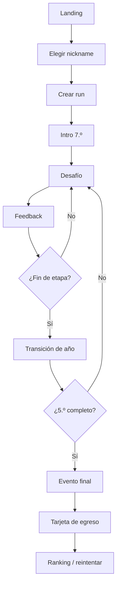

## UF-02 Resolución de desafío

1. Mostrar contexto y datos.
2. Jugador inspecciona herramientas si existen.
3. Jugador realiza interacción.
4. Validar forma del input localmente.
5. Confirmar.
6. Motor evalúa.
7. Mostrar consecuencia.
8. Actualizar stats/score provisional.
9. Registrar acción/checkpoint.
10. Continuar.

## UF-03 Refresh accidental

1. App carga.
2. Detecta checkpoint activo.
3. Verifica compatibilidad de versiones.
4. Ofrece “Continuar partida” o “Empezar de nuevo”.
5. Rehidrata estado y RNG.

## UF-04 Fin de run online

1. Cliente envía acciones al endpoint de finish.
2. Servidor valida run abierta.
3. Reproduce acciones.
4. Calcula score oficial/perfil.
5. Persiste resultado.
6. Devuelve tarjeta oficial y posición aproximada.
7. Cliente borra checkpoint activo.

## UF-05 Error al finalizar

1. Cliente conserva acciones localmente.
2. Marca run como `pending_sync`.
3. Muestra resultado local no oficial.
4. Reintenta con backoff mientras la sesión esté activa.
5. Al reconectar, servidor valida.
6. Actualiza ranking.

## UF-06 Ranking de feria

1. Usuario abre `/event/{slug}/leaderboard`.
2. Obtiene top N y estadísticas agregadas.
3. Polling periódico inicialmente.
4. Si se habilita Realtime, actualiza por broadcast.

## UF-07 Nickname rechazado

1. Usuario escribe nickname.
2. Validación local de formato.
3. Backend aplica política/moderación.
4. Si falla, devolver error neutral y permitir corregir.

## Flujo objetivo de feria oficial

**No implementado.** Es la forma que toma el flujo cuando existan evento, ranking y verificación en servidor.

```text
QR / URL
→ landing del evento
→ nickname / token de participante
→ pedir run oficial
→ el servidor emite el descriptor
→ juego local-first
→ egreso
→ resumen final
→ enviar action log
→ estado pendiente de verificación si hace falta
→ score verificado por el servidor
→ personal best y ranking
→ jugar de nuevo
```

Si no se pudo emitir una run autoritativa antes de empezar, la aplicación ofrece juego libre no oficial en vez de convertir en silencio una run no verificable en candidata a premio.

## Interrupción de red durante una run emitida

```text
se pierde la red
→ seguir jugando local si los datos de variante ya están disponibles
→ terminar
→ envío pendiente
→ reintento idempotente
→ verificado cuando vuelve la conectividad
```

Es el local-first de [ADR-006](03-architecture/adr/ADR-006-local-first-gameplay.md) con la autoridad de [ADR-004](03-architecture/adr/ADR-004-server-authoritative-scoring.md).

## Flujo de recuperación

```text
resultado académico insuficiente
→ consecuencia
→ flag o evento de recuperación
→ desafío o storylet de recuperación comprimido
→ etapa siguiente
```

Sin bucle que obligue a rejugar el mismo año. Ver [egreso, recuperación y fail-forward](01-game-design/graduation-and-fail-forward.md).

---

# FILE: 02-functional/user-stories.md

# Historias de usuario

## Epic E1 — Jugar una carrera

### US-001 Iniciar rápido
Como estudiante quiero comenzar sin registrarme para no perder tiempo antes de jugar.

**Aceptación**
- No requiere email ni password.
- El flujo principal llega al primer desafío en <3 pantallas.
- El nickname puede validarse antes de crear la run.

### US-002 Entender el contexto
Como jugador quiero entender qué intento resolver para poder decidir sin instrucciones externas.

**Aceptación**
- Cada desafío tiene objetivo explícito.
- Unidades visibles.
- CTA de confirmación inequívoco.

### US-003 Ver consecuencias
Como jugador quiero saber por qué mi elección funcionó o falló.

**Aceptación**
- El feedback incluye al menos una relación cuantitativa relevante.
- No se limita a “correcto/incorrecto”.

### US-004 Continuar tras error
Como jugador quiero seguir mi carrera aunque me equivoque.

**Aceptación**
- Un error matemático normal no finaliza run.
- La consecuencia afecta score/stats según reglas.

### US-005 Usar herramientas
Como jugador quiero usar calculadora cuando está habilitada para concentrarme en resolver el problema.

**Aceptación**
- Abrir/cerrar herramienta no borra respuesta.
- Uso no penalizado salvo regla visible del modo.

## Epic E2 — Progresión narrativa

### US-010 Avanzar por años
Como jugador quiero percibir que mi personaje crece desde 7.º hasta 5.º.

**Aceptación**
- Transición visual de etapa.
- Eventos son compatibles con la etapa.

### US-011 Consecuencias persistentes
Como jugador quiero que algunas decisiones anteriores reaparezcan para sentir que mi historia importa.

**Aceptación**
- Al menos un conjunto de storylets usa flags previos.
- Callback no contradice historia.

### US-012 Perfil final
Como jugador quiero recibir un título final que resuma mi estilo.

**Aceptación**
- Perfil derivado de datos de run.
- Mismo input produce mismo perfil.

## Epic E3 — Competencia

### US-020 Ranking
Como estudiante competitivo quiero comparar mi resultado con otros participantes.

**Aceptación**
- Sólo scores oficiales aparecen.
- Ranking identifica por nickname no PII.

### US-021 Rejugar
Como jugador quiero volver a jugar para mejorar o descubrir otro perfil.

**Aceptación**
- CTA visible en final.
- Nueva run tiene nuevo id.

### US-022 Condiciones justas
Como organizador quiero que el evento competitivo use reglas comparables.

**Aceptación**
- Evento fija ruleset/content version.
- Seed strategy documentada.

## Epic E4 — Resiliencia

### US-030 No perder partida
Como jugador quiero que un refresh accidental no destruya mi progreso.

**Aceptación**
- Checkpoint tras cada evento.
- Reanudación disponible si versión compatible.

### US-031 Jugar con red inestable
Como participante de feria quiero continuar aunque el Wi-Fi falle momentáneamente.

**Aceptación**
- Desafíos de la run activa no requieren request por turno.
- Resultado puede quedar pendiente de sync.

## Epic E5 — Operación

### US-040 Pantalla de feria
Como organizador quiero proyectar el ranking para generar participación.

**Aceptación**
- Vista legible a distancia.
- Auto-refresh.
- No muestra datos personales adicionales.

### US-041 Moderar
Como organizador quiero ocultar un nickname inapropiado rápidamente.

**Aceptación**
- Ocultar no requiere borrar evidencia de run.
- Cambio se refleja en leaderboard.

## Epic E6 — Desarrollo de contenido

### US-050 Agregar escenario sin nueva pantalla
Como autor quiero definir un nuevo problema usando un interaction type existente.

**Aceptación**
- Se registra como datos.
- Valida contra schema.
- Tests de invariantes pasan.

### US-051 Reproducir bug
Como desarrollador quiero reconstruir una run por seed para depurar problemas.

**Aceptación**
- Seed + versiones + actions son suficientes para replay.

## Historias de la dirección competitiva

**No implementadas.** Corresponden al modo feria con ranking; ver [score competitivo](01-game-design/competitive-scoring-and-ranking.md) y [modo feria](05-operations/fair-mode-and-competition-freeze.md).

### Jugador

- Como jugador, al volver a jugar recibo situaciones y valores distintos, en vez de poder memorizar una respuesta.
- Como jugador, puedo mejorar mi mejor marca sin que la cantidad de intentos sea el puntaje.
- Como jugador, veo sólo las dimensiones de carrera que ya adquirieron significado.
- Como jugador, entiendo por qué un resultado fue óptimo, eficiente, funcional o inválido.

### Docente

- Como docente, identifico el concepto matemático y el razonamiento buscado de cada plantilla.
- Como docente, inspecciono variantes representativas y de borde con su justificación.
- Como docente, entiendo y decido la filosofía de score antes de la feria.

### Organizador

- Como organizador, veo el ranking oficial y modero nicknames inapropiados sin borrar la evidencia auditada.
- Como organizador, identifico qué run y qué versiones produjeron un score.
- Como organizador, me recupero de fallas transitorias de envío sin otorgar entradas duplicadas.

### Autor de contenido y desarrollo

- Como autor, defino una plantilla una vez y genero muchas variantes válidas y deterministas.
- Como desarrollador, reproduzco un bug reportado a partir de id de run, seed y versiones.
- Como ingeniero, agrego contenido de 1.º sin inventar botones, cards, colores ni una arquitectura de scoring nueva.

---

# FILE: 03-architecture/adr/ADR-001-web-first-nextjs.md

# ADR-001 — Web-first con Next.js y TypeScript

- Estado: Aceptado
- Fecha: 2026-08-20

## Contexto
Egresado debe ejecutarse en teléfonos, tablets y desktop sin instalación y su interacción principal es UI declarativa: cards, formularios, drag/drop, gráficos y transiciones.

## Decisión
Usar Next.js + React + TypeScript como plataforma principal. Evitar motor de videojuegos dedicado para el núcleo.

## Consecuencias
### Positivas
- una sola codebase;
- acceso por URL/QR;
- buen soporte responsive/PWA;
- compartir tipos entre frontend/backend;
- despliegue simple.

### Negativas
- minijuegos canvas intensivos requerirán integración específica;
- disciplina necesaria para no acoplar engine con React.

## Alternativas rechazadas
- Unity WebGL: peso/UX excesivos para este tipo de juego.
- Godot Web: innecesario para UI dominante.
- Phaser como framework principal: canvas no aporta ventaja al loop base.

---

# FILE: 03-architecture/adr/ADR-002-modular-monolith-bff.md

# ADR-002 — Monolito modular + BFF

- Estado: Aceptado
- Fecha: 2026-08-20

## Contexto
El MVP necesita pocas operaciones server-side y un equipo pequeño. Separar frontend y FastAPI agregaría despliegues, contratos y duplicación temprana.

## Decisión
Usar Next.js Route Handlers como BFF y mantener frontend/backend en un repositorio y despliegue lógico.

## Consecuencias
- menor complejidad operativa;
- tipos y schemas compartidos;
- extracción futura posible por módulos;
- requiere mantener fronteras internas claras.

## Trigger para revisar
Carga computacional no apropiada, equipos separados, integración externa compleja o necesidad de lifecycle independiente.

---

# FILE: 03-architecture/adr/ADR-003-deterministic-seeded-engine.md

# ADR-003 — Motor determinista basado en seed

- Estado: Aceptado
- Fecha: 2026-08-20

## Contexto
Se necesitan runs reproducibles, generación procedural, ranking comparable y debugging.

## Decisión
Toda aleatoriedad del gameplay utiliza PRNG seeded controlado. Seed, versiones y acciones deben permitir replay.

## Consecuencias
- bugs reproducibles;
- fair/daily challenge;
- validación server-side;
- cambios de consumo de RNG pueden romper replay y deben versionarse.

---

# FILE: 03-architecture/adr/ADR-004-server-authoritative-scoring.md

# ADR-004 — Scoring oficial autoritativo en servidor

- Estado: Aceptado
- Fecha: 2026-08-20

## Contexto
El navegador puede ser manipulado. Aceptar `{score: 999999}` hace trivial falsificar rankings.

## Decisión
El cliente envía acciones; el servidor reproduce y calcula score/perfil oficial.

## Consecuencias
- integridad razonable del ranking;
- backend necesita versión compatible del engine;
- payload de finish es mayor;
- score local sólo es preview hasta validación.

---

# FILE: 03-architecture/adr/ADR-005-postgres-supabase.md

# ADR-005 — PostgreSQL gestionado por Supabase

- Estado: Aceptado
- Fecha: 2026-08-20

## Contexto
El producto necesita persistencia relacional para events, runs, acciones y ranking, con opción futura de realtime.

## Decisión
Usar PostgreSQL gestionado por Supabase. Mantener lógica crítica detrás del BFF y habilitar RLS en cualquier schema expuesto.

## Consecuencias
- SQL/Postgres estándar;
- realtime disponible si se requiere;
- dependencia operativa de proveedor gestionado;
- diseño mantiene portabilidad razonable por usar Postgres.

---

# FILE: 03-architecture/adr/ADR-006-local-first-gameplay.md

# ADR-006 — Gameplay local-first

- Estado: Aceptado
- Fecha: 2026-08-20

## Contexto
Una feria puede tener Wi-Fi saturado. Un request por desafío degradaría UX y disponibilidad.

## Decisión
Después de iniciar una run, los desafíos y transiciones se ejecutan localmente. Backend se usa principalmente al inicio, al finalizar y para ranking.

## Consecuencias
- baja latencia;
- tolerancia a cortes temporales;
- el cliente necesita checkpoint y queue de sync;
- contenido/reglas de la run deben estar disponibles localmente.

---

# FILE: 03-architecture/adr/ADR-007-content-as-data.md

# ADR-007 — Contenido como datos y patrones de interacción

- Estado: Aceptado
- Fecha: 2026-08-20

## Contexto
Decenas de escenarios no deben producir decenas de componentes ad hoc.

## Decisión
Modelar desafíos con schemas y reutilizar un conjunto limitado de interaction types. Un nuevo componente sólo se justifica cuando aparece una mecánica distinta.

## Consecuencias
- escala editorial;
- validación automatizada;
- separación contenido/UI;
- schemas deben ser cuidadosamente versionados.

---

# FILE: 03-architecture/adr/ADR-008-anonymous-identity.md

# ADR-008 — Identidad anónima/pseudónima en MVP

- Estado: Aceptado
- Fecha: 2026-08-20

## Contexto
El juego se dirige a menores y la feria requiere baja fricción. No existe necesidad funcional de cuentas personales.

## Decisión
Usar player UUID + nickname público moderado + sesión/cookie. No pedir email, password, apellido o fecha de nacimiento.

## Consecuencias
- minimización de datos;
- onboarding rápido;
- menor recuperación cross-device;
- si se agregan cuentas futuras se requiere ADR nuevo de identidad/privacidad.

---

# FILE: 03-architecture/adr/ADR-009-event-leaderboards.md

# ADR-009 — Leaderboards contextualizados por evento

- Estado: Aceptado
- Fecha: 2026-08-20

## Contexto
Comparar scores de rulesets, dificultad o contenido distintos puede ser injusto.

## Decisión
El ranking oficial se particiona por `game_event`/ruleset relevante. Una feria fija configuración comparable.

## Consecuencias
- ranking interpretable;
- permite temporadas/daily;
- requiere preservar versiones en runs;
- cambios de reglas crean nuevo contexto competitivo.

---

# FILE: 03-architecture/adr/ADR-010-reproducible-node-pnpm-container-toolchain.md

# ADR-010 — Toolchain reproducible y artefacto contenedorizado portable

- Estado: Aceptado
- Fecha: 2026-08-20

## Contexto

La aplicacion web vive en el mismo repositorio que la documentacion y necesita un entorno reproducible para desarrollo local, CI y builds de produccion. La eleccion de runtime, package manager, ubicacion de la aplicacion y estrategia de imagen afecta scripts, lockfile, cache, pipelines, onboarding y despliegue.

ADR-001 fija Next.js/TypeScript como plataforma y ADR-002 fija un monolito modular con BFF. La topologia de produccion aceptada sigue siendo Next.js desplegado en Vercel, con PostgreSQL gestionado por Supabase.

## Decision

- Usar Node.js 24 LTS como major de runtime. El repositorio fija una version 24.x soportada y segura mediante sus archivos de toolchain; una actualizacion compatible de patch no requiere modificar este ADR.
- Usar pnpm como unico package manager y declarar su version en `package.json`. `pnpm-lock.yaml` es la fuente reproducible de resolucion de dependencias.
- Mantener una unica aplicacion Next.js en la raiz del repositorio. No introducir workspaces, monorepo, Turborepo ni una aplicacion anidada sin una decision posterior.
- Usar instalaciones con lockfile congelado en CI y en builds contenedorizados.
- Producir una imagen multi-stage basada en la salida standalone de Next.js como artefacto portable y verificable.
- Usar Compose para el workflow local contenedorizado y la paridad de entorno. El desarrollo nativo con pnpm sigue siendo el camino rapido local.
- Mantener Vercel como topologia canonica de despliegue. La imagen Docker no selecciona por si sola un proveedor alternativo ni reemplaza Vercel; cambiar esa topologia requiere una decision arquitectonica posterior.

## Consecuencias

### Positivas

- instalaciones y builds repetibles entre maquinas, CI y contenedores;
- una superficie de comandos unica para humanos y agentes;
- menor complejidad que un workspace o monorepo prematuro;
- artefacto portable para pruebas de paridad y una eventual alternativa de hosting;
- separacion explicita entre empaquetado contenedorizado y proveedor de produccion.

### Negativas

- Node.js y pnpm deben mantenerse coordinados en metadata, CI, Docker y documentacion;
- el workflow contenedorizado agrega tiempo de build y mantenimiento adicional al camino nativo;
- la salida standalone debe verificarse despues de upgrades relevantes de Next.js;
- cambiar package manager, major de runtime o topologia canonica exige una migracion transversal.

## Alternativas descartadas

- Crear una aplicacion o workspace anidado: agrega rutas, tooling y limites de paquete sin necesidad para un unico producto.
- Mantener instalaciones no congeladas: permite drift entre desarrollo, CI e imagen.
- Tratar Docker como reemplazo implicito de Vercel: cambiaría la topologia aceptada sin evaluar operacion, observabilidad ni migracion.

---

# FILE: 03-architecture/adr/ADR-011-functional-core-transition-engine.md

# ADR-011 — Núcleo funcional con función de transición explícita

- Estado: Aceptado
- Fecha: 2026-08-21

## Contexto

ADR-003 exige un motor determinista y ADR-004 exige que el servidor reproduzca una run para calcular el score oficial. Faltaba decidir cómo se organiza la ejecución: un reducer explícito en TypeScript o una librería de máquinas de estado.

Se evaluaron dos opciones.

**A. Reducer explícito.** Uniones discriminadas, `switch` exhaustivos, funciones de transición puras y comandos/eventos explícitos.

**B. XState estable.** Máquina declarativa con actores, guards y servicios.

Criterios: replay determinista, serialización, peso de bundle, independencia de React, testabilidad, estabilidad de versión y capacidad de entender el comportamiento leyendo el repositorio.

## Decisión

Se adopta la opción A: `transition(state, command, dependencies) -> Result<TransitionResult, EngineRejection>` es el único lugar donde cambia el estado de una run.

- El núcleo es una función pura sin I/O, reloj ni RNG ambiente.
- Los comandos son una unión cerrada; `parseCommand` es la única frontera de confianza.
- Las transiciones emiten **eventos de dominio** (hechos) y **effect requests** (instrucciones para el shell imperativo). El motor describe efectos, nunca los ejecuta.
- Los rechazos esperados son valores `Result`; las excepciones quedan para violaciones de invariante.

XState se descarta por ahora: el modelo real tiene cuatro fases (`narrative`, `challenge`, `feedback`, `completed`) y no requiere actores ni comunicación entre máquinas. Una librería agregaría una representación intermedia que habría que serializar y versionar junto con el replay, sin resolver ningún problema que el reducer no resuelva. La decisión se reevalúa si aparecen procesos concurrentes de larga vida dentro de una run.

## Consecuencias

- El comportamiento se lee directamente en el repositorio, sin capa intermedia.
- Agregar un comando o un evento rompe la compilación en cada `switch` que lo ignore.
- No hay dependencia de runtime para orquestación; el núcleo corre igual en browser y en Node.
- La disciplina de pureza queda a cargo de fronteras de lint y de tests, no de una librería.

---

# FILE: 03-architecture/adr/ADR-012-seeded-prng-and-substreams.md

# ADR-012 — PRNG seeded, substreams y contrato de consumo

- Estado: Aceptado
- Fecha: 2026-08-21

## Contexto

ADR-003 fija que toda aleatoriedad usa un PRNG seeded, pero dejaba abierto el algoritmo y el contrato de consumo. Esta es la pregunta abierta 25, cuyo gate era exactamente “implementar RNG seeded y golden replays P0 mediante ADR”.

Un stream lineal único es frágil: agregar una tirada en cualquier punto desplaza todas las posteriores e invalida en silencio los replays guardados.

## Decisión

**Algoritmo.** `pure-rand` 8.4.2, generador `xoroshiro128plus`, fijado a versión exacta. Es MIT, sin dependencias transitivas, escrito en TypeScript y mantenido. Queda envuelto detrás de la interfaz propia `Rng`; el tipo de la librería no sale de `src/game/random/rng.ts`.

**Substreams.** La aleatoriedad no se consume de un stream global. Cada consumidor deriva su propio generador desde una dirección de namespace:

```text
seed
└── stage:year-2
    ├── event:4 storylet
    ├── event:4 challenge-pick
    └── event:4 challenge:dev.trip-budget difficulty:4
```

La derivación es `mix32(fnv1a(seed + path))`, aritmética entera pura, portable entre browser y servidor. No es criptografía y no protege ningún secreto: sólo tiene que ser estable y bien distribuida.

**Garantía de estabilidad.** Agregar un consumidor nuevo bajo una ruta nueva no altera ninguna ruta existente.

La dirección se arma con dos separadores: `U+0001` entre el seed y la ruta, y `U+0000` entre segmentos. Son caracteres de control precisamente porque ningún seed ni identificador puede contenerlos, y ese charset se **verifica** en las fronteras de confianza (`parseActionLog`, `restoreSnapshot`, `parseCommand`), no se asume. Los segmentos numéricos llevan prefijo `#`, de modo que `['a', 1]` nunca coincide con `['a1']`.

Se escriben como secuencias de escape. Codificarlos como bytes crudos —como estuvo hasta la auditoría del 2026-08-21— deja el contrato invisible en cualquier editor y permite que una normalización rutinaria lo borre, cambiando en silencio el contenido generado de todas las runs guardadas. `tests/unit/rng-addressing.test.ts` fija los vectores de la codificación y falla si el fuente vuelve a contener bytes de control.

**Estado.** El generador de `pure-rand` v8 es mutable, por eso se crea siempre local a partir de una dirección derivada y nunca entra en el estado persistido. El determinismo viene de la dirección del substream, no de arrastrar un cursor.

**Reintentos de generación.** Un challenge puede rechazar parámetros degenerados; el reintento usa `attempt` como segmento de ruta, así que también es determinista.

## Consecuencias

- Cambiar el algoritmo, la derivación o el orden de consumo cambia la semántica de replay y obliga a subir `ENGINE_VERSION`.
- Los golden replays en `tests/unit/engine-golden.test.ts` detectan cualquier cambio accidental.
- Se acepta la dependencia `pure-rand` dentro de `src/game`; la lista blanca de fronteras la declara explícitamente junto a `zod`.

---

# FILE: 03-architecture/adr/ADR-013-exact-rational-arithmetic.md

# ADR-013 — Aritmética racional exacta para evaluación matemática

- Estado: Aceptado
- Fecha: 2026-08-21

## Contexto

Egresado evalúa matemática escolar. El marco matemático prohíbe comparar floats de forma exacta y exige que cada desafío declare precisión interna, regla de redondeo de display, tolerancia de input y unidad esperada.

Un evaluador que calcule con `number` puede marcar incorrecta una respuesta correcta: `0.1 + 0.2 !== 0.3` en punto flotante binario, y los dominios documentados —dinero, porcentajes, proporciones, tasas, áreas— producen exactamente esas fracciones.

Se evaluaron `fraction.js` 5.3.4, `decimal.js` 10.6.0, `big.js` 7.0.1 y una implementación propia.

## Decisión

Se implementa un tipo `Rational` propio sobre `bigint`, en `src/game/math/rational.ts`.

Razones:

- **Exactitud suficiente y total.** Toda la matemática documentada es un cociente de enteros. Un racional exacto cubre dinero, porcentajes, proporciones, tasas y áreas sin error de representación; un decimal de precisión fija no cubre `1/3`.
- **Frontera serializable explícita.** `bigint` no es JSON. El límite debe existir de todos modos, y hacerlo propio permite definir la forma canónica `"n/d"` que el estado persistido usa.
- **Sin objeto de librería en el dominio.** Cualquiera de las librerías habría necesitado igualmente un envoltorio para no filtrar su clase al estado persistido ni al replay, que es la mayor parte del trabajo.
- **Primitiva crítica para replay.** El comportamiento numérico es parte del contrato de replay a varios años. Una implementación propia, congelada y cubierta por property tests elimina el riesgo de que una actualización de dependencia cambie un redondeo.

Política numérica asociada:

- **Dinero**: enteros en unidades menores (centavos). Ningún valor monetario usa decimales.
- **Tiempo**: enteros en minutos.
- **Porcentajes y proporciones**: racionales exactos.
- **Redondeo**: explícito por operación, con modos `half-up`, `half-even`, `ceil`, `floor` y `truncate`. El redondeo de display nunca decide una comparación autoritativa.
- **Compra por unidades**: `roundUpToMultiple` / `unitsRequired` modelan que no se compran 1,8 latas de pintura.
- **Tolerancia de respuesta**: declarada por desafío como `exact`, `absolute`, `relative-percent` o `range`. Nunca una comparación aproximada implícita.
- **`toNumber`**: sólo para presentación y métricas blandas; jamás para una comparación que decida calidad.

## Consecuencias

- Las leyes de campo, el redondeo y la tolerancia están cubiertos por property tests.
- No se agregan `fraction.js` ni `decimal.js`; si aparece un dominio irracional (por ejemplo trigonometría real), esta decisión debe reevaluarse.
- `Rational` es tipo interno de cálculo: el estado persistido guarda la cadena canónica, no el objeto.

---

# FILE: 03-architecture/adr/ADR-014-product-content-package.md

# ADR-014 — Contenido de producto como paquete propio importable desde el cliente

- Estado: Aceptado
- Fecha: 2026-08-22

## Contexto

Hasta el primer slice jugable, el único contenido que existía eran los fixtures de desarrollo (`src/game/testing/fixtures`), pensados para ejercitar el motor y no para que los juegue nadie. Al implementar 7.º grado apareció contenido real de producto: cinco desafíos y ocho storylets con texto, números y consecuencias que un estudiante ve.

Ese contenido no podía quedarse donde estaba. Vivir en `testing/fixtures` habría mezclado material de producto con andamiaje de pruebas, y vivir dentro de `src/game` habría convertido al motor —que es portable y agnóstico de contenido— en el dueño de un año escolar concreto.

Al mismo tiempo, el gameplay es local-first ([ADR-006](03-architecture/adr/ADR-006-local-first-gameplay.md)): la partida se resuelve en el dispositivo. El contenido tiene que llegar al browser, y la frontera de arquitectura no permitía que `components` importara nada fuera de `components`, `game` y `lib`.

## Decisión

El contenido de producto vive en `src/content/<etapa>/`, es una capa de arquitectura propia, y `components` puede importarla.

- `src/content/grade-7/` contiene los desafíos (`challenges/`), los storylets, y una función que arma las dependencias del motor para esa etapa.
- El contenido depende de `@/game`; el motor **nunca** depende de `@/content`. La flecha va en un solo sentido y `eslint-plugin-boundaries` la vigila.
- El contenido es datos sobre interacciones que el motor ya define ([ADR-007](03-architecture/adr/ADR-007-content-as-data.md)): declara variantes, condiciones y efectos como estructuras, no como callbacks. No decide UI, ni ruteo, ni persistencia.
- Cada content set declara su propia `contentVersion`, que entra en el descriptor de la run y en la validación de snapshots.
- Los fixtures de desarrollo se quedan en `src/game/testing`: siguen siendo andamiaje, no producto.

## Consecuencias

- La composición del cliente (`GameContainer`) importa `@/content/grade-7` y arma las dependencias del motor ahí. Es el único lugar donde se elige qué contenido se juega.
- El contenido viaja en el bundle. Es aceptable mientras sea un año; cuando sean seis, cada etapa deberá cargarse por separado, y la separación por carpeta ya deja ese corte hecho.
- Agregar 1.º año es agregar `src/content/grade-1/` sin tocar el motor ni la UI: la pantalla no sabe qué etapa está jugando.
- El excepción de frontera está documentada en `eslint.config.mjs` junto a la regla, para que no se lea como un permiso genérico.

---

# FILE: 03-architecture/adr/ADR-015-design-system-tokens.md

# ADR-015 — Sistema de diseño con tokens semánticos y paleta restringida

- Estado: Aceptado — reemplazado parcialmente por [ADR-017](03-architecture/adr/ADR-017-paper-visual-identity.md)
- Fecha: 2026-08-22

> **Qué sigue vigente y qué no.** La gobernanza de esta decisión sigue en pie: la cadena de tokens en una sola dirección, la paleta de Tailwind apagada y el contraste como gate obligatorio. Lo que ADR-017 reemplaza son los *valores* y las dependencias: la paleta pasó de OKLCH a hexadecimal, la escala tipográfica pasó a los roles de v0.2, el radio pasó a 0 en todo el sistema, y `geist` y `lucide-react` salieron.

## Contexto

Después del primer slice jugable, cada pantalla decidía sus propios colores, radios y tamaños de texto. Con una etapa implementada eso funcionaba; con seis años de secundaria por delante y desarrollo asistido por agentes, garantiza deriva: dos pantallas escritas con un mes de diferencia no se van a parecer, y nadie va a notar cuándo dejaron de parecerse.

El estado concreto era peor que desprolijo: el CSS global pintaba un lienzo crema con degradado terracota mientras los componentes usaban `slate-*` de Tailwind. Ninguno de los dos venía de una decisión de marca, y ninguno de los dos ganaba.

La dirección de marca del producto —verde, rojo, blanco y gris— tampoco estaba implementada en ningún lado.

Tailwind 4.3.3 permite definir tokens desde CSS con `@theme`, lo que abre una posibilidad que la configuración en JavaScript no daba: **apagar** la paleta por defecto.

## Decisión

Se implementa el Egresado Design System v0.1 con tres decisiones estructurales.

### 1. Cadena de tokens en una sola dirección

```text
paleta primitiva (OKLCH)  →  token semántico  →  componente
```

Los componentes de producto consumen `bg-primary` y `text-foreground-muted`, nunca `bg-green-600` ni `text-gray-600`. La paleta cruda es asunto de la capa de tema.

La paleta se define en OKLCH porque es perceptualmente uniforme: verde, rojo y gris comparten la misma rampa de luminosidad, y eso es lo que hace que se sientan de la misma familia. El gris lleva una traza mínima del tono verde, porque un gris neutro puro se percibe violáceo al lado del verde de marca.

Los tokens semánticos viven en `:root` como variables CSS y se exponen a Tailwind con `@theme inline`. Un segundo tema es un bloque de redefiniciones, no una reescritura de componentes.

### 2. La paleta por defecto de Tailwind queda apagada

```css
--color-*: initial;
--text-*: initial;
--radius-*: initial;
--shadow-*: initial;
```

`bg-blue-500`, `text-2xl` y `rounded-3xl` dejan de generar CSS. No es una preferencia estética: es lo que convierte al sistema de diseño en una regla en vez de una sugerencia. Un agente que escriba `bg-purple-400` produce un elemento sin fondo, y eso se ve.

Lo que el apagado no cubre —un hexadecimal escrito a mano, la paleta cruda usada en una pantalla— lo cubre `pnpm design:check`, un script corto con cuatro reglas. Deliberadamente no es un plugin de ESLint: el objetivo es atajar las formas conocidas de deriva, no auditar estética.

### 3. El contraste es un gate, no una guía

`pnpm design:check` convierte cada color OKLCH a sRGB y verifica las combinaciones que el producto pinta de verdad contra los mínimos de WCAG 2.2: 4,5:1 para texto y 3:1 para contorno de control y estado.

Existe porque «se ve oscuro» no es una medición. Durante la construcción bloqueó tres combinaciones que a ojo pasaban por buenas, entre ellas el verde de marca en 4,27:1 con texto blanco.

## Dependencias que entran

| Paquete | Problema que resuelve |
|---|---|
| `clsx` + `tailwind-merge` | una sola utilidad `cn()` que compone clases y resuelve conflictos |
| `class-variance-authority` | variantes tipadas donde realmente hay variantes |
| `lucide-react` | un único lenguaje de íconos, con importación por ícono |
| `geist` | tipografía variable servida localmente, sin CDN ni descarga en build |

Quedan fuera a propósito: Radix —ninguna interacción actual supera al HTML nativo—, Storybook —la vitrina en `/dev/design-system` alcanza y cuesta menos— y cualquier CSS-in-JS en runtime.

No hay `ThemeProvider`. Con un solo tema, las variables CSS alcanzan.

## Consecuencias

- Agregar una etapa nueva es componer primitivas y escribir contenido. Elegir un verde, un radio o un estilo de botón deja de ser parte del trabajo.
- Agregar un rol tipográfico o una escala propia obliga a declararla en `cn()`. `tailwind-merge` trae su propio mapa de grupos y ante un nombre desconocido puede clasificarlo mal: eso hizo que `text-heading` borrara `text-primary-foreground` y los botones primarios salieran con tinta oscura sobre verde, sin que fallara ningún test ni ningún tipo. Hay un test que cubre cada escala.
- Agregar una combinación de colores nueva a la interfaz obliga a agregarla a la lista del gate de contraste.
- Un color que el browser lee antes del CSS —el `theme_color` del manifiesto— necesita un literal. La única copia permitida vive en `src/lib/ui/brand.ts` y un test verifica que coincida con su token.
- El tema oscuro queda diferido, pero no bloqueado: ningún componente supone que blanco es fondo ni que el gris oscuro es texto.
- La regla de producto **elegir no es acertar** queda sostenida por el sistema: el estado seleccionado es neutro y nunca verde, y hay un test end-to-end que verifica que dos opciones de distinta calidad se vean idénticas antes de confirmar.

---

# FILE: 03-architecture/adr/ADR-016-career-player-model.md

# ADR-016 — Modelo de jugador de carrera: Promedio, Equipo, Aura y Estilo

- Estado: Aceptado
- Fecha: 2026-08-28

## Contexto

El motor definía cuatro estadísticas visibles en `src/game/progression/stats.ts`: `knowledge`, `team`, `initiative` y `energy`. Las cuatro eran enteros acotados de 0 a 100, todas arrancaban en un punto medio y cada resultado de desafío empujaba dos o tres a la vez.

Ese modelo tenía tres problemas que no se arreglaban con una pantalla mejor.

**Ninguna de las cuatro significaba algo escolar.** `knowledge` subía 4 puntos por comprar bien la pintura del mural. No es una nota, no es un promedio, no es nada que un estudiante de doce años reconozca de su propia vida: es un contador de XP con nombre de materia.

**Todas empezaban en 50.** Un jugador que todavía no había tomado ninguna decisión veía cuatro barras a la mitad. La interfaz afirmaba cuatro cosas sobre alguien de quien no sabía nada.

**Todas se movían siempre.** Un panel de resultado terminaba mostrando cuatro cambios por cada decisión, lo que convierte cualquier consecuencia en ruido: si todo cambia siempre, nada cambió.

El handoff de diseño v0.2 marcó explícitamente el reemplazo como **migración de datos, no re-skin**, y el modelo nuevo era la única parte del paquete que el motor tenía que aceptar antes de que se pudiera dibujar una sola pantalla.

## Decisión

Se reemplaza `PlayerStats` por `CareerState`, con cuatro dimensiones visibles y dos sistemas ocultos.

```ts
interface CareerState {
  grades: readonly number[]                       // oculto: las notas reales
  equipo: number | null                           // 0–100
  aura: number | null                             // con signo, sin techo
  estilo: { aplicado; estratega; improvisador }   // suman exactamente 100
  estiloEvidence: number                          // oculto
  mastery: Partial<Record<MathCategory, number>>  // oculto
}
```

### 1. `null` no es cero

Una dimensión que la run no tocó todavía **no tiene valor**, y la interfaz no dibuja nada en lugar de dibujar un cero. La tira de carrera arranca vacía y cada celda aparece la primera vez que su dimensión se mueve.

No es una sutileza de presentación: mostrar `Promedio 0` antes de la primera nota le dice a alguien de doce años que va mal en una materia que todavía no empezó. El tipo lo hace imposible de escribir por accidente.

### 2. Promedio se deriva de notas reales

El estado guarda la lista de notas y `promedio()` devuelve su media redondeada a un decimal. No es un acumulador que suba con cada acierto.

De ahí sale la regla de contenido más importante del modelo: **un evento mueve Promedio sólo si es genuinamente académico**. Decidir a qué hora tomar el colectivo ejercita porcentaje y tiempo, pero nadie pone una nota, así que no toca Promedio. El mural sí: la profesora lo toma como parte del trabajo del trimestre.

Guardar las notas y no el promedio es lo que hace que esa afirmación sea auditable, y lo que permite que en 3.º año haya varias notas por trimestre sin cambiar nada del motor.

### 3. Cada evento declara sólo lo que puede tocar

```ts
interface CareerEffects {
  grade?: number
  equipo?: number
  aura?: number
  estilo?: { axis; amount }
  mastery?: readonly MasteryGain[]   // lo agrega el motor, no el contenido
}
```

La ausencia de una clave significa que el evento no puede mover esa dimensión. El motor devuelve un `CareerChange` con una entrada por dimensión que efectivamente se movió, y la interfaz dibuja un chip por entrada presente.

`Promedio +0` no es un caso que la UI tenga que recordar evitar: **no es representable**.

### 4. Aura tiene signo y no tiene techo

Aura es capital narrativo —momentos memorables, no cálculos correctos—. Un cálculo correcto nunca produce Aura. Nunca es una barra ni un porcentaje, y el signo va siempre explícito.

### 5. Estilo es ternario y siempre suma 100

Ningún eje es el malo: un Improvisador tiene que poder egresar. La renormalización usa el resto mayor con desempate sobre el orden canónico de los ejes, así que los tres enteros suman exactamente 100 en cualquier motor y en cualquier dispositivo — que es requisito de determinismo, no prolijidad.

### 6. Dominio matemático lo calcula el motor

`mastery` se deriva de las categorías declaradas por el desafío y de la calidad alcanzada, no de lo que escriba cada autor de contenido. Así todas las familias contribuyen en la misma escala y nadie puede hacer que un tema pese cinco veces más por descuido. Es un sistema oculto: alimenta la dificultad adaptativa de v0.3 y **no se renderiza nunca**.

## Compatibilidad de runs

La migración cambia el estado de la run, la función de transición y el códec de snapshots. En los términos de `core/versioning.ts` eso es un cambio de motor:

- `ENGINE_VERSION` pasa a `2.0.0`;
- el ruleset y el contenido de desarrollo pasan a `0.2.0-dev`;
- el contenido de 7.º pasa a `0.2.0-grade-7`;
- `SNAPSHOT_SCHEMA_VERSION` pasa a `2`.

**No hay migración de snapshots de v1 a v2, y es deliberado.** Las dos formas no describen lo mismo: una run jugada bajo v1 no tiene notas ni Aura, y fabricarlas inventaría una carrera que ese jugador nunca tuvo. Un snapshot v1 se rechaza como versión no soportada, la aplicación descarta el checkpoint y ofrece una partida nueva. Reanudar hacia números que nadie se ganó es peor que empezar de cero.

## Qué **no** cambió

Vale la pena decirlo porque es la evidencia de que la migración no se llevó puesto el juego: las dos runs golden reproducen **el mismo recorrido, el mismo score, el mismo perfil y la misma cantidad de comandos** que antes. Lo único que cambió es el hash del estado final, porque el estado ahora lleva `career` en lugar de `stats`.

La matemática de los cinco desafíos autorados, su evaluación y su comportamiento determinista quedaron intactos.

## Consecuencias

- Las condiciones narrativas `stat-at-least` / `stat-at-most` pasan a `career-at-least` / `career-at-most` sobre una dimensión. Una dimensión en `null` **no satisface un umbral en ninguna dirección**: «sin evidencia» no es «poco».
- Las dos dimensiones ocultas del perfil que leían estadísticas visibles ahora leen la carrera: `collaboration` sale de Equipo normalizado —con el punto neutro cuando no hay evidencia, no con cero— e `initiative` sale de la parte de Estilo que no es por-el-libro. La política de perfiles sigue siendo de desarrollo y no oficial.
- El contenido declara efectos más chicos y más específicos. La mayoría de los resultados de 7.º mueven una o dos dimensiones, no cuatro.
- El panel de resultado gana una consecuencia narrativa y un sello autorados por resultado. Sin eso el panel dice qué pasó con los números pero no qué pasó en la historia, que es su trabajo.
- La aparición progresiva de la tira de carrera deja de ser una decisión de la interfaz: es un hecho del dominio que la UI lee.

---

# FILE: 03-architecture/adr/ADR-017-paper-visual-identity.md

# ADR-017 — Identidad papel: la hoja cuadriculada como canvas del juego

- Estado: Aceptado
- Fecha: 2026-08-28
- Reemplaza parcialmente: [ADR-015](03-architecture/adr/ADR-015-design-system-tokens.md)

## Contexto

El sistema de diseño v0.1 (ADR-015) resolvió el problema de gobernanza: una cadena de tokens en una sola dirección, la paleta de Tailwind apagada y el contraste como gate. Esa parte sigue en pie y esta decisión no la toca.

Lo que no resolvió fue la **identidad**. Una auditoría de similitud sobre v0.1 encontró que cuatro decisiones, juntas, producían la huella visual de un juego de carrera deportiva —el género de las referencias del proyecto, no el de Egresado—:

1. canvas oscuro en todas las pantallas;
2. tipografía display condensada en mayúsculas;
3. barra de progreso segmentada arriba;
4. CTA verde abajo.

La conclusión no fue «se parece un poco»: fue que una captura de Egresado y una captura de la referencia se leían como el mismo producto con otro tema. Para un juego cuyo cliente final es un colegio y que se presenta en una feria escolar, eso es un problema de producto, no de gusto.

El handoff de diseño v0.2 explora tres territorios visuales —*Boletín*, *Hoja cuadriculada*, *Legajo*— y cierra en un híbrido. La reconstrucción completa de esa historia vive en [decision-history](09-design-system/decision-history.md).

## Decisión

Se adopta la identidad papel de v0.2. Tres decisiones estructurales, más una que es de gobernanza.

### 1. La hoja cuadriculada es el fondo de toda pantalla

Celda de 16 px, dibujada con dos degradados lineales en la utilidad `.eg-canvas`. El fondo liso queda **reservado** para bloques insertados: caja de dato, ledger, sello, Aura, superficie de decisión.

La cuadrícula no es decoración: es el sistema de alineación con el que los datos se leen como objetos apoyados sobre una hoja en lugar de como párrafos. Y resuelve tres cosas de una: máxima distancia de las referencias con un solo cambio, credibilidad escolar, y la matemática se ve.

### 2. El oscuro sobrevive en dos lugares y en ninguno más

- **La superficie de decisión** (`#1C1E1B`), el bloque donde se elige.
- **El bloque de Aura** (`#0A0C0A`), la única isla negra del sistema.

Ese cambio de superficie **es** la transición de estado: la decisión pasa en oscuro y el resultado vuelve al papel, antes de que el color entre a jugar. Se conserva la mejor propiedad del canvas negro —el foco— acotada a los dos momentos que la necesitan.

### 3. Radio 0, sin sombras, y la marca de corrección como device

La profundidad la da el peso del borde y el contraste de fondo, igual que un impreso. `--radius-*` y `--shadow-*` quedan apagados y el guardarraíl rechaza cualquier `rounded-*` o `shadow-*` en código de producto; la única excepción es el resplandor de Aura, que no es sombra sino luz.

El device de la identidad es el **tilde verde y el subrayado rojo del docente**: la marca cae *sobre* el dato o la opción, nunca en un marco alrededor. Eso es exactamente lo que la separa de un frame deportivo, y por qué el subrayado de una restricción abraza la cifra en vez de cruzar la celda.

Cuatro colores con cuatro trabajos: verde escolar para estado, rojo corrección para tensión y restricción, lima para el CTA —y sólo para botones—, verde Aura sólo dentro del bloque negro. **Verde ≠ correcto y rojo ≠ incorrecto**: la calidad del resultado la llevan glifo, palabra y borde superior; el color sólo refuerza.

### 4. La paleta pasa de OKLCH a hexadecimal

ADR-015 definió la paleta en OKLCH porque era una rampa generada de tres familias que tenían que sentirse hermanas. La paleta v0.2 no es una rampa: es un set corto de pigmentos elegidos y medidos uno por uno, calibrados desde el entorno del colegio —camisa blanca, gris de franela, verde botella, rojo escocés— y validados de a uno contra WCAG.

Escribirlos en un espacio perceptual agregaría dígitos que nadie eligió. El gate de contraste se reescribió para leer hexadecimal; sigue midiendo sRGB y sigue siendo obligatorio.

**El logo, el escudo y el uniforme del colegio no aparecen en ninguna parte de Egresado.** El entorno sembró familias de tono; los colores muestreados no se usan literalmente en ningún lado.

## Dependencias

Entran las dos familias del handoff, servidas desde el repositorio con `next/font/local`:

| Fuente | Rol | Licencia |
|---|---|---|
| Schibsted Grotesk | títulos y datos | SIL OFL 1.1 |
| Libre Franklin | prosa | SIL OFL 1.1 |

El handoff sugiere `next/font/google`. Se eligió versionar los `.woff2` en `src/app/fonts/` porque da lo que la descarga en build no puede: bytes fijados en el repositorio, un build que no depende de que Google responda, y cero pedidos a un CDN en runtime. El resultado visual es idéntico y las dos licencias permiten la redistribución explícitamente; el texto de cada una viaja al lado del archivo.

Salen `geist` —la familia que reemplazan— y `lucide-react`. El pack de pictogramas está diferido a propósito: el prototipo no necesitó ninguno, y dibujar iconos antes de que una pantalla los pida es cómo se podrean las librerías. Los signos que sí hacían falta (más, menos, tilde, tachado) son cuatro formas de CSS y SVG inline con `currentColor`, dibujadas con terminación cuadrada para acompañar la geometría de radio 0.

## Consecuencias

- La escala tipográfica pasa de roles genéricos a diecinueve roles del sistema, cada uno con tamaño, interlínea, tracking y peso. Cada uno tiene que estar declarado en `cn()`, y hay un test que lo cubre.
- El guardarraíl de tokens gana dos reglas: radio y sombra. Las dos son binarias, no graduales.
- Un `<legend>` se renderiza sobre el borde de su `<fieldset>`, fuera del relleno, así que sobre un bloque oscuro a sangre la consigna quedaba flotando medio afuera. El bloque de decisión nombra su grupo con `aria-labelledby`; el nombre accesible es el mismo.
- El único token del handoff que la implementación reabrió es el contorno de control sobre pizarra: `#4A4E48` medía 1,98:1 y WCAG 2.2 SC 1.4.11 pide 3:1 para identificar un componente y su estado. Se movió lo mínimo para pasar. Todo el resto de la paleta entró tal cual.
- La vitrina de `/dev/design-system` se reescribió sobre el sistema nuevo y sigue siendo la referencia viva: mirarla antes de inventar una primitiva es más barato que descubrir la duplicación en revisión.
- El pack raster sigue **briefeado y no generado**, y ninguna pantalla del slice lo monta. `SceneMedia` existe para que la primera imagen que se produzca entre por un solo lugar. La apuesta UI-first se sostiene: todas las pantallas corren con cero imágenes.

---

# FILE: 03-architecture/adr/ADR-018-blueprint-v0-2-decision-authority.md

# ADR-018 — Autoridad y madurez de las decisiones del Project Blueprint v0.2

- Estado: Aceptado
- Fecha: 2026-08-28

## Contexto

El 28 de agosto de 2026 entró al repositorio el paquete **EGRESADO Project Blueprint & Technical Handoff v0.2.0**: 79 archivos que consolidan producto, game design, pedagogía, motor objetivo, calidad, operación de feria y entrega, posteriores al rediseño visual de 7.º y a las discusiones sobre competencia con premios.

El paquete no es un documento más. Trae tres cosas que la documentación existente no tenía y que, integradas mal, harían daño:

**Trae decisiones con distinto grado de madurez.** El propio paquete distingue seis niveles —`LOCKED`, `PRODUCT DIRECTION`, `RECOMMENDED`, `TEACHER GATE`, `OPEN`, `DEFERRED`— y varias de sus propuestas más concretas (la ponderación 80/15/5 del score competitivo, la política de intentos ilimitados, la calibración de calidades) son candidatas que requieren aprobación del Departamento de Matemática. Aplanarlas a «requisitos» convertiría un borrador defendible en un contrato que nadie firmó.

**Describe un ciclo de entrega real distinto del roadmap escrito.** El roadmap del repositorio valida por capas con testers; el ciclo real valida con docentes y **es probable que no haya playtest con estudiantes antes de la feria**. Documentos que asumen playtest previo describen un proceso que no va a ocurrir.

**Describe como pendiente trabajo que ya está hecho.** El capítulo de migración de estado de carrera pide reemplazar `knowledge/team/initiative/energy` por Promedio · Equipo · Aura · Estilo. Esa migración ya ocurrió: es [ADR-016](03-architecture/adr/ADR-016-career-player-model.md) y `ENGINE_VERSION` `2.0.0`. Integrar el paquete tal cual haría que un agente futuro replanifique trabajo terminado.

Al mismo tiempo hay una restricción que no se puede pisar: el sistema de diseño **Claude Design v0.2** se está implementando ahora mismo y es la autoridad visual. El paquete resume decisiones visuales; ese resumen no es permiso para redecidirlas.

## Decisión

### 1. El paquete se congela como fuente, y la documentación canónica lo absorbe

El paquete queda verbatim en [`docs/sources/egresado-project-blueprint-v0.2.0/`](sources/README.md), con su `MANIFEST.json` intacto y verificable. No se edita.

El contenido vigente se integró en la taxonomía existente (`00-product` a `09-design-system`), en castellano rioplatense y con la terminología del proyecto. **La documentación canónica es la de `docs/`; el paquete es procedencia.** El mapa de qué documento absorbió qué, y por qué, está en [la integración del blueprint](07-reference/blueprint-v0.2-integration.md).

Dentro del paquete, `EGRESADO-MASTER-BLUEPRINT.md` es una vista consolidada generada de los modulares, igual que `EGRESADO-MASTER-SPEC.md` en este repositorio. Ninguno de los dos es fuente mantenible fuera de su propio paquete.

### 2. La madurez de una decisión se conserva y se escribe

Toda decisión integrada declara su nivel, y el nivel es parte de la decisión:

| Nivel | Qué significa para quien implementa |
|---|---|
| **LOCKED** | fundación aceptada; se implementa salvo que una autoridad más nueva la supere |
| **PRODUCT DIRECTION** | dirección fuerte; la arquitectura debe poder sostenerla aunque hoy no exista |
| **RECOMMENDED** | propuesta senior; se implementa **configurable**, nunca como constante inmutable |
| **TEACHER GATE** | requiere validación del Departamento de Matemática antes del congelamiento |
| **OPEN** | deliberadamente sin resolver; no se cierra dentro del código |
| **DEFERRED** | fuera de alcance a propósito; no es deuda técnica ni backlog urgente |

Regla operativa: **una constante marcada `RECOMMENDED` o `TEACHER GATE` no se escribe como número mágico.** Se escribe como política versionada con su versión declarada, igual que ya hace `src/game/scoring/` con `production: false`.

El registro único de decisiones es [`07-reference/decision-register.md`](07-reference/decision-register.md), que ahora contiene tanto los ADR como las decisiones del blueprint con su nivel. Las que siguen abiertas viven en [`07-reference/open-questions.md`](07-reference/open-questions.md). No se crea un segundo registro.

### 3. Jerarquía de fuentes de verdad

Ante contradicción, y por dominio:

| Dominio | Autoridad |
|---|---|
| Comportamiento de juego, matemática, transiciones | documentos de `docs/` + motor + tests |
| Identidad visual, tokens, presentación de Game UI | [Claude Design v0.2 y el sistema de diseño implementado](09-design-system/README.md) |
| Decisiones de producto de este refinamiento y su madurez | [registro de decisiones](07-reference/decision-register.md) |
| Estado real actual | el código |
| Configuración oficial de la competencia | configuración de evento versionada, después de la aprobación docente |

Con cuatro reglas de conflicto:

1. una captura de pantalla no cambia una regla matemática;
2. un estilo heredado del frontend no supera el handoff de diseño aprobado;
3. documentación vieja no supera una decisión de producto más nueva sin dejar el conflicto escrito;
4. una regla `TEACHER GATE` u `OPEN` se implementa detrás de política versionada, nunca como supuesto irreversible.

### 4. Presente y objetivo se escriben separados

Un documento no describe en presente una capacidad que no existe. La arquitectura futura vive en [arquitectura objetivo del motor](03-architecture/target-engine-architecture.md), con el estado real de cada capacidad; [game engine](03-architecture/game-engine.md) sigue describiendo lo implementado.

### 5. El blueprint no reabre el sistema de diseño

El paquete aporta contexto durable de producto —economía artística UI-first, arte selectivo, seleccionar no es acertar, ningún estado sólo por color, por qué Egresado se alejó de la gramática visual de Copero y El Ídolo— y **nada más**. Valores de token, tipografía, paleta, geometría, componentes y arte los define el sistema de diseño implementado. Los documentos de producto enlazan; no repiten valores.

## Consecuencias

- Existe un único registro de decisiones y una única lista de preguntas abiertas; el nivel de madurez es una columna, no un documento aparte.
- Los documentos de producto que asumían playtest previo a la feria quedan corregidos hacia el ciclo real, con la limitación declarada en vez de disimulada. Ver [ciclo de entrega real](00-product/real-delivery-lifecycle.md).
- Aparecen documentos nuevos de dirección competitiva —score, ranking, variantes, dificultad, fail-forward— todos marcados como recomendación o dirección, ninguno como regla cerrada.
- Un agente de implementación futuro puede distinguir, sin leer código, qué es actual, qué es objetivo, qué está bloqueado por una decisión docente y qué no debe decidir solo.
- El paquete original queda auditable: si mañana alguien discute qué decía la fuente, hay hash.
- **Esta integración no cambió comportamiento de producto.** Ninguna capacidad nueva se implementó al integrarla; la secuencia de trabajo está en [la secuencia de implementación](06-delivery/implementation-sequence.md).

---

# FILE: 03-architecture/adr/ADR-019-scenario-family-template-variant.md

# ADR-019 — Modelo de contenido: familia de escenario, plantilla y variante

- Estado: Aceptado
- Fecha: 2026-08-28

## Contexto

Hasta ahora un desafío era una `ChallengeDefinition` plana: un id, una interacción, unas categorías, las etapas donde puede aparecer y una función `generate` que adentro elegía al azar de un array privado de parámetros.

Ese modelo alcanzó para el slice de 7.º y no alcanza para el resto. Tiene tres problemas que no se arreglan agregando contenido.

**Una definición confunde el lugar con la pregunta.** «El colectivo» es una situación reconocible que puede albergar varias estructuras de razonamiento —la demora porcentual, la última salida segura, comparar dos recorridos—, pero el modelo sólo podía representar una. Para tener la segunda había que escribir otro desafío entero, con su narrativa, su presentación y su evaluador duplicados.

**La variante no tenía identidad.** `rng.pick(VARIANTS)` elige un elemento de un array por índice. No se puede nombrar, no se puede pedir, no se puede guardar en un plan, no se puede aprobar en un catálogo y no se puede reproducir salvo repitiendo el sorteo completo. Un catálogo prevalidado de competencia necesita decir «la variante `bus/g7.bus-timing/demora-25`», y eso no era expresable.

**No existía la diferencia entre lo que hay y lo que se juega.** El registro de desafíos era a la vez el catálogo disponible y, vía los pools de storylets, lo que la run terminaba jugando. Con seis desafíos en un año eso no molesta. Con seis años y un catálogo grande, confundir las dos cosas significa que agrandar el catálogo alarga la partida, que es exactamente lo contrario de lo que el producto necesita.

## Decisión

### 1. Tres niveles con significados distintos

```text
ScenarioFamily     ¿dónde pasa esto?        contexto reconocible y estable
  └─ ChallengeTemplate   ¿qué hay que razonar?    una estructura cognitiva
       └─ ChallengeVariant  ¿qué caso concreto es?   una parametrización reproducible
```

Una **familia** es temática, no matemática, y no está atada a un año. Una **plantilla** es una estructura de razonamiento: dos plantillas de la misma familia son preguntas distintas, no la misma pregunta con otros números. Una **variante** es una dirección, no un objeto generado.

Una `ChallengeDefinition` **es** una plantilla. No se renombró el tipo ni el `ChallengeId`: direccionan exactamente la misma cosa, y renombrar setenta referencias habría agregado riesgo sin agregar significado. Lo que sí cambió es que el campo del `ChallengeInstanceRef` se llama `templateId`, que es como el modelo lo nombra.

### 2. La variante es una dirección, no un objeto serializado

```ts
interface ChallengeVariantRef {
  familyId: ScenarioFamilyId
  templateId: ChallengeId
  variantId: VariantId
}
```

Tres identificadores semánticos estables y nada más: ni índice de array, ni posición en el catálogo, ni orden de inserción. El modelo detrás de la dirección lo recalcula la plantilla, igual que antes. Eso mantiene el estado de la run chico, los snapshots JSON-puros y el replay exacto.

La dirección tiene forma plana `familia/plantilla/variante`, con round-trip total y parseo que rechaza en vez de adivinar.

### 3. Cada variante tiene su propio substream determinista

`variantRngPath(ref)` direcciona por identidad semántica y **sólo** por identidad semántica: no entra ni la etapa, ni el índice de evento, ni cuántas familias tenga el catálogo. Una variante saca los mismos números la juegue el año que la juegue, que es la propiedad de la que va a depender un catálogo pregenerado.

Se reutiliza la derivación de substreams de [ADR-012](03-architecture/adr/ADR-012-seeded-prng-and-substreams.md). No hay un segundo generador.

### 4. El catálogo disponible no es el plan de la run

`ContentCatalog` responde *qué existe y dónde puede aparecer*. `RunPlan` responde *qué se eligió para esta partida*. Son tipos distintos y el segundo referencia al primero por identidad.

Agregar contenido al catálogo **no** lo agrega a un plan existente, y reordenar el catálogo **no** cambia lo que un plan resuelve. Las dos cosas están probadas.

Esto tampoco es el futuro *catálogo desplegado de variantes competitivas*, que contendrá variantes generadas, validadas y aprobadas. Éste contiene definiciones autoradas.

### 5. La elegibilidad por etapa es declarativa

Una plantilla declara `stages`. Es **permiso, no selección**: una plantilla elegible para 7.º no aparece en toda run de 7.º. La elegibilidad admite una etapa, varias o un conjunto no contiguo —`dev.trip-budget` es elegible en 2.º, 3.º y 5.º, sin 4.º—, y dos plantillas de la misma familia pueden diferir.

Una variante no puede ampliar la elegibilidad de su plantilla: no tiene dónde declararla, porque es una dirección.

El motor no conoce ningún id de contenido. No hay `if (challengeId === 'mural')` en ninguna parte del núcleo, y el lint de fronteras impide que `src/game` importe `src/content`.

### 6. Roles de colocación

`anchor`, `checkpoint`, `special`, `recovery`.

Son semántica de **colocación**: dicen cómo se puede agendar un contenido y nada sobre qué tan bien le fue al jugador ni qué le hace a la carrera. Un `checkpoint` no vale más que un `anchor`.

### 7. Un año aporta uno o dos beats ordinarios

`DEFAULT_STAGE_BEAT_BUDGET = { min: 1, max: 2 }`.

Uno es el piso porque un año por el que se pasa sin decidir nada no es un año. Dos es el techo porque una run completa cruza seis —`7.º → 1.º → 2.º → 3.º → 4.º → 5.º`— y el producto depende de que esa run se pueda volver a jugar. La riqueza viene de *cuáles* dos salen de un catálogo grande, no de jugar más.

**El checkpoint gasta uno de esos dos.** Modelarlo como una evaluación obligatoria *además* del presupuesto es exactamente cómo una run de seis años se convierte en una de veinte minutos. `special` también gasta: un evento social sigue siendo un beat que el jugador juega.

**La recuperación queda afuera del presupuesto**, porque es condicional. Sólo la lógica de progresión —que no existe todavía— puede agendarla.

Además, un plan de etapa válido tiene **exactamente un `anchor`**. Un año sin beat primario no tiene centro, y uno con dos tampoco: el segundo es en realidad un checkpoint o un special.

### 8. Definir un plan válido no es construirlo

STAGE-02 define qué hace válido a un plan; el compositor de runs, que elige por presupuesto de dificultad, variedad y coherencia narrativa, es trabajo posterior. `validateStagePlan` y `validateRunPlan` existen; ningún selector automático existe.

### 9. Los seis desafíos actuales son sondas de arquitectura

Colectivo, mural, cuaderno, proyecto grupal, stand y el acto del 25 de Mayo se inspeccionaron los seis para comprobar que el modelo representa sus dominios matemáticos, evaluadores, interacciones y efectos de carrera sin casos especiales en el motor. Ninguno se movió de año, ninguno se sacó y ninguna matemática se reescribió.

**Su ubicación actual en 7.º es consecuencia del primer slice vertical, no una decisión de producto.**

## Alternativas consideradas

**Dejar el registro plano y agregar desafíos.** Es lo más barato hoy y lo más caro después: cada estructura cognitiva nueva duplica narrativa, presentación y evaluador, y la variante sigue sin poder nombrarse. Es la situación que motivó esta etapa.

**Un desafío fijo por escenario, variando sólo números.** Es lo que hay hoy dentro de cada `generate`. Alcanza para que cambien los valores y no para que cambie la pregunta: el jugador aprende «la segunda opción» y la segunda partida deja de aportar.

**Codificar el año en la identidad del contenido.** Es lo que insinúa el prefijo `g7.`. Habría hecho imposible que una familia abarque varios años, que es justamente lo que un catálogo para seis años necesita.

**Implementar ya el generador procedural completo.** Habría mezclado dos problemas: qué *es* una variante y cómo se producen poblaciones grandes de variantes válidas. Sin lo primero, lo segundo no tiene dónde apoyarse; con lo primero resuelto, lo segundo es contenido y herramientas, no motor.

**Renombrar `ChallengeId` a `ChallengeTemplateId`.** Setenta referencias en veintiséis archivos para expresar la misma identidad. Se documentó la equivalencia en el glosario y en los tipos.

## Consecuencias

- `ENGINE_VERSION` pasa a `3.0.0` y `SNAPSHOT_SCHEMA_VERSION` a `3`: la dirección de una instancia lleva ahora familia, plantilla y variante. Un snapshot v2 se rechaza explícitamente y la aplicación ofrece partida nueva, igual que en [ADR-016](03-architecture/adr/ADR-016-career-player-model.md).
- Las versiones de contenido suben —`0.3.0-dev`, `0.4.0-grade-7`— y **las de ruleset no**. Las políticas de score, dificultad y perfil no se tocaron, y el fingerprint de ruleset quedó idéntico, que es la evidencia de que no se movieron.
- El orden de la lista `variants` de una plantilla es parte del contrato de contenido: la selección saca un índice de ahí. Reordenarla cambia qué caso produce un seed guardado.
- Las runs golden reproducen **el mismo recorrido, el mismo score, el mismo perfil y la misma cantidad de comandos**. Lo único que cambió es el hash del estado final. Las plantillas de desarrollo declaran una sola variante cada una y por eso no gastan ningún sorteo eligiéndola: su generación es idéntica.
- La validación de contenido recorre ahora **todas** las variantes declaradas en vez de esperar que los seeds las visiten, y falla si dos variantes de una plantilla renderizan igual.
- Agregar una familia, una plantilla o una variante ordinarias no requiere tocar el motor. Hay un test que registra contenido sintético que el motor nunca vio y lo materializa.

## No objetivos

Generación por restricción reutilizable, validación estadística de poblaciones, catálogo desplegado y `variantCatalogVersion` son de la etapa siguiente. Bandas de dificultad, presupuesto y compositor de runs, de la posterior. Score competitivo, egreso, recuperaciones y ranking, más adelante todavía. Ver [el roadmap](06-delivery/implementation-sequence.md).

## Decisión que queda abierta

**El inventario final de escenarios sigue sin decidir.** Cuántas familias, cuántas plantillas por familia, cuántas variantes, qué año usa cada cosa y cuáles de los seis actuales se mantienen, se mueven, se rehacen o se reemplazan: nada de eso se cierra acá. Ver [preguntas abiertas](07-reference/open-questions.md).

---

# FILE: 03-architecture/adr/ADR-020-variant-generation-and-approved-catalog.md

# ADR-020 — Pipeline de variantes y catálogo aprobado

- Estado: Aceptado
- Fecha: 2026-08-28

## Contexto

[ADR-019](03-architecture/adr/ADR-019-scenario-family-template-variant.md) dio a una variante identidad, dirección y substream propios. Lo que no dio fue **población**: cada plantilla sigue trayendo dos o tres casos escritos a mano.

Para una feria eso no alcanza, por dos razones distintas.

**La primera es el jugador.** Tres grillas fijas de ocho números en el acto del 25 de Mayo son el contenido más memorizable del juego: la segunda vez que alguien lo juega ya sabe qué celdas marcar. La variación existe para que la segunda partida siga siendo una partida.

**La segunda es el premio.** Si las variantes se generaran en vivo, el jugador que recibiera una ambigua, imposible o trivial ya habría perdido cuando alguien lo notara. Un número al azar en runtime produce decimales impresentables, óptimos empatados, opciones duplicadas y dificultad desbalanceada, y en una competencia eso no se puede deshacer.

La consigna es entonces una sola:

> **Variabilidad no es aleatoriedad libre.**

## Decisión

### 1. Un pipeline, y generar no es aprobar

```text
fuente            registros autorados, o un espacio de candidatos direccionado
  ↓ resolver      parámetros, desde la dirección y nada más
  ↓ materializar  la instancia que el jugador vería
  ↓ validar       genéricas primero, después la matemática de la plantilla
  ↓ canonizar     la vista semántica que la plantilla declara de sus parámetros
  ↓ huella        SHA-256 de esa vista
  ↓ deduplicar    dos direcciones, un problema → una entrada
  ↓ aprobar       a un catálogo versionado
```

Un candidato que un generador produjo es una **propuesta**. Sólo entra al catálogo el que sobrevivió a todo, y el rechazado va al reporte —nunca al artefacto con una marca de «no usar»—.

### 2. Fuentes híbridas: autorada y generada

Una plantilla declara de dónde salen sus variantes, y las dos formas pasan por el mismo pipeline.

| Plantilla | Fuente | Por qué |
|---|---|---|
| `g7.bus-timing` | generada | duración, demora, entrada y salidas son cuatro números sin copy adentro |
| `g7.mural-paint` | generada | ancho, alto y rendimiento cambian la decisión por completo |
| `g7.notebook-offer` | generada | precio, porcentaje y descuento fijo son puro parámetro |
| `g7.stand-supplies` | generada | porciones y presupuesto; el catálogo del kiosco queda fijo porque es copy |
| `g7.may-25-act` | generada | la coreografía es la escena y no se toca; los **números** son lo que se memoriza |
| `g7.group-tasks` | **autorada** | los parámetros *son* el contenido: Lucas, Sofía, Mateo y Vos tienen nombre |

**Autorada no quiere decir confiable.** Una variante escrita a mano pasa por las mismas validaciones, la misma huella y la misma deduplicación, y su oráculo —una búsqueda exhaustiva sobre todos los repartos posibles— es tan independiente como el de cualquier generador.

No se proceduraliza por deporte. Una plantilla cuyo espacio útil es chico y cuyo valor está en la escritura se queda autorada, y eso se documenta.

### 3. Generación por restricción, nunca sorteo y esperanza

Un generador construye parámetros que **ya** cumplen la intención de la plantilla. No sortea campos y después mira qué salió.

El mural es el caso más claro y va al revés de punta a punta: se elige el envase que se quiere que sea la respuesta, de ahí sale el intervalo de litros que lo hace el mínimo suficiente, de ahí el intervalo de área, y recién entonces se buscan ancho y alto legibles cuyo producto caiga adentro. El colectivo elige primero los márgenes de llegada —uno óptimo, uno o dos tarde, todos distintos— y deriva los horarios restando.

La evidencia de que funciona es el número que el pipeline reporta: **50.013 candidatos, cero rechazos**.

### 4. Números que un chico puede calcular

Las restricciones de generación incluyen la legibilidad, no sólo la validez: demoras que dan minutos enteros sobre la duración elegida, precios en centenas de pesos para que cualquier porcentaje dé pesos redondos, paredes con un decimal como mucho, números de grilla entre 1 y 30. Una variante matemáticamente correcta con un `17,48375` adentro es una variante rechazada.

### 5. Oráculos independientes

Un validador que reusa el razonamiento del generador confirma con gusto el error del generador. Donde se puede costear, la validación recalcula por otro camino:

- el colectivo recalcula viaje y márgenes desde los parámetros crudos;
- el mural clasifica los envases con aritmética entera en centésimas, sin pasar por los racionales del desafío;
- el stand resuelve el costo mínimo por **enumeración exhaustiva** de las 13 × 9 × 6 combinaciones, mientras el desafío lo resuelve por programación dinámica;
- el acto reimplementa paridad, divisibilidad y primalidad —esta última por división por tentativa—;
- el trabajo grupal busca el mejor reparto factible recorriendo las permutaciones.

Esto ya encontró errores reales durante esta etapa: un error de unidades en el oráculo del mural y un descuento fijo que podía superar el precio del cuaderno.

### 6. Una variante es la misma para todos

El substream de una variante se deriva de un **seed de contenido fijo** más su dirección semántica, y no del seed de la run. `bus/g7.bus-timing/c00042` es el mismo problema en toda partida, que es lo que hace que un catálogo prevalidado signifique algo y lo que hace que una competencia sea comparable.

El seed de la run sigue decidiendo **qué** variantes ve una partida. No decide qué contienen.

Una validación genérica lo exige: cada candidato se materializa dos veces, en dos runs distintas y en dos posiciones distintas, y si las dos vistas difieren se rechaza con `address-not-deterministic`.

### 7. Huella semántica, distinta de la identidad

```text
fingerprint = sha256(canonical({ familyId, templateId, content }))
```

Deliberadamente **excluidos**: el id de la variante, la versión del generador, la versión del catálogo y cualquier cosa con reloj adentro. Dos direcciones que producen el mismo problema tienen que colisionar —así se detecta un duplicado— y una variante autorada que resulta igual a una generada es genuinamente el mismo problema.

`ChallengeVariantRef` sigue siendo la identidad referencial; la huella es identidad de contenido. Son dos preguntas distintas y se responden por separado.

El SHA-256 está implementado en TypeScript portable dentro del motor, porque el núcleo corre en el navegador y su lista de dependencias tiene dos entradas. Es el algoritmo estándar, no uno inventado, y está verificado contra los vectores publicados de FIPS 180-4 y contra `node:crypto`. Los ocho hex del digest FNV que versiona rulesets no alcanzaban: a diez mil entradas un hash de 32 bits colisiona alrededor de una vez cada cien.

### 8. El catálogo aprobado no es el catálogo de contenido

| | Responde |
|---|---|
| `ContentCatalog` ([ADR-019](03-architecture/adr/ADR-019-scenario-family-template-variant.md)) | qué familias y plantillas existen |
| `ApprovedVariantCatalog` (este ADR) | qué variantes concretas pasaron validación y pueden desplegarse bajo una versión |

Una entrada guarda **dirección y huella**, nunca parámetros: los parámetros son función pura de la dirección, y guardarlos duplicaría un dato derivable creando una segunda cosa que se puede desactualizar. La huella convierte eso en una afirmación verificable: se recalcula desde el código y se compara.

### 9. El catálogo se versiona y el build es reproducible

`grade-7-dev-1`. Nunca `latest`, y explícitamente **no** el catálogo de la feria: congelar el catálogo oficial de una competencia es una decisión de evento que todavía no se tomó.

El artefacto se ordena por dirección, no registra nada volátil —ni fecha, ni ruta, ni máquina— y se escribe con el formato exacto que Prettier produce, así que vive en el repositorio sin pelearse con el formateador. Dos builds del mismo código dan el mismo archivo byte a byte, y hay tests que lo prueban, incluido uno que registra el contenido en orden inverso y obtiene el mismo catálogo.

`pnpm game:variants check` recompila el catálogo en memoria, lo compara con el comprometido y revalida cada entrada. Está dentro de `pnpm verify`. La barrida estadística grande es otro comando, `pnpm game:variants audit`, porque tarda distinto y se corre en otro momento.

### 10. La auditoría tiene que encontrar problemas

Un reporte que siempre dice OK es decoración. La auditoría mide, por plantilla: candidatos, rechazos por código, duplicados, problemas distintos, y —donde la interacción tiene opciones— dónde cae la respuesta correcta y cuántas respuestas distintas existen.

Los umbrales están documentados con su razón. Bloquean los casos en los que desplegar sería indefendible —una plantilla que no aprueba nada, un generador que rechaza nueve de cada diez, una respuesta siempre igual— y avisan sin bloquear cuando la señal es sobre el tamaño del espacio y no sobre la corrección del contenido.

### 11. El juego actual no cambia

Las variantes curadas siguen siendo las que la partida de 7.º juega. El catálogo aprobado existe, se prueba resoluble y jugable, y **todavía no alimenta la selección de una run**: enriquecer el contenido es de la etapa siguiente y componer una run es de la posterior.

La evidencia: las runs golden reproducen el mismo recorrido, el mismo score, el mismo perfil y la misma cantidad de comandos, y la simulación de 5.000 runs da la misma distribución de calidades y perfiles que antes.

## Alternativas consideradas

**Generar en runtime.** Es lo más simple de escribir y lo peor de defender: la primera variante ambigua la descubre un jugador durante la competencia. Es exactamente lo que STACK documenta como el riesgo de la aleatorización sin despliegue previo.

**Proceduralizar las seis plantillas.** Habría exigido generar nombres de personas para el trabajo grupal, que es escribir contenido con un generador en lugar de escribirlo.

**Guardar los parámetros en el catálogo.** Duplicar un dato derivable y crear una segunda fuente que se desactualiza. La huella da la misma garantía y además detecta la desactualización.

**Reusar el digest FNV de 32 bits.** Alcanza para un tripwire de versión sobre una cadena corta; no para deduplicar decenas de miles de variantes.

**Un hash no criptográfico de 128 bits.** Habría servido, pero SHA-256 es el primitivo que cualquiera reconoce y puede verificar contra vectores publicados.

## Consecuencias

- `ENGINE_VERSION` pasa a `4.0.0` y `SNAPSHOT_SCHEMA_VERSION` a `4`: el descriptor de una run puede declarar de qué catálogo salió. El campo es **opcional** —una run que juega variantes curadas no salió de ningún catálogo y lo dice omitiéndolo—, pero la forma serializada se movió y un snapshot `3.x` se rechaza en vez de adivinarse.
- Las versiones de contenido suben a `0.4.0-dev` y `0.5.0-grade-7`: qué genera cada dirección es identidad de contenido. **El ruleset no sube** y su huella quedó idéntica en `d3319440`, que es la evidencia de que ninguna política se tocó.
- El substream de variante dejó de depender del seed de la run. Ninguna plantilla de producción lo usaba todavía, así que el juego no se movió; las plantillas de desarrollo sí dependen de la run, y por eso el pipeline las rechaza —lo cual es el contraejemplo con el que se prueba la validación.
- Agregar una plantilla nueva con su generador, sus validadores y su metadata no toca el pipeline. Hay un test que registra una familia entera que el pipeline nunca vio.
- El catálogo comprometido queda como artefacto verificable en el repositorio, y `pnpm verify` falla si alguien cambia un generador sin reconstruirlo.

## No objetivos

Bandas de dificultad, `difficultyCost`, presupuesto por año y compositor de runs son de la etapa siguiente. Score competitivo, egreso, contenido de 1.º a 5.º, ranking y modo feria, más adelante. **El inventario final de escenarios sigue abierto**, y el tamaño del catálogo es configuración, no política de contenido: aprobar ciento treinta y tres variantes no dice que el juego necesite ciento treinta y tres.

---

# FILE: 03-architecture/adr/ADR-021-approved-catalog-in-play-and-teacher-demo.md

# ADR-021 — El catálogo aprobado dentro del juego, y el demo docente

- Estado: Aceptado
- Fecha: 2026-08-28

## Contexto

[ADR-020](03-architecture/adr/ADR-020-variant-generation-and-approved-catalog.md) dejó un catálogo de 133 variantes verificadas que **nadie jugaba**. La partida de 7.º seguía sacando su contenido de las dos o tres variantes curadas que cada plantilla declara, y el catálogo era un artefacto que `pnpm verify` comprobaba y el juego ignoraba.

Un pipeline que no alimenta una partida no es una capacidad: es una promesa. Y la promesa que faltaba probar era doble.

**La primera es la variación numérica.** Que la segunda partida traiga otros números. Eso el catálogo ya lo tenía y sólo faltaba conectarlo.

**La segunda es más difícil y es la que justifica el modelo.** [ADR-019](03-architecture/adr/ADR-019-scenario-family-template-variant.md) agrupa plantillas en familias porque una situación puede alojar varias preguntas. Hasta ahora eso se había demostrado con contenido de desarrollo, en una familia de fixtures. Si en contenido de producción cada familia sigue teniendo exactamente una plantilla, la familia es una carpeta con un nombre bonito.

Y hay una tercera cosa, ajena a las dos anteriores: alguien va a poner esto en una pantalla delante de un aula. Lo que un docente necesita ver no es lo que un estudiante juega.

## Decisión

### 1. La partida elige dentro de lo aprobado

`EngineDependencies` acepta un `ApprovedVariantLookup`: dado un `templateId`, qué variantes fueron aprobadas.

```text
pool = aprobadas(plantilla)  si hay alguna
     = plantilla.variants    si no
```

El fallback no es cortesía: un content set sin catálogo —los fixtures de desarrollo, una plantilla nueva antes de su primer build— tiene que seguir jugando. Lo que cambia cuando el catálogo existe es el tamaño del universo, no el mecanismo.

El puerto es deliberadamente angosto. `src/game/challenges` no puede importar `src/game/content` —lo prohíbe la regla de capas y hay un test de arquitectura que lo verifica—, así que la selección no conoce catálogos, entradas ni huellas: conoce una lista de ids. El adaptador que convierte un `ApprovedVariantCatalog` en esa lista vive del lado del catálogo. Ensanchar la capa para que el selector viera el artefacto entero habría sido la alternativa fácil y habría acoplado la elección a la forma del archivo.

### 2. El seed elige cuál, nunca qué

La elección usa el substream `stage/N/event/M/variant-pick/<plantilla>`, derivado del seed de la run. El contenido detrás de la dirección elegida sigue derivándose de `VARIANT_SPACE_SEED` como fijó [ADR-020](03-architecture/adr/ADR-020-variant-generation-and-approved-catalog.md).

Las dos mitades juntas son la propiedad que importa: dos jugadores con el mismo seed ven la misma variante, y esa variante es el mismo problema para los dos. Sin la primera mitad no hay reproducibilidad; sin la segunda, un catálogo prevalidado no significa nada.

### 3. Una run declara de qué catálogo salió, y el motor lo comprueba

`createRun` rechaza un descriptor cuyo `variantCatalogVersion` no coincida con el catálogo que se le está dando. Reproducir una run de `grade-7-dev-1` contra `grade-7-dev-2` produciría otro contenido y el mismo score: exactamente el fallo silencioso que un motor determinista no puede permitirse.

Poner ese guard encontró un defecto real: **el codec del action log descartaba `variantCatalogVersion`**. Una run se serializaba, se parseaba y volvía sin catálogo, y desde el guard eso dejó de reproducir. El campo estaba en el descriptor desde ADR-020 y en el snapshot; en el log no. Nadie lo había notado porque hasta ahora nada dependía de él.

### 4. Las versiones publicadas del catálogo son inmutables

`grade-7-dev-1` no se regeneró. Se agregó `grade-7-dev-2` como archivo nuevo, y los dos viven en el content set indexados por versión. Una run que declaró `dev-1` puede resolverse contra el conjunto que realmente jugó.

> **Aclaración, 2026-09-18 (D-S08-126).** El principio se enunció acá sobre 7.º, y leído
> en general parecería universal. No lo es hoy, y la
> [re-auditoría independiente](04-quality/independent-mathematics-reaudit.md#mat-ra-009-observation-alcance-del-replay-de-los-catálogos-de-1º-a-5º)
> lo detectó: 7.º conserva `dev-1` a `dev-6`, mientras 1.º a 5.º **renombran** el
> artefacto a la versión siguiente (D-S08-088, D-S08-109), así que una run que declarara
> `grade-5-dev-2` no resuelve. Es deliberado mientras ese contenido está en `draft` con
> `official: false`, y el sistema **falla cerrado**: la compatibilidad de versiones es
> igualdad exacta en motor, ruleset y contenido, así que nunca resuelve contra el
> conjunto equivocado. La garantía de retención de este punto rige, por ahora, para los
> catálogos que una run **oficial** puede declarar. Antes de que exista una edición
> oficial, el requisito **R-S09-CAT** de STAGE-09 exige escribir la política de retención
> de replay por año y garantizar que todo descriptor declarable siga siendo resoluble.

El artefacto es una frontera y se parsea con zod al cargar el content set, no se castea: un catálogo corrupto tiene que fallar al arrancar y no más tarde, como una dirección que no resuelve en la mitad de una partida.

Agregar una plantilla no mueve ningún problema existente, y hay un test que lo comprueba entrada por entrada. **Cambiar un generador sí**, y esta versión cambió uno: las direcciones generadas del acto valen otra coreografía en `dev-2` que en `dev-1` (ver §6). Todas las demás conservan su huella. Publicar al lado en vez de regenerar es lo que permite afirmar las dos cosas.

### 5. La familia colectivo pasa a tener dos plantillas

`g7.bus-latest-departure` es la primera plantilla de producción que comparte familia con otra, y comparte también la situación: el 60 viene con demora.

| | `g7.bus-timing` | `g7.bus-latest-departure` |
|---|---|---|
| Pregunta | ¿a qué salida me subo? | ¿con cuánto tiempo salgo? |
| Trabajo | evaluar cuatro candidatas y descartar | recorrer la relación al revés |
| Respuesta | está entre las opciones | la produce el jugador |
| Interacción | timeline | numeric-input |
| Error | elegir mal | quedarse corto o pasarse |

Que la interacción sea distinta no es decoración: es la evidencia de que el razonamiento es distinto. Una pregunta cuya respuesta está en pantalla y una cuya respuesta hay que construir no son la misma pregunta con otros números, que es precisamente el estándar que [el scope de esta etapa](06-delivery/implementation-sequence.md) fija para llamar «plantilla nueva» a algo.

La restricción es **asimétrica** y ahí está la enseñanza: pasarse cuesta esperar en la puerta, quedarse corto cuesta entrar tarde. El evaluador lo dice con cuatro bandas, no con un acierto y un error.

**Su espacio semántico está medido: 360 problemas distintos**, y es el producto exacto de sus restricciones —30 pares duración/demora que dan minutos enteros, 4 horas de entrada, 3 márgenes—. La auditoría de 10.000 candidatos aprueba los 360 y descarta el resto por duplicado, con **cero rechazos**. El aviso de tasa de duplicados que emite es aritmética, no un defecto: agotado el espacio, todo candidato nuevo repite. Que 360 alcancen es una afirmación sobre un catálogo de desarrollo, no sobre el juego terminado.

### 6. Poner el catálogo a jugar encontró un defecto de contenido

El acto del 25 de Mayo promete que **marcar la grilla entera no sirve**: cobertura perfecta, precisión de la mitad, y el F1 lo castiga. La documentación incluso afirmaba el número: `F1 = 0,67`, Insuficiente.

Eso era cierto de las tres coreografías escritas a mano. No lo era de todas las que el generador podía producir. Con hasta cinco objetivos por ronda, una variante de quince objetivos deja `F1 = 30/39 = 0,77`, y marcar las veinticuatro celdas pasaba a leerse «Salió».

El defecto existía desde STAGE-03 y nadie podía verlo, porque la partida no jugaba variantes generadas. Apareció el día en que empezó a jugarlas, y lo encontró un E2E que fallaba una vez cada tres.

La propiedad dejó de ser una coincidencia de la autoría y pasó a ser una restricción:

- el generador construye los objetivos **desde el techo del acto** —tres por ronda de piso, y el excedente hasta doce repartido de a uno—, no sorteando cada ronda y mirando después;
- un validador independiente recalcula el F1 de marcar todo con aritmética entera y rechaza la variante si alcanza para zafar;
- un test de contenido lo comprueba sobre las veintisiete coreografías aprobadas, no sobre las tres curadas.

La versión del generador subió a `2`, que es lo que dice en voz alta que la misma dirección produce otra coreografía. Ésa es también la razón por la que `grade-7-dev-2` **no** es un superconjunto de `dev-1`: comparten las direcciones de las plantillas que no se movieron, y difieren en las del acto. Que las dos versiones convivan es lo que permite afirmar ambas cosas y verificarlas.

### 7. El slot elige entre plantillas; eso no es el Run Composer

El storylet del colectivo declara `challengePool: [busTiming, busLatestDeparture]` y el motor sortea dentro del pool, que es el mecanismo que los storylets ya tenían. No hay presupuesto de dificultad, ni equiparación, ni construcción de planes: eso es STAGE-05 y sigue sin empezar.

### 8. El demo docente es otro artefacto, no una run larga

`DemoPlan` es un tipo aparte, con validación aparte, y muestra las siete plantillas del año.

La tentación era obvia: un `RunPlan` con el presupuesto de beats aflojado. Se rechazó porque **una regla que cualquier llamador puede ensanchar con un argumento dejó de ser una regla**. El techo de uno a dos beats ordinarios por año es lo que mantiene jugable una carrera de seis años; si el demo se obtuviera relajándolo, el techo sería una sugerencia.

La separación se enforza desde el lado del demo, y en la dirección contraria a la esperable: un `DemoPlan` está **obligado** a llevar más beats ordinarios que los que un `StageContentPlan` admite. No puede convertirse en una run por accidente, y hay un test que corre el demo por `validateStagePlan` y comprueba que lo rechaza —por presupuesto y por cantidad de anchors, dos razones independientes—.

Un beat de demo además declara `showcases`: qué demuestra, en la frase que diría quien lo está mostrando. En una run, por qué está un beat es asunto del compositor y el jugador nunca lo pregunta; en una demostración es lo único que se pregunta.

La cobertura que el validador exige incluye una condición que no es de cantidad: **alguna familia tiene que aportar dos plantillas**. Un demo de siete situaciones distintas probaría amplitud; lo que hay que mostrar es que una misma situación aloja dos preguntas.

## Alternativas consideradas

**Dejar que la partida siguiera jugando variantes curadas.** Es lo que había. Convierte a STAGE-03 en tooling que se valida a sí mismo.

**Un `RunPlan` con presupuesto configurable para el demo.** Descrito arriba: vuelve negociable la única regla que mantiene corta una run.

**Que el selector de variantes leyera el `ApprovedVariantCatalog` completo.** Habría requerido ensanchar la frontera entre `challenges` y `content` —o debilitar la regla de capas— para que la elección conociera huellas y versiones que no necesita.

**Regenerar `grade-7-dev-1` con la plantilla nueva.** Un archivo menos, y la reproducción de cualquier run anterior reescrita en silencio.

**Una segunda plantilla en otra familia.** El mural o el cuaderno también admiten una segunda pregunta. El colectivo se eligió porque es el primer beat del año: el contraste se ve en los primeros treinta segundos de la segunda partida, que es exactamente cuando hay que verlo.

**Meter más margen y más horarios en el generador para agrandar los 360.** Habría cambiado huellas por una ganancia que ningún consumidor pide todavía. El número está medido y escrito; agrandarlo es trabajo de contenido cuando el inventario se decida.

## Consecuencias

- `ENGINE_VERSION` pasa a `4.1.0` y `ACTION_LOG_VERSION` a `2`. La forma serializada del log cambió —lleva `variantCatalogVersion`— y la semántica de selección también. La huella del motor se movió a `2477ca1f`; **el ruleset quedó idéntico en `d3319440`**, que es la evidencia de que ninguna política de juego se tocó.
- El contenido de 7.º sube a `0.6.0-grade-7` por la plantilla nueva. El contenido de desarrollo no se movió y su huella lo confirma.
- Las runs golden cambian de hash y **no de resultado**: mismo recorrido, mismo score, mismo perfil, misma cantidad de comandos. Lo único que se movió adentro del estado es la versión que el descriptor declara.
- El catálogo vigente es `grade-7-dev-2`: 159 variantes, 161 candidatos, 0 rechazos, 2 duplicados. Sigue siendo de desarrollo. **El catálogo de la feria no se congeló** y congelarlo sigue siendo una decisión de evento.
- El generador del acto pasa a `2` y sus direcciones cambian de contenido entre `dev-1` y `dev-2`. La barrida profunda vuelve a dar **36.064 candidatos y 0 rechazos** con el techo nuevo, así que la restricción no le sacó población.
- 7.º tiene siete plantillas y seis beats por partida. Cuál de las dos del colectivo sale lo decide el seed.
- El inventario de escenarios sigue `OPEN`. Que la familia colectivo tenga dos plantillas no dice cuántas tendrá ninguna otra.

## No objetivos

Run Composer, bandas de dificultad y presupuesto equiparado siguen siendo STAGE-05; score competitivo, ranking y modo feria, más adelante. El demo docente **no** está aprobado por ningún docente: es un candidato, y el Teacher Gate 1 es un gate externo que no pasó nadie todavía.

---

# FILE: 03-architecture/adr/ADR-022-difficulty-model-and-run-composer.md

# ADR-022 — Modelo de dificultad y compositor de runs

- Estado: Aceptado
- Fecha: 2026-08-29

## Evolución de carrera completa — 2026-09-10

La enumeración por etapa de este ADR sigue siendo la baseline implementada.
ADR-025 extiende composición y validación a restricciones globales de carrera;
no declara que el algoritmo actual ya garantice nueve beats ni cuotas completas.
[Decisión técnica futura](03-architecture/adr/ADR-025-full-career-contract-evolution.md);
[reconciliación de producto](07-reference/full-career-product-audit-integration.md).
No se modifican runtime ni versiones en esta integración.

**Phase 1 (2026-09-11):** con `policy.career`, `composeRun` usa la búsqueda
global acotada de ADR-025; sin él, este algoritmo por etapa queda idéntico y los
planes de 7.º no cambian. Engine `7.0.0`.

## Contexto

[ADR-021](03-architecture/adr/ADR-021-approved-catalog-in-play-and-teacher-demo.md) puso el catálogo aprobado adentro del juego. Lo que quedó sin resolver es **quién elige**.

Hoy elige el storylet dentro de su pool y el seed dentro de lo aprobado. Nadie mira dificultad, variedad, cobertura ni presupuesto. En una competencia eso significa que parte del resultado lo decide el sorteo, y ése es exactamente el problema que [la auditoría de equidad](04-quality/competition-fairness-audit.md) señala.

Hay además una deuda concreta y vieja. [ADR-019](03-architecture/adr/ADR-019-scenario-family-template-variant.md) fijó que un año aporta **uno o dos beats ordinarios**, porque una carrera cruza seis años y el producto depende de que se pueda volver a jugar. El año de 7.º juega seis. Eso no era una violación —el contrato existía antes que el contenido, y STAGE-04 lo declaró densidad de demostración— pero seguía sin haber una partida normal en ninguna parte.

La pregunta de esta etapa es una sola:

> Tenemos un catálogo rico y confiable. ¿Cómo se elige lo poco que juega una run, de modo que siga siendo corta, determinista, variada, válida y comparable?

## Decisión

### 1. La dificultad se declara como estructura, no como número

Una plantilla declara seis rasgos de su estructura —pasos encadenados, restricciones simultáneas, selección de información, optimización, incertidumbre, y si la respuesta hay que **construirla** o alcanza con reconocerla—. De ahí sale la banda `core / standard / stretch` por una función pura.

Eso convierte en ejecutable lo que [el documento de dificultad](01-game-design/difficulty-and-playability.md) ya decía: la dificultad sube por relaciones, restricciones, planificación y optimización, y **no** por números grandes, decimales feos, fórmulas avanzadas ni presión de tiempo. Un autor que quiere que su plantilla se agende como `stretch` tiene que nombrar el rasgo que la vuelve así.

El caso que mejor lo muestra es la familia colectivo. Sus dos plantillas comparten situación, matemática y hasta los cuatro primeros rasgos; se separan en uno solo:

| | `g7.bus-timing` | `g7.bus-latest-departure` |
|---|---|---|
| construcción | 0 — la respuesta está entre cuatro salidas | 1 — el número lo produce el jugador |

Seis rasgos y no treinta: uno que nadie puede clasificar dos veces igual es peor que ninguno.

### 2. Costo de scheduling ≠ multiplicador de score

El compositor necesita una señal **fuerte** entre `core` y `stretch` para poder equilibrar; el score necesita una **débil** para que la suerte del sorteo no le gane a la habilidad. Son dos números distintos y viven en lugares distintos. Este ADR define el primero. El segundo es STAGE-06 y sigue siendo documentación.

Los costos van en **centésimas enteras** —100, 150, 210— y no en decimales. Un presupuesto que suma flotantes y después compara contra un límite termina discutiendo consigo mismo si un plan entraba; el motor ya rechaza el punto flotante donde el resultado importa ([ADR-013](03-architecture/adr/ADR-013-exact-rational-arithmetic.md)) y un presupuesto es uno de esos lugares.

### 3. La calibración es un dato versionado, no una constante

Bandas, costos, objetivos, presupuestos y tolerancias viven en dos objetos —`DifficultyCostPolicy` y `CompositionPolicy`— con `id`, `version` y `official: false`. Recalibrar es cambiar datos; ningún algoritmo de composición se toca. Es lo que un Teacher Gate necesita poder hacer.

Ninguno de los números es oficial. Son los candidatos que el documento de diseño ya proponía, y siguen siendo `RECOMENDADA` con la calibración final en el Gate ([pregunta 44](07-reference/open-questions.md)).

### 4. El compositor enumera; no sortea hasta acertar

Un año juega un anchor y como mucho un secundario, así que el espacio factible es

```text
anchors × (nada | secundarios)
```

y cabe entero en memoria. El compositor lo construye completo, filtra por las restricciones duras y recién entonces ordena.

Un `while (!válido) volver a sortear` habría sido más corto de escribir y esconde su propia distribución: sesga hacia lo que el RNG alcanza primero y no tiene peor caso acotado. La enumeración tiene una respuesta inspeccionable a «¿por qué este plan?»: le ganó a los otros, en este orden, por estos objetivos.

### 5. Duras son filtros; blandas son un orden lexicográfico

**Duras** —nunca se negocian, nunca se convierten en penalización—: elegibilidad de etapa, variante aprobada, exactamente un anchor, el presupuesto de uno a dos beats, rol secundario permitido, ninguna plantilla dos veces en un año, ninguna plantilla repetida en la carrera, y el sobre de dificultad.

**Blandas** —declaradas en la política, aplicadas en orden—: cercanía al objetivo de dificultad, variedad de familia, variedad de interacción, cobertura de dominios, frescura de plantilla. Lexicográfico y no suma ponderada: una suma esconde por qué ganó un plan y deja que una preferencia menor le gane a la que importaba.

Los empates que sobreviven a todos los objetivos los rompe un sorteo con el seed sobre una lista ordenada canónicamente. Ahí es donde la variedad entre partidas es real: 5.000 seeds de 7.º producen **1.374 planes distintos con carga idéntica**.

### 6. No repetir una plantilla es una restricción dura

Empezó como preferencia y la carrera de desarrollo mostró por qué no alcanza: el storylet que aloja una plantilla suele ser de una sola vez, así que agendarla de nuevo deja al segundo beat **sin dónde ocurrir**, y la run se acortaba en silencio. Es dura, y configurable por si algún día una plantilla debe reaparecer a propósito.

Las **familias** sí pueden repetirse entre años: transferir el mismo razonamiento a otro contexto es un objetivo de diseño, y esto es sobre plantillas.

### 7. El plan se decide una vez y se ejecuta

`createRun` compone. El motor ejecuta. Un beat ordinario ya no se sortea en `beginEvent`: viene del plan.

La capa narrativa no perdió nada — decide **dónde** ocurre un beat, y el plan decide **cuál** es. Un storylet con desafíos sólo es elegible si puede alojar el beat que toca; uno puramente narrativo entra sólo si al año le sobra un evento. Sin esa segunda regla, un content set conversador podía dejar a un año sin sus decisiones.

La duración de una etapa compuesta sale del plan, no de `eventCount`. Ahí está la reconciliación de la deuda: la demo de 7.º sigue declarando ocho eventos y **una partida normal juega tres**.

### 8. Recomponer en runtime está prohibido, y se comprueba

Reanudar juega el mismo plan; reproducir, el mismo; el servidor verifica el mismo. El snapshot guarda el plan **concreto** en vez de la forma de recalcularlo, porque una reanudación tiene que jugar el año que el jugador empezó y no el que la calibración de hoy compondría.

El descriptor lleva una **huella del plan**. `createRun` compone y compara: si la calibración se movió desde que la run se creó, la run se rechaza en lugar de jugar otro año con la misma identidad.

### 9. El validador es otro programa

El compositor construye planes válidos; el validador decide si un plan lo es. Igual que en [ADR-020](03-architecture/adr/ADR-020-variant-generation-and-approved-catalog.md) con generador y validador, y por el mismo motivo: un chequeo que re-ejecuta al constructor y compara sólo puede confirmar la opinión del constructor, y rechazaría un plan distinto pero perfectamente legal. Hay un test que le da exactamente ese plan y comprueba que lo acepta.

Tampoco le cree al plan sus propias afirmaciones. Un beat declara rol, banda y costo; los tres se recalculan desde el catálogo y la política y se comparan. Un plan que dice que una plantilla `stretch` vale un beat `core` parsea perfecto y es el que una competencia tiene que poder rechazar.

### 10. El compositor no conoce ningún id de contenido

Ni familias, ni plantillas, ni materias, ni años. Lee metadata. Lo que 7.º tiene de particular —que su cadena narrativa corta sólo alcanza el colectivo y el acto— vive en la **política** como dato, no en el algoritmo.

La prueba de que eso alcanza es una carrera de desarrollo de cinco etapas que se compone con el mismo código, con objetivos que suben de 250 a 310, sin que nada sepa qué es un año escolar. Agregar 1.º a 5.º de verdad será una entrada de política y contenido.

## Alternativas consideradas

**Dejar que el storylet siguiera eligiendo.** Es lo que había. Hace imposible cualquier afirmación sobre carga comparable y deja el ranking parcialmente al sorteo.

**Un `RunPlan` con presupuesto configurable para poder seguir jugando seis beats en 7.º.** Vuelve negociable la única regla que mantiene corta una carrera. Ya se había rechazado en [ADR-021](03-architecture/adr/ADR-021-approved-catalog-in-play-and-teacher-demo.md) para el demo docente, y vale igual acá.

**Migrar la pantalla de 7.º a partidas compuestas.** Habría borrado la demo amplia que STAGE-04 acababa de construir y documentar, y habría necesitado marco narrativo nuevo para beats compuestos —contenido de producción, fuera del alcance de esta etapa—. Las dos formas conviven: el ruleset `grade-7` juega el arco completo y `grade-7-composed` juega el año normal. Cuál usa la pantalla es una decisión de producto que tiene sentido cuando existan los años 1.º a 5.º.

**Dificultad por variante.** Se evaluó y se descartó: las variantes de una plantilla se mantienen dentro de su envolvente porque los generadores están restringidos, y darle a cada una un número propio habría multiplicado la superficie de calibración sin evidencia de que haga falta. Si aparece una plantilla cuyo espacio cruza bandas, la primera respuesta es apretar el generador.

**Una suma ponderada de objetivos.** Más flexible y menos explicable. Con cinco objetivos y un espacio de dos beats, el orden lexicográfico dice lo mismo y se puede leer.

**Un solver ILP/SAT.** Innecesario para un espacio de dos beats, y habría cambiado una decisión inspeccionable por una caja negra.

## Consecuencias

- `ENGINE_VERSION` pasa a `5.0.0`, `SNAPSHOT_SCHEMA_VERSION` a `5` y `ACTION_LOG_VERSION` a `3`. Componer cambia **qué es una run**, y las dos formas serializadas se movieron para llevar el plan y su huella.
- **El ruleset ahora incluye la política de composición.** Es una regla, no contenido: decide cuántos beats juega un año, qué roles pueden llenarlos y cuánta carga lleva una run, y dos jugadores con políticas distintas no están jugando al mismo juego. Su huella la cubre entera, número por número, para que una recalibración no pueda viajar en silencio bajo la misma versión.
- El contenido sube a `0.7.0-grade-7` y `0.5.0-dev`: el perfil cognitivo es contenido que decide scheduling, así que entra a la huella de contenido.
- El catálogo aprobado vigente pasa a `grade-7-dev-3`. Sus entradas y huellas son las de `grade-7-dev-2`; lo único que cambió es contra qué versión de contenido se construyó. Se publicó al lado igual, porque la regla de inmutabilidad no admite excepciones «chicas».
- Las runs golden cambian de hash y **no de resultado**: mismo recorrido, mismo score, mismo perfil, misma cantidad de comandos.
- `pnpm game:compose` reporta la distribución de una barrida de seeds, y `pnpm game:simulate --content=…-composed` juega miles de runs compuestas verificando replay y snapshot.
- Un content set sin política de composición no cambia en nada. La demo amplia de 7.º sigue jugando sus ocho eventos.

## Lo que esto no prueba

Que dos runs sean **igual de difíciles para una persona**. Lo que hay es comparabilidad estructural bajo una calibración que ningún docente validó todavía. Que 5.000 runs tengan carga idéntica dice que el presupuesto funciona, no que el presupuesto mida lo correcto. Eso lo deciden el Teacher Gate y, después, los datos de la feria.

## No objetivos

Score competitivo, `FairScore`, multiplicadores y `scoreVersion` siguen siendo STAGE-06. Egreso, recuperaciones y contenido de 1.º a 5.º, más adelante. La dificultad adaptativa en modo oficial sigue `OPEN` ([pregunta 5](07-reference/open-questions.md)), y este diseño no la decide: define el mecanismo con el que una política, adaptativa o no, tendría que expresarse.

---

# FILE: 03-architecture/adr/ADR-023-competitive-score-policy.md

# ADR-023 — Política de score competitivo

- Estado: Aceptado
- Fecha: 2026-08-29

## Evolución de carrera completa — 2026-09-10

Prestige se agrega como observador separado bajo ADR-025, sin Estilo ni evidencia
competitiva duplicada. El Product Pass cierra FairScore → Prestige → shared rank;
ningún tiempo, optimalCount ni campo diagnóstico constituye un tercer criterio.
Las cifras y versiones de implementación de este ADR son evidencia histórica.
[Decisión técnica futura](03-architecture/adr/ADR-025-full-career-contract-evolution.md);
[reconciliación de producto](07-reference/full-career-product-audit-integration.md).
No se modifican runtime ni versiones en esta integración.

## Reconciliación post-Teacher-Gate-1 — 2026-09-02

TG1 no cambia esta arquitectura; usa el camino de calibración versionada que el ADR diseñó. Se conserva inmutable `fair-score-dev-1@1.0.0-candidate` (80/15/5) y se publica `fair-score-dev-2@2.0.0-post-tg1-candidate` (85/10/5) como candidata actual, `official: false`. Ambas resuelven por identidad o versión exacta y una referencia desconocida falla: nunca existe fallback `latest`.

TG1-07 eleva la normalización de pesos activos de decisión arquitectónica implementada a filosofía de producto aceptada. TG1-05/TG1-06 aceptan evaluación multi-eje, sin relajar la auditoría de doble conteo: cada componente debe leer evidencia semánticamente independiente. Por eso no se copia el F1 de May-25 a Aura ni se cambian perfiles de contenido actuales.

No se requiere ADR nuevo: la coexistencia de calibraciones ya estaba decidida aquí. Tampoco cambian engine, ruleset, contenido, catálogo, snapshot, action log, dificultad ni composición; `scoreVersion` es la frontera de compatibilidad específica.

## Contexto

[ADR-022](03-architecture/adr/ADR-022-difficulty-model-and-run-composer.md) dejó runs **comparables antes de puntuar**: el contenido de una partida se compone una sola vez dentro de un presupuesto de dificultad, y 20.000 seeds de 7.º producen 1.404 planes distintos con carga total idéntica. Lo que no existía es qué vale lo que el jugador hizo con ese contenido.

Lo que sí había es el score por evento —`base × calidad × dificultad + bonus`— que alimenta la vista previa de la run y vive en [reglas, scoring y progresión](01-game-design/rules-scoring-and-progression.md). Ése responde «cómo salió este beat». La pregunta de esta etapa es otra: **cuánto vale una run entera cuando se la compara con la de otra persona**.

[El score competitivo](01-game-design/competitive-scoring-and-ranking.md) ya describía la capa y no estaba implementada. Este ADR la implementa, sin cerrar un solo coeficiente.

## Decisión

### 1. Cinco cosas distintas que no se colapsan en un número

```text
resultado del desafío  ≠  efecto de carrera  ≠  desempeño competitivo  ≠  FairScore  ≠  ranking
```

Un mismo beat produce las cuatro primeras a la vez y ninguna se deriva de otra por conveniencia: el trabajo grupal deja una nota en el legajo, mueve Estilo hacia Estratega, aporta un desempeño matemático y otro de equipo, y de todo eso sale una contribución al score. El ranking no existe todavía y no es de esta etapa.

### 2. La plantilla declara qué hecho suyo lee cada componente

Los evaluadores no miden lo mismo. El colectivo pregunta si elegiste la salida que llega a horario; el acto calcula un F1 sobre veinticuatro clasificaciones; el trabajo grupal responde dos preguntas separadas —si el reparto era factible y cuánto jugó a la fuerza de cada uno—. Aplanar todo eso en una métrica sería tirar evidencia que ya existe o inventar la que no.

Así que cada plantilla declara un **perfil de score**: qué señal alimenta la matemática, cuál el equipo, cuál el aura, y **por qué**. `'none'` es una decisión que hay que escribir, no un default en el que se pueda caer, y la razón es obligatoria porque la pregunta no es «qué mide esta plantilla» sino «por qué esto es un hecho *distinto* del que otra componente ya leyó».

El agregador no conoce ni un id de contenido. Una plantilla futura declara su perfil y se puntúa sola; hay un test que lo prueba con contenido que el scorer nunca vio.

### 3. La auditoría de doble conteo, y lo que encontró

| Plantilla | Matemática | Equipo | Aura | Por qué |
|---|---|---|---|---|
| `g7.bus-timing` | calidad discreta | — | — | elegir la salida correcta es su único hecho |
| `g7.bus-latest-departure` | calidad discreta | — | — | el número producido es su único hecho |
| `g7.mural-paint` | calidad discreta | — | — | la eficiencia reportada **es** el óptimo de compra |
| `g7.notebook-offer` | calidad discreta | — | — | una sola comparación |
| `g7.stand-supplies` | calidad discreta | — | — | su eficiencia es el costo mínimo, o sea la misma optimización |
| `g7.group-tasks` | calidad discreta | afinidad del reparto | — | factibilidad y afinidad son dos hechos que el evaluador mide por separado |
| `g7.may-25-act` | **F1** | — | — | la clasificación es su único hecho |

Dos resultados de esa tabla merecen decirse en voz alta.

**El stand mueve Equipo en la carrera y no aporta equipo competitivo.** Lo que mide es el costo mínimo, que ya se cobró como matemática. El efecto de carrera responde «qué le pasó al grupo»; la evidencia competitiva respondería «qué tan bien colaboró», y este evaluador no mide lo segundo. Que las dos capas discrepen es la prueba de que no son la misma.

**Ninguna plantilla de producción aporta aura competitiva hoy.** El acto es el único evento que mueve Aura, y su única medida es el F1 que la matemática ya usa; darle además aura sería cobrar el mismo hecho dos veces con otro nombre. La componente existe, está normalizada y topeada, y la ejercitan los fixtures. Preferimos una componente honestamente vacía a una señal inventada para llenarla.

### 4. La oportunidad ausente no cuesta puntos

Los planes difieren en qué contienen. Una partida compuesta de 7.º son dos beats de pura matemática; el demo docente tiene equipo; una carrera sintética tiene las tres. Puntuar la primera sobre 8.000 y la segunda sobre 10.000 castigaría a alguien por un sorteo que no hizo.

**Una componente sin oportunidad en una run sale, y su peso se reparte entre las que quedaron**, en proporción. Dos consecuencias: el juego perfecto vale exactamente 10.000 en toda run válida, y sacar una componente secundaria sólo puede **aumentar** la proporción de la matemática.

Alternativas consideradas:

- **normalizar cada componente contra sus propias oportunidades y dejar el peso quieto** — es lo mismo que puntuar sobre un máximo menor: el jugador sin contenido de equipo pierde 15 % que no tenía cómo ganar;
- **garantizar oportunidades desde el compositor** — ata la composición al score, que es exactamente lo que [ADR-022](03-architecture/adr/ADR-022-difficulty-model-and-run-composer.md) separó, y no hay contenido de aura con el que cumplirlo;
- **tratar las secundarias como bonus con tope** — el juego perfecto pasaría a valer distinto según el plan, que es la invariante que esta etapa existe para sostener.

### 5. La matemática manda, y es ejecutable

`competitiveScorePolicyIssues` rechaza una política donde el peso matemático no supere la suma de los otros dos. No es una preferencia: es D-011 escrita como código, y ningún comentario bien intencionado la sostiene sola.

La evidencia sobre 23.000 planes: una run con matemática floja y secundarias perfectas llega a 3.600; una con matemática fuerte y secundarias mínimas no baja de 7.400. **No se cruzan.**

### 6. Estilo y Promedio no tienen peso porque no son componentes

No valen cero: no existen. `SCORE_COMPONENTS` es `math · team · aura`, y un peso cero es un número que alguien puede subir editando una línea.

Estilo no puntúa porque darle score a Aplicado, Estratega o Improvisador afirmaría que hay una personalidad objetivamente superior, y el juego dice explícitamente que ningún eje es el malo. Promedio no puntúa porque el desempeño matemático que lo produce ya se contó: sumarlo aparte cobra la misma habilidad dos veces.

### 7. La recompensa por dificultad no es el costo de scheduling

STAGE-05 cobra 210 centésimas por un beat `stretch` para poder **equilibrar** una run. Pagar 2,1× por resolverlo dejaría que el sorteo decidiera un ranking, que es justo lo que ese costo existe para evitar.

Son dos números distintos: 1,00 / 1,08 / 1,15, y la validación rechaza cualquiera por encima de 1,50. Se aplica a los dos lados de la razón matemática, así que un plan más difícil vale un máximo **distinto en su reparto**, nunca más grande.

### 8. Enteros, y un solo redondeo

Todo en puntos básicos sobre racionales exactos, redondeado media-arriba una sola vez al final. Un ranking es exactamente donde dos máquinas no pueden permitirse discrepar por un flotante, y el motor ya rechaza el punto flotante donde el resultado importa ([ADR-013](03-architecture/adr/ADR-013-exact-rational-arithmetic.md)).

Las contribuciones del desglose se reparten por **resto mayor**, así que las partes suman el total. Un desglose cuyas partes no cierran con el número que tiene al lado es un desglose que nadie puede defender.

### 9. La run declara bajo qué calibración se juega

`scoreVersion` entra a la identidad de la run, junto a la versión del catálogo y la huella del plan, y `createRun` la comprueba contra la política que recibe. Un score bajo `fair-score-dev-1` y uno bajo `fair-score-dev-2` son afirmaciones distintas sobre la misma partida, y una submission que no dijera cuál quiso decir no se podría verificar.

Es opcional: una partida de práctica no está compitiendo, y ausente es una respuesta.

### 10. El servidor calcula el score; no lo compara

`validateSubmittedRun` reproduce la run y **puntúa desde el historial que él mismo produjo**. La submission no lleva un score que el servidor pueda mirar, y agregárselo no sirve: el parser lo ignora. Hay tests que lo intentan.

`verifyScoreClaim` es el otro lado: dado un reclamo, recalcula y reporta cada campo que no coincide —el total, cada desempeño, cada peso efectivo, cada contribución, la madurez de la política—. Un desglose editado para contar otra historia bajo un total correcto sigue siendo falso, y es el que un docente leería.

## Alternativas consideradas

**Reusar el score por evento como score competitivo.** Es la suma de puntos de una run, y suma más quien jugó más beats. Deja de comparar habilidad en cuanto dos planes tienen distinta longitud.

**Derivar las componentes de los efectos de carrera.** Tentador porque ya existen. Responden otra pregunta —qué le pasó al personaje— y usarlos habría metido Estilo y Promedio al score por la puerta de atrás.

**Un peso cero para Estilo y Promedio en vez de no tenerlos.** Un cero es una invitación.

**Redondear cada contribución por separado.** Más simple, y produce desgloses que no suman.

## Consecuencias

- `ENGINE_VERSION` pasa a `5.1.0`, `SNAPSHOT_SCHEMA_VERSION` a `6` y `ACTION_LOG_VERSION` a `4`: una run puede declarar su calibración competitiva. **Nada del juego se movió** — las runs golden reproducen el mismo recorrido, el mismo score por evento, el mismo perfil y la misma cantidad de comandos.
- **La huella del ruleset queda idéntica en `da245c60`.** Puntuar no toca una regla de juego, y una huella que no se movió lo dice mejor que cualquier comentario.
- El contenido sube a `0.8.0-grade-7` y `0.6.0-dev`: el perfil de score es contenido que decide cuánto vale una run, así que entra a la huella de contenido. El catálogo aprobado pasa a `grade-7-dev-4`, publicado al lado de `dev-3` sin editarlo.
- `pnpm game:score` audita 23.000 planes reales y sintéticos, y `--compare` corre las mismas runs bajo calibraciones alternativas para que el Teacher Gate discuta con números.
- El score no alimenta nada: ni un resultado, ni un efecto de carrera, ni una rama narrativa, ni qué contenido se compone. Puntuar es observar.

## Lo que esto no decide

La política oficial. TG1 aceptó 85/10/5, los cuatro escalones y el principio de recompensa pequeña como dirección, pero `fair-score-dev-2` sigue `official: false`; los factores exactos de recompensa y el congelamiento final esperan datos/Teacher Gate 2 ([preguntas 24 y 44](07-reference/open-questions.md)). `createRuleset` se niega a construir un ruleset oficial con una calibración de desarrollo.

Que 23.000 runs se comporten como se espera dice que el mecanismo preserva sus invariantes. **No dice que 85/10/5 esté psicométricamente probado**, y ninguna barrida sintética puede decirlo.

## No objetivos

Ranking, leaderboard, personal best, endpoints, persistencia e inscripción a un evento son STAGE-09. Egreso y recuperaciones, STAGE-07. El ranking no está implementado. La expectativa histórica de usar `optimalCount`
para desempatar quedó supersedida por el Product Pass; ese dato sigue diagnóstico.

---

# FILE: 03-architecture/adr/ADR-024-progression-recovery-and-graduation.md

# ADR-024 — Progresión, recuperación y egreso

- Estado: Aceptado
- Fecha: 2026-09-02

## Evolución de carrera completa — 2026-09-10

El Product Pass posterior cierra vocabulario Repaso y trigger INVALID para v1;
FUNCTIONAL no dispara. Preserva máximo uno y cierre conjunto. ADR-025 extiende
la representación de seleccionado/debrief y exige fail-closed con catálogo
aprobado vacío. El gate post-G1 pasó el 14 de septiembre de 2026; no se reescribe su evidencia histórica.
[Decisión técnica futura](03-architecture/adr/ADR-025-full-career-contract-evolution.md);
[reconciliación de producto](07-reference/full-career-product-audit-integration.md).
No se modifican runtime ni versiones en esta integración.

**Phase 1 (2026-09-11):** implementados el debrief de obligaciones no
practicadas —derivado, sin bump de snapshot— y el fail-closed approved-only;
1.º suma las dos rutas `schedule-review` y `scale-fit-review`. Máximo uno, cierre
conjunto, no recursión y exclusión competitiva intactos. El gate post-G1 sigue
pendiente.

## Contexto

El Teacher Gate 1 aceptó una regla corta y absoluta: **toda run válida completada llega al egreso** (D-TG1-10). El jugador no está averiguando *si* egresa. Está averiguando *cómo*.

Aceptarla no la hacía cierta. El motor no tenía estado terminal de egreso, un mal resultado no tenía más consecuencia que su score y su efecto de carrera, y la estructura de previas que [egreso y fail-forward](01-game-design/graduation-and-fail-forward.md) describe no existía. Este ADR la vuelve ejecutable **antes** de construir 1.º a 5.º, para que ningún año tenga que inventar su propio sistema de fracaso y promoción.

La regla sólo significa algo si equivocarse sigue costando. Un juego donde el error no tiene consecuencia no es indulgente: es aburrido, y no es lo que la dirección de producto pidió.

## Decisión

### 1. Un mal resultado deja algo por cerrar

Un beat ordinario que sale mal crea una **obligación**: algo que el año tiene que cerrar antes de poder terminar. Cerrarla es un beat de **repaso**, no un reintento.

La obligación se direcciona semánticamente —año, beat de origen, contenido— y nunca por posición en una lista, así que una reproducción la reconstruye en el mismo orden porque el orden es una propiedad de la run.

### 2. Por qué no puede entrar en bucle

Dos hechos estructurales, y ninguno de los dos es configurable:

1. **Sólo un beat ordinario crea obligaciones.** Un repaso no es ordinario, así que no puede crear una. No hay regla que salga mal ni bandera que quede mal puesta: la recursión es irrepresentable.
2. **Un repaso siempre cierra lo que el año debía**, salga como salga. Qué tan bien salió cambia la carrera y la historia —un año cerrado *con lo justo* deja una **previa**, que el contenido futuro puede retomar— pero nunca si el año cierra.

El peor caso es un repaso por año, y una run nunca necesita un segundo para arreglar el primero. Ese techo es lo que convierte «toda run válida egresa» en un hecho sobre la máquina de estados y no en una esperanza sobre el jugador.

**No es un sistema de vidas.** Ni corazones, ni tres strikes, ni reintentar hasta acertar. Equivocarse compra **más** juego, no menos, y la consecuencia viaja con el jugador en vez de terminarlo.

### 3. Un año no puede terminar debiendo

El repaso se agenda después de los beats ordinarios y antes de que el año cierre, **fuera del presupuesto de uno o dos beats** de [ADR-019](03-architecture/adr/ADR-019-scenario-family-template-variant.md). Contarlo adentro le costaría al jugador una de las decisiones que el año fue compuesto para darle, que es lo contrario de lo que corresponde cuando algo salió mal.

Todas las obligaciones de un año se cierran en **un solo** repaso. Cerrarlas de a una haría que un mal año costara tantos beats extra como errores tuvo, y una carrera son seis años; el objetivo de 8 a 10 minutos que el Gate fijó no lo sostendría.

### 4. El egreso lo decide la progresión

`GRADUATED` es terminal y lo decide el estado de progresión, no «pasaron todos los eventos visibles». Una run egresa cuando jugó su último año sin deber nada — que, por las reglas de arriba, es toda run válida completada. Una que terminó antes porque el contenido no pudo servirla **no** egresa, y decirlo es cómo ese defecto queda a la vista en vez de disfrazarse de final.

**El egreso no tiene umbral de score ni de Promedio.** El desempeño cambia *cómo* se egresa, nunca *si*.

### 5. La recuperación no es evidencia competitiva

Ésta es la frontera con [ADR-023](03-architecture/adr/ADR-023-competitive-score-policy.md), y es la más importante de esta etapa.

Los beats ordinarios de una run fueron compuestos para ser comparables con los de cualquier otra. Un repaso existe sólo porque uno de ellos salió mal. Puntuarlo convertiría fallar a propósito en una forma de comprarse una oportunidad extra, y toda la comparabilidad que el compositor construye se caería por esa puerta.

Así que **un repaso no puntúa**: ni en el numerador ni en el denominador. La evidencia competitiva sigue siendo el beat ordinario que salió mal.

Se aplica en dos lugares a propósito. El perfil de score de la plantilla lo documenta; el agregador lo descarta **por su rol**, no por una bandera en el historial, de modo que un llamador que arme evidencia de otra manera tampoco pueda esquivarlo.

Recuperarse tampoco borra lo que pasó. El resultado original sigue en la historia y sigue siendo parte de cómo egresó ese jugador: un repaso permite progresar, no deshace.

### 6. El contenido del repaso es determinista y aprobado

Se deriva de la identidad semántica de la obligación sobre un substream fijo. La misma run, el mismo error y la misma política llegan al mismo repaso en una reproducción meses después y en un servidor que nunca vio la primera partida.

Sale del catálogo aprobado, exactamente como un beat ordinario: lo juega la misma persona bajo las mismas reglas y no le corresponde un catálogo más laxo. Y prefiere una variante que el jugador no haya visto — devolverle la pregunta que acaba de errar no es remediar, es reintentar.

**El ruteo es por plantilla, no por año.** El content set declara qué repasa qué, y la obligación recuerda cuál situación salió mal, así que el repaso que aparece es el de *esa* situación. La primera versión de este diseño elegía el repaso del año, y era un error: un jugador que se equivocaba con el mural recibía una cuenta de colectivos. Es remediación en la forma y un disparate en el contenido.

De ahí sale la consecuencia que importa: **una plantilla sin repaso declarado no deja nada por cerrar.** `none` es una decisión escrita e inspeccionable, no un silencio que el motor rellena con lo que el año tenga a mano. El mal resultado tiene consecuencia —nota, score, carrera, historia— y no deuda. Y como una obligación sólo existe cuando hay contenido que la cierra, la rama «el año debe algo que no puede cerrar» deja de ser alcanzable con contenido bien declarado, en vez de quedar como un final ruidoso a la espera.

Se eligió derivarlo de la obligación en vez de meter contingencias en el `RunPlan` porque es la solución más chica que cumple todo: determinista, reproducible, verificable por servidor, y **sin tocar el esquema ni la huella del plan**. Un plan con ramas condicionales habría hecho participar de la identidad de la run a contenido que la mayoría de las runs nunca juega.

### 7. Qué repasa 7.º, y por qué eso

`g7.bus-travel-review`, una plantilla nueva con rol `recovery`, y **sólo** para las dos plantillas del colectivo. Piden lo mismo por caminos opuestos y las dos apoyan sobre un paso intermedio: cuánto dura el viaje una vez aplicada la demora. Ahí vive el error más común, y el enunciado completo lo esconde detrás de la decisión.

Las otras cinco plantillas ordinarias declaran `none`, y cada una por su motivo: el error del mural es de redondeo de compra y aislarlo daría una cuenta trivial; el de la oferta es leer cuál quedó más barata, sin paso intermedio; el stand y el trabajo grupal miden decisiones de reparto, no media cuenta; y el acto del 25 de Mayo ocurre una vez y en público, así que repetirlo aparte lo volvería un trámite. Inventarles un repaso para llenar la tabla sería peor contenido que no tenerlo.

El repaso aísla ese paso. No es la misma pregunta más fácil ni otra pregunta distinta: es la cuenta que la anterior daba por sabida, sola y a la vista, con el primer término nombrado como andamio.

**No escala el currículo.** El Gate separó el año escolar del prerrequisito matemático (D-TG1-01), y eso vale también acá: una recuperación que exigiera matemática más avanzada convertiría el error en una barrera. Es `core`, más liviana que lo que remedia, y esa asimetría es intencional — baja el piso sin bajar el techo del concepto.

### 8. La progresión es genérica

Ni el motor ni la política conocen un id de contenido. Qué se repasa y cómo se lo cuenta lo declara el content set; la progresión sólo sabe que un año debe algo y que hay contenido con rol `recovery` para cerrarlo.

La prueba de que alcanza es una carrera sintética de seis años —`7.º · 1.º · 2.º · 3.º · 4.º · 5.º`— que se juega entera con el mismo código y sin un solo `if (stage === …)`. Si un año futuro tuviera que ser un caso especial para converger, ese fixture es donde aparecería primero.

## Alternativas consideradas

**Repetir el año.** Es lo que la escuela real hace y lo que [reglas, scoring y progresión](01-game-design/rules-scoring-and-progression.md) ya había descartado: la fantasía es una carrera comprimida, no un simulador administrativo de promoción.

**Un repaso por obligación.** Pedagógicamente más prolijo y aritméticamente insostenible: dos errores en un año costarían dos beats extra, seis años los multiplican, y el objetivo de duración no sobrevive.

**Arrastrar obligaciones entre años como bloqueo.** Es la lectura literal de «previas», y rompe el invariante: un jugador que acumulara más obligaciones que capacidad de repaso no podría egresar nunca. Las previas quedan como **historia**, no como deuda que bloquea, que es lo que el documento de diseño pedía —estado narrativo oculto, no una quinta barra.

**Contingencias de recuperación dentro del `RunPlan`.** Habría metido en la identidad de la run contenido que la mayoría de las runs no juega, y habría movido el esquema y la huella del plan para eso.

**Que el repaso puntúe.** Descartado en §5. Habría hecho de equivocarse una estrategia.

## Consecuencias

- `ENGINE_VERSION` pasa a `6.0.0` y `SNAPSHOT_SCHEMA_VERSION` a `7`: el estado de una run lleva ahora qué debe, cómo lo cerró y si egresó. **El action log no se movió**: un repaso se responde como cualquier otro beat y no necesita un comando nuevo; subirle la versión por un cambio que no codifica habría hecho ver incompatibles todos los logs guardados con un formato que siguen cumpliendo.
- **El ruleset sube por primera vez desde que existe el modelo de contenido**: `0.4.0-grade-7`. Qué resultado deja algo por cerrar es calibración de progresión, y dos jugadores bajo triggers distintos no están jugando al mismo juego. La huella conserva además el campo `maxRecoveriesPerStage: 1` como declaración inspeccionable del techo estructural; no es una perilla que una policy válida pueda mover.
- El contenido de 7.º sube a `0.9.0-grade-7` por la plantilla de repaso, y el catálogo aprobado a `grade-7-dev-5` — 185 variantes, 0 rechazos—, publicado al lado de `dev-4` sin editarlo.
- Las runs golden reproducen el mismo recorrido, el mismo score por evento, el mismo perfil y la misma cantidad de comandos — y ahora terminan en egreso.
- `pnpm game:simulate` reporta egresos, repasos y previas, y trata como hallazgo toda run que complete sin egresar.
- Ninguna calibración es oficial: `recovery-dev-1` lleva `official: false` como las de dificultad, composición y score.

## Evidencia

| Qué | Resultado |
|---|---|
| Carreras sintéticas de seis años | **20.000 simuladas, 20.000 egresadas, 0 hallazgos** |
| Peor caso de repasos | **6 en una carrera de seis años** — el techo estructural, uno por año |
| Espacio de estados de la progresión | recorrido **entero**: 64 años posibles y 64 carreras; un único estado terminal alcanzable |
| Convergencia sobre formas de jugar | property tests sobre 300 seeds × tres estilos, incluida la peor forma posible |
| 7.º real | una situación sin resolver dispara el repaso, el repaso cierra el año y la partida egresa |
| `none` de verdad | fallar el acto —que no declara repaso— no deja nada por cerrar, y el año cierra igual |
| Sin farmeo | fallar y recuperarse perfecto siempre puntúa menos que jugar bien de entrada |
| Servidor | recalcula egreso y repasos reproduciendo; un reclamo adjunto no cambia nada |

## Lo que esto no decide

El **vocabulario**. TG1-14 aceptó el egreso garantizado y no aportó palabras: «repaso», «quedó algo dando vueltas» y «previa» son candidatos, y la pregunta sigue abierta. Cambiarlos es copy, no arquitectura.

Los **umbrales**. Que `invalid` deje algo por cerrar y `functional` no es una decisión de política, no de motor, y va al Teacher Gate 2 con el resto de la calibración.

El techo de un repaso por etapa no es parte de esa calibración. Bajo esta decisión aceptada queda fijo en uno; cambiarlo exige reconsiderar este ADR y volver a demostrar boundedness, pacing y egreso, no editar un número de `RecoveryPolicy`.

## No objetivos

Ranking, personal best, intentos y persistencia siguen siendo STAGE-09. El contenido de 1.º a 5.º y el arquetipo final de carrera completa, STAGE-08. Los Hitos y el desempate siguen sin implementarse, y ningún bonus aleatorio entró por esta puerta.

---

# FILE: 03-architecture/adr/ADR-025-full-career-contract-evolution.md

# ADR-025 — Evolución acotada de contratos para carrera completa

- Estado: Aceptado; **implementado parcialmente en STAGE-08 / Phase 1** (2026-09-11) —
  lo que necesita 1.º corre; Prestige, saliencia, rareza y la carrera oficial de
  nueve beats siguen futuros. Detalle en [Implementación de Phase 1](#implementación-de-phase-1-2026-09-11).
- Fecha: 2026-09-10
- Origen: [conformidad técnica de Phase 0](04-quality/full-career-technical-conformance.md), `PASS WITH MINOR CONTRACT DELTAS`

## Contexto

El Product Pass cerró el diseño de carrera. La auditoría contra `147df60` encontró
fundaciones compatibles y deltas acotados, no un motivo para reemplazar el motor.
Las reglas de producto siguen en sus [fuentes especializadas](07-reference/full-career-product-audit-integration.md);
este ADR decide fronteras técnicas, no duplica su calibración.

Extiende ADR-022 para composición global y ADR-024 para representar el debrief.
Conserva sus invariantes: enumeración acotada, plan previo a ejecución, validador
independiente, recuperación fuera del plan ordinario, máximo uno y cierre de todas
las obligaciones. No modifica contratos ni versiones ejecutables en este commit.

## Decisión

### Composición por metadata y restricciones globales

El contenido declarará una familia primaria de razonamiento, motor principal de
interacción, pacing, contexto, cluster y arco cuando correspondan. Son ejes
distintos de `ScenarioFamily`, `InteractionKind` y banda cognitiva. La ubicación
exacta —registro tipado asociado o extensión de metadata— se resuelve al implementar,
sin duplicar valores entre catálogo y política.

El composer enumerará combinaciones legales por etapa y combinará la carrera
mediante búsqueda determinista acotada con poda por mínimos/máximos restantes.
No bastan penalizaciones blandas para restricciones duras globales. Los objetivos
lexicográficos se aplican sobre planes válidos, con desempate seeded canónico.
No habrá reglas por ID de template dentro del algoritmo, solver externo ni
resorteos sin cota. El validador independiente comprobará también completitud de
etapas y cuotas globales contra metadata autoritativa.

El plan se fija antes de jugar y no se recompone según respuestas. Las carreras
parciales de desarrollo y Teacher Demo conservan su identidad separada: no se
declaran oficiales por pasar el validador genérico. Una restricción nueva no exige
por sí sola cambiar el formato de `RunPlan`; sí deben cubrirse sus inputs y
políticas mediante identidades y fingerprints versionados.

### Respuestas semánticas y UI

Los cinco motores de producto usan la frontera existente: presentación pública
sin solución → respuesta tipada → evaluador puro. Nuevos modos constructivos
requieren extensiones explícitas y exhaustivas de presentación, respuesta,
validación, replay y adapters. Geometría evalúa posiciones discretas y relaciones,
no coordenadas de píxel del DOM. Teclado, tap y drag producen la misma respuesta.

Una escena multi-eje puede confirmar una respuesta compuesta acotada con hechos
separados para Math y comunicación social. No necesita varios beats puntuables.
Los borradores UI no son acciones autoritativas; persistirlos o confirmar etapas
intermedias exige un contrato explícito, no registrar cada movimiento del puntero.
Implementar sólo los modos que el año en curso necesita.

### Repaso: uno seleccionado, debrief del resto

Se conserva `RecoveryObligation` por origen y el cierre conjunto de ADR-024.
La selección es una función pura sobre obligaciones y contenido versionado. El
orden actual por evento/ID ya satisface determinismo; `reviewPriority` editorial
con desempate por ID semántico es la recomendación de producto, no un nuevo
campo implementado ni requisito de otro scheduler.

Antes del único Repaso, la presentación debe distinguir la obligación practicada
de las restantes y mostrar sus debriefs autorados. El cierre no certifica que todos
los conceptos fueron practicados. Se deriva ese conjunto de las obligaciones;
si hace falta conservar la distinción, se persiste únicamente el identificador
seleccionado y se versiona el snapshot. No se agrega un comando por debrief si
éste no contiene una decisión del jugador.

Con catálogo aprobado presente, una lista vacía de variantes de recovery debe
rechazarse explícitamente, no recurrir a variantes curadas no aprobadas. El
fallback observado en la auditoría es un delta pendiente, no una excepción nueva
a ADR-024. El [stress gate post-G1](04-quality/post-grade-1-scalability-audit.md)
sigue siendo obligatorio y todavía no fue ejecutado.

### Hechos narrativos, saliencia y Prestige separados de FairScore

Prestige será un agregador puro independiente, con política versionada y hechos
semánticos reconstruibles por replay. No recibe el total de Math/Team/Aura,
Promedio o Estilo como atajo de elegibilidad; una misma evidencia no paga dos
componentes competitivas. Cada logro declara identidad, evidencia, slot, máximo
y deduplicación. Los slots y su máximo se fijan para toda la edición; la aparición
rara y el historial de fallos no crean oportunidades adicionales.

History, flags y progreso existentes se reutilizan para saliencia. Se agregan sólo
hechos de compromiso/elección/hito no derivables; no se duplica todo el historial
en otro estado de carrera. Si una decisión narrativa relevante no está en comandos
actuales, deberá registrarse mediante una respuesta semántica o comando acotado
antes de usarla como evidencia verificable. No se infiere de un texto mostrado.

Callbacks pueden recibir contexto de presentación de sólo lectura; no se inyectan
flags ocultos en generación/evaluación matemática para cambiar la dificultad o el
techo competitivo. El epílogo usa selección y prosa autoradas, sin LLM runtime.

### Rareza y autoridad de Competition Seed

Selección rara usa substreams semánticos propios y arbitraje canónico del
presupuesto. No se direcciona por `runId`, reloj o índices desplazados por Repasos.
Los modificadores matemáticos usan variantes aprobadas con identidad propia;
cambiar parámetros bajo la misma dirección está prohibido. Todo reemplazo ocupa
un slot compatible y mantiene roles, cantidad y techo de oportunidades.

STAGE-09 vinculará cada intento a un descriptor emitido y registrado por servidor,
una edición y su seed compartida, dificultad fija, plan y políticas/catálogos
congelados. El `runId` es distinto por intento, aunque la seed se repita. El
fingerprint del plan no sustituye esa vinculación. El servidor verifica egreso,
completitud, cuotas y acciones antes de calcular FairScore y Prestige por separado.
El resultado legacy `officialScore` no se usa como FairScore del ranking.

La edición y su persistencia viven fuera del core. No se seleccionan aquí tablas,
auth, endpoints ni proveedores nuevos.

## Consecuencias y versionado futuro

| Cambio al implementar | Identidad a revisar |
|---|---|
| Algoritmo de composición, transición, comandos o addressing RNG | engine |
| Cuotas, selección, probabilidades, presupuestos | política y ruleset |
| Templates, metadata, debriefs, mappings, variantes y evidencia | contenido; nuevo catálogo inmutable cuando corresponda |
| Nuevos datos persistidos | snapshot |
| Nuevos comandos/respuestas o forma serializada del descriptor | action log |
| Prestige independiente | política propia; no cambia por sí solo `scoreVersion` de FairScore |
| Fórmula, pesos o factores de FairScore | score policy/version |

No subir codecs si su contrato no cambia; saliencia derivada no exige un bump de
snapshot. No reinterpretar logs históricos bajo nuevas reglas. Identidades,
metadata y mappings nuevos deben entrar a la cobertura de fingerprints y tests.

## Alternativas descartadas

- Un rule engine genérico o ILP/SAT: innecesario para el espacio acotado de seis etapas.
- Sólo objetivos blandos: no garantizan cuotas duras de carrera.
- Otro Career Model o scorer combinado FairScore + Prestige: rompe separación y autoridad.
- Un Repaso por error o excluir el stress case de composición: evade ADR-024 y el gate aprobado.
- Inferir logros de corrección, Estilo o aparición: duplica evidencia o premia azar.
- Cambiar toda serialización anticipadamente: declara incompatibilidades sin necesidad.

## Implementación de Phase 1 — 2026-09-11

Lo que 1.º necesitaba de esta decisión ya corre, con estas formas concretas:

| Delta | Implementación | Dónde |
|---|---|---|
| Metadata de composición | `CompositionMetadata`: familia primaria de razonamiento, motor, pacing y, cuando corresponden, `chronology`, `eventCluster` y `recurringArc: 'PROJECT'`. Cada campo tiene consumidor —contadores de búsqueda, validador, orden de beats y huella de contenido— y `compositionMetadataIssues` lo valida. Es opcional en el tipo: un content set histórico no la declara y conserva su camino. | `src/game/challenges/composition-metadata.ts` |
| Restricciones globales | `CareerConstraints` versionadas con `scope: 'partial-development' \| 'full-career'`. `fullCareerV1Constraints` expresa la envolvente Normal/Fair v1 (9 beats, bandas, pacing, familias, motores, TEMPORAL/ECONOMIC, datos/lógica, cluster, Project); `full-career` exige las seis etapas en orden. | `src/game/plan/career-constraints.ts` |
| Búsqueda acotada | Con `policy.career`, `composeRun` enumera los planes legales de cada etapa, recorre la carrera en profundidad podando por mínimos y máximos restantes, aplica primero duras, después preferencias de producto y objetivos de la política, y desempata con SHA-256 del seed y la clave canónica del plan. Sin `career`, el camino por etapa de ADR-022 queda idéntico. Agotar el presupuesto de nodos falla explícitamente. | `src/game/plan/composer.ts` |
| Validador global | `validateComposedPlan` recomprueba etapas exactas y ordenadas, cronología, metadata, cuotas, diversidad, máximos por familia, datos/lógica, clusters y Project Arc sin volver a componer. | `src/game/plan/plan-validator.ts` |
| Respuestas constructivas | `quantity-builder`, `schedule-builder` y `spatial-layout` con schemas Zod estrictos. Se evalúan conteos, minutos y celdas enteras; la presentación sólo agrega datos públicos —posiciones, eje de la tarde, huellas y códigos—. | `src/game/challenges/interactions.ts`, `src/game/runs/commands.ts` |
| Repaso seleccionado y debrief | La obligación seleccionada es la primera en orden canónico. `recoveryCoverage` separa practicadas —su ruta declara el repaso que se juega— de debriefeadas; la vista pública deriva las notas y `recordCoverage` las reconstruye después del cierre desde `resolved` y `content`. No se persiste nada nuevo: snapshot sigue en `7`. | `src/game/progression/recovery.ts`, `src/game/runs/recovery-content.ts` |
| Fail-closed aprobado | Con catálogo aprobado presente no hay fallback a variantes curadas: `materializeChallenge` rechaza una dirección no aprobada, `createRun` rechaza pools ordinarios o de repaso vacíos y rutas sin debrief, y el borde del beat vuelve a comprobarlo antes de mover el año. | `src/game/runs/transition.ts` |
| Contexto de callbacks | `narrate(model, { flags })` sólo cambia la narrativa; parámetros, evaluación y score no leen flags. | `src/game/challenges/contracts.ts` |

**Parcial ≠ oficial.** El content set `grade-7-through-1` compone con
`grade-7-through-1-partial` (`partial-development`, dos etapas, cuatro beats,
`official: false`) y corre sólo como práctica local. No se fabrica una carrera de
nueve beats ni contenido de 2.º–5.º: el contrato `full-career` se ejerce con un
catálogo sintético en `tests/unit/career-composition.test.ts`.

**Versiones.** Engine `6.0.0 → 7.0.0` y action log `4 → 5`; snapshot `7`,
ruleset/contenido/catálogo de 7.º y `fair-score-dev-2` sin cambios. Identidades
nuevas: contenido `1.0.0-grade-1`, rulesets `1.0.0-grade-1-partial` y
`1.0.0-grade-1-demo`, catálogo `grade-1-dev-1`.

**Sigue futuro:** agregador de Prestige y hechos más allá de los flags de 1.º,
selector de saliencia, orquestación de rareza (1.º sólo registra los hechos que
`rare.y1.power-outage` necesitaría), respuesta compuesta Math/Aura para 2.º,
composición oficial de carrera completa y emisión/vinculación de STAGE-09.

## Gates y orden

Antes/durante G1: metadata mínima, contratos constructivos utilizados por G1,
debrief, catálogo aprobado fail-closed, tests de variantes y replay —**hechos en
Phase 1**—. La respuesta Math/Aura separada debe estar lista cuando G2 la use; no
se difiere a G5.

G4/5: agregación completa de Prestige, selector de saliencia y modos avanzados;
los hechos necesarios deben originarse desde el año correspondiente.
STAGE-09: emisión, vinculación, persistencia, elegibilidad oficial y ranking.
El [plan de Phase 1](06-delivery/implementation-sequence.md#phase-1-implementar-1º-real)
es el orden de ejecución, no este ADR.

---

# FILE: 03-architecture/analytics-observability.md

# Analytics y observabilidad

## Separación

**Product analytics** responde cómo se juega.
**Operational observability** responde si el sistema funciona.

## Eventos de producto mínimos

- `run_started`.
- `stage_started`.
- `challenge_presented`.
- `tool_used`.
- `info_requested`.
- `challenge_completed`.
- `stage_completed`.
- `run_completed`.
- `run_abandoned`.
- `replay_started`.

## Campos permitidos

- run id pseudónimo;
- event id;
- challenge template/id;
- category;
- difficulty;
- interaction type;
- elapsed bucket/ms;
- result quality;
- score delta;
- tool id.

No enviar PII innecesaria.

## Métricas operacionales

- request count/error rate;
- latency p50/p95/p99;
- DB errors;
- finish replay failures;
- result hash divergence;
- sync pending count;
- leaderboard latency.

## Logs estructurados

Campos recomendados:
- `request_id`;
- `run_id` cuando aplique;
- `event_id`;
- `route`;
- `error_code`;
- `duration_ms`.

## Alertas para feria

- error rate >5% durante 5 min;
- p95 finish >2 s;
- DB connectivity failures;
- aumento abrupto de invalid runs;
- no hay completions durante ventana con actividad esperada.

## Dashboards

### Operación
- starts/completions por 5 min;
- API health;
- DB health;
- pending sync.

### Producto
- funnel por año;
- tiempo por challenge;
- distribución de resultados;
- perfiles finales.

## Telemetría de feria

Porque la feria es la primera exposición real a jugadores del rango objetivo, la instrumentación tiene que estar lista el día uno y no después. Ver [ciclo de entrega real](00-product/real-delivery-lifecycle.md).

Eventos mínimos útiles: `run_issued`, `run_started`, `challenge_started`, `challenge_completed`, `challenge_outcome`, `run_completed`, `submission_pending`, `submission_verified`, `submission_rejected` con código de motivo, y `technical_error`.

Qué **no** se manda: payloads completos de respuesta cuando no hacen falta, nombres o correos, perfilado sensible, y volumen excesivo de eventos.

Tableros operativos durante el evento: tasa de actividad y de error, éxito y latencia de envíos, salud de base de datos y API, fallas de actualización de ranking y actividad anómala de límite de tasa.

Análisis posterior a la feria: puntos de abandono, tiempo por desafío, distribución de resultados, mejora entre intentos repetidos y variantes con dificultad atípica. Esa evidencia alimenta versiones futuras; **no redefine** un score ya otorgado salvo política de regrade declarada.

---

# FILE: 03-architecture/api-contracts.md

# Contratos API

Base conceptual: `/api/v1`.

**Ejemplos históricos no normativos; endpoints aún no implementados.** Los bloques
siguientes preceden al contrato de carrera completa: `adaptive` en Fair, forma
`ANSWER`, `officialScore`, score 10240 y `limit=20` no son decisiones v1 vigentes.
Se conservan como antecedentes sin modificar schemas en esta integración.
La evolución se gobierna en [ADR-025](03-architecture/adr/ADR-025-full-career-contract-evolution.md);
el contrato HTTP concreto se resolverá en STAGE-09.

## POST `/runs`

Crea run oficial.

### Request

```json
{
  "eventSlug": "feria-2026",
  "publicName": "GAS256",
  "difficulty": "adaptive"
}
```

### Response 201

```json
{
  "runId": "uuid",
  "playerId": "uuid",
  "seed": "opaque-seed",
  "mode": "fair",
  "gameVersion": "1.0.0",
  "rulesetVersion": "1.0.0",
  "contentVersion": "2026.08",
  "startedAt": "2026-08-20T18:00:00Z"
}
```

## POST `/runs/{runId}/finish`

### Request

```json
{
  "actions": [
    {
      "sequence": 0,
      "type": "ANSWER",
      "challengeId": "mural:abc",
      "payload": {"optionId": "pack-2l"},
      "elapsedMs": 18340
    }
  ],
  "clientResultHash": "optional"
}
```

### Server
1. autentica sesión anónima/token de run;
2. valida estado y límites;
3. replay;
4. calcula resultado;
5. persiste en transacción;
6. marca completed.

### Response

```json
{
  "status": "completed",
  "officialScore": 8420,
  "profile": "strategist",
  "summary": {},
  "leaderboard": {"rank": 12}
}
```

## GET `/events/{slug}`

Devuelve metadata pública del evento, no secretos administrativos.

## GET `/events/{slug}/leaderboard?limit=20`

Response:

```json
{
  "event": "feria-2026",
  "updatedAt": "...",
  "entries": [
    {"rank": 1, "publicName": "SOFI", "score": 10240}
  ]
}
```

## Error model

```json
{
  "error": {
    "code": "RUN_ALREADY_COMPLETED",
    "message": "La partida ya fue finalizada."
  }
}
```

## Idempotencia

`finish` debe ser idempotente. Un retry con el mismo payload no crea score duplicado.

## Límites

- tamaño máximo de actions/payload;
- cantidad máxima de acciones por run;
- rate limiting por IP/session/event;
- server timestamps para operación/diagnóstico, nunca para FairScore, Prestige o desempate.

## Versionado

Cambios incompatibles usan `/v2` o negociación explícita. Cambios de reglas del juego se manejan además con `rulesetVersion`.

## Superficie objetivo del backend de feria

**No implementada.** Cuando exista el modo competitivo, la superficie mínima es: crear o retomar un participante pseudónimo; emitir un `RunDescriptor` oficial; recibir un envío final con action log e idempotencia, **sin aceptar un score del cliente**; devolver Top 3 público moderado y el puesto propio por vía privada; y endpoints de moderación con autorización separada.

Los límites de contrato son parte del contrato: largo máximo de nickname, cantidad de comandos y bytes del action log, tamaño de request, límites de tasa, validación de la tupla de versiones y tope de paginación.

El diseño de esa superficie está en [arquitectura objetivo del motor](03-architecture/target-engine-architecture.md); su contrato concreto sigue abierto ([pregunta 22](07-reference/open-questions.md)).

## Requisitos de producto vinculantes para el contrato futuro

- Competition Seed compartida por edición, emitida y registrada por servidor; variantes y dificultad fija comunes, runId único por intento.
- Verificar emisión, versiones/catálogo, replay, nueve ordinarios/seis etapas y egreso antes de oficializar. El action log actual es v4; los ejemplos de arriba no lo sustituyen.
- Ignorar cualquier score del cliente. Calcular FairScore (techo 10.000) y Prestige separados; no confundir el total legacy del validador con FairScore.
- Intentos ilimitados, mejor tupla verificada y puesto compartido al empatar ambos scores; sin tiempo ni clave oculta.
- Practice no envía resultados oficiales; sólo pseudónimo moderado en el Top 3 público, sin listado público de últimos.

Autoridades: [modo feria](05-operations/fair-mode-and-competition-freeze.md),
[ranking](01-game-design/competitive-scoring-and-ranking.md) y
[leaderboard](05-operations/leaderboard-and-moderation.md). Formatos HTTP, DB y
autenticación siguen pendientes; no se inventa aquí un schema implementable.

---

# FILE: 03-architecture/architecture-overview.md

# Arquitectura general

## Estado y estilo

Egresado adopta un **monolito modular web + Backend for Frontend (BFF)** en una única aplicación Next.js ubicada en la raíz del repositorio. El motor de juego es una frontera de TypeScript puro dentro de esa aplicación, no un paquete publicable ni un servicio separado.

La base técnica actual implementa el shell, los límites de módulos, la validación de entorno, los adaptadores iniciales de Supabase, los gates de calidad y un motor de juego determinista con contenido versionado de 7.º. Incluye la Teacher Demo local, la composición normal previa a ejecución y el caso de uso server-only que valida una submission por replay. Todavía no implementa autenticación, tablas de producto, emisión online de runs oficiales ni sus endpoints; esas capacidades deben respetar las decisiones y preguntas abiertas existentes cuando se incorporen.

## Stack baseline implementado

- Node.js 24 LTS y pnpm como toolchain reproducible según [ADR-010](03-architecture/adr/ADR-010-reproducible-node-pnpm-container-toolchain.md).
- Next.js 16 / App Router, React y TypeScript estricto.
- Tailwind CSS para estilos.
- Zod para validación de configuración y, cuando corresponda, límites de entrada.
- PostgreSQL gestionado por Supabase como persistencia aceptada; la integración es opcional en la base actual.
- Vercel como topología canónica de producción.
- Vitest, Testing Library, fast-check y Playwright para la base automatizada.

Las versiones exactas están fijadas en `package.json` y `pnpm-lock.yaml`. No se incorpora Zustand ni una plataforma de observabilidad hasta que una necesidad implementada lo justifique. El release público permanece bloqueado mientras Next.js sea `16.3.1`: `pnpm release:check` exige `>=16.3.2` antes de publicar.

## Diagrama de contexto objetivo

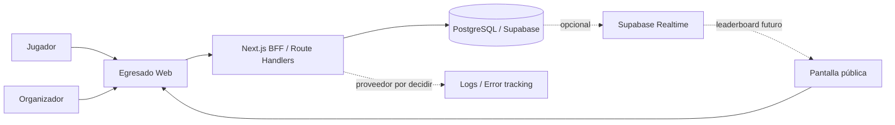

El diagrama conserva la topología aceptada, pero no implica que observabilidad externa, Realtime, ranking o persistencia de runs estén implementados en la base técnica.

## Contenedores y ejecución objetivo

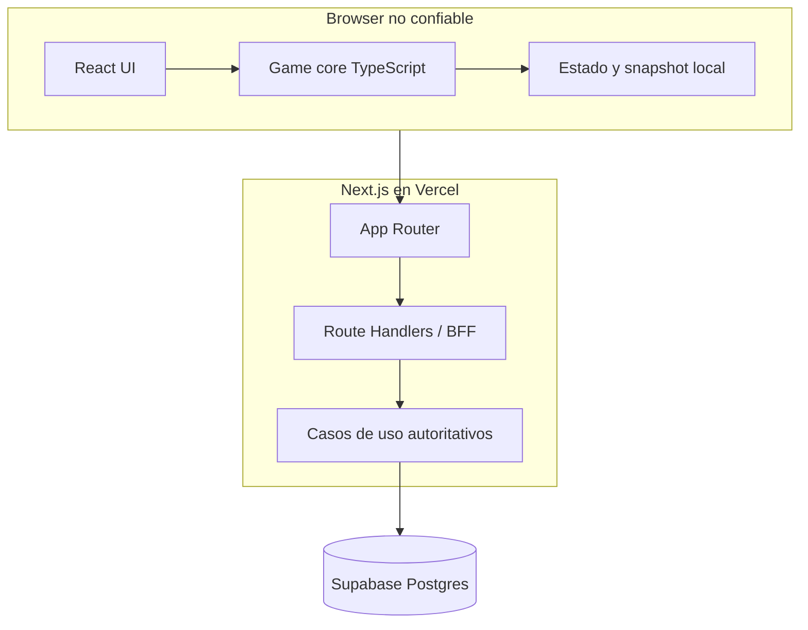

El juego activo se ejecuta localmente para minimizar latencia y dependencia de red. El caso de uso server-only ya valida una finalización no confiable, recompone el `RunPlan` cuando corresponde y reproduce las acciones con el motor versionado; emitir la configuración oficial, exponer endpoints y persistir el resultado siguen pendientes. El browser sólo previsualiza; no es autoridad de score ni de estado final.

## Fronteras de módulos

La dirección de dependencias implementada se controla con ESLint y un `tsconfig` separado para el core:

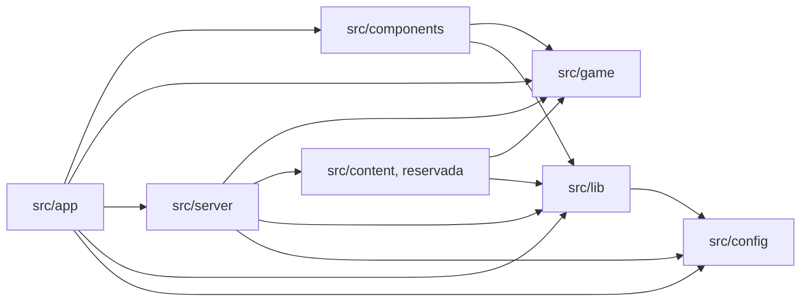

- `src/app`: composición, layouts, páginas y entrada HTTP. Puede invocar casos de uso de servidor, pero no importar persistencia directamente.
- `src/components`: UI. Puede consumir `game` y utilidades de `lib`; no accede a servidor, configuración secreta ni Supabase directamente. `components/game/` aporta el adaptador entre React y el motor: un store observable framework-free más un binding con `useSyncExternalStore`. No se incorporó Zustand: el estado de sesión es un único árbol inmutable actualizado por el reducer del motor, y la suscripción por selector ya la da React.
- `src/game`: core TypeScript puro y determinista. En dependencias internas sólo puede importar `game`; no usa React, Next.js, DOM, red, DB, almacenamiento del browser, hora global, `process` ni `Math.random()`. Admite dos dependencias externas puras declaradas en una lista blanca de fronteras: `zod` para parsear fronteras de confianza y `pure-rand` para el generador seeded de [ADR-012](03-architecture/adr/ADR-012-seeded-prng-and-substreams.md). Contiene el núcleo funcional (`core`, `math`, `random`, `challenges`, `narrative`, `progression`, `difficulty`, `scoring`, `profiles`, `plan`, `ruleset`, `runs`, `content`) y, bajo `testing/`, fixtures de desarrollo aisladas de la API pública. Ver [game engine](03-architecture/game-engine.md).
- `src/content`: contenido ejecutable como datos sobre interacciones existentes. Aloja el slice versionado de 7.º y no contiene componentes ad hoc.
- `src/server`: casos de uso autoritativos y adaptadores de persistencia. Incluye validación de runs por replay; el subárbol `persistence` no es una API para `app`.
- `src/lib`: adaptadores y utilidades transversales sin reglas de producto; el acceso público a Supabase vive aquí detrás de un adaptador aprobado.
- `src/config`: schemas y lectura de configuración pública/server-only; no depende de capas superiores.
- `supabase/`: configuración local, migraciones SQL y seed. La migración inicial es deliberadamente neutra y no decide un schema de juego.

Los imports directos de `@supabase/supabase-js` están permitidos sólo en los adaptadores aprobados. Las dependencias externas no autorizan saltarse las fronteras internas.

## Topología de despliegue

- Vercel sirve la aplicación Next.js y sus Route Handlers/Functions; CDN/edge puede servir assets estáticos.
- Supabase aloja PostgreSQL cuando el entorno tiene persistencia configurada.
- La región de funciones debe quedar cercana a Postgres al configurar producción.
- La imagen Docker standalone es un artefacto portable y un gate de paridad; no reemplaza a Vercel ni selecciona otro proveedor.
- Postgres será la fuente de verdad de runs oficiales. La base actual no crea esas tablas ni vuelve obligatorio a Supabase para levantar el shell.

Los detalles operativos están en [despliegue y ambientes](03-architecture/deployment-and-environments.md).

## Escalabilidad

Para una feria escolar, el monolito modular ofrece margen suficiente. No introducir microservicios, colas, Kubernetes, workspaces o un monorepo sin evidencia y una revisión arquitectónica.

Posibles extracciones futuras —no decisiones actuales— incluyen procesamiento matemático intensivo, analytics, edición de contenido o un leaderboard especializado. Los triggers de [ADR-002](03-architecture/adr/ADR-002-modular-monolith-bff.md) gobiernan cualquier reevaluación.

---

# FILE: 03-architecture/content-model-migration.md

# Migración del contenido al modelo de familia, plantilla y variante

Cómo se mueve el contenido existente al modelo de [ADR-019](03-architecture/adr/ADR-019-scenario-family-template-variant.md), qué se migró ya y qué queda deliberadamente para después.

**Estado: la migración estructural está hecha, STAGE-03 completó el pipeline posterior y STAGE-04 lo puso a jugar.** Las siete plantillas de 7.º y las ocho de desarrollo declaran familia, rol de colocación y variantes con identidad propia. Las plantillas de producción también declaran su `VariantSourceSpec`, validadores y canonización según [ADR-020](03-architecture/adr/ADR-020-variant-generation-and-approved-catalog.md), y la partida elige dentro del catálogo aprobado según [ADR-021](03-architecture/adr/ADR-021-approved-catalog-in-play-and-teacher-demo.md). Lo que **no** hizo la migración, a propósito, es mover contenido de año ni tocar una sola cuenta.

## Principio de la migración

> Direccionar el contenido no es rediseñarlo.

La migración cambia **cómo se nombra y se ubica** una situación. No cambia qué pregunta, con qué números, ni qué le hace a la carrera. La evidencia de que se cumplió está en las runs golden: mismo recorrido, mismo score, mismo perfil, misma cantidad de comandos.

## Los seis desafíos como sondas de arquitectura

Los seis se inspeccionaron para comprobar que el modelo representa lo que necesitan **sin ningún caso especial en el motor**. Cubren seis dominios matemáticos, seis interacciones y cuatro combinaciones distintas de efectos de carrera.

| Desafío | Familia | Estructura cognitiva | Variantes | Rol | Interacción | Efecto de carrera | ¿Sin caso especial en el motor? |
|---|---|---|---|---|---|---|---|
| `g7.bus-timing` | `bus` | tiempo con demora porcentual contra un límite | `demora-25`, `demora-50` | `anchor` | timeline | Estilo | sí |
| `g7.mural-paint` | `mural` | área y cobertura por envase entero | `pared-6x24`, `pared-5x24` | `checkpoint` | decision-card | Promedio, Estilo | sí |
| `g7.notebook-offer` | `notebook` | porcentaje contra descuento fijo con efectivo limitado | `precio-alto`, `precio-bajo` | `anchor` | decision-card | Estilo | sí |
| `g7.group-tasks` | `group-project` | asignación con capacidad y afinidad | `equipo-a`, `equipo-b` | `anchor` | assignment-board | Equipo, Estilo | sí |
| `g7.stand-supplies` | `school-fair` | packs, mínimo requerido y presupuesto | `porciones-24`, `porciones-20` | `anchor` | budget-builder | Equipo, Estilo | sí |
| `g7.may-25-act` | `may-25` | clasificación por regla, juzgada con F1 | `coreografia-a`, `coreografia-b`, `coreografia-c` | `special` | number-grid | Aura, Estilo | sí |

Lo que la tabla prueba:

- **Seis interacciones distintas** entran en el mismo contrato de plantilla.
- **Los roles son semántica de colocación, no de calidad.** El mural es `checkpoint` porque la profesora lo toma como trabajo del trimestre; el acto es `special` porque ocurre en público. Ninguno de los dos «vale más».
- **Los efectos de carrera no se derivan del rol.** El acto es `special` y mueve Aura; el mural es `checkpoint` y pone nota. Son ejes independientes.
- **La cantidad de variantes es propiedad de la plantilla**, no del modelo: el acto declara tres y las demás dos.

> **Esta tabla no es el inventario final de escenarios de Egresado.** Es la matriz de sondas con la que se validó la arquitectura, tal como estaba al migrar. La ubicación de los seis en 7.º es consecuencia del primer slice vertical.

STAGE-04 sumó una séptima, `g7.bus-latest-departure`, en la familia `bus`: misma situación, otra pregunta, interacción `numeric-input`, rol `anchor`, Estilo. Es la primera vez que dos plantillas de producción comparten familia. Ver [ADR-021](03-architecture/adr/ADR-021-approved-catalog-in-play-and-teacher-demo.md).

STAGE-07 sumó una octava, `g7.bus-travel-review`, en la misma familia y con rol `recovery`: es la primera plantilla de producción que **no** participa de la selección ordinaria — la juega un año que quedó debiendo el colectivo, y ninguna otra plantilla la referencia. Ver [ADR-024](03-architecture/adr/ADR-024-progression-recovery-and-graduation.md).

## Qué cambió en cada desafío

Exactamente dos cosas por archivo:

1. **La declaración.** Se agregaron `family`, `placement` y `variants`; el array `VARIANTS` pasó a llevar un `id` por entrada.
2. **La selección.** `const variante = rng.pick(VARIANTS)` pasó a `const variante = authoredVariant(ID, VARIANTS, variantId)`.

Nada más. Ni la narrativa, ni la presentación, ni el evaluador, ni las invariantes, ni un solo número.

## Dónde se eligen ahora las variantes

Antes la variante se elegía **dentro** del generador, en el substream del intento de generación. Ahora se elige **al construir la dirección de la instancia**, en un substream propio, y la dirección viaja en el `ChallengeInstanceRef`.

Consecuencia declarada: para un mismo seed de run, una plantilla de 7.º puede caer en otra variante autorada que antes. La matemática, el conjunto de variantes alcanzables y las invariantes son las mismas. Eso es un cambio de identidad de contenido y por eso la versión de contenido de 7.º subió a `0.4.0-grade-7`.

Desde ADR-020 hay una separación adicional: el `runSeed` puede seleccionar una dirección, pero sus parámetros semánticos se materializan desde `VARIANT_SPACE_SEED` y la dirección `familia/plantilla/variante`. Bajo el mismo contrato versionado de contenido/generador, cambiar de run o de slot no cambia el problema detrás de esa dirección. Esa semántica y las fuentes híbridas llevaron el contenido a `0.5.0-grade-7` sin cambiar el ruleset.

Las plantillas de desarrollo declaran **una sola variante** cada una, y una lista de un elemento no gasta ningún sorteo: su generación es byte a byte la de antes, que es lo que mantiene las runs golden intactas.

## Lo que la migración NO hizo

La migración no dividió ninguna familia en varias plantillas: la prueba de que dos conviven en una familia se hizo con contenido de desarrollo, en la familia `school-data`, para no crear gameplay de producción fuera de alcance. **STAGE-04 sí dividió una**: `bus` tiene desde entonces la comparación de salidas y la anticipación necesaria, y la migración quedó como lo que era, un cambio de direccionamiento. Que la familia pueda tener cuatro estructuras —comparación de recorridos, frecuencia— sigue siendo capacidad disponible y no trabajo hecho; autorarlas es contenido, no arquitectura.

No se renombró ningún id de contenido. `g7.bus-timing` sigue llamándose así aunque el prefijo `g7.` sugiera una ubicación que el modelo ya no necesita. Renombrarlo es cambiar identidad de contenido y pertenece a la etapa que decida ubicaciones.

No se movió contenido de año, no se sacó nada y no se agregó contenido de producción.

## Cómo migrar una plantilla nueva

Para quien traiga contenido al modelo más adelante:

1. Elegir la **familia**: ¿en qué situación reconocible ocurre? Si la familia no existe, agregarla al módulo de familias del content set.
2. Elegir el **rol**: ¿es el beat primario del año (`anchor`), una evaluación (`checkpoint`), un momento social o excepcional (`special`) o contenido condicional de recuperación (`recovery`)?
3. Declarar la **elegibilidad**: en qué etapas *puede* aparecer. Permiso, no selección.
4. Nombrar las **variantes curadas de respaldo** con ids estables y semánticos. El orden de `variants` afecta qué dirección elige un seed cuando el content set no aporta catálogo aprobado, pero no define identidad: esa identidad es el id dentro de la dirección completa.
5. Declarar un `VariantSourceSpec`: parámetros `authored`, validadores, vista `canonical` y, si el dominio lo justifica, un `VariantGenerator` constraint-first. Tanto authored como generated pasan por el mismo pipeline.
6. Escribir `generate` sobre los parámetros ya resueltos. No leer `runSeed` para decidir su contenido: el `variantRng` deriva del seed fijo del espacio de variantes y de la dirección semántica.
7. Registrar la plantilla en el `ContentCatalog`; construir, auditar y verificar el `ApprovedVariantCatalog` con `pnpm game:variants build`, `audit` y `check`. Aprobarla no la agrega por sí solo a un `RunPlan`. **No hace falta tocar el motor ni el pipeline.**

La ficha de autoría previa al código está en [la guía de autoría](01-game-design/content-authoring-guide.md).

## Trabajo futuro de ubicación de contenido

Cuando el proyecto decida el inventario definitivo, cada escenario existente se clasificará como **KEEP**, **MOVE**, **REWORK**, **MERGE**, **REPLACE** o **REMOVE**. Esa auditoría no se hizo y no corresponde hacerla desde la arquitectura: depende del alcance de contenido, del gate docente y de la duración objetivo de una run. Ver [preguntas abiertas](07-reference/open-questions.md) y [el roadmap](06-delivery/implementation-sequence.md).

---

# FILE: 03-architecture/data-model.md

# Modelo de datos

## Entidades MVP

### `players`
Identidad anónima/pseudónima.

| Campo | Tipo | Notas |
|---|---|---|
| id | uuid | PK |
| public_name | varchar | nickname moderado |
| status | enum | active/blocked |
| created_at | timestamptz | server |

No almacenar fecha de nacimiento, apellido, email ni escuela para el MVP.

### `game_events`
Configura feria/daily.

| Campo | Tipo |
|---|---|
| id | uuid |
| slug | varchar unique |
| name | varchar |
| starts_at | timestamptz |
| ends_at | timestamptz |
| mode | varchar |
| seed_strategy | jsonb |
| ruleset_version | varchar |
| content_version | varchar |
| leaderboard_enabled | boolean |
| status | varchar |

### `runs`

| Campo | Tipo | Notas |
|---|---|---|
| id | uuid | PK |
| player_id | uuid nullable | pseudónimo |
| event_id | uuid nullable | feria/daily |
| seed | varchar | reproducibilidad |
| mode | varchar | |
| difficulty | varchar | |
| game_version | varchar | |
| ruleset_version | varchar | |
| content_version | varchar | |
| status | varchar | created/active/completed/invalid/abandoned |
| started_at | timestamptz | |
| completed_at | timestamptz nullable | |
| official_score | integer nullable | servidor |
| profile_code | varchar nullable | |
| result_summary | jsonb nullable | |
| result_hash | varchar nullable | |

### `run_actions`

| Campo | Tipo |
|---|---|
| id | bigint/uuid |
| run_id | uuid |
| sequence_no | int |
| action_type | varchar |
| challenge_id | varchar |
| payload | jsonb |
| client_elapsed_ms | int nullable |
| created_at | timestamptz |

Unique `(run_id, sequence_no)`.

### `leaderboard_entries` — opcional
Inicialmente puede derivarse de runs. Materializar sólo si mediciones demuestran necesidad.

### `moderation_actions`
Audita ocultamientos/restauraciones.

## Índices

- `runs(event_id, status, official_score desc)`.
- `runs(player_id, completed_at desc)`.
- `run_actions(run_id, sequence_no)`.
- `game_events(slug)` unique.

## Retención

Definir antes de feria:
- retención de runs;
- retención de actions;
- exportación agregada;
- eliminación de pseudónimos si ya no son necesarios.

## Datos derivados

No duplicar sin necesidad:
- posición de ranking;
- estadísticas agregadas;
- best score por jugador.

Preferir query/view/materialized view según escala real.

## Entidades objetivo del modo feria

**No implementadas.** Los nombres se adaptan a las convenciones reales al escribir la migración.

- **Evento:** vigencia, estado (`draft`/`frozen`/`live`/`closed`), tupla de versiones permitida, política de intentos y ajustes de ranking público.
- **Participante:** id pseudónimo, evento, nickname, estado de moderación.
- **Run:** descriptor y tupla de versiones, seed y calendario de variantes, estado (`issued`/`completed`/`pending`/`verified`/`rejected`).
- **Acciones de run:** action log canónico, ordenado e inmutable.
- **Resultado verificado:** desglose de score, resumen de carrera, arquetipo cuando exista, tupla de desempate y metadata de verificación.
- **Mejor del participante:** referencia a la mejor run verificada del evento, actualizada transaccionalmente.
- **Catálogo de variantes:** versión, plantilla, seed, fingerprint, metadata de dificultad y estado de aprobación.
- **Auditoría de moderación:** actor, participante, acción, motivo y timestamp.

Ver [arquitectura objetivo del motor](03-architecture/target-engine-architecture.md) y [modo feria y congelamiento](05-operations/fair-mode-and-competition-freeze.md). La retención de cada una es una decisión abierta ([preguntas 31 y 50](07-reference/open-questions.md)).

---

# FILE: 03-architecture/deployment-and-environments.md

# Despliegue y ambientes

## Topología aceptada

Vercel es el destino canónico para la aplicación Next.js y sus Route Handlers; Supabase gestiona PostgreSQL cuando la persistencia está habilitada. La imagen Docker standalone definida por [ADR-010](03-architecture/adr/ADR-010-reproducible-node-pnpm-container-toolchain.md) es un artefacto portable para paridad y verificación, no un cambio de proveedor de producción.

La base actual es local y no contiene gameplay, autenticación ni tablas de producto. No debe desplegarse públicamente con Next.js `16.3.1`: el gate `pnpm release:check` exige actualizar a `>=16.3.2`, regenerar el lockfile y volver a ejecutar la verificación completa.

## Ambientes

| Ambiente | Propósito | Datos y persistencia |
|---|---|---|
| Local nativo | Camino rápido con `pnpm dev`; Supabase local es opcional. | `.env.local` ignorado por Git; DB local o proyecto de desarrollo aislado. |
| Local Compose | Paridad del runtime Linux y prueba del desarrollo contenedorizado. | El browser usa la URL pública del host y el proceso server usa la URL interna del contenedor. |
| Preview | Cada PR/despliegue de Vercel cuando se habilite. | Recursos aislados; nunca datos reales de producción. |
| Staging | Configuración cercana a feria para E2E, migraciones, carga y rehearsal. | Proyecto Supabase separado de producción. |
| Production | Evento real y juego público, después de cerrar todos los gates de release. | Secretos gestionados por el proveedor y datos bajo la política legal/retención que aún debe cerrarse. |

La política legal y de retención, los SLO operativos y los requisitos exactos de rehearsal permanecen abiertos en [preguntas 30 y 31](07-reference/open-questions.md#operación-seguridad-y-privacidad).

## Configuración y URLs de Supabase

La configuración se valida al iniciar y puede quedar completamente ausente para ejecutar el shell:

- `NEXT_PUBLIC_APP_URL`: origen público de la aplicación; localmente tiene default `http://localhost:3000`.
- `NEXT_PUBLIC_SUPABASE_URL` y `NEXT_PUBLIC_SUPABASE_PUBLISHABLE_KEY`: par público obligatorio en conjunto. La publishable key no es un secreto y sólo es segura junto con grants/RLS mínimos.
- `SUPABASE_INTERNAL_URL`: URL server-only opcional. En Compose usa por defecto `http://kong:8000`, alias interno del gateway en la red Docker local compartida.
- `SUPABASE_SECRET_KEY`: credencial privilegiada server-only, sin default y nunca prefijada con `NEXT_PUBLIC_`.

En desarrollo nativo, el server puede reutilizar `NEXT_PUBLIC_SUPABASE_URL`. En Compose, el browser conserva `http://127.0.0.1:54321` mientras el proceso server usa la red `egresado-supabase-local` y el alias interno `http://kong:8000`. La red compartida resuelve conectividad contenedor a contenedor, pero no garantiza por sí sola que los puertos publicados queden aislados de la LAN.

### Exposición de puertos en Docker Desktop

El wrapper solicita el binding oficial `com.docker.network.bridge.host_binding_ipv4=127.0.0.1` al crear la red. Esa opción expresa la intención de loopback, pero Docker Desktop puede conservarla en la red y aun publicar un contenedor con `HostIp` real `0.0.0.0` o `::`. Por eso la opción de red no se trata como evidencia suficiente.

Después de iniciar Supabase, el wrapper inspecciona los bindings efectivos de todos sus contenedores y sólo considera loopback a `127.0.0.1` o `::1`. `pnpm db:start` es fail-closed: ante cualquier otro `HostIp` —incluidos `0.0.0.0` y `::`— intenta detener el stack y falla. `pnpm db:reset` y `pnpm docker:up` también rechazan por defecto un stack existente que no sea loopback-only. `pnpm db:status` reporta `loopbackOnly` y emite una advertencia si detecta exposición.

Sólo para uso local en una red de confianza, con firewall del host verificado, los wrappers aceptan el flag explícito `--allow-non-loopback` o `EGRESADO_ALLOW_NON_LOOPBACK_SUPABASE=true` para automatización local. La excepción imprime una advertencia visible y no convierte el stack en apto para una red compartida, CI, staging ni producción. No crear un script alternativo ni persistir este override como default de proyecto.

`pnpm db:env` genera `.env.local` desde Supabase local sin imprimir valores secretos. El archivo no entra en la imagen final ni en Git. Los adaptadores server-only prefieren la URL interna y la configuración pública nunca incluye `SUPABASE_SECRET_KEY`.

## Caminos locales

El camino nativo es el ciclo rápido:

```bash
pnpm install --frozen-lockfile
pnpm dev
```

Supabase se inicia por separado sólo si la tarea necesita persistencia:

```bash
pnpm db:start
pnpm db:env
pnpm db:reset
pnpm db:types
```

Si Docker Desktop no respeta el binding solicitado, `pnpm db:start` falla e intenta dejar el stack detenido. Corregir la configuración de Docker/firewall es la opción preferida; la excepción `pnpm db:start --allow-non-loopback` queda limitada al escenario local de confianza descrito arriba. Como el permiso no persiste, repetir explícitamente `pnpm db:reset --allow-non-loopback` o `pnpm docker:up --allow-non-loopback` si ese workflow necesita continuar con el stack ya inspeccionado; la variable de opt-in ofrece el mismo comportamiento para automatización local.

El camino contenedorizado levanta la etapa `development` con bind mount del repositorio y volúmenes separados para `node_modules` y `.next`:

```bash
pnpm docker:up
pnpm docker:down
```

La guía completa de prerrequisitos, troubleshooting y limpieza está en [entorno de desarrollo](08-engineering/development-environment.md).

## Imagen de producción portable

El `Dockerfile` multi-stage:

1. fija Node.js 24.19.0 por tag y digest e instala pnpm 11.22.0;
2. instala con `pnpm install --frozen-lockfile`;
3. activa `NEXT_STANDALONE=true` sólo en la etapa `builder`;
4. copia la salida standalone y assets al runtime mínimo;
5. ejecuta como usuario no root `node` e incluye un health check sobre `/api/health`.

El build normal de Vercel no activa salida standalone. Esta condición evita cambiar el contrato de despliegue canónico mientras permite verificar el artefacto Docker con `pnpm docker:build`.

Las variables `NEXT_PUBLIC_*` quedan congeladas por Next.js durante el build. El `Dockerfile` acepta sólo esos valores públicos como `--build-arg`; una imagen configurada para otro origen debe reconstruirse. `SUPABASE_SECRET_KEY` y `SUPABASE_INTERNAL_URL` no son build args: se inyectan al runtime server desde el ambiente/secret manager. Nunca reutilizar una imagen con configuración pública de un ambiente distinto sin reconstruirla.

## CI y gates de release

GitHub Actions usa Node desde `.node-version`, pnpm desde `packageManager` y dependencias congeladas. `pnpm toolchain:check` exige que `.node-version`, `.nvmrc`, `engines`, `packageManager` y el `Dockerfile` permanezcan alineados. Las actions están fijadas por SHA y los permisos del workflow son sólo de lectura.

El job `Quality and build` ejecuta coherencia del toolchain, validación documental/agentic, scanner de secretos, auditoría del árbol completo de dependencias, formato, lint/fronteras arquitectónicas, typecheck, cobertura y build. El job `Browser smoke tests` instala Chromium, construye la aplicación, ejecuta Playwright en desktop/mobile y conserva el reporte. El job `Production container smoke` prueba el runner standalone no-root y su health. Dependabot revisa semanalmente dependencias npm, GitHub Actions y Docker.

Antes de un release público también deben pasar:

- `pnpm release:check`; hoy falla de forma deliberada hasta instalar Next.js `>=16.3.2`;
- `pnpm security:audit` y revisión de advisories/transitivas;
- migraciones, RLS/permisos y pruebas de integración cuando exista schema de producto;
- golden replays, validación de contenido, rehearsal y fallback cuando exista gameplay/release de feria.

Un CI verde de la base técnica no reemplaza esos gates contextuales.

## Migraciones

- Los cambios viven como SQL versionado en `supabase/migrations/`.
- `pnpm db:reset` demuestra que el historial reconstruye la DB local; `pnpm db:lint` revisa el schema y `pnpm db:types` regenera los tipos consumidos por TypeScript.
- Toda migración de producto necesita revisión de índices y RLS/permisos, y se aplica a staging antes de producción.
- No editar el schema productivo manualmente sin registrar una migración.
- La migración inicial sólo valida el pipeline; no decide el modelo de runs, eventos o acciones.

## Región, rollback y PWA

- Configurar funciones cerca de la región de la base de datos antes de producción.
- Mantener disponible el deploy anterior y preferir migraciones backward-compatible.
- `game_version`, `ruleset_version` y `content_version` evitan reinterpretar runs incompatibles; el mecanismo de conservación histórica sigue abierto.
- La base incluye manifest responsive. Un service worker avanzado se difiere hasta estabilizar caching y versionado para no servir assets o reglas incompatibles.

Los feature flags futuros deben limitarse a necesidades verificadas; no crear una plataforma propia de flags para el MVP.

## Aislamiento de configuración competitiva

Cuando exista el modo feria, cuatro ambientes con propósitos distintos: local con generadores sin restricción y herramientas de debug; demo docente con contenido estable de 7.º y pool determinista; staging o ensayo de feria con la misma forma de infraestructura y configuración que producción, participantes sintéticos y pruebas de carga y ranking; y producción de feria con configuración de evento congelada, catálogo oficial de variantes, verificación autoritativa, monitoreo y moderación.

Regla dura: **una versión de desarrollo de score o de contenido no puede convertirse en versión oficial por accidente.** El registro del evento habilita explícitamente sólo la tupla congelada, y el flag `production` del ruleset ya se niega a construir un ruleset oficial desde una política de desarrollo. Ver [modo feria y congelamiento](05-operations/fair-mode-and-competition-freeze.md).

---

# FILE: 03-architecture/game-engine.md

# Game engine

Motor TypeScript determinista, puro y reproducible. Este documento describe el motor **implementado** en `src/game`. Las decisiones durables que lo gobiernan están en [ADR-003](03-architecture/adr/ADR-003-deterministic-seeded-engine.md), [ADR-004](03-architecture/adr/ADR-004-server-authoritative-scoring.md), [ADR-007](03-architecture/adr/ADR-007-content-as-data.md), [ADR-011](03-architecture/adr/ADR-011-functional-core-transition-engine.md), [ADR-012](03-architecture/adr/ADR-012-seeded-prng-and-substreams.md), [ADR-013](03-architecture/adr/ADR-013-exact-rational-arithmetic.md), [ADR-019](03-architecture/adr/ADR-019-scenario-family-template-variant.md), [ADR-020](03-architecture/adr/ADR-020-variant-generation-and-approved-catalog.md), [ADR-021](03-architecture/adr/ADR-021-approved-catalog-in-play-and-teacher-demo.md), [ADR-022](03-architecture/adr/ADR-022-difficulty-model-and-run-composer.md), [ADR-023](03-architecture/adr/ADR-023-competitive-score-policy.md) y [ADR-024](03-architecture/adr/ADR-024-progression-recovery-and-graduation.md).

Para comandos y flujo de trabajo, ver [desarrollo del motor](08-engineering/game-engine-development.md).

## Restricciones

`src/game` no puede depender de React, Next.js, `window`/DOM, almacenamiento local, DB, red, hora global no inyectada ni `Math.random()`. Las fronteras se aplican con ESLint (`no-restricted-globals`, `no-restricted-imports`, `boundaries/dependencies`) y con un proyecto TypeScript separado, `tsconfig.game.json`, que compila el core sin tipos de DOM ni de Node.

Únicas dependencias externas admitidas dentro del core, declaradas en una lista blanca explícita de fronteras: `zod` (parseo de fronteras de confianza) y `pure-rand` (generador seeded de ADR-012).

## Arquitectura

Functional core / imperative shell.

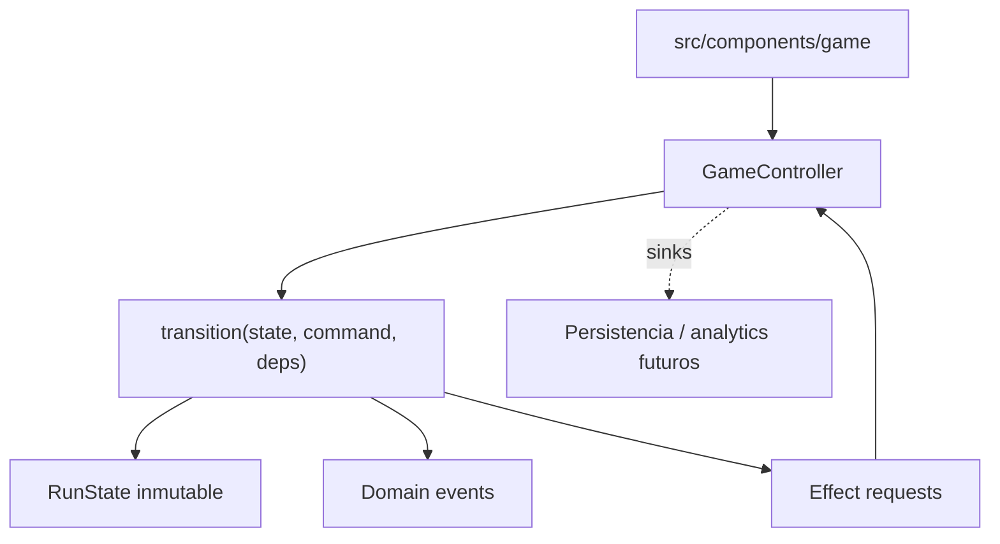

El motor devuelve estado, eventos y **descripciones** de efecto. Nunca ejecuta un efecto: no hay red, storage ni SDK dentro de `src/game`.

## Módulos

| Módulo | Responsabilidad |
|---|---|
| `core/` | identidades branded, `Result`, taxonomía de errores, exhaustividad, versionado |
| `math/` | racionales exactos, redondeo, cantidades/unidades, tolerancias |
| `random/` | interfaz `Rng`, adaptador `pure-rand`, derivación de seeds por namespace |
| `challenges/` | contratos, modelo familia/plantilla/variante, fuentes, validadores, interacciones y registry |
| `narrative/` | storylets, condiciones, efectos, selección determinista |
| `progression/` | etapas canónicas, el modelo de carrera visible y la progresión —qué queda por cerrar, cómo se cierra y cuándo se egresa— |
| `difficulty/`, `scoring/`, `profiles/` | rasgos cognitivos, costos de scheduling y contratos de política + implementaciones de desarrollo |
| `plan/` | política y compositor de runs, `RunPlan` concreto, serialización, fingerprint, validación independiente y auditoría |
| `ruleset/` | ensamblado y validación del ruleset versionado |
| `runs/` | estado, comandos, eventos, transición, action log, replay, snapshots, selectores |
| `content/` | validación de contenido, pipeline, auditoría y catálogo aprobado de variantes |
| `testing/` | fixtures de desarrollo, agente sintético y simulación masiva |

## Entradas

```typescript
interface RunDescriptor {
  runId: RunId
  seed: RunSeed
  mode: 'standard' | 'fair' | 'practice'
  difficulty: 'adaptive' | 'fixed'
  gameVersion: string
  rulesetVersion: string
  contentVersion: string
  variantCatalogVersion?: string
  planFingerprint?: string
  scoreVersion?: string
}
```

`variantCatalogVersion` es opcional: una run que juega la lista curada de una plantilla no salió de un catálogo aprobado y no debe afirmar lo contrario. `planFingerprint` identifica el plan concreto de una run compuesta. `scoreVersion` también es opcional: identifica la calibración competitiva cuando la run se juega con una `CompetitiveScorePolicy`; una práctica sin esa política lo omite. `EngineDependencies` aporta `ruleset`, catálogo de contenido, `storylets` y, cuando existen, un `ApprovedVariantLookup`, una `CompositionPolicy` y una `CompetitiveScorePolicy`. El ruleset **no** forma parte del estado: contiene funciones y se inyecta; la run sólo guarda sus identidades versionadas.

## Estado

`RunState` es JSON-compatible: no contiene `Date`, `Map`, `Set`, instancias de clase ni funciones. Guarda descriptor, fase, etapa, índices de evento, carrera, flags, dificultad, estado de selección, historial, `scorePreview`, racha, progresión —lo que la run debe, cómo lo cerró y si egresó—, completion y, cuando corresponde, el `RunPlan` concreto compuesto antes de empezar.

El desafío activo se guarda como **dirección**, no como modelo:

```typescript
interface ChallengeInstanceRef {
  instanceId, familyId, templateId, variantId, stageId, eventIndex, difficulty
}
```

La ubicación pertenece a la instancia, pero el contenido matemático pertenece a `familyId/templateId/variantId`: se reconstruye con el seed fijo del espacio de variantes, no con el seed de la run. Bajo el mismo contrato versionado de contenido/generador, el `runSeed` selecciona direcciones pero no cambia el problema detrás de una dirección. Nada no serializable entra al estado, los snapshots quedan chicos y el replay no puede desincronizarse del estado que lo referencia.

## Ciclo de vida

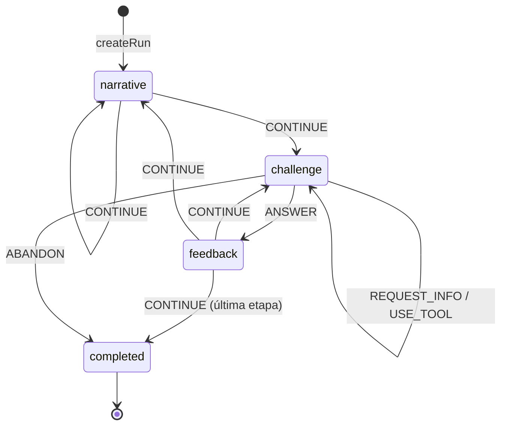

Un storylet sin pool de desafíos es un evento puramente narrativo y se resuelve con `CONTINUE`.

## Comandos

```typescript
type GameCommand =
  | { type: 'ANSWER'; instanceId; answer: InteractionAnswer }
  | { type: 'REQUEST_INFO'; instanceId; key }
  | { type: 'USE_TOOL'; instanceId; tool }
  | { type: 'CONTINUE' }
  | { type: 'ABANDON' }
```

`parseCommand` es la única frontera de confianza; usa schemas Zod. Dentro del motor los comandos ya están tipados.

Las respuestas numéricas viajan como literal decimal en `string`, nunca como `number`, para que ningún valor pase por punto flotante binario antes de ser evaluado.

## Transiciones inválidas

`transition` devuelve `Result`. Se rechazan explícitamente, entre otros: responder fuera de fase, responder dos veces, responder a una instancia obsoleta, enviar una respuesta de otra interacción, pedir un dato inexistente, usar una herramienta no habilitada, continuar sin feedback y operar sobre una run terminada. Cada rechazo es un valor tipado de `EngineRejection`, no una excepción.

Las excepciones (`EngineInvariantError`) quedan reservadas para estados que las reglas del motor deberían haber impedido; nunca las puede provocar el jugador.

## Eventos de dominio y efectos

Son cosas distintas.

- **Evento de dominio**: un hecho ocurrido en el modelo determinista (`challenge.evaluated`, `stage.completed`, `run.completed`). Estable, apto para mapear a analytics más adelante, pero el vocabulario no lo decide analytics.
- **Effect request**: una instrucción para el shell (`persist-snapshot`, `track`). El motor la describe; el `GameController` la ejecuta a través de sinks inyectados.

## RNG

Ver [ADR-012](03-architecture/adr/ADR-012-seeded-prng-and-substreams.md). Cada consumidor deriva su substream por dirección de namespace, de modo que agregar una tirada nueva no desplaza ninguna existente. `RunState` no guarda un cursor de RNG: el determinismo viene de la dirección, no del arrastre de estado.

La codificación de la dirección usa `U+0001` entre seed y ruta y `U+0000` entre segmentos, escritos como escapes y fijados por vectores en `tests/unit/rng-addressing.test.ts`. El charset que hace imposible una colisión se **verifica** en las fronteras de confianza, no se asume.

Capacidades: `nextInt`, `nextFloat`, `chance`, `pick`, `shuffle`, `weightedPick`, `derive`. La selección ponderada usa pesos enteros y comparación entera; nunca puede elegir un peso cero.

## Precisión numérica

Ver [ADR-013](03-architecture/adr/ADR-013-exact-rational-arithmetic.md). Dinero en unidades menores enteras, tiempo en minutos enteros, proporciones y porcentajes como racionales exactos, redondeo explícito por operación y tolerancia de respuesta declarada por desafío (`exact`, `absolute`, `relative-percent`, `range`). `toNumber` es sólo para presentación.

## Desafíos

Una plantilla declara responsabilidades separables sobre parámetros ya resueltos por su `VariantSourceSpec`:

1. fuente `authored` o `generated` — parámetros direccionados, validadores y vista canónica;
2. `generate(context)` — modelo privado desde parámetros resueltos;
3. `verify(model)` — invariantes propias del desafío;
4. `present(model, revealed)` — vista pública, sin la solución;
5. `evaluate(model, answer, revealed)` — resultado estructurado.

`defineChallenge` borra el tipo del modelo sin ningún cast: el modelo queda capturado en el closure y sólo se exponen las operaciones permitidas. La generación reintenta en un substream propio hasta cumplir las invariantes; el índice de intento forma parte de la dirección, así que el reintento también es determinista. Un generador que necesita reintentos sistemáticamente está mal construido y la validación de contenido lo reporta.

El pipeline de STAGE-03 recorre ambas fuentes con el mismo contrato: resolver, materializar, validar, canonizar, calcular huella, deduplicar y aprobar. `AUTHORED` no evita validación y `GENERATED` no significa azar libre en runtime.

### Vista pública

`PublicChallengeView` contiene narrativa, interacción y herramientas —y, en un repaso, las notas de lo que practica y de lo que sólo se explica—. No expone el modelo interno ni la solución. Un juego servido al browser no puede garantizar secreto absoluto, pero la arquitectura no entrega la respuesta a los componentes de presentación.

La narrativa de una plantilla puede leer los flags de la run (`narrate(model, { flags })`) para un callback; es sólo texto. Parámetros, evaluación y score no leen flags, y los tests comprueban que la interacción es idéntica con y sin historia.

## Interacciones

La categoría matemática y la interacción son ejes independientes (ADR-007). Kinds contratados en este build:

`decision-card`, `numeric-input`, `budget-builder`, `timeline`, `chart-interpretation`, `assignment-board`, `information-request`, `number-grid` y, desde STAGE-08 / Phase 1, los tres modos constructivos de 1.º ([ADR-025](03-architecture/adr/ADR-025-full-career-contract-evolution.md)):

- `quantity-builder` — conteos o usos por ítem; con `positions`, la vista de posiciones iguales de una distribución (modo conteos de Grid / Select / Classify);
- `schedule-builder` — un inicio por bloque, en minutos desde medianoche; la presentación trae lugar, duración, preparación, inicios posibles y el eje público de la tarde (Timeline / Schedule);
- `spatial-layout` — objetos en celdas enteras con giro 0/90; la presentación trae celdas bloqueadas, pasos reservados, puertas, huellas y códigos (Spatial / Graph Canvas).

Las tres respuestas se confirman enteras, pasan por schemas Zod estrictos y se evalúan sobre conteos, minutos y celdas, nunca sobre píxeles. Los kinds técnicos no son los cinco motores de producto: ver [sistema de desafíos](01-game-design/challenge-system.md). Siguen sin contratar `sequence/trend` y los minijuegos especiales. Ver [cómo agregar una interacción](08-engineering/game-engine-development.md#agregar-un-interaction-type).

## Narrativa

Storylets con condiciones declarativas. Las condiciones y los efectos son **datos**, nunca callbacks: eso permite validarlos antes de ejecutar, serializarlos, editarlos fuera del código y reproducirlos en el servidor sin evaluar código arbitrario.

Selección: filtrar por etapa → descartar cooldown/repetición → evaluar condición → quedarse con el tier de prioridad más alto → sorteo ponderado seeded. Un pool vacío devuelve un resultado tipado, no una excepción.

## Composición y autoridad del plan

Para una run compuesta, la selección ordinaria queda resuelta **antes** de ejecutar el primer evento:

```text
seed + ContentCatalog + ApprovedVariantCatalog + CompositionPolicy
    → RunComposer
    → RunPlan concreto + fingerprint
    → transition ejecuta los beats fijados
```

El compositor enumera todas las combinaciones de uno o dos beats que cumplen las restricciones duras —exactamente un `anchor`, roles permitidos, elegibilidad, host narrativo, variantes aprobadas, no repetición y sobre de dificultad— y aplica después los objetivos blandos en orden lexicográfico. El seed sólo desempata entre planes equivalentes. La cantidad de variantes de una plantilla no multiplica su probabilidad: primero existe un candidato por plantilla y recién dentro de él se elige la variante concreta.

`validateComposedPlan` es un programa separado: recalcula rol, banda y costo desde el catálogo y comprueba política, presupuesto, hosts, repeticiones y catálogo aprobado sin volver a componer. El motor consume el plan; no vuelve a sortear en runtime. Snapshot, action log y validación server-only preservan o recomprueban su identidad. `grade-7-composed` es el content set normal que ejerce este camino; el arco docente `grade-7` sigue separado y explícito.

Cuando la política declara `career` ([ADR-025](03-architecture/adr/ADR-025-full-career-contract-evolution.md)), el compositor combina las etapas con una búsqueda acotada: enumera los planes legales de cada etapa, poda por mínimos y máximos globales restantes, ordena los planes válidos por preferencias de producto y objetivos de la política, y desempata con una huella SHA-256 del seed y de la clave canónica del plan. Si agota su presupuesto de nodos, falla en vez de devolver un plan sin probar. El validador recomprueba etapas exactas, cronología, metadata y cuotas. Hoy lo usa sólo la práctica de desarrollo `grade-7-through-1`, con alcance `partial-development`; una carrera oficial de nueve beats necesita contenido de 2.º–5.º. Sin `career`, el camino por etapa queda idéntico.

## Progresión y ruleset

Las siete etapas canónicas son configuración del ruleset, no `if (year === 3)` repartidos por el motor. El ruleset reúne etapas, política de scoring, de dificultad, de perfil, de composición, de recuperación y pacing narrativo, y se valida al construirse. Un content set sin política de composición conserva su flujo explícito; la demo amplia de 7.º es ese caso.

### Recuperación y egreso

Un beat ordinario que sale mal deja una **obligación**, y el año no puede cerrar debiéndola. Cerrarla es un **repaso**, que se agenda después del presupuesto ordinario y cierra de una vez todo lo que el año debía.

La convergencia es estructural, no configurada: sólo un beat ordinario crea obligaciones —así que un repaso no puede crear otra— y un repaso siempre cierra lo que aborda, salga como salga. El techo es un repaso por año, y `GRADUATED` es el estado terminal que toda run válida completada alcanza. El contenido del repaso se deriva de la identidad semántica de la obligación sobre un substream propio, dentro del catálogo aprobado, así que una reproducción llega al mismo repaso.

El motor no conoce un solo id de contenido de recuperación: el content set declara **qué repasa qué**, por plantilla, y una plantilla ausente de esa declaración no deja nada por cerrar — `none` es una decisión escrita, no un silencio que el motor rellene con lo que el año tenga a mano. La política —`recovery-dev-1@1.0.0-candidate`, `official: false`— calibra qué calidad deja algo por cerrar. El máximo no es calibración: `MAX_RECOVERIES_PER_STAGE` fija estructuralmente uno, `RecoveryPolicy` sólo puede expresarlo como el literal `1` para conservarlo inspeccionable y el validador runtime rechaza cualquier otro valor. Cambiar ese límite exige reconsiderar [ADR-024](03-architecture/adr/ADR-024-progression-recovery-and-graduation.md) y sus pruebas de boundedness y pacing.

Si un año debe más de una cosa, el único repaso practica la obligación seleccionada —la primera en orden canónico— y cualquier otra que su ruta declare; el resto se explica con el debrief autorado del content set. La vista pública trae las dos listas y `recordCoverage` las reconstruye desde el registro del año, sin estado persistido nuevo. Con catálogo aprobado presente no hay fallback a variantes curadas: `createRun` rechaza rutas sin variantes aprobadas, sin marco o sin debrief, y el borde del beat lo vuelve a comprobar antes de mover el año.

Un ruleset **oficial** exige que las tres políticas estén marcadas `production`, y rechaza una política de recuperación que no sea oficial. Como las preguntas abiertas 5 y 24 siguen sin cerrarse, hoy no existe ninguna política de producción y `createRuleset({ official: true })` falla a propósito.

## Scoring y perfil

`score_evento = base × calidad × dificultad + bonus - penalizaciones`, calculado sobre racionales y redondeado una sola vez al final. El resultado incluye un desglose explicable.

La capa competitiva es independiente: cada plantilla declara qué hecho alimenta `MathPerformance`, `TeamPerformance` y `AuraPerformance`; Promedio y Estilo no son componentes. `scoreRun` normaliza la evidencia del `RunPlan`, retira componentes sin oportunidad, redistribuye proporcionalmente sus pesos y calcula un `FairScore` de 0 a 10.000 con racionales exactos, un solo redondeo y un desglose que cierra. El máximo perfecto es el mismo para todo plan válido.

Un beat de **repaso** no aporta evidencia competitiva: el scorer lo descarta por su rol, así que no entra al numerador ni al denominador. Si puntuara, fallar a propósito sería una forma de comprarse una oportunidad extra. Ver [ADR-024](03-architecture/adr/ADR-024-progression-recovery-and-graduation.md).

El registro resuelve exactamente `fair-score-dev-1@1.0.0-candidate` (histórica, 80/15/5) y `fair-score-dev-2@2.0.0-post-tg1-candidate` (actual post-TG1, 85/10/5); ambas tienen `official: false` y una referencia desconocida falla. TG1 aceptó el mapeo de calidad y el principio de recompensa pequeña; los factores exactos siguen candidatos. Ver [ADR-023](03-architecture/adr/ADR-023-competitive-score-policy.md).

El tiempo **no** participa: la pregunta abierta 27 no definió qué señal temporal puede considerar autoritativa el servidor, y las reglas advierten que un score dominado por velocidad perjudica accesibilidad.

El perfil se calcula sobre dimensiones ocultas normalizadas, con desempate documentado y total: puntaje ponderado → dimensión dominante del perfil → orden canónico.

## Replay

```text
createRun(descriptor) -> action[0] -> action[1] -> ... -> finalState
```

El action log versionado es el artefacto de validación más fuerte: se puede volver a ejecutar. Las secuencias deben empezar en cero y avanzar de a uno; un salto se rechaza en vez de repararse. Un comando que las reglas no habrían permitido invalida el log completo.

`ACTION_LOG_VERSION` es `5`: agrega las respuestas `quantity-builder`, `schedule-builder` y `spatial-layout`; un log `4` se rechaza explícitamente. El log lleva el descriptor completo: `variantCatalogVersion` —sin ese campo una run se reproducía contra el contenido equivocado sin decir nada, que es el defecto que [ADR-021](03-architecture/adr/ADR-021-approved-catalog-in-play-and-teacher-demo.md) encontró y cerró— la huella del plan compuesto, que dice contra qué composición hay que reproducirla, y el `scoreVersion`, que dice bajo qué calibración competitiva se jugó.

La comparación usa una forma JSON canónica con claves ordenadas, así que el orden de inserción no puede producir un falso negativo.

## Snapshots

Los snapshots son una **optimización para reanudar** (FR-009/FR-010), no un artefacto autoritativo. El codec valida agresivamente y rechaza lo que no reconoce; una versión incompatible produce un error explícito, nunca una migración silenciosa. Desde [ADR-022](03-architecture/adr/ADR-022-difficulty-model-and-run-composer.md) el snapshot guarda además el **plan concreto** de una run compuesta, en vez de la forma de recalcularlo: reanudar tiene que jugar el año que el jugador empezó, no el que la calibración de hoy compondría. Desde [ADR-024](03-architecture/adr/ADR-024-progression-recovery-and-graduation.md) guarda también la **progresión**, porque reanudar tiene que seguir debiendo lo que la run debía. `SNAPSHOT_SCHEMA_VERSION` es `7`; no existe un registro de migraciones porque las versiones anteriores se rechazan y la aplicación ofrece una partida nueva.

### Invariantes estructurales

Validar cada campo por separado no alcanza: un estado sólo es coherente cuando los campos **concuerdan**. `runStateIssues` verifica esa correlación y `restoreSnapshot` rechaza con `corrupted-snapshot` cuando falla.

- la fase y su payload deben corresponderse (`challenge` exige un desafío activo, `feedback` exige feedback pendiente, `narrative` exige un evento sin desafío, `completed` no admite ninguno de los dos);
- `status` y `phase` deben concordar, y sólo una run completada lleva `completion`;
- el historial es un log contiguo desde cero y no puede exceder el evento alcanzado;
- `scorePreview` debe ser exactamente la suma de los puntos otorgados —un total manipulado se detecta sin reproducir nada—;
- el historial de calidades y la racha deben corresponderse con los eventos resueltos;
- todo storylet jugado debe figurar como visto, o el cooldown se comportaría distinto tras reanudar;
- una run no puede egresar debiendo algo, ni egresar con un beat abierto, ni declarar en su `completion` un egreso que la progresión contradice;
- una obligación no puede venir de un evento que la run no alcanzó, ni estar pendiente y resuelta a la vez, ni resolverse dos veces;
- un repaso abierto tiene que tener algo que cerrar.

Se evaluó convertir `phase` en unión discriminada que lleve su payload, lo que haría irrepresentables esos estados. Se descartó por ahora: cambia el formato persistido y se propaga a transición, selectores y UI, mientras que el defecto sólo entra por esta frontera. Queda como evolución razonable.

## Compatibilidad y versionado

Una run sólo puede reanudarse o revalidarse con un motor que declare el mismo triple `gameVersion` / `rulesetVersion` / `contentVersion`. `variantCatalogVersion` agrega procedencia cuando la run consume un catálogo aprobado; `planFingerprint`, la composición concreta; y `scoreVersion`, la calibración competitiva cuando existe. Cuando esos campos están, `createRun` los **comprueba** contra las dependencias inyectadas; una práctica sin política competitiva omite `scoreVersion`.

| Cambió | Subir |
|---|---|
| transición, orden de consumo de RNG, derivación de seed, formato de action log, codec de snapshot, generación de un desafío existente | `ENGINE_VERSION` |
| política de scoring por evento, dificultad, progresión, perfil **o composición** | versión de ruleset |
| datos de desafíos, storylets o perfil competitivo declarado por una plantilla | versión de contenido |
| pesos, mapeo de calidad, recompensa de dificultad o topes competitivos | versión de la `CompetitiveScorePolicy`, estampada como `scoreVersion` |
| población aprobada o versión de contenido contra la que se publicó | `variantCatalogVersion`; nunca se edita un catálogo anterior |

Los golden tests de `tests/unit/engine-golden.test.ts` fallan ante cualquier cambio accidental de salida determinista. Regenerarlos sin subir la versión correspondiente invalida en silencio los replays guardados.

Para que esa regla no dependa de la disciplina de quien edita, `tests/unit/engine-fingerprint.test.ts` fija un **fingerprint** determinista del motor, del ruleset y del contenido contra la versión declarada. Cambiar una política, la configuración de etapas o el content set sin mover la versión rompe ese test y nombra la decisión que se estaba salteando.

## Frontera con servidor

El motor corre igual en browser y en Node. `src/server/game/validate-run.ts` es el caso de uso `server-only` que materializa ADR-004: recibe una submission no confiable, la parsea, verifica compatibilidad de versiones, la reproduce y devuelve score por evento, perfil y carrera **recalculados**. En una run compuesta recompone desde el seed y las políticas del servidor, compara `planFingerprint` y pasa el resultado por el validador independiente. Si el descriptor declara `scoreVersion` y el servidor tiene esa política, calcula además el `FairScore` canónico desde el historial reproducido. Recalcula por separado la **progresión**: si la run egresó, cuántos repasos jugó y cuántas previas dejó — que son preguntas distintas del score y no se mezclan con él. Una run completada que quede debiendo algo se rechaza. Nada que el cliente afirme sobre el resultado se lee, `graduated` incluido.

Rechaza con tipo una submission malformada, una acción insertada, una secuencia rota, una run truncada, un ruleset incompatible y un seed fuera del charset. Endpoints, sesión, rate limiting y persistencia siguen siendo trabajo aparte.

El determinismo entre runtimes se verifica en `tests/e2e/game-engine-harness.spec.ts`, que exige que el browser reproduzca exactamente los valores que Node calcula para el mismo seed.

## Hash de resultado

Opcional. `canonicalize(state)` produce la forma estable sobre la que se puede calcular un hash para detectar divergencias entre cliente y servidor. Es una señal de diagnóstico, no un mecanismo de seguridad por sí mismo.

## Modelo de contenido

Una instancia de desafío se direcciona por su identidad de contenido completa —familia de escenario, plantilla y variante— más dónde la ubicó la run. Una `ChallengeDefinition` **es** una plantilla; el catálogo de contenido disponible (`ContentCatalog`) está separado del plan de contenido de una run (`RunPlan`), y la elegibilidad por etapa y el rol de colocación son metadata declarativa del contenido, no conocimiento del motor.

Cada plantilla declara una fuente híbrida: registros autorados y, opcionalmente, un espacio generado por restricción. Ambas pasan por validadores genéricos y matemáticos, canonización, fingerprint SHA-256 y deduplicación antes de entrar en un `ApprovedVariantCatalog`. El catálogo vigente es `grade-7-dev-6`; es de desarrollo y la partida real de 7.º lo consume mediante `ApprovedVariantLookup`. Tiene 185 entradas bajo `contentVersion 0.10.0-grade-7`: las de `dev-5` —159 de `dev-4` más 26 de `g7.bus-travel-review`— con el mural rebalanceado por la [remediación matemática](04-quality/mathematics-remediation-implementation.md); `dev-1` a `dev-5` siguen publicados sin cambios. El content set de desarrollo `grade-7-through-1` usa su propio catálogo, `grade-1-dev-1`: 174 variantes de las siete plantillas de 1.º más las de 7.º re-aprobadas bajo `contentVersion 1.0.0-grade-1`.

`DemoPlan` es otro artefacto: declara qué muestra una demostración docente y su validador exige que no pueda pasar por `StageContentPlan`. No construye una run ni relaja el presupuesto normal de uno a dos beats. La composición normal ya existe como `RunComposer` + `ComposedRunPlan`; son caminos separados.

El motor no conoce ningún id de contenido: agregar una familia, una plantilla, un generador o sus validadores no requiere tocar el pipeline ni el compositor. Ver [ADR-019](03-architecture/adr/ADR-019-scenario-family-template-variant.md), [ADR-020](03-architecture/adr/ADR-020-variant-generation-and-approved-catalog.md), [ADR-021](03-architecture/adr/ADR-021-approved-catalog-in-play-and-teacher-demo.md), [ADR-022](03-architecture/adr/ADR-022-difficulty-model-and-run-composer.md) y [la migración del modelo de contenido](03-architecture/content-model-migration.md).

## Lo que este documento no describe

Este documento describe el motor **implementado**. Las capacidades que todavía no existen —`RunDescriptor` oficial emitido por servidor, vinculación con un catálogo de feria congelado, endpoints, sesión, persistencia, ranking, leaderboard, personal best, política final de intentos y desempate— están en [arquitectura objetivo del motor](03-architecture/target-engine-architecture.md), con el estado real de cada una. La base server-only de verificación por replay, composición y score competitivo ya existe; no es todavía un backend completo de competencia.

La frontera fundamental no cambia en ninguna de esas evoluciones. Si una propuesta futura la toca, es un ADR nuevo.

---

# FILE: 03-architecture/security-privacy.md

# Seguridad y privacidad

## Objetivos

- Evitar manipulación trivial de rankings.
- Minimizar datos de menores.
- Reducir superficie de abuso.
- Mantener secretos sólo server-side.
- Detectar configuración inválida y dependencias vulnerables antes de publicar.

## Privacidad por diseño

El MVP no necesita email, contraseña, apellido, edad exacta, escuela, ubicación precisa ni redes sociales. El nickname es un pseudónimo público y debe tratarse como contenido moderable.

La base técnica no implementa Auth ni crea tablas de participantes, runs o ranking. Incorporarlas requiere respetar el [modelo de datos](03-architecture/data-model.md), [ADR-008](03-architecture/adr/ADR-008-anonymous-identity.md), el threat model y las preguntas abiertas de contratos y retención; no se infiere identidad a partir de los defaults de Supabase local.

## Trust boundaries

El browser es no confiable. No confiar en score, elapsed time sin límites/validación, challenge result, flags, stage final ni versión declarada arbitrariamente.

Cuando se implementen runs oficiales, el BFF debe reconstruir el score desde una configuración emitida y una secuencia de acciones válidas. El cliente sólo puede previsualizar. Una run oficial debe asociarse a una sesión/cookie segura o un token firmado de corta vida; `runId` no es un secreto suficiente.

Las rutas de `src/app` invocan casos de uso del server y no importan adaptadores de persistencia. La UI no accede a Supabase directamente. El game core no recibe red, DB, browser globals ni tiempo/aleatoriedad global.

## Configuración y secretos

- Variables `NEXT_PUBLIC_*` se incorporan al bundle y nunca contienen secretos.
- En el build Docker sólo se admiten esas variables públicas como argumentos. Se consideran visibles en el artefacto/cache y cambiar su valor requiere reconstruir; ninguna credencial server-only se pasa al builder.
- `NEXT_PUBLIC_SUPABASE_PUBLISHABLE_KEY` es pública por diseño; su seguridad depende de grants/RLS mínimos, no de ocultarla.
- `SUPABASE_SECRET_KEY` es privilegiada, server-only, sin default y sólo se consume desde el adaptador protegido con `server-only`.
- `SUPABASE_INTERNAL_URL` es server-only para conectividad; no es una credencial y permite separar la ruta de red del server de la URL que usa el browser.
- Los pares de URL/key pública se validan juntos durante build y arranque. Las URLs HTTP(S) rechazan credenciales embebidas y fragmentos; los mensajes de error identifican campos, no valores.
- `.env.local` está ignorado por Git y no se copia al runtime Docker. El generador aplica `0600` en POSIX; en Windows se exige un checkout de usuario no compartido y una ACL del host equivalente cuando corresponda.

No imprimir, registrar, copiar a issues ni versionar el output completo de herramientas que incluyan credenciales locales. Usar `pnpm db:env` para generar el entorno local y comandos sanitizados de estado cuando estén disponibles.

## Supabase y autorización

Si una tabla queda expuesta por Data API, debe habilitar RLS y permisos mínimos antes de almacenar datos reales. Las operaciones autoritativas o privilegiadas quedan detrás del BFF y usan el adaptador server-only.

La migración inicial y el seed son neutrales: validan el pipeline sin abrir tablas de juego. Antes de una migración de producto se requieren revisión de RLS/grants, integración y regeneración de `src/lib/supabase/database.types.ts`.

El stack local conserva Postgres, PostgREST, Kong y el servicio Auth que Supabase CLI `2.115.0` necesita activo para informar las publishable/secret keys modernas. Data API expone sólo `public`; GraphQL queda fuera de la superficie local. Los signups generales y por email permanecen deshabilitados, y la aplicación no implementa sesiones, adapters Auth ni UI de login; este detalle del tooling local no constituye una decisión de identidad. Realtime, Storage, Studio, SMTP, Edge Runtime y analytics siguen deshabilitados.

La red Docker solicita binding en `127.0.0.1`, pero esa opción no garantiza aislamiento efectivo en Docker Desktop. El wrapper inspecciona el `HostIp` publicado por cada contenedor después del arranque y sólo acepta `127.0.0.1` o `::1`. Ante cualquier otro binding —incluidos `0.0.0.0` y `::`— `db:start` intenta detener el stack y falla; `db:reset` y `docker:up` rechazan por defecto operar sobre él. El status sanitizado expone `loopbackOnly` sin revelar keys.

El flag explícito `--allow-non-loopback` o `EGRESADO_ALLOW_NON_LOOPBACK_SUPABASE=true` permiten continuar sólo para desarrollo local en una red de confianza, con firewall del host verificado, y siempre imprimen una advertencia. La variable existe para automatización local, no para persistir la excepción como default ni usarla en CI. Ningún opt-in mitiga una red no confiable: la CLI local carece de TLS y controles de producción. Nunca exponer deliberadamente sus puertos a Internet o a una LAN no confiable.

## Headers HTTP

Next.js aplica globalmente una baseline pequeña y verificable:

- `X-Content-Type-Options: nosniff`;
- `Referrer-Policy: strict-origin-when-cross-origin`;
- `Permissions-Policy: camera=(), geolocation=(), microphone=()`;
- `Content-Security-Policy: frame-ancestors 'none'`;
- `X-Frame-Options: DENY` como defensa anti-framing compatible.

El smoke E2E comprueba estos valores sobre una respuesta real. La CSP completa de orígenes para scripts, estilos, imágenes y conexiones se difiere hasta conocer los assets y requisitos de runtime del producto; no inventar hoy una allowlist que se vuelva insegura o bloquee el framework. Este diferimiento no autoriza relajar `frame-ancestors`, y los headers no reemplazan HTTPS en producción, validación server-side ni encoding seguro de datos.

## Dependencias y supply chain

- `package.json` fija versiones exactas y `pnpm-lock.yaml` gobierna la resolución.
- Desarrollo, CI y Docker instalan con lockfile congelado; `.npmrc` exige engines y peers compatibles.
- `pnpm toolchain:check` detecta drift entre Node/pnpm fijados en metadata, proceso actual y Docker.
- Los scripts de instalación permitidos se reducen a la dependencia nativa declarada en `pnpm-workspace.yaml`; ampliar esa lista exige revisar el paquete y su superficie de ejecución.
- GitHub Actions usa referencias inmutables por SHA y permisos mínimos.
- Dependabot revisa npm, Actions y la imagen base de Docker semanalmente.
- `pnpm secrets:check` detecta formatos de credenciales de alta señal en archivos versionables sin imprimir valores; antes de publicar también se debe habilitar Secret Scanning y push protection en GitHub para cubrir historial y patrones administrados.
- `pnpm security:audit` incluye dependencias de producción, desarrollo y tooling agentivo, y bloquea advisories de severidad alta o crítica; cualquier hallazgo requiere triage, no una excepción silenciosa.
- La imagen portable fija Node por digest, usa un runtime mínimo, ejecuta como usuario no root e incorpora health check.

### Bloqueo vigente de Next.js

La base fija temporalmente Next.js `16.3.1`, pero el release público está bloqueado hasta `>=16.3.2` por el parche anunciado para el 26 de agosto de 2026. `pnpm release:check` expresa este gate y debe pasar, junto con el lockfile actualizado y `pnpm verify`, antes de cualquier despliegue público. No se presume que un build o CI verde mitigue esa condición.

## Rate limits y moderación

Cuando existan los endpoints correspondientes, aplicar rate limits a creación y finalización de runs, validación de nickname y operaciones administrativas.

Los nicknames requieren longitud acotada, normalización Unicode, lista de bloqueo básica, revisión manual rápida y capacidad de ocultar una entrada. El mecanismo mínimo y el reset operativo para la feria siguen abiertos; no implementar un filtro o panel completo por inferencia.

## Logging y health checks

- No registrar payloads innecesarios con información personal, tokens, keys ni variables de entorno.
- Redactar secretos y usar identificadores técnicos mínimos cuando se agregue trazabilidad.
- `/api/health` es una sonda de liveness deliberadamente fija: no revela configuración, keys ni detalles de la DB.
- El proveedor de analytics/error tracking, los datos enviados y su retención permanecen sin decidir.

## Amenazas de ranking

Mitigaciones objetivo:

- score server-side por replay;
- límites de tiempo/plausibilidad;
- secuencia de acciones válida;
- finalización one-time;
- detección de outliers;
- capacidad operativa de invalidar una run.

No prometer anti-cheat absoluto: el objetivo es impedir manipulación trivial y preservar integridad razonable en una feria escolar. La fórmula de score, las señales temporales y el contrato de replay siguen en [preguntas abiertas](07-reference/open-questions.md#engine-y-scoring).

## Minimización de datos en la competencia

El ranking no necesita una cuenta escolar: alcanza con nickname, identificador pseudónimo de participante, los datos de run necesarios para verificar, el desglose de score y el estado de moderación.

Se evita, salvo que la institución lo requiera y lo gobierne: nombre completo, correo, teléfono, edad o fecha de nacimiento exactas y perfil personal innecesario. Si hace falta identidad real para entregar un premio, se prefiere un mapeo externo controlado por el organizador o un código de evento, en vez de publicar identidad dentro del juego.

La retención —cuánto viven los action logs, cuánto queda público el leaderboard, qué se archiva o se anonimiza después de la feria— se define antes del lanzamiento y sigue abierta ([preguntas 31 y 50](07-reference/open-questions.md)). Esto es guía de producto: la política legal aplicable la define la institución anfitriona.

Las amenazas específicas de la competencia con premios están en el [threat model](04-quality/threat-model.md), y su operación en [modo feria y congelamiento](05-operations/fair-mode-and-competition-freeze.md).

---

# FILE: 03-architecture/target-engine-architecture.md

# Arquitectura objetivo del motor

**Este documento sigue la brecha hasta la arquitectura objetivo.** [Game engine](03-architecture/game-engine.md) describe el motor implementado y sigue siendo la fuente autoritativa del estado actual. La tabla de este documento conserva las capacidades que pide la dirección de producto del [blueprint v0.2](07-reference/blueprint-v0.2-integration.md) y marca cuáles ya llegaron a `implementado`, cuáles son parciales y cuáles continúan como `TARGET`.

Ninguna capacidad marcada TARGET debe describirse en presente en otro documento hasta que exista en el código y en los tests.

## Frontera fundamental — sin cambios

```text
Browser / React
    ↓ comandos
Controlador de aplicación
    ↓
Motor determinista puro
    ↓
Estado + eventos de dominio + descriptores de efecto
    ↓
Adapters · persistencia · verificación en servidor
```

Esto ya es lo que hay: núcleo funcional con función de transición explícita ([ADR-011](03-architecture/adr/ADR-011-functional-core-transition-engine.md)), sin React, DOM, almacenamiento, red ni tiempo ambiente adentro del dominio, y con aritmética racional exacta ([ADR-013](03-architecture/adr/ADR-013-exact-rational-arithmetic.md)). La evolución que sigue **no toca esta frontera**; si una propuesta futura la toca, es un ADR nuevo, no una tarea de contenido.

## Estado por capacidad

| # | Capacidad | Estado | Dónde |
|---|---|---|---|
| 1 | `CareerState` v0.2: Promedio derivado de notas, Equipo, Aura, Estilo | **implementado** | `src/game/progression/career.ts`, [ADR-016](03-architecture/adr/ADR-016-career-player-model.md) |
| 2 | Libro de notas para Promedio en vez de deltas arbitrarios | **implementado** | `grades: readonly number[]` |
| 3 | Estilo como evidencia acumulada con normalización derivada | **implementado** | `estilo` + `estiloEvidence` |
| 4 | Dominio matemático oculto por categoría | **implementado**, nunca renderizado | `mastery` |
| 5 | Flags e historia narrativa ocultos | **implementado** | `src/game/narrative/` |
| 6 | Generación seeded, verificación e vista pública sin solución | **implementado** | `src/game/challenges/contracts.ts` |
| 7 | Derivación de seed estable y substreams versionados | **implementado** | [ADR-012](03-architecture/adr/ADR-012-seeded-prng-and-substreams.md) |
| 8 | Action log canónico y replay | **implementado** | `src/game/runs/` |
| 9 | Codec de snapshot versionado con rechazo explícito de versiones viejas | **implementado** | `src/game/runs/snapshot.ts` |
| 10 | Política de score nombrada, versionada y no oficial por defecto | **implementado** | `src/game/scoring/`, `production: false` |
| 11 | Tripleta de versiones en toda run | **implementado**: `gameVersion`, `rulesetVersion`, `contentVersion` | `src/game/core/versioning.ts` |
| 12 | Jerarquía `ScenarioFamily → Template → Variant` | **implementado** | [ADR-019](03-architecture/adr/ADR-019-scenario-family-template-variant.md), `src/game/challenges/content-model.ts` |
| 13 | `VariantGenerator` por restricción, reutilizable entre plantillas | **implementado** | [ADR-020](03-architecture/adr/ADR-020-variant-generation-and-approved-catalog.md), `src/game/challenges/variant-source.ts` |
| 14 | `VariantValidator` con invariantes de dominio ejecutables | **implementado**: genéricas más las de cada plantilla, con oráculos independientes | `src/game/challenges/variant-validation.ts` |
| 15 | Catálogo de variantes aprobado y versionado | **implementado para desarrollo y consumido por la partida** — `ApprovedVariantCatalog` con `grade-7-dev-1` a `dev-5` inmutables; `dev-5` es el vigente y suma la plantilla de repaso sobre la población de `dev-4`; el catálogo oficial de feria no está congelado | `src/game/content/variant-catalog.ts`, [ADR-020](03-architecture/adr/ADR-020-variant-generation-and-approved-catalog.md), [ADR-021](03-architecture/adr/ADR-021-approved-catalog-in-play-and-teacher-demo.md), [ADR-022](03-architecture/adr/ADR-022-difficulty-model-and-run-composer.md), [ADR-023](03-architecture/adr/ADR-023-competitive-score-policy.md) |
| 16 | Bandas `CORE / STANDARD / STRETCH` como metadata de autoría | **implementado**: la banda se deriva de seis rasgos cognitivos declarados por plantilla; `DifficultyLevel` 1–5 sigue siendo la perilla del runtime y las dos pueden discrepar | `src/game/difficulty/cognitive.ts`, [ADR-022](03-architecture/adr/ADR-022-difficulty-model-and-run-composer.md) |
| 17 | Scheduler por presupuesto de dificultad | **implementado**: compositor determinista por enumeración, con presupuesto y tolerancia por etapa, validador independiente y verificación en servidor | `src/game/plan/`, [ADR-022](03-architecture/adr/ADR-022-difficulty-model-and-run-composer.md) |
| 18 | `MathPerformance` / `TeamPerformance` / `AuraPerformance` normalizados | **implementado**: en puntos básicos enteros, y cada plantilla declara qué hecho suyo alimenta cada una | `src/game/scoring/`, [ADR-023](03-architecture/adr/ADR-023-competitive-score-policy.md) |
| 19 | `ScorePolicy` competitiva con pesos, topes y recompensas | **implementada y versionada**: `fair-score-dev-1` histórica y `fair-score-dev-2` post-TG1 actual; ambas `official: false`; el desempate espera al ranking | `src/game/scoring/competitive-policy.ts`, [ADR-023](03-architecture/adr/ADR-023-competitive-score-policy.md) |
| 20 | `RunDescriptor` emitido por servidor | **TARGET**; el descriptor ya lleva la huella del plan que un servidor tendría que emitir y verificar | este documento, [ADR-022](03-architecture/adr/ADR-022-difficulty-model-and-run-composer.md) |
| 21 | `scoreVersion` y `variantCatalogVersion` | **implementado**: los tres —catálogo, huella del plan y versión de score— viajan en descriptor, snapshot y action log, y `createRun` los comprueba | `src/game/runs/state.ts`, [ADR-021](03-architecture/adr/ADR-021-approved-catalog-in-play-and-teacher-demo.md), [ADR-022](03-architecture/adr/ADR-022-difficulty-model-and-run-composer.md), [ADR-023](03-architecture/adr/ADR-023-competitive-score-policy.md) |
| 22 | Verificación autoritativa por replay en servidor | **TARGET** para endpoints y sesión; el caso de uso ya reproduce la run, recompone y valida su plan, **calcula su propio score competitivo** y **recalcula progresión y egreso** —dos cosas distintas que no se mezclan— sin leer nada que el cliente afirme | `src/server/game/validate-run.ts`, [ADR-004](03-architecture/adr/ADR-004-server-authoritative-scoring.md), [ADR-023](03-architecture/adr/ADR-023-competitive-score-policy.md), [ADR-024](03-architecture/adr/ADR-024-progression-recovery-and-graduation.md) |
| 23 | Ranking con personal best transaccional | **TARGET** | [modo feria](05-operations/fair-mode-and-competition-freeze.md) |
| 24 | Invariante de egreso y recuperación fail-forward | **implementado**: el egreso es un estado terminal que decide la progresión, y la recuperación converge por construcción —sólo un beat ordinario deja algo por cerrar y un repaso siempre lo cierra—, con un repaso por año como techo estructural. No aporta evidencia competitiva | `src/game/progression/recovery.ts`, [ADR-024](03-architecture/adr/ADR-024-progression-recovery-and-graduation.md), [egreso y fail-forward](01-game-design/graduation-and-fail-forward.md) |
| 25 | Catálogo de contenido disponible separado del plan de la run | **implementado** | `ContentCatalog`, `RunPlan`, [ADR-019](03-architecture/adr/ADR-019-scenario-family-template-variant.md) |
| 26 | Elegibilidad por etapa y roles de colocación declarativos | **implementado** | ídem |
| 27 | Presupuesto de beats por año validable | **implementado y ejercido**: el compositor produce años de uno o dos beats ordinarios y el motor los ejecuta; `grade-7-composed` juega tres eventos contra los ocho de la demo | `src/game/plan/composer.ts`, [ADR-022](03-architecture/adr/ADR-022-difficulty-model-and-run-composer.md) |
| 28 | Auditoría estadística de una población de variantes | **implementado** | `src/game/content/variant-audit.ts`, `pnpm game:variants audit` |
| 29 | `RecoveryPolicy` nombrada, versionada y no oficial por defecto | **implementada**: `recovery-dev-1@1.0.0-candidate`, `official: false`; calibra triggers y rechaza `optimal`, mientras el tipo y el validador fijan el techo estructural en el literal `1`; la huella del ruleset conserva ese campo inspeccionable | `src/game/progression/recovery.ts`, [ADR-024](03-architecture/adr/ADR-024-progression-recovery-and-graduation.md) |

## Lo que la migración de carrera ya cerró

El blueprint pide una migración del modelo viejo (`knowledge`, `team`, `initiative`, `energy`) al modelo de carrera. **Esa migración ya ocurrió.** `ENGINE_VERSION` pasó entonces a `2.0.0` por eso (la baseline actual es `6.0.0`), y un action log `1.x` no reproduce su resultado original bajo este motor —que es lo que la tripleta de versiones existe para decir en voz alta.

Un agente futuro que lea el paquete original y planifique esa migración estaría replanificando trabajo hecho. La serialización determinista de flags también está resuelta en el codec actual.
El rastreo de impacto ante cada cambio de estado sigue siendo disciplina vigente,
no una migración de flags pendiente.

## `RunDescriptor` — presente y objetivo oficial

El descriptor inmutable del core ya está implementado. Admite `variantCatalogVersion?: string`, `planFingerprint?: string` y, desde STAGE-06, `scoreVersion?: string`. Los campos se omiten cuando la run no usa catálogo, plan compuesto o política competitiva respectivamente; una práctica sin score competitivo no inventa una versión.

La forma siguiente sigue siendo el **objetivo conceptual del descriptor oficial emitido por servidor**. `eventId`, `playerId`, asignaciones y emisión autoritativa todavía no son un contrato implementado; `scoreVersion` sí existe en el descriptor del core, aunque todavía no hay un evento oficial que lo emita o congele:

```ts
interface RunDescriptor {
  runId: string
  eventId: string
  playerId: string // pseudónimo
  runSeed: string | number
  engineVersion: string
  rulesetVersion: string
  contentVersion: string
  scoreVersion: string
  variantCatalogVersion?: string
  slots: VariantAssignment[]
}
```

El [ejemplo](07-reference/run-descriptor.example.json) muestra el contrato implementado del core, incluida la opcionalidad que una run competitiva concreta resuelve; no incluye los campos futuros del objetivo oficial y no se importa desde runtime.

Reglas asociadas:

- Fair v1 usa una Competition Seed compartida emitida por servidor por edición, con variantes, dificultad y oportunidades idénticas en cada intento; runId distinto por intento;
- el cliente no puede pedir un seed arbitrario ni una dificultad más fácil para modo con premios;
- el descriptor no cambia una vez emitido.
- Fair oficial requiere catálogo aprobado y versión congelada por el evento; sólo runs no oficiales que no consumen catálogo pueden omitirla;

El contrato HTTP concreto se decide dentro de [contratos API](03-architecture/api-contracts.md) cuando exista; la [pregunta 22](07-reference/open-questions.md) es su gate.

## Verificación autoritativa — objetivo

El navegador no es confiable para un valor que decide un premio. Secuencia objetivo:

1. el servidor emite y registra el `RunDescriptor`;
2. el browser juega localmente con el motor determinista;
3. el browser persiste el action log durante la run;
4. al terminar, el cliente envía **action log e identidad de run, no un score**;
5. el servidor recarga las versiones exactas, reconstruye variantes, reproduce comandos y calcula el score oficial;
6. si no hay red, el envío queda pendiente y reintenta de forma idempotente;
7. el servidor escribe un resultado oficial inmutable y actualiza el personal best transaccionalmente.

Esto no agrega round trips dentro del loop de juego: es exactamente el local-first de [ADR-006](03-architecture/adr/ADR-006-local-first-gameplay.md) con la autoridad de [ADR-004](03-architecture/adr/ADR-004-server-authoritative-scoring.md).

### Controles de abuso

Límite de tasa en emisión y envío de runs; tope de tamaño y de cantidad de comandos del action log; validación de todos los ids y versiones; rechazo de asignaciones de variante desconocidas; autorización fuerte en endpoints de administración; monitoreo de volumen o de tiempos imposibles. Detalle en [threat model](04-quality/threat-model.md) y [seguridad y privacidad](03-architecture/security-privacy.md).

Proporcionalidad: esto es una feria escolar, no una plataforma de esports. Los controles se dimensionan al riesgo, pero el browser no decide el premio.

## Versionado separado

Un arreglo visual no debe cambiar un score. Un cambio de fórmula no debe alterar runs viejas en silencio. Un cambio de generador no debe hacer que un seed viejo reconstruya otra cosa.

Ejes de versión objetivo:

| Eje | Cambia cuando |
|---|---|
| `engineVersion` / `gameVersion` | transición, consumo de RNG, derivación de seed, formato de action log o codec de snapshot |
| `rulesetVersion` | scoring, dificultad, progresión o política de perfil |
| `contentVersion` | datos de desafíos o storylets |
| `scoreVersion` | **implementado** — versión de la calibración competitiva, opcional fuera de competencia |
| `variantCatalogVersion` | **implementado** como procedencia opcional del descriptor; su valor oficial de feria sigue futuro |

Los cinco ejes existen en los contratos actuales. `variantCatalogVersion` y `scoreVersion` son opcionales y `createRun` los comprueba contra las dependencias inyectadas cuando aparecen. Lo futuro es que un servidor de feria emita la identidad completa y que una configuración de evento congele el conjunto oficial permitido por igualdad exacta, no por rangos semver.

## Prohibiciones que siguen vigentes

- nada de `Math.random()`, `Date.now()`, `new Date()` ni `performance.now()` dentro de la transición o la evaluación autoritativas;
- la evaluación matemática no se muda a React;
- el dominio devuelve descripciones y efectos; el shell hace persistencia, analytics y UI;
- una constante de scoring recomendada no se escribe como número mágico: se escribe como política versionada.

## Deltas de carrera completa — estado tras Phase 1

La [conformidad técnica de Phase 0](04-quality/full-career-technical-conformance.md)
aprobó viabilidad sobre la baseline con deltas gobernados por
[ADR-025](03-architecture/adr/ADR-025-full-career-contract-evolution.md). Phase 1 implementó los
que 1.º necesitaba:

| Capacidad | Estado real / delta |
|---|---|
| Composición global de carrera | **Implementada como mecanismo**: metadata tipada, `CareerConstraints`, búsqueda acotada y validador independiente. Sólo la carrera parcial de desarrollo `7.º → 1.º` la usa; la composición oficial de nueve beats espera contenido de 2.º–5.º. |
| Cinco motores de interacción | Once kinds técnicos. Allocate/Constrain (`quantity-builder`, `budget-builder`, `assignment-board`), Timeline constructivo (`schedule-builder`), Spatial (`spatial-layout`) y conteos de Grid/Select/Classify (`quantity-builder` con posiciones) corren para 1.º; la respuesta compuesta Math/Aura sigue pendiente para 2.º. |
| Repaso y debrief | **Implementados**: selección canónica, notas practicadas/debriefeadas derivadas, cierre conjunto y approved-only fail-closed en creación y en el borde del beat. El veredicto pedagógico es del gate post-G1. |
| Prestige y hechos | Agregador independiente y hechos verificables/deduplicados pendientes; Style no es fuente competitiva. |
| Saliencia/epílogo | History/flags existentes reutilizables; selector autorado por segmentos y UI de carrera pendientes. |
| Rareza | Substreams disponibles; política/budgets y addressing semántico de eventos pendientes. |
| Fair oficial | Replay/recomposición existen; emisión vinculada a edición, elegibilidad de carrera completa, personal best y ranking no existen. |

El servidor actual devuelve un total legacy llamado `officialScore`; no es el
`competitiveScore.fairScore` requerido por el ranking futuro. Un hash SHA-256 de
plan no acredita que el servidor lo haya emitido. La interfaz conceptual de arriba
no es contrato HTTP congelado ni justifica implementar campos antes de su etapa.
Los bumps se deciden cuando cambie cada contrato, no en esta reconciliación.

---

# FILE: 04-quality/competition-fairness-audit.md

# Auditoría de equidad competitiva

**Estado: auditoría reducida post-TG1 ejecutada / auditoría completa pendiente.** STAGE-05/STAGE-06 implementaron el mecanismo y la [auditoría post-Gate](04-quality/post-teacher-gate-1-score-audit.md) verificó `fair-score-dev-2`. Esto no reemplaza evidencia con estudiantes ni una auditoría de competencia real.

Un ranking con premios es una afirmación sobre personas. Esta auditoría existe para poder defender esa afirmación con evidencia, no con intención.

Lo que se audita está definido en [score competitivo y ranking](01-game-design/competitive-scoring-and-ranking.md); acá están las preguntas que hay que poder contestar.

## Evidencia de ingeniería disponible ahora

- `pnpm game:compose` compone, valida, serializa y recompone planes, y mide distribución y carga estructural.
- `pnpm game:score` ejecuta la política candidata sobre 23.000 planes y comprueba techo perfecto, normalización de oportunidades, dominancia matemática y recomputación determinista.
- `pnpm game:score -- --compare` compara la histórica `fair-score-dev-1` 80/15/5 con la candidata post-TG1 `fair-score-dev-2` 85/10/5, además de controles 90/10/0 y sin recompensa.

Esta evidencia prueba invariantes del mecanismo y exhibe el efecto de candidatos concretos. No prueba que la calibración sea pedagógicamente correcta, que las bandas sean psicométricamente equivalentes ni que un ranking real sea justo.

## Comparabilidad

- ¿Las runs tienen presupuesto de dificultad equivalente?
- ¿Alguna plantilla otorga sistemáticamente más puntos que otra para la misma habilidad?
- ¿Se puede reintentar hasta recibir un calendario más fácil?

En Fair v1 la respuesta debe ser no: seed emitida por servidor compartida por
edición, mismas variantes, dificultad y rareza en todos los intentos. Comprobar
vinculación al descriptor registrado, no sólo igualdad nominal de presupuesto.

## Dominancia

- ¿`MathPerformance` domina efectivamente el score final?
- ¿Aura o Equipo pueden superar a una run matemáticamente mejor?
- ¿Promedio se está contando dos veces?
- ¿Algún eje de Estilo queda premiado indirectamente por el diseño del score?

La última es la más fácil de romper sin darse cuenta: si el bonus por eficiencia empuja siempre hacia Estratega, Estilo dejó de ser identidad y pasó a ser una build óptima.

## Ausencia de criterio temporal

- ¿Dos action logs con iguales decisiones y tiempos distintos producen exactamente el mismo FairScore, Prestige y puesto?
- ¿Ningún elapsed time, timestamp, orden de llegada o ID oculto desempata?
- ¿Los controles accesibles producen respuestas semánticamente equivalentes?

El Product Pass supersede el candidato de tiempo tardío: la secuencia v1 es
FairScore → Prestige → shared rank. Tiempo es sólo diagnóstico de UX, no señal de
mérito. Ver [score/ranking](01-game-design/competitive-scoring-and-ranking.md).


## Sesgo de volumen de intentos

- ¿El leaderboard usa el mejor intento y no la suma?
- ¿Los intentos ilimitados son una política deliberada de aprendizaje o un descuido?

## Análisis de empates

Simular el comparador y estimar la tasa de empate. **No se agrega ruido aleatorio al score para forzar unicidad**: un score con decimales inventados deja de poder explicarse. Si quedan empates, la política de premio la decide el organizador, por escrito y antes de la feria.

## Evidencia independiente y máximos

- Para cada Template, demostrar que los máximos disponibles Math/Team/Aura son conjuntamente alcanzables; el techo algebraico no basta.
- Prestige no consume corrección, Team/Aura, Estilo ni el hecho de necesitar/superar Repaso; logros declaran evidencia, slot y deduplicación.
- Reintentar no cambia estado raro ni slots disponibles; aparecer no paga Prestige.
- Cambiar sólo identidad/Estilo no cambia el comparador ni la oportunidad competitiva.
- Empates de ambos scores comparten puesto y no desaparecen detrás de una paginación o desempate técnico.

## Transparencia

La regla publicada tiene que poder decirse en tres frases y coincidir con lo que hace el código. Si la explicación pública y la fórmula no coinciden, la que está mal es la fórmula.

## Entregable

La auditoría produce una tabla de respuestas con evidencia —salidas de simulación, distribuciones, tasas— y una lista explícita de lo que quedó sin resolver. Un «se ve bien» no cierra ningún punto.

La **auditoría completa** se ejecuta recién sobre contenido final, dificultad y `ScorePolicy` aprobadas, política de intentos y empates decidida, fair mode real y catálogo oficial congelado. Debe sumar distribución entre participantes, tasa de empate, sesgo por volumen/velocidad, elegibilidad, personal best y operación autoritativa; la auditoría reducida actual no reemplaza nada de eso.

---

# FILE: 04-quality/content-validation.md

# Validación de contenido

## Pipeline propuesto

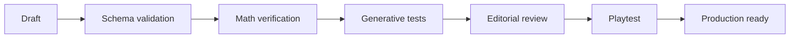

## Validación estática

- schema JSON/TS correcto;
- IDs únicos;
- interaction type existente;
- categorías válidas;
- unidad declarada;
- feedback definido;
- tags de año/dificultad.

## Validación matemática

Para cada instancia o rango:
- resolver mediante solver/evaluator interno;
- enumerar soluciones cuando sea viable;
- confirmar función objetivo;
- comprobar tolerancias;
- verificar redondeo;
- comprobar que distractores no son equivalentes.

## Validación procedural

Ejecutar N seeds por template. Valor inicial recomendado: 1.000 para templates simples; mayor si el espacio paramétrico es amplio.

Recolectar:
- min/max parámetros;
- cantidad de soluciones;
- dificultad estimada;
- tamaño de textos generados;
- distribución de opción óptima.

Evitar que la opción correcta caiga sistemáticamente en la misma posición.

## Validación editorial

- contexto entendible sin explicación externa;
- texto breve;
- objetivo concreto;
- unidades visibles;
- ningún dato esencial escondido accidentalmente;
- datos irrelevantes sólo cuando son intencionales;
- tono apropiado.

## Validación en UI

- cabe en 360 px;
- no overflow con números máximos;
- formato de moneda/unidades consistente;
- gráficos legibles;
- estados de error visibles.

## Playtest

> **Antes de la feria, esta etapa es prueba proxy.** La primera exposición a estudiantes del rango objetivo es la feria misma; la validación formal previa es la del Departamento de Matemática. Ver [ciclo de entrega real](00-product/real-delivery-lifecycle.md) y [gates docentes](06-delivery/teacher-gates.md). Las preguntas siguen sirviendo con un adulto que juegue sin asistencia verbal; lo que no se puede es llamar validado a lo que se observó así.

Preguntas al observador:
- ¿el jugador supo qué debía hacer?
- ¿qué cálculo/modelo usó?
- ¿entendió el feedback?
- ¿discutió la decisión?
- ¿pareció un ejercicio escolar tradicional?

Un challenge con matemática correcta pero gameplay pobre no está listo.

## Del desafío al catálogo

Este pipeline editorial valida **un desafío**. Desde STAGE-03, el pipeline de [ADR-020](03-architecture/adr/ADR-020-variant-generation-and-approved-catalog.md) agrega sobre la población concreta invariantes transversales, chequeos matemáticos por plantilla, fingerprint canónico, deduplicación, integridad del catálogo y auditoría estadística. Eso ya se aplica al catálogo aprobado de desarrollo vigente `grade-7-dev-6`, que además alimenta gameplay: las 159 entradas de `dev-4` y las 26 variantes de recuperación de `dev-5`, con el mural rebalanceado bajo `contentVersion 0.10.0-grade-7`. Desde STAGE-08 / Phase 1 el mismo pipeline construye `grade-1-dev-1` para `7.º → 1.º`, con gates de autoría ejecutables por Template —witnesses de cada nivel, señuelos del Intrinsic Math Gate, Estilo independiente de la calidad— y un witness óptimo probado para cada variante aprobada ([detalle](01-game-design/grade-1-template-design.md#implementación-runtime-phase-1)).

Una plantilla ordinaria no queda incompleta por declarar `none`: el ruteo de recuperación se decide por plantilla y debe tener una razón pedagógica. Cuando declare recovery, se valida como contenido aprobado y debe aislar matemática relevante al error de origen. El [contrato de auditoría posterior a 1.º](04-quality/post-grade-1-scalability-audit.md) ejerce explícitamente `classroom-layout` y `rehearsal-schedule` fallidas dentro de una etapa y verifica que el único repaso estructural siga siendo coherente; valida la semántica de producto cerrada: uno seleccionado, debrief del resto y cierre total.

La comparabilidad por bandas y la auditoría determinista del armado de runs están implementadas desde STAGE-05; STAGE-06 agregó el score competitivo candidato y su auditoría reducida. Todavía faltan la calibración docente/empírica y el congelamiento del catálogo oficial de feria; no se deducen de que una población sea matemáticamente válida, de que su carga estructural sea pareja ni de que una fórmula cumpla sus invariantes. Ver [validación y auditoría de variantes](04-quality/variant-validation-and-audit.md), [auditoría de equidad competitiva](04-quality/competition-fairness-audit.md), [ADR-022](03-architecture/adr/ADR-022-difficulty-model-and-run-composer.md) y [ADR-023](03-architecture/adr/ADR-023-competitive-score-policy.md).

## Full-Career Cross-Content Audit

**Estado: DONE en diseño.** Product Pass del 9 de septiembre integrado el 10 de
septiembre. [Procedencia y decisiones](07-reference/full-career-product-audit-integration.md)
y [conformidad técnica](04-quality/full-career-technical-conformance.md) preservan evidencia.
No implica contenido ejecutable, pacing empírico ni gate post-G1 aprobado.

La auditoría cruza **7.º existente + las 25 Templates futuras** de la
[matriz v0.3](01-game-design/full-career-content-matrix.md), usando las cinco
fichas y las fuentes narrativas/competitivas. Revisó:

1. Cobertura matemática y piso universal; duplicación semántica entre años.
2. Diversidad de interacciones y de razonamiento; no confundir una familia de UI
   repetida con repetir el mismo problema.
3. Independencia de Equipo/Aura y distribución de Estilo.
4. Las nueve fuentes recovery-capable, sus rutas y los `none` explícitos, con
   el máximo estructural de uno y el caso posterior a 1.º preservados.
5. Clusters Intercurso, School Event y Egreso, su máximo puntuable y compatibilidad
   con colocación, dificultad, envolvente global y preferencias de variedad.
6. Frecuencia del Project Arc: target 1–2, máximo 2 LOCKED v1 y preferencia no
   consecutiva, sin volver obligatoria su presencia como desafío.
7. Neutralidad de oportunidades raras y lógica de Prestige, incluida separación
   de evidencia y cero puntos por aparición.
8. Callbacks independientes, payoff diferido y continuidad del elenco.
9. Pacing de diseño y rejugabilidad perceptible de las primeras tres runs.
10. Riesgos de autoría, especialmente `course-project-final` y
    `next-step-options`, y convergencia de carrera en 5.º.

Su reporte debe identificar hallazgos y decisiones con fuentes, conservar la
madurez candidata cuando corresponda y actualizar el estado con evidencia. No
debe presentar simulación o revisión documental como validación empírica de los
8–10 minutos ni como implementación de las políticas nuevas.

El Product Pass también completó Rare Events / Milestones / Prestige y Career
Epilogue v1 a nivel de diseño. Reconciliación y ADR-025 cierran Phase 0; la siguiente
tarea es Phase 1 G1. La auditoría de diseño no ejecuta/reemplaza el
[gate post-G1](04-quality/post-grade-1-scalability-audit.md).

## Gates futuros de contenido y carrera completa

Cada variante debe pasar [Intrinsic Math Gate y Definition of Ready](01-game-design/content-authoring-guide.md),
solubilidad, información completa, aritmética/rounding, banda estructural,
no trivialidad, ausencia de seleccionar-todo/duplicados y legitimidad de estrategias.
La validación usa oráculo independiente y fuente aprobada, también para Repaso.
Para 1.º eso ya corre en el pipeline y en tests, incluido el witness de Math y
Equipo máximos simultáneos de la expo; lo que sigue es para 2.º–5.º y la carrera.

Scoring por Template: witness de máximos conjuntamente alcanzables, resultado
inválido bajo, componentes ausentes/presentes y ninguna evidencia duplicada.
Tests específicos: standings Math≠Aura; represent-class Math≠Aura≠Prestige;
Project Final Math≠Team≠Aura. Style nunca paga competencia.

Con contenido completo, objetivo recomendado de ≥100.000 RunPlans sintéticos y
enumeración exhaustiva donde sea pequeña: nueve beats, seis etapas, cuotas,
clusters/Project, diversidad, pacing, perfecto 10.000 y egreso. Son pruebas futuras,
no ejecutadas por esta integración. La [auditoría competitiva](04-quality/competition-fairness-audit.md)
y walkthroughs de [UX](01-game-design/ux-interaction-design.md) completan el gate;
simulación no sustituye comprensión/diversión ni revisión docente.

---

# FILE: 04-quality/final-mathematics-closure-audit.md

# Auditoría final de cierre matemático

- **Estado:** `EXECUTED` — 2026-09-20, sobre `main` en `9ce2917`
- **Gate:** `FINAL MATHEMATICS CLOSURE AUDIT`
- **Rol:** equipo de auditoría independiente, de **sólo lectura** sobre el producto
- **Entrada:** el [sprint de cierre matemático](04-quality/stage-08-mathematics-final-closure-sprint.md)
  y la taxonomía congelada de ocho familias que ese sprint declara final
- **Postura:** toda métrica se re-derivó fuera de la instrumentación del
  implementador **antes** de leer su informe. La auditoría permanente se trató
  como objeto auditado, no como fuente

## A. Veredicto

```text
FINAL MATHEMATICS CLOSURE AUDIT — PASSED WITH NON-BLOCKING FINDINGS
```

Ninguna política dentro de las ocho familias congeladas cruza a la vez el
guardarraíl automático **y** el análisis de constructo. No hay matemática
incorrecta, no hay feedback matemático materialmente falso, FairScore es exacto,
el egreso y la recuperación se sostienen, el servidor recompone y falla cerrado, y
los seis catálogos vigentes reconstruyen byte a byte.

Se emiten cinco hallazgos nuevos, **ninguno bloqueante**. Dos de ellos —MAT-FC-001
y MAT-FC-002— son defectos del **instrumento**, no del producto: la auditoría
permanente subestima la exposición de `y3.course-project-tech` en unos 33 puntos y
no evalúa ninguna política derivada de atributos en los motores de construcción.
El producto aguanta la medición corregida; el instrumento, no del todo.

## B. Baseline reconstruida

Medida, no asumida.

| Dato | Valor verificado |
|---|---|
| Rama · HEAD | `main` · `9ce2917` · worktree limpio al empezar y al terminar |
| Node · pnpm | 24.19.0 · 11.22.0 (`pnpm toolchain:check` PASS) |
| Motor · action log · snapshot | `10.0.0` · `7` · `8` |
| Score | `fair-score-dev-2@2.0.0-post-tg1-candidate` · `official=false` |
| Ruleset de carrera | `full-career@1.0.0-full-career` |
| Templates | **42** · 8 de 7.º, 34 de 1.º–5.º |
| Tests | **96** archivos · **1898** Vitest · **174** E2E |
| Auditoría permanente | 42 filas · 24 `AUDITED_EXHAUSTIVELY` · 18 `AUDITED_BY_POLICIES` · 0 bloqueadas |

Catálogos vigentes, con su población comprobada contra el artefacto en disco:

| Año | Catálogo | Contenido | Entradas | Generadores | Integridad |
|---|---|---|---|---|---|
| 7.º | `grade-7-dev-8` | `0.12.0-grade-7` | 189 | 7 | `ok` |
| 1.º | `grade-1-dev-4` | `1.3.0-grade-1` | 363 | 14 | `ok` |
| 2.º | `grade-2-dev-5` | `2.4.0-grade-2` | 512 | 20 | `ok` |
| 3.º | `grade-3-dev-5` | `3.4.0-grade-3` | 686 | 27 | `ok` |
| 4.º | `grade-4-dev-5` | `4.4.0-grade-4` | 858 | 34 | `ok` |
| 5.º | `grade-5-dev-6` | `5.5.0-grade-5` | 1031 | 41 | `ok` |

El `git diff` del sprint contra `a065023` toca **sólo** `src/content/`:
`src/game`, `src/server`, `src/app`, `src/components` y `src/styles` están
vacíos en el diff. La afirmación de la sección C del sprint se comprobó y es
cierta.

## C. Protocolo de independencia

Lo que se derivó **antes** de leer la instrumentación del implementador:

1. **Materialización propia.** Herramientas fuera del árbol, en el scratchpad,
   materializan cada variante aprobada de los seis catálogos y vuelcan
   `present([])` y los parámetros. 42 Templates, todas las variantes.
2. **Evaluador independiente.** Para `y3.course-project-tech` se escribió un
   evaluador propio en Python desde la especificación, y se contrastó contra el
   evaluador de producción sobre **las 39 325 respuestas** del espacio completo
   (25 variantes × 11 × 11 × 13): **0 discrepancias**.
3. **Economía independiente.** Para `y4.course-project-fundraiser` se
   re-derivaron costo fijo, precio, costo variable, margen, minutos de cocina,
   margen por minuto, objetivo, reserva, capacidad, techo de beneficio y punto de
   equilibrio de las 25 variantes, leyendo **sólo la pantalla**.
4. **Motor de políticas propio y corregido.** Se implementó un generador
   genérico de las ocho familias sobre la presentación, con dos correcciones
   deliberadas sobre el permanente: **todo subconjunto** de las capacidades
   impresas es un ámbito de llenado, y **toda** familia puede arrancar desde el
   piso copiado, no sólo `FIXED_PRIORITY`. 89 622 respuestas de política,
   evaluadas después de construirse.
5. **Enumeración exhaustiva propia** de los espacios de opción y de asignación:
   `y5.stage-screen`, `y5.final-trip-or-event`, `g7.group-tasks`, `g7.bus-timing`,
   `y3.transport-pass`, `g7.mural-paint`, `g7.notebook-offer`.
6. **FairScore recomputado a mano**, fuera del scorer de producción, con
   aritmética racional exacta.
7. **Sonda de manipulación propia** contra `validateSubmittedRun`.

Recién después se leyeron los informes de la remediación dirigida, la
re-auditoría de ronda 2 y el sprint de cierre. La comparación está en la sección Q.

## D. Frontera congelada

Las ocho familias, tal como el sprint las declara finales:

```text
CONSTANT · NORMALIZED · VISIBLE_COPY · TARGET_RELATIVE
RESOURCE_RELATIVE · FIXED_PRIORITY · SIMPLE_GREEDY · DOMAIN_NAIVE
```

**No se agregó una novena familia.** Todo lo medido acá cae dentro de las ocho.

Guardarraíl aplicado sin modificarlo: una política bloquea si
`media ≥ 85` **o** `óptima ≥ 80 %` **y** además **desvía materialmente el
constructo**. En `media 70–84,99` u `óptima 50–79 %` se hace análisis de
constructo y no bloquea si la política **es** razonamiento matemático buscado.

## E. `y3.course-project-tech`

### E.1 Matemática re-derivada

Las 25 variantes, con su recurso que aprieta, sus tres tasas por pieza, su piso
de feria y su techo:

- `lo prometido = techo − 1` en **25 de 25** variantes. La relación que el sprint
  declara se cumple exactamente.
- Los tres recursos son reales y encadenados: el tope efectivo de MB es
  `min(pendrive, subida × minutos de laboratorio)`.
- Planes válidos por variante: 34 a 201. Vectores óptimos por variante: 5 a 23.

### E.2 Matriz de políticas, instrumento corregido

25 variantes, 2 912 políticas puntuadas en todas ellas.

| Familia | Mejor política | Media | Óptima |
|---|---|---|---|
| `CONSTANT` | `(3,2,4)` — enumeración entera de los 1 573 vectores | **56,60** | 4,0 % |
| `NORMALIZED` | un cuarto del máximo | 41,40 | 0,0 % |
| `VISIBLE_COPY` | copiar la fila «pide la feria» | 40,00 | 0,0 % |
| `TARGET_RELATIVE` | la fila de cada ítem, por el doble | 47,00 | 4,0 % |
| `RESOURCE_RELATIVE` | fracciones de una capacidad impresa | 25,60 | 0,0 % |
| `FIXED_PRIORITY` | llenar `2>1>3` desde el piso, sin pasarse de los tres topes | **79,40** | 40,0 % |
| `SIMPLE_GREEDY` | por menor «pide la feria», desde el piso | **81,80** | 44,0 % |
| `DOMAIN_NAIVE` | sólo un ítem, hasta donde entre | 63,80 | 28,0 % |

`S` máxima entre constantes: 16,0 % en `(2,8,2)`.

### E.3 Ataques de regresión pedidos

```text
copiar lo prometido en cada casilla      10,00 ·  0 %   (inválido en toda variante)
copiar la fila «pide la feria»           40,00 ·  0 %   nunca supera `functional`
copiar los máximos                       10,00 ·  0 %
la fila de cada ítem ×2                  47,00 ·  4 %
la fila de cada ítem +1 / ×1½            42,80 ·  0 %
«prometió» repartido en tres             58,80 ·  8 %
(«prometió» − 1) en tres                 57,60 ·  0 %
25/50/75/100 % de cada máximo            ≤ 41,40 · 0 %
mejor salida por minuto de notebook      72,60 · 24 %
mejor salida por MB                      59,20 ·  4 %
mejor salida por minuto de laboratorio   59,20 ·  4 %
prioridades fijas de ítem (las seis)     77,00–79,40 · 36–44 %
```

### E.4 Escalera de exposición y análisis de constructo

```text
al azar sobre las 39 325 respuestas          13,04
cualquier plan VÁLIDO (2 401 planes)         59,74 · óptimo en 12,1 %
la mejor política de atajo                   81,80 · óptima en 44,0 %
razonamiento buscado                         99,00 · óptima en 96,0 %
```

El razonamiento buscado —cubrir el piso de la feria, probar los seis órdenes de
prioridad respetando los tres topes y quedarse con el mejor— alcanza `optimal` en
**24 de 25** y `efficient` en la restante. La afirmación E.4 del sprint se
reprodujo exacta.

**Conclusión.** La mejor política de atajo cae en la franja `70–84,99` y exige el
análisis de constructo. La política hace la aritmética completa: lee las tres
capacidades, las dos tasas por pieza de cada ítem, **convierte el rato de
laboratorio en un tope de MB** —la dependencia encadenada que el Repaso
`y3.rate-capacity-review` repara— y comprueba la factibilidad pieza por pieza. Lo
único que no hace es comparar varios órdenes y quedarse con el mejor, que es
exactamente el paso de optimización que separa `efficient` de `optimal` en la
escalera del año. **No es un bypass del constructo: es el constructo sin su
último paso**, y la escalera ya lo cobra —11 de 25 variantes quedan en
`efficient`—. **NO BLOQUEA.**

`RS-RA-002` re-verificado de forma independiente: `K 56,60 ≤ 65`, `S 16,0 % ≤ 35 %`,
**183** vectores distintos son óptimos en alguna variante (≥ 5). **PASS.**

## F. `y4.course-project-fundraiser`

### F.1 Economía re-derivada

Las 25 variantes, calculadas desde la pantalla:

- **5** multisets `(margen, minutos)` distintos en el catálogo publicado
  —`RS-CLO-002` pide ≥ 5, y se cumple—. El informe del sprint dice 6; ver
  MAT-FC-004.
- **25 firmas de orden distintas** sobre los cinco criterios
  (margen/minuto, margen, minutos, precio, costo).
- La diversidad es **matemática, no una permutación de etiquetas**: el orden por
  margen por minuto coincide con el de menos minutos en 6/25, con el de menor
  costo en 6/25, con el de mayor precio en 3/25 y con el de precio por minuto en
  4/25. En **ninguna** variante coincide con el orden por margen por bandeja.
- Punto de equilibrio: 2 a 4 bandejas. Techo de beneficio: 13 000 a 21 000.

### F.2 Matriz de políticas, instrumento corregido

409 políticas puntuadas en las 25 variantes.

| Política | Familia | Media | Óptima | Clasificación |
|---|---|---|---|---|
| margen por minuto de cocina | `SIMPLE_GREEDY` | **100,00** | 100,0 % | **ACCEPTED STRATEGY — NON-BLOCKING** (F.3) |
| razón precio/costo (markup) | `SIMPLE_GREEDY` | 83,00 | 60,0 % | franja de análisis (F.4) |
| menos minutos primero | `SIMPLE_GREEDY` | **81,80** | 44,0 % | bajo techo (F.5) |
| menor costo primero | `SIMPLE_GREEDY` | 77,40 | 48,0 % | bajo techo |
| prioridades fijas de bandeja | `FIXED_PRIORITY` | 73,40 | 48,0 % | bajo techo |
| precio por minuto (el señuelo) | `SIMPLE_GREEDY` | 72,80 | 40,0 % | bajo techo |
| repartos fijos de la cocina | `RESOURCE_RELATIVE` | 48,80 | 0,0 % | bajo techo |
| fracciones del máximo | `NORMALIZED` | 39,60 | 0,0 % | bajo techo |
| constante enumerada `(2,2,2)` | `CONSTANT` | **57,80** | — | `RS-RA-003` |

`S` máxima entre las 630 constantes: **20,0 %** en `(0,0,7)`.

### F.3 Adjudicación del margen por minuto de cocina

Se adjudicó de forma independiente, contra las tres preguntas del encargo.

1. **¿Exige leer y calcular margen y tiempo?** Sí. Exige restar
   `precio − costo` por bandeja —la resta que `y4.margin-review` existe para
   reparar—, dividir por los minutos de cocina, ordenar y llenar. Son tres pasos
   de economía de 4.º, no un tecleo.
2. **¿Es parte de la economía buscada?** Sí. La ficha del año lo declara `LOCKED`
   y los gates lo protegen por los dos lados: el mejor margen **por bandeja**
   nunca puede ser el mejor por minuto, y repartir la cocina en partes iguales no
   puede alcanzar el objetivo con colchón.
3. **¿Desvía el costo fijo, el objetivo o la reserva?** No, y la razón es
   matemática: `beneficio = Σ margen − costo fijo`, así que el costo fijo es una
   **constante aditiva** y no mueve el argmax. El objetivo y la reserva definen
   los niveles de la escalera, no la decisión. «Ignorarlos» no es saltearse una
   restricción: es que la respuesta correcta a «maximizá lo que queda» no depende
   de ellos.

No es una fuga, es la cuenta del año. Queda declarado por nombre exacto en
`INTENDED_REASONING`, con una sola entrada y sin relajar ningún techo para el
resto de las políticas de la Template.

```text
ACCEPTED STRATEGY — NON-BLOCKING
```

### F.4 La franja de 83,00 · 60 %

Cuatro nombres para el mismo orden: la razón entre el precio y el costo de cada
bandeja, o equivalentemente el margen sobre el costo. Media 83,00 —bajo el techo
de 85— y óptima 60 %, dentro de la franja `50–79 %` que pide análisis.

Exige la resta `precio − costo` y una división: **es** la mitad económica del
constructo, aplicada al denominador equivocado —la plata en lugar de la capacidad
compartida—. Falla en 10 de 25 variantes y nunca cae en `invalid`. Es una
aplicación incompleta del razonamiento buscado, no un rodeo. **NO BLOQUEA.**

### F.5 «Menos minutos primero»

```text
ronda 2   100,00 · 100,0 %
cierre     81,80 ·  44,0 %
```

Ya **no** es sistémicamente óptima, y la cifra reproduce exacta la del sprint.
`RS-RA-003` re-verificado: `K 57,80 ≤ 65`, `S 20,0 % ≤ 35 %`, **67** vectores
distintos óptimos (≥ 5). **PASS.**

## G. Excepción `y1.mobile-data` — decisión final

Medida independiente: la mejor política reusable rinde **86,00 · 44,0 %**, que
reproduce exacta la cifra declarada y respeta el techo propio de la excepción
(`media < 87`, `óptima < 50 %`).

1. **¿Qué política exactamente?** Llenar el plan respetando «Datos disponibles»,
   empezando por el material del curso y siguiendo en el orden de la pantalla,
   hasta que la capacidad tope.
2. **¿Qué familia?** `FIXED_PRIORITY`, empatada con varias `SIMPLE_GREEDY` que
   aterrizan en la misma respuesta.
3. **¿Qué información pública usa?** La capacidad en MB, los días de clase y el
   consumo por uso de cada ítem. Todo impreso.
4. **¿Desvía el constructo?** No. Hace la relación consumo/capacidad, que **es**
   lo que la banda CORE enseña. Lo que no hace es resolver el **pedido** que
   separa `optimal` de `efficient` —y el pedido viaja en el objetivo narrado, no
   en la presentación—: falla en 14 de 25 variantes.
5. **¿De dónde sale la media alta?** De la **geometría de la escalera más un piso
   estructural de planes válidos**, no de un atajo. La escalera da `efficient`
   (75) a toda producción que cubra los días, entre en la capacidad y use algo
   opcional.
6. **¿Exige matemática por variante?** Sí: la capacidad y las tasas cambian, y
   sin hacer la cuenta el plan se pasa y cae en `invalid` (10).
7. **Las cuatro líneas de base, medidas sobre el catálogo publicado:**

```text
al azar sobre las 52 650 respuestas            10,85
al azar entre los 8 125 planes que cubren       15,48
cualquier plan VÁLIDO (630 planes)              80,71 · óptimo en 28,4 %
la política de orden fijo                       86,00 · óptima en 44,0 %
razonamiento buscado (leer y cumplir el pedido) 100,00 · óptima en 100,0 %
```

La política está **5,29 puntos** por encima de «producir cualquier plan válido» y
**14 puntos** por debajo del razonamiento buscado. El piso de 78–80 se gana
haciendo la cuenta, no salteándola.

```text
ACCEPTED — LEGITIMATE/STRUCTURAL — NON-BLOCKING
```

## H. `g7.group-tasks` y `y5.final-trip-or-event`

### H.1 `g7.group-tasks`

Enumeración independiente de las 256 asignaciones × 6 equipos.

```text
mejor constante          K 45,00 · S 33,3 %   (patrón `4123`)   — reproduce el sprint
cíclicas y posicionales  ≤ 45,00 · ≤ 33,3 %
todos a la misma tarea   10,00 · 0 %
```

La constante `2-3-4-1` que MAT-RA2-004 denunciaba ya **no** domina: los patrones
óptimos del catálogo son `4123` (dos equipos), `1423`, `3412`/`2413`, `2134` y
`1342`. La asignación sigue midiendo capacidad y afinidad: el evaluador exige que
cada persona tenga horas para su tarea y compara la suma de estrellas contra el
máximo factible. La evidencia de Equipo sigue separada (`efficiency` = afinidad,
`precision` = factibilidad).

Pero dos políticas de atributo **no medidas por la auditoría permanente** rinden
por encima del guardarraíl automático:

```text
más horas → tarea más pesada     [SIMPLE_GREEDY]  90,00 · 83,3 %   (5/6 óptimas, 1 functional)
cada quien su tarea de más ★     [SIMPLE_GREEDY]  85,00 · 83,3 %   (5/6 óptimas, 1 invalid)
```

Análisis de constructo, con la línea de base estructural:

```text
al azar sobre las 256 respuestas          10,47 · óptima  0,5 %
al azar sobre las 24 permutaciones        15,00 · óptima  4,9 %
al azar entre permutaciones FACTIBLES     82,00 · óptima 70,0 %   (10 planes en 6 equipos)
razonamiento buscado                     100,00 · óptima 100,0 %
```

La causa es estructural: de las 24 permutaciones, sólo **1 o 2 son factibles** en
cada equipo (2, 2, 2, 2, 1, 1), y en dos equipos la única factible es
necesariamente la óptima. Una vez filtrado por horas casi no queda optimización
que hacer.

- «Más horas → tarea más pesada» **hace** la mitad que discrimina —el filtro de
  capacidad— y queda 8,00 puntos sobre el piso de «acertar cualquier
  permutación factible». No desvía el constructo: lo ejerce.
- «Cada quien su tarea de más estrellas» sí se saltea el filtro de horas, pero
  queda **3,00 puntos** sobre ese mismo piso y cae en `invalid` (10) en cuanto
  diverge —que es lo que pasa en `equipo-d`, el equipo que el sprint agregó
  justamente para eso—.

**Ninguna de las dos desvía materialmente un constructo que, tal como está
publicado, casi no tiene espacio que desviar.** No bloquean. La causa raíz queda
como MAT-FC-003 y la ceguera del instrumento como MAT-FC-002.

`g7.group-tasks` sigue sin recorrido E2E propio. La forma de pantalla no cambió
—cuatro personas, cuatro tareas, el mismo tablero— y el motor se ejerce en el E2E
de carrera completa y en el de 7.º. Cobertura suficiente, no específica.

### H.2 `y5.final-trip-or-event`

Enumeración independiente de las 4 opciones × 25 variantes.

```text
mejor constante                 K 59,40 · S 28,0 %   (`ciudad`)
elegir el paquete con más lugares  66,00 · 24,0 %   — era 100,00 · 100 %
la opción más cara                 75,00 ·  0,0 %   — `efficient` en las 25, nunca óptima
el menor número de días            57,80 · 28,0 %
la primera / la última opción      52,00 / 55,40 · 20,0 / 28,0 %
```

Los lugares ya **no** delatan la respuesta: pasaron de depender del papel del
paquete a depender de la posición, que rota contra el papel. «Más lugares» cae de
100,00 a 66,00. `RS-CLO-003` **PASS**.

## I. Validación de la auditoría permanente

### I.1 Matriz de capacidad

42 filas, todas con modo y razón escrita; 0 bloqueadas, 0 sin soporte.
24 `AUDITED_EXHAUSTIVELY`, 18 `AUDITED_BY_POLICIES`. Ninguna fila queda «cubierta»
sin políticas ni enumeración. Verificado contra mi clasificación esperada por
motor: coincide en las 42.

Constantes re-enumeradas de forma independiente y **coincidentes al centésimo**:

| Template | K medida | S medida | Contrato |
|---|---|---|---|
| `y5.stage-screen` | 78,00 | 40,0 % | `RS-MAT-008` |
| `g7.bus-timing` | 84,62 | 57,7 % | riesgo aceptado H-6 |
| `g7.mural-paint` | 67,69 | 53,8 % | `RS-MAT-006` (K ≤ 73) |
| `y3.transport-pass` | 64,20 | 28,0 % | `RS-MAT-001` |
| `y5.final-trip-or-event` | 59,40 | 28,0 % | bajo techo |
| `g7.notebook-offer` | 58,46 | 53,8 % | franja de inspección |
| `y4.course-project-fundraiser` | 57,80 | 20,0 % | `RS-RA-003` |
| `y3.course-project-tech` | 56,60 | 16,0 % | `RS-RA-002` |
| `g7.group-tasks` | 45,00 | 33,3 % | MAT-RA2-004 |

### I.2 Fuga de oráculo

**No hay.** Los tres módulos de política —`blind-strategy-reading.ts`,
`blind-strategy-policies.ts`, `blind-strategy-space.ts`— importan únicamente
tipos de `@/game` y entre sí, y **no contienen una sola referencia** a `params`,
a un solucionador, a una respuesta esperada, a `.evaluate(` ni a ningún
`templateId`. El orquestador construye la respuesta primero y la evalúa después:
no existe realimentación de la calidad hacia la elección.

Determinismo: cinco corridas consecutivas producen las mismas 42 filas.

### I.3 Detección de la clase histórica

La auditoría actual **sí** detecta y nombra las clases viejas:

```text
y3 · «copiar el número de la fila de cada ítem»          [VISIBLE_COPY]   40,00 · 0 %
y4 · «llenar «Cocina» por menor min»                     [SIMPLE_GREEDY]  81,80 · 44 %
y4 · «llenar «Cocina» por mayor $ #2 − #1 por min»       [SIMPLE_GREEDY] 100,00 · 100 %
g7.group-tasks · constantes enumeradas enteras           [CONSTANT]       45,00 · 33,3 %
```

Ninguna de esas políticas está escrita contra una Template: todas salen del
parser genérico de la presentación.

### I.4 Dónde el instrumento falla

Dos defectos reales, documentados como MAT-FC-001 y MAT-FC-002 en la sección P.
El resumen: el instrumento es **conservador por debajo** —subestima, nunca
sobreestima—, así que un PASS suyo no prueba tanto como parece, pero tampoco
esconde un aprobado falso en el sentido contrario.

## J. Regresión de contratos históricos

| Contrato | Evidencia independiente | Resultado |
|---|---|---|
| `RS-MAT-001` `y3.transport-pass` | K 64,20 · S 28,0 % · enumeración propia de las 4 opciones × 25 | PASS |
| `RS-MAT-002/003/004` `y2.course-project-survey` | K 52,80 ≤ 60 · S 32,0 % ≤ 35 % (fila de la auditoría, motor `classification` enumerado entero) | PASS |
| `RS-MAT-005` `y2.standings-claim` | K 56,60 ≤ 65 · S 20,0 % ≤ 35 % | PASS |
| `RS-MAT-006` `g7.mural-paint` | K 67,69 ≤ 73 · enumeración propia · balance 2 L / 4 L | PASS |
| `RS-MAT-007` `y4.represent-class` | «todo No entra» 40,00 · nunca llega a `efficient` | PASS |
| `RS-MAT-008` `y5.stage-screen` | **K 78,00 · S 40,0 %** · numerador 1950/25 · sección L | PASS · **sin deriva** |
| `RS-MAT-009` `y5.next-step-options` | K 40,00 ≤ 65 · S 16,0 % ≤ 35 % | PASS |
| `RS-MAT-011` `y4.course-project-fundraiser` | consigna, punto de equilibrio (2–4 bandejas), reserva y supuesto de venta total re-derivados desde la pantalla | PASS |
| `RS-NEW-001` `y5.course-project-final` | K 56,80 ≤ 65 · S 28,0 % ≤ 35 % | PASS |
| `RS-NEW-002` `g7.notebook-offer` | comparación verdadera en pesos · enumeración propia de las 2 × 26 | PASS |
| `RS-NEW-003` Repasos direccionales | barrido de feedback por condición de rama | PASS |
| `RS-NEW-006` ficha de 2.º | contraste documental: las cuatro formas del schema (`denominator`, `missing-data`, `margin`, `high-response`) y la regla de publicación coinciden con la ficha | PASS (documental) |
| `RS-RA-AUDIT-001` | 42 filas con categoría y razón · 0 sin soporte · **sin fuga de oráculo** (I.2) | PASS |
| `RS-RA-001` `g7.bus-travel-review` | **3 146 respuestas enumeradas** (26 × 121): la rama de concepción errónea aparece **exactamente** donde `respuesta === demora sola`, en las 26 variantes, y en ninguna otra | PASS |
| `RS-RA-002` `y3.course-project-tech` | K 56,60 ≤ 65 · S 16,0 % ≤ 35 % · 183 vectores óptimos distintos ≥ 5 | PASS |
| `RS-RA-003` `y4.course-project-fundraiser` | K 57,80 ≤ 65 · S 20,0 % ≤ 35 % · 67 vectores óptimos distintos ≥ 5 | PASS |
| `RS-RA-TEST-001` | 2 `pnpm verify` consecutivos en verde, sin flake | PASS |
| `RS-CLO-AUDIT-001` | taxonomía declarada por Template · ninguna fila vacía · categoría A corre constante **y** políticas | PASS con salvedad (MAT-FC-002) |
| `RS-CLO-001` | ninguna política medida por el instrumento cruza los techos salvo lo declarado | PASS · ver MAT-FC-002 para su alcance |
| `RS-CLO-002` | `y3` `VISIBLE_COPY` nunca óptima (0/25) · `y4` menos-minutos 81,80 · 44 % · **5** economías distintas (≥ 5) | PASS |
| `RS-CLO-003` | `g7.group-tasks` 6 variantes, K 45,00 · S 33,3 % · `y5.final-trip` ya no se resuelve por lugares (66,00 · 24 %) | PASS |

## K. Congelamiento de `y5.stage-screen`

La prueba **no** se reabrió. Se verificó sólo la deriva, por enumeración propia
de las 6 opciones × 25 variantes:

```text
K = 78,00   la opción «que entre entera»: efficient en 22, optimal en 3
            numerador entero 22 × 75 + 3 × 100 = 1950 · 1950 / 25 = 78,00 exacto
S = 40,0 %  «llenar el ancho y recortar mitad y mitad»: optimal en 10 de 25
N = 25 variantes publicadas
```

El alcance de la excepción del witness no cambió. **Sin deriva.**

## L. Barrido final de verdad del feedback

Se enumeró el espacio de respuesta completo de las Templates tocadas y del Repaso
que `RS-RA-001` gobierna, y se contrastó **cada texto afirmativo** contra la
condición de su rama, con aritmética independiente:

| Template | Respuestas verificadas | Afirmaciones falsas |
|---|---|---|
| `y3.course-project-tech` | 39 325 | **0** |
| `y4.course-project-fundraiser` | 15 750 | **0** |
| `g7.bus-travel-review` | 3 146 | **0** |
| **Total** | **58 221** | **0** |

Cubre los cinco hechos numéricos de `y3` (notebook, pendrive, subida, piezas,
acuerdos), los cuatro de `y4` (costo fijo, cocina, queda, objetivo), las cuatro
restricciones violadas de `y3`, las dos de `y4`, y los cuatro niveles de
consecuencia de cada una. También se comprobó que la rama de concepción errónea
del Repaso del colectivo no aparece en ninguna respuesta que no sea la demora
sola.

**Ninguna afirmación matemática materialmente falsa.**

## M. FairScore, egreso y recuperación

### M.1 FairScore recomputado fuera del scorer

Con aritmética racional exacta, desde el contrato y no desde el código:

```text
pesos          math 8500 · team 1000 · aura 500 = 10 000 bp   →  85 / 10 / 5
escalera       optimal 10000 · efficient 7500 · functional 4000 · invalid 1000
dificultad     core 10000 · standard 10800 · stretch 11500   (sólo sobre Math)
topes          math 10000 · team 10000 · aura 10000
Estilo         no es componente: no existe en el agregado
```

Perfecto = **10 000 exacto** en las 16 formas probadas (banda × cantidad de beats
× con/sin oportunidad de Equipo × con/sin oportunidad de Aura). La
renormalización de oportunidad reparte el peso de los componentes ausentes, que es
lo que hace que 8 beats sin Equipo ni Aura también den 10 000.

Casos de control recomputados a mano y coincidentes: `efficient` con Equipo y Aura
perfectos = 7 875 = 0,85 × 7 500 + 0,10 × 10 000 + 0,05 × 10 000.

### M.2 El comando canónico corrobora

`pnpm game:score`: 23 000 planes, política
`fair-score-dev-2@2.0.0-post-tg1-candidate`.

```text
perfecto        min 10000 · media 10000 · max 10000 · dispersión 0 · distintos 1
por forma       1 beat / 2 beats / 8 beats / 12 beats → 10 000 en las cuatro
con y sin oportunidad de Equipo     10 000 en los dos casos
con y sin oportunidad de Aura       10 000 en los dos casos
empates de redondeo                 0
```

### M.3 Egreso y recuperación

`pnpm game:simulate:deep`: 5 000 runs, `--verify=5`.

```text
completadas     5000 / 5000
egresadas       5000 / 5000
eventos         42 149 · 8,43 por run
recuperaciones  2 149 en total · peor caso 1 por etapa
previas         2 033
hallazgos       0
```

`maxRecoveriesPerStage = 1` respetado en las 5 000, sin recursión; los Repasos
aportan puntaje competitivo 0. La graduación no depende del desempeño: el
contrato de fail-forward se sostiene.

## N. Replay, servidor, catálogos y versiones

Sonda de manipulación propia contra `validateSubmittedRun`, con una carrera
completa jugada en óptimo (`score 13254`, `fairScore 10000`, `graduated true`):

```text
sin tocar nada                        ACEPTADA · recomputada 13254 · fair 10000
contentVersion vieja (5.4.0)          RECHAZADA unsupported-version (contentVersion)
variantCatalogVersion vieja (dev-5)   RECHAZADA unsupported-version (variantCatalogVersion)
planFingerprint forjado               RECHAZADA unsupported-version (planFingerprint)
gameVersion inexistente (99.0.0)      RECHAZADA unsupported-version (gameVersion)
version de action log 6               RECHAZADA unsupported-version (actionLogVersion)
ruleset distinto                      RECHAZADA unsupported-version (rulesetVersion)
scoreVersion inexistente              RECHAZADA unsupported-version (scoreVersion)
semilla hostil                        RECHAZADA unsupported-version (planFingerprint)
run truncada                          RECHAZADA replay-mismatch
acción inyectada en el medio          RECHAZADA invalid-command
payload malformado                    RECHAZADA invalid-command
score declarado por el cliente        IGNORADO · el servidor recompone 13254 igual
```

El log del cliente lleva **sólo** `{version, descriptor, actions}`: no existe un
campo de puntaje que un cliente pueda mandar. Inyectar `score`, `officialScore` y
`descriptor.totalScore` en 999 999 no mueve nada. La semilla hostil se rechaza
porque el servidor **recompone el plan desde la semilla** y compara la huella.

Catálogos: los seis reconstruyen con `integrity ok` y su población aprobada
coincide con el artefacto (189 / 363 / 512 / 686 / 858 / 1031). Las direcciones
semánticas son únicas —los duplicados se rechazan en la aprobación, 26 a 80 por
año—.

Diff de catálogos, con su causa aguas arriba:

| Catálogo | Causa del cambio | Población |
|---|---|---|
| `grade-7-dev-8` | cuatro equipos autorados nuevos de `g7.group-tasks` (2 → 6) | 185 → 189 |
| `grade-1-dev-4` | generador `y1.mobile-data` 1 → 2, más la identidad de 7.º | 359 → 363 |
| `grade-2-dev-5` | identidad combinada aguas arriba | 508 → 512 |
| `grade-3-dev-5` | generador `y3.course-project-tech` 2 → 3 | 682 → 686 |
| `grade-4-dev-5` | generador `y4.course-project-fundraiser` 2 → 3 | 854 → 858 |
| `grade-5-dev-6` | generador `y5.final-trip.packages` 1 → 2 | 1027 → 1031 |

El `+4` es el mismo en los seis y se explica entero: son los cuatro equipos nuevos
de 7.º propagándose por los conjuntos acumulativos. Las regeneraciones de `y1`,
`y3`, `y4` y `y5` **reemplazan** variantes, no las suman. Cada bump de generador
corresponde a un cambio real del espacio de generación, verificado en el código.
Las siete versiones históricas de 7.º siguen en disco sin editar. La deuda
`R-S09-CAT` no empeoró y no se tocó.

## O. Accesibilidad

El sprint no tocó `src/components`, `src/app` ni `src/styles` —comprobado con
`git diff`—, así que esto es regresión.

- **174 / 174** E2E en verde en las dos corridas de `pnpm verify`.
- `y3.course-project-tech` recorrida a **320 / 360 / 390 / 412 / 1280 px** con
  reflow sin desborde horizontal de página, objetivos de 44 px, navegación por
  teclado, foco movido al encabezado del feedback y axe sin violaciones; a
  1280 px además con zoom CSS 200 %.
- `y4.course-project-fundraiser` a los mismos cinco anchos, con las tres
  condiciones y el punto de equilibrio, más zoom 200 %.
- `post-g1-accessibility-audit.spec.ts` a 320 / 360 / 390 / 412 / 1280 con zoom 1 y 2.
- `g7.group-tasks` sin recorrido propio; ver H.1.

Nada impide leer ni resolver la matemática. **Sin regresión.**

## P. Hallazgos

Ninguno bloqueante. Ninguno abre otro ciclo de remediación de IA.

### MAT-FC-001 · HIGH · la auditoría subestima `y3.course-project-tech`

`resourceModels` ata un vector de costos a **cualquier** capacidad impresa cuya
unidad **se llame** igual, sin comprobar que signifique lo mismo. En
`y3.course-project-tech` la pantalla imprime dos restricciones en minutos
—«Notebook prestada · 30 minutos» y «Laboratorio · 8 minutos»— y el detalle de
cada ítem imprime «N min de notebook». El lector normaliza las dos a `min`, así
que se construye un modelo espurio «Laboratorio ≤ 8 min» contra los costos en
minutos **de notebook**, que son de otra magnitud.

Efecto: el ámbito «sin pasarse de ningún límite» queda sobre-restringido y toda
política de llenado se corta cuatro veces antes de tiempo.

```text
lo que informa la auditoría permanente   47,00 ·  4 %
lo que mide el instrumento corregido     79,40 · 40 %   (FIXED_PRIORITY desde el piso)
                                         81,80 · 44 %   (SIMPLE_GREEDY por «pide la feria»)
```

Unos 33 puntos de subestimación en una Template `anchor` puntuable. Se revisaron
las **ocho** Templates de cantidades y presupuesto: `y3.course-project-tech` es la
**única** con esta colisión de unidades. El producto aguanta la medición corregida
(sección E.4), así que no bloquea; el instrumento necesita que un modelo de
recurso se ate a la magnitud, no al nombre.

### MAT-FC-002 · HIGH · la taxonomía no está implementada en los motores de construcción

Las ocho familias son genéricas sólo para `quantity-builder`/`budget-builder`, los
motores de opción y `numeric-input`. Para `assignment-board`, `schedule-builder`,
`spatial-layout` y `number-grid` las políticas son listas **escritas a mano** de
patrones posicionales e ingenuos —«nada asignado», «todo a la primera persona»,
«cíclica», «equilibrada», «fila a fila», «lo más temprano posible»— y **ninguna**
sale de los atributos que la pantalla imprime por agente, por tarea o por celda.
Sólo `route-builder` lleva una `SIMPLE_GREEDY` («vecino más cercano»).

Demostrado sobre `g7.group-tasks`: dos políticas de una sola razón visible rinden
**90,00 · 83,3 %** y **85,00 · 83,3 %**, por encima de los dos umbrales
automáticos del propio sprint, y la auditoría permanente **no las ve**. `RS-CLO-001`
pasa ahí de forma vacua.

Son 13 de las 42 Templates las que corren sobre motores de construcción. El
análisis de constructo de H.1 muestra que en `g7.group-tasks` no hay bypass
material, y las otras tres de `assignment-board` informan medias muy por debajo
del techo (72,40 · 0 %, 42,40 · 36 %, 15,42 · 0 %), pero eso es una conclusión
sobre las cifras que hay, no sobre las que el instrumento no sabe producir.

### MAT-FC-003 · MEDIUM · el conjunto factible de `g7.group-tasks` es degenerado

De las 24 permutaciones, sólo **1 o 2 son factibles** en cada uno de los seis
equipos (2, 2, 2, 2, 1, 1), y en `equipo-e` y `equipo-f` la única factible es por
fuerza la óptima. Acertar cualquier permutación factible ya promedia **82,00** con
**70 %** de óptimas.

La Template declara `optimization: 2` y `selection: 2` y se describe como «el más
exigente del año… buscando el mejor, no uno que funcione», pero una vez aplicado
el filtro de horas casi no queda búsqueda. Es la causa raíz de las dos cifras de
MAT-FC-002 y la razón por la que **no** son un bypass. No es matemática
incorrecta ni feedback falso: es calibración de contenido. **Revisión humana.**

### MAT-FC-004 · LOW · tres cifras del informe del sprint no reproducen

Ninguna toca un contrato.

| Informe | Medición independiente |
|---|---|
| §F.2: «6 multisets `(margen, minutos)` distintos» | **5**. La economía `[(1200,10), (5000,20), (6000,40)]` no está representada en el catálogo publicado. `RS-CLO-002` pide ≥ 5 y se cumple |
| §I.2: «cualquier plan válido 78,63 · óptimo en 19,9 %» | **80,71 · 28,4 %** sobre los 630 planes válidos. El 19,9 % sale de dividir por 900 en vez de por 630. La corrección **refuerza** la aceptación: la política queda 5,29 puntos sobre el piso, no 7,4 |
| §H.2: «el señuelo del precio rinde 77,60 · 48 %» | precio por minuto de cocina mide **72,80 · 40 %**; menor-costo-primero mide **77,40 · 48 %** |

### MAT-FC-005 · LOW · población desbalanceada en `y3.course-project-tech`

De las 25 variantes aprobadas, **18 son `notebook-corta`**, 4 `pendrive-corto` y 3
`laboratorio-corto`. El gate de dirección exige que cada dirección juegue su papel
y lo cumple, pero el filtro de aprobación deja los tres papeles muy desparejos.

Es determinista y canónico —no es un problema de integridad de catálogo—, y es
parte de por qué un solo orden de prioridad fijo llega a 40–44 % de óptimas: con
la notebook apretando en 18 de 25, «lo barato en minutos primero» acierta seguido.
**Backlog / hardening futuro.**

### Observación · `g7.group-tasks` sin E2E propio

Anotada ya por el sprint. La forma de pantalla no cambió y el motor se ejerce en
el E2E de carrera completa y el de 7.º. Cobertura suficiente, no específica.

## Q. Comparación con el informe del sprint

Sólo después de la derivación independiente.

**Coincide exacto:**

```text
y3.course-project-tech   K 56,60 · S 16,0 %              ✓
y4.course-project-fundraiser K 57,80 · S 20,0 %          ✓
y4 · menos minutos primero  81,80 · 44,0 %               ✓
y4 · margen/minuto         100,00 · 100,0 %              ✓
y1.mobile-data              86,00 · 44,0 %               ✓
g7.group-tasks           K 45,00 · S 33,3 %              ✓
y5.final-trip-or-event   K 59,40 · S 28,0 % · lugares 66,00 · 24,0 %  ✓
y5.stage-screen          K 78,00 · S 40,0 % · numerador 1950/25       ✓
g7.bus-timing            K 84,62 · S 57,7 %              ✓
g7.mural-paint           K 67,69 · S 53,8 %              ✓
y3.transport-pass        K 64,20 · S 28,0 %              ✓
razonamiento buscado de y3: optimal en 24/25             ✓
cobertura 42 filas · 24 exhaustivas · 18 por políticas   ✓
motor 10.0.0 · action log 7 · snapshot 8 · FairScore     ✓
96 archivos · 1898 Vitest · 174 E2E                      ✓
perfecto = 10 000 exacto · 5000/5000 egresadas           ✓
RS-RA-001 · 26 × 121 = 3146 respuestas                   ✓
```

**No coincide:**

```text
y3 · mejor política de atajo    informa 47,00 · 4 %   mide 81,80 · 44 %   → MAT-FC-001
y4 · economías distintas        informa 6             mide 5              → MAT-FC-004
y1 · piso de planes válidos     informa 78,63 · 19,9 %  mide 80,71 · 28,4 % → MAT-FC-004
y4 · señuelo del precio         informa 77,60 · 48 %  mide 72,80 · 40 %   → MAT-FC-004
g7.group-tasks · mejor política informa 10,00 · 0 %   mide 90,00 · 83,3 % → MAT-FC-002
```

Las cinco diferencias apuntan al mismo sitio: el instrumento, no el producto. Las
dos primeras filas de la lista son subestimaciones; ninguna es una sobreestimación
que hubiera escondido un aprobado falso.

## R. Rendimiento

Cinco corridas de `pnpm game:blind-audit -- --timing`, Node 24.19.0:

```text
1152,3 · 1157,7 · 1167,3 · 1171,0 · 1184,6 ms

min 1152,3   mediana 1167,3   max 1184,6   rango 32,3 ms
```

Contra la mediana de 1191,8 ms del sprint: deriva benigna de −24 ms, dentro del
ruido. Determinista —las 42 filas y sus cifras son idénticas en las cinco—.
Practicable en CI.

## S. Verificación

| Comando | Resultado |
|---|---|
| `pnpm toolchain:check` | PASS · Node 24.19.0 · pnpm 11.22.0 |
| `pnpm verify` × 2 | **PASS · PASS** · 96 archivos · 1898 Vitest · 174 E2E en las dos · **sin flake** |
| `pnpm game:validate-content` | PASS · 8 challenges · 10 storylets · 200 semillas · 0 errores · 0 warnings |
| `pnpm game:variants check` y `--content=grade-1…5` | PASS · `integrity ok` en los seis · poblaciones 189/363/512/686/858/1031 |
| `pnpm game:blind-audit -- --coverage --keys` | 42 filas · 24 exhaustivas · 18 por políticas · 0 bloqueadas |
| `pnpm game:blind-audit -- --timing` × 5 | 1152,3–1184,6 ms · mediana 1167,3 ms |
| `pnpm game:simulate:deep` | 5000/5000 completadas y egresadas · 0 hallazgos · peor caso 1 recuperación |
| `pnpm game:score` | 23 000 planes · perfecto 10 000 exacto · dispersión 0 · 0 empates |
| `pnpm test:e2e:only` | 174 passed (dentro de cada verify) |
| `node scripts/validate-agent-workspace.mjs` | PASS · 6 skills · 244 archivos documentados |
| `node scripts/sync-master-spec.mjs --check` | PASS · 124 fuentes autoritativas |
| `git diff --check` | limpio |

Ningún gate se re-corrió para esconder una falla. Las dos corridas de `verify`
dieron el mismo resultado a la primera.

## T. Limitaciones

Lo que esta auditoría **no** cierra, y a dónde va:

1. **Los motores de construcción quedaron auditados por debajo.** MAT-FC-002. Mi
   propio ataque por atributos cubrió `assignment-board` con una codificación
   una-persona-una-tarea, que sirve para `g7.group-tasks` pero **no** representa
   el espacio real de `y1.course-project-expo`, `y2.intercurso-plan` ni
   `y4.shift-coverage` —tienen más tareas que agentes, tareas opcionales y
   asignación múltiple—. Sus cifras informadas están lejos del techo, pero no las
   re-derivé con una codificación correcta. `spatial-layout`, `schedule-builder` y
   `number-grid` tampoco se atacaron por atributos. **Hardening futuro.**
2. **Validez curricular y pedagógica.** Si las Templates enseñan lo que dicen
   enseñar, al nivel declarado, es una pregunta humana. **Revisión humana.**
3. **Pacing empírico.** Cuánto tarda una persona real, y si la franja
   `efficient` se siente justa, no se puede medir acá. **Jugadores reales.**
4. **La calibración de `g7.group-tasks`.** MAT-FC-003: el conjunto factible
   degenerado es una decisión de contenido, no un defecto de motor. **Revisión
   humana.**
5. **Franjas de inspección heredadas.** `y1.classroom-layout` (64,00 · 60 %),
   `g7.notebook-offer` (58,46 · 53,8 %), `g7.bus-timing` (H-6, 84,62 · 57,7 %) y
   `y1.scale-fit-review` (H-7) siguen documentados y sin deriva. **Sin reabrir.**
6. **Verosimilitud narrativa** (H-8 / H-9) y la retención histórica de catálogos
   (`R-S09-CAT`, STAGE-09). **Sin tocar.**

## U. Recomendación de gate

Ninguna Template puntuable admite hoy una política reutilizable de baja
complejidad que cruce el guardarraíl **y** desvíe materialmente el constructo. No
hay matemática incorrecta, feedback falso, falla de FairScore, de replay, de
servidor ni de integridad de catálogo. Ningún contrato `LOCKED` se violó.

```text
AI MATHEMATICS DEPARTMENT PROVISIONAL SIGN-OFF — READY
```

Con una recomendación explícita para quien ejecute ese sign-off: **MAT-FC-001 y
MAT-FC-002 deberían cerrarse antes de que la auditoría permanente se siga usando
como reja de regresión desatendida.** No bloquean este gate —el producto aguanta
la medición corregida—, pero el instrumento mide menos de lo que su informe dice
medir, y un PASS futuro suyo valdrá lo que valga su cobertura.

Esta auditoría **no** ejecutó el sign-off provisional, **no** ejecutó la revisión
humana, **no** marcó STAGE-08 como `DONE`, **no** remedió producto y **no** amplió
la taxonomía.

## Estado canónico resultante

```text
STAGE-08 — IN_PROGRESS

Round-1 Mathematics Remediation           — DONE
Independent Mathematics Re-Audit Round 1  — FAILED
Post-Re-Audit Findings Adjudication       — DONE
Targeted Mathematics Remediation Round 2  — DONE
Independent Mathematics Re-Audit Round 2  — FAILED
STAGE-08 Mathematics Final Closure Sprint — DONE
Final Mathematics Closure Audit           — PASSED

AI Mathematics Department Provisional Sign-Off — NEXT
Human Mathematics Department Review            — DEFERRED
Real-player pacing validation                  — PENDING
```

---

# FILE: 04-quality/full-career-implementation-audit.md

# Auditoría de implementación de carrera completa

- **Estado:** `REQUIRED · EXECUTED` — ejecutado el 2026-09-16 sobre la carrera
  real 7.º → 5.º, con el catálogo aprobado `grade-5-dev-2`
- **Cuándo:** al terminar la integración de carrera completa, antes de declarar
  cerrada cualquier obligación de STAGE-08
- **Veredicto:** `PASS WITH REQUIRED HARDENING — RESOLVED`

Un único veredicto, y es éste. Cuatro defectos técnicos acotados aparecieron
durante el gate y se corrigieron dentro de él; ninguna decisión de producto
cerrada se reabrió y ninguna calibración de score, dificultad u oportunidad
competitiva se movió.

## Qué se auditó

La carrera real, no un fixture: `createFullCareerRunDescriptor` compone los
nueve beats del presupuesto sobre las seis etapas usando las 42 Templates
publicadas, y `createFullCareerDependencies` las juega con eventos raros,
Prestige, hitos, callbacks y epílogo.

| Frontera | Cómo se comprobó |
|---|---|
| Composición | nueve beats en seis etapas, un anchor por año, cluster máximo 1, arco Proyecto 0–2 y no consecutivo, cuotas de banda y pacing, validador independiente sobre cada plan |
| Costo | 300 carreras: p50 384 ms, p95 404 ms, peor caso 434 ms, 0 fallas, 0 planes inválidos |
| Variedad | las 28 Templates elegibles aparecen a lo largo del barrido; seeds distintas dan planes distintos |
| Evidencia separada | Math, Equipo y Aura se leen de campos distintos de la respuesta; una carrera perfecta llega a **10 000** exactos |
| Estilo | cada Template con estilo deja ≥ 2 ejes con la matemática óptima en **todas** sus variantes aprobadas; jugar siempre óptimo produce estilos dominantes distintos |
| Rareza | presupuesto de 2 apariciones respetado, elegibilidad contextual y no por rendimiento, un evento raro no mueve el puntaje |
| Prestige | techo ofrecido 0 declarado; el servidor recompone el mismo desglose; aparecer no otorga nada |
| Repaso | máximo uno por etapa, fuera de FairScore, egreso garantizado incluso con todo mal |
| Epílogo | orden canónico, saliencia determinista, dimensiones ausentes no dibujadas como ceros |
| Replay y servidor | log → replay → `validateSubmittedRun` reproduce puntaje, Prestige y cierre bajo seis políticas de juego |
| Accesibilidad | los nueve beats y el epílogo a 320 px, teclado puro, objetivos de 44 px, axe `wcag22aa` sin violaciones |

## Hallazgos y resolución

| # | Hallazgo | Impacto | Resolución |
|---|---|---|---|
| 1 | La carrera perfecta puntuaba 9085–9096, no 10 000: ninguna variante garantizaba que una respuesta óptima dejara además el Equipo máximo, ni que alguna postura llegara al máximo de Aura | Alto · el techo de FairScore era inalcanzable por construcción | Gates de autoría nuevos en las Templates con Equipo y con Aura; los catálogos se republicaron como `-dev-2`. No se tocó la ScorePolicy (D-S08-088) |
| 2 | Con la lista completa de objetivos blandos, los criterios lexicográficos producían un ganador único: 300 carreras usaban 12 de 28 Templates y las tres primeras runs eran el mismo contenido | Alto · rejugabilidad | La carrera usa sólo `template-freshness`; las restricciones duras ya llevan los pisos de variedad (D-S08-082) |
| 3 | `createRuleset` descartaba silenciosamente la política de rareza: 400 carreras daban 0 eventos raros | Medio · la capacidad existía y no corría | La política se copia al ruleset devuelto y entra en su huella |
| 4 | El detalle de una opción no podía encogerse y empujaba la fila fuera de una pantalla de 320 px en las tarjetas de decisión | Medio · piso de reflow `LOCKED` | El detalle baja a su propio renglón cuando no entra (D-S08-089) |

Además, dentro del gate: el epílogo dejó de dibujar `Prestige 0` cuando la
edición no ofreció ninguna oportunidad —presentar una ausencia como un cero es
exactamente lo que la regla de `null ≠ 0` prohíbe— y los callbacks de carrera se
implementaron leyendo sólo flags grabados en su año de origen.

## Asimetría conocida, no corregida

Las Templates de 7.º son anteriores al gate de autoría de Estilo y atan algunos
ejes a su nivel Math: en `g7.bus-timing`, por ejemplo, el nivel óptimo siempre
es `estratega`. A nivel carrera el efecto no se propaga —jugar siempre óptimo
produce estilos dominantes distintos según la seed— y ningún eje es mejor que
otro, que es lo que el producto cierra. Reatribuir los ejes de 7.º sería
recalibrar contenido validado sin una decisión de producto que lo pida, así que
se registra y no se toca.

## Lo que esta auditoría no dice

No dice que exista una carrera oficial: la edición es `official: false` y la
emisión de seeds, el ranking y el servidor competitivo son STAGE-09. No dice que
la calibración sea la correcta: el pacing empírico con jugadores reales y la
revisión del Departamento de Matemática siguen pendientes, y son gates de
producción de STAGE-08 que ningún test sustituye. No dice que el contenido esté
fuera de `draft`.

## Evidencia

`pnpm verify` en verde sobre `main`: 93 archivos y 1663 tests de Vitest, 146 E2E
de Playwright en desktop y mobile. Las pruebas específicas de este gate están en
`tests/integration/full-career.test.ts`,
`tests/integration/full-career-simulation.test.ts`,
`tests/integration/style-audit.test.ts`,
`tests/integration/career-callbacks.test.ts`,
`tests/unit/post-g1-composer-audit.test.ts` y `tests/e2e/full-career.spec.ts`.

---

# FILE: 04-quality/full-career-technical-conformance.md

# STAGE-08 Phase 0 — Auditoría de conformidad técnica

- Auditoría ejecutada: 2026-09-09; reporte incorporado documentalmente: 2026-09-10.
- Baseline: `main`, `147df6037ba20d04cc40a972f82d8cb1fc0754ad`.
- Dictamen: **PASS WITH MINOR CONTRACT DELTAS**; sin BLOCKER arquitectónico sin resolver.
- Alcance: lectura de código/tests/docs, sin modificaciones, instalación, commit ni push.

Este reporte preserva la auditoría entregada en la conversación, no simula una
nueva ejecución. Las decisiones de producto están en sus [fuentes canónicas](07-reference/full-career-product-audit-integration.md).
Los deltas entendidos se gobiernan en [ADR-025](03-architecture/adr/ADR-025-full-career-contract-evolution.md).

## Evidencia y hallazgos por impacto

| Hallazgo | Evidencia de baseline | Resultado / destino |
|---|---|---|
| Alto: cuotas globales no implementadas | [composer](../src/game/plan/composer.ts), [política](../src/game/plan/composition-policy.ts), [validador](../src/game/plan/plan-validator.ts) | Una pasada por etapa; variedad blanda, sin nueve beats ni cuotas globales. Validador genérico no exige las seis etapas. Extensión acotada en ADR-025. |
| Medio: debrief no representado | [recovery](../src/game/progression/recovery.ts), [transition](../src/game/runs/transition.ts) | Obligaciones múltiples, selección determinista y cierre conjunto ya existen. Falta distinguir y mostrar el debrief de no seleccionadas. |
| Medio: fallback aprobado de recovery | `recoveryContentFor` en transition | Lookup presente pero vacío cae a variantes curadas. Contradice intención approved-only de ADR-024; hardening futuro antes de G1. No se observó activación con catálogo vigente. |
| Medio: modos UI constructivos incompletos | [interacciones](../src/game/challenges/interactions.ts), [adapter](../src/components/game/interaction-area.tsx) | Ocho kinds técnicos no son cinco motores de producto; timeline actual selecciona opciones, no agenda bloques. Extensiones explícitas, sin otro motor fundamental. |
| Alto documental: producto nuevo no reconciliado | Matriz, narrativa, Prestige, operaciones, preguntas y current-stage en `147df60` | Todavía constan 25×4/STYLE, tiempo, máximo Project candidato y audit NEXT. Resuelto documentalmente por la integración posterior; no se atribuye implementación. |
| Alto para oficialización: emisión no existe | [validate-run](../src/server/game/validate-run.ts) | Reproduce/recompone/calcula, pero no acredita seed emitida ni vinculación a edición. STAGE-09, no bloqueo de Phase 0. |

## Conformidad por frontera

**Composición.** Roles, elegibilidad, catálogo aprobado, banda, costo y plan previo
ya existen. Familia de escenario no equivale a razonamiento primario; faltan
pacing, motor principal, cluster/arco y restricciones globales. La carrera
sintética de doce beats prueba estructura, no el plan de producto de nueve.

**FairScore.** [La policy](../src/game/scoring/competitive-policy.ts) conserva
`fair-score-dev-2`, 85/10/5, `official: false`, factores 1,00/1,08/1,15.
[El agregador](../src/game/scoring/fair-score.ts) normaliza evidencia alcanzada
contra disponible, excluye componentes ausentes y descarta recovery por rol.
Cuando toda evidencia disponible alcanza su máximo, el resultado es exactamente
10.000. Esto no prueba que todos los futuros templates permitan alcanzar a la vez
sus máximos Math/Team/Aura: se exige witness y tests en autoría.

**Career y Prestige.** FairScore no consume Promedio ni Style. Prestige no existe
en runtime; puede agregarse como observador puro separado. History conserva
resultado, métricas y direcciones de eventos, no todas las elecciones ni deltas
históricos de flags. Los hechos adicionales no derivables requieren registro
semántico; no se infieren logros de corrección o texto mostrado.

**Saliencia.** [RunState](../src/game/runs/state.ts) y
[snapshot](../src/game/runs/snapshot.ts) preservan history, flags, storylets
vistos, carrera y recuperación. Un selector puro puede derivar recuerdos por
segmento con metadata autorada; nuevas memorias persistidas son opcionales, no
una segunda copia obligatoria del historial. No hay epílogo multianual ejecutable.

**Rareza.** [RNG](../src/game/random/rng.ts) admite probabilidades racionales y
substreams independientes. Faltan política de rareza y arbitraje de presupuesto.
La seed competitiva fija presencia, no el éxito ni Prestige por aparición.
Modificadores deben conservar identidad matemática aprobada y no desplazar
recuperación ni agregar beats. Flags actuales no autorizan ventajas ocultas.

**Replay/servidor.** [Replay](../src/game/runs/replay.ts),
[action log](../src/game/runs/action-log.ts) y
[fingerprint SHA-256 del plan](../src/game/plan/plan-fingerprint.ts) sostienen
reconstrucción. El hash no acredita emisión. En Fair se requieren dificultad fija,
seed/variantes/políticas comunes, runId distinto por intento y validación de egreso
y plan completo. Ranking debe usar `competitiveScore.fairScore`, no el total
legacy llamado `officialScore`. No hay comparador/ranking implementado.

## Stress case G1 — viabilidad, no prueba ejecutada

Con mappings futuros correctos, jugar `classroom-layout INVALID` crea O1 y
`rehearsal-schedule INVALID` crea O2. Ambas guardan etapa, índice y variante fuente.
Después de los ordinarios, el motor toma la primera por orden canónico; si se
jugaron en ese orden, selecciona `scale-fit-review`. Un único `withRecovery`
registra `resolved: [O1, O2]` y cierra ambas, incluso con resultado bajo del Repaso.

Falta el debrief explícito de O2 y, si se exige persistencia de esa distinción,
identificar O1 como seleccionada. No se practicaron automáticamente dos conceptos
por cerrar dos IDs. `reviewPriority` es recomendación editorial; el orden actual
ya es determinista. El [gate post-G1](04-quality/post-grade-1-scalability-audit.md) permanece
obligatorio: relevancia, debrief, no recursión, cierre, pacing y replay.

## UI: reutilización y deltas

| Motor de producto | Baseline / extensión |
|---|---|
| Choice / Compare | OptionList y confirmación reutilizables. |
| Allocate / Constrain | BudgetBuilder, steppers y AssignmentBoard; capacidades y recursos no comerciales requieren contratos explícitos. |
| Timeline / Schedule | Shell reutilizable; el kind timeline actual no construye agendas. |
| Spatial / Graph Canvas | Sin renderer espacial general; geometría discreta en core, presentación y controles accesibles fuera de core. |
| Grid / Select / Classify | NumberGridBoard reutilizable; categorías/conteos no equivalen al contrato numérico actual. |

`run-view` guarda borradores en React; no sobreviven como decisiones parciales
confirmadas. Una respuesta compuesta acotada permite separar acciones Math/Aura
sin multiplicar beats; persistir pasos intermedios exige contrato aparte.

## Versionado y secuencia

Baseline preservada: engine `6.0.0`, snapshot `7`, action log `4`, ruleset
`0.4.0-grade-7`, contenido `0.9.0-grade-7`, catálogo `grade-7-dev-5` y score
`2.0.0-post-tg1-candidate`. La matriz de bumps futuros vive sólo en ADR-025.

G1 necesita contratos de sus interacciones, metadata y Repaso. G2 necesita su
respuesta Math/Aura separada. Prestige completo y saliencia pueden llegar en G4/5,
pero los hechos se registran desde el año de origen. Servidor oficial, DB/auth y
ranking son STAGE-09. No se requiere rediseño ni dependencia nueva.

## Verificación ejecutada el 9 de septiembre

Resultado: **16 archivos, 308 tests PASS**. Comando:

```bash
pnpm test --configLoader runner --no-cache --no-experimental.fsModuleCache \
  tests/unit/run-composer.test.ts \
  tests/unit/progression.test.ts \
  tests/unit/progression-reachability.test.ts \
  tests/unit/competitive-score.test.ts \
  tests/unit/score-golden.test.ts \
  tests/unit/engine-golden.test.ts \
  tests/unit/engine-fingerprint.test.ts \
  tests/unit/rng-addressing.test.ts \
  tests/unit/variant-pipeline.test.ts \
  tests/integration/recovery-run.test.ts \
  tests/integration/server-run-validation.test.ts \
  tests/integration/competitive-run.test.ts \
  tests/integration/composed-run.test.ts \
  tests/property/competitive-score.property.test.ts \
  tests/property/progression.property.test.ts \
  tests/property/run-composition.property.test.ts
```

También pasaron `pnpm toolchain:check`, `node scripts/validate-agent-workspace.mjs`,
`node scripts/sync-master-spec.mjs --check` y `git diff --check`.
No se ejecutaron install, verify completo, build, coverage ni Playwright.
No se ejecutó el stress case real G1: ese contenido no existe.

Los hashes de 570 archivos fuera de `.git`/`node_modules` y el status final
coincidieron con la baseline. La única entrada untracked era el paquete del
Product Audit, preservado durante aquella tarea read-only. No hubo commit ni push.

## Recomendación de cierre

La auditoría aprobó viabilidad, pero no marcó Phase 0 DONE: faltaban integración
del Product Pass, reconciliación, decisiones técnicas documentadas, plan G1 y
limpieza autorizada. No exigía runtime para cerrar diseño. La
[reconciliación posterior](07-reference/full-career-product-audit-integration.md)
satisface esas condiciones documentales; el [roadmap](06-delivery/implementation-sequence.md)
es la autoridad de estado, no esta foto histórica.

---

# FILE: 04-quality/independent-mathematics-reaudit-round-2.md

# Re-auditoría matemática independiente · ronda 2

- **Estado:** `EXECUTED` — 2026-09-19, sobre `main` en `d7834a3`
- **Gate:** `INDEPENDENT MATHEMATICS RE-AUDIT — ROUND 2`
- **Rol:** equipo independiente de auditoría técnica, matemática y didáctica
- **Entrada:** la [remediación dirigida de ronda 2](04-quality/targeted-post-reaudit-mathematics-remediation.md),
  contra el [contrato canónico](04-quality/post-reaudit-mathematics-remediation-spec.md) y la
  [adjudicación](04-quality/post-reaudit-mathematics-findings-adjudication.md) que lo emitió
- **Postura:** no se confía en el implementador. Toda métrica se re-derivó fuera de
  su instrumentación antes de leer su informe

## A. Veredicto

```text
INDEPENDENT MATHEMATICS RE-AUDIT — ROUND 2 — FAILED — REMEDIATION REQUIRED
```

Los cinco contratos escritos de la ronda 2 **se cumplen**, y se verificaron de forma
independiente: los números del implementador son correctos hasta el último decimal.
El gate falla igual, y por la razón que su propia sección 35 anticipa.

La ronda 2 eliminó **el vector constante**. No eliminó **la clase de atajo**.

| Template | Atajo que la ronda 2 cerró | Atajo que sobrevive | K | S |
|---|---|---|---|---|
| `y3.course-project-tech` | constante `4-4-6` · K 95,83 | **copiar el número «prometió» de la pantalla** | **100,00** | **100 %** |
| `y4.course-project-fundraiser` | constante `3-0-9` · K 92,80 | **llenar la cocina empezando por la bandeja de menos minutos** | **100,00** | **100 %** |

Las dos son Templates `anchor`, **puntuables**, y las dos estrategias son más simples
que la que la ronda 2 eliminó: la primera no requiere **ninguna** operación
aritmética. Medidas contra el evaluador real sobre el catálogo publicado, rinden
`optimal` en **25 de 25** variantes cada una.

El criterio de PASS del gate —«no simple replacement strategy materially defeats
RA-002 / RA-003»— no se cumple.

## B. Baseline reconstruida

Medida desde el repositorio, no heredada del informe.

| Dato | Valor |
|---|---|
| Rama · HEAD al empezar y al terminar el análisis | `main` · `d7834a3` · worktree limpio |
| Node · pnpm | 24.19.0 · 11.22.0 (`pnpm toolchain:check` PASS) |
| Motor · action log · snapshot | `10.0.0` · `7` · `8` — **sin cambios** |
| Score | `fair-score-dev-2@2.0.0-post-tg1-candidate` · 85 / 10 / 5 · escalera 100 / 75 / 40 / 10 |
| Templates | **42** · entradas en `grade-5-dev-5` **1027** |
| Catálogos | `grade-1-dev-3` 359 · `grade-2-dev-4` 508 · `grade-3-dev-4` 682 · `grade-4-dev-4` 854 · `grade-5-dev-5` 1027 · `grade-7-dev-7` 185 |
| Contenidos | 7.º `0.11.0` · 1.º `1.2.0` · 2.º `2.3.0` · 3.º `3.3.0` · 4.º `4.3.0` · 5.º `5.4.0` |
| Generadores que subieron | `y3.course-project-tech` 1→2 · `y4.course-project-fundraiser` 1→2 |
| Tests | 96 archivos · **1883** tests · **174** E2E |
| Superficie de motor tocada | **ninguna**: `git diff 0a1f6ba..HEAD -- src/game src/server src/app src/lib` está vacío |

Poblaciones de las Templates auditadas: `g7.bus-travel-review` 26 ·
`y3.course-project-tech` 25 · `y4.course-project-fundraiser` 25 · `y5.stage-screen` 25 ·
`g7.bus-timing` 26 · `y1.scale-fit-review` 24.

## C. Protocolo de independencia

Qué **no** se usó como autoridad, y con qué se lo reemplazó.

| Fuente del implementador | Reemplazo independiente |
|---|---|
| `pnpm game:blind-audit` y sus techos | Motor de enumeración propio en Python, escrito desde la lectura del código fuente, sin importar nada del repositorio |
| El evaluador de producción como oráculo | Re-implementación independiente de `readTech`, `readFundraiser` y del `evaluate` del Repaso; recién después se contrastó contra el evaluador real |
| El informe de ronda 2 | Leído **después** de cerrar toda la derivación independiente (sección P) |
| La afirmación «la auditoría detecta la clase» | El auditor de ronda 2 se ejecutó **verbatim** contra el árbol pre-ronda-2, extraído con `git archive 0a1f6ba` a un directorio fuera del repositorio |
| Los conteos de catálogo | Diff entrada por entrada y huella por huella entre cada par de versiones consecutivas |
| «El servidor recomputa» | Sonda de manipulación propia contra `validateSubmittedRun` |

Los parámetros de cada variante se materializaron con la maquinaria de direcciones del
propio repositorio —que es el objeto auditado, no un oráculo— y **toda** la matemática
posterior se calculó fuera de él. Donde mi modelo independiente y el evaluador real se
compararon, coincidieron en **3146 / 3146** respuestas (RA-001) y en **50 / 50** planes
de política (RA-002 y RA-003).

Todo el tooling temporal vivió fuera del árbol versionado y no se commitea.

## D. Matriz de contratos de la ronda 2

| Contrato | Criterio | Medición independiente | Resultado |
|---|---|---|---|
| `RS-RA-AUDIT-001` | 42 filas con categoría y razón; 0 sin categoría | 42 filas · 24 `AUDITED_EXHAUSTIVELY` · 18 `AUDITED_BY_POLICIES` · 0 bloqueadas · 0 no aplicables | **PASS** |
| `RS-RA-AUDIT-001` §6 | detectar la clase vieja sobre el catálogo vigente de entonces | Auditor de ronda 2 sobre `grade-5-dev-4`: `y3` K **95,83** / S **83,3 %** / `4-4-6`; `y4` K **92,80** / S **92,0 %** / `3-0-9` | **PASS** |
| `RS-RA-AUDIT-001` §7 | regla anti-oráculo-compartido documentada | `screenChoices`, `surveyPlans`, `standingsPlans` declarados como witnesses, no oráculos | **PASS** |
| `RS-RA-001` | rama de concepción errónea **sii** `respuesta === extraMinutes` | 26 variantes × 121 respuestas = **3146**; la rama dispara exactamente una vez por variante, exactamente en `extraMinutes`; **0** violaciones de dirección | **PASS** |
| `RS-RA-001` §4 | `exacta + viajeNormal` deja de ser `functional` | `invalid` en **26 / 26** | **PASS** |
| `RS-RA-002` §1 | K ≤ 65 · S ≤ 35 % por enumeración entera | 1573 vectores × 25 variantes: K **35,80** · S **20,0 %** · mejor `2-7-4` | **PASS** |
| `RS-RA-002` §2 | supremo de objetivos no admisible | supremo `(6,7,8)` → `invalid` en **25 / 25** | **PASS** |
| `RS-RA-002` §4 | ≥ 2 planes válidos con niveles distintos | los cuatro niveles alcanzables en **25 / 25**; 55–111 planes válidos por variante | **PASS** |
| `RS-RA-002` §6 | ≥ 5 vectores óptimos distintos | **116** | **PASS** |
| `RS-RA-003` §1 | K ≤ 65 · S ≤ 35 % | 630 vectores × 25 variantes: K **62,40** · S **28,0 %** · mejor `2-2-2` | **PASS** |
| `RS-RA-003` §2 | ≥ 3 ordenaciones por margen/minuto, ninguna > 50 % | **6** ordenaciones · máximo **20 %** | **PASS (letra)** · ver F |
| `RS-RA-003` §3 | el colchón aprieta | techo con cocina libre − objetivo − reserva = **1000** en 25 / 25 | **PASS** |
| `RS-RA-003` §4 | las tres condiciones alcanzables por separado | verificado en **25 / 25** | **PASS** |
| `RS-RA-003` §6 | ≥ 5 vectores óptimos distintos | **283** | **PASS** |
| `RS-RA-TEST-001` | calentamiento fuera del caso cronometrado; 3 verify verdes | `beforeAll` con presupuesto propio de 15 s; `testTimeout` global intacto; umbrales de cobertura intactos; 3 / 3 verify en verde | **PASS** |

**Los quince criterios escritos pasan.** El gate falla por la sección 31 del propio
task, no por la sección 11 del contrato.

## E. RA-001 · `g7.bus-travel-review` — verificación exhaustiva

Derivación independiente desde los parámetros crudos, sin leer la condición de rama:

```text
extra  = scheduledMinutes × delayPercent / 100
travel = scheduledMinutes + extra
```

Rango presentado medido en la presentación real: `min 0 · max 120 · step 1` → 121
respuestas por variante, 26 variantes, **3146** respuestas.

| Comprobación | Resultado |
|---|---|
| Mi modelo independiente vs. evaluador real | **3146 / 3146** idénticos, 0 discrepancias |
| `bus-review.extra-only` dispara sólo en `extraMinutes` | **26 / 26** variantes, conjunto de disparo exactamente `{extra}` |
| Respuestas por encima de la exacta que reciben texto de «por debajo» | **0** |
| Segunda raíz `travel + scheduled` dentro de `[0, 120]` | 26 / 26, y todas `invalid` |
| Niveles por `outcomeKey` | `exact`→optimal · `extra-only`→functional · `close`→efficient · `off`→invalid, sin mezcla |
| Histograma total | optimal 26 · efficient 104 · functional 26 · invalid 2990 |

**Biconditional probado.** `extra` y `travel` no pueden coincidir (`scheduled > 0`) y
`|extra − travel| = scheduled ≥ 20 > 2`, así que ni `gap == 0` ni `gap <= 2` pueden
sombrear la rama, y la rama no puede alcanzar una respuesta distinta de `extra`. Los
otros tres textos no afirman dirección ni causa: son descripciones factuales de la
variante.

`RS-NEW-003` en regresión: los Repasos numéricos direccionales siguen midiéndose y el
inventario de feedback quedó re-verificado por condición de rama. La re-verificación
encontró además dos textos falsos preexistentes —la consecuencia inválida de
`y2.court-zones` y el «justo» de `y4.school-event-flow`— y los corrigió; ambos cambios
caen dentro del mandato explícito de `RS-RA-001` §6 y se verificaron como sólo
textuales.

## F. RA-002 · `y3.course-project-tech`

### F.1 Espacio constante, enumerado entero

Máximos de la pantalla `10 / 10 / 12` → **1573** vectores, × 25 variantes = 39 325
evaluaciones, recorridas enteras en un motor propio.

```text
K = 35,80        mejor constante = 2-7-4
S = 20,0 %       histograma o5 · e3 · f0 · i17
óptimo alcanzable en 25 / 25 · 116 vectores óptimos distintos
```

Coincide exactamente con lo reportado. **El contrato pasa.**

### F.2 Búsqueda de estrategias de reemplazo — donde falla

Se probaron 26 políticas reutilizables. Las de mayor rendimiento:

| K | S | Estrategia |
|---|---|---|
| **100,00** | **100 %** | **copiar el segundo número de la fila «pide / prometió»** |
| 100,00 | 100 % | lo mismo, y después rellenar con lo barato |
| 100,00 | 100 % | lo mismo, bajando hasta que entre |
| 75,00 | 0 % | mínimo + 1 en cada ítem |
| 75,00 | 0 % | punto medio entre «pide» y «prometió» |
| 70,20 | 64 % | objetivo con el ítem escaso en 0 |
| 59,80 | 12 % | máximo por ítem en orden entrevistas > video > láminas |
| 40,00 | 0 % | copiar el primer número de la fila («pide») |
| 35,80 | 20 % | *la mejor constante — el techo del contrato* |

**Confirmado contra el evaluador real**, leyendo únicamente la presentación renderizada:

```text
25 variantes · 25 optimal · 0 efficient · 0 functional · 0 invalid
K = 100,0     S = 100 %     Equipo 3/3 en 14 de 25
```

La pantalla imprime, por ítem, una fila `«5 / 7» · pide / prometió`. Tipear el segundo
número en las tres casillas da `optimal` **siempre**.

### F.3 Por qué es estructural, no una casualidad del catálogo

La remediación ató los presupuestos al costo del plan objetivo:

```text
notebookMinutes = notebookCost(target) + 4 u 8
megabytes       = ceil((megabyteCost(target) + 150 o 600) / 50) × 50
labMinutes      = ceil((megabyteCost(target) + 150) / uploadRate) + 0 o 6
minimum         = target − drop,  con drop ≥ 0
```

Las tres holguras son **estrictamente no negativas por construcción**, y `minimum ≤
target` siempre. Por lo tanto el vector `target` es válido y cumple los tres objetivos
en **toda variante que el generador pueda emitir** — no sólo en las 25 publicadas.
Verificado: `readTech(p, p.target) === 'optimal'` en 25 / 25.

Es la misma forma lógica que la adjudicación identificó como causa raíz de MAT-RA-002
—«un vector ≥ supremo cumple todos los objetivos… en cualquier catálogo que se sortee
del mismo espacio»— con la constante sustituida por una lectura de pantalla. La ronda 2
convirtió en **garantía estructural** algo que antes era una coincidencia de los gates:
en el árbol pre-ronda-2 los presupuestos salían de listas fijas y el plan objetivo era
admisible por casualidad en 24 / 24; ahora lo es por definición.

### F.4 Validez de evaluación

La ficha de 3.º declara el `LOCKED`: «cada variante utiliza más de un recurso o
dependencia; **no puede resolverse como un único cálculo de tasa**». El atajo la resuelve
con **cero** cálculos. Quien lo usa nunca computa `4a + b + 3c`, ni los MB, ni la
división entera contra la tasa de subida — que es el constructo completo de la Template
y lo que su propio Repaso, `y3.rate-capacity-review`, existe para reparar.

### F.5 Diversidad estructural

La diversificación es **real**, no de etiquetas: 11 objetivos distintos en 25 variantes,
3 cuellos de botella repartidos 9 / 8 / 8, notebook 23–53 min, pendrive 1050–3200 MB,
laboratorio 5–29 min, 116 vectores óptimos. El problema no es la dispersión: es que la
respuesta sigue impresa en la pantalla.

### F.6 Contratos preservados

Placement `anchor`, banda STANDARD, pacing MEDIUM, arco PROJECT, motor
`quantity-builder`, Repaso `y3.rate-capacity-review`, gates de Equipo por dueño y
witness de Math óptima con Equipo máximo: todos intactos y verificados.

## G. RA-003 · `y4.course-project-fundraiser`

### G.1 Espacio constante, enumerado entero

Máximos `8 / 6 / 9` → **630** vectores × 25 variantes.

```text
K = 62,40        mejor constante = 2-2-2 (panchos-tortas-bebidas)
S = 28,0 %       histograma o0 · e16 · f9 · i0
óptimo alcanzable en 25 / 25 · 283 vectores óptimos distintos
```

Coincide exactamente. **El contrato pasa**, con 2,6 puntos de margen sobre el techo.

### G.2 Ordenaciones por margen por minuto

Seis ordenaciones presentes, la más frecuente en 20 % de las variantes. **La letra del
criterio 2 se cumple.**

### G.3 La economía no varía: sólo varían las etiquetas

Re-derivando margen y minutos de cada bandeja en las 25 variantes:

```text
multiset {(margen, minutos)} = {(3000, 10), (4000, 25), (5000, 40)}
en 25 de 25 variantes — un único multiset en todo el catálogo publicado
```

El generador construye `price = cost + MARGINS[fila][rank]` y `minutes = MINUTES[rank]`
con `MARGINS` y `MINUTES` ambos ascendentes, así que **el rank 0 siempre tiene 10
minutos y margen 3000**. Consecuencia medida:

```text
orden ascendente por minutos  ==  orden descendente por margen/minuto
en 25 / 25 variantes (orden completo, no sólo el primero)
margen por minuto = 300 · 160 · 125, idéntico en las 25
```

Lo que rota es **qué producto ocupa cada papel**, no la economía. El criterio 2 se
cumple contando permutaciones de etiquetas; su propósito declarado —que «el razonamiento
económico correcto» deje de dar siempre la misma respuesta— no se cumple: la regla
sigue siendo una sola y se reusa verbatim en todo el catálogo.

### G.4 Búsqueda de estrategias de reemplazo — donde falla

| K | S | Estrategia |
|---|---|---|
| **100,00** | **100 %** | **llenar la cocina empezando por la bandeja de menos minutos** |
| 100,00 | 100 % | greedy por margen/minuto *(el razonamiento correcto)* |
| 100,00 | 100 % | equilibrio y después mejor margen/minuto |
| 100,00 | 100 % | *optimización completa (referencia)* |
| 79,00 | 44 % | greedy por menor costo |
| 68,20 | 12 % | greedy por mayor precio |
| 62,40 | 0 % | *la mejor constante — el techo del contrato* |
| 61,60 | 8 % | greedy por mayor margen por bandeja *(el señuelo declarado)* |
| 56,60 | 16 % | sólo el de menos minutos, al tope |

**Confirmado contra el evaluador real**, leyendo sólo `ocupa N min` del texto de cada
ítem y los minutos de cocina de la pantalla: **25 / 25 optimal**, K 100,0.

El gate de contenido defiende el señuelo correcto —«el mejor margen por bandeja no puede
ser el mejor por minuto», y en efecto rinde 61,60— pero deja abierto un señuelo que
nadie declaró: **«el que ocupa menos cocina»**, que coincide con la respuesta correcta
siempre y no requiere calcular ningún margen, ninguna contribución ni ningún punto de
equilibrio.

### G.5 Comparación con la baseline

| | pre-ronda-2 | post-ronda-2 |
|---|---|---|
| mejor constante | K 92,80 · S 92 % | K 62,40 · S 28 % |
| «menos minutos primero» | K **100,0** · S **100 %** | K **100,0** · S **100 %** |
| multisets `(margen, minutos)` distintos | **11** | **1** |

La ronda 2 bajó el techo constante 30 puntos y, en el mismo movimiento, **redujo la
diversidad económica de once configuraciones a una**. La mejor estrategia reutilizable
no se movió.

### G.6 `RS-MAT-011` y el resto del constructo

Las tres condiciones en orden, el punto de equilibrio glosado en palabras, el supuesto
de venta total, el gate de Estilo y el Repaso `y4.margin-review` siguen en pie y
verificados. El texto que `RS-MAT-011` fijó no cambió salvo donde un número nuevo lo
exigía. Sin regresión.

## H. Auditoría de la auditoría permanente

### H.1 Cobertura

42 filas, reproducidas de forma independiente y byte a byte iguales a las del informe:
**24** exhaustivas, **18** por políticas, **0** bloqueadas, **0** no aplicables. Ninguna
fila sin categoría ni razón.

### H.2 Corrección de la enumeración exhaustiva

Verificado contra mi propio conteo: `quantity-builder` usa `maxQuantity + 1` por eje
—máximos inclusive, sin off-by-one—, 11 × 11 × 13 = 1573 y 9 × 7 × 10 = 630 coinciden;
`numeric-input` da `max − min + 1` = 121, que coincide con mi rango `[0, 120]`; el
mapeo dígito → ítem respeta el orden de presentación; no hay poda por nivel esperado;
una respuesta enumerada que el motor rechace lanza en vez de silenciarse.

### H.3 Fuga de oráculo

**No hay.** Se inspeccionaron las seis familias de política y las cuatro de espacio:
ninguna consulta el evaluador para elegir una respuesta, ninguna llama a un solucionador
óptimo, ninguna conoce un identificador de Template. Las greedy de geometría y de
recorrido usan sólo la geometría presentada. La clasificación por capacidad se deriva
de la presentación renderizada.

### H.4 Detección genérica de la clase vieja — probada

El auditor de ronda 2 se copió **sin modificar** al árbol pre-ronda-2 y se ejecutó
contra `grade-5-dev-4`:

```text
y3.course-project-tech        K 95,83   S 83,3 %   mejor 4-4-6
y4.course-project-fundraiser  K 92,80   S 92,0 %   mejor 3-0-9
```

Reproduce los dos hallazgos con los números exactos de la adjudicación, **sin ningún
caso especial por `templateId`**: las únicas menciones de identificadores en el helper
son los techos contractuales, que sólo se imprimen. `RS-RA-AUDIT-001` §6 queda probado
desde afuera.

### H.5 El punto ciego que queda — MAT-RA2-003

La ronda 2 cerró el punto ciego por **nombre de motor**. Queda abierto uno por **clase
de estrategia**.

Las cinco políticas mínimas que el contrato fija para cantidades y presupuesto —todo al
mínimo, todo al máximo, mitad del máximo, primer ítem al máximo, proporciones iguales—
son todas **absolutas**: ninguna es relativa al objetivo, al recurso ni al costo
impresos en la pantalla. Y la enumeración exhaustiva sólo recorre vectores **constantes**.
Por lo tanto:

- para las cuatro Templates de categoría A de cantidades, la clase de F.2 y G.4 es
  invisible por construcción;
- para las cuatro de categoría C —`y1.mobile-data`, `y1.student-day-challenge-wheel`,
  `y2.team-kit-order`, `y5.yearbook`— esas cinco políticas son la **única** medición que
  existe.

El implementador implementó exactamente el mínimo que el contrato pide. El defecto es
del contrato, no de su ejecución: la auditoría permanente **no puede detectar hoy la
clase de atajo que derrota a las dos Templates que la ronda 2 existía para arreglar**, y
es por eso que la ronda se pudo cerrar en verde.

Barrido propio sobre las ocho Templates de cantidades con políticas relativas a pantalla:
la política «copiar el objetivo» sólo es aplicable en `y3.course-project-tech` —es la
única que imprime una fila `pide / prometió` por ítem—, así que el alcance de MAT-RA2-001
es exactamente una Template.

### H.6 Presupuesto y veracidad de la cobertura

`EVALUATION_BUDGET = 60 000` está justificado por medición: el caso publicado más caro
cuesta 54 675 (729 × 25 × 3 posturas). Las filas de categoría B declaran su cardinal y
su costo. Ninguna Template marcada exhaustiva fue muestreada; ninguna marcada por
políticas tiene el conjunto vacío.

## I. RA-008 · infraestructura de test

| Criterio | Verificación |
|---|---|
| Calentamiento fuera del caso cronometrado | `beforeAll` con presupuesto propio de 15 s |
| `testTimeout` global sin subir | `vitest.config.ts` sin cambios; sin clave `testTimeout` |
| Umbrales de cobertura sin bajar | 75 / 85 / 85 / 85 sin cambios |
| Política de lint sin cambios | los mismos casos, las mismas aserciones |
| Sin `.skip`, `.only` ni reintentos | verificado |
| Verify reproducible | **3 / 3** en verde (sección O) |

Sin flake observado en ninguna de las tres corridas.

## J. Hallazgos aceptados y diferidos — preservación

| Hallazgo | Decisión adjudicada | Medición independiente ahora | Estado |
|---|---|---|---|
| MAT-RA-004 `y1.scale-fit-review` | revisión humana · H-7 | política «fila a fila» 100,0 · óptima 24 / 24, idéntica a la baseline; sigue reportada | **preservado** |
| MAT-RA-005 `g7.bus-timing` | riesgo aceptado · H-6 | K **84,6** · S **57,7 %**, idéntico antes y después | **sin deriva** |
| MAT-RA-007 | documentación | erratum de `K_min(N)` aplicado sin borrar el razonamiento | **resuelto** |
| MAT-RA-009 | STAGE-09 · R-S09-CAT | 7.º conserva 7 catálogos; 1.º–5.º conservan 1 cada uno, como D-S08-088/109. **No empeoró** | **contenido** |
| MAT-RA-010 | ya corregido | conteos al día: 1883 tests, 174 E2E, medidos | **resuelto** |

Ningún comportamiento de juego cambió en silencio en ninguna de ellas.

## K. Regresión de los contratos previos

| Contrato | Comprobación material | Resultado |
|---|---|---|
| `RS-MAT-001` `y3.transport-pass` | K 64,2 ≤ R + 10 · S 28,0 % ≤ 40 % · cada opción óptima ≥ 3 variantes | PASS |
| `RS-MAT-002` / `003` / `004` `y2.course-project-survey` | K 52,8 ≤ 60 · S 32,0 % ≤ 35 % | PASS |
| `RS-MAT-005` `y2.standings-claim` | K 56,6 ≤ 65 · S 20,0 % ≤ 35 % | PASS |
| `RS-MAT-006` `g7.mural-paint` | K 67,7 ≤ 73 · balance 2 L / 4 L | PASS |
| `RS-MAT-007` `y4.represent-class` | «todo No entra» nunca llega a efficient | PASS |
| `RS-MAT-008` `y5.stage-screen` | **K 78,0 · S 40,0 %**, numerador entero 1950 / 25 — exactamente el mínimo probado | PASS · **sin deriva** |
| `RS-MAT-009` `y5.next-step-options` | K 40,0 ≤ 65 · S 16,0 % ≤ 35 % | PASS |
| `RS-MAT-011` `y4.course-project-fundraiser` | consigna, punto de equilibrio, reserva y supuesto de venta intactos | PASS |
| `RS-NEW-001` `y5.course-project-final` | K 56,8 ≤ 65 · S 28,0 % ≤ 35 % | PASS |
| `RS-NEW-002` `g7.notebook-offer` | comparación verdadera en pesos | PASS |
| `RS-NEW-003` Repasos direccionales | re-verificado por condición de rama; **ahora también `g7.bus-travel-review`** | PASS |
| `RS-NEW-006` | ficha de 2.º | PASS (documental) |
| `RS-RA-AUDIT-001` … `RS-RA-TEST-001` | sección D | PASS |

Catorce contratos de ronda 1 en verde, incluido el que la ronda 1 había dejado FAIL.

`RS-MAT-008` en detalle: la constante `#0` («que entre entera») es válida en las 25
variantes, `optimal` en 3 y `efficient` en 22, así que `K = (3·100 + 22·75)/25 = 78,0`
exacto, con `S = 40 %`. Idéntico antes y después de la ronda 2, y el archivo de 5.º sólo
cambió un comentario. La excepción estrecha de witness sigue condicionada a cero
recortes válidos.

## L. Score, recuperación, replay, servidor y catálogos

**FairScore.** `fair-score-dev-2@2.0.0-post-tg1-candidate`: pesos 8500 / 1000 / 500 en
puntos básicos —85 / 10 / 5—, escalera 10000 / 7500 / 4000 / 1000 —100 / 75 / 40 / 10— y
factores de dificultad core 1,00 · standard 1,08 · stretch 1,15. Sin cambios.
`pnpm game:score`: 23 000 planes, **perfecto = 10 000 exacto**, dispersión 0, distintos 1,
en planes de 1, 2, 8 y 12 beats; renormalización de oportunidad verificada —con y sin
oportunidad de Equipo y de Aura, 10 000 en los cuatro casos—; piso 0; 0 empates de
redondeo. Estilo excluido del score; los Repasos excluidos por `placement === 'recovery'`.

**Recuperación y egreso.** `maxRecoveriesPerStage = 1`, disparo sólo en `invalid`, sin
recursión. `pnpm game:simulate:deep`: **5000 / 5000** runs completadas, **5000 / 5000**
egresadas, peor caso 1 recuperación, 0 hallazgos. La ruta que RA-001 tocó queda cubierta:
el Repaso sigue `placement: 'recovery'` con puntaje competitivo 0, y `travel + scheduled`
pasa de `functional` a `invalid` sin abrir una segunda recuperación.

**Servidor y replay.** Sonda de manipulación independiente contra `validateSubmittedRun`:

```text
el cliente NO envía puntaje: el log es {version, descriptor, actions}
descriptor.gameVersion / contentVersion / rulesetVersion alterados → REJECTED unsupported-version
version del action log 6 u 8                                       → REJECTED unsupported-version
variantCatalogVersion o planFingerprint forjados                   → REJECTED unsupported-version
acción ANSWER inyectada                                            → REJECTED replay-mismatch
hueco en la secuencia                                              → REJECTED action-log-sequence-gap
opción inexistente en una respuesta                                → REJECTED replay-mismatch
respuesta legal distinta                                           → ACEPTADA y RECOMPUTADA (0→7885, 50→8449, 93→8345, tin-4l→9085)
replay repetido                                                    → idéntico
```

Falla cerrado por igualdad exacta en las tres versiones. Nada que forjar del lado del
cliente, porque el puntaje nunca viaja.

**Catálogos.** Diff independiente entrada por entrada:

| Año | Versión | Entradas | + / − / ~ | Causa |
|---|---|---|---|---|
| 1.º | dev-2 → dev-3 | 359 → 359 | 0 / 0 / 0 | identidad de contenido combinada: 7.º cambió |
| 2.º | dev-3 → dev-4 | 508 → 508 | 0 / 0 / 0 | texto de `y2.court-zones` (RS-RA-001 §6) |
| 3.º | dev-3 → dev-4 | 681 → 682 | 21 / 20 / 4 | sólo `y3.course-project-tech`; generador 1 → 2 |
| 4.º | dev-3 → dev-4 | 853 → 854 | 41 / 40 / 9 | sólo los dos proyectos; dos generadores 1 → 2 |
| 5.º | dev-4 → dev-5 | 1026 → 1027 | 41 / 40 / 9 | ídem |
| 7.º | dev-6 → dev-7 | 185 → 185 | 0 / 0 / 0 | `bus-travel-review`; **sin cambio de población**, como exigía `RS-RA-001` |

**Sin deriva gratuita de versiones.** Cada bump es explicable y ninguna entrada se movió
fuera de las dos Templates remediadas. Rebuild byte a byte e integridad: PASS en los seis
catálogos, en las tres corridas de verify.

## M. Accesibilidad

La ronda 2 no tocó UI ni sistema de diseño —`src/components`, `src/app` y `src/styles`
sin cambios—; lo que cambió son números y dos textos. La evidencia corrida:

- recorridos nuevos de `y3.course-project-tech` y `y4.course-project-fundraiser` a
  **320 / 360 / 390 / 412 / 1280 px**, con reflow, foco, teclado, controles de 44 px y
  zoom CSS 200 % a desktop;
- corrección real encontrada por el implementador: el test medía la casilla de 20 px e
  ignoraba su etiqueta clicable de 44 px;
- `post-g1-accessibility-audit.spec.ts` en 320 / 360 / 390 / 412 y 1280 con zoom 2;
- axe sin violaciones; **174 / 174** E2E en verde en las tres corridas;
- sin desbordes horizontales.

`g7.bus-travel-review` no tiene recorrido E2E propio: su feedback no cambió de forma ni
de texto —sólo de condición de rama— y el Repaso se ejerce en el E2E de carrera completa
a 320 px. Lo registro como cobertura suficiente pero no específica.

## N. Rendimiento de la auditoría permanente

Cinco corridas de `pnpm game:blind-audit -- --timing` en Node 24.19.0:

```text
min 951,3 ms · mediana 963,5 ms · máximo 982,8 ms
peor Template: y3.course-project-tech 282,2 ms · y5.course-project-final 279,0 ms
```

Coherente con los 938 ms reportados. El costo es `cardinal × variantes`, acotado por el
presupuesto de 60 000 evaluaciones por Template: **no hay explosión cuadrática ni
cúbica** con los tamaños de catálogo actuales. Practicable en CI y en desarrollo.

## O. Verificación canónica

| Comando | Resultado |
|---|---|
| `pnpm toolchain:check` | PASS · Node 24.19.0 · pnpm 11.22.0 |
| `pnpm verify` × 3 | **PASS · PASS · PASS** · 96 archivos · 1883 tests · 174 E2E en cada una |
| `pnpm game:validate-content` (los seis años) | PASS dentro de verify |
| `pnpm game:variants check` y `--content=grade-1…5` | PASS · rebuild byte a byte e integridad, en cada verify |
| `pnpm game:blind-audit -- --coverage --keys` | 42 filas · 24 / 18 / 0 / 0 · techos contractuales en verde |
| `pnpm game:simulate:deep` | 5000 / 5000 completadas y egresadas · 0 hallazgos |
| `pnpm game:score` | 10 000 exacto · dispersión 0 |
| `pnpm test:e2e:only` | 174 passed, dentro de cada verify |
| `node scripts/validate-agent-workspace.mjs` · `sync-master-spec --check` · `git diff --check` | PASS dentro de verify |

Ningún gate se re-corrió para esconder una falla; no hubo fallas.

## P. Comparación con lo que el implementador afirmó

Leído **después** de cerrar la derivación independiente.

| Afirmación de ronda 2 | Medición independiente | Veredicto |
|---|---|---|
| 42 Templates · 1883 tests · 174 E2E | 42 · 1883 · 174 | **exacta** |
| 3146 respuestas verificadas en RA-001 | 3146, con 0 discrepancias contra mi modelo | **exacta** |
| RA-002: K 95,83 / S 83,33 % → K 35,8 / S 20 % | reproducidas las cuatro cifras | **exacta** |
| RA-003: K 92,8 / S 92 % → K 62,4 / S 28 % | reproducidas las cuatro cifras | **exacta** |
| 116 y 283 vectores óptimos distintos | 116 y 283 | **exacta** |
| 6 ordenaciones, máximo 20 % | 6 y 20 % | **exacta** |
| 42 cubiertas · 24 exhaustivas · 18 políticas · 0 sin soporte | idéntico, fila por fila | **exacta** |
| Auditoría ~938 ms | 951–983 ms en cinco corridas propias | **coherente** |
| Tres verify consecutivos en verde | tres propias en verde | **confirmada** |
| Motor, action log, snapshot y scorer sin tocar | `git diff` vacío en `src/game`, `src/server`, `src/app`, `src/lib` | **confirmada** |
| «Sólo cambia la identidad del contenido» | diff de catálogos entrada por entrada lo confirma | **confirmada** |

**No se encontró ninguna afirmación falsa en el informe de ronda 2.** El informe es
honesto y sus mediciones son correctas. Lo que falta no es veracidad: es alcance. El
informe nunca afirma resistencia a estrategias de reemplazo, porque ningún contrato se
la pidió. La sección 35 del gate de re-auditoría sí.

La única diferencia numérica: el informe reporta «19 exhaustivas» como baseline de la
ronda 1; el auditor de ronda 2 aplicado a la baseline da 24. Es una comparación entre
dos herramientas distintas, no un error.

## Q. Hallazgos nuevos

| ID | Template / área | Severidad | ¿Bloquea? |
|---|---|---|---|
| **MAT-RA2-001** | `y3.course-project-tech` · copiar el objetivo de pantalla rinde K 100 / S 100 % | **BLOCKER** | **SÍ** |
| **MAT-RA2-002** | `y4.course-project-fundraiser` · «menos minutos primero» rinde K 100 / S 100 %; economía idéntica en 25/25 | **BLOCKER** | **SÍ** |
| **MAT-RA2-003** | auditoría permanente · las familias de política son absolutas; la clase de 001 y 002 es indetectable por construcción | **HIGH** | **SÍ** (causa de que el gate cerrara en verde) |
| **MAT-RA2-004** | `g7.group-tasks` · constante `2-3-4-1` rinde K 100 / S 100 % sobre 2 variantes, `anchor` puntuable, sin contrato | MEDIUM | no |
| **MAT-RA2-005** | `y4.course-project-fundraiser` · el catálogo publicado recorre 30 de 1296 direcciones y congela 3 de los 6 ejes del generador en su primer valor | LOW | no |

### MAT-RA2-001 — reproducción

1. Abrir cualquier variante de `y3.course-project-tech`.
2. Leer el segundo número de cada fila «pide / prometió».
3. Tipearlo en las tres casillas.
4. Resultado: `optimal` — en las 25 variantes publicadas, y en cualquier catálogo que el
   generador pueda emitir, porque los tres presupuestos se derivan del costo del plan
   objetivo con holgura no negativa.

**Impacto.** Template `anchor` puntuable: 100 % de la escala de Math sin ninguna
operación aritmética. Viola el `LOCKED` de la ficha de 3.º y el Intrinsic Math Gate.

### MAT-RA2-002 — reproducción

1. Abrir cualquier variante de `y4.course-project-fundraiser`.
2. Leer «ocupa N min» de cada bandeja y los minutos de cocina.
3. Llenar la cocina empezando por la bandeja de menos minutos, después la siguiente.
4. Resultado: `optimal` en 25 / 25, sin calcular un solo margen.

**Impacto.** Template `anchor` puntuable: 100 % de la escala de Math sin tocar el
constructo —margen de contribución por unidad del recurso escaso—. La causa es que
`MARGINS` y `MINUTES` son ambos ascendentes sobre el mismo `rank`, así que el orden por
minutos **es** el orden por margen/minuto en toda variante que el generador pueda emitir.

### MAT-RA2-004 y MAT-RA2-005

`g7.group-tasks` mide idéntico antes y después de la ronda 2: es preexistente, está fuera
de todo contrato de ronda 2 y no es una regresión. Se registra porque la auditoría
ampliada ahora lo hace visible y ningún techo lo cubre; con N = 2 la métrica además es
estadísticamente poco informativa. MAT-RA2-005 es una observación de amplitud de catálogo
que contribuye a MAT-RA2-002 y merece decisión al re-remediar.

## R. Limitaciones

- No se evaluó **verosimilitud narrativa**: H-8 y H-9 siguen siendo preguntas humanas.
- No se evaluó **pacing real con jugadores**; sigue PENDING.
- La búsqueda de estrategias de reemplazo es **exhaustiva en el espacio constante** y
  **sistemática pero no exhaustiva** en el espacio de políticas: probé 26 políticas en
  RA-002 y 17 en RA-003. Que no haya encontrado más atajos no prueba que no existan.
- Las Templates de categorías B, C y D no tienen medición exhaustiva; para ellas mi
  análisis hereda la misma limitación que la auditoría permanente.
- Ninguna afirmación de esta re-auditoría pasa contenido a `math_reviewed`.

## S. Recomendación de gate

```text
NOT READY — AI MATHEMATICS DEPARTMENT PROVISIONAL SIGN-OFF permanece BLOQUEADO
```

Razón exacta: dos Templates `anchor` puntuables admiten una estrategia reutilizable de
complejidad menor que la que la ronda 2 eliminó, con **K 100 y S 100 %** cada una, y la
auditoría permanente no puede detectar esa clase.

El gate siguiente **no** es una tercera remediación directa: es una adjudicación, porque
lo que falta no es ejecución sino contrato. Las tres preguntas que sólo el Chair puede
decidir:

1. **¿La respuesta puede seguir impresa en la pantalla?** Si `optimal` se define como
   «alcanzar el objetivo» y el objetivo se muestra, el único arreglo es cambiar qué hace
   óptimo a un plan, o dejar de garantizar que el plan objetivo entra. Las dos tocan
   constructo `LOCKED`.
2. **¿Basta rotar etiquetas para que la economía «varíe»?** El criterio 2 de `RS-RA-003`
   se cumple hoy con un único multiset `(margen, minutos)`. Si su intención era que el
   razonamiento correcto dejara de dar siempre la misma respuesta, el criterio necesita
   reescribirse sobre la economía, no sobre las permutaciones.
3. **¿Qué familias de política pasan a ser obligatorias?** Como mínimo, relativas al
   objetivo, al recurso y al costo impresos, para que la auditoría permanente pueda ver
   la clase que hoy no ve. Sin eso, una ronda 3 tampoco podría demostrar que arregló algo
   — que es exactamente el argumento con el que MAT-RA-006 subió a P0.

## T. Estado canónico resultante

```text
STAGE-08 — IN_PROGRESS

Mathematics Remediation Round 1          — DONE   (14 contratos)
Independent Mathematics Re-Audit Round 1 — FAILED (13/14 + 3 hallazgos nuevos)
Post-Re-Audit Findings Adjudication      — DONE
Targeted Mathematics Remediation Round 2 — DONE   (5 contratos, los 5 PASS)
Independent Mathematics Re-Audit Round 2 — FAILED — REMEDIATION REQUIRED
                                           5/5 contratos PASS · 5 hallazgos nuevos · 3 bloqueantes

AI Mathematics Department Provisional Sign-Off — NOT READY / BLOCKED
Human Mathematics Department Review            — DEFERRED
Real-player pacing validation                  — PENDING
```

Nada de producto se tocó en este gate: `src/`, catálogos publicados, scorer, motor,
evaluadores y tests quedan exactamente como estaban. Lo que se entrega es evidencia.

---

# FILE: 04-quality/independent-mathematics-reaudit.md

# Re-auditoría matemática independiente

- **Estado:** `EXECUTED` — 2026-09-18, sobre `main` en `03f706b`
- **Gate:** `INDEPENDENT MATHEMATICS RE-AUDIT`
- **Rol:** equipo de auditoría independiente + Chair del Mathematics Re-Audit
- **Entrada:** la remediación matemática completa —14 de 14 contratos en PASS según
  su propia evidencia— y su
  [especificación](04-quality/mathematics-remediation-spec.md) como **único** insumo de contrato
- **Veredicto:** `INDEPENDENT MATHEMATICS RE-AUDIT — FAILED — REMEDIATION REQUIRED`

## A. Veredicto

```text
INDEPENDENT MATHEMATICS RE-AUDIT — FAILED — REMEDIATION REQUIRED
```

> **ERRATUM, 2026-09-18 (D-S08-122).** El párrafo que sigue dice «los catorce se
> sostienen», y eso **contradice la matriz contractual de la sección E**, que
> concluye **13 de 14 PASS con RS-NEW-003 en FAIL**. La matriz es la correcta: el
> alcance de RS-NEW-003 se extiende, por su propia línea de Alcance y por la regla
> 2.9, a «cualquier otro Repaso donde el inventario encuentre el mismo patrón», y
> `g7.bus-travel-review` lo incumple en 26 de 26 variantes. El resultado contractual
> canónico de esta re-auditoría es **13 / 14**. El veredicto global `FAILED` no
> depende de esa corrección: se sostiene igual por MAT-RA-002 y MAT-RA-003, que son
> hallazgos nuevos fuera de los catorce contratos. Resuelto por la
> [adjudicación posterior](04-quality/post-reaudit-mathematics-findings-adjudication.md#c-erratum-canónico-de-la-re-auditoría).
> El texto original se conserva tal como se emitió.

Los catorce contratos de la remediación **se verificaron de forma independiente y
los catorce se sostienen**, incluida la parte más difícil: el techo
`K = 78` de `y5.stage-screen` se volvió a probar desde cero, con una derivación
deductiva propia y dos enumeraciones nuevas, y **es correcto**.

El gate falla por otra razón. Atacando el producto desde **fuera** de los
supuestos de la remediación aparecieron tres defectos materiales que su
instrumentación no podía ver, porque la auditoría permanente de estrategia ciega
que el propio contrato definió (sección 3) mide **sólo** tres motores de
interacción —tarjeta de decisión, clasificación y entrada numérica— y deja fuera,
por construcción, las **veintidós** Templates de construcción:

| ID | Severidad | Template | Qué es |
|---|---|---|---|
| MAT-RA-001 | HIGH | `g7.bus-travel-review` | Un feedback fijo afirma una dirección y una causa **falsas** en 26 de 26 variantes aprobadas, y el inventario lo clasificó como probado verdadero |
| MAT-RA-002 | BLOCKER | `y3.course-project-tech` | Una respuesta **constante** rinde `K = 95,83` con `S = 83 %` en una Template puntuable |
| MAT-RA-003 | BLOCKER | `y4.course-project-fundraiser` | Una respuesta **constante** rinde `K = 92,80` con `S = 92 %` en una Template puntuable |

MAT-RA-002 y MAT-RA-003 superan **todos** los techos que la propia remediación
fijó —el más alto fue 78, y sólo después de una prueba formal de imposibilidad— y
son del mismo orden que el `K 92,5 · S 91,7 %` de `y5.course-project-final` que la
adjudicación había clasificado `REQUIRED_CORRECTION` P0.

Ninguno se corrigió: este gate es de sólo lectura sobre el producto.

## B. Baseline reconfirmada

Nada de esto se tomó del reporte anterior; todo se midió.

| Dato | Valor medido |
|---|---|
| Rama · HEAD | `main` · `03f706b` · worktree limpio al empezar |
| Node · pnpm | 24.19.0 exacto · 11.22.0 (`pnpm toolchain:check` en verde) |
| Motor · action log · snapshot | `10.0.0` · `7` · `8` — **idénticos** a `9ea3896` |
| Ruleset de carrera completa | `1.0.0-full-career` |
| Score | `fair-score-dev-2@2.0.0-post-tg1-candidate`, `official=false` |
| Templates | **42** distintas en el catálogo de carrera completa |
| Entradas aprobadas | **1026** en `grade-5-dev-4` (1025 en `grade-5-dev-2`) |
| Contenido de 5.º | `5.3.0-grade-5` · catálogo `grade-5-dev-4` |
| Catálogos | `grade-1-dev-2` 359 · `grade-2-dev-3` 508 · `grade-3-dev-3` 681 · `grade-4-dev-3` 853 · `grade-5-dev-4` 1026 · `grade-7-dev-6` 185 |
| Generadores | 41 registrados en `grade-5-dev-4`; 7 subieron `1 → 2`, 34 sin tocar |
| Vitest | **95 archivos · 1739 tests · 0 `todo`** |
| E2E | **158**, todos en verde |
| Simulación profunda | 5000 / 5000 runs, egreso 5000 / 5000, 0 hallazgos |
| Perfecto | 10 000 exacto, `spread` 0 sobre 23 000 planes |

> **Deriva documental.** `docs/06-delivery/current-stage.md` declaraba «1723 tests
> más 2 `todo`» y «154 E2E». Lo medido es **1739 tests, 0 `todo` y 158 E2E**. Se
> corrige en esta entrega (MAT-RA-010).

## C. Protocolo de independencia

Lo que **no** se usó como autoridad inicial, y cuándo se leyó:

| Artefacto | Uso |
|---|---|
| `mathematics-remediation-implementation.md` | **Leído recién en la fase E**, después de toda derivación propia |
| `mathematics-remediation-contract-conflict-adjudication.md` | ídem |
| `rs-mat-008-blind-ceiling-final-adjudication.md` | ídem |
| `mathematics-remediation-feedback-inventory.md` | ídem |
| `tests/integration/blind-strategy-audit.test.ts` · `pnpm game:blind-audit` | **No** fue la primera fuente de R/K/S; se corrió al final, sólo para comparar |
| `tests/helpers/blind-strategy.ts` | No se usó |
| Tests existentes | Evidencia de regresión, nunca prueba de una afirmación matemática |

De la especificación de remediación se leyó **sólo el contrato** (secciones 0–7),
que es lo que define qué tiene que ser verdadero.

Lo que se reconstruyó desde cero:

- el modelo geométrico completo de `y5.stage-screen`, en Python con racionales
  exactos, **sin transcribir** `tierOf`;
- el generador de `y5.stage-screen`, `y2.course-project-survey`,
  `y2.data-claim-review` y `y2.standings-claim`, con verificación por **huella
  SHA-256 publicada**;
- las seis afirmaciones de la encuesta, re-derivadas de su redacción en castellano;
- la enumeración de fixtures y de resultados del torneo de `y2.standings-claim`,
  con aritmética propia;
- el modelo de costos de `y3.transport-pass`, el de pintura del mural, el de
  descuentos de la notebook, el de viabilidad del año que viene y la escalera de
  la muestra final;
- un medidor de R/K/S propio, con su propia enumeración de espacios de respuesta
  y su propio mapeo por posición;
- la aritmética de FairScore, fuera del scorer de producción.

## D. Metodología

**Verificación de materialización por huella.** Antes de afirmar nada sobre un
catálogo, la reimplementación independiente del generador tuvo que reproducir las
huellas SHA-256 publicadas. Resultado: **150 / 150** en seis Templates
(`y5.stage-screen` 25/25, `y2.course-project-survey` 25/25,
`y2.data-claim-review` 25/25, `y2.standings-claim` 25/25, y los volcados de
parámetros de otras ocho Templates, 200/200). Eso convierte «creo que materialicé
la variante correcta» en un hecho comprobable.

**Enumeración exhaustiva.** 64 clasificaciones por variante de la encuesta, 8 del
Repaso del denominador, 81 de la tabla, 729 de la muestra final, 3^6 y 3^5 de las
clasificaciones, rangos numéricos completos de los Repasos, y —para las Templates
de cantidades— **todo** el vector constante posible (1573, 702, 630, 125).

**Búsqueda de contraejemplos.** Cada criterio se atacó con la hipótesis contraria
antes de aceptarlo. Dos ataques fallaron y eso es evidencia a favor de la
remediación (sección G). Tres tuvieron éxito y son los hallazgos de la sección O.

**Oráculos compartidos.** Se inspeccionaron los pares evaluador / «oráculo
independiente». Tres de ellos —`screenChoices`, `surveyPlans` y `standingsPlans`—
**no son independientes en el sentido fuerte**: no llaman al evaluador, pero leen
la misma función de verdad (`tierOf`, `surveyClaims`, `independentTruths`). Un
error en esa función sería invisible para el test que los compara. Por eso las
fórmulas de verdad se re-derivaron a mano, una por una.

**Herramientas de scratch.** Python con `fractions.Fraction` y aritmética entera
pura, y TypeScript sobre `vite-node` para materializar y evaluar. Todo fuera del
árbol versionado, y eliminado al cerrar.

## E. Matriz de los catorce contratos

| Contrato | Resultado independiente | Evidencia propia | Contraejemplos buscados |
|---|---|---|---|
| RS-MAT-001 `y3.transport-pass` | **PASS** | Modelo de costos propio: óptimas 7 · 6 · 6 · 6 (máx 28 %), cruce a ≤ 3 viajes en 15/25 (60 %), brecha mínima $100 y ≥ 2 %, `pocos-viajes` con suelto óptimo en 7 de 8 | Se buscó una variante donde el umbral del feedback `efficient` fuera falso en algún punto del rango: **ninguna**. Precios: los ejes de precio y los de rango son disjuntos en el generador |
| RS-MAT-002 `y2.data-claim-review` | **PASS** | `TF` 13/25 (52 %), `TT` 6 (24 %), `FF` 6 (24 %); ningún borde exacto; tercera afirmación falsa en 25/25; `functional` alcanzable en las 6 variantes `TT`; K 72,60 · S 52 % | Se buscó una clave ciega y un borde a una respuesta: ninguno |
| RS-MAT-003 `y2.course-project-survey` criterio visible | **PASS** | `PUBLICATION_RULE.oneIn = 10` es la única fuente: la lee el texto en `instructions`, el evaluador y el oráculo; 0 variantes a ≤ 1 respuesta del borde; 5 variantes `margin` con líder que no cumple la regla | Se re-derivaron las seis fórmulas de verdad desde su redacción; las seis son correctas |
| RS-MAT-004 `y2.course-project-survey` variedad | **PASS** | `year-prefers` cierta en 5/25 y nunca en igualdad; 4 de 6 afirmaciones toman los dos valores; 7 claves óptimas; cada forma con 2–3 claves; contraste de denominador 15/25 (60 %); K 52,80 · S 32 % | Ninguna forma semántica determina la clave |
| RS-MAT-005 `y2.standings-claim` | **PASS** | Enumeración **propia** de fixtures (49 en total, máx 6 por variante) y de todo resultado: la categoría por cotas coincide con la categoría conjunta en **todas** las variantes, todos los fixtures y todos los resultados. Empate estricto: 0 variantes cambian de categoría. Discriminación: máx 68 % ≤ 70 %. K 56,60 · S 20 % | Se buscó un fixture imposible, un empate oculto y una categoría que difiera conjunta vs independiente: ninguno |
| RS-MAT-006 `g7.mural-paint` | **PASS** | Aritmética de pintura propia: 2 L 14/26 (53,8 %) · 4 L 12/26 (46,2 %), ambos en 45–55 %; litros requeridos 1,008–3,840, así que **1 L nunca alcanza**; tres niveles, sin `efficient` artificial; evaluador sin tocar; K 67,69 | El piso alto es la heurística segura legítima —4 L siempre alcanza, nunca es inválida—, no un defecto de catálogo |
| RS-MAT-007 `y4.represent-class` | **PASS** | Todo «No entra» es `functional` en 24/24, nunca ≥ `efficient`; 2 propuestas viables en 19 variantes y 3 en 5; Math no depende de la postura; witness de Aura presente | Se probaron todo-No, todo-Sí, una sola viable y la primera propuesta |
| RS-MAT-008 `y5.stage-screen` | **PASS** | Sección G completa | Sección G |
| RS-MAT-009 `y5.next-step-options` | **PASS** | Viabilidad por escenario 52 % · 64 % · 48 % · 60 % · 48 %, todas con ≥ 25 % viable y ≥ 25 % no viable; estudio viable en 22/25 (88 %); motivos de exclusión máx 40 %; «mié» correcto; `team: 'none'`, `aura: 'none'`, sin Estilo, la preferencia sólo deja un flag; K 40,00 · S 16 % | Se probaron siempre-facultad, siempre-terciario, todo-viable, todo-no-viable y el primer escenario |
| RS-MAT-011 `y4.course-project-fundraiser` | **PASS** en su alcance de texto | Las tres condiciones en orden en `goal`; «punto de equilibrio» glosado en palabras; «todo lo que se prepara se vende» presente; la instrucción del costo fijo habla de bandejas **vendidas**, sin contradicción. Evaluador, parámetros y gates sin cambios | **Pero** ver MAT-RA-003: el contrato declaró «Mediciones. Ninguna de estrategia ciega», y esa declaración resulta falsada por medición |
| RS-NEW-001 `y5.course-project-final` | **PASS** | 729 planes por variante, enumerados: «repartir todo» es **inválido** en 25/25 (0 % óptimo); «mantener todo» inválido en 25/25; «recortar» alcanza `efficient` en 25/25 y nunca aparece en un plan óptimo, como la escalera `LOCKED` exige; los cinco gates de Equipo / Aura / Estilo se sostienen; K 56,80 · S 28 % | Se probaron repartir todo, mantener todo, recortar todo, recortar lo no esencial y recortar-no-esencial + repartir-esencial: la mejor rinde 38,80 |
| RS-NEW-002 `g7.notebook-offer` | **PASS** | Descuentos recalculados en pesos: gana el porcentaje en 12 variantes y el descuento fijo en **14**, con **0 empates**; el texto se calcula de los dos montos, así que es verdadero en las 26 | Se buscó una comparación invertida y un caso de igualdad: ninguno |
| RS-NEW-003 Repasos numéricos | **FAIL** | Los **cinco** Repasos del alcance explícito pasan: dirección correcta en **cada** respuesta del rango presentado (2450 + 2475 + 2475 + 10 000 + 2277 respuestas enumeradas). **Pero** el alcance del contrato se extiende a «cualquier otro Repaso donde el inventario encuentre el mismo patrón», y `g7.bus-travel-review` lo incumple en 26/26 variantes (MAT-RA-001) | Se enumeró el rango completo de siete Repasos, con la dirección afirmada por cada texto mapeada a mano |
| RS-NEW-006 Ficha de 2.º | **PASS** | Las formas semánticas (`denominator` 8 · `high-response` 5 · `missing-data` 7 · `margin` 5), la regla de publicación, el cálculo de `year-prefers`, los tres vectores del Repaso y los niveles alcanzables coinciden con el runtime. No describe capacidades que el código no tenga | Revisión cruzada ficha ↔ código |

**Resultado: 13 de 14 PASS, 1 FAIL (RS-NEW-003).**

## F. Tabla R / K / S independiente

Medida con un enumerador propio, **antes** de correr `pnpm game:blind-audit`.
Escala 100 / 75 / 40 / 10.

| Template | Motor | N | R | K | Mejor respuesta constante | S | Techo | ¿Cumple? |
|---|---|---|---|---|---|---|---|---|
| `g7.bus-timing` | timeline | 26 | 48,61 | **84,62** | primera salida | 58 % | — (reportado) | ver M |
| `y5.stage-screen` | decision-card | 25 | 39,77 | **78,00** | «entera» | 40 % | K ≤ 78 · S ≤ 40 % | ✓ (en el borde) |
| `y2.data-claim-review` | classification | 25 | 30,27 | 72,60 | `TTT` | 52 % | K ≤ 75 · S ≤ 60 % | ✓ |
| `g7.mural-paint` | decision-card | 26 | 45,38 | 67,69 | lata de 4 L | 54 % | K ≤ 73 esperado | ✓ |
| `y3.transport-pass` | decision-card | 25 | 56,25 | 64,20 | posición 1 | 28 % | K ≤ R+10 = 66,25 · S ≤ 40 % | ✓ |
| `y4.represent-class` | classification | 24 | 18,82 | 59,58 | `11101` | 29 % | abstención < `efficient` | ✓ |
| `y5.final-trip-or-event` | decision-card | 25 | 56,25 | 59,40 | posición 2 | 28 % | — | — |
| `g7.notebook-offer` | decision-card | 26 | 55,00 | 58,46 | posición 1 | 54 % | — | — |
| `y2.standings-claim` | classification | 25 | 19,62 | 56,60 | posible·imposible·imposible·posible | 20 % | K ≤ 65 · S ≤ 35 % | ✓ |
| `y5.course-project-final` | classification | 25 | 13,95 | 56,80 | 4 repartir + 2 recortar | 28 % | K ≤ 65 · S ≤ 35 % | ✓ |
| `g7.bus-latest-departure` | numeric-input | 26 | 32,38 | 53,46 | 64 min | 19 % | — | — |
| `y2.course-project-survey` | classification | 25 | 17,22 | 52,80 | `011101` | 32 % | K ≤ 60 · S ≤ 35 % | ✓ |
| `y4.margin-review` | numeric-input | 25 | 12,40 | 49,80 | 6 | 40 % | — | — |
| `y4.spatial-capacity-review` | numeric-input | 25 | 12,81 | 41,40 | 72 | 20 % | — | — |
| `y3.rate-capacity-review` | numeric-input | 25 | 11,85 | 40,80 | 4 | 20 % | — | — |
| `y5.next-step-options` | classification | 25 | 21,30 | 40,00 | todo viable | 16 % | K ≤ 65 · S ≤ 35 % | ✓ |
| `y5.proportion-capacity-review` | numeric-input | 23 | 11,85 | 34,13 | 6 | 13 % | — | — |
| `g7.bus-travel-review` | numeric-input | 26 | 13,39 | 29,62 | 44 min | 12 % | — | — |
| `y3.fixed-variable-review` | numeric-input | 25 | 11,87 | 24,40 | 22 | 16 % | — | — |

**Coincidencia con `pnpm game:blind-audit`: 19 / 19 exacta**, en R, K y S, hasta el
decimal que el reporte imprime. La herramienta de producción está bien; su
**alcance** es el problema.

### Las Templates que la auditoría permanente no mide

`pnpm game:blind-audit` marca «no enumerable» a 22 Templates y no les asigna R, K
ni S: 7 de `quantity-builder`, 4 de `assignment-board`, 5 de `spatial-layout`,
4 de `schedule-builder`, 1 de `route-builder` y 1 de `number-grid`, más
`y5.multi-option-comparison-review` por su rango de 10 000 000 de valores.

Para las de cantidades, «no enumerable» es falso: el vector de cantidades tiene un
espacio chico y **se puede recorrer entero**. Al hacerlo:

| Template | Puntuable | Espacio | Mejor respuesta **constante** | K | S |
|---|---|---|---|---|---|
| `y3.course-project-tech` | **sí** (`anchor`) | 1573 | video 4 · entrevistas 4 · láminas 6 | **95,83** | **83 %** |
| `y4.course-project-fundraiser` | **sí** (`anchor`) | 630 | panchos 3 · tortas 0 · bebidas 9 | **92,80** | **92 %** |
| `y4.school-event-flow` | sí | 125 | 2 · 2 · 1 | 54,38 | 13 % |
| `g7.stand-supplies` | sí | 702 | 0 · 0 · 4 | 29,81 | 15 % |
| `y1.mobile-data` · `y1.student-day-challenge-wheel` · `y2.team-kit-order` · `y5.yearbook` | sí | — | el vector de ítems/máximos **varía** entre variantes, así que no existe una respuesta constante única | — | — |

Esa última fila es la lección de diseño: las cuatro Templates protegidas son
justo las que **cambian sus ítems o sus máximos** entre variantes. Las dos
expuestas los tienen fijos en todo el catálogo.

## G. RS-MAT-008 — prueba independiente del techo

### G.1 Modelo reconstruido

Todo en centímetros enteros, sin jerga de relación de aspecto (invariante
`LOCKED`). Pantalla `sw × sh`; imagen `iw × ih`; arriba el cartel (`banner`) con
su aire `bannerAir`; abajo la fecha (`date`) con su aire `dateAir`. El schema
exige `bannerAir + banner + date + dateAir < ih` y `iw ≤ sw`, `ih ≤ sh`.

Sea `V = ih·sw − sh·iw` lo que sobra de alto al llenar el ancho (el gate exige
`V > 0`), y `A = bannerAir·sw`, `D = dateAir·sw`.

| Forma | Pantalla usada | Válida si |
|---|---|---|
| entera con bandas | `sh·iw / (ih·sw)` | siempre (no recorta) |
| recortar por el medio | `1` | `V ≤ 2A` **y** `V ≤ 2D` |
| recortar sólo de arriba | `1` | `V ≤ A` |
| recortar sólo de abajo | `1` | `V ≤ D` |
| sin agrandar | `iw·ih / (sw·sh)` | siempre (no recorta) |
| estirar | `1` | nunca (deforma) |

Todo se decidió con racionales exactos; el factor 2 del código cancela y las
comparaciones quedan entre enteros, como pide [ADR-013](03-architecture/adr/ADR-013-exact-rational-arithmetic.md).

Dos identidades que salen del modelo y que la prueba usa:

```text
sin-agrandar / entera = (ih / sh)²  ≤  1     porque ih ≤ sh
entera = 1 − V / (ih·sw)           <  1     porque V > 0
```

### G.2 Verificación de la materialización

La reimplementación en Python del generador reproduce **las 25 huellas SHA-256
publicadas** de `y5.stage-screen` en `grade-5-dev-4`. La geometría que se audita
es, comprobadamente, la que se publicó.

### G.3 El teorema estructural

> **Teorema.** En toda variante admisible, «entera» es `optimal` —si ningún
> recorte es válido— o **exactamente** `efficient` —si algún recorte es válido—.
> Nunca `functional`, nunca `invalid`.

*Prueba.* «Entera» y «sin agrandar» no recortan, así que siempre son válidas;
«estirar» nunca lo es.

**Caso B, ningún recorte válido.** Las válidas son «entera» y «sin agrandar», y
`sin-agrandar ≤ entera`. El gate de óptima única obliga a `sin-agrandar < entera`,
de donde «entera» es la que más pantalla usa: es `optimal`.

**Caso A, algún recorte válido.** Dos recortes válidos usarían los dos el 100 % y
empatarían en la óptima, que el gate prohíbe: **hay exactamente uno**, y es la
óptima. Las otras válidas son «entera» y «sin agrandar», las dos por debajo del
100 %. El witness es `strict` en este caso —el código pasa
`allowOneMissingIntermediate` **sólo** cuando `crops.length === 0`—, así que tiene
que existir una `efficient`: una válida, no óptima, con al menos 3/4 de pantalla.
Las únicas candidatas son «entera» y «sin agrandar», y `sin-agrandar ≤ entera`.
Por lo tanto **`entera ≥ 3/4`**, y como no es la óptima, es `efficient`. ∎

El gate del punto 10 aprieta más: rechaza `entera ∈ (70 %, 80 %)`, así que en el
caso A «entera» usa al menos el 80 %.

**Esto es lo que se intentó falsar primero y no se pudo.** La hipótesis era que el
punto 10, al permitir explícitamente `entera ≤ 70 %`, dejaba construir un catálogo
con «entera» en `functional` y un `K` mucho más bajo —del orden de 47—. Es falsa:
el witness estricto lo cierra, porque con `entera < 3/4` no queda ninguna
`efficient` en el espacio de la variante.

Corroboración numérica, en dos barridos independientes:

| Barrido | Aire | Combinaciones | Admisibles | Violaciones |
|---|---|---|---|---|
| Espacio **alcanzable** por el generador | el que `airsFor` produce (papel × paridad) | 19 008 tuplas distintas | **7 605** | **0** |
| Espacio **más amplio** | libre dentro del schema | **8 256 786** | **392 751** | **0** |

En el barrido amplio: «entera» `optimal` en 151 821 y `efficient` en 240 930.
Nunca otra cosa.

### G.4 La cota inferior, en enteros

Del teorema, con `w` = proporción de variantes sin recorte válido:

```text
K  ≥  media(entera)  =  100·w + 75·(1 − w)  =  75 + 25·w
```

`K` es un **máximo** sobre respuestas constantes, así que esa desigualdad vale sin
importar qué hagan las otras cinco formas.

Con `N = 25`, sean `c`, `t`, `b`, `e` las variantes donde la óptima es el recorte
por el medio, el de arriba, el de abajo y «entera». Entonces `c + t + b + e = 25` y:

- **punto 7**: cada una ≤ 40 % → `c, t, b, e ≤ 10`; y al menos 3 no nulas;
- **punto 9**: la heurística «recortar todo del lado con más aire» acierta
  **exactamente** en las variantes de recorte de un solo lado —si el recorte de un
  lado entra en su aire y el del otro no, ese lado es el de más aire—, así que
  `t + b ≤ 12`.

De donde `e ≥ 25 − 10 − 12 = 3`, y:

```text
K  ≥  (3·100 + 22·75) / 25  =  1950 / 25  =  78,0
```

**Enumeración entera exhaustiva.** Se recorrieron **todos** los vectores
`(c, t, b, e)` que suman 25 y cumplen los puntos 7 y 8 y 9: **338** son factibles,
y el mínimo de `75 + 25·e/25` sobre ese conjunto es **exactamente 78,000**.
`K < 78` es **infactible**; `K = 78` es **factible**, con `e = 3`.

### G.5 El catálogo publicado

Recalculado desde cero, sin llamar a `tierOf` como oráculo:

| Respuesta constante | Suma | Media | Óptima en | Histograma |
|---|---|---|---|---|
| **entera** | **1950** | **78,00** | 3 | `efficient` 22 · `optimal` 3 |
| recortar por el medio | 1150 | 46,00 | 10 | `optimal` 10 · `invalid` 15 |
| sin agrandar | 1035 | 41,40 | 0 | `functional` 24 · `efficient` 1 |
| recortar sólo de arriba | 790 | 31,60 | 6 | `optimal` 6 · `invalid` 19 |
| recortar sólo de abajo | 790 | 31,60 | 6 | `optimal` 6 · `invalid` 19 |
| estirar | 250 | 10,00 | 0 | `invalid` 25 |

```text
K = 78,00   R = 39,77   S = 40 %
```

Y los once criterios, uno por uno: dos elementos protegidos ✓ · seis formas ✓ ·
validez exacta en enteros ✓ · escalera con óptima única en 25/25 ✓ · consigna
completa ✓ · **IM-1 en 25/25** ✓ · óptima repartida en **cuatro** formas, máximo
40 % ✓ · ningún nivel constante salvo estirar ✓ · **heurística de lado 12/25 =
48 %** ≤ 50 % ✓ · uso de «entera» entre 69,5 % y 86,5 %, **0 variantes** en
(70 %, 80 %) ✓ · el detalle no revela el recorte ✓.

### G.6 Conclusión

**`K = 78` es genuinamente el mínimo factible al tamaño del catálogo publicado, y
el catálogo lo alcanza.** La remediación sobrevivió el ataque.

Una precisión que corrige a la adjudicación previa: afirma que «25 es el tamaño
que minimiza el techo». Eso es **falso**. El mismo argumento da
`K_min = 75 + 25·⌈N/10⌉/N`, que vale **77,5** para todo `N` múltiplo de 10
—`N = 10, 20, 30, 40, 50, 60`— y 77,885 para `N = 26`. La cifra de `N = 24`
(78,125) sí se reproduce. Nada de esto afecta al contrato —el techo `K ≤ 78` se
cumple y 78 es exactamente el mínimo en `N = 25`—, pero la frase es un exceso
documental (MAT-RA-007).

## H. Auditoría del alcance de la excepción de witness

La excepción `allowOneMissingIntermediate` existe en `src/content/authoring.ts` y
relaja el witness a «una óptima **más** alguna válida por debajo».

**Alcance real, medido sobre todo el árbol:** `tierWitnessIssues` tiene **22
llamadas** en `src/content/`. **Veintiuna pasan el modo por defecto (`strict`).**
La única que pasa un modo es `stage-screen.ts:407`, y lo hace condicionado:

```ts
crops.length === 0 ? 'allowOneMissingIntermediate' : 'strict'
```

No hay propagación accidental a ninguna otra Template.

**Uso efectivo en el catálogo publicado:** exactamente **3** de 25 variantes
—índices 2, 10 y 18, las de cero recortes válidos—, y cada una le falta
**exactamente un** nivel intermedio:

| Variante | Niveles presentes | Falta |
|---|---|---|
| 2 (`sin-aire-grande`) | entera `optimal` · sin agrandar `efficient` · tres recortes y estirar `invalid` | `functional` |
| 10 (`sin-aire`) | entera `optimal` · sin agrandar `functional` · resto `invalid` | `efficient` |
| 18 (`sin-aire`) | entera `optimal` · sin agrandar `functional` · resto `invalid` | `efficient` |

Las 22 variantes con algún recorte válido conservan el witness completo. La
excepción es exactamente la que D-S08-114 autorizó, y el papel
`sin-aire-grande` existe para que «sin agrandar» no tenga nivel constante
(punto 8) — lo que mi medición confirma: varía entre `functional` (24) y
`efficient` (1).

## I. Inventario de feedback afirmativo, verificado de forma independiente

Se recorrieron **todas** las respuestas de **todas** las variantes de las 19
Templates enumerables y se recogieron los textos de `consequence`,
`optimalComparison` y `violatedConstraint` que realmente se producen: **1576
cadenas distintas**, de las cuales **35** son constantes autoradas que afirman una
comparación, una dirección o una causa y aparecen en al menos la mitad del
catálogo de su Template.

Clasificación independiente:

| Clase | Cantidad | Ejemplos |
|---|---|---|
| **A** — verdadera en toda variante donde se muestra | 34 | «Era el envase más barato entre los que alcanzaban para toda la pared» (el gate lo garantiza); «Entrás caminando, con tiempo de sobra» |
| **B** — calculada de la variante o de la respuesta | la mayoría de las 1541 restantes | «Con 50 min alcanzaba: pediste 16 de más»; `discountComparison`; las dos ramas direccionales de los cinco Repasos del alcance |
| **C** — falsa o no probada | **1** | `g7.bus-travel-review` · «Faltaba sumarle el viaje normal» → **MAT-RA-001** |

La dirección de cada texto direccional se mapeó **a mano** a la dirección que
afirma, y se comparó con el signo de `respuesta − exacta` en **cada** respuesta
del rango presentado:

| Repaso | Respuestas enumeradas | Afirmaciones direccionales | Falsas |
|---|---|---|---|
| `y3.fixed-variable-review` | 2450 | 2450 | 0 |
| `y4.margin-review` | 2475 | 2288 | 0 |
| `y3.rate-capacity-review` | 2475 | 2475 | 0 |
| `y4.spatial-capacity-review` | 10 000 | 10 000 | 0 |
| `y5.proportion-capacity-review` | 2277 | 2277 | 0 |
| `g7.bus-latest-departure` | 3120 | 1381 | 0 |
| **`g7.bus-travel-review`** | 3120 | 52 | **26** |

> **Nota metodológica.** Un primer pase con detección de dirección por expresiones
> regulares genéricas dio **dos** falsos positivos y varios falsos negativos: marcó
> como invertida «Entra más de lo que contaste» —que es correcta: el sujeto es la
> capacidad, no el número del jugador— y **no evaluó en absoluto** las dos ramas de
> `y3.fixed-variable-review`, porque ningún patrón las matcheaba. Se descartó el
> método y se rehízo con un mapeo explícito texto → signo afirmado. Sin ese
> segundo pase, el informe habría declarado «consistente» algo que no había medido.

## J. Auditoría de políticas ingenuas en las Templates de construcción

Nueve familias de política, aplicadas a las 22 Templates de construcción sobre
todas sus variantes aprobadas. Las más fuertes:

| Política | Template | Media | Óptima en |
|---|---|---|---|
| empaque fila a fila desde el origen | `y1.scale-fit-review` | **100,00** | **24 / 24** |
| la mitad de cada máximo | `y3.course-project-tech` | 81,25 | 19 / 24 |
| sólo el primer ítem, al máximo | `y4.course-project-fundraiser` | 54,20 | 3 / 25 |
| todo de a uno | `y4.school-event-flow` | 42,92 | 0 / 24 |
| orden presentado | `y3.route-plan` | 40,00 | 8 / 24 |
| reparto cíclico entre personas | `y1.course-project-expo` | 54,20 (como constante real) | 0 / 25 |

Las políticas triviales —no hacer nada, todo al máximo, todo al mínimo, todo a la
primera persona, más temprano posible, más tarde posible— rinden **10,00** en
casi todas: las Templates de construcción están, en general, bien protegidas
contra la respuesta vacía o saturada.

Dos excepciones son hallazgos: `y1.scale-fit-review` (MAT-RA-004) y, al pasar de
«política» a **respuesta constante exhaustiva**, `y3.course-project-tech` y
`y4.course-project-fundraiser` (MAT-RA-002 y MAT-RA-003, sección O).

`y1.course-project-expo` merece una aclaración: el reparto cíclico rinde 72,40
como *política* —porque se recalcula con los ids de cada variante— pero **54,20**
como respuesta **constante** real, y nunca es óptima. No es un hallazgo.

## K. Score · replay · servidor · catálogos

### FairScore

`fair-score-dev-2@2.0.0-post-tg1-candidate`, `official=false`, **sin cambios**:
pesos `math 8500 · team 1000 · aura 500` (85 / 10 / 5, suman 10 000), escalera
`10000 / 7500 / 4000 / 1000` (100 / 75 / 40 / 10), premio por banda
`core 1,00 · standard 1,08 · stretch 1,15`, topes 10 000. `src/game/` **no fue
tocado** por la remediación: el único cambio fuera de contenido y tests es un
`min-w-0` de reflow en `src/components/game/decision-block.tsx`.

**Recomputación fuera del scorer de producción.** Se reimplementó la agregación
con aritmética propia y se comparó contra `aggregate()` en ocho casos, incluidos
los bordes:

| Caso | Producción | Independiente |
|---|---|---|
| perfecto, 9 beats de bandas mezcladas | 10 000 | 10 000 |
| todo inválido, 9 beats | 1 000 | 1 000 |
| escalera mezclada, 6 beats | 6 676 | 6 676 |
| «entera» ciega: 22 `efficient` + 3 `optimal` | 7 800 | 7 800 |
| sólo Math, sin oportunidad de Equipo ni Aura | 8 750 | 8 750 |
| Equipo y Aura al máximo | 10 000 | 10 000 |
| Equipo presente pero en cero, Aura ausente | 8 947 | 8 947 |
| Equipo a un tercio, Aura completa | 8 471 | 8 471 |

**8 / 8 coinciden.** `pnpm game:score` sobre 23 000 planes: perfecto 10 000 exacto
con `spread` 0, piso 0, y neutralidad de oportunidad confirmada —perfecto con y
sin oportunidad de Equipo y de Aura da 10 000 en los cuatro casos—, 0 empates de
redondeo. Estilo no entra al score competitivo (`careerEffects.estilo` no es
componente). Los Repasos no puntúan: `placement: 'recovery'`, con el `rationale`
explícito en cada uno.

### Recuperación y egreso

Barrido adversarial propio, siete políticas sobre la carrera completa real:

| Política | Beats | Egresa | Repasos | Previas | Máx. Repasos por etapa |
|---|---|---|---|---|---|
| todo óptimo | 9 | sí | 0 | 0 | 0 |
| todo `efficient` | 9 | sí | 0 | 0 | 0 |
| todo `functional` | 9 | sí | 0 | 0 | 0 |
| **todo inválido** | 13 | **sí** | 4 | 4 | **1** |
| inválido alternado | 11 | sí | 2 | 1 | 1 |
| dos inválidos por etapa | 11 | sí | 2 | 1 | 1 |
| aleatoria | 11 | sí | 2 | 2 | 1 |

El Repaso se dispara **sólo** con INVALID —las tres políticas sin inválidos dan
0 Repasos—, **como máximo uno por etapa** en las siete políticas, sin recursión
(los beats quedan acotados) y **todas las carreras egresan**. `pnpm
game:simulate:deep`: 5000 / 5000 completadas, 5000 / 5000 egresadas, peor caso 1
Repaso por run, 0 hallazgos.

### Frontera de confianza del servidor

Intentos de manipulación reales sobre el log serializado de las siete carreras:

| Intento | Resultado |
|---|---|
| replay determinista del log exacto | **reproduce** el mismo estado y egreso, 7 / 7 |
| el servidor recomputa el puntaje | sí, 7 / 7, desde el replay |
| inyectar `officialScore: 999999` en el payload | **aceptado e ignorado**: el servidor devuelve el puntaje recomputado (13 104, 4 845, 8 851, 11 213, 9 050, 10 348, 5 278) |
| falsear `contentVersion: 9.9.9-forged` | **rechazado** · `unsupported-version` |
| falsear `planFingerprint: deadbeef` | **rechazado** · `unsupported-version` |

La compatibilidad de versiones es **igualdad exacta** en las tres
(`gameVersion`, `rulesetVersion`, `contentVersion`): la ambigüedad de versión
**falla cerrada**, no resuelve de más.

### Catálogos y versionado

`pnpm game:variants check` hace una comparación **byte a byte** contra el artefacto
comiteado, más verificación de integridad. Corrida sobre los seis:

| Catálogo | Intentadas | Aprobadas | Rechazadas | Duplicadas | Integridad | Rebuild byte-idéntico |
|---|---|---|---|---|---|---|
| `grade-1-dev-2` | 487 | 359 | 95 | 33 | ok | ✓ |
| `grade-2-dev-3` | 711 | 508 | 149 | 54 | ok | ✓ |
| `grade-3-dev-3` | 1140 | 681 | 400 | 59 | ok | ✓ |
| `grade-4-dev-3` | 1653 | 853 | 736 | 64 | ok | ✓ |
| `grade-5-dev-4` | 1873 | 1026 | 776 | 71 | ok | ✓ |
| `grade-7-dev-6` | 237 | 185 | 26 | 26 | ok | ✓ |

- Los **cinco catálogos históricos de 7.º** (`dev-1` a `dev-5`) son **byte-idénticos**
  a `9ea3896`.
- **7 generadores** subieron `1 → 2`, y cada uno con un cambio real de espacio:
  encuesta `144 → 6912`, Repaso del denominador `48 → 320`, tabla `90 → 2 097 152`,
  transporte `64 800 → 129 600`, muestra final `1296 → 15 552`, año que viene
  `972 → 58 320`. `y5.stage-screen` conserva la cardinalidad 1944 pero reescribió
  sus ejes por completo, así que el bump también corresponde. **34 generadores sin
  tocar**: ningún bump gratuito.
- Motor, action log y snapshot **sin subir**, como el contrato exige.
- Huellas: recalculadas de forma independiente para 350 entradas, **350 / 350**.

Dos observaciones de alcance, no defectos del contrato:

1. `pnpm game:variants check` **sin argumento** audita **sólo 7.º**. Los catálogos
   de 1.º a 5.º necesitan `--content=grade-N`, que la verificación de cierre de la
   remediación no nombra. Los seis se corrieron en esta re-auditoría.
2. Los catálogos viejos de 1.º a 5.º **no se conservan**: la convención del
   repositorio los **renombra** a la versión siguiente (`grade-5-dev-1 → dev-2 →
   dev-3 → dev-4`), mientras 7.º sí guarda todas sus versiones. Una run que
   declarara `grade-5-dev-2` no se puede resolver hoy. Es convención **preexistente**
   —el renombre `dev-1 → dev-2` es de `9233160`, muy anterior a la remediación—,
   el contenido de 1.º a 5.º está en `draft` y la edición es `official: false`, y el
   sistema **falla cerrado**. Queda registrado como MAT-RA-009 para cuando STAGE-09
   oficialice.

## L. Presentación matemática y accesibilidad

Los 158 E2E de Playwright están en verde, e incluyen las pantallas remediadas a
los anchos pedidos:

| Comprobación | Evidencia |
|---|---|
| Las **seis** formas de la pantalla del acto, legibles a 320 y 412 px | `grade-5.spec.ts`: `toHaveCount(6)`, los dos elementos protegidos visibles con su aire, la consigna «sin cortar el cartel ni la fecha» visible |
| Sin desborde horizontal de página | helper `reflow()` en estado vacío, respondido y de resultado, por ancho |
| Teclado | `tabTo` + `Space` + `Enter` hasta el envío, en las pantallas remediadas |
| Foco del resultado | `feedback-heading` recibe el foco tras responder |
| axe sin violaciones | `noAxeViolations()` en 9 de los 9 specs |
| Reflow y zoom del audit | 320 · 360 · 390 · 412 a zoom 1 y **1280 a zoom 2**, todos en verde |
| Regla del transporte, condiciones de la peña | specs de 3.º y 4.º, a 320 / 412 px |

El único cambio de UI de toda la remediación es un `min-w-0` en
`decision-block.tsx`, que arregla un desborde a 320 px en la entrada numérica con
unidad al lado. Es endurecimiento, no cambio semántico.

## M. D-S08-111 — `g7.bus-timing`

### Medición independiente

Confirmada **exactamente**: `K = 84,62`, y la estrategia es **«tomar siempre la
primera salida»**.

| Posición | Significado | Media | Óptima en | Histograma |
|---|---|---|---|---|
| 0 | la salida más temprana | **84,62** | 10 / 26 | `optimal` 10 · `efficient` 16 |
| 1 | la segunda | 75,96 | **15 / 26** | `optimal` 15 · `functional` 10 · `efficient` 1 |
| 2 | la tercera | 23,85 | 1 / 26 | `invalid` 16 · `functional` 9 · `optimal` 1 |
| 3 | la última | 10,00 | 0 | `invalid` 26 |

`R = 48,61`, `S = 58 %` (de la posición 1). Es el **K más alto y el S más alto de
las 19 Templates enumerables**.

### Por qué

La salida más temprana deja el **mayor** margen, así que nunca llega tarde
(`invalid`) y nunca queda por debajo del margen seguro de 5 min (`functional`).
Sus únicos niveles posibles son `optimal` —cuando además es el margen seguro más
chico— y `efficient`. El piso es **estructural**, y es la misma álgebra que
`y5.stage-screen`:

```text
K  ≥  75 + 25·w        w = 10/26 en el catálogo publicado
```

### Contrapartidas

No hay contrapartida **puntuada**. Los cuatro niveles dan **sólo Estilo**
(`improvisador` / `estratega` / `estratega` / `aplicado`, amount 8), y Estilo no
entra al score competitivo. El costo real de madrugar —9,1 min perdidos de
promedio, hasta 25— no se cobra en ninguna parte.

### Clasificación

```text
ASSESSMENT-VALIDITY FINDING — NON-BLOCKING
```

**Por qué no es BLOCKING.** La matemática de la Template es **correcta**: nada se
enseña mal. La escalera trata «seguro pero temprano» como `efficient` de forma
deliberada y defendible —llegar temprano no es un error de cálculo—, y bajar ese
piso exige **cambiar la escalera** (que «desperdiciar tiempo» pase a
`functional`), que es una decisión de producto y pedagogía, no una corrección de
un defecto. Ningún contrato de la remediación cubre esta Template: la sección 3
sólo pide **reportar** su R/K/S, y eso se hace.

**Por qué no es NO ISSUE ni ACCEPTABLE RISK.** La estrategia entrega el 84,6 % de
la escala sin hacer la cuenta del porcentaje de demora, que es el constructo
completo de la Template, y sin ninguna contrapartida competitiva. Es la exposición
más alta del catálogo y supera todos los techos que la remediación fijó. Llamarlo
«sin problema» sería exactamente el error que este gate existe para evitar.

Queda para revisión humana / de producto, con una nota: si alguna vez se le fija
un techo, la misma álgebra dice que el mínimo alcanzable sin tocar la escalera es
`75 + 25·⌈N·w_min⌉/N`, y que bajar de 75 **requiere** tocarla.

## N. Preservación de las decisiones aceptadas

| Hallazgo | Decisión | Estado independiente |
|---|---|---|
| MAT-010 | `ACCEPT_AS_DESIGNED` | **Intacto.** El diff de `notebook-offer.ts` es **sólo** el texto de acierto, ahora calculado. La decisión binaria, los dos niveles alcanzables y `notebook-offer.variants.ts` **no se tocaron**; la población es la misma en `grade-7-dev-6` |
| MAT-012 | `ACCEPT_WITH_DOCUMENTED_RISK` | **Intacto.** 42 Templates antes y 42 después: **ninguna** Template nueva, ni de probabilidad ni de funciones |
| MAT-013 | `ACCEPT_WITH_DOCUMENTED_RISK` | **Intacto.** Competition Seed, intentos y reintentos viven en `src/game/`, que no cambió |
| MAT-006 (parte aceptada) | aceptada | **Intacto.** `mural-paint.ts` **sin cambios**; tres niveles, sin `efficient`; litros requeridos 1,008–3,840, así que 1 L **nunca** alcanza. El balance 2 L / 4 L se logró con un gate de catálogo (`validateMuralBalance`), que es exactamente lo que el criterio 2 autoriza |
| MAT-007 (parte aceptada) | aceptada | **Intacto.** No se persiguió un cuarto nivel: la abstención total es `functional` en 24/24, como consecuencia y no como objetivo |

Ninguna decisión aceptada fue alterada. Tampoco apareció evidencia que las
contradiga.

## O. Hallazgos nuevos

### MAT-RA-001 · HIGH · BLOQUEANTE · `g7.bus-travel-review`

**Categoría:** feedback falso · dirección y causa · clasificación errónea del inventario.

**Reproducción.** En cualquier variante aprobada, responder
`respuesta_exacta + viaje_normal`. Por ejemplo `c00000`: viaje normal 20 min,
demora 10 %, viaje de hoy **22** min. Responder **42**.

**Resultado:** nivel `functional` (40 puntos) y el texto
**«Faltaba sumarle el viaje normal.»**

**Evidencia primaria.** `src/content/grade-7/challenges/bus-travel-review.ts`:

```ts
const gap = Math.abs(toNumber(subtract(submitted, fromInteger(model.travelMinutes))))
const answeredExtra = gap === model.scheduledMinutes
```

**Matemática independiente.** La prueba busca detectar que el jugador contestó
`extraMinutes` —la demora sola, olvidando sumar el viaje normal—, y en ese caso
`|extra − travel| = scheduled`. Pero `gap` es un **valor absoluto**, así que la
ecuación `|x − travel| = scheduled` tiene **dos** raíces:

```text
x = travel − scheduled = extra      ← la concepción errónea real (POR DEBAJO)
x = travel + scheduled              ← ni es la concepción errónea (POR ENCIMA)
```

En la segunda el jugador **se pasó** por exactamente el viaje normal —contó el
viaje normal dos veces— y el juego le dice que le **faltaba sumarlo**. La
dirección afirmada es la **opuesta** al signo de `respuesta − exacta`, y la causa
afirmada es falsa.

**Alcance:** **26 de 26** variantes aprobadas. El valor gemelo cae dentro del rango
presentado `[0, 120]` en todas: 42, 108, 90, 99, 80, 72, 81, 72, 96, 90, 66, 84,
55, 43, 100, 63, 45, 86, 84, 77, 44, 60, 48, 70, 63, 75.

**Impacto.** Incumple **RS-NEW-003 criterio 1**, cuyo alcance es explícitamente
«cualquier otro Repaso donde el inventario encuentre el mismo patrón», y la
**regla transversal 2.9**. Además otorga `functional` (40) en lugar de `invalid`
(10) a una respuesta más lejana que muchas inválidas.

**Lo que agrava el hallazgo.** El inventario **sí** examinó esta cadena y la
clasificó **A — probada verdadera**, con la justificación *«se muestra sólo si la
respuesta es la demora sola»*. Esa premisa es falsa: el código no la cumple. No
fue una omisión de alcance, fue una clasificación basada en la intención del
código y no en su condición de rama.

**Atenuantes honestos.** Es un Repaso: `placement: 'recovery'`, puntaje 0, fuera de
FairScore. No hay exploit competitivo. Y el defecto es **preexistente** —commit
`ad7852a`—: la remediación no lo introdujo, no tocó el archivo.

**Blocking:** **sí**, por §20 («cualquier C sobre una afirmación matemática
material ⇒ RE-AUDIT FAIL») y porque un contrato queda incumplido. Enseña
matemática al revés, en el momento pedagógicamente más sensible: la recuperación.

**Próximo gate:** remediación, dentro del alcance de RS-NEW-003.

---

### MAT-RA-002 · BLOCKER · BLOQUEANTE · `y3.course-project-tech`

**Categoría:** atajo de estrategia ciega · respuesta constante · Template puntuable.

**Reproducción.** Enviar siempre, en cualquier variante:
**video 4 · entrevistas 4 · láminas 6** (máximos 10 · 10 · 12, así que es un envío
válido).

**Matemática independiente.** Búsqueda **exhaustiva** sobre los **1573** vectores
constantes posibles:

```text
K = 95,83     óptima en 20 / 24 = 83 %     histograma: optimal 20 · efficient 4
```

La escalera es `optimal` si las tres entregas llegan a su `target`, `efficient`
con dos, `functional` con una o ninguna, e `invalid` si se pasa de minutos de
notebook, de megabytes, de minutos de laboratorio o no llega a algún `minimum`.

**Causa.** Los **máximos de los ítems son constantes en todo el catálogo**
(10 · 10 · 12), mientras los `target` por variante sólo recorren
`{3,4,5} × {2,3,4} × {3,4,5,6}`. Existe entonces un vector que **domina todos los
targets a la vez**, y los tres topes de recurso sólo lo invalidan en 4 de 24. El
gate comprueba que «todo al máximo» sea inválido, pero **nunca** comprueba que no
exista un vector constante ganador.

**Impacto.** `placement: 'anchor'`, `math: 'discrete-quality'`: es **puntuable**,
entra a FairScore. Un jugador que memoriza seis números obtiene el 95,8 % de la
escala sin leer ningún dato, contra un `R = 13,95` aproximado para la respuesta
aleatoria. Es **más alto que cualquier techo** que la remediación fijó (el máximo
fue 78, tras una prueba de imposibilidad) y del mismo orden que el
`K 92,5 · S 91,7 %` de `y5.course-project-final` que la adjudicación clasificó
`REQUIRED_CORRECTION` P0.

**Blocking:** **sí**. Exploit competitivo material que derrota el constructo
—leer tres presupuestos de recurso y acertar tres objetivos—.

**Próximo gate:** adjudicación y remediación nuevas, con techo y gate de respuesta
constante.

---

### MAT-RA-003 · BLOCKER · BLOQUEANTE · `y4.course-project-fundraiser`

**Categoría:** atajo de estrategia ciega · respuesta constante · Template puntuable.

**Reproducción.** Enviar siempre **panchos 3 · tortas 0 · bebidas 9**
(máximos 8 · 6 · 9).

**Matemática independiente.** Exhaustiva sobre **630** vectores constantes, y
además **verificada a mano** desde los parámetros crudos de las 25 variantes:

```text
K = 92,80     óptima en 23 / 25 = 92 %     histograma: optimal 23 · invalid 2
```

Recalculado a mano, `ganancia = ingreso − variable − costoFijo` queda **muy por
encima** de `target + reserve` en 23 variantes; las dos que fallan son las de tope
de cocina 150 min, donde el plan usa 210.

**Causa.** Los máximos de los ítems son constantes (8 · 6 · 9), precios y costos
varían poco, y `target + reserve` es chico frente a lo que rinde una producción
casi máxima. Sólo el tope de cocina muerde.

**Impacto.** `placement: 'anchor'`: **puntuable**. Y hay una ironía de contrato:
RS-MAT-011 declaró para esta Template **«Mediciones. Ninguna de estrategia
ciega.»** Esa declaración queda **falsada por medición**: tiene una de las peores
exposiciones del catálogo.

**Blocking:** **sí**, por las mismas razones que MAT-RA-002.

**Próximo gate:** adjudicación y remediación nuevas.

---

### MAT-RA-004 · MEDIUM · no bloqueante · `y1.scale-fit-review`

**Categoría:** validez de evaluación · Repaso trivializado · dato regalado en la presentación.

Una política ingenua —**empacar de izquierda a derecha desde el origen**— es
`optimal` en **24 de 24** variantes. Las variantes tienen `blocked: []`,
`aisle: []`, `doors: []`, `height: 1` y tres objetos de una celda de profundidad
con holgura sobrante: **siempre entran**.

Y el paso que el Repaso existe para practicar —«Pasá cada medida a celdas antes de
ubicar», dice su propia consigna— viene **pre-calculado** en la presentación:

```ts
widthCells: object.widthCm / p.cellCm,
heightCells: object.depthCm / p.cellCm,
```

**No bloqueante:** es un Repaso (`placement: 'recovery'`), puntaje 0, fuera de
FairScore, sin exploit competitivo y sin afirmación falsa. Pero es la misma clase
de defecto —`K` y `S` al 100 % en un Repaso— que la adjudicación trató como P0
para el Repaso del denominador (RS-MAT-002).

---

### MAT-RA-005 · MEDIUM · no bloqueante · `g7.bus-timing`

`K = 84,62 · S = 58 %`. Adjudicado en la sección M como
`ASSESSMENT-VALIDITY FINDING — NON-BLOCKING`.

---

### MAT-RA-006 · LOW · no bloqueante · alcance de la auditoría permanente

**Causa raíz común de MAT-RA-002, 003 y 004.** La sección 3 del contrato define la
auditoría permanente sobre las Templates «cuyo espacio de respuestas es finito:
tarjeta de decisión, clasificación con hasta 50.000 respuestas y entrada numérica
sobre el rango presentado». Las **22** Templates de construcción quedan fuera **por
construcción**, y `pnpm game:blind-audit` las imprime como «no enumerable».

Para las siete de cantidades eso es **falso**: el espacio de vectores constantes
tiene 125 a 1573 elementos y se recorre entero en segundos. La auditoría permanente
tiene un punto ciego del **52 %** del catálogo (22 de 42 Templates), y ahí viven las
dos peores exposiciones medidas.

**Recomendación:** extender la auditoría a una búsqueda exhaustiva de respuesta
constante donde el espacio lo permita, y a políticas ingenuas con oráculo donde no.

---

### MAT-RA-007 · OBSERVATION · exceso documental en la adjudicación del techo

`rs-mat-008-blind-ceiling-final-adjudication.md` afirma «25 es el tamaño que
minimiza el techo». Es falso: `K_min = 75 + 25·⌈N/10⌉/N` vale **77,5** para todo
`N` múltiplo de 10 y 77,885 para `N = 26`. La cifra de `N = 24` (78,125) sí se
reproduce. No afecta al contrato: el techo `K ≤ 78` se cumple y 78 **es**
exactamente el mínimo en `N = 25`, el tamaño publicado.

---

### MAT-RA-008 · OBSERVATION · flake de test por timeout bajo carga

`tests/unit/architecture-lint.test.ts` → «rejects implicit nondeterminism in
`export const value = Math.random()`» **falló una vez** dentro de `pnpm verify`:

```text
Error: Test timed out in 5000ms.
```

Duración medida: **5575 ms**, contra el `testTimeout` por defecto de 5000 ms. El
test levanta una instancia real de ESLint.

Tres corridas, para caracterizarlo en vez de descartarlo:

| Corrida | Resultado |
|---|---|
| `pnpm verify` (incluye `vitest run --coverage`) | **falla**, 5575 ms > 5000 ms |
| el archivo aislado (`vitest run tests/unit/architecture-lint.test.ts`) | **pasa**, 26 / 26 en 2,13 s |
| `pnpm test` completo, **sin** `--coverage` | **pasa**, 95 / 95 archivos y 1739 / 1739 tests, exit 0 |

- **Naturaleza:** no determinista, dependiente de carga y entorno, no de lógica.
  Aparece sólo con la instrumentación de cobertura encima.
- **Efecto sobre la validez de la auditoría:** ninguno. La política de lint que
  afirma está intacta —verificado por la corrida aislada— y ninguna conclusión
  matemática depende de ese test.
- **No se tocó** el `testTimeout` ni ningún umbral: corregirlo es trabajo de
  producto y este gate es de sólo lectura.

---

### MAT-RA-009 · OBSERVATION · alcance del replay de los catálogos de 1.º a 5.º

Los catálogos viejos de 1.º a 5.º se **renombran** en vez de conservarse, así que
una run que declarara `grade-5-dev-2` no resuelve hoy. 7.º sí conserva `dev-1` a
`dev-6`. Convención **preexistente** (`9233160`), contenido en `draft`, edición
`official: false`, y el sistema **falla cerrado**. A resolver antes de que
STAGE-09 oficialice.

---

### MAT-RA-010 · OBSERVATION · deriva de conteos en la etapa actual

`current-stage.md` declaraba 1723 tests + 2 `todo` y 154 E2E; lo medido es **1739
tests, 0 `todo` y 158 E2E**. Corregido en esta entrega.

---

### Resumen

| Severidad | Cantidad | Bloqueantes |
|---|---|---|
| BLOCKER | 2 | 2 |
| HIGH | 1 | 1 |
| MEDIUM | 2 | 0 |
| LOW | 1 | 0 |
| OBSERVATION | 4 | 0 |
| **Total** | **10** | **3** |

## P. Comparación con lo que la remediación afirmó

Leída **después** de toda la derivación independiente.

| Afirmación de la implementación | Resultado independiente | ¿Coincide? |
|---|---|---|
| Motor 10.0.0 · log 7 · snapshot 8 · ruleset `1.0.0-full-career` | idénticos | ✓ |
| FairScore sin cambios, 85/10/5, 100/75/40/10 | `src/game/` sin tocar; recomputado fuera del scorer, 8/8 | ✓ |
| 95 archivos · 1739 tests · 0 `todo` · 158 E2E | 95 · 1739 · 0 · 158 | ✓ |
| Perfecto 10 000 · simulación 5000/5000 | 10 000 `spread` 0 · 5000/5000, 0 hallazgos | ✓ |
| `grade-5-dev-4` · `5.3.0-grade-5` · 42 Templates | 1026 entradas, 42 Templates, rebuild byte-idéntico | ✓ |
| transporte K 64,2 · S 28 % · óptimas 7·6·6·6 · `pocos-viajes` 8 · cruce 15/25 | 64,20 · 28 % · 7·6·6·6 · 8 · 15/25 | ✓ |
| Repaso del denominador K 72,6 · S 52 % · `TF` 13 · `TT` 6 · `FF` 6 | 72,60 · 52 % · 13 · 6 · 6 | ✓ |
| encuesta K 52,8 · S 32 % · `year-prefers` 5/25 · 7 claves · contraste 15/25 | 52,80 · 32 % · 5 · 7 · 15/25 | ✓ |
| tabla K 56,6 · S 20 % · categorías máx 17·14·15·12 | 56,60 · 20 % · 17·14·15·12 | ✓ |
| mural 14/26 y 12/26 (53,8 % · 46,2 %) · K 67,7 | 14 · 12 · 53,8 % · 46,2 % · 67,69 | ✓ |
| consejo: 2 viables en 19, 3 en 5 · abstención siempre `functional` | 19 y 5 · `functional` 24/24 | ✓ |
| año que viene K 40,0 · S 16 % · viabilidad 13·16·12·15·12 · estudio 22/25 | 40,00 · 16 % · idénticos · 22/25 | ✓ |
| muestra final K 56,8 · S 28 % · repartir todo óptimo 0/25 · recortar `efficient` 25/25 | 56,80 · 28 % · 0/25 · 25/25 | ✓ |
| notebook: gana el fijo en 14 de 26, 0 empates | 12 porcentaje · **14** fijo · 0 empates | ✓ |
| **pantalla K 78,0 · S 40 %** · centro 10 · arriba 6 · abajo 6 · entera 3 | idénticos | ✓ |
| entera `efficient` 22 · `optimal` 3 · sin agrandar `functional` 24 · `efficient` 1 · estirar `invalid` 25 | idénticos | ✓ |
| heurística de lado 12/25 = 48 % · IM-1 25/25 · uso de entera 69,5–86,5 % | idénticos | ✓ |
| excepción de witness: 3 exentas, un solo nivel intermedio ausente cada una | índices 2, 10, 18; falta `functional`, `efficient`, `efficient` | ✓ |
| `K_min_feasible = 1950/25 = 78,0`, `K < 78` imposible | **re-probado** por deducción + enumeración entera exhaustiva (338 repartos factibles, mínimo 78,000) | ✓ |
| «en todas las admisibles entera es `optimal` o `efficient`» (116 045 variantes barridas) | **confirmado** y además **demostrado deductivamente**; mi barrido amplio: 392 751 admisibles de 8 256 786, **0 violaciones** | ✓ (conteos distintos, explicado abajo) |
| «N = 24 da K ≥ 78,125» | 78,125 | ✓ |
| «25 es el tamaño que minimiza el techo» | **falso**: 77,5 para todo `N` múltiplo de 10 | ✗ **MAT-RA-007** |
| RS-NEW-003: dirección correcta en los cinco Repasos del alcance | correcta en los cinco, enumerados enteros | ✓ |
| inventario: `g7.bus-travel-review` «Faltaba sumarle el viaje normal» = clase **A**, «se muestra sólo si la respuesta es la demora sola» | **falso**: la rama tiene dos raíces y dispara también en `travel + scheduled`, en 26/26 | ✗ **MAT-RA-001** |
| RS-MAT-011: «Mediciones. Ninguna de estrategia ciega» | **falsado por medición**: K 92,80 · S 92 % | ✗ **MAT-RA-003** |
| 14 de 14 contratos PASS | **13 de 14**; RS-NEW-003 FAIL | ✗ |

**Diferencias que hay que explicar:**

1. **116 045 vs 392 751 admisibles** en el barrido de `y5.stage-screen`. No es una
   contradicción: son universos distintos. La adjudicación barrió «siete pantallas
   del diseño» con elección libre de aire; el código vigente tiene **seis**
   pantallas (`SCREENS`), y mi barrido amplio recorre todo el aire válido del
   schema sobre esas seis (8 256 786 combinaciones → 392 751 admisibles), mientras
   mi barrido estrecho recorre sólo el aire que `airsFor` **realmente puede
   producir** (7 605 admisibles). Los tres coinciden en la propiedad que importa, y
   ahora además está **demostrada**, así que ningún conteo es la prueba.
2. **`S` del año que viene:** la adjudicación inicial citó 70,8 % y la
   implementación 71 %; medido hoy, post-remediación, es 16 %. Es la mejora
   esperada, no una discrepancia.

## Q. Verificación canónica

Corrida **después** del análisis independiente, para corroborarlo, no para
reemplazarlo.

| Comando | Resultado |
|---|---|
| `pnpm toolchain:check` | **OK** · Node 24.19.0, pnpm 11.22.0 |
| `pnpm game:validate-content` | **OK** · 8 challenges, 10 storylets, 200 seeds cada uno, **0 errores, 0 warnings** |
| `pnpm game:variants check` | **OK** · `grade-7-dev-6`, 237 intentadas / 185 aprobadas, integridad ok |
| `pnpm game:variants check --content=grade-1..5` | **OK** · los cinco, rebuild **byte a byte** e integridad ok (359 · 508 · 681 · 853 · 1026) |
| `pnpm game:blind-audit` | **OK** · **19 / 19 coincidencias exactas** con la medición independiente; 22 Templates «no enumerable» (MAT-RA-006) |
| `pnpm game:simulate:deep` | **OK** · 5000 / 5000 completadas, **egreso 5000 / 5000**, peor caso 1 Repaso por run, **0 hallazgos**, 2356 ms |
| `pnpm game:score` | **OK** · 23 000 planes · perfecto **10 000** exacto `spread` 0 · piso 0 · neutral a la oportunidad · 0 empates de redondeo |
| `pnpm test:e2e:only` | **OK** · **158 passed**, incluidos reflow 320/360/390/412 + 1280 a zoom 2 y axe |
| `pnpm verify` | **FALLA** por un único test: `architecture-lint`, timeout de 5000 ms bajo carga de cobertura (MAT-RA-008). Todo lo demás en verde: 95 archivos, **1738 de 1739** tests |
| `pnpm test` (sin cobertura) | **OK** · 95 / 95 archivos, **1739 / 1739** tests, exit 0 |
| `node scripts/validate-agent-workspace.mjs` | **OK** · 6 skills, 239 archivos documentados, links y JSON OK |
| `node scripts/sync-master-spec.mjs --check` | **OK** · coincide con 119 fuentes autoritativas |
| `git diff --check` | **OK** · sin errores de espacios |
| `pnpm format:check` | **OK** |

Ningún comando quedó sin correr.

## R. Límites de esta re-auditoría

Lo que **no** puede establecer una auditoría automatizada, por honestidad:

- **Validez pedagógica.** Que un `K` de 78 sea aceptable *para chicos de 17 años*
  es un juicio humano. Este gate midió la exposición; no puede decir si enseña.
- **Pacing real.** Nada acá sustituye jugadores reales con reloj.
- **Redacción.** Se verificó que los textos sean **verdaderos**, no que sean
  **claros** para un lector de 5.º año.
- **Currículum.** No se contrastó contra el diseño curricular jurisdiccional
  vigente; eso es trabajo del Departamento de Matemática humano.
- **`y5.multi-option-comparison-review`.** Su rango de 10 000 000 de valores no se
  enumeró entero: se acotó a ±600 alrededor de la respuesta exacta de cada
  variante, donde vive todo lo que no es `invalid`. La dirección resultó correcta
  en las 30 025 respuestas evaluadas.
- **Las 15 Templates de construcción sin respuesta constante única.** Se atacaron
  con nueve familias de política ingenua, no con búsqueda exhaustiva: su espacio
  no es finito de forma tratable. Una política más astuta podría existir.

## S. Recomendación de gate

```text
NOT READY — tres hallazgos bloqueantes: un feedback matemáticamente falso
alcanzable en 26 de 26 variantes y clasificado como probado verdadero
(MAT-RA-001), y dos respuestas constantes que rinden K 95,83 y K 92,80 en
Templates puntuables (MAT-RA-002, MAT-RA-003), por encima de todo techo que la
remediación fijó.
```

El `AI Mathematics Department Provisional Sign-Off` **no** puede ejecutarse. Lo que
corresponde es un ciclo nuevo de adjudicación y remediación cuyo alcance mínimo es:

1. **MAT-RA-001** — dentro de RS-NEW-003: la detección de la concepción errónea
   tiene que ser **con signo**, no con valor absoluto, y el inventario de la regla
   2.9 tiene que re-verificarse contra las **condiciones de rama** del código y no
   contra su intención.
2. **MAT-RA-002 y MAT-RA-003** — techos de estrategia ciega y gates de respuesta
   constante para las Templates de cantidades, con la lección de diseño ya
   identificada: **variar los ítems o los máximos entre variantes** es lo que
   protege a las otras cuatro.
3. **MAT-RA-006** — extender la auditoría permanente al 52 % del catálogo que hoy
   no mide.
4. **MAT-RA-004, 005** — decisión de producto y pedagogía.
5. **MAT-RA-007 a 010** — correcciones documentales y de infraestructura.

Lo que **sí** queda establecido, y no hace falta volver a probar: **los catorce
contratos de la remediación se sostienen bajo derivación independiente**, y el
techo `K = 78` de `y5.stage-screen` es correcto y mínimo. El trabajo hecho es
sólido; lo que falló es el **alcance** de su instrumentación.

---

# FILE: 04-quality/mathematics-department-ai-adjudication.md

# Adjudicación del Departamento de Matemática provisional (IA)

- **Estado:** `EXECUTED` — 2026-09-16, sobre `main` en `9ea3896`
- **Proceso:** AI Mathematics Department — Independent Adjudication
- **Rol:** Chair / Head of Mathematics Department, después de congelados los
  revisores [A](04-quality/mathematics-department-ai-reviewer-a.md),
  [B](04-quality/mathematics-department-ai-reviewer-b.md) y
  [C](04-quality/mathematics-department-ai-reviewer-c.md)
- **Naturaleza:** decisión provisional asistida por IA, con mandato del Product
  Owner. **No** es la revisión del Departamento de Matemática humano, que queda
  diferida a Final Delivery / Pre-Release Acceptance
- **Contrato operativo:** [especificación de remediación](04-quality/mathematics-remediation-spec.md)
- **Veredicto:** `ADJUDICATION COMPLETE — REMEDIATION REQUIRED`

## A. Veredicto ejecutivo

`ADJUDICATION COMPLETE — REMEDIATION REQUIRED`.

De los trece hallazgos del [pre-review](04-quality/mathematics-department-pre-review.md),
nueve exigen corrección antes del sign-off provisional, uno exige aclaración, uno
se acepta como diseñado y dos se aceptan con riesgo documentado. Ninguno quedó
diferido ni bloqueado.

La adjudicación encontró además **siete hallazgos nuevos**, y dos de ellos pesan
más que cualquiera del pre-review:

- **`y5.course-project-final` se resuelve con una respuesta constante.**
  «Repartir» las seis tareas es óptimo en 22 de 24 variantes y rinde 92,5 sobre
  100 sin mirar un número. El pre-review la había presentado como modelo a
  imitar: su métrica no podía verlo.
- **`g7.notebook-offer` enseña la comparación al revés.** Al acertar, el juego
  afirma que el descuento en porcentaje era mayor que el fijo en las 14 de 26
  variantes donde era menor. El pre-review afirmaba que no había feedback que
  enseñara una regla falsa; esa afirmación no se sostiene.

Lo que **no** cambia: la matemática de los evaluadores es aritméticamente
correcta, FairScore no se recalibra, la escalera 100/75/40/10 se conserva y no se
exige un cuarto nivel donde el espacio matemático no lo tiene.

## B. Baseline

| Dato | Valor |
|---|---|
| Branch · HEAD | `main` · `9ea38960b62547bd05b174c4b5121a9e31a0d738`, worktree limpio |
| Etapa | STAGE-08 `IN_PROGRESS`; implementación `DONE`; auditoría de carrera completa `PASSED`; pre-review IA `DONE` |
| Motor | `10.0.0` · action log `7` · snapshot `8` |
| Carrera completa | ruleset `1.0.0-full-career` (`official: false`), contenido `5.1.0-grade-5`, catálogo `grade-5-dev-2` |
| Score | `fair-score-dev-2@2.0.0-post-tg1-candidate`, 85 / 10 / 5, sin cambios |
| Catálogo | **1025** variantes aprobadas · **42** Templates (30 ordinarias, 10 Repasos, 2 especiales) · **22** familias · 6 años |
| Pre-review | `EXECUTED` sobre `1e88d46`; 13 hallazgos (2 HIGH, 6 MEDIUM, 3 LOW, 2 observaciones) |

Los 13 hallazgos se recuperaron del
[registro del pre-review](04-quality/mathematics-department-pre-review.md#o-registro-de-hallazgos)
y del [paquete de revisión humana](04-quality/mathematics-department-human-review-packet.md).
Ninguno tiene evidence appendix aparte.

## C. Gobernanza

**Decisión del Product Owner** (registrada como D-S08-095). La revisión del
Departamento de Matemática humano **no se elimina**: se difiere. El gate que
corresponde ahora es un proceso provisional asistido por IA:

```text
AI Mathematics Department Pre-Review ............ DONE (2026-09-16)
AI Mathematics Department Independent Adjudication DONE (2026-09-16) · este documento
Mathematics Remediation Implementation .......... NEXT
Independent Mathematics Re-Audit ................ PENDING
AI Mathematics Department Provisional Sign-Off .. PENDING
remaining STAGE-08 validation ................... PENDING
FINAL DELIVERY / PRE-RELEASE .................... PENDING
Human Mathematics Department Review ............. DEFERRED TO FINAL DELIVERY / PRE-RELEASE ACCEPTANCE
```

Reglas que acompañan la decisión:

1. **`AI provisional judgment != human final approval`.** El sign-off provisional
   no pasa ningún contenido a `math_reviewed` —estado que la
   [guía de autoría](01-game-design/content-authoring-guide.md) reserva a la
   revisión del Departamento— ni cumple los sign-offs manuales explícitos que esa
   guía exige para doce Templates. El contenido sigue `draft`.
2. Ningún documento puede afirmar que el Departamento humano aprobó algo que no
   revisó.
3. El sign-off manual de la rueda y el pacing empírico con jugadores siguen siendo
   gates humanos de STAGE-08; esta decisión no los difiere. Cómo se relaciona la
   revisión humana diferida con Teacher Gate 2 queda como
   [pregunta abierta](07-reference/open-questions.md).

## D. Metodología

**Separación de roles.** Cuatro roles secuenciales —A, B, C y Chair— ejecutados
por **un único agente**. La independencia fue **lógica, no física**: cada
revisor se escribió y se congeló antes del siguiente, sin citar ni usar como
premisa a los anteriores, re-derivando desde fuentes primarias. El Chair recién
leyó los tres informes al cerrarse el C. Esa limitación se declara: tres
revisores humanos distintos podrían discrepar más.

**Evidencia ejecutable.** Todo número sale de materializar las variantes del
catálogo aprobado real con las dependencias de carrera completa y evaluarlas con
el evaluador real. Scripts temporales en un scratch fuera del árbol versionado,
borrados al terminar. Procedimiento en la [sección S](#s-registro-de-evidencia-y-reproducción).

**Prototipos de factibilidad.** Antes de fijar criterios de aceptación, se
comprobó en scratch que cada techo exigido es alcanzable sin inventar
interacciones ni cambiar la escalera: son prototipos, no implementación.

**Jerarquía de evidencia.** Evidencia ejecutable del repositorio → decisiones
canónicas del producto → currículum oficial → literatura revisada por pares →
asociaciones profesionales → inferencia profesional. Cada ficha distingue
**hecho del repositorio**, **evidencia externa** e **inferencia profesional**.

**Fuentes externas.** Sólo las que sostienen una decisión concreta, cada una
verificada en su texto o, cuando no fue posible, marcada como verificada a nivel
de resumen o por fuente secundaria. Lista en la [sección T](#t-fuentes).

**Métrica de estrategia ciega.** Para cada Template con espacio de respuestas
finito: **R** (azar uniforme), **K** (mejor respuesta constante sobre todo el
catálogo) y **S** (mayor proporción de variantes donde una misma respuesta es
óptima). Es evidencia, no ley: no hay un umbral universal. Los techos de la
especificación son **por Template**, justificados contra la referencia interna
`y5.final-trip-or-event` (K 59,4 con R 56,3) y contra un prototipo factible.

## E. Revisor A — matemática y corrección formal

[Informe completo](04-quality/mathematics-department-ai-reviewer-a.md). Lo que aporta y
ningún otro revisor dijo así:

- **Causa estructural de MAT-001:** el precio del abono se calcula con el tope de
  viajes del jugador; el abono es óptimo o eficiente en el 90 % de todo el
  espacio aprobado. Y la clave depende de una regla de decisión no declarada: la
  regla de peor caso elige otra opción en 17 de 25 variantes.
- **MAT-003 es más grave que un umbral oculto:** «le ganó con claridad» es la
  única afirmación sobre respuestas sin acotar, y leída sobre el nivel es
  inafirmable por el propio principio de no respuesta del juego en 25 de 25
  variantes. Además objeta el argumento del error estándar: una encuesta de
  respuesta voluntaria no es una muestra aleatoria.
- **MAT-005 no produce claves erróneas:** donde el torneo entre cuatro es
  realizable, la clasificación conjunta bajo todo fixture coincide con la de cotas
  independientes. El defecto es de mundo y de ambigüedad. Detecta una regla de
  empate asimétrica, latente.
- **MAT-008 con demostración:** con un solo elemento protegido, recortar del lado
  opuesto es óptimo para cualquier margen y escala; hace falta una restricción
  del otro lado para que la cuenta decida.
- Acepta el mural y la notebook como matemáticamente correctos, y declara
  `INSUFFICIENT_EVIDENCE` para MAT-013.

## F. Revisor B — didáctica y currículo

[Informe completo](04-quality/mathematics-department-ai-reviewer-b.md). Lo propio:

- **MAT-001 refuerza un sesgo real:** el sesgo de tarifa plana (Lambrecht y
  Skiera, 2006). Y el feedback `efficient` le dice al que eligió abono que le
  conviene «si viajás bastante menos», lo cual es falso para el abono.
- **MAT-004 refuerza el error opuesto** al de la muestra representativa: «de una
  encuesta nunca se puede decir nada sobre todos».
- **MAT-005:** no quiere subir la dificultad; el razonamiento por cotas de cada
  equipo es el natural. Decide aclaración.
- **MAT-006:** acepta el mural sin cambios: la lata de 1 L es un distractor de
  error típico y comprar de más está bien tratado.
- **MAT-009 es un problema de guardrail:** «Cursar en la facultad» no entra en
  ninguna variante; la Template `LOCKED` como no vocacional muestra, una y otra
  vez, que estudiar no entra en la semana.
- Difiere MAT-012 a una decisión institucional.

## G. Revisor C — validez de evaluación y diseño de juegos

[Informe completo](04-quality/mathematics-department-ai-reviewer-c.md). Lo propio:

- **La tabla R / K / S** de todas las Templates enumerables, y la observación de
  que la métrica de memorización del pre-review (S) subestima cuando hay muchas
  respuestas óptimas por variante.
- **Reencuadre de MAT-013 con el producto real:** en Fair v1 los reintentos
  repiten las mismas variantes por diseño `LOCKED`; lo corregible con catálogo es
  el **atajo transferible**, no la memorización dentro de una edición.
- **`y2.standings-claim` tiene un problema de validez mayor que el de modelo:**
  K = 80, con dos de cuatro afirmaciones que casi no cambian.
- **MAT-006:** exige balancear el catálogo, reconociendo un piso estructural de
  70 para la opción segura.
- Acepta MAT-012 como diseñado —no es un problema de medición— y trata el feedback
  direccional de los Repasos como aclaración.

## H. Matriz de acuerdo

Abreviaturas: RC `REQUIRED_CORRECTION` · RCL `REQUIRED_CLARIFICATION` · AAD
`ACCEPT_AS_DESIGNED` · AWDR `ACCEPT_WITH_DOCUMENTED_RISK` · DEF
`DEFER_TO_FINAL_HUMAN_REVIEW` · IE `INSUFFICIENT_EVIDENCE` · — no planteado.

| Hallazgo | Revisor A | Revisor B | Revisor C | **Chair** | Prioridad |
|---|---|---|---|---|---|
| MAT-001 | RC | RC | RC | **`REQUIRED_CORRECTION`** | P0 |
| MAT-002 | RC | RC | RC | **`REQUIRED_CORRECTION`** | P0 |
| MAT-003 | RC | RC | RC | **`REQUIRED_CORRECTION`** | P0 |
| MAT-004 | RC | RC | RC | **`REQUIRED_CORRECTION`** | P1 |
| MAT-005 | RC | RCL | RCL | **`REQUIRED_CORRECTION`** | P1 |
| MAT-006 | AWDR | AAD | RC | **`REQUIRED_CORRECTION`** | P2 |
| MAT-007 | RCL | RC | RC | **`REQUIRED_CORRECTION`** | P2 |
| MAT-008 | RC | RC | RC | **`REQUIRED_CORRECTION`** | P0 |
| MAT-009 | RCL | RC | RC | **`REQUIRED_CORRECTION`** | P1 |
| MAT-010 | AAD | AAD | AAD | **`ACCEPT_AS_DESIGNED`** | NONE |
| MAT-011 | RCL | RCL | RCL | **`REQUIRED_CLARIFICATION`** | P2 |
| MAT-012 | AWDR | DEF | AAD | **`ACCEPT_WITH_DOCUMENTED_RISK`** | NONE |
| MAT-013 | IE | AWDR | AWDR | **`ACCEPT_WITH_DOCUMENTED_RISK`** | NONE |
| MAT-AJ-NEW-001 | RC | RC | RC | **`REQUIRED_CORRECTION`** | P0 |
| MAT-AJ-NEW-002 | RC | RC | RC | **`REQUIRED_CORRECTION`** | P0 |
| MAT-AJ-NEW-003 | RC | RC | RCL | **`REQUIRED_CORRECTION`** | P1 |
| MAT-AJ-NEW-004 | — | — | RC | **`REQUIRED_CORRECTION`** | P1 |
| MAT-AJ-NEW-005 | RC | — | — | **`REQUIRED_CORRECTION`** | P2 |
| MAT-AJ-NEW-006 | RC | — | — | **`REQUIRED_CORRECTION`** | P2 |
| MAT-AJ-NEW-007 | — | RC | — | **`REQUIRED_CORRECTION`** | P1 |

**Conteo de las 13 decisiones canónicas:** `REQUIRED_CORRECTION` 9 ·
`REQUIRED_CLARIFICATION` 1 · `ACCEPT_AS_DESIGNED` 1 ·
`ACCEPT_WITH_DOCUMENTED_RISK` 2 · `DEFER_TO_FINAL_HUMAN_REVIEW` 0 ·
`BLOCKED — PRODUCT DECISION REQUIRED` 0.

**Prioridades.** Toda `REQUIRED_CORRECTION` y `REQUIRED_CLARIFICATION` se cumple
antes del AI Mathematics Department Provisional Sign-Off. La prioridad ordena el
trabajo y la severidad del riesgo: **P0** —la Template no mide su constructo o el
feedback afirma algo falso sobre la matemática—, **P1** —validez o modelo
comprometidos en parte—, **P2** —acotado, con corrección barata—. **NONE** no pide
cambios.

**Desacuerdos, y cómo se resolvieron.** No por mayoría:

- **MAT-005** (A corrección; B y C aclaración): la aclaración sola no alcanza,
  porque en 13 de 25 variantes el mundo que la aclaración describiría es
  imposible. La corrección elegida es la que satisface la objeción de B —no sube
  la dificultad— con la evidencia de A: exigir que las dos lecturas den la misma
  clave.
- **MAT-006** (A riesgo documentado; B aceptado; C corrección): gana la corrección,
  pero **sólo** en la parte que C demuestra que es artefacto de muestreo. Las
  posiciones de A y B se conservan en todo lo demás: la escalera y el distractor
  quedan como están.
- **MAT-007** (A aclaración; B y C corrección): la evidencia de C —75 por
  abstención total en 13 de 25— es un defecto de validez que la aclaración de A no
  cierra; la vía de corrección es la que A mismo señaló como limpia.
- **MAT-009** (A aclaración; B y C corrección): B aporta un hecho que A no miró
  —la facultad nunca entra— y C, una K de 76,5. La aclaración de A se incorpora.
- **MAT-012** (A riesgo; B diferir; C aceptado): se decide y no se difiere, porque
  existe base canónica suficiente: el marco del producto dice que el año no es
  barrera curricular. El riesgo se documenta para la institución.
- **MAT-013** (A evidencia insuficiente; B y C riesgo): la evidencia que A no tenía
  en su dominio la aporta el producto: el formato Fair v1.
- **MAT-AJ-NEW-003** (C aclaración): el Chair lo trata como corrección porque el
  texto es falso para una parte de las respuestas, no ambiguo.

## I. Adjudicación detallada

### MAT-001 — El boleto suelto nunca conviene

**Pre-review:** HIGH · ASSESSMENT VALIDITY · DIDACTIC RISK · `y3.transport-pass`

**Evidencia del repositorio.**

- El boleto suelto no es el más barato en ningún número de viajes del rango en
  25 / 25 variantes; en el espacio aprobado de candidatas es óptimo en 75 de
  29.803.
- El generador fija `pass = high × fare × factor`: el precio del abono depende del
  tope de viajes del jugador. El abono es óptimo o eficiente en 23 / 25 variantes
  y en el 90,1 % del espacio aprobado.
- K = 78,0 («abono» siempre), R = 56,3, S = 40 %.
- La clave usa `likely` («viajes del mes pasado») como estimación; la pantalla no
  lo dice. La regla de peor caso elige otra opción en 17 / 25.
- Diferencias de costo en `likely` de $10, $30 y $130 entre la óptima y la
  segunda en 3 variantes.
- El feedback `efficient` es el mismo para toda opción («bastante más o bastante
  menos»).

**Revisor A** — `REQUIRED_CORRECTION`, HIGH: desacople de precios, perfiles a
ambos lados del cruce, regla de estimación declarada, diferencia mínima.
**Revisor B** — `REQUIRED_CORRECTION`, HIGH: refuerza el sesgo de tarifa plana;
contradice su propio Repaso; feedback direccional falso.
**Revisor C** — `REQUIRED_CORRECTION`, HIGH: atajo transferible de 78 contra 56 de
azar; opción muerta; casos de filo.

**Chair:** `REQUIRED_CORRECTION`

**Fundamento canónico.** Los tres dominios coinciden y cada uno con evidencia
propia. El diseño `LOCKED` promete que el umbral de usos es estructuralmente
necesario, y la propia Template declara que «ninguna es la mejor siempre». La
implementación cumple el gate del umbral sólo entre tres de las cuatro opciones
y, por construcción del precio, entrena la regla contraria a la que enseña.
**Hecho del repositorio** + **evidencia externa** (NAP: modelizar variaciones
uniformes; sesgo de tarifa plana documentado).

**Constructo a preservar.** La conveniencia entre un costo fijo y uno por uso se
invierte en un umbral, y la cantidad de usos esperada decide cuál conviene.

**Remediación requerida.** Precios independientes del rango del jugador; cada una
de las cuatro formas es la óptima en una parte del catálogo, incluida una forma de
mes de pocos viajes; casos cerca del cruce pero sin filos de centavos; la regla de
estimación escrita en pantalla; feedback `efficient` que nombra la dirección en
que esa opción gana. Contrato: [RS-MAT-001](04-quality/mathematics-remediation-spec.md).

**Alcance afectado.** Template, fuente de variantes, gates, feedback, catálogo,
tests, documentos de 3.º.

**No-objetivos.** No agregar opciones, no quitar el rango de viajes, no cambiar
la escalera ni su semántica, no tocar el Repaso de umbral salvo lo que exige
MAT-AJ-NEW-003, no cambiar banda CORE ni pacing QUICK.

**Criterios de aceptación.**

1. Ningún precio se deriva de `low`, `likely` ni `high`.
2. Cada una de las cuatro opciones es óptima en al menos 3 variantes aprobadas y
   ninguna en más del 40 %.
3. K ≤ R + 10 sobre el catálogo regenerado.
4. En `likely`, la óptima le saca a la segunda al menos max($100; 2 %).
5. La regla de estimación y la dirección del feedback `efficient` están en
   pantalla y son verdaderas en toda variante aprobada.

**Verificación adversarial.** Barrido de las cuatro constantes, del azar y de las
reglas alternativas (peor caso, costo medio) sobre el catálogo regenerado;
comprobación de que la regla alternativa, cuando difiere, cae en `efficient` con
feedback coherente.

**Regeneración de catálogo:** YES. **Impacto serializado:** YES (generador,
contenido y catálogos versionados).

**Estrategia ciega.** Reportar R, K y S de las cuatro constantes antes y después.

**Revisión humana final.** Confirmar que la regla «calculá con el mes pasado» es
natural para 12–17 años, y que los precios del mes de pocos viajes son creíbles.

**Prioridad:** P0

### MAT-002 — El Repaso del denominador tiene una sola respuesta

**Pre-review:** HIGH · VARIANT DESIGN · RECOVERY · `y2.data-claim-review`

**Evidencia del repositorio.** Las 48 candidatas del generador producen el vector
`TFF`; K = 100 y S = 100 %. `functional` es inalcanzable y retener todo es
`efficient`. La ficha de 2.º describe otra cosa (MAT-AJ-NEW-006).

**Revisor A** — `REQUIRED_CORRECTION`, HIGH: los vectores `TT` y `FF` son
matemáticamente posibles; `FT` no.
**Revisor B** — `REQUIRED_CORRECTION`, HIGH: la segunda oportunidad tiene que
verificar comprensión; memorización según Stein y Smith; QUICK se conserva.
**Revisor C** — `REQUIRED_CORRECTION`, HIGH: «resuelto» no es evidencia de nada.

**Chair:** `REQUIRED_CORRECTION`

**Fundamento canónico.** Un Repaso es la vía de recuperación de un INVALID y la
política es `resolved != mastered`. Con una clave única, el cierre de la
obligación no se apoya en ninguna evidencia. **Hecho del repositorio**, con
**evidencia externa** de dominio (segunda evaluación en aprendizaje para el
dominio, Guskey 2007, por fuente secundaria).

**Constructo a preservar.** La misma cifra sostiene o no una afirmación según el
denominador; el error típico —el contraste `TF`— sigue siendo el caso mayoritario.

**Remediación requerida.** El catálogo contiene los tres vectores posibles con
`TF` mayoritario. Contrato: [RS-MAT-002](04-quality/mathematics-remediation-spec.md).

**Alcance afectado.** Fuente de variantes, gates, catálogo, tests, ficha de 2.º.

**No-objetivos.** No agregar datos ni afirmaciones, no cambiar etiquetas, no
volverlo puntuable, no cambiar la banda ni el pacing.

**Criterios de aceptación.**

1. `TF` entre 40 % y 60 % del catálogo del Repaso; `TT` y `FF` al menos 15 % cada uno.
2. S ≤ 60 % y K ≤ 75.
3. Ninguna variante con la cifra exactamente en la mitad de las respuestas o del
   nivel.

**Verificación adversarial.** Enumeración de las 8 clasificaciones posibles en
cada variante; oráculo contra evaluador.

**Regeneración de catálogo:** YES. **Impacto serializado:** YES.

**Estrategia ciega.** R, K y S antes y después.

**Revisión humana final.** Confirmar que las variantes `TT` y `FF` no vuelven el
Repaso más difícil que la encuesta de origen.

**Prioridad:** P0

### MAT-003 — «Con claridad» no tiene criterio visible

**Pre-review:** MEDIUM · AMBIGUITY · MISCONCEPTION · `y2.course-project-survey`

**Evidencia del repositorio.**

- Criterio del evaluador `(primera − segunda) × 10 > respuestas`, ausente de la
  pantalla.
- La afirmación es la única sobre respuestas sin «entre quienes contestaron».
- En 25 / 25 variantes la gente que no contestó alcanza para dar vuelta la
  diferencia: leída sobre el nivel, la afirmación es inafirmable por el propio
  principio que la Template aplica a «El nivel entero prefiere…».
- El catálogo nunca queda cerca del umbral: diferencia 1 en `margin`, 7 o más en
  las otras formas.

**Revisor A** — `REQUIRED_CORRECTION`, HIGH: dos marcos epistémicos en conflicto;
el error estándar no aplica a respuesta voluntaria.
**Revisor B** — `REQUIRED_CORRECTION`, HIGH: refuerza la creencia de que la
muestra representa sin importar cómo se obtuvo; prefiere una regla de publicación
visible y acotada.
**Revisor C** — `REQUIRED_CORRECTION`, MEDIUM: criterio oculto; el feedback
entrena la heurística visual.

**Chair:** `REQUIRED_CORRECTION`

**Fundamento canónico.** Coinciden los tres. El marco matemático prohíbe publicar
un desafío con «interpretaciones razonables no contempladas»; aquí hay dos, y la
que el juego castiga es la que su propio principio de no respuesta enseña.
**Decisión entre las opciones del pre-review:** ni la (a) sola —«le sacó más de
diez respuestas» es verificable pero no dice sobre quién— ni la (b) sola
—conservar «con claridad» con lenguaje de incertidumbre— alcanzan. El Chair adopta
la síntesis de A y B: **acotar a quienes contestaron + criterio declarado en
pantalla como regla de publicación del curso**. Se descarta cualquier
significación estadística: el modelo de muestra no la justifica (A) y
sobreformaliza el piso universal (B).

**Constructo a preservar.** Distinguir qué se puede decir de quienes contestaron
y qué del nivel; una diferencia chica no alcanza para afirmar que una opción ganó.

**Remediación requerida.** Contrato: [RS-MAT-003](04-quality/mathematics-remediation-spec.md).

**Alcance afectado.** Texto de la afirmación, instrucciones, evaluador y oráculo
(mismo criterio), gates, tests, ficha.

**No-objetivos.** No agregar pruebas de significación, porcentajes de confianza,
«probablemente» ni márgenes de error. No quitar la forma `margin`.

**Criterios de aceptación.**

1. La afirmación dice «entre quienes contestaron» o equivalente inequívoco.
2. El criterio está escrito en pantalla con palabras y números, y el evaluador
   usa exactamente ese criterio.
3. Ninguna variante queda a una respuesta o menos del borde del criterio.
4. Existe una forma donde la opción líder es la más elegida y no cumple el
   criterio.

**Verificación adversarial.** Enumeración completa de las 64 clasificaciones por
variante; test de que el texto del criterio y el del evaluador salen de la misma
fuente.

**Regeneración de catálogo:** YES (junto con MAT-004). **Impacto serializado:** YES.

**Estrategia ciega.** Ver MAT-004.

**Revisión humana final.** Confirmar el lenguaje de la regla de publicación y que
no suena a certeza estadística.

**Prioridad:** P0

### MAT-004 — La encuesta tiene dos claves

**Pre-review:** MEDIUM · ASSESSMENT VALIDITY · `y2.course-project-survey`

**Evidencia del repositorio.** Claves `TTFFTT` (14) y `TFFFFT` (11), determinadas
por la forma. Cuatro de seis afirmaciones con verdad constante; `year-prefers`
escrito como `false`, sin gate que lo garantice. K = 66,4, R = 17,7, S = 56 %.

**Revisor A** — `REQUIRED_CORRECTION`, MEDIUM: calcular `year-prefers` con cota de
peor caso.
**Revisor B** — `REQUIRED_CORRECTION`, MEDIUM: refuerza el escepticismo absoluto,
que también es un error.
**Revisor C** — `REQUIRED_CORRECTION`, HIGH: la forma se reconoce a simple vista y
determina la clave.

**Chair:** `REQUIRED_CORRECTION`

**Fundamento canónico.** Una afirmación cuya verdad está escrita a mano no es
evidencia calculada: si el generador cambia, el oráculo puede mentir. Y NAP pide
evaluar la **razonabilidad** de una inferencia, no rechazarla siempre.
**Prototipo:** manteniendo la opción líder como la más elegida y dejando variar
el orden de las otras dos, un catálogo con al menos cuatro afirmaciones que varían
alcanza K = 40,0.

**Constructo a preservar.** El mismo del MAT-003, más: sobre el nivel sólo se
afirma lo que se sostiene aun en el peor caso de la gente que no contestó.

**Remediación requerida.** Contrato: [RS-MAT-004](04-quality/mathematics-remediation-spec.md).
Se autoriza relajar por variante el gate de la Template «el denominador cambia la
respuesta», siempre que la mitad o más del catálogo lo conserve: IM-1 sigue
cumpliéndose por variante.

**Alcance afectado.** Evaluador, oráculo, generador, gates, catálogo, tests.

**No-objetivos.** No agregar afirmaciones ni motores; la opción líder sigue siendo
la más elegida.

**Criterios de aceptación.**

1. `year-prefers` se calcula: afirmable sólo si la primera supera a cada una de las
   otras por más que toda la gente que no contestó.
2. Al menos cuatro de las seis afirmaciones toman los dos valores en el catálogo.
3. Al menos cuatro claves óptimas distintas; ninguna forma semántica determina la
   clave.
4. S ≤ 35 % y K ≤ 60.
5. El contraste de denominador está en al menos la mitad del catálogo.

**Verificación adversarial.** R, K y S; prueba de que ninguna forma tiene una sola
clave.

**Regeneración de catálogo:** YES. **Impacto serializado:** YES.

**Estrategia ciega.** Obligatoria, con los techos del criterio 4.

**Revisión humana final.** Confirmar que «aunque todos los que faltan eligieran
otra cosa» es una idea accesible en 2.º.

**Prioridad:** P1

### MAT-005 — Las cotas de la tabla suponen partidos independientes

**Pre-review:** MEDIUM · MATHEMATICAL MODELLING · AMBIGUITY · `y2.standings-claim`

**Evidencia del repositorio.** 13 / 25 variantes con suma de pendientes impar.
En las 12 realizables, la clasificación conjunta bajo todo fixture y todo
resultado es idéntica a la independiente. Regla de empate asimétrica, sin
empates decisivos hoy (MAT-AJ-NEW-005).

**Revisor A** — `REQUIRED_CORRECTION`, HIGH.
**Revisor B** — `REQUIRED_CLARIFICATION`, HIGH: no subir la dificultad.
**Revisor C** — `REQUIRED_CLARIFICATION`, MEDIUM: la clave no cambia.

**Chair:** `REQUIRED_CORRECTION`

**Fundamento canónico.** Una aclaración que diga «juegan entre ellos» describe un
mundo imposible en 13 variantes; una que diga «juegan contra otros» vuelve ambiguo
«termina primero». Por eso no alcanza la aclaración. El Chair adopta la corrección
que la evidencia de A hace posible y que respeta la objeción de B: datos
realizables entre los cuatro cursos **y** un gate que exige que la clave sea la
misma bajo cotas independientes y bajo razonamiento conjunto. Así el razonamiento
por equipo sigue alcanzando —no sube la dificultad— y el razonamiento del torneo
también es correcto. **Prototipo:** con ese gate, un catálogo balanceado alcanza
K = 49,4. **Evidencia externa:** en general las cotas independientes no alcanzan
(Schwartz, 1966); por eso se exige el gate y no se confía en la coincidencia.

**Constructo a preservar.** Máximo alcanzable contra mínimo asegurado, con enteros,
en tres categorías; `Math action != Aura action`.

**Remediación requerida.** Contrato: [RS-MAT-005](04-quality/mathematics-remediation-spec.md),
implementado junto con MAT-AJ-NEW-004 y MAT-AJ-NEW-005.

**Alcance afectado.** Generador, gates, consigna, catálogo, tests.

**No-objetivos.** No mostrar ni exigir el fixture completo, no cambiar las
posturas públicas ni el cálculo de Aura, no agregar empates de partido.

**Criterios de aceptación.**

1. Pendientes realizables entre los cuatro cursos en toda variante aprobada.
2. Gate: clasificación independiente = conjunta bajo todo fixture y resultado.
3. La consigna dice que los partidos que faltan se juegan entre estos cursos y que
   cada partido lo gana uno de los dos.
4. Perfil cognitivo y banda sin cambios.

**Verificación adversarial.** Enumeración de fixtures y resultados por variante.

**Regeneración de catálogo:** YES. **Impacto serializado:** YES.

**Estrategia ciega.** Ver MAT-AJ-NEW-004.

**Revisión humana final.** Confirmar que la consigna es natural para quien conoce
torneos escolares.

**Prioridad:** P1

### MAT-006 — El mural no tiene nivel `efficient`

**Pre-review:** MEDIUM · QUALITY TIER · `g7.mural-paint`

**Evidencia del repositorio.** `efficient` 0 / 26; 1 L `invalid` 26 / 26; K = 76,9
con «4 L siempre», R = 43,8. 4 L es la respuesta en 16 de 26 aunque el generador
sortea 2 L y 4 L con igual probabilidad.

**Revisor A** — `ACCEPT_WITH_DOCUMENTED_RISK`, MEDIUM: matemática correcta,
escalera de tres niveles honesta, desbalance de muestreo.
**Revisor B** — `ACCEPT_AS_DESIGNED`, HIGH: distractor de error típico; comprar de
más bien tratado; TG1 aceptó la situación.
**Revisor C** — `REQUIRED_CORRECTION`, MEDIUM: separar heurística razonable de
artefacto del catálogo; piso estructural de 70.

**Chair:** `REQUIRED_CORRECTION`

**Fundamento canónico.** Los tres tienen razón en partes separables, y el Chair
las separa. **Se acepta como diseñado:** la escalera de tres niveles —el espacio no
tiene un estado intermedio— y la lata de 1 L siempre insuficiente —es la promesa
del generador y un distractor legítimo—. **Se corrige:** el desbalance 16 / 10, que
no es una decisión de nadie sino el resultado de la muestra, y que sube la
estrategia ciega de 70 a 76,9. La corrección es barata y no toca nada que Teacher
Gate 1 haya aceptado. Resuelve además la parte del mural de D-S08-093.

**Constructo a preservar.** Área → litros → el envase más barato que alcanza.

**Remediación requerida.** Contrato: [RS-MAT-006](04-quality/mathematics-remediation-spec.md).

**Alcance afectado.** Selección o gate del catálogo de 7.º, tests. Consigna,
evaluador y escalera **no**.

**No-objetivos.** No crear `efficient`, no hacer que 1 L alcance, no cambiar
precios ni consigna.

**Criterios de aceptación.**

1. 2 L y 4 L son la respuesta cada uno entre el 45 % y el 55 % de las variantes
   aprobadas del mural.
2. K reportado; esperado ≤ 73.

**Verificación adversarial.** Enumeración de las tres opciones por variante.

**Regeneración de catálogo:** YES (7.º y todos los catálogos posteriores).
**Impacto serializado:** YES.

**Estrategia ciega.** R, K y S antes y después; el piso de 70 se documenta como
estructural.

**Revisión humana final.** Decidir si la lata de 1 L debería alcanzar en algunas
paredes chicas, lo que bajaría el piso a 60 pero cambia la promesa aceptada en
TG1.

**Prioridad:** P2

### MAT-007 — `y4.represent-class` sin `functional` en 13 variantes

**Pre-review:** MEDIUM · QUALITY TIER · `y4.represent-class`

**Evidencia del repositorio.** Una sola propuesta viable en 13 / 25. Marcar todo
«No entra» da `efficient` en esas 13 y K = 58,2. La consecuencia narra que el
curso «habló por algo» aunque no llevó nada.

**Revisor A** — `REQUIRED_CLARIFICATION`, MEDIUM: ausencia honesta; feedback
incoherente.
**Revisor B** — `REQUIRED_CORRECTION`, MEDIUM: premia la abstención total.
**Revisor C** — `REQUIRED_CORRECTION`, MEDIUM: 75 por cero evidencia.

**Chair:** `REQUIRED_CORRECTION`

**Fundamento canónico.** El hallazgo del pre-review —falta `functional`— no es el
defecto: es honesto. El defecto es que la abstención total alcance el segundo
nivel y que el feedback contradiga el modelo. La corrección exige al menos dos
propuestas viables por variante, como ya hace `y5.next-step-options`; con eso
`functional` aparece naturalmente, pero **no** es el objetivo.

**Constructo a preservar.** Viabilidad bajo tres límites; `Math action != Aura
action != Prestige evidence`.

**Remediación requerida.** Contrato: [RS-MAT-007](04-quality/mathematics-remediation-spec.md).

**Alcance afectado.** Gates, feedback, catálogo, tests.

**No-objetivos.** No cambiar la escalera, las posturas, el Aura ni la colocación
`special`.

**Criterios de aceptación.**

1. Al menos dos propuestas viables en toda variante aprobada.
2. Marcar todo «No entra» nunca alcanza `efficient`.
3. La consecuencia no narra una presentación cuando no se marcó ninguna viable.

**Verificación adversarial.** Enumeración de las 32 clasificaciones × 3 posturas.

**Regeneración de catálogo:** YES. **Impacto serializado:** YES.

**Estrategia ciega.** K reportado.

**Revisión humana final.** Ninguna específica.

**Prioridad:** P2

### MAT-008 — La pantalla del acto se resuelve sin calcular

**Pre-review:** MEDIUM · ASSESSMENT VALIDITY · `y5.stage-screen`

**Evidencia del repositorio.**

- La óptima es «recortar del lado opuesto al cartel» en 25 / 25.
- Mover el aire del cartel entre 0 y 100 cm no cambia la óptima en ninguna
  variante: **IM-1 falla en 25 / 25**.
- «Entera» `efficient` 25 / 25; cuatro de seis opciones con nivel constante.
- Con un solo elemento protegido, un recorte centrado válido empata siempre con
  el opuesto.
- K = 75, R = 40,8. La consigna no dice que el objetivo es llenar la pantalla.
- El evaluador compara el recorte con el aire escalado en punto flotante
  (`p.margin * scale`), fuera de la aritmética exacta de
  [ADR-013](03-architecture/adr/ADR-013-exact-rational-arithmetic.md). Sobre
  las 1728 candidatas aprobadas del espacio, la comparación exacta en enteros da
  el mismo resultado: sin efecto hoy, pero el rediseño no puede heredarlo.

**Revisor A** — `REQUIRED_CORRECTION`, HIGH: demostración de que ninguna opción
cuyo nivel depende de la cuenta puede ser óptima; hace falta una restricción del
otro lado.
**Revisor B** — `REQUIRED_CORRECTION`, HIGH: no induce razonamiento proporcional;
objetivo oculto; sin jerga.
**Revisor C** — `REQUIRED_CORRECTION`, HIGH: la Template mide la lectura de un
rótulo.

**Chair:** `REQUIRED_CORRECTION`

**Fundamento canónico.** Unanimidad, y el defecto viola un gate `LOCKED` —IM-1—
en todas las variantes. La severidad canónica sube a P0. El diseño de la
corrección no es preferencia del Chair: la demostración de A lo impone. Con un
solo elemento protegido, la cuenta de escala no puede decidir; con dos —uno
arriba y otro abajo, cada uno con su aire—, cada recorte es válido o no según el
sobrante, la escala y los dos márgenes, y si ningún recorte los respeta, la imagen
entera es la mejor proyección posible. **Prototipo:** con esa estructura y una
proporción de imágenes cuyo encaje entero desperdicia pantalla, la óptima se
reparte entre cuatro opciones y K = 68,1. El piso de «entera» es estructural:
nunca es inválida.

**Constructo a preservar.** Escala, sobrante y recorte sobre regiones protegidas,
con toda la geometría en centímetros (`LOCKED`).

**Remediación requerida.** Contrato: [RS-MAT-008](04-quality/mathematics-remediation-spec.md).
Se autoriza que `optimal` signifique «la proyección válida que más pantalla usa»,
en vez de «llena la pantalla»: coincide con la definición canónica de OPTIMAL —la
mejor respuesta posible— y sólo difiere cuando ningún recorte es válido.

**Alcance afectado.** Parámetros de la Template, generador, evaluador, oráculo,
gates, consigna, feedback, catálogo, tests, ficha de 5.º.

**No-objetivos.** No agregar jerga de relación de aspecto, no cambiar el motor de
interacción, no hacer válido estirar, no cambiar la banda STRETCH.

**Criterios de aceptación.**

1. Dos elementos protegidos, uno de cada lado, con su aire en centímetros.
2. IM-1 por variante: la validez de al menos un recorte cambia si el aire escalado
   del lado que corta varía ±15 %.
3. La óptima se reparte en al menos tres opciones; ninguna en más del 40 %.
4. Ninguna opción, salvo estirar, tiene el mismo nivel en todo el catálogo.
5. La heurística «recortar todo del lado con más aire» es óptima en ≤ 50 %.
6. K ≤ 70; «entera» nunca queda a menos de 5 puntos porcentuales del borde del
   75 % de pantalla.
7. La consigna dice el objetivo completo.

**Verificación adversarial.** Barrido de las seis constantes y de las heurísticas
de lado.

**Regeneración de catálogo:** YES. **Impacto serializado:** YES.

**Estrategia ciega.** Obligatoria, con los techos de los criterios 3, 5 y 6.

**Revisión humana final.** Confirmar que el segundo elemento protegido es creíble
en un acto escolar y que la regla «la que más pantalla usa sin cortar nada
importante» se entiende sin ayuda.

**Prioridad:** P0

### MAT-009 — `y5.next-step-options` tiene cuatro claves

**Pre-review:** LOW · VARIANT DESIGN · `y5.next-step-options`

**Evidencia del repositorio.** Clave `nnEEn` en 17 / 24; K = 76,5, S = 71 %.
Contar el viaje dentro de las horas cambia la clasificación en 4 / 24. «Los mie»
sin tilde. La facultad nunca entra (MAT-AJ-NEW-007).

**Revisor A** — `REQUIRED_CLARIFICATION`, MEDIUM: modelo de viaje y horas.
**Revisor B** — `REQUIRED_CORRECTION`, HIGH: guardrail vocacional, patrón
memorizable, lectura razonable no contemplada.
**Revisor C** — `REQUIRED_CORRECTION`, HIGH: K comparable a MAT-001.

**Chair:** `REQUIRED_CORRECTION`

**Fundamento canónico.** La severidad LOW del pre-review no corresponde a la
evidencia: K está a 1,5 puntos del hallazgo HIGH MAT-001. La aclaración de A se
incorpora como parte de la corrección. **Decisión de modelo:** las horas de cada
escenario **incluyen** su viaje, dicho en pantalla, y el viaje por día sigue
siendo un límite aparte. Es la opción que no cambia el evaluador ni la dificultad
y elimina la doble lectura.

**Constructo a preservar.** Viabilidad de escenarios ya escritos bajo tres datos;
preferencia no puntuada (`LOCKED`).

**Remediación requerida.** Contrato: [RS-MAT-009](04-quality/mathematics-remediation-spec.md),
junto con MAT-AJ-NEW-007.

**Alcance afectado.** Generador, gates, texto de datos, catálogo, tests.

**No-objetivos.** No puntuar la preferencia, no ordenar opciones de vida, no
construir una semana.

**Criterios de aceptación.**

1. Las horas del escenario dicen que incluyen el viaje.
2. S ≤ 35 %, K ≤ 65.
3. Día con abreviatura correcta.

**Verificación adversarial.** Enumeración de las 32 clasificaciones.

**Regeneración de catálogo:** YES. **Impacto serializado:** YES.

**Estrategia ciega.** Obligatoria.

**Revisión humana final.** Ver MAT-AJ-NEW-007.

**Prioridad:** P1

### MAT-010 — La notebook es binaria

**Pre-review:** LOW · QUALITY TIER · `g7.notebook-offer`

**Evidencia del repositorio.** Dos opciones, presupuesto estrictamente entre los
dos totales: exactamente una entra. K = 58,5, R = 55,0.

**Revisor A** — `ACCEPT_AS_DESIGNED`, HIGH. **Revisor B** — `ACCEPT_AS_DESIGNED`,
HIGH. **Revisor C** — `ACCEPT_AS_DESIGNED`, HIGH.

**Chair:** `ACCEPT_AS_DESIGNED`

**Fundamento canónico.** El espacio tiene dos estados matemáticamente
significativos. Un nivel intermedio sería crédito parcial inventado, y la
estrategia ciega queda a 3,5 puntos del azar. Resuelve la parte de la notebook de
D-S08-093. El defecto real de esta Template es otro: MAT-AJ-NEW-002.

**Constructo a preservar.** Llevar un porcentaje y un monto fijo a la misma unidad
contra la plata disponible.

**Remediación requerida.** Ninguna por este hallazgo.

**No-objetivos.** No agregar niveles, opciones ni crédito parcial.

**Criterios de aceptación.** No aplica.

**Regeneración de catálogo:** NO. **Impacto serializado:** NO.

**Estrategia ciega.** Sin techo; se reporta en la auditoría permanente.

**Revisión humana final.** Confirmar que una decisión binaria que cuesta 90 puntos
es aceptable en 7.º.

**Prioridad:** NONE

### MAT-011 — El punto de equilibrio no tiene nombre

**Pre-review:** LOW · LANGUAGE / NOTATION · `y4.course-project-fundraiser`

**Evidencia del repositorio.** El evaluador separa ganancia ≥ 0, ≥ objetivo y
≥ objetivo + colchón. La consigna no nombra el colchón y supone, sin decirlo, que
todo lo preparado se vende; la instrucción dice que el costo fijo se paga «se
venda o no».

**Revisor A** — `REQUIRED_CLARIFICATION`, HIGH. **Revisor B** —
`REQUIRED_CLARIFICATION`, HIGH: nombrar con glosa, no con jerga. **Revisor C** —
`REQUIRED_CLARIFICATION`, MEDIUM: el óptimo depende de un criterio fuera del
objetivo.

**Chair:** `REQUIRED_CLARIFICATION`

**Fundamento canónico.** Unanimidad. La matemática se mantiene; la consigna tiene
que decir las tres condiciones y el supuesto de venta.

**Constructo a preservar.** Cubrir costos y llegar al objetivo son condiciones
distintas (`LOCKED`).

**Remediación requerida.** Contrato: [RS-MAT-011](04-quality/mathematics-remediation-spec.md).

**Alcance afectado.** Consigna, instrucciones, tests de texto.

**No-objetivos.** No cambiar evaluador, parámetros, catálogo ni escalera.

**Criterios de aceptación.**

1. La consigna nombra no perder plata, llegar al objetivo y el colchón.
2. «Punto de equilibrio», si aparece, va con su significado en palabras.
3. El supuesto de que se vende lo que se prepara está dicho.

**Regeneración de catálogo:** NO. **Impacto serializado:** TO BE DETERMINED BY
IMPLEMENTER (como mínimo, la versión de contenido según la convención del
repositorio).

**Estrategia ciega.** No aplica: Template de construcción.

**Revisión humana final.** Confirmar la glosa del punto de equilibrio.

**Prioridad:** P2

### MAT-012 — Cobertura de probabilidad y álgebra

**Pre-review:** OBSERVATION · CROSS-CAREER COVERAGE · carrera completa

**Evidencia del repositorio.** Ninguna Template cuantifica azar; las etiquetadas
`probability-and-uncertainty` usan cotas deterministas o proporciones
descriptivas. Ninguna representa explícitamente una función. **Evidencia
externa:** NAP ciclo básico pide comparar probabilidades de sucesos sin fórmulas y
modelizar variaciones uniformes.

**Revisor A** — `ACCEPT_WITH_DOCUMENTED_RISK`, MEDIUM: describir la cobertura sin
sobrestimarla.
**Revisor B** — `DEFER_TO_FINAL_HUMAN_REVIEW`, MEDIUM: decisión institucional.
**Revisor C** — `ACCEPT_AS_DESIGNED`, MEDIUM: no es un problema de medición.

**Chair:** `ACCEPT_WITH_DOCUMENTED_RISK`

**Fundamento canónico.** La pregunta correcta no es si el juego cubre el
currículum sino si el gap compromete sus objetivos propios. No los compromete: el
marco matemático fija que el año no es barrera curricular y el Product Pass cerró
la cobertura sin exigir nuevas familias. Hay base canónica para decidir, así que
no se difiere. Pero el riesgo existe para una institución que use el juego
curricularmente, y la descripción actual de cobertura lo sobrestima.

**Constructo a preservar.** No aplica.

**Remediación requerida.** Ninguna de contenido. Al actualizar la documentación
de cobertura después de la remediación, describir la incertidumbre como «datos y
cotas, sin probabilidad cuantificada».

**No-objetivos.** No crear Templates de probabilidad ni de funciones.

**Regeneración de catálogo:** NO. **Impacto serializado:** NO.

**Revisión humana final.** Decidir si la institución necesita probabilidad de
sucesos después de 2.º y representación explícita de funciones.

**Prioridad:** NONE

### MAT-013 — La demanda decae con la repetición

**Pre-review:** OBSERVATION · COGNITIVE DEMAND · carrera completa

**Evidencia del repositorio.** Fair v1: Competition Seed compartida, mismas
variantes en todos los intentos, intentos ilimitados
([modo feria](05-operations/fair-mode-and-competition-freeze.md), `LOCKED`).

**Revisor A** — `INSUFFICIENT_EVIDENCE`, HIGH. **Revisor B** —
`ACCEPT_WITH_DOCUMENTED_RISK`, MEDIUM. **Revisor C** —
`ACCEPT_WITH_DOCUMENTED_RISK`, HIGH: reencuadre por Fair v1.

**Chair:** `ACCEPT_WITH_DOCUMENTED_RISK`

**Fundamento canónico.** El pre-review atribuía el riesgo a la concentración de
claves. Con el formato competitivo real, la memorización dentro de una edición es
posible en **toda** Template y es consecuencia de una decisión de producto
`LOCKED` que este gate no puede ni debe cambiar. Lo que sí es corregible con
catálogo —atajos transferibles entre seeds— queda cubierto por las correcciones de
MAT-001, 002, 004, 006, 008, 009 y de los hallazgos nuevos, y por la auditoría
permanente de estrategia ciega. Lo que queda es un riesgo a documentar.

**Remediación requerida.** Ninguna propia; la auditoría permanente es transversal
(regla O-4).

**Regeneración de catálogo:** NO. **Impacto serializado:** NO.

**Revisión humana final.** Que el Departamento sepa que, en la feria, un FairScore
alto después de muchos intentos mide también persistencia sobre una seed fija.

**Prioridad:** NONE

## J. Hallazgos nuevos

Numeración canónica. Ningún `MAT-001 … MAT-013` se renumeró.

| ID | Sev. | Template | Hallazgo | Origen |
|---|---|---|---|---|
| MAT-AJ-NEW-001 | HIGH | `y5.course-project-final` | Respuesta constante óptima en 22 / 24 | A-NEW-1, B-NEW-3, C-NEW-1 |
| MAT-AJ-NEW-002 | HIGH | `g7.notebook-offer` | Feedback óptimo falso en 14 / 26 | A-NEW-2, B-NEW-1, C-NEW-3 |
| MAT-AJ-NEW-003 | MEDIUM | 5 Repasos numéricos | Consecuencia con dirección de error fija | A-NEW-3, B-NEW-2, C-NEW-4 |
| MAT-AJ-NEW-004 | MEDIUM | `y2.standings-claim` | Afirmaciones que no discriminan; K = 80 | C-NEW-2 |
| MAT-AJ-NEW-005 | LOW | `y2.standings-claim` | Regla de empate asimétrica, latente | A-NEW-4 |
| MAT-AJ-NEW-006 | LOW | ficha de 2.º | Deriva documental de encuesta y Repaso | A-NEW-5 |
| MAT-AJ-NEW-007 | HIGH | `y5.next-step-options` | Estudiar casi nunca entra: guardrail vocacional | B-NEW-4 |

### MAT-AJ-NEW-001 — «Repartir todo» resuelve la muestra final

**Evidencia.** «Repartir» en las seis tareas es óptimo en 22 / 24 variantes y en
568 de 664 candidatas aprobadas; sólo parte de la forma `menos-horas` lo impide.
K = 92,5, S = 91,7 %, R = 17,5. Deja Equipo en 2 de 3, pero Math es el 85 % de
FairScore. La tabla de memorización del pre-review marcaba 4 % porque contaba
una clave canónica por variante.

**Revisores.** A, B y C: `REQUIRED_CORRECTION`.

**Chair:** `REQUIRED_CORRECTION` · **P0**

**Fundamento.** El diseño `LOCKED` promete «un plan final viable» bajo contingencia,
«no una asignación estática»; un plan constante lo satisface. **Prototipo:** basta
con que una de las personas que quedan tenga poca disponibilidad para que repartir
todo sobrecargue a alguien; con eso, K = 53,3 y S = 33 %, conservando todos los
gates de Equipo, Aura y Estilo. Contrato:
[RS-NEW-001](04-quality/mathematics-remediation-spec.md).

**Criterios.** «Repartir todo» óptimo en ≤ 30 % del catálogo; S ≤ 35 %; K ≤ 65;
witnesses de Math óptima con Equipo máximo y de Aura máxima preservados.

**Regeneración de catálogo:** YES. **Impacto serializado:** YES.

**Revisión humana final.** Confirmar que la disponibilidad desigual es creíble y
no estigmatiza a nadie.

### MAT-AJ-NEW-002 — La notebook explica al revés

**Evidencia.** `optimalComparison` es un texto fijo: «El descuento en porcentaje
era mayor que el descuento fijo, aunque sonara al revés». En 14 / 26 variantes gana
la oferta fija, y el mismo panel muestra, por ejemplo, 20 % de $2.300 = $460 junto
a un descuento fijo de $684. Las dos variantes autoradas que vio Teacher Gate 1
son de porcentaje ganador; el defecto entró con el catálogo generado.

**Revisores.** A, B y C: `REQUIRED_CORRECTION`.

**Chair:** `REQUIRED_CORRECTION` · **P0**

**Fundamento.** Feedback que afirma una comparación matemática falsa al estudiante
que la hizo bien. Contradice el marco matemático —«Correcto/óptimo: mostrar por qué
alcanza»— y la función correctiva del feedback (Shute, 2008). Refuta la afirmación
del pre-review de que ningún feedback enseñaba una regla falsa. Contrato:
[RS-NEW-002](04-quality/mathematics-remediation-spec.md).

**Criterios.** El texto de acierto es verdadero en las 26 variantes; se calcula
desde los dos descuentos o se vuelve neutral a la dirección.

**Regeneración de catálogo:** NO. **Impacto serializado:** TO BE DETERMINED BY
IMPLEMENTER.

### MAT-AJ-NEW-003 — Los Repasos numéricos diagnostican un solo error

**Evidencia.** Consecuencia no óptima única en `y3.fixed-variable-review` («El
abono rinde un viaje más adelante de lo que dijiste»), `y4.margin-review` («el
curso cree que ya cubrió»), `y3.rate-capacity-review` («Contar uno de más…»),
`y4.spatial-capacity-review` («Contar de más…») y
`y5.proportion-capacity-review` («Contar una página de menos…»). En los cinco es
falsa para las respuestas que erraron en la otra dirección, incluidas las
`efficient`.

**Revisores.** A `REQUIRED_CORRECTION`, B `REQUIRED_CORRECTION`, C
`REQUIRED_CLARIFICATION`.

**Chair:** `REQUIRED_CORRECTION` · **P1**

**Fundamento.** No es ambigüedad: es una afirmación falsa para una parte
determinable de las respuestas, en el instrumento cuyo único fin es corregir el
error. Contrato: [RS-NEW-003](04-quality/mathematics-remediation-spec.md).

**Criterios.** Toda frase direccional coincide con el signo de `respuesta − exacta`
para toda respuesta del rango presentado en toda variante aprobada. Escaleras de
los Repasos sin cambios.

**Regeneración de catálogo:** NO. **Impacto serializado:** TO BE DETERMINED BY
IMPLEMENTER.

### MAT-AJ-NEW-004 — La tabla tiene afirmaciones que no discriminan

**Evidencia.** «2.º D termina primero» es «imposible» en 25 / 25; «2.º B termina
arriba de 2.º C» es «posible» en 24 / 25. La clave «posible / imposible / posible /
imposible» nunca es `invalid` y rinde K = 80, con R = 20,4.

**Revisores.** C `REQUIRED_CORRECTION`; A y B no lo plantearon.

**Chair:** `REQUIRED_CORRECTION` · **P1**

**Fundamento.** Hecho del repositorio verificado por el Chair. Una afirmación con
la misma respuesta en todo el catálogo es un ítem sin información, y la K es la
segunda más alta entre las Templates puntuables. Se implementa con MAT-005.
**Prototipo:** K = 49,4. Contrato: [RS-MAT-005](04-quality/mathematics-remediation-spec.md).

**Criterios.** Ninguna afirmación con la misma categoría en más del 70 % del
catálogo; S ≤ 35 %; K ≤ 65.

**Regeneración de catálogo:** YES. **Impacto serializado:** YES.

### MAT-AJ-NEW-005 — Empate asimétrico en la tabla

**Evidencia.** `seguro` no cuenta un empate como terminar arriba; `imposible` sí lo
cuenta. 0 empates decisivos en el catálogo actual.

**Revisores.** A `REQUIRED_CORRECTION`; B y C no lo plantearon.

**Chair:** `REQUIRED_CORRECTION` · **P2**

**Fundamento.** Latente, pero la regeneración que exige MAT-005 puede
activarlo. Se fija una semántica: «termina arriba» y «termina primero» significan
**estrictamente** arriba, en evaluador y oráculo, y un gate rechaza toda variante
cuya clave cambiaría si el empate se leyera al revés. Contrato:
[RS-MAT-005](04-quality/mathematics-remediation-spec.md).

**Regeneración de catálogo:** YES (con MAT-005). **Impacto serializado:** YES.

### MAT-AJ-NEW-006 — Deriva documental en la ficha de 2.º

**Evidencia.** La ficha describe formas `majority`, `margin`, `least-chosen` y un
Repaso de «una sola afirmación por pantalla» con cuatro niveles. El código tiene
`denominator`, `missing-data`, `margin`, tres afirmaciones y `functional`
inalcanzable.

**Chair:** `REQUIRED_CORRECTION` · **P2** · sólo documentación, **después** de
implementar MAT-002, 003 y 004, para describir lo que quede. Catálogo NO,
serializado NO.

### MAT-AJ-NEW-007 — Estudiar casi nunca entra

**Evidencia.** «Cursar en la facultad» es viable en 0 / 24 variantes aprobadas y en
16 de 292 candidatas; «Un terciario cerca», en 3 / 24 y 36 de 292. El trabajo y el
curso de oficio, en 18 y 21 de 24.

**Revisores.** B `REQUIRED_CORRECTION`; A y C no lo plantearon.

**Chair:** `REQUIRED_CORRECTION` · **P1**

**Fundamento.** Hecho del repositorio verificado por el Chair contra un guardrail
`LOCKED` de la ficha de 5.º: la Template «nunca sugiere que universidad, trabajo,
curso u otra opción tenga superioridad moral» y no es orientación vocacional. Que
una opción de estudio no entre nunca no es una afirmación explícita, pero es un
mensaje repetido del juego en el año de egreso. Es **inferencia profesional** que
eso importa; el hecho no lo es. Contrato:
[RS-MAT-009](04-quality/mathematics-remediation-spec.md).

**Criterios.** Cada escenario es viable en al menos el 25 % y no viable en al menos
el 25 % del catálogo; alguna opción de estudio entra en al menos la mitad de las
variantes; lo que deja afuera a cada opción de estudio se reparte entre los tres
datos.

**Regeneración de catálogo:** YES (con MAT-009). **Impacto serializado:** YES.

**Revisión humana final.** Revisar con criterio socioeducativo local la
distribución de viabilidad y los escenarios mismos.

## K. Correcciones requeridas

| Prioridad | Hallazgo | Acción, en una línea | Contrato |
|---|---|---|---|
| P0 | MAT-001 | Precios independientes del rango; las cuatro formas óptimas en parte del catálogo; regla de estimación y dirección del feedback en pantalla | RS-MAT-001 |
| P0 | MAT-002 | Tres vectores de verdad en el Repaso, `TF` mayoritario | RS-MAT-002 |
| P0 | MAT-003 | Afirmación acotada a quienes contestaron, con criterio visible como regla del curso | RS-MAT-003 |
| P0 | MAT-008 | Dos elementos protegidos; la cuenta de escala decide; objetivo en la consigna | RS-MAT-008 |
| P0 | MAT-AJ-NEW-001 | Disponibilidad que haga fallar el reparto parejo | RS-NEW-001 |
| P0 | MAT-AJ-NEW-002 | Explicación de acierto verdadera en toda variante | RS-NEW-002 |
| P1 | MAT-004 | `year-prefers` calculado; claves variadas | RS-MAT-004 |
| P1 | MAT-005 + NEW-004 | Pendientes realizables, gate de modelo, afirmaciones que discriminan | RS-MAT-005 |
| P1 | MAT-009 + NEW-007 | Viabilidad balanceada, estudio viable, horas con viaje incluido | RS-MAT-009 |
| P1 | MAT-AJ-NEW-003 | Diagnóstico direccional correcto en cinco Repasos | RS-NEW-003 |
| P2 | MAT-006 | Balance 2 L / 4 L | RS-MAT-006 |
| P2 | MAT-007 | Al menos dos viables; consecuencia coherente | RS-MAT-007 |
| P2 | MAT-AJ-NEW-005 | Semántica estricta de empate y gate | RS-MAT-005 |
| P2 | MAT-AJ-NEW-006 | Ficha de 2.º alineada con el código | RS-NEW-006 |

## L. Aclaraciones requeridas

| Prioridad | Hallazgo | Acción | Contrato |
|---|---|---|---|
| P2 | MAT-011 | Consigna con las tres condiciones, el colchón y el supuesto de venta | RS-MAT-011 |

## M. Aceptados como diseñados

- **MAT-010** — la notebook es binaria porque su espacio matemático tiene dos
  estados. No se agregan niveles.
- **Parte de MAT-006** — la escalera de tres niveles del mural y la lata de 1 L
  siempre insuficiente.
- **Parte de MAT-007** — la ausencia de `functional` cuando una sola propuesta es
  viable era honesta; lo corregido es la abstención premiada.

Con esto, D-S08-093 queda resuelta: **no se exige que cada Template tenga los
cuatro niveles**. Un nivel ausente se acepta cuando el espacio matemático no tiene
ese estado, y no se fabrica crédito parcial.

## N. Riesgos aceptados y banderas para la revisión humana final

| Riesgo | Por qué no se corrige ahora | Qué tiene que mirar el Departamento humano |
|---|---|---|
| MAT-012 · cobertura de probabilidad y funciones | El juego no es curricular por decisión canónica | Si la institución necesita esos ejes |
| MAT-013 · memorización dentro de una edición Fair | Consecuencia de Competition Seed compartida `LOCKED` | Qué mide un FairScore tras muchos intentos |
| Piso de 70 de la opción segura del mural | Estructural mientras 1 L nunca alcance | Si 1 L debería alcanzar en paredes chicas |
| Piso de la escalera asimétrica en clasificaciones | Decisión de diseño: publicar falso es el error grave | Si retener todo debe valer 40 |
| Templates de construcción sin barrido de respuestas ingenuas | Espacio no enumerable; el re-audit lo cubre en parte (regla O-8) | Muestras de borde en agenda, plano, recorrido y reparto |
| Independencia lógica, no física, de A, B y C | Un solo agente ejecutó los cuatro roles | Leer los desacuerdos con ese límite en mente |

## O. Reglas transversales para la remediación

Obligatorias para toda la implementación. El detalle está en la
[especificación](04-quality/mathematics-remediation-spec.md).

1. **FairScore no se recalibra.** `fair-score-dev-2` 85 / 10 / 5 y la escalera
   100 / 75 / 40 / 10 quedan como están.
2. **Matemática intrínseca y `LOCKED` intactos.** IM-1 a IM-5, separación Math /
   Equipo / Aura, Estilo no competitivo, piso universal desde 7.º.
3. **Dificultad preservada.** Perfiles cognitivos, bandas y pacing no cambian,
   salvo lo que una ficha de este documento autorice expresamente.
4. **Auditoría permanente de estrategia ciega.** R, K y S por Template enumerable,
   como test del repositorio, con los techos de la especificación.
5. **Catálogos republicados, nunca editados.** Toda regeneración produce la
   siguiente versión `-dev-N` y sube la versión de contenido.
6. **Witnesses y oráculos.** Witness óptimo por variante, witnesses de Equipo y
   Aura máximos donde existen, oráculo independiente del evaluador.
7. **Inventario de feedback afirmativo.** Todo texto fijo de feedback que afirme
   una comparación, dirección o causa se prueba verdadero en toda variante donde
   se muestra, o se vuelve calculado. Dos defectos de este tipo aparecieron sin que
   nadie los buscara.
8. **Respuestas ingenuas en Templates de construcción.** El re-audit prueba al
   menos repartir parejo, todo al máximo, todo al mínimo y no hacer nada.
9. **Replay, reanudación y servidor.** Una run registrada con versiones anteriores
   se sigue reproduciendo con esas versiones; el servidor recompone el puntaje.
10. **Accesibilidad y notación.** Reflow a 320 px, teclado y tap, es-AR.
11. **STOP.** Si un criterio de aceptación resulta imposible sin violar otro, sin
    cambiar el motor de interacción o sin inventar una decisión de producto, se
    detiene esa Template, se registra la evidencia y se consulta. Ningún techo se
    relaja en silencio.

## P. Arrastre a la revisión humana de entrega final

El Departamento humano **tiene** que ver, además de su propio recorrido:

1. Las Templates corregidas por P0 en su forma final: `y3.transport-pass`,
   `y2.data-claim-review`, `y2.course-project-survey`, `y5.stage-screen`,
   `y5.course-project-final` y el feedback de `g7.notebook-offer`.
2. Las banderas de la [sección N](#n-riesgos-aceptados-y-banderas-para-la-revisión-humana-final).
3. Las preguntas de «revisión humana final» de cada ficha de las secciones I y J.
4. Las doce Templates con sign-off manual explícito exigido por la guía de autoría:
   la IA no lo reemplaza.
5. Los desacuerdos de la matriz H y cómo se resolvieron, para confirmarlos o
   revertirlos con autoridad humana.

El [paquete de revisión humana](04-quality/mathematics-department-human-review-packet.md) se
actualiza en el AI Provisional Sign-Off para describir el objeto corregido; su
versión actual describe el objeto previo a la remediación.

## Q. Siguiente gate

```text
MATHEMATICS REMEDIATION IMPLEMENTATION
```

Con la [especificación de remediación](04-quality/mathematics-remediation-spec.md) como
contrato canónico. Después, Independent Mathematics Re-Audit y AI Mathematics
Department Provisional Sign-Off.

## R. Correcciones al pre-review

La adjudicación no reescribe el [pre-review](04-quality/mathematics-department-pre-review.md),
que queda como registro de lo que se ejecutó. Deja constancia de lo que ya no se
sostiene:

| Afirmación del pre-review | Qué se encontró |
|---|---|
| «No se encontró feedback que enseñe una regla falsa» | MAT-AJ-NEW-002 y MAT-AJ-NEW-003 |
| `y5.course-project-final` es «modelo a imitar», con 4 % de acierto memorizando | «Repartir todo» es óptimo en 22 / 24 (MAT-AJ-NEW-001). La tabla medía la clave más frecuente por variante, no la mejor respuesta constante |
| MAT-009 es LOW | K = 76,5, comparable a MAT-001, más un guardrail `LOCKED` comprometido |
| MAT-003: el error estándar muestra que no hay claridad | La encuesta es de respuesta voluntaria: el argumento correcto es la no respuesta, no el error de muestreo |
| MAT-013: el riesgo viene de la concentración de claves | En Fair v1 la memorización dentro de una edición es posible en toda Template |
| MAT-005 lleva a respuestas distintas de las que el juego acepta | No en el catálogo actual: donde el torneo es realizable, las dos lecturas dan la misma clave |

## S. Registro de evidencia y reproducción

Los scripts de esta adjudicación fueron temporales y se borraron. Cualquier número
se reproduce así, con Node 24 y desde la raíz:

1. **Materializar.** `createFullCareerDependencies()` da el catálogo de contenido;
   `grade5VariantCatalog.entries` da las 1025 direcciones aprobadas. Para cada
   una, `template.materialize(instanceRefFor(template, { variantId }), …)` con
   `createVariantRng({ familyId, templateId, variantId })`. Los parámetros salen
   de `template.variantSource.canonicalFor(variantId, variantRng)`.
2. **Enumerar.** `present([])` da el espacio: opciones de la tarjeta; etiquetas ^
   afirmaciones en clasificación; el rango de la entrada numérica, acotado a 400.
   Cada respuesta se evalúa con `evaluate(answer, [])`; puntaje 100 / 75 / 40 / 10.
3. **Métricas.** R = promedio por variante del puntaje de todas las respuestas;
   K = máximo, entre respuestas idénticas presentes en todas las variantes, del
   puntaje promedio; S = máxima proporción de variantes donde una misma respuesta
   es óptima.
4. **Espacios de candidatas.** Barrer `generateX(i)` + `xGates` sobre `X_SPACE`
   para `transport-pass`, `data-claim-review`, `course-project-final`,
   `next-step-options` y `standings-claim`.
5. **Torneo.** Para cada variante con suma de pendientes par, enumerar todo
   multigrafo de partidos entre los cuatro cursos con esos grados y todo resultado;
   comparar la categoría conjunta de cada afirmación con `standingClaims`.
6. **Pantalla.** Recalcular `screenChoices` con `margin` de 0 a 100 cm.

| Medición | Resultado |
|---|---|
| R / K / S por Template enumerable | [tabla del Revisor C](04-quality/mathematics-department-ai-reviewer-c.md) |
| Espacio de `y3.transport-pass` | 29.803 aprobadas de 64.800; suelto óptimo 75; abono óptimo o eficiente 26.864 |
| Espacio de `y2.data-claim-review` | 48 / 48 con `TFF` |
| Espacio de `y5.course-project-final` | 664 aprobadas; «repartir todo» óptimo en 568 |
| Espacio de `y5.next-step-options` | 292 aprobadas; facultad viable 16, terciario 36 |
| Torneo | 13 impares; 12 pares idénticos bajo todo fixture; 0 empates decisivos |
| Pantalla | 25 / 25 óptima opuesta al cartel; margen irrelevante 25 / 25 |
| Notebook | fija óptima 14 / 26 |

**Prototipos de factibilidad** (scratch, no son diseño canónico de parámetros):
colectivo con precio desacoplado y mes de pocos viajes, K 61,0 con R 56,3;
pantalla con dos elementos protegidos, K 68,1; muestra final con disponibilidad
desigual, K 53,3 y S 33 %; tabla con pendientes realizables y gate de modelo,
K 49,4; encuesta con `year-prefers` calculado y la opción líder conservada, K 40,0.

## T. Fuentes

Sólo las que sostienen una decisión. Las de cada revisor están en su informe.

| Fuente | Tipo | Verificación | Decisión que sostiene |
|---|---|---|---|
| Ministerio de Educación de la Nación, [NAP Matemática, Ciclo Básico](https://bnm.educacion.gob.ar/digital/documentos/EL004315.pdf), 2.ª ed. 2011 | Currículum oficial | Texto | MAT-001, MAT-003, MAT-004, MAT-012 |
| Messick, S. (1995). Validity of psychological assessment. *American Psychologist*, 50(9), 741–749 ([ERIC ED380496](https://files.eric.ed.gov/fulltext/ED380496.pdf)) | Revisado por pares | Texto | Facilidad irrelevante al constructo: MAT-001, MAT-008, MAT-AJ-NEW-001 |
| Haladyna, Downing y Rodriguez (2002). [Multiple-choice item-writing guidelines](https://eric.ed.gov/?id=EJ660246). *Applied Measurement in Education*, 15(3) | Revisado por pares | Texto | Distractores plausibles y de error típico: MAT-006; ubicación de la respuesta: MAT-001 |
| Smith y Stein (1998), [Task Analysis Guide](https://mcp-coaching.osu.edu/files/2015/11/3-5-3-Smith_Stein_2011_Task_analysis_guide.pdf) | Marco de investigación | Texto | Memorización por reproducción exacta: MAT-002, MAT-013 |
| Shute, V. J. (2008). [Focus on formative feedback](https://journals.sagepub.com/doi/10.3102/0034654307313795). *Review of Educational Research*, 78(1) | Revisión | Texto | Feedback específico y correctivo: MAT-AJ-NEW-002, MAT-AJ-NEW-003, MAT-001 |
| Lambrecht y Skiera (2006). [Tariff-choice biases](https://journals.sagepub.com/doi/10.1509/jmkr.43.2.212). *Journal of Marketing Research*, 43(2) | Revisado por pares | Resumen | Sesgo de tarifa plana: MAT-001 |
| Makar y Rubin (2009). [Informal statistical inference](https://iase-pub.org/ojs/SERJ/article/view/457). *SERJ*, 8(1) | Revisado por pares | Resumen | Distinguir datos y generalización: MAT-003 |
| Schwartz (1966). Possible winners in partially completed tournaments. *SIAM Review*, 8(3) | Revisado por pares | Secundaria | Las cotas independientes no alcanzan en general: MAT-005 |
| Baker, Corbett, Koedinger y Wagner (2004). [Gaming the system](https://dl.acm.org/doi/10.1145/985692.985741). *CHI 2004* | Revisado por pares | Resumen | Atajos que explotan el feedback y aprendizaje: MAT-013, regla O-4 |
| Guskey (2007). [Revisiting «Learning for Mastery»](https://eric.ed.gov/?id=EJ786608). *Journal of Advanced Academics*, 19(1) | Revisado por pares | Secundaria | Segunda evaluación como verificación: MAT-002 |
| Watson y Moritz (2000). Developing concepts of sampling. *JRME*, 31(1) | Revisado por pares | Secundaria | Insensibilidad al tamaño de muestra: MAT-003 |

---

# FILE: 04-quality/mathematics-department-ai-reviewer-a.md

# Revisor A — Matemática, modelización y corrección formal

- **Estado:** `FROZEN` — cerrado el 2026-09-16, antes de redactar los informes
  B y C. No se reescribe para alinearse con ellos
- **Proceso:** AI Mathematics Department — Independent Adjudication
- **Naturaleza:** opinión independiente asistida por IA. **No** es la decisión
  canónica —ésa es del Chair, en la
  [adjudicación](04-quality/mathematics-department-ai-adjudication.md)— y **no** es una
  revisión del Departamento de Matemática humano
- **Objeto:** `main` en `9ea3896`, catálogo aprobado `grade-5-dev-2` (1025
  variantes), contenido `5.1.0-grade-5`, ruleset `1.0.0-full-career`

**Pregunta central.** ¿La matemática y el modelo formal son correctos,
consistentes y capaces de sostener el constructo que cada Template declara?

Este revisor no prioriza engagement, narrativa, preferencias curriculares ni
estética del puntaje. Cuando un hallazgo es sobre todo didáctico o de validez de
evaluación, lo dice y no finge una certeza matemática que no tiene.

## Independencia y límites

- La ejecución la hizo un único agente. El aislamiento entre revisores es
  **lógico, no físico**: este informe se escribió y congeló primero, sin
  conclusiones de B ni de C, que todavía no existían.
- Las fuentes fueron primarias: código de `src/content/`, evaluadores, oráculos,
  gates, catálogo aprobado, tests, documentos de diseño y el
  [pre-review](04-quality/mathematics-department-pre-review.md) como registro de hallazgos,
  no como conclusión a confirmar.
- Los números salen de **enumeración sobre el catálogo aprobado real**:
  materializar cada variante aprobada con el catálogo de carrera completa y
  evaluar con el evaluador real todas las respuestas del espacio finito. Los
  scripts fueron temporales, fuera del árbol versionado, y se borraron; el
  procedimiento está en la
  [adjudicación](04-quality/mathematics-department-ai-adjudication.md) para reproducirlo.

## Evidencia re-derivada que usa este informe

| Medida | Resultado |
|---|---|
| `y3.transport-pass`: opción más barata en algún número de viajes del rango | boleto suelto **0 / 25** variantes |
| `y3.transport-pass`: espacio de candidatas aprobadas por los gates | 29.803 de 64.800; suelto óptimo en **75** (0,25 %); abono óptimo o eficiente en **26.864** (90,1 %) |
| `y3.transport-pass`: la regla de peor caso (minimax de costo) elige otra opción que la clave | **17 / 25** variantes; el costo medio sobre el rango, **6 / 25** |
| `y3.transport-pass`: diferencia entre la más barata y la segunda en `likely` | mínimo **$10 (0,1 %)**; 3 / 25 variantes debajo del 2 % |
| `y2.data-claim-review`: vector de verdad en el espacio completo del generador | **48 / 48** candidatas con `TFF` |
| `y2.course-project-survey`: `(primera − segunda) ≤ no contestaron` | **25 / 25** variantes |
| `y2.course-project-survey`: afirmaciones con verdad constante en el catálogo | 4 de 6; `year-prefers` es `false` escrito a mano |
| `y2.standings-claim`: suma de partidos pendientes impar | **13 / 25** |
| `y2.standings-claim`: con suma par, clasificación conjunta bajo **todo** fixture y todo resultado contra la clasificación por cotas independientes | **idéntica en 12 / 12** |
| `y2.standings-claim`: empates decisivos para la regla estricta | **0** en el catálogo; la regla del código es asimétrica |
| `y5.stage-screen`: la óptima es «recortar del lado opuesto al cartel» | **25 / 25** |
| `y5.stage-screen`: la óptima cambia al mover el aire del cartel entre 0 y 100 cm | **nunca** (25 / 25) |
| `y5.stage-screen`: con el evaluador actual, un recorte centrado que respeta el cartel | empata **siempre** con el recorte opuesto (0 óptimos únicos en 7.163 perturbaciones) |
| `y5.course-project-final`: «repartir todo» es plan óptimo | **22 / 24** variantes; 568 de 664 candidatas aprobadas |
| `g7.notebook-offer`: la oferta fija es la óptima | **14 / 26** variantes |
| `y5.next-step-options`: contar el viaje dentro de las horas libres cambia la clasificación | **4 / 24** variantes |

## Decisiones de A

| Hallazgo | A-DECISION | Confianza |
|---|---|---|
| MAT-001 | `REQUIRED_CORRECTION` | HIGH |
| MAT-002 | `REQUIRED_CORRECTION` | HIGH |
| MAT-003 | `REQUIRED_CORRECTION` | HIGH |
| MAT-004 | `REQUIRED_CORRECTION` | MEDIUM |
| MAT-005 | `REQUIRED_CORRECTION` | HIGH |
| MAT-006 | `ACCEPT_WITH_DOCUMENTED_RISK` | MEDIUM |
| MAT-007 | `REQUIRED_CLARIFICATION` | MEDIUM |
| MAT-008 | `REQUIRED_CORRECTION` | HIGH |
| MAT-009 | `REQUIRED_CLARIFICATION` | MEDIUM |
| MAT-010 | `ACCEPT_AS_DESIGNED` | HIGH |
| MAT-011 | `REQUIRED_CLARIFICATION` | HIGH |
| MAT-012 | `ACCEPT_WITH_DOCUMENTED_RISK` | MEDIUM |
| MAT-013 | `INSUFFICIENT_EVIDENCE` | HIGH |

## Análisis por hallazgo

### MAT-001 — `y3.transport-pass`

**A-DECISION:** `REQUIRED_CORRECTION` · **Confianza:** HIGH

**Problema matemático exacto.** El generador fija el precio del abono como
`pass = high × fare × factor`, con `factor ∈ {0,72; 0,84; 0,96; 1,08}`: el precio
de un producto de la ciudad depende de cuántos viajes va a hacer **este**
jugador. Eso hace que el abono quede siempre cerca del costo de la tarjeta en el
extremo alto del rango y gane allí casi siempre: es óptimo o eficiente en el
90,1 % del espacio aprobado. Del otro lado, ninguna forma de mes baja de 12
viajes y el boleto suelto sólo gana hasta 1–21 viajes; en el catálogo publicado
no gana en ningún punto del rango. El umbral fijo/variable existe —la
conveniencia cambia dentro del rango en las 25 variantes, como exige el gate
`LOCKED`—, pero sólo entre tarjeta, combo y abono.

**Supuesto de modelo no declarado.** La clave toma como óptima la opción más
barata para `likely`, «viajes del mes pasado». La consigna pide gastar menos
«este mes», y la pantalla dice que este mes puede tener entre `low` y `high`.
Sin una regla de decisión explícita, el problema bajo incertidumbre no tiene un
óptimo único: la regla de peor caso elige otra opción en 17 de 25 variantes y
el costo medio sobre el rango, en 6 de 25. La escalera actual trata esas
elecciones como `efficient` («una apuesta»), lo cual es coherente **si** la regla
«este mes como el pasado» está dicha; hoy no lo está.

**Casos de borde.** En tres variantes la diferencia entre la más barata y la
segunda en `likely` es de $10, $30 y $130, es decir 0,1 %, 0,4 % y 1 % del
costo óptimo: el nivel depende de una diferencia que es precisión de cuenta, no
comprensión del umbral.

**Reproducción.** `passChoices(p)` sobre las 25 variantes aprobadas;
`cheapestAt(p, n)` para cada `n` del rango; barrido de
`generatePass(i)` + `passGates` sobre `PASS_SPACE`.

**Remediación mínima matemáticamente válida.**

1. Desacoplar el precio del abono del rango de viajes del jugador: el precio es
   un dato del mes o de la ciudad.
2. Incluir perfiles de uso donde el pago por uso sea el más barato en `likely`,
   y perfiles donde lo sea cada una de las otras tres.
3. Declarar en pantalla la regla con la que se decide: calcular con los viajes
   del mes pasado, y el rango como información para ver si la conveniencia se
   da vuelta.
4. Exigir una diferencia mínima visible entre la óptima y la segunda en
   `likely`.

**No cambiar.** Las cuatro opciones, el rango de viajes, el gate `LOCKED` del
umbral dentro del rango, la semántica de la escalera
(`efficient` = gana en otra cantidad posible del mes) ni la evaluación del
Repaso de umbral, que es correcta; su feedback es otro asunto (A-NEW-3).

**Evidencia externa.** NAP, ciclo básico, álgebra y funciones: «modelizar
variaciones uniformes y expresarlas eligiendo la representación más adecuada a
la situación». Un costo fijo más uno por unidad es una variación uniforme con
ordenada distinta de cero; su comparación sólo tiene sentido si ambos lados del
cruce existen.

### MAT-002 — `y2.data-claim-review`

**A-DECISION:** `REQUIRED_CORRECTION` · **Confianza:** HIGH

**Problema exacto.** No es un accidente de muestreo: las 48 candidatas del
generador producen el mismo vector de verdad `TFF`, porque el generador fija
`chose = ⌊answered/2⌋ + 1 + k` y el gate rechaza `chose × 2 > population`. La
tercera afirmación («Sabemos qué eligió quien no contestó») es falsa por
construcción. Con una sola afirmación cierta, «dos o más errores sin publicar
algo falso» es imposible: `functional` no existe y retener todo es `efficient`.

**Alternativas matemáticamente válidas.** Sobre los mismos tres datos hay tres
vectores posibles para las dos primeras afirmaciones: `TF` (el contraste del
denominador), `TT` (la cifra supera la mitad del nivel, lo que exige que haya
contestado más de la mitad) y `FF` (la cifra no llega a la mitad de las
respuestas). `FT` es imposible: si `chose > population/2`, también
`chose > answered/2`. La tercera afirmación puede quedar como control fijo.

**Remediación mínima.** Permitir los tres vectores posibles en el catálogo, con
`TF` como forma mayoritaria. Corregir la ficha de diseño, que hoy describe
«una sola afirmación por pantalla» y cuatro niveles.

**No cambiar.** Los datos en pantalla, la cantidad de afirmaciones, la etiqueta
«Se puede afirmar / No se puede afirmar», el rol de recuperación ni su exclusión
de FairScore.

### MAT-003 — `y2.course-project-survey`, «con claridad»

**A-DECISION:** `REQUIRED_CORRECTION` · **Confianza:** HIGH

**Problema exacto.** Hay dos defectos formales, y el segundo es más grave que el
que describe el pre-review.

1. «Le ganó con claridad» no tiene significado matemático sin un criterio
   declarado. El evaluador usa `(primera − segunda) × 10 > respuestas`, que no
   aparece en pantalla.
2. La afirmación es la única sobre las respuestas que **no** está acotada a
   «entre quienes contestaron». Leída sobre el nivel, que es la lectura natural
   de un informe publicado, el propio modelo del juego la declara imposible de
   afirmar: la Template sostiene que no se puede afirmar «El nivel entero
   prefiere…» porque no se sabe qué eligió quien no contestó, y en **25 de 25**
   variantes la gente que no contestó alcanza para dar vuelta la diferencia entre
   las dos primeras. Con esa lectura, la clave es incorrecta en las 14 variantes
   donde «con claridad» se da como afirmable, y el feedback `efficient` le dice
   al jugador consistente que «también se podía afirmar».

**Sobre el argumento del error estándar.** El pre-review estima un error
estándar de unos 13 puntos para 25 contra 18 sobre 48. Ese cálculo supone
muestreo aleatorio, y una encuesta con respuesta voluntaria no lo es: el
problema no es que la diferencia no sea «significativa», es que la no respuesta
no es ignorable y ningún número sobre el nivel se sigue de los datos. Como
contraste descriptivo, en 5 de las 14 variantes con «claridad» afirmable el
cociente diferencia / error estándar queda debajo de 1,96.

**Remediación mínima.** Acotar la afirmación a quienes contestaron y reemplazar
«con claridad» por un criterio verificable escrito en pantalla, o quitar el
calificativo. No introducir pruebas de significación: el modelo de muestra no las
justifica.

**No cambiar.** Las tres trampas de la Template —denominador, no respuesta y
diferencia chica—, la asimetría «publicar algo falso es peor que retener algo
cierto» ni la aritmética entera sin porcentajes redondeados.

**Evidencia externa.** NAP, 2.º/3.º: «evaluar la razonabilidad de una inferencia
elaborada considerando datos estadísticos obtenidos a partir de una muestra».
Makar y Rubin (2009) ubican la generalización más allá de los datos y el lenguaje
probabilístico como principios de la inferencia informal: el juego tiene que
distinguir con palabras qué se dice de la muestra y qué del nivel.

### MAT-004 — `y2.course-project-survey`, dos claves

**A-DECISION:** `REQUIRED_CORRECTION` · **Confianza:** MEDIUM

**Problema exacto.** Cuatro de seis afirmaciones tienen verdad constante en el
catálogo, y la clave queda determinada por la forma: `TTFFTT` en las formas
`denominator` y `missing-data`, `TFFFFT` en `margin`. Además, `year-prefers` no
se calcula: se escribe `supported: false`. Hoy es correcto porque los rangos del
generador impiden el caso contrario, pero ningún gate lo garantiza; si la
diferencia entre la primera opción y cada una de las otras supera a toda la
gente que no contestó, «El nivel entero prefiere…» **sí** es afirmable por cota
de peor caso, y el oráculo lo marcaría mal.

**Remediación mínima.** Derivar `year-prefers` de los datos con la cota de peor
caso y dejar que las afirmaciones sobre el nivel sean afirmables en algunas
variantes con respuesta alta. La confianza es MEDIUM porque cuánta variedad hace
falta es sobre todo una pregunta de validez, no de corrección.

### MAT-005 — `y2.standings-claim`, modelo del torneo

**A-DECISION:** `REQUIRED_CORRECTION` · **Confianza:** HIGH

**Problema exacto.** Las cotas `min = puntos`, `max = puntos + faltan × porVictoria`
son exactas sólo si los partidos pendientes de cada curso son independientes.
La pantalla muestra cuatro cursos y nada más; bajo la lectura natural —juegan
entre ellos— 13 de 25 variantes son **irrealizables**: la suma de pendientes es
impar.

**Lo que la enumeración agrega al pre-review.** Para las 12 variantes con suma
par se enumeraron todos los fixtures posibles entre los cuatro cursos y todos
los resultados de cada uno. La clasificación conjunta coincide con la de cotas
independientes en las 12. Es decir: donde el mundo es realizable, la clave es
correcta bajo las dos lecturas. El defecto es de modelo del mundo y de
ambigüedad, no de respuesta equivocada. En general no es así: decidir si un
equipo todavía puede ganar un torneo exige razonar conjuntamente, y Schwartz
(1966) lo resuelve con flujo máximo. Que coincidan acá es una propiedad de estas
variantes, no del método.

**Defecto latente de empates.** `seguro` exige `min propio > max ajeno`, es
decir, no cuenta un empate como terminar arriba. `imposible` exige
`min ajeno > max propio`, así que cuando el máximo de un curso **iguala** el
mínimo de otro —lo mejor que puede lograr es empatar— el código dice «posible»
para «termina arriba» y «termina primero»: ahí sí cuenta el empate como terminar
arriba. Las dos reglas leen el empate al revés. En el catálogo no hay ningún
empate decisivo, así que hoy no cambia ninguna clave.

**Remediación mínima.**

1. Generar pendientes realizables entre los cuatro cursos (suma par, ningún curso
   con más pendientes que la suma de los otros).
2. Gate: la clasificación por cotas independientes coincide con la conjunta bajo
   todo fixture y todo resultado. Eso mantiene la dificultad —las cotas por curso
   alcanzan— y hace correcta la lectura del torneo.
3. Decir en pantalla que los partidos que faltan se juegan entre estos cursos.
4. Una regla de empate coherente, o un gate que rechace empates decisivos.

**No cambiar.** La separación Math / Aura, las tres categorías ni la aritmética
entera.

**Por qué no la opción «contra otros años».** Hace exactas las cotas, pero vuelve
ambiguo «termina primero»: si hay rivales fuera de la tabla, también compiten.

### MAT-006 — `g7.mural-paint`

**A-DECISION:** `ACCEPT_WITH_DOCUMENTED_RISK` · **Confianza:** MEDIUM

**Matemática.** Correcta: área en centésimas, litros exactos, suficiencia por
comparación entera. La escalera de tres niveles es honesta: con un solo envase
entre 1, 2 y 4 L y la promesa de que 1 L nunca alcanza, no existe un estado
matemático intermedio entre «el más barato que alcanza» y «alcanza pero cuesta
más». La lata de 1 L siempre insuficiente es la promesa escrita del generador,
no un error.

**Observación formal.** El mensaje de `verify` «todos los envases alcanzan, así
que la decisión no importa» es inexacto: si alcanzan todos, el precio sigue
decidiendo. No cambia ninguna variante aprobada.

**Riesgo.** Que 4 L sea la respuesta en 16 de 26 variantes es un efecto de
muestreo: el generador sortea 2 L y 4 L con igual probabilidad. No es un defecto
matemático; su efecto sobre la validez lo juzga otro dominio.

### MAT-007 — `y4.represent-class`

**A-DECISION:** `REQUIRED_CLARIFICATION` · **Confianza:** MEDIUM

**Matemática.** Con una sola propuesta viable —13 de 25 variantes— «dos o más
viables afuera» no puede ocurrir. La ausencia de `functional` es honesta.

**Inconsistencia de feedback.** Si el jugador marca todas como «No entra»,
obtiene `efficient` y una consecuencia que afirma que el curso «habló por algo»
ante el consejo, cuando no llevó nada. La narrativa contradice el modelo, que
es uno de los criterios de ambigüedad del
[marco matemático](01-game-design/math-design-framework.md).

**Remediación mínima.** Que la consecuencia no afirme una presentación que no
existió. Si otro dominio exige además que la abstención total no alcance
`efficient`, la vía matemáticamente limpia es pedir al menos dos propuestas
viables por variante, como ya hace `y5.next-step-options`.

### MAT-008 — `y5.stage-screen`

**A-DECISION:** `REQUIRED_CORRECTION` · **Confianza:** HIGH

**Problema exacto, con demostración.** Sea `E > 0` el alto sobrante al llenar el
ancho. Con el cartel de un solo lado, «recortar todo del lado opuesto» deja
recorte cero del lado del cartel, así que `keepsBanner` es verdadero para
cualquier aire, cualquier cartel y cualquier escala, y la pantalla queda llena.
Esa opción es óptima siempre que `E > 0`, y el generador garantiza `E > 0`. El
recorte centrado es inválido por gate y el recorte del lado del cartel también,
porque `E` supera al recorte centrado, que ya supera al aire escalado. **Ninguna
de las opciones cuyo nivel depende de la cuenta de escala puede ser óptima.**
El aire del cartel no cambia la óptima en ninguna de las 25 variantes: el
Intrinsic Math Gate IM-1 falla en todas.

**Consecuencia estructural.** Con un solo elemento protegido, un recorte
centrado válido empata con el recorte opuesto, y el gate de óptimo único lo
rechaza. Para que la cuenta de escala decida, hace falta una restricción del
otro lado: un segundo elemento protegido con su propio margen, o equivalente.
Con dos, cada recorte —arriba, abajo, centrado— es válido o no según `E`, la
escala y los dos márgenes, y si ninguno lo es, la imagen entera con bandas es la
mejor proyección posible.

**Objetivo oculto.** La consigna dice «sin comerte el cartel del curso»; la
escalera premia además llenar la pantalla. Tiene que estar dicho.

**No cambiar.** El invariante `LOCKED`: toda la geometría en centímetros, sin
jerga de relación de aspecto. Estirar sigue siendo inválido siempre.

### MAT-009 — `y5.next-step-options`

**A-DECISION:** `REQUIRED_CLARIFICATION` · **Confianza:** MEDIUM

**Supuesto de modelo.** «Horas libres por semana» y «minutos de viaje por día» se
tratan como restricciones separadas: el viaje no consume horas. Contarlo dentro
de las horas —lectura razonable de «entra en mi semana»— cambia la clasificación
en 4 de 24 variantes. Por la asimetría de la escalera, esa lectura no da
`invalid`, pero baja a `efficient` o `functional` a un razonamiento correcto bajo
otro modelo.

**Notación.** El día tomado se muestra como «los mie», sin tilde.

La concentración de claves (4 claves en 24 variantes) no es un defecto
matemático; A no la juzga.

### MAT-010 — `g7.notebook-offer`

**A-DECISION:** `ACCEPT_AS_DESIGNED` · **Confianza:** HIGH

Dos ofertas y un presupuesto a mitad de camino entre sus totales: exactamente una
entra. No existe un estado matemático intermedio, y fabricar crédito parcial
sería falso. **Pero ver A-NEW-2, abajo**: el feedback óptimo de esta Template es
falso en 14 de 26 variantes.

### MAT-011 — `y4.course-project-fundraiser`

**A-DECISION:** `REQUIRED_CLARIFICATION` · **Confianza:** HIGH

El evaluador separa bien tres condiciones: ganancia no negativa (cubrir costos,
punto de equilibrio), ganancia ≥ objetivo, y ganancia ≥ objetivo + colchón. Dos
supuestos quedan implícitos:

1. **Se vende todo lo que se prepara.** La ganancia es precio × cantidad
   preparada; la instrucción misma dice que el costo fijo se paga «se venda o no»,
   que sugiere lo contrario.
2. **El óptimo exige el colchón**, y la consigna sólo nombra «cubrir los costos»
   y «llegar a lo que el curso necesita juntar».

Nombrar el punto de equilibrio es útil; no es necesario para la corrección.

### MAT-012 — cobertura de carrera

**A-DECISION:** `ACCEPT_WITH_DOCUMENTED_RISK` · **Confianza:** MEDIUM

Precisión que el mapa de cobertura no hace: las Templates etiquetadas
`probability-and-uncertainty` no cuantifican azar. La tabla del Intercurso usa
cotas deterministas —«posible» es posibilidad lógica— y la encuesta usa
proporciones descriptivas. La rueda de 1.º usa notación de probabilidad sobre
posiciones equiprobables. Ninguna Template pide comparar probabilidades de
sucesos. Tampoco hay representación explícita de una función. No es un error del
juego —su marco dice que el año no es barrera curricular—, pero la cobertura tiene
que describirse así, sin sobrestimarla.

### MAT-013 — demanda cognitiva con juego repetido

**A-DECISION:** `INSUFFICIENT_EVIDENCE` · **Confianza:** HIGH

Si la demanda decae con la repetición es una pregunta empírica y didáctica. Nada
en el modelo formal la decide.

## Hallazgos nuevos que A detectó

Los identificadores son propios de este informe. La numeración canónica
`MAT-AJ-NEW-XXX` la asigna el Chair.

| ID de A | Template | Hallazgo | A-DECISION |
|---|---|---|---|
| A-NEW-1 | `y5.course-project-final` | «Repartir todo» es óptimo en 22 de 24 variantes: con `ceil(horas/3)` por persona, la carga total cabe en la disponibilidad salvo en parte de la forma `menos-horas`. La viabilidad bajo contingencia que el diseño `LOCKED` promete medir se satisface con un plan constante | `REQUIRED_CORRECTION` |
| A-NEW-2 | `g7.notebook-offer` | El feedback óptimo afirma «El descuento en porcentaje era mayor que el descuento fijo, aunque sonara al revés» también cuando gana la oferta fija: falso en 14 de 26 variantes, y contradice los datos que muestra al lado | `REQUIRED_CORRECTION` |
| A-NEW-3 | 5 Repasos numéricos | La consecuencia no óptima describe un solo sentido de error: en `y3.fixed-variable-review` dice «El abono rinde un viaje más adelante de lo que dijiste» también a quien dijo uno de más; análogo en `y4.margin-review`, `y3.rate-capacity-review`, `y4.spatial-capacity-review` y `y5.proportion-capacity-review` | `REQUIRED_CORRECTION` |
| A-NEW-4 | `y2.standings-claim` | Regla de empate asimétrica, latente: 0 empates decisivos hoy | `REQUIRED_CORRECTION` |
| A-NEW-5 | ficha de 2.º | La ficha describe formas `majority`, `margin`, `least-chosen` y un Repaso de una afirmación con cuatro niveles; el código tiene `denominator`, `missing-data`, `margin` y tres afirmaciones sin `functional` | `REQUIRED_CORRECTION` (sólo documentación) |

## Fuentes

- Ministerio de Educación de la Nación, [NAP Matemática, Ciclo Básico de Educación Secundaria](https://bnm.educacion.gob.ar/digital/documentos/EL004315.pdf), 2.ª ed. 2011. Texto verificado: «modelizar variaciones uniformes y expresarlas eligiendo la representación más adecuada a la situación»; «evaluar la razonabilidad de una inferencia elaborada considerando datos estadísticos obtenidos a partir de una muestra».
- Schwartz, B. L. (1966). «Possible winners in partially completed tournaments». *SIAM Review*, 8(3), 302–308. Referencia bibliográfica verificada; que la eliminación se decide con un cálculo de flujo máximo —no con cotas por equipo— se verificó en la literatura que lo cita, por ejemplo [Thresholds for Sports Elimination Numbers](https://link.springer.com/chapter/10.1007/3-540-48447-7_33). Fuente secundaria para ese enunciado.
- Makar, K. y Rubin, A. (2009). [A framework for thinking about informal statistical inference](https://iase-pub.org/ojs/SERJ/article/view/457). *Statistics Education Research Journal*, 8(1), 82–105. Verificado a nivel de resumen: tres principios —generalizar más allá de los datos, lenguaje probabilístico, datos como evidencia—.

---

# FILE: 04-quality/mathematics-department-ai-reviewer-b.md

# Revisor B — Didáctica, matemática de secundaria y currículo

- **Estado:** `FROZEN` — cerrado el 2026-09-16, después de congelado el informe
  A y antes de redactar el C. No se reescribe para alinearse con ellos
- **Proceso:** AI Mathematics Department — Independent Adjudication
- **Naturaleza:** opinión independiente asistida por IA. **No** es la decisión
  canónica —ésa es del Chair, en la
  [adjudicación](04-quality/mathematics-department-ai-adjudication.md)— y **no** es una
  revisión del Departamento de Matemática humano
- **Objeto:** `main` en `9ea3896`, catálogo aprobado `grade-5-dev-2`

**Pregunta central.** ¿La tarea induce el razonamiento que pretende enseñar, y
lo hace de forma apropiada para estudiantes de 12 a 17 años?

## Independencia y límites

- Mismo agente, aislamiento **lógico**: este informe no usa el informe A como
  fuente, no lo cita y no toma sus decisiones como premisa. Cada conclusión se
  re-derivó desde el código, la pantalla que ve el jugador, los documentos de
  diseño, el [pre-review](04-quality/mathematics-department-pre-review.md) y bibliografía.
- La lente es la de un aula. Lo que se afirma sobre cómo lee un estudiante es
  **inferencia profesional** apoyada en literatura, no observación: no hubo
  estudiantes.
- Respeto el principio canónico del proyecto: el año narrativo no es un año de
  currículum ([marco matemático](01-game-design/math-design-framework.md)).
  El currículum sirve de contraste, no de filtro.

## Lo que el jugador ve, re-derivado

| Template | Qué ve y qué aprende el patrón del catálogo |
|---|---|
| `y3.transport-pass` | Cuatro formas de pagar; el boleto suelto **nunca** es la más barata en ninguna cantidad de viajes posible (0 / 25). El abono es óptimo o «una apuesta» en 23 / 25. Tras equivocarse con el abono, el feedback dice «Te conviene si viajás bastante más o bastante menos que el mes pasado», aunque el abono sólo gana viajando **más** |
| `y2.data-claim-review` | Tres afirmaciones y siempre la misma respuesta correcta: sí / no / no (25 / 25) |
| `y2.course-project-survey` | Seis afirmaciones. «Le ganó con claridad» es la única sobre las respuestas sin «entre quienes contestaron», y su criterio no aparece. Las dos afirmaciones sobre el nivel entero son **siempre** «no se puede afirmar» |
| `y2.standings-claim` | Cuatro cursos y sus partidos pendientes; nada dice contra quién se juegan. En 13 / 25 la suma de pendientes es impar |
| `y5.stage-screen` | Seis formas de proyectar, cada una con su tamaño final ya calculado. La mejor es siempre recortar del lado donde no está el cartel |
| `y5.next-step-options` | «Cursar en la facultad» **no entra en ninguna** de las 24 variantes; «Un terciario cerca» entra en 3. «Trabajo de media jornada» y «Un curso de oficio» entran en 18 y 21 |
| `g7.notebook-offer` | Al acertar, el juego dice «El descuento en porcentaje era mayor que el descuento fijo, aunque sonara al revés», también en las 14 / 26 variantes donde el fijo era mayor |
| Repasos numéricos | Una única frase para toda respuesta no óptima: en el Repaso del abono, «El abono rinde un viaje más adelante de lo que dijiste», también a quien se pasó |

## Decisiones de B

| Hallazgo | B-DECISION | Confianza |
|---|---|---|
| MAT-001 | `REQUIRED_CORRECTION` | HIGH |
| MAT-002 | `REQUIRED_CORRECTION` | HIGH |
| MAT-003 | `REQUIRED_CORRECTION` | HIGH |
| MAT-004 | `REQUIRED_CORRECTION` | MEDIUM |
| MAT-005 | `REQUIRED_CLARIFICATION` | HIGH |
| MAT-006 | `ACCEPT_AS_DESIGNED` | HIGH |
| MAT-007 | `REQUIRED_CORRECTION` | MEDIUM |
| MAT-008 | `REQUIRED_CORRECTION` | HIGH |
| MAT-009 | `REQUIRED_CORRECTION` | HIGH |
| MAT-010 | `ACCEPT_AS_DESIGNED` | HIGH |
| MAT-011 | `REQUIRED_CLARIFICATION` | HIGH |
| MAT-012 | `DEFER_TO_FINAL_HUMAN_REVIEW` | MEDIUM |
| MAT-013 | `ACCEPT_WITH_DOCUMENTED_RISK` | MEDIUM |

`DEFER_TO_FINAL_HUMAN_REVIEW` no está en el enum de los revisores; B lo usa para
MAT-012 porque su juicio es exactamente ése, y lo señala para que el Chair lo
traduzca.

## Análisis por hallazgo

### MAT-001 — `y3.transport-pass`

**B-DECISION:** `REQUIRED_CORRECTION` · **Confianza:** HIGH

**Interpretación probable del estudiante.** La Template quiere enseñar que la
conveniencia **depende del uso**. Un estudiante que juega varias veces aprende
otra cosa: que pagar por viaje nunca conviene y que el abono «por las dudas»
casi siempre rinde. Eso no es neutro: es exactamente el sesgo documentado de
tarifa plana, por el cual muchas personas eligen la tarifa plana aunque pagarían
menos por uso, con el «efecto seguro» entre sus causas (Lambrecht y Skiera,
2006). El juego reforzaría un error conceptual frecuente en la vida real en vez
de corregirlo.

**Mensaje contradictorio con su propio Repaso.** El Repaso aísla el umbral
«abono contra boleto» y lo trabaja bien. La Template que lo dispara nunca premia
el boleto. Un estudiante recibe dos reglas distintas en el mismo año.

**Feedback.** El texto de `efficient` es el mismo para toda opción: «Te conviene
si viajás bastante más o bastante menos que el mes pasado». Para el abono, que
sólo gana viajando más, «bastante menos» es falso. Un feedback correctivo útil
nombra la dirección (Shute, 2008: el feedback específico es el más efectivo para
corregir estrategias y errores).

**Regla de decisión.** «Viajes del mes pasado» funciona como estimación si está
dicho. Hoy un estudiante prudente elige lo que no sale caro en el peor mes, y
la escalera le dice que apostó. Con la regla escrita en lenguaje llano la tarea
sigue siendo CORE; sin ella, el estudiante adivina qué criterio usa el juego.

**Prerrequisito.** Multiplicar y comparar: accesible desde 7.º. No agregar
fórmulas, funciones escritas ni «punto de equilibrio» como jerga obligatoria.

**Remediación que B considera necesaria.** Variantes donde convenga cada una de
las cuatro formas —incluido el boleto suelto en meses de pocos viajes—, la regla
de estimación en pantalla, feedback `efficient` que diga hacia dónde gana esa
opción, y casos cercanos al cruce pero no a centavos del empate.

### MAT-002 — `y2.data-claim-review`

**B-DECISION:** `REQUIRED_CORRECTION` · **Confianza:** HIGH

**Por qué importa más en un Repaso.** Es la segunda oportunidad de alguien que ya
se equivocó con el denominador. En aprendizaje para el dominio, la segunda
evaluación sirve para verificar si la corrección funcionó y dar otra oportunidad
real; si la respuesta es siempre la misma, no verifica nada. Una vez que el
estudiante vio el patrón sí / no / no, cierra el Repaso sin calcular: la tarea
baja al nivel de memorización de Stein y Smith, «reproducción exacta de material
visto antes».

**Qué variación es apropiada.** Mantener los tres datos y las tres afirmaciones,
y hacer que la respuesta dependa de las dos cuentas: variantes donde la cifra
supera la mitad del nivel (contestó mucha gente) y variantes donde ni siquiera
supera la mitad de las respuestas. La mayoría debe seguir siendo el contraste
típico —sí sobre respuestas, no sobre el nivel—, porque es el error que el Repaso
vino a reparar.

**Carga cognitiva.** No aumenta: los mismos datos, las mismas dos divisiones
mentales contra «la mitad». Sigue siendo QUICK.

### MAT-003 — «con claridad»

**B-DECISION:** `REQUIRED_CORRECTION` · **Confianza:** HIGH

**Qué quiere medir la Template.** Qué se puede publicar a partir de una encuesta:
elegir el denominador, pesar a quienes no contestaron y no exagerar una
diferencia chica. Es alfabetización de datos, no estadística inferencial formal.

**Qué aprende hoy el estudiante.** Con 25 contra 18, el juego dice que se puede
publicar que una opción «le ganó con claridad». Sin criterio visible, el
estudiante infiere «si la diferencia se ve grande, hay claridad», que es la
creencia que la investigación encuentra en estudiantes de secundaria: la muestra
representa a la población sin importar su tamaño ni cómo se obtuvo (Watson y
Moritz, sobre insensibilidad al tamaño de muestra). Y lo aprende en la Template
cuyo propósito es enseñar prudencia con las muestras.

**Inconsistencia de lenguaje.** Las otras afirmaciones sobre respuestas dicen
«entre quienes contestaron». Ésta no. Un informe publicado que dice «el patio le
ganó a la biblioteca con claridad» se lee como la preferencia del nivel, y el
mismo juego enseña que sobre el nivel no se puede afirmar nada porque faltan
respuestas.

**Qué conviene.** B rechaza dos caminos: introducir significación estadística
—sobreformaliza y no es un requisito del piso universal— y dejar un umbral
oculto. Prefiere:

1. acotar la afirmación a quienes contestaron;
2. hacer visible el criterio como **regla de publicación del curso**, en palabras
   y con números, por ejemplo cuántas respuestas de diferencia hacen falta;
3. conservar la forma `margin` como el caso donde la diferencia no alcanza.

**Lenguaje que evita certeza no sustentada.** «Entre quienes contestaron…»,
«con esta encuesta no se puede saber qué prefiere todo el nivel». Nada de
«probablemente», «significativo» ni porcentajes de confianza.

**Evidencia curricular.** NAP, 2.º/3.º: «evaluar la razonabilidad de una
inferencia elaborada considerando datos estadísticos obtenidos a partir de una
muestra».

### MAT-004 — dos claves en la encuesta

**B-DECISION:** `REQUIRED_CORRECTION` · **Confianza:** MEDIUM

**Error conceptual que se refuerza.** Si las afirmaciones sobre el nivel entero
son siempre «no se puede afirmar», el estudiante aprende «de una encuesta nunca
se puede decir nada sobre todos». Es el error opuesto al de la muestra
representativa, e igual de falso: si contestó casi todo el nivel, o si la
diferencia es mayor que toda la gente que falta, sí se puede afirmar. Los NAP
piden evaluar la **razonabilidad** de una inferencia, no rechazarla siempre.

**Confianza MEDIUM** porque cuántas claves hacen falta es menos un problema de
aula que de diseño de catálogo.

### MAT-005 — el modelo del torneo

**B-DECISION:** `REQUIRED_CLARIFICATION` · **Confianza:** HIGH

**Cómo razona un estudiante.** Con naturalidad: «si A pierde todo le quedan 12;
si B gana todo llega a 15». Es el razonamiento de «número mágico» de cualquier
tabla deportiva, accesible desde 7.º. Obligar a razonar el torneo conjunto
—quién juega contra quién, qué resultados son compatibles— sube la dificultad
por encima de lo que la Template STANDARD · QUICK promete.

**El problema es de lectura.** Un docente o un estudiante futbolero va a
preguntar contra quién se juegan esos partidos, y con 2/2/2/1 pendientes la
respuesta «entre ellos» es imposible. Hay que decirlo en la consigna.

**Lo que B no quiere.** Una corrección que obligue a razonar el fixture completo.
Si la aclaración exige cambiar datos para que el mundo sea coherente, que el
razonamiento por equipo siga alcanzando.

### MAT-006 — `g7.mural-paint`

**B-DECISION:** `ACCEPT_AS_DESIGNED` · **Confianza:** HIGH

**La escalera de tres niveles representa comprensiones distintas.** Comprar el
envase justo; comprar de más «por las dudas», que es una conducta real y
razonable a la que el juego responde bien —«Con el envase de $X alcanzaba
igual»—; y no alcanzar. No hay un cuarto estado didácticamente distinto.

**La lata de 1 L como distractor.** Captura el error típico de no pasar de metros
cuadrados a litros. Usar errores típicos de estudiantes como distractores es una
pauta establecida de escritura de ítems (Haladyna, Downing y Rodriguez, 2002,
pauta 30). Un distractor siempre incorrecto es lo esperable en un ítem.

**Teacher Gate 1** aceptó las situaciones y consignas de 7.º. B no encuentra
razón didáctica para reabrir el mural. Que 4 L sea la respuesta en más variantes
que 2 L no enseña ninguna regla falsa: comprar de más cuesta 60 puntos y el
feedback dice por qué.

### MAT-007 — `y4.represent-class`

**B-DECISION:** `REQUIRED_CORRECTION` · **Confianza:** MEDIUM

**Qué aprende quien no se anima a nada.** Si marca todas las propuestas como «No
entra», obtiene «efficient» en 13 de 25 variantes: el juego le dice, en su
escala, que resolvió bien pero había algo mejor. Y la consecuencia narra que el
curso «habló por algo» en el consejo. Para una Template sobre representar al
curso, premiar la abstención total como casi buena es un mensaje equivocado, y la
consecuencia contradice lo que pasó.

**Corrección que B propone.** Que toda variante tenga al menos dos propuestas
viables, como `y5.next-step-options`, y que la consecuencia no narre una
presentación inexistente. No es fabricar un cuarto nivel: con dos viables,
retener todo cae naturalmente en «dejó varias viables afuera».

### MAT-008 — `y5.stage-screen`

**B-DECISION:** `REQUIRED_CORRECTION` · **Confianza:** HIGH

**¿Induce razonamiento proporcional?** No. Cada opción ya dice de qué tamaño
queda la imagen, y la mejor es siempre «recortar del lado donde no está el
cartel», que es sentido común espacial. El estudiante nunca necesita calcular
cuánto se agranda la imagen ni cuánto sobra: la Template STRETCH de razón y
escala se resuelve leyendo de qué lado está el cartel.

**Objetivo.** La consigna pide «sin comerte el cartel». No dice que la mejor
proyección es la que llena la pantalla. Un estudiante que prefiere no recortar
nada de la foto del curso tiene una razón legítima y recibe 75 sin saber por qué.

**Lo que no hay que hacer.** Meter jerga de relación de aspecto: el invariante
`LOCKED` es que todo esté en centímetros, y está bien. La corrección tiene que
hacer necesaria la cuenta de escala y recorte, y decir el objetivo en la
consigna.

### MAT-009 — `y5.next-step-options`

**B-DECISION:** `REQUIRED_CORRECTION` · **Confianza:** HIGH

B considera este hallazgo **más grave** que el LOW del pre-review, por tres
razones.

1. **Guardrail vocacional.** La ficha de diseño es `LOCKED` en que la Template no
   es orientación vocacional y nunca sugiere que universidad, trabajo, curso u
   otra opción valga más. En el catálogo, «Cursar en la facultad» no entra en
   **ninguna** de las 24 variantes y «Un terciario cerca» entra en 3; trabajar
   y el curso de oficio entran casi siempre. En todo el espacio de candidatas
   aprobadas la facultad entra en 16 de 292. No es una afirmación explícita,
   pero es un currículum oculto: el año de cierre le muestra al estudiante, una y
   otra vez, que estudiar no le entra en la semana. Para estudiantes de contextos
   donde la universidad ya se percibe lejana, ese mensaje repetido es exactamente
   lo que el guardrail quiere evitar.
2. **Patrón memorizable.** 17 de 24 variantes tienen la misma respuesta.
3. **Lectura razonable no contemplada.** «Horas libres por semana» y «viaje por
   día» se evalúan por separado. Un estudiante que suma el viaje a las horas
   —«si tardo una hora en llegar, esa hora también la pierdo»— clasifica distinto
   en 4 variantes. Hay que decir si el viaje cuenta o no.

Menor: el día aparece como «los mie», sin tilde.

### MAT-010 — `g7.notebook-offer`

**B-DECISION:** `ACCEPT_AS_DESIGNED` · **Confianza:** HIGH

Comparar dos ofertas contra la plata que hay es una decisión binaria genuina.
Un nivel intermedio sería inventado. **Pero** ver B-NEW-1: la explicación que el
juego da al acertar es falsa en más de la mitad del catálogo.

### MAT-011 — `y4.course-project-fundraiser`

**B-DECISION:** `REQUIRED_CLARIFICATION` · **Confianza:** HIGH

**Nombrar el concepto sí ayuda**, con una condición: que el nombre acompañe al
significado y no lo reemplace. «Cubrir los costos —el punto de equilibrio—: que lo
que dejan las bandejas vendidas pague el alquiler» conecta la Template con su
Repaso de margen y con el lenguaje que un docente usa.

**Dos cosas más que el estudiante tiene que poder leer.** Que el máximo exige
llegar al objetivo **con** el colchón —hoy la consigna no lo nombra— y que se
supone que todo lo que se prepara se vende.

### MAT-012 — cobertura de carrera

**B-DECISION:** `DEFER_TO_FINAL_HUMAN_REVIEW` · **Confianza:** MEDIUM

**Contraste curricular.** Los NAP del ciclo básico piden, entre otras cosas,
«comparar las probabilidades de diferentes sucesos incluyendo casos que
involucren un conteo ordenado sin necesidad de usar fórmulas» y «modelizar
variaciones uniformes y expresarlas eligiendo la representación más adecuada a la
situación». La carrera no tiene una tarea de probabilidad de sucesos, y las
relaciones lineales aparecen como cuentas y no como representación.

**Por qué diferir.** El proyecto decidió que el currículum es contexto y no
barrera, y que el marco de contraste es nacional
([D-S08-091](07-reference/decision-register.md)). Si el juego se usa dentro de
una institución que necesita esos ejes, es una decisión institucional sobre un
diseño curricular concreto. Pedir nuevas Templates ahora sería ordenar contenido
porque falta un eje, no porque falle un objetivo propio del juego.

### MAT-013 — demanda con juego repetido

**B-DECISION:** `ACCEPT_WITH_DOCUMENTED_RISK` · **Confianza:** MEDIUM

Stein y Smith describen la tarea de memorización como la que se resuelve por
reproducción exacta de lo visto antes. Con reintentos sobre la misma partida,
eso ocurre en cualquier juego. El riesgo didáctico real es otro y más acotado:
que un **atajo** aprendido en una partida sirva en todas —«siempre abono», «sí,
no, no»—. Esos atajos ya están nombrados en MAT-001, MAT-002, MAT-004, MAT-008 y
MAT-009. Lo que queda es un riesgo a observar en la feria.

## Hallazgos nuevos que B detectó

Los identificadores son propios de este informe. La numeración canónica
`MAT-AJ-NEW-XXX` la asigna el Chair.

| ID de B | Template | Hallazgo | B-DECISION |
|---|---|---|---|
| B-NEW-1 | `g7.notebook-offer` | El feedback de acierto afirma que el porcentaje descontaba más «aunque sonara al revés» también cuando el descuento fijo era mayor (14 / 26). Es feedback que enseña la comparación al revés, justo al estudiante que la hizo bien | `REQUIRED_CORRECTION` |
| B-NEW-2 | 5 Repasos numéricos | La frase para toda respuesta no óptima describe un solo sentido de error. En `y3.fixed-variable-review` quien se pasó por uno lee que se quedó corto; en `y4.margin-review` quien dijo de más lee que «cree que ya cubrió»; análogo en `y3.rate-capacity-review`, `y4.spatial-capacity-review` y `y5.proportion-capacity-review`. En un Repaso, un diagnóstico del error equivocado es peor que ninguno | `REQUIRED_CORRECTION` |
| B-NEW-3 | `y5.course-project-final` | Repartir todas las tareas entre los que quedan funciona en casi todas las variantes, así que la contingencia nunca obliga a priorizar ni a recortar: la Template enseña «repartí parejo» en vez de «rehacé el plan con lo que hay» | `REQUIRED_CORRECTION` |
| B-NEW-4 | `y5.next-step-options` | La facultad nunca entra (ver MAT-009). B lo registra aparte porque es un guardrail de producto, no un problema de claves | `REQUIRED_CORRECTION` |

## Fuentes

- Ministerio de Educación de la Nación, [NAP Matemática, Ciclo Básico de Educación Secundaria](https://bnm.educacion.gob.ar/digital/documentos/EL004315.pdf), 2.ª ed. 2011. Texto verificado para las tres citas usadas.
- Lambrecht, A. y Skiera, B. (2006). [Paying too much and being happy about it: Existence, causes, and consequences of tariff-choice biases](https://journals.sagepub.com/doi/10.1509/jmkr.43.2.212). *Journal of Marketing Research*, 43(2), 212–223. Verificado a nivel de resumen: sesgo de tarifa plana más frecuente y persistente que el de pago por uso; efecto seguro entre sus causas.
- Shute, V. J. (2008). [Focus on formative feedback](https://journals.sagepub.com/doi/10.3102/0034654307313795). *Review of Educational Research*, 78(1), 153–189. Texto verificado: el feedback puede corregir estrategias inapropiadas, errores de procedimiento o concepciones erróneas, y esa función correctiva es especialmente potente cuando el feedback es más específico.
- Smith, M. S. y Stein, M. K. (1998). Selecting and creating mathematical tasks: From research to practice. *Mathematics Teaching in the Middle School*, 3(5), 344–350. [Task Analysis Guide](https://mcp-coaching.osu.edu/files/2015/11/3-5-3-Smith_Stein_2011_Task_analysis_guide.pdf), texto verificado.
- Haladyna, T. M., Downing, S. M. y Rodriguez, M. C. (2002). [A review of multiple-choice item-writing guidelines for classroom assessment](https://eric.ed.gov/?id=EJ660246). *Applied Measurement in Education*, 15(3), 309–333. Texto verificado: pauta 29 «Make all distractors plausible», pauta 30 «Use typical errors of students to write your distractors».
- Watson, J. M. y Moritz, J. B. (2000). Developing concepts of sampling. *Journal for Research in Mathematics Education*, 31(1), 44–70. Verificado a través de [literatura que lo cita](https://link.springer.com/article/10.1007/s13138-022-00213-x): la insensibilidad al tamaño de muestra aparece en estudiantes escolares. Fuente secundaria para ese enunciado.
- Guskey, T. R. (2007). [Closing achievement gaps: Revisiting Benjamin S. Bloom's «Learning for Mastery»](https://eric.ed.gov/?id=EJ786608). *Journal of Advanced Academics*, 19(1), 8–31. La función de la segunda evaluación —verificar si los correctivos ayudaron y dar una segunda oportunidad— se verificó a través de una [revisión que lo cita](https://files.eric.ed.gov/fulltext/ED523991.pdf). Fuente secundaria.

---

# FILE: 04-quality/mathematics-department-ai-reviewer-c.md

# Revisor C — Validez de evaluación, medición y diseño de juegos educativos

- **Estado:** `FROZEN` — cerrado el 2026-09-16, después de congelados los
  informes A y B. No se reescribe para alinearse con ellos
- **Proceso:** AI Mathematics Department — Independent Adjudication
- **Naturaleza:** opinión independiente asistida por IA. **No** es la decisión
  canónica —ésa es del Chair, en la
  [adjudicación](04-quality/mathematics-department-ai-adjudication.md)— y **no** es una
  revisión del Departamento de Matemática humano
- **Objeto:** `main` en `9ea3896`, catálogo aprobado `grade-5-dev-2`

**Pregunta central.** ¿El comportamiento observado del jugador constituye
evidencia válida del razonamiento matemático que la Template dice medir?

## Independencia y límites

- Mismo agente, aislamiento **lógico**: este informe no usa A ni B como fuente,
  no los cita y no toma sus decisiones como premisa. La evidencia se re-derivó
  del motor, los evaluadores, el catálogo aprobado y los documentos de producto.
- La métrica de estrategia ciega es **evidencia, no ley**. No existe un umbral
  universal de rechazo y este informe no inventa uno: cada decisión compara la
  métrica con lo que la Template dice medir y con las Templates del propio juego
  que no tienen el problema.
- Sólo se midieron las Templates cuyo espacio de respuestas es finito y chico.
  Las de construcción —presupuesto, agenda, plano, recorrido, asignación— no se
  barrieron con respuestas constantes.

## Marco

Messick (1995) distingue dos amenazas a la validez: **subrepresentación del
constructo** —la tarea deja afuera algo que el constructo exige— y **varianza
irrelevante al constructo**, que puede ser dificultad irrelevante o **facilidad
irrelevante**: rasgos de la tarea ajenos al constructo que la vuelven más fácil
de lo que el constructo justifica. Una estrategia ciega que rinde mucho es
facilidad irrelevante medible. En entornos de aprendizaje con feedback, explotar
regularidades del sistema para avanzar sin razonar —*gaming the system*— se
asocia a menor aprendizaje (Baker y otros, 2004). Y en diseño de ítems, variar la
ubicación de la respuesta, evitar pistas y hacer plausibles los distractores son
pautas con consenso (Haladyna, Downing y Rodriguez, 2002).

**El contexto competitivo del producto importa.** En Fair v1, cada edición usa
una Competition Seed compartida: **mismo plan y mismas variantes en todos los
intentos**, con intentos ilimitados y mejor resultado verificado
([modo feria](05-operations/fair-mode-and-competition-freeze.md), `LOCKED`).
Consecuencias para leer las métricas:

1. **Memorizar la variante exacta es posible por diseño** en cualquier Template,
   sin importar cuántas claves tenga el catálogo. La concentración de claves del
   catálogo **no** es el exploit dentro de una edición.
2. Lo que sí importa es el **atajo transferible**: una regla que no mira los
   números y rinde en cualquier seed —en la primera partida, en Practice, en otra
   edición, o compartida entre compañeros—. Eso es lo que mide la mejor respuesta
   constante sobre todo el catálogo.
3. Fuera de la competencia, en Practice y en el Repaso, el atajo transferible es
   además el que el feedback termina entrenando.

## Métricas re-derivadas

Por Template, sobre las variantes aprobadas:

- **R** — puntaje esperado de Math al responder al azar uniforme en cada
  variante.
- **K** — puntaje esperado de la **mejor respuesta constante**: la misma
  respuesta completa aplicada a todas las variantes.
- **S** — mayor proporción de variantes en que una misma respuesta es óptima.
- Oráculo: 100 alcanzable en todas las variantes medidas.

| Template | Motor | Var. | R | K | S | Niveles inalcanzables |
|---|---|---|---|---|---|---|
| `y2.data-claim-review` (Repaso) | clasificación | 25 | 29,4 | **100** | **100 %** | `functional` 25 / 25 |
| `y5.course-project-final` | clasificación | 24 | 17,5 | **92,5** | **91,7 %** | — |
| `y2.standings-claim` | clasificación | 25 | 20,4 | **80,0** | 56 % | — |
| `y3.transport-pass` | tarjeta | 25 | 56,3 | **78,0** | 40 % | — |
| `g7.mural-paint` | tarjeta | 26 | 43,8 | **76,9** | 62 % | `efficient` 26 / 26 |
| `y5.next-step-options` | clasificación | 24 | 18,0 | **76,5** | 71 % | — |
| `y5.stage-screen` | tarjeta | 25 | 40,8 | **75,0** | 52 % | — |
| `y2.course-project-survey` | clasificación | 25 | 17,7 | 66,4 | 56 % | — |
| `y5.final-trip-or-event` | tarjeta | 25 | 56,3 | 59,4 | 28 % | — |
| `g7.notebook-offer` | tarjeta | 26 | 55,0 | 58,5 | 54 % | `efficient` y `functional` 26 / 26 |
| `y4.represent-class` | clasificación | 25 | 16,5 | 58,2 | 16 % | `functional` 13 / 25 |
| `g7.bus-latest-departure` | numérica | 26 | 32,4 | 53,5 | 19 % | — |
| `y4.margin-review` (Repaso) | numérica | 25 | 12,4 | 49,8 | 40 % | — |
| `y4.spatial-capacity-review` (Repaso) | numérica | 25 | 12,8 | 41,4 | 20 % | — |
| `y3.rate-capacity-review` (Repaso) | numérica | 25 | 11,8 | 40,8 | 20 % | — |
| `y5.proportion-capacity-review` (Repaso) | numérica | 23 | 11,8 | 34,1 | 13 % | — |
| `g7.bus-travel-review` (Repaso) | numérica | 26 | 13,4 | 29,6 | 12 % | — |
| `y3.fixed-variable-review` (Repaso) | numérica | 25 | 11,9 | 24,4 | 16 % | — |

**La referencia interna.** `y5.final-trip-or-event` es la vara: cuatro opciones,
K a 3 puntos de R, ninguna opción óptima en más del 28 %. Muestra que en este
motor y con esta escalera es posible que no haya atajo.

**Nota sobre el pre-review.** Su tabla de «acierto memorizando» mide S. Para
Templates con muchas respuestas óptimas por variante, S subestima el problema:
en `y5.course-project-final` el pre-review reporta 4 % y la presenta como modelo
a imitar; la respuesta constante «repartir todo» es óptima en 22 de 24 variantes.
K es la métrica que corresponde para un atajo transferible.

**El piso de la escalera asimétrica.** En las clasificaciones donde afirmar algo
falso es `invalid` pero omitir algo cierto baja gradualmente, retener todo nunca
es `invalid`: es 40 como mínimo. Es una decisión de diseño defendible —publicar
falso es el error grave— y explica parte de K en esas Templates. No es un defecto
por sí mismo.

## Decisiones de C

| Hallazgo | C-DECISION | Confianza |
|---|---|---|
| MAT-001 | `REQUIRED_CORRECTION` | HIGH |
| MAT-002 | `REQUIRED_CORRECTION` | HIGH |
| MAT-003 | `REQUIRED_CORRECTION` | MEDIUM |
| MAT-004 | `REQUIRED_CORRECTION` | HIGH |
| MAT-005 | `REQUIRED_CLARIFICATION` | MEDIUM |
| MAT-006 | `REQUIRED_CORRECTION` | MEDIUM |
| MAT-007 | `REQUIRED_CORRECTION` | MEDIUM |
| MAT-008 | `REQUIRED_CORRECTION` | HIGH |
| MAT-009 | `REQUIRED_CORRECTION` | HIGH |
| MAT-010 | `ACCEPT_AS_DESIGNED` | HIGH |
| MAT-011 | `REQUIRED_CLARIFICATION` | MEDIUM |
| MAT-012 | `ACCEPT_AS_DESIGNED` | MEDIUM |
| MAT-013 | `ACCEPT_WITH_DOCUMENTED_RISK` | HIGH |

## Análisis por hallazgo

### MAT-001 — `y3.transport-pass`

**C-DECISION:** `REQUIRED_CORRECTION` · **Confianza:** HIGH

- **Mejor acción ciega:** «abono» siempre, K = 78,0. **Azar:** 56,3.
  **Óptimo:** 100.
- **Opción muerta:** «boleto suelto», 18,4 de promedio; nunca óptima ni eficiente.
- **Desbalance de clave:** óptimas abono 7, tarjeta 10, combo 8, suelto 0.
- **Por qué no es sólo memorización:** «siempre abono» no requiere haber visto la
  variante; transfiere a cualquier seed. Es facilidad irrelevante al constructo
  «el umbral decide».
- **Discriminación de niveles:** el abono es `efficient` en 16 variantes porque
  gana en el extremo alto del rango; la escalera, que es razonable, paga 75 a un
  atajo.
- **Casos de filo:** en 3 variantes la diferencia de costo entre la óptima y la
  segunda es menor al 2 %; el nivel pasa a depender de precisión aritmética.

**Criterio que C considera necesario para aceptar la corrección:** cada opción
óptima en una fracción no trivial del catálogo, K cerca de R —como en
`y5.final-trip-or-event`— y ningún caso de filo.

### MAT-002 — `y2.data-claim-review`

**C-DECISION:** `REQUIRED_CORRECTION` · **Confianza:** HIGH

K = 100 y S = 100 %: la respuesta no contiene información sobre la comprensión.
El Repaso no puntúa, así que no hay daño competitivo; el daño es a la evidencia
que el sistema usa para cerrar la obligación. `resolved != mastered` es la
política canónica, y con una sola clave «resuelto» no distingue entender el
denominador de recordar el patrón. Además, retener todo es `efficient` en todas
las variantes.

### MAT-003 — «con claridad»

**C-DECISION:** `REQUIRED_CORRECTION` · **Confianza:** MEDIUM

Un criterio oculto es varianza irrelevante: el jugador que razona bien sobre la
muestra pero no adivina el umbral del autor queda por debajo. El catálogo nunca
pone la diferencia cerca del umbral —1 respuesta en `margin`, 7 o más en el
resto—, así que hoy el jugador infiere «diferencia grande = claridad» desde el
feedback: el sistema entrena la heurística visual en vez del criterio. Confianza
MEDIUM porque el impacto en el puntaje es acotado; la corrección es necesaria
porque el feedback enseña el atajo.

### MAT-004 — dos claves en la encuesta

**C-DECISION:** `REQUIRED_CORRECTION` · **Confianza:** HIGH

- K = 66,4 con R = 17,7; S = 56 %.
- La clave está **determinada por la forma**, y la forma `margin` se reconoce a
  simple vista: dos números consecutivos. Clasificar se reduce a detectar la forma
  y aplicar una de dos claves.
- Cuatro de seis afirmaciones tienen verdad constante: no discriminan nada.

### MAT-005 — el modelo del torneo

**C-DECISION:** `REQUIRED_CLARIFICATION` · **Confianza:** MEDIUM

El modelo no declarado no cambia la clave en ninguna variante realizable. Es un
problema de credibilidad y de lectura, no de validez del puntaje. **Pero** la
misma Template tiene un problema de validez mayor, que C registra aparte en
C-NEW-2.

### MAT-006 — `g7.mural-paint`

**C-DECISION:** `REQUIRED_CORRECTION` · **Confianza:** MEDIUM

- K = 76,9 con «4 L siempre»; R = 43,8; S = 62 %.
- **Heurística razonable o exploit.** Las dos cosas, separables. «Comprar el
  grande por las dudas» es una heurística razonable, y la escalera la cobra con
  justicia: 40 cuando sobraba. Lo que no es razonable es que el catálogo haga del
  grande la respuesta correcta en 16 de 26 variantes cuando el generador sortea
  2 L y 4 L por igual: es un desbalance de muestreo. Con 13 y 13, «4 L siempre»
  rinde 70.
- **El piso de 70 es estructural.** Mientras la lata de 1 L sea siempre
  insuficiente y comprar de más sea `functional`, la opción segura rinde al menos
  70 en un catálogo balanceado. Bajarlo exige que 1 L alcance en algunas
  variantes, lo que cambia la promesa de la Template aceptada en Teacher Gate 1.
  C no lo exige.
- `efficient` inalcanzable: no es un defecto de validez. Crédito parcial sin
  referente sería inventado.

### MAT-007 — `y4.represent-class`

**C-DECISION:** `REQUIRED_CORRECTION` · **Confianza:** MEDIUM

Retener todo rinde K = 58,2 sin mirar una propuesta: es `efficient` en las 13
variantes con una sola viable. Crédito de 75 por cero evidencia no es
defendible. La ausencia de `functional` en esas variantes no es el problema; el
problema es que la abstención total queda en el segundo nivel.

### MAT-008 — `y5.stage-screen`

**C-DECISION:** `REQUIRED_CORRECTION` · **Confianza:** HIGH

- «Entera» siempre: **75 garantizados**, con varianza cero entre variantes.
- «Recortar del lado opuesto al cartel»: **100 en 25 de 25**. Es una política
  ciega a los números: usa un solo dato categórico, el lado del cartel.
- Cuatro de seis opciones tienen nivel constante en todo el catálogo.
- La Template STRETCH de escala y recorte mide, en la práctica, la lectura de un
  rótulo. Es subrepresentación del constructo en su forma más pura.

### MAT-009 — `y5.next-step-options`

**C-DECISION:** `REQUIRED_CORRECTION` · **Confianza:** HIGH

- K = 76,5 con la clave «no, no, sí, sí, no»; S = 71 %.
- Está entre las cinco K más altas de las Templates puntuables, a 1,5 puntos de
  MAT-001 (HIGH): la severidad LOW del pre-review no corresponde a esa evidencia.
- La escalera asimétrica agrega un piso: marcar todo «No entra» es `functional`
  en todas las variantes.

### MAT-010 — `g7.notebook-offer`

**C-DECISION:** `ACCEPT_AS_DESIGNED` · **Confianza:** HIGH

K = 58,5 con R = 55,0; S = 54 %. Dos opciones, una decisión binaria, sin atajo
material. Un error cuesta 90 puntos porque la decisión es binaria: fabricar un
nivel intermedio para suavizarlo sería crédito parcial sin evidencia.

### MAT-011 — `y4.course-project-fundraiser`

**C-DECISION:** `REQUIRED_CLARIFICATION` · **Confianza:** MEDIUM

No es enumerable; C no mide atajo. Sí ve un criterio oculto: el óptimo exige el
colchón, que figura como dato pero no en el objetivo. Es la misma clase de
varianza irrelevante que MAT-003, con menor impacto porque el dato está a la
vista.

### MAT-012 — cobertura de carrera

**C-DECISION:** `ACCEPT_AS_DESIGNED` · **Confianza:** MEDIUM

No es un problema de validez: el puntaje no afirma cubrir el currículum, afirma
medir el razonamiento de las situaciones que ofrece. La cobertura curricular es
un problema de alcance, no de medición.

### MAT-013 — demanda con juego repetido

**C-DECISION:** `ACCEPT_WITH_DOCUMENTED_RISK` · **Confianza:** HIGH

**Reencuadre.** En Fair v1 los reintentos repiten las mismas variantes por
diseño `LOCKED`, así que una partida repetida se vuelve memorización en
**cualquier** Template, con o sin claves concentradas. Esto no se corrige con
catálogo y no es materia de este gate: es una propiedad del formato competitivo
que el Departamento humano y la operación de la feria tienen que conocer. Lo que
sí se corrige con catálogo —atajos transferibles— está cubierto por MAT-001,
MAT-002, MAT-004, MAT-006, MAT-008, MAT-009 y los hallazgos nuevos.

**Control permanente que C recomienda.** Publicar R, K y S por Template
enumerable como medición reproducible del repositorio, para que un catálogo
futuro no reintroduzca un atajo sin que nadie lo vea.

## Hallazgos nuevos que C detectó

Los identificadores son propios de este informe. La numeración canónica
`MAT-AJ-NEW-XXX` la asigna el Chair.

| ID de C | Template | Hallazgo | C-DECISION |
|---|---|---|---|
| C-NEW-1 | `y5.course-project-final` | «Repartir» en las seis tareas es óptimo en 22 de 24 variantes: K = 92,5, la más alta entre las Templates puntuables. Math pesa 85 % de FairScore; el Equipo que la respuesta constante pierde —2 de 3 acuerdos— no compensa. El pre-review la presentó como modelo a imitar | `REQUIRED_CORRECTION` |
| C-NEW-2 | `y2.standings-claim` | K = 80 con una clave sin «seguro», que nunca es `invalid`. «2.º D termina primero» es «imposible» en 25 de 25 variantes y «2.º B termina arriba de 2.º C» es «posible» en 24 de 25: dos de cuatro afirmaciones no discriminan | `REQUIRED_CORRECTION` |
| C-NEW-3 | `g7.notebook-offer` | El feedback de acierto afirma que el porcentaje descontaba más también cuando ganaba el fijo (14 / 26). No afecta el puntaje; sí el ciclo de feedback, que entrena la comparación equivocada | `REQUIRED_CORRECTION` |
| C-NEW-4 | 5 Repasos numéricos | La consecuencia no óptima describe un solo sentido de error. No afecta ningún puntaje; degrada la calidad del diagnóstico | `REQUIRED_CLARIFICATION` |

## Fuentes

- Messick, S. (1995). Validity of psychological assessment: Validation of inferences from persons' responses and performances as scientific inquiry into score meaning. *American Psychologist*, 50(9), 741–749. Texto verificado sobre su versión de informe de investigación de ETS ([ERIC ED380496](https://files.eric.ed.gov/fulltext/ED380496.pdf)): «construct-irrelevant difficulty» y «construct-irrelevant easiness» como las dos formas de varianza irrelevante; subrepresentación del constructo.
- Baker, R. S., Corbett, A. T., Koedinger, K. R. y Wagner, A. Z. (2004). [Off-task behavior in the cognitive tutor classroom: When students «game the system»](https://dl.acm.org/doi/10.1145/985692.985741). *Proceedings of CHI 2004*, 383–390. Verificado a nivel de resumen: aprovechar regularidades del feedback para avanzar se asocia con menor aprendizaje.
- Haladyna, T. M., Downing, S. M. y Rodriguez, M. C. (2002). [A review of multiple-choice item-writing guidelines for classroom assessment](https://eric.ed.gov/?id=EJ660246). *Applied Measurement in Education*, 15(3), 309–333. Texto verificado: pauta 20 «Vary the location of the right answer according to the number of choices», pauta 28 «Avoid giving clues to the right answer», pauta 29 «Make all distractors plausible».
- Mislevy, R. J., Almond, R. G. y Lukas, J. F. (2003). [A brief introduction to evidence-centered design](https://onlinelibrary.wiley.com/doi/10.1002/j.2333-8504.2003.tb01908.x). *ETS Research Report Series*. Marco del argumento de evidencia: qué comportamiento observable cuenta como evidencia de qué constructo. Verificado a nivel de resumen.

---

# FILE: 04-quality/mathematics-department-human-review-packet.md

# Paquete de revisión — Departamento de Matemática

- **Para:** el Departamento de Matemática que tiene que revisar y aprobar el
  contenido matemático de Egresado
- **Fecha de preparación:** 16 de septiembre de 2026
- **Estado del gate:** `DIFERIDO` a Final Delivery / Pre-Release Acceptance
  (D-S08-095). Este paquete organiza la evidencia; la decisión es del Departamento
- **Vigencia:** describe el objeto **anterior** a la remediación matemática. La
  [adjudicación provisional](04-quality/mathematics-department-ai-adjudication.md) ordenó
  correcciones, y este paquete se actualiza en el AI Mathematics Department
  Provisional Sign-Off, antes de llegar al Departamento. Dos afirmaciones de acá
  ya no se sostienen: `y5.course-project-final` no es una Template modelo, y el
  feedback de `g7.notebook-offer` es falso en parte del catálogo

Este documento se puede usar **sin leer una sola línea de código**. Todo lo que
hace falta para revisar está acá o se abre desde el juego.

## Parte A — Contexto

### Qué es Egresado

Un juego de decisiones escolares donde la matemática es necesaria para decidir
bien. El jugador recorre seis años —7.º grado y 1.º a 5.º año— y en cada uno
resuelve situaciones: cuánto colectivo conviene pagar, cómo repartir turnos, qué
se puede afirmar con una encuesta, cómo entra el escenario en el salón. La
partida termina con el egreso.

No es un libro de texto ni una evaluación. No hay ejercicios sueltos: hay
situaciones donde la cuenta cambia la decisión, y la decisión tiene consecuencia.

### Qué se les pide revisar

Que la matemática sea **correcta**, **honesta** y **enseñable**. Concretamente:

- que las cuentas estén bien;
- que las consignas no sean ambiguas;
- que lo que el juego declara correcto sea efectivamente correcto;
- que no se refuercen errores conceptuales frecuentes;
- que el feedback no enseñe reglas falsas;
- que las tareas sean apropiadas para chicos de 12 a 17 años;
- que los Repasos trabajen el concepto que dicen trabajar.

### Qué NO se les pide

- **No** se les pide que el juego se parezca al programa de su año. No es un
  curso: es un juego que un chico de 7.º y un adulto tienen que poder jugar.
- **No** se les pide validar el puntaje competitivo ni el ranking.
- **No** se les pide aprobar la narrativa, el diseño visual ni el lenguaje
  coloquial, salvo donde compliquen entender la matemática.
- **No** se les pide leer código, catálogos ni documentos técnicos.

### Vocabulario del juego

**CORE / STANDARD / STRETCH.** Es cuánta cabeza pide una situación, no de qué año
es el tema. Una situación CORE tiene pocos pasos y pocas restricciones a la vez;
una STRETCH tiene varias restricciones que se afectan entre sí, hay que elegir
qué datos usar y hay que optimizar. Una situación puede ser STRETCH usando sólo
sumas y restas.

**Los cuatro niveles de resultado.** Cada respuesta cae en uno:

| Nivel | Qué significa | Vale |
|---|---|---|
| `OPTIMAL` | La mejor respuesta posible | 100 |
| `EFFICIENT` | Buena: resuelve bien, pero había algo mejor | 75 |
| `FUNCTIONAL` | Alcanza: cumple lo mínimo, con comprensión parcial | 40 |
| `INVALID` | No cumple alguna condición del problema | 10 |

**Repaso.** Cuando alguien falla una situación, el año le ofrece **una** vuelta
corta sobre el concepto que falló, más simple y aislado. El Repaso **no suma
puntos** y no borra la falla: sirve para cerrar el año entendiendo algo, no para
recuperar nota. Hay como máximo un Repaso por año.

**Piso matemático universal.** El proyecto decidió que toda la carrera sea
jugable desde aproximadamente 7.º. La dificultad sube por cantidad de
restricciones y de decisiones, no por temas más avanzados. Por eso **el año
narrativo no es un año de currículum**: que una situación esté en 5.º no
significa que use matemática de 5.º año.

Esto es deliberado y no está en discusión en este gate. Lo que sí está en
discusión es si cada situación es **resoluble con lo que la propia pantalla
entrega**, sin teoría previa que nadie explicó.

## Parte B — Cómo revisar

### Abrir el juego

1. En una terminal, dentro del proyecto: `pnpm dev`.
2. En el navegador: `http://localhost:3000/dev/game-engine?content=full-career`.
3. Botón **Empezar**. Se juega una carrera completa de nueve situaciones.

Para ver un año suelto, cambiar el final de la dirección por
`?content=grade-2-demo` (o `grade-1`, `grade-3`, `grade-4`, `grade-5`). El modo
`-demo` muestra **todas** las situaciones de ese año seguidas, que es lo cómodo
para revisar.

Para repetir exactamente la misma partida, agregar `&seed=loquesea`: la misma
palabra da siempre los mismos números. Eso permite volver a una situación
concreta y mostrársela a otra persona.

### Cómo leer una situación

Cada pantalla tiene tres partes:

1. **La situación**: qué está pasando y qué hay que lograr.
2. **Los datos**: los números con los que hay que razonar. Si un número hace
   falta para decidir, tiene que estar acá y no escondido en el texto.
3. **La respuesta**: elegir, construir, repartir o clasificar.

Al confirmar aparece el **resultado**: el nivel alcanzado, la cuenta real y la
comparación con la mejor respuesta.

### Cómo registrar un hallazgo

Usar la ficha de la [Parte G](#parte-g-planilla-de-sign-off). Lo importante es
que sea **reproducible**: anotar la dirección con `seed` para que otra persona
vea exactamente la misma pantalla.

### Distinguir un error de una decisión de diseño

| Es un **error** | Es una **decisión de diseño** |
|---|---|
| La cuenta da mal | La situación es más fácil o más difícil de lo que esperaría para ese año |
| Hay dos lecturas razonables y el juego acepta una sola | El juego usa lenguaje coloquial |
| Falta un dato para poder decidir | No se formaliza con símbolos ni fórmulas |
| El feedback afirma algo falso | El contexto es narrativo y no escolar |
| Una respuesta correcta se marca inválida | El año narrativo no coincide con el año curricular del tema |

Si algo entra en la segunda columna pero igual les preocupa, anotarlo como
**OBSERVACIÓN**: no bloquea, y queda registrado.

## Parte C — Checklist global

Para responder una vez, al final del recorrido. Marcar
`PASS` / `OBSERVACIÓN` / `CAMBIO REQUERIDO` / `BLOQUEANTE`.

| # | Pregunta | Veredicto |
|---|---|---|
| 1 | ¿La matemática es correcta en todo lo que revisaron? | |
| 2 | ¿Las consignas dicen sin ambigüedad qué hay que lograr? | |
| 3 | ¿Están todos los datos necesarios en pantalla? | |
| 4 | ¿Alguna situación exige teoría que nadie presentó? | |
| 5 | ¿Los cuatro niveles representan comprensiones distintas? | |
| 6 | ¿El feedback explica el criterio y es correcto? | |
| 7 | ¿Los Repasos trabajan el concepto que fallaron? | |
| 8 | ¿Se refuerza algún error conceptual frecuente? | |
| 9 | ¿El lenguaje es apropiado para 12 a 17 años? | |
| 10 | ¿La dificultad crece por estructura y no por números más feos? | |
| 11 | ¿La cobertura de dominios es razonable para el propósito del juego? | |
| 12 | ¿Hay algo que **no** publicarían con su nombre? | |

## Parte D — Ficha por situación

Las 32 situaciones puntuables, por año. Los diez Repasos están en la
[Parte E](#parte-e-ficha-por-repaso).

La columna **revisar a mano** es lo que la pre-revisión automática **no** puede
decidir y necesita ojo docente.

### 7.º grado

| Situación | Qué pasa | Qué matemática | Qué hace el jugador | Nivel | Revisar a mano |
|---|---|---|---|---|---|
| El colectivo, hora de salida | Hay que llegar a horario | Tiempos y margen | Elige el horario en una línea de tiempo | STANDARD | Si «llegar con margen» se entiende sin explicación |
| El colectivo, última salida | Cuál es el último que sirve | Resta de tiempos con restricción | Escribe un horario | STANDARD | — |
| El mural | Pintar una pared | Cobertura por litro y compra por envase | Elige qué lata comprar | STANDARD | **La lata de 1 L nunca alcanza y el nivel intermedio no existe** |
| La oferta de la notebook | Dos descuentos sobre el mismo precio | Porcentaje contra descuento fijo | Elige una oferta | STANDARD | **Sólo hay acertar o errar: un error cuesta 90 puntos** |
| El stand de la feria | Comprar insumos con un presupuesto | Reparto con demanda | Arma la compra | STRETCH | — |
| Las tareas del grupo | Repartir un trabajo | Asignación con disponibilidad | Asigna personas a tareas | STRETCH | — |
| El acto del 25 de Mayo | Elegir números en una grilla | Clasificación bajo una regla | Marca celdas | CORE | — |

### 1.º año

| Situación | Qué pasa | Qué matemática | Qué hace el jugador | Nivel | Revisar a mano |
|---|---|---|---|---|---|
| La rueda del Día del Estudiante | Armar una rueda de desafíos | Distribución sobre posiciones iguales, con una regla en fracción, porcentaje, «1 de cada k» o probabilidad | Reparte posiciones | CORE | **Si las cuatro notaciones se leen como lo mismo.** Es la única situación con sign-off manual pendiente |
| Los datos del celular | No quedarse sin datos | Consumo por unidad contra un tope | Reparte el consumo | CORE | — |
| La agenda del ensayo | Llegar al ensayo con todo hecho | Encadenar tiempos con traslado | Ubica actividades en la tarde | STANDARD | — |
| El aula para la expo | Que entre todo y se circule | Escala, despejes y circulación | Ubica objetos en el plano | STRETCH | Si la escala del plano se entiende |
| Proyecto del Curso: la expo | Repartir roles | Asignación con preferencias | Asigna personas | STANDARD | — |

### 2.º año

| Situación | Qué pasa | Qué matemática | Qué hace el jugador | Nivel | Revisar a mano |
|---|---|---|---|---|---|
| La encuesta del Proyecto | Publicar resultados de una encuesta | **Proporción sobre la muestra contra proporción sobre el nivel entero** | Decide qué afirmación se puede publicar y cuál no | STANDARD | **P0. Ver abajo** |
| La tabla del Intercurso | Qué puede publicar el curso | Máximo alcanzable contra mínimo asegurado | Clasifica en «asegurado / puede pasar / ya no» y elige qué publica | STANDARD | **P0. Ver abajo** |
| Las zonas de la cancha | Repartir el espacio | Distancias y reparto | Ubica zonas | STRETCH | — |
| El plan del Intercurso | Organizar la participación | Asignación con tiempos | Asigna personas | STANDARD | — |
| El pedido de pecheras | Comprar por talles | Cantidades con mínimo por lote | Arma el pedido | CORE | — |

**P0 — La encuesta del Proyecto.** Es la situación estadísticamente más
delicada del juego y la que más conviene mirar. Tres preguntas concretas:

1. Una de las afirmaciones dice que una opción «le ganó a otra **con
   claridad**». El juego decide que es cierto cuando la diferencia supera el
   10 % de las respuestas. Ese criterio **no está escrito en la pantalla**.
   ¿Es razonable pedirle a un estudiante que lo infiera? ¿Es defendible llamar
   «claridad» a 25 contra 18 sobre 48 respuestas?
2. Las afirmaciones sobre el nivel entero son **siempre** «no se puede afirmar»
   en todas las variantes. ¿Está bien, o convendría que a veces sí se pueda
   —por ejemplo cuando el recuento supera la mitad del nivel—?
3. ¿El lenguaje de las afirmaciones expresa suficiente incertidumbre, o suena
   demasiado tajante para lo que una muestra permite decir?

**P0 — La tabla del Intercurso.** La pantalla muestra cuatro cursos —2.º A, B, C
y D— con sus puntos y cuántos partidos les faltan. El juego calcula el máximo y
el mínimo de cada equipo por separado. Dos preguntas:

1. Si los cuatro juegan entre sí, no pueden ganar todos sus partidos pendientes:
   ¿la cuenta independiente es aceptable para este nivel, o induce a error?
2. En varias variantes los partidos que faltan suman un número impar, que sería
   imposible en un torneo entre esos cuatro. ¿Conviene aclarar en la consigna
   que juegan contra otros años?

### 3.º año

| Situación | Qué pasa | Qué matemática | Qué hace el jugador | Nivel | Revisar a mano |
|---|---|---|---|---|---|
| El abono del colectivo | Cuatro formas de pagar el mismo colectivo | **Costo fijo contra costo variable y el umbral de usos** | Elige una forma de pago | CORE | **P0. Ver abajo** |
| Proyecto del Curso: la feria de tecnología | Armar el stand | Varios recursos apretando a la vez | Decide cuánto hacer de cada cosa | STANDARD | — |
| El Día del Amigo | Organizar el día | Agenda con traslados y ventanas | Ubica actividades | STANDARD | — |
| La semana | Organizar la semana propia | Franjas fijas y actividades móviles | Arma la semana | STANDARD | Si la vista semanal se entiende de un vistazo |
| El recorrido del barrio | Hacer mandados | Distancias y horarios de atención: **el orden cambia si se puede o no** | Ordena las paradas | STRETCH | Si se entiende que el orden importa |

**P0 — El abono del colectivo.** La situación ofrece boleto suelto, tarjeta
recargable, combo mensual y abono libre, y la idea declarada es que **ninguna
conviene siempre**. En la práctica, el boleto suelto **nunca** es el más barato
dentro del rango de viajes posibles, en ninguna de las 25 variantes. Elegir
siempre «abono libre» sin hacer ninguna cuenta da 78 puntos sobre 100 de
promedio.

Preguntas: ¿está bien que la opción «pago por uso» nunca convenga? ¿No enseña
eso la regla contraria a la que se busca —que depende de cuánto se use—?
¿Alcanza con que el Repaso aísle el umbral?

### 4.º año

| Situación | Qué pasa | Qué matemática | Qué hace el jugador | Nivel | Revisar a mano |
|---|---|---|---|---|---|
| La cola del evento | La fila sale a la vereda | **Cuello de botella: el ritmo lo marca el puesto más lento** | Reparte ayudantes entre puestos | STANDARD | Si «cuello de botella» se entiende sin nombrarlo |
| Proyecto del Curso: la peña | Recaudar para el proyecto | Costo fijo, margen, punto de equilibrio y objetivo como condiciones **distintas** | Arma la producción | STANDARD | Si conviene nombrar el punto de equilibrio |
| El salón del evento | Que entre todo y se circule | Área, capacidad y circulación | Ubica mesas y barra | STRETCH | — |
| Los turnos | Cubrir los puestos | Cobertura con continuidad y descansos | Asigna personas a bloques | CORE | — |
| El consejo escolar | Llevar una propuesta | Viabilidad bajo tres límites, más una postura pública aparte | Clasifica propuestas y elige postura | STANDARD | **En 13 de 25 variantes el nivel intermedio no existe** |

### 5.º año

| Situación | Qué pasa | Qué matemática | Qué hace el jugador | Nivel | Revisar a mano |
|---|---|---|---|---|---|
| El viaje | En qué gastar lo juntado | Comparación con fondo, días y lugares | Elige destino | STRETCH | — |
| Proyecto del Curso: la muestra final | Se cae algo a tres días | Reasignación bajo contingencia | Reasigna tareas y elige qué dice el curso | STANDARD | — |
| La pantalla del acto | La imagen y la pantalla no tienen la misma forma | **Razón de aspecto, escala y recorte** | Elige cómo proyectar | STRETCH | **Elegir «entera» da 75 sobre 100 siempre, sin calcular** |
| El anuario | Más material que páginas | Reparto de un total exacto | Reparte páginas | STANDARD | — |
| El año que viene | Qué hacer al terminar | Viabilidad contra el tiempo disponible | Marca qué entra y qué no | CORE | La preferencia personal **no** se puntúa: confirmar que la pantalla lo deja claro |

## Parte E — Ficha por Repaso

Un Repaso aparece cuando alguien falla. Aísla **un** concepto, es más simple y no
suma puntos.

| Repaso | Viene de fallar | Concepto que aísla | Cómo lo simplifica | Debrief |
|---|---|---|---|---|
| Viaje en colectivo | Las situaciones del colectivo | Tiempo de viaje | Una sola cadena de tiempos | Explica qué se pasó por alto |
| Agenda | La agenda del ensayo | Encadenar tiempos con traslado | Dos actividades y un viaje | Ídem |
| Escala y encaje | El aula para la expo | Escala | Un solo objeto en el plano | Ídem |
| Denominador | La encuesta | **Sobre cuánta gente se calcula** | Una afirmación por denominador | Ídem |
| Fijo y variable | El abono del colectivo | **El umbral de usos** | Un costo fijo y uno por viaje | Ídem |
| Tasa y capacidad | La feria de tecnología | Tasa contra capacidad | Un solo recurso | Ídem |
| Margen | La peña | **Punto de equilibrio** | Costo fijo contra lo que deja cada bandeja | Ídem |
| Capacidad del salón | El salón del evento | Capacidad neta | Salón menos lo reservado | Ídem |
| Comparación | El viaje | Comparar opciones | Dos opciones | Ídem |
| Proporción y capacidad | La pantalla o el anuario | Proporción | Una razón | Ídem |

**Punto de atención P0 — el Repaso del denominador.** En las 25 variantes
aprobadas hay **una sola** respuesta correcta, y es siempre la misma: «lo que es
sobre los que contestaron se puede afirmar, lo que es sobre el nivel entero no».
Un estudiante que lo ve por segunda vez puede cerrarlo sin mirar los números.

Pregunta para el Departamento: ¿un Repaso con una única respuesta sigue siendo
una segunda oportunidad de entender, o se vuelve un trámite?

## Parte F — Casos concretos para revisar a mano

No hace falta mirar mil variantes. Estas son las pantallas elegidas: normales,
de borde y de riesgo. Abrir con
`http://localhost:3000/dev/game-engine?content=<set>&seed=<seed>`.

| # | Situación | Tipo | Por qué esta | Cómo llegar |
|---|---|---|---|---|
| 1 | La encuesta del Proyecto | **Riesgo alto** | 25 contra 18 sobre 48 respuestas: el juego afirma que «le ganó con claridad» | `grade-2-demo`, buscar la encuesta |
| 2 | La encuesta del Proyecto | Borde | Diferencia de **una sola** respuesta entre las dos primeras opciones | `grade-2-demo`, variante con 24 y 23 |
| 3 | La tabla del Intercurso | **Riesgo alto** | Partidos pendientes 2/2/2/1: suman impar | `grade-2-demo` |
| 4 | El abono del colectivo | **Riesgo alto** | Comparar las cuatro formas y ver si el boleto suelto puede convenir alguna vez | `grade-3-demo` |
| 5 | El abono del colectivo | Normal | Mes corto, pocos viajes: el caso donde uno esperaría que convenga el suelto | `grade-3-demo`, mes corto |
| 6 | La pantalla del acto | **Riesgo alto** | Probar «entera» y ver qué nivel da sin calcular nada | `grade-5-demo` |
| 7 | El mural | Ambigua | Ver si existe un resultado intermedio entre acertar y errar | `full-career` o 7.º |
| 8 | El consejo escolar | Borde | Buscar una variante donde no exista el nivel intermedio | `grade-4-demo` |
| 9 | La rueda del Día del Estudiante | **Sign-off pendiente** | Las cuatro notaciones de la misma regla | `grade-1-demo` |
| 10 | El recorrido del barrio | Normal | Confirmar que el orden de las paradas cambia la factibilidad | `grade-3-demo` |
| 11 | La muestra final | Normal | Ejemplo de situación con muchas respuestas óptimas distintas | `grade-5-demo` |
| 12 | El viaje | Normal | Ejemplo de comparación bien repartida entre las cuatro opciones | `grade-5-demo` |

Los casos 11 y 12 están para **contraste**: son las dos situaciones que la
pre-revisión considera mejor construidas. Sirven de vara para juzgar las demás.

### Banderas abiertas por la re-auditoría independiente

Cinco preguntas que ninguna adjudicación de IA puede cerrar. Vienen de la
[re-auditoría](04-quality/independent-mathematics-reaudit.md) y de su
[adjudicación](04-quality/post-reaudit-mathematics-findings-adjudication.md), y son **decisiones de
didáctica y de producto**, no defectos matemáticos.

| # | Bandera | Pregunta |
|---|---|---|
| **H-6** | `g7.bus-timing` | Tomar **siempre la primera salida** rinde **84,6 %** de la escala sin calcular nunca el porcentaje de demora, porque la salida más temprana deja el mayor margen y la escalera trata «llegar temprano» como `efficient` a propósito. El único costo —9,1 min perdidos de promedio— vive en Estilo, que no puntúa. ¿Es aceptable? ¿Debería «demasiado temprano» ser un **error matemático**? Bajarlo exige tocar la escalera `LOCKED` o agregar un tope de espera |
| **H-7** | `y1.scale-fit-review` | Colocar de izquierda a derecha es óptimo en **24 de 24**, y la presentación ya entrega el paso convertido (`widthCells`) que la consigna pide hacer. Pero el motor responde **en celdas** y la grilla dibuja la huella, así que ocultar la conversión es incoherente con la interacción y con la accesibilidad, y volver el encaje no trivial subiría la dificultad de un Repaso (contra ADR-024). **¿La conversión cm → celdas es el constructo de este Repaso, o andamiaje?** De la respuesta depende si hay algo que corregir |
| **H-8** | `y3.course-project-tech` | Después de RS-RA-002 los objetivos y los topes de recurso se van a **dispersar** para que ninguna respuesta constante domine. ¿Los números nuevos siguen siendo **verosímiles** para una feria escolar, o se nota que están construidos para romper la memorización? |
| **H-9** | `y4.course-project-fundraiser` | Después de RS-RA-003 el orden de los ítems por **margen por minuto de cocina** va a rotar entre variantes —hoy es el mismo en 25 de 25—. ¿Las economías resultantes —precios, costos y tiempos— son creíbles para un curso real? |
| **H-10** | Techos de estrategia ciega | ¿`K ≤ 65 · S ≤ 35 %` son **pedagógicamente** apropiados para esas dos situaciones, o conviene ser más exigente incluso a costa de más dispersión paramétrica? |

Las banderas H-8 y H-9 se abren **antes** de que la remediación exista, a propósito: la
ronda 2 va a mover números que afectan la verosimilitud narrativa, y esa evaluación es
humana.

## Parte G — Planilla de sign-off

Una ficha por situación revisada. No firmar por otra persona.

```text
Revisor/a:
Rol:
Fecha:

Situación:
Dirección con seed:

Veredicto:   PASS / OBSERVACIÓN / CAMBIO REQUERIDO / BLOQUEANTE

Hallazgo:


Severidad:   BLOQUEANTE / ALTA / MEDIA / BAJA / OBSERVACIÓN

Acción requerida:


Comentarios:

```

### Veredicto global del Departamento

```text
Departamento de Matemática — Institución:
Fecha de la revisión:
Participantes (nombre y rol):

Situaciones revisadas:        ___ de 42

Veredicto global:
  [ ] APROBADO
  [ ] APROBADO CON OBSERVACIONES
  [ ] CAMBIOS REQUERIDOS ANTES DE APROBAR
  [ ] NO APROBADO

Hallazgos bloqueantes:        ___
Cambios requeridos:           ___
Observaciones:                ___

Firma del coordinador/a:
```

## Qué hizo la pre-revisión automática, y qué no

Antes de este paquete se corrió una
[pre-revisión asistida por IA](04-quality/mathematics-department-pre-review.md) que
verificó las cuentas de los evaluadores, enumeró todas las respuestas posibles
donde el espacio es finito, revisó la notación de las 1025 variantes y contrastó
el contenido con los NAP y con bibliografía de educación matemática. Encontró
trece puntos, ninguno bloqueante, y **no corrigió ninguno**: el juego que van a
revisar es el mismo que se auditó.

Lo que esa pre-revisión **no puede** decidir es justamente lo que se les pide:
si un chico entiende la consigna, si la tarea vale la pena, si el error que el
juego castiga es el error que importa, y si esto se puede poner delante de un
curso.

## Evidencia posterior · remediación dirigida de ronda 2

El [informe de implementación](04-quality/targeted-post-reaudit-mathematics-remediation.md)
aporta K/S 35,8/20 % (proyecto tecnológico) y 62,4/28 % (peña), con seis órdenes
de margen por minuto. Son mediciones técnicas: no validan pacing ni carga
cognitiva con alumnos. H-6…H-10 mantienen su decisión y su revisión humana diferida.

---

# FILE: 04-quality/mathematics-department-pre-review.md

# Pre-revisión de Matemática para el Departamento

- **Estado:** `EXECUTED` — ejecutada el 2026-09-16 sobre `1e88d46`, con el
  catálogo aprobado real y el contenido de 7.º a 5.º
- **Naturaleza:** pre-revisión asistida por IA. **No es** la revisión del
  Departamento de Matemática y no puede aprobarla
- **Veredicto:** `PRE-REVIEW READY FOR HUMAN MATHEMATICS DEPARTMENT REVIEW`
- **Adjudicado:** el 2026-09-16 por el
  [Departamento de Matemática provisional](04-quality/mathematics-department-ai-adjudication.md),
  que decidió cada hallazgo, agregó siete nuevos y corrigió afirmaciones de este
  informe —ver su sección R—. Este documento se conserva como registro de lo
  ejecutado y **no se reescribe**. La revisión del Departamento humano quedó
  diferida a Final Delivery / Pre-Release Acceptance (D-S08-095)

## A. Veredicto ejecutivo

`PRE-REVIEW READY FOR HUMAN MATHEMATICS DEPARTMENT REVIEW`.

No se encontró matemática incorrecta: los evaluadores que se auditaron calculan
lo que dicen calcular, con aritmética entera y sin errores de unidades, de
redondeo ni de frontera. No se encontró ningún problema sin solución, ningún
nivel requerido inalcanzable que rompa el juego, ni feedback que enseñe una
regla falsa.

Sí se encontraron **trece hallazgos**, ninguno BLOCKER: dos HIGH, seis MEDIUM,
tres LOW y dos observaciones. El más importante es de **validez de evaluación**,
no de aritmética: en tres Templates una estrategia ciega —elegir siempre la
misma opción, sin hacer ninguna cuenta— rinde entre 75 y 78 puntos sobre 100.
Eso convive mal con el objetivo de producto de que el ranking esté «dominado por
la matemática» y con que la feria sea una competencia repetible.

Ninguna corrección fue aplicada. El objeto que el Departamento va a revisar es
exactamente el que está en `main`.

## B. Alcance

Revisado:

- las **42 Templates** del catálogo de carrera completa, una por una;
- los **10 Repasos**, con su concepto, su simplificación y su debrief;
- las **1025 variantes aprobadas**, con chequeos automáticos sobre el catálogo
  entero y enumeración exhaustiva del espacio de respuestas donde es finito;
- el texto visible al jugador: consigna, datos, etiquetas, unidades, resultado y
  feedback de los cuatro niveles;
- la progresión 7.º → 5.º como cobertura de dominios y demanda cognitiva;
- la separación de evidencia Math / Equipo / Aura / Estilo;
- la validez de FairScore, sin recalibrar nada.

No revisado, por estar fuera del alcance de una pre-revisión: la comprensión
real de estudiantes, el pacing con jugadores, la dinámica de aula y la
adecuación social local. Ver [limitaciones](#s-limitaciones).

## C. Baseline

| Dato | Valor |
|---|---|
| Branch | `main` |
| HEAD | `1e88d469e945b81e5fd3f6c0595e283345756375` |
| Motor | `10.0.0` · action log `7` · snapshot `8` |
| Ruleset de carrera | `1.0.0-full-career` (`official: false`) |
| Contenido | `5.1.0-grade-5` |
| Catálogo aprobado | `grade-5-dev-2` |
| Familias de escenario | 22 |
| Templates | **42** — 30 ordinarias, 10 Repasos, 2 especiales |
| Variantes aprobadas | **1025** |
| Escala de calidad | 100 / 75 / 40 / 10 (`optimal` / `efficient` / `functional` / `invalid`) |

Variantes aprobadas por año: 7.º 185 · 1.º 174 · 2.º 149 · 3.º 173 · 4.º 173 ·
5.º 171.

## D. Metodología

Cinco pasadas, en este orden:

1. **Trazado.** Para cada Template se siguió la cadena completa —intención de
   diseño → generador de variantes → gates de autoría → materialización →
   presentación → respuesta → evaluador → nivel → feedback → Repaso → test— y se
   anotó toda divergencia entre lo que la documentación declara y lo que el
   código hace.
2. **Enumeración exhaustiva.** Donde el espacio de respuestas es finito y chico
   —clasificación, entrada numérica y tarjeta de decisión, 18 Templates— se
   evaluaron **todas** las respuestas posibles de **todas** las variantes
   aprobadas. Eso decide la alcanzabilidad de cada nivel sin depender de ningún
   oráculo de autoría.
3. **Contraste oráculo/evaluador.** Para las 42 Templates se pidió al oráculo de
   autoría un testigo de cada nivel y se lo evaluó con el evaluador real.
4. **Chequeos adversariales de catálogo.** Concentración de claves de respuesta,
   opciones permanentemente dominadas, sesgo de posición, puntaje esperado de
   estrategias ciegas, realizabilidad del modelo y barrido de notación es-AR
   sobre todo el texto visible de las 1025 variantes.
5. **Contraste externo.** Currículum oficial argentino y bibliografía de
   educación matemática, para ubicar cada dominio y para juzgar los hallazgos
   con un marco que no sea el del propio proyecto.

Los scripts de investigación fueron temporales y se borraron; todos los números
de este informe se reproducen con los tests permanentes del repositorio y con el
procedimiento descrito en cada hallazgo.

## E. Base de evidencia y bibliografía

Se distingue siempre entre **hecho del repositorio** (verificable en el código),
**evidencia externa** (fuente citable) e **inferencia profesional** (juicio del
equipo revisor, señalado como tal).

| Fuente | Autor / institución | Año | Tipo | Qué sostiene |
|---|---|---|---|---|
| [NAP Matemática, Ciclo Básico de Educación Secundaria](https://bnm.educacion.gob.ar/digital/documentos/EL004315.pdf) | Ministerio de Educación de la Nación (Consejo Federal de Educación) | 2006, 2.ª ed. 2011 | Documento curricular oficial | Marco curricular nacional: qué saberes son esperables en el ciclo básico |
| [Núcleos de Aprendizajes Prioritarios](https://www.argentina.gob.ar/nucleos-de-aprendizaje-prioritarios) | Ministerio de Educación de la Nación | vigente | Portal oficial | Estatus federal de los NAP |
| [A Framework for Thinking About Informal Statistical Inference](https://www.stat.auckland.ac.nz/~iase/serj/SERJ8(1)_Makar_Rubin.pdf) | Makar, K. y Rubin, A. — *Statistics Education Research Journal* 8(1) | 2009 | Paper revisado por pares | Los tres principios de la inferencia estadística informal: generalizar más allá de los datos, usar datos como evidencia y **expresar la incertidumbre** |
| [Focus on Formative Feedback](https://myweb.fsu.edu/vshute/pdf/shute%202007_f.pdf) | Shute, V. J. — *Review of Educational Research* 78(1) | 2008 | Revisión sistemática | Criterios de feedback formativo: específico, oportuno, no evaluativo, creíble |
| [The Power of Feedback](https://www.sciencedirect.com/science/article/abs/pii/S0959475222001396) | Hattie, J. y Timperley, H. — *Review of Educational Research* 77(1); revisitado en *Learning and Instruction* | 2007; 2023 | Paper revisado por pares | El feedback útil se relaciona con el objetivo de aprendizaje, no sólo con el resultado |
| [Mathematical Tasks Framework / Task Analysis Guide](https://files.eric.ed.gov/fulltext/EJ1343176.pdf) | Stein, M. K. y Smith, M. S. (proyecto QUASAR) | 1998; síntesis 2022 | Marco de investigación | Cuatro niveles de demanda cognitiva: memorización, procedimientos sin conexión, procedimientos con conexión y *doing mathematics* |

Citas puntuales usadas en los hallazgos:

- NAP, ciclo básico: «**evaluar la razonabilidad de una inferencia elaborada
  considerando datos estadísticos obtenidos a partir de una muestra**» y
  «organizar datos para estudiar un fenómeno […] **analizando el proceso de
  relevamiento** de los mismos».
- NAP, probabilidad: «comparar las probabilidades de diferentes sucesos […]
  **sin necesidad de usar fórmulas**».
- NAP, álgebra y funciones: «interpretar relaciones entre variables en tablas,
  gráficos y fórmulas […] proporcionalidad directa e inversa» y «producir y
  comparar fórmulas para analizar las variaciones de perímetros, áreas y
  volúmenes».
- Makar y Rubin (2009): la inferencia informal «allows for qualitative instead
  of quantitative expressions of uncertainty».
- Stein y Smith: una tarea de alta demanda pierde su demanda cuando se vuelve
  reproducible de memoria.

**Jurisdicción.** El repositorio no declara una provincia: la guía de autoría
pide «lenguaje argentino neutral, comprensible fuera de una provincia
específica». Por eso el marco curricular usado es el **nacional (NAP)**. Un
mapeo a un diseño curricular provincial concreto —Chaco u otro— es posible pero
sería una decisión institucional, no un requisito del juego.

## F. Mapa de cobertura matemática

Dominios declarados por las Templates ordinarias y especiales (30 + 2), contando
cada Template una vez por cada categoría que declara:

| Dominio | Templates | Años |
|---|---|---|
| Optimización y restricciones | 14 | 7.º, 1.º, 2.º, 3.º, 4.º, 5.º |
| Tiempo y tasas | 13 | 7.º, 1.º, 2.º, 3.º, 4.º, 5.º |
| Cantidad | 13 | 7.º, 1.º, 2.º, 3.º, 4.º, 5.º |
| Proporciones y porcentajes | 12 | 7.º, 1.º, 2.º, 3.º, 4.º, 5.º |
| Espacio y forma | 6 | 7.º, 1.º, 2.º, 3.º, 4.º, 5.º |
| Probabilidad e incertidumbre | **3** | **1.º, 2.º** |
| Patrones y relaciones | **2** | **7.º, 2.º** |

Familias de razonamiento primario: `ALLOCATION` 8, `SPATIAL` 6,
`ECONOMIC_PROPORTIONAL` 6, `TEMPORAL` 5, `LOGIC_CLASSIFICATION` 4,
`DATA_UNCERTAINTY` 2, `SYSTEMS_OPTIMIZATION` 1.

## G. Análisis de progresión

**Lo que crece de verdad.** La demanda cognitiva sube por estructura y no por
tamaño de los números: la carga declarada va de 4–6 en 7.º y 1.º a 7–8 en 4.º y
5.º, y lo que la produce son restricciones simultáneas, construcción de la
respuesta y selección de información, no aritmética más pesada. Eso coincide con
lo que el propio marco de diseño promete y con el principio de Stein y Smith de
que la demanda está en la tarea, no en el cálculo.

**Cobertura bien servida.** Tiempo y tasas, optimización con restricciones,
cantidad y proporciones aparecen en los seis años, con formas distintas cada
vez: una agenda de 1.º y la semana de 3.º comparten motor pero no la misma
pregunta —una acomoda actividades en una tarde, la otra reparte una semana con
franjas fijas—.

**Gaps que conviene mirar con ojo docente.**

1. **Probabilidad e incertidumbre está servida por 3 Templates y ninguna después
   de 2.º.** La rueda de 1.º trabaja proporción conocida, no incertidumbre; la
   encuesta y la tabla de 2.º trabajan evidencia y certeza. De 3.º a 5.º la
   carrera no vuelve a tocar azar. Los NAP del ciclo básico piden explícitamente
   comparar probabilidades de sucesos y evaluar la razonabilidad de una
   inferencia a partir de una muestra; la carrera cubre lo segundo y casi nada
   de lo primero. *Inferencia profesional:* no es un defecto del juego, es una
   decisión de cobertura que el Departamento debería confirmar.
2. **Patrones y relaciones (pensamiento algebraico y funcional) aparece en 2
   Templates.** No hay ninguna tarea cuyo objeto sea una relación funcional
   explícita —tabla, gráfico, fórmula— aunque varias la usan implícitamente
   (costo fijo más variable en 3.º es una función lineal sin nombrarse). Los NAP
   piden «interpretar relaciones entre variables en tablas, gráficos y
   fórmulas». *Inferencia profesional:* el juego elige el registro numérico y
   evita el simbólico, lo cual es coherente con su piso de accesibilidad, pero
   deja el eje algebraico con presencia conceptual y sin representación.
3. **Geometría aparece en 6 Templates y siempre como medida y encaje** —área,
   capacidad, circulación, escala, recorte—, nunca como argumentación sobre
   propiedades de figuras, que es lo que más pesa en los NAP de geometría del
   ciclo básico. *Inferencia profesional:* es una elección defendible para un
   juego de decisiones, y conviene que quede dicha explícitamente.

**Redundancias.** Ver [sección K](#k-redundancia-entre-templates). No se
encontraron dos Templates que sean la misma actividad con otro skin, pero sí
tres pares con parentesco fuerte que conviene que un docente confirme.

## H. Revisión por Template

**Cómo leer la profundidad.** `EXHAUSTIVA` = se evaluaron todas las respuestas
posibles de todas las variantes aprobadas. `SISTEMÁTICA` = chequeos automáticos
sobre el catálogo completo más lectura del evaluador y de los gates.
`ESTRUCTURAL` = lectura del evaluador, de los gates y del oráculo, más contraste
de testigos por nivel. Decirlo importa: no todas las Templates recibieron el
mismo tipo de evidencia.

### 7.º — la base ya validada en Teacher Gate 1

| Template | Objeto matemático | Profundidad | Veredicto | Hallazgos |
|---|---|---|---|---|
| `g7.bus-timing` | Instante de salida contra hora de llegada, con margen | ESTRUCTURAL | PASS | — |
| `g7.bus-latest-departure` | Última salida posible: resta de tiempos con restricción | EXHAUSTIVA | PASS | 21 claves distintas en 26 variantes: bien distribuida |
| `g7.mural-paint` | Cobertura por litro y compra por envase | EXHAUSTIVA | OBSERVATION | MAT-006, MAT-010 |
| `g7.notebook-offer` | Descuento porcentual contra descuento fijo sobre el mismo precio | EXHAUSTIVA | OBSERVATION | MAT-010 |
| `g7.stand-supplies` | Reparto de un presupuesto entre insumos con demanda | ESTRUCTURAL | PASS | — |
| `g7.group-tasks` | Asignación de tareas a personas con disponibilidad | ESTRUCTURAL | PASS | — |
| `g7.may-25-act` | Clasificación de números en una grilla bajo una regla | ESTRUCTURAL | PASS | — |
| `g7.bus-travel-review` (Repaso) | Tiempo de viaje aislado | EXHAUSTIVA | PASS | 21 claves en 26 variantes |

### 1.º — consolidación

| Template | Objeto matemático | Profundidad | Veredicto | Hallazgos |
|---|---|---|---|---|
| `y1.student-day-challenge-wheel` | Construcción de una distribución sobre posiciones equiprobables bajo una regla proporcional, expresada en cuatro notaciones | ESTRUCTURAL | PASS | MAT-012 (observación de cobertura) |
| `y1.mobile-data` | Consumo por unidad contra un tope mensual | ESTRUCTURAL | PASS | — |
| `y1.rehearsal-schedule` | Agenda con traslado y margen sobre una tarde | ESTRUCTURAL | PASS | — |
| `y1.classroom-layout` | Encaje en un plano con escala, despejes y circulación | ESTRUCTURAL | PASS | — |
| `y1.course-project-expo` | Reparto de roles con disponibilidad y preferencias | ESTRUCTURAL | PASS | — |
| `y1.schedule-review` (Repaso) | Una sola cadena de tiempos | ESTRUCTURAL | PASS | — |
| `y1.scale-fit-review` (Repaso) | Un solo encaje con escala | ESTRUCTURAL | PASS | — |

La rueda es la única Template con sign-off manual pendiente declarado por el
propio proyecto, y este pre-review no lo levanta.

### 2.º — pertenencia · estadística y certeza

| Template | Objeto matemático | Profundidad | Veredicto | Hallazgos |
|---|---|---|---|---|
| `y2.course-project-survey` | Proporción muestral contra proporción poblacional: qué sostiene el denominador | EXHAUSTIVA | CHANGE SUGGESTED | MAT-003, MAT-004 |
| `y2.standings-claim` | Cotas enteras: máximo alcanzable contra mínimo asegurado | EXHAUSTIVA | CHANGE SUGGESTED | MAT-005 |
| `y2.court-zones` | Reparto de zonas en un espacio con distancias | ESTRUCTURAL | PASS | — |
| `y2.intercurso-plan` | Asignación con tiempos y preferencias | ESTRUCTURAL | PASS | — |
| `y2.team-kit-order` | Pedido por talles con mínimo por lote | ESTRUCTURAL | PASS | — |
| `y2.data-claim-review` (Repaso) | Denominador aislado | EXHAUSTIVA | CHANGE SUGGESTED | MAT-002 |

### 3.º — autonomía

| Template | Objeto matemático | Profundidad | Veredicto | Hallazgos |
|---|---|---|---|---|
| `y3.transport-pass` | Costo fijo contra costo variable y el umbral de usos que da vuelta la conveniencia | EXHAUSTIVA | CHANGE SUGGESTED | MAT-001 |
| `y3.course-project-tech` | Varios recursos apretando a la vez sobre una misma producción | ESTRUCTURAL | PASS | — |
| `y3.friend-day` | Agenda con traslados y ventanas | ESTRUCTURAL | PASS | — |
| `y3.week-planner` | Semana con franjas fijas y actividades móviles | ESTRUCTURAL | PASS | — |
| `y3.route-plan` | Recorrido con distancias y ventanas de atención: el orden cambia la factibilidad | ESTRUCTURAL | PASS | — |
| `y3.fixed-variable-review` (Repaso) | El umbral, aislado | EXHAUSTIVA | PASS | 8 claves en 25 variantes |
| `y3.rate-capacity-review` (Repaso) | Una tasa contra una capacidad | EXHAUSTIVA | PASS | 14 claves en 25 variantes |

### 4.º — responsabilidad

| Template | Objeto matemático | Profundidad | Veredicto | Hallazgos |
|---|---|---|---|---|
| `y4.school-event-flow` | Cuello de botella: el ritmo del sistema es el del puesto más lento | ESTRUCTURAL | PASS | — |
| `y4.course-project-fundraiser` | Costo fijo, margen unitario, punto de equilibrio y objetivo como condiciones distintas | ESTRUCTURAL | PASS | MAT-011 |
| `y4.event-floor-plan` | Área, capacidad y circulación interactuando | ESTRUCTURAL | PASS | — |
| `y4.shift-coverage` | Cobertura de turnos con continuidad y descansos | ESTRUCTURAL | PASS | — |
| `y4.represent-class` | Viabilidad bajo tres límites explícitos, más una postura pública separada | EXHAUSTIVA | OBSERVATION | MAT-007 |
| `y4.margin-review` (Repaso) | Punto de equilibrio aislado | EXHAUSTIVA | PASS | 6 claves en 25 variantes |
| `y4.spatial-capacity-review` (Repaso) | Capacidad descontando reservado | EXHAUSTIVA | PASS | 10 claves en 25 variantes |

### 5.º — cierre y futuro

| Template | Objeto matemático | Profundidad | Veredicto | Hallazgos |
|---|---|---|---|---|
| `y5.final-trip-or-event` | Comparación multidimensional con fondo, días y lugares | EXHAUSTIVA | PASS · **modelo a imitar** | — |
| `y5.course-project-final` | Reasignación bajo contingencia, más postura pública separada | EXHAUSTIVA | PASS · **modelo a imitar** | — |
| `y5.stage-screen` | Razón de aspecto, escala y recorte sobre región protegida | EXHAUSTIVA | CHANGE SUGGESTED | MAT-008 |
| `y5.yearbook` | Reparto de un total exacto entre secciones con cobertura máxima | ESTRUCTURAL | PASS | — |
| `y5.next-step-options` | Viabilidad de opciones contra una semana disponible | EXHAUSTIVA | OBSERVATION | MAT-009 |
| `y5.multi-option-comparison-review` (Repaso) | Comparación aislada | ESTRUCTURAL | PASS | — |
| `y5.proportion-capacity-review` (Repaso) | Proporción y capacidad aisladas | EXHAUSTIVA | PASS | 13 claves en 23 variantes |

**Las dos Templates modelo.** `y5.final-trip-or-event` reparte el nivel óptimo
entre sus cuatro opciones (7/7/6/5 de 25 variantes) y cada opción alcanza los
cuatro niveles según la variante; `y5.course-project-final` tiene 24 claves
óptimas distintas en 24 variantes y entre 9 y 96 respuestas óptimas por variante.
Son la referencia interna contra la cual se miden los hallazgos MAT-001, MAT-002
y MAT-008.

## I. Revisión de los Repasos

Los diez Repasos cumplen lo que el diseño les pide: aíslan **un** concepto, son
genuinamente más simples que la Template de origen y no repiten el mismo
problema con menos números. La cadena concepto → error → objetivo → debrief está
bien armada en todos.

| Repaso | Concepto aislado | Simplificación | Claves distintas |
|---|---|---|---|
| `g7.bus-travel-review` | Tiempo de viaje | Una sola cadena de tiempos | 21 / 26 |
| `y1.schedule-review` | Encadenar tiempos con traslado | Dos actividades y un viaje | ESTRUCTURAL |
| `y1.scale-fit-review` | Escala y encaje | Un solo objeto en el plano | ESTRUCTURAL |
| `y2.data-claim-review` | Denominador | Una afirmación por denominador | **1 / 25** |
| `y3.fixed-variable-review` | Umbral fijo/variable | Un costo fijo y uno por viaje | 8 / 25 |
| `y3.rate-capacity-review` | Tasa contra capacidad | Un recurso | 14 / 25 |
| `y4.margin-review` | Punto de equilibrio | Costo fijo contra margen unitario | 6 / 25 |
| `y4.spatial-capacity-review` | Capacidad neta | Salón menos reservado | 10 / 25 |
| `y5.multi-option-comparison-review` | Comparación | Dos opciones | ESTRUCTURAL |
| `y5.proportion-capacity-review` | Proporción y capacidad | Una razón | 13 / 23 |

El único con problema es `y2.data-claim-review` (MAT-002): **una sola clave de
respuesta en las 25 variantes aprobadas**. Un estudiante que lo juega por segunda
vez ya no necesita mirar los números.

La política canónica `resolved != mastered` se sostiene a nivel motor —el Repaso
queda fuera de FairScore y no borra la falla— pero MAT-002 la debilita en el
plano didáctico para ese Repaso concreto.

## J. Auditoría de variantes

Chequeos corridos sobre las 1025 variantes aprobadas:

| Chequeo | Resultado |
|---|---|
| Materialización de toda variante aprobada | 1025 / 1025 sin error |
| Niveles alcanzables (enumeración exhaustiva, 18 Templates) | Todos los niveles alcanzables salvo los casos de MAT-006, MAT-002 y MAT-007 |
| Contraste oráculo / evaluador (42 Templates) | Sin divergencia atribuible al contenido |
| Notación es-AR en todo el texto visible | **Sin decimales largos ni mezcla de convenciones** en 1025 variantes |
| Opciones permanentemente dominadas | 2 casos: MAT-001 y MAT-008 |
| Sesgo de posición de la opción óptima | 3 casos, siempre derivados de MAT-001 / MAT-006 / MAT-008 |
| Degeneración por respuesta constante | Ninguna respuesta constante alcanza `optimal` en Templates de construcción |

**Concentración de claves de respuesta.** Para cada Template enumerable se contó
cuántas respuestas óptimas distintas existen en todo el catálogo y qué rinde
quedarse siempre con la más frecuente:

| Template | Claves óptimas distintas | Acierto memorizando |
|---|---|---|
| `y2.data-claim-review` | 1 / 25 | **100 %** |
| `y5.next-step-options` | 4 / 24 | 71 % |
| `g7.mural-paint` | 2 / 26 | 62 % |
| `y2.course-project-survey` | 2 / 25 | 56 % |
| `y2.standings-claim` | 4 / 25 | 56 % |
| `g7.notebook-offer` | 2 / 26 | 54 % |
| `y5.stage-screen` | 2 / 25 | 52 % |
| `y3.transport-pass` | 3 / 25 | 40 % |
| `y4.margin-review` | 6 / 25 | 40 % |
| `y4.represent-class` | 10 / 25 | 16 % |
| `y5.course-project-final` | 24 / 24 | 4 % |

## K. Redundancia entre Templates

No hay dos Templates que sean la misma actividad matemática con distinta piel.
Hay tres parentescos que conviene que un docente confirme:

1. `y1.rehearsal-schedule` / `y3.friend-day` / `y3.week-planner` — las tres
   agendan actividades en el tiempo. Se diferencian por horizonte (una tarde,
   un día con traslados, una semana con franjas fijas) y por qué restringe.
   *Inferencia profesional:* son distintas, pero son tres de las trece Templates
   de tiempo y tasas y el motor visible es el mismo.
2. `y4.margin-review` / `y3.fixed-variable-review` — ambas aíslan un umbral de
   costo fijo contra variable. La primera pregunta por el punto de equilibrio en
   unidades vendidas, la segunda por el umbral de usos. Es la misma estructura
   algebraica con distinta lectura.
3. `y1.classroom-layout` / `y4.event-floor-plan` — ambas encajan objetos en un
   plano. La de 4.º agrega circulación y capacidad, que es una diferencia real.

## L. Math / Equipo / Aura / Estilo

La separación de evidencia se verificó y **se sostiene**:

- Equipo aparece sólo donde hay preferencias de otras personas que medir, y se
  lee de un plan distinto del que decide la corrección matemática.
- Aura se lee de un campo distinto de la respuesta —la postura pública— y no de
  las etiquetas que resuelven la matemática. En `y2.standings-claim` y en
  `y5.course-project-final` la clasificación y la postura viajan separadas, y el
  propio código lo documenta como regla.
- Estilo no es proxy de corrección: en todas las Templates con estilo hay al
  menos dos ejes disponibles con la matemática óptima, en todas sus variantes.
- No se encontró doble cobro: ningún hecho paga en dos dimensiones.

Asimetría registrada y **no corregida**: las Templates de 7.º son anteriores al
gate de autoría de Estilo y atan algunos ejes al nivel matemático. Está
documentado en la auditoría de implementación y no es materia de este gate.

## M. Validez de FairScore

Sin recalibrar nada, y con la ponderación 85 / 10 / 5 intacta:

- el máximo perfecto es alcanzable: una carrera óptima llega a 10 000 exactos;
- el Repaso queda fuera del puntaje;
- una oportunidad ausente no penaliza: los pesos se redistribuyen;
- un evento raro no mueve el puntaje;
- no hay atajos por id de contenido.

**Lo que sí hay que mirar** es MAT-001, MAT-006 y MAT-008: como el 85 % del
puntaje es matemática, una Template donde una estrategia ciega rinde 78 sobre
100 mete varianza que no viene del razonamiento. Es un problema de validez del
constructo, no de la fórmula.

## N. Lenguaje, notación y unidades

El barrido completo sobre las 1025 variantes no encontró decimales largos,
mezcla de convenciones ni unidades implícitas en el texto visible. La convención
es-AR —punto para miles, coma para decimales— se respeta.

El feedback cumple los criterios de Shute (2008): es específico, muestra la
aritmética real, nombra la restricción violada, compara con el óptimo y no
humilla. Ejemplo textual de `y2.course-project-survey`, nivel `invalid`:

> Los datos no sostienen «Más de la mitad del nivel eligió arreglar el patio.»
> (22 de 80 del nivel).

Eso es exactamente lo que Hattie y Timperley piden: feedback referido al
objetivo, no al resultado.

Ambigüedades encontradas: MAT-003 (el criterio de «con claridad» no está
definido en pantalla) y MAT-005 (el modelo de la tabla no dice contra quién se
juegan los partidos que faltan).

## O. Registro de hallazgos

| ID | Sev. | Año | Template | Categoría | Hallazgo | Evidencia | Requiere decisión de producto | Requiere validación humana |
|---|---|---|---|---|---|---|---|---|
| MAT-001 | **HIGH** | 3.º | `y3.transport-pass` | ASSESSMENT VALIDITY · DIDACTIC RISK | El boleto suelto nunca es la opción más barata dentro del rango declarado, en 25/25 variantes. Elegir siempre «abono libre» rinde 78/100 sin hacer ninguna cuenta | Enumeración exhaustiva del catálogo | Sí | Sí |
| MAT-002 | **HIGH** | 2.º | `y2.data-claim-review` | VARIANT DESIGN · RECOVERY | Una sola clave de respuesta en las 25 variantes aprobadas del Repaso: acierto memorizando 100 % | Enumeración exhaustiva | No | Sí |
| MAT-003 | MEDIUM | 2.º | `y2.course-project-survey` | AMBIGUITY · MISCONCEPTION | «Le ganó con claridad» se decide con un umbral autorado —diferencia × 10 > respuestas— que el jugador no ve. Con 25 contra 18 de 48 respuestas el juego afirma claridad donde el error de muestreo no la sostiene | `surveyClaims`, variante `c00006` | Sí | Sí |
| MAT-004 | MEDIUM | 2.º | `y2.course-project-survey` | ASSESSMENT VALIDITY | Sólo existen dos claves de respuesta en 25 variantes; las afirmaciones sobre el nivel entero son siempre «no se puede afirmar» | Enumeración exhaustiva | No | Sí |
| MAT-005 | MEDIUM | 2.º | `y2.standings-claim` | MATHEMATICAL MODELLING · AMBIGUITY | Las cotas se calculan por equipo de forma independiente. En 13/25 variantes la suma de partidos restantes es impar, imposible si los cuatro cursos jugaran entre sí | Paridad sobre el catálogo | Sí | Sí |
| MAT-006 | MEDIUM | 7.º | `g7.mural-paint` | QUALITY TIER | El nivel `efficient` es inalcanzable en las 26 variantes; la lata de 1 L es `invalid` siempre. Elegir siempre la de 4 L rinde 76,9/100 | Enumeración exhaustiva | Sí | Sí |
| MAT-007 | MEDIUM | 4.º | `y4.represent-class` | QUALITY TIER | En 13 de 25 variantes el nivel `functional` no existe: la escalera salta de `efficient` a `invalid` | Enumeración exhaustiva | No | Sí |
| MAT-008 | MEDIUM | 5.º | `y5.stage-screen` | ASSESSMENT VALIDITY | Cuatro de las seis opciones tienen nivel constante en las 25 variantes. Elegir siempre «entera» rinde 75/100 sin calcular; el óptimo se reduce a una binaria arriba/abajo | Enumeración exhaustiva | Sí | Sí |
| MAT-009 | LOW | 5.º | `y5.next-step-options` | VARIANT DESIGN | Cuatro claves de respuesta en 24 variantes: acierto memorizando 71 % | Enumeración exhaustiva | No | Sí |
| MAT-010 | LOW | 7.º | `g7.notebook-offer` | QUALITY TIER | Escalera binaria: sólo `optimal` e `invalid`. Un error de comparación cuesta 90 puntos de golpe | Enumeración exhaustiva | Sí | Sí |
| MAT-011 | LOW | 4.º | `y4.course-project-fundraiser` | LANGUAGE / NOTATION | «Cubrir costos» y «llegar al objetivo» son condiciones distintas y bien separadas en el evaluador, pero la consigna no nombra el punto de equilibrio: el concepto queda sin etiqueta | Lectura de consigna | No | Sí |
| MAT-012 | OBSERVATION | — | Carrera completa | CROSS-CAREER COVERAGE | Probabilidad e incertidumbre no aparece después de 2.º; pensamiento algebraico y funcional tiene presencia conceptual sin representación simbólica | Mapa de cobertura | Sí | Sí |
| MAT-013 | OBSERVATION | — | Carrera completa | COGNITIVE DEMAND | La demanda decae con la repetición en las Templates con pocas claves. Con el objetivo declarado de «competencia repetible» en la feria, la tarea puede bajar de *doing mathematics* a memorización | Stein y Smith; tabla de concentración | Sí | Sí |

### Hallazgos detallados

#### MAT-001 — El boleto suelto nunca conviene

**Template:** `y3.transport-pass` · **Variantes:** las 25 aprobadas.

**Problema.** La Template ofrece cuatro formas de pagar el colectivo y su propia
documentación declara: «Hay cuatro formas de pagar el mismo colectivo y
**ninguna es la mejor siempre**». La implementación contradice esa intención
para una de las cuatro: el boleto suelto no es la opción más barata en **ningún**
número de viajes dentro del rango declarado, en **25 de 25** variantes
aprobadas. Es `functional` en 7 y `invalid` en 18; nunca `optimal` ni
`efficient`.

**Evidencia de repositorio.** El boleto suelto deja de ser el más barato pasando
los 1 a 21 viajes según la variante, y el rango posible más bajo del catálogo
empieza en 12 con `likely` 16. Las cinco formas de mes —`mes-corto`, `arranque`,
`mes-completo`, `con-salidas`, `mes-cargado`— tienen `likely` entre 16 y 52, por
encima del cruce en todos los casos.

**Riesgo didáctico.** El objeto de la tarea es el umbral entre costo fijo y costo
variable: cuál conviene **depende** de cuánto se usa. Al no existir ninguna
variante donde convenga la opción sin costo fijo, la regla que el catálogo
enseña es «la opción por unidad nunca conviene», que es falsa en general y es la
inversa del concepto. El Repaso `y3.fixed-variable-review` aísla correctamente
el umbral, de modo que el Repaso enseña el concepto y la Template principal
enseña la heurística equivocada.

**Validez de evaluación.** Elegir siempre «abono libre» sin leer un solo número
rinde **78,0 sobre 100** de promedio, contra 56,3 del azar uniforme.

**Evidencia externa.** NAP, ciclo básico: «interpretar relaciones entre variables
en tablas, gráficos y fórmulas en diversos contextos (regularidades numéricas,
**proporcionalidad directa e inversa**)». Un modelo de costo fijo más variable es
el caso canónico donde la conveniencia se invierte en un punto.

**Corrección propuesta — NO aplicada.** Agregar al generador una forma de mes de
uso bajo, con rango por debajo del cruce (por ejemplo `low/likely/high` en el
entorno de 6/8/10), de modo que en parte del catálogo el boleto suelto sea
`optimal`. Complementariamente, agregar un gate de autoría que exija que cada
opción sea óptima en al menos una variante aprobada del catálogo.

**Requiere validación humana:** sí. El Departamento debe decidir si el umbral
debe ser visible dentro del rango o si alcanza con que el Repaso lo aísle.

#### MAT-002 — El Repaso del denominador tiene una sola respuesta

**Template:** `y2.data-claim-review` · **Variantes:** las 25 aprobadas.

**Problema.** El espacio de respuestas es finito y se enumeró completo: en las 25
variantes aprobadas existe **una única** combinación de etiquetas que alcanza
`optimal`, y es **la misma** en las 25. El patrón es siempre «lo que es sobre las
respuestas se puede afirmar, lo que es sobre el nivel entero no».

**Riesgo didáctico.** Es un Repaso, es decir, la segunda oportunidad de alguien
que ya falló el concepto. Un estudiante que lo ve por segunda vez —o que lo ve
después de que un compañero lo jugó— puede cerrarlo sin mirar los números. La
política canónica dice `resolved != mastered`; acá el sistema no puede
distinguir entre haber entendido el denominador y haber recordado el patrón.

**Evidencia externa.** Stein y Smith: una tarea baja al nivel de «memorización»
cuando puede resolverse reproduciendo un patrón sin conectar con el concepto.
Makar y Rubin (2009) sitúan el juicio sobre qué sostiene una muestra como el
núcleo de la inferencia informal, que es justamente lo que el patrón fijo
permite saltear.

**Corrección propuesta — NO aplicada.** Variar la dirección de la respuesta:
incluir variantes donde la afirmación sobre el nivel **sí** se sostenga —cuando
el recuento bruto supera la mitad del nivel, cosa matemáticamente correcta e
interesante— y variantes donde la afirmación sobre las respuestas no se
sostenga. Agregar un gate de autoría que exija al menos tres claves distintas en
el catálogo de un Repaso.

**Requiere validación humana:** sí, para confirmar que la variación propuesta no
vuelve el Repaso más difícil que la Template de origen.

#### MAT-003 — «Con claridad» no tiene criterio visible

**Template:** `y2.course-project-survey` · **Variante ejemplo:** `c00006`
(nivel 120, 48 respuestas, 25/18/5).

**Problema.** Una de las seis afirmaciones es «arreglar el patio le ganó a
renovar la biblioteca **con claridad**». El evaluador la considera sostenida
cuando `(primera − segunda) × 10 > respuestas`, es decir cuando la diferencia
supera el 10 % de las respuestas. Ese umbral no aparece en ninguna parte de la
pantalla: el jugador ve «25 contra 18 respuestas» y tiene que adivinar qué
cuenta como claridad.

**Problema matemático.** En `c00006` son 25 contra 18 sobre 48 respuestas: una
diferencia de 14,6 puntos porcentuales con n = 48. El error estándar de esa
diferencia ronda los 13 puntos, de modo que la diferencia está en el orden de
una desviación estándar. El juego afirma que hay claridad donde la teoría de
muestreo no la sostiene, y lo hace en una Template cuyo propósito declarado es
enseñar prudencia con las muestras.

**Atenuante de repositorio, verificado.** El catálogo nunca pone al jugador cerca
del umbral: en las formas `margin` la diferencia es siempre de 1 respuesta y en
las demás el producto va de 70 a 180 contra 43 a 59 respuestas. Es decir, no hay
ninguna variante aprobada donde la respuesta correcta sea discutible por estar
al filo. El riesgo es la regla que el estudiante infiere, no que se equivoque de
etiqueta.

**Evidencia externa.** Makar y Rubin (2009) exigen que la inferencia informal
«exprese la incertidumbre», y admiten expresiones cualitativas en vez de
cuantitativas. La forma actual usa una etiqueta binaria sobre una afirmación
absoluta, sin lenguaje de incertidumbre.

**Corrección propuesta — NO aplicada.** Dos opciones, a elección del
Departamento: (a) reformular la afirmación en términos verificables sin umbral
oculto —«le sacó más de diez respuestas de diferencia»—, o (b) conservar
«con claridad» y hacer visible el criterio en la consigna, con lenguaje de
incertidumbre («con esta cantidad de respuestas, una diferencia de una o dos no
alcanza para afirmar que una opción ganó»).

**Requiere validación humana:** sí. Es una decisión de producto y de didáctica.

#### MAT-005 — Las cotas de la tabla suponen partidos independientes

**Template:** `y2.standings-claim` · **Variantes:** 13 de 25.

**Problema.** El máximo y el mínimo de cada equipo se calculan por separado:
`min = puntos`, `max = puntos + faltan × porVictoria`. Eso es exactamente
correcto **si** los partidos que faltan son contra rivales no listados. Pero la
situación es el Intercurso entre 2.º A, B, C y D, y la pantalla muestra sólo esos
cuatro equipos con sus partidos pendientes. Bajo la lectura natural —que juegan
entre ellos— las cotas no son simultáneamente alcanzables: si A y B tienen un
partido pendiente entre sí, no pueden ganarlo los dos.

**Evidencia de repositorio.** En **13 de 25** variantes aprobadas la suma de
partidos restantes es impar —por ejemplo `2/2/2/1` = 7—, lo que es imposible en
un torneo donde cada partido pendiente involucra a dos de los cuatro equipos
listados. Afecta a las formas `eliminated` (8 variantes) y `open` (5).

**Riesgo didáctico.** Un docente de Matemática lo va a notar de inmediato, y con
razón: es el ejemplo clásico de por qué las cotas independientes sobreestiman lo
posible en un torneo. Un estudiante que razone bien el torneo puede llegar a una
respuesta distinta de la que el juego acepta.

**Corrección propuesta — NO aplicada.** Dos opciones: (a) decir en la consigna
que los partidos que faltan son contra otros años, lo que vuelve las cotas
exactas y el modelo honesto; o (b) generar `remaining` consistente con un
fixture entre los cuatro y calcular las cotas con esa restricción. La opción (a)
es de una línea de copy y no toca la matemática; la (b) es más fiel pero cambia
la dificultad.

**Requiere validación humana:** sí.

#### MAT-006 y MAT-008 — Escaleras con nivel constante

`g7.mural-paint`: el nivel `efficient` no se alcanza en ninguna de las 26
variantes y la lata de 1 L es `invalid` en las 26. Elegir siempre la de 4 L
rinde 76,9/100.

`y5.stage-screen`: cuatro de las seis opciones tienen el **mismo nivel en las 25
variantes** —«entera» siempre `efficient`, «sin agrandar» siempre `functional`,
«estirar» y «ancho al centro» siempre `invalid`—. Que estirar sea siempre
inválido es didácticamente correcto: deformar la imagen está mal siempre. Pero
la consecuencia es que elegir «entera» rinde **75/100 garantizados sin calcular
nada**, y el óptimo se reduce a una binaria entre recortar arriba o abajo, que es
una lectura espacial y no razonamiento proporcional.

**Corrección propuesta — NO aplicada.** Para `y5.stage-screen`, variar qué
opción es `efficient` según la variante —por ejemplo, variantes donde la imagen
entera desperdicie tanto que baje a `functional`—, de modo que el nivel de cada
opción dependa de los números. Para `g7.mural-paint`, decidir si la escalera debe
tener cuatro niveles o si es legítimamente de tres.

## P. Correcciones requeridas antes de la revisión humana

**Ninguna.** El objeto es revisable tal como está: la matemática es correcta, el
juego se puede jugar entero y los hallazgos son precisamente el tipo de cosa
sobre la que el Departamento debe pronunciarse. Corregirlos antes sería decidir
en su lugar.

## Q. Mejoras propuestas, no bloqueantes

1. Un gate de autoría que exija, para toda Template de opciones, que **cada
   opción sea óptima en al menos una variante** del catálogo aprobado
   (atacaría MAT-001 y MAT-008 de raíz).
2. Un gate que exija un **mínimo de claves de respuesta distintas** por catálogo,
   proporcional al tamaño del espacio (atacaría MAT-002, MAT-004 y MAT-009).
3. Una métrica publicada por Template: **puntaje esperado de la mejor estrategia
   ciega**, como control de validez permanente junto a los gates existentes.
4. Nombrar el punto de equilibrio en la consigna de `y4.course-project-fundraiser`
   (MAT-011).
5. Evaluar una Template de probabilidad después de 2.º y una de relación
   funcional explícita, si el Departamento considera que los NAP lo ameritan
   (MAT-012).

## R. Prioridad para la revisión humana

No es un ranking de calidad: es dónde conviene poner los ojos humanos primero.

**P0 — atención humana explícita**

- `y3.transport-pass` (MAT-001): ¿el umbral fijo/variable tiene que ser visible
  dentro del rango o alcanza con el Repaso?
- `y2.data-claim-review` (MAT-002): ¿un Repaso con una sola clave sigue siendo
  una segunda oportunidad?
- `y2.course-project-survey` (MAT-003, MAT-004): el criterio de «con claridad» y
  el lenguaje de incertidumbre.
- `y2.standings-claim` (MAT-005): el modelo del torneo.

**P1 — atención alta**

- `y5.stage-screen` (MAT-008) · `g7.mural-paint` (MAT-006) ·
  `y4.represent-class` (MAT-007) · cobertura de probabilidad y álgebra (MAT-012)
  · demanda cognitiva con juego repetido (MAT-013).

**P2 — revisión estándar**

- Las 30 Templates restantes, los 8 Repasos sin hallazgos y la progresión general.

## S. Limitaciones

Esta pre-revisión **no puede** establecer:

- si un estudiante de 12 a 17 años entiende la consigna sin ayuda verbal;
- qué estrategia usa espontáneamente frente a la pantalla;
- si el feedback se lee o se saltea;
- cuánto tarda de verdad cada beat ni si el pacing es tolerable;
- si la tarea engancha;
- si el registro coloquial funciona en un aula concreta;
- si la matemática es apropiada para el grupo real que va a jugar;
- la aprobación profesional, que es indelegable.

También hay un límite metodológico que conviene decir: para 24 Templates la
revisión fue estructural —lectura del evaluador, de los gates y del oráculo— y no
exhaustiva, porque su espacio de respuestas no es enumerable. En esas, un error
que el evaluador y su oráculo compartan no sería detectado por esta pre-revisión.
La [tabla por Template](#h-revisión-por-template) dice cuál recibió qué.

## T. Estado del gate humano

```text
Mathematics Department Review:
PENDING
NOT REPLACED BY THIS AI PRE-REVIEW
```

El paquete operativo para el Departamento está en
[paquete de revisión humana](04-quality/mathematics-department-human-review-packet.md).

---

# FILE: 04-quality/mathematics-remediation-contract-conflict-adjudication.md

# Adjudicación de los conflictos de contrato de la remediación matemática

- **Estado:** `EXECUTED` — 2026-09-17, sobre `main` en `066f383`
- **Gate:** `MATHEMATICS REMEDIATION — CONTRACT CONFLICT ADJUDICATION`
- **Rol:** Chair / Head of Mathematics Department provisional, con mandato del
  Product Owner para resolver las preguntas abiertas 66 y 67
- **Entrada:** los dos STOP de la
  [implementación de la remediación](04-quality/mathematics-remediation-implementation.md#h-stop-registrados)
- **Veredicto:** `CONTRACT CONFLICT ADJUDICATION — BLOCKED`
  (OQ-67 `RESOLVED`; OQ-66 `BLOCKED`: la enmienda autorizada **no** vuelve
  factibles los criterios restantes)

## A. Veredicto

| Pregunta | Contrato | Resultado |
|---|---|---|
| OQ-67 | RS-NEW-001, criterio 3 | **RESOLVED.** Criterio reformulado sobre planes válidos, sin tocar la escalera. Ya lo cumple el catálogo vigente: el test reemplaza al `it.todo` |
| OQ-66 | RS-MAT-008 | **BLOCKED.** La excepción estrecha del witness resuelve la contradicción que la motivó, pero el techo `K ≤ 70` sigue siendo **inalcanzable por estructura**: el mínimo demostrable es **K = 78** |

Por lo tanto:

```text
Mathematics Remediation Implementation — BLOCKED
  13 / 14 contratos PASS
  RS-MAT-008 — BLOCKED, ahora por el techo K, no por el witness
```

No se relajó ningún techo, no se implementó WP-SCREEN y no se adoptó la opción
(b) por cuenta propia: el contrato lo prohíbe y el mandato lo prohíbe.

## B. Baseline

`main` en `066f383`, worktree limpio. Engine `10.0.0`, action log `7`, snapshot
`8`, ruleset de carrera `1.0.0-full-career`, score
`fair-score-dev-2@2.0.0-post-tg1-candidate`. Contenido `0.10.0-grade-7`,
`1.1.0-grade-1`, `2.2.0-grade-2`, `3.2.0-grade-3`, `4.2.0-grade-4`,
`5.2.0-grade-5`. Catálogos `grade-7-dev-6`, `grade-1-dev-2`, `grade-2-dev-3`,
`grade-3-dev-3`, `grade-4-dev-3`, `grade-5-dev-3`.

Medición focal de entrada, reproducida desde el código y el catálogo publicados:

| Medición | Valor |
|---|---|
| `y5.stage-screen` | K 75,0 · S 52 % · la mejor constante es «entera» |
| `y5.course-project-final` | K 56,8 · S 28 % · «repartir todo» óptimo en 0 de 25 |
| Disposiciones en planes válidos | mantener · repartir · **recortar** |
| Disposiciones en planes óptimos | mantener · repartir |
| Variantes con un plan válido que recorta | 25 de 25 |
| Variantes con un plan **efficient** que recorta | 25 de 25 |

## C. Alcance

Sólo OQ-66 y OQ-67. No se reabren los doce contratos cerrados, ni MAT-010,
MAT-012, MAT-013, ni el hallazgo D-S08-111 de `g7.bus-timing`, ni el hardening
aceptado en D-S08-112. No se ejecuta el Independent Mathematics Re-Audit.

## D. OQ-66 — `y5.stage-screen`

### D.1 La contradicción, re-derivada desde el código

Sobre `src/content/grade-5/challenges/stage-screen.ts` y el modelo que exige
RS-MAT-008 —dos elementos protegidos, seis opciones, escalera del punto 4—:

1. **Los tres recortes muestran el mismo rectángulo.** Los tres llenan el ancho y
   recortan lo que sobra del alto, así que los tres cubren `pantalla × pantalla`:
   su uso de pantalla es idéntico. Se diferencian sólo en **de dónde** sacan el
   recorte, que es lo que decide su validez.
2. **Por lo tanto, una variante aprobada tiene cero o un recorte válido.** Si dos
   fueran válidos empatarían en el uso de pantalla y el gate de óptima única
   (punto 4) rechaza la variante.
3. **Con cero recortes válidos**, las únicas opciones válidas son «entera» y «sin
   agrandar» —estirar es inválida siempre—, así que hay a lo sumo dos niveles no
   inválidos y el witness genérico (`tierWitnessIssues`, regla 2.6) rechaza la
   variante. Eso prohíbe exactamente lo que el punto 4 autoriza: que la imagen
   entera sea la óptima. **Ésta es la contradicción que la opción (a) resuelve.**
4. **Con un recorte válido**, las válidas son ese recorte (óptimo, 100 % de
   pantalla), «entera» y «sin agrandar». Como «entera» agranda hasta el borde,
   nunca usa menos pantalla que «sin agrandar»; para que existan `efficient` y
   `functional`, «entera» tiene que ser `efficient` y «sin agrandar`
   `functional`, **en toda variante de este tipo**.
5. **«Entera» nunca es inválida**: no recorta nada y no deforma.

De 4 y 5: el nivel de «entera» es `optimal` donde no hay recorte válido y
`efficient` donde lo hay. Nunca baja de `efficient`.

### D.2 La consecuencia que la opción (a) no resuelve

K es el promedio, sobre el catálogo, del puntaje de la mejor respuesta constante.
Con la escalera 100 / 75 / 40 / 10 y el punto anterior:

```text
K ≥ K(«entera») = 100·w + 75·(1 − w) = 75 + 25·w
```

donde `w` es la proporción de variantes sin recorte válido. Y `w` no puede ser 0:
el punto 8 prohíbe que una opción tenga el mismo nivel en todas las variantes, y
«entera» sólo varía si el catálogo trae los dos tipos de variante. Entonces
**K > 75 siempre**, contra un techo de **70**.

Peor: los puntos 7 y 9 fijan un piso más alto. La heurística «recortar todo del
lado con más aire» acierta exactamente en las variantes cuyo único recorte válido
es de un lado —si recortar todo de un lado entra en el aire de ese lado y no en el
del otro, ese lado es el que más aire tiene—, así que el punto 9 exige
`un-lado ≤ 50 %`; el punto 7 exige `centro ≤ 40 %`; y entonces
`w ≥ 1 − 0,5 − 0,4 = 0,1`:

```text
K ≥ 75 + 25 · 0,1 = 77,5
```

Con las poblaciones que publica el pipeline (24 o 25 variantes por Template), el
mínimo entero es **K = 78,0** (n = 25) y **K = 78,125** (n = 24).

### D.3 Prototipo y mediciones

Se construyó el prototipo completo de la opción (a) —dos elementos protegidos con
su alto y su aire, seis opciones, validez y áreas en **aritmética exacta** de
enteros, escalera del punto 4, excepción de witness sólo donde no hay recorte
válido, punto 10 y la perturbación ±15 % de IM-1— y se barrió el espacio entero.

| Medición | Valor |
|---|---|
| Direcciones candidatas barridas | 2.826.450 |
| Variantes admisibles (todos los gates + witness estricto o exento) | 68.370 |
| Nivel de «entera» | `efficient` 35.335 · `optimal` 33.035 · **`functional` 0 · `invalid` 0** |
| Nivel de «sin agrandar» | `functional` 65.180 · `efficient` 3.190 |
| Óptima | entera 33.035 · centro 12.259 · arriba 11.538 · abajo 11.538 |
| Recortes válidos por variante | 1 → 35.335 · 0 → 33.035 · **2 o 3 → 0** |
| Variantes exentas del witness | 33.035, todas con cero recortes válidos |

Catálogos reales construidos desde ese espacio:

| Catálogo (n = 25) | Punto 7 | Punto 8 | Punto 9 | S | **K** |
|---|---|---|---|---|---|
| Dirigido (entera 5 · centro 8 · arriba 6 · abajo 6) | 4 opciones, máx. 32 % ✓ | sin niveles constantes ✓ | 48 % ✓ | 32 % ✓ | **80,0** ✗ |
| Que minimiza K (entera 1 · centro 9 · arriba 8 · abajo 7) | máx. 36 % ✓ | ✓ | **60 %** ✗ | 36 % ✓ | **76,0** ✗ |
| Óptimo teórico bajo 7, 8 y 9 (entera 3 · centro 10 · arriba 2 · abajo 10) | máx. 40 % ✓ | ✓ | 48 % ✓ | 40 % ✓ | **78,0** ✗ |

Es decir: con la excepción estrecha se pueden satisfacer **simultáneamente** los
puntos 1–5, 7, 8, 9, 10, 11, IM-1, óptima única, aritmética exacta y `S ≤ 40 %`.
El único criterio que ningún reparto alcanza es **`K ≤ 70`**, y el déficit mínimo
es de **8 puntos**.

### D.4 Por qué ninguna parametrización lo salva

El piso no depende de los números elegidos, sino de la forma del espacio:

- «entera» siempre es válida, así que su peor nivel posible es `functional`;
- `functional` para «entera» exige que otra opción válida cargue `efficient`, y
  las únicas otras válidas son el recorte —que usa el 100 % y es la óptima— y
  «sin agrandar» —que nunca usa más que «entera»—;
- por eso «entera» sólo puede ser `functional` en una variante que **omita el
  nivel `efficient`**, y ésa es justamente la variante que la excepción
  autorizada **no** cubre, porque tiene un recorte válido.

El barrido lo confirma: entre 68.370 variantes admisibles, «entera» es
`functional` en **cero**.

Como referencia, y **sin autorización para adoptarlo**: si la excepción se
ampliara a cualquier variante que omita un nivel intermedio, aparecen 6.223
variantes con «entera» `functional` y el techo pasa a ser alcanzable
—`K ≤ 70` exige entonces que «entera» sea `functional` en al menos el
`14,3 % + 0,71·w` del catálogo—. Es una decisión de producto, no de
implementación.

### D.5 Decisión

```text
OQ-66 — NO CERRADA

La opción (a) —excepción estrecha del witness para y5.stage-screen, sólo en
variantes sin ningún recorte válido— es correcta y suficiente para la
contradicción que la motivó, pero NO vuelve factible el contrato completo:
el techo K ≤ 70 de la sección 3 es inalcanzable por estructura, con un piso
demostrado de K = 78.

RS-MAT-008 sigue BLOCKED. No se implementa WP-SCREEN. No se relaja el techo.
No se adopta la opción (b) sin decisión del Product Owner.
```

### D.6 Punto de decisión mínimo

Una de estas tres, y ninguna la puede tomar la implementación:

1. **Fijar el techo de `y5.stage-screen` en su piso estructural** —`K ≤ 80` con el
   catálogo dirigido de D.3, o `K ≤ 78` exigiendo el reparto que minimiza K sin
   romper el punto 9— y mantener `S ≤ 40 %`. Es reconocer que una opción siempre
   válida y casi siempre buena tiene un piso de estrategia ciega, igual que el
   piso de 70 ya aceptado para `g7.mural-paint` (MAT-006).
2. **Ampliar la excepción del witness** a cualquier variante que omita un nivel
   intermedio, lo que permite «entera» `functional` y vuelve alcanzable `K ≤ 70`.
   Debilita el witness más allá de lo que D-S08-099 respalda y afecta a la
   Template entera, no sólo al caso sin recortes.
3. **Cambiar el conjunto de opciones** del punto 2 —por ejemplo, que «entera» no
   esté siempre disponible—, que el contrato prohíbe explícitamente.

La recomendación del Chair es la **1**, con el techo justificado por la medición y
no por conveniencia; pero la decisión es del Product Owner.

### D.7 Qué queda intacto

La Template sigue exactamente como la dejó la remediación: un elemento protegido,
cinco formas de proyectar más estirar, catálogo `grade-5-dev-3`, K 75,0 y S 52 %,
y el `it.todo` de la auditoría de estrategia ciega que nombra el STOP. No se tocó
`stage-screen.ts`.

## E. OQ-67 — `y5.course-project-final`

### E.1 La imposibilidad, re-derivada

Con la escalera `LOCKED` de la Template:

```text
recortar una tarea esencial      → invalid
recortar una tarea no esencial   → no sobrevive todo lo no esencial → no es optimal
```

Ningún plan óptimo puede contener «recortar», en ninguna variante posible. No es
una carencia del catálogo: es la definición de `optimal`. Exigirlo obligaría a
cambiar la escalera, que el mismo contrato prohíbe.

### E.2 Lo que el catálogo publicado ya hace

Enumerando los planes de las 25 variantes de `grade-5-dev-3`:

| Medición | Valor |
|---|---|
| Disposiciones en planes válidos | mantener · repartir · recortar |
| Disposiciones en planes `efficient` | mantener · repartir · **recortar** |
| Disposiciones en planes `optimal` | mantener · repartir |
| Variantes con un plan válido que recorta | 25 / 25 |
| Variantes con un plan `efficient` que recorta | 25 / 25 |
| Formas con recortar viable | `menos-horas` 8/8 · `todo-esencial` 10/10 · `se-cae-el-video` 7/7 |
| Variantes con óptimos que usan mantener · repartir | 25 / 25 · 25 / 25 |
| «Repartir todo» óptimo | 0 / 25 |
| K · S | 56,8 · 28 % |

«Recortar» no es una disposición muerta: es un intercambio real que alcanza el
nivel `efficient` en toda variante y en las tres formas semánticas. Lo que no
puede ser —y no debe pedirse— es que sea `optimal`.

### E.3 Decisión

```text
OQ-67 — CERRADA

Se reformula el criterio 3 de RS-NEW-001 sobre los planes matemáticamente
válidos. No se cambia la escalera. No se exige «recortar» entre los óptimos.
```

### E.4 Criterio 3 enmendado (texto canónico)

> 3. **Las tres disposiciones están vivas.** En el catálogo aprobado, y en cada
>    variante: mantener, repartir y recortar aparecen en planes matemáticamente
>    válidos; «recortar» alcanza al menos el nivel `efficient`, es decir que
>    aparece como intercambio legítimo y no sólo en planes inválidos; y el
>    conjunto de planes óptimos sigue siendo no trivial, con mantener y repartir
>    —las dos disposiciones que la escalera permite que sean óptimas— presentes
>    entre ellos. La escalera no cambia: `invalid` recorta lo esencial, deja la
>    tarea de quien no está o pasa las horas de alguien; `functional` el plan
>    cierra; `efficient` sobrevive parte de lo no esencial; `optimal` sobrevive
>    todo lo no esencial.

Sin cuotas inventadas: la condición es cobertura estructural por variante y por
forma semántica, que es lo que el catálogo real sostiene y lo que el test
comprueba.

### E.5 Implementación

Ningún cambio de contenido, generador, catálogo ni versión: el catálogo vigente ya
cumple el criterio enmendado. El `it.todo` se reemplazó por el test real
«RS-NEW-001 criterio 3 enmendado: recortar es una decisión viva en toda variante y
forma» en `tests/integration/mathematics-remediation.test.ts`, que comprueba los
tres puntos por variante y la cobertura de las tres formas. El test que demuestra
la imposibilidad se conserva como premisa de la enmienda.

**RS-NEW-001 queda PASS.**

## F. Autorización de implementación

```text
Resumido en esta tarea:
- RS-NEW-001, criterio 3 enmendado  → implementado y verificado

NO resumido:
- WP-SCREEN / RS-MAT-008            → sigue BLOCKED, a la espera de D.6
```

## G. Fuera de alcance

Los doce contratos ya cerrados; MAT-010, MAT-012 y MAT-013; el hallazgo de
`g7.bus-timing` (D-S08-111), que se conserva sin remediar para el re-audit; el
hardening aceptado en D-S08-112; el pacing; la revisión humana; y el Independent
Mathematics Re-Audit, que sigue `PENDING`.

## I. Hallazgo de la ejecución

La verificación de cierre falló una vez por **cobertura**, no por contenido:
84,99 % de sentencias contra un umbral de 85 %. La causa no era esta tarea. Las
ramas de rechazo del fixture de desarrollo `dev.bus-departure` —respuesta de otro
motor, literal no decimal, margen negativo— sólo las tocaban los tests de
propiedad, que sortean su semilla en cada corrida, así que la cobertura del
fixture, y con ella el total del repositorio, se movía entre corridas: 85,05 %,
85,01 % y 84,99 % en tres ejecuciones del mismo árbol.

Se corrigió con un test determinista de esas tres ramas y de la escalera completa
del fixture desde una dirección fija (`tests/unit/content-model.test.ts`). La
cobertura queda en **85,09 %** y **el umbral no se tocó** (D-S08-115). Bajar el
umbral habría sido exactamente la clase de relajación silenciosa que la
especificación prohíbe.

## H. Evidencia

- Repositorio: `src/content/grade-5/challenges/stage-screen.ts`,
  `src/content/grade-5/challenges/course-project-final.ts`,
  `src/content/authoring.ts` (`tierWitnessIssues`),
  `tests/integration/blind-strategy-audit.test.ts`,
  `tests/integration/mathematics-remediation.test.ts`, catálogo `grade-5-dev-3`.
- Prototipo de la opción (a): barrido exhaustivo de 2.826.450 direcciones con
  aritmética exacta, ejecutado fuera del repositorio; sus conteos están en D.3 y
  son reproducibles desde la definición del espacio que ahí se describe.
- Inferencia de ingeniería y didáctica: D.2, D.4 y E.1 son demostraciones sobre
  las definiciones del contrato, no observaciones estadísticas.
- No se usó bibliografía externa: los dos conflictos son formales e internos.

---

# FILE: 04-quality/mathematics-remediation-feedback-inventory.md

# Inventario de feedback afirmativo

- **Estado:** `EXECUTED` — 2026-09-17, dentro de la
  [implementación de la remediación matemática](04-quality/mathematics-remediation-implementation.md)
- **Regla que lo exige:** [especificación de remediación, regla 2.9](04-quality/mathematics-remediation-spec.md#2-reglas-transversales)
- **Alcance:** las 42 Templates del catálogo de carrera completa: inicialmente
  `grade-5-dev-3`, luego `grade-5-dev-4` y re-verificado en ronda 2 sobre
  `grade-5-dev-5`. Incluye los tres campos de texto fijo del feedback:
  `consequence`, `optimalComparison` y `violatedConstraint`
- **Consumidor:** `Independent Mathematics Re-Audit`

## Método

1. Se extrajeron del código, con el AST de TypeScript, **las 136 asignaciones** de
   esos tres campos en los 33 archivos de `src/content/` que los escriben.
2. Se descartaron los textos que no afirman una comparación, una dirección o una
   causa: narración de consecuencia social («el acto sigue sin vos»), nombres de
   restricción («hora de entrada») y cierres sin contenido matemático («Queda
   anotado, y el año sigue»).
3. Cada texto afirmativo se clasifica contrastando su condición ejecutable, no la intención de un comentario:
   - **A — probado:** es verdadero en toda variante aprobada donde se muestra,
     porque la escalera o un gate lo garantizan, y se dice cuál;
   - **B — calculado:** se arma desde los parámetros o la respuesta de la
     variante; además se comprueba que la condición de rama implica la afirmación. Calcular un número no prueba por sí solo la dirección o la causa.
   - **C — falso:** hay un contraejemplo reproducible; requiere corrección y evidencia.
4. Donde la garantía no era evidente se midió sobre el catálogo publicado y, si
   el texto resultó falso, **se corrigió** y quedó un test.

La afirmación inicial de que ningún texto era falso fue refutada por MAT-RA-001.
La ronda 2 corrige esa rama y los textos de peña, postas y entrada detallados abajo; el
estado actual se apoya en condiciones ejecutables y pruebas, no en aquella afirmación.

## Correcciones

| Template | Texto anterior | Por qué era falso | Ahora | Test |
|---|---|---|---|---|
| `g7.notebook-offer` | «El descuento en porcentaje era mayor que el descuento fijo, aunque sonara al revés.», fijo en el acierto | En 14 de 26 variantes el descuento fijo era el mayor (MAT-AJ-NEW-002) | B: nombra los dos descuentos en pesos y cuál era mayor | `mathematics-remediation.test.ts` · RS-NEW-002 |
| `y3.fixed-variable-review`, `y4.margin-review`, `y3.rate-capacity-review`, `y4.spatial-capacity-review`, `y5.proportion-capacity-review` | Una sola frase de dirección para todo lo que no era exacto —por ejemplo «El abono rinde un viaje más adelante de lo que dijiste», «Contar de más deja gente parada»— | La dirección era falsa del otro lado del valor exacto (MAT-AJ-NEW-003) | B: frase según el signo de `respuesta − exacta`; el error con nombre propio conserva su explicación | RS-NEW-003, enumeración del rango en cada variante |
| `y5.multi-option-comparison-review` | «Comparar precios que no incluyen lo mismo es lo que hace que después falte plata.» para toda respuesta no exacta | Afirmaba que faltaba parte del micro también cuando la respuesta sumaba de más; encontrado por el inventario | B: por signo | RS-NEW-003 |
| `y2.court-zones` | Óptimo: «Las postas quedan lo más separadas que permite la cancha…» | El óptimo es `separación ≥ pedido + 2`; en 17 de 25 variantes la cancha permitía más | A: «quedan con dos celdas o más de separación sobre lo pedido» | inventario · `court-zones` |
| `y4.school-event-flow` | Inválido: «La cola sale a la vereda y N personas no entran a tiempo.» | Afirmaba que no entraba **nadie** de las N, y también se mostraba al repartir ayudantes que no hay, donde no hay cola que medir | B: distingue ayudantes que no hay de ritmo insuficiente, con la cantidad de personas | inventario · `school-event-flow` |
| `y1.classroom-layout` (franja) | Óptimo: «Entran las tres cosas: la cuenta en celdas cerró justo.» | En variantes con una celda de sobra no cerraba justo | B: «cerró justo» sólo si el ancho es exacto; si no, «sobra una celda» | la rama compara el ancho con la suma de los objetos |
| `y5.final-trip-or-event` | Funcional: nombraba sólo el primer faltante | Con micro y comidas afuera decía sólo «el micro» | B: «el micro y las comidas» cuando faltan las dos | inventario · `final-trip` |
| `y5.stage-screen` | Inválido: «El recorte de arriba se come el cartel del curso.» | El cartel está arriba o abajo según la variante: con el cartel abajo nombraba el lado equivocado | B: «El recorte de {lado} se come el cartel del curso.» | inventario · `stage-screen` |
| `g7.bus-timing` | Funcional: «sin ningún colchón: cualquier demora extra te dejaba afuera» | En 18 de las 21 opciones funcionales publicadas había 1 a 4 min de margen | B: con margen 0 lo dice; si no, «una demora de más de N min te dejaba afuera» | inventario · `bus-timing` |

## Inventario por Template

### 7.º

| Template | Campo · nivel | Afirma | Estado | Garantía |
|---|---|---|---|---|
| `g7.bus-timing` | `optimalComparison` · functional | margen y demora que deja afuera | B | margen de la opción elegida |
| `g7.bus-timing` | `optimalComparison` · optimal «sin madrugar de más» | no había un margen suficiente más chico | A | óptimo = `margen === mejorMargen` |
| `g7.bus-timing` | `optimalComparison` · efficient | con `best` min alcanzaba | B | `bestMargin(model)` |
| `g7.bus-latest-departure` | `optimalComparison` · invalid, efficient, functional | minutos necesarios y de más | B | `model.requiredMinutes`, holgura calculada |
| `g7.bus-latest-departure` | `optimalComparison` · optimal «el número que hacía falta» | exactitud | A | óptimo = respuesta exacta |
| `g7.bus-latest-departure` | `consequence` · invalid | tarde por la entrada o sin el margen pedido | B | rama por `arrival > entrada` |
| `g7.bus-travel-review` | `optimalComparison` · cuatro niveles | minutos de la demora y del viaje | B | `model.extraMinutes`, `model.travelMinutes` |
| `g7.bus-travel-review` | `consequence` · «Faltaba sumarle el viaje normal» | causa del error | A · corregida desde C | Ronda 2: comparación racional `respuesta === extraMinutes`, equivalente a la demora sola. Test independiente de las 26 × 121 respuestas, incluida la raíz falsa `exacta + normal`; 0 afirmaciones falsas. La clasificación A original fue refutada por MAT-RA-001; no se borra ese antecedente |
| `g7.mural-paint` | `optimalComparison` · optimal «el envase más barato entre los que alcanzaban» | mínimo entre suficientes | A | óptimo = `smallestSufficientTin` más barato |
| `g7.mural-paint` | `optimalComparison` · functional | con el envase de $X alcanzaba | B | precio del más barato suficiente |
| `g7.notebook-offer` | `optimalComparison` · optimal | qué descuento era mayor | B | `discountComparison` |
| `g7.notebook-offer` | `optimalComparison` · invalid | precio de la otra oferta | B | `cheapest` |
| `g7.stand-supplies` | `optimalComparison` · optimal «ninguna combinación cubría por menos» | mínimo de costo | A | óptimo = costo mínimo enumerado |
| `g7.stand-supplies` | `optimalComparison` · efficient | costo de la mejor combinación | B | `model.optimalCostMinor` |
| `g7.group-tasks` | `optimalComparison` · optimal «cada parte en manos de quien mejor la hacía» | asignación por mejor afinidad | A | las dos variantes son autoradas; su único óptimo suma 12 = 4 × 3 estrellas, así que cada tarea queda con una afinidad máxima |
| `g7.group-tasks` | `optimalComparison` · efficient, functional | afinidad sumada contra la mejor | B | `model.bestSkill` |
| `g7.may-25-act` | `optimalComparison` · cuatro niveles | qué regla se siguió o no | B/A | `missedRule` calculado; el óptimo es seguir todas |

### 1.º

| Template | Campo · nivel | Afirma | Estado | Garantía |
|---|---|---|---|---|
| `y1.student-day-challenge-wheel` | `violatedConstraint`, `consequence` | posiciones, regla, tipos, veces esperadas | B | parámetros y reparto |
| `y1.course-project-expo` | `consequence` · efficient | nadie libre puede presentar si falta quien presenta | B/A | nombre calculado; efficient = sin plan B |
| `y1.mobile-data` | `violatedConstraint`, `optimalComparison`, `consequence` | días sin material, MB usados, alternativa | B | `decoyText`, `used`, `capacity` |
| `y1.rehearsal-schedule` | `consequence` · efficient, optimal | margen logrado contra el pedido | B | `result.margin`, `p.margin` |
| `y1.schedule-review` | `optimalComparison` | cuenta hacia atrás desde el límite | B | `backwards` |
| `y1.schedule-review` | `consequence` · functional «sin ningún minuto de margen» | margen cero | A | efficient es `margen > 0` y un margen negativo es violación: functional sólo con margen 0 |
| `y1.classroom-layout` | `consequence` · functional | lugares logrados contra el ideal | B | `found.seats`, `p.targetSeats` |
| `y1.classroom-layout` | `consequence` · franja optimal | cuenta justa o con una celda de sobra | B | ancho contra suma de objetos |
| `y1.scale-fit-review` | `violatedConstraint` | violaciones | B | `found.violations` |

### 2.º

| Template | Campo · nivel | Afirma | Estado | Garantía |
|---|---|---|---|---|
| `y2.course-project-survey` | `violatedConstraint` · invalid | qué afirmación no se sostiene y con qué datos | B | primera publicada falsa |
| `y2.course-project-survey` | `optimalComparison` · efficient, functional | qué más se podía afirmar | B | primera cierta retenida |
| `y2.course-project-survey` | `consequence` · optimal «dice exactamente lo que la encuesta sostiene» | exactitud | A | óptimo = cero publicadas falsas y cero ciertas retenidas |
| `y2.course-project-survey` | `consequence` · efficient, functional «se guarda cosas que sí permitían decir» | hubo ciertas retenidas | A | efficient/functional = al menos una cierta retenida |
| `y2.data-claim-review` | `optimalComparison` «la misma cifra cambia según sobre cuánta gente» | contraste de denominador | A | gate: `answered < population` en toda variante |
| `y2.standings-claim` | `violatedConstraint` · invalid «todavía no está asegurado» | categoría | A | invalid = marcar seguro lo que no es seguro |
| `y2.standings-claim` | `consequence` · postura «campeones» | si los números lo respaldan | B | `champion` calculado |
| `y2.team-kit-order` | `optimalComparison` | reparto proporcional por equipo | B | `target` |
| `y2.team-kit-order` | `consequence` · efficient, functional | repuestos no quedan donde hay más gente | A | niveles definidos por distancia al reparto por restos mayores |
| `y2.court-zones` | `violatedConstraint` · invalid | margen, celda repetida, techo, separación lograda | B | rama por falla y `spread` |
| `y2.court-zones` | `optimalComparison` · optimal, efficient | con pedido + 2 celdas las colas quedan sueltas | A | `tierOf`: óptimo = `spread ≥ apart + 2` |
| `y2.court-zones` | `consequence` · invalid | distribución necesita ajustes | A · corregida | Invalid = falla alguna restricción; ya no implica a la vez superposición y pared. La causa concreta queda en violatedConstraint |
| `y2.court-zones` | `consequence` · optimal | dos celdas o más sobre lo pedido | A | `tierOf` |
| `y2.court-zones` | `consequence` · efficient, functional «más juntas de lo que la cancha permitía» | había una ubicación mejor | A | witness de nivel `optimal` por variante |
| `y2.intercurso-plan` | `violatedConstraint`, `consequence` | qué actividad falta, Equipo | B | cobertura y `read.team` |

### 3.º

| Template | Campo · nivel | Afirma | Estado | Garantía |
|---|---|---|---|---|
| `y3.transport-pass` | `violatedConstraint` · invalid «más caro que otra forma, viajes cualquiera» | dominada en todo el rango | A | invalid = más cara que la óptima en todo el rango (gate `LOCKED`) |
| `y3.transport-pass` | `consequence` · optimal «ninguna otra te sale menos» | mínimo en `likely` | A | óptimo = más barata en `likely`, única, sin empates (gates) |
| `y3.transport-pass` | `consequence` · efficient | viajes a partir de los cuales conviene, y hacia dónde | B | `efficientConsequence`, test de dirección en toda variante |
| `y3.transport-pass` | `consequence` · functional «siempre hay otra que te sale menos» | nunca gana | A | functional = no es la más barata en ningún viaje del rango y no hay empates |
| `y3.fixed-variable-review` | `violatedConstraint` · functional | boletos de `exacta − 1` todavía menos | B | `exact`, `p.ticket` |
| `y3.fixed-variable-review` | `consequence` · resto | dirección del error | B | signo, test RS-NEW-003 |
| `y3.course-project-tech` | `violatedConstraint` · invalid | qué recurso no alcanza | B | `read.over` |
| `y3.course-project-tech` | `consequence` · optimal «entró todo lo prometido» | completo | A | óptimo = lo prometido entero |
| `y3.rate-capacity-review` | `violatedConstraint`, `consequence` | uno más no entra; dirección | B | `whole`, signo |
| `y3.friend-day` | `violatedConstraint`, `consequence` | quién falta; Equipo | B | `missing`, `read.team` |
| `y3.week-planner` | `violatedConstraint` | tipo de falla | B | `read.failure` |
| `y3.week-planner` | `consequence` · optimal «encima lo que querías» | opcionales dentro | A | óptimo = los dos opcionales |
| `y3.route-plan` | `violatedConstraint` | qué quedó sin hacer o cerrado | B | `read.missing`, `read.failure` |
| `y3.route-plan` | `consequence` · optimal «las dos vueltas de más» | opcionales dentro | A | óptimo = los dos opcionales |

### 4.º

| Template | Campo · nivel | Afirma | Estado | Garantía |
|---|---|---|---|---|
| `y4.course-project-fundraiser` | `violatedConstraint` · invalid | cocina o pérdida | B | `read.minutes` contra cocina |
| `y4.course-project-fundraiser` | `consequence` · por nivel | cocina, pérdida, cubre, llega, colchón | B/A · corregida | Invalid distingue `minutes > kitchenMinutes` de `profit < 0`; functional implica `0 ≤ profit < target`; efficient implica `target ≤ profit < target + reserve`; optimal implica `profit ≥ target + reserve`. Ya no dice «justo». Enumeración independiente de 25 × 630 planes |
| `y4.margin-review` | `violatedConstraint` · functional | precio contra lo que deja | B | `p.price − p.cost` |
| `y4.margin-review` | `consequence` · resto | dirección del error | B | signo, test RS-NEW-003 |
| `y4.school-event-flow` | `violatedConstraint`, `consequence` · invalid | ayudantes que no hay o ritmo del cuello de botella | B | `read.overstaffed`, `read.rate` |
| `y4.school-event-flow` | `consequence` · functional | margen cero o positivo | B · corregida | «justo» iff rate = required; si no, muestra rate − required. Enumeración independiente de los 125 vectores por variante |
| `y4.school-event-flow` | `consequence` · efficient «con aire de sobra» | llega a la mitad del margen posible | A | efficient = mitad del margen posible |
| `y4.school-event-flow` | `consequence` · optimal «el mejor ritmo que se puede sostener» | máximo | A | óptimo = mejor ritmo alcanzable |
| `y4.event-floor-plan` | `violatedConstraint` | tipo de falla, asientos contra invitados | B | `read.failure`, `read.seats` |
| `y4.event-floor-plan` | `consequence` · optimal «entraron las dos zonas de más» | completo | A | óptimo = mesa más y barra |
| `y4.spatial-capacity-review` | `violatedConstraint` · functional | celdas reservadas | B | `p.reserved` |
| `y4.spatial-capacity-review` | `consequence` · resto | dirección del error | B | signo, test RS-NEW-003 |
| `y4.represent-class` | `violatedConstraint` · invalid | qué límite deja afuera la propuesta | B | `blockedBy` |
| `y4.represent-class` | `consequence` · ninguna marcada | no llevó propuesta aunque había viables | B/A | rama calculada; gate de dos viables por variante |
| `y4.represent-class` | `consequence` · postura | a quién afectaba | B | `p.stakes` |
| `y4.shift-coverage` | `violatedConstraint` | puesto y bloque vacío | B | `empty` |
| `y4.shift-coverage` | `consequence` · por nivel | descanso y cambios de manos | A | escalera por descanso y cambios |

### 5.º

| Template | Campo · nivel | Afirma | Estado | Garantía |
|---|---|---|---|---|
| `y5.final-trip-or-event` | `violatedConstraint` · invalid | fondo, días o lugares | B | `reason` |
| `y5.final-trip-or-event` | `consequence` · functional | qué falta | B | `offer.micro`, `offer.comidas` |
| `y5.final-trip-or-event` | `consequence` · efficient, optimal | fondo al límite o con reserva | A | escalera por reserva |
| `y5.multi-option-comparison-review` | `violatedConstraint` · functional | micro por persona y cantidad | B | `p.perPerson`, `p.people` |
| `y5.multi-option-comparison-review` | `consequence` · resto | dirección del error | B | signo, test RS-NEW-003 |
| `y5.course-project-final` | `violatedConstraint` · invalid | esencial, ausente u horas | B | `read.failure` |
| `y5.course-project-final` | `consequence` · postura | si el cambio se notó | B | `p.visible` |
| `y5.stage-screen` | `violatedConstraint` · invalid | deforma, o qué elemento protegido se come el recorte | B | recorte de cada lado contra su aire |
| `y5.stage-screen` | `consequence` · efficient «bandas a los costados» | bandas laterales | A | con test: sólo «entera» llega a efficient, y su alto es el de la pantalla |
| `y5.stage-screen` | `consequence` · functional «chica en el medio» | usa menos de tres cuartos | A | con test: el nivel functional es exactamente «usa menos de 3/4 de la pantalla» |
| `y5.yearbook` | `violatedConstraint` | total, mínimo o tope | B | `read.failure` |
| `y5.yearbook` | `consequence` · efficient, functional «algo del material quedó afuera» | incompleto | A | escalera por secciones completas |
| `y5.proportion-capacity-review` | `violatedConstraint` · functional | páginas de `exacta − 1` no alcanzan | B | `exact`, `p.perPage` |
| `y5.proportion-capacity-review` | `consequence` · resto | dirección del error | B | signo, test RS-NEW-003 |
| `y5.next-step-options` | `violatedConstraint` · invalid | qué dato deja afuera el escenario | B | `blockedBy` |

## Lo que el inventario no cubre

- Textos de **pantalla** (`present`, `narrate`): los revisan los contratos que los
  nombran —regla del colectivo, regla de publicación de la encuesta, consigna de
  la peña, horas con viaje—, no este inventario.
- `facts`: son números de la variante, no afirmaciones.
- Storylets y epílogo: no dan feedback matemático.

## Re-verificación de ronda 2

Se contrastaron las garantías de las 42 Templates con las condiciones de rama.
La evidencia de enumeración completa se limita a los espacios acotados de los
Repasos y de los dos proyectos: no se afirma enumerar toda geometría o agenda.
Las postas dejan de afirmar a la vez superposición y pared para cualquier inválido;
la restricción ya distinguía la causa real. En la entrada, 251 de los 532 planes
funcionales tenían margen positivo: «justo» ahora exige margen cero; los demás
muestran `rate − required`. Regresiones en `mathematics-remediation.test.ts`.
Los demás casos conservan sus demostraciones por predicado/gate y los tests de
`mathematics-remediation`; un witness que comparte evaluador no es un oráculo
independiente. La baseline de la peña tenía 9876 planes con cocina excedida y
beneficio no negativo que decían «termina costando plata», en las 25 variantes.
El informe de [ronda 2](04-quality/targeted-post-reaudit-mathematics-remediation.md) conserva
before/after y la evidencia de las correcciones, incluidos los falsos «justo».

---

# FILE: 04-quality/mathematics-remediation-implementation.md

# Implementación de la remediación matemática

- **Estado:** `EXECUTED` — 2026-09-17, sobre `main` en `326ab36`
- **Gate:** `MATHEMATICS REMEDIATION IMPLEMENTATION`
- **Contrato:** [especificación de remediación](04-quality/mathematics-remediation-spec.md), canónica
- **Veredicto:** `MATHEMATICS REMEDIATION IMPLEMENTATION — DONE`
  — **14 de 14 contratos PASS** desde el 2026-09-18, cuando RS-MAT-008 cerró con
  su techo probado. El veredicto anterior fue `BLOCKED`, y el rastro de cómo se
  levantó cada STOP se conserva en las secciones H y N
- **Adjudicaciones posteriores:** los dos STOP se adjudicaron el 2026-09-17 en la
  [adjudicación de conflictos de contrato](04-quality/mathematics-remediation-contract-conflict-adjudication.md)
  —STOP 2 resuelto por enmienda del criterio 3 (D-S08-113); STOP 1 acotado al
  techo (D-S08-114)— y el techo se resolvió el 2026-09-18 en la
  [adjudicación final del techo](04-quality/rs-mat-008-blind-ceiling-final-adjudication.md), que probó el mínimo
  factible `K ≤ 78` e implementó WP-SCREEN (D-S08-116)
- **Siguiente gate:** `Independent Mathematics Re-Audit`, ahora habilitado: los
  dos puntos de decisión de la sección [H](#h-stop-registrados) se resolvieron por
  enmienda de contrato
- **Naturaleza:** implementación. No es re-auditoría ni sign-off: ningún contenido
  pasa a `math_reviewed` y la revisión del Departamento de Matemática humano sigue
  diferida a Final Delivery / Pre-Release Acceptance (D-S08-095)

## A. Veredicto

`MATHEMATICS REMEDIATION IMPLEMENTATION — DONE`.

Los catorce contratos están implementados y verificados por test: doce en la
implementación original, RS-NEW-001 al reformularse su criterio 3 sobre planes
válidos, y RS-MAT-008 al probarse e implementarse su techo mínimo factible. Los
dos STOP que la implementación levantó se resolvieron por enmienda de contrato,
nunca relajando un criterio en silencio. La tabla registra cómo quedó cada uno:

| STOP | Contrato | Criterio imposible | Regla con la que choca | Estado del paquete |
|---|---|---|---|---|
| 1 | RS-MAT-008 · `y5.stage-screen` | Puntos 4, 7, 8 y 9, y los techos K ≤ 70 · S ≤ 40 % | Regla 2.6: witness de los tres niveles no inválidos por variante (`tierWitnessIssues`) | **RESUELTO el 2026-09-18** (D-S08-114 y D-S08-116): excepción estrecha del witness donde ningún recorte es válido, y techo enmendado al mínimo factible probado `K ≤ 78`. WP-SCREEN implementado; RS-MAT-008 PASS |
| 2 | RS-NEW-001 · `y5.course-project-final` | Criterio 3: «recortar» entre los planes óptimos | La escalera de la Template, que el mismo contrato prohíbe cambiar | **RESUELTO el 2026-09-17** (D-S08-113): el criterio se reformuló sobre planes válidos y el catálogo vigente ya lo cumple. RS-NEW-001 PASS |

Ningún techo se relajó. Los dos tests que corresponderían quedaron como `it.todo`
con el STOP nombrado, no como afirmaciones más débiles.

Lo que la implementación **sí** deja resuelto:

- la auditoría permanente de estrategia ciega, con la línea de base de la
  adjudicación reproducida exactamente;
- las dos claves únicas de 2.º —el Repaso del denominador, antes K 100 · S 100 %,
  y la encuesta, antes K 66,4 · S 56 %— y la regla de publicación visible;
- el colectivo con precios independientes del rango y las cuatro formas de pagar
  óptimas;
- la tabla del Intercurso con pendientes realizables, el gate de modelo del
  torneo y la semántica estricta de empate;
- la respuesta constante de la muestra final (K 92,5 → 56,8);
- el feedback falso de la notebook, de los seis Repasos numéricos y de seis textos
  más encontrados por el inventario;
- el reparto 2 L / 4 L del mural, la abstención del consejo escolar, el guardrail
  vocacional del año que viene y la consigna de la peña.

FairScore, escalera, dificultad, bandas, pacing, placement, clusters, arcos,
motor, action log, snapshot y ruleset de la carrera completa **no cambiaron**.

## B. Baseline

Medida antes de tocar contenido, en un worktree limpio de `326ab36` con su propia
instalación.

| Dato | Valor |
|---|---|
| Versiones | engine `10.0.0` · action log `7` · snapshot `8` · carrera completa `1.0.0-full-career` · contenido `5.1.0-grade-5` · catálogo `grade-5-dev-2` |
| Huellas | motor `4bcf054e` · ruleset de carrera `7d41fddb` · contenido de carrera `e2c61b62` |
| `pnpm verify` | exit 0 en 6 min 31 s |
| Vitest | 93 archivos · 1663 tests · cobertura 85,05 / 76,53 / 87,01 / 85,17 |
| Playwright | 146 E2E |
| Catálogos | 7.º 185 · 1.º 359 · 2.º 508 · 3.º 681 · 4.º 854 · 5.º 1025 · integridad ok |
| `game:simulate:deep` | 5000 / 5000 egresadas · 0 hallazgos |
| `game:score` | perfecta = 10 000 en todas las poblaciones |

## C. WP-AUDIT — auditoría permanente de estrategia ciega

- `tests/helpers/blind-strategy.ts` materializa cada variante aprobada con
  `materializeVariant` y evalúa **con el evaluador real** cada respuesta del
  espacio finito: opciones de tarjeta y línea de tiempo, clasificaciones de hasta
  50.000 respuestas —con la postura pública fija y un chequeo de que la postura
  nunca cambia Math— y entradas numéricas de hasta 5000 valores enteros.
- Calcula R, K y S por identificador o, cuando los identificadores cambian entre
  variantes, por posición, y los niveles alcanzables por variante.
- `tests/integration/blind-strategy-audit.test.ts` afirma los techos de la
  sección 3 sobre el catálogo vigente de carrera completa y que las posturas no
  filtran calidad (0 fugas en todas las Templates).
- `pnpm game:blind-audit` imprime la tabla; con `--keys`, también las respuestas
  K y S.

**Medición inicial.** Sobre `grade-5-dev-2` reprodujo los valores de referencia de
la adjudicación: transporte K 78,0 · R 56,3 · S 40 %; Repaso del denominador
K 100 · S 100 %; encuesta K 66,4 · S 56 %; tabla K 80,0 · S 56 %; pantalla K 75,0 ·
S 52 %; muestra final K 92,5 · S 91,7 %; año que viene K 76,5 · S 70,8 %; consejo
K 58,2; mural K 76,9 · S 61,5 %. No hubo STOP por herramienta.

La auditoría es **medición, no oráculo**: el re-audit debe repetir la enumeración
con herramientas propias.

## D. Estado por paquete de trabajo

| Orden | Paquete | Estado | Resumen |
|---|---|---|---|
| 1 | WP-AUDIT | DONE | Sección C |
| 2 | WP-TRANSPORT | DONE | Precios del mes y de la ciudad; forma `pocos-viajes`; generación dirigida por papel |
| 3 | WP-SURVEY | DONE | Regla de publicación como constante única; `year-prefers` por cota de peor caso; cuatro formas; Repaso con tres vectores |
| 4 | WP-SCREEN | **DONE** | Dos elementos protegidos, seis formas, geometría exacta en enteros, generación por papel y catálogo `grade-5-dev-4`: K 78,0 · S 40 % (D-S08-116) |
| 5 | WP-FINAL | **DONE** | Criterios 1, 2, 4 y techos en la implementación; criterio 3 cerrado por enmienda el 2026-09-17 |
| 6 | WP-NOTEBOOK | DONE | Feedback de acierto calculado |
| 7 | WP-STANDINGS | DONE | Realizabilidad, gate de modelo, empate estricto, discriminación |
| 8 | WP-NEXT | DONE | Horas con viaje incluido, viabilidad 25–75 % por escenario, motivos repartidos, «mié» |
| 9 | WP-REVIEWS | DONE | Seis Repasos con dirección por signo, incluido uno que el inventario agregó |
| 10 | WP-MURAL | DONE | Gate de balance por dirección; generador y evaluador sin cambios |
| 11 | WP-COUNCIL | DONE | Dos viables por variante; consecuencia sin presentación |
| 12 | WP-FUNDRAISER | DONE | Tres condiciones en orden, equilibrio explicado, supuesto de venta |
| 13 | WP-CATALOGS | DONE | Seis catálogos republicados una sola vez (sección J) |
| 14 | WP-DOCS | DONE | Ficha de 2.º reescrita contra el código y fichas afectadas (sección O) |

**Mecanismo común.** Varios contratos piden distribuciones sobre el catálogo —cada
opción óptima en al menos 3 variantes, ninguna clave en más del 35 %—, y el
pipeline aprueba las primeras direcciones que pasan los gates. Filtrar después
habría sido frágil, así que `generatedSource` aceptó un gate opcional por
dirección, `addressGates(params, index)`: cada dirección tiene un **papel** —qué
opción debe ser la óptima, qué vector de verdad o qué forma—, el generador busca de
forma determinista parámetros que lo jueguen y el gate de dirección lo comprueba.
Se usa en el colectivo, la encuesta, el Repaso del denominador, la tabla y la
muestra final. `y5.next-step-options` construye cada papel directamente. No es un
motor nuevo ni cambia la forma del catálogo: sólo decide qué direcciones se
aprueban.

## E. Matriz de evidencia por contrato

Tests en `tests/`. «Catálogo» = cada catálogo publicado que contiene la Template:
se comprobó que las variantes de cada Template son **idénticas** en todos ellos, así
que un criterio medido en uno vale para todos.

### RS-MAT-001 — `y3.transport-pass` · DONE

| Criterio | Evidencia | Medición |
|---|---|---|
| 1. Precios independientes del rango | `unit/grade-3-transport-pass` · «ningún precio depende de los viajes del mes»: 4000 direcciones agrupadas por ejes de precio | forma y precios en ejes separados; `PASS_TRIPS × tarifa` no lee `high` |
| 2. Mes de pocos viajes con el suelto óptimo | «existe un mes de pocos viajes…» | `pocos-viajes` en 8 de 25 |
| 3. Cada opción óptima en ≥ 3 y ≤ 40 % | «cada forma de pago es la óptima…» y auditoría | suelto 7 · recargable 6 · combo 6 · abono 6 |
| 4. ≥ 30 % con cambio a ≤ 3 viajes de `likely` | «en al menos el 30 %…» | 15 de 25 (60 %) |
| 5. Diferencia ≥ max($100; 2 %) | «la más barata le saca a la segunda…» | mínima $100 |
| 6. Regla en pantalla | «la pantalla dice que se decide con los viajes del mes pasado»; E2E 320 / 412 px | — |
| 7. Dirección del feedback `efficient` | «el feedback de una apuesta dice hacia dónde…», en toda opción `efficient` de toda variante | — |
| 8. Gates `LOCKED` | «LOCKED: la conveniencia cambia…», «la elección equivocada cuesta más…», oráculo | — |
| Techos K ≤ R + 10, S ≤ 40 % | `integration/blind-strategy-audit` | K 64,2 ≤ 66,3 · S 28 % |
| Reglas alternativas | «peor caso y costo medio nunca eligen la inválida» | peor caso: 8 óptima, 17 efficient · costo medio: 23 óptima, 2 efficient |

Formas publicadas: `mes-corto` 7, `pocos-viajes` 8, `arranque` 5, `con-salidas` 3,
`mes-completo` 2. La sexta forma del espacio no quedó entre las 25 primeras
aprobadas; el contrato no pide formas mínimas.

### RS-MAT-002 — `y2.data-claim-review` · DONE

| Criterio | Evidencia | Medición |
|---|---|---|
| 1–2. Tres vectores, TF 40–60 %, TT y FF ≥ 15 % | `unit/grade-2-survey` · «el catálogo trae los tres casos posibles…» | TF 13 (52 %) · TT 6 (24 %) · FF 6 (24 %) |
| 3. Nunca en la mitad exacta | «ninguna variante pone la cifra exactamente en la mitad» | — |
| 4–5. Control siempre falso; pantalla conservada | «aísla el concepto…» | tres afirmaciones, dos etiquetas |
| Oráculo y `functional` en TT | «las 8 clasificaciones coinciden con un oráculo independiente…» | `functional` alcanzable en las 6 TT |
| Techos K ≤ 75, S ≤ 60 % | auditoría | K 72,6 · S 52 % |

### RS-MAT-003 — `y2.course-project-survey`, criterio visible · DONE

| Criterio | Evidencia |
|---|---|
| 1. «Entre quienes contestaron» | «la afirmación del margen está acotada a quienes contestaron…» |
| 2. Regla declarada en pantalla | `PUBLICATION_RULE_TEXT`: «le saca más de 1 de cada 10 respuestas», en las instrucciones |
| 3. Misma constante en pantalla, evaluador y oráculo | «pantalla, evaluador y oráculo leen la misma regla» |
| 4. Ninguna variante a una respuesta del borde | «ninguna variante queda a una respuesta del borde»; gate en `surveyGates` |
| 5. Forma `margin` con líder sin la regla | «el contraste de denominador sigue… y la trampa del margen existe»; 5 variantes `margin` |
| 6. Tres trampas conservadas | formas `denominator`, `missing-data`, `margin` |
| Prohibido: vocabulario inferencial | «la consigna no usa vocabulario inferencial ni criterios ocultos» |

### RS-MAT-004 — `y2.course-project-survey`, variedad de claves · DONE

| Criterio | Evidencia | Medición |
|---|---|---|
| 1. `year-prefers` por cota de peor caso, sin igualdad | «“el nivel entero prefiere” se decide con la cota de peor caso…» | cierta en 5 de 25 |
| 2. `half-of-year` calculado | oráculo de las 64 clasificaciones | — |
| 3. ≥ 4 afirmaciones con los dos valores | «al menos cuatro afirmaciones varían…» | varían `half-of-answers` 15, `year-prefers` 5, `beats-runner-up` 20, `least-chosen` 13 |
| 4. ≥ 4 claves óptimas | ídem | 7 claves |
| 5. Ninguna forma con clave única | «ninguna forma semántica determina la clave» | cada forma, 2 o 3 claves |
| 6. Contraste de denominador ≥ 50 % | «el contraste de denominador sigue en al menos la mitad…» | 15 de 25 (60 %) |
| 7. La opción publicada es la más elegida | «la opción que el curso publica es siempre la más elegida…» | — |
| 8. ≥ 2 ciertas y ≥ 2 que no | ídem | — |
| Techos K ≤ 60, S ≤ 35 % | auditoría | K 52,8 · S 32 % |

### RS-MAT-005 — `y2.standings-claim` · DONE

| Criterio | Evidencia | Medición |
|---|---|---|
| 1. Pendientes realizables | `unit/grade-2-standings` · «los partidos que faltan se juegan entre estos cuatro cursos» | suma par, ningún curso con más que los otros tres |
| 2. Gate de modelo bajo todo fixture y resultado | «pensar cada curso por separado da lo mismo que el torneo entero, bajo todo fixture»: enumera fixtures y resultados con un oráculo de torneo propio | — |
| 3. Consigna | «la consigna dice contra quién se juega y que no hay empates de partido» | — |
| 4. Empate estricto y gate de lectura del empate | «terminar arriba es estricto, y ninguna tabla publicada depende de cómo se lea un empate», con casos límite construidos | — |
| 5. Ninguna afirmación con la misma categoría en > 70 % | «ninguna afirmación tiene la misma categoría en más del 70 %» | máximos: 17, 14, 15 y 12 de 25 |
| 6. Posturas, Aura y separación | «LOCKED · la postura no cambia la calidad matemática…», «Aura entra a FairScore por su propio canal…» | — |
| 7. Cotas por curso bastan | sin fixture en pantalla; el gate 2 lo garantiza | — |
| Techos K ≤ 65, S ≤ 35 % | auditoría | K 56,6 · S 20 % |

### RS-MAT-006 — `g7.mural-paint` · DONE

| Criterio | Evidencia | Medición |
|---|---|---|
| 1. 2 L y 4 L entre 45 % y 55 % en cada catálogo | `integration/mathematics-remediation` · RS-MAT-006, en `grade-7-dev-6` y en los cinco catálogos de 1.º a 5.º | 14 / 26 y 12 / 26 (53,8 % · 46,2 %) |
| 2. Por gate de catálogo | `validateMuralBalance` en los validadores de variantes; generador, precios, consigna y evaluador sin cambios | — |
| K reportado | auditoría | K 67,7 (≤ 73) · S 53,8 % |

`grade-7-dev-5` sigue publicado y sin cambios (test «grade-7-dev-5 queda publicado
tal como estaba»).

### RS-MAT-007 — `y4.represent-class` · DONE

| Criterio | Evidencia | Medición |
|---|---|---|
| 1. ≥ 2 viables por variante | RS-MAT-007 · «toda variante publicada tiene al menos dos propuestas viables» | 2 viables en 19, 3 en 5 |
| 2. Todo «No entra» nunca `efficient` | ídem y auditoría | siempre `functional` |
| 3. Consecuencia sin presentación | «…la consecuencia no narra una presentación» | — |
| 4. Gates y witness de Aura | gates existentes en verde | — |
| K | auditoría | 58,2 → 59,6; la mejor constante ya no es la abstención |

El consejo publica 24 variantes en vez de 25: el gate de dos viables rechaza
direcciones que antes se aprobaban.

### RS-MAT-008 — `y5.stage-screen` · DONE

Implementado el 2026-09-18, después de dos adjudicaciones. El rastro completo
está en [STOP 1](#stop-1-rs-mat-008-y5stage-screen), en la
[adjudicación de conflictos](04-quality/mathematics-remediation-contract-conflict-adjudication.md#d-oq-66-y5stage-screen)
y en la [adjudicación final del techo](04-quality/rs-mat-008-blind-ceiling-final-adjudication.md).

| Criterio | Evidencia | Medición |
|---|---|---|
| 1. Dos elementos protegidos | schema con cartel y fecha, cada uno con su alto y su aire; E2E los muestra | — |
| 2. Seis formas con el lado en la etiqueta | `WAYS`; E2E a 320 y 412 px | 6 opciones |
| 3. Validez exacta | `unit/grade-5-screen-yearbook-next` · «la validez se decide con enteros, en el borde exacto del aire» | comparaciones entre enteros, sin escala redondeada |
| 4. Escalera y óptima única | «los tres recortes usan la misma pantalla…» y «la escalera coincide con un oráculo independiente» | 0 variantes con dos recortes válidos |
| 5. Consigna con el objetivo completo | «LOCKED: toda la geometría está dada…» | — |
| 6. IM-1 por variante | «mover ±15 % el aire cambia la validez de algún recorte» | 25 / 25 |
| 7. Reparto de la óptima | `integration/mathematics-remediation` · RS-MAT-008 punto 7 | centro 10 · arriba 6 · abajo 6 · entera 3, máx. 40 % |
| 8. Sin niveles constantes | punto 8 | «entera» 2 niveles · «sin agrandar» 2 · los tres recortes 2 · estirar constante inválida |
| 9. Heurística de lado | punto 9 | 12 / 25 = 48 % |
| 10. Sin filo en el 75 % | punto 10 | uso de «entera» de 69,5 % a 86,5 %, 0 en (70, 80) |
| 11. Detalle sin revelar el recorte | «LOCKED…»: el detalle no nombra recorte, cartel ni fecha | — |
| Techos K ≤ 78 · S ≤ 40 % | auditoría de estrategia ciega, en enteros | **K 78,0 = 1950/25** · S 40 % |
| Excepción de witness | «la excepción de witness sólo alcanza a las variantes sin recorte válido» | 3 exentas, cada una con un solo nivel intermedio ausente |

### RS-MAT-009 — `y5.next-step-options` · DONE

| Criterio | Evidencia | Medición |
|---|---|---|
| 1. Horas con viaje incluido, dicho en pantalla | RS-MAT-009 · «las horas incluyen el viaje…»; gate `horas × 60 ≥ días × (viaje + 60)` | — |
| 2. Cada escenario viable 25–75 % | «cada escenario entra en al menos el 25 %…» | facultad 13 · terciario 16 · trabajo 12 · oficio 15 · mixto 12, de 25 |
| 3. Opción de estudio viable ≥ 50 % | MAT-AJ-NEW-007 · «alguna opción de estudio…» | 22 de 25 (88 %) |
| 4. Ningún motivo > 60 % | «lo que deja afuera a cada opción de estudio se reparte…» | facultad 4 · 4 · 4; terciario 3 · 3 · 3 |
| 5. Gates de dos viables y dos motivos | gates conservados | — |
| 6. «mié» | «…no `mie`» | — |
| 7. Preferencia sin puntuar | «la preferencia sigue sin puntuar» | — |
| Techos K ≤ 65, S ≤ 35 % | auditoría | K 40,0 · S 16 % |

### RS-MAT-011 — `y4.course-project-fundraiser` · DONE

| Criterio | Evidencia |
|---|---|
| 1. Tres condiciones en orden | RS-MAT-011 · «nombra las tres condiciones en orden…» (índices crecientes en la consigna) |
| 2. Punto de equilibrio con significado | ídem: «que lo que dejan las bandejas vendidas alcance para pagar el costo fijo» |
| 3. Todo lo que se prepara se vende | ídem; E2E 320 / 412 px |
| 4. Sin contradicción | la instrucción del costo fijo habla de bandejas **vendidas** |
| Catálogo sin cambio en la peña | evaluador, parámetros y gates sin cambios; las entradas de la peña son las mismas direcciones |

### RS-NEW-001 — `y5.course-project-final` · DONE (criterio 3 enmendado)

| Criterio | Evidencia | Medición |
|---|---|---|
| 1. Repartir todo óptimo ≤ 30 % | RS-NEW-001 · «repartir todo es óptimo en a lo sumo el 30 %» | 0 de 25 |
| 2. Repartir parejo sobrecarga en la mayoría | «…le da a alguien más horas de las que tiene» | 25 de 25 |
| 3. Las tres disposiciones vivas (enmendado, D-S08-113) | «RS-NEW-001 criterio 3 enmendado: recortar es una decisión viva en toda variante y forma» | las tres en planes válidos y `efficient` en 25 / 25 variantes y las tres formas; óptimos con mantener y repartir en 25 / 25 |
| 4. Gates actuales | witness de Math óptima con Equipo 3 y los demás gates en verde; `style-audit` y `full-career` en verde | — |
| Techos K ≤ 65, S ≤ 35 % | auditoría | K 56,8 · S 28 % |

### RS-NEW-002 — `g7.notebook-offer` · DONE

| Criterio | Evidencia |
|---|---|
| 1. Texto de acierto verdadero | RS-NEW-002 · en toda variante publicada de 7.º, el texto nombra el descuento que de verdad era mayor, calculado con `discountComparison` |
| 2. Resto del feedback en el inventario | [inventario](04-quality/mathematics-remediation-feedback-inventory.md) |
| Sin cambios de decisión ni catálogo | población de la notebook igual en `grade-7-dev-6` |

### RS-NEW-003 — Repasos numéricos · DONE

| Criterio | Evidencia |
|---|---|
| 1. Dirección = signo de `respuesta − exacta` en todo el rango y toda variante | RS-NEW-003 · un test por Repaso: `y3.fixed-variable-review`, `y4.margin-review`, `y3.rate-capacity-review`, `y4.spatial-capacity-review`, `y5.proportion-capacity-review` y, por el inventario, `y5.multi-option-comparison-review` alrededor del total exacto y del error de sumar el micro una vez |
| 2. Error con nombre propio conservado | niveles y `violatedConstraint` sin cambios; tests de nivel existentes en verde |

### RS-NEW-006 — Ficha de 2.º · DONE

La tabla de implementación de la [ficha de 2.º](01-game-design/grade-2-template-design.md#implementación-runtime)
se reescribió contra el código: formas reales de la encuesta, regla de
publicación, cálculo de `year-prefers`, las tres afirmaciones del Repaso, sus
vectores y niveles alcanzables, y la tabla con su gate de modelo. Validación del
workspace y sincronización de la especificación maestra en la sección N.

## F. Estrategia ciega antes y después

`pnpm game:blind-audit`. Antes: `grade-5-dev-2` · `5.1.0-grade-5`. Después:
`grade-5-dev-3` · `5.2.0-grade-5`. Todas las Templates enumerables.

| Template | Motor | Var. antes → después | R antes → después | K antes → después | S antes → después | Techo |
|---|---|---|---|---|---|---|
| `g7.bus-latest-departure` | numeric-input | 26 → 26 | 32,4 → 32,4 | 53,5 → 53,5 | 19,2 % → 19,2 % | — |
| `g7.bus-timing` | timeline (posición) | 26 → 26 | 48,6 → 48,6 | 84,6 → 84,6 | 57,7 % → 57,7 % | — (sección M) |
| `g7.bus-travel-review` | numeric-input | 26 → 26 | 13,4 → 13,4 | 29,6 → 29,6 | 11,5 % → 11,5 % | — |
| `g7.mural-paint` | decision-card | 26 → 26 | 43,8 → 45,4 | 76,9 → **67,7** | 61,5 % → 53,8 % | K ≤ 73 ✓ |
| `g7.notebook-offer` | decision-card | 26 → 26 | 55,0 → 55,0 | 58,5 → 58,5 | 53,8 % → 53,8 % | — |
| `y2.course-project-survey` | classification | 25 → 25 | 17,7 → 17,2 | 66,4 → **52,8** | 56,0 % → **32,0 %** | K ≤ 60 · S ≤ 35 % ✓ |
| `y2.data-claim-review` | classification | 25 → 25 | 29,4 → 30,3 | 100,0 → **72,6** | 100,0 % → **52,0 %** | K ≤ 75 · S ≤ 60 % ✓ |
| `y2.standings-claim` | classification | 25 → 25 | 20,4 → 19,6 | 80,0 → **56,6** | 56,0 % → **20,0 %** | K ≤ 65 · S ≤ 35 % ✓ |
| `y3.fixed-variable-review` | numeric-input | 25 → 25 | 11,9 → 11,9 | 24,4 → 24,4 | 16,0 % → 16,0 % | — |
| `y3.rate-capacity-review` | numeric-input | 25 → 25 | 11,8 → 11,8 | 40,8 → 40,8 | 20,0 % → 20,0 % | — |
| `y3.transport-pass` | decision-card | 25 → 25 | 56,3 → 56,3 | 78,0 → **64,2** | 40,0 % → **28,0 %** | K ≤ R + 10 · S ≤ 40 % ✓ |
| `y4.margin-review` | numeric-input | 25 → 25 | 12,4 → 12,4 | 49,8 → 49,8 | 40,0 % → 40,0 % | — |
| `y4.represent-class` | classification | 25 → 24 | 16,5 → 18,8 | 58,2 → 59,6 | 16,0 % → 29,2 % | abstención nunca ≥ efficient ✓ |
| `y4.spatial-capacity-review` | numeric-input | 25 → 25 | 12,8 → 12,8 | 41,4 → 41,4 | 20,0 % → 20,0 % | — |
| `y5.course-project-final` | classification | 24 → 25 | 17,5 → 14,0 | 92,5 → **56,8** | 91,7 % → **28,0 %** | K ≤ 65 · S ≤ 35 % ✓ |
| `y5.final-trip-or-event` | decision-card | 25 → 25 | 56,3 → 56,3 | 59,4 → 59,4 | 28,0 % → 28,0 % | — |
| `y5.next-step-options` | classification | 24 → 25 | 18,0 → 21,3 | 76,5 → **40,0** | 70,8 % → **16,0 %** | K ≤ 65 · S ≤ 35 % ✓ |
| `y5.proportion-capacity-review` | numeric-input | 23 → 23 | 11,8 → 11,8 | 34,1 → 34,1 | 13,0 % → 13,0 % | — |
| `y5.stage-screen` | decision-card | 25 → 25 | 40,8 → 39,8 | 75,0 → **78,0** | 52,0 % → **40,0 %** | K ≤ 78 · S ≤ 40 % ✓ |

No enumerables: las Templates de construcción (`assignment-board`, `number-grid`,
`budget-builder`, `spatial-layout`, `quantity-builder`, `schedule-builder`,
`route-builder`) y `y5.multi-option-comparison-review`, cuyo rango numérico tiene
10.000.000 valores. Sus respuestas ingenuas quedan para el re-audit (sección 7 de
la especificación).

La pantalla del acto es el único caso donde K **sube**: su Template se rediseñó
entera y su techo pasó a ser el mínimo factible probado, 78. No es una pérdida de
dificultad —antes «entera» era `efficient` en las 25 variantes y la respuesta
constante rendía 75 sin que ninguna otra cosa cambiara—; ahora la óptima se
reparte en cuatro opciones, S baja de 52 % a 40 % y el atajo del lado con más aire
acierta en menos de la mitad. Ver la
[adjudicación final del techo](04-quality/rs-mat-008-blind-ceiling-final-adjudication.md).

Las mejores respuestas constantes cambiaron de sentido: en la muestra final la K ya
no es «repartir todo»; en el año que viene es marcar todo «No entra», que rinde 40;
en el consejo, la abstención total dejó de ser la mejor constante.

## G. Inventario de feedback afirmativo

[Inventario completo](04-quality/mathematics-remediation-feedback-inventory.md): 136
asignaciones extraídas del código con el AST; cada texto que afirma una
comparación, una dirección o una causa quedó **probado (A)** o **calculado (B)**.
Además de los contratos RS-NEW-002 y RS-NEW-003, el inventario encontró y corrigió
seis textos falsos:

| Template | Qué afirmaba mal |
|---|---|
| `y2.court-zones` | «lo más separadas que permite la cancha» en 17 de 25 variantes donde la cancha permitía más |
| `y4.school-event-flow` | que no entraba ninguna de las N personas, y la misma frase al repartir ayudantes que no hay |
| `y1.classroom-layout` | «cerró justo» con una celda de sobra |
| `y5.final-trip-or-event` | sólo «el micro» cuando faltaban el micro y las comidas |
| `y5.stage-screen` | «el recorte de arriba» con el cartel abajo |
| `g7.bus-timing` | «cualquier demora extra te dejaba afuera» con 1 a 4 min de margen, en 18 de 21 opciones funcionales |

Y extendió RS-NEW-003 a `y5.multi-option-comparison-review`, con el mismo patrón.

## H. STOP registrados

### STOP 1 — RS-MAT-008 · `y5.stage-screen`

`MATHEMATICS REMEDIATION BLOCKED — CONTRACT CONFLICT`

- **Paquete:** WP-SCREEN.
- **Contrato:** RS-MAT-008.
- **Criterios imposibles:** punto 4 (imagen entera óptima cuando ningún recorte
  vale), punto 7 (ninguna óptima en más del 40 %), punto 8 (ninguna opción salvo
  estirar con nivel constante) y punto 9 (heurística de lado ≤ 50 %), y con ellos
  los techos K ≤ 70 · S ≤ 40 % de la sección 3.
- **Regla con la que chocan:** regla 2.6, «witness por nivel
  (`tierWitnessIssues`)», que exige en **cada** variante un plan `optimal`, uno
  `efficient` y uno `functional`.

**Demostración.** Con la escalera del punto 4 y las seis opciones del punto 2:

1. Los tres recortes llenan el ancho y recortan lo que sobra del alto, así que
   muestran **el mismo rectángulo**: usan la misma pantalla. Si dos recortes son
   válidos, empatan en el óptimo y el gate de óptima única (punto 4) rechaza la
   variante. Toda variante aprobada tiene **cero o un** recorte válido.
2. **Sin recorte válido:** las válidas son «entera» y «sin agrandar» —estirar es
   siempre inválida—. Hay como mucho dos niveles no inválidos y
   `tierWitnessIssues` falla. Entonces la regla 2.6 **prohíbe toda variante con la
   imagen entera óptima**, que es justo lo que el punto 4 autoriza.
3. **Con un recorte válido:** las válidas son ese recorte (óptimo), «entera» y «sin
   agrandar». Para tener `efficient` y `functional`, como «entera» agranda hasta el
   borde y nunca usa menos pantalla que «sin agrandar», «entera» tiene que ser
   `efficient` y «sin agrandar» `functional` **en toda variante**. «Entera» queda con
   nivel constante: **viola el punto 8**.
4. **Heurística de lado.** Si el único recorte válido es de un lado X, recortar todo
   de X cabe en el aire de X y no cabe en el de Y: X tiene más aire, y la heurística
   «recortar todo del lado con más aire» acierta. Sólo falla cuando el óptimo es
   recortar por el medio. Como «entera» nunca es óptima (paso 2), la heurística
   acierta exactamente en las variantes de recorte de un lado. El punto 9 (≤ 50 %)
   exige entonces recorte por el medio óptimo en **al menos el 50 %**, y el punto 7
   exige **a lo sumo el 40 %**. Contradicción.

**Evidencia medida.** Se construyó un prototipo completo —dos elementos protegidos
con alto y aire propios, seis opciones con el lado del recorte en la etiqueta,
validez exacta con fracciones, escalera del punto 4, papeles en un ciclo de diez
con la óptima y el nivel de «entera»— y se barrió con el generador:

| Medición | Valor |
|---|---|
| Variantes candidatas con «entera» óptima | 854 |
| De ellas, con los tres niveles no inválidos | **0** |
| Aprobaciones del prototipo con el ciclo de papeles del contrato | 0: el witness de niveles rechaza todo papel con «entera» óptima |

**Prototipos intentados.** El prototipo completo del contrato, con el ciclo de
papeles que incluye «entera» óptima: 0 aprobaciones. Quitar esos papeles no se
prototipó porque los pasos 3 y 4 de la demostración ya muestran que viola los
puntos 7, 8 y 9 para cualquier parámetro: no depende de los números, sino de que
los tres recortes usan la misma pantalla y de la escalera fijada.

**Qué se dejó.** `src/content/grade-5/challenges/stage-screen.ts` volvió al estado
de `326ab36`, con una sola diferencia: el texto de la restricción violada nombra
el lado real del cartel (inventario). Catálogo, pantalla, evaluador y E2E de la
pantalla sin cambios. En la auditoría quedó
`it.todo('y5.stage-screen: K ≤ 70 y S ≤ 40 % — BLOQUEADO por el STOP de RS-MAT-008')`.

**Resolución (2026-09-17).** La [adjudicación de conflictos de contrato](04-quality/mathematics-remediation-contract-conflict-adjudication.md)
ejecutó la opción (a): el prototipo completo confirma que la excepción estrecha
resuelve **esta** contradicción —33.035 variantes con la imagen entera óptima
pasan a ser admisibles— pero descubre una segunda, independiente: «entera» nunca
baja de `efficient` donde algún recorte vale, así que `K = 75 + 25·w` y el piso
demostrado es **K = 78** contra un techo de 70. RS-MAT-008 sigue BLOCKED y la
pregunta 66 sigue abierta con tres salidas posibles (D-S08-114).

**Punto de decisión mínimo (original).** Una de dos, a decidir por quien emitió el contrato:

- **(a)** Eximir a `y5.stage-screen` del witness de tres niveles **sólo** en las
  variantes donde ningún recorte es válido, que tendrían «entera» óptima,
  «sin agrandar» en `efficient` o `functional` y estirar inválida. Es coherente con
  D-S08-099 —no se fabrica un nivel donde el espacio no lo tiene— y con el propio
  punto 4. Con esa excepción ninguno de los pasos 2 a 4 aplica, pero **la
  factibilidad de los puntos 7 a 10 no está demostrada**: habría que medirla antes
  de implementar.
- **(b)** Conservar la regla 2.6 y reescribir los puntos 7, 8 y 9 —y los techos—
  para un espacio donde «entera» nunca es óptima.

Esta implementación no elige: cualquiera de las dos cambia una regla del contrato.

### STOP 2 — RS-NEW-001 criterio 3 · `y5.course-project-final`

`MATHEMATICS REMEDIATION BLOCKED — CONTRACT CONFLICT`

- **Paquete:** WP-FINAL.
- **Contrato:** RS-NEW-001.
- **Criterio imposible:** 3, «en el conjunto de planes óptimos del catálogo
  aparecen las tres disposiciones: mantener, repartir y recortar».
- **Regla con la que choca:** la escalera de la Template —`optimal` = «sobrevive
  todo lo no esencial»; recortar algo esencial es `invalid`— que el mismo contrato
  prohíbe cambiar («cambiar Equipo, Aura, Estilo o la escalera»; «volver recortable
  una tarea esencial»).

**Demostración.** Recortar una tarea esencial hace el plan inválido. Recortar una
no esencial hace que no sobreviva todo lo no esencial, así que el plan no es
óptimo. Ningún plan óptimo contiene «recortar», en ninguna variante posible.

**Evidencia.** `tests/integration/mathematics-remediation.test.ts` enumera todos
los planes de las 25 variantes publicadas: los planes óptimos usan
{mantener, repartir}; los válidos, las tres disposiciones; ningún plan con
«recortar» es óptimo. El criterio quedó como
`it.todo('RS-NEW-001 criterio 3: las tres disposiciones entre los planes óptimos — BLOQUEADO por STOP')`.

**Prototipos intentados.** Ninguno cambia el resultado sin tocar la escalera: el
criterio no depende de parámetros, sino de la definición de `optimal`.

**Lo que sí se cumple.** Criterios 1, 2 y 4 y los techos K 56,8 ≤ 65 y
S 28 % ≤ 35 %. «Recortar» aparece en planes válidos y la mejor respuesta constante
lo usa en dos tareas.

**Punto de decisión mínimo.** Reformular el criterio 3 sobre planes **válidos**
(o `efficient` o mejores), donde ya se cumple, o autorizar un cambio de escalera
que el contrato hoy prohíbe. Se recomienda lo primero: el propósito del criterio
—que «recortar» no sea una disposición muerta— se cumple así.

**Resolución (2026-09-17).** Adoptada la primera salida (D-S08-113): el criterio se
reformuló sobre planes matemáticamente válidos y quedó probado por test, sin tocar
la escalera ni el contenido. Medido sobre `grade-5-dev-3`: «recortar» aparece en
planes válidos y alcanza `efficient` en 25 de 25 variantes y en las tres formas
semánticas; los óptimos usan mantener y repartir en 25 de 25. **RS-NEW-001 PASS.**

## I. Qué no se cambió

- `fair-score-dev-2@2.0.0-post-tg1-candidate`, 85 / 10 / 5, escalera 100 / 75 /
  40 / 10: sin cambios; `pnpm game:score` sigue dando 10 000 para la carrera
  perfecta.
- Perfil cognitivo, banda, pacing, placement, cluster y arco de toda Template: sin
  cambios.
- Motor `10.0.0`, action log `7`, snapshot `8`, huella de motor `4bcf054e`,
  ruleset de carrera completa `1.0.0-full-career` con huella `7d41fddb`: sin
  cambios.
- Templates, motores de interacción, `official`, Prestige, rareza, epílogo,
  composición: sin cambios. Ningún contenido pasa a `math_reviewed`.
- Decisiones `ACCEPT_AS_DESIGNED` y riesgos aceptados de la sección 5 de la
  especificación: sin tocar.

## J. Catálogos y versiones

Convención: un catálogo publicado no se edita. De 1.º a 5.º se sigue la de
D-S08-088: el artefacto pasa a la siguiente `-dev-N` y el contenido sube una
versión menor, con sus rulesets de práctica parcial y demo. 7.º conserva **todos**
sus catálogos históricos: `grade-7-dev-6` se agrega junto a `grade-7-dev-5`.

| Identidad | Antes | Después | Por qué |
|---|---|---|---|
| Contenido 7.º | `0.9.0-grade-7` | `0.10.0-grade-7` | Feedback de la notebook y de `bus-timing`; gate de balance del mural |
| Catálogo 7.º | `grade-7-dev-5` (185) | `grade-7-dev-6` (185); dev-5 sigue publicado | Nueva población del mural |
| Ruleset 7.º | `0.4.0-grade-7` | sin cambios | Ninguna política cambió |
| Contenido · rulesets · catálogo 1.º | `1.0.0` · `grade-1-dev-1` (359) | `1.1.0` · `grade-1-dev-2` (359) | Re-aprueba 7.º; texto de la franja |
| 2.º | `2.1.0` · `grade-2-dev-2` (508) | `2.2.0` · `grade-2-dev-3` (508) | Encuesta, Repaso, tabla, postas |
| 3.º | `3.1.0` · `grade-3-dev-2` (681) | `3.2.0` · `grade-3-dev-3` (681) | Colectivo y dos Repasos |
| 4.º | `4.1.0` · `grade-4-dev-2` (854) | `4.2.0` · `grade-4-dev-3` (853) | Consejo (una variante menos), peña, dos Repasos, cola |
| 5.º | `5.1.0` · `grade-5-dev-2` (1025) | `5.2.0` · `grade-5-dev-3` (1026) | Muestra final, año que viene, Repasos, viaje, pantalla (texto) |
| 5.º, segunda republicación | `5.2.0` · `grade-5-dev-3` (1026) | `5.3.0` · `grade-5-dev-4` (1026) | `y5.stage-screen` reescrita: dos elementos protegidos, geometría exacta y generación por papel (D-S08-116). Generador `y5.stage-screen.fit` a versión `2`; rulesets de práctica y demo a `5.3.0` |
| Huella de contenido de la carrera completa | `e2c61b62` | `72435ee3` | Consecuencia de lo anterior |
| Carrera completa · motor · action log · snapshot | `1.0.0-full-career` · `10.0.0` · `7` · `8` | sin cambios | — |

Generadores que suben a versión `2` porque su espacio cambió:
`y3.transport-pass.threshold`, `y2.course-project-survey.denominator-claims`,
`y2.data-claim-review.denominator`, `y2.standings-claim.bounds`,
`y5.course-project-final.contingency` y `y5.next-step-options.scenarios`. El mural
y el consejo no cambian de generador: la corrección es un gate.

`authoring.ts` ganó `addressGates` en `generatedSource`: opcional y sin efecto en
las Templates que no lo declaran.

La reconstrucción final de los seis catálogos no produjo diferencias contra los
artefactos versionados (sha256 idénticos) y `pnpm game:variants check` dio
integridad `ok` en los seis.

## K. Replay, servidor y FairScore

- Replay, reanudación y recomputación de servidor se cubren con los tests
  existentes de cada año, que corren sobre los catálogos nuevos y en verde.
- Una run registrada con los catálogos anteriores de 1.º a 5.º **no** se reanuda
  sobre las versiones nuevas: el harness la rechaza como checkpoint incompatible,
  que es el comportamiento documentado de un cambio de versión de contenido (los
  E2E lo mostraron hasta reconstruir el build). Todas esas superficies son
  `official: false`.
- La carrera perfecta llega a 10 000 en `pnpm game:score`, y `style-audit` y
  `full-career` siguen en verde: los papeles nuevos conservan los witnesses de Math
  óptima con Equipo 3 y de Aura máxima.

## L. Accesibilidad

- E2E nuevos a 320 y 412 px, en desktop y mobile: `Grade 3: pagar el colectivo`
  —regla de estimación visible, cuatro opciones, teclado, axe, reflow antes y
  después de contestar— y `Grade 4: la peña` —las tres condiciones y el supuesto de
  venta visibles, entrada numérica por teclado, axe, reflow—.
- Los textos nuevos de la encuesta, la tabla y el año que viene corren dentro de
  los E2E existentes de cada año.
- Se corrigió un desborde a 320 px en `DecisionBlock` (sección M): el `fieldset`
  del bloque de decisión llevaba el ancho mínimo de su contenido.
- Notación es-AR en los números nuevos (`mil` en pesos y personas).

## M. Hallazgos de la implementación

1. **`g7.bus-timing` por posición.** Elegir siempre la primera salida de la línea
   de tiempo rinde K 84,6 y es óptima en el 57,7 %. Ningún contrato la cubre y no se
   corrigió; se reporta para el re-audit.
2. **Seis textos de feedback falsos** fuera de los contratos, corregidos por la
   regla 2.9 (sección G).
3. **Una forma del colectivo no publicada.** El espacio tiene seis formas de mes;
   el catálogo publica cinco —falta `mes-cargado`—. No es un criterio del contrato.
4. **La auditoría de 7.º** perdió una comparación frágil: el test de selección
   estable excluye ahora las entradas generadas del mural, cuya población cambió a
   propósito, y su umbral pasó de 100 a 80 comparaciones con el motivo escrito.
5. **Desborde real a 320 px en `DecisionBlock`.** Al cambiar el catálogo, la
   carrera de la seed `browser-career` cayó en otra variante de
   `g7.bus-latest-departure` y la página desbordó a 339 px. La causa no era el
   contenido: un `<fieldset>` arranca en `min-inline-size: min-content`, así que
   el bloque a sangre se ensanchaba con la entrada numérica y su unidad al lado.
   Se agregó `min-w-0` —que los demás `fieldset` de interacción ya tenían— y los
   nueve beats de esa carrera vuelven a entrar en 320 px. Es un defecto de
   maquetado que existía antes y que ninguna seed había expuesto.
6. **Cobertura al filo del umbral, por semilla aleatoria.** El total del
   repositorio oscilaba alrededor del umbral de 85 % porque las ramas de rechazo
   del fixture `dev.bus-departure` sólo las tocaban los tests de propiedad, que
   sortean su semilla. Se cubrieron de forma determinista; el umbral no se tocó
   (D-S08-115).
7. **Un E2E asumía qué Templates compone una seed.** «Una carrera con
   recuperaciones» fallaba a propósito los beats de 1.º porque *esa* seed traía
   uno con ruta de Repaso; con el catálogo nuevo le tocó
   `y1.student-day-challenge-wheel`, que declara `none`, y la carrera terminaba
   con 0 recuperaciones. Ahora la lista de beats a fallar sale de
   `recoveryContent.reviews` del propio contenido: la prueba pasó a depender de
   lo que el contenido declara y no de qué le toca a una seed. Dos
   recuperaciones, egreso igual.

## N. Verificación

Con Node 24.19.0.

| Gate | Resultado |
|---|---|
| `pnpm game:validate-content` | exit 0 · 0 errores · 0 warnings |
| `pnpm game:variants check` (7.º y 1.º a 5.º) | exit 0 · integridad `ok` en los seis |
| Reconstrucción de catálogos | 0 diferencias |
| Auditoría de estrategia ciega | techos en verde salvo el `todo` del STOP 1 · 0 fugas de postura |
| `pnpm game:simulate:deep` | 5000 / 5000 egresadas · 0 hallazgos |
| `pnpm game:score` | perfecta 10 000 en todas las formas de plan · 0 empates de redondeo |
| `pnpm test:e2e:only` | 154 E2E en desktop y mobile, 0 fallas |
| `pnpm verify` | **exit 0**: toolchain, workspace, sync del master spec, secretos, formato, lint, typecheck, tokens del sistema de diseño, la suite completa de Vitest, validación de contenido y catálogos de los seis años, cinco simulaciones deterministas, build de producción y los E2E. Los conteos finales, con RS-MAT-008 ya implementado, están en la [adjudicación final del techo](04-quality/rs-mat-008-blind-ceiling-final-adjudication.md) y en la sección N de este informe |
| `node scripts/validate-agent-workspace.mjs` | 6 skills, 236 archivos documentados, enlaces y JSON OK |
| `node scripts/sync-master-spec.mjs --check` | 116 fuentes sincronizadas |
| `git diff --check` | sin espacios en blanco erróneos |

La primera corrida completa dio **exit 1** con tres fallas de E2E en
`tests/e2e/full-career.spec.ts`, ambas causadas por el cambio de catálogo y
corregidas (sección M); la segunda dio exit 0. Baseline: 93 archivos y 1663
tests; ahora 95 y 1723.

## O. Documentación actualizada

- Este informe y el [inventario de feedback](04-quality/mathematics-remediation-feedback-inventory.md).
- [Ficha de 2.º](01-game-design/grade-2-template-design.md) (RS-NEW-006),
  [3.º](01-game-design/grade-3-template-design.md),
  [4.º](01-game-design/grade-4-template-design.md) y
  [5.º](01-game-design/grade-5-template-design.md): tablas de implementación y
  catálogos.
- [Validación y auditoría de variantes](04-quality/variant-validation-and-audit.md): auditoría
  de estrategia ciega, gate de balance del mural y generación por papel.
- [Registro de decisiones](07-reference/decision-register.md) D-S08-104 a
  D-S08-111, [preguntas abiertas](07-reference/open-questions.md) 66 y 67,
  [etapa actual](06-delivery/current-stage.md),
  [roadmap](06-delivery/implementation-sequence.md),
  [trazabilidad](02-functional/traceability-matrix.md), índice y manifiesto.

## P. Git

Commits en `main`, sin push, sin reescribir historia. El worktree temporal de la
línea de base se eliminó con `git worktree remove`.

## Q. Entradas para el re-audit

Cuando se resuelvan los dos puntos de decisión, el re-audit recibe:

1. la tabla R / K / S de la sección F;
2. la evidencia por criterio de la sección E;
3. el [inventario de feedback](04-quality/mathematics-remediation-feedback-inventory.md);
4. las versiones de la sección J;
5. los dos STOP de la sección H, con su demostración y sus mediciones.

Y además debe, por la sección 7 de la especificación: repetir la enumeración sin
usar `tests/helpers/blind-strategy.ts` como única fuente, probar respuestas
ingenuas en las Templates de construcción y confirmar que ninguna decisión
`ACCEPT_AS_DESIGNED` cambió.

## R. Estado de gobernanza

```text
Mathematics Remediation Implementation   DONE · 14 de 14 contratos PASS
Contract Conflict Adjudication           DONE · OQ-67 cerrada (D-S08-113)
RS-MAT-008 Blind Ceiling Final Adjudication  DONE · OQ-66 cerrada (D-S08-116)
Independent Mathematics Re-Audit         NEXT
AI Mathematics Dept. Provisional Sign-Off PENDING
Human Mathematics Department Review      DEFERRED · Final Delivery / Pre-Release
Real-player pacing validation            PENDING
STAGE-08                                 IN_PROGRESS
```

---

# FILE: 04-quality/mathematics-remediation-spec.md

# Especificación de remediación matemática

- **Estado:** `CANONICAL CONTRACT` — emitida el 2026-09-16 por la
  [adjudicación del Departamento de Matemática provisional](04-quality/mathematics-department-ai-adjudication.md)
- **Enmiendas:** 2026-09-17, por la
  [adjudicación de conflictos de contrato](04-quality/mathematics-remediation-contract-conflict-adjudication.md):
  criterio 3 de RS-NEW-001 reformulado sobre planes válidos (D-S08-113); RS-MAT-008
  detenido con su techo intacto y su punto de decisión abierto (D-S08-114). 2026-09-18,
  por la [adjudicación final del techo](04-quality/rs-mat-008-blind-ceiling-final-adjudication.md): el techo de
  `y5.stage-screen` pasa a `K ≤ 78`, el mínimo factible demostrado (D-S08-116)
- **Gate que la consume:** `MATHEMATICS REMEDIATION IMPLEMENTATION`
- **Gate que la verifica:** `Independent Mathematics Re-Audit`
- **Base:** `main` en `9ea3896`; catálogo `grade-5-dev-2`; motor `10.0.0`;
  score `fair-score-dev-2` sin cambios

Este documento es **sólo contrato**. Las razones, la evidencia y los desacuerdos
están en la adjudicación; acá no se vuelven a discutir. Quien implementa no
redecide producto: si un criterio resulta imposible, aplica la regla de STOP
(sección 2.11).

## 0. Cómo usar este documento

1. Leer la sección 2 completa: las reglas transversales valen para todo contrato.
2. Construir primero la auditoría permanente de la sección 3: todos los contratos
   se miden con ella, antes y después.
3. Implementar por paquete de trabajo, en el orden de la sección 1.
4. Cerrar con la verificación de la sección 6 y dejar las entradas de la sección 7
   para el re-audit.

Vocabulario: **catálogo de una Template** = las entradas de esa Template en cada
catálogo aprobado que se publique; un criterio en porcentaje se cumple en
**cada** catálogo publicado que contenga la Template. **Variante** = entrada
aprobada. **Óptima en** = alcanza `optimal` con esa respuesta.

## 1. Paquetes de trabajo y orden

| Orden | Paquete | Contratos | Prioridad | Template(s) |
|---|---|---|---|---|
| 1 | WP-AUDIT | Sección 3 | — | todas las enumerables |
| 2 | WP-TRANSPORT | RS-MAT-001 | P0 | `y3.transport-pass` |
| 3 | WP-SURVEY | RS-MAT-002, RS-MAT-003, RS-MAT-004 | P0, P0, P1 | `y2.data-claim-review`, `y2.course-project-survey` |
| 4 | WP-SCREEN | RS-MAT-008 | P0 | `y5.stage-screen` |
| 5 | WP-FINAL | RS-NEW-001 | P0 | `y5.course-project-final` |
| 6 | WP-NOTEBOOK | RS-NEW-002 | P0 | `g7.notebook-offer` |
| 7 | WP-STANDINGS | RS-MAT-005 (incluye NEW-004 y NEW-005) | P1 | `y2.standings-claim` |
| 8 | WP-NEXT | RS-MAT-009 (incluye NEW-007) | P1 | `y5.next-step-options` |
| 9 | WP-REVIEWS | RS-NEW-003 | P1 | cinco Repasos numéricos |
| 10 | WP-MURAL | RS-MAT-006 | P2 | `g7.mural-paint` |
| 11 | WP-COUNCIL | RS-MAT-007 | P2 | `y4.represent-class` |
| 12 | WP-FUNDRAISER | RS-MAT-011 | P2 | `y4.course-project-fundraiser` |
| 13 | WP-CATALOGS | sección 2.5 | — | republicación de catálogos |
| 14 | WP-DOCS | RS-NEW-006 y docs de cada contrato | P2 | documentación |

El orden de catálogos (WP-CATALOGS) puede ir al final para republicar cada
catálogo **una sola vez**; lo obligatorio es el estado final, no los intermedios.

## 2. Reglas transversales

1. **Score.** `fair-score-dev-2@2.0.0-post-tg1-candidate`, 85 / 10 / 5, y la
   escalera 100 / 75 / 40 / 10 no cambian. Ningún contrato se cumple tocando el
   scorer.
2. **Invariantes.** Intrinsic Math Gate IM-1…IM-5; `Math action != Team evidence
   != Aura action`; Estilo sólo carrera; piso universal desde 7.º; todo `LOCKED`
   de las fichas de diseño.
3. **Dificultad.** Perfil cognitivo, banda derivada (`bandOf`), `pacingClass`,
   placement, cluster y arco de cada Template no cambian, salvo autorización
   escrita en su contrato.
4. **Evaluación exacta.** Toda comparación que decide un nivel usa enteros o
   racionales ([ADR-013](03-architecture/adr/ADR-013-exact-rational-arithmetic.md)).
5. **Catálogos.** Un catálogo publicado no se edita: toda regeneración publica la
   siguiente versión `-dev-N` y sube la versión de contenido correspondiente, con
   la convención de `src/content/*/versions.ts` y D-S08-088. Si cambia contenido
   de 7.º, se republican todos los catálogos que re-aprueban 7.º. El generador cuyo
   espacio cambia sube su `version`.
6. **Witnesses y oráculos.** Se conservan y se pasan: witness por nivel
   (`tierWitnessIssues`), witness de Math óptima con Equipo máximo y de Aura
   máxima donde la Template los tiene, gate de Estilo, oráculo independiente que no
   llama al evaluador y que los tests comparan contra él.
7. **Replay y servidor.** Una run registrada con versiones anteriores se reproduce
   con esas versiones; las rutas nuevas quedan cubiertas por replay, reanudación y
   recomputación de servidor en los tests existentes de cada año.
8. **Accesibilidad y copy.** Reflow a 320 px, teclado y tap, `null ≠ 0`, notación
   es-AR (punto de miles, coma decimal) en todo texto nuevo. Textos cortos, según
   la [guía de autoría](01-game-design/content-authoring-guide.md).
9. **Inventario de feedback afirmativo.** Para **toda** Template —no sólo las de
   este documento—, listar los textos fijos de feedback (`consequence`,
   `optimalComparison`, `violatedConstraint`) que afirmen una comparación, una
   dirección o una causa. Cada uno queda en uno de dos estados: probado verdadero
   en toda variante aprobada donde se muestra, o calculado desde la variante. El
   inventario se entrega como tabla al re-audit.
10. **Prohibido en esta remediación.** Nuevas Templates; nuevos motores de
    interacción; cambios de motor (`engine`, action log, snapshot) salvo que un
    contrato sea imposible sin ellos, en cuyo caso aplica STOP; `official: true`;
    cambios de Prestige, rareza, epílogo o composición; subir contenido a
    `math_reviewed`.
11. **STOP.** Si un criterio de aceptación resulta imposible sin violar otro
    criterio, una regla de esta sección o una decisión `LOCKED`, se detiene el
    paquete, se registra la evidencia —qué se probó y qué números dio— en la
    documentación del gate, y se consulta. **Ningún techo se relaja en silencio.**

## 3. Auditoría permanente de estrategia ciega (WP-AUDIT)

**Qué.** Un test permanente del repositorio —sugerido
`tests/integration/blind-strategy-audit.test.ts`— que, sobre el catálogo aprobado
vigente de carrera completa:

1. materializa cada variante aprobada de cada Template cuyo espacio de respuestas
   es finito: tarjeta de decisión, clasificación con hasta 50.000 respuestas y
   entrada numérica sobre el rango presentado;
2. evalúa con el evaluador real cada respuesta, con escala 100 / 75 / 40 / 10; en
   clasificaciones con postura pública, la postura no cambia Math y se fija una
   válida;
3. calcula:
   - **R**: promedio, sobre variantes, del puntaje medio de todas las respuestas;
   - **K**: máximo, sobre respuestas presentes con el mismo identificador en todas
     las variantes, del puntaje promedio. Si una Template cambia identificadores de
     afirmaciones entre variantes, K se calcula por posición;
   - **S**: máxima proporción de variantes en que una misma respuesta es `optimal`;
   - niveles alcanzables por variante;
4. afirma los techos de la tabla siguiente y **reporta** R, K y S de todas las
   demás Templates enumerables en la salida del test.

| Template | Techos exigidos |
|---|---|
| `y3.transport-pass` | K ≤ R + 10; S ≤ 40 %; cada opción óptima en ≥ 3 variantes |
| `y2.data-claim-review` | K ≤ 75; S ≤ 60 % |
| `y2.course-project-survey` | K ≤ 60; S ≤ 35 % |
| `y2.standings-claim` | K ≤ 65; S ≤ 35 % |
| `y5.stage-screen` | K ≤ 78 —el mínimo factible demostrado, D-S08-116—; S ≤ 40 % |
| `y5.course-project-final` | K ≤ 65; S ≤ 35 % |
| `y5.next-step-options` | K ≤ 65; S ≤ 35 % |
| `y4.represent-class` | abstención total nunca ≥ `efficient` |
| `g7.mural-paint` | K reportado, esperado ≤ 73 |

**Medición inicial obligatoria.** Antes de tocar contenido, correr la auditoría
sobre `grade-5-dev-2` y guardar la tabla. Valores de referencia de la
adjudicación: transporte K 78,0 · R 56,3 · S 40 %; Repaso del denominador K 100 ·
S 100 %; encuesta K 66,4 · S 56 %; tabla K 80,0 · S 56 %; pantalla K 75,0 ·
S 52 %; muestra final K 92,5 · S 91,7 %; año que viene K 76,5 · S 71 %; consejo
K 58,2; mural K 76,9 · S 62 %. Si la medición inicial no reproduce estos valores,
STOP: la herramienta o el catálogo no son los que se adjudicaron.

## 4. Contratos por hallazgo

### RS-MAT-001 — `y3.transport-pass`

- **Hallazgo:** MAT-001 · **Decisión:** `REQUIRED_CORRECTION` · **Prioridad:** P0

**Comportamiento requerido.**

1. Ningún precio (`ticket`, `card`, `fare`, `combo`, `extra`, `pass`) se calcula a
   partir de `low`, `likely` ni `high`. Los precios son datos del mes o de la
   ciudad.
2. Existe al menos una forma de mes de **pocos viajes** cuyo `likely` queda por
   debajo del cruce entre boleto suelto y las otras formas, para que el boleto
   suelto sea la más barata en `likely`. El schema puede bajar el mínimo de viajes
   por debajo de 10; los viajes siguen siendo enteros ≥ 1 y verosímiles para un mes.
3. Cada una de las cuatro opciones es óptima en al menos 3 variantes, y ninguna en
   más del 40 %.
4. En al menos el 30 % de las variantes, el cambio de opción más barata más
   cercano a `likely` está a 3 viajes o menos.
5. En `likely`, la diferencia entre la más barata y la segunda es
   ≥ max($100; 2 % del costo de la más barata).
6. La pantalla dice, en lenguaje llano, que se decide con los viajes del mes
   pasado como estimación, y que el rango muestra cuánto puede cambiar el mes.
   Redacción libre; la regla, obligatoria.
7. El feedback `efficient` nombra la dirección en que la opción elegida pasa a ser
   la más barata —más viajes o menos viajes—, calculada desde la variante. Ningún
   texto afirma una dirección falsa para la opción elegida.
8. Se conservan los gates `LOCKED`: la conveniencia cambia dentro del rango, sin
   empates en el rango, cruce dentro del rango, única óptima, la inválida es más
   cara que la óptima en todo el rango.

**Comportamiento prohibido.** Quitar el rango; agregar opciones; volver óptima una
opción con un precio inverosímil —el refine `fare < ticket` y `extra ≤ ticket`
sigue—; reglas de desempate ocultas; cambiar la semántica de la escalera
(`optimal` en `likely`, `efficient` gana en otra cantidad del rango, `invalid` la
más cara en `likely` y más cara que la óptima en todo el rango, `functional` el
resto); cambiar banda CORE, pacing QUICK o el scoring sin Equipo, Aura ni Estilo.

**Contenido afectado.** `src/content/grade-3/challenges/transport-pass.ts`
(generador, schema, gates, `present`, `narrate`, feedback de `evaluatePass`).

**Criterios de aceptación.** Los ocho puntos anteriores, verificados por test, y
los techos de la sección 3.

**Tests requeridos.** En `tests/unit/grade-3-transport-pass.test.ts`:
independencia de precios respecto del rango (propiedad: cambiar `low`, `likely` o
`high` con la misma dirección de candidata no cambia ningún precio); cada opción
óptima en ≥ 3 variantes del catálogo publicado; diferencia mínima en `likely`;
texto de la regla presente en la presentación; dirección del feedback `efficient`
verdadera para toda opción `efficient` de toda variante aprobada; los tests
`LOCKED` existentes siguen en verde.

**Chequeos de catálogo.** `pnpm game:variants check`; la auditoría de sección 3;
todas las variantes materializan.

**Mediciones.** R, K, S y conteo de óptimas por opción, antes y después; reglas
alternativas —peor caso y costo medio— comparadas con la clave.

**Superficie de versión esperada.** Versión del generador
`y3.transport-pass.threshold`; contenido de 3.º y posteriores; catálogos de 3.º,
4.º y 5.º republicados. Motor: sin cambio esperado.

**Docs a actualizar.** [Ficha de 3.º](01-game-design/grade-3-template-design.md)
(tabla de implementación); [auditoría de variantes](04-quality/variant-validation-and-audit.md).

### RS-MAT-002 — `y2.data-claim-review`

- **Hallazgo:** MAT-002 · **Decisión:** `REQUIRED_CORRECTION` · **Prioridad:** P0

**Comportamiento requerido.**

1. El catálogo del Repaso contiene los tres vectores posibles de las dos primeras
   afirmaciones: `TF` (más de la mitad de las respuestas, no del nivel), `TT` (más
   de la mitad del nivel, lo que exige que haya contestado más de la mitad) y `FF`
   (no llega a la mitad de las respuestas).
2. `TF` está entre el 40 % y el 60 % de las variantes; `TT` y `FF`, al menos 15 %
   cada uno.
3. Ninguna variante tiene la cifra exactamente en la mitad de las respuestas ni
   del nivel.
4. La tercera afirmación puede quedar como control siempre falso.
5. Los datos en pantalla, las tres afirmaciones, las dos etiquetas y la
   instrucción se conservan.

**Comportamiento prohibido.** Agregar datos, afirmaciones o etiquetas; volverlo
puntuable; cambiar su perfil cognitivo, banda o pacing QUICK; cambiar la escalera
del evaluador.

**Contenido afectado.** `generateReview`, `reviewGates` y, si hace falta,
`REVIEW_RADICES` en `src/content/grade-2/challenges/course-project-survey.ts`.

**Criterios de aceptación.** Puntos 1–3 y los techos de la sección 3.

**Tests requeridos.** En `tests/unit/grade-2-survey.test.ts`: distribución de los
tres vectores sobre el catálogo publicado; oráculo contra evaluador en las 8
clasificaciones de cada variante; `functional` alcanzable en las variantes `TT`.

**Chequeos de catálogo.** `pnpm game:variants check`; auditoría.

**Mediciones.** Distribución de vectores; R, K, S antes y después.

**Superficie de versión esperada.** Versión del generador
`y2.data-claim-review.denominator`; contenido de 2.º y posteriores; catálogos de
2.º a 5.º.

**Docs a actualizar.** Ficha de 2.º (con RS-NEW-006).

### RS-MAT-003 — `y2.course-project-survey`, criterio visible

- **Hallazgo:** MAT-003 · **Decisión:** `REQUIRED_CORRECTION` · **Prioridad:** P0

**Comportamiento requerido.**

1. La afirmación hoy `beats-runner-up` está acotada a quienes contestaron, con
   «entre quienes contestaron» o una fórmula igual de inequívoca.
2. «Con claridad» —o cualquier calificativo de fuerza— se reemplaza por un
   **criterio declarado en pantalla como regla de publicación del curso**, con
   palabras y números, decidible con aritmética entera sobre los datos visibles.
   Ejemplos de forma, no de valor: «al menos N respuestas más», «más de una de cada
   diez respuestas de diferencia».
3. El evaluador, el oráculo y el texto en pantalla usan **la misma constante**: un
   test lo prueba.
4. Ninguna variante queda a una respuesta o menos del borde del criterio.
5. Existe una forma —hoy `margin`— donde la opción líder es la más elegida entre
   quienes contestaron y **no** cumple el criterio.
6. Las tres trampas de la Template se conservan: denominador, no respuesta y
   diferencia chica.

**Comportamiento prohibido.** Pruebas de significación, errores estándar, márgenes
de error, niveles de confianza, «probablemente», «estadísticamente»; criterios no
mostrados; afirmar que una diferencia entre quienes contestaron prueba la
preferencia del nivel.

**Contenido afectado.** `surveyClaims`, `surveyGates`, `present` (afirmación o
instrucciones), `evaluateSurvey`.

**Criterios de aceptación.** Puntos 1–6.

**Tests requeridos.** Enumeración de las 64 clasificaciones por variante contra el
oráculo; test de fuente única del criterio; test de distancia mínima al borde;
test de presencia del acotamiento en el texto.

**Chequeos de catálogo.** Con RS-MAT-004.

**Mediciones.** Con RS-MAT-004.

**Superficie de versión esperada.** Con RS-MAT-004.

**Docs a actualizar.** Ficha de 2.º.

### RS-MAT-004 — `y2.course-project-survey`, variedad de claves

- **Hallazgo:** MAT-004 · **Decisión:** `REQUIRED_CORRECTION` · **Prioridad:** P1

**Comportamiento requerido.**

1. `year-prefers` deja de ser `false` fijo: es afirmable sólo si la primera opción
   supera a **cada** una de las otras por más que toda la gente que no contestó.
   Ninguna variante con igualdad en ese borde.
2. `half-of-year` sigue calculado.
3. Al menos cuatro de las seis afirmaciones toman los dos valores de verdad en el
   catálogo.
4. Al menos cuatro claves óptimas distintas.
5. Ninguna forma semántica determina la clave: cada forma presente en el catálogo
   tiene al menos dos claves óptimas distintas entre sus variantes.
6. El contraste de denominador —mayoría entre respuestas y no del nivel— sigue
   presente en al menos la mitad de las variantes. Se **autoriza** relajar por
   variante el gate de la Template que hoy lo exige siempre; IM-1 se sigue
   cumpliendo por variante.
7. La opción que el curso quiere publicar sigue siendo la más elegida entre quienes
   contestaron; el orden entre las otras dos puede variar.
8. Siguen los gates de al menos dos afirmaciones ciertas y dos que no se sostienen.

**Comportamiento prohibido.** Agregar afirmaciones, etiquetas o motores; cambiar
la escalera asimétrica; afirmar algo sobre el nivel que dependa de suponer qué
eligió la gente que no contestó.

**Contenido afectado.** `generateSurvey`, `SPLITS`, formas, `surveyClaims`,
`surveyGates`, `surveyPlans`.

**Criterios de aceptación.** Puntos 1–8 y los techos de la sección 3.

**Tests requeridos.** Propiedad de `year-prefers` por cota de peor caso;
variación de afirmaciones y claves en el catálogo publicado; ninguna forma con
clave única.

**Chequeos de catálogo.** `pnpm game:variants check`; auditoría.

**Mediciones.** Tabla de vectores de verdad por forma; R, K, S antes y después.

**Superficie de versión esperada.** Versión del generador
`y2.course-project-survey.denominator-claims`; contenido de 2.º y posteriores;
catálogos de 2.º a 5.º.

**Docs a actualizar.** Ficha de 2.º; documentación de cobertura, describiendo la
incertidumbre como «datos y cotas, sin probabilidad cuantificada» (MAT-012).

### RS-MAT-005 — `y2.standings-claim`

- **Hallazgos:** MAT-005, MAT-AJ-NEW-004, MAT-AJ-NEW-005 · **Decisión:**
  `REQUIRED_CORRECTION` · **Prioridad:** P1 (NEW-005, P2)

**Comportamiento requerido.**

1. **Pendientes realizables.** En toda variante, la suma de partidos pendientes es
   par y ningún curso tiene más pendientes que la suma de los otros tres.
2. **Gate de modelo.** Para toda variante aprobada, la categoría de cada afirmación
   por cotas independientes es **idéntica** a la categoría conjunta bajo **todo**
   fixture posible entre los cuatro cursos y **todo** resultado, donde cada partido
   da `perWin` al ganador y 0 al perdedor.
3. **Consigna.** Dice que los partidos que faltan se juegan entre estos cursos y que
   cada partido lo gana uno de los dos.
4. **Empates (NEW-005).** «Termina primero» y «termina arriba de» significan
   estrictamente arriba, igual en evaluador y oráculo: `seguro` si el mínimo propio
   supera el máximo ajeno; `imposible` si el máximo propio **no supera** el mínimo
   ajeno; `posible` en otro caso. Además, un gate rechaza toda variante donde alguna
   categoría cambiaría si el empate se contara como terminar arriba.
5. **Discriminación (NEW-004).** En el catálogo, ninguna afirmación tiene la misma
   categoría en más del 70 % de las variantes. Los identificadores y el sujeto de
   las afirmaciones pueden cambiar si hace falta; si varían entre variantes, la
   auditoría calcula K por posición.
6. Las posturas públicas, `stanceRisk`, el Aura, el witness de Aura máxima y la
   separación `Math action != Aura action` no cambian.
7. El razonamiento por cotas de cada curso sigue alcanzando para la clave: no se
   muestra ni se exige el fixture.

**Comportamiento prohibido.** Declarar que los pendientes son contra otros años o
cursos fuera de la tabla; mostrar un fixture que obligue a razonar el torneo
conjunto; introducir empates de partido; cambiar el perfil cognitivo, la banda o
el pacing; cambiar el cluster `intercurso`.

**Contenido afectado.** `generateStandings`, `bounds` o `standingClaims`,
`standingsGates`, `standingsPlans`, `narrate`, `present`.

**Criterios de aceptación.** Puntos 1–7 y los techos de la sección 3.

**Tests requeridos.** En `tests/unit/grade-2-standings.test.ts`: realizabilidad;
gate de modelo por enumeración de fixtures y resultados en todo el catálogo
publicado; semántica estricta de empate con casos límite construidos; ningún
empate decisivo en el catálogo; distribución de categorías por afirmación; tests
existentes de separación Math / Aura en verde.

**Chequeos de catálogo.** `pnpm game:variants check`; auditoría.

**Mediciones.** Categorías por afirmación; R, K, S antes y después.

**Superficie de versión esperada.** Versión del generador
`y2.standings-claim.bounds`; contenido de 2.º y posteriores; catálogos de 2.º a
5.º; el action log sólo si cambian identificadores de afirmaciones, lo que se
resuelve con versión de contenido, no de motor.

**Docs a actualizar.** Ficha de 2.º.

### RS-MAT-006 — `g7.mural-paint`

- **Hallazgo:** MAT-006 · **Decisión:** `REQUIRED_CORRECTION` · **Prioridad:** P2

**Comportamiento requerido.**

1. En cada catálogo publicado que contenga el mural, 2 L y 4 L son la respuesta
   óptima cada uno en entre el 45 % y el 55 % de las variantes del mural.
2. La corrección se hace por selección o gate de catálogo; el generador puede
   seguir sorteando igual.

**Comportamiento prohibido.** Crear un nivel `efficient`; hacer que la lata de 1 L
alcance; cambiar precios, envases, consigna, feedback, evaluador o efectos de
carrera; cambiar el perfil cognitivo.

**Contenido afectado.** Construcción o gates del catálogo de `g7.mural-paint`
(`mural-paint.variants.ts` o la configuración de `pnpm game:variants build` para
7.º).

**Criterios de aceptación.** Punto 1 y K reportado.

**Tests requeridos.** Distribución 2 L / 4 L en el catálogo publicado en
`tests/unit/grade-7-content.test.ts` o el test de catálogo de 7.º.

**Chequeos de catálogo.** `pnpm game:variants check` en 7.º y en todos los
catálogos que re-aprueban 7.º.

**Mediciones.** R, K, S antes y después; el piso estructural de 70 de la opción
segura se reporta, no se exige bajar.

**Superficie de versión esperada.** Catálogo de 7.º y todos los posteriores
republicados; contenido de 7.º según convención; ruleset de 7.º sólo si la
convención lo exige.

**Docs a actualizar.** [Auditoría de variantes](04-quality/variant-validation-and-audit.md).

### RS-MAT-007 — `y4.represent-class`

- **Hallazgo:** MAT-007 · **Decisión:** `REQUIRED_CORRECTION` · **Prioridad:** P2

**Comportamiento requerido.**

1. Toda variante aprobada tiene al menos dos propuestas viables.
2. Marcar todas como «No entra» nunca alcanza `efficient`.
3. Si ninguna propuesta se marcó viable, la consecuencia no narra que el curso
   presentó algo.
4. Se conservan el gate de «al menos dos límites deciden», el gate de posturas
   distintas, el de postura independiente de la clasificación y el witness de Aura
   máxima.

**Comportamiento prohibido.** Cambiar la escalera, el Aura, las posturas, el rol
`special`, la ausencia de Prestige o el perfil cognitivo.

**Contenido afectado.** `representGates`, generador si hace falta, consecuencia
en `evaluateRepresent`.

**Criterios de aceptación.** Puntos 1–4.

**Tests requeridos.** En `tests/unit/grade-4-represent-class.test.ts`: dos
viables por variante; abstención total `functional`; texto de consecuencia sin
presentación cuando no hubo propuestas.

**Chequeos de catálogo.** `pnpm game:variants check`; auditoría.

**Mediciones.** Viables por variante; K antes y después.

**Superficie de versión esperada.** Versión del generador si cambia su espacio;
contenido de 4.º y posteriores; catálogos de 4.º y 5.º.

**Docs a actualizar.** [Ficha de 4.º](01-game-design/grade-4-template-design.md).

### RS-MAT-008 — `y5.stage-screen`

- **Hallazgo:** MAT-008 · **Decisión:** `REQUIRED_CORRECTION` · **Prioridad:** P0

**Comportamiento requerido.**

1. **Dos elementos protegidos.** La imagen tiene uno arriba y otro abajo —por
   ejemplo el cartel del curso y la fecha del acto—, cada uno con su alto y su aire
   en centímetros.
2. **Opciones.** Seis: entera con bandas; llenar el ancho y recortar centrado;
   llenar el ancho y recortar sólo de arriba; llenar el ancho y recortar sólo de
   abajo; sin agrandar; estirar. Etiquetas en lenguaje llano que digan de qué lado
   se recorta.
3. **Validez.** Una opción es `invalid` si deforma o si el recorte de algún lado
   supera el aire de ese lado agrandado por la misma escala. Comparaciones
   **exactas** en enteros o racionales.
4. **Escalera.** Entre las opciones válidas: `optimal` = la que más pantalla usa
   (única por gate); `efficient` = válida, no óptima, usa al menos el 75 % de la
   pantalla; `functional` = válida con menos del 75 %. Si ningún recorte es válido,
   la imagen entera puede ser la óptima: la adjudicación lo autoriza.
5. **Consigna.** Dice el objetivo completo: que se vea lo más grande posible, sin
   deformarla y sin cortar ninguno de los dos elementos.
6. **IM-1 por variante.** La validez de al menos una opción de recorte cambia si el
   aire escalado del lado que recorta varía ±15 %.
7. **Distribución.** La óptima se reparte en al menos tres opciones y ninguna es
   óptima en más del 40 % de las variantes.
8. **Sin niveles constantes.** Ninguna opción, salvo estirar, tiene el mismo nivel
   en todas las variantes.
9. **Heurística de lado.** «Recortar todo del lado con más aire» es óptima en
   ≤ 50 % de las variantes.
10. **Sin filo.** La pantalla que usa «entera» nunca está a menos de 5 puntos
    porcentuales del 75 %.
11. El detalle de cada opción puede decir el tamaño que queda en pantalla, pero no
    cuánto recorta de cada lado ni si un elemento protegido sobrevive.

> **Enmienda, 2026-09-18 (D-S08-116).** El techo de este contrato pasa de
> `K ≤ 70` a **`K ≤ 78`**, que es el **mínimo factible demostrado** y no una
> relajación de conveniencia: «entera» no recorta nada, así que es válida en toda
> variante y, donde algún recorte vale, la escalera la deja en `efficient`; por lo
> tanto `K = 75 + 25·w`, y los puntos 7 y 9 fuerzan `w ≥ 1/10`, de donde
> `K ≥ 1950 / 25 = 78`. La excepción estrecha del witness (D-S08-114) —sólo donde
> ningún recorte es válido— se conserva. Todos los demás criterios siguen
> vigentes y se cumplen. Prueba, catálogo testigo y mediciones en la
> [adjudicación final del techo](04-quality/rs-mat-008-blind-ceiling-final-adjudication.md).
>
> Contexto: el techo original venía de la adjudicación de 2026-09-16; su
> imposibilidad se descubrió en la
> [implementación](04-quality/mathematics-remediation-implementation.md#stop-1-rs-mat-008-y5stage-screen)
> (STOP, D-S08-105) y se acotó en la
> [adjudicación de conflictos](04-quality/mathematics-remediation-contract-conflict-adjudication.md#d-oq-66-y5stage-screen)
> (D-S08-114).

**Comportamiento prohibido.** Jerga de relación de aspecto, formatos como 16:9 o
vocabulario audiovisual (invariante `LOCKED`); hacer válido estirar; cambiar el
motor de interacción `decision-card`; cambiar banda STRETCH, pacing QUICK o
cluster `egreso`; desempates ocultos.

**Contenido afectado.** `src/content/grade-5/challenges/stage-screen.ts` completo:
schema, `project`, validez, `tierOf`, generador, gates, `narrate`, `present`,
feedback.

**Criterios de aceptación.** Puntos 1–11 y los techos de la sección 3, con el
techo `K ≤ 78` de la enmienda D-S08-116.

**Tests requeridos.** En `tests/unit/grade-5-screen-yearbook-next.test.ts`:
validez exacta con casos límite construidos; escalera por variante contra un
oráculo independiente; IM-1 por perturbación; distribución de óptimas; ninguna
opción de nivel constante salvo estirar; heurística de lado; distancia al 75 %.
Actualizar `tests/helpers/grade-5-play.ts` y los E2E de 5.º y carrera completa que
eligen una opción de la pantalla.

**Chequeos de catálogo.** `pnpm game:variants check`; auditoría; reflow a 320 px
de la tarjeta con las seis etiquetas nuevas.

**Mediciones.** Óptimas por opción; niveles por opción; R, K, S antes y después.

**Superficie de versión esperada.** Versión del generador `y5.stage-screen.fit`;
contenido de 5.º; catálogo de 5.º. Motor: sin cambio esperado; si el schema de
presentación lo exigiera, STOP.

**Docs a actualizar.** [Ficha de 5.º](01-game-design/grade-5-template-design.md)
(tabla de implementación e interacción de la pantalla).

### RS-MAT-009 — `y5.next-step-options`

- **Hallazgos:** MAT-009, MAT-AJ-NEW-007 · **Decisión:** `REQUIRED_CORRECTION` ·
  **Prioridad:** P1

**Comportamiento requerido.**

1. **Modelo de tiempo.** Las horas de cada escenario **incluyen** su viaje, y la
   pantalla lo dice. El viaje por día sigue siendo un límite aparte.
2. **Guardrail vocacional.** Cada uno de los cinco escenarios es viable en al menos
   el 25 % y no viable en al menos el 25 % de las variantes.
3. «Cursar en la facultad» o «Un terciario cerca» es viable en al menos la mitad
   de las variantes.
4. Lo que deja afuera a cada opción de estudio, cuando no entra, se reparte entre
   horas, viaje y día tomado: ningún motivo explica más del 60 % de sus exclusiones.
5. Se conserva el gate de al menos dos escenarios viables y el de al menos dos
   motivos de exclusión.
6. El día tomado se muestra con abreviatura correcta: «mié».
7. La preferencia sigue sin puntuar, sin Estilo, sin Equipo y sin Aura.

**Comportamiento prohibido.** Ordenar, recomendar o puntuar opciones de vida;
agregar datos por persona o económicos; construir una semana (`LOCKED` frente a
`y3.week-planner`); cambiar banda CORE o pacing.

**Contenido afectado.** Generador, `HOURS`, `TRAVELS`, `DAY_SETS`, gates y
`present` de `src/content/grade-5/challenges/next-step-options.ts`.

**Criterios de aceptación.** Puntos 1–7 y los techos de la sección 3.

**Tests requeridos.** Distribución de viabilidad por escenario; condición de
estudio; reparto de motivos; texto de horas con viaje incluido; abreviatura del
día; preferencia sin efectos, como hoy.

**Chequeos de catálogo.** `pnpm game:variants check`; auditoría.

**Mediciones.** Viabilidad por escenario y motivos; R, K, S antes y después.

**Superficie de versión esperada.** Versión del generador
`y5.next-step-options.scenarios`; contenido y catálogo de 5.º.

**Docs a actualizar.** Ficha de 5.º (sección de `next-step-options`).

### RS-MAT-011 — `y4.course-project-fundraiser`

- **Hallazgo:** MAT-011 · **Decisión:** `REQUIRED_CLARIFICATION` · **Prioridad:** P2

**Comportamiento requerido.**

1. La consigna o las instrucciones nombran las tres condiciones en orden: no perder
   plata —cubrir los costos—, llegar al objetivo, y llegar con el colchón.
2. Si aparece «punto de equilibrio», va acompañado de su significado en palabras:
   lo que dejan las bandejas vendidas alcanza para el costo fijo.
3. Dice que se supone que todo lo que se prepara se vende.
4. La instrucción sobre el costo fijo no contradice ese supuesto.

**Comportamiento prohibido.** Cambiar evaluador, oráculo, parámetros, gates,
catálogo, escalera, Estilo o el Repaso de margen salvo RS-NEW-003.

**Contenido afectado.** `narrate` y `present` de
`src/content/grade-4/challenges/course-project-fundraiser.ts`.

**Criterios de aceptación.** Puntos 1–4 verificados por test de texto; reflow a
320 px.

**Tests requeridos.** Presencia de las tres condiciones y del supuesto de venta en
la presentación.

**Chequeos de catálogo.** `pnpm game:variants check` sin diferencias en las
entradas de la peña.

**Mediciones.** Ninguna de estrategia ciega.

> **ERRATUM, 2026-09-18 (D-S08-124).** Esa línea quedó **falsada por medición**. La
> [re-auditoría independiente](04-quality/independent-mathematics-reaudit.md#mat-ra-003-blocker-bloqueante-y4course-project-fundraiser)
> enumeró los 630 vectores constantes de la peña y encontró que
> `panchos 3 · tortas 0 · bebidas 9` rinde `K = 92,80` y es óptima en 23 de 25
> variantes. Esta Template **sí** necesitaba medición de estrategia ciega. El resto de
> RS-MAT-011 —un contrato de claridad textual— sigue **PASS** y no se deforma: la
> resistencia a estrategia ciega se contrata aparte, en
> [RS-RA-003](04-quality/post-reaudit-mathematics-remediation-spec.md#6-rs-ra-003-y4course-project-fundraiser).

**Superficie de versión esperada.** Contenido de 4.º y posteriores según
convención; catálogo sin cambio de población esperado.

**Docs a actualizar.** Ficha de 4.º.

### RS-NEW-001 — `y5.course-project-final`

- **Hallazgo:** MAT-AJ-NEW-001 · **Decisión:** `REQUIRED_CORRECTION` · **Prioridad:** P0

**Comportamiento requerido.**

1. «Repartir» en las seis tareas es óptimo en ≤ 30 % de las variantes.
2. El generador produce contingencias donde repartir en partes iguales sobrecarga a
   alguien en la mayoría de las variantes —por ejemplo, disponibilidad desigual
   entre quienes quedan— sin agregar disposiciones.
3. **Enmendado el 2026-09-17 (D-S08-113).** Las tres disposiciones están vivas.
   En el catálogo aprobado, y en cada variante: mantener, repartir y recortar
   aparecen en planes matemáticamente válidos; «recortar» alcanza al menos el
   nivel `efficient` —aparece como intercambio legítimo, no sólo en planes
   inválidos—; y el conjunto de planes óptimos sigue siendo no trivial, con
   mantener y repartir, las dos disposiciones que la escalera permite que sean
   óptimas, presentes entre ellos. La escalera no cambia.

   El texto original —«en el conjunto de planes óptimos aparecen las tres
   disposiciones»— era imposible bajo la escalera `LOCKED`: recortar algo esencial
   es `invalid` y recortar algo no esencial impide que sobreviva todo lo no
   esencial, así que ningún plan óptimo puede recortar. Ver la
   [adjudicación de conflictos de contrato](04-quality/mathematics-remediation-contract-conflict-adjudication.md#e-oq-67-y5course-project-final).
4. Se conservan todos los gates actuales: witness de Aura máxima, witness de Math
   óptima con Equipo 3, Equipos distintos entre óptimos, algún plan válido con
   Equipo ≤ 1, gate de Estilo, el plan anterior sin cambios es inválido, posturas
   distintas e independientes.

**Comportamiento prohibido.** Agregar disposiciones como «se la pasa a X»; cambiar
cómo se reparte una tarea; volver recortable una tarea esencial; cambiar Equipo,
Aura, Estilo o la escalera; cambiar banda STANDARD, pacing DEEP o arco PROJECT.

**Contenido afectado.** `generateFinal`, `AVAILABLE`, `HOURS` o formas en
`src/content/grade-5/challenges/course-project-final.ts`.

**Criterios de aceptación.** Puntos 1–4 y los techos de la sección 3.

**Tests requeridos.** En `tests/unit/grade-5-project-final.test.ts`: proporción de
«repartir todo» óptimo; disposiciones presentes entre óptimos; gates existentes.
`tests/integration/style-audit.test.ts` y `tests/integration/full-career.test.ts`
en verde: la carrera perfecta sigue llegando a 10 000.

**Chequeos de catálogo.** `pnpm game:variants check`; auditoría.

**Mediciones.** R, K, S antes y después; óptimos por variante.

**Superficie de versión esperada.** Versión del generador
`y5.course-project-final.contingency`; contenido y catálogo de 5.º.

**Docs a actualizar.** Ficha de 5.º.

### RS-NEW-002 — `g7.notebook-offer`

- **Hallazgo:** MAT-AJ-NEW-002 · **Decisión:** `REQUIRED_CORRECTION` · **Prioridad:** P0

**Comportamiento requerido.**

1. El texto de acierto es verdadero en toda variante: se calcula desde los dos
   descuentos —cuál descuenta más en pesos— o se reemplaza por una explicación que
   no afirme dirección.
2. El resto del feedback de la Template pasa el inventario de la regla 2.9.

**Comportamiento prohibido.** Cambiar la decisión binaria, el presupuesto, los
efectos de carrera, las variantes o el catálogo.

**Contenido afectado.** `evaluate` en
`src/content/grade-7/challenges/notebook-offer.ts`.

**Criterios de aceptación.** Punto 1 en las 26 variantes del catálogo vigente de
7.º y en toda variante futura.

**Tests requeridos.** Enumeración de las variantes aprobadas de la notebook: el
texto de acierto coincide con la comparación real de descuentos.

**Chequeos de catálogo.** Sin cambio de población.

**Mediciones.** Ninguna de estrategia ciega.

**Superficie de versión esperada.** Contenido de 7.º según convención; catálogo sin
cambio de población esperado.

**Docs a actualizar.** Ninguno específico; registrar en el decision register al
cerrar.

### RS-NEW-003 — Repasos numéricos

- **Hallazgo:** MAT-AJ-NEW-003 · **Decisión:** `REQUIRED_CORRECTION` · **Prioridad:** P1

**Alcance.** `y3.fixed-variable-review`, `y4.margin-review`,
`y3.rate-capacity-review`, `y4.spatial-capacity-review`,
`y5.proportion-capacity-review`. Por la regla 2.9, también cualquier otro Repaso
donde el inventario encuentre el mismo patrón.

**Comportamiento requerido.**

1. Toda frase de feedback que describa hacia dónde se equivocó el jugador
   coincide con el signo de `respuesta − respuesta exacta`, para toda respuesta del
   rango presentado y toda variante aprobada.
2. El error con nombre propio —quedarse en la parte entera, dividir por el precio,
   contar el salón entero— conserva su explicación específica.

**Comportamiento prohibido.** Cambiar los niveles que asigna cada Repaso, sus
datos, sus variantes o su exclusión de FairScore.

**Contenido afectado.** `evaluateReview` en `transport-pass.ts`,
`evaluateMarginReview` en `course-project-fundraiser.ts`, `evaluateRateReview` en
`course-project-tech.ts`, `evaluateCapacityReview` en `event-floor-plan.ts`,
`evaluateProportionReview` en `yearbook.ts`.

**Criterios de aceptación.** Punto 1 probado por enumeración; punto 2 conservado.

**Tests requeridos.** Por Repaso: enumerar respuestas del rango en cada variante
aprobada y verificar la dirección del texto; mantener los tests de nivel
existentes.

**Chequeos de catálogo.** Sin cambio de población.

**Mediciones.** Ninguna de estrategia ciega.

**Superficie de versión esperada.** Contenido de 3.º, 4.º y 5.º según convención.

**Docs a actualizar.** Fichas de 3.º, 4.º y 5.º si describen el feedback.

### RS-NEW-006 — Ficha de 2.º

- **Hallazgo:** MAT-AJ-NEW-006 · **Decisión:** `REQUIRED_CORRECTION` · **Prioridad:** P2

**Comportamiento requerido.** Después de RS-MAT-002, 003 y 004, la tabla de
implementación de la [ficha de 2.º](01-game-design/grade-2-template-design.md)
describe las formas semánticas reales de la encuesta, su criterio de publicación,
el cálculo de `year-prefers`, las tres afirmaciones del Repaso, sus tres vectores
de verdad y los niveles alcanzables.

**Comportamiento prohibido.** Describir capacidades que el código no tiene.

**Criterios de aceptación.** Revisión cruzada de la tabla contra el código.
`node scripts/validate-agent-workspace.mjs` y
`node scripts/sync-master-spec.mjs --check` en verde.

**Superficie de versión esperada.** Ninguna.

## 5. Lo que no se cambia

| Hallazgo | Decisión | No tocar |
|---|---|---|
| MAT-010 | `ACCEPT_AS_DESIGNED` | Decisión binaria de la notebook, sus dos niveles alcanzables, sus variantes |
| MAT-012 | `ACCEPT_WITH_DOCUMENTED_RISK` | No crear Templates de probabilidad ni de funciones |
| MAT-013 | `ACCEPT_WITH_DOCUMENTED_RISK` | Competition Seed compartida, intentos ilimitados, reintentos sobre las mismas variantes |
| MAT-006 (parte) | aceptada | Escalera de tres niveles del mural; lata de 1 L siempre insuficiente |
| MAT-007 (parte) | aceptada | No perseguir cuatro niveles: `functional` aparece como consecuencia, no como objetivo |

## 6. Verificación de cierre de la implementación

Con Node 24.19.0 (`pnpm toolchain:check`), desde la raíz:

1. `pnpm game:validate-content`
2. `pnpm game:variants check`
3. El test de la sección 3, con la tabla antes / después
4. `pnpm game:simulate:deep`
5. `pnpm game:score`: techo de 10 000 alcanzable y recomputación determinista
6. `pnpm test:e2e:only`
7. `pnpm verify` completo
8. `node scripts/validate-agent-workspace.mjs` y `node scripts/sync-master-spec.mjs --check`
9. `git diff --check`

Un gate no corrido se reporta como no corrido.

## 7. Entradas para el Independent Mathematics Re-Audit

La implementación entrega, en su documentación de cierre:

1. La tabla R / K / S de **todas** las Templates enumerables, antes y después.
2. Para cada contrato, la evidencia de cada criterio de aceptación: test que lo
   prueba o medición.
3. El inventario de feedback afirmativo de la regla 2.9.
4. Las versiones nuevas de contenido, generadores y catálogos.
5. Todo STOP registrado, con su evidencia.

El re-audit, que es independiente de la implementación, verifica esos puntos contra
el código y además:

- repite la enumeración desde cero, sin usar las herramientas de la
  implementación como única fuente;
- prueba respuestas ingenuas en las Templates de construcción —repartir parejo,
  todo al máximo, todo al mínimo, no hacer nada— con sus oráculos;
- confirma que ninguna decisión `ACCEPT_AS_DESIGNED` fue modificada.

El **AI Mathematics Department Provisional Sign-Off** actualiza además el
[paquete de revisión humana](04-quality/mathematics-department-human-review-packet.md) para
que describa el objeto corregido y lleve las preguntas de revisión humana final de
la adjudicación.

---

# FILE: 04-quality/non-functional-requirements.md

# Requisitos no funcionales

## NFR-01 Compatibilidad
Objetivo: navegadores evergreen actuales en Android, iOS/iPadOS y desktop. Definir matriz exacta antes de feria.

## NFR-02 Responsive
- ancho mínimo objetivo 360 px;
- sin scroll horizontal involuntario;
- interacción no depende de hover.

## NFR-03 Performance
Objetivos iniciales:
- shell inicial usable rápidamente en conexión móvil razonable;
- bundle de gameplay controlado mediante lazy loading de minijuegos especiales;
- transiciones locales sin request.

Medir Core Web Vitals, no imponer números irreales antes de benchmark.

## NFR-04 Disponibilidad de gameplay
Una run iniciada debe continuar ante pérdida temporal de conectividad.

## NFR-05 Consistencia
Mismo seed + versiones + actions => mismo resultado.

## NFR-06 Accesibilidad
Objetivo WCAG 2.2 AA para la interfaz principal cuando sea razonable.

- contraste;
- teclado;
- focus;
- reduced motion;
- targets táctiles;
- labels/semántica;
- no depender sólo de color/audio ni animación;
- todas las acciones esenciales operables por teclado y tap sin drag;
- target de producto 44×44 CSS px para controles primarios cuando el layout lo permita;
- sin métricas competitivas de velocidad.

Criterios y walkthroughs en [UX](01-game-design/ux-interaction-design.md#aceptación-por-motor-y-walkthroughs).

## NFR-07 Seguridad
- HTTPS;
- secretos server-only;
- dependency scanning;
- rate limiting endpoints críticos;
- score server-authoritative.

## NFR-08 Privacidad
Data minimization por defecto.

## NFR-09 Observabilidad
Errores de API y divergencias de replay deben ser rastreables por request/run id sin PII innecesaria.

## NFR-10 Mantenibilidad
Game core con alta cobertura lógica y sin dependencia de framework UI.

## NFR-11 Contenido
Un nuevo desafío sobre interaction existente no debería exigir modificar routing/infraestructura.

---

# FILE: 04-quality/post-grade-1-scalability-audit.md

# Auditoría de escalabilidad posterior a 1.º

- **Estado:** `REQUIRED · EXECUTED` — ejecutado el 2026-09-14 sobre `74d8bd5`, con 1.º real
- **Cuándo:** antes de autorizar implementación amplia de 2.º–5.º; cumplido
- **Resultado:** `PASS WITH REQUIRED HARDENING — RESOLVED`. Tres defectos técnicos
  acotados se corrigieron dentro del gate y ninguna decisión de producto cambió;
  el detalle está en [resultado de la ejecución](#resultado-de-la-ejecución-2026-09-14)

## Preparado por Phase 1 — no es un veredicto

El caso se puede construir sin código nuevo:

- contenido: `y1.classroom-layout → y1.scale-fit-review` y
  `y1.rehearsal-schedule → y1.schedule-review` en el catálogo `grade-1-dev-1`,
  con debriefs autorados en `grade1RecoveryContent`;
- composición: `createGrade1Dependencies(true)` juega las cinco Templates en
  cronología (aula 30 antes que agenda 40), y el plan parcial también puede
  combinar `classroom-layout` (anchor) con `rehearsal-schedule` (secundaria);
- harness: `stressCaseQualities()` y `playGrade1()` en `tests/helpers/grade-1-play.ts`
  fuerzan ambas INVALID y el resultado del Repaso;
- observables: `PublicChallengeView.review` (practicada/debriefeada),
  `recordCoverage` sobre el registro, `validateSubmittedRun` para el servidor y el
  escenario E2E `both-invalid` en `tests/e2e/grade-1.spec.ts`.

Los tests de ingeniería comprueban el mecanismo —una sola interacción, debrief
de la otra, cierre de ambas, sin recursión, egreso, replay y score neutral—. El
gate sigue exigiendo su propio reporte con relevancia pedagógica, pacing y
decisión posterior; los tests verdes no lo sustituyen.

Esta auditoría prueba con contenido real si el modelo de recuperación de STAGE-07
escala cuando una etapa contiene más de una Template recovery-capable. No reabre
de antemano el invariante aceptado en
[ADR-024](03-architecture/adr/ADR-024-progression-recovery-and-graduation.md).

## Precondición bloqueada

```text
MAX_RECOVERIES_PER_STAGE = 1
```

El máximo estructural no es la variable bajo prueba. Se audita si un único beat
de recuperación sigue siendo semántica y pedagógicamente adecuado ante dos errores
conceptualmente distintos.

## Escenario obligatorio congelado

Construir un fixture, test o RunPlan de 1.º que contenga:

```text
y1.classroom-layout
→ recovery-capable: y1.scale-fit-review
→ forzar resultado INVALID que dispara obligación

y1.rehearsal-schedule
→ recovery-capable: y1.schedule-review
→ forzar resultado INVALID que dispara obligación
```

El estado debe representar dos obligaciones distintas:

```text
GEOMETRÍA / ESCALA / ENCASTRE
+
AGENDA / VENTANAS TEMPORALES
```

y mantener un máximo de una recuperación en la etapa. El diseño de 1.º debe
permitir explícitamente esa composición; no alcanza probar cada ruta por separado.

## Verificaciones obligatorias

La semántica aceptada en [fail-forward](01-game-design/graduation-and-fail-forward.md)
es: recoger obligaciones → seleccionar una determinísticamente → debrief breve de
las restantes → completar un Repaso → cerrar todas. Supersede las hipótesis sin
solución preseleccionada del checkpoint #2; no concede permiso para omitir el gate.

1. Identificar el Repaso seleccionado y la política/metadata que lo eligió.
2. Distinguir concepto practicado de obligaciones sólo debriefeadas; no atribuir
   práctica interactiva a todas por el cierre conjunto de IDs.
3. Mostrar debrief pertinente y comprensible de cada obligación no seleccionada.
4. Conservar relevancia matemática y fuente aprobada del Repaso seleccionado.
5. Rechazar catálogo aprobado vacío; sin fallback no aprobado.
6. Cerrar todas las obligaciones aun si el Repaso es INVALID, sin recursión.
7. Verificar que FUNCTIONAL y fuentes con `none` no disparen review.
8. No usar hacks de motor por año/template; generalizar a otros años.
9. Medir pacing y adecuación pedagógica con interacción real, sin penalizar lentitud.
10. Mantener egreso y excluir Repaso de FairScore/Prestige; sin farmeo.
11. Replay, snapshot/resume y servidor reconstruyen selección, debrief y cierre.
12. Explicar el resultado a docentes/jugadores sin llamar deuda a la memoria.

## No objetivos

No habilitar dos Repasos, restringir artificialmente la composición para evitar
el caso ni reabrir producto por preferencia de implementación. `reviewPriority`
es recomendación editorial; su representación y los deltas de debrief siguen
[ADR-025](03-architecture/adr/ADR-025-full-career-contract-evolution.md).
Sólo evidencia de contradicción real justificaría una revisión formal.

## Criterio de pase

La auditoría sólo pasa si el comportamiento implementado es:

- determinista, reproducible y verificable por servidor;
- pedagógicamente defendible y relevante al error;
- compatible con un recovery máximo, egreso garantizado y score neutral;
- libre de recursión y callejones sin salida;
- aceptable en pacing;
- generalizable sin hacks por año.

Si falla, se detiene la implementación amplia de 2.º–5.º y se resuelve el modelo
con la evidencia de 1.º. Tests unitarios/E2E verdes no sustituyen este gate.

## Flujo de STAGE-08

```text
Phase 0 — diseño de carrera
  ↓
Phase 1 — implementación real de 1.º
  ↓
esta auditoría obligatoria
  ↓
PASS → implementación de 2.º–5.º
FAIL → resolver fundaciones/semántica antes de escalar
```

## Resultado de la ejecución (2026-09-14)

**Veredicto: `PASS WITH REQUIRED HARDENING — RESOLVED`.** Ejecutado sobre `74d8bd5`,
con engine `7.0.0`, action log `5`, snapshot `7`, catálogo `grade-1-dev-1` y
`fair-score-dev-2` sin recalibrar. Fixtures: `stressCaseQualities()` y `playGrade1()`
con seeds `formal-multi-obligation`, `canonical-inversion`, `audit-fail-closed`,
`audit-server` y `post-g1-browser-audit`.

### Lo que se comprobó

- **Multiobligación formal.** `classroom-layout` INVALID y `rehearsal-schedule`
  INVALID en `year-1` dejan dos obligaciones con direcciones y rutas distintas, en
  orden canónico por índice de evento. El beat de recuperación presenta
  `y1.scale-fit-review`, practica la primera y debriefea la otra; ambas quedan
  resueltas en un único registro. Se repitió con las cuatro calidades del Repaso,
  incluida INVALID: el año cierra igual, no aparece un segundo Repaso, la run egresa
  y el índice de evento de la etapa no se mueve.
- **Determinismo de la selección.** Invertir el orden del arreglo no cambia la
  elegida, y `Math.random` y `Date.now` quedan prohibidos durante la selección sin
  que nadie los invoque. Invertir los índices de origen sí cambia el concepto
  practicado, que es la regla temporal declarada.
- **Escalabilidad del modelo.** 1, 2, 3, 6, 9 y 32 obligaciones de conceptos
  distintos cierran en un solo Repaso, con notas y registro lineales y la cobertura
  rederivada del registro serializado.
- **Approved-only fail-closed.** Pool aprobado vacío, ruteo a una review inexistente
  y debrief faltante fallan explícitamente al crear la run y en el borde del beat,
  dos veces con el mismo error y sin mutar el estado.
- **Servidor.** Descriptor forjado en cualquiera de sus cinco versiones, códec viejo,
  acción duplicada, faltante o reordenada, respuestas semánticas fuera de schema, un
  Repaso sin obligación y un `planFingerprint` alterado quedan rechazados. Score,
  calidad, Equipo, Estilo, carrera y egreso declarados por el cliente se ignoran.
- **Composición global.** Catálogos sintéticos con una única carrera legal, con
  muchas, y con cada restricción dura hecha imposible de a una; las preferencias
  blandas insatisfechas no impiden un plan válido. Rechazar una carrera imposible
  cuesta 14 ms con presupuesto de 50 000, 200 000 o 1 000 000 de nodos: la poda no
  depende del presupuesto.
- **Accesibilidad.** Recorrido real por `Tab` en las seis pantallas de 1.º, con foco
  visible de 2 px, objetivos de 44 px, `reduced motion`, offline y axe sin
  violaciones, a 360, 390 y 412 px y con zoom 2 sobre 1280.

### Hardening aplicado

1. **Reflow a 360 px con el plano construido.** Varios objetos en una celda se
   escriben juntos; esa cadena ensanchaba la celda, la tabla pasaba de 301 a 358 px
   y el documento a 372. La celda ahora corta el texto. El escenario
   `layout-invalid` falla sin el arreglo y pasa con él.
2. **Cobertura del propio E2E.** El reflow se medía antes de construir la respuesta,
   así que el defecto vivía en un ancho ya declarado verificado. Ahora también se
   mide con la respuesta armada.
3. **Deriva documental de reflow.** El sistema de diseño prometía 320 px cuando
   `html` declara `min-width: 360px` desde antes de 1.º. El doc dice lo que el
   producto hace y deja anotado que el criterio de WCAG mide 320 px.

### Lo que no se cambió

`MAX_RECOVERIES_PER_STAGE`, la semántica de cerrar varias obligaciones, los pesos de
FairScore, las bandas, el Estilo, el pacing, la política de composición y la copia
del Repaso siguen exactamente como estaban.

### Observaciones para 2.º–5.º

- **Costo de composición.** Componer una carrera de nueve beats cuesta unos 2,7 s con
  36 Templates sintéticas, contra milisegundos en la práctica parcial actual. El
  contrato —plan válido o fallo explícito, determinista y acotado— se cumple, pero el
  número debe volver a medirse con el catálogo real antes de componer la carrera
  oficial.
- **`g7.may-25-act` en el 100 % de las mitades de 7.º.** Es consecuencia del slice:
  sólo tres Templates son hostables y es la única con rol `special`.
- **Perfiles y Estilo.** La concentración en `leader` de las simulaciones es artefacto
  del agente aleatorio: con políticas dirigidas se alcanzan `aplicado` y `estratega`
  en 120 de 120 runs. Jugar óptimo tiende a `estratega` porque, entre las respuestas
  óptimas, los estilos existen pero no son equiprobables.
- **Estilo y orden.** `nudgeEstilo` normaliza a 100 en cada paso, así que el Estilo
  final depende del orden de los beats. No afecta FairScore, que no lo puntúa, pero
  la composición global reordena beats entre runs.

### Cierre de F-03 (2026-09-15)

El gate dejó una sola decisión de producto abierta: el piso de reflow. Producto
adoptó **320 px** como piso objetivo para la experiencia general de juego, con
excepción local para representaciones que requieren dos dimensiones por
significado. Implementado con tres cambios acotados:

- `html` declara `min-width: 320px`. La causa del piso anterior era exactamente
  esa línea —introducida como "la UX de referencia exige legibilidad a 360"— sin
  ningún token ni layout acoplado a 360.
- La tira de carrera refluye a dos filas cuando sus celdas no entran en una: era
  lo único que empujaba la página a 320 px.
- La región del plano ancla su propio desborde, así que la grilla scrollea dentro
  de su región —alcanzable por teclado— y el documento no.

A 320 px no se pierde información ni funcionalidad. Las seis pantallas de 1.º se
operan enteras por teclado, con foco visible, objetivos de 44 px y axe sin
violaciones, medidas en vacío, con la respuesta construida y en el resultado; el
slice de 7.º también se verifica a 320. El plano conserva su modelo semántico de
coordenadas y se completa con los controles de X, Y y orientación, sin que el
scroll local sea nunca la única vía. **F-03 queda cerrado y el gate no deja
decisiones de producto abiertas.**

Este reporte conserva fixture, seeds, versiones, observaciones, resultado y evidencia
de egreso, score y replay, como el propio documento exige.

---

# FILE: 04-quality/post-reaudit-mathematics-findings-adjudication.md

# Adjudicación de los hallazgos posteriores a la re-auditoría

- **Estado:** `EXECUTED` — 2026-09-18, sobre `main` en `0a1f6ba`
- **Gate:** `POST-RE-AUDIT MATHEMATICS FINDINGS ADJUDICATION`
- **Rol:** Chair / Head of Mathematics Department provisional, con el equipo
  técnico, matemático y didáctico
- **Entrada:** los diez hallazgos de la
  [re-auditoría matemática independiente](04-quality/independent-mathematics-reaudit.md),
  que cerró en `FAILED — REMEDIATION REQUIRED`
- **Veredicto:** `POST-RE-AUDIT MATHEMATICS FINDINGS ADJUDICATION — COMPLETE ·
  TARGETED REMEDIATION REQUIRED`
- **Contrato que emite:** [especificación de remediación dirigida](04-quality/post-reaudit-mathematics-remediation-spec.md)

## A. Veredicto

```text
POST-RE-AUDIT MATHEMATICS FINDINGS ADJUDICATION — COMPLETE
TARGETED REMEDIATION REQUIRED
```

Los diez hallazgos quedan adjudicados. **Tres bloquean** el sign-off provisional y
**cuatro** requieren corrección en la ronda dirigida; el resto se acepta con riesgo
documentado, se difiere o ya está resuelto.

Nada de producto se tocó en este gate: `src/`, catálogos publicados, scorer, motor y
evaluadores siguen intactos. Lo que se entrega son **decisiones y contratos**.

La adjudicación confirmó la evidencia primaria de los tres bloqueantes y, en los dos
casos de respuesta constante, encontró una **causa raíz más profunda que la
reportada**. Eso cambia la forma de la remediación: no alcanza con mover el vector
dominante.

| Hallazgo | Causa reportada por el re-audit | Causa real, establecida acá |
|---|---|---|
| MAT-RA-002 | «los máximos son constantes y los objetivos son estrechos» | El generador **sólo puede emitir seis objetivos**, cuyo supremo componente a componente es `(5, 4, 6)`, muy dentro de los máximos ofrecidos `(10, 10, 12)`. Un vector ≥ `(5,4,6)` cumple **todos** los objetivos que el espacio puede producir, en **cualquier** catálogo que se sortee de él. Sólo los topes de recurso pueden frenarlo, y casi nunca aprietan |
| MAT-RA-003 | «los máximos son constantes y el colchón es bajo» | El **orden de los ítems por margen por minuto de cocina es idéntico en 25 de 25 variantes** (`bebidas > panchos > tortas`). El razonamiento económico correcto da **siempre la misma respuesta**, así que el atajo no es ignorar la matemática: es hacerla **una vez** y reusarla |

Esa segunda línea es el hallazgo más importante de esta adjudicación. El exploit de
la peña **es la heurística correcta congelada en un vector fijo**. Por eso la
remediación tiene que cambiar *qué construcción es buena*, no cuánta libertad hay.

## B. Baseline reconfirmada

Medida, no heredada.

| Dato | Valor |
|---|---|
| Rama · HEAD al empezar | `main` · `0a1f6ba` · worktree limpio |
| Node | 24.19.0 exacto |
| Motor · action log · snapshot | `10.0.0` · `7` · `8` |
| Templates | **42** · entradas en `grade-5-dev-4` **1026** · generadores 41 |
| Contenido de 5.º | `5.3.0-grade-5` |
| Catálogos de las Templates adjudicadas | `g7.bus-travel-review` 26 · `y3.course-project-tech` 24 · `y4.course-project-fundraiser` 25 · `y1.scale-fit-review` 24 · `g7.bus-timing` 26 |
| Verificación de materialización | huellas SHA-256 recalculadas de forma independiente: **125 / 125** sobre las cinco Templates adjudicadas |

## C. Erratum canónico de la re-auditoría

La re-auditoría contiene una **contradicción textual interna** que esta
adjudicación resuelve.

**Lo que dice su sección A:**

> «Los catorce contratos de la remediación se verificaron de forma independiente y
> los catorce se sostienen»

**Lo que concluye su sección E:**

> «Resultado: 13 de 14 PASS, 1 FAIL (RS-NEW-003).»

### Resolución

```text
La matriz contractual (sección E) es la CORRECTA.

Independent Mathematics Re-Audit — resultado contractual:
13 / 14 PASS
RS-NEW-003 — FAIL
```

**Fundamento.** El alcance de `RS-NEW-003` no es la lista de cinco Repasos que
nombra: el propio contrato lo extiende, en su línea de **Alcance**, a «cualquier
otro Repaso donde el inventario encuentre el mismo patrón» (regla transversal 2.9).
`g7.bus-travel-review` **es** un Repaso, **tiene** el patrón —un texto fijo que
afirma una dirección y una causa— y el inventario **lo miró y lo clasificó mal**.
Por lo tanto está dentro del alcance y el contrato queda incumplido. La frase de la
sección A es un error de redacción del resumen, no una conclusión sostenible.

La historia **no se borra**: la sección A de la re-auditoría queda como está, con una
nota de erratum que remite acá. Quien lea cualquiera de los dos documentos llega al
mismo estado.

**Además, y por separado:** el veredicto global `FAILED` no depende de este erratum.
Se sostiene por MAT-RA-002 y MAT-RA-003, que son hallazgos **nuevos, fuera de los
catorce contratos originales**, y que ningún contrato previo cubría. Aun si
`RS-NEW-003` hubiera pasado, el gate habría fallado igual.

## D. Matriz de los diez hallazgos

| ID | Severidad | Decisión | Prio | ¿Bloquea sign-off? | Fase destino | Contrato |
|---|---|---|---|---|---|---|
| MAT-RA-001 `g7.bus-travel-review` | HIGH | `REQUIRED_CORRECTION` | **P0** | **SÍ** | Remediación dirigida | **RS-RA-001** |
| MAT-RA-002 `y3.course-project-tech` | BLOCKER | `REQUIRED_CORRECTION` | **P0** | **SÍ** | Remediación dirigida | **RS-RA-002** |
| MAT-RA-003 `y4.course-project-fundraiser` | BLOCKER | `REQUIRED_CORRECTION` | **P0** | **SÍ** | Remediación dirigida | **RS-RA-003** |
| MAT-RA-006 alcance de la auditoría permanente | LOW→**HIGH** | `REQUIRED_CORRECTION` | **P0** | **SÍ** | Remediación dirigida, **primero** | **RS-RA-AUDIT-001** |
| MAT-RA-004 `y1.scale-fit-review` | MEDIUM | `DEFER_TO_FINAL_HUMAN_REVIEW` | P2 | no | Revisión humana diferida | — · bandera humana H-7 |
| MAT-RA-005 `g7.bus-timing` | MEDIUM | `ACCEPT_WITH_DOCUMENTED_RISK` | P2 | no | Revisión humana diferida | — · bandera humana H-6 |
| MAT-RA-007 «N=25 minimiza el techo» | OBSERVATION | `RESOLVED — DOCUMENTATION ONLY` | P2 | no | **este gate** | — |
| MAT-RA-008 flake de `architecture-lint` | OBSERVATION→MEDIUM | `REQUIRED_CORRECTION` | P1 | no | Remediación dirigida, WP técnico | **RS-RA-TEST-001** |
| MAT-RA-009 replay de catálogos de 1.º–5.º | OBSERVATION | `DEFER_TO_STAGE_09` | P0 **para STAGE-09** | no | STAGE-09 · aclaración documental acá | requisito R-S09-CAT |
| MAT-RA-010 conteos desactualizados | OBSERVATION | `RESOLVED — ALREADY FIXED` | NONE | no | — | — |

**Dos severidades se movieron, con fundamento:**

- **MAT-RA-006 sube de LOW a HIGH y pasa a P0.** El re-audit la clasificó LOW por ser
  «sólo» alcance de herramienta. Pero es la **causa raíz** de MAT-RA-002, MAT-RA-003 y
  MAT-RA-004, y sobre todo: sin ella, la ronda 2 **no puede demostrar que arregló
  nada**. Una remediación que no se puede medir no es una remediación. Va primero en el
  orden de trabajo.
- **MAT-RA-008 sube de OBSERVATION a MEDIUM, P1.** No es un problema matemático, pero
  **impide un `pnpm verify` reproducible**, y la ronda 2 tiene que apoyar su evidencia
  en esa corrida. La regla del gate anterior era no convertirlo en bloqueante
  matemático «salvo evidencia de que impide un verify reproducible»; esa evidencia
  existe y está medida (sección J).

## E. MAT-RA-001 — `g7.bus-travel-review`

### Decisión

```text
REQUIRED_CORRECTION · severidad HIGH · P0 · BLOQUEA el sign-off provisional
Contrato: RS-RA-001
```

### Evidencia primaria revalidada

`src/content/grade-7/challenges/bus-travel-review.ts`:

```ts
const gap = Math.abs(toNumber(subtract(submitted, fromInteger(model.travelMinutes))))
const answeredExtra = gap === model.scheduledMinutes
```

**Derivación independiente.** La concepción errónea que la pantalla existe para
nombrar es «contestar la demora sola, sin sumar el viaje normal», es decir
`submitted = extraMinutes = travel − scheduled`. La condición escrita, en cambio,
resuelve `|submitted − travel| = scheduled`, que tiene **dos raíces**:

```text
submitted = travel − scheduled = extra      ← la concepción errónea, POR DEBAJO
submitted = travel + scheduled              ← contó el viaje normal DOS VECES, POR ENCIMA
```

Reproducido sobre las 26 variantes aprobadas: las dos raíces existen en **26 / 26**, y
el valor gemelo cae dentro del rango presentado `[0, 120]` en **26 / 26** (42, 108,
90, 99, 80, 72, 81, 72, 96, 90, 66, 84, 55, 43, 100, 63, 45, 86, 84, 77, 44, 60, 48,
70, 63, 75). Confirmado en runtime contra el evaluador real:

| | `submitted = extra` (por debajo) | `submitted = travel + scheduled` (por encima) |
|---|---|---|
| Nivel | `functional` (40) | **`functional` (40)**, debería ser `invalid` (10) |
| Texto | «Faltaba sumarle el viaje normal.» ✔ verdadero | «Faltaba sumarle el viaje normal.» ✘ **falso** |
| Frecuencia | 26 / 26 | **26 / 26** |

La dirección afirmada es la **opuesta** al signo de `respuesta − exacta`, y la causa
afirmada es falsa: quien contestó `travel + scheduled` no omitió el viaje normal, lo
contó de más.

### Agravante: el inventario lo miró y lo clasificó mal

El [inventario de feedback](04-quality/mathematics-remediation-feedback-inventory.md) contiene:

| Template | Texto | Clase | Justificación registrada |
|---|---|---|---|
| `g7.bus-travel-review` | `consequence` · «Faltaba sumarle el viaje normal» | **A** | «se muestra sólo si la respuesta es la demora sola» |

Esa premisa es **falsa**. No fue una omisión de alcance: fue una clasificación hecha
sobre la **intención** del código en vez de sobre su **condición de rama**. De ahí sale
el criterio 6 de `RS-RA-001`, que es la lección generalizable de todo este hallazgo.

### Atenuantes, registrados con honestidad

- Es un Repaso: `placement: 'recovery'`, puntaje 0, fuera de FairScore. **No hay
  exploit competitivo.**
- Es **preexistente** (commit `ad7852a`), muy anterior a la remediación, que nunca
  tocó el archivo. **No es una regresión.**

No alcanzan para bajar la prioridad: la afirmación es matemáticamente falsa, se
muestra a un estudiante en el momento pedagógicamente más sensible —la recuperación—
y además paga 40 puntos por una respuesta más lejana que muchas inválidas.

### Prototipo de la corrección (scratch, no aplicado)

La condición con signo `submitted === model.extraMinutes`:

- dispara exactamente sobre la concepción errónea real;
- **nunca** dispara en o por encima de la respuesta exacta: 0 casos sobre las 3146
  respuestas de las 26 variantes;
- coincide con «la condición vieja **y** además por debajo» en 3146 / 3146.

La remediación decide la forma final; el prototipo sólo establece que la corrección
es simple y no requiere tocar la escalera.

## F. MAT-RA-002 — `y3.course-project-tech`

### Decisión

```text
REQUIRED_CORRECTION · severidad BLOCKER · P0 · BLOQUEA el sign-off provisional
Contrato: RS-RA-002
```

### Reproducción exhaustiva

Espacio de vectores constantes: `11 × 11 × 13 = 1573`, recorrido entero.

```text
mejor vector constante : video 4 · entrevistas 4 · láminas 6
K = 95,83     óptima en 20 / 24 = 83 %     S = 83 %
histograma    : optimal 20 · efficient 4
un plan óptimo existe en 24 / 24 variantes
```

`placement: 'anchor'`, `math: 'discrete-quality'`: **puntuable**.

### Causa raíz real

La escalera pide `optimal` cuando las tres entregas llegan a su `target`, y **no pone
techo superior**. Así que lo único que puede invalidar un vector grande son los topes
de recurso. Y el espacio de objetivos está **acotado por arriba**:

```text
MINIMUMS × TARGET_STEPS  →  sólo SEIS objetivos posibles en TODO el espacio:
   (3,3,5) (3,4,4) (4,2,6) (4,3,4) (4,4,3) (5,2,5)

supremo componente a componente : (5, 4, 6)
máximos que la UI ofrece        : (10, 10, 12)
```

Cualquier vector `≥ (5,4,6)` cumple **todos** los objetivos que el generador puede
emitir — en el catálogo publicado y en cualquier otro que se sortee del mismo espacio.
El propio `(5,4,6)` rinde `K = 81,25` (19 óptimas, 5 inválidas por tope). El
`(4,4,6)` rinde más porque cambia esas 5 inválidas por 4 `efficient`.

**Conclusión: el exploit es estructural del generador, no una casualidad de la
selección de catálogo.** Republicar el catálogo no lo arregla.

### Estudio de factibilidad

Prototipo en scratch, 24 variantes por diseño, espacio constante recorrido entero.
Dos palancas: ampliar el conjunto de objetivos y apretar los topes de recurso
respecto del costo del plan objetivo.

| Diseño | K | Mejor constante | Óptima | S |
|---|---|---|---|---|
| como hoy: objetivos acotados, topes flojos | **100,00** | (5,4,6) | 24/24 | 100 % |
| objetivos de hoy + topes con holgura 8 / 4 | 83,33 | (3,4,6) | 8/24 | 33 % |
| objetivos de hoy + topes con holgura 3 / 1 | 77,50 | (3,4,5) | 8/24 | 33 % |
| objetivos **amplios** + topes flojos | 88,33 | (5,7,8) | 18/24 | 75 % |
| objetivos **amplios** + holgura 8 / 4 | **57,50** | (3,6,6) | 4/24 | 17 % |
| objetivos **amplios** + holgura 3 / 1 | 46,25 | (3,4,5) | 4/24 | 17 % |
| objetivos amplios + holgura 0 / 0 | 36,67 | (2,5,5) | 0/24 | 8 % |

**Hallazgo central del estudio: ninguna palanca sola alcanza.** Ampliar objetivos sin
apretar topes deja `K = 88,33`; apretar topes sin ampliar objetivos deja `K = 83,33`.
Las dos juntas bajan a `57,50`.

La fila de holgura `0 / 0` se descarta: vuelve el plan objetivo **el único** plan
válido y elimina la decisión, que es justamente el constructo. `RS-RA-002` lo prohíbe
explícitamente.

### Techo elegido, y por qué no es arbitrario

```text
K ≤ 65     S ≤ 35 %
```

Cuatro razones, ninguna por analogía con `y5.stage-screen`:

1. **Es factible con margen.** El prototipo llega a `57,50` con un diseño no
   degenerado, y a `46,25` apretando más. Quedan 7,5 puntos de aire sobre el techo.
2. **No es cosmético: fuerza el arreglo de clase.** Las tres correcciones de una sola
   palanca —83,33, 88,33 y 77,50— **fallan** este techo. Sólo lo pasa la corrección
   combinada. Un techo que se pudiera cumplir moviendo el vector dominante no serviría
   (regla del §34 del gate).
3. **Coincide con el precedente más cercano ya vigente.** `RS-NEW-001`
   (`y5.course-project-final`) fija `K ≤ 65 · S ≤ 35 %` y mide 56,80 / 28 %. Es la
   misma familia (`course-project`, Project Arc), la misma clase de constructo
   —construir un plan bajo restricciones, con escalera de supervivientes— y banda
   comparable. Usar el mismo techo es consistencia, no copia: se verificó que es
   factible **en este espacio**.
4. **No hay piso estructural que lo haga imposible.** A diferencia de
   `y5.stage-screen`, acá no existe una opción siempre válida por debajo del óptimo: el
   plan vacío no llega al mínimo y es `invalid`. El prototipo llegando a 36,67 lo
   confirma. No hace falta una prueba de mínimo global.

### Constructo que hay que preservar

`LOCKED`: tres recursos compartidos que se leen de la pantalla (minutos de notebook,
MB de pendrive, minutos de laboratorio con su tasa de subida), mínimos de la feria y
objetivos prometidos, Equipo como lectura **separada** de los mismos números por dueño,
Repaso `y3.rate-capacity-review`, banda STANDARD y pacing MEDIUM, arco PROJECT.

## G. MAT-RA-003 — `y4.course-project-fundraiser`

### Decisión

```text
REQUIRED_CORRECTION · severidad BLOCKER · P0 · BLOQUEA el sign-off provisional
Contrato: RS-RA-003
```

### Reproducción exhaustiva

Espacio constante `9 × 7 × 10 = 630`, recorrido entero.

```text
mejor vector constante : panchos 3 · tortas 0 · bebidas 9
K = 92,80     óptima en 23 / 25 = 92 %     S = 92 %
histograma    : optimal 23 · invalid 2
un plan óptimo existe en 25 / 25 variantes
```

`placement: 'anchor'`: **puntuable**.

### Causa raíz real — más profunda que la reportada

El re-audit apuntó a los máximos constantes y al colchón bajo. Las dos cosas
contribuyen, pero la causa dominante es otra:

```text
orden de los ítems por MARGEN POR MINUTO de cocina:
   bebidas > panchos > tortas      en 25 de 25 variantes (100 %)
```

En las 25 variantes el mejor ítem por minuto de cocina es **siempre** `bebidas`, y el
orden completo **nunca** cambia. El razonamiento económico correcto —margen de
contribución por unidad del recurso escaso— produce entonces **siempre la misma
respuesta**. Y `(3, 0, 9)` es exactamente eso: bebidas al máximo, tortas en cero,
panchos con lo que queda de cocina.

**El exploit no es ignorar la matemática: es hacerla una vez y reusar el resultado.**

Lo agrava el colchón: `optimal` sólo pide `ganancia ≥ objetivo + reserva`, sin techo, y
la ganancia alcanzable supera esa necesidad por un margen amplio —mínimo 5000, mediana
**18 000**, máximo 35 000—, así que casi cualquier producción grande pasa el listón
donde la cocina lo permite. La cocina aprieta en sólo 2 de 25.

### Estudio de factibilidad

| Diseño | K | Mejor constante | Óptima | S |
|---|---|---|---|---|
| como hoy: orden fijo, colchón amplio | 79,60 | (3,0,9) | 13/25 | 52 % |
| orden fijo + colchón 8000 | 71,20 | (3,0,9) | 13/25 | 52 % |
| orden fijo + colchón 2000 | 65,20 | (3,0,9) | 7/25 | 28 % |
| **orden rotado** + colchón amplio | 49,80 | (4,2,0) | 2/25 | 36 % |
| **orden rotado** + colchón 8000 | **40,00** | (2,1,1) | 0/25 | 20 % |
| **orden rotado** + colchón 4000 | **40,00** | (2,1,1) | 0/25 | 20 % |
| orden rotado + colchón 2000 | 40,00 | (2,1,1) | 0/25 | 12 % |

**La palanca decisiva es rotar el orden por margen por minuto.** Con el orden fijo, el
colchón más agresivo que probamos todavía deja `K = 65,20`. Rotando el orden, `K` cae a
`49,80` sin tocar el colchón y a `40,00` combinándolo, con un plan óptimo todavía
alcanzable en 25 / 25 y las tres ordenaciones presentes en el catálogo.

### Techo elegido

```text
K ≤ 65     S ≤ 35 %
```

1. **Factible con mucho aire:** el prototipo llega a 40,00–49,80, entre 15 y 25 puntos
   por debajo del techo.
2. **Fuerza el arreglo de clase:** las correcciones que sólo bajan el colchón dan
   79,60 · 71,20 · 65,20 — las tres **fallan o apenas tocan** el techo. Sólo lo pasa
   con holgura la rotación del orden económico.
3. **Mismo precedente que RS-RA-002** y misma familia `course-project`, verificado
   factible en este espacio.
4. No hay piso estructural: el prototipo baja a 40,00.

### Constructo que hay que preservar

`LOCKED`: las tres condiciones en orden —no perder plata (cubrir costos), llegar al
objetivo, llegar con el colchón—, la semántica de punto de equilibrio glosada en
palabras, el supuesto de que todo lo preparado se vende, el arco PROJECT, banda
STANDARD y pacing MEDIUM, el comportamiento de Estilo y el Repaso `y4.margin-review`.

**`RS-MAT-011` no se deforma.** Era y sigue siendo un contrato de claridad textual, y
el re-audit lo confirmó PASS en su alcance. `RS-RA-003` es un contrato **nuevo y
separado** que añade resistencia a estrategia ciega. Lo único que queda corregido de
`RS-MAT-011` es su línea «Mediciones. Ninguna de estrategia ciega», que la medición
falsó: se registra como erratum en la sección J.

## H. MAT-RA-006 — alcance de la auditoría permanente

### Decisión

```text
REQUIRED_CORRECTION · severidad HIGH (subida desde LOW) · P0
BLOQUEA el sign-off provisional
Contrato: RS-RA-AUDIT-001 — y va PRIMERO en el orden de trabajo
```

### Evidencia

`tests/helpers/blind-strategy.ts` despacha **por nombre de motor** y termina en:

```ts
return { answers: [], reason: `motor ${view.kind} no enumerable` }
```

Resultado medido: **22 de 42 Templates** (52 % del catálogo) salen sin R, K ni S —7
`quantity-builder`, 4 `assignment-board`, 5 `spatial-layout`, 4 `schedule-builder`,
1 `route-builder`, 1 `number-grid`—, más `y5.multi-option-comparison-review` por su
rango de 10 000 000 de valores.

Para las de cantidades ese «no enumerable» es **falso**: su espacio de vectores
constantes tiene entre **125 y 1573** elementos y se recorre entero en segundos. Ahí
vivían MAT-RA-002, MAT-RA-003 y MAT-RA-004.

### Por qué sube a P0 y va primero

Tres razones:

1. Es la **causa raíz** de los otros tres hallazgos.
2. Sin ella, la ronda 2 **no puede demostrar que arregló nada**: el criterio de éxito
   de RS-RA-002 y RS-RA-003 es una medición que hoy no existe en el repositorio.
3. El gate exige que la cobertura esté disponible **antes** de las correcciones, para
   reproducir el hallazgo primero y medir después — no agregada al final para
   confirmar lo que ya se hizo.

### Distinción metodológica que el contrato debe respetar

```text
La auditoría REPORTA.        Los contratos DECIDEN qué falla.
```

No se crea ningún techo universal. Un `K ≤ 78` o `S ≤ 40 %` global sería
metodológicamente incorrecto: cada techo sale del constructo, de la geometría de
respuesta y de la semántica de calidad de **su** Template. La auditoría ampliada mide
las 42; sólo las Templates con contrato tienen umbral que las haga fallar.

## I. MAT-RA-004 y MAT-RA-005 — decisiones de producto y didáctica

### MAT-RA-004 — `y1.scale-fit-review`

```text
DEFER_TO_FINAL_HUMAN_REVIEW · severidad MEDIUM · P2 · NO bloquea
Bandera humana H-7
```

**Hechos revalidados.** Las 24 variantes son una tira de `1 × W` con `blocked: []`,
`aisle: []`, `doors: []` y tres objetos no rotables de una celda de profundidad. El
sobrante es de **0 o 1 celdas**, así que el encaje es **ajustado** — la matemática real
es «¿entra la suma de anchos en el ancho disponible?»— pero colocar de izquierda a
derecha es `optimal` en **24 / 24**. Y la presentación entrega el paso convertido:

```ts
widthCells: object.widthCm / p.cellCm,
heightCells: object.depthCm / p.cellCm,
```

mientras la consigna dice «Pasá cada medida a celdas antes de ubicar».

**Por qué no se ordena corregir ahora.** La adjudicación encontró una tensión real que
no puede resolver sin criterio humano:

- El motor `spatial-layout` **responde en celdas**: `SpatialPlacement` es `{objectId, x,
  y, rotation}` con `x`/`y` en coordenadas de celda. Pedirle al jugador que ubique en
  celdas y ocultarle el tamaño en celdas es incoherente.
- La grilla **dibuja** la huella del objeto. Aunque se quitara el campo del payload, la
  conversión seguiría siendo visible contando celdas. Ocultarla exigiría no dibujar la
  huella, lo que rompe la interacción y la accesibilidad.
- Volver el encaje no trivial pide obstáculos o una segunda fila, es decir **subir** la
  dificultad de un Repaso — contra [ADR-024](03-architecture/adr/ADR-024-progression-recovery-and-graduation.md),
  que exige que la recuperación sea **más simple** que lo que repara.

La pregunta que decide todo es didáctica, no técnica: **¿la conversión cm → celdas es el
constructo de este Repaso, o es andamiaje?** Si es andamiaje, no hay defecto y sólo
sobra una frase en la consigna. Si es el constructo, el Repaso necesita otra
interacción, y eso es rediseño, no remediación.

Esa pregunta es exactamente para el Departamento de Matemática humano. Se difiere con
el riesgo escrito, y **no bloquea**: es un Repaso, puntaje 0, fuera de FairScore, sin
afirmación falsa y sin exploit competitivo.

La auditoría ampliada (RS-RA-AUDIT-001) debe seguir **reportando** su métrica de
política ingenua, para que el riesgo quede a la vista y no pueda empeorar en silencio.

### MAT-RA-005 — `g7.bus-timing`

```text
ACCEPT_WITH_DOCUMENTED_RISK · severidad MEDIUM · P2 · NO bloquea
Bandera humana H-6
```

**Hechos.** `K = 84,62` · `S = 58 %` · mejor constante: la **primera salida**. Es el `K`
y el `S` más altos de las 19 Templates enumerables. La razón es estructural: la salida
más temprana deja el mayor margen, el gate exige que exista al menos un margen seguro,
y por lo tanto la más temprana **nunca** llega tarde ni queda por debajo del margen
seguro. Sus únicos niveles posibles son `optimal` y `efficient`, así que
`K = 75 + 25·w` con `w = 10/26`. La única contrapartida de madrugar —9,1 minutos
perdidos de promedio— vive en **Estilo**, que no entra al score competitivo.

**Por qué se acepta y no se corrige.** Tres diferencias de fondo con MAT-RA-002/003:

1. **La matemática es correcta y nada se enseña mal.** No hay afirmación falsa.
2. **La estrategia es defendible, no ignorante.** «Salir temprano para llegar seguro»
   es un razonamiento legítimo que una persona matemáticamente competente puede
   elegir. La escalera le da `efficient` **a propósito**: llegar temprano no es un
   error de cálculo. En cambio «producir 4 videos, 4 entrevistas y 6 láminas siempre»
   no expresa ningún entendimiento.
3. **Bajarlo exige tocar semántica `LOCKED`.** Los únicos remedios disponibles son
   cambiar la escalera para que desperdiciar tiempo sea `functional`, o agregar una
   restricción nueva —un tope de espera en la escuela— que cambia el constructo. El
   §3 de este gate prohíbe reabrir la escalera, y con razón: es una decisión de
   producto y pedagogía, no la corrección de un defecto.

Es, en sus propios términos, un hallazgo de **validez de evaluación** —¿el puntaje mide
el constructo que dice medir?— y no un **exploit** —¿se puede ganar sin entender?—. La
distinción es la que justifica no bloquear.

**Riesgo que queda escrito:** una carrera puede tomar 84,6 % de la escala de esta
Template sin calcular nunca el porcentaje de demora, que es su constructo completo, y
sin ninguna contrapartida competitiva. Si la revisión humana decide que eso es
inaceptable, el remedio es una decisión de escalera y entra por un gate de diseño.

## J. Correcciones documentales y de gobernanza

### MAT-RA-007 — «N = 25 minimiza el techo»

```text
RESOLVED — DOCUMENTATION ONLY · P2 · NO bloquea
```

La [adjudicación final del techo](04-quality/rs-mat-008-blind-ceiling-final-adjudication.md)
afirmaba que «25 es el tamaño que minimiza el techo». Es **falso**. Reproducido de forma
independiente:

```text
K_min(N) = 75 + 25·⌈N/10⌉ / N

N = 24 → 78,125     (la cifra que el documento da, correcta)
N = 25 → 78,000     ← el catálogo publicado
N = 26 → 77,885
N múltiplo de 10 → 77,500     (mínimo global sobre N ∈ [5, 60])
```

**No afecta al contrato.** El techo `K ≤ 78` se cumple y **78 es exactamente el mínimo
en `N = 25`**, que es el tamaño publicado. La frase corregida es un exceso
argumentativo, no un error de resultado. Se corrige con erratum en su documento, sin
borrar el razonamiento original.

**No se reabre nada:** `RS-MAT-008`, `OQ-66`, `OQ-67` y el techo `K ≤ 78` a `N = 25`
siguen cerrados y vigentes.

### MAT-RA-008 — flake de `architecture-lint`

```text
REQUIRED_CORRECTION · severidad MEDIUM (subida) · P1 · NO bloquea la matemática
Contrato: RS-RA-TEST-001 — work package TÉCNICO, separado de la remediación matemática
```

**Diagnóstico medido en esta adjudicación**, no heredado:

| Contexto | Duración del caso |
|---|---|
| Aislado, corrida 1 | 1651 ms |
| Aislado, corrida 2 | 958 ms |
| Aislado, corrida 3 | 948 ms |
| **Cada caso posterior del mismo archivo** | **6–7 ms** |
| Dentro de `pnpm verify` (suite completo + cobertura) | **5575 ms → timeout de 5000 ms** |

La causa es precisa: **el primer `eslint.lintText()` paga la resolución de configuración
de ESLint por única vez, y ese costo está dentro de un caso cronometrado.** Los casos
siguientes cuestan 6 ms. Bajo cobertura e instrumentación en paralelo, ese costo único
se multiplica por más de tres y cruza el presupuesto por defecto de 5000 ms.

**Por eso no se arregla subiendo el timeout global.** El contrato pide mover el
calentamiento único fuera del caso cronometrado —un `beforeAll` con su propio
presupuesto— y **dejar `testTimeout` como está**. Tampoco se toca ningún umbral de
cobertura.

Sube a P1 porque la ronda 2 apoya su evidencia en `pnpm verify`, y un verify que falla
de forma intermitente no puede sostener un gate. No es un bloqueante **matemático**: la
política de lint que el test afirma está intacta, verificado en aislamiento.

### MAT-RA-009 — replay de los catálogos de 1.º a 5.º

```text
DEFER_TO_STAGE_09 · P0 para la preparación oficial de STAGE-09 · NO bloquea acá
Requisito: R-S09-CAT · aclaración documental aplicada en este gate
```

**Hechos.** 7.º conserva `dev-1` a `dev-6`. Los de 1.º a 5.º se **renombran** a la
versión siguiente, así que una run que declarara `grade-5-dev-2` no resuelve hoy.

**Y es una decisión registrada, no un descuido:** `D-S08-109` dice literalmente que
«1.º a 5.º siguen D-S08-088» —republicar renombrando— mientras «7.º conserva todos sus
catálogos». La convención es anterior a la remediación (el renombre `dev-1 → dev-2` es
de `9233160`).

**Lo que sí hay que aclarar.** [ADR-021](03-architecture/adr/ADR-021-approved-catalog-in-play-and-teacher-demo.md)
§4 enuncia el principio en términos generales —«Una run que declaró `dev-1` puede
resolverse contra el conjunto que realmente jugó»—, y leído así parecería universal.
Esa ambigüedad es lo que el re-audit detectó. Se corrige acá, documentalmente: la
garantía de retención rige para los catálogos que una run **oficial** puede declarar, y
1.º a 5.º están en `draft` con `official: false`, donde la convención es
renombrar-republicar. El sistema **falla cerrado** —la compatibilidad de versiones es
igualdad exacta en las tres—, así que no hay resolución incorrecta silenciosa.

**Requisito R-S09-CAT, para STAGE-09.** Antes de que exista una edición oficial, todo
descriptor de catálogo que una run oficial pueda declarar tiene que seguir siendo
resoluble según la política de retención de replay, y esa política tiene que estar
escrita explícitamente por año. No se arregla en este task ni en la ronda 2.

### MAT-RA-010 — conteos desactualizados

```text
RESOLVED — ALREADY FIXED · NONE · NO bloquea
```

Confirmado: `current-stage.md` ya dice «95 archivos y **1739 tests**, **0 `todo`**;
**158 E2E**», corregido por la propia re-auditoría. Verificado contra el repositorio.
Sin acción.

## K. Lo que queda CERRADO y no se reabre

Esta adjudicación **no** es una tercera re-auditoría. Lo siguiente sobrevivió una
re-derivación independiente y queda firme:

| Cerrado | Estado |
|---|---|
| `RS-MAT-008` · `y5.stage-screen` | **PASS.** Techo `K ≤ 78`, re-probado por deducción y por enumeración entera exhaustiva |
| `K = 78` a `N = 25` | **Mínimo factible demostrado.** Corregida sólo la frase sobre otros `N` (MAT-RA-007) |
| Excepción estrecha de witness de `y5.stage-screen` | **Vigente.** Alcance verificado: 1 de 22 llamadas, condicionada a cero recortes válidos |
| `OQ-66` | **Cerrada** (D-S08-116) |
| `OQ-67` | **Cerrada** (D-S08-113) |
| FairScore `fair-score-dev-2@2.0.0-post-tg1-candidate`, 85 / 10 / 5 | **Sin cambios.** Ninguna remediación de la ronda 2 lo toca |
| Escalera 100 / 75 / 40 / 10 | **Sin cambios** |
| Los otros 12 contratos verificados PASS | **Sin reabrir** |
| MAT-010, MAT-012, MAT-013, partes aceptadas de MAT-006 y MAT-007 | **Preservados**, verificado por el re-audit |

Ningún contrato de la ronda 2 puede cumplirse tocando el scorer, la escalera, el motor,
el action log ni el snapshot.

## L. Banderas para la revisión humana final

Se agregan o actualizan, sin que ninguna adjudicación de IA marque contenido como
`math_reviewed`:

| Bandera | Pregunta para el Departamento de Matemática humano |
|---|---|
| **H-6** | `g7.bus-timing`: ¿es aceptable que «salir en la primera salida» rinda 84,6 % sin calcular la demora? ¿Debería «demasiado temprano» ser un error matemático, o es correcto que la escalera lo trate como decisión conservadora legítima? |
| **H-7** | `y1.scale-fit-review`: ¿la conversión cm → celdas es el **constructo** del Repaso o **andamiaje**? De la respuesta depende si hay defecto que corregir o sólo una frase que ajustar en la consigna |
| **H-8** | `y3.course-project-tech` tras RS-RA-002: ¿los nuevos objetivos y topes de recurso siguen siendo **verosímiles** para una feria escolar, o la dispersión que exige la resistencia a estrategia ciega produjo números que un curso real no reconocería? |
| **H-9** | `y4.course-project-fundraiser` tras RS-RA-003: ¿la rotación del orden por margen por minuto produce economías **creíbles** —precios, costos y tiempos de cocina que un curso real podría tener— o se nota construida para romper la memorización? |
| **H-10** | ¿Los techos `K ≤ 65 · S ≤ 35 %` son pedagógicamente apropiados para estas dos Templates, o el objetivo debería ser más exigente incluso a costa de más dispersión paramétrica? |

Las banderas H-8 y H-9 son deliberadas: la remediación de la ronda 2 va a mover números
que **sí** afectan la verosimilitud narrativa, y esa es una evaluación humana.

## M. Próximo gate

```text
TARGETED POST-REAUDIT MATHEMATICS REMEDIATION
```

Contrato completo y ejecutable en la
[especificación de remediación dirigida](04-quality/post-reaudit-mathematics-remediation-spec.md),
con seis paquetes de trabajo, sus contratos normativos, su superficie de versión, sus
tests y sus reglas de STOP.

Después de esa ronda:

```text
INDEPENDENT MATHEMATICS RE-AUDIT ROUND 2
AI MATHEMATICS DEPARTMENT PROVISIONAL SIGN-OFF
```

El sign-off provisional sigue **bloqueado** hasta que los cuatro contratos P0 cierren y
una re-auditoría independiente lo confirme.

---

# FILE: 04-quality/post-reaudit-mathematics-remediation-spec.md

# Especificación de remediación matemática dirigida · ronda 2

- **Estado:** `CANONICAL CONTRACT` — emitida el 2026-09-18 por la
  [adjudicación de hallazgos posteriores a la re-auditoría](04-quality/post-reaudit-mathematics-findings-adjudication.md)
- **Gate que la consume:** `TARGETED POST-REAUDIT MATHEMATICS REMEDIATION`
- **Gate que la verifica:** `INDEPENDENT MATHEMATICS RE-AUDIT ROUND 2`
- **Base:** `main` en `0a1f6ba`; motor `10.0.0`; action log `7`; snapshot `8`;
  catálogos `grade-1-dev-2`, `grade-2-dev-3`, `grade-3-dev-3`, `grade-4-dev-3`,
  `grade-5-dev-4`, `grade-7-dev-6`; score `fair-score-dev-2` sin cambios

Este documento es **sólo contrato**. Las razones, la evidencia, los estudios de
factibilidad y los desacuerdos están en la adjudicación; acá no se vuelven a discutir.
Quien implementa **no redecide producto**: si un criterio resulta imposible, aplica la
regla de STOP (sección 2.10).

La ronda 1 —los catorce contratos de la
[especificación original](04-quality/mathematics-remediation-spec.md)— está **cerrada y vigente**.
Esta ronda no la reabre: la extiende en cuatro puntos y corrige tres cosas que su
instrumentación no podía ver.

## 1. Alcance y paquetes de trabajo

| Orden | Paquete | Contrato | Prio | Objeto |
|---|---|---|---|---|
| **1** | **WP-RA-AUDIT** | RS-RA-AUDIT-001 | P0 | Auditoría permanente por capacidad, sobre las 42 Templates |
| 2 | WP-RA-001 | RS-RA-001 | P0 | `g7.bus-travel-review`, detección con signo |
| 3 | WP-RA-002 | RS-RA-002 | P0 | `y3.course-project-tech`, resistencia a respuesta constante |
| 4 | WP-RA-003 | RS-RA-003 | P0 | `y4.course-project-fundraiser`, ídem |
| 5 | WP-RA-TEST | RS-RA-TEST-001 | P1 | Calentamiento de ESLint fuera del caso cronometrado |
| 6 | WP-RA-DOCS | sección 8 | P2 | Documentación, decisiones y reconciliación de versiones |
| 7 | WP-RA-VERIFY | sección 9 | — | Verificación completa de cierre |

**WP-RA-AUDIT va primero, y no es negociable.** El criterio de éxito de WP-RA-002 y
WP-RA-003 es una medición que hoy no existe en el repositorio. La secuencia obligatoria
es:

```text
1. construir la auditoría ampliada
2. REPRODUCIR los hallazgos con ella, sobre el catálogo VIGENTE
   (K 95,83 en y3.course-project-tech · K 92,80 en y4.course-project-fundraiser)
3. recién entonces corregir contenido
4. volver a medir con la MISMA herramienta
```

Un paquete de corrección que se implemente antes de que la auditoría pueda reproducir
el hallazgo se rechaza: sin la medición previa no hay prueba de que la corrección haya
hecho algo.

## 2. Reglas transversales

1. **Score.** `fair-score-dev-2@2.0.0-post-tg1-candidate`, 85 / 10 / 5, y la escalera
   100 / 75 / 40 / 10 **no cambian**. Ningún contrato de esta ronda se cumple tocando el
   scorer.
2. **Motor.** `ENGINE_VERSION` `10.0.0`, `ACTION_LOG_VERSION` `7` y
   `SNAPSHOT_SCHEMA_VERSION` `8` **no suben**. Si un contrato resultara imposible sin
   cambiar un schema serializado en runtime, aplica STOP y se declara explícitamente:
   **prohibido el bump silencioso**.
3. **Lo cerrado sigue cerrado.** No se reabren `RS-MAT-008`, el techo `K ≤ 78` a
   `N = 25`, la excepción estrecha de witness de `y5.stage-screen`, `OQ-66`, `OQ-67`, ni
   ninguno de los otros doce contratos que el re-audit verificó PASS.
4. **Sin techos universales.** Está **prohibido** introducir un `K` o un `S` global. Cada
   umbral de esta ronda rige sobre su Template y sale de su constructo. La auditoría
   **reporta**; los contratos **deciden qué falla**.
5. **Invariantes.** Intrinsic Math Gate IM-1…IM-5; `Math action != Team evidence != Aura
   action`; Estilo sólo carrera; piso universal desde 7.º; todo `LOCKED` de las fichas de
   diseño.
6. **Evaluación exacta.** Toda comparación que decide un nivel usa enteros o racionales
   ([ADR-013](03-architecture/adr/ADR-013-exact-rational-arithmetic.md)).
7. **Catálogos.** Un catálogo publicado no se edita: toda regeneración publica la
   siguiente versión `-dev-N` y sube la versión de contenido correspondiente, con la
   convención de `src/content/*/versions.ts`, D-S08-088 y D-S08-109. El generador cuyo
   espacio cambia sube su `version`.
8. **Witnesses y oráculos.** Se conservan y se pasan: witness por nivel
   (`tierWitnessIssues`), witness de Math óptima con Equipo máximo y de Aura máxima donde
   la Template los tiene, gate de Estilo, oráculo independiente que no llama al
   evaluador. **Adicional de esta ronda:** un oráculo no cuenta como independiente si
   deriva su verdad de la misma función que el evaluador (sección 3, criterio 7).
9. **Replay y servidor.** Una run registrada con versiones anteriores se reproduce con
   esas versiones; las rutas nuevas quedan cubiertas por replay, reanudación y
   recomputación de servidor.
10. **STOP.** Si un criterio resulta imposible sin violar otro criterio, una regla de
    esta sección o una decisión `LOCKED`, se detiene el paquete, se registra la evidencia
    —qué se probó y qué números dio— y se consulta. **Ningún techo se relaja en
    silencio.**
11. **Prohibido.** Nuevas Templates; nuevos motores de interacción; `official: true`;
    cambios de Prestige, rareza, epílogo o composición; subir contenido a
    `math_reviewed`; bajar umbrales de cobertura; subir `testTimeout` global.

## 3. RS-RA-AUDIT-001 — auditoría permanente por capacidad

- **Hallazgo:** MAT-RA-006 · **Decisión:** `REQUIRED_CORRECTION` · **Prioridad:** P0

**Problema.** `tests/helpers/blind-strategy.ts` despacha por **nombre de motor** y
termina en `motor ${view.kind} no enumerable`. 22 de 42 Templates salen sin métrica, y
para las de cantidades ese juicio es falso: su espacio de vectores constantes tiene
entre 125 y 1573 elementos.

**Comportamiento requerido.**

1. **Clasificación por capacidad, no por nombre de motor.** Cada Template se clasifica
   midiendo su espacio de respuesta real, en una de cuatro categorías:

   | Categoría | Significado |
   |---|---|
   | `A` | Existe un vector de respuesta semánticamente estable y su cardinal es tratable |
   | `B` | El espacio es finito pero excede el presupuesto de tratabilidad |
   | `C` | No existe respuesta constante estable: los identificadores, ítems o máximos cambian entre variantes |
   | `D` | Espacio de construcción orientado a política, sin vector constante comparable |

2. **Categoría A — enumeración exhaustiva de respuestas constantes.** Se recorre **todo**
   el espacio de vectores constantes sobre **todas** las variantes aprobadas, y se
   reporta: `R` cuando sea significativo, `K`, `S`, la mejor respuesta constante y el
   histograma de niveles. Como mínimo debe cubrir las Templates de `quantity-builder` y
   `budget-builder` cuyo vector de ítems y máximos es constante en el catálogo, donde la
   tratabilidad ya está demostrada: `g7.stand-supplies` (702), `y3.course-project-tech`
   (1573), `y4.course-project-fundraiser` (630), `y4.school-event-flow` (125).
3. **Umbral de tratabilidad medido, no arbitrario.** El límite entre A y B se declara en
   costo —número de evaluaciones, o milisegundos medidos en CI— y se justifica con la
   medición, no con un número inventado. Una Template que cae en B lo dice con su
   cardinal.
4. **Categorías B, C y D — familias de política ingenua determinista.** Donde no hay
   respuesta constante única, se ejecutan políticas semánticamente relevantes al motor, y
   se reporta la mejor. Mínimo por motor:

   | Motor | Políticas mínimas |
   |---|---|
   | cantidades / presupuesto | todo al mínimo · todo al máximo · mitad del máximo · primer ítem al máximo · proporciones iguales |
   | asignación | todo a la primera persona · cíclica · equilibrada · preservar el orden |
   | agenda | lo más temprano posible · lo más tarde posible · preservar el orden · repartido uniforme |
   | espacial | empaque desde el origen · misma orientación · primer hueco · fila a fila · huella mínima |
   | recorrido | orden presentado · orden inverso · vecino más cercano |
   | grilla / clasificación | todo sí · todo no · primer patrón válido |

   Estas políticas son **detectores**, no techos. Ninguna genera por sí sola un criterio
   de falla.
5. **Salida obligatoria para las 42 Templates.** Cada fila declara su estado:

   ```text
   AUDITED_EXHAUSTIVELY
   AUDITED_BY_POLICIES
   NOT_APPLICABLE_WITH_REASON
   BLOCKED_BY_SPACE_WITH_REASON
   ```

   **Está prohibido** emitir `no enumerable` sin categoría ni razón. Ninguna Template
   puede quedar sin fila.
6. **Prueba de que el punto ciego se cerró.** La auditoría ampliada tiene que
   **detectar MAT-RA-002 y MAT-RA-003 sobre el catálogo vigente**, con los números de la
   adjudicación —`K 95,83 · S 83 %` y `K 92,80 · S 92 %`—, **antes** de que se corrija
   contenido. Esa reproducción es un entregable del paquete, no un paso opcional.
7. **Regla anti-oráculo-compartido.** Cuando un test compare evaluador contra oráculo, el
   oráculo no puede derivar su verdad de la misma función que el evaluador. Donde hoy la
   comparte —`screenChoices` sobre `tierOf`, `surveyPlans` y `standingsPlans` sobre
   `surveyClaims` / `independentTruths`— se documenta explícitamente que el test valida
   la **agregación** y no la **verdad**, para que nadie lea más garantía de la que da.

**Comportamiento prohibido.** Introducir un techo global de `K` o de `S`; cambiar
evaluadores, generadores o catálogos desde este paquete; bajar umbrales de cobertura;
volver la auditoría no determinista.

**Criterios de aceptación.** Los siete puntos, con la matriz de cobertura de las 42
Templates en la salida del test y la reproducción de los dos hallazgos.

**Tests requeridos.** Ampliar `tests/integration/blind-strategy-audit.test.ts` y
`tests/helpers/blind-strategy.ts`: matriz de cobertura completa; enumeración exhaustiva
de las cuatro Templates de categoría A nombradas; políticas por motor; aserción de que
ninguna fila queda sin categoría.

**Superficie de versión.** **Sólo tooling de test.** Sin contenido, sin catálogos, sin
generadores, sin motor.

**Docs a actualizar.** [Auditoría de variantes](04-quality/variant-validation-and-audit.md), con las
categorías y el umbral de tratabilidad medido.

## 4. RS-RA-001 — `g7.bus-travel-review`

- **Hallazgo:** MAT-RA-001 · **Decisión:** `REQUIRED_CORRECTION` · **Prioridad:** P0
- **Relación con la ronda 1:** cierra el incumplimiento de `RS-NEW-003`, cuyo alcance
  transversal ya lo incluía

**Comportamiento requerido.**

1. **Detección con signo.** La rama que nombra una concepción errónea se activa sólo
   cuando la respuesta satisface **exactamente** esa concepción. Para este Repaso, la
   concepción es «contestó la demora sola»: la condición es
   `respuesta === extraMinutes`, o cualquier forma con signo equivalente. **Prohibido**
   decidir una rama de concepción errónea con un valor absoluto.
2. **Una rama, una concepción.** Ninguna rama de feedback puede activarse en una
   respuesta que no sea la concepción errónea que su texto describe.
3. **Sin dirección invertida.** Una respuesta **por encima** de la exacta no puede
   recibir un texto de **por debajo**, ni al revés. Formalmente: para toda variante
   aprobada y toda respuesta del rango presentado, la dirección que el texto afirma
   coincide con el signo de `respuesta − exacta`.
4. **Nivel coherente.** El valor `exacta + viajeNormal` deja de ser `functional` y pasa a
   ser el nivel que le corresponde por su distancia, con la escalera existente. La
   escalera **no se rediseña**: sólo deja de aplicarse por una condición mal escrita.
5. **El error con nombre propio conserva su explicación.** Quien contesta la demora sola
   sigue recibiendo `functional` y sigue leyendo que faltaba sumar el viaje normal.
6. **El inventario prueba la condición de rama, no la intención.** El
   [inventario de feedback](04-quality/mathematics-remediation-feedback-inventory.md) se
   **re-verifica** para toda Template: cada texto fijo que afirma una comparación, una
   dirección o una causa se valida contra **la condición de rama que lo dispara**,
   enumerando las respuestas que la satisfacen. La entrada de `g7.bus-travel-review` pasa
   de clase **A** a su clase real y queda corregida con su justificación medida.
7. **El Repaso sigue fuera de FairScore.** `placement: 'recovery'`, puntaje 0. Sin
   cambios de Estilo ni de flags.
8. **Sin recalibración de score.**

**Comportamiento prohibido.** Cambiar la escalera de niveles del Repaso, sus datos, sus
variantes, su rango presentado o su exclusión de FairScore; convertirlo en puntuable;
cambiar el perfil cognitivo o el pacing.

**Contenido afectado.** `evaluate` en
`src/content/grade-7/challenges/bus-travel-review.ts`. Se espera que **no** cambie el
generador ni la población de variantes.

**Criterios de aceptación.** Los ocho puntos, probados por enumeración.

**Tests requeridos.** En el test de contenido de 7.º: enumerar **todo** el rango
presentado `[0, 120]` de **las 26 variantes aprobadas** y verificar, para cada respuesta,
que la dirección afirmada coincide con el signo de `respuesta − exacta`; caso construido
para `exacta + viajeNormal` en cada variante; que la rama de la concepción errónea
dispara en `extraMinutes` y **sólo** ahí; que los niveles existentes no se movieron fuera
de lo que el punto 4 autoriza.

**Chequeos de catálogo.** Sin cambio de población esperado. `pnpm game:variants check` en
7.º y en todos los catálogos que re-aprueban 7.º, sin diferencias de entradas.

**Superficie de versión esperada.** Contenido de 7.º según convención; catálogos sin
cambio de población. Si la convención del repositorio exige republicar los catálogos que
re-aprueban 7.º al subir su contenido, se republican una sola vez, al final, con
WP-RA-DOCS. Motor: sin cambio.

**Docs a actualizar.** Inventario de feedback; registro de decisiones.

## 5. RS-RA-002 — `y3.course-project-tech`

- **Hallazgo:** MAT-RA-002 · **Decisión:** `REQUIRED_CORRECTION` · **Prioridad:** P0

**Constructo a preservar (`LOCKED`).** Tres recursos compartidos que se leen de la
pantalla —minutos de notebook, MB de pendrive, minutos de laboratorio con su tasa de
subida—, los mínimos de la feria y los objetivos prometidos; Equipo como lectura
**separada** de los mismos números por dueño; el Repaso `y3.rate-capacity-review`; banda
STANDARD, pacing MEDIUM, arco PROJECT; motor `quantity-builder`.

**Comportamiento requerido.**

1. **Ninguna respuesta constante domina.** Sobre el catálogo publicado, enumerando
   **todo** el espacio de vectores constantes:

   ```text
   K ≤ 65        S ≤ 35 %
   ```

   Medido con la auditoría de la sección 3, que enumera exhaustivamente. El techo sale del
   estudio de factibilidad de la adjudicación —donde un diseño no degenerado alcanza
   57,50— y del precedente de `RS-NEW-001` para la misma familia y clase de constructo.
2. **Se elimina la clase de exploit, no el vector.** El conjunto de objetivos que el
   generador puede emitir **no puede tener un supremo componente a componente que sea
   una respuesta admisible en el catálogo**. Hoy ese supremo es `(5, 4, 6)` sobre
   máximos `(10, 10, 12)`, y cumple todos los objetivos posibles. Criterio operativo:
   ningún vector constante alcanza `optimal` en más del 35 % de las variantes, y eso se
   comprueba por enumeración, no por inspección del vector conocido.
3. **Las dos palancas, juntas.** El estudio de factibilidad probó que ninguna alcanza
   sola —objetivos amplios con topes flojos dan 88,33; topes apretados con objetivos de
   hoy dan 83,33—. La remediación tiene que **ampliar el espacio de objetivos** y
   **hacer que los topes de recurso aprieten** respecto del costo del plan objetivo. La
   forma concreta la decide quien implementa, dentro de lo que este contrato permite.
4. **Los topes aprietan, pero no fuerzan la respuesta.** Queda **prohibido** el diseño
   degenerado en que el plan objetivo es el único plan válido: en toda variante aprobada
   tiene que haber al menos dos planes válidos con niveles distintos, y el witness de
   tres niveles se conserva.
5. **La cuenta sigue siendo legible.** Los objetivos, mínimos y topes siguen en enteros
   chicos, verosímiles para una feria escolar. Prohibido alcanzar el techo subiendo la
   dispersión hasta producir números que un curso no reconocería: eso es la bandera
   humana H-8.
6. **Diversidad de respuesta óptima.** El conjunto de planes óptimos del catálogo no
   puede colapsar en un puñado de vectores: al menos **cinco** vectores distintos
   aparecen como óptimos entre las variantes aprobadas.
7. **Un plan óptimo sigue existiendo en toda variante.**
8. **Equipo y Math siguen separados.** Se conservan los gates de Equipo por dueño, el
   witness de Math óptima con Equipo máximo y la independencia declarada en `scoring`.
9. **Sin cambios de escalera, banda, pacing, arco ni motor.**

**Comportamiento prohibido.** Introducir aleatoriedad en runtime; cambiar la escalera;
volver la Template no puntuable; cambiar el motor de interacción; hacer el plan objetivo
el único válido; alcanzar el techo sólo moviendo el vector dominante sin cambiar la
clase; cambiar el Repaso asociado.

**Contenido afectado.** `src/content/grade-3/challenges/course-project-tech.ts`:
`MINIMUMS`, `TARGET_STEPS`, `NOTEBOOKS`, `MEGABYTES`, `LABS`, `RATES`, el generador, los
gates y, si hace falta para el punto 2, el schema y `ITEMS`. Si los máximos por ítem
tuvieran que pasar a ser dependientes de la variante, eso **cambia el schema de
presentación** y hay que declararlo: no es un cambio de motor, pero sí de contenido, y
se registra.

**Criterios de aceptación.** Los nueve puntos y los techos, verificados por la auditoría
de la sección 3.

**Tests requeridos.** En el test de 3.º: enumeración exhaustiva del espacio constante
sobre el catálogo publicado con `K ≤ 65` y `S ≤ 35 %`; ausencia de un supremo de
objetivos que sea respuesta admisible; al menos dos planes válidos con niveles distintos
por variante; cinco vectores óptimos distintos; witness de tres niveles; gates de Equipo
existentes en verde; oráculo independiente contra evaluador.

**Mediciones.** `K`, `S`, mejor vector constante, histograma de niveles y número de
vectores óptimos distintos, **antes y después**.

**Superficie de versión esperada.** Versión del generador de
`y3.course-project-tech`; contenido de 3.º y posteriores; catálogos de 3.º, 4.º y 5.º
republicados. Motor: **sin cambio**.

**Docs a actualizar.** [Ficha de 3.º](01-game-design/grade-3-template-design.md);
auditoría de variantes.

## 6. RS-RA-003 — `y4.course-project-fundraiser`

- **Hallazgo:** MAT-RA-003 · **Decisión:** `REQUIRED_CORRECTION` · **Prioridad:** P0
- **Relación con `RS-MAT-011`:** contrato **nuevo y separado**. `RS-MAT-011` era de
  claridad textual, sigue PASS y **no se deforma**. Sólo queda corregida su línea
  «Mediciones. Ninguna de estrategia ciega», que la medición falsó

**Constructo a preservar (`LOCKED`).** Las tres condiciones en orden —no perder plata
(cubrir los costos), llegar al objetivo, llegar con el colchón—; «punto de equilibrio»
glosado en palabras; el supuesto de que todo lo preparado se vende; el arco PROJECT;
banda STANDARD y pacing MEDIUM; el comportamiento de Estilo; el Repaso
`y4.margin-review`; motor `quantity-builder`.

**Comportamiento requerido.**

1. **Ninguna respuesta constante domina.**

   ```text
   K ≤ 65        S ≤ 35 %
   ```

   Enumerando **todo** el espacio de vectores constantes sobre el catálogo publicado. El
   estudio de factibilidad alcanzó 40,00–49,80, así que el techo tiene amplio margen.
2. **La economía relativa varía entre variantes.** Esto es el corazón del contrato. Hoy
   el orden de los ítems por **margen de contribución por minuto de cocina** es idéntico
   en **25 de 25** variantes (`bebidas > panchos > tortas`), así que el razonamiento
   correcto da siempre la misma respuesta. Criterio operativo: en el catálogo publicado
   **al menos tres** ordenaciones distintas de los tres ítems por margen por minuto
   aparecen, y **ninguna** en más del 50 % de las variantes.
3. **El colchón aprieta.** La diferencia entre la ganancia alcanzable y
   `objetivo + reserva` deja de ser holgada en la mayoría de las variantes. El estudio
   mostró que, con el orden fijo, reducir el colchón por sí solo deja `K` en 65,20: es
   necesario, no suficiente. Se exige junto al punto 2.
4. **Las tres condiciones siguen alcanzables por separado**, como ya exige el gate
   vigente: existe un plan que cubre costos sin llegar al objetivo, uno que llega al
   objetivo sin el colchón y uno que llega al colchón.
5. **Economías verosímiles.** Precios, costos y minutos de cocina siguen siendo números
   que un curso real podría tener. Prohibido alcanzar el techo con economías absurdas:
   bandera humana H-9.
6. **Diversidad de plan óptimo.** Al menos **cinco** vectores distintos aparecen como
   óptimos entre las variantes aprobadas.
7. **Un plan óptimo sigue existiendo en toda variante.**
8. **Estilo y el Repaso no cambian.** El gate de Estilo se conserva y
   `y4.margin-review` no se toca.
9. **Sin cambios de escalera, banda, pacing, arco ni motor.**

**Comportamiento prohibido.** Aleatoriedad en runtime; cambiar la escalera o las tres
condiciones; volver la Template no puntuable; cambiar el motor; alcanzar el techo sólo
moviendo el vector dominante; tocar el Repaso de margen salvo por `RS-RA-001`; cambiar
el texto que `RS-MAT-011` fijó, salvo que un número nuevo lo exija, y entonces se
re-verifica `RS-MAT-011`.

**Contenido afectado.** `src/content/grade-4/challenges/course-project-fundraiser.ts`:
`COSTS`, `PRICES`, `MINUTES`, `FIXED`, `TARGETS`, `KITCHEN`, `RESERVE`, las formas
semánticas, el generador y los gates. Si los máximos por ítem tuvieran que variar por
variante, se declara como en RS-RA-002.

**Criterios de aceptación.** Los nueve puntos y los techos, verificados por la auditoría
de la sección 3.

**Tests requeridos.** En el test de 4.º: enumeración exhaustiva del espacio constante con
`K ≤ 65` y `S ≤ 35 %`; distribución de ordenaciones por margen por minuto con al menos
tres presentes y ninguna sobre el 50 %; colchón por variante; las tres condiciones
alcanzables por separado; cinco vectores óptimos distintos; witness y gate de Estilo en
verde; `RS-MAT-011` re-verificado si cambió algún número del texto.

**Mediciones.** `K`, `S`, mejor vector constante, histograma, ordenaciones por margen por
minuto y colchón, **antes y después**.

**Superficie de versión esperada.** Versión del generador de
`y4.course-project-fundraiser`; contenido de 4.º y posteriores; catálogos de 4.º y 5.º
republicados. Motor: **sin cambio**.

**Docs a actualizar.** [Ficha de 4.º](01-game-design/grade-4-template-design.md);
auditoría de variantes.

## 7. RS-RA-TEST-001 — reproducibilidad de `architecture-lint`

- **Hallazgo:** MAT-RA-008 · **Decisión:** `REQUIRED_CORRECTION` · **Prioridad:** P1
- **Naturaleza:** paquete **técnico**, separado de la remediación matemática

**Problema medido.** El primer `eslint.lintText()` del archivo paga la resolución de
configuración de ESLint por única vez: 948–1651 ms aislado, mientras cada caso posterior
cuesta 6–7 ms. Ese costo único está **dentro de un caso cronometrado**, y bajo cobertura
e instrumentación en paralelo llega a 5575 ms y cruza el `testTimeout` por defecto de
5000 ms.

**Comportamiento requerido.**

1. El calentamiento único de ESLint sale del caso cronometrado y pasa a una fase de
   preparación con su propio presupuesto —`beforeAll` o equivalente—, de modo que ningún
   caso individual cargue con la resolución de configuración.
2. `pnpm verify` completo queda **reproduciblemente verde**. Evidencia mínima: tres
   corridas consecutivas de `pnpm verify` sin fallas.
3. **No se sube** el `testTimeout` global ni el de ese archivo como sustituto del
   arreglo. Si además se quiere un presupuesto explícito para esa fase, va **en la fase
   de preparación**, justificado con la medición.
4. **No se bajan** umbrales de cobertura, ni se excluyen archivos de la cobertura.
5. La política de lint que el test afirma **no cambia**: sigue rechazando la
   nondeterminación implícita en el núcleo del juego, con los mismos casos.

**Comportamiento prohibido.** `.skip`, `.only`, marcar el test como flaky-tolerante,
reintentos automáticos, bajar cobertura, subir el timeout global.

**Contenido afectado.** `tests/unit/architecture-lint.test.ts`; `vitest.config.ts` sólo
si hiciera falta y sin subir el timeout global.

**Superficie de versión.** Ninguna. Sólo tests.

## 8. WP-RA-DOCS — documentación, decisiones y versiones

1. **Erratum de la re-auditoría.** Su sección A dice «los catorce se sostienen» y su
   matriz concluye 13 / 14. La matriz es la correcta. Se agrega la nota de erratum en el
   documento de re-auditoría, remitiendo a la adjudicación. **No se borra su historia.**
2. **Erratum del techo de la pantalla del acto.** Corregir «25 es el tamaño que minimiza
   el techo» en
   [la adjudicación final del techo](04-quality/rs-mat-008-blind-ceiling-final-adjudication.md):
   `K_min(N) = 75 + 25·⌈N/10⌉/N`, que vale 77,5 para todo `N` múltiplo de 10 y 77,885
   para `N = 26`. El resultado del contrato **no cambia**: 78 es el mínimo a `N = 25`.
3. **Erratum de `RS-MAT-011`.** Su línea «Mediciones. Ninguna de estrategia ciega» queda
   marcada como falsada por medición, con remisión a MAT-RA-003 y a `RS-RA-003`.
4. **Inventario de feedback.** Corregir la clase de la entrada de
   `g7.bus-travel-review` y declarar la regla nueva: la clasificación se prueba contra la
   **condición de rama**, no contra la intención.
5. **Política de retención de catálogos.** Aclarar en
   [ADR-021](03-architecture/adr/ADR-021-approved-catalog-in-play-and-teacher-demo.md)
   §4 que la garantía de resolución rige para los catálogos que una run **oficial** puede
   declarar, y que 1.º a 5.º usan renombrar-republicar mientras están en `draft` con
   `official: false` (D-S08-088, D-S08-109). Registrar el requisito **R-S09-CAT** para
   STAGE-09.
6. **Fichas de año.** 3.º y 4.º, con los espacios y distribuciones nuevos.
7. **Gobernanza.** Registro de decisiones, preguntas abiertas, etapa actual, roadmap y
   trazabilidad, con la terminología de rondas de la sección 10.
8. **Banderas humanas.** H-6 a H-10 de la adjudicación, en el paquete de revisión humana.
9. **Republicación única.** Los catálogos se republican **una sola vez**, al final: lo
   obligatorio es el estado final, no los intermedios.

## 9. WP-RA-VERIFY — verificación de cierre

Con Node 24.19.0 (`pnpm toolchain:check`), desde la raíz:

1. **Reproducción previa obligatoria.** Con la auditoría ampliada y **antes** de tocar
   contenido: `K 95,83 · S 83 %` en `y3.course-project-tech` y `K 92,80 · S 92 %` en
   `y4.course-project-fundraiser`. Guardar la tabla.
2. `pnpm game:validate-content`
3. `pnpm game:variants check`, y además `--content=grade-1` a `--content=grade-5`: los
   **seis** catálogos, con rebuild byte a byte e integridad.
4. `pnpm game:blind-audit`: matriz de cobertura de las **42** Templates, sin ninguna fila
   sin categoría, y los techos de RS-RA-002 y RS-RA-003 cumplidos.
5. La enumeración completa de `RS-RA-001`: rango `[0, 120]` × 26 variantes.
6. **Regresión de los catorce contratos de la ronda 1**, incluidos los techos de la
   sección 3 de la especificación original.
7. `pnpm game:simulate:deep`
8. `pnpm game:score`: techo de 10 000 alcanzable y recomputación determinista.
9. `pnpm test:e2e:only`
10. `pnpm verify` completo, **tres corridas consecutivas en verde** (RS-RA-TEST-001).
11. `node scripts/validate-agent-workspace.mjs` y
    `node scripts/sync-master-spec.mjs --check`
12. `git diff --check` y `pnpm format:check`

Un gate no corrido se reporta como no corrido.

## 10. Terminología de rondas

Para que ningún documento quede ambiguo:

```text
Mathematics Remediation Round 1          — DONE   (14 contratos)
Independent Mathematics Re-Audit Round 1 — FAILED (13/14 + 3 hallazgos nuevos)
Post-Re-Audit Findings Adjudication      — DONE   (este contrato)
Targeted Mathematics Remediation Round 2 — NEXT
Independent Mathematics Re-Audit Round 2 — PENDING
AI Mathematics Department Provisional Sign-Off — BLOCKED
Human Mathematics Department Review      — DEFERRED
```

**Prohibido** escribir «la remediación matemática está DONE» sin decir «ronda 1», y
**prohibido** marcar la re-auditoría de la ronda 1 como PASSED.

## 11. Definición de terminado de la ronda 2

```text
[ ] WP-RA-AUDIT primero, con los dos hallazgos reproducidos ANTES de corregir
[ ] matriz de cobertura de las 42 Templates, ninguna fila sin categoría
[ ] RS-RA-001: dirección correcta en [0,120] × 26 variantes
[ ] RS-RA-002: K <= 65 y S <= 35 % por enumeración exhaustiva
[ ] RS-RA-003: K <= 65, S <= 35 %, >= 3 ordenaciones por margen por minuto
[ ] RS-RA-TEST-001: pnpm verify verde tres veces seguidas
[ ] los 14 contratos de la ronda 1 en regresión verde
[ ] score perfecto 10 000, escalera y FairScore sin tocar
[ ] motor, action log y snapshot sin subir
[ ] catálogos republicados una sola vez, integridad y rebuild byte a byte
[ ] replay, reanudación y recomputación de servidor en verde
[ ] documentación, errata y gobernanza actualizadas
[ ] banderas humanas H-6 a H-10 registradas
[ ] todo STOP documentado con sus números
```

---

# FILE: 04-quality/post-teacher-gate-1-score-audit.md

# Auditoría de score post-Teacher-Gate-1

**Fecha:** 2026-09-02

**Política principal:** `fair-score-dev-2@2.0.0-post-tg1-candidate`, `official: false`

**Comando:** `pnpm game:score -- --runs=20000 --compare`

Esta es evidencia determinista de invariantes del mecanismo, no prueba psicométrica ni evidencia de equidad entre estudiantes.

## Población

Se auditaron 23.000 planes: 20.000 `RunPlan` reales compuestos de 7.º, 1.000 de un beat, 1.000 carreras de desarrollo de ocho beats y 1.000 carreras sintéticas de doce beats/seis etapas. Todos los inputs compusieron y validaron.

## Resultado dev-2

| Invariante | Resultado |
|---|---|
| Score perfecto | min/mean/max 10.000; spread 0 |
| Un beat | máximo 10.000; spread 0 |
| Dos beats | máximo 10.000; spread 0 |
| Ocho/doce beats | máximo 10.000; spread 0 |
| Con/sin oportunidad de Equipo | máximo 10.000; penalidad 0 |
| Con/sin oportunidad de Aura | máximo 10.000; penalidad 0 |
| Matemática fuerte/secundarias bajas | 7.800–9.000 |
| Matemática débil/secundarias perfectas | 2.000–3.200 |
| Perfil medio | 5.000; spread 0 |
| Piso | 0; spread 0 |
| Empates introducidos por redondeo en la barrida | 0 |
| Hallazgos hard | 0 |

La validación ejecutable exige `math > team + aura`: 8.500 > 1.500. Equipo y Aura suman como máximo nominal 15 % cuando las tres componentes están activas. Sólo Matemática recibe el factor de dificultad y la normalización conserva el máximo.

## Comparación determinista

Con evidencia sintética idéntica en ambas policies; columnas finales son contribuciones Matemática/Equipo/Aura:

| Caso | Policy | FairScore | M | E | A |
|---|---|---:|---:|---:|---:|
| Math-only | dev-1 / dev-2 | 7.500 / 7.500 | 7.500 / 7.500 | 0 / 0 | 0 / 0 |
| Math + Team | dev-1 / dev-2 | 7.105 / 7.237 | 6.316 / 6.711 | 789 / 526 | 0 / 0 |
| Math + Team + Aura | dev-1 / dev-2 | 6.875 / 7.000 | 6.000 / 6.375 | 750 / 500 | 125 / 125 |
| Math fuerte / secundarias bajas | dev-1 / dev-2 | 7.400 / 7.800 | 7.200 / 7.650 | 150 / 100 | 50 / 50 |
| Math débil / secundarias altas | dev-1 / dev-2 | 5.200 / 4.900 | 3.200 / 3.400 | 1.500 / 1.000 | 500 / 500 |

El efecto esperado se observa: `dev-2` aumenta el énfasis matemático y reduce Equipo; no se afirma que sea empíricamente superior.

## Replay, manipulación y compatibilidad

Los 117 tests focalizados pasaron. Incluyen dos submissions competitivas reproducidas por servidor (`comp-a` canónica y `comp-b` manipulada), con **0 mismatches** entre score autoritativo y recomputación; el score/breakdown aportado por cliente se ignora o contradice campo por campo. `scoreVersion` sobrevive action log y snapshot. Una misma run mantiene historial y carrera idénticos bajo `dev-1`/`dev-2`; sólo cambia el desglose competitivo. Una versión desconocida se rechaza.

Los goldens históricos de `dev-1` permanecen: 7.651, 3.645, 10.000 y 7.484. Para los mismos cuatro fixtures, `dev-2` da 8.005, 3.247, 10.000 y 7.484.

Estilo y Promedio no son inputs de `scoreRun`; sus deltas directos son 0. Los tests de cobertura fijan además que May-25 usa su F1 sólo para Matemática.

## Advertencias

- Ninguna plantilla de producción ofrece hoy evidencia Aura competitiva independiente; la normalización la deja inactiva.
- Los factores 1,00/1,08/1,15 siguen candidatos.
- La política final, el desempate, el inventario y la configuración de evento siguen abiertos.
- La barrida prueba invariantes de ingeniería, no equidad observada con estudiantes.

---

# FILE: 04-quality/rs-mat-008-blind-ceiling-final-adjudication.md

# Adjudicación final del techo de estrategia ciega de `y5.stage-screen`

- **Estado:** `EXECUTED` — 2026-09-18, sobre `main` en `3d88c69`
- **Gate:** `RS-MAT-008 — BLIND CEILING FINAL ADJUDICATION`
- **Rol:** Chair / Head of Mathematics Department provisional
- **Entrada:** la pregunta abierta 66, dejada por la
  [adjudicación de conflictos de contrato](04-quality/mathematics-remediation-contract-conflict-adjudication.md#d-oq-66-y5stage-screen)
  (D-S08-114)
- **Veredicto:** `RS-MAT-008 BLIND CEILING FINAL ADJUDICATION — RESOLVED`

## A. Veredicto

El techo `K ≤ 70` era **estructuralmente imposible**. El menor techo factible,
demostrado y alcanzado, es:

```text
K_min_feasible = 1950 / 25 = 78,0
```

`y5.stage-screen` queda implementada y aprobada con ese techo y con todos los
demás criterios de RS-MAT-008 intactos. La remediación matemática cierra en
**14 / 14 contratos PASS**.

Nada se movió para bajar K: ni la escalera 100 / 75 / 40 / 10, ni FairScore, ni
la validez geométrica, ni el objetivo de la Template.

## B. Baseline

`main` en `3d88c69`, worktree limpio. Engine `10.0.0`, action log `7`, snapshot
`8`, ruleset de carrera `1.0.0-full-career`, score
`fair-score-dev-2@2.0.0-post-tg1-candidate`. Al empezar: contenido
`5.2.0-grade-5`, catálogo `grade-5-dev-3`, `y5.stage-screen` con R 40,8 · K 75,0
· S 52 %, un solo elemento protegido y un `it.todo` en la auditoría de estrategia
ciega. 13 de 14 contratos en PASS.

## C. El problema, formalizado

**Universo de candidatas.** Cada dirección del generador produce una variante con
pantalla, imagen, los dos elementos protegidos y su aire. Una variante es
**admisible** si pasa todos los gates por variante de RS-MAT-008: validez exacta,
óptima única, estirar inválida, imagen más alta de forma que la pantalla, imagen
que entra sin agrandar, punto 10, IM-1 y el witness —estricto, o con la excepción
estrecha de D-S08-114 donde ningún recorte es válido—.

**Selección.** El catálogo es una selección binaria `x_v ∈ {0,1}` con
`Σ x_v = N`. `N = 25` por la convención del pipeline: 24 aprobaciones generadas
más la variante autorada `reference`.

**Objetivo.** Para cada respuesta constante `a` de las seis:

```text
score_a = Σ_v x_v · score(v, a)      con  100 / 75 / 40 / 10
K       = max_a score_a / N
```

Se minimiza `K` sujeto a: punto 7 (óptima en ≥ 3 opciones, ninguna > 40 %),
punto 8 (ninguna opción salvo estirar con nivel constante), punto 9 (la heurística
del lado con más aire óptima en ≤ 50 %), punto 10, IM-1, óptima única, `S ≤ 40 %`
y aritmética exacta. Todo en enteros: se minimiza el numerador `K_num`, y
`K = K_num / 25`.

## D. Método exacto

No hizo falta un solver externo, y no se agregó ninguna dependencia: el problema
se reduce **exactamente** a un conteo, y la reducción es la prueba.

1. **Barrido del universo con los gates reales del repositorio.** Se enumeraron
   las combinaciones de pantalla, imagen y aire sobre las siete pantallas del
   diseño y se filtraron con `screenGates`, la función que el pipeline usa para
   aprobar. Resultado: **116.045 variantes admisibles**, y en todas ellas el nivel
   de «entera» es `optimal` (64.846) o `efficient` (51.199). **Nunca `functional`,
   nunca `invalid`.**
2. **Reducción.** Como «entera» no recorta nada, es válida siempre; y donde algún
   recorte es válido, ese recorte llena la pantalla y es la óptima, mientras
   «entera» y «sin agrandar» se reparten `efficient` y `functional` —«entera»
   nunca usa menos pantalla que «sin agrandar»—. Entonces, llamando `w` a la
   proporción de variantes sin recorte válido:

   ```text
   score_entera / N = 100·w + 75·(1 − w) = 75 + 25·w
   ```

   y `K ≥ 75 + 25·w` para cualquier catálogo.
3. **Enumeración exhaustiva de los repartos.** Con `N = 25`, se recorrieron
   **todos** los vectores enteros `(entera, centro, arriba, abajo)` que suman 25
   y cumplen los puntos 7, 8 y 9. El mínimo de `75 + 25·w` sobre ese conjunto es
   **78,0**, y se alcanza con `entera = 3`.

La búsqueda es determinista y no usa azar: es una enumeración completa, no una
heurística.

## E. Prueba de la cota inferior

`K < 78` es imposible:

- **`w ≥ 1/25`.** El punto 8 prohíbe que «entera» tenga el mismo nivel en todas
  las variantes, y sus dos únicos niveles posibles son `optimal` (sin recorte
  válido) y `efficient` (con recorte válido). Hacen falta las dos clases.
- **`w ≥ 1/10`.** La heurística «recortar todo del lado con más aire» acierta
  **exactamente** en las variantes cuyo único recorte válido es de un lado: si
  recortar todo de un lado entra en el aire de ese lado y no en el del otro, ese
  lado es el que más aire tiene. El punto 9 acota esas variantes al 50 %; el punto
  7 acota las de recorte por el medio al 40 %; y «entera» es óptima en el resto,
  así que `w ≥ 1 − 0,5 − 0,4 = 0,1`.
- Con `N = 25`, `w ≥ 0,1` obliga a `entera ≥ 3` y por lo tanto

  ```text
  K ≥ (3·100 + 22·75) / 25 = 1950 / 25 = 78,0
  ```

- Y `K` es un **máximo** sobre respuestas constantes, así que `K ≥ score_entera`
  sin importar cómo queden las otras cinco.

Para `N = 24` el mismo argumento da `K ≥ 78,125`, peor.

> **ERRATUM, 2026-09-18 (D-S08-123).** Acá decía además que «25 es el tamaño que
> minimiza el techo». Es **falso**, y la
> [re-auditoría independiente](04-quality/independent-mathematics-reaudit.md#mat-ra-007-observation-exceso-documental-en-la-adjudicación-del-techo)
> lo probó por enumeración: `K_min(N) = 75 + 25·⌈N/10⌉/N`, que vale **77,5** para todo
> `N` múltiplo de 10 y **77,885** para `N = 26`. La cifra de `N = 24` (78,125) sí es
> correcta. **El resultado de este contrato no cambia:** el catálogo publicado tiene
> `N = 25`, donde el mínimo es exactamente **78,000**, y el techo `K ≤ 78` se cumple y
> es mínimo a ese tamaño. Lo corregido es el alcance del argumento, no su conclusión.

## F. Catálogo testigo

`K = 78` es alcanzable, y lo alcanza el catálogo publicado —no un modelo
paralelo—. El reparto sale de `SCREEN_ROLES`, un ciclo de 25 papeles que el gate
de dirección comprueba, así que el catálogo es reproducible byte a byte desde las
direcciones:

| Papel | Variantes | Óptima |
|---|---|---|
| `aire-parejo` | 10 | recortar mitad y mitad |
| `aire-arriba` | 6 | recortar sólo de arriba |
| `aire-abajo` | 6 | recortar sólo de abajo |
| `sin-aire` | 2 | la imagen entera |
| `sin-aire-grande` | 1 | la imagen entera, con «sin agrandar» aceptable |

## G. Métricas del catálogo publicado (`grade-5-dev-4`)

| Medición | Valor | Criterio |
|---|---|---|
| R | 39,8 | — |
| **K** | **78,0** (numerador 1950 / 25) | **= techo probado** ✓ |
| S | 40,0 % | ≤ 40 % ✓ |
| Óptima por opción | centro 10 · arriba 6 · abajo 6 · entera 3 | ≥ 3 opciones, ninguna > 40 % ✓ |
| Nivel de «entera» | `efficient` 22 · `optimal` 3 | no constante ✓ |
| Nivel de «sin agrandar» | `functional` 24 · `efficient` 1 | no constante ✓ |
| Nivel de los tres recortes | óptima o inválida, según la variante | no constantes ✓ |
| Nivel de «estirar» | `invalid` 25 | única constante permitida ✓ |
| Heurística del lado con más aire | óptima en 12 / 25 = 48 % | ≤ 50 % ✓ |
| Uso de «entera» | de 69,5 % a 86,5 %; 0 dentro de (70 %, 80 %) | punto 10 ✓ |
| Recortes válidos por variante | 0 → 3 · 1 → 22 · ≥ 2 → 0 | óptima única ✓ |
| Niveles alcanzables | o 25 · e 23 · f 24 · i 25 | witness ✓ |
| IM-1 | 25 / 25 | ✓ |

Las tres variantes sin recorte válido son las únicas que usan la excepción de
witness, y cada una pierde **un solo** nivel intermedio.

## H. Decisión

```text
OQ-66 — CERRADA

1. El techo K ≤ 70 de la sección 3 era imposible bajo la matemática LOCKED de
   y5.stage-screen y la escalera 100/75/40/10: «entera» es siempre válida y
   nunca baja de `efficient` donde algún recorte vale.

2. La excepción estrecha del witness —sólo donde ningún recorte es válido— se
   conserva: es necesaria y suficiente para la primera contradicción, y es
   coherente con D-S08-099, que prohíbe fabricar crédito parcial donde el
   espacio matemático no tiene ese estado.

3. El techo de esta Template pasa a ser el mínimo factible demostrado:
   K ≤ 78 sobre 25 variantes, escrito en enteros como K_num ≤ 1950.

4. No cambian la escalera, FairScore, la validez geométrica, el objetivo, la
   banda STRETCH, el pacing QUICK, el cluster `egreso` ni el motor
   `decision-card`.

5. El resto de los criterios de RS-MAT-008 sigue vigente y se cumple:
   S ≤ 40 %, reparto de la óptima, tope por opción, niveles no constantes,
   heurística de lado, punto 10, punto 11, IM-1 y óptima única.
```

## I. Lo que no cambia

D-S08-099 queda intacto —no se fabricó ningún nivel—; OQ-67 y su enmienda del
criterio 3 de RS-NEW-001 no se tocaron; los doce contratos restantes no se
reabrieron; `g7.bus-timing` (D-S08-111) sigue sin remediar, como entrada del
re-audit; y el hardening aceptado en D-S08-112 sigue en su lugar.

## J. Autorización de implementación

```text
WP-SCREEN — EJECUTADO
```

`y5.stage-screen` se reescribió con los dos elementos protegidos, las seis formas,
la geometría exacta en enteros y la generación dirigida por papel; el catálogo de
5.º se republicó como `grade-5-dev-4`; el `it.todo` se reemplazó por la afirmación
real del techo.

## K. Siguiente gate

```text
Independent Mathematics Re-Audit — NEXT
```

Con la remediación completa: 14 / 14 contratos, la tabla R/K/S, el inventario de
feedback y esta adjudicación como evidencia a re-derivar de forma independiente.

---

# FILE: 04-quality/stage-08-mathematics-final-closure-sprint.md

# Sprint de cierre matemático de STAGE-08

- **Estado:** `EXECUTED` — 2026-09-19, sobre `main` en `a065023`
- **Gate:** `STAGE-08 MATHEMATICS FINAL CLOSURE SPRINT`
- **Rol:** equipo de implementación multidisciplinario, con autoridad para decidir
  matemática de implementación y sin autoridad para reabrir decisiones LOCKED
- **Entrada:** la [re-auditoría de ronda 2](04-quality/independent-mathematics-reaudit-round-2.md)
  y sus cinco hallazgos `MAT-RA2`
- **Salida:** el gate siguiente es `FINAL MATHEMATICS CLOSURE AUDIT`, de sólo lectura

## A. Veredicto

```text
STAGE-08 MATHEMATICS FINAL CLOSURE SPRINT — DONE
```

La ronda 2 eliminó un **vector**. Este sprint elimina la **clase**: una familia
finita de ocho políticas reutilizables de baja complejidad, implementada una vez,
genérica sobre la presentación y corrida sobre las 42 Templates del catálogo.

| Template | Atajo que la ronda 2 dejó vivo | Antes | Ahora | Mejor atajo que queda |
|---|---|---|---|---|
| `y3.course-project-tech` | copiar el número «prometió» de la pantalla | K 100,00 · S 100 % | **47,00 · 4 %** | «el número de la fila de cada ítem, por el doble» |
| `y4.course-project-fundraiser` | llenar la cocina por la bandeja de menos minutos | K 100,00 · S 100 % | **81,80 · 44 %** | esa misma política, ya sin dominar |

Y tres atajos más que **no** estaban en el encargo y que la auditoría ampliada
hizo visibles dentro del sprint:

| Template | Atajo hallado durante el sprint | Antes | Ahora |
|---|---|---|---|
| `y5.final-trip-or-event` | elegir el paquete con más lugares | 100,00 · 100 % | **66,00 · 24 %** |
| `g7.group-tasks` | el reparto constante `2-3-4-1` | K 100,00 · S 100 % | **K 45,00 · S 33,3 %** |
| `y1.mobile-data` | llenar el plan de datos en un orden fijo | 89,00 · 56 % | **86,00 · 44 %** · aceptado con razón |

Ninguna Template puntuable admite hoy una política reutilizable de baja
complejidad con media ≥ 85 o `optimal` ≥ 80 %, con **una** excepción declarada y
acotada —`y1.mobile-data`— y **una** aceptación explícita —el margen de
contribución por minuto de cocina de `y4.course-project-fundraiser`, que **es** el
constructo del año—. Las dos están en la sección I con su razón escrita.

## B. Baseline

Medida antes de tocar nada.

| Dato | Valor al empezar | Valor al terminar |
|---|---|---|
| Rama · HEAD | `main` · `a065023` · worktree limpio | `main` · worktree limpio |
| Node · pnpm | 24.19.0 · 11.22.0 | sin cambios |
| Motor · action log · snapshot | `10.0.0` · `7` · `8` | **sin cambios** |
| Score | `fair-score-dev-2@2.0.0-post-tg1-candidate` | **sin cambios** |
| Rulesets | 7.º `0.4.0`, 1.º–5.º `x.2.0`/`x.3.0`, carrera `1.0.0-full-career` | **sin cambios** |
| Templates | 42 | 42 |
| Tests | 96 archivos · 1883 Vitest · 174 E2E | 96 archivos · **1898** Vitest · **174** E2E |
| Auditoría permanente | 42 filas · ~950 ms | 42 filas · **1155–1306 ms** |

Reproducción de los bloqueantes desde `a065023`, contra el evaluador real y
leyendo sólo la presentación renderizada:

```text
y3.course-project-tech        copiar el 2.º número de «pide / prometió»   100,00 · 100 %  (o25 e0 f0 i0)
y4.course-project-fundraiser  llenar la cocina por menos minutos          100,00 · 100 %  (o25 e0 f0 i0)
y4.course-project-fundraiser  greedy por margen/minuto (el correcto)      100,00 · 100 %
y4.course-project-fundraiser  por más minutos == por mayor margen/bandeja  61,60 ·   8 %
```

Las dos cifras del encargo se reprodujeron **exactas**. La tercera línea
confirma la causa que la re-auditoría señaló: el orden por minutos y el orden por
margen por minuto eran el mismo orden.

## C. Decisiones congeladas

No se reabrieron, no se re-adjudicaron y se comprobaron en regresión:

```text
RS-MAT-008 · y5.stage-screen K = 78 al tamaño publicado   K 78,00 · S 40,0 % — idéntico
OQ-66 · OQ-67                                             cerradas, sin tocar
FairScore 85 / 10 / 5                                     sin cambios
escalera 100 / 75 / 40 / 10                               sin cambios
arquitectura de recuperación · egreso garantizado         sin cambios
Estilo no competitivo · Equipo y Aura separados           sin cambios
recomputación en servidor · replay fail-closed            sin cambios
motor · action log · snapshot · rulesets                  sin cambios
```

`git diff` sobre `src/game`, `src/server`, `src/app`, `src/components` y
`src/styles` está **vacío**: el sprint no tocó motor, servidor, UI ni sistema de
diseño. Lo que cambió es contenido, catálogos y la auditoría permanente.

## D. Disposición de los hallazgos MAT-RA2

| ID | Severidad de origen | Disposición en este sprint | Evidencia |
|---|---|---|---|
| **MAT-RA2-001** | BLOCKER | **CERRADO.** Rediseño matemático de `y3.course-project-tech`: lo prometido pasa de vector por ítem a **total**, y los presupuestos dejan de derivarse del costo de ninguna respuesta | E |
| **MAT-RA2-002** | BLOCKER | **CERRADO.** Rediseño económico de `y4.course-project-fundraiser`: seis economías reales, objetivo calibrado contra el techo real de la cocina y gate de reparto ciego | F |
| **MAT-RA2-003** | HIGH | **CERRADO.** Taxonomía finita de ocho familias, genérica sobre la presentación, corrida en las 42 Templates | G |
| **MAT-RA2-004** | MEDIUM | **CERRADO, reclasificado a bloqueante.** Es, por la letra del guardarraíl, un bypass puntuable de baja complejidad: `K 100 · S 100 %` sobre una Template `anchor`. Cuatro equipos autorados nuevos | H.4 |
| **MAT-RA2-005** | LOW | **CERRADO como causa raíz, no como observación.** El catálogo congelaba ejes por el paso de recorrido; se corrigió en `y4` y en `y1.mobile-data`, donde producía el mismo efecto | F, H.5 |

MAT-RA2-004 se reclasificó hacia arriba, no hacia abajo. La re-auditoría lo
registró como MEDIUM porque con `N = 2` la métrica es poco informativa; el
criterio de este sprint —media ≥ 85 **y** bypass material del constructo— lo
alcanza igual: repetir un patrón posicional sin leer las horas de nadie rendía el
máximo en las dos variantes publicadas, y las horas **son** la restricción del
beat. Se arregló.

## E. MAT-RA2-001 · `y3.course-project-tech`

### E.1 El atajo, y por qué era estructural

La ronda 2 ató los tres presupuestos al costo del plan objetivo con holgura no
negativa por construcción, y `minimum ≤ target` siempre. El vector `target` era
entonces admisible y cumplía los tres objetivos **en toda variante que el
generador pudiera emitir**. La respuesta estaba impresa en la consigna.

### E.2 La regla de producto

> Un dato visible puede ser insumo o restricción. No puede ser, por
> construcción, la respuesta óptima.

No se escondió nada. Lo que cambió es la **relación matemática**.

### E.3 El rediseño

| Antes | Ahora |
|---|---|
| La pantalla imprime `pide / prometió` por ítem | Imprime el **mínimo** por ítem y **un total prometido** |
| Las tasas —minutos de notebook, MB— son constantes del módulo | Son **parámetro de la variante**, repartidas por papel |
| `optimal` = cumplir los tres objetivos por ítem | `optimal` = llegar a las piezas prometidas en total |
| Los presupuestos se derivan del costo del objetivo | Salen de listas fijas; **lo prometido se deriva de ellos** |
| El cuello de botella rota entre tres formas | Idem, y ahora se **comprueba**: aflojar ese recurso, y sólo ése, sube el techo |

Lo prometido es `techo − 1`, donde el techo es cuántas piezas entran como máximo
respetando los tres recursos y los mínimos de la feria. El `−1` es deliberado:
prometer el máximo entero exacto convertiría el beat en «resolvé un programa
entero», por encima del perfil cognitivo declarado —dos pasos, una
optimización—. Con un punto de aire, el reparto bien pensado llega y el apurado
queda en `efficient`.

Las tres tasas de cada variante son **incomparables**: ninguna cosa gasta menos
que otra en las dos cosas a la vez, así que cuál conviene depende de qué recurso
aprieta acá. Eso es lo que impide que un orden de prioridad fijo resuelva el
catálogo, y es exactamente lo que el Repaso `y3.rate-capacity-review` repara.

### E.4 Validez: el constructo sigue siendo alcanzable

Probar «arreglado» sin probar «jugable» sería cambiar un defecto por otro. El
razonamiento buscado —cubrir el mínimo de la feria y después probar unos pocos
órdenes de prioridad razonables, respetando los tres topes— alcanza `optimal` en
**24 de 25** variantes y `efficient` en la restante. El constructo se resuelve con
matemática de 3.º.

### E.5 Resultado final

```text
K = 56,60   (techo RS-RA-002: 65)          S = 16,0 %  (techo: 35 %)
mejor política de atajo   47,00 · óptima en 1 de 25
copiar la pantalla        40,00 · óptima en 0 de 25   — nunca supera `functional`
familias evaluadas        las ocho
```

Contratos preservados y verificados: placement `anchor`, banda STANDARD, pacing
MEDIUM, arco PROJECT, motor `quantity-builder`, Repaso `y3.rate-capacity-review`,
gates de Equipo por dueño y witness de Math óptima con Equipo máximo.

## F. MAT-RA2-002 · `y4.course-project-fundraiser`

### F.1 El atajo, y la causa que la ronda 2 no vio

`MARGINS` y `MINUTES` estaban ambas indexadas de forma **ascendente por el mismo
rango**, así que el orden ascendente por minutos era el orden descendente por
margen/minuto en las 25 variantes. Rotar qué producto ocupaba cada papel cambiaba
la etiqueta, no la economía.

Pero al medir con la auditoría ampliada apareció algo más profundo, que ni el
informe ni la re-auditoría habían visto: **repartir la cocina en tres partes
iguales, sin calcular un solo margen, rendía 98,00 · 92 %** sobre el catálogo de
la ronda 2. La causa es la calibración del objetivo. Se fijaba contra el mejor
plan que deja tres cuartos de cocina **libre**, que queda muy por debajo de lo
que rinde llenarla: el 47 % de los planes válidos era `optimal`, y cualquier
reparto ciego caía adentro por volumen.

### F.2 El rediseño

```text
1 · seis economías (margen, minutos) de verdad distintas, no una permutada
2 · el objetivo se calibra contra el techo REAL de la cocina, no contra el de cocina libre
3 · gate: repartir la cocina en partes iguales no puede alcanzar el objetivo con colchón
4 · gate: a lo sumo un quinto de las producciones válidas puede ser `optimal`
5 · gate de dirección: cada dirección juega la economía que le toca
6 · costos con rango ancho, para que el precio no sea un proxy del margen
7 · generación por papel con búsqueda de magnitudes, y paso de recorrido coprimo
```

En dos de las seis economías la bandeja más rápida **sí** es la que más deja por
minuto: negarlo en todas las variantes sería falso, y además volvería aprendible
—y por lo tanto explotable— que nunca lo sea. En las otras cuatro no lo es, y en
dos es directamente la peor.

| | ronda 2 | cierre |
|---|---|---|
| multisets `(margen, minutos)` distintos | **1** | **6** |
| «menos minutos primero» | 100,00 · 100 % | **81,80 · 44 %** |
| «repartir la cocina en partes iguales» | 98,00 · 92 % | **0 de 25 óptimas, por gate** |
| planes válidos que son `optimal` | ~47 % | ≤ 20 %, por gate |
| K constante · S | 62,40 · 28 % | **57,80 · 20 %** |

### F.3 Lo que se decidió aceptar, y por qué

El greedy por **margen de contribución por minuto de cocina** rinde 100,00 · 100 %.
Eso no es una fuga: es la cuenta del año, la que la ficha de 4.º declara LOCKED y
la que el Repaso `y4.margin-review` existe para reparar. Una Template que su
propio constructo no resolviera sería un defecto peor. Queda declarado en el test
permanente como razonamiento buscado, con nombre exacto, y el señuelo —decidir por
el precio sin restar lo que cuesta preparar— rinde 77,60 · 48 %.

### F.4 Iteración: por qué no se gateó cada señuelo por separado

Se probó. Prohibir por variante que «empezar por la más cara» alcance el objetivo
empujó la masa al polo opuesto: «empezar por la más barata» pasó de 80,80 a
**99,00 · 96 %**. Prohibir los dos sentidos del precio por minuto llevó «el menor
costo por minuto» a 100,00 · 100 %. Con tres bandejas y una sola capacidad hay
**seis** órdenes posibles y uno de ellos tiene que ser el bueno: prohibir algunos
hace a los demás más probables, no menos. La conclusión está en la sección P y es
lo que hace finito este cierre.

## G. La auditoría permanente ampliada

### G.1 La taxonomía

```text
CONSTANT           un vector fijo, enumerado entero donde el presupuesto alcanza
NORMALIZED         una fracción de los máximos presentados: 0, ¼, ½, ¾, 1
VISIBLE_COPY       tipear un número impreso, sin ninguna operación
TARGET_RELATIVE    una cuenta de un paso sobre un número impreso
RESOURCE_RELATIVE  una fracción o un reparto fijo de una capacidad impresa
FIXED_PRIORITY     un orden de ítems u opciones fijo
SIMPLE_GREEDY      una razón visible, un orden, llenar
DOMAIN_NAIVE       la conducta ingenua del motor: no hacer nada, lo más temprano, fila a fila
```

Es la familia **final** del cierre. No se agregan más dentro del sprint.

### G.2 Arquitectura

Tres módulos, ningún `templateId`:

- `tests/helpers/blind-strategy-reading.ts` — convierte la presentación en cifras
  con unidad. Normaliza sinónimos (`min`/`minutos`, `MB`/`megas`) y reconoce las
  unidades compuestas `«A por B»` como **tasas de conversión**, que es lo que
  permite leer «10 minutos de laboratorio a 180 MB por minuto» como un tope de
  1800 MB — la dependencia encadenada del beat de 3.º.
- `tests/helpers/blind-strategy-policies.ts` — las ocho familias, derivadas de lo
  que la pantalla imprime.
- `tests/helpers/blind-strategy-space.ts` / `blind-strategy.ts` — el registro por
  capacidad de la ronda 2, conservado, con las políticas conectadas.

**La ronda 2 no se tiró:** su clasificación por capacidad, sus cuatro categorías y
su presupuesto de evaluaciones siguen tal cual. Lo que se agregó son las familias
relativas, que es exactamente lo que MAT-RA2-003 pedía.

### G.3 Frontera de información

Las políticas leen `InteractionPresentation` y nada más. No ven parámetros, no
consultan el evaluador para **elegir** una respuesta, no llaman a un solucionador,
no conocen identificadores de Template y no inspeccionan la calidad mientras
construyen. Construyen una respuesta; la auditoría la evalúa después.

Una política sólo puntúa cuando **todas** las variantes la ofrecen: si una
pantalla no imprime la fila que otra sí imprime, «la misma regla» no existe en
todo el catálogo y promediar sobre un subconjunto inventaría un atajo que un
jugador no podría reusar.

### G.4 Cobertura y costo

```text
42 Templates · 24 AUDITED_EXHAUSTIVELY · 18 AUDITED_BY_POLICIES · 0 bloqueadas · 0 sin soporte
las 24 exhaustivas corren además las familias relativas: constante y política son clases distintas
ninguna fila queda «cubierta» sin políticas ni enumeración — lo comprueba RS-CLO-AUDIT-001
```

Cinco corridas de `pnpm game:blind-audit -- --timing` en Node 24.19.0:

```text
1305,6 · 1195,0 · 1162,9 · 1191,8 · 1154,8 ms      mediana 1191,8 ms
```

Contra ~950 ms de la ronda 2: **+240 ms** por todas las familias nuevas sobre las
42 Templates. Las respuestas repetidas se evalúan una sola vez por variante, lo
que mantiene el costo de las políticas muy por debajo del de la enumeración.
Practicable en CI y en desarrollo.

## H. Iteraciones internas: los atajos de reemplazo que aparecieron

El encargo pedía no detenerse al quitar la política conocida. Esto es lo que
apareció **después** de quitarla, en orden.

### H.1 `y4` · repartir la cocina en partes iguales — 95,00 · 80 %

Apareció apenas se diversificaron las economías. Causa raíz: el objetivo se
calibraba contra el techo con cocina libre. **Cerrado** recalibrando contra el
techo real y agregando el gate de selectividad (F.1, F.2).

### H.2 `y4` · decidir por el precio por minuto — 89,58 · 58 %

El error exacto que `y4.margin-review` repara: no restar lo que cuesta preparar.
**Cerrado** ensanchando el rango de costos, para que el precio deje de ser un
proxy del margen. Hoy rinde 77,60 · 48 %.

### H.3 `y4` · empezar por la más barata — 99,00 · 96 %

Apareció **como consecuencia de gatear el señuelo opuesto**. Es el hallazgo
metodológico del sprint y está en P. **Cerrado** quitando los gates de un solo
sentido y llevando la decorrelación al nivel del catálogo, donde corresponde.

### H.4 `g7.group-tasks` · el reparto constante `2-3-4-1` — K 100 · S 100 %

Con dos equipos autorados, los dos mejores repartos coincidían en la **posición**
—a cada quien su tarea de tres estrellas— porque las horas alcanzaban siempre.
**Cerrado** con cuatro equipos nuevos donde alguien no tiene horas para la tarea
que mejor le sale. Los patrones óptimos del catálogo son ahora `2-3-4-1` (dos
equipos), `1-3-4-2`, `3-1-4-2`/`3-4-1-2`, `2-1-3-4` y `1-4-2-3`.

### H.5 `y1.mobile-data` · llenar en un orden fijo — 89,00 · 56 %

No estaba en el encargo; la auditoría ampliada lo hizo visible. Causa raíz: el
paso de recorrido del generador dejaba el resto módulo 3 igual al índice módulo 3,
así que **toda** dirección de forma `either-or` caía en la mitad baja del espacio
y heredaba el mismo par de tasas y el mismo pedido. Las once variantes `either-or`
del catálogo eran, en los hechos, tres problemas repetidos. Es la misma clase que
MAT-RA2-005. **Corregido** con un paso coprimo que reparte los dígitos lentos, más
un punto de aire en el pedido que destrabó el gate de Estilo del lado que antes no
podía publicarse. Baja a 86,00 · 44 %; el resto está en I.2.

### H.6 `y5.final-trip-or-event` · elegir por lugares — 100,00 · 100 %

Tampoco estaba en el encargo. Los lugares de más los daba el **papel** del
paquete, así que el mejor paquete era siempre el que más lugares ofrecía: una
etiqueta que delataba la respuesta, la misma forma lógica que MAT-RA2-002.
**Cerrado** atándolos a la **posición**, que rota contra el papel. Baja a
66,00 · 24 %.

## I. Matriz final de exposición

Todas las Templates puntuables, ordenadas por la mejor política de atajo.
«Mejor constante» es la enumeración exhaustiva donde existe.

| Template | N | Mejor constante (K · S) | Mejor política de atajo | Media | Óptima | Clasificación |
|---|---|---|---|---|---|---|
| `y4.course-project-fundraiser` | 25 | 57,80 · 20,0 % | margen por minuto de cocina [SIMPLE_GREEDY] | 100,00 | 100,0 % | **razonamiento buscado** (I.1) |
| `y1.mobile-data` | 25 | — | orden fijo sobre los datos [FIXED_PRIORITY] | 86,00 | 44,0 % | **aceptado con razón** (I.2) |
| `g7.bus-timing` | 26 | 84,62 · 57,7 % | la primera opción [FIXED_PRIORITY] | 84,62 | 38,5 % | riesgo aceptado H-6, sin deriva |
| `y5.stage-screen` | 25 | 78,00 · 40,0 % | la opción con mayor «cm» [SIMPLE_GREEDY] | 78,00 | 12,0 % | RS-MAT-008, **idéntico** |
| `y5.final-trip-or-event` | 25 | 59,40 · 28,0 % | la opción más cara [SIMPLE_GREEDY] | 75,00 | 0,0 % | bajo techo |
| `y1.course-project-expo` | 25 | — | cíclica [FIXED_PRIORITY] | 72,40 | 0,0 % | bajo techo |
| `g7.mural-paint` | 26 | 67,69 · 53,8 % | la opción con mayor «$» [SIMPLE_GREEDY] | 67,69 | 46,2 % | RS-MAT-006 (K ≤ 73) |
| `y1.classroom-layout` | 25 | — | primer hueco [SIMPLE_GREEDY] | 64,00 | 60,0 % | franja de inspección (I.3) |
| `g7.notebook-offer` | 26 | 58,46 · 53,8 % | la última opción [FIXED_PRIORITY] | 58,46 | 53,8 % | franja de inspección (I.3) |
| `y2.standings-claim` | 25 | 56,60 · 20,0 % | todo «posible» [NORMALIZED] | 54,00 | 0,0 % | RS-MAT-005 |
| `g7.bus-latest-departure` | 26 | 53,46 · 19,2 % | el medio del rango [NORMALIZED] | 50,96 | 11,5 % | bajo techo |
| `y3.transport-pass` | 25 | 64,20 · 28,0 % | la última opción [FIXED_PRIORITY] | 50,80 | 24,0 % | RS-MAT-001 |
| `y3.course-project-tech` | 25 | 56,60 · 16,0 % | la fila de cada ítem, por el doble [TARGET_RELATIVE] | 47,00 | 4,0 % | RS-RA-002 · **cerrado** |
| `y4.school-event-flow` | 24 | 54,38 · 16,7 % | 25 % de «En», por consumo [RESOURCE_RELATIVE] | 42,92 | 0,0 % | bajo techo |
| `y2.intercurso-plan` | 25 | — | equilibrada [FIXED_PRIORITY] | 42,40 | 36,0 % | bajo techo |
| `y3.route-plan` | 24 | — | orden presentado [FIXED_PRIORITY] | 40,00 | 33,3 % | bajo techo |
| `y4.represent-class` | 24 | 59,58 · 29,2 % | todo «no entra» [NORMALIZED] | 40,00 | 0,0 % | RS-MAT-007 |
| `y2.course-project-survey` | 25 | 52,80 · 32,0 % | todo «hold» [NORMALIZED] | 40,00 | 0,0 % | RS-MAT-002/003/004 |
| `y5.next-step-options` | 25 | 40,00 · 16,0 % | todo «no entra» [NORMALIZED] | 40,00 | 0,0 % | RS-MAT-009 |
| `y4.event-floor-plan` | 25 | — | huella mínima [SIMPLE_GREEDY] | 31,60 | 24,0 % | bajo techo |
| `y5.course-project-final` | 25 | 56,80 · 28,0 % | primer patrón válido [FIXED_PRIORITY] | 30,80 | 0,0 % | RS-NEW-001 |
| `y3.friend-day` | 25 | — | repartido uniforme [DOMAIN_NAIVE] | 24,40 | 16,0 % | bajo techo |
| `y1.student-day-challenge-wheel` | 25 | — | sólo «Juegos», hasta donde entre [DOMAIN_NAIVE] | 23,20 | 0,0 % | bajo techo |
| `y5.yearbook` | 25 | — | «La imprenta entrega», por la mitad [TARGET_RELATIVE] | 23,00 | 0,0 % | bajo techo |
| `g7.stand-supplies` | 26 | 29,81 · 15,4 % | sólo «Pack x6», hasta donde entre [DOMAIN_NAIVE] | 22,31 | 0,0 % | bajo techo |
| `y3.week-planner` | 25 | — | sólo lo obligatorio, temprano [DOMAIN_NAIVE] | 19,60 | 0,0 % | bajo techo |
| `y2.team-kit-order` | 24 | — | «Anotados», por tres cuartos [TARGET_RELATIVE] | 18,13 | 0,0 % | bajo techo |
| `y4.shift-coverage` | 24 | — | cíclica [FIXED_PRIORITY] | 15,42 | 0,0 % | bajo techo |
| `y2.court-zones` | 25 | — | empaque desde el origen [DOMAIN_NAIVE] | 10,00 | 0,0 % | bajo techo |
| `g7.group-tasks` | 6 | 45,00 · 33,3 % | cíclica [FIXED_PRIORITY] | 10,00 | 0,0 % | MAT-RA2-004 · **cerrado** |
| `g7.may-25-act` | 27 | — | marcar todo [NORMALIZED] | 10,00 | 0,0 % | bajo techo |
| `y1.rehearsal-schedule` | 25 | — | agenda vacía [NORMALIZED] | 10,00 | 0,0 % | bajo techo |

Repasos, que no aportan evidencia competitiva (ADR-024):

| Template | N | Mejor constante | Mejor política | Media | Óptima |
|---|---|---|---|---|---|
| `y1.scale-fit-review` | 24 | — | fila a fila [DOMAIN_NAIVE] | 100,00 | 100,0 % |
| `y2.data-claim-review` | 25 | 72,60 · 52,0 % | todo «hold» [NORMALIZED] | 72,60 | 24,0 % |
| `y1.schedule-review` | 25 | — | repartido uniforme [DOMAIN_NAIVE] | 40,00 | 0,0 % |
| `g7.bus-travel-review` | 26 | 28,46 · 11,5 % | el medio del rango [NORMALIZED] | 13,46 | 3,8 % |
| resto de los Repasos | — | ≤ 49,80 | ≤ 10,00 | — | 0,0 % |

### I.1 Aceptación declarada · `y4.course-project-fundraiser`

El greedy por margen de contribución por minuto de cocina **es** el constructo,
no un bypass. Está declarado por nombre exacto en `INTENDED_REASONING` del test
permanente; cualquier otra política de esa Template sigue bajo el techo global.

### I.2 Excepción acotada · `y1.mobile-data`

1.º, banda CORE, `optimization: 0`: la Template pide **construir** un plan que
entre en los datos, no optimizarlo. Su escalera da `efficient` a toda producción
que respete la capacidad y use alguna cosa opcional, así que 75 es el piso de
haber hecho bien la cuenta, no el premio de saltearla. Medido sobre los 8125
planes del catálogo:

```text
responder al azar sobre todo el espacio     15,52
cualquier plan VÁLIDO                       78,63   · óptimo en 19,9 %
la política de orden fijo                   86,00   · óptima en 44,0 %
```

Los 78,63 de piso se ganan **haciendo** la relación consumo/capacidad, que es lo
que el año enseña. Lo que la política no hace es resolver el pedido que separa
`optimal` de `efficient`: falla en 14 de 25 variantes. No es un bypass material
del constructo, y por eso no bloquea. Queda con techo propio y **más estricto**
que el global —media < 87, óptima < 50 %— en `ACCEPTED_EXPOSURE`, así que
cualquier empeoramiento vuelve a fallar. Anotada para revisión humana y pacing.

### I.3 Franja de inspección

`y1.classroom-layout` (64,00 · 60 %) y `g7.notebook-offer` (58,46 · 53,8 %) tienen
media muy por debajo de 85 y proporción óptima en la franja 50–79 %. En las dos, la
política es parte del constructo: acomodar por el primer hueco libre **es** el
problema del plano, y comparar dos ofertas **es** el problema de la notebook —cuya
verdad en pesos ya quedó probada por `RS-NEW-002`—. Se documentan y no bloquean.

## J. Regresión de contratos previos

| Contrato | Comprobación | Resultado |
|---|---|---|
| `RS-MAT-001` `y3.transport-pass` | K 64,20 ≤ R + 10 · S 28,0 % · cada opción óptima ≥ 3 variantes | PASS |
| `RS-MAT-002/003/004` `y2.course-project-survey` | K 52,80 ≤ 60 · S 32,0 % ≤ 35 % | PASS |
| `RS-MAT-005` `y2.standings-claim` | K 56,60 ≤ 65 · S 20,0 % ≤ 35 % | PASS |
| `RS-MAT-006` `g7.mural-paint` | K 67,69 ≤ 73 · balance 2 L / 4 L | PASS |
| `RS-MAT-007` `y4.represent-class` | «todo No entra» nunca llega a `efficient` | PASS |
| `RS-MAT-008` `y5.stage-screen` | **K 78,00 · S 40,0 %** · numerador entero 1950 / 25 | PASS · **sin deriva** |
| `RS-MAT-009` `y5.next-step-options` | K 40,00 ≤ 65 · S 16,0 % ≤ 35 % | PASS |
| `RS-MAT-011` `y4.course-project-fundraiser` | consigna, punto de equilibrio, reserva y supuesto de venta total intactos | PASS |
| `RS-NEW-001` `y5.course-project-final` | K 56,80 ≤ 65 · S 28,0 % ≤ 35 % | PASS |
| `RS-NEW-002` `g7.notebook-offer` | comparación verdadera en pesos | PASS |
| `RS-NEW-003` Repasos direccionales | inventario de feedback re-verificado por condición de rama | PASS |
| `RS-NEW-006` | ficha de 2.º | PASS |
| `RS-RA-AUDIT-001` | 42 filas con categoría y razón · 0 sin soporte · sin fuga de oráculo | PASS |
| `RS-RA-001` `g7.bus-travel-review` | rama de concepción errónea **sii** `respuesta === extraMinutes`; 26 × 121 = **3146** respuestas | PASS |
| `RS-RA-002` `y3.course-project-tech` | K 56,60 ≤ 65 · S 16,0 % ≤ 35 % · ≥ 5 vectores óptimos | PASS |
| `RS-RA-003` `y4.course-project-fundraiser` | K 57,80 ≤ 65 · S 20,0 % ≤ 35 % · ≥ 5 vectores óptimos | PASS |
| `RS-RA-TEST-001` | calentamiento fuera del caso cronometrado · 3 `pnpm verify` en verde | PASS |

Contratos nuevos de este sprint:

| Contrato | Criterio | Resultado |
|---|---|---|
| `RS-CLO-AUDIT-001` | taxonomía finita declarada por Template; ninguna fila «cubierta» sin políticas ni enumeración; categoría A corre constante **y** políticas | PASS |
| `RS-CLO-001` | ninguna política reusable de una Template puntuable promedia ≥ 85 ni rinde óptimo en ≥ 80 %, salvo lo declarado en I.1 e I.2; toda excepción trae razón escrita y techo más estricto | PASS |
| `RS-CLO-002` | en `y3` ninguna política `VISIBLE_COPY` llega a óptimo; en `y4` «menos minutos primero» queda bajo 85 y bajo 50 %; el catálogo de `y4` tiene ≥ 5 economías distintas | PASS |
| `RS-CLO-003` | `g7.group-tasks` con ≥ 6 variantes, K y S bajo techo; `y5.final-trip-or-event` ya no se resuelve por lugares | PASS |

## K. Versiones y catálogos

| Artefacto | Antes | Después | Causa |
|---|---|---|---|
| Motor · action log · snapshot | 10.0.0 · 7 · 8 | **sin cambios** | no se tocó el motor |
| Rulesets (los siete) | — | **sin cambios** | ninguna política cambió |
| Score | `2.0.0-post-tg1-candidate` | **sin cambios** | FairScore intacto |
| 7.º contenido · catálogo | `0.11.0` · `dev-7` (185) | `0.12.0` · **`dev-8` (189)** | cuatro equipos de `g7.group-tasks` |
| 1.º contenido · catálogo | `1.2.0` · `dev-3` (359) | `1.3.0` · **`dev-4` (363)** | `y1.mobile-data` + identidad de 7.º |
| 2.º contenido · catálogo | `2.3.0` · `dev-4` (508) | `2.4.0` · **`dev-5` (512)** | identidad combinada |
| 3.º contenido · catálogo | `3.3.0` · `dev-4` (682) | `3.4.0` · **`dev-5` (686)** | `y3.course-project-tech` |
| 4.º contenido · catálogo | `4.3.0` · `dev-4` (854) | `4.4.0` · **`dev-5` (858)** | `y4.course-project-fundraiser` |
| 5.º contenido · catálogo | `5.4.0` · `dev-5` (1027) | `5.5.0` · **`dev-6` (1031)** | `y5.final-trip-or-event` |
| Generadores | — | `y1.mobile-data` 1→2 · `y3.course-project-tech` 2→3 · `y4.course-project-fundraiser` 2→3 · `y5.final-trip.packages` 1→2 | espacios de generación cambiados |

Las siete versiones de 7.º publicadas quedan en disco sin editar (`dev-1` a
`dev-7`). Los catálogos de 1.º a 5.º conservan uno cada uno, como D-S08-088/109;
la deuda histórica R-S09-CAT **no empeoró** y no se tocó, por estar fuera del
alcance canónico vigente.

Rebuild byte a byte e integridad: PASS en los seis catálogos, en las tres
corridas de verify.

## L. Score, egreso, recuperación, replay y servidor

**FairScore.** `pnpm game:score`: 23 000 planes, **perfecto = 10 000 exacto**,
dispersión 0, distintos 1, en planes de 1, 2, 8 y 12 beats; renormalización de
oportunidad verificada con y sin oportunidad de Equipo y de Aura —10 000 en los
cuatro casos—; 0 empates de redondeo. Pesos 85 / 10 / 5 y escalera
100 / 75 / 40 / 10 sin cambios.

**Recuperación y egreso.** `pnpm game:simulate:deep`: **5000 / 5000** runs
completadas, **5000 / 5000** egresadas, 42 149 eventos, peor caso **1** recuperación
por run, **0 hallazgos**. `maxRecoveriesPerStage = 1`, disparo sólo en `invalid`,
sin recursión, Repasos con puntaje competitivo 0.

**Replay y servidor.** Sonda de manipulación contra `validateSubmittedRun` con las
versiones nuevas:

```text
sin tocar nada                        ACEPTADA · recomputada 13104
contentVersion vieja (5.4.0)          RECHAZADA unsupported-version
variantCatalogVersion vieja (dev-5)   RECHAZADA unsupported-version
planFingerprint forjado               RECHAZADA unsupported-version
gameVersion inexistente               RECHAZADA unsupported-version
version de action log 6               RECHAZADA unsupported-version
score declarado por el cliente        IGNORADO  · el servidor recompone 13104 igual
```

Más los doce casos de `server-run-validation` —acción inyectada, hueco en la
secuencia, run truncada, ruleset distinto, semilla hostil, payloads malformados— y
el barrido de las seis políticas de juego, que recompone el mismo puntaje desde el
log en las seis. El cliente **no** envía puntaje: el log es
`{version, descriptor, actions}`.

## M. Accesibilidad

El sprint no tocó `src/components`, `src/app` ni `src/styles`. Lo que cambió es
contenido: números, una etiqueta de ítem —«Minutos de video» pasa a «Videos
cortos», porque ahora se cuentan piezas— y dos filas de datos.

- **174 / 174** E2E en verde en las tres corridas de verify, en desktop y mobile.
- Recorridos de `y3.course-project-tech` a **320 / 360 / 390 / 412 / 1280 px** con
  reflow, foco, teclado y controles de 44 px, todos en verde con la pantalla nueva.
- Recorridos de `y4.course-project-fundraiser` a los mismos cinco anchos, con las
  tres condiciones y el punto de equilibrio.
- `post-g1-accessibility-audit.spec.ts` en 320 / 360 / 390 / 412 y 1280 con zoom 2.
- axe sin violaciones; sin desbordes horizontales de página.

`g7.group-tasks` no tiene recorrido E2E propio: sus cuatro variantes nuevas no
cambian la forma de la pantalla —cuatro personas, cuatro tareas, el mismo tablero—
y el motor se ejerce en el E2E de carrera completa. Cobertura suficiente pero no
específica; queda anotado.

## N. Verificación

| Comando | Resultado |
|---|---|
| `pnpm toolchain:check` | PASS · Node 24.19.0 · pnpm 11.22.0 |
| `pnpm verify` × 3 | **PASS · PASS · PASS** · 96 archivos · **1898** tests · **174** E2E en cada una |
| `pnpm game:validate-content` (los seis años) | PASS, dentro de verify |
| `pnpm game:variants check` y `--content=grade-1…5` | PASS · rebuild byte a byte e integridad `ok` en los seis |
| `pnpm game:blind-audit -- --coverage --keys` | 42 filas · 24 exhaustivas · 18 por políticas · 0 bloqueadas |
| `pnpm game:blind-audit -- --timing` × 5 | 1154,8–1305,6 ms · mediana 1191,8 ms |
| `pnpm game:simulate:deep` | 5000 / 5000 completadas y egresadas · 0 hallazgos |
| `pnpm game:score` | 10 000 exacto · dispersión 0 · 0 empates |
| `pnpm test:e2e:only` | 174 passed, dentro de cada verify |
| `node scripts/validate-agent-workspace.mjs` | PASS · 6 skills · 243 archivos documentados |
| `node scripts/sync-master-spec.mjs --check` | PASS |
| `git diff --check` | limpio |

Ningún gate se re-corrió para esconder una falla. No hubo flake en ninguna de las
tres corridas; el calentamiento fuera del caso cronometrado de `RS-RA-TEST-001`
sigue en pie y no se observó recurrencia.

## O. Riesgos aceptados y diferidos que siguen abiertos

| Riesgo | Estado |
|---|---|
| **H-6** `g7.bus-timing` K 84,62 · S 57,7 % | riesgo aceptado, **sin deriva**, sigue reportado |
| **H-7** `y1.scale-fit-review` política 100,00 en 24 / 24 | diferido a revisión humana. Es `recovery`: no aporta evidencia competitiva, no enseña matemática falsa y no invalida ningún contrato. Sigue reportado en cada corrida |
| **I.2** `y1.mobile-data` 86,00 · 44 % | aceptado con razón y techo propio; para revisión humana y pacing |
| **I.3** `y1.classroom-layout` 60 % · `g7.notebook-offer` 53,8 % | franja de inspección, parte del constructo, documentados |
| **R-S09-CAT** retención de catálogos históricos | STAGE-09, sin tocar, no empeoró |
| **H-8 / H-9** verosimilitud narrativa | preguntas humanas, sin evaluar acá |
| Pacing empírico con jugadores reales | PENDING, humano |

## P. La regla de cierre

El objetivo **no** es probar que ninguna estrategia imaginable puede tener éxito.
Ese estándar es infinito y, como mostró la sección F.4, perseguirlo con gates por
variante es contraproducente: con tres ítems y una capacidad hay seis órdenes y
uno tiene que ser el bueno, así que prohibir algunos hace a los demás más
probables. **La masa se mueve, no desaparece.**

Lo que sí es finito, y lo que este sprint cierra, es la familia canónica de
atajos reutilizables de **baja complejidad**:

```text
CONSTANT · NORMALIZED · VISIBLE_COPY · TARGET_RELATIVE
RESOURCE_RELATIVE · FIXED_PRIORITY · SIMPLE_GREEDY · DOMAIN_NAIVE
```

Implementadas, auditadas y pasando. **No se agregan más clases.** Lo que exija un
solucionador, varios pasos del razonamiento buscado o estrategia experta no es un
atajo: es jugar bien, y pertenece a la auditoría final de cierre, a la revisión
humana, al testeo con jugadores reales y al hardening futuro — no a otro ciclo de
implementación.

Las tres lecciones de método, para quien venga después:

1. **Un techo no se cumple moviendo el vector, sino eliminando la clase.** La
   ronda 2 bajó K treinta puntos y dejó la mejor estrategia intacta.
2. **Una etiqueta monótona en el papel delata la respuesta.** Pasó con los
   minutos de la peña, con los lugares del viaje y con los objetivos de la feria.
   La cura es atar el atributo a algo que rote **contra** el papel.
3. **Prohibir un señuelo de un solo sentido empuja la masa al sentido contrario.**
   La decorrelación pertenece al catálogo, no a la variante.

## Q. Handoff

```text
FINAL MATHEMATICS CLOSURE AUDIT — NEXT
```

De sólo lectura. Puede bloquear el avance **sólo** por:

```text
matemática incorrecta
feedback matemático materialmente falso
atajo de baja complejidad bloqueante en Template puntuable
falla de integridad de FairScore
falla de integridad de replay o servidor
violación de un contrato LOCKED
```

Todo lo demás —verosimilitud, pacing, preferencias de diseño, franjas de
inspección documentadas— pasa a revisión humana, pacing con jugadores reales,
backlog o hardening futuro, y **no** reabre otro ciclo de adjudicación y
remediación de IA.

Este sprint **no** ejecutó la auditoría final de cierre, **no** emitió el sign-off
provisional del Departamento de Matemática de IA, **no** ejecutó la revisión
humana y **no** marcó STAGE-08 como `DONE`.

## Estado canónico resultante

```text
STAGE-08 — IN_PROGRESS

Round-1 Mathematics Remediation           — DONE
Independent Mathematics Re-Audit Round 1  — FAILED
Post-Re-Audit Findings Adjudication       — DONE
Targeted Mathematics Remediation Round 2  — DONE
Independent Mathematics Re-Audit Round 2  — FAILED

STAGE-08 Mathematics Final Closure Sprint — DONE

Final Mathematics Closure Audit                — NEXT
AI Mathematics Department Provisional Sign-Off — PENDING
Human Mathematics Department Review            — DEFERRED
Real-player pacing validation                  — PENDING
```

---

# FILE: 04-quality/targeted-post-reaudit-mathematics-remediation.md

# Implementación de la remediación matemática dirigida · ronda 2

## A. Veredicto

**TARGETED POST-REAUDIT MATHEMATICS REMEDIATION — DONE**.
Los cinco contratos de ronda 2 están implementados y verificados.
La implementación no ejecuta la re-auditoría independiente ni el sign-off.

## B. Baseline y recuperación del trabajo

`main`, HEAD `748db1d4ed46e5943ce413b434ab2a8a2b8cdd47` (adjudicación),
37 commits locales por delante de origin. Se retomaron seis archivos modificados
y un helper nuevo del agente anterior, todos atribuibles a esta tarea; no se
sobrescribió trabajo ajeno. Su evidencia `baseline-audit.txt` reproducía los dos
hallazgos antes de sus correcciones. Se volvió a ejecutar la misma instrumentación
sobre un worktree aislado del HEAD base, sin aplicar allí cambios de contenido.

Baseline: motor `10.0.0`, action log `7`, snapshot `8`, 42 Templates,
41 generadores, 1026 entradas en `grade-5-dev-4`; 95 archivos de test,
1739 tests, 0 todo y 158 E2E según la baseline canónica.

## C. Autoridad consumida

Ambas fuentes del commit `748db1d` se conservaron sin enmiendas:

- [Adjudicación posterior](04-quality/post-reaudit-mathematics-findings-adjudication.md).
- [Especificación de ronda 2](04-quality/post-reaudit-mathematics-remediation-spec.md).

Se aplicaron sus techos, prioridades, alcance y decisiones; no se readjudicaron.
ADRs 013/020/021 y D-S08-088/109 gobiernan exactitud, catálogos y versiones.
Las fichas de 3.º y 4.º conservan STANDARD/MEDIUM/PROJECT, recovery y scorer.

## D. Paquetes y matriz contractual

| Finding | Decisión | Prioridad / bloqueo | Paquete / contrato | Before → after | Criterio | Versión |
|---|---|---|---|---|---|---|
| MAT-RA-006 | REQUIRED_CORRECTION | P0 / sí | WP-RA-AUDIT / RS-RA-AUDIT-001 | 19 exhaustivas, 23 sin medición completa → 24 exhaustivas y 18 con políticas | 42 filas con categoría/razón; reproducción previa | tooling |
| MAT-RA-001 | REQUIRED_CORRECTION | P0 / sí | WP-RA-001 / RS-RA-001 | 26 causas falsas → 0 en 3146 respuestas | rama iff demora sola; twin invalid | contenido 7.º y posteriores; textos 2.º/4.º |
| MAT-RA-002 | REQUIRED_CORRECTION | P0 / sí | WP-RA-002 / RS-RA-002 | K 95,8333 / S 83,3333 % → K 35,8 / S 20 % | K ≤65 / S ≤35 % | generador 2; contenido 3.º+ |
| MAT-RA-003 | REQUIRED_CORRECTION | P0 / sí | WP-RA-003 / RS-RA-003 | K 92,8 / S 92 % → K 62,4 / S 28 % | K ≤65 / S ≤35 %; ≥3 órdenes, ninguno >50 % | generador 2; contenido 4.º+ |
| MAT-RA-008 | REQUIRED_CORRECTION | P1 / no matemático | WP-RA-TEST / RS-RA-TEST-001 | arranque ESLint dentro de caso → beforeAll | tres verify consecutivos | sólo tests |

Orden ejecutado: instrumentación y reproducción → Repaso → proyecto 3.º →
proyecto 4.º → warmup → republicación y docs → verificación. Los intentos de diseño
se midieron sobre catálogos en memoria; sólo el resultado final se publicó.

Los cinco paquetes y WP-RA-CATALOGS/DOCS/VERIFY quedan **DONE / PASS**.
Pruebas directas: RS-RA-AUDIT-001 y techos RS-RA-002/003 en
`tests/integration/blind-strategy-audit.test.ts`; RS-RA-001 en
`tests/unit/grade-7-content.test.ts` y `tests/integration/mathematics-remediation.test.ts`;
oráculos RS-RA-002/003 en `tests/unit/grade-3-project-tech.test.ts` y
`tests/unit/grade-4-fundraiser.test.ts`; RS-RA-TEST-001 en
`tests/unit/architecture-lint.test.ts` y los tres `pnpm verify` de la sección M.

## E. Evidencia before → after

| Template | N antes / después | Espacio completo | Mejor constante antes → después | Histograma antes → después (o/e/f/i) | Óptimos distintos después |
|---|---|---|---|---|---|
| y3.course-project-tech | 24 / 25 | 1573 | 4-4-6 → 2-7-4 | 20/4/0/0 → 5/3/0/17 | 116 |
| y4.course-project-fundraiser | 25 / 25 | 630 | 3-0-9 → 2-2-2 | 23/0/0/2 → 0/16/9/0 | 283 |

S mide el mayor número de óptimas de cualquier constante, no necesariamente la
que maximiza K: en 4.º la constante de S es `7-2-0`, óptima en 7/25.
R antes (redondeado): 27,6 en 3.º y 30,0 en 4.º; después: 12,830769 y
21,591111. Todo es enumeración, sin sampling.

## F. Auditoría permanente

`tests/helpers/blind-strategy-space.ts` describe capacidades desde la presentación:
coordenadas estables, cardinal, firma y políticas. No conoce IDs de Templates ni
soluciones. Cantidades/presupuestos enumeran el producto cartesiano completo;
asignaciones estables también, incluida la omisión de tareas. Firmas que cambian
pasan a C; espacios por encima del presupuesto a B; geometría/agenda/recorrido
a D. Los estados bloqueados requieren razón; el catálogo actual no tiene ninguno.

Presupuesto técnico: **60.000 evaluaciones por Template**, contando posturas.
El mayor caso publicado cuesta 54.675 (729 × 25 × 3) y el proyecto tecnológico
39.325. El reporte `--timing` separa medición temporal de la salida determinista.
La medición final dio **831,3 ms** para el baseline y **938,3 ms** para el
catálogo corregido, con peor Template en **268,0 ms**. Bajo pruebas concurrentes
se observaron también 1,133 s y 2,045 s; el límite se expresa en evaluaciones. No es un
SLA de CI: es evidencia de tratabilidad y margen acotado, no millones sin medir.

Familias: mínimos/máximos/mitad/primero/proporciones; asignación primera/cíclica/
equilibrada/orden; agenda temprano/tarde/orden/uniforme; espacial origen/
orientación/primer hueco/filas/huella; ruta orden/inverso/vecino; grilla y
clasificación todo/nada/patrón. No consultan el evaluador para elegir una respuesta.
Las políticas rechazadas se cuentan explícitamente; para ordenar políticas reciben
el piso convencional 10, no un puntaje competitivo real. El histograma incluye
esos rechazos como invalid. Espacial y recorrido no declaran un cardinal parcial
que omita rotaciones o respuestas incompletas.

Los techos sólo existen donde hay contrato. `screenChoices` comparte `tierOf`,
`surveyPlans` comparte `surveyClaims` y `standingsPlans` comparte `independentTruths`:
esas comparaciones verifican agregación, no verdad independiente. Las pruebas
geométricas separadas de RS-MAT-008 conservan su alcance.

## G. RS-RA-001 e inventario

La demora sola es `normal × porcentaje / 100`; la duración exacta suma el normal.
Se compara con signo contra la demora, no contra `abs(respuesta − exacta)`.
Las 26 segundas raíces `exacta + normal` pasan de functional a invalid por la
escalera existente. Se prueban todos los valores enteros 0–120, los cuatro niveles,
la causa en ambas direcciones y la equivalencia de rama.

La re-verificación por condición real encontró además un texto falso preexistente
en la peña: **9876 de 15750 planes** de la baseline excedían cocina con ganancia
no negativa y aun así decían «termina costando plata». Ahora esa rama nombra la
capacidad insuficiente. Efficient dice «falta para el colchón» en lugar de «justo».
La misma re-verificación encontró la consecuencia inválida de las postas que
afirmaba superposición **y** pared sin que esa conjunción fuera condición de rama:
se reemplaza por una consecuencia general, conservando la restricción precisa.
En la cola, 251 de 532 planes funcionales publicados tenían margen positivo;
ahora «justo» se reserva para margen cero y el resto muestra el margen calculado.
Son correcciones textuales de RS-RA-001.6, sin alterar niveles ni parámetros.
Es aplicación de RS-RA-001.6; narrate/present fijados por RS-MAT-011 permanecen iguales.
No cambió la escalera, Estilo ni la recuperación. Ver el
[inventario actualizado](04-quality/mathematics-remediation-feedback-inventory.md).

## H. RS-RA-002

Doce objetivos posibles de 2–6 minutos de video, 2–7 entrevistas y 3–8 láminas;
once están presentes en el catálogo. El mínimo se obtiene restando cantidades
pequeñas al objetivo. Notebook con 4 u 8 minutos de holgura sobre el costo objetivo;
pendrive y laboratorio con holguras distintas ligadas al costo y a la tasa.
El laboratorio corto se calcula desde los MB objetivo, no desde la capacidad del
pendrive (esa expresión heredada lo volvía redundante).

El supremo `(6,7,8)` cuesta 55 minutos de notebook y ninguna variante publicada
ofrece más de 53: no hay un plan admisible que domine todos los objetivos.
Gates preservan al menos dos recursos materiales, tres niveles válidos, diferencias
de Equipo entre óptimos y Math óptima con Equipo máximo. Notebook 23–53 min,
pendrive 1050–3200 MB, laboratorio 5–29 min; máximos UI 10/10/12 intactos.
Formas publicadas: pendrive 9, laboratorio 8, notebook 8. Oráculo independiente:
39.325 planes contra desigualdades enteras, sin reutilizar readTech/techPlans.

## I. RS-RA-003

Las formas semánticas ahora declaran qué producto rinde más por minuto:
`rinden-panchos`, `rinden-tortas`, `rinden-bebidas`. Cambia el enum de **contenido**,
no un schema de motor, de interacción, snapshot ni action log. Los máximos de UI
8/6/9 siguen fijos. Se rotan seis órdenes de margen/minuto con minutos 10/25/40 y
márgenes legibles; costos, fijo, objetivo y reserva siguen visibles.

El objetivo se deriva del techo de ganancia dejando más de un cuarto de cocina
libre, menos reserva y una holgura pequeña: aprieta sin eliminar la estrategia
improvisadora óptima ni el gate de Estilo. Las tres condiciones son alcanzables
por separado en las 25 variantes. No se recalibró calidad ni Estilo.

Órdenes publicados (ítems 0 panchos, 1 tortas, 2 bebidas): `1>2>0:5`, `2>0>1:5`,
`0>2>1:5`, `1>0>2:5`, `2>1>0:2`, `0>1>2:3`. Seis órdenes, máximo 20 %.
Antes: un orden al 100 %. Holgura `ganancia máxima − objetivo − reserva`:
antes 5000/18000/35000 (mínima/mediana/máxima), después **6000/9000/13000**.
Oráculo independiente: 15.750 planes; calidad, Estilo, tres condiciones y feedback.
La verosimilitud sigue sometida a H-9, sin declarar revisión humana.

## J. Corrección técnica y decisiones conservadas

ESLint se calienta en beforeAll con 15 s propios para resolver configuración;
el antecedente medido fue 5575 ms bajo cobertura. La reproducción aislada en
el worktree baseline midió 1790,14 ms en la primera llamada y 6,24 ms en la segunda. Ningún test individual ni
presupuesto global se amplió, no hay retries nuevos ni cobertura excluida.
La verificación adicional detectó un caso existente del Intercurso que enumeraba
todas las variantes en una sola prueba (5139 ms): ahora cada variante es un caso,
con exactamente las mismas aserciones. La regresión nueva de postas construye su
contraejemplo directamente, evitando una búsqueda óptima ajena a lo que prueba.

Las erratas de 13/14, K_min(N), RS-MAT-011, ADR-021 y R-S09-CAT ya estaban
aplicadas por `748db1d`: se conservaron, sin duplicarlas ni borrar historia.
H-6…H-10 ya están en el paquete humano y conservan sus preguntas.

## K. Versiones y catálogos

| Año | Contenido antes → después | Catálogo antes → después | Entradas después |
|---|---|---|---|
| 7.º | 0.10.0 → 0.11.0-grade-7 | grade-7-dev-6 → grade-7-dev-7 | 185 |
| 1.º | 1.1.0 → 1.2.0-grade-1 | grade-1-dev-2 → grade-1-dev-3 | 359 |
| 2.º | 2.2.0 → 2.3.0-grade-2 | grade-2-dev-3 → grade-2-dev-4 | 508 |
| 3.º | 3.2.0 → 3.3.0-grade-3 | grade-3-dev-3 → grade-3-dev-4 | 682 |
| 4.º | 4.2.0 → 4.3.0-grade-4 | grade-4-dev-3 → grade-4-dev-4 | 854 |
| 5.º | 5.3.0 → 5.4.0-grade-5 | grade-5-dev-4 → grade-5-dev-5 | 1027 |

Generadores de ambos proyectos: 1 → 2. Sin cambios de motor 10.0.0, action log 7,
snapshot 8, rulesets ni score `fair-score-dev-2@2.0.0-post-tg1-candidate` 85/10/5.
Huellas finales: motor `4bcf054e`, ruleset de carrera `7d41fddb`, contenido
`92b6edb6` (antes `72435ee3`). Sólo cambia la identidad del contenido.
7.º conserva dev-1…dev-6 byte a byte; dev-7 tiene exactamente las mismas entradas
que dev-6. Los catálogos draft 1.º–5.º se renombraron según D-S08-088/109.
No se afirma retención histórica que la arquitectura aún no implementa.

## L. Regresiones

La suite verifica carrera perfecta 10.000, egreso, Repaso con score competitivo 0,
reanudación, replay y recomputación del servidor. Nuevos recorridos de los proyectos
comprueban 320/360/390/412 px y desktop, teclado, foco del feedback, controles de
44 px y axe. A desktop se suma reflow con zoom CSS 200 %: no se presenta como
emulación de zoom nativo del navegador. La UI y el sistema de diseño no cambiaron.

## M. Verificación

Los tres `pnpm verify` consecutivos terminaron en exit 0 sobre el código final,
sin retries nuevos ni tests concurrentes externos. Cobertura del último pase:
statements 85,07 %, branches 76,84 %, functions 86,93 %, lines 85,19 %. Cada pase ejecutó 96 archivos,
**1883 tests** de Vitest, 0 todo, y **174 E2E**.

| Pase | Resultado | Duración total |
|---|---|---|
| 1 | PASS | 454.52 s |
| 2 | PASS | 460.33 s |
| 3 | PASS | 445.98 s |

Comandos ejecutados y alcance:

- `pnpm toolchain:check`: Node 24.19.0 / pnpm 11.22.0 alineados.
- `pnpm install --frozen-lockfile`: PASS, lockfile sin cambios.
- `pnpm game:validate-content -- --content=grade-5 --seeds=300 --stats`:
  las 42 Templates y 50 storylets, 0 errores y 0 warnings.
- `pnpm game:variants check` y `pnpm game:variants check --content=grade-1`,
  `--content=grade-2`, `--content=grade-3`, `--content=grade-4`, `--content=grade-5`:
  todos PASS en cada verify. La comprobación reconstruye cada catálogo y exige igualdad.
- `pnpm game:blind-audit -- --coverage --keys --timing`: 42 filas, 24 exhaustivas,
  18 políticas, 0 no aplicables y 0 bloqueadas; techos contractuales en verde.
- `pnpm game:simulate:deep`: 5000/5000 runs completadas y egresadas, 0 hallazgos;
  peor caso un Repaso. El verify añade simulaciones de cada práctica por año.
- `pnpm game:score`: 23000 planes, todas las carreras perfectas en 10000,
  dispersión 0, FairScore 85/10/5 intacto. La carrera real y el servidor se prueban
  además en la suite de integración.
- `pnpm test:coverage`, `pnpm build`, `pnpm test:e2e:only`: PASS dentro de cada verify.
- `pnpm format:check`, `pnpm lint`, `pnpm typecheck`, `pnpm design:check`,
  `pnpm secrets:check`: PASS dentro de cada verify.
- `node scripts/validate-agent-workspace.mjs`,
  `node scripts/sync-master-spec.mjs --check`, `git diff --check`: PASS;
  repetidos después de reconciliar esta evidencia documental.

Reproducción de baseline: worktree aislado en `748db1d`, copiando sólo los dos
helpers y el CLI de auditoría. Se ejecutó
`./node_modules/.bin/vite-node --config vitest.config.ts scripts/game/blind-audit.ts --coverage --keys --timing`.
El wrapper pnpm rechazó el node_modules enlazado (`ERR_PNPM_UNSAFE_MODULES_DIR`);
invocar el binario instalado evitó modificar dependencias o contenido del baseline.

Fallos de iteración diagnosticados: primera publicación parcial aún sin todos
los artefactos y presupuesto inicial 50000 que dejaba la clasificación final en
políticas; se completó la publicación y se midió el presupuesto final 60000.
El fixture nuevo de presentación omitía `detail` y no estrechaba la unión; se
corrigió. Al declarar cardinalidad desconocida para geometría/recorridos faltaba
admitir undefined explícito con exactOptionalPropertyTypes; corregido. Un gate
rechazó el orden del manifest y quedó ordenado. El E2E medía sólo la casilla de
20 px: ahora mide también su etiqueta clicable de 44 px; 48 casos focales PASS.
La cobertura detectó el caso monolítico del Intercurso (5139 ms) y la búsqueda
innecesaria de la nueva prueba de postas (7781 ms): se separaron variantes sin
quitar aserciones y se construyó el contraejemplo directamente. Tras esas
correcciones se inició la serie de tres gates, sin reintentos para esconder fallos.

DB, Docker y release público no ejecutados: no se modificaron esas superficies
ni se desplegó. No se ejecutó la re-auditoría independiente de ronda 2.


## N. Hallazgos aceptados o diferidos

MAT-RA-004: revisión humana H-7; MAT-RA-005: riesgo aceptado H-6,
K 84,6154 / S 57,6923 %; MAT-RA-009: STAGE-09, R-S09-CAT.
MAT-RA-007: documentación resuelta; MAT-RA-010: conteos históricos ya corregidos.
RS-MAT-008 sigue K=78 a N=25, S=40 %, excepción estrecha intacta;
OQ-66 y OQ-67 siguen cerradas. No se alteró el comportamiento de esas Templates.

## O. Handoff

`Independent Mathematics Re-Audit Round 2 — NEXT`.
Sign-off provisional bloqueado hasta su PASS; revisión humana diferida;
pacing real pendiente; STAGE-08 permanece IN_PROGRESS.

## P. Matriz de cobertura medida

| Template | Motor | N | Puntuable | Categoría | Estado | Cardinal | Mejor estrategia ciega | Métrica | Histograma o/e/f/i | Umbral contractual | Razón |
|---|---|---|---|---|---|---|---|---|---|---|---|
| `g7.bus-latest-departure` | numeric-input | 26 | sí | A | AUDITED_EXHAUSTIVELY | 121 | constante `64` | K 53.5 · S 19.2 % | 2/10/10/4 | sin techo; sólo medición | coordenadas semánticas estables; espacio completo dentro del presupuesto |
| `g7.bus-timing` | timeline | 26 | sí | A | AUDITED_EXHAUSTIVELY | 4 | constante `#0` | K 84.6 · S 57.7 % | 10/16/0/0 | sin techo; sólo medición | coordenadas semánticas estables; espacio completo dentro del presupuesto |
| `g7.bus-travel-review` | numeric-input | 26 | no | A | AUDITED_EXHAUSTIVELY | 121 | constante `44` | K 28.5 · S 11.5 % | 1/6/0/19 | sin techo; sólo medición | coordenadas semánticas estables; espacio completo dentro del presupuesto |
| `g7.group-tasks` | assignment-board | 2 | sí | A | AUDITED_EXHAUSTIVELY | 625 | constante `2-3-4-1` | K 100.0 · S 100.0 % | 2/0/0/0 | sin techo; sólo medición | coordenadas semánticas estables; espacio completo dentro del presupuesto |
| `g7.may-25-act` | number-grid | 27 | sí | D | AUDITED_BY_POLICIES | 16777216 | marcar todo | política 10.0 · óptima en 0/27 · rechazadas 0 | 0/0/0/27 | sin techo; sólo medición | number-grid nombra posiciones, personas u horarios de cada variante: no hay respuesta constante comparable |
| `g7.mural-paint` | decision-card | 26 | sí | A | AUDITED_EXHAUSTIVELY | 3 | constante `#2` | K 67.7 · S 53.8 % | 12/0/14/0 | K ≤ 73 | coordenadas semánticas estables; espacio completo dentro del presupuesto |
| `g7.notebook-offer` | decision-card | 26 | sí | A | AUDITED_EXHAUSTIVELY | 2 | constante `#1` | K 58.5 · S 53.8 % | 14/0/0/12 | sin techo; sólo medición | coordenadas semánticas estables; espacio completo dentro del presupuesto |
| `g7.stand-supplies` | budget-builder | 26 | sí | A | AUDITED_EXHAUSTIVELY | 702 | constante `0-0-4` | K 29.8 · S 15.4 % | 4/1/3/18 | sin techo; sólo medición | coordenadas semánticas estables; espacio completo dentro del presupuesto |
| `y1.classroom-layout` | spatial-layout | 25 | sí | D | AUDITED_BY_POLICIES | — | primer hueco | política 64.0 · óptima en 15/25 · rechazadas 0 | 15/0/0/10 | sin techo; sólo medición | spatial-layout nombra posiciones, personas u horarios de cada variante: no hay respuesta constante comparable |
| `y1.course-project-expo` | assignment-board | 25 | sí | C | AUDITED_BY_POLICIES | 1024 | cíclica | política 72.4 · óptima en 0/25 · rechazadas 0 | 0/24/0/1 | sin techo; sólo medición | el espacio de respuesta cambia entre variantes (2 formas distintas): no hay respuesta constante comparable |
| `y1.mobile-data` | quantity-builder | 25 | sí | C | AUDITED_BY_POLICIES | 1625 | primer ítem al máximo | política 40.0 · óptima en 0/25 · rechazadas 0 | 0/0/25/0 | sin techo; sólo medición | el espacio de respuesta cambia entre variantes (4 formas distintas): no hay respuesta constante comparable |
| `y1.rehearsal-schedule` | schedule-builder | 25 | sí | D | AUDITED_BY_POLICIES | 34884 | agenda vacía | política 10.0 · óptima en 0/25 · rechazadas 0 | 0/0/0/25 | sin techo; sólo medición | schedule-builder nombra posiciones, personas u horarios de cada variante: no hay respuesta constante comparable |
| `y1.scale-fit-review` | spatial-layout | 24 | no | D | AUDITED_BY_POLICIES | — | fila a fila | política 100.0 · óptima en 24/24 · rechazadas 0 | 24/0/0/0 | sin techo; sólo medición | spatial-layout nombra posiciones, personas u horarios de cada variante: no hay respuesta constante comparable |
| `y1.schedule-review` | schedule-builder | 25 | no | D | AUDITED_BY_POLICIES | 72 | repartido uniforme | política 40.0 · óptima en 0/25 · rechazadas 0 | 0/0/25/0 | sin techo; sólo medición | schedule-builder nombra posiciones, personas u horarios de cada variante: no hay respuesta constante comparable |
| `y1.student-day-challenge-wheel` | quantity-builder | 25 | sí | C | AUDITED_BY_POLICIES | 4084101 | primer ítem al máximo | política 23.2 · óptima en 0/25 · rechazadas 0 | 0/0/11/14 | sin techo; sólo medición | el espacio de respuesta cambia entre variantes (8 formas distintas): no hay respuesta constante comparable |
| `y2.course-project-survey` | classification | 25 | sí | A | AUDITED_EXHAUSTIVELY | 64 | constante `011101` | K 52.8 · S 32.0 % | 2/10/8/5 | K ≤ 60; S ≤ 35 % | coordenadas semánticas estables; espacio completo dentro del presupuesto |
| `y2.court-zones` | spatial-layout | 25 | sí | D | AUDITED_BY_POLICIES | — | empaque desde el origen | política 10.0 · óptima en 0/25 · rechazadas 0 | 0/0/0/25 | sin techo; sólo medición | spatial-layout nombra posiciones, personas u horarios de cada variante: no hay respuesta constante comparable |
| `y2.data-claim-review` | classification | 25 | no | A | AUDITED_EXHAUSTIVELY | 8 | constante `111` | K 72.6 · S 52.0 % | 6/13/6/0 | K ≤ 75; S ≤ 60 % | coordenadas semánticas estables; espacio completo dentro del presupuesto |
| `y2.intercurso-plan` | assignment-board | 25 | sí | B | AUDITED_BY_POLICIES | 15625 | equilibrada | política 42.4 · óptima en 9/25 · rechazadas 0 | 9/0/0/16 | sin techo; sólo medición | espacio de 15625 respuestas por variante: 390625 evaluaciones exceden el presupuesto de 60000 |
| `y2.standings-claim` | classification | 25 | sí | A | AUDITED_EXHAUSTIVELY | 81 | constante `1221` | K 56.6 · S 20.0 % | 4/5/16/0 | K ≤ 65; S ≤ 35 % | coordenadas semánticas estables; espacio completo dentro del presupuesto |
| `y2.team-kit-order` | quantity-builder | 24 | sí | C | AUDITED_BY_POLICIES | 2160 | mitad del máximo | política 10.0 · óptima en 0/24 · rechazadas 0 | 0/0/0/24 | sin techo; sólo medición | el espacio de respuesta cambia entre variantes (22 formas distintas): no hay respuesta constante comparable |
| `y3.course-project-tech` | quantity-builder | 25 | sí | A | AUDITED_EXHAUSTIVELY | 1573 | constante `2-7-4` | K 35.8 · S 20.0 % | 5/3/0/17 | RS-RA-002: K ≤ 65; S ≤ 35 % | coordenadas semánticas estables; espacio completo dentro del presupuesto |
| `y3.fixed-variable-review` | numeric-input | 25 | no | A | AUDITED_EXHAUSTIVELY | 99 | constante `22` | K 24.4 · S 16.0 % | 4/0/0/21 | sin techo; sólo medición | coordenadas semánticas estables; espacio completo dentro del presupuesto |
| `y3.friend-day` | schedule-builder | 25 | sí | D | AUDITED_BY_POLICIES | 20592 | repartido uniforme | política 24.4 · óptima en 4/25 · rechazadas 0 | 4/0/0/21 | sin techo; sólo medición | schedule-builder nombra posiciones, personas u horarios de cada variante: no hay respuesta constante comparable |
| `y3.rate-capacity-review` | numeric-input | 25 | no | A | AUDITED_EXHAUSTIVELY | 100 | constante `4` | K 40.8 · S 20.0 % | 5/4/2/14 | sin techo; sólo medición | coordenadas semánticas estables; espacio completo dentro del presupuesto |
| `y3.route-plan` | route-builder | 24 | sí | D | AUDITED_BY_POLICIES | — | orden presentado | política 40.0 · óptima en 8/24 · rechazadas 0 | 8/0/0/16 | sin techo; sólo medición | route-builder nombra posiciones, personas u horarios de cada variante: no hay respuesta constante comparable |
| `y3.transport-pass` | decision-card | 25 | sí | A | AUDITED_EXHAUSTIVELY | 4 | constante `#1` | K 64.2 · S 28.0 % | 6/7/12/0 | K ≤ R + 10; S ≤ 40 % | coordenadas semánticas estables; espacio completo dentro del presupuesto |
| `y3.week-planner` | schedule-builder | 25 | sí | D | AUDITED_BY_POLICIES | 82368 | sólo lo obligatorio, temprano | política 19.6 · óptima en 0/25 · rechazadas 0 | 0/0/8/17 | sin techo; sólo medición | schedule-builder nombra posiciones, personas u horarios de cada variante: no hay respuesta constante comparable |
| `y4.course-project-fundraiser` | quantity-builder | 25 | sí | A | AUDITED_EXHAUSTIVELY | 630 | constante `2-2-2` | K 62.4 · S 28.0 % | 0/16/9/0 | RS-RA-003: K ≤ 65; S ≤ 35 % | coordenadas semánticas estables; espacio completo dentro del presupuesto |
| `y4.event-floor-plan` | spatial-layout | 25 | sí | D | AUDITED_BY_POLICIES | — | huella mínima | política 31.6 · óptima en 6/25 · rechazadas 0 | 6/0/0/19 | sin techo; sólo medición | spatial-layout nombra posiciones, personas u horarios de cada variante: no hay respuesta constante comparable |
| `y4.margin-review` | numeric-input | 25 | no | A | AUDITED_EXHAUSTIVELY | 100 | constante `6` | K 49.8 · S 40.0 % | 10/1/1/13 | sin techo; sólo medición | coordenadas semánticas estables; espacio completo dentro del presupuesto |
| `y4.represent-class` | classification | 24 | sí | A | AUDITED_EXHAUSTIVELY | 32 | constante `11101` | K 59.6 · S 29.2 % | 0/16/5/3 | sin techo; sólo medición | coordenadas semánticas estables; espacio completo dentro del presupuesto |
| `y4.school-event-flow` | quantity-builder | 24 | sí | A | AUDITED_EXHAUSTIVELY | 125 | constante `2-2-1` | K 54.4 · S 16.7 % | 3/9/7/5 | sin techo; sólo medición | coordenadas semánticas estables; espacio completo dentro del presupuesto |
| `y4.shift-coverage` | assignment-board | 24 | sí | B | AUDITED_BY_POLICIES | 15625 | cíclica | política 15.4 · óptima en 0/24 · rechazadas 0 | 0/2/0/22 | sin techo; sólo medición | espacio de 15625 respuestas por variante: 375000 evaluaciones exceden el presupuesto de 60000 |
| `y4.spatial-capacity-review` | numeric-input | 25 | no | A | AUDITED_EXHAUSTIVELY | 401 | constante `72` | K 41.4 · S 20.0 % | 3/7/2/13 | sin techo; sólo medición | coordenadas semánticas estables; espacio completo dentro del presupuesto |
| `y5.course-project-final` | classification | 25 | sí | A | AUDITED_EXHAUSTIVELY | 729 | constante `112121` | K 56.8 · S 28.0 % | 0/18/0/7 | K ≤ 65; S ≤ 35 % | coordenadas semánticas estables; espacio completo dentro del presupuesto |
| `y5.final-trip-or-event` | decision-card | 25 | sí | A | AUDITED_EXHAUSTIVELY | 4 | constante `#2` | K 59.4 · S 28.0 % | 7/7/5/6 | sin techo; sólo medición | coordenadas semánticas estables; espacio completo dentro del presupuesto |
| `y5.multi-option-comparison-review` | numeric-input | 25 | no | B | AUDITED_BY_POLICIES | 10000000 | el máximo del rango | política 10.0 · óptima en 0/25 · rechazadas 0 | 0/0/0/25 | sin techo; sólo medición | espacio de 10000000 respuestas por variante: 250000000 evaluaciones exceden el presupuesto de 60000 |
| `y5.next-step-options` | classification | 25 | sí | A | AUDITED_EXHAUSTIVELY | 32 | constante `11111` | K 40.0 · S 16.0 % | 0/0/25/0 | K ≤ 65; S ≤ 35 % | coordenadas semánticas estables; espacio completo dentro del presupuesto |
| `y5.proportion-capacity-review` | numeric-input | 23 | no | A | AUDITED_EXHAUSTIVELY | 100 | constante `6` | K 34.1 · S 13.0 % | 3/3/3/14 | sin techo; sólo medición | coordenadas semánticas estables; espacio completo dentro del presupuesto |
| `y5.stage-screen` | decision-card | 25 | sí | A | AUDITED_EXHAUSTIVELY | 6 | constante `#0` | K 78.0 · S 40.0 % | 3/22/0/0 | K ≤ 78; S ≤ 40 % | coordenadas semánticas estables; espacio completo dentro del presupuesto |
| `y5.yearbook` | quantity-builder | 25 | sí | C | AUDITED_BY_POLICIES | 28561 | mitad del máximo | política 23.0 · óptima en 0/25 · rechazadas 0 | 0/5/0/20 | sin techo; sólo medición | el espacio de respuesta cambia entre variantes (5 formas distintas): no hay respuesta constante comparable |

24 exhaustivas, 18 por políticas; 0 no aplicables, 0 bloqueadas. En categoría C,
el cardinal mostrado corresponde a la primera variante; la razón informa las
formas diferentes. El signo «—» indica cardinal no declarado, no un espacio vacío.

---

# FILE: 04-quality/testing-strategy.md

# Estrategia de testing

## Gates ejecutables de la base técnica

La suite actual demuestra la infraestructura, no el comportamiento futuro del juego:

- `tests/unit/`: schemas de entorno y frontera pura inicial de `game`.
- `tests/component/`: render y semántica del shell de la base.
- `tests/integration/`: contrato de liveness de `/api/health` sin depender de una DB.
- `tests/property/`: combinaciones generadas de configuración pública/server-only.
- `tests/e2e/`: smoke del shell y health en Chromium desktop y viewport Pixel 7, incluida ausencia de errores de consola.

Vitest mide los archivos enumerados en `vitest.config.ts`, que incluyen todo `src/game`, con thresholds de 85 % para statements, lines y functions, y 75 % para branches. El porcentaje no es el objetivo: la prioridad de cobertura es transiciones, replay, generadores, evaluadores, matemática, scoring, selección de storylets y serialización.

El motor suma cuatro capas que no son unit tests convencionales:

- **property tests** (`tests/property/`): determinismo por seed, equivalencia entre run y replay, round-trip de serialización, rangos del RNG, selección ponderada que nunca elige peso cero, stats acotadas, score finito y no negativo, instancias generadas que cumplen sus invariantes, y estabilidad de evaluación;
- **golden replays** (`tests/unit/engine-golden.test.ts`): fijan la salida determinista exacta de seeds conocidas. Detectan un cambio accidental de protocolo; regenerarlos exige el bump de versión correspondiente;
- **simulación masiva** (`pnpm game:simulate`): miles de runs deterministas que buscan callejones sin salida, scores inválidos, divergencia de replay, deriva de snapshot y **runs que completan sin egresar**. `pnpm verify` corre 200 runs; la simulación profunda queda local, y `--content=six-stage` juega la carrera de seis años;
- **auditoría exhaustiva del espacio de estados** (`tests/unit/progression-reachability.test.ts`): donde el espacio es finito y chico, no se muestrea — se recorre entero. La progresión de un año y de una carrera de seis se enumeran completas para establecer que hay un único estado terminal alcanzable, sin ciclos ni callejones. Un muestreo puede no encontrar el bucle; una enumeración prueba que no existe.

El contenido de 1.º (STAGE-08 / Phase 1) agrega su propia pirámide:

- **oráculos por plantilla** (`tests/unit/grade-1-*.test.ts`): cada evaluador se compara con una implementación independiente en todos los planes enumerables o en respuestas arbitrarias de `fast-check`, junto con señuelos, exploits y fronteras de payload;
- **witness por variante** (`tests/unit/grade-1-catalog.test.ts`): cada entrada aprobada materializa, verifica y alcanza su máximo declarado —con Equipo máximo simultáneo donde existe—, y el artefacto se reconstruye byte a byte;
- **recorrido real** (`tests/integration/grade-1-run.test.ts`): create → comandos → snapshot/reanudación en cada frontera → replay → servidor, Repaso practicado/debriefeado, fail-closed y FairScore exacto de 10.000 con evidencia máxima;
- **UI y navegador** (`tests/component/grade-1-*.test.tsx`, `tests/e2e/grade-1.spec.ts`): controles nativos sin arrastre, teclado, 360/390 px, axe, reanudación con red cortada y el caso de dos obligaciones.

## Verificación local

`pnpm verify` es el gate integrado y exige la versión exacta de Node.js fijada en `.node-version` (`24.19.0` en esta baseline). Ejecuta en orden:

1. coherencia de Node/pnpm entre metadata, proceso y Docker;
2. validación del workspace agentic;
3. sincronización del master documental;
4. formato;
5. lint, incluidas fronteras de arquitectura;
6. TypeScript general y core sin DOM/Node;
7. unit, component, integration y property tests con cobertura;
8. validación de contenido (`pnpm game:validate-content`), también para `--content=grade-1`;
9. integridad de los catálogos aprobados de 7.º y de `7.º → 1.º`;
10. simulación determinista de 200 runs con verificación de replay y snapshot, también sobre `7.º → 1.º`;
11. build de producción;
12. smoke E2E sobre el build, incluido el harness del motor y los recorridos de 1.º.

Comandos más estrechos para iteración:

| Alcance | Comando |
|---|---|
| Coherencia del toolchain fijado | `pnpm toolchain:check` |
| Unit/component/integration/property una vez | `pnpm test` |
| Watch de Vitest | `pnpm test:watch` |
| Cobertura y thresholds | `pnpm test:coverage` |
| Build + Playwright | `pnpm test:e2e` |
| Playwright sobre un build preparado | `pnpm test:e2e:only` |
| Validación de contenido | `pnpm game:validate-content` |
| Simulación determinista | `pnpm game:simulate` |
| Simulación profunda de balance | `pnpm game:simulate:deep` |
| Tipos de app + frontera de core | `pnpm typecheck` |
| Tokens y contraste del sistema de diseño | `pnpm design:check` |
| Lint + imports/límites prohibidos | `pnpm lint` |

`pnpm release:check` es un gate adicional de seguridad: falla deliberadamente con Next.js `16.3.1` y debe pasar con `>=16.3.2` antes de publicar. No forma parte de `pnpm verify` porque hoy representa un bloqueo explícito, no una prueba verde de la base local.

## CI

GitHub Actions separa tres jobs:

- `Quality and build`: instalación congelada, toolchain, documentación/workspace, formato, lint/fronteras, typecheck, cobertura y build.
- `Browser smoke tests`: instalación congelada, Chromium con dependencias, build, E2E desktop/mobile y artefacto del reporte.
- `Production container smoke`: build del target standalone, ejecución no-root y smoke de `/` y `/api/health` con publicación sólo en loopback del runner.

CI no inicia Supabase ni el workflow Compose de desarrollo. Cuando un cambio toque esas superficies, ejecutar y reportar los gates manuales aplicables:

- DB: `pnpm db:start`, `pnpm db:reset`, `pnpm db:lint` y `pnpm db:types`;
- Docker desarrollo: `pnpm docker:up` y health check;
- Docker portable: además del job CI, `pnpm docker:build` y smoke local de `/api/health` cuando cambie el runtime;
- supply chain: `pnpm security:audit` y `pnpm release:check`.

Agregar gates de DB/Compose a CI cuando exista una señal útil y estable que justifique su costo; no declarar cobertura CI si sólo se verificó localmente.

## Pirámide objetivo para producto

### Unit tests

- evaluadores matemáticos;
- scoring y perfiles;
- reducers y transiciones;
- RNG helpers;
- schemas y reglas versionadas.

### Property-based / generative tests

Son críticos para contenido procedural. Deben demostrar que cada challenge generado es válido y solucionable cuando se promete, que las soluciones óptimas lo son, que no hay divisiones por cero, que unidades/rangos visibles son consistentes y que un replay reproduce el mismo estado.

### Integration tests

Cuando existan contratos y schema ejecutables:

- create run → persist;
- finish → replay → score;
- idempotencia;
- leaderboard sólo con runs completed/valid;
- RLS/grants y moderación.

### E2E Playwright

Expandir la suite al implementar producto: primera run, cada interaction type, refresh/reanudación, finish online, ranking, viewport mobile/desktop y accesibilidad básica por teclado.

Escaneo de accesibilidad con `@axe-core/playwright` sobre las pantallas del juego y sobre la vitrina del sistema de diseño. La aserción incluye el HTML del nodo: una falla de contraste que sólo diga «1 nodo» obliga a reproducirla a mano para saber cuál era.

Hay además dos verificaciones que sólo tienen sentido en un browser real y que no son de accesibilidad:

- **elegir no revela el resultado**: se eligen la primera y la última opción de un desafío real y se comparan los colores computados. Una de las dos resuelve el problema y la otra no, y eso no puede notarse antes de confirmar.
- **la paleta ajena no genera nada**: se inyecta un elemento con `bg-blue-500` y se verifica que quede sin fondo. Si esa protección se cayera, el sistema de diseño pasaría a ser una sugerencia.

Ambas apagan las transiciones antes de medir: con varios workers en paralelo, leer un color mientras todavía interpola devuelve un fotograma intermedio.

## Golden seeds y simulaciones

Mantener golden seeds con resultados esperados después de decidir algoritmo PRNG, contrato de consumo y ruleset. Antes de un release de contenido, ejecutar simulaciones suficientes para detectar dificultad extrema, eventos imposibles/repetidos y distribuciones anómalas de perfiles.

No crear goldens que congelen decisiones todavía abiertas. Las preguntas 24–27 definen los gates previos para score, PRNG, compatibilidad histórica y señales temporales.

## Sistema de diseño

`pnpm design:check` corre dentro de `pnpm verify` e incluye dos gates:

- **guardarraíl de tokens**: ninguna pantalla usa la paleta cruda, un color escrito a mano, un tamaño de texto o un radio fuera del sistema;
- **contraste medido**: cada color OKLCH se convierte a sRGB y se verifican las combinaciones que el producto pinta de verdad contra los mínimos de WCAG 2.2.

Los tests de componentes cubren la semántica de las primitivas —que un botón siga siendo un `<button>`, que un error siga asociado a su campo, que un estado no dependa del color— y nunca cadenas de clases. Un test que se rompe porque cambió un `px-4` estaba mirando el lugar equivocado.

## Visual regression y playtesting humano

La regresión visual es recomendable cuando existan componentes de challenges, especialmente gráficos y layouts móviles. No se agrega una herramienta antes de tener una superficie visual estable que lo justifique.

La automatización no valida diversión ni claridad. Cada batch relevante debe probarse con usuarios reales del rango objetivo cuando sea posible, registrando dónde preguntan qué hacer, releen, adivinan, comentan consecuencias o quieren repetir.

## Simulación de competencia

**Implementada en forma reducida de ingeniería; la auditoría completa sigue futura.** `pnpm game:score` usa perfiles sintéticos con estrategia sobre 23.000 planes y `pnpm game:score -- --compare` mide las mismas runs bajo calibraciones candidatas. Verifica propiedades del mecanismo —techo perfecto, oportunidades ausentes, dominancia matemática, determinismo y rangos—, no la equidad de una competencia congelada.

La auditoría actual incluye juego perfecto, matemática fuerte con secundarias mínimas, matemática floja con secundarias perfectas, peor caso y un perfil mixto. El score no consume velocidad y el catálogo de producción no ofrece todavía una señal competitiva independiente de Aura; inventar esos perfiles como si fueran cobertura actual ocultaría ambas decisiones abiertas.

La pregunta que la simulación tiene que contestar: **¿el ranking ordena por lo que dijimos que iba a ordenar?** Si un perfil orientado a Aura le gana a uno de alta precisión matemática, la ponderación está mal, no el jugador.

La **alcanzabilidad del egreso** ya está establecida: 20.000 carreras de seis años egresan sin hallazgos, con un peor caso de un repaso por año, y la enumeración exhaustiva del espacio de progresión lo confirma sin depender del muestreo. Antes de la feria, sobre contenido y política aprobados, la auditoría completa debe mirar distribución de score, resultados inalcanzables, estrategias dominantes, empates, repetición de variantes, distribución de dificultad y extremos de estado de carrera. También debe incorporar intentos, personal best, señal temporal si se aprueba y comportamiento del fair mode real.

La simulación captura lógica y equidad. **No captura diversión**, y un resultado sintético favorable no es validación con usuarios. Ver [ciclo de entrega real](00-product/real-delivery-lifecycle.md).

## Matriz de QA manual

La automatización no reemplaza abrir la aplicación en un teléfono. Antes de una revisión docente o de una feria, se recorre a mano:

**Viewports:** 360, 390 y 430 px; tablet en vertical; desktop centrado contra la hoja.

**Estados de juego:** tira de carrera vacía; primera aparición de Promedio; primera aparición de Equipo; Aura positiva y negativa; Estilo compacto y expandido; los cuatro resultados; opción elegida y todavía sin confirmar; hito de año; **camino de recuperación** —un año que sale mal, pide un repaso y cierra igual—; y —cuando existan— envío pendiente, personal best verificado y run completada que no supera la mejor.

**Condiciones adversas:** refresh en medio de la run; sin red antes y después de terminar; doble click en confirmar; respuesta lenta del leaderboard; nickname inválido o bloqueado; movimiento reducido; sólo teclado; zoom del navegador al 200 %.

## Variantes desplegadas

Los invariantes que una variante competitiva debe cumplir y la auditoría estadística del catálogo están en [validación y auditoría de variantes](04-quality/variant-validation-and-audit.md). Las preguntas de equidad del ranking, en [auditoría de equidad competitiva](04-quality/competition-fairness-audit.md).

---

# FILE: 04-quality/threat-model.md

# Threat model

## Activos

- integridad del leaderboard;
- disponibilidad durante feria;
- datos pseudónimos de jugadores;
- secretos de backend;
- integridad de contenido/reglas.

## Amenazas

### T1 Score falsificado
Actor modifica JS/request.

**Mitigación:** replay y scoring server-side.

### T2 Finish repetido
Intenta duplicar entradas.

**Mitigación:** endpoint idempotente; estado completed; constraints DB.

### T3 Creación masiva de runs
Spam/DoS ligero.

**Mitigación:** rate limits, quotas por evento/IP/session.

### T4 Nickname ofensivo
Contenido visible en proyector.

**Mitigación:** validación + filtro + ocultamiento manual inmediato.

### T5 Enumeración/lectura de runs
Acceso a datos no necesarios.

**Mitigación:** IDs no secuenciales, endpoints públicos sólo agregados/ranking, RLS/permisos.

### T6 Secret leakage
Clave Supabase elevada en bundle.

**Mitigación:** secret sólo env server; revisión de build/env.

### T7 Manipulación de elapsed time
Intenta alterar métricas temporales para ganar ventaja.

**Mitigación:** excluir tiempo de FairScore, Prestige y ranking v1. Timestamps y
plausibility checks sólo operativos/diagnósticos, sin penalizar razonamiento lento.

### T8 Version skew
Cliente viejo finaliza contra reglas nuevas.

**Mitigación:** versiones en run; replay según versión; rechazar incompatibilidad explícitamente.

### T9 Wi-Fi caído
No es atacante, pero amenaza disponibilidad.

**Mitigación:** gameplay local-first y sync diferido.

## Riesgo aceptado

No se intenta impedir a un actor altamente motivado que automatice respuestas correctas leyendo el cliente. Para una feria escolar, el objetivo es evitar manipulación trivial del score y detectar outliers. Un anti-cheat invasivo sería desproporcionado.

## Amenazas que agrega la competencia con premios

Se suman a las anteriores cuando el ranking decide premios. Los controles se dimensionan al riesgo: esto es una feria escolar, no una plataforma de esports, pero el browser no puede decidir un premio.

### T10 Action log modificado
El cliente envía una secuencia de comandos que nunca ocurrió.

**Mitigación:** el replay determinista valida legalidad de cada comando contra el estado; una secuencia imposible se rechaza con un código de motivo que no filtra información sensible.

### T11 Descriptor de run manipulado
El cliente altera seed, versiones o asignación de variantes para recibir una run más fácil.

**Mitigación:** el descriptor lo emite y lo guarda el servidor; se valida la ligadura run–participante–evento; se rechaza cualquier asignación de variante desconocida.

### T12 Mezcla de versiones en una competencia
Un envío oficial llega con una tupla de versiones distinta de la congelada del evento.

**Mitigación:** el evento habilita explícitamente una única tupla y rechaza el resto. Es T8 visto desde la integridad del premio, no sólo desde la compatibilidad.

### T13 Reintento hasta recibir una run fácil
No es una intrusión: es un uso del reglamento que rompe la comparabilidad.

**Mitigación:** Competition Seed compartida emitida/registrada por servidor por
edición; mismas variantes, dificultad fija, estado raro y oportunidades en cada
reintento. RunId único no cambia ese plan; Practice no compite oficialmente. Ver [auditoría de equidad competitiva](04-quality/competition-fairness-audit.md).

### T14 Consumo de recursos sin restricción
Ráfagas de emisión de runs, envíos gigantes o action logs desmedidos.

**Mitigación:** límites de tasa, tope de cantidad de comandos y de bytes del log, tamaño máximo de request y timeouts. Corresponde a OWASP API4; ver [base teórica](07-reference/research-basis.md).

### T15 Abuso de privilegio administrativo
Las acciones de moderación pueden cambiar lo que el público ve.

**Mitigación:** rol administrativo autenticado, mínimo privilegio y auditoría de actor, motivo y timestamp. **La obscuridad de una URL no es autorización.**

La arquitectura de estas mitigaciones está en [arquitectura objetivo del motor](03-architecture/target-engine-architecture.md); su operación, en [modo feria y congelamiento](05-operations/fair-mode-and-competition-freeze.md).

---

# FILE: 04-quality/variant-validation-and-audit.md

# Validación y auditoría de variantes

**Estado: implementado.** El contrato transversal de validador, el catálogo aprobado y la auditoría estadística existen desde [ADR-020](03-architecture/adr/ADR-020-variant-generation-and-approved-catalog.md). Lo que sigue abierto es el catálogo **oficial de la feria**, que es una decisión de evento y no de arquitectura.

Comandos: `pnpm game:variants check` reconstruye el catálogo comprometido y revalida cada entrada —forma parte de `pnpm verify`—; `pnpm game:variants audit` corre la barrida estadística grande; `pnpm game:variants build` reconstruye el artefacto.

[Validación de contenido](04-quality/content-validation.md) describe la revisión completa de un desafío. Este documento cubre dos niveles distintos: la confianza matemática, estructural y de reproducibilidad **ya implementada** para una población aprobada, y el hardening competitivo que todavía depende de dificultad, composición de runs y congelamiento de feria.

## Por qué

Una variante generada en vivo puede salir ambigua, imposible, trivial o con decimales impresentables. En modo práctica eso es un bug que se arregla mañana. En una competencia con premios, el jugador que la recibió ya perdió.

De ahí la regla: **en modo oficial no se juega una variante que nadie validó.**

## Invariantes genéricos

Toda variante desplegada tiene que satisfacer, de forma ejecutable:

- la generación termina;
- todos los valores son finitos y están en rango;
- existe al menos una respuesta o camino válido;
- no hay opciones duplicadas por accidente;
- el óptimo declarado existe;
- no hay empate no intencional en el óptimo, salvo que el diseño declare múltiples óptimos;
- todas las ramas de resultado son alcanzables como se pretendía;
- el cálculo del feedback coincide con el del evaluador;
- el enunciado público contiene toda la información necesaria;
- moneda, tiempo y unidades tienen formato válido;
- existe metadata de dificultad;
- existe fingerprint canónico.

Las validaciones aplicables ya se ejecutan sobre fuentes `authored` y `generated`: primero las genéricas del pipeline y después los chequeos matemáticos específicos de cada plantilla, con oráculos independientes donde es viable. Una plantilla futura no obtiene un oráculo automáticamente: debe declarar sus validadores junto con su fuente.

## Invariantes de legibilidad

Difíciles de automatizar por completo, imprescindibles igual:

- sin complejidad decimal accidental fuera de la banda buscada;
- sin valores absurdos para un contexto escolar;
- texto de opción dentro del límite práctico de 360 px;
- notación matemática representable de forma accesible.

Un desafío correcto que no entra en la pantalla es un desafío roto. Ver [NFR](04-quality/non-functional-requirements.md).

## Auditoría estadística del catálogo de desarrollo

**Implementada.** `pnpm game:variants audit` reporta por plantilla candidatos intentados, rechazos por código, duplicados por huella, problemas semánticos distintos y —cuando la interacción tiene opciones— distribución de la respuesta correcta. Los umbrales tienen razón documentada y distinguen errores bloqueantes de warnings sobre espacios finitos.

| Control | Estado |
|---|---|
| variantes aprobadas inválidas | **implementado**: exactamente 0; `check` revalida cada entrada |
| opciones duplicadas y parámetros no serializables | **implementado** como diagnósticos genéricos |
| huellas duplicadas | **implementado**: se reportan y deduplican intencionalmente |
| problemas distintos y tasa de rechazo | **implementado** por plantilla |
| posición y diversidad de respuesta correcta | **implementado** donde la interacción permite medirlas |
| distribución por bandas `CORE / STANDARD / STRETCH` | **implementado**: perfil cognitivo, banda derivada y auditoría de composición desde STAGE-05 |
| comparabilidad estructural y propiedades del score entre runs | **implementado en forma reducida**: `pnpm game:compose` + `pnpm game:score`; calibración empírica y competencia completa pendientes |

La barrida profunda de cierre de STAGE-03 recorrió **50.013 direcciones**, aprobó **30.671 problemas semánticos distintos**, rechazó **0** y produjo **0 errores**. La de cierre de STAGE-04, ya con siete plantillas, recorrió **36.064** y aprobó **7.954** con **0 rechazos**. Los warnings de duplicación de Mural, Stand y la salida más tarde describen espacios finitos que el pipeline deduplica; no significan contenido inválido ni exigen que 10.000 direcciones produzcan 10.000 problemas únicos. El caso más nítido es `g7.bus-latest-departure`: su espacio son exactamente 360 problemas —30 pares duración/demora × 4 horas de entrada × 3 márgenes—, los aprueba a los 360 y el 96 % de duplicados es la consecuencia aritmética de agotarlo. La evidencia canónica está en el [roadmap](06-delivery/implementation-sequence.md#stage-03-generación-validación-y-catálogo-de-variantes) y en [ADR-020](03-architecture/adr/ADR-020-variant-generation-and-approved-catalog.md).

### Catálogo de 1.º — `grade-1-dev-1`

Construido en STAGE-08 / Phase 1 con la misma política de build que 7.º (hasta
400 candidatos y 24 aprobaciones generadas por plantilla). Las siete plantillas
de 1.º intentaron 250 direcciones, aprobaron 174, rechazaron 69 y deduplicaron 7
—cada una, el candidato igual a su referencia autorada—. Los rechazos son gates de
autoría: repartos parejos que ya eran óptimos, estilos que aparecían con un solo
nivel de resultado, aulas donde apilar en orden bastaba. `check` revalida cada
entrada; el desglose por plantilla está en el
[diseño de 1.º](01-game-design/grade-1-template-design.md#implementación-runtime-phase-1).

### Estrategia ciega — R, K y S

**Implementada** en la [remediación matemática](04-quality/mathematics-remediation-implementation.md).
Una variante puede ser correcta y el catálogo, contestable sin mirar los números.
`tests/integration/blind-strategy-audit.test.ts` recorre el catálogo vigente de
carrera completa y, en cada Template cuyo espacio de respuestas es finito
—tarjetas, líneas de tiempo, clasificaciones de hasta 50.000 respuestas y
entradas numéricas de hasta 5000 valores—, evalúa **con el evaluador real** todas
las respuestas de todas las variantes:

- **R**: lo que rinde contestar al azar;
- **K**: lo que rinde repetir la mejor respuesta constante en todo el catálogo,
  por identificador o, si los identificadores cambian, por posición;
- **S**: la mayor proporción de variantes que comparten la misma respuesta
  óptima;
- los niveles alcanzables por variante y si la postura pública cambia la calidad
  matemática, que debe ser nunca.

Los techos son por Template y los fija la
[especificación de remediación](04-quality/mathematics-remediation-spec.md#3-auditoría-permanente-de-estrategia-ciega-wp-audit);
no hay un umbral universal (D-S08-100). `pnpm game:blind-audit` imprime la tabla
completa, y `--keys` las respuestas que logran K y S. Es medición, no oráculo.

**Distribución por dirección.** Cuando un criterio es sobre el catálogo —cada
opción óptima en al menos tres variantes, ninguna clave en más del 35 %—, filtrar
después de aprobar es frágil. `generatedSource` acepta un gate por dirección,
`addressGates(params, index)`: la dirección fija un **papel** —qué opción es la
óptima, qué vector de verdad, qué forma—, el generador busca de forma determinista
parámetros que lo jueguen y el gate lo comprueba. Lo usan el colectivo, la
encuesta y su Repaso, la tabla del Intercurso y la muestra final.

**Gate de balance del mural.** El mural no cambió de generador: un validador de
catálogo alterna por dirección la lata óptima, 2 L o 4 L, y deja el reparto entre
el 45 % y el 55 % en todo catálogo que lo contiene (`grade-7-dev-6` en adelante).
Sus diagnósticos empiezan con «balance del catálogo» y los tests de propiedad del
generador los distinguen de un problema matemático.

Los umbrales son **heurísticas de revisión, no constantes universales**. Su función es levantar la mano; la aprobación sigue requiriendo que cada variante pase sus validaciones y que la integridad del artefacto sea reproducible.

> **Punto ciego conocido (MAT-RA-006, D-S08-120).** El alcance de esta auditoría son
> tres motores de interacción, así que las **22** Templates de construcción —el 52 %
> del catálogo— quedan fuera y se imprimen como «no enumerable». Para las siete de
> `quantity-builder` eso es **falso**: su espacio de vectores constantes tiene entre
> 125 y 1573 elementos y se recorre entero en segundos. La
> [re-auditoría independiente](04-quality/independent-mathematics-reaudit.md) lo recorrió y
> encontró ahí dos respuestas constantes de `K 95,83` y `K 92,80` en Templates
> puntuables. Extender el alcance es la pregunta abierta 69.

## Auditoría Monte Carlo del armado de runs

**Implementada en forma reducida.** `pnpm game:compose` audita composición y `pnpm game:score` cruza planes con perfiles sintéticos; `--compare` mantiene constantes las runs al mover las calibraciones candidatas. La auditoría completa sobre catálogo de feria, policy aprobada y operación real sigue futura.

Pregunta que la auditoría tiene que poder responder: **¿cuánta varianza del score explica el sorteo de variantes, y no la habilidad?** Si el calendario explica una porción material, el equiparado por presupuesto de dificultad es débil y hay que corregirlo antes de la feria, no después.

Ver [dificultad y jugabilidad universal](01-game-design/difficulty-and-playability.md) y [auditoría de equidad competitiva](04-quality/competition-fairness-audit.md).

## Calibración posterior a la feria

Con datos reales se pueden estimar tasas de éxito, resultado parcial y tiempo por plantilla. Esos datos alimentan **versiones futuras**. No redefinen un score oficial ya otorgado, salvo que exista una política de regrade declarada por el evento. Ver [modo feria y congelamiento](05-operations/fair-mode-and-competition-freeze.md).

## Reproducibilidad y casos golden

El catálogo ya existe y usa direcciones semánticas, no posiciones ni seeds guardados como contenido. `pnpm game:variants check` lo reconstruye, compara el artefacto byte a byte, recalcula huellas y revalida sus entradas; los tests materializan una misma dirección en runs y slots distintos. Los golden replays siguen protegiendo el protocolo completo del motor.

Las bandas y sus casos estructurales existen. Lo futuro es su calibración docente/empírica y el catálogo oficial congelado con el que se vaya a competir.

Regla que ya está escrita y sigue valiendo: no crear goldens que congelen decisiones todavía abiertas.

## Auditoría permanente por capacidad · RS-RA-AUDIT-001

`pnpm game:blind-audit -- --coverage --keys --timing` informa las 42 Templates,
con 24 espacios constantes enumerados y 18 auditorías por políticas. La capacidad
se deriva de la presentación: firma semántica estable, cardinalidad y mapeo de
respuesta. A enumera; B supera el presupuesto; C cambia coordenadas entre
variantes; D necesita políticas por geometría, calendario o recorrido. Cada fila
declara estado, razón y techo contractual si existe; no hay techo universal.

El presupuesto técnico es 60.000 evaluaciones por Template, posturas incluidas:
el máximo actual es 54.675, y el barrido final medido cuesta 938,3 ms (peor
Template 268,0 ms); bajo carga concurrente también se observaron 1,133–2,045 s. Las políticas miran datos presentados,
no soluciones: mínimos/máximos/mitad/proporciones, asignaciones cíclicas o
balanceadas, agendas por orden, primer hueco espacial, rutas por orden/vecino,
y grillas/clasificaciones constantes o alternadas. Rechazos se cuentan aparte.

El [informe de ronda 2](04-quality/targeted-post-reaudit-mathematics-remediation.md) incluye
la matriz completa, baseline reproducida y límites del método. Los helpers que
comparten evaluador prueban agregación; no se presentan como oráculos independientes.

---

# FILE: 05-operations/fair-mode-and-competition-freeze.md

# Modo feria, congelamiento y control de cambios

**Estado: dirección de producto v1 cerrada; implementación STAGE-09 pendiente.**
El congelamiento sigue siendo política vigente ([runbook](05-operations/fair-runbook.md),
[Definition of Done](06-delivery/definition-of-done.md)); cierre de diseño no
oficializa las políticas de desarrollo.

Este documento cubre la operación de la competencia. Las reglas del score están en [score competitivo y ranking](01-game-design/competitive-scoring-and-ranking.md); la presentación y moderación del ranking, en [leaderboard y moderación](05-operations/leaderboard-and-moderation.md).

## Competition Seed e intentos v1

**LOCKED en producto.** Una seed compartida, emitida y registrada por el servidor,
por edición de leaderboard. Todos reciben el mismo RunPlan, variantes, dificultad
fija, estado raro y techo de oportunidades. Reintentos ilimitados reutilizan esa
seed; cuenta el mejor resultado verificado, nunca suma ni cantidad de intentos.
Esto supersede la elección pendiente entre seed común y pool equivalente, y el
default configurable de 1/N intentos para v1.

Cada intento tiene runId propio vinculado a participante/edición/descriptor.
El servidor contrasta esa emisión, versiones y plan, reproduce acciones y exige
completitud/egreso antes de admitir al ranking. El hash enviado no prueba emisión.
Auth, tablas, endpoints e idempotencia se implementan en STAGE-09, no en Phase 0.

Practice usa seeds procedurales aprobadas y puede favorecer novedad entre carreras;
no presenta esos resultados como ranking oficial. Un pack común multi-seed queda
como evolución posterior, no alternativa abierta de v1.

## Configuración de evento

Un evento oficial declara, antes de abrir:

- período de vigencia y horario de cierre del servidor;
- Competition Seed compartida, plan/variantes, dificultad fija y estado raro;
- tupla de versiones permitida, incluidas las políticas de Prestige y composición;
- política de intentos;
- comparador de ranking y su versión;
- política de empate exacto;
- cantidad de premios;
- reglas de nickname y moderación;
- si se muestran métricas secundarias en público.

El ejemplo documental de esa forma está en [event-config.example.json](07-reference/event-config.example.json). Es un ejemplo histórico: no es configuración de producción ni se importa desde
runtime. Sus campos/candidatos no reemplazan estas decisiones v1; actualizar su
forma ejecutable corresponde a la futura tarea de contrato, no a esta reconciliación.

## Congelamiento antes del inicio oficial

Se congelan:

- engine y Competition Seed/RunPlan de la edición;
- `rulesetVersion`;
- `contentVersion`;
- `variantCatalogVersion` del catálogo oficial cuando el evento lo defina —el campo técnico ya existe, pero ninguno de los catálogos de desarrollo `grade-7-dev-1` a `dev-5` es un freeze de feria—;
- `scoreVersion` de la política competitiva aprobada —el campo técnico y dos versiones resolubles ya existen, pero `fair-score-dev-2` sigue `official: false`—;
- política de Prestige, slots/techos de evidencia y selección rara;
- el comparador del leaderboard;
- la política de intentos.

El registro del evento debe permitir **sólo** la tupla congelada. Una versión de desarrollo no puede convertirse en versión oficial por accidente; hoy eso ya está sostenido por el flag `production` del ruleset, que se niega a construir un ruleset oficial desde una política de desarrollo.

## Durante la competencia oficial

Permitido sin cambiar la versión de score:

- arreglo visual que no altere información ni forma de responder;
- arreglo de crash que preserve la semántica;
- escalado de infraestructura;
- acción de moderación.

Alto riesgo, **no se toca en vivo**:

- datos de desafíos;
- lógica de evaluación;
- coeficientes de score;
- factores de dificultad;
- opciones de respuesta;
- aleatorización.

Si un defecto de corrección obliga igual, se crea una versión nueva y se decide explícitamente si las runs previas se pueden reproducir y recalcular de forma consistente. **No se mezclan scores de versiones no comparables sin recomputación declarada.**

Corolario de disciplina: no se cambia una regla de score porque en la primera hora alguien dijo que estaba difícil. Eso se anota para la próxima versión. Ver [ciclo de entrega real](00-product/real-delivery-lifecycle.md).

## Cierre y premios

- El cierre es un timestamp del servidor, no del cliente.
- Hay que decidir antes si una run emitida antes del cierre puede enviarse después, y con cuánta tolerancia.
- El premio se resuelve **sólo sobre runs verificadas y sobre el mejor intento**.
- Se exporta una lista auditable de candidatos con: id interno de participante, nickname, id de la mejor run, desglose de score, tupla de versiones, estado de verificación y métricas de desempate.

Esa exportación existe para que el organizador confirme ganadores sin depender de la pantalla pública.

## Empate exacto

**LOCKED v1:** puesto compartido tras FairScore y Prestige. La política de entrega
de premios puede reconocer co-ganadores o un desafío común separado anunciado;
no introduce velocidad ni otro criterio oculto en el ranking. La logística de
premios sigue siendo decisión operativa previa a la feria.

## Privacidad de menores en competencia

El ranking no necesita una cuenta escolar. Se prefiere nickname más identificador pseudónimo de participante, y sólo los datos de run necesarios para verificar.

Se evita, salvo que la institución lo requiera y lo gobierne: nombre completo, correo, teléfono, edad o fecha de nacimiento exactas y perfil personal innecesario.

Si hace falta identidad real para entregar un premio, se prefiere un mapeo externo controlado por el organizador o un código de evento, no publicar identidad dentro del juego.

Retención —cuánto viven los action logs, cuánto queda público el leaderboard, qué se archiva o anonimiza después de la feria— se define antes del lanzamiento y es **OPEN** ([pregunta 31](07-reference/open-questions.md)). Esto es guía de producto; la política legal aplicable la define la institución. Ver [seguridad y privacidad](03-architecture/security-privacy.md).

## Ensayo de carga y red

Una feria genera llegadas en ráfaga, Wi-Fi compartido y refrescos de ranking simultáneos. Escenarios a ensayar:

- ráfaga de emisión de runs;
- envíos finales concurrentes;
- polling del leaderboard mientras se verifican envíos;
- envíos duplicados o reintentados;
- latencia alta;
- caída transitoria de red durante una run;
- reinicio o degradación de base de datos y API;
- moderación bajo carga.

Propiedades que tienen que sostenerse: ningún resultado oficial duplicado; personal best correcto bajo concurrencia; las lecturas del ranking no bloquean la verificación; el cliente conserva su envío pendiente; el límite de tasa rechaza abuso sin frenar la ráfaga esperada.

Los números de concurrencia salen de la asistencia estimada por un factor de seguridad; no se inventa escala de nube sin una estimación del evento. La [pregunta 15](07-reference/open-questions.md) sigue abierta.

## Refresco del ranking

Tiempo real es opcional. Un polling cada pocos segundos suele ser más simple y más robusto a escala de feria. Se elige por carga real, no por novedad.

---

# FILE: 05-operations/fair-runbook.md

# Runbook de feria

## T-7 días

- Congelar ruleset/content de feria.
- Crear evento staging equivalente.
- Ejecutar simulation tests.
- Revisar nicknames/moderation controls.
- Probar QR en Android/iOS.
- Probar pantalla pública.
- Exportar/configurar fallback estático si corresponde.

## T-1 día

- Crear/confirmar evento producción.
- Verificar inicio/fin timezone correcto.
- Smoke test desde red externa.
- Confirmar DB/hosting health.
- Validar ranking vacío o baseline deseada.
- Preparar URLs/QR impresos.
- Cargar notebook de operación y proyector.

## Apertura

1. Verificar `/health` o smoke endpoints.
2. Ejecutar run completa real.
3. Confirmar que score aparece.
4. Confirmar moderación.
5. Abrir leaderboard en pantalla.

## Durante

Monitorear:
- starts/completions;
- errores;
- latencia;
- nicknames;
- conectividad local.

No hacer deploy funcional durante horario de máxima afluencia salvo incidente crítico.

## Si ranking falla

Gameplay continúa. Cambiar pantalla pública a estado “ranking temporalmente pausado”. No bloquear runs.

## Si backend falla

Activar procedimiento de `fallback-and-incident-plan.md`.

## Cierre

- cerrar nuevas runs si corresponde;
- congelar ranking;
- exportar resultados agregados;
- tomar backup/snapshot según plan;
- registrar incidentes y observaciones de playtest.

## Qué agrega una feria con premios

Cuando el ranking reparta premios, este runbook se ejecuta junto con [modo feria y congelamiento](05-operations/fair-mode-and-competition-freeze.md), que cubre política de intentos, congelamiento de versiones, control de cambios en vivo, cierre, empates, privacidad de menores y ensayo de carga y red.

Dos reglas que conviene tener a mano durante el evento:

- **No se cambia una regla de score en vivo.** Un arreglo visual o de crash que preserve la semántica se puede desplegar; datos de desafío, lógica de evaluación, coeficientes, factores de dificultad, opciones y aleatorización no. Si un defecto de corrección obliga igual, se crea una versión nueva y se decide explícitamente si las runs previas se recalculan.
- **Una anécdota de la primera hora no es evidencia.** Se anota para la próxima versión.

En «Cierre», la exportación agregada incluye además la lista auditable de candidatos a premio descripta en [leaderboard y moderación](05-operations/leaderboard-and-moderation.md).

---

# FILE: 05-operations/fallback-and-incident-plan.md

# Plan de fallback e incidentes

## Niveles

### Verde — Normal
Backend y ranking operativos.

### Amarillo — Servicios secundarios degradados
Ranking/analytics falla; gameplay continúa.

### Naranja — Finish indisponible
Runs continúan y quedan `pending_sync` localmente.

### Rojo — Backend/start indisponible
Usar modo local de emergencia si fue prehabilitado para la feria.

## Fallback local

Una build estable puede incluir un `offline-fair-config` preversionado con:
- seed/configuración;
- contenido;
- ruleset;
- score local marcado no oficial.

Cuando vuelve el servicio, sólo sincronizar si el backend puede validar esa configuración y el evento lo permite.

## Regla de integridad

No mezclar silenciosamente scores locales no verificables con ranking oficial. Si no pueden validarse, mostrarlos sólo en dispositivo o en ranking separado/manual.

## Recuperación

- identificar ventana afectada;
- revisar logs;
- validar duplicados/idempotencia;
- reintentar pending sync;
- invalidar sólo runs realmente corruptas.

## Comunicación UI

Mensajes cortos:
- “Podés seguir jugando. El ranking se actualizará cuando vuelva la conexión.”
- “Resultado guardado en este dispositivo.”

Evitar errores técnicos al usuario.

## Incidentes de integridad del ranking

Cuando el ranking reparta premios, se agrega una severidad por encima de las cuatro anteriores.

### P0 — Integridad del ranking comprometida

Por ejemplo: se aceptó un score arbitrario enviado por un cliente, se usó una versión de score equivocada o apareció un error sistemático de evaluación.

1. detener las escrituras al leaderboard oficial si hace falta;
2. preservar logs, descriptores de run y action logs **antes** de tocar nada;
3. mantener el juego disponible sólo en estado no oficial, y decirlo con claridad;
4. arreglar y versionar;
5. reproducir y recalcular las runs afectadas si es posible;
6. comunicar la decisión del organizador.

### P1 — Los envíos fallan pero el juego funciona

Encolar y reintentar de forma idempotente. **No pedirle al jugador que rejuegue de inmediato**: su run está guardada y el reintento no puede crear una entrada duplicada.

### P2 — Nickname inapropiado

Ocultar de la pantalla pública preservando la referencia interna de participante y de run, que es lo que después permite resolver el premio.

### Regla

No se cambia score ni contenido en medio del evento como arreglo improvisado. Se usa el procedimiento versionado de [modo feria y congelamiento](05-operations/fair-mode-and-competition-freeze.md).

---

# FILE: 05-operations/leaderboard-and-moderation.md

# Leaderboard y moderación

**Dirección de producto v1 LOCKED; runtime no implementado.**

## Principios y comparador

Competencia opcional, sólo runs oficiales válidas, pseudónimos y minimización de
exposición de menores. El comparador vive en [score competitivo y ranking](01-game-design/competitive-scoring-and-ranking.md#desempate):
FairScore → Prestige → puesto compartido, sin velocidad ni criterio terciario.

Quedan supersedidos `official_score` como total legacy, la tupla
Math/óptimos/precisión/dificultad/tiempo y los candidatos de desempate temporal.
STAGE-09 debe usar FairScore recomputado, no el campo legacy `officialScore`.

## Mejor intento

Intentos ilimitados; una entrada por participante con su mejor resultado verificado
según el comparador, no suma de intentos. Se reutiliza la Competition Seed de la
edición conforme a [modo feria](05-operations/fair-mode-and-competition-freeze.md).
La implementación transaccional, identidad y persistencia siguen pendientes.

## Pantalla pública v1

Top 3 destacado, nickname/pseudónimo, FairScore y Prestige secundario; iconografía
de Hitos opcional. El Top 3 refiere a puestos: un empate legítimo no se corta
arbitrariamente para mostrar exactamente tres personas.

La posición propia, resultado y personal best pueden mostrarse privadamente al
jugador, con CTA de reintento. Se supersede el top5/10 genérico y no se exige una
lista pública infinita de estudiantes con posiciones bajas. No se muestran curso,
edad, nombre legal, contacto, mastery ni métricas ocultas. Sin copy de vergüenza,
comparaciones de valor personal o rachas de fracaso.

## Moderación

Operadores autorizados pueden ocultar nickname manteniendo score como “Jugador
oculto”, ocultar entrada, invalidar por abuso y restaurar. Cada acción audita actor,
fecha y motivo. No se selecciona un schema o sistema de auth en este documento.

## Cierre, premios y exportación

El premio se resuelve sobre runs verificadas y mejores intentos; el organizador
acuerda premios compartidos o un desafío común separado si necesita un ganador
único. Un ID interno sólo estabiliza display, nunca define un ganador.

Antes de abrir se anuncian comparador, intentos, horario de cierre, tratamiento de
envíos pendientes y moderación. Al cierre se exportan identificador interno,
nickname, run elegida, FairScore/Prestige y desglose, versiones y verificación,
sin datos personales innecesarios. Retención y tooling administrativo se cierran
en STAGE-09 bajo [operaciones](05-operations/fair-mode-and-competition-freeze.md).

---

# FILE: 06-delivery/current-stage.md

# Etapa actual

Vista corta del estado de ejecución. El contrato completo y el protocolo de
actualización están en el [roadmap](06-delivery/implementation-sequence.md).

## STAGE-08 — Contenido incremental de 1.º a 5.º

**Estado:** `IN_PROGRESS` · **etapa actual**.

```text
STAGE-07                                      DONE
STAGE-08                                      IN_PROGRESS · CURRENT
├── PHASE 0 — FULL-CAREER CONTENT DESIGN       DONE
├── PHASE 1 — IMPLEMENT GRADE 1                DONE
│   ├── Contratos de ADR-025 que usa 1.º       IMPLEMENTED
│   ├── 5 Templates + 2 Repasos                RUNTIME · catálogo grade-1-dev-1
│   └── Práctica 7.º → 1.º                     PARTIAL DEVELOPMENT · no oficial
├── POST-G1 SCALABILITY AUDIT                  PASSED · hardening resuelto
├── PHASE 2 — IMPLEMENT GRADES 2–5             DONE
│   ├── 2.º Pertenencia                        DONE · catálogo grade-2-dev-1
│   ├── 3.º Autonomía                          DONE · catálogo grade-3-dev-1
│   ├── 4.º Responsabilidad                    DONE · catálogo grade-4-dev-1
│   └── 5.º Cierre y futuro                    DONE · catálogo grade-5-dev-1
├── INTEGRACIÓN DE CARRERA COMPLETA            DONE
│   ├── Carrera real 7.º–5.º de nueve beats    DONE · catálogo grade-5-dev-2
│   ├── Rareza, Prestige y epílogo             DONE · una sola vez
│   └── D-S08-056 con catálogo real            CLOSED · aceptada con evidencia
└── GATES DE PRODUCCIÓN                        IN_PROGRESS
    ├── AI MATHEMATICS DEPARTMENT (provisional)  IN_PROGRESS
    │   ├── Pre-Review                           DONE · 13 hallazgos, 0 bloqueantes
    │   ├── Independent Adjudication             DONE · REMEDIATION REQUIRED
    │   ├── Mathematics Remediation              DONE · 14/14 contratos PASS
    │   ├── Contract Conflict Adjudication       DONE · OQ-67 cerrada
    │   ├── RS-MAT-008 Blind Ceiling Adjudication DONE · OQ-66 cerrada
    │   ├── Remediación Ronda 1                  DONE · 14 contratos
    │   ├── Re-Auditoría Ronda 1                  FAILED · 13/14 + 3 hallazgos nuevos
    │   ├── Adjudicación post-re-audit            DONE · 10 hallazgos, 4 P0
    │   ├── Remediación Ronda 2 (dirigida)        DONE · cinco contratos verificados
    │   ├── Re-Auditoría Ronda 2                  FAILED · 5/5 contratos PASS, 3 hallazgos bloqueantes
    │   ├── Sprint de Cierre Matemático            DONE · MAT-RA2-001…005 cerrados
    │   ├── Final Mathematics Closure Audit        PASSED · con hallazgos no bloqueantes
    │   └── Provisional Sign-Off                  NEXT · el cierre pasó
    ├── Revisión del Depto. de Matemática      DEFERRED · a Final Delivery / Pre-Release
    ├── Sign-off manual de la rueda            PENDING · humana
    └── Pacing empírico con jugadores          PENDING · humana
```

Phase 1 cerró el 11 de septiembre de 2026. Las cinco Templates de 1.º
—rueda del Día del Estudiante, Proyecto del Curso I, datos móviles, agenda del
ensayo y aula para la expo— y sus dos Repasos corren sobre el catálogo aprobado
`grade-1-dev-1`, con oráculos independientes, witness óptimo por variante,
evidencia Math/Equipo/Estilo separada, replay, reanudación y recomputación en
servidor. Detalle en la [implementación de 1.º](01-game-design/grade-1-template-design.md#implementación-runtime-phase-1)
y en [ADR-025](03-architecture/adr/ADR-025-full-career-contract-evolution.md#implementación-de-phase-1-2026-09-11).

2.º cerró el 15 de septiembre de 2026 —pedido de pecheras, encuesta del
Proyecto II, plan del Intercurso, tabla y postas de la cancha, más el Repaso del
denominador— y 3.º el mismo día —colectivo, feria de tecnología, Día del Amigo,
semana y recorrido del barrio, más dos Repasos—. 4.º cerró el 16 de septiembre
—turnos, peña, cola del evento, salón y consejo escolar, más dos Repasos— y 5.º
el mismo día —viaje, muestra final, anuario, pantalla del acto y el año que
viene, más dos Repasos—. Detalle en
[2.º](01-game-design/grade-2-template-design.md#implementación-runtime),
[3.º](01-game-design/grade-3-template-design.md#implementación-runtime),
[4.º](01-game-design/grade-4-template-design.md#implementación-runtime) y
[5.º](01-game-design/grade-5-template-design.md#implementación-runtime).

La integración cerró el 16 de septiembre de 2026. La **carrera completa** es una
edición propia —ruleset `1.0.0-full-career`, catálogo `grade-5-dev-2`— que
compone los **nueve** beats del presupuesto sobre los seis años, con eventos
raros, Prestige, hitos, callbacks y epílogo implementados **una sola vez** ahí
(D-S08-067 y D-S08-072, ahora cerradas). La práctica parcial `7.º → 5.º` sigue
existiendo, con sus doce beats, como superficie de desarrollo.

**Sigue sin existir una carrera oficial.** La edición es `official: false`: la
oficialización, el ranking y el servidor competitivo son STAGE-09. El techo de
Prestige **ofrecido es 0** por decisión explícita (D-S08-084): la maquinaria
existe y el servidor la recomputa, pero autorar una oportunidad competitiva
exigiría inventar acciones de jugador que ninguna Template tiene. El contenido
de 1.º a 5.º está en estado `draft`: faltan la auditoría final de cierre y su
sign-off provisional de IA, el sign-off manual de la rueda y el pacing empírico,
gates de producción de STAGE-08. La remediación matemática cerró sus catorce
contratos el 18 de septiembre —**ronda 1**—, y la **re-auditoría independiente** del
mismo día confirmó **trece de los catorce** —incluido el techo `K = 78` de la pantalla
del acto— pero **falló el gate** por tres hallazgos bloqueantes propios (D-S08-117).
La [adjudicación posterior](04-quality/post-reaudit-mathematics-findings-adjudication.md)
cerró los diez hallazgos el mismo día y emitió el contrato de la **ronda 2**
(D-S08-122 a D-S08-126). La revisión del Departamento de Matemática humano no se
eliminó: está diferida a la entrega final (D-S08-095).

## Baseline autoritativa

STAGE-07 sigue `DONE`: toda run válida completada egresa, con un Repaso máximo
por etapa fuera del presupuesto ordinario y de FairScore.

- Versiones: engine `10.0.0`, action log `7`, snapshot `8`. 7.º conserva ruleset
  `0.4.0-grade-7`; contenido `0.12.0-grade-7` y catálogo `grade-7-dev-8` con 189
  entradas, con `dev-1` a `dev-7` publicados sin cambios.
  `7.º → 1.º`: contenido `1.3.0-grade-1`, catálogo `grade-1-dev-4` (363).
  `7.º → 2.º`: contenido `2.4.0-grade-2`, catálogo `grade-2-dev-5` (512).
  `7.º → 3.º`: contenido `3.4.0-grade-3`, catálogo `grade-3-dev-5` (686).
  `7.º → 4.º`: contenido `4.4.0-grade-4`, catálogo `grade-4-dev-5` (858).
  `7.º → 5.º`: rulesets `5.3.0-grade-5-partial` y `5.3.0-grade-5-demo`, contenido
  `5.5.0-grade-5`, catálogo `grade-5-dev-6` (1031). Carrera completa: ruleset
  `1.0.0-full-career` sobre ese mismo contenido y catálogo. Score
  `fair-score-dev-2@2.0.0-post-tg1-candidate` sin cambios. Los catálogos y
  contenidos subieron con el sprint de cierre; los rulesets permanecen iguales.
- Tests: 96 archivos y **1898 tests** de Vitest, **0 `todo`**; **174 E2E** de
  Playwright en desktop y mobile, incluidos los recorridos de 1.º a 5.º, la
  carrera completa y el barrido de accesibilidad del audit. Conteos medidos en
  tres `pnpm verify` consecutivos del sprint de cierre; la baseline de ronda 2 fue
  1883 tests y 174 E2E, y la histórica del re-audit, 1739 y 158.
- Simulación: 5000 runs de 7.º, 5000 de `7.º → 1.º`, 2000 del demo amplio y 200
  de cada práctica parcial de 2.º a 5.º egresadas, 0 hallazgos, peor caso un
  Repaso por etapa. La carrera completa se barre con seis políticas de juego
  —óptima, eficiente, funcional, inválida pesada, mixta y aleatoria—: todas
  terminan, todas egresan y el servidor recompone el mismo puntaje.
- Composición: 2000 seeds de `7.º → 1.º` dan 2000 planes distintos, 0 inválidos
  y 0 diferencias al recomponer. La carrera completa compone nueve beats en las
  seis etapas; 300 carreras dan p50 **384 ms**, p95 **404 ms** y peor caso
  **434 ms**, 0 fallas, 0 planes inválidos y las 28 Templates elegibles
  aparecen (D-S08-056 y D-S08-082).

El 16 de septiembre se ejecutó además la
[pre-revisión de Matemática asistida por IA](04-quality/mathematics-department-pre-review.md):
trece hallazgos —dos HIGH, seis MEDIUM, tres LOW y dos observaciones— y
**ninguna corrección aplicada**.

## Departamento de Matemática provisional

Por decisión del Product Owner (D-S08-095), la revisión del Departamento de
Matemática humano **se difiere a Final Delivery / Pre-Release Acceptance** y el
gate vigente es un proceso provisional asistido por IA: pre-revisión, adjudicación
independiente, remediación, re-auditoría independiente y sign-off provisional.
**Un sign-off provisional de IA no es aprobación humana**: no pasa contenido a
`math_reviewed` ni reemplaza los sign-offs manuales de la guía de autoría.

La [adjudicación independiente](04-quality/mathematics-department-ai-adjudication.md)
se ejecutó el 16 de septiembre con tres revisores separados —matemática
([A](04-quality/mathematics-department-ai-reviewer-a.md)), didáctica
([B](04-quality/mathematics-department-ai-reviewer-b.md)) y validez de
evaluación ([C](04-quality/mathematics-department-ai-reviewer-c.md))— y un
Chair que decidió sin mayoría: `ADJUDICATION COMPLETE — REMEDIATION REQUIRED`.
De los trece hallazgos, 9 `REQUIRED_CORRECTION`, 1 `REQUIRED_CLARIFICATION`,
1 `ACCEPT_AS_DESIGNED` y 2 `ACCEPT_WITH_DOCUMENTED_RISK`; se agregaron siete
hallazgos nuevos, todos a corregir, entre ellos una respuesta constante que
resuelve `y5.course-project-final` en 22 de 24 variantes y un feedback de
`g7.notebook-offer` que afirma la comparación al revés en 14 de 26. **Nada de
runtime, contenido, catálogos ni tests cambió en este gate.** El contrato de la
siguiente tarea es la
[especificación de remediación](04-quality/mathematics-remediation-spec.md).

La [implementación de la remediación](04-quality/mathematics-remediation-implementation.md)
se ejecutó el 17 de septiembre y dio `MATHEMATICS REMEDIATION IMPLEMENTATION —
BLOCKED`. Doce de los catorce contratos quedaron implementados y verificados por
test: la auditoría permanente de estrategia ciega, el colectivo, la encuesta y su
Repaso, la tabla del Intercurso, la notebook, el año que viene, los Repasos
numéricos, el mural, el consejo, la peña y la ficha de 2.º. La muestra final bajó
de K 92,5 a 56,8 y ya no se resuelve repartiendo todo. Un
[inventario de feedback afirmativo](04-quality/mathematics-remediation-feedback-inventory.md)
sobre las 42 Templates corrigió además seis textos falsos. Dos criterios quedaron
detenidos por STOP, porque contradicen otra regla del mismo contrato: toda la
pantalla del acto (RS-MAT-008, D-S08-105) y «recortar entre los planes óptimos» de
la muestra final (RS-NEW-001, D-S08-106). Ningún techo se relajó.

La [adjudicación de esos conflictos](04-quality/mathematics-remediation-contract-conflict-adjudication.md) se ejecutó el mismo día.
Cerró la pregunta 67: el criterio 3 se reformuló sobre planes matemáticamente
válidos —«recortar» aparece en planes válidos y alcanza `efficient` en 25 de 25
variantes, y los óptimos siguen usando mantener y repartir—, sin tocar la escalera
y sin cambiar contenido, así que **RS-NEW-001 quedó PASS**. No cerró la 66: el
prototipo completo de la excepción de witness autorizada resuelve la contradicción
que la motivó, pero deja ver otra —«entera» nunca baja de `efficient` donde algún
recorte vale, así que `K = 75 + 25·w` y el piso demostrado es 78 contra un techo de
70—, de modo que RS-MAT-008 siguió detenido sin relajar el techo
(D-S08-113 y D-S08-114).

La [re-auditoría independiente](04-quality/independent-mathematics-reaudit.md)
se ejecutó el 18 de septiembre y dio `INDEPENDENT MATHEMATICS RE-AUDIT — FAILED —
REMEDIATION REQUIRED`. Re-derivó la evidencia desde cero —reimplementó los
generadores y validó la materialización contra las **huellas SHA-256 publicadas**,
350 de 350— y **trece de los catorce contratos se sostienen**. El techo
`K = 78` de `y5.stage-screen` quedó **re-probado**, ahora con una demostración
deductiva: el witness estricto obliga a que «entera» use al menos tres cuartos de
pantalla donde algún recorte vale, así que `K = 75 + 25·w`, y la enumeración entera
de los 338 repartos factibles da mínimo exacto 78,000. La hipótesis contraria
—que el punto 10 permitiera dejar «entera» en `functional` y bajar el techo— se
probó **falsa** sobre 392 751 variantes admisibles.

El gate falló por lo que la instrumentación de la remediación **no podía ver**: su
auditoría permanente mide sólo tarjeta de decisión, clasificación y entrada
numérica, y deja fuera las **22** Templates de construcción, el 52 % del catálogo.
Ahí aparecieron `y3.course-project-tech` con una respuesta **constante** de
`K 95,83 · S 83 %` y `y4.course-project-fundraiser` con `K 92,80 · S 92 %`, las dos
puntuables, por encima de todo techo que la remediación fijó. El tercero es
`g7.bus-travel-review`: su detección de la concepción errónea usa un valor
absoluto, así que dispara también en el valor gemelo y le dice «faltaba sumarle el
viaje normal» a quien se pasó, en 26 de 26 variantes — y el inventario de feedback
lo había clasificado como probado verdadero. Diez hallazgos en total, tres
bloqueantes. **Nada de runtime, contenido, catálogos ni tests cambió en este
gate.**

La [adjudicación final del techo](04-quality/rs-mat-008-blind-ceiling-final-adjudication.md) la cerró el 18 de septiembre:
el techo de la pantalla del acto pasó a ser ese mínimo probado, `K ≤ 78`, con la
excepción estrecha del witness conservada y sin tocar la escalera, FairScore ni la
validez geométrica. `y5.stage-screen` se reescribió con los dos elementos
protegidos y el catálogo de 5.º se republicó como `grade-5-dev-4`. Medido: K 78,0
· S 40 % · óptima repartida en cuatro formas · heurística de lado 48 %
(D-S08-116). **La remediación matemática quedó completa: 14 de 14 contratos.** FairScore, escalera, dificultad,
motor, action log, snapshot y ruleset de carrera no cambiaron; los catálogos se
republicaron una sola vez (D-S08-109).

## Adjudicación posterior a la re-auditoría

La [adjudicación de los hallazgos](04-quality/post-reaudit-mathematics-findings-adjudication.md)
se ejecutó el 18 de septiembre y dio `COMPLETE · TARGETED REMEDIATION REQUIRED`. Los
diez hallazgos `MAT-RA` quedaron decididos: **cuatro bloquean** el sign-off provisional
—MAT-RA-001, 002, 003 y 006—, uno es técnico P1, dos se difieren a la revisión humana,
uno a STAGE-09 y dos se resolvieron documentalmente.

Revalidó la evidencia primaria de los tres bloqueantes y, en los dos atajos constantes,
encontró una **causa raíz más profunda** que la reportada, lo que cambia la forma de la
corrección:

- `y3.course-project-tech`: el generador sólo puede emitir **seis** objetivos, cuyo
  supremo `(5, 4, 6)` está muy dentro de los máximos `(10, 10, 12)`, así que un vector
  ≥ ese supremo cumple **todos** los objetivos posibles en **cualquier** catálogo del
  espacio. El exploit es estructural del generador: republicar no lo arregla.
- `y4.course-project-fundraiser`: el orden de los ítems por **margen por minuto de
  cocina** es idéntico en **25 de 25** variantes, así que el razonamiento económico
  correcto da siempre la misma respuesta. El atajo **es la heurística correcta
  congelada**, no ignorancia de la matemática.

Los techos se fijaron con **estudios de factibilidad**, no por analogía: `K ≤ 65 ·
S ≤ 35 %` para las dos, elegidos de modo que **ninguna corrección de una sola palanca
los cumpla** —en 3.º, ampliar objetivos da 88,33 y apretar topes da 83,33, pero juntas
dan 57,50; en 4.º, bajar el colchón deja 65,20 y rotar el orden da 40,00—. **No se creó
ningún techo universal:** la auditoría reporta, los contratos deciden.

MAT-RA-006 **subió de LOW a P0 y va primero**: sin la auditoría ampliada la ronda 2 no
puede demostrar que arregló nada, y el contrato exige reproducir los dos hallazgos sobre
el catálogo vigente **antes** de tocar contenido. El contrato completo está en la
[especificación de la ronda 2](04-quality/post-reaudit-mathematics-remediation-spec.md).
**Nada de runtime, contenido, catálogos ni tests cambió en este gate.**

## Siguiente tarea canónica

```text
STAGE-08
PHASE 1 — DONE
POST-G1 SCALABILITY AUDIT — PASSED
2.º — DONE
3.º — DONE
4.º — DONE
5.º — DONE
INTEGRACIÓN DE CARRERA COMPLETA — DONE

AI Mathematics Department Pre-Review — DONE
AI Mathematics Department Independent Adjudication — DONE

Mathematics Remediation Implementation — DONE
  14 de 14 contratos PASS
  STOP 1: RS-MAT-008 — RESUELTO: techo probado K ≤ 78 (D-S08-114, D-S08-116)
  STOP 2: RS-NEW-001 criterio 3 — RESUELTO por enmienda (D-S08-113)
Contract Conflict Adjudication — DONE
RS-MAT-008 Blind Ceiling Final Adjudication — DONE
Mathematics Remediation Round 1 — DONE (14 contratos)
Independent Mathematics Re-Audit Round 1 — FAILED — REMEDIATION REQUIRED
  13 de 14 contratos PASS · RS-NEW-003 FAIL (erratum D-S08-122)
  K = 78 de y5.stage-screen re-probado y correcto
  MAT-RA-001 HIGH   g7.bus-travel-review, feedback falso en 26/26
  MAT-RA-002 BLOCKER y3.course-project-tech, constante K 95,83 · S 83 %
  MAT-RA-003 BLOCKER y4.course-project-fundraiser, constante K 92,80 · S 92 %
Post-Re-Audit Findings Adjudication — DONE
  10 hallazgos adjudicados · 4 P0 bloqueantes
  RS-RA-AUDIT-001 · RS-RA-001 · RS-RA-002 · RS-RA-003 · RS-RA-TEST-001
Targeted Mathematics Remediation Round 2 — DONE (5 contratos, los 5 PASS)
AI Mathematics Department Provisional Sign-Off — PENDING

Human Mathematics Department Review
— DEFERRED TO FINAL DELIVERY / PRE-RELEASE

Real-player pacing validation — PENDING

Independent Mathematics Re-Audit Round 2 — FAILED — REMEDIATION REQUIRED
  los 5 contratos escritos verificados de forma independiente y en verde
  MAT-RA2-001 BLOCKER y3.course-project-tech, copiar el objetivo: K 100 / S 100 %
  MAT-RA2-002 BLOCKER y4.course-project-fundraiser, «menos minutos primero»: K 100 / S 100 %
  MAT-RA2-003 HIGH    la auditoría permanente no puede ver esa clase de estrategia
STAGE-08 Mathematics Final Closure Sprint — DONE
  RS-CLO-AUDIT-001 · RS-CLO-001 · RS-CLO-002 · RS-CLO-003
  taxonomía finita de ocho familias sobre las 42 Templates
  y3.course-project-tech  100/100 % → 47,00 / 4 %
  y4.course-project-fundraiser 100/100 % → 81,80 / 44 %
  g7.group-tasks K 100/100 % → K 45,00 / S 33,3 %
  y5.final-trip-or-event 100/100 % → 66,00 / 24 %
  y1.mobile-data 89,00/56 % → 86,00 / 44 %, aceptado con razón y techo propio
Final Mathematics Closure Audit — PASSED WITH NON-BLOCKING FINDINGS
  ninguna política de las ocho familias cruza el guardarraíl y desvía el constructo
  y3 · el atajo real es 81,80 / 44 %, no 47,00 / 4 %: constructo sin su último paso
  y4 · margen por minuto de cocina 100/100 % ACEPTADO, es la cuenta del año
  y1.mobile-data 86,00 / 44 % ACEPTADO, estructural: cualquier plan válido ya da 80,71
  MAT-FC-001/002 HIGH · defectos del instrumento, no del producto
  MAT-FC-003 MEDIUM · g7.group-tasks: 1–2 permutaciones factibles de 24
  MAT-FC-004/005 LOW · cifras del informe y población desbalanceada

Next:
AI MATHEMATICS DEPARTMENT PROVISIONAL SIGN-OFF
```

La [auditoría de implementación de carrera completa](04-quality/full-career-implementation-audit.md)
se ejecutó el 16 de septiembre de 2026 y dio
`PASS WITH REQUIRED HARDENING — RESOLVED`: cuatro defectos técnicos acotados
—el techo de FairScore inalcanzable por falta de witnesses de Equipo y Aura, la
rejugabilidad colapsada por los objetivos blandos, la política de rareza
descartada al construir el ruleset y un desborde de reflow a 320 px— se
corrigieron dentro del gate, sin mover score, dificultad ni oportunidades
competitivas.

El [audit posterior a 1.º](04-quality/post-grade-1-scalability-audit.md#resultado-de-la-ejecución-2026-09-14)
se ejecutó el 14 de septiembre de 2026 y dio
`PASS WITH REQUIRED HARDENING — RESOLVED`: forzó `classroom-layout INVALID` y
`rehearsal-schedule INVALID` en la misma etapa y comprobó que un Repaso practica
una obligación, debriefea la otra y cierra ambas, sin recursión, sin tocar
FairScore y con replay, reanudación y servidor reproduciendo la distinción. Se
corrigieron tres defectos técnicos acotados —reflow a 360 px con el plano
construido, la medición del propio E2E y una deriva documental de reflow— sin
cambiar ninguna decisión de producto.

## Scope OUT y gates restantes

No duplicar sistemas fundamentales y no implementar servidor/ranking de STAGE-09.
Las calibraciones recomendadas y Teacher Gate no se vuelven constantes inmutables
ni configuración oficial.

El exit gate de implementación se cumplió: `7.º → 1.º → 2.º → 3.º → 4.º → 5.º →
EGRESADO` se recorre entero, con contenido auditado y sin duplicar sistemas. Lo
que queda de STAGE-08 son gates de producción: la remediación matemática
adjudicada, su re-auditoría y el sign-off provisional de IA; el sign-off manual de
la rueda del Día del Estudiante y el pacing empírico con jugadores reales —el
target de pacing sigue sin validarse con personas—. La revisión del Departamento
de Matemática humano sobre las 42 Templates queda diferida a la entrega final.
Hasta eso, el contenido permanece `draft` y la edición `official: false`.

## Sprint de cierre matemático

El [sprint de cierre](04-quality/stage-08-mathematics-final-closure-sprint.md)
se ejecutó el 19 de septiembre y dio `DONE`. La ronda 2 había eliminado un
**vector**; este sprint elimina la **clase**. La auditoría permanente incorpora una
familia finita de ocho políticas de baja complejidad —constante, normalizada, copia
de pantalla, relativa al objetivo, relativa al recurso, prioridad fija, greedy
simple e ingenua de dominio—, genérica sobre la presentación, sin un solo
`templateId`, corrida sobre las **42** Templates en 1155–1306 ms.

`y3.course-project-tech` se rediseñó: lo prometido pasa de vector por ítem a
**total**, las tasas pasan a ser parámetro de la variante y los presupuestos dejan
de derivarse del costo de ninguna respuesta. Copiar la pantalla ya nunca supera
`functional`; el mejor atajo rinde 47,00 con 1 óptima de 25, y el razonamiento
buscado llega a `optimal` en 24 de 25.

`y4.course-project-fundraiser` se rediseñó por economía, no por etiqueta: seis
multisets `(margen, minutos)` distintos en vez de uno, objetivo calibrado contra el
**techo real** de la cocina —la causa raíz que la ronda 2 no vio, y por la que
repartir la cocina en partes iguales rendía 98,00 · 92 %— y gates de reparto ciego y
de selectividad. «Menos minutos primero» baja de 100/100 % a 81,80 · 44 %.

La auditoría ampliada hizo visibles tres atajos más, todos cerrados dentro del
sprint: `g7.group-tasks` pasó de dos equipos autorados a seis (K 100 → 45,00),
`y5.final-trip-or-event` ató los lugares de más a la posición y no al papel
(100/100 % → 66,00 · 24 %) y `y1.mobile-data` corrigió un paso de recorrido que
congelaba ejes (89,00 · 56 % → 86,00 · 44 %, aceptado con razón escrita y techo
propio más estricto que el global).

Seis catálogos republicados. Motor `10.0.0`, action log `7`, snapshot `8`,
rulesets y FairScore **sin cambios**; perfecto = 10 000 exacto; 5000 / 5000
egresadas; replay y servidor fail-closed contra las versiones nuevas. Tres
`pnpm verify` consecutivos en verde con 1898 tests y 174 E2E.

## Última reconciliación

20 de septiembre de 2026: **auditoría final de cierre matemático**. Veredicto
`PASSED WITH NON-BLOCKING FINDINGS`. Toda métrica se re-derivó fuera de la
instrumentación del implementador: evaluador propio contrastado contra producción
en 39 325 respuestas sin una sola discrepancia, economía de la peña recalculada
desde la pantalla, 89 622 respuestas de política sobre un motor corregido,
enumeración exhaustiva propia de los espacios de opción y asignación, FairScore
recomputado con racionales exactos y sonda de manipulación propia contra el
servidor. Ninguna Template puntuable admite una política de las ocho familias
congeladas que cruce el guardarraíl **y** desvíe materialmente el constructo;
`RS-MAT-008` sigue en `K 78,00 · S 40,0 %` con numerador 1950/25; 58 221 respuestas
de feedback verificadas sin una afirmación falsa; perfecto = 10 000 exacto;
5000/5000 egresadas; el servidor ignora el puntaje del cliente y rechaza cerrado
toda versión forjada. Cinco hallazgos nuevos, **ninguno bloqueante**: dos de ellos
—MAT-FC-001 y MAT-FC-002— son defectos del **instrumento**, que subestima
`y3.course-project-tech` en ~33 puntos y no evalúa políticas por atributo en los
motores de construcción. Producto intacto: no se remedió nada. Siguiente gate:
`AI MATHEMATICS DEPARTMENT PROVISIONAL SIGN-OFF`. Detalle en la
[auditoría final de cierre](04-quality/final-mathematics-closure-audit.md).
Sin push.

19 de septiembre de 2026, al cierre: **sprint de cierre matemático de STAGE-08**.
Veredicto `DONE`. MAT-RA2-001 a MAT-RA2-005 cerrados; MAT-RA2-004 reclasificado
hacia arriba y arreglado. Ninguna Template puntuable admite hoy un atajo
reutilizable de baja complejidad con media ≥ 85 u `optimal` ≥ 80 %, salvo el
razonamiento buscado de la peña —declarado— y `y1.mobile-data` —aceptado con
evidencia y techo propio—. Siguiente gate: `FINAL MATHEMATICS CLOSURE AUDIT`, de
sólo lectura. Sin push.

19 de septiembre de 2026: **re-auditoría matemática independiente de la ronda 2**.
Veredicto `FAILED — REMEDIATION REQUIRED`. Los cinco contratos escritos se verificaron
desde afuera y **los cinco pasan** —RA-001 con las 3146 respuestas enumeradas, RA-002 en
K 35,8 / S 20 %, RA-003 en K 62,4 / S 28 %, la auditoría con 42 filas y la detección
genérica de la clase vieja probada sobre el catálogo anterior—. El gate falla igual: dos
Templates `anchor` puntuables admiten una estrategia reutilizable **más simple** que la
que la ronda 2 eliminó, con K 100 y S 100 % cada una, y la auditoría permanente no puede
detectar esa clase. Tres hallazgos bloqueantes nuevos, MAT-RA2-001 a MAT-RA2-003.
Producto intacto; siguiente gate, adjudicación. Detalle en la
[re-auditoría de ronda 2](04-quality/independent-mathematics-reaudit-round-2.md).
Sin push.

18 de septiembre de 2026: ronda 2 dirigida DONE (D-S08-127/128), cinco contratos
verificados, seis catálogos republicados y tres verify consecutivos verdes.
Re-auditoría independiente ronda 2 NEXT; STAGE-08 IN_PROGRESS. Sin push.

18 de septiembre de 2026, al cierre: **adjudicación de los hallazgos posteriores a la
re-auditoría**. Veredicto `COMPLETE · TARGETED REMEDIATION REQUIRED`. Los diez
hallazgos decididos, cuatro bloqueantes con contrato ejecutable, causa raíz real de los
dos atajos constantes establecida y sus techos fijados por estudio de factibilidad.
Erratum canónico: el resultado contractual de la re-auditoría es **13 / 14**, no 14 / 14.
Cuatro errata más aplicadas —techo a `N = 25`, «ninguna medición de estrategia ciega» de
RS-MAT-011, la clase del inventario de feedback y la política de retención de catálogos
de ADR-021—. Sólo documentación: ningún archivo de producto cambió. Sin push.

18 de septiembre de 2026, más tarde: **re-auditoría matemática independiente**.
Veredicto `FAILED — REMEDIATION REQUIRED`. Trece de los catorce contratos
verificados de forma independiente; `K = 78` de la pantalla del acto re-probado y
correcto, y mínimo al tamaño del catálogo publicado. Tres hallazgos bloqueantes
—MAT-RA-001 en `g7.bus-travel-review`, MAT-RA-002 en `y3.course-project-tech` y
MAT-RA-003 en `y4.course-project-fundraiser`— más siete no bloqueantes, entre
ellos la clasificación de `g7.bus-timing` (`K 84,62`) como hallazgo de validez de
evaluación no bloqueante y el punto ciego del 52 % del catálogo en la auditoría
permanente. Sólo documentación: ningún archivo de producto cambió. Sin push.

18 de septiembre de 2026: adjudicación final del techo de estrategia ciega de
`y5.stage-screen` y cierre de la remediación matemática en **14 de 14 contratos**.
El techo `K ≤ 70` era imposible; el mínimo factible, probado por enumeración
exhaustiva y alcanzado por el catálogo publicado, es `K ≤ 78`. La Template se
reescribió con dos elementos protegidos, seis formas y geometría exacta en
enteros, y 5.º se republicó como `grade-5-dev-4` / `5.3.0-grade-5` (D-S08-116).
Sin push.

17 de septiembre de 2026, más tarde: adjudicación de los dos conflictos de
contrato. La pregunta 67 se cerró reformulando el criterio 3 de RS-NEW-001 sobre
planes válidos —el catálogo vigente ya lo cumple— y RS-NEW-001 quedó PASS. La
pregunta 66 no se cerró ese día: el prototipo de la excepción de witness
autorizada —2.826.450 direcciones barridas— probó que resuelve la contradicción del
witness pero deja el techo `K ≤ 70` inalcanzable, con piso demostrado de 78
(D-S08-113, D-S08-114). Sin push.

17 de septiembre de 2026: implementación de la remediación matemática —doce de
catorce contratos, auditoría permanente de estrategia ciega, inventario de
feedback afirmativo y republicación de los seis catálogos— con veredicto
`BLOCKED` por dos STOP que requieren decisión (D-S08-104 a D-S08-111). Sin push.

16 de septiembre de 2026: adjudicación independiente del Departamento de
Matemática provisional —tres revisores, Chair, trece hallazgos adjudicados, siete
nuevos y la especificación de remediación— y diferimiento de la revisión humana a
la entrega final (D-S08-095 a D-S08-103), sólo documentación; antes, la
pre-revisión de Matemática asistida por IA, con su registro de hallazgos y el
paquete para el Departamento humano; antes, la
integración de la carrera completa —composición de
nueve beats sobre el catálogo real, eventos raros, Prestige con techo ofrecido
0, hitos, callbacks y epílogo con su pantalla—, auditoría de Estilo, barrido por
políticas de juego y E2E de carrera. D-S08-056 cerrada con evidencia.
Verificación completa en verde. Sin push.

## Remediación dirigida de ronda 2 · verificación de cierre

Los cinco contratos están implementados y los tres `pnpm verify` consecutivos
exigidos por RS-RA-TEST-001 terminaron en PASS. La evidencia y la matriz de 42 Templates
están en el [informe](04-quality/targeted-post-reaudit-mathematics-remediation.md).
Las decisiones de riesgo H-6/H-7, OQ-66/67 cerradas y R-S09-CAT siguen vigentes.

---

# FILE: 06-delivery/definition-of-done.md

# Definition of Done

## Feature de gameplay

- comportamiento documentado;
- responsive mobile/desktop;
- keyboard path si aplica;
- tests del engine;
- analytics event si corresponde;
- feedback de error definido;
- no introduce dependencia de red dentro del loop sin ADR.

## Challenge/content

- schema válido;
- objetivo comprensible;
- solución verificada;
- unidades correctas;
- edge cases revisados;
- feedback explica consecuencia;
- dificultad etiquetada;
- math review;
- procedural invariants pasan;
- no contiene PII/marca/tema sensible no aprobado.

## API

- schema request/response;
- validación server-side;
- error codes;
- auth/session policy;
- rate limit considerado;
- integration test;
- logs sin secretos.

## DB migration

- migration versionada;
- rollback/forward plan;
- índices revisados;
- RLS/permisos revisados si aplica;
- staging ejecutado.

## Release feria

- CI verde;
- golden seeds verdes;
- E2E mobile/desktop;
- replay consistente;
- runbook probado;
- fallback probado;
- content/ruleset version congelados.

## Candidata a demo docente de 7.º

Cierra la Fase A del [ciclo de entrega real](00-product/real-delivery-lifecycle.md), antes del Teacher Gate 1.

- sistema de diseño aprobado aplicado al slice real;
- modelo de carrera migrado, sin rastros de las stats visibles viejas;
- variación determinista suficiente para que una segunda run se note;
- ninguna variante inválida en el pool de la demo;
- el recorrido completo de 7.º termina;
- el resumen de año funciona;
- la propuesta de score se puede demostrar;
- móvil, teclado y accesibilidad en verde;
- material de revisión docente listo, con la lista explícita de decisiones abiertas.

## Candidata a feria

Cierra la Fase F, antes del release público.

- todos los años completos;
- catálogo oficial de variantes versionado y validado;
- score de competencia aprobado y congelado;
- el servidor calcula el resultado oficial;
- leaderboard con personal best transaccionalmente correcto;
- el replay verifica los envíos oficiales;
- límites de tasa y herramientas de moderación existentes;
- hardening de carga, red y móvil aprobado;
- runbook y plan de fallback ensayados;
- versiones de contenido, reglas y score congeladas.

---

# FILE: 06-delivery/implementation-sequence.md

# Roadmap de implementación funcional

Este es el **roadmap canónico** de Egresado y el único documento que declara en qué etapa está el proyecto. No hay un segundo roadmap.

Reparto de responsabilidades, para que este documento no se convierta en un segundo blueprint:

```text
ADRs · Blueprint integrado · GDD · marco matemático     → QUÉ y POR QUÉ
Sistema de diseño v0.2                                  → EXPRESIÓN VISUAL
Código + tests                                          → REALIDAD IMPLEMENTADA
Este roadmap                                            → CUÁNDO, ESTADO, ALCANCE, DEPENDENCIAS, GATES
```

Si el roadmap y el código difieren, **el código gana** y el roadmap se corrige después de auditar.

- Vista corta y siempre en contexto: [etapa actual](06-delivery/current-stage.md).
- Fases de validación externa y congelamiento: [ciclo de entrega real](00-product/real-delivery-lifecycle.md).
- Qué se construye por capas de alcance: [alcance y roadmap](00-product/scope-and-roadmap.md) y [backlog](06-delivery/mvp-backlog.md).

**Última reconciliación:** 18 de septiembre de 2026, adjudicación final del techo
de estrategia ciega de `y5.stage-screen` —`K ≤ 78`, el mínimo factible demostrado—
e implementación de WP-SCREEN: la remediación matemática cierra en **catorce de
catorce contratos** (D-S08-116). Antecedente del 17 de septiembre: adjudicación de
los dos conflictos de contrato (D-S08-113 y D-S08-114). Antes, ese mismo día, la implementación de la remediación
matemática con veredicto `BLOCKED` (D-S08-104 a D-S08-106). Antecedente del 16 de
septiembre: adjudicación independiente del Departamento de Matemática provisional
(IA) con remediación requerida y revisión humana de Matemática diferida a la
entrega final (D-S08-095). Antecedente
del 14 de septiembre: Post-Grade-1 Scalability Audit ejecutado con `PASS WITH REQUIRED HARDENING — RESOLVED`; 2.º–5.º
desbloqueados. Antecedente del 11 de septiembre, STAGE-08 / Phase 1 `DONE`:
1.º implementado sobre `grade-1-dev-1`, contratos acotados de ADR-025 en runtime y
audit post-G1 `READY`. Antecedente: Phase 0 cerrada el 10 de septiembre
([trazabilidad](07-reference/full-career-product-audit-integration.md)).

---

## Vocabulario de estado

| Estado | Significado |
|---|---|
| `NOT_STARTED` | no empezó y no está lista para empezar |
| `READY` | dependencias satisfechas; puede empezar ya |
| `IN_PROGRESS` | alguien la está ejecutando |
| `PARTIAL` | parte del alcance está terminada con evidencia y el resto sigue pendiente o bloqueado |
| `BLOCKED` | no puede avanzar por una dependencia o decisión externa |
| `TEACHER_GATE` | espera aprobación del Departamento de Matemática |
| `PASSED_WITH_REQUIRED_ADJUSTMENTS` | gate aprobado; ajustes integrados o asignados con autoridad y dueño |
| `VALIDATING` | implementada, corriendo su validación requerida |
| `DONE` | criterios de aceptación satisfechos **con evidencia** |
| `DEFERRED` | fuera de alcance a propósito |
| `SUPERSEDED` | reemplazada por otra decisión o etapa |

Sólo una etapa debería estar `IN_PROGRESS` a la vez, salvo paralelismo documentado acá.

**`DONE` exige evidencia**, no intuición: un ADR, un módulo, un test, un reporte de simulación, un E2E o una salida de verificación. Código escrito no es `DONE`.

---

## Resumen de etapas

Tabla de navegación. Los contratos de cada etapa, más abajo, son la autoridad.

| Etapa | Nombre | Estado | Depende de | Gate |
|---|---|---|---|---|
| [STAGE-00](#stage-00-auditoría-funcional-ejecutable) | Auditoría funcional ejecutable | `DONE` | — | — |
| [STAGE-01](#stage-01-contratos-de-run-versiones-y-seeds) | Contratos de run, versiones y seeds | `DONE` | STAGE-00 | — |
| [STAGE-02](#stage-02-scenariofamily-challengetemplate-challengevariant) | ScenarioFamily → Template → Variant | `DONE` | STAGE-01 | — |
| [STAGE-03](#stage-03-generación-validación-y-catálogo-de-variantes) | Generación, validación y catálogo de variantes | `DONE` | STAGE-02 | — |
| [STAGE-04](#stage-04-enriquecimiento-de-7º-y-demo-candidate) | Enriquecimiento de 7.º y Demo Candidate | `DONE` | STAGE-02, STAGE-03 | — |
| [STAGE-05](#stage-05-modelo-de-dificultad-y-run-composer) | Modelo de dificultad y Run Composer | `DONE` | STAGE-03, STAGE-04 | — |
| [STAGE-06](#stage-06-scorepolicy-competitiva) | ScorePolicy competitiva | `DONE` | STAGE-05 | — |
| [GATE-TG1](#gate-tg1-teacher-gate-1) | **Teacher Gate 1** | `PASSED_WITH_REQUIRED_ADJUSTMENTS` | STAGE-04, STAGE-06 | externo |
| [STAGE-07](#stage-07-invariante-de-egreso-fail-forward-y-recuperaciones) | Egreso, fail-forward y recuperaciones | `DONE` | GATE-TG1 | — |
| [STAGE-08](#stage-08-contenido-incremental-de-1º-a-5º) | Contenido incremental 1.º → 5.º | `IN_PROGRESS` · **actual** · implementación e integración DONE · remediación ronda 1 DONE 14/14 · re-auditoría ronda 1 FAILED · remediación ronda 2 DONE 5/5 · re-auditoría ronda 2 FAILED · sprint de cierre DONE · auditoría final de cierre NEXT | STAGE-07 | auditoría tras 1.º · gates matemáticos provisionales |
| [STAGE-09](#stage-09-fair-mode-servidor-autoritativo-y-ranking) | Fair mode, servidor autoritativo y ranking | `NOT_STARTED` | STAGE-06, STAGE-08 | — |
| [GATE-TG2](#gate-tg2-teacher-gate-2) | **Teacher Gate 2** | `TEACHER_GATE` | STAGE-09 | externo |
| [FREEZE](#freeze-congelamiento-de-competencia) | Congelamiento de competencia | `NOT_STARTED` | GATE-TG2 | — |
| [STAGE-10](#stage-10-production-hardening) | Production hardening | `NOT_STARTED` | FREEZE | go-live |
| [RELEASE](#release-y-post-feria) | Feria y post-feria | `NOT_STARTED` | STAGE-10 | — |

### Grafo de dependencias

La dirección no se negocia: **el ranking no se implementa antes de que exista una semántica de score reproducible.**

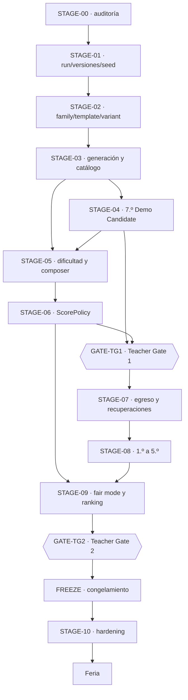

---

## Matriz de capacidades

Estado real contra el código al 11 de septiembre de 2026, tras cerrar STAGE-08 / Phase 1. Es la base de la que salen los estados de etapa de arriba, y lo que hay que reverificar antes de planificar.

| Capacidad | Estado | Evidencia | Etapa |
|---|---|---|---|
| Sistema de diseño v0.2 | `DONE` | [ADR-017](03-architecture/adr/ADR-017-paper-visual-identity.md), [docs](09-design-system/README.md), `pnpm design:check`, `tests/e2e/design-system.spec.ts` | previa |
| Blueprint integrado | `DONE` | [ADR-018](03-architecture/adr/ADR-018-blueprint-v0-2-decision-authority.md), [integración](07-reference/blueprint-v0.2-integration.md) | previa |
| Career Model v2 | `DONE` | [ADR-016](03-architecture/adr/ADR-016-career-player-model.md), `src/game/progression/career.ts`, `ENGINE_VERSION 2.0.0` | previa |
| Ledger de notas y Promedio derivado | `DONE` | `career.ts` → `grades: readonly number[]` | previa |
| `null` ≠ 0 en dimensiones de carrera | `DONE` | `career.ts`, `tests/component/grade-7-ui.test.tsx` | previa |
| Aura con signo, sin techo, introducida en juego | `DONE` | `career.ts`, `src/content/grade-7/challenges/may-25-act.ts`, E2E «el acto del 25 de Mayo introduce Aura» | STAGE-04 |
| Acto del 25 de Mayo | `DONE` | `may-25-act.ts`, `src/game/math/classification.ts`, `tests/unit/number-classification.test.ts`, 6 E2E, contenido `0.5.0-grade-7` | STAGE-04 |
| Mastery y flags ocultos | `DONE` | `career.ts` → `mastery`, `src/game/narrative/` | previa |
| Motor determinista separado de React | `DONE` | [ADR-011](03-architecture/adr/ADR-011-functional-core-transition-engine.md), `tests/unit/architecture-lint.test.ts`, `tests/unit/engine-modules.test.ts` | previa |
| Tripleta de versiones de run | `DONE` | `src/game/core/versioning.ts`, `assertCompatibleVersions` | STAGE-01 |
| Ownership de seed y substreams | `DONE` | [ADR-012](03-architecture/adr/ADR-012-seeded-prng-and-substreams.md), `src/game/random/seed.ts`, `tests/unit/rng-addressing.test.ts` | STAGE-01 |
| `RunDescriptor` inmutable, separado del estado mutable | `DONE` | `src/game/runs/state.ts` | STAGE-01 |
| Replay | `DONE` | `src/game/runs/replay.ts`, `tests/unit/engine-golden.test.ts`, `tests/property/engine.property.test.ts` | STAGE-01 |
| Snapshot versionado con rechazo explícito | `DONE` | `src/game/runs/snapshot.ts`, E2E de reanudación y de checkpoint corrupto | STAGE-01 |
| Separación outcome ≠ carrera ≠ score | `DONE` | `challenges/contracts.ts`, `progression/career.ts`, `scoring/policy.ts` | STAGE-01 |
| `scoreVersion` | `DONE` | campo opcional del descriptor, comprobado por `createRun`; viaja en snapshot y action log | STAGE-06 |
| `variantCatalogVersion` | `DONE` | campo opcional del descriptor; viaja en snapshot y en action log, y `createRun` rechaza una run que declare otro catálogo del que se le da | STAGE-04 |
| `ScenarioFamily` | `DONE` | `src/game/challenges/content-model.ts`, [ADR-019](03-architecture/adr/ADR-019-scenario-family-template-variant.md), `tests/unit/content-model.test.ts` | STAGE-02 |
| `ChallengeTemplate` | `DONE` | una `ChallengeDefinition` declara familia, rol y variantes; `school-data` lo prueba en desarrollo y `bus` en producción | STAGE-02/STAGE-04 |
| `ChallengeVariant` | `DONE` | `ChallengeVariantRef` con dirección `familia/plantilla/variante`, round-trip y substream propio | STAGE-02 |
| `VariantGenerator` reutilizable | `DONE` | contrato de fuente de variantes + generadores por restricción en seis plantillas de producción | STAGE-03/STAGE-04 |
| `VariantValidator` transversal | `DONE` | genéricas + por plantilla con oráculos independientes, diagnósticos tipados | STAGE-03 |
| Catálogo de variantes aprobado y versionado | `DONE` | `ApprovedVariantCatalog`; `grade-7-dev-1` a `dev-5` comprometidos, verificados en `pnpm verify`; las versiones publicadas son inmutables y `dev-5` es el vigente | STAGE-03/STAGE-06 |
| Catálogo aprobado consumido por la partida real | `DONE` | `ApprovedVariantLookup` en `EngineDependencies`, `tests/integration/grade-7-catalog-selection.test.ts` | STAGE-04 |
| Dos plantillas de producción en una familia | `DONE` | familia `bus` con `g7.bus-timing` y `g7.bus-latest-departure`, interacciones y razonamientos distintos | STAGE-04 |
| Plan de demo docente, distinto del plan de una run | `DONE` | `src/game/content/demo-plan.ts`, `src/content/grade-7/demo-plan.ts`, `tests/unit/demo-plan.test.ts` | STAGE-04 |
| Auditoría estadística de variantes | `DONE` | `pnpm game:variants audit`: 36.064 candidatos, 0 rechazos, 7.954 problemas distintos con siete plantillas | STAGE-03 |
| `DifficultyBand` (CORE/STANDARD/STRETCH) | `DONE` | `src/game/difficulty/cognitive.ts`; la banda se **deriva** de seis rasgos declarados por plantilla, no se elige | STAGE-05 |
| `difficultyCost` | `DONE` | `src/game/difficulty/cost-policy.ts`, política versionada en centésimas enteras, separada del multiplicador de score | STAGE-05 |
| `DifficultyBudget` | `DONE` | objetivo y tolerancia por etapa en la `CompositionPolicy`; el compositor sólo produce planes adentro y el validador lo recomprueba | STAGE-05 |
| `RunComposer` equiparado por presupuesto | `DONE` | `src/game/plan/composer.ts`: enumeración exhaustiva, restricciones duras como filtros y objetivos blandos lexicográficos; 20.000 seeds de 7.º dan 1.404 planes distintos con carga idéntica y validación independiente | STAGE-05 |
| Plan concreto ejecutado por el motor, sin recomposición en runtime | `DONE` | `RunState.plan`, `beginEvent` consume el beat pinchado, el snapshot lo persiste y el action log lleva su huella | STAGE-05 |
| Validador de plan independiente del compositor | `DONE` | `src/game/plan/plan-validator.ts`; recalcula rol, banda y costo en vez de creerle al plan | STAGE-05 |
| Verificación de composición en servidor | `DONE` para el alcance actual | `src/server/game/validate-run.ts` recompone, compara la huella y valida el plan | STAGE-05 |
| `ScorePolicy` versionada | `DONE` | `fair-score-dev-1` histórica y `fair-score-dev-2` post-TG1 actual; ambas `official: false` | STAGE-06 + integración TG1 |
| `RecoveryPolicy` versionada | `DONE` | `recovery-dev-1@1.0.0-candidate`, `official: false`, triggers calibrables; techo estructural literal `1`, validado y cubierto por la huella del ruleset | STAGE-07 |
| `MathPerformance` · `TeamPerformance` · `AuraPerformance` | `DONE` | normalizados en puntos básicos enteros; la plantilla declara qué hecho suyo alimenta cada uno | STAGE-06 |
| `FairScore` y desglose competitivo | `DONE` | `src/game/scoring/fair-score.ts`; el desglose cierra exactamente y dice qué calibración lo produjo | STAGE-06 |
| Verificación autoritativa del score en servidor | `DONE` para el alcance actual | el servidor puntúa reproduciendo, y `verifyScoreClaim` contradice un reclamo campo por campo | STAGE-06 |
| Invariante de egreso | `DONE` | `withGraduation` en `src/game/progression/recovery.ts`, `RunCompletion.graduated`, invariantes tipados, servidor autoritativo; **20.000 carreras de seis años, 20.000 egresadas** | STAGE-07 |
| Recuperaciones y fail-forward | `DONE` | [ADR-024](03-architecture/adr/ADR-024-progression-recovery-and-graduation.md), `recovery-dev-1`, `g7.bus-travel-review`, `tests/unit/progression-reachability.test.ts` (espacio de estados recorrido entero) | STAGE-07 |
| Recuperación fuera del score competitivo | `DONE` | `fair-score.ts` descarta la evidencia por rol; test de anti-farmeo en `tests/integration/recovery-run.test.ts` | STAGE-07 |
| Carrera completa jugable de seis años | `PARTIAL` | la estructura la ejerce el fixture `six-stage-progression`; 1.º existe desde Phase 1 y `7.º → 1.º` corre como práctica; el **contenido** de 2.º–5.º no existe | STAGE-08 |
| Diseño de contenido 1.º · 2.º · 3.º · 4.º · 5.º | `DESIGN-CANDIDATE-APPROVED` | cinco pases completos en matriz v0.3, auditoría cruzada y reconciliación cerradas en Phase 0 | STAGE-08 / Phase 0 |
| Contenido runtime 1.º | `DONE` para desarrollo | `src/content/grade-1/`, catálogo `grade-1-dev-1` (174 variantes de 1.º), `tests/unit/grade-1-*.test.ts`, `tests/integration/grade-1-run.test.ts`, `tests/e2e/grade-1.spec.ts`; estado de contenido `draft` hasta la revisión docente | STAGE-08 / Phase 1 |
| Contenido runtime 2.º · 3.º · 4.º · 5.º | `NOT_STARTED` | desbloqueado por el PASS post-G1 del 14 de septiembre de 2026; es la siguiente tarea | STAGE-08 |
| Composición global de carrera | `DONE` como mecanismo | `src/game/challenges/composition-metadata.ts`, `src/game/plan/career-constraints.ts`, búsqueda acotada en `composer.ts`, validador global; `tests/unit/career-composition.test.ts`. Sólo la práctica parcial la usa: la carrera oficial de nueve beats espera 2.º–5.º | STAGE-08 / Phase 1 |
| Repaso practicado/debriefeado y approved-only fail-closed | `DONE` | `src/game/runs/recovery-content.ts`, `recoveryCoverage`/`recordCoverage`, `tests/unit/recovery-coverage.test.ts`; veredicto pedagógico en el audit post-G1 | STAGE-08 / Phase 1 |
| Modos constructivos: cantidades y posiciones, agenda, plano | `DONE` para 1.º | `quantity-builder`, `schedule-builder`, `spatial-layout`; renderers accesibles sin arrastre | STAGE-08 / Phase 1 |
| Verificación autoritativa por replay | `PARTIAL` | `src/server/game/validate-run.ts`: replaya, valida el plan compuesto y **calcula su propio score competitivo**; nada de lo que el cliente afirme se lee. Faltan endpoints, sesión, rate limit y persistencia | STAGE-09 |
| Ranking con personal best | `NOT_STARTED` | — | STAGE-09 |
| Desempate lexicográfico | `NOT_STARTED` | — | STAGE-09 |
| Fair mode operativo | `PARTIAL` | `GameMode` ya declara `'fair'` como literal; no hay comportamiento asociado | STAGE-09 |
| Configuración de competencia | `NOT_STARTED` | — | FREEZE |
| Simulación determinista masiva | `DONE` para el alcance actual | `src/game/testing/simulation.ts`, `pnpm game:simulate`, 200 runs de 7.º y 200 de `7.º → 1.º` en `pnpm verify`; reporta egresos, repasos y previas, y `not-graduated` es hallazgo | transversal |
| E2E y accesibilidad automatizada | `DONE` para el alcance actual | `tests/e2e/`, `@axe-core/playwright`, 80 tests | transversal |
| Catálogo de contenido separado del plan de la run | `DONE` | `ContentCatalog`, `RunPlan`, `tests/unit/content-model.test.ts` | STAGE-02 |
| Elegibilidad por etapa y roles de colocación | `DONE` | declarativos por plantilla; elegibilidad no contigua probada | STAGE-02 |
| Presupuesto de beats por año | `DONE` como contrato validable | `DEFAULT_STAGE_BEAT_BUDGET`, `validateStagePlan` | STAGE-02 |
| Production hardening | `NOT_STARTED` | — | STAGE-10 |

### Discrepancias registradas

- `STAGE_ORDER` incluye las siete etapas hasta `graduation`, y **el egreso ya existe**: STAGE-07 lo volvió un estado terminal que toda run válida completada alcanza. Lo que sigue faltando es el **contenido** de 2.º a 5.º —1.º existe desde STAGE-08 / Phase 1 como práctica `7.º → 1.º`—; hoy la carrera de seis años se juega entera sólo en el fixture `six-stage-progression`, que existe para probar que el motor la sostiene. Documentación que hable de la carrera completa **jugable** sigue describiendo objetivo, no presente.
- El presupuesto de uno a dos beats por año era un contrato de **plan** que ningún código construía. STAGE-04 lo reconcilió por escrito con el `DemoPlan`; **STAGE-05 lo cerró por código**: existe una partida normal de 7.º de un anchor más un secundario, el motor la ejecuta y un validador independiente la comprueba. El arco de ocho eventos sigue existiendo y es el demo.
- `GameMode` admite `'fair'` y `'practice'`, y `DifficultySetting` admite `'adaptive'`. Son literales que el motor acepta; ninguno tiene todavía la semántica competitiva que el roadmap describe a partir de STAGE-06.
- **7.º tiene dos rulesets y juega de dos formas.** `grade-7` es el arco completo de ocho eventos, que es el demo docente; `grade-7-composed` es la partida normal de tres. La pantalla del juego sigue usando el primero: cuál corresponde a un jugador es una decisión de producto que tiene sentido cuando exista la carrera completa. Ver [ADR-022](03-architecture/adr/ADR-022-difficulty-model-and-run-composer.md).

---

## Contratos de etapa

### STAGE-00 — Auditoría funcional ejecutable

- **Estado:** `DONE`
- **Depende de:** —
- **Desbloquea:** STAGE-01, STAGE-02

**Propósito.** Convertir el Blueprint integrado en un mapa técnico contra el código real, antes de cualquier cambio grande.

**Scope IN.** Auditar Blueprint, ADRs, motor, contenido, sistema de diseño, 7.º, tests, replay/snapshot y simulación; producir la matriz de capacidades y el grafo de dependencias reales.

**Scope OUT.** Cualquier refactor. Ranking. Motor de variantes. Scoring. Contenido de 1.º–5.º. Cambios de runtime de cualquier tipo.

**Lectura requerida.** [Integración del blueprint](07-reference/blueprint-v0.2-integration.md), [arquitectura objetivo del motor](03-architecture/target-engine-architecture.md), [game engine](03-architecture/game-engine.md).

**Criterios de aceptación.**

- [x] Código inspeccionado, no sólo documentación.
- [x] Cada capacidad tiene estado y evidencia.
- [x] Dependencias identificadas y ordenadas.
- [x] Presente y objetivo separados.
- [x] Teacher Gates identificados.
- [x] No se ejecutó ninguna megamigración.

**Validación requerida.** `node scripts/validate-agent-workspace.mjs`, `node scripts/sync-master-spec.mjs --check`.

**Evidencia.** La matriz de capacidades de este documento; [arquitectura objetivo del motor](03-architecture/target-engine-architecture.md) con 24 capacidades y su estado; [ADR-018](03-architecture/adr/ADR-018-blueprint-v0-2-decision-authority.md).

**Exit gate.** ¿Qué contratos del motor faltan realmente y cuáles ya existen? — **Contestado.**

---

### STAGE-01 — Contratos de run, versiones y seeds

- **Estado:** `DONE`
- **Depende de:** STAGE-00
- **Desbloquea:** STAGE-02

**Propósito.** Consolidar los contratos base sobre los que se apoyan variantes, replay, scoring y fair mode.

**Scope IN.** Versionado explícito de la run; ownership y derivación determinista de seeds; `RunDescriptor` inmutable separado del estado mutable; separación de tipos entre resultado de desafío, efectos de carrera y score.

**Scope OUT.** `FairScore`. Catálogo de variantes. Metadata de evento o competencia. Endpoints. Persistencia de runs.

**Lectura requerida.** [ADR-003](03-architecture/adr/ADR-003-deterministic-seeded-engine.md), [ADR-011](03-architecture/adr/ADR-011-functional-core-transition-engine.md), [ADR-012](03-architecture/adr/ADR-012-seeded-prng-and-substreams.md), [game engine](03-architecture/game-engine.md).

**Criterios de aceptación.**

- [x] La run identifica las versiones relevantes.
- [x] El ownership de seed tiene un contrato único.
- [x] La derivación determinista está probada.
- [x] `RunDescriptor` está separado del estado mutable.
- [x] El replay consume y valida la información necesaria.
- [x] El score competitivo no se mezcló con la carrera.
- [x] Snapshot, replay y tests pasan.

**Validación requerida.** `pnpm test`, `pnpm game:simulate`, `pnpm verify`.

**Evidencia.** `src/game/core/versioning.ts`; `src/game/random/seed.ts` y `rng.ts`; `RunDescriptor` en `src/game/runs/state.ts`; `src/game/runs/replay.ts` y `snapshot.ts`; `tests/unit/engine-golden.test.ts`, `tests/unit/rng-addressing.test.ts`, `tests/property/engine.property.test.ts`, `tests/integration/server-run-validation.test.ts`.

**Lo que no entró, y por qué.** Al cerrar STAGE-01, `scoreVersion` y `variantCatalogVersion` todavía no existían. Eran opcionales por diseño: agregar campos vacíos habría sido especulativo, porque nada podía poblarlos. `variantCatalogVersion` entró con STAGE-03 y `scoreVersion` con [STAGE-06](#stage-06-scorepolicy-competitiva). No era trabajo huérfano.

**Riesgos.** Al agregar los dos ejes de versión faltantes hay que decidir si eso cambia la compatibilidad de replay. La regla vigente es igualdad exacta, no rangos semver.

**Decisiones.** `LOCKED`: determinismo por seed + versiones + comandos. `LOCKED`: el navegador no es autoridad de score.

**Exit gate.** ¿Puedo reconstruir con qué reglas y con qué seed existió esta run? — **Sí**, probado por golden replays y por la validación autoritativa en servidor.

---

### STAGE-02 — ScenarioFamily → ChallengeTemplate → ChallengeVariant

- **Estado:** `DONE`
- **Depende de:** STAGE-01 (`DONE`)
- **Desbloquea:** STAGE-03 y STAGE-04 (ambas `DONE`)

**Punto de partida y propósito.** Al abrir STAGE-02, cada desafío era una definición monolítica con un array interno de parámetros: alcanzaba para que cambiaran los números, no la pregunta. La etapa debía permitir varias estructuras cognitivas por escenario y variantes reproducibles de primera clase.

**Scope IN.**

- Tipos `ScenarioFamily`, `ChallengeTemplate` y `ChallengeVariant`, con identidad estable y serializable.
- Una plantilla representa una **estructura de razonamiento**, no otro juego de números.
- La variante lleva su dirección determinista (familia, plantilla, seed de variante, parámetros) y se puede reconstruir desde ella.
- Extender `ChallengeInstanceRef` para que direccione familia y plantilla además de la definición.
- Estrategia de migración del contenido existente, escrita antes de migrarlo.
- Tests de identidad, versionado y serialización.

**Scope OUT.** **Crítico para no desbordar el alcance.**

- No implementar generadores por restricción reutilizables — es [STAGE-03](#stage-03-generación-validación-y-catálogo-de-variantes).
- No construir el catálogo desplegado ni `variantCatalogVersion`.
- No enriquecer todavía 7.º con nuevas estructuras cognitivas ni decidir la ubicación final de su contenido — es [STAGE-04](#stage-04-enriquecimiento-de-7º-y-demo-candidate). La migración estructural de los seis desafíos sí quedó completada al cerrar esta etapa; ver [la migración](03-architecture/content-model-migration.md).
- No tocar bandas de dificultad, `difficultyCost` ni presupuesto.
- No tocar scoring, `FairScore` ni ranking.
- No agregar contenido de 1.º–5.º.
- No modificar el sistema de diseño ni introducir estilos nuevos.
- No reescribir la matemática de los desafíos existentes.

**Lectura requerida.** [Familias, plantillas y variantes](01-game-design/challenge-families-and-variants.md) · [sistema de desafíos](01-game-design/challenge-system.md) · [game engine](03-architecture/game-engine.md) · [arquitectura objetivo del motor](03-architecture/target-engine-architecture.md) · [ADR-007](03-architecture/adr/ADR-007-content-as-data.md) · [ADR-012](03-architecture/adr/ADR-012-seeded-prng-and-substreams.md) · [guía de autoría](01-game-design/content-authoring-guide.md).

**Entregables.** Tipos y contratos en `src/game/challenges/`; adaptación del registro; documento de estrategia de migración; tests unitarios y de propiedad; ADR si la dirección de dependencias del motor cambia.

**Criterios de aceptación.**

- [x] `ScenarioFamily`, `ChallengeTemplate` y `ChallengeVariant` están tipados y el catálogo los expone sin `any` ni casts.
- [x] Dos plantillas de la misma familia coexisten **sin duplicar la lógica completa del desafío** — `school-data` aloja `dev.recycling-chart` y `dev.survey-confidence`.
- [x] Una variante se serializa y se reconstruye idéntica desde su dirección determinista.
- [x] La derivación de seed de variante es estable y está cubierta por property tests.
- [x] El motor sigue sin depender de React, y ahora también se prueba que no puede importar contenido concreto.
- [x] Existe un documento de estrategia de migración del contenido legacy.
- [x] Los seis desafíos de 7.º siguen jugándose igual: las runs golden reproducen el mismo recorrido, score, perfil y cantidad de comandos, con el bump de versión documentado.

Criterios que la etapa sumó sobre el contrato original:

- [x] El catálogo de contenido disponible está separado del plan de la run, y agregar contenido al catálogo no lo agrega a un plan existente.
- [x] La elegibilidad por etapa es declarativa y admite conjuntos no contiguos; una colocación inválida se rechaza.
- [x] Existen los cuatro roles de colocación, con un rol desconocido rechazado.
- [x] El presupuesto por año es de uno a dos beats ordinarios con exactamente un `anchor`; el checkpoint gasta uno, el special también y la recuperación queda afuera.
- [x] Contenido nuevo —familia, plantilla y variante— se registra y se materializa **sin tocar el motor**.
- [x] La identidad de una variante no depende del orden del catálogo.

**Validación requerida.** `pnpm test`, `pnpm typecheck`, `pnpm lint`, `pnpm game:validate-content`, `pnpm game:simulate -- --runs=400 --verify=10`, `pnpm verify`.

**Riesgos.**

- Cambiar la dirección de instancia puede alterar el consumo de RNG y romper golden replays. Si el resultado cambia, es un bump de `ENGINE_VERSION`, no un regenerado silencioso de goldens.
- Confundir la migración estructural ya completada con un inventario definitivo. STAGE-04 puede enriquecer la demo, pero la ubicación y el destino final de los seis escenarios siguen abiertos.

**Decisiones.** `RECOMENDADA` (D-006): la jerarquía family/template/variant es dirección de arquitectura, no contrato cerrado — se implementa de forma que se pueda ajustar. `LOCKED` (D-007): variantes deterministas por seed. `OPEN` ([pregunta 46](07-reference/open-questions.md)): profundidad del catálogo de contenido disponible por etapa.

**Evidencia de completitud.**

| Qué | Dónde |
|---|---|
| Decisión | [ADR-019](03-architecture/adr/ADR-019-scenario-family-template-variant.md) |
| Modelo de contenido | `src/game/challenges/content-model.ts` |
| Catálogo de contenido | `src/game/challenges/content-catalog.ts` |
| Contratos de plantilla e instancia | `src/game/challenges/contracts.ts` |
| Plan de run y su validación | `src/game/content/run-plan.ts`, `src/game/content/issues.ts` |
| Direccionamiento en la transición | `src/game/runs/transition.ts` |
| Códec de snapshot v3 | `src/game/runs/snapshot.ts` |
| Contenido migrado | `src/content/grade-7/families.ts` y sus seis desafíos; `src/game/testing/fixtures/families.ts` y sus ocho plantillas |
| Helper de materialización | `src/game/testing/materialize.ts` |
| Tests del modelo | `tests/unit/content-model.test.ts` (34), `tests/property/content-model.property.test.ts` (8) |
| Frontera motor/contenido | `tests/unit/architecture-lint.test.ts` |
| Equivalencia semántica | `tests/unit/engine-golden.test.ts`: mismo recorrido, score, perfil y comandos; sólo cambió el hash |
| Versionado | `ENGINE_VERSION 3.0.0`, `SNAPSHOT_SCHEMA_VERSION 3`, contenido `0.3.0-dev` y `0.4.0-grade-7`; ruleset **sin cambios** |
| Migración documentada | [migración del modelo de contenido](03-architecture/content-model-migration.md) |
| Validación | `pnpm verify` completo; 543 tests y 68 E2E; contenido de ambos sets con 0 errores y 0 warnings; 5000 runs simuladas con 0 hallazgos |

**Lo que no entró, y por qué.** No se dividió ninguna familia de producción en varias plantillas, no se renombró ningún id de contenido y no se movió contenido de año: son decisiones de ubicación, y el inventario final sigue **OPEN**. La prueba de «dos plantillas en una familia» se hizo con contenido de desarrollo para no crear gameplay de producción fuera de alcance.

**Exit gate.** ¿Pueden existir dos variantes de la misma plantilla sin duplicar toda la lógica del desafío? — **Sí**, y también dos plantillas en una familia, con el catálogo separado del plan y sin que el motor conozca ningún id de contenido.

---

### STAGE-03 — Generación, validación y catálogo de variantes

- **Estado:** `DONE`
- **Depende de:** STAGE-02 (`DONE`)
- **Desbloquea:** STAGE-04 (`DONE`) y STAGE-05 (`READY`)

**Punto de partida.** STAGE-02 dejó el vocabulario: una variante ya tenía dirección estable, substream propio y lugar en un catálogo y en un plan. Al abrir STAGE-03 faltaba producirlas en cantidad, validarlas como población y aprobar las que pudieran entrar a una competencia.

**Propósito.** Diversidad reproducible, controlada y auditable. **Variabilidad no es aleatoriedad libre.**

**Scope IN.** Generación por restricción, incluida generación inversa donde convenga; `VariantValidator` con invariantes genéricos y por plantilla; tooling offline `generador → N seeds candidatas → validación → análisis estadístico → catálogo aprobado`; catálogo versionado y `variantCatalogVersion` en la identidad de la run; selección determinista de variantes aprobadas por id/seed.

**Scope OUT.** Bandas y presupuesto de dificultad. Score competitivo. Ranking. Contenido de años nuevos. Endpoints de servidor.

**Lectura requerida.** [Familias, plantillas y variantes](01-game-design/challenge-families-and-variants.md) · [validación y auditoría de variantes](04-quality/variant-validation-and-audit.md) · [validación de contenido](04-quality/content-validation.md) · [base teórica](07-reference/research-basis.md).

**Criterios de aceptación.**

- [x] Los generadores son deterministas y no consultan ninguna fuente ambiente; el substream sale de un seed de contenido fijo, no del seed de la run.
- [x] Los validadores rechazan efectivamente casos inválidos, con tests que lo demuestran para cada categoría de diagnóstico.
- [x] Miles de direcciones por plantilla: **10.000 por plantilla generada, 50.013 en total**.
- [x] El tooling reporta fallas de forma legible por máquina, con códigos de diagnóstico estables.
- [x] **Cero variantes inválidas en el catálogo aprobado**, verificado entrada por entrada.
- [x] Cero opciones duplicadas: es una validación genérica y hay test.
- [x] El catálogo es reproducible y versionado; dos builds dan el mismo archivo byte a byte, y reordenar el registro de contenido da el mismo catálogo.
- [x] La auditoría reporta sesgo de posición de la respuesta, problemas distintos, duplicados por huella y tasa de rechazo, con umbrales documentados.
- [x] La resolución del catálogo devuelve sólo variantes aprobadas, y una aprobada se materializa, se juega y se reproduce.

Criterios que la etapa sumó sobre el contrato original:

- [x] Toda plantilla de producción participa del pipeline con una estrategia deliberada: cinco generadas, una autorada con su razón escrita.
- [x] Las variantes autoradas pasan por las mismas validaciones, huella y deduplicación que las generadas.
- [x] La huella es semántica: dos direcciones que producen el mismo problema colisionan y se deduplican.
- [x] Una variante es el mismo problema en toda partida, y una plantilla que dependa de la run se rechaza con `address-not-deterministic`.
- [x] Una plantilla futura suma generador, validadores y metadata **sin tocar el pipeline**.
- [x] El juego actual no cambió: mismo recorrido golden, misma distribución en 5.000 runs simuladas.

**Validación requerida.** `pnpm game:validate-content` con conteo alto de seeds, `pnpm test`, el nuevo comando de auditoría de catálogo, `pnpm verify`.

**Riesgos.** El costo de generación puede volver lento el arranque si el catálogo se construye en runtime; es un job de build, y el artefacto está comprometido. Un fingerprint mal definido esconde variantes equivalentes.

**Decisiones.** `RECOMENDADA` (D-008): catálogo prevalidado para competencia — **implementado**. `LOCKED` (D-007): seeds deterministas.

**Evidencia de completitud.**

| Qué | Dónde |
|---|---|
| Decisión | [ADR-020](03-architecture/adr/ADR-020-variant-generation-and-approved-catalog.md) |
| Fuente de variantes y generadores | `src/game/challenges/variant-source.ts` |
| Validación y diagnósticos | `src/game/challenges/variant-validation.ts` |
| SHA-256 portable | `src/game/content/hash.ts`, verificado contra FIPS 180-4 y `node:crypto` |
| Catálogo aprobado, canonización e integridad | `src/game/content/variant-catalog.ts` |
| Pipeline | `src/game/content/variant-pipeline.ts` |
| Auditoría estadística y umbrales | `src/game/content/variant-audit.ts` |
| Generadores y oráculos por plantilla | `src/content/grade-7/challenges/*.variants.ts` |
| Artefacto versionado | `grade-7-dev-1`, 133 variantes; hoy en `src/content/grade-7/variant-catalog.grade-7-dev-1.json`, renombrado al publicar la segunda versión y **sin cambios en su contenido** |
| Tooling | `pnpm game:variants build \| check \| audit`; `check` dentro de `pnpm verify` |
| Tests | `tests/unit/variant-pipeline.test.ts` (40), `tests/property/variant-generation.property.test.ts` (16) |
| Barrida profunda | 50.013 candidatos, **0 rechazos**, 30.671 problemas distintos, 0 errores |
| Estabilidad del juego | golden con mismo recorrido, score, perfil y comandos; 5.000 runs simuladas con 0 hallazgos y la misma distribución |
| Versionado | `ENGINE_VERSION 4.0.0`, `SNAPSHOT_SCHEMA_VERSION 4`, contenido `0.4.0-dev` y `0.5.0-grade-7`; **ruleset sin cambios**, huella idéntica |

**Lo que no entró, y por qué.** El catálogo de la feria **no** se congeló: `grade-7-dev-1` es de desarrollo y decir lo contrario sería inventar una decisión de evento. No se creó ninguna plantilla nueva de producción, no se movió contenido de año y el inventario de escenarios sigue `OPEN`. El catálogo aprobado todavía no alimenta la selección de una run: eso es STAGE-04 y STAGE-05.

**Exit gate.** ¿Se puede generar, validar y reproducir un conjunto grande de variantes sin depender de aleatoriedad ambiente? — **Sí**: 50.013 candidatos deterministas, cero rechazos, catálogo versionado reproducible byte a byte y una variante aprobada que se juega y se reproduce.

---

### STAGE-04 — Enriquecimiento de 7.º y Demo Candidate

- **Estado:** `DONE`
- **Depende de:** STAGE-02 (`DONE`), STAGE-03 (`DONE`)
- **Desbloquea:** GATE-TG1 y, en paralelo, STAGE-05 (ahora activa)

**Punto de partida.** STAGE-03 dejó un pipeline completo y un catálogo de 133 variantes verificadas **que nadie jugaba**. La partida seguía sacando contenido de las dos o tres variantes curadas de cada plantilla, y en producción cada familia tenía exactamente una plantilla, así que agrupar por familia todavía no había demostrado nada.

**Propósito.** Enriquecer 7.º con variación estructural real y convertir el slice amplio existente en una Demo Candidate representativa, usando la arquitectura ya migrada y el pipeline de STAGE-03 antes de producir los demás años.

**Scope IN.**

- Conectar el catálogo aprobado con una selección determinista de contenido jugable de 7.º, sin construir el Run Composer de STAGE-05.
- Agregar plantillas sólo donde aporten una estructura de razonamiento genuinamente distinta; cambiar números u orden de opciones no alcanza.
- Usar el pipeline de STAGE-03 en contenido jugable real.
- Comprobar que las plantillas existentes siguen funcionando, preservando su intención matemática salvo cambio deliberado y documentado.
- Definir qué contenido integra la **Teacher Demo Candidate** y documentar esa selección sin convertirla en el plan normal de producción.
- Reconciliar la cobertura amplia del slice histórico con el presupuesto normal de uno a dos beats por etapa fijado por [ADR-019](03-architecture/adr/ADR-019-scenario-family-template-variant.md).
- Validar pacing, variedad de gameplay e interacciones, y exposición de Promedio, Equipo, Aura y Estilo para Teacher Gate 1.
- Toda UI nueva consume el sistema de diseño v0.2.

La **Teacher Demo Candidate** puede mostrar más mecánicas que un segmento normal para que los docentes evalúen el producto. El **plan normal de una run** mantiene uno o dos beats ordinarios por etapa. Son configuraciones de selección distintas sobre el mismo modelo, no motores distintos.

**Scope OUT.** Repetir la migración estructural ya completada. Decidir el inventario final o mover escenarios de año. Run Composer y balance final de dificultad. Reescribir la matemática existente. Rediseño visual. Contenido de 1.º–5.º. Score competitivo. Ranking. Recuperaciones.

**Lectura requerida.** [ADR-019](03-architecture/adr/ADR-019-scenario-family-template-variant.md) · [ADR-020](03-architecture/adr/ADR-020-variant-generation-and-approved-catalog.md) · [ADR-021](03-architecture/adr/ADR-021-approved-catalog-in-play-and-teacher-demo.md) · [migración del modelo de contenido](03-architecture/content-model-migration.md) · [Vertical slice de 7.º](06-delivery/vertical-slice-grade-7.md) · [catálogo de desafíos](01-game-design/challenge-catalog.md) · [familias y variantes](01-game-design/challenge-families-and-variants.md) · [sistema de diseño](09-design-system/README.md) · [migración visual de 7.º](09-design-system/migration-7-grade.md).

**Criterios de aceptación.**

- [x] Los desafíos existentes están migrados estructuralmente a familia/plantilla/variante, con equivalencia semántica documentada.
- [x] La diversidad aprobada llega al gameplay mediante una selección determinista, y la run registra `variantCatalogVersion` cuando realmente consume ese catálogo.
- [x] La demo incorpora variación cognitiva real donde aporta; no se presenta un reordenamiento o cambio numérico como plantilla nueva.
- [x] El pipeline de STAGE-03 se usa en contenido real donde corresponde, sin obligar a que todo contenido curado sea procedural.
- [x] La selección de la Teacher Demo Candidate está documentada y distinguida del plan normal de uno a dos beats por etapa.
- [x] Pacing, variedad de gameplay e interacciones y exposición del Career Model están validados para Teacher Gate 1.
- [x] Matemática previa preservada; ningún desafío existente cambió una cuenta.
- [x] El acto del 25 de Mayo está en el flujo real de la partida.
- [x] Aura pasa de `null` a un valor significativo durante la run.
- [x] Aura no se dibuja antes de ser introducida.
- [x] Clasificación y F1 probados, incluidos los tres casos de denominador cero.
- [x] Jugable con teclado y en 360/390/430 px.
- [x] El motor evalúa la matemática; React no.
- [x] Replay, snapshot y simulación correctos.
- [x] El cierre de año sigue funcionando.

Criterios que la etapa sumó sobre el contrato original:

- [x] El puerto que lleva el catálogo a la selección es angosto: `src/game/challenges` sigue sin poder importar `src/game/content`, y no se debilitó la regla de capas.
- [x] Una versión publicada del catálogo es inmutable: `grade-7-dev-1` no se regeneró. `grade-7-dev-2` conserva las huellas de las plantillas cuyo contrato no cambió, agrega `g7.bus-latest-departure` y materializa de nuevo las direcciones generadas del acto bajo el generador versión `2`.
- [x] El demo docente **no** es un plan de run válido, y hay un test que lo corre por `validateStagePlan` y comprueba que lo rechaza.
- [x] El presupuesto de beats de una run no se aflojó, ni se volvió configurable para el demo.
- [x] El artefacto de catálogo se parsea en la frontera, no se castea.
- [x] Poner el catálogo a jugar encontró un defecto de contenido real —una estrategia degenerada que pasaba por buena en algunas coreografías generadas del acto— y quedó cerrado en el generador, en el validador y en un test.

**Validación requerida.** `pnpm verify` completo, incluidos `pnpm test:e2e:only` y `pnpm design:check`.

**Evidencia de completitud.**

| Qué | Dónde |
|---|---|
| Decisión | [ADR-021](03-architecture/adr/ADR-021-approved-catalog-in-play-and-teacher-demo.md) |
| Puerto del catálogo hacia la selección | `ApprovedVariantLookup` en `src/game/challenges/variant-source.ts`; adaptador en `src/game/content/variant-catalog.ts` |
| Selección determinista dentro de lo aprobado | `src/game/runs/transition.ts`, substream `variant-pick` |
| Guard de versión de catálogo | `createRun` rechaza un descriptor que declare otro catálogo |
| `variantCatalogVersion` en el action log | `src/game/runs/action-log.ts`, `ACTION_LOG_VERSION 2` — corrige un defecto real de reproducción |
| Segunda plantilla de la familia colectivo | `src/content/grade-7/challenges/bus-latest-departure.ts` y `.variants.ts`, interacción `numeric-input` |
| Catálogos publicados e inmutables | `variant-catalog.grade-7-dev-1.json` (133) y `grade-7-dev-2.json` (159), indexados en `src/content/grade-7/variant-catalogs.ts` |
| Plan de demo docente | `src/game/content/demo-plan.ts` (tipo y validación) y `src/content/grade-7/demo-plan.ts` (las siete plantillas con su propósito) |
| Tests | `tests/integration/grade-7-catalog-selection.test.ts` (9), `tests/unit/demo-plan.test.ts` (14), tres tests de pantalla deterministas para las dos plantillas del colectivo |
| Barrida profunda | 10.000 candidatos por plantilla generada; 36.064 en total, **0 rechazos**, 7.954 problemas distintos |
| Defecto de contenido encontrado y cerrado | el acto admitía coreografías donde marcar la grilla entera zafaba; generador reconstruido desde el techo del acto, validador independiente y test sobre las 27 aprobadas |
| Estabilidad del juego | golden con mismo recorrido, score, perfil y comandos; simulación sin hallazgos |
| Versionado | `ENGINE_VERSION 4.1.0`, `ACTION_LOG_VERSION 2`, contenido `0.6.0-grade-7`; **ruleset sin cambios**, huella idéntica en `d3319440` |

**Matriz de cobertura del demo docente.**

| Plantilla | Familia | Interacción | Dominio | Rol | Carrera | Fuente | Qué demuestra |
|---|---|---|---|---|---|---|---|
| `g7.bus-timing` | `bus` | timeline | tiempo y tasas | `anchor` | Estilo | generada | la situación del año: elegir entre salidas |
| `g7.bus-latest-departure` | `bus` | numeric-input | tiempo y tasas · porcentajes | `anchor` | Estilo | generada | **la misma situación al revés**: producir el número |
| `g7.may-25-act` | `may-25` | number-grid | patrones y relaciones | `special` | Aura, Estilo | generada | matemática en público; el único evento que mueve Aura |
| `g7.mural-paint` | `mural` | decision-card | espacio y forma | `checkpoint` | Promedio, Estilo | generada | la evaluación del trimestre: área y envases enteros |
| `g7.notebook-offer` | `notebook` | decision-card | porcentajes | `anchor` | Estilo | generada | comparar ofertas con la plata contada |
| `g7.group-tasks` | `group-project` | assignment-board | optimización con restricciones | `anchor` | Equipo, Estilo | **autorada** | repartir trabajo; sus parámetros son contenido escrito |
| `g7.stand-supplies` | `school-fair` | budget-builder | optimización con restricciones | `anchor` | Equipo, Estilo | generada | el cierre: packs, mínimo y presupuesto |

Las siete están en el catálogo aprobado vigente y hay un test que lo comprueba. Seis interacciones, seis familias, seis dominios y las cuatro dimensiones de carrera. **Siete beats ordinarios: más de tres veces el máximo de una run, a propósito.**

**Lo que no entró, y por qué.** El catálogo de la feria **no** se congeló: `grade-7-dev-2` es de desarrollo. El inventario de escenarios sigue `OPEN`: que la familia colectivo tenga dos plantillas no dice cuántas tendrá ninguna otra. No se movió contenido de año, no se renombró ningún id y no se tocó una cuenta de los seis desafíos anteriores. El demo docente es un **candidato**: ningún docente lo aprobó, y eso es el Teacher Gate 1.

La segunda plantilla se agregó en la familia colectivo y en ninguna otra. El mural y el cuaderno también admiten una segunda pregunta; agregarlas es trabajo de contenido y el criterio de la etapa era demostrar la capacidad, no poblar el juego.

**Exit gate.** ¿Es 7.º una **Demo Candidate** representativa del producto final? — **Sí para lo que esta etapa podía decidir**: la segunda partida trae otros números y, en la familia colectivo, otra pregunta; el contenido que se juega salió del catálogo aprobado; y lo que un docente vería está definido por escrito y es demostrablemente distinto de una run. Que la demo *convenza* a un docente es el Teacher Gate 1, y es externo.

---

### STAGE-05 — Modelo de dificultad y Run Composer

- **Estado:** `DONE`
- **Depende de:** STAGE-03 (`DONE`), STAGE-04 (`DONE`)
- **Desbloquea:** STAGE-06 (ahora activa)

**Punto de partida.** STAGE-04 dejó el contenido: siete plantillas de 7.º, un catálogo aprobado que la partida consume y un demo docente definido. Lo que no dejó es una forma de **elegir** ese contenido con criterio. Elegía el storylet dentro de su pool y el seed dentro de lo aprobado; nadie miraba dificultad, variedad ni presupuesto. Y el año de 7.º jugaba seis beats ordinarios contra el presupuesto de uno o dos que fija [ADR-019](03-architecture/adr/ADR-019-scenario-family-template-variant.md).

**Propósito.** Producir runs distintas pero comparables. Sin esto, el sorteo de variantes decide parte del ranking.

**Scope IN.** Bandas `CORE / STANDARD / STRETCH` como metadata de autoría, con su correspondencia declarada contra `DifficultyLevel` 1–5; `difficultyCost` **separado** de `scoreMultiplier`; `DifficultyBudget` por run con tolerancia; Run Composer determinista que elige familia/plantilla/variante por variedad, presupuesto, no repetición, cobertura de dominios y coherencia narrativa; reporte de distribución de dificultad sobre miles de runs simuladas.

**Scope OUT.** Score competitivo y `FairScore`. Ranking. Dificultad adaptativa en modo oficial. Contenido nuevo.

**Lectura requerida.** [Dificultad y jugabilidad universal](01-game-design/difficulty-and-playability.md) · [marco matemático](01-game-design/math-design-framework.md) · [auditoría de equidad competitiva](04-quality/competition-fairness-audit.md).

**Criterios de aceptación.**

- [x] La dificultad de cada plantilla es explícita y justificable por estructura, no por tamaño de los números.
- [x] `difficultyCost` y `scoreMultiplier` son campos distintos y están documentados como tales.
- [x] El composer es determinista para un seed y una configuración dados.
- [x] `abs(Σ difficultyCost − targetBudget) <= tolerance` como invariante testeada.
- [x] Miles de runs simuladas sin diferencias groseras de dificultad total.
- [x] La distribución de dificultad se reporta de forma legible.
- [x] Presupuesto y multiplicadores son configuración, no constantes dispersas, para poder llevarlos a Teacher Gate.

Criterios que la etapa sumó sobre el contrato original:

- [x] El plan se decide **una vez**, antes de que la run empiece, y el motor lo ejecuta: `beginEvent` ya no sortea plantilla ni variante para un beat planificado.
- [x] Reanudar, reproducir y verificar en servidor juegan el mismo plan; el snapshot guarda el plan concreto y el descriptor lleva su huella.
- [x] El validador de planes es **otro programa** que el compositor, y recalcula rol, banda y costo en vez de creerle al plan.
- [x] Una composición imposible falla con un diagnóstico tipado que nombra etapa, restricción y cuántos candidatos había.
- [x] El compositor no conoce ningún id de contenido; lo particular de 7.º vive en su política como dato.
- [x] La demo amplia de 7.º sigue jugándose exactamente igual.

**Validación requerida.** `pnpm test`, `pnpm game:simulate:deep`, `pnpm game:compose`, `pnpm verify`.

**Evidencia de completitud.**

| Qué | Dónde |
|---|---|
| Decisión | [ADR-022](03-architecture/adr/ADR-022-difficulty-model-and-run-composer.md) |
| Modelo cognitivo y bandas | `src/game/difficulty/cognitive.ts`; seis rasgos por plantilla, banda derivada |
| Costo de scheduling versionado | `src/game/difficulty/cost-policy.ts`; 100 · 150 · 210 centésimas, `official: false` |
| Política de composición | `src/game/plan/composition-policy.ts`; presupuesto, roles, sobre, objetivos y repetición, todo configurable |
| Compositor | `src/game/plan/composer.ts`; enumeración exhaustiva, duras como filtro, blandas lexicográficas |
| Diagnósticos de fallo | `src/game/plan/composition-failure.ts`; siete códigos con etapa y conteo de candidatos |
| Validador independiente | `src/game/plan/plan-validator.ts` |
| Huella y serialización del plan | `src/game/plan/plan-fingerprint.ts`, `plan-codec.ts` |
| Ejecución sin recomposición | `src/game/runs/transition.ts`; `RunState.plan`, `SNAPSHOT_SCHEMA_VERSION` 5, `ACTION_LOG_VERSION` 3 |
| Verificación en servidor | `src/server/game/validate-run.ts` |
| Partida normal de 7.º | `src/content/grade-7/composition.ts`; ruleset `grade-7-composed`, tres eventos, un anchor más un secundario |
| Prueba de genericidad multi-etapa | `src/game/testing/fixtures/six-stage-composition.ts`; 10.000 carreras sintéticas de exactamente 7.º → 1.º → 2.º → 3.º → 4.º → 5.º, targets 250 → 300 → 310 → 360 → 420 → 420, sin contenido de producción nuevo |
| Auditoría de distribución | `pnpm game:compose -- --content=grade-7 --runs=20000`: **20.000 válidos, 1.404 planes distintos, carga 250 y spread 0**; `--content=synthetic-six-stage --runs=10000`: **10.000 válidos, 3.717 planes completos, 12 beats y spread 0**. Ambas salidas se reprodujeron byte a byte |
| Prueba explícita de un beat | `tests/unit/run-composer.test.ts`; una policy de test exige un beat aunque exista un secundario, el compositor produce sólo el `anchor` y pasa `validateStagePlan`, `validateComposedPlan`, serialización y recomposición |
| Simulación de runs compuestas | `pnpm game:simulate --content=grade-7-composed` y `--content=development-composed`: 3.000 runs cada una, **0 hallazgos** |
| Tests | `tests/unit/difficulty-model.test.ts` (14), `tests/unit/run-composer.test.ts` (47), `tests/unit/composition-audit.test.ts` (2), `tests/integration/composed-run.test.ts` (15), `tests/property/run-composition.property.test.ts` (5) |
| Estabilidad del juego | golden con mismo recorrido, score, perfil y comandos; 5.000 runs de la demo simuladas con 0 hallazgos |
| Versionado | `ENGINE_VERSION 5.0.0`, `SNAPSHOT_SCHEMA_VERSION 5`, `ACTION_LOG_VERSION 3`, contenido `0.7.0-grade-7` y `0.5.0-dev`, catálogo `grade-7-dev-3`; **el ruleset ahora incluye la política de composición** y su huella la cubre |

**Auditoría de dificultad del contenido actual.** La clasificación candidata de las siete plantillas de 7.º, con sus rasgos, su banda, su costo y las cuatro divergencias con el nivel autorado, está en [dificultad y jugabilidad](01-game-design/difficulty-and-playability.md). Es calibración de ingeniería y el Teacher Gate puede moverla sin tocar arquitectura.

**Lo que no entró, y por qué.** La pantalla del juego **no** se migró a partidas compuestas: habría borrado la demo amplia que STAGE-04 acababa de construir, y un año compuesto necesita marco narrativo propio, que es contenido de producción y estaba fuera de alcance. Las dos formas conviven como dos rulesets. No se agregó contenido, no se movió nada de año y el inventario sigue `OPEN`. Ninguna calibración es oficial: bandas, umbrales, costos, objetivos y tolerancias son `RECOMENDADA` y van al Teacher Gate.

**Riesgos.** Multiplicadores de score grandes hacen que el sorteo domine sobre la habilidad; ése es el motivo de mantenerlos chicos y de separarlos del costo de scheduling.

**Decisiones.** `RECOMENDADA` (D-014): presupuesto de dificultad — **implementado**. `RECOMENDADA` (D-015): piso bajo y techo alto — vigente. `TEACHER_GATE` ([pregunta 44](07-reference/open-questions.md)): calibración de bandas y costos, **sigue abierta**. `OPEN` ([pregunta 5](07-reference/open-questions.md)): manual, adaptativa o híbrida, **sigue abierta**; esta etapa define el mecanismo, no la elección.

**Exit gate.** ¿Muchas runs distintas tienen dificultad total comparable, con evidencia de simulación? — **Sí.** 20.000 seeds reales de 7.º producen 1.404 planes distintos con carga total idéntica y cero fallos; 10.000 carreras sintéticas prueban las seis etapas con spread cero; el camino de un beat está probado por el compositor real. Comparable **no** es equivalencia psicométrica: es carga estructural pareja bajo una calibración que ningún docente validó todavía, y decirlo es parte del resultado.

---

### STAGE-06 — ScorePolicy competitiva

- **Estado:** `DONE`
- **Depende de:** STAGE-05 (`DONE`)
- **Desbloqueó:** GATE-TG1; también habilita la futura STAGE-09

> **Nota post-TG1:** lo que sigue registra el alcance y la evidencia con que cerró STAGE-06. La autoridad actual publica `fair-score-dev-2` 85/10/5; ver [acta](06-delivery/teacher-gate-1/09-acta.md) y [auditoría post-Gate](04-quality/post-teacher-gate-1-score-audit.md).

**Punto de partida.** STAGE-05 dejó runs comparables **antes** de puntuar: el contenido de una partida se compone una vez, dentro de un presupuesto de dificultad, y el motor lo ejecuta. Lo que faltaba es qué vale lo que el jugador hizo con ese contenido: el score que existía es el de la capa de carrera, que suma puntos por evento y por lo tanto suma más a quien jugó más beats.

**Propósito.** Un score para ranking que no contamine la identidad de carrera.

**Scope IN.** `ScorePolicy` versionada y configurable con pesos, multiplicadores y topes; `MathPerformance`, `TeamPerformance` y `AuraPerformance` normalizados; `FairScore`; desglose auditable por run; `scoreVersion` en la identidad de la run; golden tests de score; simulación de distribución con perfiles de jugador sintéticos.

**Scope OUT.** Ranking, leaderboard y personal best. Endpoints. Persistencia. Congelamiento de coeficientes. **No cerrar los pesos**: 80/15/5 es candidato.

**Lectura requerida.** [Score competitivo y ranking](01-game-design/competitive-scoring-and-ranking.md) · [fórmulas y algoritmos](07-reference/formulas-and-algorithms.md) · [ejemplo de política](07-reference/score-policy.example.json) · [ejemplo de desglose](07-reference/score-breakdown.example.json) · [reglas, scoring y progresión](01-game-design/rules-scoring-and-progression.md).

**Criterios de aceptación.**

- [x] `ScorePolicy` está versionada y ninguna constante de peso vive dispersa en el código.
- [x] **La misma run con la misma policy produce exactamente el mismo desglose y el mismo score.**
- [x] El desglose explica componentes, multiplicadores, topes y versión de policy.
- [x] En la policy candidata, la matemática domina el resultado, verificado por simulación.
- [x] La contribución de Aura está acotada por un tope explícito.
- [x] **Estilo no aporta score directo**, verificado por test.
- [x] Promedio no se suma aparte de `MathPerformance` sin justificación escrita.
- [x] Se pueden cargar y testear varias policies en paralelo.
- [x] Golden tests de score fijan la salida de policies conocidas.
- [x] La simulación reporta la distribución de score por perfil sintético.

Criterios que la etapa sumó sobre el contrato original:

- [x] Cada plantilla declara **qué hecho suyo** lee cada componente competitiva, con su razón escrita; `'none'` es una decisión, no un default.
- [x] Una componente sin oportunidad en una run no le cuesta puntos al jugador: su peso se reparte, y el juego perfecto vale la escala completa en todo plan válido.
- [x] Ni Estilo ni Promedio tienen peso, porque no son componentes: no existe el número que alguien podría subir.
- [x] La recompensa por dificultad es un concepto distinto del costo de scheduling, y la validación rechaza factores que dejarían al sorteo decidir un ranking.
- [x] El servidor **calcula** el score reproduciendo la run; un reclamo adjunto a la submission no cambia nada.
- [x] Aritmética entera con un solo redondeo; el desglose cierra exactamente con el total.
- [x] Puntuar no toca el juego: la huella del ruleset quedó idéntica.

**Validación requerida.** `pnpm test`, `pnpm game:score`, `pnpm game:simulate:deep`, `pnpm verify`.

**Evidencia de completitud.**

| Qué | Dónde |
|---|---|
| Decisión | [ADR-023](03-architecture/adr/ADR-023-competitive-score-policy.md) |
| Perfil de score por plantilla | `src/game/challenges/scoring-profile.ts`; declarativo, con razón obligatoria |
| Política competitiva versionada | `src/game/scoring/competitive-policy.ts`; `fair-score-dev-1`, `official: false` |
| Validación de política | rechaza pesos que no suman, matemática no dominante, mapeo no monótono y recompensas de dificultad que decidirían un ranking |
| Núcleo de score | `src/game/scoring/fair-score.ts`; racionales exactos, un redondeo, reparto por resto mayor |
| Serialización y verificación | `score-codec.ts`, `score-verification.ts`; parsea en la frontera y contradice un reclamo campo por campo |
| Identidad de la run | `scoreVersion` en el descriptor, comprobado por `createRun`; `SNAPSHOT_SCHEMA_VERSION` 6, `ACTION_LOG_VERSION` 4 |
| Servidor autoritativo | `src/server/game/validate-run.ts` puntúa reproduciendo; hay un test que le adjunta un score falso y comprueba que no cambia nada |
| Auditoría estadística | `pnpm game:score`: **23.000 planes** —20.000 años reales de 7.º más planes de 1, 8 y 12 beats— por cinco perfiles sintéticos |
| Comparación de calibraciones | `pnpm game:score -- --compare`: las mismas runs bajo 80/15/5, 85/10/5, 90/10/0 y sin recompensa por dificultad |
| Tests | `tests/unit/competitive-score.test.ts` (58), `tests/unit/score-golden.test.ts` (6), `tests/property/competitive-score.property.test.ts` (10), `tests/integration/competitive-run.test.ts` (13) |
| Estabilidad del juego | golden con mismo recorrido, mismo score por evento, mismo perfil y misma cantidad de comandos; simulación sin hallazgos |
| Versionado | `ENGINE_VERSION 5.1.0`, `SNAPSHOT_SCHEMA_VERSION 6`, `ACTION_LOG_VERSION 4`, contenido `0.8.0-grade-7` y `0.6.0-dev`, catálogo `grade-7-dev-4`; **huella del ruleset idéntica en `da245c60`** |

**Resultados de la auditoría.**

| Perfil sintético | Score sobre 23.000 planes |
|---|---|
| juego perfecto | 10.000 en **todos**, dispersión 0 |
| matemática fuerte, secundarias mínimas | 7.400 – 9.000 |
| matemática floja, secundarias perfectas | 2.000 – 3.600 |
| peor juego posible | 0 |

Las dos franjas del medio no se cruzan: la dominancia de la matemática está medida, no afirmada. Planes de 1, 2, 8 y 12 beats llegan al mismo techo, y un plan sin contenido de equipo o de aura llega al mismo techo que uno que lo tiene.

**La tabla de doble conteo.** Qué componente lee cada plantilla, y por qué es un hecho distinto del que otra ya leyó, está en [ADR-023](03-architecture/adr/ADR-023-competitive-score-policy.md) y en [score competitivo](01-game-design/competitive-scoring-and-ranking.md). Dos resultados incómodos que la etapa decidió registrar en vez de tapar: el stand mueve Equipo en la carrera y **no** aporta equipo competitivo, y **ninguna plantilla de producción aporta aura competitiva** —el acto, único evento que mueve Aura, sólo mide el F1 que la matemática ya usa—. La componente existe, está topeada y la ejercitan los fixtures.

**Lo que no entró, y por qué.** Ningún coeficiente quedó cerrado: 80/15/5, los cuatro escalones de calidad y las recompensas por dificultad son candidatos del Teacher Gate. No hay ranking, ni leaderboard, ni personal best, ni endpoints, ni persistencia. El comparador lexicográfico sigue documentado y sin implementar: sin ranking no tiene a qué ordenar. Tampoco se tocó el score por evento de la capa de carrera, que sigue siendo `development-scoring-v1`.

**Riesgos.** Escribir 80/15/5 como constante final. La policy tiene que poder cambiar por configuración después del Teacher Gate sin tocar el motor; `pnpm game:score -- --compare` existe para que esa discusión tenga números.

**Decisiones.** `RECOMENDADA` (D-010, D-012): score separado de la carrera; Estilo sin puntaje — **implementadas**. `TEACHER_GATE` (D-011, [preguntas 38 y 39](07-reference/open-questions.md)): pesos exactos y calibración de calidades, **siguen abiertas**. `LOCKED`: el navegador no es autoridad de score.

**Exit gate.** ¿La misma run con la misma policy da siempre el mismo desglose y el mismo score? — **Sí**, y el desglose cierra exactamente con el total. Lo que la etapa **no** puede afirmar es que la calibración sea la correcta: eso es lo que el Teacher Gate 1 tiene que decidir, y ahora tiene con qué.

---

### GATE-TG1 — Teacher Gate 1

- **Estado:** `PASSED_WITH_REQUIRED_ADJUSTMENTS` — ejecutado el 1 de septiembre de 2026.
- **Depende de:** STAGE-04 (`DONE`), STAGE-06 (`DONE`)
- **Desbloquea:** STAGE-07

**Resultado.** La [evidencia original](06-delivery/teacher-gate-1/11-evidencia-docente-2026-09-01.md) y el [acta](06-delivery/teacher-gate-1/09-acta.md) aceptan la base y requieren ajustes: accesibilidad matemática universal, 85/10/5, multi-evaluación con evidencia independiente, 8–10 minutos y egreso garantizado. La [integración post-Gate](06-delivery/teacher-gate-1/12-integracion-post-gate.md) asigna lo que no corresponde implementar ahora.

El pack histórico sigue reproducible con `pnpm teacher-gate --validate` y permanece fijado a `fair-score-dev-1`; no se reescribe lo que el docente vio.

**Se valida:** nivel matemático, terminología, situaciones, dificultad, ponderación de score, política de intentos, política de empate, duración de la run, lenguaje de recuperación.

**Criterios de aceptación.**

- [x] Feedback TG1-01…TG1-14 preservado y clasificado.
- [x] Registro de decisiones y preguntas abiertas reconciliados.
- [x] `fair-score-dev-2` 85/10/5 publicado sin mutar `dev-1`.
- [x] Ajustes restantes asignados a STAGE-07/08/09 y TG2.
- [x] La validación docente no se presenta como playtest con estudiantes.
- [x] Roadmap y etapa actual actualizados.
- [x] El [acta](06-delivery/teacher-gate-1/09-acta.md) distingue contexto reconstruible de datos efectivamente suministrados.

**Exit gate.** ¿Están cerradas o explícitamente diferidas las decisiones docentes que bloquean la producción de contenido? — **Sí, con ajustes requeridos integrados/asignados.**

---

### STAGE-07 — Invariante de egreso, fail-forward y recuperaciones

- **Estado:** `DONE` — cerrada el 2 de septiembre de 2026
- **Depende de:** GATE-TG1 (`PASSED_WITH_REQUIRED_ADJUSTMENTS`)
- **Desbloquea:** STAGE-08

**Propósito.** Formalizar la progresión **antes** de construir 1.º–5.º, para que ningún año tenga que inventar su propio sistema de fracaso y promoción.

**Resultado.** El egreso dejó de ser una promesa del roadmap y pasó a ser una propiedad de la máquina de estados. Un beat ordinario que sale mal deja algo por cerrar; el año no puede terminar debiéndolo; cerrarlo es un **repaso**, no un reintento; y toda run válida completada termina en egreso. La decisión completa —incluidas las alternativas descartadas— está en [ADR-024](03-architecture/adr/ADR-024-progression-recovery-and-graduation.md).

**Por qué no puede entrar en bucle.** Por construcción, no por configuración: sólo un beat **ordinario** crea una obligación, así que un repaso no puede crear otra; y un repaso **siempre** cierra lo que el año debía, salga como salga. La recursión es irrepresentable, y el techo —un repaso por año— es un hecho estructural que la auditoría exhaustiva confirma en vez de asumir.

**Scope IN.** Estado terminal `GRADUATED` y transición explícita hacia él; separación de desempeño y progresión; eventos de recuperación deterministas y comprimidos; estructura oculta de materias pendientes con callbacks; property tests de convergencia.

**Scope OUT.** Repetir año completo. Contenido de 1.º–5.º. Ranking. Arquetipo final de carrera completa. HUD nuevo: las previas son estado oculto, no una quinta dimensión visible.

**Lectura requerida.** [Egreso, recuperación y fail-forward](01-game-design/graduation-and-fail-forward.md) · [reglas, scoring y progresión](01-game-design/rules-scoring-and-progression.md) · [sistema narrativo](01-game-design/narrative-system.md) · [game engine](03-architecture/game-engine.md).

**Criterios de aceptación.**

- [x] **Toda run válida completada llega a `GRADUATED`**, probado por property test sobre miles de secuencias de comandos válidas.
- [x] No existe game over global.
- [x] Un desempeño bajo activa recuperación o consecuencia, nunca un estado terminal de fracaso.
- [x] Las recuperaciones son deterministas y reproducibles por seed.
- [x] Ninguna recuperación puede crear un callejón sin salida.
- [x] Los estados imposibles se rechazan de forma tipada.
- [x] El replay atraviesa recuperaciones sin divergencia.
- [x] El estado sigue siendo serializable y reanudable a través de una recuperación.

**Qué se construyó.**

| Qué | Dónde |
|---|---|
| Modelo de progresión | `src/game/progression/recovery.ts`: obligación, repaso, estado de progresión y política, con las razones de convergencia escritas en el módulo |
| Política versionada | `recovery-dev-1@1.0.0-candidate`, `official: false`; calibra triggers y rechaza una política que dispare con `optimal`; el campo de techo conserva el literal estructural `1` y runtime/ruleset rechazan cualquier otro valor |
| Estado de la run | `RunState.progression`, `ActiveEvent.recovery`, `RunCompletion` con `graduated`, `previas` y `recoveries` |
| Invariantes tipados | `src/game/runs/invariants.ts`: egresar debiendo, egresar con un beat abierto, obligación de un evento no alcanzado, doble resolución y un repaso abierto sin nada que cerrar |
| Agenda del repaso | `src/game/runs/transition.ts`: **después** del presupuesto ordinario y antes de que el año cierre, así el jugador no pierde una de las decisiones que el año fue compuesto para darle |
| Contenido determinista | derivado de la identidad semántica de la obligación sobre `['recovery', año, 'obligation', id]`, dentro del catálogo aprobado y prefiriendo una variante no vista |
| Ruteo por plantilla | el content set declara **qué repasa qué**; una plantilla sin repaso declarado no deja nada por cerrar. Así `none` es una decisión escrita e inspeccionable, y nadie recibe el repaso de una situación con la que no se equivocó |
| Contenido de 7.º | `g7.bus-travel-review` aísla el paso intermedio —la duración del viaje con demora— con el primer término nombrado como andamio; `core`, más liviana que lo que remedia |
| Marco narrativo | storylet `g7.review` con la condición nueva `{ kind: 'never' }`: existe para enmarcar un beat que agenda otra cosa, y el selector no puede tomarlo por accidente |
| Frontera con el score | `fair-score.ts` descarta la evidencia de un repaso **por su rol**, no por una bandera del historial, así que ni entra al numerador ni al denominador |
| Servidor autoritativo | `src/server/game/validate-run.ts` recalcula egreso, repasos y previas reproduciendo, y rechaza una run completada que deba algo |
| Carrera sintética de seis años | `src/game/testing/fixtures/six-stage-progression.ts`: `7.º · 1.º · 2.º · 3.º · 4.º · 5.º` jugables con el mismo código y sin un solo caso especial por año |
| Simulación | `pnpm game:simulate -- --content=six-stage`; egresos, repasos y previas reportados, y `not-graduated` es un hallazgo |
| Tests | `tests/unit/progression.test.ts` (37), `tests/unit/progression-reachability.test.ts` (4, exhaustivos), `tests/property/progression.property.test.ts` (10), `tests/integration/recovery-run.test.ts` (19), más rechazo de ruleset inválido en `engine-modules.test.ts` |
| Versionado | `ENGINE_VERSION 6.0.0`, `SNAPSHOT_SCHEMA_VERSION 7`, ruleset `0.4.0-grade-7`, contenido `0.9.0-grade-7`, catálogo `grade-7-dev-5`; **`ACTION_LOG_VERSION` se queda en 4** |

**Evidencia.**

| Qué se midió | Resultado |
|---|---|
| Carreras sintéticas de seis años | **20.000 simuladas, 20.000 egresadas, 0 hallazgos** |
| Peor caso de repasos | **6 en una carrera de seis años** — el techo estructural, uno por año |
| Espacio de estados de la progresión | recorrido **entero**: 64 formas posibles de un año y 64 de una carrera; un único estado terminal alcanzable, sin ciclos ni callejones |
| Convergencia sobre formas de jugar | property tests sobre 300 seeds × mejor juego, peor juego y alternancia |
| 7.º real, extremo a extremo | una situación sin resolver dispara el repaso, el repaso cierra el año, la partida egresa y el E2E lo ve en pantalla |
| Sin farmeo | fallar y recuperarse perfecto siempre puntúa menos que jugar bien de entrada |
| Servidor | recalcula egreso y repasos reproduciendo; un `graduated` adjunto por el cliente no cambia nada |
| Barridos de 7.º y desarrollo | 3.000 runs por content set —demo, compuesto y desarrollo—, 3.000/3.000 egresadas, 0 hallazgos en cada uno |
| Suite completa | 908 tests en 50 archivos y 70 E2E, en verde tras el hardening |

**Auditoría estructural de duración.** Sobre 20.000 carreras del fixture sintético de seis años, los beats ordinarios son **siempre 12** —dos por año en esa prueba— y los totales van de **12 a 18**: el peor caso es exactamente un repaso por año, y no existe una carrera sintética que juegue 19. Esto demuestra capacidad y boundedness; **no decide** que toda run final tenga 12 beats ordinarios. La arquitectura de producto sigue admitiendo uno o dos por etapa —6–12 en seis años— y el objetivo de 8–10 minutos de D-TG1-09 todavía debe medirse en STAGE-08 con contenido real. En un año suelto: 7.º compuesto juega 2 beats ordinarios y 2–3 totales; el demo docente, 6 y 6–7.

**Cobertura de recuperación por plantilla.** El ruteo es por plantilla, no por año: la obligación recuerda qué situación salió mal, y el repaso que aparece es el de esa situación. Una plantilla ausente de la tabla no crea obligación, así que `none` es una decisión escrita y no un silencio que el motor rellene con lo que el año tenga a mano.

| Plantilla | Rol | ¿Qué repasa? |
|---|---|---|
| `g7.bus-timing` | anchor | **`g7.bus-travel-review`** — el paso intermedio que el enunciado esconde: cuánto dura el viaje una vez aplicada la demora |
| `g7.bus-latest-departure` | anchor | **`g7.bus-travel-review`** — la misma cuenta, a la que se llega por el camino inverso |
| `g7.bus-travel-review` | recovery | — es el repaso, y por rol no puede crear otro |
| `g7.mural-paint` | checkpoint | `none`: el error típico es de redondeo de compra —envases enteros—, y aislarlo daría una cuenta trivial que no enseña nada |
| `g7.notebook-offer` | anchor | `none`: comparar dos ofertas no tiene paso intermedio que aislar; el error se corrige leyendo cuál quedó más barata |
| `g7.stand-supplies` | anchor | `none`: optimización con restricciones; su remediación honesta es otra decisión, no media cuenta |
| `g7.group-tasks` | anchor | `none`: mide reparto y equipo, no un paso matemático aislable |
| `g7.may-25-act` | special | `none`: el acto ocurre una vez y en público; repetirlo aparte lo volvería un trámite y le sacaría lo que lo hace memorable |

Que hoy sólo la familia colectivo tenga repaso es una decisión de alcance, no un olvido: el motor no exige que toda plantilla lo tenga, `none` es una respuesta explícita y válida, y una recuperación inventada para completar una tabla sería peor contenido que ninguna. Un año que salga mal en una plantilla sin repaso cierra igual: el mal resultado tiene consecuencia —nota, score, carrera, historia— y no deuda. Sobre el 7.º compuesto, eso significa que fallar el acto no dispara nada y fallar el colectivo sí, y hay un test para cada uno de los dos casos.

**Validación requerida.** `pnpm test`, `tests/property/`, `pnpm game:simulate:deep`, `pnpm verify`.

**Riesgos.** Un invariante de egreso mal formulado puede esconder un bucle infinito de recuperaciones. La property test tiene que acotar la cantidad de eventos, no sólo la convergencia. — **Mitigado por construcción**: el bucle no es representable, y la auditoría exhaustiva de estados alcanzables lo comprueba en lugar de confiar en un muestreo.

**Lo que no entró, y por qué.** No se publicó `fair-score-dev-3` ni se tocó la ScorePolicy: la frontera con el score es una exclusión, no una recalibración. No hay ranking, desempate, intentos, personal best ni persistencia —siguen en STAGE-09—, ni Hitos, ni contenido de 1.º a 5.º. El acto del 25 de Mayo no se reescribió. En aquel cierre el umbral era candidato; el Product Pass posterior lo cerró en INVALID para Templates recovery-capable (FUNCTIONAL no dispara), sin modificar runtime en esta reconciliación.

**Decisiones.** `TG1 ACCEPTED` (D-TG1-10): toda run válida completada llega a
`GRADUATED`; sin game over global — **implementada**. El Product Pass posterior
cerró Repaso, INVALID y el debrief de obligaciones no seleccionadas
([preguntas 53 y 54](07-reference/open-questions.md)); no se atribuye ese cierre
a TG1. El techo de un Repaso por etapa sigue siendo estructura de ADR-024.

**Exit gate.** ¿Pueden los años futuros apoyarse en este sistema de progresión sin inventar el suyo? — **Sí.** La carrera sintética de seis años se juega entera con el mismo código, sin un solo `if` por etapa, y el content set declara qué se repasa sin que el motor conozca un solo id de contenido.

---

### STAGE-08 — Contenido incremental de 1.º a 5.º

- **Estado:** `IN_PROGRESS` — **etapa actual; Phase 0 DONE / Phase 1 DONE /
  audit post-G1 PASSED / Phase 2 e integración de carrera completa DONE; gates
  matemáticos provisionales en curso: remediación DONE, 14 de 14 contratos**
- **Depende de:** STAGE-07 (`DONE`)
- **Desbloquea:** STAGE-09

**Propósito.** Construir la carrera completa sobre las fundaciones existentes.
El diseño aprobado sólo es runtime donde se implementó: 7.º y, desde Phase 1, 1.º
tienen catálogo aprobado; la carrera sintética demuestra progresión de seis etapas,
no contenido de 2.º–5.º.

#### Phase 0 — diseño de carrera completo

**Estado: `DONE`.** Evidencia en la
[reconciliación del Product Audit](07-reference/full-career-product-audit-integration.md)
y la [conformidad técnica](04-quality/full-career-technical-conformance.md):
`PASS WITH MINOR CONTRACT DELTAS`, todos entendidos, sin BLOCKER sin resolver.

- [x] Product Design Envelope y matriz v0.3: 25 diseños, sin sustituciones ni nuevas Templates.
- [x] Template Design Passes de 1.º–5.º y checkpoints #1/#2 integrados.
- [x] Full-Career Cross-Content Audit reconciliada en fuentes canónicas.
- [x] Pases de Rare Events / Milestones / Prestige y Career Epilogue v1 cerrados como diseño.
- [x] Supersesiones y madurez registradas, calibraciones y trabajo futuro separados.
- [x] Deltas técnicos documentados en ADR-025; plan de implementación G1 ordenado.
- [x] Integración canónica, índices/master y limpieza de insumos transitorios.

Las políticas viven en la [matriz](01-game-design/full-career-content-matrix.md),
[narrativa](01-game-design/narrative-system.md),
[Prestige](01-game-design/rare-events-and-prestige.md) y
[score/ranking](01-game-design/competitive-scoring-and-ranking.md), no en un
segundo checklist de números aquí. Diseño cerrado no equivale a calibración
oficial, validación con estudiantes ni autorización de un freeze.

#### Phase 1 — implementar 1.º real

**Estado: `DONE`** (11 de septiembre de 2026). Evidencia por paso:

1. [x] Metadata y contratos sólo para los modos de 1.º, con tests de evaluador,
   addressing, respuesta, snapshot y replay: `composition-metadata.ts`,
   `interactions.ts`, `commands.ts`; action log `5`, snapshot `7` sin cambios.
2. [x] Recovery fail-closed con catálogo aprobado —`createRun` y borde del beat—;
   selección canónica y debrief autorado del resto derivados, sin otro scheduler:
   `recovery-content.ts`, `recoveryCoverage`, `recordCoverage`.
3. [x] `student-day-challenge-wheel` y `mobile-data` con variantes y oráculos
   independientes; señuelos del Intrinsic Math Gate en el pipeline.
4. [x] `rehearsal-schedule` y `schedule-review` con agenda constructiva accesible
   (`schedule-builder`), viaje, preparación, ventanas, dependencia y límite fijo.
5. [x] `classroom-layout` y `scale-fit-review` sobre celdas enteras, con controles
   teclado/tap y búsqueda acotada de witnesses; ningún píxel en el evaluador.
6. [x] `course-project-expo` con Equipo independiente —participación, ofrecimiento
   y pedido—, Math y Equipo máximos simultáneos probados por variante, y callbacks.
7. [x] Metadata de composición y `CareerConstraints` con alcance
   `partial-development` para `7.º → 1.º`; búsqueda/validador global probados con
   un catálogo sintético de nueve beats, sin fabricar 2.º–5.º.
8. [x] Variantes (`grade-1-dev-1`, 174 de 1.º, witness por entrada), outcomes,
   accesibilidad (axe, teclado, 360/390 px), reanudación, replay, servidor y
   simulación; 62 archivos/1339 tests, 80 E2E, 5000 + 5000 + 2000 runs
   simuladas egresadas con 0 hallazgos. Docs y versiones actualizados.
9. [x] **Gate post-G1 ejecutado el 14 de septiembre de 2026:**
   `PASS WITH REQUIRED HARDENING — RESOLVED`. Con `classroom-layout INVALID` +
   `rehearsal-schedule INVALID` en la misma etapa, un Repaso practica una
   obligación, debriefea la otra y cierra ambas, sin recursión, sin hacks por ID
   y sin tocar FairScore. Tres defectos acotados corregidos dentro del gate;
   ninguna decisión de producto cambió.
   [Resultado](04-quality/post-grade-1-scalability-audit.md#resultado-de-la-ejecución-2026-09-14).
10. [x] Con el PASS documentado queda autorizada la implementación incremental de
    2.º–5.º. Si aparece un sistema fundamental nuevo, revisar arquitectura antes
    de seguir.

**Scope IN.** Templates/variantes de G1, sus interacciones reutilizables, metadata,
debrief, mappings y storylets necesarios; deltas mínimos previstos por ADR-025,
verificación y documentación de lo realmente implementado.

**Scope OUT.** Producir 2.º–5.º antes del gate. Otro Career Model, motor de FairScore
o gramática de progresión. Rediseño visual o una sexta interacción sin decisión
aparte. Servidor oficial, DB/auth, ranking e intentos (STAGE-09). Recalibración o
freeze de score/rareza por conveniencia de código.

#### Phase 2 — implementar 2.º–5.º

**Estado: `IN_PROGRESS`.** Un año por vez, con auditoría liviana antes de cada
checkpoint y commit sólo si pasa.

1. [x] **2.º — Pertenencia** (15 de septiembre de 2026). Cinco Templates y el
   Repaso del denominador sobre `grade-2-dev-1`, con Equipo independiente en el
   plan del Intercurso, Aura separada de la matemática en la tabla y el cluster
   `intercurso` aportando como máximo una Template puntuable. El motor contrató
   la respuesta `classification` (engine `8.0.0`, action log `6`) y las
   mecánicas de autoría se promovieron a `src/content/authoring.ts`.
   [Implementación](01-game-design/grade-2-template-design.md#implementación-runtime).
2. [x] **3.º — Autonomía** (15 de septiembre de 2026). Cinco Templates y dos
   Repasos sobre `grade-3-dev-1`, con umbral de usos estructural en el
   colectivo, más de un recurso apretando en la feria de tecnología, Equipo
   independiente en el Día del Amigo y orden de visita que cambia la viabilidad
   en el recorrido. El motor contrató la respuesta `route-builder` y el modo de
   varios días de la agenda (engine `9.0.0`, action log `7`), y la preferencia
   blanda de diversidad cognitiva se implementó como objetivo del compositor.
   [Implementación](01-game-design/grade-3-template-design.md#implementación-runtime).
3. [x] **4.º — Responsabilidad** (16 de septiembre de 2026). Cinco Templates y
   dos Repasos sobre `grade-4-dev-1`, con la externalidad visible en la
   matemática y no sólo en la copia —un puesto vacío, una cola en la vereda,
   gente parada— sin cobrarla como Equipo; el cluster del evento escolar
   aportando como máximo una Template puntuable; y `y4.represent-class` con la
   acción matemática y la acción pública en campos distintos de la respuesta,
   agendada con el rol `special` para reemplazar una oportunidad y no agregar
   un beat. Prestige y elegibilidad condicional quedan para la integración.
   [Implementación](01-game-design/grade-4-template-design.md#implementación-runtime).
4. [x] **5.º — Cierre y futuro** (16 de septiembre de 2026). Cinco Templates y
   dos Repasos sobre `grade-5-dev-1`, con convergencia por construcción
   —ninguna Template necesita un callback para entenderse ni para resolverse—,
   el guardrail socioeconómico del viaje implementado como ausencia de datos
   por persona, y `y5.next-step-options` sin prescribir ningún camino: la
   preferencia no alimenta puntaje ni Estilo, sólo queda registrada.
   [Implementación](01-game-design/grade-5-template-design.md#implementación-runtime).
5. [x] **Integración de carrera completa** (16 de septiembre de 2026). La
   carrera real es una edición propia —ruleset `1.0.0-full-career` sobre
   `grade-5-dev-2`— que compone los **nueve** beats del presupuesto en los seis
   años, con eventos raros contextuales, Prestige, hitos, callbacks y epílogo
   implementados una sola vez acá (D-S08-067 y D-S08-072). D-S08-056 quedó
   cerrada con evidencia: 300 carreras, p50 384 ms, p95 404 ms, peor caso
   434 ms, 0 fallas. El epílogo tiene pantalla y E2E, y la carrera se barre con
   seis políticas de juego. La edición sigue `official: false` y declara un
   techo de Prestige ofrecido de 0 (D-S08-084).
   [Estado](06-delivery/current-stage.md#stage-08-contenido-incremental-de-1º-a-5º).

#### Después de G1 y aceptación de STAGE-08

Implementar 2.º → 3.º → 4.º → 5.º y auditar carrera completa. La respuesta Math/Aura
independiente debe existir cuando G2 la necesite. Prestige y saliencia completos
pueden integrarse en G4/5; sus hechos verificables se originan desde el año fuente.

**Criterios de aceptación de implementación** (revisados el 2026-09-16, al
cerrar la integración de carrera completa):

- [ ] Matemática intrínseca, prerrequisitos accesibles desde aproximadamente 7.º y bandas por estructura, no filtro curricular. — Las bandas salen de `bandOf(cognitive)`, por estructura y no por currículum; la accesibilidad del prerrequisito la decide la revisión del Departamento de Matemática, abajo.
- [ ] Cada Template cumple DoR, revisión matemática y variantes semánticas/materializaciones de la guía; cero variantes inválidas desplegadas. — Cero variantes inválidas desplegadas está probado por el pipeline y la validación de contenido; la revisión matemática sigue siendo externa.
- [x] Evidencia Math/Team/Aura independiente y witness de máximo simultáneo; Estilo sólo Career/Narrative. — Una carrera perfecta alcanza 10 000 exactos, con Equipo y Aura máximos leídos de campos distintos de la respuesta.
- [x] Composición Normal/Fair de nueve beats, cuotas/cluster/arco y validador independiente; Teacher Demo/carrera parcial diferenciadas. — La carrera real compone nueve beats en seis etapas y el validador independiente acepta cada plan; demo y práctica parcial siguen siendo sets distintos.
- [x] Rareza, slots de Prestige y callbacks deterministas, sin ventajas por aparición ni duplicación de evidencia. — Con el techo de Prestige **ofrecido en 0** que la edición declara (D-S08-084).
- [x] Repaso: selección/debrief/cierre, pacing, egreso y exclusión competitiva; PASS post-G1 registrado antes de G2.
- [x] Epílogo de carrera real con saliencia determinista, datos ausentes no dibujados y Hitos display-only distinguibles.
- [x] Accesibilidad teclado/tap, móvil, reduced motion, replay/snapshot/reanudación y E2E por año. — Más el E2E de carrera completa a 320 px.
- [ ] Auditoría de composición completa, cobertura/exploits y playtests de pacing según [validación de contenido](04-quality/content-validation.md). — La [auditoría de implementación](04-quality/full-career-implementation-audit.md) está ejecutada y los exploits barridos; **los playtests de pacing con jugadores reales no**.
- [ ] Revisión matemática, documentación por año y cero sistemas fundamentales duplicados. — Documentación por año completa y sin sistemas duplicados. El gate provisional es el **AI Mathematics Department** (D-S08-095): [pre-revisión](04-quality/mathematics-department-pre-review.md) y [adjudicación independiente](04-quality/mathematics-department-ai-adjudication.md) ejecutadas, con `REMEDIATION REQUIRED`; la [implementación de la remediación](04-quality/mathematics-remediation-implementation.md) cerró en `DONE` con los catorce contratos de la [especificación](04-quality/mathematics-remediation-spec.md), después de dos adjudicaciones de contrato —la [de sus conflictos](04-quality/mathematics-remediation-contract-conflict-adjudication.md) y la [del techo de la pantalla del acto](04-quality/rs-mat-008-blind-ceiling-final-adjudication.md)—; la [re-auditoría independiente](04-quality/independent-mathematics-reaudit.md) confirmó trece de los catorce contratos y el techo `K = 78`, pero dio `FAILED — REMEDIATION REQUIRED` por tres hallazgos bloqueantes propios, y la [adjudicación posterior](04-quality/post-reaudit-mathematics-findings-adjudication.md) emitió el [contrato de la ronda 2](04-quality/post-reaudit-mathematics-remediation-spec.md); la remediación dirigida cerró con tres verify consecutivos, su [re-auditoría de ronda 2](04-quality/independent-mathematics-reaudit-round-2.md) volvió a dar `FAILED` porque las dos Templates remediadas admitían una estrategia **más simple** que la eliminada, y el [sprint de cierre](04-quality/stage-08-mathematics-final-closure-sprint.md) cerró esa clase entera con una familia finita de ocho políticas sobre las 42 Templates; falta la auditoría final de cierre y el sign-off provisional. **La revisión del Departamento de Matemática humano no se reemplaza: se difiere a Final Delivery / Pre-Release Acceptance.**

**Lectura requerida.** [Matriz](01-game-design/full-career-content-matrix.md) ·
[diseño G1](01-game-design/grade-1-template-design.md) ·
[guía de autoría](01-game-design/content-authoring-guide.md) ·
[marco matemático](01-game-design/math-design-framework.md) ·
[sistema de diseño](09-design-system/README.md) · ADR-025.

**Validación requerida al implementar.** `pnpm verify`, `pnpm game:validate-content`,
`pnpm game:simulate:deep`, `pnpm test:e2e:only`. Pruebas del audit de diseño no
sustituyen estos gates. Objetivos editoriales y calibraciones versionadas conservan
la madurez del [registro](07-reference/decision-register.md).

**Remediación dirigida de ronda 2.** Implementados RS-RA-AUDIT-001,
RS-RA-001/002/003 y RS-RA-TEST-001; DONE con tres verify consecutivos. La
[evidencia](04-quality/targeted-post-reaudit-mathematics-remediation.md) incluye
baseline reproducida, K/S 35,8/20 % y 62,4/28 %, seis órdenes económicos en la
peña, 42 filas auditadas y republicación de los seis catálogos. Los techos y las
decisiones de D-S08-122…126 no cambian. H-6/H-7 y R-S09-CAT siguen vigentes.

**Re-auditoría independiente de ronda 2.** `FAILED`: los cinco contratos escritos
pasan, pero `y3.course-project-tech` y `y4.course-project-fundraiser` admiten una
estrategia reutilizable más simple que la eliminada —`K 100 · S 100 %` cada una— y
la auditoría permanente no puede ver esa clase (D-S08-129…133).

**Sprint de cierre matemático.** DONE. El
[informe](04-quality/stage-08-mathematics-final-closure-sprint.md) cierra
MAT-RA2-001…005 con `RS-CLO-AUDIT-001` y `RS-CLO-001/002/003`: taxonomía finita de
ocho familias sobre las 42 Templates, rediseño matemático de la feria de
tecnología —lo prometido pasa a ser un total y las tasas a ser parámetro—,
rediseño económico de la peña —seis economías reales y objetivo calibrado contra
el techo real de la cocina— y tres atajos más cerrados dentro del sprint. Seis
catálogos republicados; motor, action log, snapshot, rulesets y FairScore
intactos.

**Siguiente tarea:** `Final Mathematics Closure Audit`, de sólo lectura.
El Provisional Sign-Off sigue bloqueado hasta su PASS.
Siguen además los gates humanos de STAGE-08 que no se difirieron:
sign-off manual de la rueda del Día del Estudiante y playtests de pacing con
jugadores reales. La revisión del Departamento de Matemática humano sobre las 42
Templates ocurre en Final Delivery / Pre-Release Acceptance.

**Exit gate.** ¿Una run real, auditada y accesible recorre
`7.º → 1.º → 2.º → 3.º → 4.º → 5.º → EGRESADO`, con pacing medido y sin duplicar
fundaciones? **Parcialmente.** La run existe, se audita y es accesible: la
carrera real compone nueve beats en los seis años, egresa bajo seis políticas de
juego, se recompone en servidor y pasa accesibilidad a 320 px, con la
[auditoría de implementación](04-quality/full-career-implementation-audit.md)
en `PASS WITH REQUIRED HARDENING — RESOLVED`. **El pacing sigue sin medirse con
jugadores reales**, y la [adjudicación matemática](04-quality/mathematics-department-ai-adjudication.md)
exige remediación antes del sign-off provisional, así que la etapa no cierra: la
implementación y las dos rondas de remediación matemática están completas, sus dos
re-auditorías independientes **fallaron** y el **sprint de cierre** que siguió a la
segunda está DONE; faltan la auditoría final de cierre, el sign-off provisional y
la validación empírica de pacing.

---


### STAGE-09 — Fair mode, servidor autoritativo y ranking

- **Estado:** `NOT_STARTED`
- **Depende de:** STAGE-06, STAGE-08
- **Desbloquea:** GATE-TG2

**Propósito.** Convertir el juego completo en una competencia cuya integridad se pueda defender.

**Frontera de confianza.**

```text
SERVIDOR   emite y registra el RunDescriptor
   ↓
CLIENTE    juega local-first y registra comandos
   ↓
SERVIDOR   valida emisión/versiones → replay → FairScore + Prestige → ranking
```

El navegador **nunca** es autoridad de score. El precursor ya existe: `src/server/game/validate-run.ts` replaya una submission no confiable e ignora cualquier score que el cliente afirme.

**Scope IN.** Emisión de `RunDescriptor` oficial con metadata de evento; endpoints con idempotencia, reintentos, rate limiting y validación de versiones; verificación por replay; ranking por **personal best**; FairScore → Prestige → shared rank, sin tiempo; Competition Seed compartida emitida por servidor y dificultad fija; intentos ilimitados con mejor resultado verificado; moderación de nickname; minimización de datos de menores; E2E de run → submission → ranking.

**Scope OUT.** Congelar la configuración de competencia — es [FREEZE](#freeze-congelamiento-de-competencia). Load testing y hardening — es [STAGE-10](#stage-10-production-hardening). Reabrir las reglas v1 de empate/intentos cerradas por el Product Pass; TG2 valida implementación y premios.

**Lectura requerida.** [Arquitectura objetivo del motor](03-architecture/target-engine-architecture.md) · [ADR-004](03-architecture/adr/ADR-004-server-authoritative-scoring.md) · [ADR-006](03-architecture/adr/ADR-006-local-first-gameplay.md) · [ADR-008](03-architecture/adr/ADR-008-anonymous-identity.md) · [ADR-009](03-architecture/adr/ADR-009-event-leaderboards.md) · [modo feria y congelamiento](05-operations/fair-mode-and-competition-freeze.md) · [leaderboard y moderación](05-operations/leaderboard-and-moderation.md) · [threat model](04-quality/threat-model.md) · [contratos API](03-architecture/api-contracts.md) · [modelo de datos](03-architecture/data-model.md) · [ejemplo de descriptor](07-reference/run-descriptor.example.json).

**Criterios de aceptación.**

- [ ] El cliente no puede imponer un score autoritativo; un payload con `score` lo ve ignorado, probado por test.
- [ ] El servidor verifica por replay y rechaza action logs imposibles con un código tipado.
- [ ] Un score local válido coincide exactamente con el autoritativo.
- [ ] El personal best se actualiza transaccionalmente y una run peor no reemplaza a la mejor.
- [ ] La edición vincula cada intento a la misma seed, variantes, dificultad y oportunidades; runId único por intento, sin farming de rareza.
- [ ] Intentos ilimitados y mejor tupla verificada; empate de ambos scores comparte puesto, sin criterio temporal ni clave oculta.
- [ ] Sólo carreras completas y egresadas válidas pueden competir; Practice no envía rank oficial.
- [ ] Top 3 público y puesto propio privado, con nickname moderado y sin tabla pública de últimos.
- [ ] La tupla de versiones queda persistida en cada run oficial.
- [ ] Un doble envío es idempotente y no crea dos entradas.
- [ ] El ranking se comporta correctamente bajo la concurrencia objetivo.
- [ ] Minimización de datos de menores verificada.
- [ ] E2E completo de run → submission → ranking.

**Validación requerida.** `pnpm test`, `tests/integration/`, `pnpm test:e2e:only`, `pnpm db:reset` · `pnpm db:lint` · `pnpm db:types` si hay migración, `pnpm verify`.

**Riesgos.** Implementar leaderboard antes de que el score sea reproducible. Por eso STAGE-06 es dependencia dura.

**Decisiones.** Product Pass v1 cierra shared rank y Competition Seed compartida; conserva intentos ilimitados y mejor resultado verificado de TG1. Tiempo, Estilo y azar de aparición no ordenan puestos. La operación decide premios compartidos o una instancia común separada del ranking v1; no inventa desempate oculto. Emisión, elegibilidad y persistencia pendientes bajo ADR-025.

**Exit gate.** ¿Se puede correr una competencia simulada completa con score autoritativo en servidor?

---

### GATE-TG2 — Teacher Gate 2

- **Estado:** `TEACHER_GATE` — pendiente. **No es una etapa de ingeniería.**
- **Depende de:** STAGE-09
- **Desbloquea:** FREEZE

Aceptación externa del juego completo antes del congelamiento. Detalle en [gates docentes](06-delivery/teacher-gates.md).

**Criterios de aceptación.**

- [ ] Correcciones pedagógicas registradas.
- [ ] Scoring aprobado.
- [ ] Política de intentos aprobada.
- [ ] Política de empate aprobada.
- [ ] Reglas de premio aprobadas.
- [ ] Contenido de todos los años aceptado.
- [ ] Sin P0/P1 funcionales abiertos.
- [ ] Candidato a congelamiento declarado.

**Exit gate.** ¿Está aprobado el juego completo y su competencia para congelar?

---

### FREEZE — Congelamiento de competencia

- **Estado:** `NOT_STARTED`
- **Depende de:** GATE-TG2
- **Desbloquea:** STAGE-10

**Scope IN.** Congelar `rulesetVersion`, `scoreVersion`, `contentVersion`, `variantCatalogVersion`, política de dificultad, reglas de ranking y reglas de empate. Configuración de evento auditable e inmutable. Proceso de emergencia escrito.

**Scope OUT.** Cambios funcionales de cualquier tipo.

**Lectura requerida.** [Modo feria y congelamiento](05-operations/fair-mode-and-competition-freeze.md) · [deploy y ambientes](03-architecture/deployment-and-environments.md) · [ejemplo de configuración de evento](07-reference/event-config.example.json).

**Criterios de aceptación.**

- [ ] Las versiones oficiales están identificadas y el evento habilita **sólo** esa tupla.
- [ ] La configuración del evento es auditable e inmutable.
- [ ] Toda run oficial apunta a esa configuración.
- [ ] El proceso de cambio de emergencia está documentado, con su política de recálculo.
- [ ] Cualquier cambio posterior al congelamiento exige registro explícito.

**Exit gate.** ¿Puede un tercero reconstruir con qué reglas exactas se jugó la competencia?

---

### STAGE-10 — Production hardening

- **Estado:** `NOT_STARTED`
- **Depende de:** FREEZE
- **Desbloquea:** la feria

**Propósito.** Compensar técnicamente que la feria puede ser el primer contacto real y a escala con estudiantes. **Ninguno de estos controles equivale a validación de experiencia con usuarios reales**; ver [ciclo de entrega real](00-product/real-delivery-lifecycle.md).

**Scope IN.** Simulación masiva de decenas de miles de runs; load testing por encima de la concurrencia esperada; degradación de red; QA móvil priorizando Android modestos en 360/390/430 y Safari/iOS; telemetría mínima sin PII innecesaria; runbook de incidentes; checklist de go-live.

**Scope OUT.** Features nuevas. Cambios de contenido o de score que afecten equidad.

**Lectura requerida.** [Modo feria y congelamiento](05-operations/fair-mode-and-competition-freeze.md) · [runbook de feria](05-operations/fair-runbook.md) · [fallback e incidentes](05-operations/fallback-and-incident-plan.md) · [analytics y observabilidad](03-architecture/analytics-observability.md) · [NFR](04-quality/non-functional-requirements.md) · [estrategia de testing](04-quality/testing-strategy.md).

**Criterios de aceptación.**

- [ ] Load test documentado, sin fallas críticas a la concurrencia objetivo.
- [ ] Retry e idempotencia probados bajo carga.
- [ ] Suite de smoke móvil aprobada.
- [ ] La degradación de red **no pierde resultados en silencio**.
- [ ] Telemetría mínima operativa y sin PII innecesaria.
- [ ] Logs y alertas suficientes para operar la feria.
- [ ] El ranking es recuperable ante incidente.
- [ ] Backup y recuperación probados donde apliquen.
- [ ] Runbook listo y ensayado.
- [ ] Checklist de go-live completo.

**Exit gate.** ¿Se puede abrir la feria sin fallas críticas conocidas y con capacidad de responder a incidentes?

---

### RELEASE y post-feria

- **Estado:** `NOT_STARTED`

**Durante la feria.** No se cambia scoring. No se cambia dificultad ni catálogo de contenido que afecte score. Hotfixes sólo de crash, infraestructura, visual, moderación o seguridad. Si un fix afecta la equidad, se aplica la política explícita y se documenta o recalcula.

**Después.** Congelar resultados; resolver premios sobre runs verificadas y personal best; exportar y auditar el ranking; analizar telemetría; revisar incidentes; documentar aprendizajes; decidir continuidad, modo libre, archivo o evolución. Ver [modo feria y congelamiento](05-operations/fair-mode-and-competition-freeze.md).

---

## Protocolo de actualización

### Antes de implementar

1. Leer `AGENTS.md` de la raíz y los del subtree que se vaya a tocar.
2. Leer [la etapa actual](06-delivery/current-stage.md).
3. Leer el contrato de esa etapa en este documento.
4. Leer la **lectura requerida** de la etapa. No leer `docs/` entero.
5. Auditar el código real: el roadmap puede estar desactualizado.
6. Confirmar que el estado declarado sigue siendo cierto.
7. Respetar **Scope IN** y **Scope OUT**. Si algo parece faltar, probablemente pertenece a otra etapa.

### Después de implementar

1. Correr la validación requerida de la etapa.
2. Marcar los criterios de aceptación efectivamente satisfechos.
3. Agregar la evidencia: rutas de módulos, tests, reportes, ADRs.
4. Registrar decisiones tomadas en el [registro de decisiones](07-reference/decision-register.md); las que quedaron abiertas, en [preguntas abiertas](07-reference/open-questions.md).
5. Registrar riesgos nuevos en el contrato de la etapa.
6. Actualizar el estado de la etapa y la fecha de última reconciliación.
7. Actualizar [la etapa actual](06-delivery/current-stage.md).
8. Pasar la siguiente etapa a `READY` **sólo si el exit gate pasa**.
9. Sincronizar la vista consolidada: `node scripts/sync-master-spec.mjs --write`.

**Nunca marcar `DONE` porque se escribió código.**

## Reglas permanentes para agentes

1. Un Teacher Gate no se cierra desde el código.
2. Una constante `RECOMENDADA` o `TEACHER_GATE` se escribe como política versionada, nunca como número mágico.
3. El sistema de diseño v0.2 es la autoridad visual y **no se reabre**. Una interacción genuinamente nueva puede aportar una primitiva reutilizable compatible con v0.2; no un tema propio ni estilos por feature.
4. La matemática autoritativa no se muda a React.
5. Nada de `Math.random()`, `Date.now()`, `new Date()` ni `performance.now()` en la transición ni en la evaluación.
6. Estilo no puntúa. Aura no se dibuja en cero antes de existir. Promedio no se cuenta dos veces.
7. No se implementa ranking antes de que el score sea reproducible.
8. No se generan variantes al azar sin restricciones ni validación.
9. No se expande el alcance de la etapa activa.
10. Si el roadmap y el código difieren, se corrige el roadmap después de auditar, no al revés.

---

# FILE: 06-delivery/mvp-backlog.md

# Backlog MVP priorizado

## P0 — Vertical slice local

1. Scaffold Next.js/TypeScript/Tailwind.
2. Definir schemas base.
3. Implementar seeded RNG.
4. Implementar game state/reducer.
5. Crear `DecisionCard`.
6. Crear `NumericInput`.
7. Crear `BudgetBuilder` o `Timeline`.
8. Objetivo histórico: implementar 8–10 desafíos como inventario/cobertura del prototipo. Desde [ADR-019](03-architecture/adr/ADR-019-scenario-family-template-variant.md), este conteo no define la longitud de una run normal, que selecciona uno o dos beats por etapa.
9. Feedback de consecuencias.
10. Progresión 7.º + 1.º.
11. Score provisional.
12. Perfil final simple.
13. Checkpoint local.
14. Tests unit/property.
15. Prueba proxy con adultos y revisión del Departamento de Matemática. El playtest con estudiantes del rango objetivo **no está garantizado antes de la feria**; ver [ciclo de entrega real](00-product/real-delivery-lifecycle.md).

## P1 — Carrera completa

16. Stages hasta 5.º.
17. Storylet selector.
18. Assignment Board.
19. Chart/Data Interaction.
20. Spatial Grid.
21. 30–40 templates/variantes suficientes en el catálogo disponible; no todos en una run.
22. Perfil final completo.
23. Accessibility pass.

## P2 — Online

24. Supabase/Postgres schema.
25. POST run.
26. Finish/replay server-side.
27. Leaderboard.
28. Event configuration.
29. Rate limiting.
30. Moderation mínima.
31. Analytics/logging.

## P3 — Feria

32. Pantalla pública.
33. QR/event landing.
34. Pending sync.
35. Fallback test.
36. Load test.
37. Runbook rehearsal.
38. Freeze ruleset/content.

## P4 — Después

- Realtime.
- PWA service worker avanzado.
- Admin UI.
- Reactor 42.
- Daily challenge.
- authoring tools.

## Orden de trabajo posterior a la integración del blueprint

Este backlog prioriza por features. El orden de las etapas que quedan después de integrar el blueprint v0.2 —análisis de brechas, arquitectura de variantes, esqueleto de score competitivo, gates docentes, contenido año por año, backend de feria y hardening— está en [la secuencia de implementación](06-delivery/implementation-sequence.md). Los dos ejes son complementarios: acá está el qué, allá el en qué orden y contra qué gate.

---

# FILE: 06-delivery/repository-conventions.md

# Convenciones de repositorio

## Estructura actual

La aplicación Next.js vive en la raíz. `pnpm-workspace.yaml` existe para declarar scripts de instalación permitidos; no convierte el proyecto en monorepo ni define paquetes adicionales.

```text
.
├── .codex/                 # MCPs de proyecto
├── .github/                # CI y Dependabot
├── .vscode/                # recomendaciones reproducibles del editor
├── docs/                   # fuentes autoritativas y master generado
├── Dockerfile              # imagen standalone multi-stage
├── compose.yaml            # desarrollo contenedorizado
├── package.json            # scripts y versiones directas exactas
├── pnpm-lock.yaml          # resolución reproducible
├── public/                 # assets públicos
├── scripts/                # gates, DB env/types y automatización
├── src/
│   ├── app/                # App Router y Route Handlers/BFF
│   ├── components/         # UI sin acceso directo a server/DB
│   ├── config/             # entorno público y server-only validado
│   ├── content/            # contenido de producto por etapa, como data
│   ├── game/               # core TypeScript puro
│   ├── lib/                # adapters/utilidades transversales
│   ├── server/             # casos de uso y persistencia server-only
│   └── instrumentation.ts  # validación de entorno al iniciar server
├── supabase/
│   ├── migrations/         # SQL versionado
│   └── seed.sql
└── tests/
    ├── component/
    ├── e2e/
    ├── integration/
    ├── property/
    └── unit/
```

`src/content/` existe desde el primer slice jugable y se organiza por etapa (`src/content/grade-7/`). Las áreas de juego todavía no implementadas se agregan dentro de estas fronteras —por ejemplo RNG, scoring, profiles o challenges— sin adelantar una jerarquía vacía ni introducir packages/workspaces.

## Reglas de dependencia

- Dentro del repositorio, `src/game` sólo importa `src/game`; no depende de React, Next.js, Supabase, DOM, red, almacenamiento, hora global ni `Math.random()`.
- `src/content` puede consumir tipos puros de `game` y utilidades sin infraestructura; representa data, no UI.
- `src/components` consume modelos del engine mediante adapters y no importa `server`, variables server-only ni Supabase. Puede importar `content`: el gameplay es local-first ([ADR-006](03-architecture/adr/ADR-006-local-first-gameplay.md)), así que el set de contenido tiene que llegar al browser ([ADR-014](03-architecture/adr/ADR-014-product-content-package.md)).
- `src/app` compone UI y puede invocar casos de uso de `server`, pero no importa `src/server/persistence` directamente.
- `src/server` puede ejecutar `game`, leer `content` y acceder a persistencia mediante adapters.
- `src/lib` contiene adapters/utilidades, no reglas autoritativas de producto.
- `src/config` es la capa inferior de configuración validada.
- `@supabase/supabase-js` sólo se importa desde adaptadores explícitamente autorizados.

`eslint.config.mjs` hace ejecutables estas direcciones. `tsconfig.game.json` compila el core sin tipos de DOM o Node. Toda excepción requiere una razón arquitectónica; un disable local no reemplaza un ADR cuando se cruza una frontera estructural.

## Toolchain y dependencias

- Usar Node.js 24.19.0 mediante `.node-version`/`.nvmrc` y pnpm 11.22.0 mediante `packageManager`.
- Usar sólo pnpm; no agregar lockfiles de npm, Yarn o Bun.
- Instalar con `pnpm install --frozen-lockfile` en CI, Docker y verificaciones reproducibles.
- Mantener versiones exactas y tratar `pnpm-lock.yaml` como resolución autoritativa.
- No ampliar `allowBuilds` sin revisar el paquete que ejecutará código durante instalación.
- No agregar dependencias especulativas, toolchains duplicados, workspaces ni Turborepo.
- Una actualización compatible de seguridad no requiere ADR, pero sí lockfile, changelog/advisory y gates. Un cambio de runtime, package manager, despliegue o arquitectura sí activa la política de decisiones.

El release público está bloqueado mientras `pnpm release:check` detecte Next.js `<16.3.2`; la versión local actual `16.3.1` es sólo una base transitoria.

## Comandos mantenidos

| Trabajo | Comando |
|---|---|
| Desarrollo nativo | `pnpm dev` |
| Build / runtime local de producción | `pnpm build` / `pnpm start` |
| Gate integrado | `pnpm verify` |
| Coherencia Node/pnpm/Docker | `pnpm toolchain:check` |
| Formato, lint y tipos | `pnpm format:check`, `pnpm lint`, `pnpm typecheck` |
| Tests con cobertura | `pnpm test:coverage` |
| E2E con build | `pnpm test:e2e` |
| Supabase local | `pnpm db:start`, `pnpm db:env`, `pnpm db:reset`, `pnpm db:lint`, `pnpm db:types`, `pnpm db:stop` |
| Docker desarrollo | `pnpm docker:up` / `pnpm docker:down` |
| Imagen standalone | `pnpm docker:build` |
| Supply chain / release | `pnpm security:audit`, `pnpm release:check` |

Los detalles y prerrequisitos están en [entorno de desarrollo](08-engineering/development-environment.md). Un comando ejecutado se reporta con su resultado; no declarar gates omitidos como verdes.

## Variables y persistencia

- `.env.example` documenta sólo nombres/defaults no secretos; `.env.local` nunca se versiona.
- Toda variable pública usa `NEXT_PUBLIC_`; `SUPABASE_SECRET_KEY` permanece server-only.
- En Compose, distinguir la URL pública alcanzable por el browser de `SUPABASE_INTERNAL_URL` alcanzable por el proceso server.
- Las migraciones viven en `supabase/migrations/`, se prueban con reset local y se aplican a staging antes de producción.
- Regenerar `src/lib/supabase/database.types.ts` después de cambios de schema.
- No crear tablas de producto ni políticas por conveniencia mientras sus contratos estén abiertos.

## Tests

- Ubicar suites por nivel en `tests/unit`, `component`, `integration`, `property` o `e2e`.
- Todo comportamiento nuevo incluye el test más estrecho que demuestre su contrato.
- Cambios al core agregan determinismo/property/golden tests según corresponda.
- Cambios de DB revisan migración, RLS/grants, tipos e integración.
- Cambios de UI cubren semántica y los viewports relevantes; Playwright prueba el build de producción.
- Los thresholds actuales cubren sólo la base listada en `vitest.config.ts`, no gameplay inexistente.

## IDs y compatibilidad

Un challenge instance id debe distinguir template de instancia, por ejemplo `mural:v2:7f31...`. Los artefactos de run dependen de `game_version`, `ruleset_version` y `content_version`.

Cambios que alteran resultados deben indicarlo explícitamente y actualizar la versión correspondiente. El algoritmo PRNG, la fórmula final de score y la conservación de artefactos históricos siguen abiertos; no fijarlos dentro de una convención local.

## Commits, PRs y documentación

- Mantener cambios cohesivos y no mezclar formateo o refactors ajenos.
- Revisar `git status`, `git diff --check` y el diff completo antes de finalizar.
- Los ADR nuevos viven en `docs/03-architecture/adr/ADR-NNN-*` y se registran en el decision register.
- Un cambio visible actualiza especificación funcional; gameplay actualiza GDD/reglas; contenido actualiza sus fuentes y validación; todos actualizan trazabilidad cuando corresponde.
- Editar primero las fuentes individuales. Regenerar `docs/EGRESADO-MASTER-SPEC.md` con el script mantenido y conservar mapa, checklist y manifest en sincronía.
- Conservar el bloque administrado por Next.js al final de `AGENTS.md`; las reglas humanas del repositorio quedan fuera de sus marcadores.

---

# FILE: 06-delivery/teacher-gate-1/01-guion.md

# Guion de la sesión · 15 minutos

Para el facilitador. Los textos entre comillas son para decir en voz alta, no para leer palabra por palabra.

**Regla de oro:** la primera partida se juega **sin explicación previa**. Lo más valioso de esta reunión es dónde alguien que sabe matemática se traba solo, y explicar antes destruye ese dato para siempre.

---

## 00:00 – 01:00 · Contexto

**Objetivo:** que sepan qué se les pide y qué no.

**Qué decís:**

> «Egresado es un juego de partidas cortas donde un estudiante recorre la secundaria resolviendo situaciones con matemática. Hoy no venimos a mostrarles si el software anda: eso ya está probado. Venimos a que decidan cuatro cosas: si la matemática es apropiada, si los niveles que propusimos son razonables, cómo debería armarse el puntaje de una competencia, y qué habría que cambiar antes de producir el resto del juego.
>
> Van a jugar dos situaciones. **No les voy a explicar cómo se juegan**, a propósito: quiero ver dónde se traban.»

**Qué NO explicás todavía:** el modelo de carrera, las variantes, cómo se compone una partida, el puntaje. Todo eso viene después de que jueguen.

---

## 01:00 – 05:00 · Caso TG1-A · El colectivo

**Objetivo:** que Egresado se entienda jugando.

**Qué mostrás:** `pnpm teacher-gate --case TG1-A` da la URL. Abrís, le pasás el teclado o el teléfono, y te callás.

**Qué hace el docente:** escribe un nombre, avanza, y resuelve la situación del colectivo.

**Qué observás y anotás** — esto es el dato, no su opinión:

- ¿Entendió qué le piden sin preguntar?
- ¿Qué dato miró primero?
- ¿Descartó opciones o calculó una sola?
- ¿Dónde dudó?
- Cuando resolvió, ¿el resultado le explicó la consecuencia o sólo le dijo si acertó?

**Qué preguntás, recién ahora:**

> «¿Este razonamiento corresponde al nivel que esperarían en 7.º?»
>
> «¿La dificultad viene del razonamiento o de hacer la cuenta?»
>
> «¿La consigna se entiende sin ayuda?»

**Tipo de decisión:** TG1-01 (nivel matemático) y TG1-02 (situaciones).

**Si se va de tiempo:** cortás la conversación sobre los números concretos —«eso lo anoto y lo vemos después»— y pasás al caso B. El contraste es más importante que afinar un enunciado.

---

## 05:00 – 07:00 · Caso TG1-B · El mismo colectivo, otra pregunta

**Objetivo:** mostrar que dos partidas pueden pedir razonamientos distintos, no sólo otros números. Es la idea que sostiene todo el diseño de contenido.

**Qué mostrás:** `pnpm teacher-gate --case TG1-B`. Otra vez sin explicar.

**Qué decís, sólo si no lo nota solo:**

> «Es la misma situación de antes. ¿Qué cambió?»

**Qué observás:**

- ¿Notó que es el mismo contexto con la pregunta dada vuelta?
- ¿Le costó más producir el número que elegir entre opciones?

**Qué preguntás:**

> «¿Es razonable que estas dos versiones convivan como situaciones distintas?»
>
> «¿Producir la respuesta debería considerarse más exigente que elegirla entre cuatro?»

**Tipo de decisión:** TG1-03 (clasificación de dificultad).

**Lo que NO hacés acá:** explicar cómo se generan las variantes ni cuántas hay. Si preguntan, respondés en una frase y seguís.

---

## 07:00 – 10:00 · Niveles

**Objetivo:** que revisen la clasificación propuesta de las siete situaciones.

**Qué mostrás:** la tabla de [04-dificultad.md](06-delivery/teacher-gate-1/04-dificultad.md), impresa o en pantalla. `pnpm teacher-gate --difficulty` da la misma lista desde el motor.

**Qué decís:**

> «Clasificamos cada situación en tres niveles. La idea es que el nivel salga de cuántas cosas hay que sostener a la vez, no de qué tan feas son las cuentas. Estos son nuestros candidatos y necesitamos que los revisen.»

**Qué preguntás:**

> «¿Alguna está claramente mal ubicada?»
>
> «¿Hay alguna donde la dificultad venga de la aritmética y no del razonamiento?»
>
> «¿El mismo contenido le seguiría resultando un desafío a un adulto?»

**Tipo de decisión:** TG1-03.

**MUST DISCUSS.** Si el tiempo aprieta, se recortan los casos C y D, no esto: la clasificación condiciona todo el contenido de 1.º a 5.º.

---

## 10:00 – 13:00 · Puntaje

**Objetivo:** decidir la filosofía, no los decimales.

**Qué mostrás:** [05-puntaje.md](06-delivery/teacher-gate-1/05-puntaje.md), y `pnpm teacher-gate --scores` para los ejemplos y la comparación.

**Qué decís, en este orden** — filosofía primero, números después:

> «Separamos dos cosas. Una es la carrera del personaje: promedio, equipo, aura y estilo, que es la historia de ese chico. La otra es el puntaje de competencia, que decide el ranking de la feria. No son lo mismo, y creemos que el promedio no debería sumar dos veces.
>
> La propuesta es que la matemática pese claramente más que todo lo demás junto. Miren estos cuatro ejemplos.»

**Qué preguntás, en orden de importancia:**

> «¿Aceptan un puntaje dominado por la matemática?»
>
> «¿El trabajo en equipo debería influir en el ranking? ¿Qué situaciones considerarían evidencia válida?»
>
> «Aura hoy no aporta puntos de competencia: el acto del 25 mueve Aura en la historia, pero lo único que medimos ahí es matemática, y usarlo dos veces sería premiar lo mismo dos veces. ¿Aura debería influir?»
>
> «Una partida puede no incluir una situación de equipo. En ese caso no se pierden esos puntos: el peso se reparte entre lo que sí estuvo. ¿Les parece aceptable que dos partidas midan combinaciones distintas?»

**Tipo de decisión:** TG1-04 a TG1-07.

**MUST DISCUSS:** dominancia de la matemática y equipo/Aura. Si falta tiempo, la normalización por oportunidad se puede diferir un día, pero no más: bloquea el diseño de contenido de los años siguientes.

---

## 13:00 – 15:00 · Decisiones

**Objetivo:** salir con una palabra por ítem, no con una sensación.

**Qué hacés:** abrís [07-planilla-decisiones.md](06-delivery/teacher-gate-1/07-planilla-decisiones.md) y la recorrés en voz alta.

**Qué decís:**

> «Necesito una de cuatro palabras por cada punto: aceptar, ajustar, rechazar o diferir. Si es ajustar, necesito saber qué. Si no hay acuerdo, lo anoto como desacuerdo y no lo cierro.»

**Lo que no hacés:** forzar consenso. Un desacuerdo registrado es un resultado válido y útil; un «se ve bien» de compromiso no lo es.

---

## Si sobra tiempo

En este orden:

1. **TG1-C · El acto del 25 de Mayo** (3 min) — pedagogía, narrativa y competencia, preguntadas por separado. Ver [03-casos.md](06-delivery/teacher-gate-1/03-casos.md).
2. **TG1-D · El trabajo grupal** (3 min) — la única situación que hoy aporta evidencia de equipo.

## Si falta tiempo

Se difieren, en este orden:

1. política de intentos (TG1-10);
2. política de empate (TG1-11);
3. duración objetivo de la partida (TG1-12).

Ninguna de las tres bloquea la etapa siguiente. La justificación está en [06-preguntas.md](06-delivery/teacher-gate-1/06-preguntas.md).

## Qué no explicar nunca en esta reunión

- Cómo se generan las variantes por dentro.
- Qué es un seed, un catálogo o una huella.
- Cómo el servidor verifica una partida.
- Nada de arquitectura de software.

Si alguien pregunta, hay una respuesta de una frase en el [anexo](06-delivery/teacher-gate-1/10-anexo.md). Después de la reunión.

---

# FILE: 06-delivery/teacher-gate-1/02-checklist-facilitador.md

# Checklist del facilitador

## Antes (el día anterior alcanza)

- [ ] El repositorio está en el commit que se va a mostrar, y lo anotaste para el acta.
- [ ] `pnpm dev` levanta la aplicación.
- [ ] `pnpm teacher-gate --validate` termina en verde. **Si falla, no se da la reunión.**
- [ ] Abriste los casos TG1-A y TG1-B una vez cada uno y llegaste a la situación esperada.
- [ ] `pnpm teacher-gate --scores` corre y tenés los cuatro ejemplos a mano.
- [ ] Imprimiste o compartiste [08-resumen-docente.md](06-delivery/teacher-gate-1/08-resumen-docente.md).
- [ ] Tenés la planilla de decisiones lista para escribir, en papel o abierta.
- [ ] Decidiste en qué pantalla van a jugar: si es teléfono, probá el ancho antes.
- [ ] Reservaste 15 minutos reales, no 15 minutos dentro de otra reunión.

## Durante

- [ ] **No explicaste cómo se juega antes de la primera partida.**
- [ ] Anotaste dónde dudó, no sólo lo que opinó.
- [ ] Anotaste la primera confusión textualmente, con sus palabras.
- [ ] Miraste el reloj al pasar de cada bloque.
- [ ] Hiciste las preguntas exactas del guion, no «¿qué les parece?».
- [ ] Registraste una de las cuatro palabras por cada ítem.
- [ ] Cuando hubo desacuerdo, lo anotaste como desacuerdo en vez de resolverlo vos.
- [ ] Cortaste las conversaciones de detalle con «lo anoto y lo vemos después».

## Después

- [ ] Pasaste la planilla a [09-acta.md](06-delivery/teacher-gate-1/09-acta.md) el mismo día, mientras te acordás.
- [ ] Marcaste cuáles ítems quedaron como bloqueantes.
- [ ] **No cambiaste ninguna calibración todavía.** Primero se revisa el conjunto de decisiones; cambiar de a una en caliente es cómo se pierde la trazabilidad.
- [ ] Creaste la tarea de seguimiento por cada AJUSTAR.
- [ ] Actualizaste el [registro de decisiones](07-reference/decision-register.md) con lo que se cerró.
- [ ] Actualizaste las [preguntas abiertas](07-reference/open-questions.md) con lo que quedó abierto.
- [ ] Recién ahí actualizaste el [roadmap](06-delivery/implementation-sequence.md) y la [etapa actual](06-delivery/current-stage.md).

---

## Hoja de observación

Una por caso jugado. La completa **el facilitador**, no el docente: pedirle que llene un formulario le saca el tiempo que queremos que use jugando y hablando.

**Caso:** ________  **Docente:** ________

| Qué mirar | Anotación |
|---|---|
| ¿Entendió la consigna sin explicación? | |
| ¿Qué información miró primero? | |
| ¿Hubo alguna ambigüedad? ¿Cuál? | |
| ¿Qué estrategia usó? | |
| ¿La matemática fue central o decorativa? | |
| Nivel percibido (fácil / adecuado / difícil) | |
| ¿El resultado se entendió? | |
| Comentario libre | |

---

## Cierre del gate

**Esta lista empieza vacía y se completa después de la reunión real.** No se marca nada hoy.

- [ ] Se revisó el nivel matemático de las situaciones mostradas.
- [ ] Se revisó la clasificación de niveles.
- [ ] Se revisó la filosofía del puntaje.
- [ ] Se registraron las objeciones bloqueantes, si las hubo.
- [ ] Se identificaron los ajustes necesarios, con responsable.
- [ ] No queda ningún desacuerdo bloqueante sin resolver.
- [ ] Cada decisión quedó registrada con la evidencia que se mostró.
- [ ] Se asignaron los cambios de seguimiento.
- [ ] El acta está completa, con versiones y participantes reales.

Con todo eso marcado, y **sólo entonces**, el gate se puede declarar cerrado en el roadmap.

---

# FILE: 06-delivery/teacher-gate-1/03-casos.md

# Los casos de la sesión

Cuatro casos preparados. Los dos primeros son la sesión central; los otros dos salen si sobra tiempo.

Cada uno arranca con un sorteo fijo, así que **dos personas en dos días distintos ven exactamente la misma situación**. Eso es lo que permite discutir sobre lo mismo.

Para ver la ficha completa de cualquiera:

```bash
pnpm teacher-gate --case TG1-A
```

`pnpm teacher-gate --validate` comprueba que los cuatro sigan mostrando lo que este documento dice.

---

## TG1-A · El colectivo, elegir en cuál subirse

**Para qué está:** que Egresado se entienda jugando, sin que nadie lo explique antes.
**Tiempo:** 4 minutos. **Nivel propuesto:** STANDARD.

**Qué va a ver el docente**

El viaje al colegio dura 36 minutos y hoy el colectivo demora un 50 % más. La entrada es a las 08:00, sin excepción. Hay cuatro horarios de salida: 06:59, 07:05, 07:09 y 07:19.

**Trabajo matemático**

Calcular cuánto dura el viaje hoy —36 más la mitad, 54 minutos— y decidir cuál de las cuatro salidas llega a horario. La última salida segura es 07:06, así que dos de las cuatro sirven; entre ésas, una hace esperar seis minutos más que la otra en la puerta. Elegir bien no es sólo llegar: es llegar sin perder la mañana.

**Qué observar**

- ¿Entendió qué le piden sin preguntar?
- ¿Qué dato miró primero?
- ¿Descartó opciones o calculó una sola?
- ¿El resultado le explicó la consecuencia o sólo le dijo si acertó?

**Preguntas**

- ¿Este razonamiento corresponde al nivel que esperarían en 7.º?
- ¿La dificultad viene del razonamiento o de hacer la cuenta?
- ¿La consigna es clara sin ayuda?
- ¿Cambiarían algo de la situación o de los números?

---

## TG1-B · El colectivo, decir con cuánto tiempo salir

**Para qué está:** mostrar que la misma situación puede pedir un razonamiento distinto. No otros números: otra pregunta.
**Tiempo:** 2 minutos. **Nivel propuesto:** STANDARD.

**Qué va a ver el docente**

El mismo colectivo. Hoy el viaje dura 20 minutos y demora un 15 % más. La entrada sigue siendo a las 08:00 y el grupo pide llegar 10 minutos antes. **No hay opciones para elegir:** hay que escribir el número.

**Trabajo matemático**

Recorrer la misma relación al revés. En el caso A se va hacia adelante desde cada salida; acá se va hacia atrás desde la hora de llegada, sumando el margen que pidió el grupo. La respuesta —33 minutos de anticipación— hay que construirla, no reconocerla entre alternativas.

**En qué se diferencia de A, exactamente**

| | TG1-A | TG1-B |
|---|---|---|
| Pregunta | ¿a qué salida me subo? | ¿con cuánto tiempo salgo? |
| Trabajo | evaluar cuatro candidatas y descartar | ir hacia atrás desde la llegada |
| Respuesta | está entre las opciones | la produce quien juega |
| Error | elegir mal | quedarse corto o pasarse |

Ésta es la diferencia que el pack quiere que se discuta: **no cambian los números, cambia el razonamiento**.

**Preguntas**

- ¿Es razonable que estas dos versiones convivan como situaciones distintas?
- ¿Producir la respuesta debería considerarse más exigente que elegirla entre cuatro?
- ¿Las dos deberían estar en el mismo nivel, o una es más difícil?

---

## TG1-C · El acto del 25 de Mayo *(si hay tiempo)*

**Para qué está:** revisar la única situación que ocurre en público y la única que mueve Aura.
**Tiempo:** 3 minutos. **Nivel propuesto:** CORE.

**Qué va a ver el docente**

Tres pasos de una coreografía, cada uno con su regla escrita y ocho números para marcar:

| Paso | Señal | Regla |
|---|---|---|
| 1 | Pañuelo blanco | números pares |
| 2 | Pañuelo celeste | múltiplos de 3 |
| 3 | Zapateo | números primos |

En el paso de primos aparece el **1**, a propósito: es el error clásico de la edad, y la corrección lo muestra sin retar a nadie.

**Trabajo matemático**

Clasificar según una regla. Se corrige con precisión y cobertura a la vez, así que ni marcar todo ni marcar una sola celda alcanzan.

**Preguntas — hacerlas por separado, no juntas**

*Pedagogía*
- ¿Pares, múltiplos y primos son apropiados para 7.º?
- ¿La tarea de clasificar es clara y tiene sentido matemático?
- ¿La estrategia de marcar sólo lo seguro debería dar un resultado aceptable?

*Narrativa*
- ¿El contexto del acto escolar es creíble y respetuoso?
- ¿Tiene sentido que un momento público mueva algo así como «Aura»?

*Competencia*
- ¿Un evento de este tipo debería influir en el ranking?
- Si sí, ¿qué evidencia sería distinta de la matemática que ya se mide?

---

## TG1-D · El trabajo grupal *(si hay tiempo)*

**Para qué está:** revisar la única situación que hoy aporta evidencia de trabajo en equipo al puntaje.
**Tiempo:** 3 minutos. **Nivel propuesto:** STRETCH.

**Qué va a ver el docente**

Cuatro partes del trabajo y cuatro personas con horas disponibles y fuerzas distintas. Hay que repartir sin pasarse de las horas de nadie.

**Trabajo matemático**

Asignación con dos restricciones que hay que sostener juntas, buscando el mejor reparto y no solamente uno que entre.

**Por qué está en la conversación de puntaje**

Es la única situación de 7.º donde el juego mide **dos hechos distintos**: si el reparto era factible —eso es matemática— y cuánto jugó a la fuerza de cada uno —eso es lo que la componente de equipo lee—. Se puede armar un reparto que entra y es torpe, y uno que entra y está bien pensado.

**Preguntas**

- ¿Esto es evidencia válida de trabajo en equipo, o es matemática de asignación con otro nombre?
- ¿El ranking debería medir también capacidades de trabajo en equipo?
- Si sí, ¿qué situaciones considerarían evidencia válida?

---

## Una limitación que conviene decir en voz alta

Los cuatro casos salen del **recorrido de demostración** de 7.º, que juega las seis situaciones del año seguidas. Una partida normal jugaría una o dos por año. La diferencia está explicada en [06-preguntas.md](06-delivery/teacher-gate-1/06-preguntas.md), en la decisión TG1-12.

No se buscó ningún caso «espectacular». Se buscaron casos representativos: si una situación se ve rara, es porque el contenido la produce así, no porque se haya elegido el sorteo más raro.

---

# FILE: 06-delivery/teacher-gate-1/04-dificultad.md

# Niveles de dificultad · para conversar

**Todo lo de esta página es una propuesta de ingeniería. Ningún docente la revisó todavía.** De eso se trata la reunión.

## La idea

Clasificamos cada situación en tres niveles según **cuántas cosas hay que sostener a la vez**, no según qué tan incómodas son las cuentas.

| Nivel | Qué significa |
|---|---|
| **CORE** | una relación principal, poco que combinar |
| **STANDARD** | dos relaciones o restricciones, una comparación, una cadena corta de pasos |
| **STRETCH** | varias restricciones simultáneas, optimización, o hay que decidir qué información sirve |

La distinción que nos importa sostener: **la dificultad tiene que venir del razonamiento**. Números más grandes, decimales más feos o una fórmula más avanzada no hacen a una situación más difícil en el sentido que nos interesa; hacen a la cuenta más molesta, que es otra cosa y castiga a quien razona bien y calcula lento.

## Las siete situaciones de 7.º

| Situación | Trabajo matemático | Qué tiene que hacer el estudiante | Nivel propuesto | Por qué |
|---|---|---|---|---|
| **El acto del 25 de Mayo** | clasificar por una regla | marcar, en tres pasos, los números que cumplen pares, múltiplos de 3 y primos | CORE | cada celda es una sola pregunta y la regla está escrita en pantalla |
| **El colectivo — a cuál subirse** | porcentaje sobre una duración, comparación de horarios | calcular el viaje con demora y elegir la salida que llega sin esperar de más | STANDARD | dos relaciones encadenadas y cuatro alternativas que comparar |
| **El cuaderno en oferta** | porcentaje contra descuento fijo | llevar dos ofertas a la misma unidad y mirarlas contra la plata disponible | STANDARD | dos ofertas que no se comparan solas, con un límite de efectivo |
| **El colectivo — con cuánto tiempo salir** | la misma relación al revés, con un margen | decir cuántos minutos antes hay que salir | STANDARD | además de la cadena, hay que **construir** la respuesta en lugar de elegirla |
| **El mural** | área y cobertura por envase entero | calcular la superficie, pasarla a litros y comprar por envases | STANDARD | cadena de tres pasos donde perder el intermedio pierde el problema |
| **El stand de la feria** | packs, mínimo requerido y presupuesto | armar la compra más barata que cubra las porciones sin pasarse de plata | STRETCH | dos restricciones que no se satisfacen por separado, sobre una combinación que hay que armar |
| **El trabajo grupal** | asignación con capacidad y afinidad | repartir cuatro partes sin pasarse de las horas de nadie | STRETCH | dos restricciones simultáneas más leer afinidad, y buscando el mejor reparto, no uno que entre |

## Preguntas, situación por situación

Para cada una:

- ¿Este contenido corresponde al nivel esperado para la etapa?
- ¿Qué parte sería demasiado fácil o demasiado difícil?
- ¿La dificultad viene del razonamiento o de hacer cuentas?
- ¿La clasificación en CORE / STANDARD / STRETCH les parece razonable?
- ¿La cambiarían? ¿Por qué?
- ¿La consigna evalúa el contenido matemático que queremos evaluar?
- ¿Debería haber fórmula, calculadora o material de referencia disponible?

## Las tres que más nos interesa que discutan

**Las dos versiones del colectivo están en el mismo nivel.** Las clasificamos igual porque comparten la matemática, y las separamos por un solo rasgo: en una la respuesta está entre las opciones y en la otra hay que producirla. ¿Es suficiente para dejarlas empatadas, o construir la respuesta debería subirla de nivel?

**El mural quedó en STANDARD y el acto en CORE.** Nos parece que la cadena de tres pasos del mural pesa más que aplicar una regla escrita, pero es exactamente el tipo de juicio que ustedes hacen mejor que nosotros.

**Dos situaciones quedaron en STRETCH.** El stand y el trabajo grupal piden sostener dos restricciones a la vez y además optimizar. ¿Es demasiado para 7.º, o es justamente el techo alto que queremos que exista?

## Para qué se usa esta clasificación

Para armar partidas **comparables**. El juego intenta que dos personas reciban combinaciones de situaciones con una carga total parecida, y para eso necesita saber cuánto pesa cada una. Si un nivel está mal puesto, las partidas dejan de ser comparables aunque el puntaje esté bien calculado.

Es también la razón por la que esta decisión es la más urgente de todas: condiciona el contenido de 1.º a 5.º, que todavía no existe.

---

# FILE: 06-delivery/teacher-gate-1/05-puntaje.md

# El puntaje de competencia · para conversar

**Nada de esta página está decidido.** Es la propuesta que traemos, y lo que necesitamos es que la revisen.

## Primero: dos cosas que no son la misma

| La carrera del personaje | El puntaje de competencia |
|---|---|
| Promedio, Equipo, Aura, Estilo | Matemática, Equipo, Aura |
| Cuenta qué clase de recorrido escolar armó ese chico | Decide el orden en el ranking de la feria |
| Cambia con la historia y con las decisiones | Sólo mira el desempeño medible de la partida |

Están relacionadas, y no son intercambiables. Dos consecuencias concretas:

**El Promedio no suma puntos de competencia.** El promedio sale del desempeño matemático que ya estamos midiendo; sumarlo aparte contaría la misma habilidad dos veces.

**El Estilo no suma puntos de competencia.** Aplicado, Estratega e Improvisador son formas distintas de resolver, no mejores y peores. Darle puntos a una diría que hay una personalidad objetivamente superior, y eso rompe la idea del perfil.

## La propuesta, en una frase

**La matemática pesa claramente más que todo lo demás junto**, y lo demás suma poco y con techo.

En números candidatos: 80 % matemática, 15 % trabajo en equipo, 5 % Aura. Sobre una escala de 0 a 10.000.

## Qué mide cada componente hoy

| Componente | De dónde sale | Situaciones que la alimentan hoy |
|---|---|---|
| **Matemática** | qué tan bien se resolvió cada situación | las siete |
| **Trabajo en equipo** | cuánto jugó el reparto a la fuerza de cada persona | sólo el trabajo grupal |
| **Aura** | desempeño en un momento público | **ninguna, hoy** |

### Por qué Aura no suma hoy, aunque exista

El acto del 25 de Mayo **sí** modifica Aura en la historia del personaje. Pero lo único que ahí se puede medir es qué tan bien clasificó los números, y eso ya se cuenta como matemática. Usar el mismo resultado también como Aura sería premiar dos veces la misma acción con otro nombre.

Así que la componente existe, está limitada por un tope, y hoy ninguna situación de producción la alimenta. Preferimos una componente honestamente vacía a inventar una señal para llenarla.

**Pregunta:** ¿Aura debería influir en el puntaje competitivo? Si sí, ¿qué tendría que medir un evento para que sea evidencia distinta de la matemática?

### Por qué el stand mueve Equipo y no suma equipo

El stand de la feria cambia la relación con el grupo en la historia. Pero lo que ahí medimos es el costo mínimo, que ya es la componente matemática. El cambio en la carrera responde «qué le pasó al grupo»; la evidencia competitiva respondería «qué tan bien colaboró», y esa situación no mide lo segundo.

**Pregunta:** ¿queremos que el ranking mida también capacidades de trabajo en equipo, además de matemática? Si sí, ¿qué tipo de situaciones considerarían evidencia válida?

## Cuando una partida no ofrece una componente

Una partida puede no incluir ninguna situación de trabajo en equipo. En ese caso, **el estudiante no pierde esos puntos por algo que no pudo elegir**: el peso se reparte entre los aspectos que sí estuvieron presentes.

La consecuencia buena: una partida perfecta llega al máximo, siempre, sin importar qué combinación le tocó.

La consecuencia que hay que decidir: **dos partidas podrían estar midiendo combinaciones secundarias distintas**. Una mide matemática y equipo; otra, sólo matemática.

**Pregunta:** ¿les parece aceptable? Las alternativas serían exigir que toda partida incluya una situación de equipo, o dejar el trabajo en equipo afuera del ranking.

## Cuánto vale cada resultado

Cada situación se resuelve en uno de cuatro niveles. La calibración candidata:

| Resultado | Vale |
|---|---|
| Óptima | 100 % |
| Eficiente | 75 % |
| Funcional | 40 % |
| Inválida | 10 % |

Las situaciones que miden algo más fino usan su propia medida en vez de estas cuatro cajas. El acto del 25, por ejemplo, se juzga combinando precisión y cobertura, así que un 86 % y un 99 % no valen lo mismo aunque caigan en el mismo escalón.

**Preguntas:**
- ¿Las diferencias entre niveles representan bien el mérito matemático?
- ¿Una resolución inválida debería recibir algo de crédito, o cero?
- ¿Funcional al 40 % les parece razonable?

## Una pequeña ventaja por resolver lo difícil

Resolver una situación de mayor complejidad da una bonificación chica: 8 % para STANDARD y 15 % para STRETCH.

Es deliberadamente chica. El juego ya intenta que las partidas tengan una carga total comparable **antes** de puntuar; la bonificación sólo reconoce que dentro de esa carga pareja hay situaciones que piden más.

**Pregunta, con las dos posiciones sobre la mesa:**

> Si el juego ya intenta que las partidas tengan una dificultad total comparable, ¿resolver una situación STRETCH debería además otorgar una pequeña ventaja en el puntaje?

*A favor:* reconoce un esfuerzo cognitivo real, y es tan chica que no decide un ranking por sí sola.
*En contra:* si las partidas ya son comparables, la bonificación es un premio por un sorteo que el estudiante no eligió.

## Cuatro ejemplos reales

Calculados con el motor, no inventados para la reunión. `pnpm teacher-gate --scores` los reproduce.

| Partida | Puntaje | Qué muestra |
|---|---|---|
| Todo óptimo (colectivo + acto) | **10.000** | una partida perfecta llega al máximo |
| Todo óptimo, una sola situación | **10.000** | menos situaciones no significa menos techo |
| Matemática óptima, reparto grupal torpe | **7.651** | el equipo flojo baja poco |
| Matemática floja, reparto grupal perfecto | **3.645** | el equipo perfecto no compra la partida |

Los dos primeros son la evidencia de equidad que más nos importa: **nadie debería tener un techo mayor sólo por la combinación de situaciones que le tocó.**

Los dos últimos son la dominancia de la matemática, medida: la distancia entre 7.651 y 3.645 la produce el desempeño matemático, no el trabajo en equipo.

## Tres ponderaciones posibles

| | Matemática | Equipo | Aura | Qué enfatiza |
|---|---|---|---|---|
| **A** | 80 % | 15 % | 5 % | mantiene la matemática dominante y deja lugar a lo demás |
| **B** | 85 % | 10 % | 5 % | reduce el impacto del trabajo en equipo |
| **C** | 90 % | 10 % | 0 % | Aura queda fuera del ranking |

Sobre las mismas cuatro partidas:

| Partida | A · 80/15/5 | B · 85/10/5 | C · 90/10/0 |
|---|---|---|---|
| Todo óptimo (dos situaciones) | 10.000 | 10.000 | 10.000 |
| Todo óptimo (una situación) | 10.000 | 10.000 | 10.000 |
| Matemática óptima, equipo torpe | 7.651 | 8.005 | 8.040 |
| Matemática floja, equipo perfecto | 3.645 | 3.247 | 3.208 |

Donde las tres columnas coinciden, la partida no ofrecía trabajo en equipo ni Aura: no hay nada sobre lo que la ponderación pueda cambiar algo.

**Ninguna de las tres es la recomendada.** Elegir una, o pedir otra, es parte de lo que se decide hoy.

## Lo que no está en el puntaje, y por qué

**La cantidad de intentos.** Premiar más intentos premia tiempo libre; castigarlos castiga la práctica. Queda como dato informativo salvo que ustedes decidan otra cosa.

**La velocidad.** No entra en el puntaje. Si alguna vez se usara para desempatar, habría que decidirlo explícitamente: el reloj mide también qué teléfono tiene cada uno y cuánto tarda en leer.

---

# FILE: 06-delivery/teacher-gate-1/06-preguntas.md

# Las preguntas del gate, y cuáles bloquean

Catorce decisiones. No todas pesan lo mismo, y una reunión de quince minutos no las cierra todas. Esta tabla existe para que el tiempo se gaste donde importa, y no ocho minutos discutiendo empates mientras la clasificación de dificultad queda sin resolver.

## Prioridad

| ID | Tema | Por qué importa ahora | ¿Bloquea? | Quién decide | Evidencia que se muestra | ¿Se puede diferir? |
|---|---|---|---|---|---|---|
| TG1-01 | Nivel matemático general | condiciona todo el contenido de 1.º a 5.º, que no existe todavía | **Sí** | Departamento | casos TG1-A y TG1-B jugados | No |
| TG1-02 | Situaciones y consignas | una consigna ambigua invalida la medición, no sólo la experiencia | **Sí** | Departamento | los casos jugados | No |
| TG1-03 | Clasificación de dificultad | es lo que hace comparables dos partidas; si está mal, el ranking mide otra cosa | **Sí** | Departamento | tabla de [04-dificultad.md](06-delivery/teacher-gate-1/04-dificultad.md) | No |
| TG1-04 | Dominancia de la matemática | define qué clase de competencia es ésta | **Sí** | Departamento | ejemplos de [05-puntaje.md](06-delivery/teacher-gate-1/05-puntaje.md) | No |
| TG1-05 | Equipo en la competencia | decide si hace falta autorar contenido de equipo para los años siguientes | **Sí** | Departamento | caso TG1-D y la tabla de ponderaciones | No |
| TG1-06 | Aura en la competencia | ídem, y hoy ninguna situación la alimenta | **Sí** | Departamento | explicación del acto en [05-puntaje.md](06-delivery/teacher-gate-1/05-puntaje.md) | No |
| TG1-07 | Reparto del peso cuando falta una componente | si no se acepta, cambia cómo se arman las partidas | **Sí** | Departamento | ejemplos de partida perfecta | Un día, no más |
| TG1-08 | Bonificación por dificultad | afecta el ranking, pero es chica y aislable | No | Departamento | comparación con y sin bonificación | Sí |
| TG1-09 | Cuánto vale cada resultado | afecta el ranking; se puede recalibrar sin tocar contenido | No | Departamento | tabla de calidades | Sí |
| TG1-10 | Política de intentos | es una decisión de operación del evento | No | Organización + Departamento | ficha de intentos, abajo | Sí |
| TG1-11 | Política de empate | ídem, y no hay ranking todavía | No | Organización + Departamento | ficha de empates, abajo | Sí |
| TG1-12 | Duración objetivo de una partida | orienta cuánto contenido autorar por año | No | Producto + Departamento | explicación abajo | Sí |
| TG1-13 | El acto del 25 de Mayo en producción | si se rechaza, se saca contenido ya construido | **Sí** | Departamento | caso TG1-C | No |
| TG1-14 | Lenguaje de recuperación y egreso | condiciona el diseño de la etapa siguiente | No | Departamento | explicación abajo | Sí |

**Bloquear** significa: la etapa siguiente asume una respuesta, y empezarla sin ella es construir sobre una suposición.

Si el tiempo aprieta, se difieren en este orden: TG1-11, TG1-10, TG1-12, TG1-14, TG1-08, TG1-09.

---

## Fichas de las decisiones que no se muestran jugando

### TG1-10 · Intentos

¿Cuántas veces puede jugar una misma persona en la feria?

| Opción | A favor | En contra |
|---|---|---|
| Ilimitados, cuenta el mejor intento | premia la mejora; nadie queda afuera por llegar tarde | quien tiene más tiempo libre practica más |
| Cantidad fija de intentos | acota la ventaja de tiempo disponible | hay que explicar y controlar el límite en el día |
| Una sola partida | simple de comunicar y de operar | un error de lectura arruina la única oportunidad |

Lo que no queremos: que la suma de intentos sea el puntaje. Eso convierte el ranking en una medida de tiempo disponible.

**Pregunta:** ¿qué filosofía prefieren? No hace falta que decidan el número.

### TG1-11 · Empates

Dos personas con el mismo puntaje.

| Opción | A favor | En contra |
|---|---|---|
| Puesto y premio compartidos | honesto: si el puntaje empató, empataron | hay que preverlo con los premios |
| Un criterio matemático secundario, anunciado antes | mantiene la matemática decidiendo | hay que elegirlo y explicarlo públicamente |
| Otra regla, anunciada antes | lo que la organización necesite | tiene que estar escrita antes de la feria |

**Sobre usar el tiempo para desempatar:** no lo proponemos por defecto. El reloj mide también qué teléfono tiene cada uno, cuánto tarda en leer y si se le cortó la conexión. Si igual se decide usarlo, conviene decidirlo sabiendo eso.

**Pregunta:** ¿qué filosofía prefieren? El algoritmo lo resolvemos nosotros.

### TG1-12 · Duración de una partida

Una trayectoria completa son seis años, y cada año jugaría normalmente **una o dos situaciones**. Es decir, entre 6 y 12 situaciones por partida completa.

Lo que van a ver hoy es el recorrido de **demostración** de 7.º, que juega las seis situaciones del año seguidas para que ustedes las puedan revisar todas. **No representa la duración de una partida real.**

No decimos cuántos minutos porque no lo medimos con estudiantes todavía.

**Pregunta:** ¿qué duración les parece razonable para una partida completa en el contexto de una feria?

### TG1-14 · Recuperación y egreso

La idea actual: **toda partida terminada llega al egreso**. Un mal resultado no termina la partida; deja consecuencias y, más adelante, situaciones de recuperación.

Todavía no está implementado, y el lenguaje importa: «recuperación», «materia previa», «mesa de examen» y «promoción» significan cosas concretas en la escuela real.

**Preguntas:** ¿es aceptable que no haya forma de perder? ¿Qué palabras usarían?

---

# FILE: 06-delivery/teacher-gate-1/07-planilla-decisiones.md

# Planilla de decisiones · Teacher Gate 1

Una fila por decisión. Se completa **durante** la reunión.

**Fecha:** ____________  **Facilitador:** ____________
**Participantes:** ____________________________________________

Una de cuatro palabras por fila. **«Se ve bien» no cierra un ítem.**

| | |
|---|---|
| **ACEPTAR** | queda como está |
| **AJUSTAR** | la idea sirve, hay que cambiar algo concreto |
| **RECHAZAR** | no sirve, hay que pensarlo de nuevo |
| **DIFERIR** | no se decide hoy, y no bloquea seguir |

---

## TG1-01 · Nivel matemático general

**Pregunta:** ¿la matemática de las situaciones mostradas es apropiada para 7.º?
**Evidencia:** casos TG1-A y TG1-B jugados. **Bloquea:** sí.

Decisión: ☐ ACEPTAR ☐ AJUSTAR ☐ RECHAZAR ☐ DIFERIR

Comentario: ______________________________________________

Cambio pedido: ___________________________________________

Prioridad: ☐ alta ☐ media ☐ baja   Responsable: __________

---

## TG1-02 · Situaciones y consignas

**Pregunta:** ¿son claras, creíbles y sin ambigüedad?
**Evidencia:** los casos jugados y lo que se observó. **Bloquea:** sí.

Decisión: ☐ ACEPTAR ☐ AJUSTAR ☐ RECHAZAR ☐ DIFERIR

Comentario: ______________________________________________

Cambio pedido: ___________________________________________

Prioridad: ☐ alta ☐ media ☐ baja   Responsable: __________

---

## TG1-03 · Clasificación de dificultad

**Pregunta:** ¿los niveles CORE / STANDARD / STRETCH están bien puestos?
**Evidencia:** tabla de [04-dificultad.md](06-delivery/teacher-gate-1/04-dificultad.md). **Bloquea:** sí.

Decisión: ☐ ACEPTAR ☐ AJUSTAR ☐ RECHAZAR ☐ DIFERIR

Situaciones a reclasificar: ______________________________

Comentario: ______________________________________________

Prioridad: ☐ alta ☐ media ☐ baja   Responsable: __________

---

## TG1-04 · Dominancia de la matemática

**Pregunta:** ¿se acepta un puntaje donde la matemática pesa más que todo lo demás junto?
**Evidencia:** ejemplos y comparación de ponderaciones. **Bloquea:** sí.

Decisión: ☐ ACEPTAR ☐ AJUSTAR ☐ RECHAZAR ☐ DIFERIR

Ponderación preferida: ☐ A 80/15/5 ☐ B 85/10/5 ☐ C 90/10/0 ☐ otra: ______

Comentario: ______________________________________________

Prioridad: ☐ alta ☐ media ☐ baja   Responsable: __________

---

## TG1-05 · Trabajo en equipo en la competencia

**Pregunta:** ¿el ranking debería medir también trabajo en equipo? ¿Con qué evidencia?
**Evidencia:** caso TG1-D. **Bloquea:** sí.

Decisión: ☐ ACEPTAR ☐ AJUSTAR ☐ RECHAZAR ☐ DIFERIR

Qué sería evidencia válida: ______________________________

Comentario: ______________________________________________

Prioridad: ☐ alta ☐ media ☐ baja   Responsable: __________

---

## TG1-06 · Aura en la competencia

**Pregunta:** ¿un momento público debería influir en el ranking? Hoy ninguna situación lo alimenta sin repetir la matemática.
**Evidencia:** explicación del acto en [05-puntaje.md](06-delivery/teacher-gate-1/05-puntaje.md). **Bloquea:** sí.

Decisión: ☐ ACEPTAR ☐ AJUSTAR ☐ RECHAZAR ☐ DIFERIR

Qué sería evidencia válida: ______________________________

Comentario: ______________________________________________

Prioridad: ☐ alta ☐ media ☐ baja   Responsable: __________

---

## TG1-07 · Reparto del peso cuando falta una componente

**Pregunta:** si una partida no ofrece trabajo en equipo, su peso se reparte y el máximo sigue siendo el mismo. ¿Es aceptable que dos partidas midan combinaciones distintas?
**Evidencia:** ejemplos de partida perfecta. **Bloquea:** sí.

Decisión: ☐ ACEPTAR ☐ AJUSTAR ☐ RECHAZAR ☐ DIFERIR

Alternativa preferida, si AJUSTAR: ☐ exigir cobertura ☐ dejar la componente afuera ☐ otra: ______

Comentario: ______________________________________________

Prioridad: ☐ alta ☐ media ☐ baja   Responsable: __________

---

## TG1-08 · Bonificación por dificultad

**Pregunta:** ¿resolver una situación más compleja debería dar una ventaja chica en el puntaje?
**Evidencia:** comparación con y sin bonificación. **Bloquea:** no.

Decisión: ☐ ACEPTAR ☐ AJUSTAR ☐ RECHAZAR ☐ DIFERIR

Comentario: ______________________________________________

Prioridad: ☐ alta ☐ media ☐ baja   Responsable: __________

---

## TG1-09 · Cuánto vale cada resultado

**Pregunta:** ¿100 / 75 / 40 / 10 representa bien el mérito matemático? ¿Una resolución inválida merece algo?
**Evidencia:** tabla de calidades. **Bloquea:** no.

Decisión: ☐ ACEPTAR ☐ AJUSTAR ☐ RECHAZAR ☐ DIFERIR

Valores propuestos: ______________________________________

Comentario: ______________________________________________

Prioridad: ☐ alta ☐ media ☐ baja   Responsable: __________

---

## TG1-10 · Intentos

**Pregunta:** ¿qué filosofía de intentos prefieren?
**Evidencia:** ficha en [06-preguntas.md](06-delivery/teacher-gate-1/06-preguntas.md). **Bloquea:** no.

Decisión: ☐ ACEPTAR ☐ AJUSTAR ☐ RECHAZAR ☐ DIFERIR

Filosofía: ☐ ilimitados con mejor intento ☐ límite fijo ☐ una sola partida ☐ otra: ______

Comentario: ______________________________________________

---

## TG1-11 · Empates

**Pregunta:** ¿qué filosofía de empate prefieren?
**Evidencia:** ficha en [06-preguntas.md](06-delivery/teacher-gate-1/06-preguntas.md). **Bloquea:** no.

Decisión: ☐ ACEPTAR ☐ AJUSTAR ☐ RECHAZAR ☐ DIFERIR

Filosofía: ☐ puesto compartido ☐ criterio matemático secundario ☐ otra: ______

Comentario: ______________________________________________

---

## TG1-12 · Duración de una partida

**Pregunta:** ¿qué duración es razonable para una partida completa en una feria?
**Evidencia:** explicación en [06-preguntas.md](06-delivery/teacher-gate-1/06-preguntas.md). **Bloquea:** no.

Decisión: ☐ ACEPTAR ☐ AJUSTAR ☐ RECHAZAR ☐ DIFERIR

Duración sugerida: _______________________________________

Comentario: ______________________________________________

---

## TG1-13 · El acto del 25 de Mayo

**Pregunta:** ¿entra a producción como situación de 7.º?
**Evidencia:** caso TG1-C. **Bloquea:** sí.

Decisión: ☐ ACEPTAR ☐ AJUSTAR ☐ RECHAZAR ☐ DIFERIR

Pedagogía: ☐ ok ☐ ajustar: ______   Narrativa: ☐ ok ☐ ajustar: ______

Comentario: ______________________________________________

Prioridad: ☐ alta ☐ media ☐ baja   Responsable: __________

---

## TG1-14 · Recuperación y egreso

**Pregunta:** ¿es aceptable que toda partida terminada llegue al egreso? ¿Qué palabras usar?
**Evidencia:** explicación en [06-preguntas.md](06-delivery/teacher-gate-1/06-preguntas.md). **Bloquea:** no.

Decisión: ☐ ACEPTAR ☐ AJUSTAR ☐ RECHAZAR ☐ DIFERIR

Vocabulario preferido: ___________________________________

Comentario: ______________________________________________

---

## Desacuerdos

Si no hubo acuerdo en algún punto, va acá. **No se resuelve promediando opiniones.**

| ID | Postura A | Postura B | Cómo se resuelve | Responsable |
|---|---|---|---|---|
| | | | | |
| | | | | |

## Lo que hay que hacer después

| # | Qué | De qué decisión sale | Responsable | ¿Bloquea la etapa siguiente? |
|---|---|---|---|---|
| 1 | | | | |
| 2 | | | | |
| 3 | | | | |

---

# FILE: 06-delivery/teacher-gate-1/08-resumen-docente.md

# Egresado · resumen para la reunión

*Una página para leer antes o durante. Sin tecnicismos.*

## Qué es Egresado

Un juego web de partidas cortas donde un estudiante recorre la secundaria — de 7.º a 5.º año — resolviendo situaciones escolares que requieren matemática: llegar a horario, comprar la pintura de un mural, repartir un trabajo grupal, armar el stand de la feria.

La intención es que se sienta un juego de decisiones y consecuencias, no un examen con animaciones. Un principio de diseño gobierna todo el contenido: **si sacar los números dejara la misma decisión, la matemática es decorativa** y la situación está mal construida.

Está pensado para una feria de matemática, donde juegan estudiantes de distintas edades, docentes y familias. Por eso las situaciones tienen **piso bajo y techo alto**: entender de qué se trata no requiere conocimiento previo especial, y aun así encontrar la *mejor* solución puede seguir siendo un desafío para un adulto.

## Qué les pedimos hoy

Cuatro cosas:

1. **¿La matemática es apropiada?** Conceptos, terminología, ambigüedad, credibilidad del contexto.
2. **¿Los niveles están bien puestos?** Clasificamos cada situación en tres niveles y necesitamos que lo revisen.
3. **¿Cómo debería armarse el puntaje de la competencia?**
4. **¿Qué hay que cambiar antes de producir el resto del juego?**

**Lo que no les pedimos:** nada de colores, tipografías ni pantallas. Eso ya está decidido.

## Cómo va a ser

Van a jugar dos situaciones **sin que nadie les explique cómo antes**. Es a propósito: lo más útil de esta reunión es ver dónde alguien que sabe matemática se traba solo.

Después conversamos sobre niveles y puntaje. Son quince minutos.

## Los niveles que proponemos

| Nivel | Qué significa |
|---|---|
| **CORE** | una relación principal, poco que combinar |
| **STANDARD** | dos relaciones o restricciones, una comparación |
| **STRETCH** | varias restricciones a la vez, u optimizar |

La distinción que nos importa: **la dificultad tiene que venir del razonamiento**, no de números más grandes ni decimales más incómodos. Confundir «difícil» con «cuentas molestas» produce un examen disfrazado y castiga a quien razona bien y calcula lento.

## El puntaje que proponemos

Separamos dos cosas que se parecen y no son iguales:

- **La carrera del personaje** — promedio, equipo, aura, estilo — cuenta qué recorrido escolar armó ese chico.
- **El puntaje de competencia** decide el orden en el ranking.

La propuesta: **la matemática pesa claramente más que todo lo demás junto.** Y dos cosas quedan afuera a propósito:

- **el promedio**, porque ya sale del desempeño matemático que estamos midiendo, y sumarlo aparte lo contaría dos veces;
- **el estilo**, porque aplicado, estratega e improvisador son formas distintas de resolver y ninguna es mejor.

También: si una partida no incluye una situación de trabajo en equipo, **el estudiante no pierde esos puntos** por algo que no eligió. El máximo posible es el mismo para todos.

## Las palabras que vamos a usar

Al final de la reunión necesitamos una de estas cuatro por cada punto:

| | |
|---|---|
| **ACEPTAR** | queda como está |
| **AJUSTAR** | la idea sirve, hay que cambiar algo concreto |
| **RECHAZAR** | no sirve, hay que pensarlo de nuevo |
| **DIFERIR** | no se decide hoy |

Un «se ve bien» no nos sirve para cerrar un punto, aunque se agradece.

## Lo que esta reunión no puede validar

Que un chico de 12 años entienda la pantalla sin ayuda, o que quiera volver a jugar. Eso no lo sabremos hasta que haya estudiantes jugando, y no queremos presentarlo de otra manera.

## Preguntas que nos ayudan más

- ¿Qué se sintió demasiado fácil o demasiado difícil?
- ¿Alguna consigna se puede entender de dos maneras?
- ¿Las palabras y los contextos suenan naturales para estudiantes?
- ¿Algún resultado se siente injusto?
- ¿Qué situación sacarían, cambiarían o agregarían?

---

# FILE: 06-delivery/teacher-gate-1/09-acta.md

# Acta del Teacher Gate 1

**Gate ejecutado. Resultado formal: `PASSED_WITH_REQUIRED_ADJUSTMENTS` — APROBADO CON AJUSTES REQUERIDOS.**

Esta acta separa la [evidencia docente raw](06-delivery/teacher-gate-1/11-evidencia-docente-2026-09-01.md)
de la [interpretación de producto post-Gate](06-delivery/teacher-gate-1/12-integracion-post-gate.md). Un
comentario docente no se reescribe como si fuera una decisión técnica.

## Sesión

| Dato | Registro |
|---|---|
| Fecha | 1 de septiembre de 2026 |
| Duración real | No consignada en la evidencia recibida |
| Facilitador | Dev |
| Participantes | Docente |
| Modalidad | No consignada en la evidencia recibida |

No se inventan nombres, institución, duración ni modalidad que la planilla no
registró.

## Versiones revisadas

La planilla raw no consignó la tupla técnica mostrada. El único pack versionado
del repositorio para esa sesión es `tg1-pack-1`, agregado por el commit
`8fea512`, y sus casos se reproducen hoy con el siguiente contexto. Esto queda
registrado como **contexto reproducible del material**, no como una afirmación
retroactiva de que la planilla anotó esos valores.

| Dato | Contexto reproducible |
|---|---|
| Commit del pack | `8fea512` |
| Versión del pack | `tg1-pack-1` |
| Motor | `5.1.0` |
| Contenido | `0.8.0-grade-7` |
| Reglas | `0.3.0-grade-7` |
| Catálogo de situaciones | `grade-7-dev-4` |
| Política de dificultad | `candidate@1.0.0-candidate`, `official: false` |
| Política de composición | `grade-7-composed@1.0.0-candidate`, `official: false` |
| Política de puntaje revisada | `fair-score-dev-1@1.0.0-candidate`, `official: false` |

`pnpm teacher-gate --validate` reproduce TG1-A…TG1-D contra ese contexto. La
nueva `fair-score-dev-2` se publica **después** del Gate; no se atribuye a lo que
estaba ejecutándose durante la sesión.

## Casos revisados

La planilla registró decisiones contra los cuatro casos. No consignó duración
por caso, dispositivo ni observaciones de la hoja del facilitador.

| Caso | Evidencia de revisión | Registro disponible |
|---|---|---|
| TG1-A · colectivo, elegir | Sí | TG1-01/TG1-02 |
| TG1-B · colectivo, construir | Sí | TG1-01/TG1-03 |
| TG1-C · acto del 25 | Sí | TG1-06/TG1-13 |
| TG1-D · trabajo grupal | Sí | TG1-05 |

## Decisiones docentes

La columna “Respuesta docente” transcribe la palabra marcada. “Integración” es
la decisión de producto posterior y enlaza su desarrollo completo.

| ID | Respuesta docente | Comentario o cambio pedido | ¿Bloqueaba? | Integración post-Gate |
|---|---|---|---|---|
| TG1-01 | **AJUSTAR** | La matemática mostrada es apropiada; todo el juego debe seguir siendo universalmente jugable desde 7.º y la dificultad no debe subir por año/edad | Sí | Regla universal y `AcademicStage ≠ DifficultyBand`, integrada |
| TG1-02 | **ACEPTAR** | Sin comentario adicional | Sí | Situaciones y consignas mostradas aceptadas |
| TG1-03 | **ACEPTAR** | Sin reclasificaciones pedidas | Sí | CORE/STANDARD/STRETCH aceptado como dificultad estructural |
| TG1-04 | **ACEPTAR** | Preferencia B: 85/10/5 | Sí | `fair-score-dev-2`, no oficial |
| TG1-05 | **ACEPTAR** | Incorporar decisiones sociales; “hacerlo todo yo” puede resolver matemática y ser socialmente pobre | Sí | Equipo legítimo con evidencia independiente; contenido futuro |
| TG1-06 | **ACEPTAR** | Permitir escenas multievaluadas; se propusieron el acto y márgenes del colectivo | Sí | Se acepta la intención multi-eje; se rechaza duplicar el mismo F1 como Math y Aura |
| TG1-07 | **ACEPTAR** | Sin alternativa pedida | Sí | Normalización de pesos activos aceptada |
| TG1-08 | **ACEPTAR** | Sin comentario adicional | No | Recompensa pequeña por dificultad aceptada en principio; factores exactos siguen candidatos |
| TG1-09 | **ACEPTAR** | Sin valores alternativos | No | 100/75/40/10 aceptado para resultados discretos |
| TG1-10 | **ACEPTAR** | Intentos ilimitados con mejor intento | No | Requisito futuro: mejor resultado verificado y emisión autoritativa |
| TG1-11 | **AJUSTAR** | Hitos aleatorios con reconocimiento/puntos para reducir empates y buscar un Tier | No | Se separan Hitos narrativos de desempate; no se adopta bonus competitivo aleatorio; desempate queda OPEN |
| TG1-12 | **ACEPTAR** | 8–10 minutos | No | Target UX de run completa, no timeout ni señal de score |
| TG1-13 | **ACEPTAR** | Pedagogía OK; narrativa a enriquecer con alternativas como deportes y competencias | Sí | KEEP pedagógico + ENRICH narrativo en STAGE-08 |
| TG1-14 | **ACEPTAR** | Sin vocabulario preferido | No | Egreso garantizado aceptado; vocabulario de recuperación queda OPEN para STAGE-07 |

## Ajustes requeridos

### Integrados antes de declarar STAGE-07 READY

| # | Ajuste | Origen | Resultado |
|---|---|---|---|
| 1 | Accesibilidad matemática universal y separación año/dificultad | TG1-01 | Regla canónica de producto, matemática y autoría |
| 2 | Nueva ponderación competitiva 85/10/5 | TG1-04 | `fair-score-dev-2`, `official: false`, con auditoría profunda |
| 3 | Multi-evaluación sin doble conteo | TG1-05/TG1-06 | Guardarraíl canónico y checklist de autoría |
| 4 | Normalización, recompensa y calidad con madurez docente | TG1-07/TG1-08/TG1-09 | Documentación y tests reconciliados |
| 5 | Intentos, duración y egreso como requisitos futuros | TG1-10/TG1-12/TG1-14 | Handoffs STAGE-09, STAGE-08 y STAGE-07 |
| 6 | Separar Hitos de desempate competitivo | TG1-11 | Hitos futuros; política de empate OPEN y sin RNG competitivo |
| 7 | Mantener el acto y enriquecer su narrativa | TG1-13 | KEEP + ENRICH asignado a STAGE-08 |

### Asignados a etapas futuras

| Trabajo | Etapa propietaria |
|---|---|
| Implementar egreso, fail-forward y recuperaciones deterministas | STAGE-07 |
| Producir evidencia independiente de Equipo/Aura y enriquecer narrativas | STAGE-08 |
| Explorar deportes/competencias e Hitos narrativos | STAGE-08, con revisión de producto |
| Emitir intentos autoritativos, guardar personal best y operar ranking | STAGE-09 |
| Cerrar desempate, configuración final y política oficial | STAGE-09 / Teacher Gate 2 / FREEZE |

Asignar trabajo a una etapa no significa que el runtime ya lo implemente.

## Diferidos y abiertos

Ningún ítem fue marcado `DIFERIR` por el docente. La integración conserva
abiertas las partes para las que la respuesta no definió una semántica completa:

- política final y determinista de empate;
- diseño exacto de Hitos;
- calibración exacta de los factores de recompensa por dificultad;
- vocabulario de recuperación;
- oficialización final de la ScorePolicy;
- inventario final de contenido y configuración final de competencia.

## Desacuerdos

La planilla no consignó desacuerdos. TG1-11 fue `AJUSTAR`, no consenso sobre un
algoritmo de desempate.

## Resultado del Gate

- ☐ **APROBADO** — sin ajustes bloqueantes.
- ☒ **APROBADO CON AJUSTES REQUERIDOS** — equivalente canónico:
  `PASSED_WITH_REQUIRED_ADJUSTMENTS`.
- ☐ **NO APROBADO / REQUIERE REVISIÓN**.

El fundamento pedagógico/producto permite continuar: los ajustes bloqueantes
quedaron integrados como decisiones canónicas o requisitos con etapa
propietaria. Esto no constituye playtest con estudiantes ni prueba
psicométrica de que 85/10/5 sea una calibración final.

**Firma del facilitador:** no consignada en la evidencia recibida.

---

# FILE: 06-delivery/teacher-gate-1/10-anexo.md

# Anexo · para el facilitador y el equipo

Nada de esto se muestra en la reunión salvo que alguien pregunte. Está acá para que el facilitador pueda responder en una frase y seguir.

## Respuestas de una frase, si preguntan

**«¿Los ejercicios son siempre los mismos?»**
No: cada situación tiene decenas de versiones verificadas, y el juego elige una. Lo que se elige está validado de antemano, no generado en el momento.

**«¿Cómo saben que no le tocó una partida más difícil que a otro?»**
El juego arma cada partida contra un presupuesto de dificultad, así que dos partidas distintas llevan una carga parecida antes de puntuar.

**«¿Se puede hacer trampa?»**
El resultado oficial lo recalcula el servidor reproduciendo la partida. Lo que el navegador diga sobre su propio puntaje no se lee.

**«¿Por qué esta situación y no otra?»**
Las siete de 7.º son las que existen hoy. Cuál va en qué año todavía no está decidido, y es parte de lo que queremos que nos digan.

## Los seis rasgos detrás de cada nivel

**Candidato de ingeniería. Ningún docente lo validó.** No se muestra en la reunión salvo que pidan el detalle.

Cada situación declara seis rasgos de su estructura, y el nivel sale de su suma. No se elige: se deriva.

| Rasgo | Qué mide | Rango |
|---|---|---|
| pasos | pasos encadenados antes de que exista una respuesta | 1–4 |
| restricciones | condiciones que tienen que valer **a la vez** | 0–3 |
| selección | cuánto del trabajo es decidir qué dato importa | 0–3 |
| optimización | si alcanza con una respuesta que funcione o hay que buscar la mejor | 0–2 |
| incertidumbre | lectura estadística o estimación | 0–2 |
| construcción | si la respuesta hay que **producirla** en vez de reconocerla | 0–1 |

CORE hasta 4, STANDARD hasta 7, STRETCH de 8 en adelante.

| Situación | Rasgos | Carga | Nivel |
|---|---|---|---|
| acto del 25 | 1·0·2·0·0·1 | 4 | CORE |
| colectivo, elegir | 2·1·1·1·0·0 | 5 | STANDARD |
| cuaderno en oferta | 2·1·1·1·0·0 | 5 | STANDARD |
| colectivo, construir | 2·1·1·1·0·1 | 6 | STANDARD |
| mural | 3·1·1·1·0·0 | 6 | STANDARD |
| stand de la feria | 2·2·1·2·0·1 | 8 | STRETCH |
| trabajo grupal | 2·2·2·2·0·1 | 9 | STRETCH |

**Cuatro situaciones no coinciden con el nivel que tenían autorado** antes de este modelo: el colectivo (elegir), el mural, el stand y el trabajo grupal. Eso no es un error del motor: el número viejo se escribió como perilla de ajuste en tiempo de juego y no como clasificación estructural. Cada divergencia es una pregunta concreta para el gate.

El detalle completo está en [dificultad y jugabilidad](01-game-design/difficulty-and-playability.md).

## Qué alimenta cada componente del puntaje

| Situación | Matemática | Equipo | Aura | Por qué |
|---|---|---|---|---|
| colectivo, elegir | calidad | — | — | elegir la salida correcta es su único hecho |
| colectivo, construir | calidad | — | — | el número producido es su único hecho |
| mural | calidad | — | — | la eficiencia que mide *es* el óptimo de compra |
| cuaderno | calidad | — | — | una sola comparación |
| stand | calidad | — | — | su eficiencia es el costo mínimo, o sea la misma optimización |
| trabajo grupal | calidad | afinidad del reparto | — | factibilidad y afinidad son dos hechos que el evaluador mide por separado |
| acto del 25 | precisión y cobertura | — | — | la clasificación es su único hecho |

El criterio que gobierna la tabla: **un mismo hecho no puede pagarse dos veces con otro nombre.** Ver [ADR-023](03-architecture/adr/ADR-023-competitive-score-policy.md).

## Marco de revisión matemática

Para el facilitador, si la conversación da para más. Por situación:

- validez matemática de todos los caminos de solución y del feedback;
- pertinencia curricular para la etapa;
- concepto contra cálculo: ¿la dificultad es de razonamiento o aritmética accidental?;
- pasos de razonamiento involucrados;
- estrategias válidas alternativas;
- ambigüedad: ¿hay dos lecturas razonables que cambien la respuesta?;
- supuestos ocultos;
- unidades y notación;
- exactitud y redondeo;
- si las opciones incorrectas revelan errores conceptuales típicos.

Las ocho preguntas canónicas por plantilla están en [gates docentes](06-delivery/teacher-gates.md).

## Marco de revisión psicopedagógica

Práctico, no diagnóstico. **No se evalúa a nadie en esta reunión.**

- **Carga cognitiva:** ¿cuánto hay que sostener en la cabeza que no sea el problema?
- **Claridad de la consigna:** ¿se entiende qué se pide sin releer?
- **Lectura innecesaria:** ¿hay texto que no aporta a la decisión?
- **Representaciones múltiples:** ¿hay más de una forma de llegar?
- **Conocimiento previo:** ¿qué se asume que ya saben?
- **Interpretación del error:** ¿el resultado explica la consecuencia o sólo marca mal?
- **Motivación sin premio excesivo:** ¿la recompensa acompaña o reemplaza al contenido?
- **Equidad entre estrategias:** ¿una forma válida de resolver queda castigada?
- **Accesibilidad:** ¿algún estado se distingue sólo por color? ¿se puede jugar con teclado?

## Marco de diseño de juego

Ayuda a separar «matemáticamente correcto» de «buena interacción educativa»:

- ¿La decisión se siente significativa?
- **Si sacáramos los números, ¿quedaría la misma decisión?** Si sí, la matemática es decorativa.
- ¿El resultado explica una consecuencia o sólo marca correcto/incorrecto?
- ¿Quien juega tiene agencia real?
- ¿La repetición sigue siendo interesante?

## Evidencia de ingeniería

Para trazabilidad, no para la reunión.

| Qué | Estado |
|---|---|
| Casos del pack reproducibles | `pnpm teacher-gate --validate` en verde |
| Composición de partidas | 20.000 sorteos, 1.404 combinaciones distintas, carga total idéntica |
| Techo del puntaje | partida perfecta = máximo de la escala en 23.000 planes, sin dispersión |
| Una situación contra dos | mismo techo; más situaciones no da más puntaje |
| Sin oportunidad de equipo o Aura | mismo techo que con ella |
| Puntaje en el servidor | recalculado reproduciendo; lo que el cliente afirme no se lee |
| Políticas oficiales | ninguna: dificultad, composición y puntaje llevan `official: false` |
| Tests y build | `pnpm verify` en verde |

Los comandos que producen esta evidencia: `pnpm game:compose`, `pnpm game:score`, `pnpm game:score -- --compare`, `pnpm verify`.

## Buenas prácticas externas que informaron el diseño

**Distinguir claramente:** lo de abajo es contexto externo, no decisión del proyecto. Las decisiones del proyecto están en el [registro de decisiones](07-reference/decision-register.md).

- **Diseño Universal para el Aprendizaje (UDL):** la distinción entre una barrera de acceso y el objetivo real de la tarea. Si el objetivo es elegir la mejor alternativa, permitir calculadora saca una barrera que no era el objetivo. Por eso «¿qué apoyos deberían estar disponibles?» es una pregunta del gate y no una decisión tomada.
- **Tareas de piso bajo y techo alto** (*low floor, high ceiling*): la idea de que una misma tarea admita entrada sin conocimiento previo especial y siga ofreciendo profundidad. Es lo que permite que en una feria jueguen 7.º, 5.º año y adultos con el mismo contenido.
- **Teoría de la carga cognitiva:** la dificultad debería venir de la carga intrínseca de la tarea, no de cómo está presentada. Es el fundamento de derivar el nivel de la estructura y no del tamaño de los números.
- **Evaluación con precisión y cobertura juntas:** marcar de más y marcar de menos son errores distintos y ambos cuentan. Es lo que usa el acto del 25.

Las referencias completas están en [base teórica](07-reference/research-basis.md). Nada de esto anula una decisión del repositorio.

## Limitaciones conocidas del pack

1. **Los cuatro casos salen del recorrido de demostración**, que juega las seis situaciones del año seguidas. Una partida normal jugaría una o dos por año. Se puede mostrar una partida normal, pero no es lo que conviene mostrar primero: los docentes tienen que poder revisar todas las situaciones.
2. **Ninguna situación de producción alimenta Aura competitiva.** No es un olvido: es la consecuencia de no pagar el mismo hecho dos veces, y está sobre la mesa como decisión TG1-06.
3. **Sólo una situación alimenta trabajo en equipo.** Si el gate decide que el equipo debe pesar en el ranking, hace falta autorar contenido específico.
4. **No se buscó ningún caso espectacular.** Los seeds se eligieron por representatividad, no por rareza estadística.
5. **La ruta de revisión con sorteo fijo vive bajo `/dev`** y está cerrada fuera de desarrollo. Elegir el propio sorteo es exactamente lo que una competencia no puede permitir.

---

# FILE: 06-delivery/teacher-gate-1/11-evidencia-docente-2026-09-01.md

# Planilla de decisiones · Teacher Gate 1

> **EVIDENCIA DOCENTE RAW · INMUTABLE.** Transcripción de la planilla recibida
> después de la sesión del 1 de septiembre de 2026. Se conservan las respuestas,
> formulaciones, mayúsculas y campos vacíos tal como fueron suministrados. Las
> interpretaciones de producto viven en
> [la integración post-Gate](06-delivery/teacher-gate-1/12-integracion-post-gate.md), no en esta evidencia.

Una fila por decisión. Se completa **durante** la reunión.

**Fecha:** 1/09/2026  **Facilitador:** Dev

**Participantes:** Docente

Una de cuatro palabras por fila. **«Se ve bien» no cierra un ítem.**

| | |
|---|---|
| **ACEPTAR** | queda como está |
| **AJUSTAR** | la idea sirve, hay que cambiar algo concreto |
| **RECHAZAR** | no sirve, hay que pensarlo de nuevo |
| **DIFERIR** | no se decide hoy, y no bloquea seguir |

---

## TG1-01 · Nivel matemático general

**Pregunta:** ¿la matemática de las situaciones mostradas es apropiada para 7.º?

**Evidencia:** casos TG1-A y TG1-B jugados. **Bloquea:** sí.

Decisión: ☐ ACEPTAR **X** AJUSTAR ☐ RECHAZAR ☐ DIFERIR

Comentario: Es apropiada.______________________________________________

Cambio pedido: Todo el juego debe ser de jugabilidad universal (de 7° en adelante debe poder jugar y entender todo el mundo). La dificultad no es por nivel (es decir, 7° para chicos de 12 - 1° para chicos de 13-)___________________________________________

Prioridad: **X** alta ☐ media ☐ baja   Responsable: __________

---

## TG1-02 · Situaciones y consignas

**Pregunta:** ¿son claras, creíbles y sin ambigüedad?

**Evidencia:** los casos jugados y lo que se observó. **Bloquea:** sí.

Decisión: **X** ACEPTAR ☐ AJUSTAR ☐ RECHAZAR ☐ DIFERIR

Comentario: ______________________________________________

Cambio pedido: ___________________________________________

Prioridad: ☐ alta ☐ media ☐ baja   Responsable: __________

---

## TG1-03 · Clasificación de dificultad

**Pregunta:** ¿los niveles CORE / STANDARD / STRETCH están bien puestos?

**Evidencia:** tabla de [04-dificultad.md](06-delivery/teacher-gate-1/04-dificultad.md). **Bloquea:** sí.

Decisión: **X** ACEPTAR ☐ AJUSTAR ☐ RECHAZAR ☐ DIFERIR

Situaciones a reclasificar: ______________________________

Comentario: ______________________________________________

Prioridad: ☐ alta ☐ media ☐ baja   Responsable: __________

---

## TG1-04 · Dominancia de la matemática

**Pregunta:** ¿se acepta un puntaje donde la matemática pesa más que todo lo demás junto?

**Evidencia:** ejemplos y comparación de ponderaciones. **Bloquea:** sí.

Decisión: **X** ACEPTAR ☐ AJUSTAR ☐ RECHAZAR ☐ DIFERIR

Ponderación preferida: ☐ A 80/15/5 **X** B 85/10/5 ☐ C 90/10/0 ☐ otra: ______

Comentario: qUE______________________________________________

Prioridad: ☐ alta ☐ media ☐ baja   Responsable: __________

---

## TG1-05 · Trabajo en equipo en la competencia

**Pregunta:** ¿el ranking debería medir también trabajo en equipo? ¿Con qué evidencia?

**Evidencia:** caso TG1-D. **Bloquea:** sí.

Decisión: **X** ACEPTAR ☐ AJUSTAR ☐ RECHAZAR ☐ DIFERIR

Qué sería evidencia válida: Se propone agregar decisiones sociales o algun componente social por ejemplo: el trabajo en equipo una opcion de "hacerlo todo yo" y que eso baje el puntaje social porque expone a los compañeros y a lo mejor que se evalue la matematica desde otro punto en esas escenas.______________________________

Comentario: ______________________________________________

Prioridad: ☐ alta ☐ media ☐ baja   Responsable: __________

---

## TG1-06 · Aura en la competencia

**Pregunta:** ¿un momento público debería influir en el ranking? Hoy ninguna situación lo alimenta sin repetir la matemática.

**Evidencia:** explicación del acto en [05-puntaje.md](06-delivery/teacher-gate-1/05-puntaje.md). **Bloquea:** sí.

Decisión: **X** ACEPTAR ☐ AJUSTAR ☐ RECHAZAR ☐ DIFERIR

Qué sería evidencia válida: Esta propuesta tambien abarca a "Trabajo en equipo" y es que haya ciertos escenarios (los que admita este criterio) en los que se pueda multievaluar. En el caso de aura en el 25 de mayo podria sumar 2 veces y dependiendo del porcentaje de respuestas correctas sumar mas o menos aura (el aura es un porcentaje muy chico de la "ponderacion" y en ese caso no modificaria mucho el desempeño final). Pero tambien la propuesta es tener escenas donde se pueda evaluar ademas del criterio matematico: componente social, compañerismo, etc sin perder el foco en la matematica (es decir que haya respuestas que matematicamente sean correctas pero que en otro aspecto pueda significar otra cosa... por ejemplo en el caso del colectivo: si alguien llega con cierto margen suma aura, si alguien llega muy temprano resta aura porque "abrio la escuela" y si llega muy tarde tambien puede restar porque se perdio las novedades de las vacaciones.______________________________

Comentario: ______________________________________________

Prioridad: ☐ alta ☐ media ☐ baja   Responsable: __________

---

## TG1-07 · Reparto del peso cuando falta una componente

**Pregunta:** si una partida no ofrece trabajo en equipo, su peso se reparte y el máximo sigue siendo el mismo. ¿Es aceptable que dos partidas midan combinaciones distintas?

**Evidencia:** ejemplos de partida perfecta. **Bloquea:** sí.

Decisión: **X** ACEPTAR ☐ AJUSTAR ☐ RECHAZAR ☐ DIFERIR

Alternativa preferida, si AJUSTAR: ☐ exigir cobertura ☐ dejar la componente afuera ☐ otra: ______

Comentario: ______________________________________________

Prioridad: ☐ alta ☐ media ☐ baja   Responsable: __________

---

## TG1-08 · Bonificación por dificultad

**Pregunta:** ¿resolver una situación más compleja debería dar una ventaja chica en el puntaje?

**Evidencia:** comparación con y sin bonificación. **Bloquea:** no.

Decisión: **X** ACEPTAR ☐ AJUSTAR ☐ RECHAZAR ☐ DIFERIR

Comentario: ______________________________________________

Prioridad: ☐ alta ☐ media ☐ baja   Responsable: __________

---

## TG1-09 · Cuánto vale cada resultado

**Pregunta:** ¿100 / 75 / 40 / 10 representa bien el mérito matemático? ¿Una resolución inválida merece algo?

**Evidencia:** tabla de calidades. **Bloquea:** no.

Decisión: **X** ACEPTAR ☐ AJUSTAR ☐ RECHAZAR ☐ DIFERIR

Valores propuestos: ______________________________________

Comentario: ______________________________________________

Prioridad: ☐ alta ☐ media ☐ baja   Responsable: __________

---

## TG1-10 · Intentos

**Pregunta:** ¿qué filosofía de intentos prefieren?

**Evidencia:** ficha en [06-preguntas.md](06-delivery/teacher-gate-1/06-preguntas.md). **Bloquea:** no.

Decisión: **X** ACEPTAR ☐ AJUSTAR ☐ RECHAZAR ☐ DIFERIR

Filosofía: **X** ilimitados con mejor intento ☐ límite fijo ☐ una sola partida ☐ otra: ______

Comentario: ______________________________________________

---

## TG1-11 · Empates

**Pregunta:** ¿qué filosofía de empate prefieren?

**Evidencia:** ficha en [06-preguntas.md](06-delivery/teacher-gate-1/06-preguntas.md). **Bloquea:** no.

Decisión: ☐ ACEPTAR **X** AJUSTAR ☐ RECHAZAR ☐ DIFERIR

Filosofía: ☐ puesto compartido ☐ criterio matemático secundario **X** otra: Hitos______

Comentario: Propuesta de hitos aleatorios (dadas ciertas condiciones puede darse aleatoriamente durante la run) que vayan sucediendo durante la run por ejemplo: si alguien llega a 4° con desempeño alto (probablemente tambien con promedio alto), aleatoriamente puede salir Hito "te eligieron abanderado", "sos 1er escolta", etc y que eso sume puntaje extra. Tratar de evitar el empate en puntaje. Pensar estrategias para que haya siempre un Tier.______________________________________________

---

## TG1-12 · Duración de una partida

**Pregunta:** ¿qué duración es razonable para una partida completa en una feria?

**Evidencia:** explicación en [06-preguntas.md](06-delivery/teacher-gate-1/06-preguntas.md). **Bloquea:** no.

Decisión: **X** ACEPTAR ☐ AJUSTAR ☐ RECHAZAR ☐ DIFERIR

Duración sugerida: 8-10 minutos_______________________________________

Comentario: ______________________________________________

---

## TG1-13 · El acto del 25 de Mayo

**Pregunta:** ¿entra a producción como situación de 7.º?

**Evidencia:** caso TG1-C. **Bloquea:** sí.

Decisión: **X** ACEPTAR ☐ AJUSTAR ☐ RECHAZAR ☐ DIFERIR

Pedagogía: **X** ok ☐ ajustar: ______   Narrativa: ☐ ok **X** ajustar: Mejorar las situaciones y proponer narrativas alternativas como deportes y competencias______

Comentario: ______________________________________________

Prioridad: ☐ alta ☐ media ☐ baja   Responsable: __________

---

## TG1-14 · Recuperación y egreso

**Pregunta:** ¿es aceptable que toda partida terminada llegue al egreso? ¿Qué palabras usar?

**Evidencia:** explicación en [06-preguntas.md](06-delivery/teacher-gate-1/06-preguntas.md). **Bloquea:** no.

Decisión: **X** ACEPTAR ☐ AJUSTAR ☐ RECHAZAR ☐ DIFERIR

Vocabulario preferido: ___________________________________

Comentario: ______________________________________________

---

## Desacuerdos

Si no hubo acuerdo en algún punto, va acá. **No se resuelve promediando opiniones.**

| ID | Postura A | Postura B | Cómo se resuelve | Responsable |
|---|---|---|---|---|
| | | | | |
| | | | | |

## Lo que hay que hacer después

| # | Qué | De qué decisión sale | Responsable | ¿Bloquea la etapa siguiente? |
|---|---|---|---|---|
| 1 | | | | |
| 2 | | | | |

---

# FILE: 06-delivery/teacher-gate-1/12-integracion-post-gate.md

# Integración de producto post-Teacher-Gate 1

**Estado:** integración canónica del Gate del 1 de septiembre de 2026.
**Resultado:** `PASSED_WITH_REQUIRED_ADJUSTMENTS`.

Este documento hace explícita la cadena de trazabilidad:

```text
respuesta docente raw
        ↓
interpretación de producto
        ↓
decisión canónica y madurez
        ↓
implementación actual o requisito de etapa futura
```

La [planilla completada](06-delivery/teacher-gate-1/11-evidencia-docente-2026-09-01.md) conserva lo que
dijo el docente. Este documento registra lo que el producto decide hacer con
esa evidencia.

## Decisiones promovidas

| Decisión | Fuente | Decisión canónica | Madurez | Destino |
|---|---|---|---|---|
| D-TG1-01 | TG1-01 | Toda etapa conserva un piso de prerrequisitos matemáticos comprensible desde aproximadamente 7.º; el año expresa carrera y contexto, no una barrera curricular creciente | PRODUCT DIRECTION · TG1 ACCEPTED | Marco matemático, dificultad, autoría y STAGE-08 |
| D-TG1-02 | TG1-03 | `AcademicStage ≠ DifficultyBand`; cada etapa puede contener CORE, STANDARD y STRETCH, cuya complejidad sigue siendo estructural | PRODUCT DIRECTION · TG1 ACCEPTED | Dificultad y composición |
| D-TG1-03 | TG1-04 | Ponderación post-TG1 candidata 85 % Math / 10 % Team / 5 % Aura | IMPLEMENTED CANDIDATE · TEACHER-INFORMED · `official: false` | `fair-score-dev-2` |
| D-TG1-04 | TG1-05/TG1-06 | Una escena puede alimentar varios ejes sólo cuando cada eje mide una propiedad semánticamente distinta | PRODUCT DIRECTION · TG1 ACCEPTED | Autoría STAGE-08 |
| D-TG1-05 | TG1-07 | Las componentes competitivas sin oportunidad salen del cálculo y los pesos activos se renormalizan | PRODUCT DIRECTION · TG1 ACCEPTED · IMPLEMENTED | ADR-023 y scorer |
| D-TG1-06 | TG1-08 | Una situación estructuralmente más exigente puede recibir una recompensa competitiva pequeña, separada del costo de scheduling | PRODUCT DIRECTION · TG1 ACCEPTED; factores RECOMENDADOS | Score/dificultad |
| D-TG1-07 | TG1-09 | El mapeo discreto `optimal/efficient/functional/invalid = 100/75/40/10` queda aceptado para plantillas que no tienen métrica continua más honesta | TG1 ACCEPTED CANDIDATE | ScorePolicy |
| D-TG1-08 | TG1-10 | Los intentos competitivos son lógicamente ilimitados y el ranking conserva el mejor resultado verificado | PRODUCT DIRECTION · TG1 ACCEPTED · NOT IMPLEMENTED | STAGE-09 |
| D-TG1-09 | TG1-12 | Una carrera completa apunta a aproximadamente 8–10 minutos | PRODUCT TARGET · TG1 ACCEPTED | Calibración STAGE-08; no es score ni timeout |
| D-TG1-10 | TG1-14 | Toda run válida completada converge a `GRADUATED` | PRODUCT DIRECTION · TG1 ACCEPTED · NOT IMPLEMENTED | STAGE-07 |

TG1-02 acepta las situaciones y consignas revisadas. TG1-13 mantiene el acto del
25 de Mayo por su valor pedagógico y exige enriquecer/diversificar su narrativa
en producción futura.

## Accesibilidad universal: piso bajo, techo alto

La secuencia `7.º → 1.º → 2.º → 3.º → 4.º → 5.º` sigue siendo una carrera
escolar real. Cambian responsabilidades, situaciones, consecuencias, densidad
social, información a filtrar, planificación y combinaciones de restricciones.
No se transforma en una escalera donde cada año exige fórmulas curriculares que
impidan jugar a alguien capaz de comprender matemática de 7.º.

La regla es **piso de prerrequisitos bajo, no techo cognitivo bajo**. CORE,
STANDARD y STRETCH permanecen en cada año. La dificultad puede crecer por
estructura y estrategia sin crecer por conocimiento curricular inaccesible.

## Multi-evaluación e independencia de evidencia

Una escena puede producir Math, Team y Aura al mismo tiempo si responde tres
preguntas diferentes:

1. ¿Qué propiedad matemática se midió?
2. ¿Qué propiedad de colaboración se midió, si existe?
3. ¿Qué propiedad social/pública se midió, si existe?

**Una misma escena puede evaluar más de una dimensión, pero no puede otorgar
crédito competitivo dos veces por la misma evidencia.**

- Válido: factibilidad matemática del reparto + calidad independiente de la
  distribución de responsabilidades.
- Inválido: copiar el mismo F1 del acto a Math y Aura.

Si falta evidencia independiente, la componente declara `none`. No se obliga a
que toda plantilla ofrezca Team o Aura, y la normalización aceptada por TG1-07
evita penalizar al jugador por esa ausencia.

### Interpretación del acto y el colectivo

El docente propuso que el acto del 25 de Mayo pudiera sumar Aura según el
porcentaje correcto. Producto acepta la intención —una escena con varias
consecuencias— pero no adopta el mecanismo literal: ese porcentaje/F1 ya es
`MathPerformance`. Para aportar Aura, una futura versión de la escena necesita
otra decisión o medida, por ejemplo liderazgo, coordinación o reacción social.

La idea del colectivo se conserva como **ejemplo de autoría futura**, no regla
del template actual: varias horas matemáticamente válidas podrían tener
consecuencias sociales diferentes —llegar exageradamente temprano, con margen
adecuado o tarde para enterarse de las novedades— si un diseño posterior define
una señal social independiente.

## Intentos, seeds y personal best

“Ilimitados” no significa que el participante elige un seed fácil. La
infraestructura futura emite autoritativamente cada `RunPlan`/seed. El
participante puede pedir otra run válida, y el ranking conserva su mejor
`FairScore` verificado bajo la política activa. Persistencia, identidad y
emisión pertenecen a STAGE-09.

## Empates e Hitos

TG1-11 pidió `AJUSTAR` y propuso Hitos aleatorios con puntos para reducir
empates. La integración separa dos problemas:

- **Hitos:** oportunidad futura de reconocimiento narrativo/carrera —por
  ejemplo Abanderado o Primer escolta—, preferentemente derivada de condiciones
  deterministas o de un seed con efecto competitivo equiparado.
- **Empate de ranking:** permanece `OPEN`; dos FairScores iguales pueden empatar
  legítimamente.

No se adopta `RNG → puntos competitivos → desempate`. Un hito aleatorio no puede
otorgar ventaja arbitraria. STAGE-09 y Teacher Gate 2 deben cerrar una política
determinista y anunciada.

## Alcance de esta integración

Se publica `fair-score-dev-2` y se actualizan autoridad, tests y auditorías. No
se cambia contenido actual, perfiles de score de templates, composición,
progresión, catálogo ni gameplay. En particular, el F1 del acto y el margen del
colectivo no alimentan Aura en esta integración.

---

# FILE: 06-delivery/teacher-gate-1/README.md

# Pack del Teacher Gate 1

Registro reproducible de la reunión de revisión con Matemática. El material de preparación se conserva como artefacto histórico: describe lo que se mostró, no la autoridad vigente posterior.

- **Duración de la sesión central:** 15 minutos.
- **Qué se decide:** nivel matemático, situaciones, niveles de dificultad y filosofía del puntaje de competencia.
- **Qué NO se decide:** tipografías, colores, espaciados ni nada del sistema de diseño. Eso ya está cerrado.
- **Ejecución:** 1 de septiembre de 2026.
- **Estado del gate:** `PASSED_WITH_REQUIRED_ADJUSTMENTS`.
- **Resultado canónico:** [acta](06-delivery/teacher-gate-1/09-acta.md).
- **Evidencia sin reinterpretar:** [planilla completada](06-delivery/teacher-gate-1/11-evidencia-docente-2026-09-01.md).
- **Integración de producto:** [mapeo post-Gate](06-delivery/teacher-gate-1/12-integracion-post-gate.md).

El contrato canónico de qué se pide decidir está en [gates docentes](06-delivery/teacher-gates.md) y en el [roadmap](06-delivery/implementation-sequence.md). Este pack lo operacionaliza.

## Reproducir el contexto que se mostró

```bash
pnpm dev                          # levanta la aplicación
pnpm teacher-gate --validate      # confirma que los casos reproducen
pnpm teacher-gate --prepare       # imprime el plan de la sesión
```

Si `--validate` falla, **no des la reunión**: significa que el contenido cambió y los casos ya no muestran lo que este pack promete. Buscá seeds nuevos y actualizá el manifiesto antes de convocar.

## Qué abrir el día de la reunión

| Para | Documento |
|---|---|
| Conducir minuto a minuto | [01-guion.md](06-delivery/teacher-gate-1/01-guion.md) |
| No olvidarse de nada | [02-checklist-facilitador.md](06-delivery/teacher-gate-1/02-checklist-facilitador.md) |
| Saber qué mostrar en cada caso | [03-casos.md](06-delivery/teacher-gate-1/03-casos.md) |
| Conversar sobre niveles | [04-dificultad.md](06-delivery/teacher-gate-1/04-dificultad.md) |
| Conversar sobre puntaje | [05-puntaje.md](06-delivery/teacher-gate-1/05-puntaje.md) |
| Preguntar lo que hay que preguntar | [06-preguntas.md](06-delivery/teacher-gate-1/06-preguntas.md) |
| Registrar lo que se decidió | [07-planilla-decisiones.md](06-delivery/teacher-gate-1/07-planilla-decisiones.md) |

Para imprimir y repartir: [08-resumen-docente.md](06-delivery/teacher-gate-1/08-resumen-docente.md), una o dos carillas escritas para los docentes.

Después de la reunión: [09-acta.md](06-delivery/teacher-gate-1/09-acta.md).

Para quien quiera ir más al fondo: [10-anexo.md](06-delivery/teacher-gate-1/10-anexo.md).

## Vocabulario de decisión

Cuatro palabras, y sólo cuatro. Se usan igual en todo el pack y en la planilla:

| Palabra | Significa |
|---|---|
| **ACEPTAR** | queda como está |
| **AJUSTAR** | la idea sirve, hay que cambiar algo concreto |
| **RECHAZAR** | no sirve, hay que pensarlo de nuevo |
| **DIFERIR** | no se decide hoy, y no bloquea seguir |

**«Se ve bien» no cierra un ítem.** Si no hay una de las cuatro palabras, el ítem queda abierto.

## Cierre del gate

La evidencia se registró ítem por ítem y las respuestas `AJUSTAR` se transformaron en requisitos o trabajo diferido con dueño. El gate no afirma playtest con estudiantes ni convierte la política de score en oficial.

## Una advertencia sobre qué valida esta reunión

Los docentes validan matemática, terminología, ambigüedad, credibilidad del contexto y la aceptabilidad de la filosofía de competencia.

**No validan** que un chico de 12 años entienda la pantalla sin ayuda ni que quiera volver a jugar. Eso no tiene evidencia hasta la feria y no se puede presentar de otra manera.

---

# FILE: 06-delivery/teacher-gates.md

# Gates docentes

**Estado:** Teacher Gate 1 `PASSED_WITH_REQUIRED_ADJUSTMENTS`; Teacher Gate 2 pendiente. Este documento define qué se pide decidir y conserva el contrato histórico. El resultado TG1 está en su [acta](06-delivery/teacher-gate-1/09-acta.md).

Ubicación en el ciclo: [ciclo de entrega real](00-product/real-delivery-lifecycle.md).

## Qué valida y qué no valida un gate docente

Valida: nivel matemático, terminología, corrección, ambigüedad, credibilidad del contexto, semántica de los resultados, plausibilidad de la dificultad relativa y aceptabilidad de la filosofía de competencia.

**No valida:** que un estudiante de 12 años entienda la pantalla sin ayuda, ni que quiera jugar de nuevo. Eso sigue sin evidencia hasta la feria, y no se puede presentar de otra manera.

## Marco de revisión por plantilla

Cada familia o plantilla se revisa contra ocho preguntas:

1. **Pertinencia curricular** — ¿la matemática es razonable para la etapa?
2. **Corrección** — ¿todos los caminos de solución y el feedback son válidos?
3. **Ambigüedad** — ¿hay dos interpretaciones razonables que cambien la respuesta?
4. **Contexto** — ¿la situación escolar es creíble y respetuosa?
5. **Objetivo cognitivo** — ¿la dificultad viene del razonamiento buscado o de aritmética accidental?
6. **Apoyos** — ¿debería haber fórmula, calculadora o referencia disponible?
7. **Semántica de resultado** — ¿tienen sentido las cuatro calidades para este desafío?
8. **Equidad competitiva** — ¿la banda de dificultad es plausible frente a las otras plantillas?

Con invariantes robustos, los docentes no necesitan inspeccionar cada variante desplegada, pero sí variantes representativas y de borde por plantilla y banda.

---

## Teacher Gate 1 — revisión de la demo de 7.º

**Ejecutado:** 1 de septiembre de 2026. **Resultado:** `PASSED_WITH_REQUIRED_ADJUSTMENTS`. La [planilla original](06-delivery/teacher-gate-1/11-evidencia-docente-2026-09-01.md) se conserva separada de la [interpretación de producto](06-delivery/teacher-gate-1/12-integracion-post-gate.md).

**El material para dar esta sesión está preparado en [el pack del Teacher Gate 1](06-delivery/teacher-gate-1/README.md):** guion de quince minutos, casos con sorteo fijo que reproducen, planilla de decisiones y acta. Este documento sigue siendo la autoridad sobre *qué* se pide decidir; el pack es *cómo* se conduce la reunión.

### Qué se demuestra

- el recorrido completo de 7.º;
- al menos dos runs que muestren variación real, no reordenamiento de opciones;
- varios patrones de interacción;
- Promedio, Equipo, Aura y Estilo apareciendo cuando adquieren significado;
- el cierre de año;
- el desglose propuesto de score competitivo;
- cómo funcionan bandas y variantes.

### Forma de la sesión

1. El docente juega una primera run **sin explicación previa**. Se anota dónde pregunta qué hacer.
2. Vuelve a jugar y observa la variación.
3. Recién ahí se explican el modelo de carrera y la arquitectura de variantes.
4. Se muestra la propuesta de score: matemática dominante, con Equipo y Aura acotados. La velocidad **no** entra al puntaje; si alguna vez desempatara, es una decisión aparte y con sus propios problemas de equidad.
5. Se recorre la lista de decisiones abiertas y se pide decisión explícita.

No se usa la reunión para elegir tipografías, espaciados ni tokens: eso ya está cerrado por el sistema de diseño.

### Decisiones pedidas

**Matemática**
- ¿Los conceptos son apropiados para la etapa?
- ¿La terminología es correcta?
- ¿Los contextos son creíbles?
- ¿Qué desafíos necesitan fórmula, calculadora o referencia?

**Dificultad**
- ¿Las bandas CORE / STANDARD / STRETCH son razonables?
- ¿El mismo contenido elemental sigue ofreciendo desafío a un adulto?

**Competencia**
- ¿Se acepta un score dominado por la matemática?
- ¿Se acepta una contribución secundaria y acotada de Equipo y Aura?
- La política candidata renormaliza los pesos cuando el `RunPlan` no ofrece Equipo o Aura: ¿son aceptables distintos conjuntos de oportunidad, debe el compositor exigir cierta cobertura o hace falta otro modelo?
- Hoy sólo `g7.group-tasks` ofrece Equipo competitivo independiente y ninguna plantilla de producción ofrece Aura competitiva independiente: ¿deben participar esas componentes, y con qué evidencia futura?
- ¿Se acepta la recompensa competitiva candidata `1,00 / 1,08 / 1,15`, separada de los costos de scheduling que ya equiparan estructuralmente los planes?
- ¿Se acepta el mapeo candidato `1,00 / 0,75 / 0,40 / 0,10` para `optimal / efficient / functional / invalid`?
- ¿Intentos ilimitados con mejor intento, o límite?
- ¿Orden de desempate?

**Producto**
- ¿Es aceptable que toda run completada llegue al egreso, con recuperación en vez de game over?
- ¿El tono y el humor son apropiados?
- ¿Cuál es la duración objetivo de una run?
- ¿El acto del 25 de Mayo entra a producción o queda como ejemplar de diseño?

### Preguntas a registrar del docente

- ¿Qué se sintió demasiado fácil o demasiado difícil?
- ¿Qué apoyo matemático debería estar visible?
- ¿Las palabras y los contextos suenan naturales para estudiantes?
- ¿Algún resultado se siente injusto?
- ¿La filosofía de score es apropiada para repartir premios?
- ¿Qué situaciones de 7.º se mantienen, se sacan o se agregan?

### Salida obtenida

Se registraron decisiones TG1-01…TG1-14. La base fue aceptada con ajustes obligatorios: universalidad matemática, 85/10/5, evidencia multi-eje independiente, target de 8–10 minutos y egreso garantizado. Desempate/Hitos, vocabulario de recuperación, factores exactos y freeze final siguen abiertos o asignados.

**Supersesión posterior, no decisión atribuida a TG1:** el Product Pass de septiembre
cerró Estilo no competitivo, Prestige, Repaso/INVALID, Competition Seed compartida
y FairScore → Prestige → shared rank. Las preguntas y el guion anteriores
conservan lo que se pidió en aquella sesión. Ver
[integración canónica](07-reference/full-career-product-audit-integration.md).

Se registra en el [acta del gate](06-delivery/teacher-gate-1/09-acta.md), que además guarda qué versiones vieron los docentes: sin eso, dentro de seis meses nadie puede saber sobre qué material se pronunciaron.

---

## Checklist de congelamiento de fundaciones

Después de las correcciones del Gate 1, se congela si todo esto es cierto:

- sistema de diseño aceptado;
- modelo de carrera aceptado;
- gramática de desafío y de resultado aceptada;
- arquitectura de variantes aceptada;
- filosofía de score aceptada, o sus parámetros documentados como pendientes;
- reglas de autoría de contenido aprobadas por los docentes;
- ningún bloqueante arquitectónico abierto para 1.º–5.º;
- tests deterministas y de replay de 7.º en verde.

Después del congelamiento, los años siguientes pueden agregar contenido e incluso interacciones genuinamente nuevas, pero no reabren la arquitectura de card, botón, stat o scoring sin evidencia de defecto.

---

## Revisión matemática de 1.º–5.º

**Estado:** revisión del Departamento de Matemática humano **diferida a Final
Delivery / Pre-Release Acceptance** por decisión del Product Owner (D-S08-095). No
se eliminó.

Mientras tanto, el contenido de 1.º a 5.º pasa por un Departamento de Matemática
provisional asistido por IA: [pre-revisión](04-quality/mathematics-department-pre-review.md),
[adjudicación independiente](04-quality/mathematics-department-ai-adjudication.md),
remediación, re-auditoría y sign-off provisional. Ese proceso **no valida lo que
valida un gate docente** y no reemplaza su firma: el contenido sigue `draft` hasta
la revisión humana, que recibe el
[paquete de revisión](04-quality/mathematics-department-human-review-packet.md)
actualizado y las banderas que la adjudicación le deja. Su relación con Teacher
Gate 2 es una [pregunta abierta](07-reference/open-questions.md).

---

## Teacher Gate 2 — aceptación del juego completo

Ocurre cuando existen 1.º–5.º y el ranking. Es aceptación y último detalle, no otra exploración de concepto.

Se revisa:

- contenido y catálogo de todas las etapas;
- variantes de borde representativas;
- duración de la carrera completa;
- comportamiento de recuperación y egreso;
- arquetipos finales;
- fórmula exacta de score y su explicación pública;
- interfaz del ranking;
- implementación de intentos ilimitados/mejor resultado y Competition Seed compartida;
- shared rank al empatar FairScore/Prestige, sin tiempo, y aceptación de premios separados de ese comparador;
- reglas de nickname;
- instrucciones del evento.

Después de la aprobación se congelan contenido, reglas y score; sólo quedan hardening y arreglos no semánticos antes de la feria. Ver [modo feria y congelamiento](05-operations/fair-mode-and-competition-freeze.md).

---

# FILE: 06-delivery/vertical-slice-grade-7.md

# Vertical slice — 7.º grado

Primera versión jugable de Egresado. Cubre el recorrido completo de un jugador real: entrada, nickname, 7.º grado con seis situaciones matemáticas, una consecuencia narrativa condicionada, cierre de año, resultado y volver a jugar.

Es la primera mitad de [MVP 0](00-product/scope-and-roadmap.md#mvp-0-prototipo-local). MVP 0 declara 7.º **y** 1.º año; esta entrega cierra 7.º con calidad de producto antes de sumar el segundo año, para validar el loop con un año bien hecho en lugar de dos superficiales. La arquitectura no asume que 7.º sea la única etapa.

## Teacher Demo y partida normal compuesta

| | Teacher Demo Candidate (`grade-7`) | Partida normal compuesta (`grade-7-composed`) |
|---|---|---|
| Propósito | mostrar ampliamente matemática, interacciones y las cuatro dimensiones de carrera | aportar un año corto dentro de una futura carrera |
| Selección | `DemoPlan` explícito; ocho eventos y seis situaciones | `RunComposer`; uno o dos beats ordinarios y un `RunPlan` concreto |
| Dificultad | cobertura demostrativa, no presupuesto normal | `DifficultyBudget` candidato; hoy costo total 2,50 |
| 25 de Mayo / Aura | el acto está intencionalmente presente y demuestra Aura | el acto aparece sólo si lo selecciona el plan; no es una obligación de todo año ni una regla universal de toda run |

La pantalla de `/jugar` usa hoy la Teacher Demo Candidate. El ruleset compuesto existe, se ejecuta y se verifica de punta a punta, pero migrar la pantalla antes de tener contenido real de 1.º–5.º sería una decisión de producto fuera de STAGE-05. El resto de este documento describe la demo salvo que nombre explícitamente `grade-7-composed`.

## Flujo de la Teacher Demo

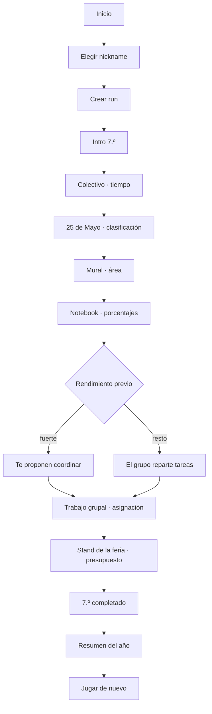

Ocho eventos: dos narrativos y seis desafíos. Duración objetivo histórica del slice: 3–5 minutos. Esta densidad pertenece al artefacto de demostración y no fija la longitud de un segmento normal de producción; desde STAGE-04 esa distinción está formalizada como un `DemoPlan`, un artefacto con reglas propias que **no** es un plan de run válido. Ver [ADR-021](03-architecture/adr/ADR-021-approved-catalog-in-play-and-teacher-demo.md).

## Contenido de 7.º grado

Vive en `src/content/grade-7/`, no en fixtures de desarrollo. Es contenido de producto versionado (`contentVersion` `0.9.0-grade-7`).

Son **ocho plantillas** y seis situaciones por partida: el slot del colectivo aloja dos plantillas de la misma familia y el seed elige cuál sale. La octava, `g7.bus-travel-review`, tiene rol `recovery` y no entra en la selección ordinaria: aparece sólo cuando el año quedó debiendo el colectivo. Ver [ADR-024](03-architecture/adr/ADR-024-progression-recovery-and-graduation.md).

| Id | Situación | Matemática | Interacción | Razonamiento |
|---|---|---|---|---|
| `g7.bus-timing` | El colectivo llega demorado y hay que elegir en cuál subir | tiempo + porcentaje simple | `timeline` | 28 min + 25 % = 35 min; salida + 35 min contra la hora de entrada |
| `g7.bus-latest-departure` | La misma demora, y el grupo pregunta con cuánto tiempo hay que salir | tiempo + porcentaje simple, recorrido al revés | `numeric-input` | 28 min + 25 % = 35 min; 35 + 10 de margen ⇒ salir 45 min antes |
| `g7.may-25-act` | La coreografía del acto del 25 de Mayo, adelante de toda la escuela | clasificación: pares, múltiplos de 3 y primos | `number-grid` | tres grillas de ocho números; se marcan los que cumplen la regla de cada paso |
| `g7.mural-paint` | Hay que comprar pintura para el mural de la feria | área y cobertura | `decision-card` | 6 × 2,4 = 14,4 m²; 14,4 ÷ 8 = 1,8 L ⇒ 2 L |
| `g7.notebook-offer` | El curso compara dos ofertas para una notebook | porcentaje contra monto fijo | `decision-card` | 20 % de 800.000 = 160.000 ⇒ 640.000, contra 800.000 − 120.000 = 680.000 |
| `g7.group-tasks` | Repartir el trabajo grupal entre cuatro personas | asignación con restricciones | `assignment-board` | horas disponibles contra horas requeridas, más afinidad |
| `g7.stand-supplies` | Comprar la merienda del stand sin pasarse del presupuesto | combinación y costo unitario | `budget-builder` | cubrir las porciones necesarias al menor costo |

Ambos rulesets seleccionan **dentro del catálogo aprobado de desarrollo** vigente `grade-7-dev-6`: 26 o 27 direcciones por plantilla generada, y las dos autoradas de `g7.group-tasks`. Siete plantillas declaran generadores por restricción y `g7.group-tasks` es autorada; las dos estrategias pasan por validación, fingerprint y deduplicación, y ninguna produce azar procedural libre en runtime. El seed de la run elige **cuál** variante sale; qué contiene esa dirección no depende de la run. El repaso sale del **mismo** catálogo aprobado: lo juega la misma persona bajo las mismas reglas y no le corresponde uno más laxo. `dev-5` conserva intactas las 159 entradas de `dev-4` y suma las 26 de `g7.bus-travel-review` para `contentVersion 0.9.0-grade-7`; `dev-6` rebalancea las del mural para `contentVersion 0.10.0-grade-7` ([remediación matemática](04-quality/mathematics-remediation-implementation.md)). Ver [ADR-021](03-architecture/adr/ADR-021-approved-catalog-in-play-and-teacher-demo.md), [ADR-022](03-architecture/adr/ADR-022-difficulty-model-and-run-composer.md) y [ADR-023](03-architecture/adr/ADR-023-competitive-score-policy.md).

### Calidades de resolución

Ninguno es correcto/incorrecto. Todos usan el modelo del motor:

- `invalid` — no resuelve el problema (llega tarde, no alcanza la pintura, no cubre las porciones, deja tareas sin asignar, excede el presupuesto o pierde la coreografía);
- `functional` — resuelve;
- `efficient` — resuelve sin desperdiciar;
- `optimal` — la mejor opción según la función objetivo declarada.

Un error nunca termina la run.

### El acto del 25 de Mayo

En la Teacher Demo es el evento que **introduce Aura**, y el único del arco amplio que ocurre en público. Está documentado en detalle en [el catálogo de desafíos](01-game-design/challenge-catalog.md#acto-del-25-de-mayo). Lo esencial para el slice:

- son **tres pasos** de la coreografía, cada uno con su regla escrita —«Números pares», «Múltiplos de 3», «Números primos»— y una grilla de ocho números;
- la narrativa, las señales y las reglas son autoradas; las grillas numéricas concretas tienen fuente `generated` y validadores matemáticos independientes;
- se juzga con **precisión y cobertura juntas** (F1 agregado sobre los tres pasos), de modo que ni marcar una sola celda evidente ni marcar la grilla entera pasan por buenos;
- mueve **Aura y Estilo, y nada más**: no pone nota, porque un acto escolar no es una evaluación de matemática, y no toca Equipo, porque bailás vos.

## Narrativa

Nueve storylets en `src/content/grade-7/storylets.ts`. El orden lo fija el motor por prioridad descendente y por condiciones encadenadas (`storylet-seen`), no la UI.

En el arco de la Teacher Demo, el acto del 25 de Mayo entra como tercer evento, entre el colectivo y el mural: el acto cae en mayo, después de las primeras semanas de clase y antes de que arranque el proyecto de la feria, así que se intercala en el calendario escolar sin partir la cadena causal del proyecto.

El evento 6 es una bifurcación real evaluada por el motor narrativo:

- `g7.project-lead` — requiere dos resultados `efficient` o mejores en los últimos tres eventos;
- `g7.project-support` — alternativa cuando esa condición no se cumple.

Cada uno deja un flag distinto, y el resumen final del año lo refleja. Es la prueba de que una decisión temprana cambia el relato posterior.

## Resultado

La pantalla final muestra **el año**, no un perfil de egreso: `TU 7.º GRADO`. El perfil definitivo pertenece a la carrera completa y no se inventa acá.

Cierre de etapa: numeral del año con tilde, renglones de registro (Promedio, Equipo, eventos), Estilo expandido cuando hay evidencia suficiente, lo más memorable del año y el arquetipo con su sello. El bloque de Aura aparece sólo si Aura cambió. La Teacher Demo lo establece porque incluye deliberadamente el acto; una partida compuesta sólo lo hace cuando su `RunPlan` contiene `g7.may-25-act`, y un año futuro puede no mover Aura.

El score no se muestra: el oficial lo calcula el servidor reproduciendo la run, y el ruleset de desarrollo no es oficial (preguntas abiertas 5 y 24).

## Reanudar

El checkpoint se guarda en `localStorage` después de cada evento resuelto, a través del sink de efectos del controller: el motor pide el snapshot, el adaptador lo escribe. Si al abrir existe un checkpoint compatible, la entrada ofrece continuar o empezar de nuevo (UF-03). Un checkpoint corrupto o de otra versión se descarta con un aviso claro; nunca se restaura un estado inválido.

El checkpoint se escribe con la pantalla de resultado a la vista, y el borrador de la respuesta vive en la vista y no en el snapshot. Al reanudar sobre un resultado, entonces, la UI ya no sabe qué eligió el jugador: las opciones se dibujan todas sin marca y **la grilla del acto no se corrige**, en lugar de afirmar que no se marcó nada. El ledger sigue explicando la cuenta, que es lo que no se pierde.

No hay backend en el loop de juego: la partida es enteramente local (ADR-006).

## Cobertura de tests

| Capa | Qué prueba |
|---|---|
| Unit de contenido | La matemática de cada variante: solución válida, óptima, insuficiente y bordes |
| Property | Toda variante ofrece al menos una solución suficiente; las vistas públicas no filtran la solución |
| Integración | La run completa de 7.º sin React, en tres caminos: fuerte, mixto y débil |
| Golden | Una run de referencia con seed y respuestas fijas |
| Replay | El action log reproduce estado final, score, carrera y flags |
| Resume | Snapshot → restaurar → continuar llega al mismo final |
| Componentes | Renderers de interacción y pantallas |
| E2E | Recorrido completo en browser, camino no óptimo, mobile, teclado y accesibilidad |
| Simulación | Miles de runs deterministas sin dead ends ni divergencias |
| Aura en la Teacher Demo | Ausente antes del acto, establecida después, positiva o negativa según cómo salga |

## Revisión manual

Recorrido completo en un browser real a 390 px, además de los gates automáticos. Lo que se corrigió a partir de mirarlo:

- **El trabajo grupal no se podía resolver en un teléfono.** Las horas y las habilidades de cada integrante vivían dentro de las opciones de los desplegables, donde un select nativo las trunca. Ahora la lista de quién puede hacer qué está a la vista, arriba de las tareas.
- **La notebook regalaba la cuenta.** Cada oferta mostraba el total ya calculado, así que el desafío se reducía a comparar dos números. Ahora se muestran el precio de lista y lo que juntaron, y el porcentaje lo saca el jugador. Hay un test que falla si el total vuelve a filtrarse.
- **Los precios no se leían como precios argentinos.** El motor formatea dinero en forma canónica (`24000.00`) porque su salida es determinista; la traducción a `$ 24.000` vive en `src/content/pesos.ts`, escrita a mano y sin `Intl`, para que sea idéntica en cualquier dispositivo.
- **La lista de herramientas mostraba identificadores en inglés.** Decía *"Herramientas disponibles: calculator"*; ahora dice *"Podés usar: calculadora"*.

Limitación conocida que queda abierta: las estrellas de habilidad (`★★`) se leen bien a la vista, pero un lector de pantalla las enuncia una por una. El enunciado explica la escala, así que la información no se pierde, pero conviene reemplazarlas por texto estructurado cuando se revise accesibilidad a fondo.

## Capa visual

Desde el Design System v0.1, ninguna de estas pantallas decide su propio color, tipografía, radio ni foco. Todas componen primitivas de `src/components/ui/` y primitivas de juego de `src/components/game/`. El mapa completo de qué reemplazó a qué está en [la migración](09-design-system/migration-7-grade.md), y las reglas en [el sistema de diseño](09-design-system/README.md).

La migración no tocó matemática, evaluación, narrativa, determinismo, scoring ni replay.

## Extender a 1.º año

Evaluado sobre el código que quedó implementado, no sobre la intención.

Lo que hace falta:

1. agregar `year-1` a `stages` en el ruleset del content set (`STAGE_ORDER` ya lo declara, con su banda de dificultad y sus categorías);
2. agregar definiciones de desafío en `src/content/year-1/challenges/`;
3. agregar storylets con sus condiciones y prioridades;
4. sumar un renderer sólo si aparece una interacción que el motor todavía no define;
5. agregar tests de contenido, extender el golden y correr la simulación sobre el content set nuevo.

Lo que **no** hace falta tocar, verificado:

- **El motor.** `src/game` no importa `src/content` en ninguna dirección; la frontera la vigila `eslint-plugin-boundaries` ([ADR-014](03-architecture/adr/ADR-014-product-content-package.md)).
- **La UI de juego.** `GameShell`, `ChallengeFrame` y los renderers de interacción se dibujan desde la vista pública que devuelve el motor. Ninguno sabe qué etapa está jugando.
- **El nombre de la etapa.** Vive en `src/components/game/stage-label.ts` y cubre las siete etapas; las pantallas lo consultan, no lo escriben. Por eso el botón dice *"Empezar 1.º año"* solo, sin editar el formulario.
- **El ciclo de vida de la run, el controller, el checkpoint y el routing.** Son agnósticos del contenido: el checkpoint valida contra `gameVersion`/`rulesetVersion`/`contentVersion` y descarta lo que no corresponda.

Lo que sí queda como deuda conocida:

- **`GameContainer` elige el content set con un import fijo a `@/content/grade-7`.** Es el único acoplamiento de la UI a una etapa concreta. Con dos años pasa a ser una elección —seguir la carrera o elegir año— y esa decisión de producto todavía no está tomada, así que el import se deja explícito en lugar de inventar un selector.
- **El contenido viaja entero en el bundle.** Con un año es irrelevante; con seis hay que cargar cada etapa por separado. La separación por carpeta ya deja hecho el corte.
- **Las políticas de score, dificultad y perfil siguen siendo las de desarrollo.** Ningún content set puede declararse oficial hasta cerrar las preguntas abiertas 5 y 24; `createRuleset` lo impide por diseño.
- **La copia de la portada nombra 7.º grado a mano.** Es correcta hoy y describe lo que el juego cubre; hay que reescribirla cuando deje de ser cierto.

## Qué tiene que probar la demo candidata

El slice de 7.º no es un prototipo descartable: es la **candidata a demo docente** de la Fase A del [ciclo de entrega real](00-product/real-delivery-lifecycle.md). Su trabajo es que el Departamento de Matemática pueda decidir si el proyecto se extiende a todos los años.

La **Teacher Demo Candidate** expone deliberadamente más contenido que un segmento normal para mostrar matemática, patrones de interacción y las cuatro dimensiones de carrera. Está implementada como `DemoPlan`, un tipo y una validación separados; **no** es un `RunPlan` con un máximo mayor. El plan normal ya se construye con `RunComposer`, mantiene uno o dos beats ordinarios por etapa y queda fijado antes de ejecutarse. Ver [ADR-019](03-architecture/adr/ADR-019-scenario-family-template-variant.md), [ADR-021](03-architecture/adr/ADR-021-approved-catalog-in-play-and-teacher-demo.md) y [ADR-022](03-architecture/adr/ADR-022-difficulty-model-and-run-composer.md).

Tiene que probar ocho cosas:

1. Egresado tiene identidad visual propia.
2. La matemática cambia decisiones en vez de funcionar como trivia.
3. Distintos patrones de interacción son posibles.
4. Promedio, Equipo, Aura y Estilo alcanzan como identidad de carrera.
5. Una segunda run se siente distinta de la primera.
6. Los resultados explican por qué una decisión funcionó.
7. El motor genera y reproduce variantes deterministas.
8. Las mismas fundaciones de UI y de motor escalan a los años siguientes.

### Variación: qué demostró STAGE-04 y qué sigue abierto

La diversidad **paramétrica** ya llega al gameplay desde el catálogo vigente `grade-7-dev-6`: la población de `dev-4`, la de la plantilla de repaso y el mural rebalanceado por la remediación matemática. La diversidad **cognitiva** tiene su primera prueba de producción en la familia `bus`: `g7.bus-timing` pide elegir una salida en un timeline y `g7.bus-latest-departure` pide producir una anticipación numérica recorriendo la relación al revés. Seeds distintas pueden elegir cualquiera de las dos dentro del slot del colectivo.

Eso demuestra la capacidad, no completa el inventario. Las otras cinco familias siguen con una plantilla cada una, y cuántas familias y plantillas necesita el juego final permanece **OPEN**. Ver [la migración](03-architecture/content-model-migration.md), [familias y variantes](01-game-design/challenge-families-and-variants.md) y [ADR-021](03-architecture/adr/ADR-021-approved-catalog-in-play-and-teacher-demo.md).

No se puede llamar «dinámico» a un cambio de orden de las opciones.

### El acto del 25 de Mayo

Está implementado y jugable. TG1-13 lo aceptó pedagógicamente (`KEEP`) y pidió enriquecer su narrativa y ampliar la variedad futura de contextos, incluidos deportes y competencias cuando la matemática lo justifique. La narrativa actual no fue rechazada y no se reescribió en esta integración. Su F1 sigue alimentando sólo Matemática: Aura competitiva requiere evidencia social independiente y pertenece a STAGE-08.

### Score en la demo

No hace falta un ranking online para el Teacher Gate 1, pero conviene exponer un **prototipo de desglose de score** para que los docentes puedan evaluar la filosofía competitiva antes de que se construya. Ver [score competitivo y ranking](01-game-design/competitive-scoring-and-ranking.md).

### Explícitamente fuera del alcance de la demo

Backend de ranking con premios; contenido de 1.º a 5.º; arcos completos de recuperación; sistema de cuentas; pipeline de arte de personajes; biblioteca grande de assets; y el algoritmo final de arquetipo de carrera completa.

---

# FILE: 07-reference/blueprint-v0.2-integration.md

# Integración del Project Blueprint v0.2.0

Qué entró, dónde quedó, qué se descartó y qué conflictos hubo. Este documento existe para que dentro de seis meses nadie tenga que adivinar por qué un documento dice lo que dice.

- **Paquete:** EGRESADO Project Blueprint & Technical Handoff v0.2.0 — 79 archivos, verificados contra su `MANIFEST.json`.
- **Fuente congelada:** [`docs/sources/egresado-project-blueprint-v0.2.0/`](sources/README.md).
- **Fecha de integración:** 28 de agosto de 2026.
- **Decisión de gobernanza:** [ADR-018](03-architecture/adr/ADR-018-blueprint-v0-2-decision-authority.md).
- **Alcance de la integración:** documentación únicamente. No se modificó comportamiento de producto, motor, frontend, sistema de diseño, tokens, contenido ejecutable, persistencia ni configuración de runtime.

## Cómo leer las acciones

| Acción | Significado |
|---|---|
| **NUEVO** | no existía documento equivalente; se creó uno canónico |
| **FUSIÓN** | el contenido se incorporó a un documento existente |
| **REFERENCIA** | el repositorio ya lo cubría; se dejó enlace, no copia |
| **SUPERADO POR EL REPO** | el repositorio tiene una versión más nueva o ya implementada; el paquete queda como historia |
| **DEFIERE A DISEÑO** | es material visual; manda el sistema de diseño implementado |

## Mapa por documento del paquete

### 00-governance

| Origen | Acción | Destino |
|---|---|---|
| `decision-register.md` | FUSIÓN | [registro de decisiones](07-reference/decision-register.md) |
| `decision-status.md` | FUSIÓN | [registro de decisiones](07-reference/decision-register.md) y [ADR-018](03-architecture/adr/ADR-018-blueprint-v0-2-decision-authority.md) |
| `glossary.md` | FUSIÓN | [glosario](07-reference/glossary.md) |
| `source-of-truth.md` | FUSIÓN | [ADR-018](03-architecture/adr/ADR-018-blueprint-v0-2-decision-authority.md) y el README de `docs/` |

### 01-product

| Origen | Acción | Destino |
|---|---|---|
| `real-delivery-lifecycle.md` | NUEVO | [ciclo de entrega real](00-product/real-delivery-lifecycle.md) |
| `product-vision.md` | FUSIÓN | [visión de producto](00-product/product-vision.md) |
| `full-project-scope.md` | FUSIÓN | [alcance y roadmap](00-product/scope-and-roadmap.md) |
| `scope-demo-7mo.md` | FUSIÓN | [vertical slice de 7.º](06-delivery/vertical-slice-grade-7.md) |
| `personas-and-contexts.md` | FUSIÓN | [personas y contextos](00-product/personas-and-contexts.md) |
| `risks-and-assumptions.md` | FUSIÓN | [riesgos y supuestos](00-product/risks-and-assumptions.md) |
| `success-metrics.md` | FUSIÓN | [métricas de éxito](00-product/success-metrics.md) |

### 02-functional

| Origen | Acción | Destino |
|---|---|---|
| `functional-specification.md` | REFERENCIA | [especificación funcional](02-functional/functional-specification.md); F-001…F-013 mapean a FR-001…FR-020 |
| `traceability-matrix.md` | FUSIÓN | [matriz de trazabilidad](02-functional/traceability-matrix.md) |
| `user-flows.md` | FUSIÓN | [flujos](02-functional/user-flows.md) |
| `user-stories.md` | FUSIÓN | [historias de usuario](02-functional/user-stories.md) |

### 02-game-design

| Origen | Acción | Destino |
|---|---|---|
| `challenge-families-and-variants.md` | NUEVO | [familias, plantillas y variantes](01-game-design/challenge-families-and-variants.md) |
| `difficulty-and-universal-playability.md` | NUEVO | [dificultad y jugabilidad universal](01-game-design/difficulty-and-playability.md) |
| `competitive-scoring-and-ranking.md` | NUEVO | [score competitivo y ranking](01-game-design/competitive-scoring-and-ranking.md) |
| `graduation-and-fail-forward.md` | NUEVO | [egreso y fail-forward](01-game-design/graduation-and-fail-forward.md) |
| `content-authoring-guide.md` | FUSIÓN | [guía de autoría](01-game-design/content-authoring-guide.md) |
| `narrative-and-storylets.md` | FUSIÓN | [sistema narrativo](01-game-design/narrative-system.md) |
| `full-content-roadmap.md` | FUSIÓN | [alcance y roadmap](00-product/scope-and-roadmap.md) |
| `core-loop-and-progression.md` | REFERENCIA | [GDD](01-game-design/game-design-document.md) |
| `grade7-challenge-catalog.md` | REFERENCIA | [catálogo de desafíos](01-game-design/challenge-catalog.md) |
| `player-career-model.md` | SUPERADO POR EL REPO | [ADR-016](03-architecture/adr/ADR-016-career-player-model.md), ya implementado |
| `grid-classification-scoring.md` | SUPERADO POR EL REPO | [catálogo de desafíos](01-game-design/challenge-catalog.md), ya implementado con F1 |

### 03-pedagogy

| Origen | Acción | Destino |
|---|---|---|
| `math-design-framework.md` | FUSIÓN | [marco matemático](01-game-design/math-design-framework.md) |
| `teacher-review-framework.md` | FUSIÓN | [gates docentes](06-delivery/teacher-gates.md) |
| `theory-basis.md` | FUSIÓN | [base teórica](07-reference/research-basis.md) |

### 04-design

Los tres documentos son **DEFIERE A DISEÑO**. El sistema de diseño implementado y el handoff de Claude Design v0.2 son la autoridad visual; el paquete sólo aportó contexto de producto, y ese contexto se cita sin repetir valores.

| Origen | Dónde manda de verdad |
|---|---|
| `ui-art-foundation.md` | [sistema de diseño](09-design-system/README.md), [colores](09-design-system/colors.md), [tipografía](09-design-system/typography.md), [fundamentos](09-design-system/foundations.md), [ADR-017](03-architecture/adr/ADR-017-paper-visual-identity.md) |
| `accessibility-and-interaction.md` | [accesibilidad del sistema de diseño](09-design-system/accessibility.md), [UX e interacción](01-game-design/ux-interaction-design.md) |
| `assets-motion-audio.md` | [assets](09-design-system/assets.md), [fundamentos](09-design-system/foundations.md) |

### 05-engine

| Origen | Acción | Destino |
|---|---|---|
| `target-engine-architecture.md` | NUEVO | [arquitectura objetivo del motor](03-architecture/target-engine-architecture.md) |
| `variant-generation-engine.md` | FUSIÓN | [familias y variantes](01-game-design/challenge-families-and-variants.md) y arquitectura objetivo |
| `difficulty-budget-scheduler.md` | FUSIÓN | [dificultad](01-game-design/difficulty-and-playability.md) y arquitectura objetivo |
| `scoring-replay-and-ranking.md` | FUSIÓN | [arquitectura objetivo del motor](03-architecture/target-engine-architecture.md) |
| `server-authoritative-fair-mode.md` | FUSIÓN | arquitectura objetivo; [ADR-004](03-architecture/adr/ADR-004-server-authoritative-scoring.md) y [ADR-006](03-architecture/adr/ADR-006-local-first-gameplay.md) ya lo decidían |
| `score-policy-configuration.md` | FUSIÓN | [score competitivo](01-game-design/competitive-scoring-and-ranking.md) y [score-policy.example.json](07-reference/score-policy.example.json) |
| `content-and-rules-versioning.md` | FUSIÓN | arquitectura objetivo, eje por eje |
| `api-contracts.md` | REFERENCIA | [contratos API](03-architecture/api-contracts.md); su contrato concreto sigue abierto |
| `data-model.md` | REFERENCIA | [modelo de datos](03-architecture/data-model.md) |
| `run-state-machine.md` | REFERENCIA | [game engine](03-architecture/game-engine.md) |
| `persistence-and-resume.md` | REFERENCIA | [game engine](03-architecture/game-engine.md) |
| `career-state-migration.md` | SUPERADO POR EL REPO | migración ya hecha: [ADR-016](03-architecture/adr/ADR-016-career-player-model.md), `ENGINE_VERSION 2.0.0` |

### 06-quality

| Origen | Acción | Destino |
|---|---|---|
| `variant-validation-invariants.md` | NUEVO | [validación y auditoría de variantes](04-quality/variant-validation-and-audit.md) |
| `statistical-variant-audit.md` | NUEVO | ídem |
| `scoring-fairness-audit.md` | NUEVO | [auditoría de equidad competitiva](04-quality/competition-fairness-audit.md) |
| `teacherless-preflight-risk-compensation.md` | FUSIÓN | [ciclo de entrega real](00-product/real-delivery-lifecycle.md) |
| `testing-and-simulation.md` | FUSIÓN | [estrategia de testing](04-quality/testing-strategy.md) |
| `manual-qa-matrix.md` | FUSIÓN | [estrategia de testing](04-quality/testing-strategy.md) |
| `security-threat-model.md` | FUSIÓN | [threat model](04-quality/threat-model.md) |
| `non-functional-requirements.md` | REFERENCIA | [NFR](04-quality/non-functional-requirements.md) |

### 07-operations

| Origen | Acción | Destino |
|---|---|---|
| `fair-mode-and-ranking.md` | NUEVO | [modo feria y congelamiento](05-operations/fair-mode-and-competition-freeze.md) |
| `competition-freeze-and-change-control.md` | NUEVO | ídem |
| `load-and-network-test-plan.md` | FUSIÓN | ídem |
| `privacy-and-minors.md` | FUSIÓN | ídem y [seguridad y privacidad](03-architecture/security-privacy.md) |
| `ranking-moderation-and-prizes.md` | FUSIÓN | [leaderboard y moderación](05-operations/leaderboard-and-moderation.md) |
| `incident-runbook.md` | FUSIÓN | [fallback e incidentes](05-operations/fallback-and-incident-plan.md) |
| `telemetry-and-observability.md` | FUSIÓN | [analytics y observabilidad](03-architecture/analytics-observability.md) |
| `deployment-and-environments.md` | FUSIÓN | [deploy y ambientes](03-architecture/deployment-and-environments.md) |

### 08-delivery

| Origen | Acción | Destino |
|---|---|---|
| `implementation-sequence.md` | NUEVO | [secuencia de implementación](06-delivery/implementation-sequence.md) |
| `teacher-gate-1-checklist.md` | NUEVO | [gates docentes](06-delivery/teacher-gates.md) |
| `teacher-gate-2-checklist.md` | NUEVO | ídem |
| `product-freeze-checklist.md` | FUSIÓN | ídem |
| `demo-presentation-guide.md` | FUSIÓN | ídem |
| `content-matrix-template.md` | FUSIÓN | [secuencia de implementación](06-delivery/implementation-sequence.md) |
| `agent-handoff.md` | FUSIÓN | secuencia de implementación y `AGENTS.md` |
| `definition-of-done.md` | FUSIÓN | [Definition of Done](06-delivery/definition-of-done.md) |
| `open-decisions.md` | FUSIÓN | [preguntas abiertas](07-reference/open-questions.md) |

### 09-reference

| Origen | Acción | Destino |
|---|---|---|
| `formulas-and-algorithms.md` | NUEVO | [fórmulas y algoritmos](07-reference/formulas-and-algorithms.md) |
| `research-basis.md` | FUSIÓN | [base teórica](07-reference/research-basis.md) |
| `examples/*` | COPIA | los `*.example.*` de este directorio |

## Conflictos y cómo se resolvieron

Cinco discrepancias reales entre el paquete y el repositorio. Ninguna se resolvió en silencio.

### 1 · Migración del modelo de jugador

- **Paquete:** pide migrar `knowledge/team/initiative/energy` a Promedio · Equipo · Aura · Estilo.
- **Repositorio:** ya migrado en `src/game/progression/career.ts`, `ENGINE_VERSION 2.0.0`.
- **Autoridad:** el código y [ADR-016](03-architecture/adr/ADR-016-career-player-model.md) son más nuevos.
- **Resolución:** el capítulo de migración queda como historia. La arquitectura objetivo lo marca **implementado** para que nadie replanifique trabajo hecho.

### 2 · Scoring de la grilla de clasificación

- **Paquete:** propone `0,6 × precisión + 0,4 × cobertura`, y sugiere F1 como generalización.
- **Repositorio:** el acto del 25 de Mayo ya usa F1 micro-agregado sobre las tres rondas, con los tres casos de denominador cero decididos y umbrales calibrados.
- **Autoridad:** el repositorio, que es más nuevo y está implementado y testeado.
- **Resolución:** superado. El razonamiento del paquete se conservó en [fórmulas y algoritmos](07-reference/formulas-and-algorithms.md) porque explica *por qué* F1 y no un promedio ponderado.

### 3 · Playtest con estudiantes antes de la feria

- **Paquete:** declara que probablemente no habrá playtest con estudiantes antes de la release de feria; es una restricción externa.
- **Repositorio:** varios documentos asumían testers y playtest como criterio de salida.
- **Autoridad:** el paquete, que describe el contexto real y es posterior.
- **Resolución:** los documentos prospectivos se corrigieron hacia el ciclo real y la limitación quedó declarada. Los criterios de playtest que sí se pueden ejecutar —prueba proxy con adultos, revisión heurística— se conservaron como tales, sin llamarlos validación con jugadores. Ver [ciclo de entrega real](00-product/real-delivery-lifecycle.md).

### 4 · La palabra «familia»

- **Paquete:** `ScenarioFamily` es un dominio narrativo: Colectivo, Mural, Stand.
- **Repositorio:** el [sistema de desafíos](01-game-design/challenge-system.md) llama «familias» a los patrones de interacción: Decision Card, Timeline, Number Grid.
- **Resolución:** ambos términos se conservan y se desambiguan explícitamente. Ninguno se renombró: renombrar habría tocado código y contenido, que están fuera del alcance de esta integración. La correspondencia está en [familias, plantillas y variantes](01-game-design/challenge-families-and-variants.md) y en el [glosario](07-reference/glossary.md).

### 5 · Nombres de las calidades de resolución

- **Paquete:** `optimal / resolved / partial / insufficient`.
- **Repositorio:** `optimal / efficient / functional / invalid`, implementado como `SolutionQuality`.
- **Resolución:** manda el repositorio. La correspondencia está en el [glosario](07-reference/glossary.md), y el score competitivo la usa explícitamente para que la calibración candidata `1,00 / 0,75 / 0,40 / 0,10` se lea contra las etiquetas correctas.

### Y una que **no** se resolvió

El paquete resume decisiones visuales —paleta, tipografías, geometría, isla de Aura— que ya están implementadas por el sistema de diseño. Cualquier diferencia entre ese resumen y lo implementado **se resuelve a favor de Claude Design v0.2 y del sistema implementado**, y no se reconcilia editando lo visual. Los documentos de producto enlazan al sistema de diseño; no repiten valores de token.

## Trazabilidad

De requisito de producto a estado de implementación. La columna de estado es una lectura del 29 de agosto de 2026 y se verifica contra el código antes de planificar.

| Requisito de producto | Regla de game design | Capacidad de motor | Estado actual | Fase futura |
|---|---|---|---|---|
| Escenarios que no se memorizan | [familias, plantillas y variantes](01-game-design/challenge-families-and-variants.md) | `ScenarioFamily`/`Template`/`Variant`, fuentes híbridas y generador por restricción | primera variación cognitiva de producción **implementada** en `bus`; profundidad del resto del catálogo abierta | STAGE-04 / STAGE-08 del [roadmap](06-delivery/implementation-sequence.md) |
| Competencia sin variantes defectuosas | [validación y auditoría de variantes](04-quality/variant-validation-and-audit.md) | validador transversal + catálogo aprobado | **implementado para desarrollo y consumido por gameplay** en `grade-7-dev-4`; catálogo oficial pendiente | FREEZE |
| Identidad de carrera legible | [ADR-016](03-architecture/adr/ADR-016-career-player-model.md) | `CareerState` v0.2 | **implementado** | — |
| Runs comparables entre sí | [dificultad](01-game-design/difficulty-and-playability.md) | bandas + scheduler por presupuesto | **implementado estructuralmente** bajo la policy candidata; calibración docente y equivalencia empírica pendientes | STAGE-05 (`DONE`) / Teacher Gate |
| Ranking dominado por matemática | [score competitivo](01-game-design/competitive-scoring-and-ranking.md) | `ScorePolicy` + `ScoringEngine` competitivo | `FairScore` candidato implementado y auditado; ranking pendiente | STAGE-06 (`DONE`) / STAGE-09 |
| Premiar mejora y no volumen | [modo feria](05-operations/fair-mode-and-competition-freeze.md) | comparador versionado + personal best | no implementado | STAGE-09 |
| El navegador no decide el premio | [ADR-004](03-architecture/adr/ADR-004-server-authoritative-scoring.md) | verificación por replay en servidor | base en `src/server/game/validate-run.ts` | STAGE-09 |
| Reproducibilidad y auditoría de una run | [ADR-003](03-architecture/adr/ADR-003-deterministic-seeded-engine.md) | seed + versiones + action log | **implementado**, con `variantCatalogVersion`, huella de plan y `scoreVersion` opcionales | emisión oficial en STAGE-09 |
| El error no expulsa al jugador | [egreso y fail-forward](01-game-design/graduation-and-fail-forward.md) | invariante de egreso + recuperación comprimida | **implementado** en STAGE-07; hoy repasan colectivo en 7.º y agenda/escala en 1.º (Phase 1), el resto declara `none` | contenido de 2.º–5.º en STAGE-08 |
| Datos mínimos de menores | [ADR-008](03-architecture/adr/ADR-008-anonymous-identity.md) | identidad pseudónima | **implementado** en la base | retención abierta, STAGE-10 |

## Qué NO hizo esta integración

- No implementó ninguna capacidad marcada TARGET.
- No cerró ninguna pregunta abierta ni ninguna decisión de Teacher Gate.
- No promovió una recomendación a regla: la ponderación 80/15/5, la política de intentos y la calibración de calidades siguen siendo candidatas.
- No tocó el sistema de diseño, sus tokens, su CSS, sus componentes ni sus capturas.
- No modificó código, contenido ejecutable, esquemas de estado, persistencia, snapshots, replay ni configuración de runtime.
- No agregó ni actualizó dependencias.

---

# FILE: 07-reference/decision-register.md

# Registro de decisiones

| ADR | Decisión | Estado |
|---|---|---|
| ADR-001 | Web-first Next.js/TypeScript | Aceptado |
| ADR-002 | Monolito modular + BFF | Aceptado |
| ADR-003 | Motor determinista seeded | Aceptado |
| ADR-004 | Scoring oficial server-side | Aceptado |
| ADR-005 | PostgreSQL/Supabase | Aceptado |
| ADR-006 | Gameplay local-first | Aceptado |
| ADR-007 | Content-as-data | Aceptado |
| ADR-008 | Identidad anónima/pseudónima | Aceptado |
| ADR-009 | Leaderboards por evento | Aceptado |
| ADR-010 | Toolchain Node.js/pnpm y artefacto Docker portable | Aceptado |
| ADR-011 | Núcleo funcional con función de transición explícita | Aceptado |
| ADR-012 | PRNG seeded, substreams y contrato de consumo | Aceptado |
| ADR-013 | Aritmética racional exacta para evaluación matemática | Aceptado |
| ADR-014 | Contenido de producto como paquete propio importable desde el cliente | Aceptado |
| ADR-015 | Sistema de diseño con tokens semánticos y paleta restringida | Aceptado (reemplazado parcialmente por ADR-017) |
| ADR-016 | Modelo de jugador de carrera: Promedio, Equipo, Aura y Estilo | Aceptado |
| ADR-017 | Identidad papel: la hoja cuadriculada como canvas del juego | Aceptado |
| ADR-018 | Autoridad y madurez de las decisiones del Project Blueprint v0.2 | Aceptado |
| ADR-019 | Modelo de contenido: familia de escenario, plantilla y variante | Aceptado |
| ADR-020 | Pipeline de variantes y catálogo aprobado | Aceptado |
| ADR-021 | [El catálogo aprobado dentro del juego, y el demo docente](03-architecture/adr/ADR-021-approved-catalog-in-play-and-teacher-demo.md) | Aceptado |
| ADR-022 | [Modelo de dificultad y compositor de runs](03-architecture/adr/ADR-022-difficulty-model-and-run-composer.md) | Aceptado |
| ADR-023 | [Política de score competitivo](03-architecture/adr/ADR-023-competitive-score-policy.md) | Aceptado |
| ADR-024 | [Progresión, recuperación y egreso](03-architecture/adr/ADR-024-progression-recovery-and-graduation.md) | Aceptado |
| ADR-025 | [Evolución acotada de contratos de carrera completa](03-architecture/adr/ADR-025-full-career-contract-evolution.md) | Aceptado; implementación futura |

## Regla para ADR nuevo

Crear ADR cuando una decisión:
- afecta múltiples módulos;
- es difícil/costosa de revertir;
- cambia una propiedad no funcional significativa;
- cambia proveedor/plataforma principal;
- altera compatibilidad de runs o seguridad.

## Decisiones del Project Blueprint v0.2

Estas decisiones vienen del [Project Blueprint v0.2.0](07-reference/blueprint-v0.2-integration.md) y **conservan su nivel de madurez**, que es parte de la decisión. [ADR-018](03-architecture/adr/ADR-018-blueprint-v0-2-decision-authority.md) fija cómo se interpreta cada nivel.

| Nivel | Qué significa para quien implementa |
|---|---|
| **LOCKED** | fundación aceptada; se implementa salvo que una autoridad más nueva la supere |
| **PRODUCT DIRECTION** | dirección fuerte; la arquitectura debe poder sostenerla aunque hoy no exista |
| **RECOMENDADA** | propuesta senior; se implementa configurable, nunca como constante inmutable |
| **TEACHER GATE** | requiere validación del Departamento de Matemática antes del congelamiento |
| **OPEN** | deliberadamente sin resolver; no se cierra dentro del código |
| **DEFERRED** | fuera de alcance a propósito; no es deuda ni backlog urgente |

| ID | Decisión | Nivel | Estado de implementación |
|---|---|---|---|
| D-001 | Identidad visual UI-first: la identidad sale del sistema, no de cientos de assets | LOCKED | implementado ([sistema de diseño](09-design-system/README.md)) |
| D-002 | Identidad papel v0.2 de Claude Design en lugar de la estética de carrera deportiva | LOCKED | implementado ([ADR-017](03-architecture/adr/ADR-017-paper-visual-identity.md)) |
| D-003 | Sólo Promedio, Equipo, Aura y Estilo como dimensiones visibles | LOCKED | implementado ([ADR-016](03-architecture/adr/ADR-016-career-player-model.md)) |
| D-004 | Dominio matemático oculto, nunca una barra de «Conocimiento» | LOCKED | implementado |
| D-005 | Sin game over global: el error cambia el camino, no termina la partida | PRODUCT DIRECTION | **implementado** en STAGE-07: recuperación fail-forward y egreso garantizado ([ADR-024](03-architecture/adr/ADR-024-progression-recovery-and-graduation.md)) |
| D-006 | Jerarquía `ScenarioFamily → Template → Variant` | RECOMENDADA | **implementada** ([ADR-019](03-architecture/adr/ADR-019-scenario-family-template-variant.md)) y **ejercida en producción**: la familia `bus` aloja dos plantillas con razonamientos distintos ([ADR-021](03-architecture/adr/ADR-021-approved-catalog-in-play-and-teacher-demo.md)); el inventario de contenido sigue abierto |
| D-007 | Variantes deterministas por seed | LOCKED como dirección de arquitectura | implementado ([ADR-003](03-architecture/adr/ADR-003-deterministic-seeded-engine.md), [ADR-012](03-architecture/adr/ADR-012-seeded-prng-and-substreams.md)) |
| D-008 | Catálogo de variantes prevalidado y desplegado para competencia | RECOMENDADA | **implementado y consumido por la partida** ([ADR-020](03-architecture/adr/ADR-020-variant-generation-and-approved-catalog.md), [ADR-021](03-architecture/adr/ADR-021-approved-catalog-in-play-and-teacher-demo.md)); las versiones publicadas son inmutables y el catálogo oficial de la feria sigue sin congelar |
| D-009 | Intentos ilimitados con mejor resultado verificado | TG1 ACCEPTED · PRODUCT DIRECTION | no implementado; emisión autoritativa, persistencia y ranking pertenecen a STAGE-09 ([modo feria](05-operations/fair-mode-and-competition-freeze.md)) |
| D-010 | `FairScore` separado de las stats de carrera | RECOMENDADA | **implementado** ([ADR-023](03-architecture/adr/ADR-023-competitive-score-policy.md)): el score no recibe la carrera, así que no hay por dónde filtrarla |
| D-011 | La matemática domina el `FairScore` | TG1 ACCEPTED | **implementado como regla ejecutable**; el candidato post-Gate `fair-score-dev-2` usa 85/10/5 y sigue `official: false` |
| D-012 | Estilo sólo Career/Narrative, sin FairScore ni Prestige competitivo | LOCKED v1, Product Pass | FairScore ya lo excluye; track STYLE de Prestige supersedido; [Prestige](01-game-design/rare-events-and-prestige.md) |
| D-013 | FairScore DESC → Prestige DESC → puesto compartido; ningún criterio temporal | LOCKED v1, supersede candidato post-TG1 | implementación STAGE-09; [ranking](01-game-design/competitive-scoring-and-ranking.md#desempate) |
| D-014 | Presupuesto de dificultad por run competitiva | RECOMENDADA; bandas aceptadas en TG1 | **implementado** ([ADR-022](03-architecture/adr/ADR-022-difficulty-model-and-run-composer.md)); los costos/umbrales exactos siguen calibrables |
| D-015 | Diseño de tareas de piso bajo y techo alto | RECOMENDADA como principio | vigente en el contenido de 7.º, y ahora **ejecutable**: la banda de una plantilla se deriva de su estructura, no de sus números ([ADR-022](03-architecture/adr/ADR-022-difficulty-model-and-run-composer.md)) |
| D-016 | No hay playtest real con estudiantes antes de la feria | RESTRICCIÓN EXTERNA | declarada ([ciclo de entrega real](00-product/real-delivery-lifecycle.md)) |
| D-017 | Congelamiento de reglas y score durante el evento oficial | RECOMENDADA como regla de operación | política escrita, sin evento oficial todavía |
| D-TG1-01 | Accesibilidad matemática universal: cada etapa conserva piso de prerrequisitos aproximadamente de 7.º; el año expresa progresión narrativa/contextual, no gating curricular | TG1 ACCEPTED · PRODUCT DIRECTION | requisito canónico para STAGE-08; fuente TG1-01 |
| D-TG1-02 | `AcademicStage ≠ DifficultyBand`; cada etapa puede contener CORE/STANDARD/STRETCH y la dificultad sigue siendo estructural | TG1 ACCEPTED | mecanismo existente preservado; fuente TG1-01/TG1-03 |
| D-TG1-03 | Candidato post-Gate 85 Math / 10 Team / 5 Aura | TG1 ACCEPTED · IMPLEMENTED CANDIDATE | `fair-score-dev-2@2.0.0-post-tg1-candidate`, `official: false`; fuente TG1-04 |
| D-TG1-04 | Una escena puede evaluar varios ejes sólo con evidencia semánticamente independiente; el mismo hecho no se cobra dos veces | TG1 ACCEPTED · PRODUCT DIRECTION | guardrail de autoría; no se duplicó el F1 de May-25 en Aura; fuente TG1-05/TG1-06 |
| D-TG1-05 | Componentes competitivas ausentes salen y los pesos activos se normalizan | TG1 ACCEPTED · IMPLEMENTED | invariante y auditoría conservadas; fuente TG1-07 |
| D-TG1-06 | Una dificultad estructural mayor puede recibir una recompensa competitiva pequeña | TG1 ACCEPTED PRINCIPLE | factores 1,00/1,08/1,15 siguen calibración candidata; fuente TG1-08 |
| D-TG1-07 | Mapeo discreto óptimo/eficiente/funcional/inválido = 100/75/40/10 | TG1 ACCEPTED CANDIDATE | implementado en ambas policies; métricas continuas conservan su señal; fuente TG1-09 |
| D-TG1-08 | Intentos competitivos ilimitados y mejor resultado verificado | TG1 ACCEPTED · PRODUCT DIRECTION | STAGE-09; la infraestructura asigna seed/plan y evita selección manual; fuente TG1-10 |
| D-TG1-09 | Carrera completa con objetivo UX aproximado de 8–10 minutos | TG1 ACCEPTED TARGET | se medirá en STAGE-08; no es timeout ni input de score; fuente TG1-12 |
| D-TG1-10 | Toda run válida completada termina en `GRADUATED` | TG1 ACCEPTED · **IMPLEMENTED** | cerrada en STAGE-07 ([ADR-024](03-architecture/adr/ADR-024-progression-recovery-and-graduation.md)): la convergencia es estructural, no configurada, y 20.000 carreras de seis años egresan sin hallazgos; fuente TG1-14 |
| D-018 | Un beat de recuperación no aporta evidencia competitiva | RECOMENDADA | **implementada** ([ADR-024](03-architecture/adr/ADR-024-progression-recovery-and-graduation.md)): descartada por rol en el scorer, así que fallar a propósito no compra una oportunidad extra de puntuar |
| D-019 | Las previas son historia oculta, nunca deuda que bloquee | RECOMENDADA | **implementada**: un año que cierra con lo justo deja rastro para callbacks futuros y no puede impedir el egreso; los callbacks son contenido de STAGE-08 |

## Decisiones de STAGE-08 / Phase 0

Son decisiones de producto y contenido, no ADRs ni evidencia de implementación. La
[envolvente](01-game-design/stage-08-product-design-envelope.md) y los documentos
especializados conservan el detalle; este registro sólo las indexa. `CANDIDATE` y
`DESIGN-CANDIDATE-APPROVED` preservan calibración/madurez y no equivalen a runtime
congelado.

| ID | Decisión | Madurez | Estado / fuente canónica |
|---|---|---|---|
| D-S08-001 | La carrera progresa adaptación → consolidación → pertenencia → autonomía → responsabilidad → cierre; 7.º y 1.º comparten escuela | LOCKED | [sistema narrativo](01-game-design/narrative-system.md) |
| D-S08-002 | Año y dificultad son ejes independientes; el piso matemático sigue accesible desde aproximadamente 7.º | LOCKED | [envolvente](01-game-design/stage-08-product-design-envelope.md) |
| D-S08-003 | Narrativa braided-linear con elenco relacional, voz argentina legible, callbacks medios y previas como memoria | ACCEPTED; previas LOCKED | callbacks multianuales no implementados; [sistema narrativo](01-game-design/narrative-system.md) |
| D-S08-004 | Recurring Arc: presencia narrativa no exige desafío puntuable | LOCKED | [arco](01-game-design/full-career-content-matrix.md#recurring-arc-policy); frecuencia en D-S08-019 |
| D-S08-005 | Normal/Fair exactamente nueve beats; envolvente de pacing/diversidad y novedad en Practice | LOCKED cantidad; PRODUCT DIRECTION envolvente | supersede target 9–10; [matriz](01-game-design/full-career-content-matrix.md#envolvente-normalfair-v1); sin runtime |
| D-S08-006 | Team/Aura/Estilo usan evidencia propia y una interacción nueva no se esconde como contenido | LOCKED | [envolvente](01-game-design/stage-08-product-design-envelope.md) |
| D-S08-007 | Rareza seeded acotada; aparición cero; Fair fija presencia por edición | LOCKED guardrails; RECOMENDADA calibración v1 | [eventos raros](01-game-design/rare-events-and-prestige.md); ADR-025 futuro |
| D-S08-008 | Prestige secundario 40/40/20, máximo 100, evidencia independiente | LOCKED v1 | supersede 25×4/STYLE; [Prestige](01-game-design/rare-events-and-prestige.md); sin runtime |
| D-S08-009 | Career Epilogue v1 y estructura de Milestones cerrados | LOCKED v1 | [narrativa](01-game-design/narrative-system.md); logros por autorar, sin runtime |
| D-S08-010 | Matriz conserva 25 Templates y 6/13/6 auditadas sin reemplazos adicionales | DESIGN-CANDIDATE-APPROVED | [matriz](01-game-design/full-career-content-matrix.md); no producción ni validación empírica |
| D-S08-011 | Las cinco Templates de consolidación de 1.º, su placement, Team/Aura y pacing están aprobados a nivel de diseño | DESIGN-CANDIDATE-APPROVED | implementación no iniciada; [diseño de 1.º](01-game-design/grade-1-template-design.md) |
| D-S08-012 | Rutas candidatas `rehearsal-schedule → schedule-review` y `classroom-layout → scale-fit-review` | ACCEPTED DESIGN | no implementadas; Aura ordinaria de 1.º ausente |
| D-S08-013 | La auditoría de ambas obligaciones bajo máximo un recovery es obligatoria después de implementar 1.º | LOCKED PROCESS | `REQUIRED · PLANNED`; [contrato](04-quality/post-grade-1-scalability-audit.md) |
| D-S08-014 | Pase de 2.º aprobado: pertenencia, placement, pacing, señales y ruta de encuesta | DESIGN-CANDIDATE-APPROVED | no implementado; [diseño de 2.º](01-game-design/grade-2-template-design.md) |
| D-S08-015 | Pase de 3.º aprobado: autonomía, riqueza de Estilo y dos rutas de recuperación | DESIGN-CANDIDATE-APPROVED | no implementado; [diseño de 3.º](01-game-design/grade-3-template-design.md) |
| D-S08-016 | Pase de 4.º aprobado: responsabilidad, cluster, reemplazo raro y dos rutas | DESIGN-CANDIDATE-APPROVED | no implementado; [diseño de 4.º](01-game-design/grade-4-template-design.md) |
| D-S08-017 | Pase de 5.º aprobado: cierre/futuro, síntesis, señales y dos rutas | DESIGN-CANDIDATE-APPROVED | no implementado; [diseño de 5.º](01-game-design/grade-5-template-design.md) |
| D-S08-018 | Event Cluster Policy: Intercurso de 2.º, School Event de 4.º y Egreso de 5.º admiten máximo una Template puntuable de cada cluster por run normal | LOCKED | política de producto, sin campos/runtime nuevos; [clusters](01-game-design/full-career-content-matrix.md#event-cluster-policy) |
| D-S08-019 | Project hard max 2; target 1–2 y preferencia no consecutiva | LOCKED v1 máximo; SOFT target/separación | supersede máximo candidato; [frecuencia](01-game-design/full-career-content-matrix.md#frecuencia-del-project-arc) |
| D-S08-020 | Callback Independence: historia enriquece contexto sin condicionar comprensión, resolución ni techo de FairScore | LOCKED | [callbacks](01-game-design/narrative-system.md#callback-independence) |
| D-S08-021 | Responsibility Externality: 4.º muestra efectos sobre terceros/sistemas sin Equipo automático | LOCKED | [externalidad](01-game-design/narrative-system.md#responsibility-externality) |
| D-S08-022 | Career Convergence: 5.º recupera historia visiblemente manteniendo Templates autocontenidas | LOCKED | [convergencia](01-game-design/narrative-system.md#career-convergence) |
| D-S08-023 | Saliencia determinista 3–5 por segmentos y prioridad autorada/ID | LOCKED v1 | supersede algoritmo diferido; [saliencia](01-game-design/narrative-system.md#narrative-salience); sin runtime |
| D-S08-024 | `represent-class`: Math, acción pública de Aura y logro histórico de Prestige usan evidencia distinta; aparición vale 0 | LOCKED | [diseño de 4.º](01-game-design/grade-4-template-design.md#y4represent-class) |
| D-S08-025 | `next-step-options`: FairScore de viabilidad, preferencia opcional sólo Estilo/epílogo, sin orientación vocacional | LOCKED | [diseño de 5.º](01-game-design/grade-5-template-design.md#y5next-step-options) |
| D-S08-026 | Product Pass y conformidad aceptados; reconciliación cierra Phase 0; siguiente Phase 1 G1 | LOCKED proceso | [integración](07-reference/full-career-product-audit-integration.md), [etapa actual](06-delivery/current-stage.md); sin implementación en este commit |
| D-S08-027 | Preferir diversidad cognitiva entre planes válidos; evitar semana + recorrido de 3.º sólo cuando haya alternativa equivalente más diversa | ACCEPTED · SOFT | [composición](01-game-design/full-career-content-matrix.md#diversidad-cognitiva); no exclusión dura |

## Cierre del Product Pass — 2026-09-10

El [registro de integración](07-reference/full-career-product-audit-integration.md) relaciona
FC-001…FC-030 con fuentes únicas y conserva las supersesiones. Son decisiones de
producto, no flags `official` ni evidencia de implementación.

| ID | Decisión | Madurez | Fuente / estado |
|---|---|---|---|
| D-S08-028 | Cinco motores reutilizables; los nombres de tableros son modos | LOCKED v1 | [taxonomía](01-game-design/challenge-system.md); soporte runtime parcial |
| D-S08-029 | REPASO visible; INVALID en fuentes recovery-capable; FUNCTIONAL no | LOCKED v1 | [fail-forward](01-game-design/graduation-and-fail-forward.md); label global pendiente |
| D-S08-030 | Una selección determinista, debrief del resto y cierre de todas | LOCKED producto | [fail-forward](01-game-design/graduation-and-fail-forward.md); deltas ADR-025, gate post-G1 pendiente |
| D-S08-031 | Competition Seed compartida server-issued por edición; reintentos iguales; Practice no oficial | LOCKED v1 | [modo feria](05-operations/fair-mode-and-competition-freeze.md); STAGE-09 |
| D-S08-032 | Probabilidades y límites por banda de rareza | RECOMENDADA, calibración v1 aceptada | [defaults](01-game-design/rare-events-and-prestige.md#defaults-de-practice-v1); no constantes ni freeze |
| D-S08-033 | Top 3 público pseudónimo; puesto propio privado; sin exposición infinita inferior | LOCKED v1 | [leaderboard](05-operations/leaderboard-and-moderation.md); no implementado |
| D-S08-034 | Intrinsic Math Gate IM-1…IM-5 y legitimidad de estrategias | LOCKED | [autoría](01-game-design/content-authoring-guide.md#intrinsic-math-gate) |
| D-S08-035 | Formas semánticas y materializaciones son distintas; targets 3/4, 12/16, 8 | LOCKED distinción; RECOMENDADA targets | [profundidad](01-game-design/content-authoring-guide.md#profundidad-de-variantes); no límite de schema |
| D-S08-036 | Estilo no se infiere de azar, INVALID o calidad matemática sola | LOCKED dirección | [autoría](01-game-design/content-authoring-guide.md#estilo-y-evidencia-de-identidad); revisar contenido al implementar, sin cambios runtime actuales |
| D-S08-037 | Acceso teclado/tap sin drag, color redundante, reduced motion; 44 px target interno | LOCKED acceso; PRODUCT DIRECTION target | [UX](01-game-design/ux-interaction-design.md); walkthroughs antes de feria |
| D-S08-038 | Sin LLM en gameplay, score, materialización o epílogo competitivo v1 | LOCKED | [autoría](01-game-design/content-authoring-guide.md#sin-llm-en-runtime-competitivo-v1) |
| D-S08-039 | Contratos futuros acotados: composición global, Repaso, hechos, rareza y replay | Aceptado, NOT IMPLEMENTED | [ADR-025](03-architecture/adr/ADR-025-full-career-contract-evolution.md) |
| D-S08-040 | Conservar los 25 diseños; no ampliar antes de G1 salvo BLOCKER genuino; Teacher Demo separado | LOCKED alcance | [matriz](01-game-design/full-career-content-matrix.md) y roadmap |
| D-S08-041 | Mitigar ausencia de playtest con docentes, walkthroughs y simulación, sin llamarlos validación estudiantil | PRODUCT DIRECTION | [validación de contenido](04-quality/content-validation.md); riesgo residual |
| D-S08-042 | Montos ficticios/relativos y tono argentino legible, sin juicios de poder adquisitivo ni marcas necesarias | LOCKED guardrail | [autoría](01-game-design/content-authoring-guide.md) |
| D-S08-043 | Rueda y datos móviles conservan CORE por factibilidad constructiva, sin optimización estructural; thresholds y bandas de 7.º intactos | ACCEPTED · precisión autorizada de Phase 1 | [traits y envolvente](01-game-design/grade-1-template-design.md#difficulty-reconciliation-precisión-de-phase-1); no reapertura de Phase 0 |

## STAGE-08 / Phase 1 — implementación de 1.º (2026-09-11)

Decisiones técnicas y de autoría tomadas al implementar; no reabren producto.

| ID | Decisión | Madurez | Fuente / estado |
|---|---|---|---|
| D-S08-044 | Engine `7.0.0` y action log `5` por composición global, respuestas constructivas y fail-closed; snapshot `7` sin campos nuevos; 7.º conserva ruleset, contenido, catálogo y score | ACCEPTED · implementado | [ADR-025](03-architecture/adr/ADR-025-full-career-contract-evolution.md#implementación-de-phase-1-2026-09-11) |
| D-S08-045 | Metadata de composición tipada y `CareerConstraints` con alcance `partial-development`/`full-career`; búsqueda acotada con validador independiente; una carrera parcial nunca es oficial | ACCEPTED · implementado | ADR-025; `7.º → 1.º` es práctica local |
| D-S08-046 | Repaso practicado/debriefeado derivado de obligaciones y ruteo; approved-only fail-closed en creación y en el borde del beat | ACCEPTED · implementado | ADR-024/ADR-025; gate post-G1 pendiente |
| D-S08-047 | Estilo de 1.º desde rasgos estratégicos independientes de la calidad; gate: óptimo alcanzable con ≥2 estilos y ningún estilo atado a un solo nivel | ACCEPTED · autoría; pesos candidatos | [implementación de 1.º](01-game-design/grade-1-template-design.md#implementación-runtime-phase-1); pregunta 47 sigue para freeze |
| D-S08-048 | Expo: robustez del óptimo = reemplazo posible para presentar; dependencia real «presenta quien investigó o construyó»; nota de Promedio por ser el proyecto evaluado del curso | ACCEPTED · autoría | ídem; FairScore sin cambios |
| D-S08-049 | Catálogo `grade-1-dev-1` con la política de build de 7.º; sign-off manual de la rueda y revisión del Departamento quedan como gates de producción | ACCEPTED · desarrollo | [variantes](04-quality/variant-validation-and-audit.md#catálogo-de-1º-grade-1-dev-1) |
| D-S08-050 | `rare.y1.power-outage` diferido: hechos registrados y hook `implemented: false`; sin orquestación de rareza antes de ADR-025 completo | ACCEPTED · diferido | [eventos raros](01-game-design/rare-events-and-prestige.md) |
| D-S08-051 | El encabezado de etapa cuenta la etapa con la duración del plan; sus celdas se angostan antes de desbordar | ACCEPTED · UI | [primitivas de juego](09-design-system/game-components.md) |

## STAGE-08 / Post-Grade-1 Scalability Audit (2026-09-14)

Ejecución del gate sobre 1.º real. Ninguna decisión de producto se reabrió.

| ID | Decisión | Madurez | Fuente / estado |
|---|---|---|---|
| D-S08-052 | El gate post-G1 pasa como `PASS WITH REQUIRED HARDENING — RESOLVED`: un Repaso que practica una obligación y debriefea el resto se sostiene con contenido real, y 2.º–5.º quedan desbloqueados | ACCEPTED · gate ejecutado | [audit post-G1](04-quality/post-grade-1-scalability-audit.md#resultado-de-la-ejecución-2026-09-14) |
| D-S08-053 | La celda del plano corta el texto: varios objetos en una celda no pueden ensanchar la tabla ni sacar la pantalla del viewport a 360 px | ACCEPTED · hardening | E2E `layout-invalid`, que falla sin el arreglo |
| D-S08-054 | El reflow se mide también con la respuesta ya construida, no sólo con la interacción vacía | ACCEPTED · cobertura | `tests/e2e/grade-1.spec.ts` |
| D-S08-055 | ~~El piso declarado es 360 px; bajar el piso queda como decisión de producto abierta~~ **Superada por D-S08-057 el 2026-09-15** | SUPERSEDED | [accesibilidad](09-design-system/accessibility.md) |
| D-S08-056 | ~~El costo de composición global —unos 2,7 s con 36 Templates— se vuelve a medir con el catálogo real antes de componer la carrera oficial~~ **CERRADA el 2026-09-16 con evidencia**: con las 42 Templates reales, 300 carreras compuestas dan p50 **384 ms**, p95 **404 ms** y peor caso **434 ms**, 0 fallas y 0 planes inválidos. Los 2,7 s eran un artefacto del catálogo sintético, no del algoritmo | CLOSED · aceptada con evidencia | `tests/integration/full-career.test.ts`; [audit post-G1](04-quality/post-grade-1-scalability-audit.md#resultado-de-la-ejecución-2026-09-14) |

## STAGE-08 / Piso de reflow (2026-09-15)

| ID | Decisión | Madurez | Fuente / estado |
|---|---|---|---|
| D-S08-057 | El piso de reflow de la experiencia general es **320 px**: sin scroll horizontal de página, sin pérdida de información ni de funcionalidad, con teclado y alternativas sin arrastre intactas. `html` declara `min-width: 320px` | PRODUCT DECISION · implementada | [accesibilidad](09-design-system/accessibility.md); [cierre de F-03](04-quality/post-grade-1-scalability-audit.md#cierre-de-f-03-2026-09-15) |
| D-S08-058 | Una representación que necesita dos dimensiones por significado puede scrollear **dentro de su propia región**, alcanzable por teclado; nunca la página, y nunca como única vía para completar el desafío | PRODUCT DECISION · implementada | plano de 1.º: los controles X/Y/orientación completan la respuesta |

## STAGE-08 / Implementación de 2.º y 3.º (2026-09-15)

| ID | Decisión | Madurez | Fuente / estado |
|---|---|---|---|
| D-S08-059 | La autoría deja de ser de 1.º: las mecánicas compartidas —ejes de candidato, escalera 100/75/40/10, gates de Estilo y witness— viven en `src/content/authoring.ts` y 1.º las re-exporta sin cambiar una línea | ACCEPTED · arquitectura | `src/content/authoring.ts`; `src/content/grade-1/authoring.ts` |
| D-S08-060 | El motor contrata una sexta respuesta semántica, `classification`: enunciados etiquetados contra un conjunto común, con la acción pública en su propio campo para que Math y Aura no puedan pagarse dos veces. Engine `8.0.0`, action log `6` | ACCEPTED · contrato | `interactions.ts`, `commands.ts`, `y2.standings-claim` |
| D-S08-061 | 2.º queda implementado sobre `grade-2-dev-1`: cinco Templates, un Repaso y práctica parcial `7.º → 2.º`, con evidencia Math/Equipo separada en el plan del Intercurso y Math/Aura separada en la tabla | ACCEPTED · implementación | [diseño de 2.º](01-game-design/grade-2-template-design.md#implementación-runtime) |
| D-S08-062 | El motor contrata una séptima respuesta, `route-builder` —el orden de las paradas—, y un modo de varios días para la agenda, con minutos absolutos desde el primer día. Engine `9.0.0`, action log `7`; snapshot `7` sin cambios | ACCEPTED · contrato | `interactions.ts`, `commands.ts`, `y3.route-plan`, `y3.week-planner` |
| D-S08-063 | Una política de composición **congela** sus objetivos blandos: agregar uno al vocabulario no puede cambiar en silencio qué plan gana en un content set ya publicado. 7.º y los fixtures declaran `PUBLISHED_OBJECTIVES_V1` | ACCEPTED · hardening | `composition-policy.ts`; `tests/unit/run-composer.test.ts` |
| D-S08-064 | La preferencia blanda de diversidad cognitiva de 3.º se implementa como objetivo `cognitive-variety`: **cuenta** las parejas de la etapa cuyos perfiles difieren en un rasgo o menos, y prefiere menos. Contar en vez de maximizar la distancia es lo que evita fijar una sola pareja en todas las runs. Ordena planes válidos, nunca filtra, y el compositor sigue sin conocer un solo id de desafío | ACCEPTED · composición | `composer.ts` (`NEAR_PROFILE_DISTANCE`); `tests/unit/grade-3-composition.test.ts` |
| D-S08-065 | `y3.transport-pass` no declara Estilo: con cuatro formas de pagar, cada elección tiene un solo nivel y una etiqueta de estrategia sería el resultado dicho de nuevo | ACCEPTED · autoría | [diseño de 3.º](01-game-design/grade-3-template-design.md#implementación-runtime) |
| D-S08-066 | 3.º queda implementado sobre `grade-3-dev-1`: cinco Templates, dos Repasos y práctica parcial `7.º → 3.º`, con Math/Equipo separada en el Día del Amigo y en la feria de tecnología | ACCEPTED · implementación | ídem |
| D-S08-067 | La orquestación de rareza, los slots de Prestige y el epílogo se implementan una sola vez en la integración de carrera completa, no por año: `rare.y2.missing-player` y `rare.y3.offline-project` siguen siendo hooks sin runtime | ACCEPTED · secuencia | [eventos raros](01-game-design/rare-events-and-prestige.md); [roadmap](06-delivery/implementation-sequence.md#stage-08-contenido-incremental-de-1º-a-5º) |

## STAGE-08 / Implementación de 4.º (2026-09-16)

| ID | Decisión | Madurez | Fuente / estado |
|---|---|---|---|
| D-S08-068 | 4.º queda implementado sobre `grade-4-dev-1`: cinco Templates, dos Repasos y práctica parcial `7.º → 4.º`, con el cluster del evento escolar aportando como máximo una Template puntuable | ACCEPTED · implementación | [diseño de 4.º](01-game-design/grade-4-template-design.md#implementación-runtime) |
| D-S08-069 | La externalidad de 4.º se muestra en la consecuencia y en la matemática —un puesto vacío, una cola en la vereda, gente parada— pero **no** se cobra como Equipo. Equipo aparece sólo donde hay preferencias de otras personas que medir, que es `shift-coverage` | ACCEPTED · autoría | ídem; `tests/unit/grade-4-event-flow.test.ts` |
| D-S08-070 | `y4.school-event-flow` usa el motor `Allocate / Constrain` en vez del `Spatial / Graph Canvas` que sugiere la ficha: la respuesta es un reparto de ayudantes y un lienzo de red distorsionaría la matemática. Estrena la familia de razonamiento `SYSTEMS_OPTIMIZATION` | ACCEPTED · autoría | la ficha declara que sus nombres de interacción son modos, no capacidades runtime |
| D-S08-071 | `y4.represent-class` se agenda con el rol `special`, que la composición usa **en lugar de** una secundaria compatible: el año conserva dos beats ordinarios y el techo de FairScore no se mueve. No otorga Prestige y aparecer vale cero | ACCEPTED · composición | `tests/integration/grade-4-run.test.ts`; `tests/unit/grade-4-represent-class.test.ts` |
| D-S08-072 | La elegibilidad condicional de `y4.represent-class` y su evidencia de Prestige quedan para la integración de carrera completa, junto con el resto de la orquestación de rareza (D-S08-067); hoy la Template existe y es neutral en oportunidades | ACCEPTED · diferido | [roadmap](06-delivery/implementation-sequence.md#stage-08-contenido-incremental-de-1º-a-5º) |
| D-S08-073 | Los niveles de `y4.event-floor-plan` se leen de hechos del salón —que sobre lugar para una mesa más, que entre la barra— y no de cuántas zonas se pusieron: con la capacidad decidiendo cuántas mesas hacen falta, contar zonas haría inalcanzable un nivel en la mitad de los salones | ACCEPTED · autoría | `tests/unit/grade-4-floor-plan.test.ts` |
| D-S08-074 | La búsqueda de witnesses del salón tiene presupuesto de nodos y **rechaza** la variante si se agota, en vez de aprobarla a medias | ACCEPTED · fail-closed | `floorSearch`, `floorGates` |

## STAGE-08 / Implementación de 5.º (2026-09-16)

| ID | Decisión | Madurez | Fuente / estado |
|---|---|---|---|
| D-S08-075 | 5.º queda implementado sobre `grade-5-dev-1`: cinco Templates, dos Repasos y el primer set con los seis años, `7.º → 5.º`, todavía `official: false` | ACCEPTED · implementación | [diseño de 5.º](01-game-design/grade-5-template-design.md#implementación-runtime) |
| D-S08-076 | El guardrail socioeconómico del viaje se implementa por construcción: entre los parámetros no existe ningún dato por persona, sólo el fondo del curso, los días y los lugares. El precio por persona que sí aparece es el del micro, un costo del paquete | ACCEPTED · autoría | `tests/unit/grade-5-final-trip.test.ts` |
| D-S08-077 | En `y5.next-step-options` la preferencia personal no alimenta **nada** puntuable ni descriptivo: ni FairScore, ni Equipo, ni Aura, ni Estilo. Queda registrada como hecho de carrera para el cierre y la pantalla lo dice. Mapear una elección de vida a un eje de Estilo habría insinuado una jerarquía que el diseño prohíbe | ACCEPTED · autoría | ídem; `tests/unit/grade-5-screen-yearbook-next.test.ts` |
| D-S08-078 | `y5.stage-screen` usa el motor `Choice / Compare` en vez del `Spatial / Graph Canvas` que sugiere la ficha: la decisión es elegir entre formas de proyectar y toda la geometría está escrita. La familia de razonamiento declarada sigue siendo `SPATIAL` | ACCEPTED · autoría | misma regla que D-S08-070 |
| D-S08-079 | Los niveles de `y5.yearbook` se miden contra **cuántas secciones se podían completar** con esas páginas, no contra completarlas todas: el material nunca entra entero, así que exigir todo dejaría el nivel máximo fuera de alcance | ACCEPTED · autoría | `bestCoverage`; `tests/unit/grade-5-screen-yearbook-next.test.ts` |
| D-S08-080 | El viaje y la pantalla construyen sus variantes por papeles —cuál no se puede hacer, cuál no trae lo pedido, cuál lo trae justo— en vez de combinar medidas al azar: con cuatro o cinco opciones, los cuatro niveles no aparecen por combinatoria y rotar los papeles es lo que impide que la respuesta sea siempre la misma | ACCEPTED · autoría | `tests/unit/grade-5-final-trip.test.ts` |

## STAGE-08 / Integración de carrera completa (2026-09-16)

La carrera real 7.º → 5.º: composición de nueve beats sobre el catálogo
aprobado, eventos raros, Prestige, hitos, epílogo y su pantalla. Ninguna
decisión de producto cerrada se reabrió.

| ID | Decisión | Madurez | Fuente / estado |
|---|---|---|---|
| D-S08-081 | La carrera completa es una edición propia —ruleset `1.0.0-full-career`, contenido `5.1.0-grade-5`, catálogo `grade-5-dev-2`— con `official: false`: compone los **nueve** beats del presupuesto, no los doce de la práctica parcial, y convive con los recorridos parciales sin reemplazarlos | ACCEPTED · implementación | `src/content/full-career.ts`; `tests/integration/full-career.test.ts` |
| D-S08-082 | La carrera usa **sólo** `template-freshness` como objetivo blando. Con la lista completa de objetivos los criterios lexicográficos producen un ganador único: 300 carreras usaban 12 de 28 Templates y las tres primeras runs eran el mismo contenido. Las restricciones duras ya llevan los pisos de variedad, así que sacar los objetivos no afloja ninguna cuota — y con el cambio aparecen las 28 | ACCEPTED · medida | medición de 300 carreras; `fullCareerCompositionPolicy` |
| D-S08-083 | Los cuatro eventos raros son contextuales, nunca por rendimiento: se sortean por seed sobre la carrera y respetan el presupuesto de 2 apariciones, 1 con efecto y 1 muy rara. Dos son `narrative-only` y dos `variant-modifier`, que sólo re-eligen otra variante aprobada del mismo Template | ACCEPTED · implementación | `src/content/rare-events.ts`; `tests/unit/rare-events.test.ts` |
| D-S08-084 | La edición declara un techo de Prestige **ofrecido de 0**. La maquinaria existe y el servidor la recomputa, pero autorar una oportunidad competitiva hoy exigiría inventar acciones de jugador que ninguna Template tiene, y eso es una decisión de producto que esta tarea no toma. El contrato canónico admite explícitamente una edición sin oportunidad competitiva | ACCEPTED · fail-closed | `careerPrestigeOpportunities`; [eventos raros y Prestige](01-game-design/rare-events-and-prestige.md) |
| D-S08-085 | El epílogo se implementa con su pantalla, en el orden que fija el sistema narrativo: EGRESASTE primero, perfil autorado, recorrido, registro con `null ≠ 0`, hitos display-only y cierre de modo. `closeCareer` es puro y el servidor lo recompone desde el log | ACCEPTED · implementación | `src/components/game/career-epilogue.tsx`; `tests/e2e/full-career.spec.ts` |
| D-S08-086 | Los callbacks de carrera leen **sólo** flags grabados en el año de origen y devuelven texto vacío sin causa rastreable. Entran en el `setup`, así que la instancia matemática y la evaluación no cambian: recordar nunca modifica la cuenta | ACCEPTED · autoría | `src/content/career-facts.ts`; `tests/integration/career-callbacks.test.ts` |
| D-S08-087 | Estilo queda auditado a nivel carrera sin recalibrar nada: cada Template con estilo deja al menos dos ejes disponibles con la matemática óptima en **todas** sus variantes aprobadas, y jugar siempre óptimo produce estilos dominantes distintos según la seed. Las Templates de 7.º, anteriores al gate de autoría, atan algunos ejes a su nivel Math; se registra como asimetría conocida y no se toca | ACCEPTED · auditoría | `tests/integration/style-audit.test.ts` |
| D-S08-088 | Para que la carrera perfecta llegue a 10 000 se agregaron gates de autoría —que alguna respuesta óptima deje el Equipo máximo y que alguna postura llegue al máximo de Aura—, no se recalibró el score. Al cambiar la población aprobada, los catálogos se **republicaron** como `-dev-2`: un artefacto publicado no se edita en el lugar | ACCEPTED · autoría | `tests/integration/full-career.test.ts` |
| D-S08-089 | El detalle de una opción baja a su propio renglón cuando no entra, en vez de empujar la fila fuera de la pantalla: un detalle con prosa rompía el piso de reflow de 320 px en las tarjetas de decisión | ACCEPTED · hardening | `src/components/ui/choice-card.tsx`; `tests/e2e/full-career.spec.ts` |

## STAGE-08 / Pre-revisión de Matemática (2026-09-16)

Pre-revisión asistida por IA previa al gate humano. No aprueba nada y no
modificó contenido: su producto son hallazgos y un paquete de revisión.

| ID | Decisión | Madurez | Fuente / estado |
|---|---|---|---|
| D-S08-090 | La pre-revisión de Matemática es **review-first**: documenta hallazgos y propone correcciones precisas, pero **no toca** consignas, evaluadores, oráculos, niveles ni catálogos. El Departamento humano tiene que poder comparar implementación, pre-revisión y propuesta sobre el mismo objeto | ACCEPTED · método | [pre-revisión](04-quality/mathematics-department-pre-review.md) |
| D-S08-091 | El marco curricular de contraste es el **nacional (NAP)**, no un diseño provincial: la guía de autoría pide lenguaje argentino neutral y el juego no se ata a una jurisdicción. Un mapeo provincial es posible como decisión institucional, no como requisito | ACCEPTED · alcance | NAP Matemática, Ciclo Básico; [guía de autoría](01-game-design/content-authoring-guide.md) |
| D-S08-092 | El hallazgo principal no es aritmético sino de **validez de evaluación**: en `y3.transport-pass`, `g7.mural-paint` y `y5.stage-screen` una estrategia ciega rinde entre 75 y 78 sobre 100 sin hacer ninguna cuenta. Queda registrado como MAT-001, MAT-006 y MAT-008 y **no se corrige** en esta tarea | ACCEPTED · hallazgo | [registro de hallazgos](04-quality/mathematics-department-pre-review.md#o-registro-de-hallazgos) |
| D-S08-093 | El techo de la escalera 100/75/40/10 no está garantizado por variante: `g7.mural-paint` no alcanza `efficient` en ninguna, `y4.represent-class` no alcanza `functional` en 13 de 25 y `g7.notebook-offer` es binaria. Se documenta; decidir si la escalera debe tener cuatro niveles siempre es una decisión de producto que este gate no toma | ACCEPTED · diferido | MAT-006, MAT-007, MAT-010 |
| D-S08-094 | La revisión del Departamento de Matemática **sigue `PENDING`** al terminar esta tarea, y la pre-revisión lo declara explícitamente. Ninguna firma humana se simuló | ACCEPTED · gate | [paquete de revisión humana](04-quality/mathematics-department-human-review-packet.md) |

## STAGE-08 / Adjudicación de Matemática (2026-09-16)

Departamento de Matemática provisional asistido por IA: tres revisores
independientes y un Chair. Sólo documentación y gobernanza; no se tocó runtime,
contenido, catálogos ni tests.

| ID | Decisión | Madurez | Fuente / estado |
|---|---|---|---|
| D-S08-095 | **Decisión del Product Owner.** La revisión del Departamento de Matemática humano **no se elimina: se difiere a Final Delivery / Pre-Release Acceptance**. El gate matemático vigente es el **AI Mathematics Department**: Pre-Review → Independent Adjudication → Mathematics Remediation → Independent Re-Audit → **AI Mathematics Department Provisional Sign-Off**. Actualiza el estado `PENDING` de D-S08-094 a `DEFERRED` | PRODUCT OWNER DECISION · gate | [adjudicación](04-quality/mathematics-department-ai-adjudication.md#c-gobernanza) |
| D-S08-096 | `AI provisional judgment != human final approval`. El sign-off provisional no pasa contenido a `math_reviewed`, no cumple los sign-offs manuales explícitos que exige la guía de autoría y no autoriza a afirmar que el Departamento humano aprobó algo. El sign-off manual de la rueda y el pacing empírico siguen como gates humanos de STAGE-08 | ACCEPTED · gate | [guía de autoría](01-game-design/content-authoring-guide.md) |
| D-S08-097 | La adjudicación separa cuatro roles —Revisor A matemática, B didáctica, C validez de evaluación, y Chair— con aislamiento **lógico, no físico**: un solo agente, informes congelados en orden, sin usar conclusiones previas como premisa. El Chair no decide por mayoría | ACCEPTED · método | [A](04-quality/mathematics-department-ai-reviewer-a.md), [B](04-quality/mathematics-department-ai-reviewer-b.md), [C](04-quality/mathematics-department-ai-reviewer-c.md) |
| D-S08-098 | Veredicto `ADJUDICATION COMPLETE — REMEDIATION REQUIRED`. Sobre MAT-001…013: 9 `REQUIRED_CORRECTION`, 1 `REQUIRED_CLARIFICATION` (MAT-011), 1 `ACCEPT_AS_DESIGNED` (MAT-010), 2 `ACCEPT_WITH_DOCUMENTED_RISK` (MAT-012, MAT-013), 0 diferidos, 0 bloqueados. Siete hallazgos nuevos `MAT-AJ-NEW-001…007`, todos `REQUIRED_CORRECTION`. La [especificación de remediación](04-quality/mathematics-remediation-spec.md) es el contrato canónico de la siguiente tarea | ACCEPTED · provisional IA | [matriz de acuerdo](04-quality/mathematics-department-ai-adjudication.md#h-matriz-de-acuerdo) |
| D-S08-099 | **Resuelve D-S08-093.** No se exige que cada Template tenga los cuatro niveles. Un nivel ausente se acepta cuando el espacio matemático no tiene ese estado —notebook binaria, mural sin `efficient`—; no se fabrica crédito parcial. Lo que sí se corrige es la abstención premiada (`y4.represent-class`) | ACCEPTED · provisional IA | MAT-006, MAT-007, MAT-010 |
| D-S08-100 | La estrategia ciega se mide con **R** (azar), **K** (mejor respuesta constante sobre el catálogo) y **S** (mayor proporción de variantes con la misma respuesta óptima). Es evidencia, no ley: los techos son por Template, justificados contra `y5.final-trip-or-event` y contra prototipos factibles, y quedan como test permanente | ACCEPTED · método | [especificación, sección 3](04-quality/mathematics-remediation-spec.md#3-auditoría-permanente-de-estrategia-ciega-wp-audit) |
| D-S08-101 | En Fair v1 los reintentos repiten las mismas variantes por diseño `LOCKED`: la memorización dentro de una edición es posible en toda Template y no se corrige con catálogo. Lo corregible es el atajo transferible entre seeds. MAT-013 queda como riesgo documentado para la revisión humana final | ACCEPTED · riesgo documentado | MAT-013; [modo feria](05-operations/fair-mode-and-competition-freeze.md) |
| D-S08-102 | Los gaps de probabilidad de sucesos y de representación explícita de funciones **no** comprometen los objetivos propios del juego —el año no es barrera curricular— y no se ordenan Templates nuevas. Riesgo documentado para uso institucional | ACCEPTED · riesgo documentado | MAT-012 |
| D-S08-103 | Correcciones al pre-review: existía feedback que afirma algo falso (MAT-AJ-NEW-002, 003); `y5.course-project-final` no es modelo a imitar (MAT-AJ-NEW-001); MAT-009 no es LOW; el argumento de error estándar de MAT-003 no aplica a respuesta voluntaria. El pre-review se conserva como registro ejecutado | ACCEPTED · registro | [adjudicación, sección R](04-quality/mathematics-department-ai-adjudication.md#r-correcciones-al-pre-review) |
| D-S08-104 | Veredicto `MATHEMATICS REMEDIATION IMPLEMENTATION — BLOCKED`. Doce de los catorce contratos de la [especificación](04-quality/mathematics-remediation-spec.md) quedan implementados y verificados por test; RS-MAT-008 no se implementó y el criterio 3 de RS-NEW-001 quedó sin cumplir, los dos por STOP. Ningún techo se relajó: los tests que corresponderían son `it.todo` con el STOP nombrado. El Independent Mathematics Re-Audit **no** se habilita hasta decidir los dos puntos abiertos | BLOCKED · gate | [implementación](04-quality/mathematics-remediation-implementation.md) |
| D-S08-105 | **STOP de RS-MAT-008** (`y5.stage-screen`). Los tres recortes muestran el mismo rectángulo, así que una variante aprobada tiene cero o un recorte válido. Sin recorte válido quedan dos niveles no inválidos y la regla 2.6 (`tierWitnessIssues`) rechaza la variante: la imagen entera nunca puede ser óptima (punto 4). Con un recorte válido, «entera» es `efficient` en toda variante (punto 8) y la heurística de lado acierta en todo recorte de un lado, así que ≤ 50 % (punto 9) exige recorte por el medio ≥ 50 % contra ≤ 40 % (punto 7). Prototipo completo: 854 variantes con «entera» óptima, 0 con los tres niveles. **Decisión requerida:** (a) eximir del witness de tres niveles las variantes sin recorte válido, o (b) reescribir los puntos 7–9 y los techos | BLOCKED · requiere decisión | [implementación](04-quality/mathematics-remediation-implementation.md#stop-1-rs-mat-008-y5stage-screen); pregunta 66 |
| D-S08-106 | **STOP de RS-NEW-001, criterio 3** (`y5.course-project-final`). `optimal` es «sobrevive todo lo no esencial» y recortar algo esencial es `invalid`: ningún plan óptimo puede contener «recortar», y el contrato prohíbe cambiar la escalera. Criterios 1, 2 y 4 y los techos, cumplidos (repartir todo óptimo en 0 de 25; K 92,5 → 56,8; S 91,7 % → 28 %). **Decisión requerida:** reformular el criterio sobre planes válidos —recomendado, ya se cumple— o autorizar un cambio de escalera | BLOCKED · requiere decisión | [implementación](04-quality/mathematics-remediation-implementation.md#stop-2-rs-new-001-criterio-3-y5course-project-final); pregunta 67 |
| D-S08-107 | La auditoría de estrategia ciega es un test permanente del repositorio (`tests/integration/blind-strategy-audit.test.ts`, `pnpm game:blind-audit`) que evalúa con el evaluador real cada respuesta de cada variante enumerable. Reprodujo exactamente los valores de la adjudicación sobre `grade-5-dev-2` antes de tocar contenido. Es medición, no oráculo: el re-audit repite la enumeración con herramientas propias | ACCEPTED · método | [auditoría de variantes](04-quality/variant-validation-and-audit.md#estrategia-ciega-r-k-y-s) |
| D-S08-108 | Las distribuciones sobre el catálogo se garantizan **por dirección**, no filtrando después: `generatedSource` acepta `addressGates(params, index)`, la dirección fija un papel —óptima, vector de verdad o forma— y el generador lo busca de forma determinista. No es un motor ni cambia la forma del catálogo. Los seis generadores cuyo espacio cambió suben a versión `2` | ACCEPTED · autoría | `src/content/authoring.ts` |
| D-S08-109 | Republicación única de catálogos. 1.º a 5.º siguen D-S08-088: `grade-1-dev-2`, `grade-2-dev-3`, `grade-3-dev-3`, `grade-4-dev-3` y `grade-5-dev-3`, con contenido y rulesets de práctica `x.(y+1).0`. 7.º conserva todos sus catálogos: `grade-7-dev-6` se publica junto a `dev-5`, con contenido `0.10.0-grade-7` y ruleset `0.4.0-grade-7` sin cambios. Motor `10.0.0`, action log `7`, snapshot `8`, huella de motor `4bcf054e` y ruleset de carrera completa `1.0.0-full-career` / `7d41fddb`, sin cambios; la huella de contenido de la carrera pasa de `e2c61b62` a `72435ee3` | ACCEPTED · versionado | [implementación](04-quality/mathematics-remediation-implementation.md#j-catálogos-y-versiones) |
| D-S08-110 | Inventario de feedback afirmativo ejecutado sobre las 42 Templates (regla 2.9): todo texto fijo que afirma una comparación, una dirección o una causa queda probado o calculado. Además de la notebook y los Repasos, corrigió seis textos falsos —postas, cola del evento, franja del aula, viaje, lado del cartel y margen del colectivo de 7.º— y extendió la dirección del error a `y5.multi-option-comparison-review` | ACCEPTED · contenido | [inventario](04-quality/mathematics-remediation-feedback-inventory.md) |
| D-S08-111 | Hallazgo de implementación sin contrato: en `g7.bus-timing`, elegir siempre la primera salida rinde K 84,6 y es óptima en el 57,7 % de las variantes. No se corrigió —ningún contrato lo pide y la remediación no redecide producto—; queda para el re-audit. **Adjudicado el 2026-09-18 por la re-auditoría independiente** (D-S08-118): `K 84,62` y `S 58 %` confirmados exactamente, clasificado `ASSESSMENT-VALIDITY FINDING — NON-BLOCKING` | ADJUDICATED · no bloqueante | [re-auditoría, sección M](04-quality/independent-mathematics-reaudit.md#m-d-s08-111-g7bus-timing) |
| D-S08-112 | Dos defectos que el cambio de catálogo dejó a la vista, corregidos dentro del gate: el `fieldset` de `DecisionBlock` arrancaba en `min-inline-size: min-content` y desbordaba la página a 320 px con una entrada numérica y su unidad al lado —se le agregó `min-w-0`, que los demás `fieldset` de interacción ya tenían—; y el E2E de recuperaciones de carrera elegía los beats a fallar por prefijo de año en vez de por las rutas que declara `recoveryContent.reviews` | ACCEPTED · defecto | [implementación](04-quality/mathematics-remediation-implementation.md#m-hallazgos-de-la-implementación) |
| D-S08-113 | **Cierra la pregunta 67.** El criterio 3 de RS-NEW-001 se reformula sobre planes **matemáticamente válidos**: las tres disposiciones aparecen en planes válidos, «recortar» alcanza al menos `efficient` y los óptimos siguen usando mantener y repartir. La escalera no cambia y no se exige «recortar» óptimo, que es imposible por definición de `optimal`. El catálogo `grade-5-dev-3` ya lo cumple en 25 de 25 variantes y en las tres formas: sin cambios de contenido, generador, catálogo ni versión | ACCEPTED · enmienda de contrato | [../04-quality/mathematics-remediation-contract-conflict-adjudication.md#e-oq-67-y5course-project-final) |
| D-S08-114 | **La pregunta 66 no se cierra.** La excepción estrecha del witness para `y5.stage-screen` —autorizada como opción (a)— resuelve la contradicción del witness pero **no** vuelve factible RS-MAT-008: «entera» es siempre válida y nunca baja de `efficient` donde algún recorte vale, así que `K = 75 + 25·w`, y con los puntos 7 y 9 el piso es **K = 78** contra un techo de 70. Prototipo: 2.826.450 direcciones barridas con aritmética exacta, 68.370 admisibles, «entera» `functional` en 0. Un catálogo dirigido cumple todos los demás criterios con K 80 y S 32 %. RS-MAT-008 sigue BLOCKED; no se relaja el techo ni se adopta la opción (b) sin decisión del Product Owner | BLOCKED · requiere decisión | [../04-quality/mathematics-remediation-contract-conflict-adjudication.md#d-oq-66-y5stage-screen); pregunta 66 |
| D-S08-115 | Hallazgo de ejecución, corregido dentro del gate: la cobertura total del repositorio corría al filo del umbral de 85 % y **cambiaba de corrida a corrida**, porque las ramas de rechazo del fixture de desarrollo `dev.bus-departure` sólo las tocaban los tests de propiedad, que sortean su semilla en cada ejecución (84,99 % en una corrida, 85,01 % en la anterior). Se agregó un test determinista de esas ramas y de su escalera en `tests/unit/content-model.test.ts`; la cobertura queda en 85,09 % y **el umbral no se tocó** | ACCEPTED · defecto | [../04-quality/mathematics-remediation-contract-conflict-adjudication.md#i-hallazgo-de-la-ejecución) |
| D-S08-116 | **Cierra la pregunta 66.** El techo de estrategia ciega de `y5.stage-screen` pasa de `K ≤ 70` —imposible— a **`K ≤ 78`**, el mínimo factible demostrado: «entera» no recorta nada, así que es válida siempre y, donde algún recorte vale, la escalera la deja en `efficient`, de modo que `K = 75 + 25·w`; el punto 9 acota los recortes de un lado al 50 % y el punto 7 el del medio al 40 %, así que `w ≥ 1/10` y `K ≥ 1950/25 = 78`. Barrido con los gates reales: 116.045 variantes admisibles, «entera» `functional` en 0. El catálogo publicado toca el piso: K 78,0 · S 40 % · óptima 10/6/6/3 · heurística 48 % · 3 variantes exentas del witness. Se conserva la excepción estrecha de D-S08-114 y no cambian escalera, FairScore, validez ni objetivo | ACCEPTED · enmienda de contrato | [../04-quality/rs-mat-008-blind-ceiling-final-adjudication.md) |

| D-S08-117 | Veredicto `INDEPENDENT MATHEMATICS RE-AUDIT — FAILED — REMEDIATION REQUIRED`. La re-auditoría re-derivó la evidencia desde cero —generadores reimplementados y materialización validada contra las huellas SHA-256 publicadas, 350 de 350— y **trece de los catorce contratos se sostienen**; RS-NEW-003 queda FAIL. El techo `K = 78` de `y5.stage-screen` quedó **re-probado**, ahora por demostración deductiva más enumeración entera exhaustiva (338 repartos factibles, mínimo exacto 78,000), y la hipótesis de que el punto 10 permitiera bajarlo se probó falsa sobre 392.751 variantes admisibles. Tres hallazgos bloqueantes propios: MAT-RA-001, MAT-RA-002 y MAT-RA-003. El `AI Mathematics Department Provisional Sign-Off` **no** se habilita. Nada de runtime, contenido, catálogos ni tests cambió | FAILED · gate | [re-auditoría](04-quality/independent-mathematics-reaudit.md) |
| D-S08-118 | **MAT-RA-001, bloqueante.** En `g7.bus-travel-review` la detección de la concepción errónea es `Math.abs(respuesta − viajeDeHoy) === viajeNormal`, y un valor absoluto tiene **dos** raíces: además de la demora sola —el error real, por debajo— dispara en `viajeDeHoy + viajeNormal`, por **encima**. Ahí el juego otorga `functional` y dice «Faltaba sumarle el viaje normal» a quien contó el viaje normal **dos veces**: dirección y causa invertidas, en **26 de 26** variantes aprobadas, con el valor gemelo dentro del rango presentado `[0, 120]`. Incumple RS-NEW-003 criterio 1 y la regla 2.9. Agravante: el inventario de feedback lo clasificó **A — probado verdadero** con la premisa «se muestra sólo si la respuesta es la demora sola», que el código no cumple. Defecto **preexistente** (`ad7852a`), no una regresión. Es un Repaso: puntaje 0, sin exploit competitivo | OPEN · requiere remediación | [re-auditoría, MAT-RA-001](04-quality/independent-mathematics-reaudit.md#mat-ra-001-high-bloqueante-g7bus-travel-review) |
| D-S08-119 | **MAT-RA-002 y MAT-RA-003, bloqueantes.** Dos Templates puntuables (`placement: 'anchor'`) se resuelven con una respuesta **constante**: `y3.course-project-tech` con video 4 · entrevistas 4 · láminas 6 rinde `K 95,83` y es óptima en 20 de 24 (83 %); `y4.course-project-fundraiser` con panchos 3 · tortas 0 · bebidas 9 rinde `K 92,80` y es óptima en 23 de 25 (92 %). Búsqueda **exhaustiva** sobre los 1573 y 630 vectores constantes posibles, y verificación a mano desde los parámetros crudos. Causa: sus máximos de ítem son **constantes en todo el catálogo** mientras los objetivos por variante recorren un rango chico, así que existe un vector que los domina todos. Las otras cuatro Templates de cantidades están protegidas porque **varían ítems o máximos entre variantes**. Superan todos los techos que la remediación fijó y son del orden del `K 92,5 · S 91,7 %` que la adjudicación clasificó P0 | OPEN · requiere remediación | [re-auditoría, MAT-RA-002](04-quality/independent-mathematics-reaudit.md#mat-ra-002-blocker-bloqueante-y3course-project-tech) |
| D-S08-120 | **MAT-RA-006, causa raíz.** La auditoría permanente de estrategia ciega que definió la sección 3 del contrato mide **sólo** tarjeta de decisión, clasificación y entrada numérica, y deja fuera **por construcción** las 22 Templates de construcción: el **52 %** del catálogo. `pnpm game:blind-audit` las imprime «no enumerable», que para las siete de cantidades es **falso** —su espacio de vectores constantes tiene entre 125 y 1573 elementos y se recorre entero en segundos—. Ahí vivían MAT-RA-002, MAT-RA-003 y MAT-RA-004. Extender la auditoría a búsqueda exhaustiva de respuesta constante donde el espacio lo permita, y a políticas ingenuas con oráculo donde no | OPEN · método | [re-auditoría, MAT-RA-006](04-quality/independent-mathematics-reaudit.md#mat-ra-006-low-no-bloqueante-alcance-de-la-auditoría-permanente) |
| D-S08-121 | Hallazgos no bloqueantes de la re-auditoría, para decisión de producto o corrección documental: **MAT-RA-004**, el Repaso `y1.scale-fit-review` se resuelve empacando de izquierda a derecha en 24 de 24 y su presentación regala el paso cm → celdas que la consigna pide practicar; **MAT-RA-005**, `g7.bus-timing` (D-S08-111); **MAT-RA-007**, la adjudicación del techo afirma que «25 es el tamaño que minimiza el techo», y es falso: `K_min = 77,5` para todo `N` múltiplo de 10 —no afecta al contrato, 78 es el mínimo en `N = 25`—; **MAT-RA-008**, `architecture-lint` excede el `testTimeout` de 5000 ms bajo carga del suite completo (5575 ms) y pasa aislado en 2,13 s, flake de entorno sin efecto sobre la auditoría; **MAT-RA-009**, los catálogos viejos de 1.º a 5.º se renombran en vez de conservarse, así que una run que declarara `grade-5-dev-2` no resuelve —convención preexistente, el sistema falla cerrado, a resolver antes de STAGE-09—; **MAT-RA-010**, deriva de conteos en la etapa actual, corregida | OPEN · seguimiento | [re-auditoría, sección O](04-quality/independent-mathematics-reaudit.md#o-hallazgos-nuevos) |

| D-S08-122 | Veredicto `POST-RE-AUDIT MATHEMATICS FINDINGS ADJUDICATION — COMPLETE · TARGETED REMEDIATION REQUIRED`. Los diez hallazgos `MAT-RA` quedan adjudicados: cuatro `REQUIRED_CORRECTION` P0 que **bloquean** el sign-off provisional (MAT-RA-001, 002, 003 y 006), uno `REQUIRED_CORRECTION` P1 técnico (MAT-RA-008), uno `ACCEPT_WITH_DOCUMENTED_RISK` (MAT-RA-005), uno `DEFER_TO_FINAL_HUMAN_REVIEW` (MAT-RA-004), uno `DEFER_TO_STAGE_09` (MAT-RA-009) y dos resueltos documentalmente (MAT-RA-007, MAT-RA-010). **Erratum canónico:** el resultado contractual de la re-auditoría es **13 / 14 con RS-NEW-003 en FAIL**, no 14 / 14; su matriz de la sección E es la correcta y el párrafo de la sección A es un error de redacción, corregido con nota sin borrar historia. El `FAILED` global no depende de ese erratum: se sostiene por MAT-RA-002 y MAT-RA-003, hallazgos nuevos fuera de los catorce contratos. Nada de producto cambió | COMPLETE · gate | [adjudicación](04-quality/post-reaudit-mathematics-findings-adjudication.md) |
| D-S08-123 | **Causa raíz real de MAT-RA-002**, más profunda que la reportada. El generador de `y3.course-project-tech` sólo puede emitir **seis** objetivos (`MINIMUMS × TARGET_STEPS`), cuyo supremo componente a componente es `(5, 4, 6)`, muy dentro de los máximos ofrecidos `(10, 10, 12)`: cualquier vector ≥ `(5,4,6)` cumple **todos** los objetivos que el espacio puede producir, en cualquier catálogo que se sortee de él, y sólo los topes de recurso pueden frenarlo. El exploit es **estructural del generador**, no una casualidad de selección, así que republicar el catálogo no lo arregla. Estudio de factibilidad: ninguna palanca sola alcanza —objetivos amplios con topes flojos dan K 88,33; topes apretados con objetivos de hoy dan K 83,33— y las dos juntas dan K 57,50. Techo contratado `K ≤ 65 · S ≤ 35 %`, factible con 7,5 puntos de aire, que **falla** para cualquier corrección de una sola palanca y coincide con el precedente de RS-NEW-001 para la misma familia | ACCEPTED · contrato | [RS-RA-002](04-quality/post-reaudit-mathematics-remediation-spec.md#5-rs-ra-002-y3course-project-tech) |
| D-S08-124 | **Causa raíz real de MAT-RA-003.** El orden de los ítems de la peña por **margen de contribución por minuto de cocina** es idéntico en **25 de 25** variantes (`bebidas > panchos > tortas`), así que el razonamiento económico correcto da **siempre la misma respuesta**: el atajo `panchos 3 · tortas 0 · bebidas 9` **es la heurística correcta congelada**, no ignorancia de la matemática. Lo agrava un colchón amplio —la ganancia alcanzable supera `objetivo + reserva` por una mediana de 18 000— y una cocina que aprieta en sólo 2 de 25. Estudio de factibilidad: bajar el colchón con el orden fijo deja K en 65,20; **rotar el orden** lo baja a 49,80, y combinado a 40,00 con S 20 %. Techo contratado `K ≤ 65 · S ≤ 35 %`, más el criterio operativo de **≥ 3 ordenaciones distintas, ninguna sobre el 50 %**. `RS-MAT-011` no se deforma: sigue PASS como contrato textual, y sólo queda con erratum su línea «Mediciones. Ninguna de estrategia ciega» | ACCEPTED · contrato | [RS-RA-003](04-quality/post-reaudit-mathematics-remediation-spec.md#6-rs-ra-003-y4course-project-fundraiser) |
| D-S08-125 | **MAT-RA-006 sube de LOW a HIGH y pasa a P0, primera en el orden de trabajo.** La auditoría permanente despacha por **nombre de motor** y deja 22 de 42 Templates sin métrica; para las de cantidades ese «no enumerable» es falso, con espacios constantes de 125 a 1573 elementos. Es la causa raíz de MAT-RA-002, 003 y 004, y sin ella la ronda 2 **no puede demostrar que arregló nada**. `RS-RA-AUDIT-001` la reescribe **por capacidad** en cuatro categorías (A exhaustiva, B espacio grande, C sin respuesta constante estable, D política), exige estado declarado para las 42 —prohibido «no enumerable» sin razón— y exige **reproducir los dos hallazgos sobre el catálogo vigente antes** de tocar contenido. Sin techos universales: la auditoría reporta, los contratos deciden. También se corrige la clasificación del inventario de feedback, que probaba la intención del código y no su condición de rama | ACCEPTED · método | [RS-RA-AUDIT-001](04-quality/post-reaudit-mathematics-remediation-spec.md#3-rs-ra-audit-001-auditoría-permanente-por-capacidad) |
| D-S08-126 | Hallazgos no bloqueantes, adjudicados. **MAT-RA-005** `g7.bus-timing` (`K 84,62 · S 58 %`): `ACCEPT_WITH_DOCUMENTED_RISK`, bandera humana H-6 — la matemática es correcta, la estrategia conservadora es defendible y no ignorante, y bajar el piso exigiría tocar la escalera `LOCKED`; es un hallazgo de **validez de evaluación**, no un exploit. **MAT-RA-004** `y1.scale-fit-review`: `DEFER_TO_FINAL_HUMAN_REVIEW`, bandera H-7 — el motor `spatial-layout` responde en celdas y la grilla dibuja la huella, así que ocultar la conversión cm → celdas es incoherente con la interacción y con la accesibilidad, y volver el encaje no trivial subiría la dificultad de un Repaso contra ADR-024; la pregunta «¿la conversión es el constructo o andamiaje?» es didáctica y humana. **MAT-RA-008** sube a MEDIUM P1 (`RS-RA-TEST-001`): medido, el primer `eslint.lintText()` paga la resolución de configuración —948–1651 ms aislado contra 6–7 ms por caso siguiente— dentro de un caso cronometrado, y bajo cobertura llega a 5575 ms contra el presupuesto de 5000; se arregla moviendo el calentamiento a la preparación, **sin** subir `testTimeout` ni bajar cobertura. **MAT-RA-009**: `DEFER_TO_STAGE_09` con el requisito **R-S09-CAT**, más aclaración de ADR-021 §4 —la retención rige para catálogos que una run oficial puede declarar; 1.º a 5.º renombran mientras están en `draft` y el sistema falla cerrado—. **MAT-RA-007** y **MAT-RA-010**: resueltos documentalmente | ACCEPTED · adjudicación | [adjudicación, secciones I y J](04-quality/post-reaudit-mathematics-findings-adjudication.md#i-mat-ra-004-y-mat-ra-005-decisiones-de-producto-y-didáctica) |

| D-S08-127 | Implementación de los contratos de ronda 2 sin readjudicar umbrales: auditoría por capacidad (24 exhaustivas, 18 políticas), Repaso con rama iff demora sola, proyecto tecnológico K 35,8 / S 20 % y peña K 62,4 / S 28 % con seis órdenes de margen por minuto. Warmup de ESLint en preparación; sin aumentar timeout global ni reducir coverage. Correcciones adicionales de texto derivadas del inventario RS-RA-001.6, sin cambiar sus niveles | DONE · tres verify consecutivos | [informe de ronda 2](04-quality/targeted-post-reaudit-mathematics-remediation.md) |
| D-S08-128 | Republicación final de contenido y catálogos: 7.º dev-7, 1.º dev-3, 2.º dev-4, 3.º dev-4, 4.º dev-4, 5.º dev-5; generadores de proyectos 3.º/4.º versión 2. Engine 10.0.0, action log 7, snapshot 8, rulesets y FairScore se conservan. 7.º dev-1…6 retenidos; retención draft de 1.º–5.º sigue diferida a R-S09-CAT. La revisión independiente de ronda 2 será el próximo gate; sign-off bloqueado hasta su PASS | IMPLEMENTED · contenido draft | [versiones y handoff](04-quality/targeted-post-reaudit-mathematics-remediation.md#k-versiones-y-catálogos) |
| D-S08-129 | Veredicto `INDEPENDENT MATHEMATICS RE-AUDIT — ROUND 2 — FAILED — REMEDIATION REQUIRED`. Los **cinco** contratos de la ronda 2 se verificaron de forma independiente, fuera de la instrumentación del implementador, y **los cinco pasan**: RA-001 con las 3146 respuestas enumeradas y la rama probada bicondicional, RA-002 en `K 35,80 · S 20 %` sobre los 1573 vectores, RA-003 en `K 62,40 · S 28 %` sobre los 630, la auditoría con 42 filas (24 exhaustivas, 18 políticas, 0 sin soporte) y `RS-RA-TEST-001` con tres `pnpm verify` propios en verde. Ninguna afirmación del informe de ronda 2 resultó falsa. El gate falla igual, por la regla de que el techo no se cumple moviendo el vector sino eliminando la clase | FAILED · gate | [re-auditoría de ronda 2](04-quality/independent-mathematics-reaudit-round-2.md) |
| D-S08-130 | **MAT-RA2-001, bloqueante.** En `y3.course-project-tech` la pantalla imprime por ítem una fila `«pide / prometió»`, y tipear el segundo número en las tres casillas rinde `optimal` en **25 de 25** variantes: `K 100 · S 100 %`, con Equipo 3/3 en 14 de 25. Verificado contra el evaluador real leyendo sólo la presentación renderizada. No es una casualidad del catálogo: la ronda 2 ató los tres presupuestos al costo del plan objetivo con holgura **no negativa por construcción** (`notebookCost(target) + 4 u 8`, MB redondeados hacia arriba, laboratorio derivado de los MB objetivo) y `minimum ≤ target` siempre, así que el vector objetivo es admisible y cumple los tres objetivos en **toda variante que el generador pueda emitir**. Es la forma lógica de D-S08-123 con la constante sustituida por una lectura de pantalla, y convierte en garantía estructural lo que antes era coincidencia. Viola el `LOCKED` de la ficha de 3.º —«no puede resolverse como un único cálculo de tasa»— resolviéndola con **cero** cálculos | OPEN · requiere adjudicación | [re-auditoría de ronda 2, sección F](04-quality/independent-mathematics-reaudit-round-2.md#f-ra-002-y3course-project-tech) |
| D-S08-131 | **MAT-RA2-002, bloqueante.** En `y4.course-project-fundraiser`, llenar la cocina empezando por la bandeja de **menos minutos** rinde `optimal` en **25 de 25**: `K 100 · S 100 %`, sin calcular ningún margen. Causa: el generador construye `price = cost + MARGINS[fila][rank]` y `minutes = MINUTES[rank]` con ambas listas **ascendentes**, así que el orden ascendente por minutos **es** el orden descendente por margen/minuto en 25 de 25 variantes, y el multiset `(margen, minutos)` es `{(3000,10), (4000,25), (5000,40)}` en **las 25**: uno solo en todo el catálogo, contra **once** en la baseline. El criterio 2 de `RS-RA-003` se cumple **en la letra** —seis ordenaciones, máximo 20 %— contando permutaciones de etiquetas, pero su propósito declarado, que el razonamiento correcto deje de dar siempre la misma respuesta, no se cumple: la regla sigue siendo una y se reusa verbatim. El señuelo declarado por el gate —mejor margen por bandeja— se defiende bien (61,60); el señuelo no declarado —«el que ocupa menos cocina»— no | OPEN · requiere adjudicación | [re-auditoría de ronda 2, sección G](04-quality/independent-mathematics-reaudit-round-2.md#g-ra-003-y4course-project-fundraiser) |
| D-S08-132 | **MAT-RA2-003, bloqueante de método.** `RS-RA-AUDIT-001` cerró el punto ciego por **nombre de motor** y dejó abierto uno por **clase de estrategia**. Las cinco políticas mínimas que el contrato fija para cantidades y presupuesto son todas **absolutas** —mínimo, máximo, mitad, primer ítem, proporciones iguales—, ninguna relativa al objetivo, al recurso ni al costo impresos, y la enumeración exhaustiva sólo recorre vectores **constantes**. Por lo tanto la auditoría permanente **no puede ver hoy** la clase de D-S08-130 y D-S08-131, ni en las cuatro Templates de cantidades de categoría A ni en las cuatro de categoría C, donde esas cinco políticas son la única medición existente. El defecto es del contrato, no de su ejecución: el implementador implementó exactamente el mínimo pedido. Sin corregirlo, una ronda 3 tampoco podría demostrar que arregló algo, que es el argumento con el que MAT-RA-006 subió a P0 (D-S08-125). Lo probado sí funciona: el auditor de ronda 2, copiado sin modificar al árbol pre-ronda-2, reproduce `K 95,83 / S 83,3 %` y `K 92,80 / S 92,0 %` **sin ningún caso especial por `templateId`** | OPEN · método | [re-auditoría de ronda 2, sección H](04-quality/independent-mathematics-reaudit-round-2.md#h-auditoría-de-la-auditoría-permanente) |
| D-S08-133 | Hallazgos no bloqueantes de la ronda 2. **MAT-RA2-004** MEDIUM: `g7.group-tasks` admite la constante `2-3-4-1` con `K 100 · S 100 %` sobre sus **2** variantes autoradas, siendo `anchor` puntuable y sin techo contractual; mide **idéntico antes y después** de la ronda 2, así que es preexistente y no una regresión — se registra porque la auditoría ampliada recién ahora lo hace visible y con `N = 2` la métrica es poco informativa. **MAT-RA2-005** LOW: el catálogo publicado de `y4.course-project-fundraiser` recorre **30 de 1296** direcciones del generador, lo que congela `FIXED`, `SLACKS` y `MARGINS` en su primer valor —costo fijo 10 000, colchón 1000 y una sola fila de márgenes en las 25 variantes— y contribuye a D-S08-131. Preservados sin deriva: MAT-RA-004 (política 100,0 en 24/24, reportada), MAT-RA-005 (`K 84,6 · S 57,7 %`), `RS-MAT-008` (`K 78,0 · S 40,0 %`, numerador entero 1950) y la retención de catálogos de R-S09-CAT | OPEN · seguimiento | [re-auditoría de ronda 2, sección Q](04-quality/independent-mathematics-reaudit-round-2.md#q-hallazgos-nuevos) |
| D-S08-134 | Veredicto `STAGE-08 MATHEMATICS FINAL CLOSURE SPRINT — DONE`. La ronda 2 eliminó un **vector**; este sprint elimina la **clase**. La auditoría permanente incorpora una familia **finita** de ocho políticas reutilizables de baja complejidad —`CONSTANT`, `NORMALIZED`, `VISIBLE_COPY`, `TARGET_RELATIVE`, `RESOURCE_RELATIVE`, `FIXED_PRIORITY`, `SIMPLE_GREEDY`, `DOMAIN_NAIVE`—, derivadas **de la presentación renderizada y de nada más**: sin parámetros, sin consultar el evaluador para elegir, sin solucionador y sin un solo `templateId`. Corre sobre las **42** Templates en 1155–1306 ms sobre ~950 ms de la ronda 2. El registro por capacidad de `RS-RA-AUDIT-001` se conserva entero: lo que se agregó son las familias relativas que MAT-RA2-003 pedía. Contratos nuevos `RS-CLO-AUDIT-001` y `RS-CLO-001/002/003` | DONE · gate | [sprint de cierre](04-quality/stage-08-mathematics-final-closure-sprint.md) |
| D-S08-135 | **MAT-RA2-001 cerrado por rediseño matemático, no por parche.** En `y3.course-project-tech` lo prometido pasa de **vector por ítem** a **total**, y las tasas de consumo pasan de constante del módulo a **parámetro de la variante**, repartidas por papel e incomparables entre sí. Los tres presupuestos salen de listas fijas y **lo prometido se deriva de ellos** —el techo entero de piezas menos uno—, así que ningún presupuesto se construye alrededor de una respuesta. El `−1` es deliberado: prometer el máximo entero exacto pondría el beat por encima del perfil cognitivo declarado. Medido: K 56,60 · S 16,0 % (techo 65 / 35 %), mejor atajo **47,00 · 1 óptima de 25**, copiar la pantalla nunca supera `functional`, y el razonamiento buscado alcanza `optimal` en **24 de 25** —la Template sigue siendo resoluble con matemática de 3.º— | DONE | [sección E](04-quality/stage-08-mathematics-final-closure-sprint.md#e-mat-ra2-001-y3course-project-tech) |
| D-S08-136 | **MAT-RA2-002 cerrado por diversidad económica estructural, y con una causa raíz más profunda que la reportada.** Además del acoplamiento `MARGINS`/`MINUTES`, la auditoría ampliada encontró que **repartir la cocina en tres partes iguales sin calcular un solo margen rendía 98,00 · 92 %** sobre el catálogo de ronda 2: el objetivo se calibraba contra el mejor plan que deja tres cuartos de cocina **libre**, muy por debajo de lo que rinde llenarla, así que el 47 % de los planes válidos era `optimal` y cualquier reparto ciego caía adentro por volumen. Corregido con seis economías `(margen, minutos)` realmente distintas —una sola antes—, objetivo calibrado contra el **techo real** de la cocina, gate de reparto ciego, gate de selectividad (≤ ⅕ de los planes válidos), gate de dirección y paso de recorrido coprimo. «Menos minutos primero» baja de 100/100 % a **81,80 · 44 %**; K 57,80 · S 20,0 % | DONE | [sección F](04-quality/stage-08-mathematics-final-closure-sprint.md#f-mat-ra2-002-y4course-project-fundraiser) |
| D-S08-137 | **MAT-RA2-004 reclasificado hacia arriba y cerrado.** La re-auditoría lo registró MEDIUM porque con `N = 2` la métrica es poco informativa; por la letra del guardarraíl es un bypass puntuable de baja complejidad —`K 100 · S 100 %` sobre una Template `anchor`— y las horas **son** la restricción del beat, así que se arregló en vez de diferirse. `g7.group-tasks` pasa de dos equipos autorados a **seis**: en los cuatro nuevos alguien no tiene horas para la tarea que mejor le sale, y los patrones óptimos del catálogo pasan de uno a cinco. K 45,00 · S 33,3 %. 7.º sube a contenido `0.12.0` y catálogo `grade-7-dev-8` (189 entradas, +4) | DONE | [sección H](04-quality/stage-08-mathematics-final-closure-sprint.md#h-iteraciones-internas-los-atajos-de-reemplazo-que-aparecieron) |
| D-S08-138 | **Dos atajos más, hallados por la auditoría ampliada y cerrados dentro del sprint.** `y5.final-trip-or-event`: los lugares de más los daba el **papel** del paquete, así que el mejor paquete era siempre el que más lugares ofrecía —`100,00 · 100 %`, la misma forma lógica que MAT-RA2-002—; atados a la **posición**, que rota contra el papel, baja a `66,00 · 24 %`. `y1.mobile-data`: el paso de recorrido dejaba el resto módulo 3 igual al índice módulo 3, así que **toda** dirección `either-or` caía en la mitad baja del espacio y las once variantes publicadas eran tres problemas repetidos; con paso coprimo y un punto de aire en el pedido baja de `89,00 · 56 %` a `86,00 · 44 %` | DONE | [sección H](04-quality/stage-08-mathematics-final-closure-sprint.md#h-iteraciones-internas-los-atajos-de-reemplazo-que-aparecieron) |
| D-S08-139 | **Guardarraíl de cierre, con dos aceptaciones escritas y acotadas.** Para Templates puntuables, un atajo bloquea si su media ≥ 85 **o** su proporción `optimal` ≥ 80 % **y** además evita materialmente el constructo. Dos excepciones, las dos declaradas en el test permanente. (1) `y4.course-project-fundraiser`: el greedy por **margen de contribución por minuto de cocina** rinde 100/100 % y **es** la cuenta del año, la que la ficha declara LOCKED y el Repaso repara; declarada por nombre exacto en `INTENDED_REASONING`. (2) `y1.mobile-data`: 86,00 · 44 % con techo **propio y más estricto** que el global —media < 87, óptima < 50 %—, porque sobre los 8125 planes del catálogo **cualquier** plan válido ya promedia 78,63 y responder al azar promedia 15,52: el piso de 75 es de la escalera CORE, no del atajo, y la política no resuelve el pedido que separa `optimal` de `efficient`. Anotada para revisión humana y pacing | DONE · riesgo aceptado | [sección I](04-quality/stage-08-mathematics-final-closure-sprint.md#i-matriz-final-de-exposición) |
| D-S08-140 | **La decorrelación pertenece al catálogo, no a la variante.** Se probó gatear cada señuelo por separado y el resultado fue contraproducente: prohibir que «empezar por la bandeja más cara» alcance el objetivo llevó «empezar por la más barata» de 80,80 a **99,00 · 96 %**, y prohibir los dos sentidos del precio por minuto llevó «el menor costo por minuto» a **100,00 · 100 %**. Con tres ítems y una capacidad hay **seis** órdenes y uno tiene que ser el bueno: prohibir algunos hace a los demás más probables. La masa se mueve, no desaparece. Se conservan sólo los gates por variante que no son de ordenación —reparto ciego, selectividad, señuelo declarado— y la decorrelación se mide sobre el catálogo entero | DONE · método | [sección P](04-quality/stage-08-mathematics-final-closure-sprint.md#p-la-regla-de-cierre) |
| D-S08-141 | Republicación final del sprint de cierre: 7.º `0.12.0` / `grade-7-dev-8` (189), 1.º `1.3.0` / `grade-1-dev-4` (363), 2.º `2.4.0` / `grade-2-dev-5` (512), 3.º `3.4.0` / `grade-3-dev-5` (686), 4.º `4.4.0` / `grade-4-dev-5` (858), 5.º `5.5.0` / `grade-5-dev-6` (1031). Generadores: `y1.mobile-data` 1→2, `y3.course-project-tech` 2→3, `y4.course-project-fundraiser` 2→3, `y5.final-trip.packages` 1→2. **Motor `10.0.0`, action log `7`, snapshot `8`, los siete rulesets y FairScore `2.0.0-post-tg1-candidate` sin cambios**; `git diff` vacío en `src/game`, `src/server`, `src/app`, `src/components` y `src/styles`. Perfecto = 10 000 exacto, 5000/5000 egresadas, replay y servidor fail-closed contra las versiones nuevas, tres `pnpm verify` consecutivos en verde con 1898 tests y 174 E2E. Las siete versiones previas de 7.º quedan sin editar; R-S09-CAT no empeoró y no se tocó | DONE | [secciones K y L](04-quality/stage-08-mathematics-final-closure-sprint.md#k-versiones-y-catálogos) |
| D-S08-142 | **Cierre finito declarado.** Una vez implementadas, auditadas y pasando las ocho familias canónicas, **no se agregan más clases de atajo dentro de la implementación**. Lo que exija un solucionador, varios pasos del razonamiento buscado o estrategia experta no es un atajo: es jugar bien, y pertenece a la auditoría final de cierre, a la revisión humana, al testeo con jugadores reales y al hardening futuro. El gate siguiente, `FINAL MATHEMATICS CLOSURE AUDIT`, es de **sólo lectura** y puede bloquear únicamente por matemática incorrecta, feedback materialmente falso, atajo bloqueante en Template puntuable, integridad de FairScore, integridad de replay/servidor o violación de contrato LOCKED | DONE · regla | [sección Q](04-quality/stage-08-mathematics-final-closure-sprint.md#q-handoff) |

La integración de TG1 permanece histórica en [su acta y trazabilidad](06-delivery/teacher-gate-1/12-integracion-post-gate.md).
Siguen pendientes la oficialización/freeze, validación empírica, autoría ejecutable,
catálogo concreto de logros, operación/auth/retención y el gate post-G1. Label,
trigger v1, multiobligación, seed común, tracks Prestige, puesto compartido y
saliencia ya no son aperturas de prediseño.

---

# FILE: 07-reference/formulas-and-algorithms.md

# Fórmulas y algoritmos

Referencia de las fórmulas que el proyecto usa o propone, **con su estado declarado en cada una**. Una fórmula ilustrativa no es una política.

| Etiqueta | Significado |
|---|---|
| **NORMATIVA** | implementada y verificada por tests; cambiarla es un cambio de versión |
| **CANDIDATA** | propuesta con forma decidida y constantes abiertas; requiere Teacher Gate |
| **ILUSTRATIVA** | ejemplo para explicar una idea; no define comportamiento |

---

## 1 · Promedio — NORMATIVA

Promedio es la media de las notas reales, redondeada a un decimal. El estado guarda el libro de notas, no un acumulador.

```text
Promedio = Σ notas / cantidad de notas
```

Sin notas, Promedio es `null` y no se dibuja. `null` no es 0. Ver [ADR-016](03-architecture/adr/ADR-016-career-player-model.md).

Extensión **CANDIDATA** para años con evaluaciones de distinto peso:

```text
Promedio = Σ (peso_j × nota_j) / Σ peso_j
```

Con pesos iguales colapsa a la forma actual, así que adoptarla no cambiaría ningún resultado existente.

## 2 · Normalización de Estilo — NORMATIVA

Dado un vector de evidencia no negativa `(A, E, I)` con `S = A + E + I`:

- si `S = 0`, Estilo todavía no tiene significado y no se muestra;
- si no, `%A = 100A/S`, `%E = 100E/S`, `%I = 100I/S`.

El redondeo usa **resto mayor** con desempate sobre el orden canónico de los ejes, de modo que los tres enteros suman exactamente 100 en cualquier motor y en cualquier dispositivo. Redondear cada porcentaje por separado rompería esa suma, y eso sería no determinismo, no un detalle de presentación.

## 3 · Clasificación por precisión y cobertura — NORMATIVA

Usada por la grilla del acto del 25 de Mayo.

```text
precisión = TP / (TP + FP)
cobertura = TP / (TP + FN)
F1        = 2·TP / (2·TP + FP + FN)
```

Se juzga con las dos juntas porque cada una miente sola: marcar una celda evidente da 100 % de precisión sin haber hecho la tarea, y marcar la grilla entera da 100 % de cobertura. Los casos de denominador cero están decididos explícitamente, y los umbrales por calidad están en el [catálogo de desafíos](01-game-design/challenge-catalog.md).

Una propuesta previa —`0,6 × precisión + 0,4 × cobertura`— también funciona, pero F1 se anula si cualquiera de las dos colapsa, que es exactamente la propiedad que hacía falta. Si algún día un contenido necesita penalizar más un lado que el otro, se usa `Fβ` con la β documentada, no un peso sin explicar.

## 4 · Score por evento — NORMATIVA en forma, ABIERTA en constantes

```text
score_evento = base × calidad × dificultad + bonus − penalizaciones
```

La forma está fijada por [reglas, scoring y progresión](01-game-design/rules-scoring-and-progression.md) y el motor la implementa con aritmética racional exacta, redondeando una sola vez al final. Las constantes vigentes son de **desarrollo**, marcadas `production: false`, y la [pregunta 24](07-reference/open-questions.md) es su gate.

## 5 · Desempeño matemático competitivo — IMPLEMENTADO / CALIBRACIÓN CANDIDATA

```text
MathRaw         = Σ (q_i × d_i)
MathMax         = Σ (10000 × d_i)
MathPerformance = round(10000 × MathRaw / MathMax)
```

Con `q_i ∈ [0,10000]` la calidad matemática del evento y `d_i` la recompensa de su banda de dificultad, ambos en puntos básicos enteros. Normalizar contra el máximo alcanzable de esa run es lo que permite comparar runs armadas con plantillas distintas.

## 6 · FairScore — IMPLEMENTADO / CALIBRACIÓN CANDIDATA / TEACHER GATE

```text
Activas   = componentes con al menos una oportunidad
FairScore = round(Σ(w_k × Performance_k) / Σ(w_k)) para k ∈ Activas
```

Ponderación declarada candidata: `8000 / 1500 / 500`. Si una componente no tuvo oportunidad en el `RunPlan`, sale de la suma y los pesos de las componentes activas se renormalizan proporcionalmente. El mecanismo usa racionales exactos, redondeo media-arriba una sola vez al final y resto mayor para que las contribuciones sumen el total; **los valores no son oficiales**. Ver [score competitivo y ranking](01-game-design/competitive-scoring-and-ranking.md) y el [ejemplo de política](07-reference/score-policy.example.json).

## 7 · Comparador de ranking — FUTURO / CANDIDATO

Comparación lexicográfica, gana la tupla mayor:

```text
(FairScore, MathPerformance, OptimalCount, Accuracy, DifficultySolved, −ActiveTimeMs)
```

El empate exacto requiere política explícita del organizador; no se resuelve con ruido aleatorio.

## 8 · Generación inversa — ILUSTRATIVA

Ejemplo de mural. Cobertura `c = 8 m²/L`, envases de `1`, `2` y `4 L`. Para garantizar que 2 L sea el envase mínimo suficiente, se elige el área requerida `R` tal que:

```text
8 < R ≤ 16
```

y recién después se eligen dimensiones legibles cuyo producto —menos aberturas si las hay— dé `R`. El camino inverso, elegir dimensiones y ver qué sale, produce variantes triviales o imposibles. Ver [familias, plantillas y variantes](01-game-design/challenge-families-and-variants.md).

## Ejemplos de contrato

Los archivos siguientes son **documentación**: muestran la forma de un contrato, no configuran nada. No se importan desde runtime, sus valores no son configuración de producción y una migración no se justifica sólo en ellos.

| Archivo | Qué ilustra |
|---|---|
| [run-descriptor.example.json](07-reference/run-descriptor.example.json) | identidad inmutable de una run oficial |
| [score-policy.example.json](07-reference/score-policy.example.json) | política de score versionada, marcada `teacher-gate` |
| [score-breakdown.example.json](07-reference/score-breakdown.example.json) | desglose de score guardado por run verificada |
| [event-config.example.json](07-reference/event-config.example.json) | configuración de un evento de feria |
| [event-effects.example.json](07-reference/event-effects.example.json) | efectos de un evento: carrera, ocultos y competencia, por separado |
| [challenge-authoring.example.yaml](07-reference/challenge-authoring.example.yaml) | ficha de autoría de una plantilla antes de que exista código |
| [content-schema.example.json](07-reference/content-schema.example.json) | ejemplo de definición de desafío |

---

# FILE: 07-reference/full-career-product-audit-integration.md

# Integración del Full-Career Product Audit — STAGE-08 Phase 0

## Procedencia, alcance y dictamen

Paquete recibido: `egresado_full_career_product_audit_2026-09-09`.
Audit de producto: `PASS_WITH_REQUIRED_DESIGN_CORRECTIONS`; estado original
`PRODUCT-PREDESIGN-CLOSED-PENDING-TECHNICAL-CONFORMANCE`.
Reconciliación canónica: **10 de septiembre de 2026**, sobre `147df60`.

La [conformidad técnica del 9 de septiembre](04-quality/full-career-technical-conformance.md)
devolvió `PASS WITH MINOR CONTRACT DELTAS`: equivale a PASS con deltas menores
entendidos, no a ausencia de trabajo futuro. No quedó BLOCKER sin resolver.
[ADR-025](03-architecture/adr/ADR-025-full-career-contract-evolution.md) registra
composición global, respuestas, debrief, hechos/Prestige, RNG y emisión oficial
como evolución futura, sin implementar ni cambiar contratos ejecutables en Phase 0;
Phase 1 implementó luego sólo la parte que usa 1.º.

**Resultado:** correcciones aceptadas integradas, **Phase 0 DONE**.
[Phase 1 — implementar 1.º](06-delivery/implementation-sequence.md#phase-1-implementar-1º-real)
quedó READY y cerró después, el 11 de septiembre; STAGE-08 sigue IN_PROGRESS. El
gate post-G1 se ejecutó el 14 de septiembre de 2026 y pasó con hardening resuelto. Este registro conserva procedencia y destinos; las reglas viven
en cada documento especializado y su madurez en el registro único de decisiones.

## Método y límites de la evidencia

Se contrastaron 7.º existente y los 25 diseños de 1.º–5.º: cobertura/piso matemático,
profundidad y aprendizaje; solapamiento semántico e interacciones; independencia
Math/Team/Aura/Estilo; composición, clusters/arco y pacing; recuperación;
replayabilidad/variantes; callbacks/saliencia, rareza, Prestige y epílogo;
accesibilidad/móvil, equidad competitiva, exposición pública y autoría/versionado.

Es un audit de diseño más una inspección técnica de baseline, no un playtest ni
una implementación. Los 25 Templates se conservan como
`DESIGN-CANDIDATE-APPROVED`; no se inventan variantes desplegadas, resultados de
pacing ni validaciones pedagógicas. La bibliografía del paquete se absorbió con
[atribución y limitaciones](07-reference/research-basis.md#15-referencias-aportadas-por-el-full-career-product-audit);
R6/R17 no se presentan como verificación normativa o científica nueva.

## Supersesiones explícitas

| Candidato anterior | Decisión que lo reemplaza | Autoridad actual |
|---|---|---|
| Track STYLE competitivo; cuatro tracks de 25 | Estilo sólo Career/Narrative; Prestige 40 Career Arc / 40 Special / 20 Rare | [Prestige](01-game-design/rare-events-and-prestige.md) |
| Tiempo como eventual desempate | FairScore → Prestige → shared rank, sin criterio temporal ni clave oculta | [score/ranking](01-game-design/competitive-scoring-and-ranking.md) |
| Máximo 2 del Proyecto candidato | Máximo 2 puntuables `LOCKED` v1; target/no consecutividad conservan su madurez | [composición](01-game-design/full-career-content-matrix.md) |
| 6–12 como cantidad final aún abierta | Normal/Fair v1 exactamente 9 ordinarios; 6–12 sigue capacidad genérica, Demo separado | [matriz](01-game-design/full-career-content-matrix.md) |
| Etiquetas de interacción como primitivas nuevas | Cinco motores reutilizables; etiquetas específicas son modos | [interacciones](01-game-design/challenge-system.md) |
| Copy/trigger de recovery abiertos; semántica múltiple pendiente | Repaso, INVALID; uno interactivo determinista, debrief del resto, cierre conjunto | [fail-forward](01-game-design/graduation-and-fail-forward.md) |
| Aproximadamente 3–5 recuerdos, algoritmo diferido | Narrative Salience v1 determinista: 3–5 y cobertura temporal | [narrativa](01-game-design/narrative-system.md) |
| Seed común opcional / pool individual de Fair | Una Competition Seed compartida emitida por servidor por edición | [modo feria](05-operations/fair-mode-and-competition-freeze.md) |

No se reescribe la evidencia histórica de TG1 ni paquetes congelados de
`docs/sources/`. Las referencias históricas se leen con esta supersesión; no son
alternativas actuales. Los factores de FairScore, probabilidades raras y targets
editoriales mantienen su madurez versionada; cerrar producto no los oficializa.

## Trazabilidad de todos los hallazgos

IDs FC pertenecen al paquete; D remite al
[registro único](07-reference/decision-register.md). “Resuelto” significa resuelto en producto,
no implementado. FC-016 cerró su validación con el PASS post-G1 del 2026-09-14; FC-022 es mitigado,
no eliminado; FC-019/024 son calibración/targets, no constantes de motor.

| Hallazgo | Contenido absorbido | Decisión canónica | Fuente mantenible |
|---|---|---|---|
| FC-001 | Cinco motores; modos no multiplican frameworks | D-S08-028 | [interacciones](01-game-design/challenge-system.md) |
| FC-002–004 | Cuotas temporal/económica/datos sin reemplazar Templates | D-S08-005 | [composición](01-game-design/full-career-content-matrix.md) |
| FC-005 | Intrinsic Math Gate | D-S08-034 | [autoría](01-game-design/content-authoring-guide.md) |
| FC-006 | STYLE competitivo superseded; Prestige independiente | D-012 / D-S08-008 | [Prestige](01-game-design/rare-events-and-prestige.md) |
| FC-007 | Shared rank, sin tiempo | D-013 | [score/ranking](01-game-design/competitive-scoring-and-ranking.md) |
| FC-008 | Competition Seed compartida; Practice separado | D-S08-031 | [modo feria](05-operations/fair-mode-and-competition-freeze.md) |
| FC-009–011 | Nueve beats, bandas y pacing; duración por validar | D-S08-005 | [matriz](01-game-design/full-career-content-matrix.md) |
| FC-012–013 | Máximo Project 2 locked y máximo uno por cluster | D-S08-018 / D-S08-019 | [composición](01-game-design/full-career-content-matrix.md) |
| FC-014 | Estilo sólo con evidencia estratégica significativa | D-S08-036 | [autoría](01-game-design/content-authoring-guide.md) |
| FC-015–016 | Repaso INVALID; selección/debrief/cierre | D-S08-029 / D-S08-030 | [recovery](01-game-design/graduation-and-fail-forward.md) y [gate post-G1](04-quality/post-grade-1-scalability-audit.md) |
| FC-017 | Saliencia determinista y epílogo autorado | D-S08-009 / D-S08-023 | [narrativa](01-game-design/narrative-system.md) |
| FC-018–020 | Rareza fija en Fair, defaults y evidencia no duplicada | D-S08-007 / D-S08-008 / D-S08-032 | [raros/Prestige](01-game-design/rare-events-and-prestige.md) |
| FC-021 | Top 3 público y puesto propio privado | D-S08-033 | [leaderboard](05-operations/leaderboard-and-moderation.md) |
| FC-022 | Riesgo residual sin playtest; mitigaciones sin falsa validación | D-S08-041 | [validación](04-quality/content-validation.md) y [base teórica](07-reference/research-basis.md) |
| FC-023–024 | Formas semánticas distintas de cantidad numérica; targets | D-S08-035 | [autoría](01-game-design/content-authoring-guide.md) |
| FC-025 | Sin LLM runtime competitivo ni epílogo canónico | D-S08-038 | [autoría](01-game-design/content-authoring-guide.md) |
| FC-026 | Montos ficticios/relativos, sin juicios de poder adquisitivo | D-S08-042 | [marco matemático](01-game-design/math-design-framework.md) y [autoría](01-game-design/content-authoring-guide.md) |
| FC-027–028 | Conservar 25 diseños; Teacher Demo separado | D-S08-040 | [matriz](01-game-design/full-career-content-matrix.md) y [roadmap](06-delivery/implementation-sequence.md) |
| FC-029 | Tiempo exclusivamente diagnóstico | D-013 | [score/ranking](01-game-design/competitive-scoring-and-ranking.md) |
| FC-030 | Conformidad → integración → G1 | D-S08-026 / D-S08-039 | [etapa actual](06-delivery/current-stage.md) y ADR-025 |

Las preguntas resueltas se marcaron como tales en [open-questions](07-reference/open-questions.md);
las calibraciones, autoría específica, validación institucional y trabajo futuro
conservan dueño/gate. No hay una segunda planilla de decisiones editable.

## Inventario de insumos y destinos

Los 17 SHA-256 declarados por `manifest.json` se cotejaron con los bytes recibidos:
**17/17 coinciden**. El manifest es el archivo número 18. Los nombres de esta
tabla son procedencia textual, no links operativos ni dependencias del build.

| Insumo | SHA-256 recibido/verificado | Absorción / tratamiento |
|---|---|---|
| `00_EXECUTIVE_VERDICT.md` | `a53e1069940f79fac23d64b154c10efc5e1d58905cb62cc3d326f8d8d8739a95` | Dictamen y condiciones de cierre: este registro, current-stage y roadmap. |
| `01_RESEARCH_BASIS_AND_METHOD.md` | `6adfe564782e645ed6e1d02e3374ba0cccd557703d15e7c3874f89ba296f2606` | Método/límites: este registro; bibliografía: research-basis. |
| `02_MATH_COVERAGE_AND_PEDAGOGY_AUDIT.md` | `68647ef2ad7f7f8bc31c085ca2c8bc15deb0b52ff48ad670bb0f1cd084ff2337` | Marco matemático, matriz, fichas G1–G5, Intrinsic Math Gate y high-risk gates en autoría/validación. |
| `03_SEMANTIC_OVERLAP_AND_INTERACTION_AUDIT.md` | `f1f6c02eb567b1c9723b0593f0a3242b1ed248c8610aa6e92290b64e2ef6bea8` | Cinco motores en challenge-system; linajes semánticos y cuotas en matriz/fichas. |
| `04_SCORING_STYLE_RECOVERY_AUDIT.md` | `7f8814f8932246fe2f01905382dc12aef597dc5e095f533253a17e7c3540969d` | Score/ranking, Prestige, reglas, Repaso, autoría y post-G1. |
| `05_COMPOSITION_PACING_REPLAYABILITY_AUDIT.md` | `e1fd351bd6144583b5f4fec5d4d3d6aa8dff91d1f0e3ca5e0bee6807d12a1470` | Matriz/composición, pacing en UX y separación Fair/Practice en operaciones. |
| `06_NARRATIVE_RARE_PRESTIGE_EPILOGUE_AUDIT.md` | `4c5dbc18a40adeefcf20d53c2d9d577a1d92919395a2798adb7ce750c587e4c7` | Narrativa/epílogo y rare-events-and-prestige. |
| `07_ACCESSIBILITY_FAIRNESS_LEADERBOARD_AND_MINORS.md` | `dbf24f5efd65049add8550cd794575651aa87f68823bde2b9f75134f3787f509` | UX/NFR, leaderboard/moderación, fair mode y validación. |
| `08_FINDINGS_DECISIONS_AND_CORRECTIONS.md` | `dc925906fc4134b87fda7ebf571bf6442ee207ba459de914a0f78ec0982724e8` | FC-001–030 en tabla de trazabilidad; decision-register y open-questions. |
| `09_PHASE0_PRODUCT_CLOSURE_SPEC.md` | `37ac87c6479ef5bb1ea4eccfa9fe1bf97fddb447618d710e1cfb36beaa816e63` | Fuentes especializadas; current-stage/roadmap. No se convierte en segunda spec. |
| `10_IMPLEMENTATION_READINESS_AND_AUTHORING_GATES.md` | `2fae1d43f1a122e443130007080602c566c01fc3658db199b4c33bc87570b7ae` | DoR/variantes/gates en autoría y content-validation; Phase 1 en roadmap. |
| `MASTER_FULL_CAREER_CROSS_CONTENT_AUDIT.md` | `126d9a2a700158f14f3b5b58196501550fc56d6c740d3ccc74413cd61e6d73f5` | Compilación de capítulos, sin fuente de verdad adicional. |
| `PROMPT_RECONCILE_PRODUCT_AUDIT_INTO_REPO.md` | `7d331405ea9db72f8130c847885191585e7ea8228e33f9b5b97a4d3d72649c47` | Protocolo de esta integración: docs-only, un commit, no push, limpieza. |
| `PROMPT_REPOSITORY_FEASIBILITY_AUDIT.md` | `779ffd6ff924afecc20add7fe0bbeafc5b5a3aa5fdbd5893f8b1a35fba7f5ef5` | Auditoría técnica canónica y ADR-025; no orden pendiente sobre el insumo. |
| `SOURCES_AND_REFERENCES.md` | `5bbab6852fe29d57b7724f52d8ae4c88614f767a7272e5f9e4a1604d16e34563` | research-basis: deduplicación R1/R3/R4/R8/R9 y procedencia/límites de R2/R5–R7/R10–R17. |
| `decisions.json` | `c3101c367f02a438f7faf35d1bef4baeabb4a866f93f266041dc87ad135c4f77` | Parámetros de producto absorbidos por fuentes especializadas; no se agrega config runtime. |
| `findings.csv` | `5b00df57588bfa8ad34d8765acbc643ea2ad933a0e63433173f2218056ab0bb5` | Hallazgos FC-001–030 absorbidos por trazabilidad y fuentes especializadas. |
| `manifest.json` | Manifest de los 17 hashes anteriores | Identidad, fecha, dictamen e inventario conservados aquí. |

Se verificó que el master del paquete compila los capítulos sin decisiones
adicionales. Prompts son instrucciones de trabajo, no fuentes de producto.
`decisions.json` y `findings.csv` se cotejaron con políticas y FC-001–030, sin
convertirlos en schemas/configuración ni duplicarlos en otra carpeta.

## Verificación y limpieza

La revisión coteja cada insumo con su destino, los ocho reemplazos con sus fuentes,
y el reporte técnico con ADR-025/roadmap. Índices, links, manifest y master generado
se validan con los checks documentales del repositorio. El diff queda limitado a
documentación; runtime, tests, schemas, catálogos, configuración y versiones se
preservan. Los resultados de pruebas técnicas del 9 de septiembre permanecen
atribuidos al reporte original, no se presentan como reejecutados hoy.

Checks ejecutados el 10 de septiembre:

| Check | Resultado |
|---|---|
| `pnpm toolchain:check` | PASS: Node 24.19.0 / pnpm 11.22.0 alineados. |
| `node scripts/validate-agent-workspace.mjs` | PASS: 226 archivos documentados, índices, links/anchors y JSON válidos. |
| `node scripts/sync-master-spec.mjs --check` | PASS: master sincronizado desde 106 fuentes mediante `--write`. |
| `pnpm format:check` | PASS; respeta la exclusión preexistente de `docs/` en Prettier. |
| `git diff --check` y revisión del diff | PASS: sin whitespace errors; sólo Markdown y manifest de docs. |
| Cotejo de alcance e insumos | 324 archivos trackeados fuera de docs idénticos byte a byte; 17/17 hashes, 30/30 FC y referencias a decisiones válidas. |

No se ejecutaron install, tests funcionales, coverage, build, Playwright ni
`pnpm verify` completo en esta tarea docs-only. No se afirma un nuevo gate runtime.

Después de verificar integración y ausencia de referencias operativas, se retira
la carpeta transitoria de 18 archivos, incluidos sus dos prompts, a la papelera
recuperable del sistema. No había ZIP
ni prompt separado en la raíz. No se elimina documentación canónica, paquetes
congelados, adjuntos externos al repositorio ni archivos preexistentes.

Un único commit documental registra la reconciliación; el hash se consulta en
Git para evitar autorreferencia. Worktree limpio al cierre y **sin push**.

---

# FILE: 07-reference/glossary.md

# Glosario

**Action:** input lógico registrado durante una run.

**Challenge:** unidad de gameplay matemático.

**Challenge instance:** desafío concreto generado desde template + parámetros.

**Content version:** versión del conjunto de contenido.

**Event / Game Event:** contexto competitivo/temporal como una feria.

**Functional solution:** resuelve las restricciones mínimas.

**Game engine / core:** lógica determinista independiente de UI.

**Game state:** estado actual reproducible de una run.

**Interaction type:** patrón UI reutilizable para responder un challenge.

**Optimal solution:** mejor solución bajo función objetivo declarada.

**Player:** identidad pseudónima usada para asociar runs.

**Profile:** título narrativo final derivado de comportamiento.

**Replay:** reconstrucción de run aplicando acciones sobre seed/versiones.

**Ruleset version:** versión de reglas que afecta generación/evaluación/scoring.

**Run:** una carrera completa o intento.

**Seed:** valor que inicializa aleatoriedad determinista.

**Storylet:** fragmento narrativo elegible según estado/condiciones.

## Vocabulario de carrera y competencia

**Promedio:** media de las notas reales de la run, `1,0–10,0` con un decimal. `null` mientras no haya nota. No es un acumulador de aciertos.

**Equipo:** conducta hacia el grupo, `0–100`. No es moral ni barra de vida.

**Aura:** capital narrativo con signo y sin techo. La mueve lo memorable, no lo correcto.

**Estilo:** perfil ternario Aplicado · Estratega · Improvisador, que siempre suma 100. Ningún eje es el malo.

**Dominio matemático / mastery:** estado latente por categoría matemática. Sistema oculto: alimenta dificultad y analítica, **nunca se renderiza**.

**Scenario Family:** dominio narrativo reconocible —Colectivo, Mural, Stand—. No confundir con las «familias de interacción» del [sistema de desafíos](01-game-design/challenge-system.md), que son patrones de UI.

**Template / ChallengeTemplate:** estructura de razonamiento distinta dentro de una misma familia de escenario. En el código es una `ChallengeDefinition`, identificada por un `ChallengeId`: son la misma cosa con el nombre que tenía antes del modelo de contenido.

**Variant:** parametrización concreta y determinista de una plantilla.

**Deployed variant / variante aprobada:** variante que pasó validación y entró a un catálogo versionado. **No confundir con el catálogo de contenido**, que dice qué familias y plantillas existen. Ver [ADR-020](03-architecture/adr/ADR-020-variant-generation-and-approved-catalog.md).

**Approved variant catalog:** conjunto versionado de variantes aprobadas, con su dirección y su huella. Implementado como `ApprovedVariantCatalog`; desde [ADR-021](03-architecture/adr/ADR-021-approved-catalog-in-play-and-teacher-demo.md) es de donde la partida saca su contenido. Una versión publicada es **inmutable**: cuando el contenido cambia se construye la siguiente. El catálogo oficial de la feria todavía no se congeló.

**Demo plan / Teacher Demo Candidate:** lo que se muestra a un docente, y **no** una partida. Implementado como `DemoPlan`, con validación propia que exige cobertura, un propósito escrito por beat y —para que no puedan confundirse— **más** beats ordinarios de los que un plan de run admite. Ver [ADR-021](03-architecture/adr/ADR-021-approved-catalog-in-play-and-teacher-demo.md).

**Fuente de variantes:** de dónde salen las variantes de una plantilla — **autorada** (una lista curada) o **generada** (un espacio de candidatos direccionado por índice). Autorada no quiere decir sin validar.

**Candidato:** una dirección del espacio generado, `c00042`. Un candidato es una propuesta: generarlo no lo aprueba.

**Huella de variante / fingerprint:** `sha256` del contenido semántico canónico de una variante. Identidad de **contenido**, para deduplicar; distinta de la dirección, que es identidad **referencial**.

**Generación por restricción:** construir parámetros que ya cumplen la intención de la plantilla, en lugar de sortear campos y comprobar después. Incluye la generación inversa: elegir primero la respuesta buscada y derivar los datos que la producen.

**Oráculo independiente:** método de verificación que no comparte razonamiento con el generador, para que un error no se confirme a sí mismo.

**Content catalog:** todo el contenido autorado y disponible de un content set — familias y plantillas. Responde *qué existe y dónde puede aparecer*. Implementado como `ContentCatalog`.

**Run plan:** el contenido efectivamente elegido para una partida. Responde *qué juega esta run*. Implementado como `RunPlan`, y desde [ADR-022](03-architecture/adr/ADR-022-difficulty-model-and-run-composer.md) **construido por el compositor** antes de que la run empiece.

**Run composer:** lo que elige el contenido de una run. Enumera las combinaciones legales de una etapa, filtra por las restricciones duras y ordena por objetivos blandos declarados en una política. No conoce ningún id de contenido.

**Perfil cognitivo:** los seis rasgos con los que una plantilla declara qué la vuelve exigente — pasos, restricciones, selección, optimización, incertidumbre y si la respuesta hay que construirla. La banda se deriva de su suma.

**Banda de dificultad:** `core`, `standard` o `stretch`. Metadata de autoría; nunca se le muestra al jugador.

**difficultyCost:** cuánto pesa un beat para **agendar** una run, en centésimas enteras. No es el multiplicador de score y no debe fundirse con él: el compositor necesita una señal fuerte, el score una débil.

**DifficultyBudget:** objetivo y tolerancia de carga de una etapa. El compositor sólo produce planes que caen adentro. Pasar el presupuesto es comparabilidad estructural, no equivalencia psicométrica.

**FairScore:** score competitivo determinista de una run entera, producido por una `ScorePolicy` versionada a partir de evidencia de desempeño normalizada para su `RunPlan`. Distinto del score por evento y del ranking. Está implementado en [ADR-023](03-architecture/adr/ADR-023-competitive-score-policy.md); la política vigente es candidata y no oficial.

**ScorePolicy competitiva:** contrato versionado de pesos, escalones de calidad, recompensas de dificultad y topes con los que se calcula `FairScore`. `fair-score-dev-1@1.0.0-candidate` preserva 80/15/5 pre-TG1; `fair-score-dev-2@2.0.0-post-tg1-candidate` es la candidata actual 85/10/5. Ambas tienen `official: false`.

**scoreVersion:** campo opcional del `RunDescriptor` que identifica la versión exacta de la calibración competitiva. Una run nueva competitiva guarda `2.0.0-post-tg1-candidate`; una histórica puede conservar `1.0.0-candidate`; una run de práctica lo omite. Viaja en snapshot y action log.

**MathPerformance · TeamPerformance · AuraPerformance:** las tres componentes normalizadas del score competitivo, cada una de 0 a 10.000. La matemática pondera por la recompensa de dificultad; las otras dos no. Su existencia arquitectónica no implica que todo `RunPlan` ofrezca oportunidades de las tres.

**Perfil de score:** lo que una plantilla declara sobre qué hecho suyo alimenta cada componente competitiva, y por qué es un hecho distinto del que otra ya leyó. `'none'` es una decisión escrita, no un default.

**Recompensa por dificultad:** cuánto más vale resolver un beat de banda alta, deliberadamente chica —1,00 / 1,08 / 1,15— y **distinta del `difficultyCost`** con el que el compositor agenda. Confundirlas dejaría que el sorteo decidiera un ranking.

**Oportunidad ausente:** una componente que ningún beat de la run ofrece. Sale del cálculo y su peso se reparte entre las que quedaron, para que un plan que el jugador no eligió no le cueste puntos.

**Huella de plan:** `sha256` del plan compuesto, políticas incluidas. Deja que una reanudación, una reproducción o un servidor detecten que la calibración se movió, en vez de jugar otro año con la misma identidad.

**Rol de colocación:** `anchor`, `checkpoint`, `special` o `recovery`. Semántica de agendado, nunca de calidad ni de efecto de carrera. Ver [ADR-019](03-architecture/adr/ADR-019-scenario-family-template-variant.md).

**Beat ordinario:** un beat que gasta presupuesto del año. Son `anchor`, `checkpoint` y `special`; la recuperación es condicional y queda afuera.

**Presupuesto de beats por etapa:** uno o dos beats ordinarios por año, con exactamente un `anchor`. Existe porque una run cruza seis años y tiene que poder volver a jugarse.

**Dirección de variante:** `familia/plantilla/variante`. Tres identificadores semánticos estables; ni índice de array ni posición en el catálogo.

**Personal best:** mejor run verificada de un participante en un evento. Es lo que el ranking compara, en vez de la suma de intentos.

**Run descriptor:** identidad y configuración inmutables de una run: seed, modo, dificultad y versiones; puede sumar catálogo, huella de plan y `scoreVersion`. La emisión por servidor y la metadata de evento/jugador para una run oficial siguen futuras.

**Fail forward:** el error cambia las consecuencias y el contenido siguiente en vez de terminar la partida.

**Repaso:** el beat que cierra lo que un año dejó pendiente. No es un reintento —no devuelve la misma pregunta ni borra el resultado original—, se agenda fuera del presupuesto ordinario y **no puntúa**. Ver [ADR-024](03-architecture/adr/ADR-024-progression-recovery-and-graduation.md).

**Previa:** año que cerró con lo justo. Es historia oculta que el contenido futuro puede retomar, nunca deuda que bloquee el egreso ni una quinta dimensión del HUD.

**Egreso:** estado terminal de una carrera. Lo decide la progresión —haber jugado el último año sin deber nada—, no un umbral de score ni de Promedio. Toda run válida completada lo alcanza.

**Golden seed:** seed conocida que se conserva para tests deterministas de regresión.

**Teacher Gate:** revisión formal del Departamento de Matemática que cierra decisiones de contenido, dificultad y competencia. Ver [gates docentes](06-delivery/teacher-gates.md).

## Correspondencia de calidades de resolución

El motor y el blueprint nombran distinto la misma escala de cuatro escalones.

| Motor (`SolutionQuality`) | Blueprint | Significado |
|---|---|---|
| `optimal` | optimal / óptimo | mejor solución bajo la función objetivo declarada |
| `efficient` | resolved / resuelto | válida y con buen uso de recursos, sin ser la mejor |
| `functional` | partial / parcial | cumple lo mínimo o avanza sin completar |
| `invalid` | insufficient / insuficiente | rompe una restricción esencial; la run continúa igual |

Manda el vocabulario del motor. La escala del blueprint aparece en documentos de score competitivo y se lee contra esta tabla.

## Vocabulario cerrado por el Product Pass v1

**Competition Seed:** seed compartida emitida por servidor por edición de Fair;
fija plan, variantes, dificultad y estado raro. No es runId: cada intento tiene
uno distinto. [Autoridad](05-operations/fair-mode-and-competition-freeze.md).

**Prestige:** reconocimiento competitivo secundario por evidencia independiente,
separado de FairScore y de Hitos display-only. Estilo no participa. Diseño cerrado,
runtime pendiente. [Autoridad](01-game-design/rare-events-and-prestige.md).

**Shared rank / puesto compartido:** mismo puesto al empatar FairScore y Prestige,
sin tiempo ni otra clave oculta. [Autoridad](01-game-design/competitive-scoring-and-ranking.md).

**Motor de interacción:** uno de cinco patrones reutilizables de producto; un
modo o un `InteractionKind` técnico no constituye automáticamente otro motor.
[Taxonomía](01-game-design/challenge-system.md).

**Narrative Salience:** selección determinista de 3–5 recuerdos por segmentos,
no resumen generativo del historial. [Autoridad](01-game-design/narrative-system.md).

**Repaso v1:** label de recuperación disparada por INVALID recovery-capable;
uno interactivo por etapa, debrief de otras obligaciones y cierre conjunto.
La distinción de debrief sigue pendiente en runtime.
[Autoridad](01-game-design/graduation-and-fail-forward.md).

---

# FILE: 07-reference/open-questions.md

# Preguntas abiertas

Estas decisiones requieren evidencia de prototipo, playtest, implementación u operación. No deben resolverse por conveniencia dentro del código. Las preguntas 1–18 son hipótesis de experimentación: no bloquean el primer vertical slice y varias sólo pueden cerrarse mediante ese prototipo. Las preguntas 19–33 registran ambigüedades de alcance o contrato; cada una declara el gate concreto que debe cerrarla, sin bloquear trabajo anterior que no dependa de esa decisión.

## Producto

1. ~~¿Run objetivo de 4, 5 o 7 minutos?~~ **Cerrada por TG1-12:** la carrera completa apunta a aproximadamente **8–10 minutos**. Queda abierta la calibración empírica de pacing, no el objetivo.
2. Cantidad Normal/Fair v1 cerrada en nueve beats y [envolvente](01-game-design/full-career-content-matrix.md#envolvente-normalfair-v1). Falta validar copy, transiciones y Repasos contra mediana 8–10 min / p75 ≤12 min. *Gate: carrera real y walkthroughs, no reabrir cantidad por conveniencia.*
3. ¿El nickname se pide antes o después de la primera run en modo libre?
4. ¿Qué tan visible debe ser el score durante la carrera?

## Dificultad

5. Dificultad fija para Fair v1 bajo edición común. Selección manual/adaptativa/híbrida abierta sólo para modos no oficiales. *Gate: experiencia de esos modos; ADR-025 preserva separación.*
6. ¿Cómo mapear 12–17 sin preguntar edad exacta?
7. ¿Se permite calculadora en ranking de feria?

## Narrativa

8. ¿Stats visibles exactas o tendencias cualitativas?
9. ¿Cuántos callbacks son necesarios para percibir continuidad dentro del modelo braided-linear de intensidad media ya aceptado?
10. ¿Qué tono dentro de la dirección aceptada —realismo escolar, humor frecuente y absurdo ocasional— valida mejor el público real?

## Ranking

11. ~~¿Mejor run o todas?~~ **Cerrada por TG1/Product Pass:** mejor resultado verificado por participante, no suma; identidad/persistencia STAGE-09.
12. ~~¿Seed común o pool equivalente?~~ **Cerrada v1:** Competition Seed compartida server-issued por edición; mismos plan/variantes/dificultad fija/estado raro en reintentos. Practice procedural no oficial. [Modo feria](05-operations/fair-mode-and-competition-freeze.md).
13. ~~¿Tiempo como criterio terciario?~~ **Supersedida/cerrada:** FairScore → Prestige → puesto compartido; sin velocidad ni criterio oculto.

## Feria

14. ¿Habrá red escolar confiable o datos móviles?
15. ¿Cuántos participantes simultáneos se esperan?
16. ¿Existe una pantalla/proyector permanente?

## Contenido

17. ¿Qué currículo/institución concreta debe revisar progresión matemática?
18. ¿Qué escenarios cotidianos resultan más cercanos sin sesgo socioeconómico?

## Alcance y contratos

19. Las ocho plantillas transversales recomendadas por el catálogo, que abarcan etapas fuera de 7.º + 1.º, ¿son un banco de validación de mecánicas separado o deben integrar el contenido jugable de MVP 0/P0? *Gate: congelar el set y los criterios de aceptación de contenido P0.*
20. Cuando un documento dice “MVP” sin número, ¿se refiere a MVP 0, MVP 1, MVP Feria o a toda la familia previa a post-MVP? *Gate: aceptar alcance de una tarea o release que use esa etiqueta sin calificar.*
21. Cuando el nickname es opcional y se omite, ¿qué muestra la tarjeta final y puede esa run participar en un ranking oficial? *Gate: implementar la tarjeta final o elegibilidad de ranking para ese modo.*
22. ¿Cuál es el contrato canónico de creación/replay de una run —incluidos dificultad, configuración de evento, sesión/token, mode, seed, versiones y acciones— y cómo se persiste esa configuración? *Gate: implementar creación, persistencia o finish autoritativo de runs online.*
23. ¿Cuál es el schema ejecutable `challenge.v1` y qué campos obligatorios representan unidades, competencias, soluciones, edge cases y objetivos con todos sus inputs (por ejemplo, costos)? *Gate: aceptar contenido ejecutable P0 o su validador; el ejemplo actual sigue siendo ilustrativo.*

## Engine y scoring

24. ¿Qué aprobación/freeze y evidencia empírica requiere la política oficial? Mecanismo/redondeo implementados en ADR-023; se conserva `fair-score-dev-2` 85/10/5, no oficial. Velocidad/bonus temporales excluidos de v1. *Gate: STAGE-09/TG2 y FREEZE.*
25. ~~¿Qué algoritmo PRNG y contrato de consumo/versionado se adopta para la primera implementación?~~ **Cerrada por [ADR-012](03-architecture/adr/ADR-012-seeded-prng-and-substreams.md)**: `pure-rand` `xoroshiro128plus` fijado, substreams derivados por namespace y golden replays en `tests/unit/engine-golden.test.ts`.
26. ¿Durante cuánto tiempo y mediante qué artefactos se conservan engines, rulesets y contenido compatibles para reanudar o reproducir runs históricas? *Gate: prometer compatibilidad de resume/replay entre releases.*
27. ~~¿Señal temporal para puntuar/desempatar?~~ **Supersedida v1:** tiempo sólo diagnóstico UX/telemetría. El cierre operativo del servidor no es velocidad de juego.

## Operación, seguridad y privacidad

28. ¿Cuánto persisten checkpoints y acciones `pending_sync` después de cerrar la sesión, cuándo expiran y cómo se comunican conflictos o rechazos terminales? *Gate: aceptar persistencia y UX offline de MVP Feria.*
29. ¿Cuál es el mecanismo mínimo de moderación y “reset” requerido para MVP Feria, y qué queda reservado para el Admin UI post-MVP? *Gate: cerrar tooling y runbook operativo de MVP Feria.*
30. ¿Qué health checks, ownership, backup/restore, RPO/RTO y rehearsal son obligatorios antes de una feria? *Gate: aprobar staging y rehearsal de feria.*
31. ¿Qué política legal y de retención/eliminación aplica a runs, actions, pseudónimos y auditoría en la institución anfitriona? *Gate: persistir datos reales de participantes en una feria.*

## Producto y proveedores

32. ¿Cuál es el diseño visual definitivo validado para el público objetivo? *Gate: declarar definitivo el sistema visual de producción; no bloquea prototipos.* **Parcialmente respondida por [ADR-017](03-architecture/adr/ADR-017-paper-visual-identity.md)**: la identidad papel v0.2 está implementada y cerrada del lado del diseño; falta la validación con el público objetivo, que es lo que este ítem sigue pidiendo.
33. ¿Qué proveedor, si alguno, se adopta para product analytics y error tracking, con qué datos y retención? *Gate: agregar un proveedor o enviarle telemetría real.*

## Diseño y modelo de jugador

34. ¿La interacción de presupuesto muestra un total corriente mientras el jugador arma la compra? El handoff de diseño lo especifica; la implementación no lo muestra porque calcular el total *es* el desafío, y mostrarlo lo convertiría en comparar dos números que sacó otro. El handoff marca la interacción como «especificada, no construida» y la difiere a v0.3, así que la diferencia es una decisión de gameplay pendiente y no una deuda de implementación. *Gate: construir BudgetInteraction de verdad.*
35. ¿Qué evento de 7.º introduce Aura? **Respondida para la Teacher Demo Candidate**: el **acto del 25 de Mayo**, autorado como `g7.may-25-act` y tercer evento del arco amplio. Es el único momento de ese arco que ocurre en público, que es la condición que Aura pide: la mueve lo memorable, no lo correcto. El acto entrega entre `+1000` y `−300` según cómo salga la coreografía, así que la demo establece la dimensión en positivo o negativo. Una partida normal compuesta sólo la establece si su `RunPlan` selecciona el acto; Aura no es obligatoria por año. Ver [la especificación del evento](01-game-design/challenge-catalog.md) y el [slice de 7.º](06-delivery/vertical-slice-grade-7.md).
36. El epílogo v1 cierra una síntesis autorada de 2–4 líneas, sin reducir la carrera a un tipo ni usar errores como identidad. El slice actual conserva sus perfiles históricos; los títulos casuales del handoff visual no los reemplazan. Falta copy concreto y adaptación de la UI al epílogo canónico. *Gate: autoría/implementación del cierre STAGE-08.*
37. ¿Cuánto tiempo se sostiene el rechazo de snapshots v1 antes de poder borrar el camino? Hoy un checkpoint del modelo de estadísticas viejo se descarta y se ofrece partida nueva. *Gate: prometer compatibilidad de resume entre releases; se cruza con la pregunta 26.*

## Teacher Gate — decisiones del Departamento de Matemática

Incorporadas desde el [Project Blueprint v0.2](07-reference/blueprint-v0.2-integration.md). Se cierran sólo con la autoridad indicada, nunca por conveniencia del código. Teacher Gate 1 ya resolvió o acotó varias; la trazabilidad vive en el [registro de decisiones](07-reference/decision-register.md).

38. ~~¿Deben Equipo y Aura participar, qué ponderación usar y cómo tratar oportunidades ausentes?~~ **Cerrada en dirección por TG1-04/TG1-05/TG1-06/TG1-07:** las tres participan, el candidato post-Gate es `fair-score-dev-2` 85/10/5 y se normalizan sólo los pesos activos. Sigue **OPEN** su oficialización/freeze en la pregunta 24 y la cobertura independiente de contenido en STAGE-08.
39. ~~¿Qué valor de calidad matemática corresponde a cada resultado?~~ **Cerrada por TG1-09:** `1,00 / 0,75 / 0,40 / 0,10` sobre `optimal / efficient / functional / invalid`; una métrica continua honesta, como F1, no se aplana a cuatro cajas.
40. ~~¿Los intentos en la feria son ilimitados o limitados a N?~~ **Cerrada en producto por TG1-10:** ilimitados y se conserva el mejor resultado verificado. Emisión autoritativa, identidad y persistencia siguen en STAGE-09; el jugador no elige seed.
41. ~~¿Tercer criterio?~~ **Cerrada v1:** puesto compartido. Premios comunes o desafío separado se anuncian por el organizador, sin agregar criterio al ranking. *Gate operativo: antes de repartir premios.*
42. ~~¿El acto del 25 de Mayo entra a producción?~~ **Cerrada por TG1-13:** `KEEP` pedagógico; su narrativa debe enriquecerse y diversificarse en STAGE-08. No se agregó Aura competitiva porque hoy no existe una evidencia independiente del F1 matemático.
43. ~~¿Cuál es la duración objetivo real?~~ **Cerrada por TG1-12:** 8–10 minutos para la carrera completa, como target UX sin timer ni score de velocidad.
44. **Narrowed por TG1-03/TG1-08:** las bandas `CORE / STANDARD / STRETCH` y el principio de una recompensa competitiva pequeña están aceptados. Sigue **OPEN** la calibración exacta de factores; 1,00/1,08/1,15 permanece candidata y separada de los costos de scheduling 1,00/1,50/2,10.
45. ¿Qué desafíos deben ofrecer fórmula, calculadora o material de referencia, y esa disponibilidad cambia en modo competitivo? *Gate: Teacher Gate 1.* Se cruza con la pregunta 7.

## Contenido y producto, sin gate docente inmediato

46. Product Pass conserva las 25 Templates y distingue formas semánticas de números. Los [targets de autoría](01-game-design/content-authoring-guide.md#profundidad-de-variantes) son objetivos, no límites. Falta catálogo real. *Gate: implementación incremental, no otro pase de prediseño.*

### 46-bis. Catálogo ejecutable pendiente, prediseño cerrado

7.º conserva sus ocho Templates —siete ordinarias y un Repaso—. 1.º ya tiene sus
cinco Templates y dos Repasos en el catálogo de desarrollo `grade-1-dev-1`; las
20 de 2.º–5.º, sus rutas y sus `none` siguen aprobados sólo en diseño. No
añadir/reemplazar familias salvo contradicción técnica, invalidez matemática o
evidencia docente/de acceso real. Variantes aprobadas se producen contra
targets, no se confunden con beats por carrera.

*Gate: autoría/validación incremental.* Ver [matriz](01-game-design/full-career-content-matrix.md).

47. ¿Qué pesos/hechos estratégicos expresan Estilo en cada Template? Ya se excluye inferir identidad de Math sola, azar o INVALID; nunca aporta FairScore/Prestige. 1.º implementa rasgos candidatos (`grade-1-strategy-evidence@1-candidate`) con un gate que impide atar un estilo a un nivel de resultado; los pesos siguen abiertos. *Gate: autoría/freeze de perfiles.*
48. ¿Qué acento visual mínimo distingue cada año? Es una decisión del sistema de diseño, prevista para v0.4 y **explícitamente diferida**. No la resuelve un documento de producto. *Gate: alcance de la v0.4 del sistema de diseño.*
49. ¿Se produce el pack raster de ocho imágenes o el producto sale confirmando que la UI sola alcanza? Todas las pantallas corren hoy con cero imágenes. *Gate: alcance de la v0.3 del sistema de diseño.*
50. ¿Cuánto tiempo se conservan action logs, ranking público y datos del evento después de la feria, y qué se archiva o anonimiza? *Gate: persistir datos reales de participantes.* Se cruza con la pregunta 31.
51. ~~¿Tiempo activo verificable para desempate?~~ **Supersedida v1**, igual que 27: sin ranking temporal.
52. ¿Qué nombres/hechos exactos tendrá cada logro? Tracks, slots y exclusiones cerrados en [Prestige](01-game-design/rare-events-and-prestige.md); falta contenido concreto. *Gate: autoría STAGE-08 y auditoría/freeze STAGE-09; no bloquea Phase 0.*
53. ~~¿Vocabulario de recuperación?~~ **Cerrada:** label **REPASO**; recovery/review internos; previa como historia. Copy contextual sigue revisión editorial/docente sin reabrir label.
54. ~~¿INVALID o FUNCTIONAL dispara?~~ **Cerrada v1:** sólo INVALID de fuentes recovery-capable; `none` explícito válido. FUNCTIONAL no dispara. Policy ejecutable no oficializada por este cierre.

La **capacidad** no forma parte de esta pregunta abierta: bajo [ADR-024](03-architecture/adr/ADR-024-progression-recovery-and-graduation.md), una etapa juega como máximo un repaso estructural. Cambiar ese límite requeriría reconsiderar explícitamente el ADR y repetir sus pruebas de boundedness, pacing y egreso; no alcanza con calibrar una policy.

55. ~~¿La semántica multiobligación se sostiene con contenido real?~~ **Cerrada el 2026-09-14:** el [audit post-G1](04-quality/post-grade-1-scalability-audit.md#resultado-de-la-ejecución-2026-09-14) forzó `classroom-layout INVALID + rehearsal-schedule INVALID` con un Repaso máximo y dio `PASS WITH REQUIRED HARDENING — RESOLVED`: uno se practica, el resto se debriefea, todas cierran, sin recursión ni efecto en FairScore, y replay, reanudación y servidor reproducen la distinción. `reviewPriority` sigue recomendación editorial.
56. ~~¿Cap/tracks/presupuesto Prestige?~~ **Cerrada v1:** 40 Career Arc/40 Special/20 Rare, máximo 100; STYLE 25 y 25×4 supersedidos. Autoría/validación de evidencia y slots pendientes.
57. ~~¿Defaults de rareza/densidad?~~ **Calibración v1 documentada:** 15 % / 7,5 % / 2 %, máximo 2 raros, máximo 1 puntuable y 1 VERY_RARE. Ajustable por evidencia mediante policy versionada. *Gate residual: simulación/telemetría; no freeze.*
58. **Frontera resuelta en [ADR-025](03-architecture/adr/ADR-025-full-career-contract-evolution.md):** slots/techos comunes de edición, reemplazo compatible, evidencia independiente y replay. Falta implementar/validar oportunidades concretas. *Gate: autoría Prestige y STAGE-09; no bloqueo de prediseño.*
59. **Diseño cerrado:** checkpoint #2 y Product Pass conservan placement/pacing/evaluación/señales/mappings de las 25 Templates. Parámetros/evaluadores se producen bajo la guía; duración real pendiente en 2. Siguiente: Phase 1 G1.
60. **DEFERRED:** Aura rara adicional de 1.º no integra v1 ni bloquea G1; Aura ordinaria ausente. Sólo revisar ante situación legítima con evidencia independiente, sin cuotas.
61. ¿La escuela adquiere una marca ficticia/paródica y el jugador una personalización liviana más allá del nickname? Ambas son stretch, no core STAGE-08. *Gate: disponibilidad de alcance y revisión de portabilidad/privacidad.*
62. ~~¿Algoritmo de Narrative Salience?~~ **Cerrada v1:** 3–5 recuerdos por segmentos, prioridades autoradas/ID; [narrativa](01-game-design/narrative-system.md#narrative-salience). Implementación futura ADR-025, no otro pase de epílogo.

La [integración](07-reference/full-career-product-audit-integration.md) registra supersesiones.
Permanecen pendientes pacing empírico, catálogo/logros ejecutables, calibración,
freeze y operación/privacidad. Project max 2 es LOCKED v1; contratos futuros en
ADR-025 y STOP post-G1 preservado. No se declara runtime nuevo.

## Gobernanza matemática provisional

Abiertas por la [adjudicación del Departamento de Matemática provisional](04-quality/mathematics-department-ai-adjudication.md) y por el diferimiento de la revisión humana (D-S08-095). Las 63–65 no bloquean la remediación. La 66 y la 67 se cerraron el 17 y el 18 de septiembre con sus enmiendas de contrato, y con ellas cerró la remediación matemática completa. La 68 y la 69 las abrió la [re-auditoría independiente](04-quality/independent-mathematics-reaudit.md) del 18 de septiembre y las **cerró la [adjudicación posterior](04-quality/post-reaudit-mathematics-findings-adjudication.md)** del mismo día, convirtiéndolas en contratos ejecutables. La 70 y la 71 quedan abiertas para la revisión humana diferida.

63. ¿Cómo se ejecuta la revisión del Departamento de Matemática humano diferida a Final Delivery / Pre-Release Acceptance respecto de Teacher Gate 2: es parte de TG2, lo precede o es un gate propio? *Gate: planificar la aceptación de pre-release.* Mientras tanto, ningún documento la da por hecha ni la fusiona con TG2.
64. ¿Los sign-offs manuales explícitos que la [guía de autoría](01-game-design/content-authoring-guide.md#profundidad-de-variantes) exige para doce Templates —incluida la rueda del Día del Estudiante, que hoy figura como gate humano de STAGE-08— se ejecutan también en la revisión humana diferida, o conservan su momento actual? *Gate: cierre de STAGE-08.* La decisión D-S08-095 no los difirió.
65. Las banderas de riesgo aceptado de la adjudicación —cobertura de probabilidad y funciones, memorización dentro de una edición Fair, piso de la opción segura del mural y de la escalera asimétrica— requieren juicio humano. *Gate: revisión humana diferida.* Ver [sección N](04-quality/mathematics-department-ai-adjudication.md#n-riesgos-aceptados-y-banderas-para-la-revisión-humana-final).
66. ~~**RS-MAT-008 · `y5.stage-screen`: ¿con qué techo de estrategia ciega se mide la pantalla del acto?**~~ **Cerrada el 2026-09-18 (D-S08-116):** con el mínimo factible demostrado, `K ≤ 78` sobre veinticinco variantes. «Entera» es válida en toda variante y nunca baja de `efficient` donde algún recorte vale, así que `K = 75 + 25·w`, y los puntos 7 y 9 obligan a `w ≥ 1/10`. El catálogo publicado toca ese piso exacto. Ver la [adjudicación final del techo](04-quality/rs-mat-008-blind-ceiling-final-adjudication.md).
67. ~~**STOP de RS-NEW-001, criterio 3**~~ **Cerrada el 2026-09-17 (D-S08-113):** el criterio se reformuló sobre planes matemáticamente válidos —las tres disposiciones aparecen en planes válidos, «recortar» alcanza `efficient` y los óptimos siguen usando mantener y repartir—, sin tocar la escalera. El catálogo vigente ya lo cumple en 25 de 25 variantes. Ver la [adjudicación](04-quality/mathematics-remediation-contract-conflict-adjudication.md#e-oq-67-y5course-project-final).
68. ~~**¿Con qué techo de estrategia ciega se miden las Templates de construcción, y cómo se protege a las de cantidades de la respuesta constante?**~~ **Cerrada el 2026-09-18 (D-S08-123, D-S08-124):** con techos **por Template**, no universales. `y3.course-project-tech` y `y4.course-project-fundraiser` quedan en `K ≤ 65 · S ≤ 35 %`, justificados por estudio de factibilidad —57,50 y 40,00 alcanzables— y elegidos de modo que **ninguna corrección de una sola palanca los cumpla**. La protección es la que ya funciona en las Templates sanas, pero por su razón matemática: en 3.º, ampliar el espacio de objetivos **y** hacer que los topes aprieten; en 4.º, **rotar el orden de los ítems por margen por minuto**. Ver [RS-RA-002](04-quality/post-reaudit-mathematics-remediation-spec.md#5-rs-ra-002-y3course-project-tech) y [RS-RA-003](04-quality/post-reaudit-mathematics-remediation-spec.md#6-rs-ra-003-y4course-project-fundraiser). Texto original: La re-auditoría encontró que `y3.course-project-tech` se resuelve con video 4 · entrevistas 4 · láminas 6 (`K 95,83`, óptima en 83 %) y `y4.course-project-fundraiser` con panchos 3 · tortas 0 · bebidas 9 (`K 92,80`, óptima en 92 %), las dos puntuables y por encima de todo techo que la remediación fijó (D-S08-119). La causa está identificada —sus máximos de ítem son constantes en todo el catálogo mientras los objetivos por variante recorren un rango chico— y la protección que ya funciona en las otras cuatro Templates de cantidades también: **variar ítems o máximos entre variantes**. Falta decidir el techo y si la corrección va por generador, por catálogo o por gate. *Gate: nueva adjudicación matemática, antes del sign-off provisional.*
69. ~~**¿La auditoría permanente de estrategia ciega se extiende al 52 % del catálogo que hoy no mide?**~~ **Cerrada el 2026-09-18 (D-S08-125):** sí, y se reescribe **por capacidad** en vez de por nombre de motor, con cuatro categorías, estado declarado para las 42 Templates y reproducción obligatoria de los hallazgos **antes** de corregir. Ver [RS-RA-AUDIT-001](04-quality/post-reaudit-mathematics-remediation-spec.md#3-rs-ra-audit-001-auditoría-permanente-por-capacidad). Texto original: Su alcance son tres motores de interacción; las 22 Templates de construcción quedan fuera por construcción y `pnpm game:blind-audit` las imprime «no enumerable», que para las siete de cantidades es falso (D-S08-120). Ahí vivían los dos hallazgos bloqueantes anteriores y MAT-RA-004. *Gate: nueva adjudicación matemática.* Ver [MAT-RA-006](04-quality/independent-mathematics-reaudit.md#mat-ra-006-low-no-bloqueante-alcance-de-la-auditoría-permanente).
70. **`g7.bus-timing`: ¿es aceptable que «tomar siempre la primera salida» rinda 84,6 % de la escala sin calcular la demora?** La salida más temprana deja el mayor margen, así que nunca llega tarde ni baja del margen seguro: sus únicos niveles son `optimal` y `efficient`, y el costo de madrugar —9,1 min de promedio— vive sólo en Estilo, que no puntúa. La matemática es correcta y la estrategia conservadora es defendible, así que se aceptó con riesgo documentado (D-S08-126). La pregunta abierta es de **diseño**: ¿debería «demasiado temprano» ser un error matemático? Bajarlo exige tocar la escalera `LOCKED` o agregar un tope de espera, y ninguna de las dos cosas la decide una IA. *Gate: revisión humana diferida.* Bandera H-6.
71. **`y1.scale-fit-review`: ¿la conversión cm → celdas es el constructo del Repaso o andamiaje?** Empacar de izquierda a derecha es óptimo en 24 de 24, y la presentación ya entrega `widthCells`. Pero el motor `spatial-layout` **responde en celdas** y la grilla dibuja la huella, así que ocultar la conversión es incoherente con la interacción y con la accesibilidad; y volver el encaje no trivial subiría la dificultad de un Repaso, contra ADR-024. Si es andamiaje, sólo sobra una frase en la consigna; si es el constructo, el Repaso necesita otra interacción. *Gate: revisión humana diferida.* Bandera H-7.

## Diferidas a propósito

No son preguntas abiertas: son alcance excluido. Se listan para que nadie las reabra como deuda.

- sistema de avatar y arte de personaje;
- pipeline completo de arte de personajes;
- tema oscuro alternativo completo;
- arquitectura PWA/offline más allá de lo que exija la confiabilidad en la feria;
- grafo social y cuentas complejas;
- chat;
- monetización.

### Evidencia de implementación de OQ-68 y OQ-69

La ronda 2 implementa las decisiones ya cerradas: K/S 35,8/20 % para el proyecto
de 3.º y 62,4/28 % para la peña; cobertura de las 42 Templates (24 exhaustivas,
18 por políticas). Ver [informe](04-quality/targeted-post-reaudit-mathematics-remediation.md).
No reabre OQ-66/67 ni cierra las cuestiones humanas de OQ-70/71.

---

# FILE: 07-reference/research-basis.md

# Base teórica y referencias

Fecha de revisión: **20 de agosto de 2026**.

Este documento registra las fuentes que informan decisiones de Egresado. No implica copiar contenido, interfaz ni propiedad intelectual de productos existentes.

## 1. Referentes de producto

### Copero

La portada de Copero describe su juego de carrera con la propuesta “tomá decisiones, asumí consecuencias y construí la carrera de un futbolista paso a paso”. La referencia se usa para identificar un patrón de producto: **progresión comprimida + decisiones + consecuencias + carrera compartible**.

Fuente: https://copero.com.ar/

### El Ídolo — Potrero

El sitio oficial describe un juego gratuito de simulación de carrera en navegador, sin descarga, donde decisiones afectan estadísticas, dinero, reputación e idolatría; también incorpora minijuegos para momentos importantes. Egresado toma como inspiración abstracta la separación entre **capa de carrera** y **momentos interactivos de mayor intensidad**.

Fuente: https://www.potrerofutbol.ar/el-idolo

## 2. Narrativa adaptativa — Reigns

François Alliot documentó el diseño de Reigns como un sistema donde decisiones simples modifican dimensiones de estado y las siguientes cartas se eligen desde un pool filtrado/ponderado por ese estado. También describe cómo los jugadores construían historias emergentes conectando eventos.

Implicaciones para Egresado:
- evitar un árbol narrativo completo;
- usar storylets con condiciones/pesos;
- permitir callbacks y mini-arcos;
- hacer que pequeñas decisiones tengan consecuencias observables.

Fuente: https://www.gamedeveloper.com/design/game-design-deep-dive-creating-an-adaptive-narrative-in-i-reigns-i-

## 3. Intrinsic integration en juegos educativos

Habgood y Ainsworth estudiaron la integración intrínseca del contenido de aprendizaje dentro del gameplay. En su trabajo con Zombie Division, la versión intrínsecamente integrada mostró mejores ganancias de aprendizaje bajo tiempo fijo y fue jugada mucho más tiempo voluntariamente que la versión extrínseca.

Implicaciones:
- no separar “juego” y “pregunta matemática” si puede evitarse;
- formular matemática como herramienta para actuar;
- usar narrativa y consecuencias para dar significado al cálculo.

Referencia:
M. P. Jacob Habgood & Shaaron E. Ainsworth (2011), *Motivating Children to Learn Effectively: Exploring the Value of Intrinsic Integration in Educational Games*, Journal of the Learning Sciences, 20(2), 169–206. DOI: 10.1080/10508406.2010.508029

Fuente: https://www.tandfonline.com/doi/full/10.1080/10508406.2010.508029

## 4. Alfabetización matemática — PISA

El marco PISA 2022 conceptualiza la alfabetización matemática alrededor de razonamiento y resolución de problemas en contextos del mundo real, incluyendo formular, usar e interpretar matemática y juzgar información cuantitativa. Sus categorías de contenido incluyen cantidad, incertidumbre/datos, cambio/relaciones y espacio/forma.

Implicaciones:
- estructurar taxonomía de Egresado sobre dominios amplios;
- priorizar interpretación y decisión, no sólo operatoria;
- incluir situaciones con información suficiente/insuficiente y datos estadísticos.

Fuente: https://www.oecd.org/content/dam/oecd/en/publications/reports/2023/08/pisa-2022-assessment-and-analytical-framework_a124aec8/dfe0bf9c-en.pdf

## 5. MDA — Mechanics, Dynamics, Aesthetics

Hunicke, LeBlanc y Zubek proponen analizar juegos separando mecánicas, dinámicas y estética/experiencia. Egresado usa ese marco para evitar diseñar features únicamente desde implementación.

Aplicación:
- Mechanics: elegir, asignar, calcular, solicitar datos, administrar recursos.
- Dynamics: optimización, riesgo, escasez, progresión, callbacks.
- Aesthetics: tensión breve, curiosidad, orgullo, arrepentimiento, descubrimiento y comparación social.

Referencia: Robin Hunicke, Marc LeBlanc, Robert Zubek, *MDA: A Formal Approach to Game Design and Game Research*.

Fuente: https://www.cs.northwestern.edu/~hunicke/MDA.pdf

## 6. Stack web

### Next.js
Next.js se define como framework React para aplicaciones full-stack. Route Handlers permiten endpoints custom dentro del App Router. La documentación oficial también ofrece guía PWA y manifest.

Fuentes:
- https://nextjs.org/docs
- https://nextjs.org/docs/app/getting-started/route-handlers
- https://nextjs.org/docs/app/guides/progressive-web-apps

Al 20/08/2026, Next.js 16.3 es una release actual, pero el proyecto debe fijar una versión estable soportada mediante lockfile y políticas de actualización.

### Vercel
Vercel Functions ejecuta código server-side sin administrar servidores y despliega Route Handlers de Next.js como funciones. Se recomienda ejecutar funciones cerca de su datasource.

Fuentes:
- https://vercel.com/docs/functions
- https://vercel.com/frameworks/nextjs

### Supabase/PostgreSQL
Supabase proporciona un Postgres completo y capacidades de Realtime. Su documentación requiere RLS para tablas expuestas en schemas accesibles al cliente y permite autorización en Realtime. Egresado mantiene datos críticos detrás del BFF en el baseline y reserva Realtime para evolución del leaderboard.

Fuentes:
- https://supabase.com/docs/guides/database/overview
- https://supabase.com/docs/guides/database/postgres/row-level-security
- https://supabase.com/docs/guides/realtime/broadcast
- https://supabase.com/docs/guides/realtime/authorization

## 7. Decisiones derivadas

La investigación no dicta arquitectura automáticamente. Las decisiones formales están en ADRs. En particular:
- ADR-001 deriva de requisitos web/mobile y tipo de interacción.
- ADR-003 deriva de reproducibilidad, fair challenges y debugging.
- ADR-007 deriva de la necesidad de escalar contenido.
- El diseño matemático deriva de intrinsic integration + alfabetización matemática aplicada.

---

## Fuentes incorporadas desde el Project Blueprint v0.2

Fecha de acceso declarada por el paquete: **agosto de 2026**. Estas fuentes informan las recomendaciones de variantes, dificultad, competencia y seguridad; ninguna prueba causalmente nada sobre Egresado, que sigue necesitando validación con la institución. Ver [la integración del blueprint](07-reference/blueprint-v0.2-integration.md).

### 8. STACK — variantes aleatorias sembradas y desplegadas

- «Deploying»: https://docs.stack-assessment.org/en/STACK_question_admin/Deploying/
- «Random objects»: https://docs.stack-assessment.org/en/CAS/Random/
- «Systematic deployment»: https://docs.stack-assessment.org/en/STACK_question_admin/Deploying_systematically/

Principio: las variantes pseudoaleatorias sembradas son reproducibles, y pregenerarlas, testearlas y desplegarlas reduce el riesgo de exponer casos imposibles o defectuosos.

Implicación: variantes deterministas, catálogo prevalidado para la feria, golden seeds, y nada de RNG sin control durante una competencia con premios. Ver [familias, plantillas y variantes](01-game-design/challenge-families-and-variants.md).

### 9. CAST — Universal Design for Learning 3.0

- https://udlguidelines.cast.org/
- Acción y expresión: https://udlguidelines.cast.org/action-expression/
- Representación: https://udlguidelines.cast.org/representation/
- Compromiso: https://udlguidelines.cast.org/engagement/

Principios relevantes: optimizar desafío y apoyo, clarificar notación y símbolos matemáticos, usar múltiples representaciones, variar los métodos de respuesta y navegación, relevancia auténtica y feedback orientado a la acción.

Implicación: no asumir que una sola representación sirve para todos; conservar alternativas de teclado y sin arrastre; sacar barreras que no son el objetivo de la tarea; feedback que habilite acción en vez de vergüenza. Ver [dificultad y jugabilidad universal](01-game-design/difficulty-and-playability.md).

### 10. Tareas de piso bajo y techo alto

- Revisión de literatura 2025: https://www.tandfonline.com/doi/full/10.1080/0020739X.2025.2457365
- Ejemplo en Educational Designer: https://www.educationaldesigner.org/ed/volume5/issue17/article68/

Principio: entrada accesible con conocimiento previo limitado, y espacio para razonamiento matemático más profundo, con más de un camino posible.

Implicación: los conceptos de 7.º tienen que ser abordables por cualquiera, y el desafío para adultos tiene que venir de restricciones y optimización, no de currículo avanzado.

### 11. Leaderboards repetibles y mejor puntaje

- Apple GameKit, «Choosing a leaderboard for your challenges»: https://developer.apple.com/documentation/gamekit/choosing-a-leaderboard-for-your-challenges

Principio: un desafío repetible conviene rankearlo por mejor puntaje y no por actividad acumulada, que favorece a quien juega más veces.

Implicación: personal best en vez de suma de intentos. Ver [modo feria y congelamiento](05-operations/fair-mode-and-competition-freeze.md).

### 12. Property-based testing

- fast-check, «Why Property-Based Testing?»: https://fast-check.dev/docs/introduction/why-property-based/

Principio: los property tests siguen siendo reproducibles usando seeds y seeds de falla.

Implicación: invariantes de generador sobre miles de seeds, persistir la seed que falla y poder reproducir la variante exacta. Ya es la práctica del repositorio; ver [estrategia de testing](04-quality/testing-strategy.md).

### 13. Accesibilidad — WCAG 2.2

- https://www.w3.org/TR/wcag/

Principios relevantes: nombre, rol y valor programáticos; estado determinable; mensajes de estado; operación por teclado.

Implicación: controles semánticos, feedback anunciado, y ninguna semántica de resultado que dependa sólo del color. Es el objetivo declarado del [sistema de diseño](09-design-system/accessibility.md).

### 14. Seguridad de API y de juegos

- OWASP API Security Top 10 2023: https://owasp.org/API-Security/editions/2023/en/0x11-t10/
- API4 Unrestricted Resource Consumption: https://owasp.org/API-Security/editions/2023/en/0xa4-unrestricted-resource-consumption/
- OWASP Game Security Framework: https://owasp.org/www-project-gamesec-framework/OGSF

Principios relevantes: validar los datos que cruzan una frontera de confianza, mantener autoritativa la lógica sensible y aplicar límites de tasa y de recursos.

Implicación: el cliente no publica un score final; el servidor valida y reproduce; se limitan creación y envío de runs y el tamaño del action log. Ver [arquitectura objetivo del motor](03-architecture/target-engine-architecture.md) y [threat model](04-quality/threat-model.md).

## 15. Referencias aportadas por el Full-Career Product Audit

Paquete del 9 de septiembre, integrado el 10 de septiembre de 2026.
Se conserva su bibliografía como **procedencia declarada**, no como una nueva
revisión externa ejecutada por esta reconciliación. La heterogeneidad de la
evidencia no permite afirmar que una fuente pruebe una mecánica de Egresado ni
extrapolar resultados de educación superior a estudiantes secundarios.

Las referencias repetidas tienen una sola entrada mantenible: R1 → §3 (Habgood y
Ainsworth, 2011), R3 → §5 (MDA, 2004), R4 → §4 (PISA 2022), R8 → §9 (CAST UDL 3.0,
2024), R9 → §13 (WCAG 2.2). El paquete resalta teclado, alternativas al arrastre y
redundancia de color; el target interno de 44 CSS px es una decisión de
[UX](01-game-design/ux-interaction-design.md), no una afirmación de que todo
mínimo WCAG sea 44 px.

| ID de origen | Referencia adicional declarada | Uso y límite |
|---|---|---|
| R2 | Habgood, Ainsworth y Benford (2005), *Endogenous fantasy and learning in digital games*, Simulation & Gaming 36(4), 483–498. DOI: 10.1177/1046878105282276. | Integración entre acción y contexto; informa el Intrinsic Math Gate. |
| R5 | NCTM, *Principles to Actions: Ensuring Mathematical Success for All*. | Razonamiento, representaciones y validación; no prescribe el scorer. |
| R6 | Secretaría de Educación / Ministerio de Capital Humano, “Resolución 476/2026 — criterios para materiales de Matemática”, según el paquete. | Referencia normativa **no verificada** aquí; no se afirma existencia, vigencia ni aplicabilidad legal. Los criterios pedagógicos aceptados tienen autoridad de producto propia. |
| R7 | Plan Nacional Aprender Matemática — Nivel Secundario, materiales NAP/IPAP. | Variables, representaciones y situaciones significativas; el paquete no identifica edición/enlace precisos. |
| R10 | Skulmowski y Xu (2022), *Understanding Cognitive Load in Digital and Online Learning: a New Perspective on Extraneous Cognitive Load*, Educational Psychology Review 34, 171–196. DOI: 10.1007/s10648-021-09624-7. | Reducir fricción no matemática antes que profundidad de razonamiento. |
| R11 | Kiili, Lainema, de Freitas y Arnab (2014), *Flow framework for analyzing the quality of educational games*, Entertainment Computing 5(4), 367–377. DOI: 10.1016/j.entcom.2014.08.002. | Lente de pacing/feedback; no demuestra el target de duración local. |
| R12 | Togelius, Yannakakis, Stanley y Browne (2011), *Search-Based Procedural Content Generation: A Taxonomy and Survey*, IEEE TCIAIG 3(3), 172–186. DOI: 10.1109/TCIAIG.2011.2148116. | Espacio de variantes y validación, no obligación de usar un solver. |
| R13 | Byun y Joung (2018), *Digital game-based learning for K–12 mathematics education: A meta-analysis*, School Science and Mathematics 118(3–4), 113–126. DOI: 10.1111/ssm.12271. | Evidencia heterogénea de aprendizaje basado en juegos, sin garantía causal para Egresado. |
| R14 | Hussein, Ow, Elaish y Jensen (2022), *Digital game-based learning in K-12 mathematics education: a systematic literature review*, Education and Information Technologies 27, 2859–2891. DOI: 10.1007/s10639-021-10721-x. | Misma cautela de contexto, diseño y población. |
| R15 | Li et al. (2024), *The use of leaderboards in education: A systematic review of empirical evidence in higher education*, Journal of Computer Assisted Learning. DOI: 10.1111/jcal.13077. | Riesgos de comparación social; no extrapolar automáticamente a secundaria. |
| R16 | Nebel, Schneider, Beege y Rey (2017), *Leaderboards within educational videogames: The impact of difficulty, effort and gameplay*, Computers & Education 113, 28–41. DOI: 10.1016/j.compedu.2017.05.011. | Revisar exposición pública, dificultad y esfuerzo sin puntuar actividad acumulada. |
| R17 | Alusión del paquete a un cuasi-experimento longitudinal de 2024 en *Learning and Individual Differences*. | **Cita incompleta/no verificable con los datos aportados**: no se usa su supuesto resultado como evidencia validada. |

Destino de las decisiones, método y límites:
[integración canónica del Product Audit](07-reference/full-career-product-audit-integration.md).
Teacher Gate 2, walkthroughs cognitivos/accesibles y simulación mitigan riesgo;
no sustituyen ni se presentan como playtest real con estudiantes.

---

# FILE: DOCUMENTATION-CHECKLIST.md

# Checklist de completitud documental

## Producto
- [x] Visión y propuesta de valor.
- [x] Ciclo de entrega real, gates docentes y ausencia de playtest previo a la feria.
- [x] Objetivos/no objetivos.
- [x] Personas y contextos.
- [x] Métricas de éxito.
- [x] Alcance y roadmap.
- [x] Riesgos y supuestos.

## Game design
- [x] Core/meta loop.
- [x] Reglas.
- [x] Scoring.
- [x] Progresión.
- [x] Narrativa/storylets.
- [x] Perfiles finales.
- [x] Taxonomía de desafíos.
- [x] Dificultad matemática.
- [x] Feedback y error.
- [x] Guía de autoría.
- [x] UX/interacciones.
- [x] Familias de escenario, plantillas y variantes deterministas.
- [x] Dificultad de piso bajo y techo alto, bandas y presupuesto.
- [x] Score competitivo post-TG1 85/10/5 como candidato no oficial, con historia dev-1 preservada.
- [x] Egreso garantizado **implementado** en STAGE-07: la recuperación converge por construcción y no puntúa ([ADR-024](03-architecture/adr/ADR-024-progression-recovery-and-graduation.md)); Repaso/INVALID cerrados como producto, debrief futuro.
- [x] Envolvente de producto de STAGE-08 / Phase 0 completa, sin confundir diseño con runtime.
- [x] Matriz de carrera v0.3 con 25 diseños candidatos aprobados, cobertura 6/13/6 y reemplazos históricos trazables.
- [x] Sistema narrativo de carrera reconciliado: consolidación en 1.º, elenco relacional, callbacks, Proyecto del Curso y epílogo.
- [x] Eventos raros y Prestige documentados con diseño v1 cerrado, calibración versionada y arquitectura futura en ADR-025.
- [x] Cinco pases de 1.º–5.º completos: 25 Templates `DESIGN-CANDIDATE-APPROVED`.
- [x] Políticas de clusters, arco recurrente, máximo 2 locked del Proyecto y diversidad cognitiva soft.
- [x] Callback Independence, Responsibility Externality, Career Convergence y dirección de Narrative Salience.
- [x] Nueve rutas futuras de recuperación, manteniendo un único gate de escalabilidad posterior a 1.º.

## Funcional
- [x] Requisitos funcionales.
- [x] Flujos.
- [x] Historias + aceptación.
- [x] Trazabilidad.

## Arquitectura
- [x] Context/container architecture.
- [x] Game engine.
- [x] RNG/replay/versionado.
- [x] Modelo de datos.
- [x] API.
- [x] Seguridad/privacidad.
- [x] Analytics/observabilidad.
- [x] Ambientes/deploy.
- [x] ADRs.
- [x] Fronteras del monolito modular y dirección de dependencias ejecutable.
- [x] Toolchain reproducible con gate de consistencia e imagen standalone sin cambiar la topología Vercel.
- [x] Arquitectura objetivo del motor con el estado real de cada capacidad.
- [x] Modelo de contenido: familia de escenario, plantilla y variante, con catálogo separado del plan de la run.
- [x] Pipeline de variantes: generación por restricción, validación con oráculos independientes, huella, deduplicación, auditoría y catálogo aprobado versionado.

## Calidad
- [x] Unit/integration/E2E.
- [x] Property tests.
- [x] Validación de contenido.
- [x] NFR.
- [x] Threat model.
- [x] Gates reales de la base, cobertura acotada y checks contextuales de DB/Docker.
- [x] Invariantes y auditoría estadística de variantes desplegadas.
- [x] Auditoría de equidad competitiva.
- [x] Contrato de auditoría de escalabilidad posterior a 1.º, marcado requerido y todavía no ejecutado.
- [x] Full-Career Product Audit integrado y conformidad técnica PASS con deltas entendidos, sin confundirlos con validación empírica.
- [x] Departamento de Matemática provisional (IA): pre-revisión, adjudicación independiente con tres revisores y Chair, y especificación de remediación; revisión humana diferida a la entrega final, sin presentarla como hecha.
- [x] Implementación de la remediación matemática documentada con veredicto `BLOCKED`, evidencia por contrato, inventario de feedback y los dos STOP como puntos de decisión abiertos, sin presentar re-auditoría ni sign-off como hechos.
- [x] Adjudicación de los conflictos de contrato: qué enmienda se probó factible, cuál no, y qué decisión queda abierta, sin relajar ningún techo en silencio.
- [x] Techo de estrategia ciega de la pantalla del acto: el mínimo factible, probado y alcanzado, con la remediación matemática cerrada en catorce contratos.

## Operación
- [x] Runbook de feria.
- [x] Modo feria, política de intentos, congelamiento y control de cambios.
- [x] Ranking/moderación.
- [x] Fallback/incidentes.

## Delivery
- [x] Backlog priorizado.
- [x] Definition of Done.
- [x] Convenciones de repo.
- [x] CI reproducible, Dependabot y bloqueo de release por dependencia.
- [x] Roadmap canónico con contrato por etapa: estado, alcance IN/OUT, dependencias, criterios de aceptación, validación, evidencia y exit gate.
- [x] Vista corta de la etapa activa, siempre en contexto.
- [x] Phase 0, Phase 1 y gate post-G1 cerrados; 2.º–5.º habilitados como siguiente tarea.
- [x] Protocolo de actualización del roadmap para agentes futuros.
- [x] Checklists de Teacher Gate 1 y 2 y de congelamiento de fundaciones.

## Referencia
- [x] Investigación y fuentes.
- [x] Glosario.
- [x] Decisiones.
- [x] Preguntas abiertas.
- [x] Ejemplo de schema de contenido; schema ejecutable diferido a P0.
- [x] Fórmulas y algoritmos, etiquetados como normativos, candidatos o ilustrativos.
- [x] Ejemplos de contrato de run, score, evento y autoría, marcados como documentación.
- [x] Integración, procedencia y trazabilidad del Project Blueprint v0.2.
- [x] Product Audit: 30 hallazgos, ocho supersesiones, inventario/hashes de insumos y fuentes únicas.
- [x] ADR-025 registra deltas futuros sin cambios ejecutables.

## Ingeniería asistida
- [x] Instrucciones raíz y scoped para documentación.
- [x] Mapa de contexto y workflow de desarrollo.
- [x] Política de dependencias/decisiones y estrategia MCP.
- [x] Skills de proyecto acotadas y validables.
- [x] Checks de links, manifest y sincronización del master.
- [x] Entorno de desarrollo nativo/contenedorizado y operación local de Supabase.

## Sistema de diseño
- [x] Tokens primitivos y semánticos.
- [x] Tipografía y tratamiento de datos numéricos.
- [x] Espaciado, layout, radio, elevación, movimiento y foco.
- [x] Primitivas de UI documentadas.
- [x] Primitivas de juego e interacciones documentadas.
- [x] Reglas de accesibilidad y su automatización.
- [x] Reglas de crecimiento del sistema.
- [x] Migración del slice de 7.º grado.
- [ ] Tema oscuro (diferido a una versión posterior).

## Bloqueo técnico temporal

- [x] Next.js `16.3.1` identificado como base exclusivamente local.
- [ ] Release público habilitado: requiere Next.js `>=16.3.2`, lockfile regenerado, `pnpm release:check` y `pnpm verify` verdes.

## Gaps intencionales que requieren evidencia del proyecto

No son omisiones documentales; son decisiones que no deben fijarse sin evidencia, y varias sólo las puede cerrar el Departamento de Matemática. El playtest con estudiantes **no está garantizado antes de la feria**; ver [ciclo de entrega real](00-product/real-delivery-lifecycle.md):
- calibración empírica del target de run 8–10 minutos;
- fórmula final de scoring;
- validación real de composición bajo cuotas v1;
- implementación conjunta de 7.º + 25 diseños futuros y validación real de su pacing;
- política final de dificultad/adaptación;
- cantidad esperada de concurrentes;
- política legal/retención aplicable a la institución anfitriona;
- validación de accesibilidad de los modos futuros, sin rediseñar la identidad;
- proveedor final de analytics/error tracking.

Se agregan, desde la integración del Project Blueprint v0.2:
- oficialización/freeze de los coeficientes y topes del score competitivo;
- operación de premios compartidos y catálogo autorado de Hitos;
- factores exactos de recompensa por dificultad;
- qué desafíos ofrecen fórmula o calculadora;
- materializaciones aprobadas concretas y revisión de los diseños conservados;
- implementación y validación del Repaso/debrief ante dos obligaciones en el audit post-G1;
- calibración empírica de rareza; no queda un tercer criterio de empate abierto;
- catálogo exacto de Career Milestones y posible Aura rara de 1.º;
- implementación de Narrative Salience y epílogo bajo el contrato cerrado;
- acento visual por año y producción del pack raster, ambos diferidos al sistema de diseño.

Estas preguntas están registradas en [preguntas abiertas](07-reference/open-questions.md) y deben cerrarse en la fuente autoritativa correspondiente cuando exista evidencia o decisión docente, actualizando el [registro de decisiones](07-reference/decision-register.md), la trazabilidad y el ADR cuando aplique.

- [x] Ronda 2: implementación, matriz 42/42 y verificación completa en [el reporte](04-quality/targeted-post-reaudit-mathematics-remediation.md); re-audit independiente separado.
- [x] Re-auditoría independiente de ronda 2: los cinco contratos verificados desde afuera y el veredicto `FAILED` con sus tres bloqueantes, en [la re-auditoría de ronda 2](04-quality/independent-mathematics-reaudit-round-2.md).
- [x] Sprint de cierre matemático de STAGE-08: la familia finita de ocho atajos de baja complejidad, el rediseño de `y3.course-project-tech` y de `y4.course-project-fundraiser`, los tres atajos cerrados dentro del sprint y la matriz final de exposición, en [el informe de cierre](04-quality/stage-08-mathematics-final-closure-sprint.md); la auditoría final de cierre queda pendiente.

---

# FILE: README.md

# Egresado — Paquete documental del producto

Este directorio define la referencia funcional, lúdica, pedagógica y técnica de **Egresado**, un videojuego web de decisiones y desafíos matemáticos contextualizados en la vida escolar. La documentación está pensada para vivir junto al código y guiar diseño, desarrollo, QA, contenido, despliegue y operación en feria.

## Principios que gobiernan el proyecto

1. **La matemática es gameplay.** Los números y relaciones deben afectar decisiones; no se agregan ejercicios desconectados como “peaje educativo”.
2. **La secundaria es la narrativa.** El jugador recorre desde 7.º grado hasta 5.º año y construye una historia personal de egreso.
3. **Consecuencias antes que “correcto/incorrecto”.** El feedback explica qué ocurrió y por qué.
4. **Partidas cortas y repetibles.** TG1-12 fijó un objetivo UX de aproximadamente 8–10 minutos para la carrera completa; no es timeout ni señal de score.
5. **Mobile-first y browser-first.** Debe funcionar sin instalación en teléfono, tablet y desktop.
6. **Motor determinista y desacoplado de UI.** La lógica del juego debe poder reproducirse por `seed` y ejecutarse en cliente, servidor y tests.
7. **Contenido como datos.** Nuevos desafíos no deben requerir nuevos componentes salvo que introduzcan una interacción nueva.
8. **Ranking autoritativo en servidor.** El navegador no define el score oficial.
9. **Privacidad por minimización.** El MVP no requiere email, contraseña, apellido ni fecha de nacimiento.
10. **Escalar por evidencia.** Primero se valida diversión, comprensión y duración; luego se agrega complejidad.

## Por dónde empezar

Un ingeniero o un agente que llega por primera vez lee en este orden y se detiene cuando ya tiene lo que su tarea necesita.

1. `AGENTS.md` en la raíz — reglas del repositorio e invariantes no negociables.
2. Este README — mapa y autoridad documental.
3. [mapa de contexto](08-engineering/context-map.md) — qué fuentes leer para **esta** tarea.
4. [registro de decisiones](07-reference/decision-register.md) — qué está cerrado, qué es recomendación y qué requiere aprobación docente.
5. [visión de producto](00-product/product-vision.md) y [ciclo de entrega real](00-product/real-delivery-lifecycle.md) — qué es el juego y cómo se entrega de verdad.
6. [vertical slice de 7.º](06-delivery/vertical-slice-grade-7.md) — el alcance de la demo candidata.
7. [GDD](01-game-design/game-design-document.md) — core loop y modelo de carrera.
8. [familias y variantes](01-game-design/challenge-families-and-variants.md) y [dificultad](01-game-design/difficulty-and-playability.md) — por qué el contenido se repite sin memorizarse.
9. [envolvente de STAGE-08](01-game-design/stage-08-product-design-envelope.md) y [matriz de carrera](01-game-design/full-career-content-matrix.md) — dirección de Phase 0 e inventario candidato vigente.
10. [score competitivo y ranking](01-game-design/competitive-scoring-and-ranking.md) — la dirección de la competencia de feria.
11. [game engine](03-architecture/game-engine.md) — el motor que existe.
12. [arquitectura objetivo del motor](03-architecture/target-engine-architecture.md) — lo que falta y en qué estado está.
13. [sistema de diseño](09-design-system/README.md) — la autoridad visual.
14. [testing](04-quality/testing-strategy.md) y [modo feria y congelamiento](05-operations/fair-mode-and-competition-freeze.md) — calidad y operación.
15. [preguntas abiertas](07-reference/open-questions.md) — lo que **no** se decide desde el código.
16. [etapa actual](06-delivery/current-stage.md) — dónde estamos y qué se puede implementar ahora.
17. [roadmap de implementación](06-delivery/implementation-sequence.md) — el contrato completo de cada etapa.

## Mapa documental

### 00-product
- `product-vision.md`: visión, problema, propuesta de valor y objetivos.
- `real-delivery-lifecycle.md`: fases reales de entrega, gates docentes y la ausencia de playtest previo a la feria.
- `scope-and-roadmap.md`: alcance MVP, versiones y límites.
- `personas-and-contexts.md`: jugadores, docentes, organizadores y contexto de feria.
- `risks-and-assumptions.md`: supuestos, riesgos y mitigaciones.
- `success-metrics.md`: métricas de producto, aprendizaje y operación.

### 01-game-design
- `game-design-document.md`: GDD principal.
- `challenge-families-and-variants.md`: familias de escenario, plantillas y variantes deterministas.
- `competitive-scoring-and-ranking.md`: dirección propuesta del score competitivo y del ranking de feria.
- `difficulty-and-playability.md`: piso bajo y techo alto, bandas y presupuesto de dificultad.
- `stage-08-product-design-envelope.md`: decisiones de producto y frontera de Phase 0 para la carrera completa.
- `full-career-content-matrix.md`: matriz v0.3 de 25 diseños aprobados candidatos, cobertura y políticas de composición para 1.º–5.º.
- `grade-1-template-design.md`: diseño detallado candidato de las cinco Templates de consolidación de 1.º.
- `grade-2-template-design.md`: cinco diseños aprobados de pertenencia, cluster Intercurso y ruta de encuesta.
- `grade-3-template-design.md`: cinco diseños aprobados de autonomía, Estilo, recursos y movilidad.
- `grade-4-template-design.md`: cinco diseños aprobados de responsabilidad, cluster School Event y reemplazo raro.
- `grade-5-template-design.md`: cinco diseños aprobados de cierre/futuro, cluster Egreso y convergencia.
- `rare-events-and-prestige.md`: semántica aceptada, calibración candidata y guardrails de eventos raros/Prestige.
- `graduation-and-fail-forward.md`: egreso, recuperación y por qué el error no expulsa al jugador.
- `rules-scoring-and-progression.md`: reglas, estados, scoring y progresión.
- `narrative-system.md`: carrera escolar, storylets, eventos y perfiles finales.
- `challenge-system.md`: taxonomía de minijuegos y desafíos matemáticos.
- `challenge-catalog.md`: backlog semilla de escenarios, no compromiso de alcance.
- `math-design-framework.md`: marco matemático por edad, dificultad y validación.
- `content-authoring-guide.md`: cómo escribir, parametrizar y revisar contenido.
- `ux-interaction-design.md`: patrones de interacción, feedback y responsive.

### 02-functional
- `functional-specification.md`: requisitos funcionales del producto.
- `user-flows.md`: flujos principales y alternativos.
- `user-stories.md`: historias de usuario con criterios de aceptación.
- `traceability-matrix.md`: trazabilidad entre objetivos, features y requisitos.

### 03-architecture
- `architecture-overview.md`: arquitectura lógica y física.
- `game-engine.md`: diseño del motor determinista.
- `content-model-migration.md`: cómo el contenido se mueve al modelo de familia, plantilla y variante, y la matriz de sondas.
- `target-engine-architecture.md`: capacidades objetivo del motor y estado real de cada una.
- `data-model.md`: modelo de datos inicial y evolución.
- `api-contracts.md`: contratos HTTP del MVP online.
- `security-privacy.md`: seguridad, privacidad y anti-cheat.
- `analytics-observability.md`: eventos, métricas y observabilidad.
- `deployment-and-environments.md`: ambientes, CI/CD y despliegue.
- `adr/`: decisiones arquitectónicas formales; [ADR-025](03-architecture/adr/ADR-025-full-career-contract-evolution.md) gobierna contratos futuros de carrera completa.

### 04-quality
- `content-validation.md`: pipeline de schema, matemática, generación, UI y playtest.
- `final-mathematics-closure-audit.md`: la auditoría final de sólo lectura del cierre matemático, con la re-derivación independiente de las ocho familias congeladas, la adjudicación de la peña y de los datos móviles, y los dos defectos del instrumento que el producto sobrevive.
- `competition-fairness-audit.md`: preguntas de equidad que un ranking con premios debe poder contestar.
- `post-reaudit-mathematics-findings-adjudication.md`: adjudicación de los diez hallazgos de la re-auditoría, con la causa raíz real de los dos atajos constantes, los estudios de factibilidad que fijan sus techos y el erratum contractual 13/14.
- `targeted-post-reaudit-mathematics-remediation.md`: implementación y evidencia de la ronda 2; siguiente gate independiente separado.
- `post-reaudit-mathematics-remediation-spec.md`: contrato ejecutable de la ronda 2, con la auditoría permanente por capacidad primero y los cuatro contratos P0.
- `post-teacher-gate-1-score-audit.md`: barrida reproducible de `fair-score-dev-2` sobre 23.000 planes y comparación histórica.
- `full-career-technical-conformance.md`: reporte técnico read-only de Phase 0, evidencia y deltas futuros.
- `post-grade-1-scalability-audit.md`: contrato obligatorio para dos obligaciones conceptuales bajo un recovery máximo después de implementar 1.º.
- `full-career-implementation-audit.md`: auditoría de la carrera real 7.º → 5.º con su veredicto único, hallazgos y lo que no afirma.
- `mathematics-department-pre-review.md`: pre-revisión matemática y didáctica asistida por IA, con registro de hallazgos y bibliografía; no reemplaza al gate humano.
- `mathematics-department-human-review-packet.md`: paquete operativo para que el Departamento de Matemática revise el juego sin leer código; la revisión humana está diferida a la entrega final.
- `mathematics-department-ai-reviewer-a.md`: opinión independiente y congelada del Revisor A del Departamento de Matemática provisional, sobre matemática y corrección formal.
- `mathematics-department-ai-reviewer-b.md`: opinión independiente y congelada del Revisor B, sobre didáctica, secundaria y currículo.
- `mathematics-department-ai-reviewer-c.md`: opinión independiente y congelada del Revisor C, sobre validez de evaluación y diseño de juegos educativos.
- `mathematics-department-ai-adjudication.md`: adjudicación del Chair sobre MAT-001…MAT-013 y los hallazgos nuevos, con gobernanza, evidencia y banderas para la revisión humana final.
- `mathematics-remediation-spec.md`: contrato canónico de la remediación matemática, con criterios de aceptación, tests, mediciones y superficie de versión por hallazgo.
- `independent-mathematics-reaudit.md`: re-auditoría matemática independiente de la remediación completa, con la re-derivación del techo de la pantalla del acto, la tabla R/K/S propia y los diez hallazgos nuevos.
- `independent-mathematics-reaudit-round-2.md`: re-auditoría independiente de la ronda 2, con los cinco contratos verificados desde afuera y las estrategias de reemplazo que hacen fallar el gate igual.
- `stage-08-mathematics-final-closure-sprint.md`: el sprint que cierra la clase entera de atajos de baja complejidad —ocho familias finitas sobre las 42 Templates—, con el rediseño de la feria de tecnología y de la peña, los tres atajos que la auditoría ampliada hizo visibles y la matriz final de exposición.
- `rs-mat-008-blind-ceiling-final-adjudication.md`: prueba del menor techo de estrategia ciega factible para la pantalla del acto, con el catálogo testigo que lo alcanza y la enmienda que cierra la remediación.
- `mathematics-remediation-contract-conflict-adjudication.md`: adjudicación de los dos conflictos internos del contrato de remediación, con el prototipo que mide la factibilidad, la enmienda del criterio 3 y el punto de decisión que sigue abierto.
- `mathematics-remediation-implementation.md`: implementación de la remediación matemática, con veredicto `BLOCKED`, evidencia por contrato, estrategia ciega antes y después, versiones y los dos STOP con su punto de decisión.
- `mathematics-remediation-feedback-inventory.md`: inventario de los textos fijos de feedback que afirman una comparación, una dirección o una causa, probados o calculados, con las correcciones.
- `variant-validation-and-audit.md`: invariantes de variante, auditoría estadística del catálogo y auditoría de estrategia ciega.
- `testing-strategy.md`: unit, property-based, integration, E2E y pruebas de contenido.
- `non-functional-requirements.md`: performance, resiliencia, accesibilidad y compatibilidad.
- `threat-model.md`: amenazas y mitigaciones.

### 05-operations
- `fair-runbook.md`: operación durante la feria.
- `fair-mode-and-competition-freeze.md`: intentos, congelamiento de versiones, control de cambios, cierre y privacidad.
- `leaderboard-and-moderation.md`: rankings, nicknames y moderación.
- `fallback-and-incident-plan.md`: funcionamiento degradado y recuperación.

### 06-delivery
- `mvp-backlog.md`: backlog priorizado.
- `implementation-sequence.md`: roadmap canónico — etapas, estado, alcance, dependencias, gates y criterios de aceptación.
- `current-stage.md`: vista corta de la etapa activa, su alcance y qué no implementar todavía.
- `teacher-gates.md`: qué decide el Departamento de Matemática en cada gate.
- `teacher-gate-1/`: pack histórico, evidencia docente original, acta y trazabilidad de integración del Teacher Gate 1 ejecutado.
- `definition-of-done.md`: DoD global y por tipo de cambio.
- `repository-conventions.md`: estructura implementada, fronteras, comandos y reglas de dependencia.
- `vertical-slice-grade-7.md`: alcance, contenido y criterios del primer slice jugable (7.º grado).

### 07-reference
- `research-basis.md`: teoría, referencias y decisiones derivadas.
- `full-career-product-audit-integration.md`: procedencia, FC-001–030, supersesiones y cierre de Phase 0.
- `blueprint-v0.2-integration.md`: qué entró del Project Blueprint v0.2, dónde quedó y qué conflictos hubo.
- `formulas-and-algorithms.md`: fórmulas normativas, candidatas e ilustrativas, etiquetadas.
- `glossary.md`: vocabulario oficial.
- `open-questions.md`: preguntas abiertas antes de producción.
- `decision-register.md`: índice de decisiones y ADRs.
- `content-schema.example.json`: ejemplo de definición de desafío.
- `challenge-authoring.example.yaml`: ficha de autoría de una plantilla antes de que exista código.
- `event-config.example.json`: objetivo futuro de configuración de un evento de feria; no es contrato de runtime actual.
- `event-effects.example.json`: ejemplo de efectos de evento: carrera, ocultos y competencia por separado.
- `run-descriptor.example.json`: ejemplo del `RunDescriptor` implementado para una run competitiva de desarrollo.
- `score-breakdown.example.json`: ejemplo actual del claim serializable de `FairScore`.
- `score-policy.example.json`: política candidata implementada, marcada `official: false` y pendiente de gate docente.

### 08-engineering
- `context-map.md`: qué fuentes leer para cada tipo de tarea.
- `ai-development-workflow.md`: ciclo de trabajo asistido, evidencia y criterio de ADR.
- `dependency-and-decision-policy.md`: selección de dependencias y clasificación de decisiones.
- `mcp-strategy.md`: integraciones justificadas, trust y diferimientos.
- `agent-setup.md`: arquitectura del workspace, discovery, skills y fuentes oficiales.
- `development-environment.md`: quickstart nativo/Docker, Supabase local, gates y troubleshooting.
- `game-engine-development.md`: comandos, harness, invariantes y cómo extender el motor.

### 09-design-system
- `README.md`: qué es el sistema de diseño, su versión y por dónde entrar.
- `decision-history.md`: por qué Egresado se ve así y qué decisiones no se reabren.
- `colors.md`: los cuatro colores con cuatro trabajos y las tres superficies.
- `typography.md`: las dos familias, los roles y cómo se escriben los números en es-AR.
- `foundations.md`: cuadrícula, geometría, la marca de corrección, layout y movimiento.
- `ui-components.md`: primitivas de UI, cuándo usarlas y cuándo no.
- `game-components.md`: primitivas de juego y renderers de interacción.
- `accessibility.md`: cómo el sistema sostiene el objetivo WCAG 2.2 AA.
- `contribution.md`: cuándo promover un patrón y cómo se hace cumplir.
- `migration-7-grade.md`: qué cambió al migrar el slice a v0.2, y qué no.
- `assets.md`: qué arte existe, qué está briefeado sin producir y qué es texto a propósito.
- `reference/`: capturas de referencia visual — apertura, una situación sin resolver y resuelta, una académica en Óptimo, la grilla del acto y el cierre de etapa.

### audits

Auditorías de ingeniería ejecutadas sobre el código real. Documentan hallazgos con evidencia, el plan de remediación y su verificación; no reemplazan a la documentación canónica, que describe el estado actual.

- `game-engine-2026-08-21/`: auditoría completa del motor y sus fronteras de integración.

### sources

Paquetes documentales recibidos desde afuera, congelados **tal como llegaron**. No son documentación canónica: son el insumo verificable del que salió la canónica. No se editan. Ver [su README](sources/README.md).

- `egresado-project-blueprint-v0.2.0/`: Project Blueprint & Technical Handoff v0.2.0, integrado el 28 de agosto de 2026. Qué entró y dónde quedó está en [la integración del blueprint](07-reference/blueprint-v0.2-integration.md).

`EGRESADO-MASTER-SPEC.md` consolida la baseline de producto (`00-` a `07-`, checklist y este README). La infraestructura de ingeniería de `08-engineering/` y el sistema de diseño de `09-design-system/` se mantienen por separado: describen cómo se construye el producto, no qué es.

## Autoridad documental

En caso de contradicción:

1. ADR aceptado para decisiones técnicas.
2. `functional-specification.md` para comportamiento visible del producto.
3. `game-design-document.md` y documentos de reglas para comportamiento lúdico.
4. `math-design-framework.md` para intención pedagógica y dificultad.
5. Backlog e historias de usuario para orden de implementación.

Los documentos especializados gobiernan su área mientras no contradigan una fuente de mayor autoridad. Si dos documentos del mismo nivel siguen en conflicto o la lista no define precedencia entre ellos, la discrepancia se mantiene explícita en `07-reference/open-questions.md` hasta que exista evidencia o una decisión autorizada.

### Autoridad por dominio

La lista de arriba resuelve precedencia entre documentos. Esta tabla dice, para cada dominio, **qué artefacto manda**. Está fijada por [ADR-018](03-architecture/adr/ADR-018-blueprint-v0-2-decision-authority.md).

| Dominio | Autoridad |
|---|---|
| Comportamiento de juego, matemática, transiciones | estos documentos + el motor + los tests |
| Identidad visual, tokens, presentación de Game UI | [sistema de diseño](09-design-system/README.md) y el handoff de Claude Design v0.2 |
| Decisiones de producto y su madurez | [registro de decisiones](07-reference/decision-register.md) |
| Estado real actual | el código |
| Configuración oficial de la competencia | configuración de evento versionada, después de la aprobación docente |

Cuatro reglas de conflicto: una captura de pantalla no cambia una regla matemática; un estilo heredado del frontend no supera el handoff de diseño aprobado; documentación vieja no supera una decisión más nueva sin dejar el conflicto escrito; y una regla marcada `TEACHER GATE` u `OPEN` se implementa detrás de política versionada, nunca como supuesto irreversible.

### Madurez de una decisión

Una decisión integrada declara su nivel, y **el nivel es parte de la decisión**: `LOCKED`, `PRODUCT DIRECTION`, `RECOMENDADA`, `TEACHER GATE`, `OPEN` o `DEFERRED`. La tabla que los define está en el [registro de decisiones](07-reference/decision-register.md). Aplanar una recomendación a requisito es un error de documentación, no una simplificación.

### Presente y objetivo

Un documento no describe en presente una capacidad que no existe. Lo implementado vive en los documentos de arquitectura actuales; lo que falta, en [arquitectura objetivo del motor](03-architecture/target-engine-architecture.md), con el estado real de cada capacidad.

Los documentos describen la **baseline de código post-Teacher-Gate-1** al 4 de
septiembre de 2026, el **cierre documental de STAGE-08 / Phase 0** al 10 de
septiembre, tras Product Audit y conformidad técnica con deltas entendidos, y el
**cierre de STAGE-08 / Phase 1** al 11 de septiembre. Lo implementado incluye el shell Next.js, toolchain reproducible,
fronteras de módulos, Supabase opcional, Docker, gates de calidad, motor
determinista con replay/snapshots, `Promedio · Equipo · Aura · Estilo`, slice de
7.º, composición por presupuesto, egreso garantizado con recuperación fail-forward,
`FairScore` candidato con recomputación server-only y 1.º real —cinco Templates y
dos Repasos— como práctica de desarrollo `7.º → 1.º`. `fair-score-dev-2` es
teacher-informed pero no oficial. La envolvente, matriz v0.3, narrativa de carrera,
eventos raros/Prestige y las 20 Templates de 2.º–5.º son **diseño**, no runtime.
Phase 0 y Phase 1 están `DONE` y el **audit post-G1** se ejecutó el 14 de
septiembre de 2026 con `PASS WITH REQUIRED HARDENING — RESOLVED`; sigue
implementar 2.º–5.º, y STAGE-08 no terminó. Todavía no existen los años
2.º–5.º, la carrera oficial, callbacks multianuales, Prestige, Auth, schema de
producto, endpoints/sesión/persistencia de competencia, ranking ni despliegue
público.

Las versiones exactas están fijadas en `package.json` y `pnpm-lock.yaml` bajo [ADR-010](03-architecture/adr/ADR-010-reproducible-node-pnpm-container-toolchain.md). Next.js `16.3.1` se conserva sólo como base local transitoria: `pnpm release:check` bloquea cualquier release público hasta actualizar a `>=16.3.2`, regenerar el lockfile y verificar el cambio completo.
